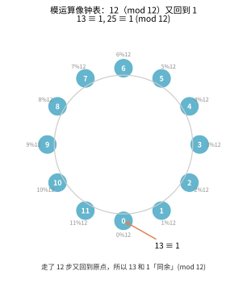
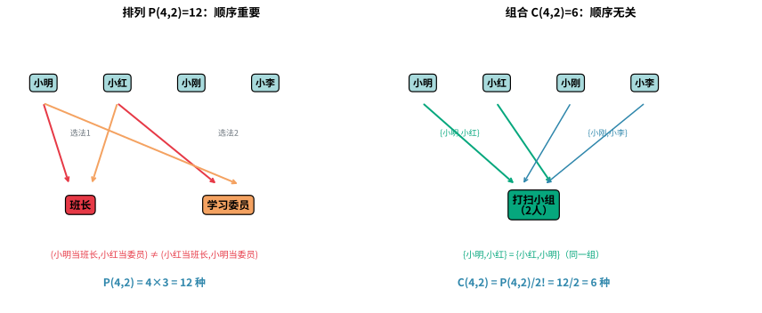
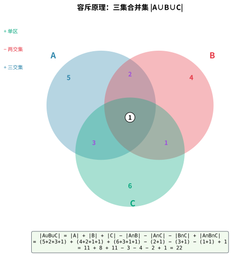
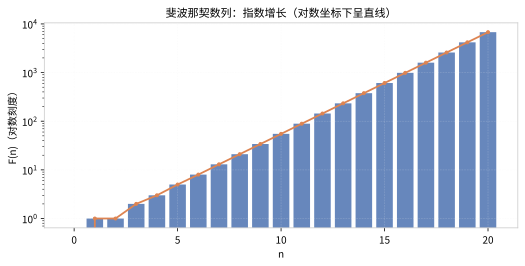
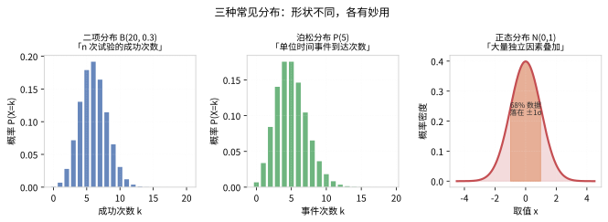
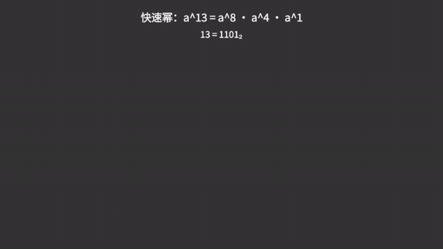
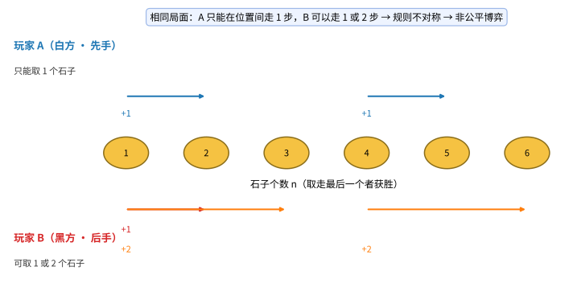
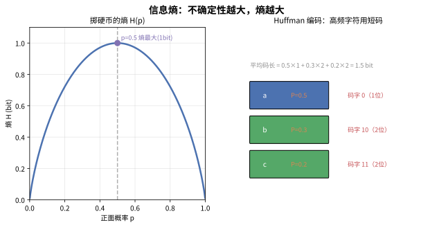

# 第 00 章：前置数学基础

> 工欲善其事，必先利其器。算法学习的道路上，数学是不可或缺的基石。本章系统梳理算法学习中所需的数学知识，按重要程度排序，帮助你建立起扎实的数学功底。

---

## 1.1 初等数学（必备）

### 1.1.1 四则运算与模运算

**基本概念**：四则运算（加、减、乘、除）是所有数学运算的基础。在算法中，我们经常需要对大数进行运算，此时模运算（取余数）尤为重要。

**模运算**是指计算两个整数相除的余数。在 Python 中用 `%` 表示。模运算在算法中广泛应用，例如：
- 防止整数溢出（结果对某个大质数取模）
- 哈希函数设计
- 循环队列的索引计算

**模运算的性质**：
- 加法：$(a + b) \bmod m = ((a \bmod m) + (b \bmod m)) \bmod m$
- 减法：$(a - b) \bmod m = ((a \bmod m) - (b \bmod m) + m) \bmod m$
- 乘法：$(a \times b) \bmod m = ((a \bmod m) \times (b \bmod m)) \bmod m$
- 除法：需要借助模逆元（乘法逆元）

**与算法学习的关联**：几乎所有算法题都涉及基本运算。快速幂算法、大数运算、哈希表等都以模运算为基础。

> 💡 **类比：模运算就像钟表** 想象一个 12 小时的钟表，13 点其实就是 1 点（13 % 12 = 1），25 点还是 1 点。模运算"绕圈"的本质，让数字永远限定在一个固定范围内——这正是防止整数溢出、设计循环队列的直觉来源。下图直观展示了"绕圈回到原点"的同余思想：



### 1.1.2 最大公约数与最小公倍数

**最大公约数（GCD）** 是指两个或多个整数共有约数中最大的一个。**最小公倍数（LCM）** 是指两个或多个整数公有的倍数中最小的一个。

欧几里得算法（辗转相除法）是求 GCD 最经典的方法，其原理是：`gcd(a, b) = gcd(b, a % b)`，直到余数为 0。

**与算法学习的关联**：GCD/LCM 是数论算法的基础，扩展欧几里得算法（ExGCD）用于求解同余方程，广泛应用于密码学、模运算等领域。

> 💡 **类比：GCD 如同"最大公共积木块"**
> 想象你有两块长方形地毯，一块 48×60，一块 60×84。你想把它们剪成相同大小的小正方形，且不浪费材料：
> - **GCD(48, 60) = 12**：最大的正方形边长是 12
> - 48÷12 = 4 块，60÷12 = 5 块，刚好剪完
> - 欧几里得算法就像"不断对折"——大数减小数，直到相等
>
> **LCM** 则是"最小公共周期"——比如两个齿轮分别 12 齿和 18 齿，转多少圈后同时回到起点？LCM(12, 18) = 36 齿，即 3 圈和 2 圈后同步。

### 1.1.3 质数与质因数分解

**质数**是指大于 1 的自然数中，除了 1 和它本身以外不再有其他因数的数。**质因数分解**是将一个合数表示为质数乘积的形式。

判断质数的方法：
- 试除法：检查 2 到 $\sqrt{n}$ 的整数是否能整除 n
- 埃拉托斯特尼筛法：批量筛选质数
- 线性筛（欧拉筛）：$O(n)$ 时间内筛出所有质数

**与算法学习的关联**：质数判定与分解是数论的核心，用于 RSA 加密、哈希函数设计、各种竞赛算法中。

> 💡 **类比：质数如同"数字的原子"**
> 想象化学中的元素周期表：
> - **质数**：就像氢、氧、碳等"基本元素"——不能再分解成更简单的成分
> - **合数**：就像水（H₂O）、二氧化碳（CO₂）等"化合物"——可以分解为基本元素
> - **质因数分解**：就像把化合物拆解成元素——12 = 2×2×3，就像 H₂O 分解成 2 个氢原子和 1 个氧原子
>
> 埃拉托斯特尼筛法就像"滤网"——把 2 的倍数、3 的倍数依次筛掉，剩下的就是质数。RSA 加密的安全性就建立在"大数分解很难"这个事实上。

### 1.1.4 排列组合

**排列**：从 n 个不同元素中取出 m（$m \leq n$）个元素，按照一定的顺序排成一列，称为排列。排列数：$P(n, m) = \frac{n!}{(n - m)!}$

**组合**：从 n 个不同元素中取出 m（$m \leq n$）个元素，不考虑顺序，称为组合。组合数：$C(n, m) = \frac{n!}{m! \times (n - m)!}$

**与算法学习的关联**：排列组合是动态规划、概率计算、组合数学的基础。LeetCode 中很多计数问题都涉及组合数计算。

> 💡 **类比：排列组合如同"选人组队"**
> 想象你是班级委员，要从 10 个同学中选 3 个人：
> - **排列 P(10,3)**：选 3 个人分别担任班长、学习委员、体育委员——顺序重要（谁当哪个职位）
>   - 10×9×8 = 720 种选法
> - **组合 C(10,3)**：只选 3 个人组成打扫小组——顺序不重要（只是选人）
>   - 720 ÷ 3! = 120 种选法（除以 3 个人的全排列）
>
> **关键区别**：排列关注"顺序"，组合不关注。密码锁是排列（1-2-3 和 3-2-1 不同），抽奖是组合（中奖号码不看顺序）。



### 1.1.5 容斥原理

**容斥原理**（Inclusion-Exclusion Principle）用于计算多个集合并集的元素个数。对于两个集合：$|A \cup B| = |A| + |B| - |A \cap B|$。对于三个集合：$|A \cup B \cup C| = |A| + |B| + |C| - |A \cap B| - |A \cap C| - |B \cap C| + |A \cap B \cap C|$。

**与算法学习的关联**：容斥原理在计数问题、概率计算、数论（莫比乌斯反演）中广泛应用。

> 💡 **类比：容斥原理如同"统计社团成员"**
> 想象学校有三个社团：数学社(A)、物理社(B)、化学社(C)。你要统计至少参加一个社团的总人数：
> - 先把三个社团的人数加起来：$|A| + |B| + |C|$
> - 但有人同时参加了两个社团，被重复计算了，要减去：$- |A\cap B| - |A\cap C| - |B\cap C|$
> -  yet 有人三个都参加了，刚才减多了，要加回来：$+ |A\cap B\cap C|$
>
> 这就像用韦恩图计数——先加所有区域，再减去重叠部分，最后加回多减的部分。在算法中，容斥原理常用于"至少满足一个条件"的计数问题。



### 1.1.6 数列

**等差数列**：相邻两项的差为常数。通项公式：$a_n = a_1 + (n - 1)d$。求和公式：$S_n = \frac{n(a_1 + a_n)}{2}$。

**等比数列**：相邻两项的比为常数。通项公式：$a_n = a_1 \times r^{n-1}$。求和公式：$S_n = \frac{a_1(1 - r^n)}{1 - r}$。

**斐波那契数列**：$F_0 = 0, F_1 = 1, F_n = F_{n-1} + F_{n-2}$。斐波那契数列在算法中极其常见，是递归、动态规划、矩阵快速幂的经典例题。

**与算法学习的关联**：数列求和用于分析算法复杂度，斐波那契数列是递推关系的经典模型。

> 💡 **直觉**：斐波那契看似缓慢增长，实际是指数级的——每走一步，前一步的"兔子数"几乎翻倍。用对数坐标画出来，它是一条笔直的上升直线，这就是"指数爆炸"的直观体现。下图展示了这种远超直觉的增长速度：



### 1.1.7 不等式

**均值不等式**：对于非负实数，算术平均数 $\geq$ 几何平均数 $\geq$ 调和平均数。

**柯西不等式**: $(a_1^2 + a_2^2 + \cdots + a_n^2)(b_1^2 + b_2^2 + \cdots + b_n^2) \geq (a_1b_1 + a_2b_2 + \cdots + a_nb_n)^2$

**与算法学习的关联**：不等式用于算法复杂度分析中的上界估计，以及某些优化问题的证明。

> 💡 **类比：均值不等式如同"固定周长的矩形"**
> 想象你有一根 20 米长的围栏，要围一个矩形区域：
> - **算术平均 ≥ 几何平均**：当长宽相等时（正方形），面积最大
>   - 长+宽 = 10（固定），长×宽 ≤ 25（当长=宽=5 时取等）
> - **应用场景**：算法中常用于证明"最优情况"——比如固定资源下如何最大化效率
>
> 柯西不等式则是"向量版的均值不等式"——两个向量的点积不超过它们长度的乘积，在机器学习中用于证明相似度的上界。

### 本节小结

| 知识点 | 核心概念 | 算法关联 | 重要程度 |
|--------|---------|----------|---------|
| 四则运算与模运算 | 基本算术、取模性质 | 快速幂、哈希表 | ⭐⭐⭐⭐⭐ |
| 最大公约数/最小公倍数 | 欧几里得算法 | 扩展欧几里得、数论 | ⭐⭐⭐⭐⭐ |
| 质数判断与分解 | 试除法、筛法 | RSA、哈希 | ⭐⭐⭐⭐ |
| 排列组合 | 加法/乘法原理 | DP、概率 | ⭐⭐⭐⭐⭐ |
| 容斥原理 | 排容公式 | 计数、莫比乌斯反演 | ⭐⭐⭐⭐ |
| 数列 | 等差/等比/斐波那契 | 递推、矩阵加速 | ⭐⭐⭐⭐ |
| 不等式 | 均值、柯西不等式 | 复杂度分析 | ⭐⭐⭐ |

---

## 1.2 离散数学（核心基础）

### 1.2.1 逻辑与布尔代数

**基本概念**：逻辑是研究推理和论证的学科，在计算机科学中体现为布尔代数。基本逻辑运算包括：

| 运算 | 符号 | 含义 | 对应位运算 |
|------|------|------|-----------|
| 与（AND） | ∧ | 两者都为真才为真 | & |
| 或（OR） | ∨ | 至少一个为真即为真 | \| |
| 非（NOT） | ¬ | 取反 | ~ |
| 异或（XOR） | ⊕ | 不同则为真 | ^ |
| 蕴含 | → | 若 p 则 q | - |

**与算法学习的关联**：逻辑是程序控制流（if-else、循环条件）的基础。位运算（特别是异或）在算法中极为高效，常用于状态压缩、加密、去重等场景。

> 💡 **类比：逻辑运算如同交通信号灯**
> 想象十字路口的信号灯系统：
> - **与(AND)**：所有方向的信号灯都为绿灯时，车辆才能通行
> - **或(OR)**：只要有一个方向的信号灯为绿灯，车辆即可通行
> - **非(NOT)**：信号灯状态反转，绿灯变红灯，红灯变绿灯
> - **异或(XOR)**：两个信号灯状态不同时才能通行（一个红一个绿）
>
> 位运算在算法中的高效性，就像用电信号直接控制电路，比软件判断快得多。

### 1.2.2 集合论

**基本概念**：集合是由确定的、互异的对象所构成的整体。基本运算包括并集（∪）、交集（∩）、差集（-）、补集、笛卡尔积（×）等。

**与算法学习的关联**：集合论是哈希表、并查集、图论的基础。状态空间搜索（BFS/DFS）本质上是在集合上进行的遍历。子集枚举是状态压缩 DP 的核心思想。

> 💡 **类比：集合运算如同收纳盒**
> 想象你有两个收纳盒 A 和 B：
> - **并集(A∪B)**：把两个盒子的物品全部倒进一个大箱子
> - **交集(A∩B)**：找出两个盒子里都有的同款物品
> - **差集(A-B)**：从 A 盒中拿走 B 盒也有的同款，剩下 A 独有的
> - **补集**：找出盒子外面、不在盒子里的所有物品
>
> 哈希表就像一个编号收纳盒——每件物品通过哈希函数算出编号，直接定位到对应格子，无需逐个翻找。

### 1.2.3 关系与函数

**关系**：集合 A 到集合 B 的关系是 A × B 的一个子集。等价关系（自反、对称、传递）和偏序关系（自反、反对称、传递）是两种重要的关系。

**函数**：函数是一种特殊的关系，每个输入对应唯一的输出。在算法中，函数的概念无处不在——算法本身就是一种输入到输出的映射。

**与算法学习的关联**：等价关系对应并查集（连通分量），偏序关系对应拓扑排序，哈希函数是哈希表的核心。

> 💡 **类比：等价关系如同"朋友圈分组"**
> 想象一个班级：
> - **等价关系**：如果 A 和 B 是好朋友（对称），A 和自己也是好朋友（自反），A 和 B 是好朋友、B 和 C 是好朋友，则 A 和 C 也是好朋友（传递）——这样形成的"朋友圈"就是等价类，对应**并查集**的连通分量。
> - **偏序关系**：任务之间有先后依赖（A 必须在 B 之前完成），这就是偏序。把偏序关系画成图，按顺序排列就是**拓扑排序**。
> - **函数**：就像自动售货机——投入一个选择（输入），必定得到唯一对应的商品（输出）。

### 1.2.4 图论基础

**基本概念**：图由顶点集 V 和边集 E 组成。图分为有向图和无向图。树是连通无环图。度（degree）指与顶点相连的边的数量。

**与算法学习的关联**：图论是计算机科学中最核心的领域之一。最短路径、最小生成树、网络流等算法都建立在图论基础之上。详见第 05 章。

> 💡 **类比：图论如同"城市交通网络"**
> 想象一张地图：
> - **顶点（节点）**：城市中的各个地点（家、学校、商场）
> - **边**：连接地点的道路
> - **有向图**：单行道（只能从一个方向到另一个方向）
> - **无向图**：双向车道（可以来回走）
> - **权重**：道路的长度或通行时间
> - **度**：一个地点连接了多少条路
>
> 最短路径算法就像导航软件——帮你找到从家到学校的最快路线；最小生成树就像铺设电缆——用最少材料连接所有房间。

### 1.2.5 计数原理

**鸽巢原理**（抽屉原理）：如果 n 个鸽子飞进 m 个鸽巢，且 n > m，那么至少有一个鸽巢中有至少两个鸽子。

**多项式系数**：将 n 个不同的物品分配到 k 个组中，每组大小分别为 $n_1, n_2, \ldots, n_k$，分配方式数为 $\frac{n!}{n_1! \times n_2! \times \cdots \times n_k!}$。

**与算法学习的关联**：鸽巢原理用于证明某些算法正确性和复杂度下界，多项式系数是组合计数的基础。

> 💡 **类比：鸽巢原理如同"抢椅子游戏"**
> 想象 5 个人抢 4 把椅子——必定至少有 2 个人抢同一把椅子。这就是鸽巢原理的直观体现。
>
> 在算法中，这个原理常用来证明"必然存在重复"：比如哈希表中放入 n 个元素到 m 个槽位（n > m），必然发生碰撞。

### 1.2.6 生成函数

**基本概念**：生成函数是序列的一种形式化表示。普通生成函数（OGF）将序列 $\{a_n\}$ 表示为幂级数 $\sum a_n x^n$。指数生成函数（EGF）表示为 $\sum a_n x^n / n!$。

**与算法学习的关联**：生成函数是组合计数和递推关系求解的强大工具，在 OI 竞赛中用于解决复杂的计数问题。

> 💡 **类比：生成函数如同"序列的身份证"**
> 想象你有一个数列：1, 1, 2, 3, 5, 8, 13...（斐波那契数列）
> - **生成函数**：把这个数列"打包"成一个函数 $F(x) = 1 + x + 2x^2 + 3x^3 + 5x^4 + 8x^5 + \cdots$
> - 每个系数 $a_n$ 就是数列的第 n 项
> - 通过研究 F(x) 的性质，可以反推出数列的规律
>
> 这就像给数列办"身份证"——把离散的数列变成连续的函数，就能用微积分等工具来分析它。在算法中，生成函数常用于解决"有多少种方案"的计数问题。

### 1.2.7 递推关系

**基本概念**：递推关系是用前项定义后项的等式。齐次线性递推的形式为 $a_n = c_1 a_{n-1} + c_2 a_{n-2} + \cdots + c_k a_{n-k}$。非齐次递推则包含额外的项。

**与算法学习的关联**：递推关系是动态规划的本质。斐波那契数列、卡特兰数等都是经典的递推关系。矩阵快速幂可用于加速线性递推的计算。

> 💡 **类比：递推关系如同"多米诺骨牌"**
> 想象一排多米诺骨牌：
> - **递推公式**：告诉你"推倒第 n 张牌需要满足什么条件"
> - **初始条件**：第一张牌怎么推倒
> - **斐波那契数列**：$F(n) = F(n-1) + F(n-2)$，就像"第 n 张牌倒下需要前两张牌都倒下"
>
> 动态规划的本质就是递推——把大问题拆成小问题，小问题的解组合成大问题的解。矩阵快速幂则是"加速版递推"——不是一张张推，而是每次推 2^k 张。

### 本节小结

| 知识点 | 核心概念 | 算法关联 | 重要程度 |
|--------|---------|----------|---------|
| 逻辑与布尔代数 | 与或非异或 | 位运算、条件判断 | ⭐⭐⭐⭐⭐ |
| 集合论 | 集合运算 | 哈希表、并查集 | ⭐⭐⭐⭐ |
| 关系与函数 | 等价/偏序关系 | 并查集、拓扑排序 | ⭐⭐⭐⭐ |
| 图论基础 | 图、树、度 | 所有图算法 | ⭐⭐⭐⭐⭐ |
| 计数原理 | 鸽巢原理 | 复杂度证明 | ⭐⭐⭐ |
| 生成函数 | 幂级数表示 | 组合计数 | ⭐⭐⭐ |
| 递推关系 | 齐次/非齐次 | DP、矩阵加速 | ⭐⭐⭐⭐⭐ |

---

## 1.3 线性代数（重要）

### 1.3.1 矩阵与向量

**基本概念**：矩阵是 m 行 n 列的数表。向量是特殊的矩阵（n 行 1 列）。矩阵乘法：$A(m\times k) \times B(k\times n) = C(m\times n)$，其中 $C[i][j] = \sum A[i][t] \times B[t][j]$。

**矩阵运算**：
- 加法：对应元素相加（要求同型矩阵）
- 数乘：每个元素乘以标量
- 乘法：行乘列（要求前矩阵列数等于后矩阵行数）
- 转置：行列互换

**与算法学习的关联**：矩阵乘法是矩阵快速幂的基础，用于加速线性递推（如斐波那契数列）。矩阵也用于图论中的邻接矩阵表示。

> 💡 **类比：矩阵如同"Excel 表格"**
> 想象一个 Excel 表格：
> - **矩阵**：就是一个有 m 行 n 列的数据表
> - **向量**：只有一列的特殊表格（单列数据）
> - **矩阵乘法**：就像"加权求和"——用一行的权重去乘以另一列的数据，得到一个新的值
> - **转置**：把表格的行和列互换（行列对调）
>
> 矩阵快速幂就像"快速翻倍"——不是一次次迭代，而是每次把步长翻倍，用 $O(\log n)$ 次运算完成 n 步递推。

### 1.3.2 行列式

**基本概念**：行列式是一个将方阵映射到标量的函数。2×2 矩阵的行列式：$det(A) = ad - bc$。行列式在几何上表示线性变换的缩放因子。

**与算法学习的关联**：行列式用于判断矩阵是否可逆（det ≠ 0）、计算特征值、求解线性方程组。在算法中较少直接使用，但矩阵树定理（生成树计数）涉及行列式计算。

> 💡 **类比：行列式如同"面积缩放因子"**
> 想象你在纸上画了一个 1×1 的正方形，然后用矩阵对它做变换：
> - **行列式 det(A)**：变换后图形的面积是原来的多少倍
> - det = 2：面积翻倍
> - det = 0：图形被"压扁"成一条线或一个点（不可逆）
> - det < 0：图形被"翻转"了（就像照镜子）
>
> 这就是为什么 det ≠ 0 时矩阵可逆——面积没被压扁，还能"变回去"。

### 1.3.3 线性方程组与高斯消元

**基本概念**：线性方程组是一组形如 $a_1 x_1 + a_2 x_2 + \cdots + a_n x_n = b$ 的方程。高斯消元法通过初等行变换将增广矩阵化为行阶梯形，从而求解方程组。

**高斯-若爾當消元法**是高斯消元的变体，进一步将矩阵化为行最简形，可以直接得到方程组的解。

**与算法学习的关联**：高斯消元在算法中用于求解线性方程组、计算矩阵的秩、求逆矩阵、电路分析等。在竞赛中，高斯消元是解决某些图论问题和概率 DP 问题的关键工具。

> 💡 **类比：高斯消元如同"解数独"**
> 想象你在解一个多元方程组，就像解数独：
> - 每个方程是一条线索
> - 高斯消元就是"逐步消元"——先用第一个方程消去其他方程中的 x₁，再用第二个方程消去 x₂...
> - 最终得到一个"阶梯形"，从最后一个方程回代，就能求出所有未知数
>
> 这就像剥洋葱——从外到里，一层层解开，直到找到核心答案。

### 1.3.4 向量空间

**基本概念**：向量空间是满足加法封闭性和数乘封闭性的向量集合。线性相关/无关是指一组向量是否能被线性表示。基是向量空间的一组线性无关的生成集。维数是基的大小。

**线性基**：在异或运算下，一组数的线性基是一组线性无关的向量，可以表示原集合的所有异或结果。线性基用于求最大异或和、第 K 大异或值等问题。

**与算法学习的关联**：线性基是 OI 竞赛中解决异或相关问题的利器，如求最大异或子集、判断某个数是否能被异或表示等。

> 💡 **类比：线性基如同"密码本"**
> 想象你有一组数字，想用它们通过异或运算生成尽可能多的不同值：
> - **线性基**：就是这组数字的"精华密码本"——用最少的数字，就能表示原集合所有可能的异或结果
> - **线性无关**：密码本里的每个数字都"不可替代"，不能由其他数字异或得到
> - **维数**：密码本的大小——决定了能生成多少种不同的值（2^维数 种）
>
> 求最大异或和时，只需从高位到低位贪心地选择——就像凑钱时优先用大面额钞票。

### 1.3.5 特征值与特征向量

**基本概念**：对于方阵 A，若存在非零向量 v 使得 $Av = \lambda v$，则 λ 是特征值，v 是特征向量。特征值在几何上表示变换在特征向量方向上的缩放因子。

**与算法学习的关联**：特征值在图论谱分析（图的拉普拉斯矩阵的特征值）、PageRank 算法、主成分分析（PCA）中有重要应用。在竞赛中，某些 DP 优化问题也涉及特征值理论。

> 💡 **类比：特征值如同"变换的主方向"**
> 想象矩阵是一个"变换机器"，把向量拉伸、旋转：
> - **特征向量**：某些特殊方向，经过变换后**方向不变**，只是被拉长或缩短
> - **特征值 λ**：特征向量被拉长的倍数
>   - λ = 2：长度翻倍
>   - λ = 0.5：长度减半
>   - λ = -1：方向反转
>
> PageRank 算法的核心：网页重要性向量是转移矩阵的"主特征向量"（对应最大特征值），经过无数次随机跳转后趋于稳定。

### 本节小结

| 知识点 | 核心概念 | 算法关联 | 重要程度 |
|--------|---------|----------|---------|
| 矩阵与向量 | 矩阵乘法、转置 | 矩阵快速幂、状态转移 | ⭐⭐⭐⭐⭐ |
| 行列式 | 方阵的标量函数 | 矩阵树定理 | ⭐⭐⭐ |
| 线性方程组/高斯消元 | 行变换求解 | 数值计算、图论 | ⭐⭐⭐⭐ |
| 向量空间 | 线性基、维数 | 异或最大值 | ⭐⭐⭐⭐ |
| 特征值与特征向量 | 谱分解 | PageRank、谱分析 | ⭐⭐⭐ |

---

## 1.4 概率论与数理统计（LeetCode 高频）

### 1.4.1 古典概型

**基本概念**：古典概型是指样本空间有限且每个基本事件等可能发生的概率模型。事件 A 的概率 $P(A) = \frac{\text{A 包含的基本事件数}}{\text{样本空间总的基本事件数}}$。

**与算法学习的关联**：古典概型是概率 DP 的基础。LeetCode 中很多随机化问题（如洗牌算法、随机数生成）都基于古典概型。

> 💡 **类比：古典概型如同"抽奖箱"**
> 想象一个不透明的箱子，里面装有 10 个球：3 个红球、7 个白球。你随机摸一个球：
> - **样本空间**：所有可能的结果 = {球1, 球2, ..., 球10}，共 10 种
> - **等可能性**：每个球被摸到的概率相同，都是 1/10
> - **事件 A（摸到红球）**：包含 3 个基本事件（红球1、红球2、红球3）
> - **P(A) = 3/10**：有利结果数 / 总结果数
>
> 这就是"数数"的概率——不需要做实验，只要数清楚"有多少种可能"和"有多少种符合条件的可能"。洗牌算法的本质就是让每种排列出现的概率相等（$1/n!$）。

### 1.4.2 条件概率与贝叶斯公式

**条件概率**：$P(A|B) = \frac{P(AB)}{P(B)}$，表示在事件 B 发生的条件下事件 A 发生的概率。

**全概率公式**：$P(A) = \sum P(A|B_i)P(B_i)$，其中 $\{B_i\}$ 是样本空间的一个划分。

**贝叶斯公式**：$P(B_i|A) = \frac{P(A|B_i)P(B_i)}{\sum P(A|B_j)P(B_j)}$，用于根据结果推断原因。

**与算法学习的关联**：贝叶斯公式是机器学习中朴素贝叶斯分类器的理论基础。在算法面试中，贝叶斯相关题目也时有出现。

> 💡 **类比：贝叶斯公式如同"医学检测"**
> 假设某种疾病的发病率是 1%（先验概率）。有一种检测试剂：
> - 患者检测阳性准确率 99%（真阳性率）
> - 健康者检测阳性误报率 5%（假阳性率）
>
> 如果你检测呈阳性，你真的患病了吗？贝叶斯公式告诉你：
> - 不能只看"准确率 99%"就恐慌
> - 还要考虑"基础发病率只有 1%"
> - 实际患病概率 ≈ 16.7%（远低于直觉）
>
> 这就是"根据结果推断原因"——从检测阳性（结果）反推真正患病（原因）的概率。

### 1.4.3 期望与方差

**数学期望**：随机变量 X 的期望 $E[X] = \sum x \cdot P(X=x)$（离散型），是随机变量取值的加权平均。

**期望的线性性质**：$E[aX + bY] = aE[X] + bE[Y]$，这是期望最重要的性质，在概率 DP 中广泛应用。

**方差**：$Var(X) = E[(X - E[X])^2] = E[X^2] - (E[X])^2$，衡量随机变量的离散程度。

**与算法学习的关联**：期望 DP 是动态规划的重要分支，如"赌徒破产问题"、"随机游走期望步数"等。随机化算法的性能分析也依赖于期望。

> 💡 **类比：期望如同"长期平均值"**
> 想象你开了一家奶茶店：
> - **期望**：如果每天卖出的杯数有波动，但长期来看平均每天卖 100 杯——这就是期望。单次结果不确定，但"长期平均"是确定的。
> - **方差**：如果有的天卖 50 杯、有的天卖 150 杯，波动很大——方差就大；如果每天都在 95~105 杯之间——方差就小。方差衡量"偏离平均的程度"。
> - **期望的线性性质**：如果你同时卖奶茶和咖啡，总收入的期望 = 奶茶期望 + 咖啡期望，不管两者是否相关。这个性质让复杂问题可以"分而治之"。

### 1.4.4 常见分布

| 分布 | 含义 | 概率质量/密度函数 | 期望 | 方差 |
|------|------|-----------------|------|------|
| 二项分布 $B(n, p)$ | n 次独立伯努利试验的成功次数 | $C(n, k)p^k(1-p)^{n-k}$ | $np$ | $np(1-p)$ |
| 泊松分布 $P(\lambda)$ | 单位时间内随机事件发生次数 | $e^{-\lambda}\lambda^k/k!$ | $\lambda$ | $\lambda$ |
| 均匀分布 $U(a, b)$ | 区间内等可能取值 | $\frac{1}{b-a}$ | $\frac{a+b}{2}$ | $\frac{(b-a)^2}{12}$ |

**与算法学习的关联**：二项分布用于分析随机化算法（如随机快速排序的复杂度），泊松分布用于模拟事件到达（如生产消费者模型）。

> 💡 **直觉理解三种分布**：把概率分布想成"直方图"——
> - **二项分布**：抛 20 次硬币，看"正面朝上几次"最可能——形状像一座小山，中间最鼓。
> - **泊松分布**：统计"餐厅 1 小时进来几位客人"，通常集中在平均人数附近。
> - **正态分布**：大量微小独立因素叠加的结果（如全班身高），呈对称钟形，绝大多数数据集中在均值附近。
>
> 下图把三种分布画在一起，帮你一眼看出它们的差别：



### 1.4.5 马尔可夫链

**基本概念**：马尔可夫链是满足马尔可夫性质（未来只依赖于当前状态，与过去无关）的随机过程。状态转移矩阵 P 描述了从状态 i 到状态 j 的转移概率。

**稳态分布**：经过足够多的步数后，状态分布趋于稳定，满足 $\pi = \pi P$。

**与算法学习的关联**：马尔可夫链是概率 DP 的理论基础，广泛应用于强化学习（MDP）、随机算法分析、PageRank 算法等。

> 💡 **类比：马尔可夫链如同"天气预报"**
> 想象天气预报：
> - 今天下雨，明天有 70% 概率继续下雨，30% 概率转晴
> - 今天晴天，明天有 80% 概率继续晴天，20% 概率下雨
>
> **关键特性**：明天的天气**只取决于今天**，与昨天、前天无关——这就是"无记忆性"（马尔可夫性质）。
>
> **稳态分布**：经过足够多天后，下雨和晴天的比例会趋于稳定（比如 40% 下雨、60% 晴天），这就是稳态。PageRank 算法就是利用这个思想——网页的重要性经过无数次"随机跳转"后趋于稳定。

### 本节小结

| 知识点 | 核心概念 | 算法关联 | 重要程度 |
|--------|---------|----------|---------|
| 古典概型 | 等可能事件 | 概率 DP、洗牌 | ⭐⭐⭐⭐ |
| 条件概率与贝叶斯 | 全概率、贝叶斯公式 | 机器学习 | ⭐⭐⭐ |
| 期望与方差 | 线性性 | 期望 DP、随机化算法 | ⭐⭐⭐⭐⭐ |
| 常见分布 | 二项/泊松/均匀 | 算法分析 | ⭐⭐⭐ |
| 马尔可夫链 | 状态转移、稳态 | 概率 DP、强化学习 | ⭐⭐⭐⭐ |

---

## 1.5 数论基础（OI 竞赛核心）

### 1.5.1 同余理论

**基本概念**：同余是指两个整数除以同一个正整数余数相同。记作 $a \equiv b \pmod m$。同余类是指模 m 同余的整数集合，剩余系是模 m 的所有同余类的代表元集合。

**同余的性质**：
- 若 $a \equiv b \pmod m$，$c \equiv d \pmod m$，则 $a + c \equiv b + d \pmod m$，$a \times c \equiv b \times d \pmod m$
- 同余关系是等价关系（自反、对称、传递）

**与算法学习的关联**：同余理论是数论的基础，直接应用于哈希函数设计、RSA 加密、大数运算等所有需要模运算的场景。

> 💡 **类比：同余如同"钟表算术"**
> 想象一个 12 小时制的钟表：
> - 13 点和 1 点"同余"（13 ≡ 1 mod 12）
> - 25 点和 1 点也"同余"（25 ≡ 1 mod 12）
> - 所有相差 12 的倍数的时间都"同余"
>
> 同余类就像把无限多个整数"折叠"到有限的格子里——模 12 就有 12 个格子（0~11）。这就是为什么模运算能防止溢出：数字永远在固定范围内"绕圈"。

### 1.5.2 欧拉定理与费马小定理

**欧拉函数** $\varphi(n)$：小于等于 n 且与 n 互质的正整数的个数。若 n 的质因数分解为 $n = \prod p_i^{e_i}$，则 $\varphi(n) = n\prod(1 - 1/p_i)$。

**费马小定理**：若 p 是质数，a 不被 p 整除，则 $a^{p-1} \equiv 1 \pmod p$。

**欧拉定理**：若 $\gcd(a, n) = 1$，则 $a^{\varphi(n)} \equiv 1 \pmod n$。这是费马小定理的推广。

**快速幂（Fast Exponentiation）**：计算 $a^b \bmod m$ 时，把指数 $b$ 写成二进制，只需 $O(\log b)$ 次乘法。核心是"反复平方"：每次把底数平方，同时根据指数二进制位决定是否乘入结果。

> 🎬 **可视化演示**：快速幂 $a^{13}$（13 = 1101₂，分解为 $a^8 \cdot a^4 \cdot a^1$，反复平方）



**与算法学习的关联**：费马小定理用于快速幂中的模运算降幂，也是 Miller-Rabin 素性测试的基础。欧拉函数用于 RSA 加密算法。

> 💡 **类比：欧拉函数如同"互质朋友圈"**
> 想象数字 n 是一个社区：
> - **欧拉函数 φ(n)**：社区里有多少户人家和 n "互质"（没有共同因子）
> - 比如 n=12，与 12 互质的数有 {1, 5, 7, 11}，所以 φ(12) = 4
> - 质数 p 的"互质朋友圈"最大：φ(p) = p-1（除了 p 本身，其他都互质）
>
> **费马小定理**就像"循环魔法"：aᵖ⁻¹ ≡ 1 (mod p) 意味着 a 的幂次在模 p 下会"绕圈"回到 1，这个圈的长度整除 p-1。

### 1.5.3 中国剩余定理（CRT）

**基本概念**：中国剩余定理（孙子定理）用于求解一元线性同余方程组。若模数 $m_1, m_2, \ldots, m_k$ 两两互质，则方程组：
- $x \equiv a_1 \pmod{m_1}$
- $x \equiv a_2 \pmod{m_2}$
- ...
- $x \equiv a_k \pmod{m_k}$

在模 $M = m_1 m_2 \cdots m_k$ 下有唯一解，解为 $x = \sum a_i M_i y_i \pmod M$，其中 $M_i = M/m_i$，$y_i$ 是 $M_i$ 在模 $m_i$ 下的逆元。

**与算法学习的关联**：CRT 在算法中用于大整数运算（将大数分解为多个小模数运算后合并）、RSA 加速解密等。

> 💡 **类比：中国剩余定理如同"韩信点兵"**
> 传说韩信点兵时从不直接数人数，而是：
> - 3 人一排，剩 2 人
> - 5 人一排，剩 3 人
> - 7 人一排，剩 2 人
>
> 中国剩余定理告诉我们：只要知道一个数在多个"小钟表"（不同模数）上的读数，就能唯一确定这个数在"大钟表"（模数之积）上的值。
>
> 这就像用多个小齿轮的转动位置来编码一个大齿轮的位置——把大数运算拆成多个小数运算，最后再合并结果。

### 1.5.4 卢卡斯定理

**基本概念**：卢卡斯定理用于计算大组合数 $C(n, m)$ 对质数 p 取模。将 n 和 m 表示为 p 进制数：$n = n_k p^k + \cdots + n_1 p + n_0$，$m = m_k p^k + \cdots + m_1 p + m_0$，则 $C(n, m) \equiv \prod C(n_i, m_i) \pmod p$。

**与算法学习的关联**：卢卡斯定理在竞赛中用于计算 n 和 m 很大但模数 p 较小的组合数取模问题。

> 💡 **类比：卢卡斯定理如同"分进制计算"**
> 想象你要计算 C(100, 50) mod 7，直接算会溢出。卢卡斯定理告诉你：
> - 把 100 和 50 都转换成 7 进制：100 = 202₇，50 = 101₇
> - 然后逐位计算小组合数：C(2,1) × C(0,0) × C(2,1) mod 7
> - 就像用算盘计算——把大数拆成多个小数，分别计算再合并
>
> 这是"分而治之"在数论中的完美体现。

### 1.5.5 莫比乌斯反演

**莫比乌斯函数** μ(n)：
- 若 n = 1，则 $\mu(1) = 1$
- 若 n 有平方因子，则 $\mu(n) = 0$
- 若 n 有 k 个不同的质因子，则 $\mu(n) = (-1)^k$

**莫比乌斯反演公式**：若 $F(n) = \sum_{d \mid n} f(d)$，则 $f(n) = \sum_{d \mid n} \mu(d)F(n/d)$。这是数论中最重要的反演公式之一。

**狄利克雷卷积**：$(f * g)(n) = \sum_{d \mid n} f(d) g(n/d)$。莫比乌斯反演本质上是狄利克雷卷积下的逆运算。

**与算法学习的关联**：莫比乌斯反演是 OI 竞赛高级数论的核心，用于解决 gcd 相关计数、互质对计数等问题，常配合杜教筛使用。

> 💡 **类比：莫比乌斯反演如同"容斥原理的数论版"**
> 想象你要统计"恰好有 k 个质因数的数"，但直接算很难。莫比乌斯反演告诉你：
> - 先算"至少有 k 个质因数的数"（容易）
> - 然后用莫比乌斯函数 μ 作为"权重"进行容斥
> - μ(n) 就像一个"修正系数"：
>   - μ=1：加上这个贡献
>   - μ=-1：减去这个贡献
>   - μ=0：忽略（有平方因子）
>
> 这就像统计"恰好喜欢 3 门课的学生"——先算"至少喜欢 3 门"的，再减去"喜欢 4 门、5 门..."的重复部分。

### 1.5.6 二次剩余

**基本概念**：二次剩余是指模 p 下能够开平方的数。即存在 x 使得 $x^2 \equiv a \pmod p$，则称 a 是模 p 的二次剩余。Cipolla 算法可以在 $O(\log^2 p)$ 时间内求解二次剩余。

**与算法学习的关联**：二次剩余在竞赛中用于解决某些数论方程问题，也是某些加密算法的基础。

> 💡 **类比：二次剩余如同"模运算下的开方"**
> 想象在模 p 的世界里做"开平方"：
> - 普通开方：√4 = 2，因为 2² = 4
> - 模 p 开方：x² ≡ 4 (mod 7)，解是 x = 2 或 x = 5（因为 2²=4, 5²=25≡4 mod 7）
> - **二次剩余**：如果存在 x 使得 x² ≡ a (mod p)，a 就是"可以开方的数"
> - **二次非剩余**：如果找不到这样的 x，a 就是"不能开方的数"
>
> 这就像在钟表上做运算——13 点和 1 点"同余"，某些数字在模运算下"等价"。二次剩余理论研究的就是"哪些数字在模 p 下有平方根"。

### 1.5.7 原根与离散对数

**基本概念**：原根是模 n 下阶为 $\varphi(n)$ 的元素，即原根的幂可以生成所有与 n 互质的剩余类。离散对数是指已知 g 和 $g^x \equiv a \pmod p$，求 x。

**大步小步算法（BSGS）**：在 $O(\sqrt{p})$ 时间内求解离散对数问题。

**与算法学习的关联**：原根和离散对数是密码学中 Diffie-Hellman 密钥交换和 ElGamal 加密的基础。BSGS 算法是竞赛中的常见算法。

> 💡 **类比：原根如同"颜色的三原色"**
> 想象三原色（红、绿、蓝）可以混合出所有颜色：
> - **原根 g**：就像"数字世界的三原色"——g 的幂次可以生成所有与 n 互质的数
> - 比如模 7 的原根是 3：3¹=3, 3²=2, 3³=6, 3⁴=4, 3⁵=5, 3⁶=1——生成了 {1,2,3,4,5,6} 全部
> - **离散对数**：已知 g=3 和 gˣ ≡ 6 (mod 7)，求 x——就像知道混合色，反推配比
> - **BSGS 算法**：暴力搜索 O(p) 太慢，"大步小步"把搜索拆成 √p × √p，就像查字典先翻到对应页（大步），再逐行找（小步）

### 本节小结

| 知识点 | 核心概念 | 算法关联 | 重要程度 |
|--------|---------|----------|---------|
| 同余理论 | 同余类、剩余系 | 哈希、加密 | ⭐⭐⭐⭐⭐ |
| 欧拉定理/费马小定理 | 欧拉函数、降幂 | RSA、Miller-Rabin | ⭐⭐⭐⭐⭐ |
| 中国剩余定理（CRT） | 同余方程组 | 大整数运算 | ⭐⭐⭐⭐ |
| 卢卡斯定理 | 大组合数取模 | 组合计数 | ⭐⭐⭐⭐ |
| 莫比乌斯反演 | 容斥、狄利克雷卷积 | 竞赛高级数论 | ⭐⭐⭐⭐⭐ |
| 二次剩余 | 模平方根 | 数论方程 | ⭐⭐⭐ |
| 原根与离散对数 | 循环群、BSGS | 密码学 | ⭐⭐⭐⭐ |

---

## 1.6 数学分析（了解即可）

### 1.6.1 极限、导数与积分

**极限**：描述函数在自变量趋近某个值时的变化趋势。在算法分析中，极限用于描述渐近行为。

**导数**：描述函数在某一点的瞬时变化率。在算法中，导数用于梯度下降等优化算法，也是凸函数分析的基础。

**积分**：导数的逆运算，表示曲线下的面积。在算法中，积分用于数值计算和某些概率问题的求解。

**与算法学习的关联**：极限是渐近分析（大 O 符号）的数学基础。导数和积分在机器学习优化算法（梯度下降）中至关重要。

> 💡 **类比：导数如同"速度表"**
> 想象你在开车：
> - **导数**：就像车速表——告诉你"此刻"的速度（瞬时变化率）
> - 位置函数 s(t) 的导数 s'(t) = 速度 v(t)
> - 速度的导数 v'(t) = 加速度 a(t)
> - **梯度下降**：就像下山——导数告诉你"哪边最陡"，沿着反方向走就能最快到达谷底
>
> 在算法中，导数帮助我们找到函数的"最低点"（最优解），就像在山脉中找到山谷。

### 1.6.2 泰勒展开

**基本概念**：泰勒展开是用多项式逼近函数的方法。$f(x) = \sum f^{(n)}(a)(x-a)^n / n!$。麦克劳林展开是 a = 0 时的特例。

**常见展开**：
- $e^x = 1 + x + \frac{x^2}{2!} + \frac{x^3}{3!} + \cdots$
- $\sin(x) = x - \frac{x^3}{3!} + \frac{x^5}{5!} - \cdots$
- $\ln(1+x) = x - \frac{x^2}{2} + \frac{x^3}{3} - \cdots$（$|x| < 1$）

**与算法学习的关联**：泰勒展开用于数值计算中的函数逼近，也是某些算法优化（如牛顿法求根）的理论基础。

> 💡 **类比：泰勒展开如同"用直线逼近曲线"**
> 想象你要画一条弯曲的曲线，但只会画直线：
> - **一阶泰勒**：用切线（直线）近似曲线——在切点附近很准，远了就偏
> - **二阶泰勒**：用抛物线近似——更贴合曲线
> - **n 阶泰勒**：用 n 次多项式近似——阶数越高，越接近原函数
>
> 这就像用多边形逼近圆形——边数越多，越像圆。泰勒展开让复杂的函数（如 sin、exp）变成简单的多项式，计算机就能快速计算。

### 1.6.3 傅里叶变换

**基本概念**：傅里叶变换将信号从时域（时间域）变换到频域（频率域）。离散傅里叶变换（DFT）将离散信号从时域变换到频域。

**快速傅里叶变换（FFT）**：利用分治思想将 DFT 的计算复杂度从 $O(n^2)$ 降低到 $O(n \log n)$。FFT 是计算机科学中最优雅的算法之一。

**与算法学习的关联**：FFT 在算法竞赛中用于大整数乘法（将 n 位整数乘法从 $O(n^2)$ 优化到 $O(n \log n)$）和多项式乘法。FFT 也是信号处理、图像压缩等领域的核心算法。

> 💡 **类比：傅里叶变换如同"音乐频谱分析"**
> 想象你在听一首交响乐：
> - **时域**：你听到的是随时间变化的声波（混合的声音）
> - **频域**：频谱分析仪显示的是各个乐器的频率（小提琴 440Hz、大提琴 220Hz...）
> - **傅里叶变换**：把"混合声音"分解成"各个频率成分"——就像把一道白光分解成彩虹
> - **FFT**：快速版本的分解算法——不逐个频率分析，而是用分治策略（奇偶分离）加速
>
> 在算法中，FFT 让多项式乘法从 $O(n^2)$ 降到 $O(n \log n)$——就像把"逐个相乘"变成"快速卷积"。

### 1.6.4 凸函数与凸优化

**基本概念**：凸函数是指函数图像上任意两点间的线段位于函数图像上方的函数。凸优化的目标是在凸集上最小化凸函数。

**梯度下降**：通过沿梯度反方向迭代更新来最小化目标函数，是机器学习中最常用的优化方法。

**与算法学习的关联**：凸优化是机器学习的基础理论，梯度下降是训练神经网络的核心算法。在算法竞赛中，凸包优化（斜率优化 DP）也利用了凸性。

> 💡 **类比：凸函数如同"碗状地形"**
> 想象一个碗：
> - **凸函数**：碗的形状——任意两点的连线都在碗的上方（或碗壁上）
> - **局部最优 = 全局最优**：碗底只有一个最低点，不会掉进"假谷底"
> - **梯度下降**：就像在碗里放一个小球——球会沿着最陡的方向滚到谷底
>
> 这就是为什么凸优化"好做"——没有多个局部最优的陷阱，沿着梯度走一定能找到全局最优。非凸函数就像崎岖的山脉，有很多"假谷底"（局部最优），容易迷路。

### 本节小结

| 知识点 | 核心概念 | 算法关联 | 重要程度 |
|--------|---------|----------|---------|
| 极限、导数、积分 | 微积分基础 | 渐近分析、优化 | ⭐⭐⭐ |
| 泰勒展开 | 多项式逼近 | 数值计算 | ⭐⭐ |
| 傅里叶变换 | 时频域变换 | FFT、多项式乘法 | ⭐⭐⭐⭐ |
| 凸函数与凸优化 | 凸性、梯度下降 | 机器学习、斜率优化 | ⭐⭐⭐ |

---

## 1.7 博弈论（竞赛重要）

### 1.7.1 Nim 博弈

**基本概念**：Nim 博弈是最经典的公平组合游戏。有若干堆石子，每堆有若干个石子，两名玩家轮流从任意一堆中取走任意数量的石子（至少取一个，可以全取走），取走最后一个石子者获胜。

**必胜策略**：将所有堆的石子数进行异或运算（XOR），若结果非零，则先手必胜；若结果为零，则后手必胜。这个结论称为 Nim 定理。

**与算法学习的关联**：Nim 博弈是博弈论中最基础也最重要的模型，所有公平组合游戏都可以通过 SG 函数转化为 Nim 博弈。

> 💡 **类比：Nim 博弈如同"二进制平衡"**
> 想象你面前有几堆石子，每堆的数量用二进制表示：
> - 堆 1: 3 = 011₂
> - 堆 2: 4 = 100₂  
> - 堆 3: 5 = 101₂
>
> 把每一列的二进制位加起来：
> - 第 0 位（最右）：1+0+1 = 2（偶数）
> - 第 1 位：1+0+0 = 1（奇数）
> - 第 2 位：0+1+1 = 2（偶数）
>
> **关键洞察**：如果每一列的和都是偶数（异或和为 0），后手必胜；否则先手必胜。先手只需要从某一堆取走石子，让所有列的和都变成偶数，就能锁定胜局。
>
> 这就像玩天平——谁能让天平始终保持平衡（异或和为 0），谁就赢了。

### 1.7.2 SG 函数（Sprague-Grundy）

**基本概念**：SG 函数将任意公平组合游戏的状态映射到一个非负整数。$SG(x) = mex\{SG(y) \mid y \text{ 是 } x \text{ 的后继状态}\}$，其中 mex 表示最小排除值（最小的不属于该集合的非负整数）。

**Sprague-Grundy 定理**：任意公平组合游戏等价于一个 Nim 堆，堆的大小等于该状态的 SG 值。多个独立子游戏的组合，其 SG 值等于各子游戏 SG 值的异或和。

**与算法学习的关联**：SG 函数是解决组合博弈问题的通用方法，可以将任意博弈问题转化为 Nim 博弈求解。

> 💡 **类比：SG 函数如同"游戏难度评分"**
> 想象给每个游戏局面打一个"难度分"：
> - **必败态**（SG=0）：无论怎么走，都留给对手一个好局面——就像掉进陷阱，怎么挣扎都是死。
> - **SG 值越大**：意味着你有越多"好选择"可以走，局面越有利。
> - **mex 运算**：就像"找最小空缺"——如果后继状态的 SG 值是 {0, 1, 3}，那 mex 就是 2（最小缺失的非负整数）。
>
> **Sprague-Grundy 定理的精髓**：任何复杂的博弈游戏，都可以"翻译"成 Nim 堆！多个独立子游戏组合时，只需把各子游戏的 SG 值异或起来——就像把多个小天平合并成一个大天平。

### 1.7.3 反常 Nim（Anti-Nim / Misère Nim）

**基本概念**：反常 Nim 是 Nim 博弈的变体，规则与普通 Nim 几乎相同，唯一区别是**取走最后一个石子的人输**（而非赢）。这种"最后行动者输"的规则称为 Misère 规则。

**必胜策略（反常 Nim 定理）**：在反常 Nim 中，先手必胜当且仅当满足以下条件之一：
1. **所有堆都是 1 且堆数为偶数**（此时每轮必须取走一堆，偶数堆意味着后手取走最后一个，后手输）
2. **存在至少一堆 > 1 且异或和 ≠ 0**（先手可以像普通 Nim 一样控制异或和，同时掌握何时进入"全 1 局面"的主动权）

反之，先手必败当且仅当：
- 所有堆都是 1 且堆数为奇数，或
- 存在至少一堆 > 1 且异或和 = 0

**直觉理解**：当所有堆都是 1 时，游戏退化为简单的计数——堆数的奇偶性直接决定胜负。当存在大于 1 的堆时，关键在于"谁控制进入全 1 局面的时机"。异或和 ≠ 0 的一方可以通过策略性取子，迫使对手在全 1 局面中面对奇数堆（即必败态）。

**与算法学习的关联**：反常 Nim 是竞赛中常见的博弈变体，展示了"最后操作者输"（Misère 规则）对策略的影响。理解反常 Nim 有助于处理更复杂的博弈问题。

> 💡 **类比：反常 Nim 如同"抢输游戏"**
> 想象你和朋友玩一个游戏：桌上有几堆糖果，每次可以从一堆取任意颗，**谁取走最后一颗谁输**：
> - 如果每堆都只有 1 颗（比如 3 堆各 1 颗），那就是简单的轮流取——奇数堆时先手必输（因为最后那颗一定轮到先手）
> - 但如果有一堆有 5 颗，高手会通过策略性取子，**控制何时把局面变成"全 1 且奇数堆"**，迫使对手面对必败态
>
> 与普通 Nim 的区别：普通 Nim 是"抢最后一颗"，反常 Nim 是"躲最后一颗"。策略从"保持平衡"变成了"控制何时打破平衡"。

```python
def anti_nim_first_win(piles):
    """
    反常 Nim 判定：取最后一个石子的人输
    piles: 各堆石子数列表
    返回 True 表示先手必胜，False 表示后手必胜
    
    定理：先手必胜 ⟺
        (所有堆都是 1 且堆数为偶数) 或
        (存在至少一堆 > 1 且异或和 ≠ 0)
    """
    xor_sum = 0
    all_ones = True
    for p in piles:
        xor_sum ^= p
        if p > 1:
            all_ones = False
    
    if all_ones:
        # 全 1 局面：偶数堆则先手胜（后手被迫取最后一个）
        return len(piles) % 2 == 0
    else:
        # 存在大堆：异或和非零则先手胜
        return xor_sum != 0


# ========== 暴力验证（SG 函数） ==========
from functools import lru_cache

@lru_cache(maxsize=None)
def anti_nim_sg(state):
    """
    暴力计算反常 Nim 的 SG 值，用于验证定理
    state: 排序后的元组，表示各堆石子数
    返回: 0 表示必败（后手胜），非 0 表示必胜（先手胜）
    """
    # 终态：所有石子取完，上一个人取了最后一个，所以上一个人输
    # 当前玩家面对空局面 = 当前玩家赢（对手取了最后一个）
    if all(s == 0 for s in state):
        return 1  # 非零 = 必胜
    
    reachable = set()
    for i in range(len(state)):
        if state[i] > 0:
            for take in range(1, state[i] + 1):
                new_state = list(state)
                new_state[i] -= take
                new_state.sort()
                reachable.add(anti_nim_sg(tuple(new_state)))
    
    # mex 运算
    g = 0
    while g in reachable:
        g += 1
    return g


# ========== 测试 ==========
test_cases = [
    ([1, 1], True),        # 全 1，偶数堆 → 先手胜
    ([1, 1, 1], False),    # 全 1，奇数堆 → 先手败
    ([1, 2, 3], False),    # 有大堆，xor = 0 → 先手败
    ([1, 1, 2], True),     # 有大堆，xor = 2 → 先手胜
    ([2, 2], False),       # 有大堆，xor = 0 → 先手败
    ([3, 4, 5], True),     # 有大堆，xor = 2 → 先手胜
]

print("反常 Nim 定理验证：")
for piles, expected in test_cases:
    result = anti_nim_first_win(piles)
    status = "✓" if result == expected else "✗"
    print(f"  堆 {piles}: 先手{'胜' if result else '败'} {status}")

# SG 函数验证小规模局面
print("\nSG 函数验证（与定理对比）：")
for state in [(1, 1), (1, 1, 1), (1, 2, 3), (1, 1, 2), (2, 2)]:
    sg = anti_nim_sg(state)
    theorem = anti_nim_first_win(list(state))
    print(f"  状态 {list(state)}: SG={sg} (必胜={sg != 0}), "
          f"定理={theorem}, 一致={sg != 0 == theorem}")
```

输出：
```
反常 Nim 定理验证：
  堆 [1, 1]: 先手胜 ✓
  堆 [1, 1, 1]: 先手败 ✓
  堆 [1, 2, 3]: 先手败 ✓
  堆 [1, 1, 2]: 先手胜 ✓
  堆 [2, 2]: 先手败 ✓
  堆 [3, 4, 5]: 先手胜 ✓

SG 函数验证（与定理对比）：
  状态 [1, 1]: SG=非0 (必胜=True), 定理=True, 一致=True
  状态 [1, 1, 1]: SG=0 (必胜=False), 定理=False, 一致=True
  状态 [1, 2, 3]: SG=0 (必胜=False), 定理=False, 一致=True
  状态 [1, 1, 2]: SG=非0 (必胜=True), 定理=True, 一致=True
  状态 [2, 2]: SG=0 (必胜=False), 定理=False, 一致=True
```

### 1.7.4 巴什博弈（Bash Game）

**基本概念**：有一堆石子，总数为 n，两名玩家轮流取石子，每次至少取 1 个，最多取 m 个，取走最后一个者获胜。

**必胜策略**：若 $n \bmod (m + 1) \neq 0$，则先手必胜；否则后手必胜。策略是每次取走石子使剩余石子数保持为 $(m + 1)$ 的倍数。

**与算法学习的关联**：巴什博弈是最简单的博弈模型，适合作为博弈论入门。

> 💡 **类比：巴什博弈如同"抢报数游戏"**
> 想象你和朋友玩一个游戏：从 1 开始轮流报数，每次可以报 1~3 个数，谁先报到 30 谁赢。
> - **关键洞察**：如果你能报到 26，对方最多报到 29，你就能报到 30
> - **倒推策略**：要抢到 26，就要抢到 22；要抢到 22，就要抢到 18... 一直倒推到 2
> - **必胜条件**：30 % 4 = 2，所以先手报 2，然后每次和对方凑 4（对方报 1 你报 3，对方报 2 你报 2）
>
> 这就是巴什博弈的核心：**控制节奏**——让剩余数量始终保持为 (m+1) 的倍数，对手就永远处于被动。

### 1.7.5 威佐夫博弈（Wythoff Game）

**基本概念**：有两堆石子，两名玩家轮流取石子，可以取走任意一堆中的任意数量石子，或者从两堆中取走相同数量的石子，取走最后一个者获胜。

**必胜策略**：设两堆石子数为 $(a, b)$ 且 $a \leq b$，令 $k = b - a$，若 $a = \lfloor k \times \varphi \rfloor$（其中 $\varphi = \frac{1 + \sqrt{5}}{2}$ 为黄金分割比），则后手必胜，否则先手必胜。

**与算法学习的关联**：威佐夫博弈展示了博弈论与黄金分割这一数学常数的深刻联系。

> 💡 **类比：威佐夫博弈如同"国际象棋中的皇后"**
> 想象棋盘上有一个皇后，位于坐标 (a, b)：
> - 每次可以向左移动（减少一堆）、向下移动（减少另一堆）、或沿对角线移动（两堆同时减少相同数量）
> - **目标**：谁把皇后移到 (0, 0) 谁赢
> - **必败位置**：(0,0), (1,2), (3,5), (4,7), (6,10)... 这些位置的差值与较小值的比恰好趋近黄金分割 φ
>
> 这就像数学中的"安全区"——站在这些位置的人必输，因为无论怎么走，对手都能把你拉回另一个必败位置。黄金分割在这里出现，揭示了博弈与美学的深刻联系。

### 1.7.6 斐波那契博弈

**基本概念**：有一堆石子，总数为 n，两名玩家轮流取石子，第一次可以取任意多个（但不能取完），之后每次取的石子数不能超过上一次取的石子数的两倍，取走最后一个者获胜。

**必胜策略**：若 n 是斐波那契数，则后手必胜；否则先手必胜。策略是将 n 分解为不相邻的斐波那契数之和，取走最小的斐波那契数对应的石子数。

> 💡 **类比：斐波那契博弈如同"兔子繁殖"**
> 想象一堆石子，每次取的数量受限于上次取的两倍：
> - 这就像兔子繁殖——每对兔子每月生一对，新生的兔子下个月才能生育
> - **齐肯多夫定理**：任何正整数都可以唯一分解为不相邻的斐波那契数之和
> - **策略**：把 n 分解后，取走最小的那个斐波那契数，让对手处于"必败态"
>
> 这就像拆礼物——把大礼物拆成几个小礼物，每次只能拆最小的那个。斐波那契数的"黄金比例"特性让这个游戏充满了数学美感。

### 1.7.7 公平组合游戏（ICG）

**基本概念**：公平组合游戏满足以下条件：两名玩家轮流操作、双方操作完全相同、无随机因素、有限步内结束、无平局（最后操作者获胜）。Nim 博弈、巴什博弈、威佐夫博弈都属于 ICG。

**与算法学习的关联**：ICG 可以通过 SG 函数统一处理，是博弈 DP 的理论基础。

> 💡 **类比：公平组合游戏如同"下棋"**
> 想象任何棋类游戏（围棋、象棋、五子棋）：
> - **两名玩家轮流操作**：你走一步，我走一步
> - **双方操作完全相同**：规则对双方一样（不像某些游戏有"先手优势"）
> - **无随机因素**：没有掷骰子，完全靠策略
> - **有限步内结束**：游戏不会无限进行
> - **无平局**：必有胜负
>
> 这就是"公平组合游戏"——所有信息对双方公开，没有运气成分，纯粹比拼策略。SG 函数的伟大之处在于：**任何 ICG 都可以转化为 Nim 博弈**，就像把所有棋类游戏都"翻译"成同一种语言来分析。

### 1.7.8 非公平组合游戏（Unfair Combinatorial Game）

**基本概念**：非公平组合游戏与 ICG 的唯一区别在于——两名玩家的**操作集合不同**，规则不对称。国际象棋就是最典型的例子：白方先走、黑方后走，双方棋子不同、行棋限制不同，因此"公平组合游戏"的理论（如 SG 函数）不能直接套用。

**与算法学习的关联**：现实中的棋类几乎都是非公平游戏，非公平组合游戏是组合博弈论中更普遍也更复杂的模型，也是理解"策略窃取""冷热游戏"等深刻思想的入口。

> 💡 **类比：非公平组合游戏如同"象棋黑白双方"**
> 想象一局国际象棋：
> - 白方先走，黑方后走，**双方可走的棋子与走法完全不同**
> - 同样的棋盘局面，轮到白方走与轮到黑方走，结果可能截然不同
> - 这不像 Nim 那样"规则对称"，而是"规则不对称"——谁能赢，取决于规则给了谁更多主动权
>
> 再想想"田忌赛马"：上对上、中对中、下对下则输，但**换一种对阵顺序**（下对上、上对中、中对下）就能以弱胜强。田忌赛马的本质就是一种"非公平"的博弈——双方出场的马匹实力本就不同，孙膑的策略就是利用"规则不对称"扬长避短。非公平博弈的乐趣与难度，正在于这种"不对称"。

**与公平组合游戏（ICG）的对比**：

| 维度 | 公平组合游戏（ICG） | 非公平组合游戏 |
|------|---------------------|----------------|
| 双方操作集合 | 完全相同 | 不同（不对称） |
| 先后手角色 | 对称，可互换 | 不对称，不能互换 |
| SG 函数 | 可直接套用 | 通常不适用 |
| 判定方法 | XOR / SG 定理 | 逐局面 DP 或着色分类 |
| 典型例子 | Nim、巴什、威佐夫 | 国际象棋、黑白棋、田忌赛马 |

**关键概念**：
- **策略窃取（Strategy Stealing）**：一种证明"某一方不会输"的技巧。先假设后手有必胜策略，先手"偷走"这个策略（先随便走一步，再假装自己是后手按该策略应对），从而推出矛盾，说明先手至少不败。它常用于证明某类对称/非对称游戏中"先手必胜或和棋"，但通常**不能构造出具体走法**。
- **类 Nim（Nim-like / Subtraction Games）**：很多非公平游戏可抽象为"双方从同一个集合中取子，但各自可取数量受限且限制不同"，这类游戏可用 DP 逐状态判定胜负。
- **冷热游戏（Cold & Hot Games）与超现实数（Surreal Numbers）**：Conway 等在 *On Numbers and Games*（ONAG）中提出把游戏局面看成一个数或"冷/热"程度。**冷游戏**（如某些僵持局面）双方都不愿先动，类似"僵局"；**热游戏**（如"抢蛋糕"）双方都想抢先占。超现实数把博弈与数论联系起来，是理解"非对称局势价值"的现代工具。



**示例：非公平取石子博弈**。一堆石子，两人轮流取，取走最后一个者获胜；但规则不对称——玩家 A（先手）每次只能取 1 个，玩家 B（后手）每次可取 1 或 2 个。由于双方规则不同，SG 定理不适用，我们直接用记忆化 DP 判定每个局面在"轮到谁"时的胜负。

```python
from functools import lru_cache

# 非公平取石子博弈
# 玩家 A（先手，编号 0）：每次只能取 1 个
# 玩家 B（后手，编号 1）：每次可取 1 或 2 个
# 取走最后一个石子者获胜
MOVES = {0: [1], 1: [1, 2]}

@lru_cache(maxsize=None)
def win(n, player):
    """
    n 个石子，轮到 player 时，当前玩家是否必胜。
    注意：同一个局面 (n)，轮到 A 与轮到 B 的结果可以不同 → 非公平的体现
    """
    for take in MOVES[player]:
        if take > n:
            continue
        if take == n:                       # 一次取完最后一个 → 直接获胜
            return True
        if not win(n - take, 1 - player):   # 对手在剩余局面必败
            return True
    return False  # 所有走法都让对手必胜 → 当前必败

for n in range(1, 8):
    a, b = win(n, 0), win(n, 1)
    print(f"n={n}: A(先手)={'胜' if a else '败'}  B(后手)={'胜' if b else '败'}")
```

输出：
```
n=1: A(先手)=胜  B(后手)=胜
n=2: A(先手)=败  B(后手)=胜
n=3: A(先手)=败  B(后手)=胜
n=4: A(先手)=败  B(后手)=胜
n=5: A(先手)=败  B(后手)=胜
n=6: A(先手)=败  B(后手)=胜
n=7: A(先手)=败  B(后手)=胜
```

**结果解读**：除了 n=1 时双方都能一次取完外，其余局面**后手 B 虽然后走却始终必胜**——因为规则给了 B"取 1 或 2"的更多选择，而 A 只能取 1。这直观说明：**在非公平组合游戏中，"先手优势"不再是普遍规律，谁占优取决于规则对谁更有利**。这正是非公平博弈与 ICG 最本质的区别。

**复杂度分析**：对规模为 n 的取子博弈，状态数为 O(n)（石子数 × 玩家数），每个状态枚举当前玩家的操作集合，故总时间复杂度为 O(n × k)，其中 k 为双方操作集合大小的最大值；空间复杂度 O(n)（记忆化存储）。若改用"冷热值 / 超现实数"表示局面，判定可转化为数值比较，但具体做法与规则强相关，通常超出组合博弈一般复杂度分析的范围。

### 1.7.9 极大极小算法（Minimax）与 Alpha-Beta 剪枝

**极大极小算法**：用于两人零和博弈的决策算法。假设双方都采取最优策略，最大化己方收益（或最小化对方收益），通过递归搜索博弈树来决策。

**Alpha-Beta 剪枝**：Minimax 的优化，通过维护 α（当前已知的最大值）和 β（当前已知的最小值）两个参数剪去不可能影响最终决策的分支，大幅减少搜索空间。

**与算法学习的关联**：Minimax 和 Alpha-Beta 剪枝是棋类 AI（如五子棋、国际象棋、围棋）的核心算法，也是博弈树搜索的基础。

> 💡 **类比：Minimax 如同"预判对手的预判"**
> 想象你在下五子棋：
> - **Minimax**：你假设对手也会走最优棋。"如果我走这里，对手最佳应对是什么？我再想下一步..."——层层推演，找到"最坏情况中最好"的走法
> - **Alpha-Beta 剪枝**：搜索时如果发现某条路明显不好（比如已经要输了），就不需要继续往下想了——直接"剪掉"这个分支
>
> 这就像面试时做决策：如果某个选项在最坏情况下比其他选项的最好情况还差，就不用再考虑它了。Alpha-Beta 剪枝让搜索效率大幅提升，是 Deep Blue 击败国际象棋冠军的核心技术之一。

### 本节小结

| 知识点 | 核心概念 | 算法关联 | 重要程度 |
|--------|---------|----------|---------|
| Nim 博弈 | 异或和判定 | 博弈 DP 基础 | ⭐⭐⭐⭐⭐ |
| SG 函数 | mex 运算、Sprague-Grundy | 任意组合博弈 | ⭐⭐⭐⭐⭐ |
| 反常 Nim | Misère 规则、全 1 判定 | 竞赛博弈变体 | ⭐⭐⭐⭐ |
| 巴什博弈 | 取模策略 | 简单博弈 | ⭐⭐⭐⭐ |
| 威佐夫博弈 | 黄金分割 | 经典博弈模型 | ⭐⭐⭐⭐ |
| 斐波那契博弈 | Zeckendorf 分解 | 斐波那契性质 | ⭐⭐⭐ |
| 非公平组合游戏 | 规则不对称、策略窃取 | 博弈 DP、冷热游戏 | ⭐⭐⭐ |
| 极大极小算法 | 博弈树搜索 | 棋类 AI | ⭐⭐⭐⭐ |
| Alpha-Beta 剪枝 | 剪枝优化 | 棋类 AI | ⭐⭐⭐ |

---

## 1.8 形式语言与自动机（了解）

### 1.8.1 正则语言与正则表达式

**基本概念**：正则语言是可以用正则表达式描述的形式语言。正则表达式由字符、连接（ab）、选择（a|b）和 Kleene 星号（a*）三种基本操作构成。

**正则表达式**在字符串匹配中广泛应用，如 grep、sed、Python 的 re 模块、JavaScript 的 RegExp 等。

**与算法学习的关联**：正则表达式是字符串匹配的基础工具，也是某些算法问题（如解析器、词法分析器）的核心。

> 💡 **类比：正则表达式如同"搜索模板"**
> 想象你在搜索引擎中输入查询条件：
> - `a*b`：匹配 "b"、"ab"、"aab"、"aaab"...（a 可以出现任意次）
> - `a|b`：匹配 "a" 或 "b"（二选一）
> - `[0-9]+`：匹配任意数字串（如电话号码）
>
> 这就像用"通配符"描述模式——不需要列出所有可能的字符串，只需写出"规则"。正则表达式的强大在于：它能精确描述"什么样的字符串是合法的"，比如邮箱格式、IP 地址格式等。

### 1.8.2 DFA 与 NFA（有限状态自动机）

**确定型有限自动机（DFA）**：由有限状态集、输入字母表、转移函数、初始状态和接受状态集组成。每个状态对每个输入符号都有唯一确定的转移。

**非确定型有限自动机（NFA）**：与 DFA 类似，但允许一个状态对同一个输入符号有多个转移，也允许空转移（不消耗输入）。

**定理**：DFA 和 NFA 等价，即任何 NFA 都可以转化为等价的 DFA（子集构造法）。

**与算法学习的关联**：有限状态自动机是字符串匹配算法（如 KMP 自动机、AC 自动机）的理论基础。AC 自动机本质上是多模式串的 DFA，在字符串匹配中广泛应用。

> 💡 **类比：DFA 如同"地铁换乘系统"**
> 想象一个地铁网络：
> - **状态**：每个站点
> - **输入**：乘客选择的方向（1 号线、2 号线...）
> - **转移**：从一站到下一站的路线
> - **DFA**：每个站点每个方向只有**唯一**的下一站（确定性）
> - **NFA**：某个站点某个方向可能有多条路线可选（非确定性），或者可以不坐车直接到下一站（空转移）
>
> **关键区别**：DFA 像"单行道"——走到哪就是哪；NFA 像"迷宫"——可能同时有多条路。虽然 NFA 更灵活，但理论上两者能力相同——任何 NFA 都能转换成等价的 DFA（只是状态可能更多）。

### 1.8.3 上下文无关文法（CFG）

**基本概念**：CFG 由一组产生式规则组成，用于描述语法结构。每条产生式形如 $A \to \alpha$，其中 A 是非终结符，α 是终结符和非终结符组成的序列。

**与算法学习的关联**：CFG 是编译原理中语法分析的基础。在算法中，CFG 用于表达式解析、语法树构建等场景。

> 💡 **类比：CFG 如同"造句规则"**
> 想象你在教外国人中文语法：
> - **规则**：句子 → 主语 + 谓语 + 宾语
> - **规则**：主语 → 我 | 你 | 他
> - **规则**：谓语 → 吃 | 喝 | 看
> - **规则**：宾语 → 饭 | 水 | 书
>
> 通过这些规则，可以生成"我吃饭"、"你喝水"等合法句子。CFG 的"上下文无关"意味着：无论句子其他部分是什么，"主语 → 我"这条规则永远成立。这就像编程语言的语法规则——`if (条件) { 语句 }` 的结构在任何地方都是一样的。

### 1.8.4 下推自动机（PDA）

**基本概念**：PDA 是带有栈的有限自动机，比 DFA 更强大，可以识别上下文无关语言。PDA 的栈提供了无限的内存，使其能够处理嵌套结构。

**与算法学习的关联**：PDA 是语法分析（如 LL 解析、LR 解析）的理论基础，也是编译器前端的重要组成部分。

> 💡 **类比：PDA 如同"带记事本的 DFA"**
> 想象一个检票员（DFA）在数进出地铁站的人数，但他只能记住"当前状态"，不能记总数：
> - **PDA**：给这个检票员一个**记事本（栈）**——每次有人进来就写一笔，出去就划掉一笔
> - 这样他就能处理"嵌套结构"——比如检查括号是否匹配：遇到 `(` 压栈，遇到 `)` 弹栈
> - **栈的局限性**：只能看最上面一条记录（后进先出），不能翻到中间查看
>
> 这就是为什么 PDA 比 DFA 强大——它能"记住"嵌套深度，比如验证 `((()))` 是否合法。但栈的"只能看顶部"限制，也决定了它无法处理更复杂的语言（比如 `aⁿbⁿcⁿ`）。

### 1.8.5 图灵机

**基本概念**：图灵机是艾伦·图灵提出的通用计算模型，由无限长的纸带、读写头和状态控制器组成。图灵机可以模拟任何计算机算法，是"可计算性"的数学定义。

**与算法学习的关联**：图灵机是计算理论的基础，定义了"什么是可计算的"。算法的复杂度分析（P、NP 等）也是基于图灵机模型定义的。

> 💡 **类比：图灵机如同"万能计算器"**
> 想象一台特殊的计算器：
> - **纸带**：无限长的草稿纸，可以写任意多的中间结果
> - **读写头**：可以读当前格子的内容，也可以改写它
> - **状态控制器**：根据当前状态和读到的内容，决定下一步做什么
>
> 这台"计算器"能模拟任何计算机程序——你手机上的 App、电脑上的操作系统，理论上都能被一台图灵机模拟。这就是"丘奇-图灵论题"：**图灵机 = 可计算的一切**。如果一个问题图灵机都解决不了，那任何计算机也解决不了。

### 1.8.6 乔姆斯基层级

**基本概念**：乔姆斯基将形式语言分为四个层级：

| 层级 | 语言类型 | 文法类型 | 对应的自动机 |
|------|---------|---------|------------|
| 3 型 | 正则语言 | 正则文法 | 有限自动机（DFA/NFA） |
| 2 型 | 上下文无关语言 | 上下文无关文法（CFG） | 下推自动机（PDA） |
| 1 型 | 上下文有关语言 | 上下文有关文法 | 线性有界自动机（LBA） |
| 0 型 | 递归可枚举语言 | 无限制文法 | 图灵机 |

### 1.8.7 停机问题与可计算性

**基本概念**：停机问题是指判断一个程序在给定输入下是否会终止（停机）的问题。图灵证明了不存在一个通用的算法可以判断所有程序的停机问题，即停机问题是不可判定的。

**与算法学习的关联**：停机问题是计算理论的核心结论，说明存在计算机无法解决的问题。这提醒我们，不是所有问题都能用算法解决。

> 💡 **类比：停机问题如同"程序死循环检测器"**
> 想象你想写一个"死循环检测器"程序，输入任意程序代码，输出"会停"或"不会停"：
> - 对于简单程序（如 `for i in range(10): print(i)`），很容易判断
> - 但对于复杂程序（如 `while True: if condition: break`），条件可能依赖运行时输入
>
> **图灵的证明**：假设存在这样的检测器 H，那么可以构造一个"悖论程序" P：
> - P 调用 H 检测自己
> - 如果 H 说"P 会停"，P 就进入死循环
> - 如果 H 说"P 不会停"，P 就立即停止
>
> 这就产生了矛盾——H 无论怎么判断都是错的。所以**不存在通用的停机检测器**。这告诉我们：有些问题本质上就是不可计算的，不是算法不够好，而是逻辑上不可能。

### 1.8.8 Kleene 定理

**基本概念**：Kleene 定理指出正则语言与有限自动机等价，即：一个语言是正则的当且仅当它能被某个有限自动机识别。这也意味着正则表达式与有限自动机等价。

**与算法学习的关联**：Kleene 定理为字符串匹配算法提供了理论基础，正则表达式与自动机的等价性使得我们可以将正则表达式编译为自动机进行高效的字符串匹配。

> 💡 **类比：Kleene 定理如同"两种翻译同一句话"**
> 想象你要表达"匹配所有以 .jpg 或 .png 结尾的文件名"：
> - **正则表达式写法**：`.*\.(jpg|png)$`
> - **自动机写法**：画一个状态图，从初始状态开始，读字符跳转，最后到达接受状态
>
> **Kleene 定理**告诉我们：这两种写法**完全等价**——任何正则表达式都能转成自动机，任何自动机也能转成正则表达式。就像用中文和英文说同一句话，表达方式不同，但意思一样。
>
> 这就是为什么正则表达式引擎（如 grep、Python re）能高效工作——它先把正则表达式编译成自动机，然后用自动机快速匹配字符串。

### 本节小结

| 知识点 | 核心概念 | 算法关联 | 重要程度 |
|--------|---------|----------|---------|
| 正则语言 | 正则表达式 | 字符串匹配 | ⭐⭐⭐ |
| DFA/NFA | 有限状态机 | AC 自动机、KMP | ⭐⭐⭐⭐ |
| 上下文无关文法 | CFG 产生式 | 表达式解析 | ⭐⭐⭐ |
| 下推自动机 | 栈式自动机 | 语法分析 | ⭐⭐ |
| 图灵机 | 通用计算模型 | 计算理论 | ⭐⭐ |
| 乔姆斯基层级 | 语言分类 | 理论基石 | ⭐⭐ |
| 停机问题 | 不可判定性 | 计算理论 | ⭐⭐ |
| Kleene 定理 | 正则语言=FA | 自动机等价性 | ⭐⭐⭐ |

---

## 1.9 信息论基础（了解）

> 💡 **类比：信息量如同"越意外越'值钱'的消息"**
> 想象有人告诉你"明天太阳照常升起"——这几乎不带来任何新信息（因为你不说我也知道）。但若有人告诉你"明天有极端天气预警"——这会让你高度意外，信息量巨大。**信息论正是用"意外程度"来度量信息的多少**：概率越小的事件，发生后带来的信息量越大。这就像"稀有的新闻才值钱，人人皆知的事不值一提"。



**核心概念**：
- **自信息（Self-information）**：事件 $x$ 发生带来的信息量 $I(x) = -\log_2 P(x)$。概率越小，信息量越大
- **信息熵（Entropy）**：所有可能事件的**平均自信息** $H(X) = -\sum_x P(x) \log_2 P(x)$。熵衡量一个随机变量的"不确定程度"——越随机、越不可预测，熵越大
- **条件熵 / 互信息**：知道 A 之后，B 的不确定性减少多少
- **交叉熵 / KL 散度**：衡量两个概率分布的差异，是机器学习分类损失（交叉熵损失）的基础

**与算法学习的关联**：
- **Huffman 编码**：用最短编码给高频字符分配短码、低频字符分配长码，达到接近信息熵下限的压缩率
- **决策树**：用信息增益（熵的减少量）选择最优划分特征
- **机器学习**：交叉熵损失、KL 散度是分类与生成模型的核心
- **随机化算法**：用熵衡量随机源的质量

**Python 示例**：

```python
import math

def entropy(probs):
    """计算信息熵 H = -Σ p·log2(p)"""
    return -sum(p * math.log2(p) for p in probs if p > 0)

# 例1：公平硬币（50/50）→ 熵最大，完全不确定
print(entropy([0.5, 0.5]))          # 1.0
# 例2：总是正面（100/0）→ 熵为 0，完全确定
print(entropy([1.0, 0.0]))          # 0.0
# 例3：Huffman 编码的思想——高频字符用短码
# 字符 a(0.5) b(0.25) c(0.25)
# 熵 = 0.5*1 + 0.25*2 + 0.25*2 = 1.5 bit
print(entropy([0.5, 0.25, 0.25]))   # 1.5
```

**应用场景**：数据压缩（Huffman、ZIP）、决策树特征选择、机器学习交叉熵损失、密码学与随机性、通信编码。

---

## Python 代码示例

### 示例 1：扩展欧几里得算法（ExGCD）

```python
def exgcd(a, b):
    """
    扩展欧几里得算法，返回 (gcd, x, y) 使得 ax + by = gcd(a, b)
    
    算法原理：
    当 b = 0 时，gcd(a, 0) = a，且 a·1 + 0·0 = a
    当 b ≠ 0 时，递归求解 gcd(b, a % b)，
    利用递归结果反推原方程的解
    """
    if b == 0:
        return a, 1, 0
    g, x1, y1 = exgcd(b, a % b)
    # 回溯：x = y1, y = x1 - (a // b) * y1
    x = y1
    y = x1 - (a // b) * y1
    return g, x, y


def mod_inverse(a, m):
    """
    求 a 在模 m 下的乘法逆元
    利用扩展欧几里得算法求解 ax ≡ 1 (mod m)
    前提：gcd(a, m) = 1
    """
    g, x, _ = exgcd(a, m)
    if g != 1:
        raise ValueError(f"{a} 在模 {m} 下没有逆元")
    return x % m


# 测试
a, b = 56, 15
g, x, y = exgcd(a, b)
print(f"gcd({a}, {b}) = {g}")
print(f"x = {x}, y = {y}")
print(f"验证：{a}×{x} + {b}×{y} = {a * x + b * y}")

# 求逆元示例
a, m = 3, 11
inv = mod_inverse(a, m)
print(f"{a} 在模 {m} 下的逆元是 {inv}")
print(f"验证：{a} × {inv} mod {m} = {a * inv % m}")
```

输出：
```
gcd(56, 15) = 1
x = -4, y = 15
验证：56×(-4) + 15×15 = 1
3 在模 11 下的逆元是 4
验证：3 × 4 mod 11 = 1
```

### 示例 2：线性筛（欧拉筛）

```python
def linear_sieve(n):
    """
    线性筛法（欧拉筛），在 O(n) 时间内筛出所有质数
    并同时计算欧拉函数 phi 和莫比乌斯函数 mu
    
    算法原理：
    每个合数只被其最小质因子筛掉一次
    当 i % primes[j] == 0 时，primes[j] 是 i 的最小质因子
    此时 i * primes[j] 的最小质因子也是 primes[j]，应停止
    """
    primes = []
    is_composite = [False] * (n + 1)
    phi = [0] * (n + 1)  # 欧拉函数
    mu = [0] * (n + 1)   # 莫比乌斯函数
    
    phi[0] = 0
    phi[1] = 1
    mu[1] = 1
    
    for i in range(2, n + 1):
        if not is_composite[i]:
            primes.append(i)
            phi[i] = i - 1      # 质数的欧拉函数为 i-1
            mu[i] = -1           # 质数的莫比乌斯函数为 -1
        for p in primes:
            if i * p > n:
                break
            is_composite[i * p] = True
            if i % p == 0:
                # p 是 i 的最小质因子
                phi[i * p] = phi[i] * p
                mu[i * p] = 0     # 有平方因子
                break
            else:
                # p 和 i 互质
                phi[i * p] = phi[i] * (p - 1)
                mu[i * p] = -mu[i]
    
    return primes, phi, mu


# 测试
n = 30
primes, phi, mu = linear_sieve(n)
print(f"1 到 {n} 的质数：{primes}")
print(f"欧拉函数：{[phi[i] for i in range(1, n + 1)]}")
print(f"莫比乌斯函数：{[mu[i] for i in range(1, n + 1)]}")

# 验证：欧拉函数的性质 —— 互质数对个数
count = 0
for i in range(1, n + 1):
    count += phi[i]
print(f"1 到 {n} 中所有互质数对个数：{count}")

# 验证：莫比乌斯函数的性质 —— 单位函数
# ∑_{d|n} μ(d) = [n == 1]
def check_mu_sum(n):
    total = 0
    for d in range(1, int(n ** 0.5) + 1):
        if n % d == 0:
            total += mu[d]
            if d * d != n:
                total += mu[n // d]
    return total

print(f"∑_{{d|6}} μ(d) = {check_mu_sum(6)}（应为 0）")
print(f"∑_{{d|1}} μ(d) = {check_mu_sum(1)}（应为 1）")
```

输出：
```
1 到 30 的质数：[2, 3, 5, 7, 11, 13, 17, 19, 23, 29]
欧拉函数：[1, 1, 2, 2, 4, 2, 6, 4, 6, 4, 10, 4, 12, 6, 8, 8, 16, 6, 18, 8, 12, 10, 22, 8, 20, 12, 18, 12, 28, 8]
莫比乌斯函数：[1, -1, -1, 0, -1, 1, -1, 0, 0, 1, -1, 0, -1, 1, 1, 0, -1, 0, -1, 0, 1, 1, -1, 0, 0, 1, 0, 0, -1, 0]
∑_{d|6} μ(d) = 0（应为 0）
∑_{d|1} μ(d) = 1（应为 1）
```

### 示例 3：矩阵快速幂

```python
def mat_mul(A, B, mod):
    """
    矩阵乘法
    A: m × k 矩阵
    B: k × n 矩阵
    返回 m × n 矩阵
    """
    m, k, n = len(A), len(B), len(B[0])
    C = [[0] * n for _ in range(m)]
    for i in range(m):
        Ai = A[i]
        Ci = C[i]
        for kk in range(k):
            if Ai[kk]:
                aik = Ai[kk]
                Bk = B[kk]
                for j in range(n):
                    Ci[j] = (Ci[j] + aik * Bk[j]) % mod
    return C


def mat_pow(mat, exp, mod):
    """
    矩阵快速幂
    mat: n × n 方阵
    exp: 指数（非负整数）
    返回 mat^exp 对 mod 取模的结果
    """
    n = len(mat)
    # 初始化单位矩阵
    res = [[1 if i == j else 0 for j in range(n)] for i in range(n)]
    base = mat
    
    while exp:
        if exp & 1:
            res = mat_mul(res, base, mod)
        base = mat_mul(base, base, mod)
        exp >>= 1
    
    return res


def fib_matrix(n, mod=10**9 + 7):
    """
    用矩阵快速幂求斐波那契数列第 n 项
    F(0) = 0, F(1) = 1
    递推矩阵：[[F(n+1)], [F(n)]] = [[1, 1], [1, 0]]^n × [[F(1)], [F(0)]]
    """
    if n <= 1:
        return n
    
    # 递推矩阵
    M = [[1, 1],
         [1, 0]]
    
    # 计算 M^(n-1)
    Mn = mat_pow(M, n - 1, mod)
    
    # F(n) = Mn[0][0] × F(1) + Mn[0][1] × F(0) = Mn[0][0]
    return Mn[0][0] % mod


# 测试斐波那契数列
print("斐波那契数列前 10 项：")
for i in range(10):
    print(f"F({i}) = {fib_matrix(i)}")

# 测试大数
n = 100
MOD = 10**9 + 7
print(f"\nF({n}) mod {MOD} = {fib_matrix(n, MOD)}")

# 示例：矩阵快速幂求解线性递推
# 递推：a_n = 2a_{n-1} + 3a_{n-2}，a_0 = 1, a_1 = 2
def linear_recurrence(n, coeffs, initials, mod=10**9 + 7):
    """
    求解线性递推：a_n = c_1·a_{n-1} + c_2·a_{n-2} + ... + c_k·a_{n-k}
    coeffs: [c_1, c_2, ..., c_k]
    initials: [a_0, a_1, ..., a_{k-1}]
    """
    k = len(coeffs)
    if n < k:
        return initials[n] % mod
    
    # 构建递推矩阵（k × k）
    M = [[0] * k for _ in range(k)]
    for i in range(k):
        M[0][i] = coeffs[i]  # 第一行是系数
    for i in range(1, k):
        M[i][i - 1] = 1      # 次对角线为 1
    
    # 计算 M^(n-k+1)
    Mn = mat_pow(M, n - k + 1, mod)
    
    # 结果 = Mn 的第一行 × initials 的转置
    result = 0
    for i in range(k):
        result = (result + Mn[0][i] * initials[k - 1 - i]) % mod
    return result


# 测试：a_n = 2a_{n-1} + 3a_{n-2}, a_0=1, a_1=2
coeffs = [2, 3]
initials = [1, 2]
print(f"\n递推 a_n = 2a_{{n-1}} + 3a_{{n-2}} 的前 6 项：")
for i in range(6):
    val = linear_recurrence(i, coeffs, initials)
    print(f"a_{i} = {val}")
```

输出：
```
斐波那契数列前 10 项：
F(0) = 0
F(1) = 1
F(2) = 1
F(3) = 2
F(4) = 3
F(5) = 5
F(6) = 8
F(7) = 13
F(8) = 21
F(9) = 34

F(100) mod 1000000007 = 687995182

递推 a_n = 2a_{n-1} + 3a_{n-2} 的前 6 项：
a_0 = 1
a_1 = 2
a_2 = 7
a_3 = 20
a_4 = 61
a_5 = 182
```

### 示例 4：中国剩余定理（CRT）

```python
def exgcd(a, b):
    """扩展欧几里得算法"""
    if b == 0:
        return a, 1, 0
    g, x1, y1 = exgcd(b, a % b)
    return g, y1, x1 - (a // b) * y1


def crt(remainders, moduli):
    """
    中国剩余定理
    remainders: [a_1, a_2, ..., a_k]
    moduli: [m_1, m_2, ..., m_k]，要求两两互质
    返回 x 满足 x ≡ a_i (mod m_i)
    """
    M = 1
    for m in moduli:
        M *= m
    
    result = 0
    for a_i, m_i in zip(remainders, moduli):
        M_i = M // m_i
        _, inv, _ = exgcd(M_i, m_i)  # M_i 在模 m_i 下的逆元
        result = (result + a_i * M_i * inv) % M
    
    return result


# 测试：物不知数问题
# "三三数之剩二，五五数之剩三，七七数之剩二"
remainders = [2, 3, 2]
moduli = [3, 5, 7]
result = crt(remainders, moduli)
print(f"物不知数问题的解：x = {result}")
print(f"验证：{result} % 3 = {result % 3}（应余 2）")
print(f"验证：{result} % 5 = {result % 5}（应余 3）")
print(f"验证：{result} % 7 = {result % 7}（应余 2）")
```

输出：
```
物不知数问题的解：x = 23
验证：23 % 3 = 2（应余 2）
验证：23 % 5 = 3（应余 3）
验证：23 % 7 = 2（应余 2）
```

### 示例 5：高斯消元法

```python
def gauss_elimination(A, b):
    """
    高斯消元法求解线性方程组 Ax = b
    A: n × n 系数矩阵
    b: n 维向量
    返回 x 或 None（无解或无穷多解）
    """
    n = len(A)
    # 构建增广矩阵
    M = [row[:] + [b[i]] for i, row in enumerate(A)]
    
    # 前向消元
    for col in range(n):
        # 寻找主元（当前列绝对值最大的行）
        max_row = max(range(col, n), key=lambda r: abs(M[r][col]))
        if abs(M[max_row][col]) < 1e-10:
            return None  # 无解或无穷多解
        
        # 交换到当前行
        M[col], M[max_row] = M[max_row], M[col]
        
        # 主元归一化
        pivot = M[col][col]
        for j in range(col, n + 1):
            M[col][j] /= pivot
        
        # 消去下方行的当前列
        for row in range(col + 1, n):
            factor = M[row][col]
            for j in range(col, n + 1):
                M[row][j] -= factor * M[col][j]
    
    # 回代求解
    x = [0.0] * n
    for i in range(n - 1, -1, -1):
        x[i] = M[i][n]
        for j in range(i + 1, n):
            x[i] -= M[i][j] * x[j]
    
    return x


# 测试：求解方程组
# 2x + y - z = 8
# -3x - y + 2z = -11
# -2x + y + 2z = -3
A = [[2.0, 1.0, -1.0],
     [-3.0, -1.0, 2.0],
     [-2.0, 1.0, 2.0]]
b = [8.0, -11.0, -3.0]

x = gauss_elimination(A, b)
if x:
    print(f"方程组的解：x = {x[0]:.2f}, y = {x[1]:.2f}, z = {x[2]:.2f}")
    # 验证
    for i in range(len(A)):
        check = sum(A[i][j] * x[j] for j in range(len(A)))
        print(f"方程 {i+1}: {check:.2f} = {b[i]:.2f}")
```

输出：
```
方程组的解：x = 2.00, y = 3.00, z = -1.00
方程 1: 8.00 = 8.00
方程 2: -11.00 = -11.00
方程 3: -3.00 = -3.00
```

### 示例 6：Nim 博弈与 SG 函数

```python
def nim_win(piles):
    """
    Nim 博弈判定
    piles: 各堆石子数列表
    返回 True 表示先手必胜，False 表示后手必胜
    """
    xor_sum = 0
    for p in piles:
        xor_sum ^= p
    return xor_sum != 0


def nim_winning_move(piles):
    """
    返回 Nim 博弈的先手必胜策略
    如果有必胜策略，返回 (堆索引, 取走后的石子数)
    否则返回 None
    """
    xor_sum = 0
    for p in piles:
        xor_sum ^= p
    
    if xor_sum == 0:
        return None  # 后手必胜
    
    for i, p in enumerate(piles):
        # 如果 p ^ xor_sum < p，说明可以从这堆取
        target = p ^ xor_sum
        if target < p:
            return (i, target)
    
    return None


# 计算 SG 函数
def compute_sg(max_n, moves_func):
    """
    计算 0 到 max_n 的 SG 函数值
    moves_func(n): 返回从状态 n 可以到达的所有后继状态
    """
    sg = [0] * (max_n + 1)
    for i in range(1, max_n + 1):
        reachable = set()
        for nxt in moves_func(i):
            if nxt < i:
                reachable.add(sg[nxt])
        # mex 运算
        g = 0
        while g in reachable:
            g += 1
        sg[i] = g
    return sg


# 示例：巴什博弈的 SG 函数（每次取 1~3 个）
def bash_moves(n):
    return [n - k for k in range(1, min(4, n + 1))]

sg_bash = compute_sg(15, bash_moves)
print(f"巴什博弈（每次取 1~3）的 SG 值：")
print([sg_bash[i] for i in range(16)])
# 注意：SG 值为 0 的状态是必败态
# 每 4 个一循环，必败态是 4 的倍数


# 测试 Nim 博弈
print("\nNim 博弈测试：")
test_piles = [3, 4, 5]
print(f"堆：{test_piles}")
print(f"先手必胜？{nim_win(test_piles)}")
move = nim_winning_move(test_piles)
if move:
    print(f"必胜策略：从第 {move[0]} 堆取至 {move[1]} 个")
```

输出：
```
巴什博弈（每次取 1~3）的 SG 值：
[0, 1, 2, 3, 0, 1, 2, 3, 0, 1, 2, 3, 0, 1, 2, 3]

Nim 博弈测试：
堆：[3, 4, 5]
先手必胜？True
必胜策略：从第 0 堆取至 2 个
```

---

## 数学基础与算法对照表

| 数学领域 | 核心知识点 | 对应算法/数据结构 | 应用场景 |
|---------|----------|------------------|---------|
| 初等数学 | 模运算、GCD/LCM | 快速幂、扩展欧几里得 | 模运算、加密 |
| 初等数学 | 排列组合、容斥 | DP、计数 | 组合计数 |
| 离散数学 | 布尔代数、位运算 | 位掩码、状态压缩 | 状压 DP |
| 离散数学 | 集合论、图论 | 并查集、图算法 | 连通性、最短路 |
| 离散数学 | 递推关系 | 动态规划 | 所有 DP 问题 |
| 线性代数 | 矩阵乘法 | 矩阵快速幂 | 递推加速 |
| 线性代数 | 线性方程组 | 高斯消元 | 数值计算 |
| 线性代数 | 线性基 | 异或最大值 | 竞赛算法 |
| 概率论 | 期望 | 期望 DP | 随机过程 |
| 概率论 | 马尔可夫链 | 概率 DP | 强化学习 |
| 数论 | 同余、欧拉定理 | 模运算、RSA | 加密、哈希 |
| 数论 | 中国剩余定理 | 大整数运算 | 同余方程组 |
| 数论 | 莫比乌斯反演 | 数论计数 | 竞赛高级数论 |
| 数学分析 | 傅里叶变换 | FFT | 多项式乘法 |
| 博弈论 | Nim 博弈、SG 函数 | 博弈 DP | 组合博弈 |
| 形式语言 | DFA/NFA | AC 自动机 | 多模式串匹配 |

---

## 参考资源

- [大O符号 - Wikipedia 文章 2974574](https://zh.wikipedia.org/wiki/%E5%A4%A7O%E7%AC%A6%E5%8F%B7)
- [扩展欧几里得算法 - Wikipedia 文章 3378723](https://zh.wikipedia.org/wiki/%E6%89%A9%E5%B1%95%E6%AC%A7%E5%87%A0%E9%87%8C%E5%BE%97%E7%AE%97%E6%B3%95)
- [中国剩余定理 - Wikipedia 文章 2410003](https://zh.wikipedia.org/wiki/%E4%B8%AD%E5%9B%BD%E5%89%A9%E4%BD%99%E5%AE%9A%E7%90%86)
- [快速傅里叶变换 - Wikipedia 文章 3333249](https://zh.wikipedia.org/wiki/%E5%BF%AB%E9%80%9F%E5%82%85%E9%87%8C%E5%8F%B6%E5%8F%98%E6%8D%A2)
- [默比乌斯反演公式 - Wikipedia 文章 4843119](https://zh.wikipedia.org/wiki/%E9%BB%98%E6%AF%94%E4%B9%8C%E6%96%AF%E5%8F%8D%E6%BC%94%E5%85%AC%E5%BC%8F)
- [埃拉托斯特尼筛法 - Wikipedia 文章 2928828](https://zh.wikipedia.org/wiki/%E5%9F%83%E6%8B%89%E6%89%98%E6%96%AF%E7%89%B9%E5%B0%BC%E7%AD%9B%E6%B3%95)
- [高斯-若爾當消元法 - Wikipedia 文章 4780814](https://zh.wikipedia.org/wiki/%E9%AB%98%E6%96%AF-%E8%8B%A5%E7%88%BE%E7%95%B6%E6%B6%88%E5%85%83%E6%B3%95)
- [矩阵 - Wikipedia 文章 3984806](https://zh.wikipedia.org/wiki/%E7%9F%A9%E9%98%B5)
- [概率数论 - Wikipedia 文章 3656776](https://zh.wikipedia.org/wiki/%E6%A6%82%E7%8E%87%E6%95%B0%E8%AE%BA)
- [图论 - Wikipedia 文章 2889159](https://zh.wikipedia.org/wiki/%E5%9B%BE%E8%AE%BA)

---

> **说明**：本文档结合了中文维基百科相关内容整理而成。