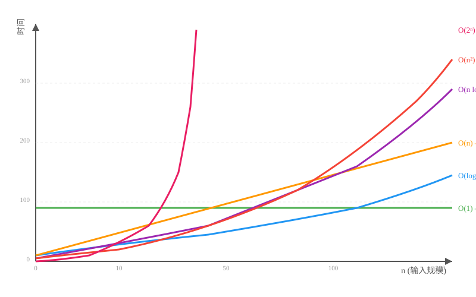
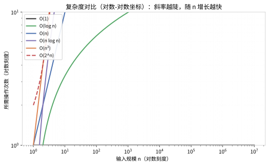
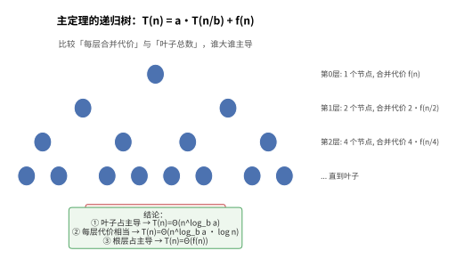
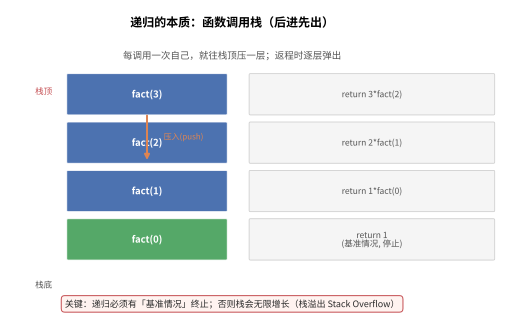
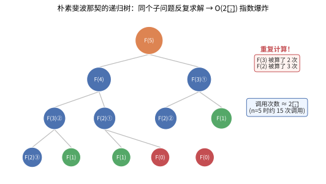

# 第 01 章：算法基础与复杂度分析

> 千里之行，始于足下。学算法，从理解"什么是算法"开始。

---

## 1.1 什么是算法？

### 生活中的算法

早上起床，你会怎么做？先穿袜子还是先穿鞋？先刷牙还是先洗脸？其实你每天都在执行"算法"——只不过你叫它"步骤"或"流程"。

**算法**（Algorithm）就是**一组定义明确的、有限的步骤，用于解决某个问题**。

> 💡 **类比**：算法就像**菜谱**。菜谱告诉你：第一步准备食材，第二步切菜，第三步炒菜，第四步装盘。每一步都很明确（"加一勺盐"而不是"加点盐"），步骤有限（不会无限循环），而且可以重复执行。计算机就是那个"严格执行菜谱的厨师"——你给它什么算法，它就按什么步骤执行。

> 根据维基百科的定义：算法（algorithm），在数学和计算机科学中指一个被定义好的、计算机可施行其指示的有限步骤或次序，常用于计算、数据处理和自动推理。

### 算法的三个关键特征

| 特征 | 说明 | 生活中的例子 |
|------|------|-------------|
| **有穷性** | 必须在有限步骤内结束 | 煮饭有定时，不会永远煮下去 |
| **确定性** | 每一步都有明确的含义 | 菜谱说"加盐 3 克"，而不是"加适量盐" |
| **可行性** | 每一步都是可以执行的 | 不会要求你"用筷子夹起一粒米"这样难的操作 |

### 算法的表示方式

```python
# 用自然语言描述：求两个数的最大值
# 1. 输入两个数 a 和 b
# 2. 如果 a > b，则最大值是 a
# 3. 否则最大值是 b
# 4. 输出最大值

# 用程序代码实现
def max_of_two(a, b):
    """返回两个数中的较大值"""
    if a > b:
        return a
    else:
        return b

# 测试
print(max_of_two(3, 7))  # 输出: 7
```

学习算法就像攀登一座阶梯，从基础概念逐步进阶到高级技巧：


---

## 1.2 为什么要分析算法？

假设你有两个算法都能解决同一个问题——比如对一个包含 100 万个数字的数组进行排序。算法 A 需要 0.1 秒，算法 B 需要 3 天。你会选哪个？

**分析算法的目的**：
- 预测算法在不同规模输入下的表现
- 比较不同算法的优劣
- 找出算法的瓶颈，指导优化方向

> 一句话：**算法分析让我们不跑代码就能知道算法快不快、省不省内存。**

---

## 1.3 时间复杂度：大 O、大 Ω、大 Θ

### 大 O 符号（Big O）—— 最坏情况

大 O 符号描述的是**算法执行时间随输入规模增长的增长趋势**（上界）。

简单理解：**最坏情况下，算法需要多久？**

> 💡 **类比**：大 O 符号就像**描述跑步速度的方式**。想象你要跑一段路：
> - **$O(1)$**：无论你跑 100 米还是 1000 米，都用 10 秒（瞬移，不可能但最快）
> - **$O(n)$**：距离翻倍，时间也翻倍（匀速跑）
> - **$O(n^2)$**：距离翻倍，时间变成 4 倍（越跑越慢，像陷入泥潭）
> - **$O(\log n)$**：距离翻倍，时间只增加一点点（像坐高铁，距离越远优势越明显）
> 
> 大 O 不关心具体是多少秒，只关心**增长趋势**——是线性增长、平方增长，还是对数增长。

> 根据维基百科的定义：算法分析中利用渐近分析估计一个算法的复杂度，并使用大 O 符号、大 Ω 符号和大 Θ 符号作为标记。

下图展示了不同时间复杂度的增长曲线对比，直观感受 $O(1)$、$O(\log n)$、$O(n)$、$O(n \log n)$、$O(n^2)$ 和 $O(2^n)$ 之间的巨大差异：



### 大 Ω 符号（Big Omega）—— 最好情况

大 Ω 描述的是**算法执行时间的最佳情况**（下界）。

简单理解：**最理想的情况下，算法至少需要多久？**

> 💡 **类比：大 Ω 如同"考试最低分"**
>
> 想象你参加一场考试，大 Ω 就是你的"保底分数"——即使状态再差、题目再难，你也能拿到的最低分。比如选择题蒙也能蒙对几道，这个"保底分数"就是 Ω。对于算法来说，大 Ω 告诉我们"这个算法再快也快不到哪里去"——它是算法的时间下界。例如，在有序数组中查找一个数，最好情况下第一次就猜中（$\Omega(1)$），但这是最理想的情况。

### 大 Θ 符号（Big Theta）—— 平均情况

大 Θ 描述的是**算法的确界**，即同时是上界和下界。

简单理解：**算法的时间正好是这个量级，不会更差也不会更好。**

> 💡 **类比：大 Θ 如同"正常通勤时间"**
>
> 想象你每天上班的通勤时间：不堵车时 30 分钟（最好情况），堵车时 60 分钟（最坏情况），但大多数时候是 45 分钟左右——这就是大 Θ。它描述的是算法在"典型情况"下的表现，既不会特别好也不会特别差。当你说一个算法是 $\Theta(n)$ 时，意思是"这个算法在大多数情况下都需要 n 步，不会更少也不会更多"。

### 对比表格

| 符号 | 含义 | 通俗理解 | 例子 |
|------|------|---------|------|
| $O(n)$ | 上界 | 最快不会超过 n 量级 | 线性查找最坏情况 $O(n)$ |
| $\Omega(n)$ | 下界 | 至少需要 n 量级 | 线性查找最好情况 $\Omega(1)$ |
| $\Theta(n)$ | 确界 | 恰好是 n 量级 | 遍历数组一定是 $\Theta(n)$ |

### 形象理解

+O(log+n)+O(n)+O(n+log+n)+O(n%5E2)+O(2%5En)+in+different+colors%2C+x-axis+is+input+size+n%2C+y-axis+is+time%2C+clean+and+clear+visualization&image_size=landscape_4_3)

---

## 1.4 常见时间复杂度（从快到慢）

| 复杂度 | 名称 | 2 秒内能处理的数据量（约） | 通俗比喻 |
|--------|------|--------------------------|---------|
| $O(1)$ | 常数阶 | 任意大 | 直接翻到书签页 |
| $O(\log n)$ | 对数阶 | 宇宙中所有原子数 | 查字典，每次排除一半 |
| $O(n)$ | 线性阶 | 数百万 | 逐页阅读一本书 |
| $O(n \log n)$ | 线性对数阶 | 数十万 | 给一堆试卷按分数排序（归并排序） |
| $O(n^2)$ | 平方阶 | 数千 | 教室里每两个人互相握手 |
| $O(2^n)$ | 指数阶 | 约 30 个 | 暴力破解密码（每加一位，工作量翻倍） |
| $O(n!)$ | 阶乘阶 | 约 10 个 | 给 10 个人排座位，所有排列方式 |

### 各复杂度增长对比

| n | $O(1)$ | $O(\log n)$ | $O(n)$ | $O(n \log n)$ | $O(n^2)$ | $O(2^n)$ |
|---|:----:|:--------:|:----:|:----------:|:-----:|:-----:|
| 10 | 1 | 3 | 10 | 33 | 100 | 1,024 |
| 100 | 1 | 7 | 100 | 664 | 10,000 | $1.27\times10^{30}$ |
| 1,000 | 1 | 10 | 1,000 | 9,966 | 1,000,000 | 爆炸 |
| 10,000 | 1 | 13 | 10,000 | 132,877 | 100,000,000 | 爆炸 |

> 💡 **为什么 $O(\log n)$ 这么神奇？** 人类大脑很难想象"每次砍一半"有多快：对 $2^{60}$ 个元素（比宇宙原子数还多），二分查找只需 60 次比较。数学上，只要每次排除一半，任何规模都能被"对数"驯服——这正是"折半搜索"的威力。下图用对数-对数坐标直观展示各复杂度的增长斜率：



> 📌 注意上图中 **$O(2^n)$ 是唯一"向上弯"的曲线**——它代表真实世界里的"爆炸"：数据每加 1，工作量翻倍。而 $O(1)$、$O(\log n)$ 在图上几乎是平的，说明它们几乎不随规模增长。

---

## 1.5 空间复杂度

空间复杂度衡量的是**算法运行时占用的内存空间随输入规模的增长趋势**。

### 常见空间复杂度

| 复杂度 | 含义 | 例子 |
|--------|------|------|
| $O(1)$ | 只用了常数个变量 | 交换两个数的值 |
| $O(n)$ | 需要额外存储 n 个元素 | 复制一个数组 |
| $O(n^2)$ | 需要 $n \times n$ 的存储空间 | 二维矩阵 |

### 时间与空间的权衡

在算法设计中，我们经常需要在**时间**和**空间**之间做取舍：

- **空间换时间**：缓存、哈希表、动态规划
- **时间换空间**：原地算法（in-place）

```python
# 举例：空间换时间
# 用哈希表缓存已经计算过的结果
cache = {}
def fibonacci_with_cache(n):
    if n in cache:
        return cache[n]
    if n <= 1:
        return n
    cache[n] = fibonacci_with_cache(n - 1) + fibonacci_with_cache(n - 2)
    return cache[n]
```

---

## 1.6 如何计算复杂度

### 规则一：循环

**单层循环 → $O(n)$**

```python
def sum_array(arr):
    total = 0
    for num in arr:          # 循环 n 次
        total += num          # 每次 O(1)
    return total
# 时间复杂度：O(n)
```

### 规则二：嵌套循环

**两层嵌套循环 → $O(n^2)$**

```python
def print_pairs(arr):
    n = len(arr)
    for i in range(n):          # 外层循环 n 次
        for j in range(n):      # 内层循环 n 次
            print(arr[i], arr[j])  # O(1)
# 时间复杂度：O(n × n) = O(n²)
```

### 规则三：顺序语句

**顺序执行 → 取最大值**

```python
def do_stuff(arr):
    for a in arr:               # O(n)
        print(a)
    for i in range(len(arr)):   # O(n²)
        for j in range(len(arr)):
            print(arr[i], arr[j])
# 时间复杂度：O(n) + O(n²) = O(n²)  ← 取最大的那个
```

### 规则四：递归

**递归的时间复杂度 = 递归深度 × 每层的时间**

```python
def factorial(n):
    if n <= 1:
        return 1
    return n * factorial(n - 1)  # 递归深度 n，每层 O(1)
# 时间复杂度：O(n)
```

### 规则五：常数忽略

**常数系数和低阶项都可以忽略**

```python
# O(2n) → O(n)
def twice(arr):
    for a in arr: print(a)  # n 次
    for a in arr: print(a)  # n 次
# 总：2n → O(n)

# O(n² + n) → O(n²)
def mostly_n2(arr):
    for i in arr:           # n²
        for j in arr:
            print(i, j)
    for k in arr:           # n
        print(k)
# 总：n² + n → O(n²)
```

### 规则六：主定理（Master Theorem）

**主定理用于分析分治递归算法的时间复杂度。**

对于形如 `T(n) = aT(n/b) + f(n)` 的递归式：
- `a`：子问题数量
- `b`：子问题规模缩小比例
- `f(n)`：分解与合并的代价

主定理的三种情况：

| 情况 | 条件 | 时间复杂度 |
|------|------|-----------|
| 情况 1 | $f(n) < n^{\log_b a}$ | $T(n) = \Theta(n^{\log_b a})$ |
| 情况 2 | $f(n) = n^{\log_b a}$ | $T(n) = \Theta(n^{\log_b a} \log n)$ |
| 情况 3 | $f(n) > n^{\log_b a}$ | $T(n) = \Theta(f(n))$ |

**常见应用示例**：

| 算法 | 递归式 | $a$ | $b$ | $\log_b a$ | 时间复杂度 |
|------|--------|:---:|:---:|:----------:|:----------:|
| 二分查找 | $T(n) = T(n/2) + O(1)$ | 1 | 2 | 0 | $O(\log n)$ |
| 归并排序 | $T(n) = 2T(n/2) + O(n)$ | 2 | 2 | 1 | $O(n \log n)$ |
| 斐波那契（朴素） | $T(n) = T(n-1) + T(n-2) + O(1)$ | — | — | — | $O(2^n)$ |

> 注意：主定理不适用于所有递归式（如 $T(n) = T(n-1) + O(1)$ 这种非等比例划分的情况）。

**直觉理解 —— 主定理在比什么？**

把递归式想象成一棵**递归树**：每一层把问题拆成更小的子问题，最后落到叶子。主定理其实是在比较两件事的"份量"：
- **每层的合并代价** `f(n)`（根节点那层最重）
- **叶子总数** `n^{\log_b a}`（底层叶子最多）

谁主导，总复杂度就由谁决定。下图把这种"谁重谁主导"的直觉画了出来：



> 用生活类比：想象你是一个**包工头**，把一个大活分包给更多小组。
> - 如果**小组太多（叶子爆炸）**，你的成本主要来自"招人" → 复杂度由叶子主导
> - 如果**每层合并都差不多重**，成本均匀分布在每一层 → 复杂度 = 叶子数 × 层数
> - 如果**最顶层合并最贵**（比如汇总要花 $O(n^2)$），那你的成本几乎全花在第一次汇总上 → 复杂度由根主导

### 规则六·补充：递归的工作本质 —— 函数调用栈

递归之所以是 O(深度 × 每层代价)，是因为 CPU 用**栈**来记录每一层调用。理解了这个机制，就能直观理解"递归深了会栈溢出"以及"为什么要避免重复递归"：



> 💡 **类比**：递归就像**套娃**——打开最外层，里面还有一层，直到遇见最小的那个（基准情况）才停止。每一层"盒子里"都保存着自己的局部变量，等最小的套娃返回后，再一层层"合上"。如果套娃无限套下去（没有基准情况），栈就会用光内存 → **Stack Overflow**。

### 规则七：摊销分析（Amortized Analysis）

**摊销分析用于评估一个操作序列的平均时间复杂度。**

即使单个操作在最坏情况下很慢，但整个操作序列的平均成本可能很低。

**典型例子：动态数组（Python 的 list）**

```python
import sys

def demonstrate_amortization():
    """演示 Python 列表的动态扩容机制"""
    arr = []
    prev_capacity = 0
    for i in range(16):
        arr.append(i)
        current_capacity = sys.getsizeof(arr)
        if current_capacity != prev_capacity:
            print(f"添加第 {i+1} 个元素后，容量变化 → {current_capacity} 字节")
            prev_capacity = current_capacity

demonstrate_amortization()
```

**关键思想**：
- 每次扩容时，列表将容量翻倍（$O(n)$ 操作）
- 但扩容发生的次数很少（约 $\log n$ 次）
- **平均下来，每次插入操作的时间复杂度为 $O(1)$**（摊销常数时间）

**三种分析方法**：
| 方法 | 说明 |
|------|------|
| 聚集分析 | 计算 n 个操作的总时间，再除以 n |
| 记账法 | 给"便宜"操作多收费，给"昂贵"操作预存费用 |
| 势能法 | 用势能函数衡量数据结构的"能量状态" |

---

## 1.7 Python 代码示例

### O(1) — 常数时间：数组访问

```python
def get_first(arr):
    """无论数组多大，访问第一个元素的时间是固定的"""
    return arr[0]

# 测试
arr = [10, 20, 30, 40, 50]
print(get_first(arr))  # 输出: 10
# 无论 arr 有 5 个元素还是 500 万个，速度都一样快！
```

### O(log n) — 对数时间：二分查找

```python
def binary_search(arr, target):
    """
    在有序数组中查找目标值
    每次排除一半的数据，所以是 O(log n)
    """
    left, right = 0, len(arr) - 1
    while left <= right:
        mid = (left + right) // 2
        if arr[mid] == target:
            return mid          # 找到了，返回索引
        elif arr[mid] < target:
            left = mid + 1      # 排除左半部分
        else:
            right = mid - 1     # 排除右半部分
    return -1                   # 没找到

# 测试
sorted_arr = [1, 3, 5, 7, 9, 11, 13, 15]
print(binary_search(sorted_arr, 7))   # 输出: 3
print(binary_search(sorted_arr, 2))   # 输出: -1
```

### O(n) — 线性时间：线性查找 & 数组求和

```python
def linear_search(arr, target):
    """从头到尾逐个查找，最坏情况需要检查所有元素"""
    for i, val in enumerate(arr):
        if val == target:
            return i
    return -1

def sum_array(arr):
    """遍历数组求和，需要访问每个元素一次"""
    total = 0
    for num in arr:
        total += num
    return total

# 测试
arr = [4, 2, 7, 1, 9, 5]
print(linear_search(arr, 7))   # 输出: 2
print(sum_array(arr))          # 输出: 28
```

### O(n log n) — 线性对数时间：归并排序（概念）

```python
def merge_sort(arr):
    """
    归并排序：分治思想
    将数组不断二分（O(log n)层），每层合并（O(n)）
    总复杂度：O(n log n)
    """
    if len(arr) <= 1:
        return arr

    # 分：将数组分成两半
    mid = len(arr) // 2
    left = merge_sort(arr[:mid])
    right = merge_sort(arr[mid:])

    # 治：合并两个有序数组
    return merge(left, right)

def merge(left, right):
    result = []
    i = j = 0
    while i < len(left) and j < len(right):
        if left[i] <= right[j]:
            result.append(left[i])
            i += 1
        else:
            result.append(right[j])
            j += 1
    result.extend(left[i:])
    result.extend(right[j:])
    return result

# 测试
arr = [38, 27, 43, 3, 9, 82, 10]
print(merge_sort(arr))  # 输出: [3, 9, 10, 27, 38, 43, 82]
```

### O(n²) — 平方时间：冒泡排序 & 嵌套循环

```python
def bubble_sort(arr):
    """
    冒泡排序：两两比较，大的往后"冒泡"
    外层循环 n 次，内层循环 n 次，所以 O(n²)
    """
    n = len(arr)
    for i in range(n):
        for j in range(0, n - i - 1):
            if arr[j] > arr[j + 1]:
                arr[j], arr[j + 1] = arr[j + 1], arr[j]  # 交换
    return arr

# 测试
arr = [64, 34, 25, 12, 22, 11, 90]
print(bubble_sort(arr))  # 输出: [11, 12, 22, 25, 34, 64, 90]
```

### 递归复杂度对比：斐波那契数列

下面这张递归树图直观展示了"为什么朴素斐波那契是 $O(2^n)$"——同一个子问题（如 F(3)、F(2)）被一遍又一遍地重复计算，就像每次都要重新烧一壶水：



> 💡 **类比**：想象一个**糟糕的仓库管理员**，每次有人来要同一件货物，他都要重新去工厂搬一次，而不是存一份副本。朴素递归就是"每次重新算"，而带缓存的版本（记忆化）就是"存快递柜，来了直接取"——这就是 $O(2^n)$ → $O(n)$ 的差距。

```python
from functools import lru_cache

# 版本一：朴素递归 — O(2ⁿ)
def fib_naive(n):
    """
    朴素递归求斐波那契数列
    每次调用产生 2 个递归调用，递归深度为 n
    时间复杂度：O(2ⁿ)  ← 指数级，非常慢！
    """
    if n <= 1:
        return n
    return fib_naive(n - 1) + fib_naive(n - 2)

# 版本二：带缓存 — O(n)
@lru_cache(maxsize=None)
def fib_optimized(n):
    """
    带缓存的斐波那契（记忆化搜索）
    每个 n 只计算一次，然后缓存结果
    时间复杂度：O(n)  ← 线性，快多了！
    空间复杂度：O(n)  ← 用空间换时间
    """
    if n <= 1:
        return n
    return fib_optimized(n - 1) + fib_optimized(n - 2)

# 版本三：迭代 — O(n)，O(1) 空间
def fib_iterative(n):
    """
    迭代法求斐波那契
    只用两个变量滚动更新
    时间复杂度：O(n)
    空间复杂度：O(1)  ← 最优！
    """
    if n <= 1:
        return n
    a, b = 0, 1
    for _ in range(2, n + 1):
        a, b = b, a + b
    return b

# 测试
print("fib(10) =", fib_naive(10))       # 输出: 55
print("fib(10) =", fib_optimized(10))   # 输出: 55
print("fib(10) =", fib_iterative(10))   # 输出: 55

# 对比速度
import time
for n in [10, 20, 30, 35]:
    start = time.time()
    fib_naive(n)
    t1 = time.time() - start

    start = time.time()
    fib_optimized(n)
    t2 = time.time() - start

    start = time.time()
    fib_iterative(n)
    t3 = time.time() - start

    print(f"n={n}: 朴素={t1:.6f}s, 优化={t2:.6f}s, 迭代={t3:.6f}s")
```

---

## 1.8 复杂度速查表

### 常见数据结构操作复杂度

| 数据结构 | 访问 | 查找 | 插入 | 删除 |
|---------|:----:|:----:|:----:|:----:|
| 数组 | $O(1)$ | $O(n)$ | $O(n)$ | $O(n)$ |
| 栈 | $O(n)$ | $O(n)$ | $O(1)$ | $O(1)$ |
| 队列 | $O(n)$ | $O(n)$ | $O(1)$ | $O(1)$ |
| 链表 | $O(n)$ | $O(n)$ | $O(1)$ | $O(1)$ |
| 哈希表 | $O(1)$* | $O(1)$* | $O(1)$* | $O(1)$* |
| 二叉搜索树 | $O(\log n)$ | $O(\log n)$ | $O(\log n)$ | $O(\log n)$ |

> *平均情况；最坏情况为 $O(n)$

### 常见排序算法复杂度

| 算法 | 最好 | 平均 | 最坏 | 空间 | 稳定 |
|-----|:---:|:----:|:----:|:----:|:----:|
| 冒泡排序 | $O(n)$ | $O(n^2)$ | $O(n^2)$ | $O(1)$ | ✅ |
| 选择排序 | $O(n^2)$ | $O(n^2)$ | $O(n^2)$ | $O(1)$ | ❌ |
| 插入排序 | $O(n)$ | $O(n^2)$ | $O(n^2)$ | $O(1)$ | ✅ |
| 归并排序 | $O(n \log n)$ | $O(n \log n)$ | $O(n \log n)$ | $O(n)$ | ✅ |
| 快速排序 | $O(n \log n)$ | $O(n \log n)$ | $O(n^2)$ | $O(\log n)$ | ❌ |
| 堆排序 | $O(n \log n)$ | $O(n \log n)$ | $O(n \log n)$ | $O(1)$ | ❌ |

### 图形化理解各复杂度

+flat+line%2C+O(log+n)+slowly+rising%2C+O(n)+straight+diagonal+line%2C+O(n+log+n)+slightly+curved%2C+O(n%5E2)+steep+parabola%2C+O(2%5En)+very+steep+exponential+curve%2C+colorful+line+chart+on+white+background&image_size=landscape_4_3)

---

## 1.9 练习题

### 练习 1：分析以下代码的时间复杂度

```python
def mystery(arr):
    n = len(arr)
    result = 0
    for i in range(n):
        for j in range(i, n):
            result += arr[i] * arr[j]
    return result
```

**问题**：以上代码的时间复杂度是多少？空间复杂度是多少？

<details>
<summary>点击查看答案</summary>

**时间复杂度：$O(n^2)$**
- 外层循环 i 从 0 到 n-1
- 内层循环 j 从 i 到 n-1
- 总执行次数 = $n + (n-1) + (n-2) + \dots + 1 = n(n+1)/2 = O(n^2)$

**空间复杂度：$O(1)$**
- 只用了常数个变量（n, result, i, j）
</details>

### 练习 2：优化一个 O(n²) 的算法

```python
def find_duplicates_naive(arr):
    """找出数组中的所有重复元素（O(n²) 版本）"""
    duplicates = []
    n = len(arr)
    for i in range(n):
        for j in range(i + 1, n):
            if arr[i] == arr[j] and arr[i] not in duplicates:
                duplicates.append(arr[i])
    return duplicates
```

**问题**：请用哈希表将时间复杂度优化到 $O(n)$。

<details>
<summary>点击查看答案</summary>

```python
def find_duplicates_optimized(arr):
    """使用哈希表（集合）将时间复杂度降到 O(n)"""
    seen = set()
    duplicates = set()
    for num in arr:
        if num in seen:
            duplicates.add(num)
        else:
            seen.add(num)
    return list(duplicates)

# 测试
arr = [1, 2, 3, 2, 4, 3, 5]
print(find_duplicates_optimized(arr))  # 输出: [2, 3]
```

**优化分析**：
- 原算法：$O(n^2)$ 时间，$O(1)$ 空间
- 优化后：$O(n)$ 时间，$O(n)$ 空间
- 典型的**空间换时间**策略
</details>

### 练习 3：二分查找的变体

```python
def search_insert_position(nums, target):
    """
    给定一个排序数组和一个目标值，在数组中找到目标值，并返回其索引。
    如果目标值不存在于数组中，返回它将会被按顺序插入的位置。
    
    例如：nums = [1,3,5,6], target = 5 → 输出 2
          nums = [1,3,5,6], target = 2 → 输出 1
          nums = [1,3,5,6], target = 7 → 输出 4
    """
    # 请在此处实现代码
    pass
```

**问题**：使用二分查找的思路实现该函数，要求时间复杂度 $O(\log n)$。

<details>
<summary>点击查看答案</summary>

```python
def search_insert_position(nums, target):
    left, right = 0, len(nums) - 1
    while left <= right:
        mid = (left + right) // 2
        if nums[mid] == target:
            return mid
        elif nums[mid] < target:
            left = mid + 1
        else:
            right = mid - 1
    return left  # 当没找到时，left 就是插入位置

# 测试
print(search_insert_position([1, 3, 5, 6], 5))  # 输出: 2
print(search_insert_position([1, 3, 5, 6], 2))  # 输出: 1
print(search_insert_position([1, 3, 5, 6], 7))  # 输出: 4
print(search_insert_position([1, 3, 5, 6], 0))  # 输出: 0
```
</details>

---

## 本章小结

| 知识点 | 要点 |
|--------|------|
| ✅ 算法定义 | 有穷性、确定性、可行性 |
| ✅ 时间复杂度 | 衡量算法执行时间随输入规模增长的趋势 |
| ✅ 大 O 表示法 | 描述最坏情况的上界 |
| ✅ 常见复杂度 | $O(1) < O(\log n) < O(n) < O(n \log n) < O(n^2) < O(2^n) < O(n!)$ |
| ✅ 空间复杂度 | 衡量算法占用的额外内存 |
| ✅ 时空权衡 | 空间换时间，时间换空间 |
| ✅ 计算规则 | 循环相乘、顺序取大、常数忽略 |
| ✅ 主定理 | 分析分治递归算法 $T(n) = aT(n/b) + f(n)$ |
| ✅ 摊销分析 | 操作序列的平均时间复杂度，动态数组 $O(1)$ 插入 |

---

## 下一步

👉 [第 02 章：基础数据结构](./02_基础数据结构.md) — 学习编程中最基本的数据结构

---

## 参考资源

- [时间复杂度 - Wikipedia 文章 3479880]
- [空间复杂度 - Wikipedia 文章 4040642]
- [大O符号 - Wikipedia 文章 2974574]
- [算法分析 - Wikipedia 文章 4065733]
- [数据结构 - Wikipedia 文章 3420564]
- [分治法 - Wikipedia 文章 2634591]
- [贪心算法 - Wikipedia 文章 4438818]