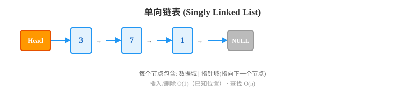
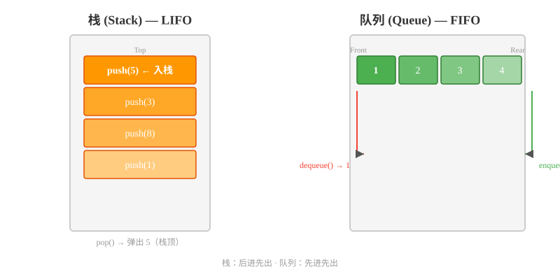
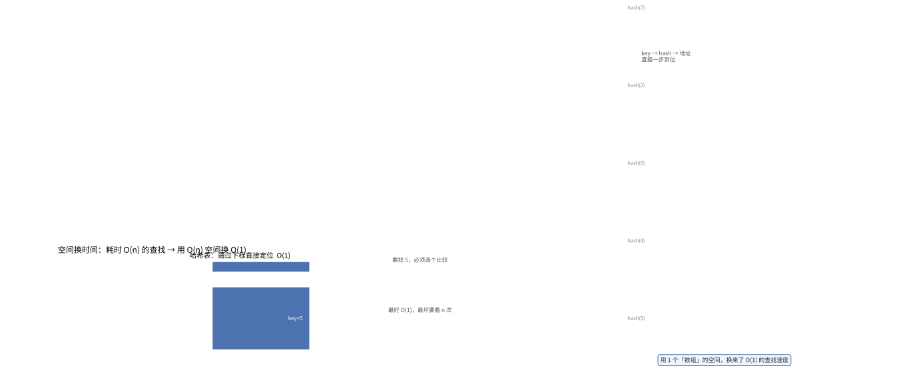

c

# 第 02 章：基础数据结构

> 程序 = 数据结构 + 算法。数据结构是算法的基石，选对数据结构，问题就解决了一半。

---

数据结构是计算机**存储、组织数据的方式**，而算法是**操作数据的具体步骤**。二者相辅相成：

- **数据结构为算法提供载体**——算法需要依赖数据结构来存取和操作数据
- **算法驱动数据结构运转**——数据结构的各项操作（插入、删除、查找等）本身就是算法
- **选择合适的数据结构，可以让算法更高效**——例如用哈希表将查找从 O(n) 降到 O(1)

> 正如计算机科学家 Niklaus Wirth 的经典著作《Algorithms + Data Structures = Programs》所总结的：**程序 = 数据结构 + 算法**。

本章将介绍 7 种最基础、最常用的数据结构，每种都包含：

- **核心概念** — 是什么？有什么特点？
- **Python 实现** — 完整的可运行代码
- **复杂度分析** — 各操作的时间/空间复杂度
- **LeetCode 实战** — 一道经典题目 + 详解
- **实际应用** — 在现实中的用途

---

## 2.1 数组（列表）

### 什么是数组？

数组（Array）是最基本的数据结构，它将**相同类型**的元素按**顺序**存储在**连续的内存空间**中。

在 Python 中，数组就是 **列表（List）**，而且 Python 的列表更强大——可以存储不同类型的元素。

### 数组的核心特点

- **连续内存**：元素在内存中紧挨着存放
- **随机访问**：通过索引可以 O(1) 时间访问任意元素
- **固定大小**（传统数组）：一旦创建，大小固定
- **Python 列表**：动态大小，自动扩容

### 操作时间复杂度

| 操作         | 时间复杂度 | 说明             |
| ------------ | :--------: | ---------------- |
| 访问（索引） |    O(1)    | 直接通过下标访问 |
| 查找（值）   |    O(n)    | 需要遍历         |
| 末尾插入     |   O(1)*   | 平均情况         |
| 中间插入     |    O(n)    | 需要移动元素     |
| 末尾删除     |    O(1)    |                  |
| 中间删除     |    O(n)    | 需要移动元素     |

> *Python 列表在末尾插入时，如果空间不够会触发扩容（O(n)），但扩容操作是偶发的，均摊下来仍是 O(1)。

### Python 实现与操作

```python
# 创建列表
arr = [1, 2, 3, 4, 5]

# 访问元素 — O(1)
print(arr[0])   # 输出: 1
print(arr[-1])  # 输出: 5（负数索引从末尾开始）

# 修改元素 — O(1)
arr[2] = 99
print(arr)      # 输出: [1, 2, 99, 4, 5]

# 末尾添加 — 均摊 O(1)
arr.append(6)
print(arr)      # 输出: [1, 2, 99, 4, 5, 6]

# 中间插入 — O(n)
arr.insert(2, 100)
print(arr)      # 输出: [1, 2, 100, 99, 4, 5, 6]

# 删除元素 — O(n)
arr.remove(99)  # 删除第一个值为 99 的元素
print(arr)      # 输出: [1, 2, 100, 4, 5, 6]

# 按索引删除 — O(n)
popped = arr.pop(1)  # 删除索引 1 的元素
print(popped)   # 输出: 2
print(arr)      # 输出: [1, 100, 4, 5, 6]

# 查找元素 — O(n)
index = arr.index(100)
print(index)    # 输出: 1

# 判断存在 — O(n)
print(100 in arr)  # 输出: True

# 切片 — O(k)，k 为切片长度
sub = arr[1:4]
print(sub)      # 输出: [100, 4, 5]

# 列表推导式
squares = [x**2 for x in range(6)]
print(squares)  # 输出: [0, 1, 4, 9, 16, 25]
```

### LeetCode 实战：两数之和

**题目**：给定一个整数数组和一个目标值，找出数组中和为目标值的两个数的下标。

```python
def two_sum(nums, target):
    """
    使用哈希表（字典）将时间复杂度优化到 O(n)
  
    思路：遍历数组，对于每个元素 num，
    检查 target - num 是否已经在哈希表中
    """
    seen = {}  # key: 数值, value: 索引
    for i, num in enumerate(nums):
        complement = target - num
        if complement in seen:
            return [seen[complement], i]
        seen[num] = i
    return []

# 测试
nums = [2, 7, 11, 15]
print(two_sum(nums, 9))  # 输出: [0, 1] (2 + 7 = 9)
```

### 实际应用

- **存储数据**：最常用的数据容器
- **矩阵运算**：二维数组表示矩阵
- **缓存**：顺序存储最近访问的数据
- **动态规划**：用数组存储中间状态

---

## 2.2 链表

### 什么是链表？

链表（Linked List）由一系列**节点（Node）**组成，每个节点包含**数据**和指向下一个节点的**指针**。与数组不同，链表的节点在内存中**不连续**。

下图展示了单链表的节点结构与指针连接方式：



### 链表 vs 数组

| 对比项                |    数组    |        链表        |
| --------------------- | :--------: | :----------------: |
| 内存布局              |    连续    |        离散        |
| 随机访问              |    O(1)    |        O(n)        |
| 插入/删除（已知位置） |    O(n)    |        O(1)        |
| 内存利用率            | 可能有浪费 | 每个节点额外存指针 |
| 缓存友好              |     ✅     |         ❌         |

### 单链表实现

```python
class ListNode:
    """链表节点"""
    def __init__(self, val=0, next=None):
        self.val = val      # 数据
        self.next = next    # 指向下一个节点的指针

class SinglyLinkedList:
    """单链表"""
    def __init__(self):
        self.head = None    # 头节点
        self.size = 0       # 链表长度

    def get(self, index):
        """获取指定索引的值 — O(n)"""
        if index < 0 or index >= self.size:
            return -1
        curr = self.head
        for _ in range(index):
            curr = curr.next
        return curr.val

    def add_at_head(self, val):
        """在头部插入 — O(1)"""
        self.add_at_index(0, val)

    def add_at_tail(self, val):
        """在尾部插入 — O(n)"""
        self.add_at_index(self.size, val)

    def add_at_index(self, index, val):
        """在指定位置插入 — O(n)"""
        if index < 0 or index > self.size:
            return
        new_node = ListNode(val)
        if index == 0:
            # 在头部插入
            new_node.next = self.head
            self.head = new_node
        else:
            # 找到前一个节点
            prev = self.head
            for _ in range(index - 1):
                prev = prev.next
            new_node.next = prev.next
            prev.next = new_node
        self.size += 1

    def delete_at_index(self, index):
        """删除指定位置的节点 — O(n)"""
        if index < 0 or index >= self.size:
            return
        if index == 0:
            self.head = self.head.next
        else:
            prev = self.head
            for _ in range(index - 1):
                prev = prev.next
            prev.next = prev.next.next
        self.size -= 1

    def __str__(self):
        """打印链表"""
        vals = []
        curr = self.head
        while curr:
            vals.append(str(curr.val))
            curr = curr.next
        return " -> ".join(vals) + " -> None"

# 测试
linked_list = SinglyLinkedList()
linked_list.add_at_head(1)
linked_list.add_at_tail(3)
linked_list.add_at_index(1, 2)
print(linked_list)          # 输出: 1 -> 2 -> 3 -> None
print(linked_list.get(1))   # 输出: 2
linked_list.delete_at_index(1)
print(linked_list)          # 输出: 1 -> 3 -> None
```

### 双向链表

```python
class DoublyListNode:
    def __init__(self, val=0, prev=None, next=None):
        self.val = val
        self.prev = prev  # 指向前一个节点
        self.next = next  # 指向后一个节点

class DoublyLinkedList:
    """双向链表"""
    def __init__(self):
        self.head = None
        self.tail = None
        self.size = 0

    def add_at_head(self, val):
        """头部插入 — O(1)"""
        new_node = DoublyListNode(val)
        if self.head is None:
            self.head = self.tail = new_node
        else:
            new_node.next = self.head
            self.head.prev = new_node
            self.head = new_node
        self.size += 1

    def add_at_tail(self, val):
        """尾部插入 — O(1)（双向链表比单链表快的地方）"""
        new_node = DoublyListNode(val)
        if self.tail is None:
            self.head = self.tail = new_node
        else:
            new_node.prev = self.tail
            self.tail.next = new_node
            self.tail = new_node
        self.size += 1

    def __str__(self):
        vals = []
        curr = self.head
        while curr:
            vals.append(str(curr.val))
            curr = curr.next
        return " <-> ".join(vals) + " -> None"

# 测试
dll = DoublyLinkedList()
dll.add_at_head(1)
dll.add_at_tail(2)
dll.add_at_tail(3)
print(dll)  # 输出: 1 <-> 2 <-> 3 -> None
```

### 链表变体对比

除了上述的单链表和双向链表，还有**循环链表（Circular Linked List）**——尾节点的 next 指向头节点，形成闭环。三种变体的对比如下：

| 特性             |    单链表    |         双向链表         |        循环链表        |
| ---------------- | :----------: | :----------------------: | :--------------------: |
| 指针数量         | 1 个（next） |   2 个（prev + next）   | 1 个（next），尾 → 头 |
| 空间开销         |     较低     | 较高（多一个 prev 指针） |        同单链表        |
| 头插 / 头删      |     O(1)     |           O(1)           |          O(1)          |
| 尾插（有尾指针） |     O(n)     |           O(1)           |          O(1)          |
| 反向遍历         |    不支持    |           支持           |         需绕圈         |
| 典型应用         |  邻接表、栈  |    LRU 缓存、双向导航    |    时间轮、约瑟夫环    |

### LeetCode 实战：反转链表

```python
def reverse_list(head):
    """
    反转单链表
    输入: 1 -> 2 -> 3 -> 4 -> None
    输出: 4 -> 3 -> 2 -> 1 -> None
  
    思路：逐个节点反转指针方向
    """
    prev = None
    curr = head
    while curr:
        next_temp = curr.next  # 保存下一个节点
        curr.next = prev       # 反转指针
        prev = curr            # prev 前移
        curr = next_temp       # curr 前移
    return prev

# 测试
def create_linked_list(vals):
    if not vals:
        return None
    head = ListNode(vals[0])
    curr = head
    for v in vals[1:]:
        curr.next = ListNode(v)
        curr = curr.next
    return head

def print_linked_list(head):
    vals = []
    while head:
        vals.append(str(head.val))
        head = head.next
    print(" -> ".join(vals) + " -> None")

head = create_linked_list([1, 2, 3, 4, 5])
print_linked_list(head)                 # 1 -> 2 -> 3 -> 4 -> 5 -> None
reversed_head = reverse_list(head)
print_linked_list(reversed_head)        # 5 -> 4 -> 3 -> 2 -> 1 -> None
```

### 实际应用

- **LRU 缓存**：双向链表 + 哈希表实现
- **文件系统**：文件分配表（FAT）
- **音乐播放器**：播放列表的上一首/下一首

---

## 2.3 栈

### 什么是栈？

栈（Stack）是一种**后进先出（LIFO, Last In First Out）**的数据结构。就像一摞盘子——你只能从顶部取盘子，新盘子也只能放在顶部。

### 栈的核心操作

| 操作                   | 描述                   | 时间复杂度 |
| ---------------------- | ---------------------- | :--------: |
| `push(x)`            | 将元素 x 压入栈顶      |    O(1)    |
| `pop()`              | 移除并返回栈顶元素     |    O(1)    |
| `peek()` / `top()` | 查看栈顶元素（不移除） |    O(1)    |
| `is_empty()`         | 判断栈是否为空         |    O(1)    |
| `size()`             | 返回栈中元素数量       |    O(1)    |

### Python 实现

Python 的列表天然就是栈：

```python
# 使用 Python 列表作为栈
stack = []

# push — 压栈
stack.append(1)
stack.append(2)
stack.append(3)
print(stack)  # 输出: [1, 2, 3]

# peek — 查看栈顶
print(stack[-1])  # 输出: 3

# pop — 出栈
top = stack.pop()
print(top)    # 输出: 3
print(stack)  # 输出: [1, 2]

# is_empty
print(len(stack) == 0)  # 输出: False
```

### 栈的经典应用：括号匹配

```python
def is_valid_parentheses(s):
    """
    判断括号字符串是否有效
    例如: "()[]{}" → True
          "([)]"  → False
          "{[]}"  → True
  
    思路：遇到左括号就压栈，遇到右括号就检查是否匹配
    """
    # 括号映射
    pairs = {')': '(', ']': '[', '}': '{'}
    stack = []

    for char in s:
        if char in pairs:  # 遇到右括号
            # 栈为空或栈顶不是对应的左括号 → 无效
            if not stack or stack[-1] != pairs[char]:
                return False
            stack.pop()  # 匹配成功，弹栈
        else:  # 遇到左括号，压栈
            stack.append(char)

    # 栈为空说明所有括号都匹配了
    return len(stack) == 0

# 测试
print(is_valid_parentheses("()[]{}"))      # 输出: True
print(is_valid_parentheses("([)]"))        # 输出: False
print(is_valid_parentheses("{[]}"))        # 输出: True
print(is_valid_parentheses("("))           # 输出: False
```

### 实际应用

栈的 LIFO 特性使其特别适合处理**需要回溯、撤销或嵌套**的场景：

- **函数调用栈**：编程语言用栈管理函数调用。每次调用函数时，将返回地址和局部变量压栈；函数返回时弹栈，恢复调用者的执行环境
- **浏览器后退**：访问页面入栈，点击后退时从栈顶弹出上一页面
- **撤销操作（Undo）**：编辑器的 Ctrl+Z —— 每次操作压栈，撤销时弹栈恢复
- **表达式求值**：中缀表达式转后缀表达式（逆波兰式），或直接用两个栈（操作数栈 + 运算符栈）求值
- **括号匹配**：编译器检查代码中括号是否成对匹配（见上方经典应用）
- **深度优先搜索（DFS）**：隐式地使用系统栈（递归），或显式地使用栈实现非递归遍历

---

## 2.4 队列

### 什么是队列？

队列（Queue）是一种**先进先出（FIFO, First In First Out）**的数据结构。就像排队买东西——先到的人先被服务。

栈和队列是两种相反的数据存取方式，下图直观对比了它们的结构差异：



### 队列的核心操作

| 操作           | 描述               | 时间复杂度 |
| -------------- | ------------------ | :--------: |
| `enqueue(x)` | 将元素 x 加入队尾  |    O(1)    |
| `dequeue()`  | 移除并返回队首元素 |    O(1)    |
| `front()`    | 查看队首元素       |    O(1)    |
| `is_empty()` | 判断队列是否为空   |    O(1)    |

### Python 实现

使用 `collections.deque` 实现队列（双端队列，两端操作都是 O(1)）：

```python
from collections import deque

# 创建队列
queue = deque()

# 入队（右侧）
queue.append(1)     # [1]
queue.append(2)     # [1, 2]
queue.append(3)     # [1, 2, 3]
print(queue)        # 输出: deque([1, 2, 3])

# 出队（左侧）
left = queue.popleft()
print(left)         # 输出: 1
print(queue)        # 输出: deque([2, 3])

# 查看队首
print(queue[0])     # 输出: 2

# 判断是否为空
print(len(queue) == 0)  # 输出: False
```

### 队列的应用：用栈实现队列

```python
class MyQueue:
    """
    用两个栈实现队列
  
    思路：
    - 一个栈用于入队（input），一个栈用于出队（output）
    - 出队时，如果 output 为空，把 input 的所有元素倒到 output 中
    """
    def __init__(self):
        self.input = []   # 入队栈
        self.output = []  # 出队栈

    def push(self, x):
        """将元素压入队尾"""
        self.input.append(x)

    def pop(self):
        """移除并返回队首元素"""
        self.peek()
        return self.output.pop()

    def peek(self):
        """查看队首元素"""
        if not self.output:
            while self.input:
                self.output.append(self.input.pop())
        return self.output[-1]

    def empty(self):
        """判断队列是否为空"""
        return len(self.input) == 0 and len(self.output) == 0

# 测试
q = MyQueue()
q.push(1)
q.push(2)
print(q.peek())   # 输出: 1
print(q.pop())    # 输出: 1
print(q.empty())  # 输出: False
```

### 实际应用

队列的 FIFO 特性使其适合处理**按顺序排队、逐层扩展**的场景：

- **任务调度**：CPU 按先来先服务（FCFS）调度任务，进程/线程就绪队列
- **消息队列**：RabbitMQ、Kafka 等消息中间件的核心模型，生产者将消息入队，消费者从队列中取出处理，实现解耦和削峰
- **BFS（广度优先搜索）**：图/树的层级遍历，用队列逐层扩展节点，保证按距离顺序访问
- **打印机队列**：多个任务按提交顺序依次打印
- **IO 缓冲区**：键盘输入、网络数据包的流式处理，用队列暂存数据
- **滑动窗口**：配合单调队列，在 O(n) 时间内求出所有窗口的最值（见 2.7 节）

---

## 2.5 哈希表

### 什么是哈希表？

哈希表（Hash Table）是一种通过**键（Key）直接访问**存储位置的数据结构。它使用**哈希函数**将键映射到数组的索引位置。

哈希表的核心思想是**用空间换时间**——通过哈希函数 O(1) 定位到目标位置。

> 💡 **类比：考场查座位的两种方式**
>
> - **数组查找** = 不看座位号，从头到尾一排排找你的名字 → O(n)
> - **哈希表** = 每个考生被安排进"姓名字母对应的分组"，直接按首字母去对应组找人 → O(1)
>
> 哈希表相当于给每个元素发了一个"房号"（哈希值），你直接按房号去那间房取东西，而不是整栋楼挨个敲门。下图直观对比了这两种查找方式的工作量差异：



当多个键映射到同一个位置时会发生哈希冲突，链地址法通过在冲突位置维护一个链表来解决：


### 哈希函数

哈希函数将任意大小的输入映射到固定大小的输出：

```
key → hash_function(key) → index (0 ~ table_size-1)
```

### 哈希冲突

当两个不同的键被映射到同一个位置时，称为**哈希冲突**。常见的解决方式：

| 方法                 | 说明                                               | 优点                   | 缺点                   |
| -------------------- | -------------------------------------------------- | ---------------------- | ---------------------- |
| **链地址法**   | 每个位置存储一个链表（或红黑树），冲突元素挂在链上 | 简单，不受表大小限制   | 链表过长时性能退化     |
| **开放地址法** | 冲突时按某种探测序列找下一个空位                   | 空间利用率高，缓存友好 | 删除麻烦，容易产生聚集 |
| **再哈希法**   | 使用多个哈希函数，第一个冲突时换下一个             | 分布均匀               | 计算开销大             |

**链地址法**（Chaining）是最常用的方法。每个桶（bucket）存储一个链表，插入时直接追加到链表尾部；查找时遍历链表。当链表过长时，可优化为红黑树（如 Java 8 的 HashMap 在链表长度 ≥ 8 时转为树）。

**开放地址法**（Open Addressing）的三种探测方式：

- **线性探测**：`index = (hash(key) + i) % table_size`，逐个查找下一个空位。简单但容易产生**一次聚集**（连续被占用的区块越来越长）
- **二次探测**：`index = (hash(key) + i²) % table_size`，步长平方增长，缓解一次聚集
- **双重哈希**：`index = (hash(key) + i × hash₂(key)) % table_size`，使用第二个哈希函数决定步长，分布最均匀

### Python 中的哈希表

Python 的 `dict` 和 `set` 都是基于哈希表实现的：

```python
# 字典（dict）—— 键值对的集合
hash_table = {}

# 插入 / 更新 — 平均 O(1)
hash_table["apple"] = 5
hash_table["banana"] = 3
hash_table["cherry"] = 7

# 查找 — 平均 O(1)
print(hash_table["apple"])    # 输出: 5
print(hash_table.get("grape", 0))  # 输出: 0（默认值）

# 删除 — 平均 O(1)
del hash_table["banana"]

# 遍历
for key, value in hash_table.items():
    print(f"{key}: {value}")

# 集合（set）—— 键的集合
my_set = {1, 2, 3, 4, 5}
my_set.add(6)          # 添加 — O(1)
my_set.remove(3)       # 删除 — O(1)
print(4 in my_set)     # 判断存在 — O(1)
```

### 手动实现哈希表（链地址法）

```python
class HashTable:
    """简单的哈希表实现（链地址法）"""
    def __init__(self, capacity=10):
        self.capacity = capacity
        self.table = [[] for _ in range(capacity)]
        self.size = 0

    def _hash(self, key):
        """哈希函数：使用 Python 内置 hash 然后取模"""
        return hash(key) % self.capacity

    def put(self, key, value):
        """插入键值对"""
        index = self._hash(key)
        bucket = self.table[index]
        for i, (k, v) in enumerate(bucket):
            if k == key:
                bucket[i] = (key, value)  # 更新已有键
                return
        bucket.append((key, value))  # 添加新键
        self.size += 1

    def get(self, key):
        """获取值"""
        index = self._hash(key)
        bucket = self.table[index]
        for k, v in bucket:
            if k == key:
                return v
        raise KeyError(f"Key '{key}' not found")

    def remove(self, key):
        """删除键值对"""
        index = self._hash(key)
        bucket = self.table[index]
        for i, (k, v) in enumerate(bucket):
            if k == key:
                del bucket[i]
                self.size -= 1
                return
        raise KeyError(f"Key '{key}' not found")

    def __str__(self):
        pairs = []
        for bucket in self.table:
            for k, v in bucket:
                pairs.append(f"{k}: {v}")
        return "{" + ", ".join(pairs) + "}"

# 测试
ht = HashTable()
ht.put("name", "Alice")
ht.put("age", 25)
ht.put("city", "Beijing")
print(ht.get("name"))   # 输出: Alice
ht.put("age", 26)       # 更新
print(ht.get("age"))    # 输出: 26
ht.remove("city")
print(ht)               # 输出: {name: Alice, age: 26}
```

### LeetCode 实战：有效的字母异位词

```python
def is_anagram(s, t):
    """
    判断两个字符串是否互为字母异位词（字母重排）
  
    例如：s = "anagram", t = "nagaram" → True
          s = "rat", t = "car" → False
    """
    if len(s) != len(t):
        return False

    # 用字典统计每个字符出现的次数
    char_count = {}
    for char in s:
        char_count[char] = char_count.get(char, 0) + 1
    for char in t:
        char_count[char] = char_count.get(char, 0) - 1
        if char_count[char] < 0:
            return False

    return True

# 更简洁的写法
from collections import Counter
def is_anagram_simple(s, t):
    return Counter(s) == Counter(t)

# 测试
print(is_anagram("anagram", "nagaram"))  # 输出: True
print(is_anagram("rat", "car"))          # 输出: False
```

### 实际应用

- **数据库索引**：通过哈希索引快速查找
- **缓存系统**：Redis、Memcached 的核心数据结构
- **去重**：用集合判断元素是否出现过
- **计数**：统计词频、投票等

---

## 2.6 优先队列 / 堆

### 什么是堆？

堆（Heap）是一种特殊的完全二叉树，满足**堆序性**：

- **最小堆（Min Heap）**：每个节点的值 ≤ 子节点的值
- **最大堆（Max Heap）**：每个节点的值 ≥ 子节点的值

堆的核心特性：**堆顶永远是最大（或最小）的元素**。

下图展示了堆在各类排序算法中的位置关系（堆排序部分）：


### 核心操作

| 操作          | 描述               | 时间复杂度 |
| ------------- | ------------------ | :--------: |
| `push(x)`   | 插入元素           |  O(log n)  |
| `pop()`     | 移除并返回堆顶元素 |  O(log n)  |
| `peek()`    | 查看堆顶元素       |    O(1)    |
| `heapify()` | 将数组建堆         |    O(n)    |

### 建堆过程（Heapify）

建堆（Heapify）是将一个无序数组调整为堆结构的过程。有两种方式：

**方式一：自顶向下（上浮）**
逐个插入元素，每插入一个就执行 `swim`（上浮）操作。时间复杂度 O(n log n)。

**方式二：自底向上（下沉）—— 更高效**
从最后一个非叶子节点开始，向前逐个执行 `sink`（下沉）操作，时间复杂度 O(n)：

```python
def heapify(arr):
    """
    将数组 arr 原地建堆（最小堆）
    从最后一个非叶子节点开始，逐层向下调整
    """
    n = len(arr)
    # 最后一个非叶子节点的索引为 n // 2 - 1
    for i in range(n // 2 - 1, -1, -1):
        _sink(arr, i, n)

def _sink(arr, i, n):
    """将索引 i 处的元素下沉到合适位置"""
    while True:
        smallest = i
        left = 2 * i + 1
        right = 2 * i + 2

        if left < n and arr[left] < arr[smallest]:
            smallest = left
        if right < n and arr[right] < arr[smallest]:
            smallest = right

        if smallest == i:
            break  # 已到位
        arr[i], arr[smallest] = arr[smallest], arr[i]
        i = smallest  # 继续向下调整

# 测试
nums = [4, 10, 3, 5, 1, 8, 7]
heapify(nums)
print(nums)  # 输出: [1, 4, 3, 5, 10, 8, 7]（堆结构）
```

> 为什么自底向上建堆是 O(n)？因为高度为 h 的节点最多下沉 h 次，而大部分节点集中在底层（高度小），所有节点的下沉次数之和为 O(n)。具体推导：`∑_{h=0}^{log n} ⌈n/2^{h+1}⌉ × h = O(n)`。

### Python 的 heapq 模块

Python 的 `heapq` 实现的是**最小堆**：

```python
import heapq

# 创建堆
heap = []
heapq.heappush(heap, 3)
heapq.heappush(heap, 1)
heapq.heappush(heap, 4)
heapq.heappush(heap, 1)
heapq.heappush(heap, 5)
print(heap)  # 输出: [1, 1, 4, 3, 5]（堆顺序，不是排序顺序）

# 弹出最小值
smallest = heapq.heappop(heap)
print(smallest)  # 输出: 1（最小值）
print(heap)      # 输出: [1, 3, 4, 5]

# 查看最小值（不移除）
print(heap[0])   # 输出: 1

# 将列表转换为堆
nums = [5, 3, 1, 4, 2]
heapq.heapify(nums)
print(nums)      # 输出: [1, 2, 3, 5, 4]（堆结构）

# 获取最大堆：存入负数
max_heap = []
heapq.heappush(max_heap, -3)
heapq.heappush(max_heap, -1)
heapq.heappush(max_heap, -4)
largest = -heapq.heappop(max_heap)
print(largest)   # 输出: 3
```

### LeetCode 实战：数组中的第 K 个最大元素

```python
def find_kth_largest(nums, k):
    """
    找出数组中第 k 个最大的元素
  
    思路：维护一个大小为 k 的最小堆
    堆中始终保存当前最大的 k 个元素，堆顶就是第 k 大的
    """
    heap = []
    for num in nums:
        heapq.heappush(heap, num)
        if len(heap) > k:
            heapq.heappop(heap)  # 保持堆大小为 k
    return heap[0]  # 堆顶是第 k 大的元素

# 测试
nums = [3, 2, 1, 5, 6, 4]
print(find_kth_largest(nums, 2))  # 输出: 5
```

### 实际应用

- **任务调度**：优先级高的任务先执行
- **Dijkstra 最短路径**：用优先队列选择最近的节点
- **数据流中位数**：用两个堆（最大堆 + 最小堆）维护中位数
- **Top K 问题**：从海量数据中找出最大的 K 个

---

## 2.7 单调栈 / 单调队列

### 什么是单调栈？

单调栈（Monotonic Stack）是一种特殊的栈，栈中的元素**保持单调递增或单调递减**。它常用于解决「下一个更大元素」「下一个更小元素」这类问题。

### 单调递增栈 vs 单调递减栈

| 类型       | 栈顶到栈底         | 用途               |
| ---------- | ------------------ | ------------------ |
| 单调递增栈 | 栈顶最小，栈底最大 | 找下一个更小的元素 |
| 单调递减栈 | 栈顶最大，栈底最小 | 找下一个更大的元素 |

### 模板：单调递减栈（找下一个更大元素）

```python
def next_greater_element(nums):
    """
    单调递减栈模板：找每个元素右边第一个比它大的元素
  
    例如：nums = [2, 1, 2, 4, 3]
    输出：      [4, 2, 4, -1, -1]
    """
    n = len(nums)
    result = [-1] * n
    stack = []  # 存索引，保持栈中索引对应的值从栈底到栈顶递减

    for i in range(n):
        # 当前元素比栈顶大 → 找到了栈顶元素的"下一个更大元素"
        while stack and nums[i] > nums[stack[-1]]:
            idx = stack.pop()
            result[idx] = nums[i]
        stack.append(i)

    return result

# 测试
print(next_greater_element([2, 1, 2, 4, 3]))  # 输出: [4, 2, 4, -1, -1]
```

### 单调队列

单调队列（Monotonic Queue）常用于**滑动窗口**问题，队列中的元素保持单调性。

### 经典应用：滑动窗口最大值

```python
from collections import deque

def max_sliding_window(nums, k):
    """
    滑动窗口最大值
  
    例如：nums = [1,3,-1,-3,5,3,6,7], k = 3
    输出：      [3, 3, 5, 5, 6, 7]
  
    思路：使用单调递减队列，队首永远是当前窗口的最大值
    """
    result = []
    dq = deque()  # 存储索引，保持队列中索引对应的值单调递减

    for i in range(len(nums)):
        # 移除窗口外的元素（索引超出窗口范围）
        if dq and dq[0] < i - k + 1:
            dq.popleft()

        # 保持单调递减：移除队尾所有比当前元素小的
        while dq and nums[dq[-1]] < nums[i]:
            dq.pop()

        dq.append(i)

        # 窗口形成后，记录结果
        if i >= k - 1:
            result.append(nums[dq[0]])

    return result

# 测试
nums = [1, 3, -1, -3, 5, 3, 6, 7]
print(max_sliding_window(nums, 3))  # 输出: [3, 3, 5, 5, 6, 7]
```

### LeetCode 实战：每日温度

```python
def daily_temperatures(temperatures):
    """
    给定一个气温列表，返回一个列表，每个位置表示需要等几天才能有更高的气温
  
    例如：temperatures = [73, 74, 75, 71, 69, 72, 76, 73]
    输出：              [1,  1,  4,  2,  1,  1,  0,  0]
  
    思路：单调递减栈，栈中存索引
    """
    n = len(temperatures)
    result = [0] * n
    stack = []  # 单调递减栈（存索引）

    for i in range(n):
        # 当前温度比栈顶高 → 找到了答案
        while stack and temperatures[i] > temperatures[stack[-1]]:
            prev_idx = stack.pop()
            result[prev_idx] = i - prev_idx
        stack.append(i)

    return result

# 测试
temps = [73, 74, 75, 71, 69, 72, 76, 73]
print(daily_temperatures(temps))  # 输出: [1, 1, 4, 2, 1, 1, 0, 0]
```

### 实际应用

- **下一个更大元素**：股票价格、温度变化
- **滑动窗口最值**：实时数据流监控
- **直方图最大矩形**：经典的单调栈应用
- **广告投放**：找出每个位置之后第一个更高的出价

---

## 2.8 各数据结构复杂度一表总览


| 数据结构      |  访问  | 查找 |   插入   |    删除    | 额外空间 |
| ------------- | :----: | :---: | :------: | :--------: | :------: |
| 数组          |  O(1)  | O(n) |   O(n)   |    O(n)    |   O(n)   |
| 链表（单/双） |  O(n)  | O(n) |   O(1)   |    O(1)    |   O(n)   |
| 栈            |  O(n)  | O(n) |   O(1)   |    O(1)    |   O(n)   |
| 队列          |  O(n)  | O(n) |   O(1)   |    O(1)    |   O(n)   |
| 哈希表        | O(1)* | O(1)* |  O(1)*  |   O(1)*   |   O(n)   |
| 堆            | O(1)† | O(n) | O(log n) | O(log n)‡ |   O(n)   |
| 单调栈        |   —   |  —  |   O(1)   |    O(1)    |   O(n)   |

> *平均情况，最坏情况 O(n)
> †仅堆顶
> ‡仅删除堆顶

---

## 2.9 练习题

### 练习 1：有效的括号（栈）

```python
def is_valid(s):
    """
    给定一个只包含 '('、')'、'{'、'}'、'['、']' 的字符串，判断字符串是否有效。
  
    有效字符串需满足：
    1. 左括号必须用相同类型的右括号闭合
    2. 左括号必须以正确的顺序闭合
  
    示例：
    "()" → True
    "()[]{}" → True
    "(]" → False
    "([)]" → False
    "{[]}" → True
    """
    # 请在此处实现代码
    pass
```

<details>
<summary>点击查看答案</summary>

```python
def is_valid(s):
    pairs = {')': '(', ']': '[', '}': '{'}
    stack = []
    for char in s:
        if char in pairs:  # 右括号
            if not stack or stack[-1] != pairs[char]:
                return False
            stack.pop()
        else:  # 左括号
            stack.append(char)
    return len(stack) == 0

# 测试
print(is_valid("()"))        # True
print(is_valid("()[]{}"))    # True
print(is_valid("(]"))        # False
print(is_valid("([)]"))      # False
print(is_valid("{[]}"))      # True
```

</details>

### 练习 2：合并两个有序链表（链表）

```python
def merge_two_lists(l1, l2):
    """
    将两个升序链表合并为一个新的升序链表并返回。
  
    示例：
    输入: 1->2->4, 1->3->4
    输出: 1->1->2->3->4->4
    """
    # 请在此处实现代码
    pass
```

<details>
<summary>点击查看答案</summary>

```python
def merge_two_lists(l1, l2):
    """
    思路：双指针，比较两个链表的当前节点，取较小的
    """
    dummy = ListNode(0)  # 哨兵节点
    curr = dummy

    while l1 and l2:
        if l1.val <= l2.val:
            curr.next = l1
            l1 = l1.next
        else:
            curr.next = l2
            l2 = l2.next
        curr = curr.next

    # 处理剩下的节点
    curr.next = l1 if l1 else l2

    return dummy.next

# 测试
l1 = create_linked_list([1, 2, 4])
l2 = create_linked_list([1, 3, 4])
merged = merge_two_lists(l1, l2)
print_linked_list(merged)  # 输出: 1 -> 1 -> 2 -> 3 -> 4 -> 4 -> None
```

</details>

### 练习 3：前 K 个高频元素（哈希表 + 堆）

```python
def top_k_frequent(nums, k):
    """
    给定一个非空的整数数组，返回其中出现频率前 k 高的元素。
  
    示例：
    nums = [1,1,1,2,2,3], k = 2 → 输出: [1, 2]
    nums = [1], k = 1 → 输出: [1]
    """
    # 请在此处实现代码
    pass
```

<details>
<summary>点击查看答案</summary>

```python
from collections import Counter
import heapq

def top_k_frequent(nums, k):
    """
    思路：
    1. 用 Counter 统计每个数字的频率 — O(n)
    2. 用最小堆维护频率最高的 k 个元素 — O(n log k)
    """
    # 统计频率
    freq = Counter(nums)  # {数字: 频率}

    # 使用堆，堆中存放 (频率, 数字)
    heap = []
    for num, count in freq.items():
        heapq.heappush(heap, (count, num))
        if len(heap) > k:
            heapq.heappop(heap)

    # 提取结果
    return [num for count, num in heap]

# 测试
print(top_k_frequent([1, 1, 1, 2, 2, 3], 2))  # 输出: [2, 1] 或 [1, 2]
print(top_k_frequent([1], 1))                  # 输出: [1]
```

</details>

---

## 本章小结

| 数据结构              | 一句话总结                       | 核心特点                         |
| --------------------- | -------------------------------- | -------------------------------- |
| **数组**        | 连续内存，随机访问 O(1)          | 适合快速访问，不适合频繁插入删除 |
| **链表**        | 离散内存，灵活插入删除           | 适合频繁插入删除，不适合随机访问 |
| **栈**          | 后进先出（LIFO）                 | 括号匹配、撤销操作、函数调用     |
| **队列**        | 先进先出（FIFO）                 | 任务调度、BFS、消息队列          |
| **哈希表**      | 键值对存储，O(1) 查找            | 用空间换时间，适合快速查找       |
| **堆**          | 堆顶永远是最值                   | 优先级队列、Top K 问题           |
| **单调栈/队列** | 保持单调性，解决"下一个更大"问题 | 滑动窗口最大值、每日温度         |

---

## 下一步

👉 **第 03 章：排序算法**（待更新）— 学习各种排序算法的原理与实现

---

## 参考资源

- [链表 - Wikipedia 文章 4577093]
- [队列 - Wikipedia 文章 4598924]
- [哈希表 - Wikipedia 文章 2849710]
- [堆積 - Wikipedia 文章 2944399]
- [数据结构 - Wikipedia 文章 3420564]
- [位操作 - Wikipedia 文章 2530642]
