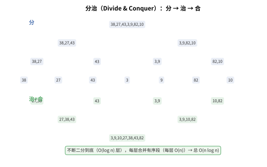
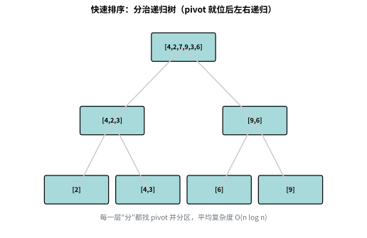
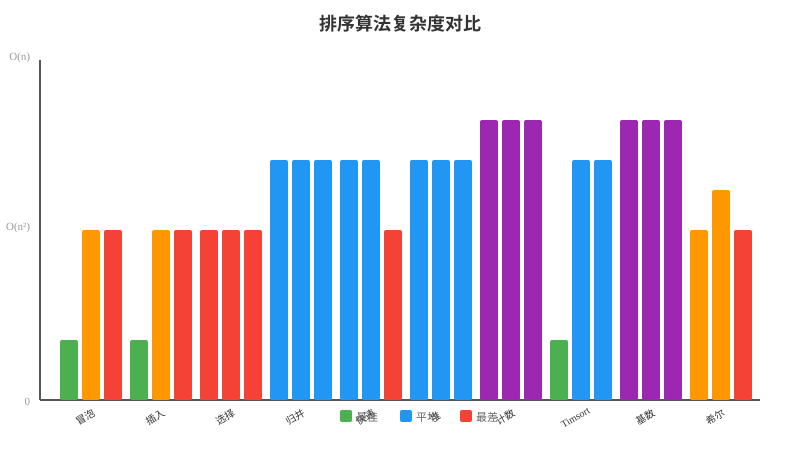
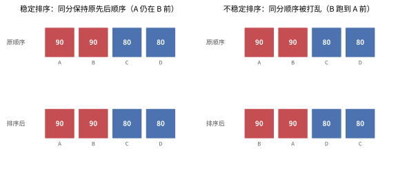
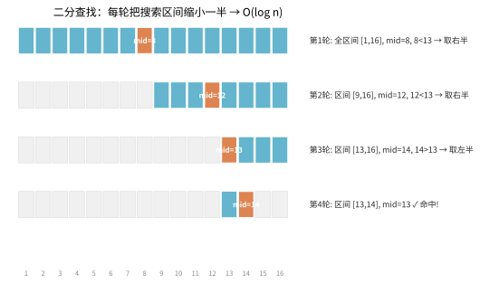

# 第三章：排序与搜索算法

> 排序和搜索是计算机科学中最基础、最核心的算法。无论是数据库查询、搜索引擎、还是日常编程，排序和搜索都无处不在。本章将带你从零开始，系统地掌握各种排序和搜索算法，理解它们的原理、实现和适用场景。

---

## 目录

1. [排序算法概述](#1-排序算法概述)
2. [冒泡排序（Bubble Sort）](#2-冒泡排序bubble-sort)
3. [选择排序（Selection Sort）](#3-选择排序selection-sort)
4. [插入排序（Insertion Sort）](#4-插入排序insertion-sort)
5. [归并排序（Merge Sort）](#5-归并排序merge-sort)
6. [快速排序（Quick Sort）](#6-快速排序quick-sort)
7. [堆排序（Heap Sort）](#7-堆排序heap-sort)
8. [计数排序（Counting Sort）](#8-计数排序counting-sort)
9. [桶排序（Bucket Sort）](#9-桶排序bucket-sort)
10. [排序算法对比表](#10-排序算法对比表)
11. [Python 内置排序：Timsort](#11-python-内置排序timsort)
12. [搜索算法概述](#12-搜索算法概述)
13. [线性搜索（Linear Search）](#13-线性搜索linear-search)
14. [二分搜索（Binary Search）](#14-二分搜索binary-search)
15. [二分搜索变体](#15-二分搜索变体)
16. [深度优先搜索（DFS）](#16-深度优先搜索dfs)
17. [广度优先搜索（BFS）](#17-广度优先搜索bfs)
18. [回溯法（Backtracking）](#18-回溯法backtracking)
19. [三分查找（Ternary Search）](#19-三分查找ternary-search)
20. [A\* 搜索（启发式搜索）](#20-a搜索启发式搜索)
21. [分支定界（Branch and Bound）](#21-分支定界branch-and-bound)
22. [迭代加深搜索（IDDFS）](#22-迭代加深搜索iddfs)

---

## 1. 排序算法概述

### 为什么排序如此重要？

排序是计算机科学中最基础的算法之一。排序之所以重要，是因为：

1. **有序数据更易处理**：二分查找、归并、去重等操作在有序数据上高效得多
2. **排序是许多算法的基础**：如 Kruskal 最小生成树、Huffman 编码等
3. **数据展示**：用户界面通常需要按某种顺序展示数据

### 排序算法的分类

```
                排序算法
                    │
        ┌───────────┼───────────┐
        │           │           │
    比较排序      非比较排序    混合排序
        │           │           │
   ┌────┼────┐   ┌──┼──┐     ┌──┴──┐
   │    │    │   │  │  │     │     │
 冒泡  选择 插入 计数 桶  基数 Timsort
 归并  快速  堆
```

### 评判排序算法的指标

| 指标 | 说明 |
|------|------|
| **时间复杂度** | 算法执行所需的时间，通常用大 O 表示法 |
| **空间复杂度** | 算法执行所需的额外内存空间 |
| **稳定性（Stability）** | 相等的元素在排序后是否保持原有相对顺序 |
| **原地排序（In-place）** | 是否只需要 $O(1)$ 或 $O(\log n)$ 的额外空间 |

---

## 2. 冒泡排序（Bubble Sort）

### 2.1 概念

> 💡 **类比：冒泡排序如同水中气泡上浮**
> 想象水中有一串大小不一的气泡，大气泡会慢慢浮到上面，小气泡留在下面。冒泡排序就是这样：每一轮遍历，相邻元素比较，大的往后挪，就像大气泡一步步"浮"到水面。经过 $n-1$ 轮，所有气泡都按大小排好序了。

冒泡排序是最简单的排序算法之一。它的核心思想是：**重复遍历数组，比较相邻的两个元素，如果顺序错误就交换它们**。每一轮遍历都会将当前未排序部分的最大元素"浮"到末尾。

### 2.2 算法过程图解

```
初始数组: [5, 3, 8, 4, 6]

第一轮遍历:
  [5, 3, 8, 4, 6] → 5 > 3, 交换 → [3, 5, 8, 4, 6]
  [3, 5, 8, 4, 6] → 5 < 8, 不变 → [3, 5, 8, 4, 6]
  [3, 5, 8, 4, 6] → 8 > 4, 交换 → [3, 5, 4, 8, 6]
  [3, 5, 4, 8, 6] → 8 > 6, 交换 → [3, 5, 4, 6, 8]  ← 8 到位

第二轮遍历:
  [3, 5, 4, 6, 8] → 3 < 5, 不变 → [3, 5, 4, 6, 8]
  [3, 5, 4, 6, 8] → 5 > 4, 交换 → [3, 4, 5, 6, 8]
  [3, 4, 5, 6, 8] → 5 < 6, 不变 → [3, 4, 5, 6, 8]  ← 6 到位

第三轮遍历:
  [3, 4, 5, 6, 8] → 3 < 4, 不变 → [3, 4, 5, 6, 8]
  [3, 4, 5, 6, 8] → 4 < 5, 不变 → [3, 4, 5, 6, 8]  ← 5 到位

第四轮遍历:
  [3, 4, 5, 6, 8] → 3 < 4, 不变 → [3, 4, 5, 6, 8]  ← 4 到位

排序完成: [3, 4, 5, 6, 8]
```

### 2.3 Python 实现

```python
def bubble_sort(arr):
    """冒泡排序 - 基础版本"""
    n = len(arr)
    for i in range(n - 1):
        for j in range(n - 1 - i):
            if arr[j] > arr[j + 1]:
                arr[j], arr[j + 1] = arr[j + 1], arr[j]
    return arr


def bubble_sort_optimized(arr):
    """冒泡排序 - 优化版本（提前终止）"""
    n = len(arr)
    for i in range(n - 1):
        swapped = False
        for j in range(n - 1 - i):
            if arr[j] > arr[j + 1]:
                arr[j], arr[j + 1] = arr[j + 1], arr[j]
                swapped = True
        # 如果没有发生交换，说明数组已经有序，提前退出
        if not swapped:
            break
    return arr
```

### 2.4 复杂度分析

| 指标 | 值 |
|------|-----|
| 平均时间复杂度 | $O(n^2)$ |
| 最坏时间复杂度 | $O(n^2)$ — 数组完全逆序 |
| 最好时间复杂度 | $O(n)$ — 优化版本，数组已有序 |
| 空间复杂度 | $O(1)$ — 原地排序 |
| 稳定性 | ✅ 稳定 |

### 2.5 练习题

**题目 1：冒泡排序的交换次数**
> 给定一个数组，计算冒泡排序过程中需要交换的次数。

```python
def count_bubble_swaps(arr):
    """计算冒泡排序的交换次数"""
    n = len(arr)
    swaps = 0
    for i in range(n - 1):
        for j in range(n - 1 - i):
            if arr[j] > arr[j + 1]:
                arr[j], arr[j + 1] = arr[j + 1], arr[j]
                swaps += 1
    return swaps

# 测试
print(count_bubble_swaps([5, 3, 8, 4, 6]))  # 输出: 4
```

**题目 2：冒泡排序的轮数**
> 给定一个数组，返回冒泡排序需要多少轮才能完成排序。（优化版本中，如果一轮没有交换就停止）

```python
def bubble_sort_rounds(arr):
    """返回冒泡排序需要的轮数"""
    n = len(arr)
    rounds = 0
    for i in range(n - 1):
        swapped = False
        for j in range(n - 1 - i):
            if arr[j] > arr[j + 1]:
                arr[j], arr[j + 1] = arr[j + 1], arr[j]
                swapped = True
        rounds += 1
        if not swapped:
            break
    return rounds

# 测试
print(bubble_sort_rounds([5, 3, 8, 4, 6]))  # 输出: 4
print(bubble_sort_rounds([1, 2, 3, 4, 5]))  # 输出: 1（已有序）
```

**题目 3：鸡尾酒排序（双向冒泡排序）**
> 实现鸡尾酒排序（Cocktail Sort），它从两个方向交替进行冒泡。

```python
def cocktail_sort(arr):
    """鸡尾酒排序（双向冒泡排序）"""
    n = len(arr)
    start, end = 0, n - 1
    swapped = True
    
    while swapped:
        swapped = False
        # 正向冒泡（从左到右）
        for i in range(start, end):
            if arr[i] > arr[i + 1]:
                arr[i], arr[i + 1] = arr[i + 1], arr[i]
                swapped = True
        if not swapped:
            break
        end -= 1
        
        # 反向冒泡（从右到左）
        for i in range(end - 1, start - 1, -1):
            if arr[i] > arr[i + 1]:
                arr[i], arr[i + 1] = arr[i + 1], arr[i]
                swapped = True
        start += 1
    
    return arr

# 测试
print(cocktail_sort([5, 3, 8, 4, 6]))  # 输出: [3, 4, 5, 6, 8]
```

---

## 3. 选择排序（Selection Sort）

### 3.1 概念

> 💡 **类比：选择排序如同"矮子里拔将军"**
> 想象你要从一队人中按身高排队。选择排序的做法是：第一轮从所有人中找出最矮的，让他站到第一个位置；第二轮从剩下的人中找出最矮的，让他站第二个位置……依此类推。每轮都在"未排序"的人中"选拔"出最矮的那个。

选择排序的核心思想非常简单：**每一轮从未排序部分中找到最小的元素，将其放到已排序部分的末尾**。

### 3.2 算法过程图解

```
初始数组: [5, 3, 8, 4, 6]

第1轮: 在 [5, 3, 8, 4, 6] 中找到最小值 3，与位置0的5交换
       → [3, 5, 8, 4, 6]

第2轮: 在 [5, 8, 4, 6] 中找到最小值 4，与位置1的5交换
       → [3, 4, 8, 5, 6]

第3轮: 在 [8, 5, 6] 中找到最小值 5，与位置2的8交换
       → [3, 4, 5, 8, 6]

第4轮: 在 [8, 6] 中找到最小值 6，与位置3的8交换
       → [3, 4, 5, 6, 8]

排序完成: [3, 4, 5, 6, 8]
```

### 3.3 Python 实现

```python
def selection_sort(arr):
    """选择排序"""
    n = len(arr)
    for i in range(n - 1):
        min_idx = i
        # 在未排序部分中找到最小值
        for j in range(i + 1, n):
            if arr[j] < arr[min_idx]:
                min_idx = j
        # 将最小值与当前位置交换
        if min_idx != i:
            arr[i], arr[min_idx] = arr[min_idx], arr[i]
    return arr
```

### 3.4 复杂度分析

| 指标 | 值 |
|------|-----|
| 平均时间复杂度 | $O(n^2)$ |
| 最坏时间复杂度 | $O(n^2)$ |
| 最好时间复杂度 | $O(n^2)$ — 无论是否有序，都要找最小值 |
| 空间复杂度 | $O(1)$ — 原地排序 |
| 稳定性 | ❌ 不稳定（交换可能破坏相对顺序） |

### 3.5 练习题

**题目 1：选择排序的交换次数**
> 选择排序最多进行 $n-1$ 次交换。验证这个性质。

```python
def count_selection_swaps(arr):
    """计算选择排序的交换次数"""
    n = len(arr)
    swaps = 0
    for i in range(n - 1):
        min_idx = i
        for j in range(i + 1, n):
            if arr[j] < arr[min_idx]:
                min_idx = j
        if min_idx != i:
            arr[i], arr[min_idx] = arr[min_idx], arr[i]
            swaps += 1
    return swaps

# 测试
print(count_selection_swaps([5, 3, 8, 4, 6]))  # 输出: 3
print(count_selection_swaps([5, 4, 3, 2, 1]))  # 输出: 2（不是4，因为有些交换恰好放对了位置）
```

**题目 2：双向选择排序**
> 同时找到最小值和最大值，分别放到两端，将比较次数减半。

```python
def bidirectional_selection_sort(arr):
    """双向选择排序（同时找最小和最大）"""
    n = len(arr)
    left, right = 0, n - 1
    
    while left < right:
        min_idx = max_idx = left
        for i in range(left, right + 1):
            if arr[i] < arr[min_idx]:
                min_idx = i
            if arr[i] > arr[max_idx]:
                max_idx = i
        
        # 将最小值放到左边
        if min_idx != left:
            arr[left], arr[min_idx] = arr[min_idx], arr[left]
            # 如果最大值原本在 left 位置，它被交换到了 min_idx
            if max_idx == left:
                max_idx = min_idx
        
        # 将最大值放到右边
        if max_idx != right:
            arr[right], arr[max_idx] = arr[max_idx], arr[right]
        
        left += 1
        right -= 1
    
    return arr

# 测试
print(bidirectional_selection_sort([5, 3, 8, 4, 6]))  # 输出: [3, 4, 5, 6, 8]
```

**题目 3：堆排序与选择排序的关系**
> 选择排序每轮在未排序部分找最小值需要 $O(n)$ 时间。如果使用堆来维护最小值，可以将找最小值的时间降到 $O(\log n)$，这就是堆排序的思路。见第 7 节。

---

## 4. 插入排序（Insertion Sort）

### 4.1 概念

插入排序的核心思想是：**将数组分为已排序和未排序两部分，每次从未排序部分取出第一个元素，插入到已排序部分的正确位置**。

> 💡 **类比：插入排序如同"打牌时整理手牌"**
>
> 想象你在打牌，每次摸一张新牌：
> - **已排序部分**：你手中已经排好的牌（从小到大）
> - **未排序部分**：桌上还没摸的牌堆
> - **插入过程**：摸一张新牌，从右往左找合适的位置，把比它大的牌往右挪，然后插入
>
> 这就是为什么插入排序对小数据或基本有序的数据很快——就像打牌时，手牌基本有序，每张新牌只需要挪动很少的位置。

### 4.2 算法过程图解

```
初始数组: [5, 3, 8, 4, 6]

第1轮: 已排序=[5], 取出3, 插入到5前面
       → [3, 5, 8, 4, 6]

第2轮: 已排序=[3, 5], 取出8, 插入到5后面
       → [3, 5, 8, 4, 6]

第3轮: 已排序=[3, 5, 8], 取出4, 插入到3和5之间
       → [3, 4, 5, 8, 6]

第4轮: 已排序=[3, 4, 5, 8], 取出6, 插入到5和8之间
       → [3, 4, 5, 6, 8]

排序完成: [3, 4, 5, 6, 8]
```

### 4.3 Python 实现

```python
def insertion_sort(arr):
    """插入排序"""
    for i in range(1, len(arr)):
        key = arr[i]  # 当前要插入的元素
        j = i - 1
        # 将大于 key 的元素向右移动
        while j >= 0 and arr[j] > key:
            arr[j + 1] = arr[j]
            j -= 1
        arr[j + 1] = key  # 将 key 插入正确位置
    return arr
```

### 4.4 复杂度分析

| 指标 | 值 |
|------|-----|
| 平均时间复杂度 | $O(n^2)$ |
| 最坏时间复杂度 | $O(n^2)$ — 数组完全逆序 |
| 最好时间复杂度 | $O(n)$ — 数组已有序 |
| 空间复杂度 | $O(1)$ — 原地排序 |
| 稳定性 | ✅ 稳定 |

**插入排序的特别之处**：对于小规模数组（$n \le$ 几十）或基本有序的数组，插入排序的实际性能可以超过 $O(n \log n)$ 的排序算法（如快速排序）。因此，很多高级排序算法在数据规模较小时会切换到插入排序。

### 4.5 练习题

**题目 1：二分插入排序**
> 使用二分查找来找到插入位置，减少比较次数。

```python
import bisect

def binary_insertion_sort(arr):
    """二分插入排序 - 使用二分查找找插入位置"""
    for i in range(1, len(arr)):
        key = arr[i]
        # 使用二分查找找到插入位置
        pos = bisect.bisect_left(arr, key, 0, i)
        # 将元素右移
        for j in range(i, pos, -1):
            arr[j] = arr[j - 1]
        arr[pos] = key
    return arr

# 测试
print(binary_insertion_sort([5, 3, 8, 4, 6]))  # 输出: [3, 4, 5, 6, 8]
```

**题目 2：对链表进行插入排序**
> LeetCode 147. 对链表进行插入排序。

```python
class ListNode:
    def __init__(self, val=0, next=None):
        self.val = val
        self.next = next

def insertion_sort_list(head):
    """对链表进行插入排序"""
    if not head or not head.next:
        return head
    
    dummy = ListNode(0)  # 哨兵节点
    dummy.next = head
    last_sorted = head  # 已排序部分的最后一个节点
    current = head.next  # 当前要插入的节点
    
    while current:
        if last_sorted.val <= current.val:
            # 当前节点已经有序，不需要移动
            last_sorted = current
            current = current.next
        else:
            # 从头开始查找插入位置
            prev = dummy
            while prev.next.val <= current.val:
                prev = prev.next
            
            # 将 current 插入到 prev 后面
            last_sorted.next = current.next
            current.next = prev.next
            prev.next = current
            
            current = last_sorted.next
    
    return dummy.next
```

**题目 3：插入排序的移动次数**
> 给定一个数组，计算插入排序过程中元素移动的总次数。

```python
def count_insertion_shifts(arr):
    """计算插入排序的移动次数"""
    n = len(arr)
    shifts = 0
    for i in range(1, n):
        key = arr[i]
        j = i - 1
        while j >= 0 and arr[j] > key:
            arr[j + 1] = arr[j]
            j -= 1
            shifts += 1
        arr[j + 1] = key
    return shifts

# 测试
print(count_insertion_shifts([5, 3, 8, 4, 6]))  # 输出: 5
```

---

## 5. 归并排序（Merge Sort）

### 5.1 概念

归并排序是**分治法（Divide & Conquer）** 的经典应用。它的核心思想是：

1. **分**：将数组递归地分成两半，直到每部分只有一个元素
2. **治**：将两个有序的子数组合并成一个有序数组

> 💡 **类比：把一堆乱书整理成有序书架**
> 想象你有一书架乱序的书。分治的做法是：先把书架对半分成两堆，每堆再对半分……直到每堆只剩一本书（天然有序）。然后从最小的堆开始，两两**归并**成有序堆，一层层网上合并，最终得到整排有序的书。下面的示意图展示了"分→治→合"的完整过程：



**为什么是 $O(n \log n)$？** 因为"不断二分"产生了 $O(\log n)$ 层，而每层合并需要 $O(n)$ 次比较，所以总复杂度是 $O(n \log n)$。

### 5.2 算法过程图解

```
初始数组: [5, 3, 8, 4, 6, 1, 9, 2]

                [5, 3, 8, 4, 6, 1, 9, 2]
               /                       \
        [5, 3, 8, 4]              [6, 1, 9, 2]
        /          \              /          \
    [5, 3]      [8, 4]        [6, 1]      [9, 2]
    /    \      /    \        /    \      /    \
  [5]   [3]   [8]   [4]    [6]   [1]   [9]   [2]    ← 分到单个元素
    \    /      \    /        \    /      \    /
    [3, 5]      [4, 8]        [1, 6]      [2, 9]    ← 两两合并
        \          /              \          /
        [3, 4, 5, 8]              [1, 2, 6, 9]      ← 合并
               \                      /
                [1, 2, 3, 4, 5, 6, 8, 9]           ← 最终结果
```

### 5.3 Python 实现

```python
def merge_sort(arr):
    """归并排序 - 递归实现"""
    if len(arr) <= 1:
        return arr
    
    # 分: 将数组分成两半
    mid = len(arr) // 2
    left = merge_sort(arr[:mid])
    right = merge_sort(arr[mid:])
    
    # 治: 合并两个有序数组
    return merge(left, right)


def merge(left, right):
    """合并两个有序数组"""
    result = []
    i = j = 0
    
    while i < len(left) and j < len(right):
        if left[i] <= right[j]:
            result.append(left[i])
            i += 1
        else:
            result.append(right[j])
            j += 1
    
    # 添加剩余元素
    result.extend(left[i:])
    result.extend(right[j:])
    return result


def merge_sort_inplace(arr, left=0, right=None):
    """归并排序 - 原地实现（不创建新数组，但需要辅助空间）"""
    if right is None:
        right = len(arr) - 1
    if left >= right:
        return
    
    mid = (left + right) // 2
    merge_sort_inplace(arr, left, mid)
    merge_sort_inplace(arr, mid + 1, right)
    merge_inplace(arr, left, mid, right)
    return arr


def merge_inplace(arr, left, mid, right):
    """原地合并两个有序子数组 arr[left..mid] 和 arr[mid+1..right]"""
    # 创建临时数组
    left_arr = arr[left:mid + 1]
    right_arr = arr[mid + 1:right + 1]
    
    i = j = 0
    k = left
    
    while i < len(left_arr) and j < len(right_arr):
        if left_arr[i] <= right_arr[j]:
            arr[k] = left_arr[i]
            i += 1
        else:
            arr[k] = right_arr[j]
            j += 1
        k += 1
    
    while i < len(left_arr):
        arr[k] = left_arr[i]
        i += 1
        k += 1
    
    while j < len(right_arr):
        arr[k] = right_arr[j]
        j += 1
        k += 1
```

### 5.4 复杂度分析

| 指标 | 值 |
|------|-----|
| 平均时间复杂度 | $O(n \log n)$ |
| 最坏时间复杂度 | $O(n \log n)$ |
| 最好时间复杂度 | $O(n \log n)$ |
| 空间复杂度 | $O(n)$ — 需要额外数组存储 |
| 稳定性 | ✅ 稳定 |

### 5.5 练习题

**题目 1：计算逆序对**
> 在数组中的两个数字，如果前面一个数字大于后面的数字，则这两个数字组成一个逆序对。使用归并排序的思想计算逆序对的数量。

```python
def count_inversions(arr):
    """计算数组中的逆序对数量（使用归并排序思想）"""
    def merge_and_count(arr, temp, left, mid, right):
        i = left      # 左半部分起始
        j = mid + 1   # 右半部分起始
        k = left      # 临时数组起始
        inv_count = 0
        
        while i <= mid and j <= right:
            if arr[i] <= arr[j]:
                temp[k] = arr[i]
                i += 1
            else:
                temp[k] = arr[j]
                j += 1
                # 左半部分从 i 到 mid 的所有元素都大于 arr[j]
                inv_count += (mid - i + 1)
            k += 1
        
        while i <= mid:
            temp[k] = arr[i]
            i += 1
            k += 1
        
        while j <= right:
            temp[k] = arr[j]
            j += 1
            k += 1
        
        for idx in range(left, right + 1):
            arr[idx] = temp[idx]
        
        return inv_count
    
    def sort_and_count(arr, temp, left, right):
        inv_count = 0
        if left < right:
            mid = (left + right) // 2
            inv_count += sort_and_count(arr, temp, left, mid)
            inv_count += sort_and_count(arr, temp, mid + 1, right)
            inv_count += merge_and_count(arr, temp, left, mid, right)
        return inv_count
    
    temp = [0] * len(arr)
    return sort_and_count(arr, temp, 0, len(arr) - 1)

# 测试
print(count_inversions([5, 3, 8, 4, 6]))  # 输出: 4（逆序对: (5,3), (5,4), (8,4), (8,6)）
```

**题目 2：合并 K 个有序数组**
> 将 K 个有序数组合并成一个有序数组。

```python
def merge_k_sorted_arrays(arrays):
    """合并 K 个有序数组"""
    if not arrays:
        return []
    
    def merge_two(a, b):
        """合并两个有序数组"""
        i = j = 0
        result = []
        while i < len(a) and j < len(b):
            if a[i] <= b[j]:
                result.append(a[i])
                i += 1
            else:
                result.append(b[j])
                j += 1
        result.extend(a[i:])
        result.extend(b[j:])
        return result
    
    # 两两合并（分治思想）
    while len(arrays) > 1:
        merged = []
        for i in range(0, len(arrays), 2):
            if i + 1 < len(arrays):
                merged.append(merge_two(arrays[i], arrays[i + 1]))
            else:
                merged.append(arrays[i])
        arrays = merged
    
    return arrays[0] if arrays else []

# 测试
arrays = [
    [1, 4, 7],
    [2, 5, 8],
    [3, 6, 9]
]
print(merge_k_sorted_arrays(arrays))  # 输出: [1, 2, 3, 4, 5, 6, 7, 8, 9]
```

**题目 3：外部排序**
> 当一个文件太大无法完全加载到内存时，可以使用外部排序。外部排序的核心就是归并排序的思想——将大文件分成多个小文件分别排序，然后多路归并。

---

## 6. 快速排序（Quick Sort）

### 6.1 概念

> 💡 **类比：快速排序如同"班级按身高分队"**
> 想象体育老师要让全班按身高排队。快速排序的做法是：随便选一个同学当"标杆"（pivot），然后让比标杆矮的站左边，比标杆高的站右边。这样标杆同学的位置就确定了。然后对左右两队分别重复这个过程——每队再选个标杆，继续分左右……直到每队只剩一人，排队完成。这就是分治思想：大问题拆成小问题，各个击破。



快速排序也是分治法的经典应用，由 Tony Hoare 在 1959 年提出。它的核心思想是：

1. 从数组中选择一个**基准元素（pivot）**
2. 将数组分为两部分：小于 pivot 的放在左边，大于 pivot 的放在右边（**partition**）
3. 递归地对左右两部分进行快速排序

### 6.2 算法过程图解

```
初始数组: [5, 3, 8, 4, 6, 1, 9, 2]
选择 pivot = 5（第一个元素）

分区过程:
  用两个指针 i 和 j，i 从左边开始，j 从右边开始
  [5, 3, 8, 4, 6, 1, 9, 2]
   i→                       ←j
  
  j 向左移动，找到小于 5 的元素: 2
  i 向右移动，找到大于 5 的元素: 8
  交换 8 和 2:
  [5, 3, 2, 4, 6, 1, 9, 8]
       i→       ←j
  
  j 继续向左，找到小于 5 的元素: 1
  i 继续向右，找到大于 5 的元素: 6
  交换 6 和 1:
  [5, 3, 2, 4, 1, 6, 9, 8]
          i→  ←j
  
  i 和 j 相遇，将 pivot 放到正确位置
  交换 5 和 1（arr[j]）:
  [1, 3, 2, 4, 5, 6, 9, 8]
                   ↑ pivot 到位

递归对 [1, 3, 2, 4] 和 [6, 9, 8] 进行快速排序...
```

### 6.3 Python 实现

```python
def quick_sort(arr, low=0, high=None):
    """快速排序 - Hoare 分区方案"""
    if high is None:
        high = len(arr) - 1
    
    if low < high:
        pivot_idx = partition(arr, low, high)
        quick_sort(arr, low, pivot_idx - 1)
        quick_sort(arr, pivot_idx + 1, high)
    return arr


def partition(arr, low, high):
    """分区函数 - Lomuto 分区方案（简单易懂）"""
    pivot = arr[high]  # 选择最后一个元素作为 pivot
    i = low - 1        # i 指向小于 pivot 的最后一个元素
    
    for j in range(low, high):
        if arr[j] <= pivot:
            i += 1
            arr[i], arr[j] = arr[j], arr[i]
    
    # 将 pivot 放到正确位置
    arr[i + 1], arr[high] = arr[high], arr[i + 1]
    return i + 1


def quick_sort_random_pivot(arr, low=0, high=None):
    """快速排序 - 随机 pivot（避免最坏情况）"""
    if high is None:
        high = len(arr) - 1
    
    if low < high:
        # 随机选择 pivot 并与最后一个元素交换
        import random
        rand_idx = random.randint(low, high)
        arr[rand_idx], arr[high] = arr[high], arr[rand_idx]
        
        pivot_idx = partition(arr, low, high)
        quick_sort_random_pivot(arr, low, pivot_idx - 1)
        quick_sort_random_pivot(arr, pivot_idx + 1, high)
    return arr
```

### 6.4 复杂度分析

| 指标 | 值 |
|------|-----|
| 平均时间复杂度 | $O(n \log n)$ |
| 最坏时间复杂度 | $O(n^2)$ — 每次选到最小/最大元素作为 pivot |
| 最好时间复杂度 | $O(n \log n)$ — 每次 pivot 正好是中位数 |
| 空间复杂度 | $O(\log n)$ — 递归栈空间 |
| 稳定性 | ❌ 不稳定 |

### 6.5 练习题

**题目 1：数组中的第 K 个最大元素**
> LeetCode 215. 在未排序的数组中找到第 K 个最大的元素。使用快速选择（Quick Select）算法。

```python
import random

def find_kth_largest(nums, k):
    """找到数组中第 K 个最大的元素 - 快速选择"""
    def partition(left, right):
        pivot_idx = random.randint(left, right)
        pivot = nums[pivot_idx]
        nums[pivot_idx], nums[right] = nums[right], nums[pivot_idx]
        
        store_idx = left
        for i in range(left, right):
            if nums[i] > pivot:
                nums[store_idx], nums[i] = nums[i], nums[store_idx]
                store_idx += 1
        
        nums[store_idx], nums[right] = nums[right], nums[store_idx]
        return store_idx
    
    left, right = 0, len(nums) - 1
    k = k - 1  # 转换为 0-based 索引
    
    while left <= right:
        pivot_idx = partition(left, right)
        if pivot_idx == k:
            return nums[pivot_idx]
        elif pivot_idx < k:
            left = pivot_idx + 1
        else:
            right = pivot_idx - 1
    
    return -1

# 测试
print(find_kth_largest([3, 2, 1, 5, 6, 4], 2))  # 输出: 5
```

**题目 2：颜色分类（荷兰国旗问题）**
> LeetCode 75. 给定一个包含红色、白色和蓝色（0、1、2）的数组，对其进行排序。使用三路快排的思想。

```python
def sort_colors(nums):
    """三路快排思想 - 荷兰国旗问题"""
    # 三指针: zero 指向 0 的右边界, two 指向 2 的左边界
    zero, i, two = 0, 0, len(nums) - 1
    
    while i <= two:
        if nums[i] == 0:
            nums[zero], nums[i] = nums[i], nums[zero]
            zero += 1
            i += 1
        elif nums[i] == 2:
            nums[two], nums[i] = nums[i], nums[two]
            two -= 1
            # 注意：这里 i 不增加，因为交换过来的可能是 0 或 1
        else:  # nums[i] == 1
            i += 1
    
    return nums

# 测试
print(sort_colors([2, 0, 2, 1, 1, 0]))  # 输出: [0, 0, 1, 1, 2, 2]
```

**题目 3：三路快排**
> 对于包含大量重复元素的数组，三路快排可以将相同的元素集中在一起，效率更高。

```python
def quick_sort_3way(arr, low=0, high=None):
    """三路快速排序 - 处理大量重复元素"""
    if high is None:
        high = len(arr) - 1
    
    if low >= high:
        return arr
    
    # 随机选择 pivot
    import random
    rand_idx = random.randint(low, high)
    arr[rand_idx], arr[high] = arr[high], arr[rand_idx]
    pivot = arr[high]
    
    # 三路分区
    # lt: 小于 pivot 的右边界
    # gt: 大于 pivot 的左边界
    # i: 当前遍历指针
    lt, i, gt = low, low, high
    
    while i <= gt:
        if arr[i] < pivot:
            arr[lt], arr[i] = arr[i], arr[lt]
            lt += 1
            i += 1
        elif arr[i] > pivot:
            arr[gt], arr[i] = arr[i], arr[gt]
            gt -= 1
        else:
            i += 1
    
    # 递归处理小于和大于的部分
    quick_sort_3way(arr, low, lt - 1)
    quick_sort_3way(arr, gt + 1, high)
    
    return arr

# 测试
print(quick_sort_3way([3, 1, 4, 1, 5, 9, 2, 6, 5, 3, 5]))
# 输出: [1, 1, 2, 3, 3, 4, 5, 5, 5, 6, 9]
```

---

## 7. 堆排序（Heap Sort）

### 7.1 概念

堆排序利用**堆（Heap）** 这种数据结构进行排序。堆是一个完全二叉树，分为：
- **最大堆**：每个节点的值都大于或等于其子节点的值
- **最小堆**：每个节点的值都小于或等于其子节点的值

> 💡 **类比：堆排序如同"选拔比赛"**
>
> 想象一场公司选拔最高管理者的过程：
> - **建堆**：先把所有人组织成一个金字塔结构，最顶尖的人是当前最强的
> - **第一轮**：让最强的人和最底层的人交换位置（最强的人"毕业"到结果数组），然后重新调整金字塔
> - **第二轮**：新的最强的人再和最底层交换，再次调整
> - **重复**：直到所有人都"毕业"到结果数组
>
> 这就是为什么堆排序总是 $O(n \log n)$——每次选拔都要调整金字塔（$\log n$），选 n 次。

堆排序的核心思想：
1. 将数组构建成一个最大堆（建堆）
2. 将堆顶元素（最大值）与堆的最后一个元素交换
3. 堆的大小减 1，对新的堆顶进行下沉调整
4. 重复步骤 2-3，直到堆为空

### 7.2 算法过程图解

```
建堆过程（将数组变为最大堆）:
初始数组: [4, 10, 3, 5, 1]

       4
      / \
     10  3
    / \
   5   1

从最后一个非叶子节点开始，自底向上建堆:

节点 10（索引 1）: 10 > 5, 10 > 1, 不需要调整
节点 4（索引 0）: 4 < 10, 4 < 3, 与较大的子节点 10 交换

       10
      / \
     4   3
    / \
   5   1

节点 4（索引 1）: 4 < 5, 与 5 交换

       10
      / \
     5   3
    / \
   4   1

建堆完成: [10, 5, 3, 4, 1]

排序过程:
第1轮: 交换 10 和 1 → [1, 5, 3, 4, 10], 对 [1, 5, 3, 4] 下沉
第2轮: 交换 5 和 4 → [4, 1, 3, 5, 10], 对 [4, 1, 3] 下沉
第3轮: 交换 4 和 3 → [3, 1, 4, 5, 10], 对 [3, 1] 下沉
第4轮: 交换 3 和 1 → [1, 3, 4, 5, 10]

排序完成: [1, 3, 4, 5, 10]
```

### 7.3 Python 实现

```python
def heap_sort(arr):
    """堆排序"""
    n = len(arr)
    
    # 建堆：从最后一个非叶子节点开始，自底向上构建最大堆
    for i in range(n // 2 - 1, -1, -1):
        heapify(arr, n, i)
    
    # 排序：逐个将堆顶元素（最大值）放到末尾
    for i in range(n - 1, 0, -1):
        arr[0], arr[i] = arr[i], arr[0]  # 交换堆顶和末尾
        heapify(arr, i, 0)  # 对新的堆顶进行下沉
    
    return arr


def heapify(arr, n, i):
    """下沉操作：确保以 i 为根的子树满足最大堆性质"""
    largest = i
    left = 2 * i + 1
    right = 2 * i + 2
    
    # 找到左、右子节点中的最大值
    if left < n and arr[left] > arr[largest]:
        largest = left
    if right < n and arr[right] > arr[largest]:
        largest = right
    
    # 如果最大值不是当前节点，交换并继续下沉
    if largest != i:
        arr[i], arr[largest] = arr[largest], arr[i]
        heapify(arr, n, largest)
```

### 7.4 复杂度分析

| 指标 | 值 |
|------|-----|
| 平均时间复杂度 | $O(n \log n)$ |
| 最坏时间复杂度 | $O(n \log n)$ |
| 最好时间复杂度 | $O(n \log n)$ |
| 空间复杂度 | $O(1)$ — 原地排序 |
| 稳定性 | ❌ 不稳定 |

### 7.5 练习题

**题目 1：使用 heapq 实现堆排序**
> Python 的 heapq 模块实现了最小堆，可以用它来排序。

```python
import heapq

def heap_sort_heapq(arr):
    """使用 heapq 实现堆排序"""
    heapq.heapify(arr)  # 建最小堆
    return [heapq.heappop(arr) for _ in range(len(arr))]

# 测试
arr = [5, 3, 8, 4, 6]
print(heap_sort_heapq(arr))  # 输出: [3, 4, 5, 6, 8]
```

**题目 2：数据流中的中位数**
> LeetCode 295. 设计一个数据结构，支持添加数据和获取中位数。

```python
import heapq

class MedianFinder:
    """数据流中的中位数 - 使用两个堆"""
    def __init__(self):
        # 最大堆（存较小的一半），Python 的 heapq 是最小堆，所以存负数
        self.small = []  # 最大堆
        # 最小堆（存较大的一半）
        self.large = []  # 最小堆
    
    def add_num(self, num: int) -> None:
        # 先加入最大堆
        heapq.heappush(self.small, -num)
        
        # 确保最大堆的所有元素 ≤ 最小堆的所有元素
        if self.small and self.large and (-self.small[0]) > self.large[0]:
            val = -heapq.heappop(self.small)
            heapq.heappush(self.large, val)
        
        # 平衡两个堆的大小
        if len(self.small) > len(self.large) + 1:
            val = -heapq.heappop(self.small)
            heapq.heappush(self.large, val)
        elif len(self.large) > len(self.small):
            val = heapq.heappop(self.large)
            heapq.heappush(self.small, -val)
    
    def find_median(self) -> float:
        if len(self.small) > len(self.large):
            return -self.small[0]
        return (-self.small[0] + self.large[0]) / 2.0

# 测试
mf = MedianFinder()
mf.add_num(1)
mf.add_num(2)
print(mf.find_median())  # 输出: 1.5
mf.add_num(3)
print(mf.find_median())  # 输出: 2.0
```

**题目 3：合并 K 个有序链表**
> LeetCode 23. 使用最小堆合并 K 个有序链表。

```python
import heapq

class ListNode:
    def __init__(self, val=0, next=None):
        self.val = val
        self.next = next

def merge_k_lists(lists):
    """合并 K 个有序链表 - 使用堆"""
    heap = []
    # 将每个链表的头节点加入堆
    for i, node in enumerate(lists):
        if node:
            heapq.heappush(heap, (node.val, i, node))
    
    dummy = ListNode(0)
    current = dummy
    
    while heap:
        val, i, node = heapq.heappop(heap)
        current.next = ListNode(val)
        current = current.next
        if node.next:
            heapq.heappush(heap, (node.next.val, i, node.next))
    
    return dummy.next
```

---

## 8. 计数排序（Counting Sort）

### 8.1 概念

计数排序是一种**非比较排序**，它通过统计每个元素出现的次数来进行排序。它的核心思想是：

> 💡 **类比：计数排序如同"按身高排队"**
>
> 想象体育老师让全班同学按身高排队：
> - **传统方法**：两两比较，谁高谁往后站（比较排序，$O(n \log n)$）
> - **计数排序**：老师直接数"1米5的有几个、1米6的有几个、1米7的有几个..."，然后按人数依次安排位置
>
> 这就是计数排序的核心——**不比较，只计数**。前提是身高范围不大（比如 1.4米~2.0米），如果范围太大（比如 1cm~300cm），计数数组就太长了。

1. 找出数组中的最大值和最小值
2. 统计每个值出现的次数
3. 根据计数信息，将元素放到正确的位置上

**适用条件**：数据范围（$k$）相对较小，且数据是整数（或可以映射为整数）。

### 8.2 算法过程图解

```
初始数组: [4, 2, 2, 8, 3, 3, 1]

范围: 最小值=1, 最大值=8

计数数组（统计每个值出现的次数）:
  值:   1  2  3  4  5  6  7  8
  计数: [1, 2, 2, 1, 0, 0, 0, 1]

前缀和（计算每个值在排序后的位置）:
  值:   1  2  3  4  5  6  7  8
  累计: [1, 3, 5, 6, 6, 6, 6, 7]

从后向前遍历原数组，根据累计位置放置元素:

遍历 1 → 位置 = 累计[1] - 1 = 0, 结果 = [1, _, _, _, _, _, _], 累计[1] = 0
遍历 3 → 位置 = 累计[3] - 1 = 4, 结果 = [1, _, _, _, 3, _, _], 累计[3] = 4
遍历 3 → 位置 = 累计[3] - 1 = 3, 结果 = [1, _, _, 3, 3, _, _], 累计[3] = 3
遍历 8 → 位置 = 累计[8] - 1 = 6, 结果 = [1, _, _, 3, 3, _, 8], 累计[8] = 6
遍历 2 → 位置 = 累计[2] - 1 = 2, 结果 = [1, _, 2, 3, 3, _, 8], 累计[2] = 2
遍历 2 → 位置 = 累计[2] - 1 = 1, 结果 = [1, 2, 2, 3, 3, _, 8], 累计[2] = 1
遍历 4 → 位置 = 累计[4] - 1 = 5, 结果 = [1, 2, 2, 3, 3, 4, 8], 累计[4] = 5

排序完成: [1, 2, 2, 3, 3, 4, 8]
```

### 8.3 Python 实现

```python
def counting_sort(arr):
    """计数排序"""
    if not arr:
        return arr
    
    # 找到最小值（用于处理负数）和最大值
    min_val, max_val = min(arr), max(arr)
    range_size = max_val - min_val + 1
    
    # 计数数组
    count = [0] * range_size
    
    # 统计每个元素出现的次数
    for num in arr:
        count[num - min_val] += 1
    
    # 计算前缀和
    for i in range(1, range_size):
        count[i] += count[i - 1]
    
    # 构建结果数组（从后向前遍历，保证稳定性）
    result = [0] * len(arr)
    for num in reversed(arr):
        idx = count[num - min_val] - 1
        result[idx] = num
        count[num - min_val] -= 1
    
    return result
```

### 8.4 复杂度分析

| 指标 | 值 |
|------|-----|
| 时间复杂度 | $O(n + k)$ — k 是数据范围 |
| 空间复杂度 | $O(k)$ — 计数数组 |
| 稳定性 | ✅ 稳定 |

### 8.5 练习题

**题目 1：使用计数排序对包含负数的数组排序**
> 上面的实现已经支持负数了。测试一下。

```python
# 测试
print(counting_sort([4, -2, 2, 8, -3, 3, 1]))  # 输出: [-3, -2, 1, 2, 3, 4, 8]
```

**题目 2：数组中缺失的最小正整数**
> LeetCode 41. 给你一个未排序的整数数组，请你找出其中没有出现的最小的正整数。

```python
def first_missing_positive(nums):
    """寻找缺失的最小正整数 - 使用计数排序思想"""
    n = len(nums)
    
    # 将每个正整数放到它应该在的位置上
    # 比如 1 应该放到索引 0, 2 放到索引 1, ...
    for i in range(n):
        # 当 nums[i] 在 [1, n] 范围内且不在正确位置时，交换
        while 1 <= nums[i] <= n and nums[nums[i] - 1] != nums[i]:
            correct_pos = nums[i] - 1
            nums[i], nums[correct_pos] = nums[correct_pos], nums[i]
    
    # 找到第一个不在正确位置上的数
    for i in range(n):
        if nums[i] != i + 1:
            return i + 1
    
    return n + 1

# 测试
print(first_missing_positive([3, 4, -1, 1]))  # 输出: 2
print(first_missing_positive([7, 8, 9, 11, 12]))  # 输出: 1
```

---

## 9. 桶排序（Bucket Sort）

### 9.1 概念

> 💡 **类比：桶排序如同"按分数段分班"**
>
> 想象学校要把学生按成绩排序：
> - **分桶**：先把学生按分数段分到不同班级——0-59分一个班、60-69分一个班、70-79分一个班、80-89分一个班、90-100分一个班
> - **桶内排序**：每个班内部再用自己的方法排序
> - **合并**：按班级顺序把学生合在一起，就是全校排名
>
> 桶排序的关键是**分桶策略**——如果分数分布均匀，每个班人数差不多，效率最高；如果都挤在一个分数段，就退化成普通排序了。

桶排序将数据分到有限数量的桶中，每个桶单独排序（可以使用其他排序算法），最后将桶中的数据合并。

**核心思想**：
1. 确定桶的数量和范围
2. 将每个元素放入对应的桶中
3. 对每个桶内部排序
4. 按顺序合并所有桶

**适用条件**：数据均匀分布时效率最高。如果数据分布不均，可能退化为 $O(n^2)$。

### 9.2 算法过程图解

```
初始数组: [0.42, 0.32, 0.33, 0.52, 0.37, 0.47, 0.51]

桶（假设 5 个桶，范围 [0, 1)）:

桶 0 [0.0, 0.2): 空
桶 1 [0.2, 0.4): 0.32, 0.33, 0.37
桶 2 [0.4, 0.6): 0.42, 0.52, 0.47, 0.51
桶 3 [0.6, 0.8): 空
桶 4 [0.8, 1.0): 空

对每个桶内部排序:
桶 1: [0.32, 0.33, 0.37]
桶 2: [0.42, 0.47, 0.51, 0.52]

合并结果:
[0.32, 0.33, 0.37, 0.42, 0.47, 0.51, 0.52]
```

### 9.3 Python 实现

```python
def bucket_sort(arr, bucket_size=5):
    """桶排序"""
    if not arr:
        return arr
    
    min_val, max_val = min(arr), max(arr)
    
    # 计算桶的数量
    bucket_count = (max_val - min_val) // bucket_size + 1
    buckets = [[] for _ in range(bucket_count)]
    
    # 将元素分配到桶中
    for num in arr:
        bucket_idx = (num - min_val) // bucket_size
        buckets[bucket_idx].append(num)
    
    # 对每个桶内部排序，然后合并
    result = []
    for bucket in buckets:
        result.extend(sorted(bucket))  # 可以使用任何排序算法
    
    return result


def bucket_sort_float(arr):
    """桶排序 - 专门用于 [0, 1) 范围内的浮点数"""
    if not arr:
        return arr
    
    n = len(arr)
    buckets = [[] for _ in range(n)]
    
    # 将元素分配到桶中
    for num in arr:
        bucket_idx = int(num * n)  # 对于 [0,1) 范围的数
        buckets[bucket_idx].append(num)
    
    # 对每个桶内部排序
    for bucket in buckets:
        bucket.sort()
    
    # 合并结果
    result = []
    for bucket in buckets:
        result.extend(bucket)
    
    return result
```

### 9.4 复杂度分析

| 指标 | 值 |
|------|-----|
| 平均时间复杂度 | $O(n + k)$ — 数据均匀分布 |
| 最坏时间复杂度 | $O(n^2)$ — 所有数据进入同一个桶 |
| 空间复杂度 | $O(n + k)$ |
| 稳定性 | ✅ 稳定（取决于桶内排序算法） |

### 9.5 练习题

**题目 1：桶排序计算数组中相邻元素的最大差值**
> LeetCode 164. 给定一个无序数组，求排序后相邻元素的最大差值。

```python
def maximum_gap(nums):
    """求排序后相邻元素的最大差值 - 使用桶排序思想"""
    if len(nums) < 2:
        return 0
    
    min_val, max_val = min(nums), max(nums)
    if min_val == max_val:
        return 0
    
    n = len(nums)
    # 每个桶的大小
    bucket_size = max(1, (max_val - min_val) // (n - 1))
    bucket_count = (max_val - min_val) // bucket_size + 1
    
    # 每个桶只记录最小值和最大值
    buckets = [[None, None] for _ in range(bucket_count)]
    
    for num in nums:
        idx = (num - min_val) // bucket_size
        if buckets[idx][0] is None:
            buckets[idx][0] = buckets[idx][1] = num
        else:
            buckets[idx][0] = min(buckets[idx][0], num)
            buckets[idx][1] = max(buckets[idx][1], num)
    
    # 计算最大差值
    max_gap = 0
    prev_max = buckets[0][1]
    for i in range(1, bucket_count):
        if buckets[i][0] is not None:
            max_gap = max(max_gap, buckets[i][0] - prev_max)
            prev_max = buckets[i][1]
    
    return max_gap

# 测试
print(maximum_gap([3, 6, 9, 1]))  # 输出: 3（排序后 [1, 3, 6, 9]，最大差值 3）
```

**题目 2：桶排序对字符串按长度分组**
> 给定一个字符串数组，按字符串长度分组，然后对每组内排序。

```python
def bucket_sort_by_length(strings):
    """按字符串长度进行桶排序"""
    if not strings:
        return []
    
    max_len = max(len(s) for s in strings)
    buckets = [[] for _ in range(max_len + 1)]
    
    # 按长度放入桶
    for s in strings:
        buckets[len(s)].append(s)
    
    # 对每个桶内排序，然后合并
    result = []
    for bucket in buckets:
        bucket.sort()  # 按字典序排序
        result.extend(bucket)
    
    return result

# 测试
strs = ["apple", "cat", "banana", "dog", "elephant", "fox"]
print(bucket_sort_by_length(strs))
# 输出: ['cat', 'dog', 'fox', 'apple', 'banana', 'elephant']
```

---

## 10. 排序算法对比表

| 排序算法 | 平均时间复杂度 | 最坏时间复杂度 | 最好时间复杂度 | 空间复杂度 | 稳定性 | 原地排序 | 适用场景 |
|---------|:------------:|:------------:|:------------:|:---------:|:-----:|:-------:|---------|
| **冒泡排序** | $O(n^2)$ | $O(n^2)$ | $O(n)$ | $O(1)$ | ✅ 稳定 | ✅ | 教学，小规模数据 |
| **选择排序** | $O(n^2)$ | $O(n^2)$ | $O(n^2)$ | $O(1)$ | ❌ 不稳定 | ✅ | 交换次数少 |
| **插入排序** | $O(n^2)$ | $O(n^2)$ | $O(n)$ | $O(1)$ | ✅ 稳定 | ✅ | 小规模或基本有序 |
| **希尔排序** | $O(n \log n)$~$O(n^2)$ | $O(n^2)$ | $O(n \log n)$ | $O(1)$ | ❌ 不稳定 | ✅ | 中等规模 |
| **归并排序** | $O(n \log n)$ | $O(n \log n)$ | $O(n \log n)$ | $O(n)$ | ✅ 稳定 | ❌ | 大规模，需要稳定 |
| **快速排序** | $O(n \log n)$ | $O(n^2)$ | $O(n \log n)$ | $O(\log n)$ | ❌ 不稳定 | ✅ | 大规模通用 |
| **堆排序** | $O(n \log n)$ | $O(n \log n)$ | $O(n \log n)$ | $O(1)$ | ❌ 不稳定 | ✅ | 需要原地排序 |
| **计数排序** | $O(n + k)$ | $O(n + k)$ | $O(n + k)$ | $O(k)$ | ✅ 稳定 | ❌ | 整数，范围小 |
| **桶排序** | $O(n + k)$ | $O(n^2)$ | $O(n + k)$ | $O(n + k)$ | ✅ 稳定 | ❌ | 数据均匀分布 |
| **基数排序** | $O(n \times k)$ | $O(n \times k)$ | $O(n \times k)$ | $O(n + k)$ | ✅ 稳定 | ❌ | 整数/定长字符串 |
| **Timsort** | $O(n \log n)$ | $O(n \log n)$ | $O(n)$ | $O(n)$ | ✅ 稳定 | ❌ | Python/Java 内置 |

> 下图直观地展示了各排序算法的时间复杂度对比：



### 什么是稳定性？为什么重要？

**稳定性**指：排序后，**相等的元素**是否保持它们在原数组中的**相对顺序**。

> 💡 **类比：按"成绩"排序，还要保留"报名先后"**
> 想象按成绩给同学排座位，如果两个人同分（都是 90 分），你希望先报名的 A 仍然排在 B 前面（保持原顺序），这才公平。稳定排序就能做到这一点，不稳定排序会打乱同分者之间的顺序。下图对比了两种结果：



**为什么在真实系统里重要？** 因为**多重排序**依赖它。例如在 Excel 里先按"部门"再按"姓名"排序，稳定的排序能保证：姓名排序不会破坏之前的部门分组顺序。所以归并排序、Timsort 这类稳定排序在数据库和库函数中被广泛采用。

### 如何选择排序算法？

1. **数据规模小（$n < 50$）** → 插入排序（常数小，实现简单）
2. **数据基本有序** → 插入排序（$O(n)$）
3. **数据规模大** → 快速排序（通用最快）、归并排序（需要稳定）
4. **需要稳定排序** → 归并排序、Timsort
5. **整数且范围小** → 计数排序（$O(n)$）
6. **数据均匀分布** → 桶排序（$O(n)$）
7. **内存有限** → 堆排序（$O(1)$ 额外空间）
8. **日常使用** → 直接调内置的 sorted() 或 .sort()（Timsort）

---

## 11. Python 内置排序：Timsort

### 11.1 什么是 Timsort？

> 💡 **类比：Timsort 如同"整理书架"**
>
> 想象你要整理一个乱糟糟的书柜：
> - **识别有序片段**：先看看哪些书已经按顺序排好了（比如 A-C 已经有序，D-F 已经有序）
> - **插入排序扩展**：对于太短的有序片段（比如只有 2 本书），用插入排序把它扩展到一定长度
> - **归并排序合并**：最后把这些有序片段像合并两摞扑克牌一样合并起来
>
> Timsort 的聪明之处在于——**它利用数据中已有的有序性**。如果数据本来就基本有序，它会非常快（接近 $O(n)$）；只有完全无序时才会退化到 $O(n \log n)$。这就是为什么 Python 和 Java 都选择它作为内置排序。

Timsort 是 Python 和 Java（以及 Android、Chrome V8 等）使用的内置排序算法。它由 Tim Peters 在 2002 年为 Python 设计，是一种**混合稳定排序算法**，结合了归并排序和插入排序的优点。

**Timsort 的核心思想**：
1. 识别数组中的"自然有序"片段（run）
2. 使用插入排序将短片段扩展为最小长度
3. 使用归并排序合并这些片段

### 11.2 如何使用

```python
# 使用 sorted() 函数（返回新列表）
arr = [5, 3, 8, 4, 6]
sorted_arr = sorted(arr)  # 返回新列表，原数组不变
print(sorted_arr)  # 输出: [3, 4, 5, 6, 8]
print(arr)         # 输出: [5, 3, 8, 4, 6]（原数组不变）

# 使用 .sort() 方法（原地排序）
arr.sort()  # 原地排序，修改原数组
print(arr)  # 输出: [3, 4, 5, 6, 8]

# 自定义排序
# 按绝对值排序
arr = [-5, 3, -8, 4, -6]
arr.sort(key=abs)
print(arr)  # 输出: [3, 4, -5, -6, -8]

# 按字符串长度排序
words = ["apple", "cat", "banana", "dog"]
words.sort(key=len)
print(words)  # 输出: ['cat', 'dog', 'apple', 'banana']

# 逆序排序
arr = [5, 3, 8, 4, 6]
arr.sort(reverse=True)
print(arr)  # 输出: [8, 6, 5, 4, 3]

# 多关键字排序（先按长度，再按字典序）
words = ["apple", "cat", "banana", "dog", "ant"]
words.sort(key=lambda x: (len(x), x))
print(words)  # 输出: ['ant', 'cat', 'dog', 'apple', 'banana']
```

### 11.3 Timsort 的性能特点

| 指标 | 值 |
|------|-----|
| 平均时间复杂度 | $O(n \log n)$ |
| 最坏时间复杂度 | $O(n \log n)$ |
| 最好时间复杂度 | $O(n)$ — 数组已有序 |
| 空间复杂度 | $O(n)$ |
| 稳定性 | ✅ 稳定 |

---

## 12. 搜索算法概述

### 搜索问题的分类

```
搜索算法
    │
    ├── 基于比较的搜索（在有序/无序数据中查找特定值）
    │   ├── 线性搜索 — O(n)
    │   └── 二分搜索 — O(log n)
    │
    ├── 图搜索（在图中搜索路径或连通性）
    │   ├── 深度优先搜索 (DFS) — O(V+E)
    │   └── 广度优先搜索 (BFS) — O(V+E)
    │
    └── 状态空间搜索（在解空间中搜索解）
        └── 回溯法 — 指数级
```

---

## 13. 线性搜索（Linear Search）

### 13.1 概念

> 💡 **类比：线性搜索如同"在字典里找一个词"**
>
> 想象你要在一本字典里找一个词：
> - **线性搜索**：从第一页开始，一页一页翻，直到找到目标词
> - **优点**：简单直接，不需要字典有序
> - **缺点**：如果词在最后几页，你要翻很久（$O(n)$）
>
> 这就是最朴素的搜索方式——**逐个检查，不跳过任何元素**。

线性搜索是最简单的搜索算法：**从数组的第一个元素开始，逐个比较，直到找到目标值或遍历完所有元素**。

### 13.2 Python 实现

```python
def linear_search(arr, target):
    """线性搜索"""
    for i, val in enumerate(arr):
        if val == target:
            return i
    return -1


def linear_search_all(arr, target):
    """线性搜索 - 找到所有出现的位置"""
    indices = []
    for i, val in enumerate(arr):
        if val == target:
            indices.append(i)
    return indices
```

### 13.3 复杂度分析

| 指标 | 值 |
|------|-----|
| 平均时间复杂度 | $O(n)$ |
| 最坏时间复杂度 | $O(n)$ |
| 最好时间复杂度 | $O(1)$ — 目标在第一个位置 |
| 空间复杂度 | $O(1)$ |

---

## 14. 二分搜索（Binary Search）

### 14.1 概念

二分搜索是一种在**有序数组**中查找目标值的算法。它的核心思想是：**每次将搜索范围缩小一半**。

> 💡 **类比：猜数字游戏 / 查词典**
> 想象玩"猜 1~100 之间的一个数"，最聪明的玩法不是从 1 开始逐个猜，而是每次猜中间值，根据"大了/小了"把范围砍半——最多 7 次就能猜中。查英文字典也一样：你不会从 A 页逐页翻到 Z，而是直接翻到中间，再根据字母前后继续对半翻。二分搜索就是这个策略的数学化。下图展示了查找目标 13 时，搜索区间如何一步步缩小：



**为什么是 $O(\log n)$？** 因为每次操作把规模减半，从 n 减到 1 需要的次数就是 $\log_2 n$。对 100 万个元素，最多只需 20 次比较。

### 14.2 算法过程图解

```
在有序数组 [1, 3, 4, 5, 6, 8, 9] 中查找 5

第1步: 左=0, 右=6, mid=3, arr[3]=5 ✓ 找到！
返回索引 3

在有序数组 [1, 3, 4, 5, 6, 8, 9] 中查找 7

第1步: 左=0, 右=6, mid=3, arr[3]=5 < 7, 搜索右半部分
       [1, 3, 4, 5, 6, 8, 9]
                   ↑左=4     ↑右=6

第2步: 左=4, 右=6, mid=5, arr[5]=8 > 7, 搜索左半部分
       [1, 3, 4, 5, 6, 8, 9]
                   ↑左=4 ↑右=4

第3步: 左=4, 右=4, mid=4, arr[4]=6 < 7, 左=5
       左=5 > 右=4, 搜索结束
返回 -1（未找到）
```

### 14.3 Python 实现

```python
def binary_search(arr, target):
    """二分搜索 - 递归实现"""
    def search(left, right):
        if left > right:
            return -1
        mid = (left + right) // 2
        if arr[mid] == target:
            return mid
        elif arr[mid] < target:
            return search(mid + 1, right)
        else:
            return search(left, mid - 1)
    
    return search(0, len(arr) - 1)


def binary_search_iterative(arr, target):
    """二分搜索 - 迭代实现"""
    left, right = 0, len(arr) - 1
    
    while left <= right:
        mid = (left + right) // 2
        if arr[mid] == target:
            return mid
        elif arr[mid] < target:
            left = mid + 1
        else:
            right = mid - 1
    
    return -1
```

### 14.4 Python 的 bisect 模块

Python 的 `bisect` 模块提供了高效的二分搜索工具：

```python
import bisect

arr = [1, 3, 4, 5, 6, 8, 9]

# bisect_left: 返回插入位置（如果有相同元素，返回最左边）
print(bisect.bisect_left(arr, 5))   # 输出: 3
print(bisect.bisect_left(arr, 7))   # 输出: 5（应该在 6 和 8 之间）

# bisect_right: 返回插入位置（如果有相同元素，返回最右边）
print(bisect.bisect_right(arr, 5))  # 输出: 4

# insort: 插入元素并保持有序
bisect.insort(arr, 7)
print(arr)  # 输出: [1, 3, 4, 5, 6, 7, 8, 9]
```

### 14.5 复杂度分析

| 指标 | 值 |
|------|-----|
| 时间复杂度 | $O(\log n)$ |
| 空间复杂度 | $O(1)$（迭代）/ $O(\log n)$（递归） |

---

## 15. 二分搜索变体

### 15.1 查找第一个等于目标值的位置

```python
def find_first_equal(arr, target):
    """查找第一个等于目标值的元素"""
    left, right = 0, len(arr) - 1
    result = -1
    
    while left <= right:
        mid = (left + right) // 2
        if arr[mid] == target:
            result = mid
            right = mid - 1  # 继续在左半部分搜索
        elif arr[mid] < target:
            left = mid + 1
        else:
            right = mid - 1
    
    return result
```

### 15.2 查找最后一个等于目标值的位置

```python
def find_last_equal(arr, target):
    """查找最后一个等于目标值的元素"""
    left, right = 0, len(arr) - 1
    result = -1
    
    while left <= right:
        mid = (left + right) // 2
        if arr[mid] == target:
            result = mid
            left = mid + 1  # 继续在右半部分搜索
        elif arr[mid] < target:
            left = mid + 1
        else:
            right = mid - 1
    
    return result
```

### 15.3 查找第一个大于等于目标值的位置

```python
def find_first_gte(arr, target):
    """查找第一个大于等于目标值的元素（C++ 的 lower_bound）"""
    left, right = 0, len(arr) - 1
    result = len(arr)  # 如果所有元素都小于 target，返回 len(arr)
    
    while left <= right:
        mid = (left + right) // 2
        if arr[mid] >= target:
            result = mid
            right = mid - 1
        else:
            left = mid + 1
    
    return result
```

### 15.4 搜索旋转排序数组

```python
def search_rotated(nums, target):
    """搜索旋转排序数组 - LeetCode 33"""
    left, right = 0, len(nums) - 1
    
    while left <= right:
        mid = (left + right) // 2
        
        if nums[mid] == target:
            return mid
        
        # 判断 mid 在哪个部分
        if nums[left] <= nums[mid]:  # 左半部分有序
            if nums[left] <= target < nums[mid]:
                right = mid - 1
            else:
                left = mid + 1
        else:  # 右半部分有序
            if nums[mid] < target <= nums[right]:
                left = mid + 1
            else:
                right = mid - 1
    
    return -1

# 测试
print(search_rotated([4, 5, 6, 7, 0, 1, 2], 0))  # 输出: 4
```

### 15.5 求平方根

```python
def my_sqrt(x: int) -> int:
    """求 x 的平方根的整数部分 - LeetCode 69"""
    if x < 2:
        return x
    
    left, right = 1, x // 2
    
    while left <= right:
        mid = (left + right) // 2
        if mid * mid == x:
            return mid
        elif mid * mid < x:
            left = mid + 1
        else:
            right = mid - 1
    
    return right

# 测试
print(my_sqrt(8))   # 输出: 2（因为 sqrt(8) ≈ 2.828）
print(my_sqrt(16))  # 输出: 4
```

---

> 下图展示了深度优先搜索（DFS）与广度优先搜索（BFS）在图遍历中的对比：


## 16. 深度优先搜索（DFS）

### 16.1 概念

> 💡 **类比：DFS 如同"走迷宫"**
>
> 想象你在一个迷宫里探索：
> - **深度优先**：选一条路一直走到底，直到走不通了，再退回到上一个岔路口，换一条路继续走
> - **回溯**：走不通时退回来（backtrack），尝试其他分支
> - **不撞南墙不回头**：这就是 DFS 的核心思想——先尽可能深入，再回头处理其他分支
>
> 就像你找钥匙时，会先翻遍一个抽屉的所有角落，翻不到再去翻下一个抽屉。

深度优先搜索（Depth-First Search）是一种用于遍历或搜索树或图的算法。它的核心思想是：**尽可能深地搜索，直到无法继续，然后回溯**。

### 16.2 算法过程图解

```
图结构:
    A
   / \
  B   C
 / \   \
D   E   F

DFS 遍历顺序（从 A 开始）:
A → B → D → (回溯到 B) → E → (回溯到 A) → C → F

结果: A, B, D, E, C, F
```

### 16.3 Python 实现

```python
# 图的 DFS
def dfs_recursive(graph, node, visited=None):
    """DFS - 递归实现"""
    if visited is None:
        visited = set()
    
    visited.add(node)
    print(node, end=" ")
    
    for neighbor in graph[node]:
        if neighbor not in visited:
            dfs_recursive(graph, neighbor, visited)
    
    return visited


def dfs_iterative(graph, start):
    """DFS - 迭代实现（使用栈）"""
    visited = set()
    stack = [start]
    
    while stack:
        node = stack.pop()
        if node not in visited:
            visited.add(node)
            print(node, end=" ")
            # 逆序入栈，使访问顺序与递归版本一致
            for neighbor in reversed(graph[node]):
                if neighbor not in visited:
                    stack.append(neighbor)
    
    return visited


# 示例图
graph = {
    'A': ['B', 'C'],
    'B': ['A', 'D', 'E'],
    'C': ['A', 'F'],
    'D': ['B'],
    'E': ['B'],
    'F': ['C']
}

print("DFS 递归: ", end="")
dfs_recursive(graph, 'A')  # 输出: A B D E C F
print()

print("DFS 迭代: ", end="")
dfs_iterative(graph, 'A')  # 输出: A B D E C F
print()
```

### 16.4 练习题

**题目 1：岛屿数量**
> LeetCode 200. 给你一个由 '1'（陆地）和 '0'（水）组成的二维网格，计算岛屿的数量。

```python
def num_islands(grid):
    """计算岛屿数量 - DFS"""
    if not grid:
        return 0
    
    rows, cols = len(grid), len(grid[0])
    count = 0
    
    def dfs(r, c):
        if r < 0 or r >= rows or c < 0 or c >= cols or grid[r][c] == '0':
            return
        grid[r][c] = '0'  # 标记已访问
        dfs(r + 1, c)
        dfs(r - 1, c)
        dfs(r, c + 1)
        dfs(r, c - 1)
    
    for r in range(rows):
        for c in range(cols):
            if grid[r][c] == '1':
                count += 1
                dfs(r, c)
    
    return count

# 测试
grid = [
    ['1', '1', '0', '0', '0'],
    ['1', '1', '0', '0', '0'],
    ['0', '0', '1', '0', '0'],
    ['0', '0', '0', '1', '1']
]
print(num_islands(grid))  # 输出: 3
```

**题目 2：克隆图**
> LeetCode 133. 给你一个无向连通图的引用，返回该图的深拷贝。

```python
class Node:
    def __init__(self, val=0, neighbors=None):
        self.val = val
        self.neighbors = neighbors if neighbors is not None else []

def clone_graph(node: 'Node') -> 'Node':
    """克隆图 - DFS"""
    if not node:
        return None
    
    visited = {}  # 原节点 → 克隆节点
    
    def dfs(n):
        if n in visited:
            return visited[n]
        
        clone = Node(n.val)
        visited[n] = clone
        
        for neighbor in n.neighbors:
            clone.neighbors.append(dfs(neighbor))
        
        return clone
    
    return dfs(node)
```

**题目 3：全排列**
> LeetCode 46. 给定一个不含重复数字的数组，返回其所有可能的全排列。

```python
def permute(nums):
    """全排列 - DFS + 回溯"""
    result = []
    
    def dfs(path, used):
        if len(path) == len(nums):
            result.append(path[:])
            return
        
        for i in range(len(nums)):
            if not used[i]:
                used[i] = True
                path.append(nums[i])
                dfs(path, used)
                path.pop()  # 回溯
                used[i] = False
    
    dfs([], [False] * len(nums))
    return result

# 测试
print(permute([1, 2, 3]))
# 输出: [[1,2,3], [1,3,2], [2,1,3], [2,3,1], [3,1,2], [3,2,1]]
```

---

## 17. 广度优先搜索（BFS）

### 17.1 概念

> 💡 **类比：BFS 如同"水波纹扩散"**
>
> 想象往湖里扔一块石头：
> - **逐层扩散**：水波纹从中心一圈一圈向外扩散，先到达近处的点，再到达远处的点
> - **队列实现**：用队列保存"下一圈要访问的点"，保证按距离顺序访问
> - **最短路径**：因为先访问近的再访问远的，所以第一次到达目标点时，走的就是最短路径
>
> 就像你在人群中找朋友，会先问身边的一圈人，再问他们的一圈人，一圈圈扩大范围。

广度优先搜索（Breadth-First Search）是一种用于遍历或搜索树或图的算法。它的核心思想是：**先访问离起点最近的节点，然后逐层向外扩展**。

BFS 使用**队列**来实现。

### 17.2 算法过程图解

```
图结构:
    A
   / \
  B   C
 / \   \
D   E   F

BFS 遍历顺序（从 A 开始）:
A → B → C → D → E → F

结果: A, B, C, D, E, F
```

### 17.3 Python 实现

```python
from collections import deque

def bfs(graph, start):
    """BFS - 使用队列"""
    visited = {start}
    queue = deque([start])
    
    while queue:
        node = queue.popleft()
        print(node, end=" ")
        
        for neighbor in graph[node]:
            if neighbor not in visited:
                visited.add(neighbor)
                queue.append(neighbor)
    
    return visited


# 示例图
graph = {
    'A': ['B', 'C'],
    'B': ['A', 'D', 'E'],
    'C': ['A', 'F'],
    'D': ['B'],
    'E': ['B'],
    'F': ['C']
}

print("BFS: ", end="")
bfs(graph, 'A')  # 输出: A B C D E F
print()
```

### 17.4 BFS 求最短路径

BFS 在无权图中可以找到从起点到其他点的最短路径（最少边数）：

```python
from collections import deque

def bfs_shortest_path(graph, start, end):
    """BFS 求无权图的最短路径"""
    if start == end:
        return [start]
    
    visited = {start}
    queue = deque([(start, [start])])  # (当前节点, 路径)
    
    while queue:
        node, path = queue.popleft()
        
        for neighbor in graph[node]:
            if neighbor == end:
                return path + [neighbor]
            if neighbor not in visited:
                visited.add(neighbor)
                queue.append((neighbor, path + [neighbor]))
    
    return None  # 没有路径


# 测试
graph = {
    'A': ['B', 'C'],
    'B': ['A', 'D', 'E'],
    'C': ['A', 'F'],
    'D': ['B'],
    'E': ['B', 'F'],
    'F': ['C', 'E']
}
print(bfs_shortest_path(graph, 'A', 'F'))  # 输出: ['A', 'C', 'F'] 或 ['A', 'B', 'E', 'F']
```

### 17.5 练习题

**题目 1：二叉树的层序遍历**
> LeetCode 102. 给你一个二叉树，返回其按层序遍历得到的节点值。

```python
from collections import deque

class TreeNode:
    def __init__(self, val=0, left=None, right=None):
        self.val = val
        self.left = left
        self.right = right

def level_order(root):
    """二叉树的层序遍历 - BFS"""
    if not root:
        return []
    
    result = []
    queue = deque([root])
    
    while queue:
        level_size = len(queue)
        level = []
        
        for _ in range(level_size):
            node = queue.popleft()
            level.append(node.val)
            if node.left:
                queue.append(node.left)
            if node.right:
                queue.append(node.right)
        
        result.append(level)
    
    return result

# 测试
root = TreeNode(3)
root.left = TreeNode(9)
root.right = TreeNode(20, TreeNode(15), TreeNode(7))
print(level_order(root))  # 输出: [[3], [9, 20], [15, 7]]
```

**题目 2：单词接龙**
> LeetCode 127. 给定两个单词（beginWord 和 endWord）和一个字典，找到从 beginWord 到 endWord 的最短转换序列的长度。

```python
from collections import deque

def ladder_length(begin_word, end_word, word_list):
    """单词接龙 - BFS 求最短路径长度"""
    word_set = set(word_list)
    if end_word not in word_set:
        return 0
    
    queue = deque([(begin_word, 1)])  # (当前单词, 路径长度)
    visited = {begin_word}
    
    while queue:
        word, length = queue.popleft()
        
        if word == end_word:
            return length
        
        # 尝试改变每个位置
        for i in range(len(word)):
            for c in 'abcdefghijklmnopqrstuvwxyz':
                new_word = word[:i] + c + word[i+1:]
                if new_word in word_set and new_word not in visited:
                    visited.add(new_word)
                    queue.append((new_word, length + 1))
    
    return 0

# 测试
word_list = ["hot", "dot", "dog", "lot", "log", "cog"]
print(ladder_length("hit", "cog", word_list))  # 输出: 5 (hit→hot→dot→dog→cog)
```

**题目 3：01 矩阵**
> LeetCode 542. 给定一个由 0 和 1 组成的矩阵，找出每个元素到最近的 0 的距离。

```python
from collections import deque

def update_matrix(mat):
    """01 矩阵 - 多源 BFS"""
    rows, cols = len(mat), len(mat[0])
    dist = [[float('inf')] * cols for _ in range(rows)]
    queue = deque()
    
    # 将所有 0 加入队列
    for r in range(rows):
        for c in range(cols):
            if mat[r][c] == 0:
                dist[r][c] = 0
                queue.append((r, c))
    
    # BFS
    directions = [(-1, 0), (1, 0), (0, -1), (0, 1)]
    while queue:
        r, c = queue.popleft()
        for dr, dc in directions:
            nr, nc = r + dr, c + dc
            if 0 <= nr < rows and 0 <= nc < cols and dist[nr][nc] > dist[r][c] + 1:
                dist[nr][nc] = dist[r][c] + 1
                queue.append((nr, nc))
    
    return dist

# 测试
mat = [[0, 0, 0], [0, 1, 0], [1, 1, 1]]
print(update_matrix(mat))
# 输出: [[0,0,0], [0,1,0], [1,2,1]]
```

---

## 18. 回溯法（Backtracking）

### 18.1 概念

> 💡 **类比：回溯法如同"解数独"**
>
> 想象你在玩数独游戏：
> - **尝试候选**：在一个空格填入一个可能的数字
> - **检查冲突**：看这个数字是否和同行、同列、同宫的数字冲突
> - **回溯撤销**：如果冲突了，就擦掉这个数字，换另一个数字再试
> - **剪枝优化**：如果某个数字明显不可能（比如会导致后续无解），就提前放弃这条路径
>
> 回溯法就是**系统地尝试所有可能性，遇到死胡同就退回来换路走**。通过剪枝，可以避免尝试明显不可能的路径，大幅提高效率。

回溯法是一种通过**尝试所有可能的候选解**来解决问题的算法。当它发现当前的候选解不可能是有效解时，就会"回溯"（撤销上一步的选择），尝试其他选项。

回溯法的核心是**深度优先搜索 + 剪枝**。

### 18.2 算法框架

```python
def backtrack(路径, 选择列表):
    if 满足结束条件:
        记录路径
        return
    
    for 选择 in 选择列表:
        做选择
        backtrack(路径, 选择列表)
        撤销选择
```

### 18.3 N 皇后问题

**问题**：在 $N \times N$ 的棋盘上放置 N 个皇后，使它们互不攻击（同一行、同一列、同一对角线上不能有两个皇后）。

```python
def solve_n_queens(n):
    """N 皇后问题 - 回溯法"""
    result = []
    board = [['.'] * n for _ in range(n)]
    
    # 用集合记录被占用的列和对角线
    cols = set()
    diag1 = set()  # 主对角线 (r - c)
    diag2 = set()  # 副对角线 (r + c)
    
    def backtrack(row):
        if row == n:
            result.append([''.join(r) for r in board])
            return
        
        for col in range(n):
            if col in cols or (row - col) in diag1 or (row + col) in diag2:
                continue
            
            # 做选择
            board[row][col] = 'Q'
            cols.add(col)
            diag1.add(row - col)
            diag2.add(row + col)
            
            backtrack(row + 1)
            
            # 撤销选择
            board[row][col] = '.'
            cols.remove(col)
            diag1.remove(row - col)
            diag2.remove(row + col)
    
    backtrack(0)
    return result


# 测试
solutions = solve_n_queens(4)
for sol in solutions:
    for row in sol:
        print(row)
    print()
# 输出:
# .Q..
# ...Q
# Q...
# ..Q.
#
# ..Q.
# Q...
# ...Q
# .Q..
```

### 18.4 数独求解器

```python
def solve_sudoku(board):
    """数独求解器 - 回溯法"""
    def is_valid(r, c, num):
        # 检查行
        for j in range(9):
            if board[r][j] == num:
                return False
        # 检查列
        for i in range(9):
            if board[i][c] == num:
                return False
        # 检查 3×3 宫格
        start_r, start_c = (r // 3) * 3, (c // 3) * 3
        for i in range(3):
            for j in range(3):
                if board[start_r + i][start_c + j] == num:
                    return False
        return True
    
    def backtrack():
        for r in range(9):
            for c in range(9):
                if board[r][c] == '.':
                    for num in '123456789':
                        if is_valid(r, c, num):
                            board[r][c] = num
                            if backtrack():
                                return True
                            board[r][c] = '.'
                    return False
        return True
    
    backtrack()


# 测试
board = [
    ["5","3",".",".","7",".",".",".","."],
    ["6",".",".","1","9","5",".",".","."],
    [".","9","8",".",".",".",".","6","."],
    ["8",".",".",".","6",".",".",".","3"],
    ["4",".",".","8",".","3",".",".","1"],
    ["7",".",".",".","2",".",".",".","6"],
    [".","6",".",".",".",".","2","8","."],
    [".",".",".","4","1","9",".",".","5"],
    [".",".",".",".","8",".",".","7","9"]
]

solve_sudoku(board)
for row in board:
    print(row)
```

### 18.5 练习题

**题目 1：组合总和**
> LeetCode 39. 给定一个无重复元素的数组 candidates 和一个目标数 target，找出 candidates 中所有可以使数字和为 target 的组合。

```python
def combination_sum(candidates, target):
    """组合总和 - 回溯"""
    result = []
    
    def backtrack(start, path, remaining):
        if remaining == 0:
            result.append(path[:])
            return
        if remaining < 0:
            return
        
        for i in range(start, len(candidates)):
            path.append(candidates[i])
            backtrack(i, path, remaining - candidates[i])
            path.pop()
    
    backtrack(0, [], target)
    return result

# 测试
print(combination_sum([2, 3, 6, 7], 7))
# 输出: [[2, 2, 3], [7]]
```

**题目 2：子集**
> LeetCode 78. 给定一组不含重复元素的整数数组，返回该数组所有可能的子集。

```python
def subsets(nums):
    """子集 - 回溯"""
    result = []
    
    def backtrack(start, path):
        result.append(path[:])
        for i in range(start, len(nums)):
            path.append(nums[i])
            backtrack(i + 1, path)
            path.pop()
    
    backtrack(0, [])
    return result

# 测试
print(subsets([1, 2, 3]))
# 输出: [[], [1], [1,2], [1,2,3], [1,3], [2], [2,3], [3]]
```

**题目 3：括号生成**
> LeetCode 22. 数字 n 代表生成括号的对数，请你设计一个函数，用于能够生成所有可能的并且有效的括号组合。

```python
def generate_parenthesis(n):
    """括号生成 - 回溯"""
    result = []
    
    def backtrack(path, left, right):
        if len(path) == 2 * n:
            result.append(''.join(path))
            return
        
        if left < n:
            path.append('(')
            backtrack(path, left + 1, right)
            path.pop()
        
        if right < left:
            path.append(')')
            backtrack(path, left, right + 1)
            path.pop()
    
    backtrack([], 0, 0)
    return result

# 测试
print(generate_parenthesis(3))
# 输出: ['((()))', '(()())', '(())()', '()(())', '()()()']
```

---

## 19. 三分查找（Ternary Search）

### 19.1 概念

> 💡 **类比：爬山时比较左右两边的坡度**
>
> 想象你在爬一座只有一个山顶的山（单峰函数）。你站在山腰上：
> - **二分查找**：只在"有序"（单调）的数据上有效，无法处理"先升后降"的山形
> - **三分查找**：每一轮同时看左右两个"三等分点"，比较它们的高度，判断山顶在哪一侧，然后砍掉确定不含山顶的那一段
>
> 就像爬山时，你比较一下左边一点和右边一点的坡度，就知道该往哪边走才能更快登顶。

三分查找（Ternary Search）用于在**单峰函数**（先增后减）或**单谷函数**（先减后增）上求极值。它的核心思想是：**在区间 $[l, r]$ 中取两个三等分点 $m_1, m_2$，比较 $f(m_1)$ 与 $f(m_2)$，从而缩小搜索范围**。

### 19.2 算法思想

对于单峰函数，设 $m_1 = l + \frac{r-l}{3}$，$m_2 = r - \frac{r-l}{3}$：

- 若 $f(m_1) < f(m_2)$：最大值在 $[m_1, r]$ 之间，令 $l = m_1$
- 若 $f(m_1) > f(m_2)$：最大值在 $[l, m_2]$ 之间，令 $r = m_2$

每轮把区间缩小到原来的 $\frac{2}{3}$，因此复杂度为 $O(\log n)$。

### 19.3 Python 实现

```python
def ternary_search(f, l, r, eps=1e-9):
    """三分查找 - 浮点版本，求单峰函数 f 的最大值"""
    while r - l > eps:
        m1 = l + (r - l) / 3
        m2 = r - (r - l) / 3
        if f(m1) < f(m2):
            l = m1
        else:
            r = m2
    return (l + r) / 2  # 返回极大值点


def ternary_search_int(f, l, r):
    """三分查找 - 整数版本，求单峰函数 f 的最大值点"""
    while r - l > 2:
        m1 = l + (r - l) // 3
        m2 = r - (r - l) // 3
        if f(m1) < f(m2):
            l = m1
        else:
            r = m2
    # 在 [l, r] 中取最大值点
    return max(range(l, r + 1), key=lambda x: f(x))


# 测试：f(x) = -(x - 3)^2 + 5 在 [0, 10] 上最大值点约为 x=3
f = lambda x: -(x - 3) ** 2 + 5
print(ternary_search(f, 0, 10))      # 输出: 3.0
print(ternary_search_int(f, 0, 10))  # 输出: 3
```

### 19.4 复杂度与适用场景

| 指标 | 值 |
|------|-----|
| 时间复杂度 | $O(\log n)$ |
| 空间复杂度 | $O(1)$ |

**适用场景**：求单峰/单谷函数的极值，如求二次函数的极值点、三分搜索"最优点"等。注意 **三分查找只适用于单峰/单谷函数**，对多峰函数会失效。

---

## 20. A* 搜索（启发式搜索）

### 20.1 概念

> 💡 **类比：GPS 导航"不仅看已走的路，还估算到终点的直线距离"**
>
> 想象你用 GPS 导航找一条从家到公司的路：
> - **已走代价 $g(n)$**：你已经走过的路程
> - **启发估计 $h(n)$**：从当前位置到终点至少还要多远（比如直线距离，不会比真实更短）
> - **总估计 $f(n) = g(n) + h(n)$**：优先走 $f$ 最小的方向，这样既能少走弯路，又能朝目标前进
>
> 相比之下，BFS 只关心"走了几步"，Dijkstra 只关心"已走代价"，它们都不"看"终点在哪。A* 多了一个"朝目标前进"的引导，所以通常更快。

A\*（读作 A-star）是一种**带启发函数的图搜索算法**，广泛应用在路径规划、游戏 AI、机器人寻路中。它的核心公式是：

$$f(n) = g(n) + h(n)$$

- $g(n)$：从起点到节点 $n$ 的实际代价
- $h(n)$：从节点 $n$ 到终点的**启发式估计代价**
- $f(n)$：经过这个节点的总估计代价，A\* 每次选择 $f$ 最小的节点扩展

### 20.2 与 BFS、Dijkstra 的关系

- **BFS**：$g(n)$ 为到起点的步数，$h(n) = 0$，适合无权图
- **Dijkstra**：$g(n)$ 为到起点的实际边权，$h(n) = 0$，适合有权图，但盲目地向四周扩展
- **A\***：$g(n) + h(n)$，当 $h(n)$ 是**可采纳**（admissible，即 $h(n) \le$ 真实剩余代价）时，A\* 保证找到最优路径，且比 Dijkstra 更高效

### 20.3 Python 实现

```python
import heapq


def a_star(start, goal, neighbors, h):
    """A* 搜索
    neighbors(node) -> [(neighbor, cost), ...]
    h(node) -> 启发式估计代价（到终点的估计距离）
    """
    open_heap = [(h(start), 0, start)]  # (f, g, node)
    g_score = {start: 0}
    came_from = {start: None}

    while open_heap:
        f, g, current = heapq.heappop(open_heap)
        if current == goal:
            # 重建路径
            path = []
            while current is not None:
                path.append(current)
                current = came_from[current]
            return path[::-1]

        for nxt, cost in neighbors(current):
            tentative_g = g_score[current] + cost
            if tentative_g < g_score.get(nxt, float('inf')):
                g_score[nxt] = tentative_g
                came_from[nxt] = current
                heapq.heappush(open_heap, (tentative_g + h(nxt), tentative_g, nxt))

    return None  # 无路径
```

### 20.4 复杂度与适用场景

| 指标 | 值 |
|------|-----|
| 时间复杂度 | 最坏 $O(b^d)$，$b$ 为分支因子，$d$ 为解深度 |
| 空间复杂度 | $O(b^d)$ |

**适用场景**：需要"朝目标方向"搜索的路径规划问题，如网格地图寻路、游戏 NPC 寻路、机器人导航。$h(n)$ 越接近真实剩余代价，搜索越高效。

---

## 21. 分支定界（Branch and Bound）

### 21.1 概念

> 💡 **类比：逛超市时先算一个"预算下限"**
>
> 想象你要在预算内买一堆商品，让总价值最大（0-1 背包）：
> - **分支**：对每个商品，都可以选择"买"或"不买"，形成一棵决策树
> - **定界**：每条分支都算一个"这条路线最多能值多少"的上界。如果某个分支的上界，已经不如当前已找到的最优解，就**直接放弃**这条路线
>
> 就像逛超市时，你心里先有个预算下限，一旦发现这条购物路线的价值不可能超过已挑好的方案，就果断换一条路线，而不会把整棵决策树都逛完。

分支定界（Branch and Bound）是一种**解离散优化问题**的精确算法。它通过**分支**（把解空间划分成子问题）和**定界**（计算每个子问题的上下界，剪掉不可能更优的分支）来系统地搜索最优解。

### 21.2 核心思想

- **分支（Branch）**：把当前问题分解成若干更小的子问题（如"选/不选当前物品"）
- **定界（Bound）**：对每个子问题计算一个**上界**（最大化问题）或**下界**（最小化问题）
- **剪枝（Pruning）**：如果某个子问题的上界 $\le$ 当前已找到的最优解，就剪掉它

### 21.3 0-1 背包示例

给定 $n$ 个物品（重量 $w$、价值 $v$）和背包容量 $C$，求能装入的最大价值。

```python
def knapsack_branch_bound(weights, values, capacity):
    """0-1 背包 - 分支定界（按价值密度排序 + 贪心上界）"""
    n = len(weights)
    items = sorted(zip(weights, values),
                   key=lambda x: x[1] / x[0], reverse=True)  # 按性价比降序
    best = 0

    def bound(idx, cur_weight, cur_value):
        """计算从 idx 开始、在剩余容量下能获得的价值上界（贪心）"""
        total = cur_value
        w = cur_weight
        for i in range(idx, n):
            if w + items[i][0] <= capacity:
                w += items[i][0]
                total += items[i][1]
            else:
                # 部分装入剩余容量，得到一个松弛上界
                total += (capacity - w) * (items[i][1] / items[i][0])
                break
        return total

    def dfs(idx, cur_weight, cur_value):
        nonlocal best
        if cur_weight > capacity:
            return
        best = max(best, cur_value)
        if idx >= n:
            return
        # 定界：如果当前分支的价值上界都超不过 best，就剪枝
        if bound(idx, cur_weight, cur_value) <= best:
            return
        # 分支：选当前物品
        dfs(idx + 1, cur_weight + items[idx][0], cur_value + items[idx][1])
        # 分支：不选当前物品
        dfs(idx + 1, cur_weight, cur_value)

    dfs(0, 0, 0)
    return best


# 测试
weights = [2, 3, 4, 5]
values = [3, 4, 5, 6]
print(knapsack_branch_bound(weights, values, 5))  # 输出: 7（选物品1+物品2）
```

> 说明：分支定界通过"上界剪枝"大幅减少搜索空间，但它仍是**精确算法**，最坏情况下仍可能退化为指数级。

### 21.4 复杂度与适用场景

| 指标 | 值 |
|------|-----|
| 时间复杂度 | 最坏指数级 $O(2^n)$，实际远小于此 |
| 空间复杂度 | $O(n)$（递归栈） |

**适用场景**：解离散优化问题（0-1 背包、旅行商 TSP、任务调度等）的精确解。当需要**保证最优**、且上界较好能剪枝时，分支定界优于暴力枚举。

---

## 22. 迭代加深搜索（IDDFS）

### 22.1 概念

> 💡 **类比：反复加深井的探测深度，先浅后深**
>
> 想象你在一片树林里找钥匙，但不知道它埋在多深的地下：
> - **DFS**：一次挖到底，可能误入一条很深的死胡同，浪费大量时间在地下
> - **BFS**：一层一层挖，但需要记住每一层所有位置，占用大量内存
> - **IDDFS**：先只挖 1 米深，找不到就换范围；再挖 2 米深……每次加深一点点，不断重复
>
> 虽然"换范围重挖"看似浪费，但深层的节点数量远超浅层，所以重复浅层的开销可以忽略，整体依然高效，且几乎不占内存。

迭代加深深度优先搜索（Iterative Deepening DFS）**逐步增加深度限制**反复做 DFS：先做深度为 1 的 DFS，再做深度为 2 的 DFS……直到找到解。它兼得 **DFS 的低空间占用** 和 **BFS 的最优性**（第一次找到的路径深度最小）。

### 22.2 核心思想

- 设定深度限制 $depth = 1, 2, 3, \dots$
- 每次用带深度限制的 DFS 搜索，超过 $depth$ 就返回
- 第一个找到的解就是深度最小的解

由于每层节点数通常远多于上层，重复搜索前面各层的总开销约为最后一层的 $\frac{b}{b-1}$ 倍（$b$ 为分支因子），因此整体复杂度与 BFS 同阶。

### 22.3 Python 实现

```python
def depth_limited_dfs(graph, node, target, depth, visited):
    """带深度限制的 DFS，返回是否找到 target"""
    if node == target:
        return True
    if depth == 0:
        return False
    visited.add(node)
    for nxt in graph[node]:
        if nxt not in visited:
            if depth_limited_dfs(graph, nxt, target, depth - 1, visited):
                return True
    visited.remove(node)
    return False


def iterative_deepening_dfs(graph, start, target, max_depth):
    """IDDFS - 逐步加深深度限制"""
    for depth in range(max_depth + 1):
        if depth_limited_dfs(graph, start, target, depth, set()):
            return depth  # 找到 target，返回最小深度
    return -1  # 超出 max_depth 仍未找到


# 测试
graph = {
    1: [2, 3],
    2: [1, 4, 5],
    3: [1, 6],
    4: [2],
    5: [2, 7],
    6: [3],
    7: [5],
}
print(iterative_deepening_dfs(graph, 1, 7, 10))  # 输出: 3（1→2→5→7）
```

### 22.4 复杂度与适用场景

| 指标 | 值 |
|------|-----|
| 时间复杂度 | $O(b^d)$，$b$ 为分支因子，$d$ 为解的深度 |
| 空间复杂度 | $O(d)$（只需保存一条路径，同 DFS） |

**适用场景**：大状态空间、且解较深但不知道准确深度的问题，如八数码、十五数码、博弈树搜索（可与 Alpha-Beta 剪枝结合）。当内存受限、又要保证找到最短解时，IDDFS 是理想选择。

---

## 参考资源

- [排序算法 - Wikipedia 文章 3404727]
- [内省排序 - Wikipedia 文章 2616893]
- [快速排序 - Wikipedia 文章 3333327]
- [深度优先搜索 - Wikipedia 文章 3797611]
- [广度优先搜索 - Wikipedia 文章 3245576]
- [分治法 - Wikipedia 文章 2634591]
- [贪心算法 - Wikipedia 文章 4438818]

---

> 本章涵盖了排序和搜索算法的核心内容。下一章我们将学习进阶数据结构，包括树、堆、Trie、并查集、线段树等高级数据结构。