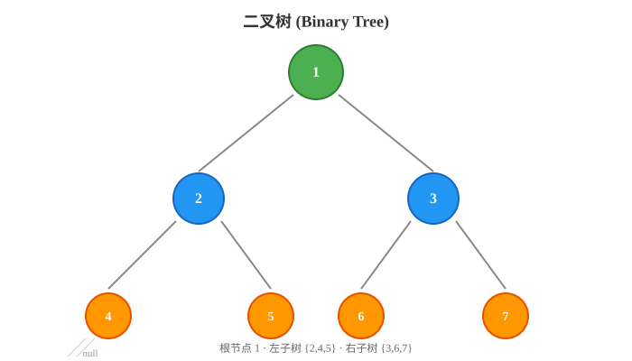
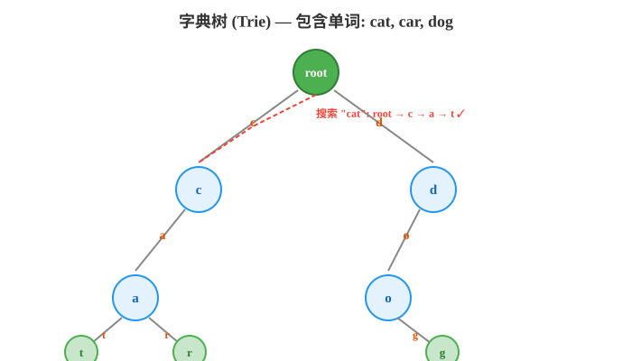
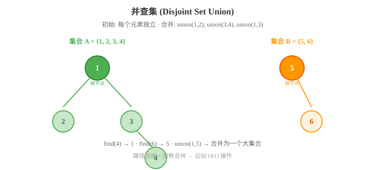
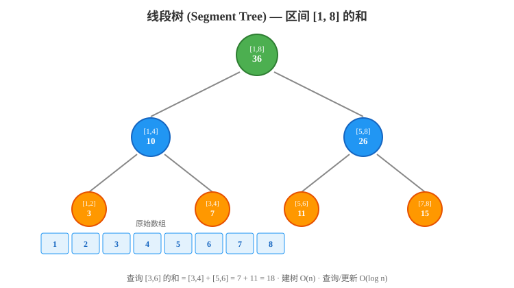

# 第四章：进阶数据结构

> 数据结构是计算机存储、组织数据的方式。在掌握了基础数据结构（数组、链表、栈、队列、哈希表）之后，进阶数据结构将帮助我们解决更复杂的问题。本章将深入讲解树形数据结构和哈希结构，每个数据结构都配有完整的 Python 实现和 LeetCode 风格的练习题。

---

## 目录

1. [树形数据结构概述](#1-树形数据结构概述)
2. [二叉树（Binary Tree）](#2-二叉树binary-tree)
3. [二叉搜索树（BST）](#3-二叉搜索树bst)
4. [堆（Heap）](#4-堆heap)
5. [字典树（Trie）](#5-字典树trie)
6. [并查集（Disjoint Set Union / DSU）](#6-并查集disjoint-set-union--dsu)
7. [线段树（Segment Tree）](#7-线段树segment-tree)
8. [树状数组（Fenwick Tree / BIT）](#8-树状数组fenwick-tree--bit)
9. [布隆过滤器（Bloom Filter）](#9-布隆过滤器bloom-filter)
10. [一致性哈希（Consistent Hashing）](#10-一致性哈希consistent-hashing)
11. [综合练习题](#11-综合练习题)

---

## 1. 树形数据结构概述

### 什么是树？

**树（Tree）** 是一种非线性数据结构，由节点和连接节点的边组成。树具有以下特点：

- 有一个根节点（root）
- 除了根节点外，每个节点有且只有一个父节点
- 每个节点可以有零个或多个子节点
- 树中没有环

```
        树的基本结构：
              ① ← 根节点 (Root)
             / \
            ②   ③ ← 内部节点
           / \    \
          ④   ⑤   ⑥ ← 叶节点 (Leaf)
```

### 树的术语

| 术语 | 英文 | 说明 |
|------|------|------|
| **根节点** | Root | 树的顶端节点，没有父节点 |
| **叶节点** | Leaf | 没有子节点的节点 |
| **内部节点** | Internal Node | 至少有一个子节点的节点 |
| **父节点** | Parent | 一个节点的直接上级 |
| **子节点** | Child | 一个节点的直接下级 |
| **兄弟节点** | Sibling | 共享同一个父节点的节点 |
| **深度** | Depth | 从根节点到该节点的边数 |
| **高度** | Height | 从该节点到最远叶节点的边数 |
| **子树** | Subtree | 树中任意节点及其所有后代 |

### 树的分类

```
                    树 (Tree)
                        │
          ┌─────────────┼─────────────┐
          │             │             │
      二叉树        多路树         其他
     (Binary Tree)  (Multi-way)    (Trie, DSU...)
          │             │
     ┌────┼────┐    ┌───┴───┐
     │    │    │    │       │
    BST  堆  线段树 B-树   B+树
```

---

## 2. 二叉树（Binary Tree）

### 2.1 概念

**二叉树（Binary Tree）** 是每个节点最多有两个子节点的树，分别称为**左子节点**和**右子节点**。

```
      二叉树示例：
            1
           / \
          2   3
         / \   \
        4   5   6
```

> 下图展示了一棵典型的二叉树结构：



### 2.2 二叉树的类型

| 类型 | 说明 | 特点 |
|------|------|------|
| **满二叉树** | 所有节点都有 0 或 2 个子节点 | 节点数 = 2^h - 1 |
| **完全二叉树** | 只有最后一层可能不满，且节点靠左排列 | 适合用数组存储 |
| **平衡二叉树** | 左右子树高度差 ≤ 1 | AVL 树、红黑树 |
| **斜树** | 所有节点只有左（或右）子节点 | 退化为链表 |

### 2.3 二叉树的遍历

二叉树的遍历分为**深度优先遍历**（DFS）和**广度优先遍历**（BFS/层序遍历）。

```
      二叉树示例：
            1
           / \
          2   3
         / \   \
        4   5   6

前序遍历 (Pre-order):   1 → 2 → 4 → 5 → 3 → 6   (根→左→右)
中序遍历 (In-order):    4 → 2 → 5 → 1 → 3 → 6   (左→根→右)
后序遍历 (Post-order):  4 → 5 → 2 → 6 → 3 → 1   (左→右→根)
层序遍历 (Level-order): 1 → 2 → 3 → 4 → 5 → 6   (逐层，从左到右)
```

### 2.4 Python 实现

```python
from collections import deque


class TreeNode:
    """二叉树节点"""
    def __init__(self, val=0, left=None, right=None):
        self.val = val
        self.left = left
        self.right = right


# ==================== 深度优先遍历（递归） ====================

def preorder_recursive(root):
    """前序遍历 - 递归"""
    result = []
    def dfs(node):
        if not node:
            return
        result.append(node.val)
        dfs(node.left)
        dfs(node.right)
    dfs(root)
    return result


def inorder_recursive(root):
    """中序遍历 - 递归"""
    result = []
    def dfs(node):
        if not node:
            return
        dfs(node.left)
        result.append(node.val)
        dfs(node.right)
    dfs(root)
    return result


def postorder_recursive(root):
    """后序遍历 - 递归"""
    result = []
    def dfs(node):
        if not node:
            return
        dfs(node.left)
        dfs(node.right)
        result.append(node.val)
    dfs(root)
    return result


# ==================== 深度优先遍历（迭代） ====================

def preorder_iterative(root):
    """前序遍历 - 迭代（使用栈）"""
    if not root:
        return []
    result = []
    stack = [root]
    while stack:
        node = stack.pop()
        result.append(node.val)
        if node.right:
            stack.append(node.right)
        if node.left:
            stack.append(node.left)
    return result


def inorder_iterative(root):
    """中序遍历 - 迭代（使用栈）"""
    result = []
    stack = []
    curr = root
    while curr or stack:
        while curr:
            stack.append(curr)
            curr = curr.left
        curr = stack.pop()
        result.append(curr.val)
        curr = curr.right
    return result


def postorder_iterative(root):
    """后序遍历 - 迭代（使用栈）"""
    if not root:
        return []
    result = []
    stack = [root]
    while stack:
        node = stack.pop()
        result.append(node.val)
        if node.left:
            stack.append(node.left)
        if node.right:
            stack.append(node.right)
    return result[::-1]  # 反转前序结果


# ==================== 层序遍历 ====================

def level_order(root):
    """层序遍历 - BFS"""
    if not root:
        return []
    result = []
    queue = deque([root])
    while queue:
        level = []
        for _ in range(len(queue)):
            node = queue.popleft()
            level.append(node.val)
            if node.left:
                queue.append(node.left)
            if node.right:
                queue.append(node.right)
        result.append(level)
    return result
```

### 2.5 时间复杂度

| 遍历方式 | 时间复杂度 | 空间复杂度 |
|---------|:---------:|:---------:|
| 递归（前/中/后序） | O(n) | O(h) — h 为树高 |
| 迭代（前/中/后序） | O(n) | O(h) |
| 层序遍历 | O(n) | O(n) |

### 2.6 练习题

**题目 1：二叉树的最大深度**
> LeetCode 104. 给定一个二叉树，找出其最大深度。

```python
def max_depth(root):
    """二叉树的最大深度"""
    if not root:
        return 0
    return 1 + max(max_depth(root.left), max_depth(root.right))

# 测试
root = TreeNode(3, TreeNode(9), TreeNode(20, TreeNode(15), TreeNode(7)))
print(max_depth(root))  # 输出: 3
```

**题目 2：验证二叉搜索树**
> LeetCode 98. 给定一个二叉树，判断其是否是一个有效的二叉搜索树。

```python
def is_valid_bst(root):
    """验证二叉搜索树"""
    def validate(node, low, high):
        if not node:
            return True
        if low is not None and node.val <= low:
            return False
        if high is not None and node.val >= high:
            return False
        return (validate(node.left, low, node.val) and
                validate(node.right, node.val, high))
    
    return validate(root, None, None)

# 测试
root = TreeNode(2, TreeNode(1), TreeNode(3))
print(is_valid_bst(root))  # 输出: True
```

**题目 3：二叉树的锯齿形层序遍历**
> LeetCode 103. 给定一个二叉树，返回其节点值的锯齿形层序遍历（先从左到右，再从右到左，交替进行）。

```python
def zigzag_level_order(root):
    """二叉树的锯齿形层序遍历"""
    if not root:
        return []
    result = []
    queue = deque([root])
    left_to_right = True
    
    while queue:
        level = []
        for _ in range(len(queue)):
            node = queue.popleft()
            level.append(node.val)
            if node.left:
                queue.append(node.left)
            if node.right:
                queue.append(node.right)
        if not left_to_right:
            level.reverse()
        result.append(level)
        left_to_right = not left_to_right
    
    return result

# 测试
root = TreeNode(3, TreeNode(9), TreeNode(20, TreeNode(15), TreeNode(7)))
print(zigzag_level_order(root))  # 输出: [[3], [20, 9], [15, 7]]
```

---

## 3. 二叉搜索树（BST）

### 3.1 概念

**二叉搜索树（Binary Search Tree, BST）** 是一种特殊的二叉树，它满足以下性质：

- 左子树中所有节点的值 < 根节点的值
- 右子树中所有节点的值 > 根节点的值
- 左右子树也分别是二叉搜索树

```
        二叉搜索树示例：
            8
           / \
          3   10
         / \    \
        1   6    14
           / \   /
          4   7 13
```

### 3.2 BST 的核心操作

| 操作 | 平均时间复杂度 | 最坏时间复杂度 |
|------|:------------:|:------------:|
| 搜索 (Search) | O(log n) | O(n) |
| 插入 (Insert) | O(log n) | O(n) |
| 删除 (Delete) | O(log n) | O(n) |

### 3.3 Python 实现

```python
class BSTNode:
    """二叉搜索树节点"""
    def __init__(self, val):
        self.val = val
        self.left = None
        self.right = None


class BST:
    """二叉搜索树"""
    def __init__(self):
        self.root = None
    
    def search(self, val):
        """搜索"""
        def _search(node, val):
            if not node or node.val == val:
                return node
            if val < node.val:
                return _search(node.left, val)
            return _search(node.right, val)
        return _search(self.root, val)
    
    def insert(self, val):
        """插入"""
        def _insert(node, val):
            if not node:
                return BSTNode(val)
            if val < node.val:
                node.left = _insert(node.left, val)
            elif val > node.val:
                node.right = _insert(node.right, val)
            return node
        
        self.root = _insert(self.root, val)
    
    def delete(self, val):
        """删除"""
        def _delete(node, val):
            if not node:
                return None
            if val < node.val:
                node.left = _delete(node.left, val)
            elif val > node.val:
                node.right = _delete(node.right, val)
            else:
                # 找到要删除的节点
                # 情况 1: 叶节点或只有一个子节点
                if not node.left:
                    return node.right
                if not node.right:
                    return node.left
                # 情况 2: 有两个子节点
                # 找到右子树中的最小值作为后继
                successor = node.right
                while successor.left:
                    successor = successor.left
                node.val = successor.val
                node.right = _delete(node.right, successor.val)
            return node
        
        self.root = _delete(self.root, val)
    
    def inorder(self):
        """中序遍历（返回有序序列）"""
        result = []
        def dfs(node):
            if not node:
                return
            dfs(node.left)
            result.append(node.val)
            dfs(node.right)
        dfs(self.root)
        return result


# 使用示例
bst = BST()
for val in [8, 3, 10, 1, 6, 14, 4, 7, 13]:
    bst.insert(val)

print("中序遍历:", bst.inorder())  # 输出: [1, 3, 4, 6, 7, 8, 10, 13, 14]

bst.delete(3)
print("删除 3 后:", bst.inorder())  # 输出: [1, 4, 6, 7, 8, 10, 13, 14]

print("搜索 6:", bst.search(6) is not None)  # 输出: True
print("搜索 100:", bst.search(100) is not None)  # 输出: False
```

### 3.4 平衡树对比

二叉搜索树在最坏情况下会退化为链表（O(n)），因此出现了多种**自平衡二叉搜索树**来保证操作效率：

| 平衡树类型 | 平衡条件 | 操作复杂度 | 特点 |
|-----------|---------|:---------:|------|
| **AVL 树** | 左右子树高度差 ≤ 1 | O(log n) | 严格平衡，查询快，但旋转频繁 |
| **红黑树** | 红黑规则（5条性质） | O(log n) | 近似平衡，插入/删除效率高，应用广泛 |
| **Treap** | 堆 + BST 随机优先级 | O(log n) | 实现简单，期望平衡 |
| **Splay 树** | 每次访问后旋转到根 | 均摊 O(log n) | 最近访问的元素靠近根，有局部性 |

**红黑树 vs AVL 树**：
- AVL 树更严格平衡，适合查询密集的场景
- 红黑树旋转更少，适合插入/删除密集的场景
- 实际应用中，红黑树使用更广（如 Java TreeMap、C++ STL map、Linux 内核调度）

**应用场景**：
- AVL 树：数据库索引、需要频繁查询的场景
- 红黑树：通用场景，编程语言标准库
- Treap：竞赛编程，实现简单
- Splay 树：缓存、自适应数据结构

### 3.5 练习题

**题目 1：将有序数组转换为二叉搜索树**
> LeetCode 108. 将一个按照升序排列的有序数组，转换为一棵高度平衡的二叉搜索树。

```python
def sorted_array_to_bst(nums):
    """将有序数组转换为高度平衡的 BST"""
    def build(left, right):
        if left > right:
            return None
        mid = (left + right) // 2
        root = TreeNode(nums[mid])
        root.left = build(left, mid - 1)
        root.right = build(mid + 1, right)
        return root
    
    return build(0, len(nums) - 1)

# 测试
root = sorted_array_to_bst([1, 2, 3, 4, 5, 6, 7])
print(preorder_recursive(root))  # 输出: [4, 2, 1, 3, 6, 5, 7]
```

**题目 2：二叉搜索树中第 K 小的元素**
> LeetCode 230. 给定一个二叉搜索树的根节点，找出其中第 K 小的元素。

```python
def kth_smallest(root, k):
    """二叉搜索树中第 K 小的元素"""
    stack = []
    curr = root
    count = 0
    
    while curr or stack:
        while curr:
            stack.append(curr)
            curr = curr.left
        curr = stack.pop()
        count += 1
        if count == k:
            return curr.val
        curr = curr.right
    
    return -1

# 测试
root = BSTNode(5)
root.left = BSTNode(3)
root.right = BSTNode(6)
root.left.left = BSTNode(2)
root.left.right = BSTNode(4)
root.left.left.left = BSTNode(1)
print(kth_smallest(root, 3))  # 输出: 3
```

---

## 4. 堆（Heap）

### 4.1 概念

**堆（Heap）** 是一种特殊的完全二叉树，分为：
- **最大堆（Max Heap）**：每个节点的值 ≥ 其子节点的值，根节点是最大值
- **最小堆（Min Heap）**：每个节点的值 ≤ 其子节点的值，根节点是最小值

```
        最大堆：              最小堆：
            9                   1
           / \                 / \
          7   8               3   2
         / \ / \             / \ / \
        5  6 4  3           7  8 9  10
```

### 4.2 Python 的 heapq 模块

Python 的 `heapq` 模块实现了最小堆：

```python
import heapq

# 创建堆
heap = []
heapq.heappush(heap, 3)
heapq.heappush(heap, 1)
heapq.heappush(heap, 4)
heapq.heappush(heap, 1)
heapq.heappush(heap, 5)
print(heap)  # 输出: [1, 1, 4, 3, 5]

# 弹出最小值
min_val = heapq.heappop(heap)
print(min_val)  # 输出: 1
print(heap)     # 输出: [1, 3, 4, 5]

# 查看最小值（不弹出）
print(heap[0])  # 输出: 1

# 建堆
arr = [5, 3, 8, 4, 6]
heapq.heapify(arr)
print(arr)  # 输出: [3, 4, 8, 5, 6]（堆结构）

# 弹出并压入
val = heapq.heappushpop(heap, 2)
print(val)  # 输出: 1（原堆顶）

val = heapq.heapreplace(heap, 0)
print(val)  # 输出: 2（原堆顶）

# 获取最大 K 个 / 最小 K 个
arr = [5, 3, 8, 4, 6, 1, 9, 2]
print(heapq.nlargest(3, arr))  # 输出: [9, 8, 6]
print(heapq.nsmallest(3, arr))  # 输出: [1, 2, 3]
```

### 4.3 手写堆实现

```python
class MinHeap:
    """最小堆实现"""
    def __init__(self):
        self.heap = []
    
    def push(self, val):
        """插入元素"""
        self.heap.append(val)
        self._sift_up(len(self.heap) - 1)
    
    def pop(self):
        """弹出最小值"""
        if not self.heap:
            return None
        if len(self.heap) == 1:
            return self.heap.pop()
        min_val = self.heap[0]
        self.heap[0] = self.heap.pop()
        self._sift_down(0)
        return min_val
    
    def peek(self):
        """查看最小值"""
        return self.heap[0] if self.heap else None
    
    def _sift_up(self, i):
        """上浮操作"""
        while i > 0:
            parent = (i - 1) // 2
            if self.heap[parent] <= self.heap[i]:
                break
            self.heap[parent], self.heap[i] = self.heap[i], self.heap[parent]
            i = parent
    
    def _sift_down(self, i):
        """下沉操作"""
        n = len(self.heap)
        while True:
            smallest = i
            left = 2 * i + 1
            right = 2 * i + 2
            if left < n and self.heap[left] < self.heap[smallest]:
                smallest = left
            if right < n and self.heap[right] < self.heap[smallest]:
                smallest = right
            if smallest == i:
                break
            self.heap[i], self.heap[smallest] = self.heap[smallest], self.heap[i]
            i = smallest
    
    def __len__(self):
        return len(self.heap)


# 使用示例
heap = MinHeap()
for val in [5, 3, 8, 4, 6]:
    heap.push(val)
print(heap.pop())  # 输出: 3
print(heap.pop())  # 输出: 4
print(heap.pop())  # 输出: 5
```

### 4.4 时间复杂度

| 操作 | 时间复杂度 |
|------|:---------:|
| 建堆 (heapify) | O(n) |
| 插入 (push) | O(log n) |
| 弹出 (pop) | O(log n) |
| 查看堆顶 (peek) | O(1) |

### 4.5 练习题

**题目 1：合并 K 个升序链表**
> LeetCode 23. 使用最小堆合并 K 个有序链表。

```python
import heapq

class ListNode:
    def __init__(self, val=0, next=None):
        self.val = val
        self.next = next

def merge_k_lists(lists):
    """合并 K 个有序链表"""
    heap = []
    for i, node in enumerate(lists):
        if node:
            heapq.heappush(heap, (node.val, i, node))
    
    dummy = ListNode(0)
    curr = dummy
    
    while heap:
        val, i, node = heapq.heappop(heap)
        curr.next = ListNode(val)
        curr = curr.next
        if node.next:
            heapq.heappush(heap, (node.next.val, i, node.next))
    
    return dummy.next
```

**题目 2：前 K 个高频元素**
> LeetCode 347. 给你一个整数数组 nums 和一个整数 k，返回出现频率前 k 高的元素。

```python
import heapq
from collections import Counter

def top_k_frequent(nums, k):
    """前 K 个高频元素"""
    count = Counter(nums)
    # 使用最小堆，堆中只保留 K 个元素
    heap = []
    for num, freq in count.items():
        heapq.heappush(heap, (freq, num))
        if len(heap) > k:
            heapq.heappop(heap)
    return [num for freq, num in heap]

# 测试
print(top_k_frequent([1, 1, 1, 2, 2, 3], 2))  # 输出: [2, 1] 或 [1, 2]
```

---

## 5. 字典树（Trie）

### 5.1 概念

**字典树（Trie，也称前缀树）** 是一种树形数据结构，用于高效地存储和检索字符串数据集中的键。它利用字符串的公共前缀来减少查询时间。

```
        包含 "apple", "app", "apply", "ape" 的 Trie:
                root
                 |
                 a
                 |
                 p
                / \
               p   e
              / \   \
             l   l   ...
             |   |
             e   y
             
        说明: 从根节点到每个节点的路径就是一个前缀
```

> 下图展示了字典树（Trie）的树形结构，每个节点代表一个字符，从根到叶的路径构成一个单词：



### 5.2 Python 实现

```python
class TrieNode:
    """Trie 节点"""
    def __init__(self):
        self.children = {}
        self.is_end = False  # 标记是否是一个单词的结尾


class Trie:
    """字典树"""
    def __init__(self):
        self.root = TrieNode()
    
    def insert(self, word: str) -> None:
        """插入单词"""
        node = self.root
        for ch in word:
            if ch not in node.children:
                node.children[ch] = TrieNode()
            node = node.children[ch]
        node.is_end = True
    
    def search(self, word: str) -> bool:
        """搜索单词（完全匹配）"""
        node = self._find_prefix(word)
        return node is not None and node.is_end
    
    def starts_with(self, prefix: str) -> bool:
        """检查是否存在以 prefix 为前缀的单词"""
        return self._find_prefix(prefix) is not None
    
    def _find_prefix(self, prefix: str) -> TrieNode:
        """查找前缀，返回最后一个字符对应的节点"""
        node = self.root
        for ch in prefix:
            if ch not in node.children:
                return None
            node = node.children[ch]
        return node
    
    def delete(self, word: str) -> bool:
        """删除单词"""
        def _delete(node, word, depth):
            if depth == len(word):
                if not node.is_end:
                    return False
                node.is_end = False
                return len(node.children) == 0
            ch = word[depth]
            if ch not in node.children:
                return False
            should_delete = _delete(node.children[ch], word, depth + 1)
            if should_delete:
                del node.children[ch]
                return len(node.children) == 0 and not node.is_end
            return False
        
        _delete(self.root, word, 0)
    
    def get_all_words(self) -> list:
        """获取所有单词"""
        result = []
        def dfs(node, path):
            if node.is_end:
                result.append(''.join(path))
            for ch, child in sorted(node.children.items()):
                path.append(ch)
                dfs(child, path)
                path.pop()
        dfs(self.root, [])
        return result
    
    def auto_complete(self, prefix: str) -> list:
        """自动补全"""
        node = self._find_prefix(prefix)
        if not node:
            return []
        result = []
        def dfs(node, path):
            if node.is_end:
                result.append(prefix + ''.join(path))
            for ch, child in sorted(node.children.items()):
                path.append(ch)
                dfs(child, path)
                path.pop()
        dfs(node, [])
        return result


# 使用示例
trie = Trie()
words = ["apple", "app", "apply", "ape", "application"]
for w in words:
    trie.insert(w)

print(trie.search("apple"))    # 输出: True
print(trie.search("app"))      # 输出: True
print(trie.search("appl"))     # 输出: False
print(trie.starts_with("app"))  # 输出: True
print(trie.starts_with("xyz"))  # 输出: False
print(trie.auto_complete("app"))
# 输出: ['app', 'apple', 'application', 'apply']
```

### 5.3 时间复杂度

| 操作 | 时间复杂度 | 说明 |
|------|:---------:|------|
| 插入 | O(m) | m 为单词长度 |
| 搜索 | O(m) | m 为单词长度 |
| 前缀查询 | O(m) | m 为前缀长度 |
| 自动补全 | O(m + k) | k 为补全结果数 |

### 5.4 练习题

**题目 1：实现 Trie（前缀树）**
> LeetCode 208. 实现一个 Trie（前缀树），包含 insert、search 和 startsWith 三个操作。

```python
# 上面的 Trie 类已经实现了 LeetCode 208 的要求。
```

**题目 2：单词搜索 II**
> LeetCode 212. 给定一个 m x n 二维字符网格 board 和一个单词列表 words，找出所有同时在网格中出现的单词。

```python
def find_words(board, words):
    """单词搜索 II - 使用 Trie 优化"""
    # 构建 Trie
    trie = Trie()
    for word in words:
        trie.insert(word)
    
    rows, cols = len(board), len(board[0])
    result = set()
    visited = set()
    
    def dfs(r, c, node, path):
        if node.is_end:
            result.add(''.join(path))
        if r < 0 or r >= rows or c < 0 or c >= cols:
            return
        if (r, c) in visited:
            return
        
        ch = board[r][c]
        if ch not in node.children:
            return
        
        visited.add((r, c))
        path.append(ch)
        node = node.children[ch]
        
        for dr, dc in [(0, 1), (0, -1), (1, 0), (-1, 0)]:
            dfs(r + dr, c + dc, node, path)
        
        path.pop()
        visited.remove((r, c))
    
    for r in range(rows):
        for c in range(cols):
            dfs(r, c, trie.root, [])
    
    return list(result)
```

---

## 6. 并查集（Disjoint Set Union / DSU）

### 6.1 概念

**并查集（Disjoint Set Union, DSU，也称 Union-Find）** 是一种用于处理**不交集**的合并及查询问题的数据结构。

> 参考：Wikipedia 文章 3240821 - 并查集

> 下图展示了并查集的结构与合并过程：




**核心操作**：
1. **查找（Find）**：查询某个元素属于哪个集合（找到集合的代表元素）
2. **合并（Union）**：将两个集合合并为一个

**优化技巧**：
- **路径压缩（Path Compression）**：在查找时，将路径上的所有节点直接指向根节点
- **按秩合并（Union by Rank）**：将较小的树合并到较大的树上

### 6.2 Python 实现

```python
class DSU:
    """并查集 - 带路径压缩和按秩合并"""
    def __init__(self, n):
        self.parent = list(range(n))
        self.rank = [0] * n      # 树的高度（秩）
        self.size = [1] * n      # 集合大小（可选）
        self.count = n           # 连通分量数
    
    def find(self, x):
        """查找元素所属集合的代表元素（路径压缩）"""
        if self.parent[x] != x:
            self.parent[x] = self.find(self.parent[x])
        return self.parent[x]
    
    def find_iterative(self, x):
        """查找 - 迭代版本"""
        # 先找到根
        root = x
        while self.parent[root] != root:
            root = self.parent[root]
        # 路径压缩
        while self.parent[x] != x:
            next_node = self.parent[x]
            self.parent[x] = root
            x = next_node
        return root
    
    def union(self, x, y):
        """合并两个集合（按秩合并）"""
        x_root = self.find(x)
        y_root = self.find(y)
        
        if x_root == y_root:
            return False
        
        # 按秩合并：将秩小的树合并到秩大的树上
        if self.rank[x_root] < self.rank[y_root]:
            self.parent[x_root] = y_root
            self.size[y_root] += self.size[x_root]
        elif self.rank[x_root] > self.rank[y_root]:
            self.parent[y_root] = x_root
            self.size[x_root] += self.size[y_root]
        else:
            self.parent[y_root] = x_root
            self.rank[x_root] += 1
            self.size[x_root] += self.size[y_root]
        
        self.count -= 1
        return True
    
    def connected(self, x, y):
        """判断两个元素是否属于同一个集合"""
        return self.find(x) == self.find(y)
    
    def component_size(self, x):
        """返回 x 所在集合的大小"""
        return self.size[self.find(x)]
    
    def component_count(self):
        """返回连通分量数"""
        return self.count
```

### 6.3 时间复杂度

| 操作 | 时间复杂度 |
|------|:---------:|
| 查找（Find） | O(α(n)) — 近似 O(1) |
| 合并（Union） | O(α(n)) — 近似 O(1) |
| 判断连通 | O(α(n)) — 近似 O(1) |

其中 α(n) 是反阿克曼函数，对于任何实际输入规模，α(n) ≤ 4。

### 6.4 练习题

**题目 1：连通网络的操作次数**
> LeetCode 1319. 用以太网线缆将 n 台计算机连接成一个网络，计算使所有计算机连通所需的最少操作次数。

```python
def make_connected(n, connections):
    """连通网络的操作次数"""
    if len(connections) < n - 1:
        return -1
    
    dsu = DSU(n)
    for u, v in connections:
        dsu.union(u, v)
    
    # 需要操作的次数 = 连通分量数 - 1
    return dsu.component_count() - 1

# 测试
print(make_connected(4, [[0, 1], [0, 2], [1, 2]]))  # 输出: 1
```

**题目 2：账户合并**
> LeetCode 721. 给定一个列表 accounts，每个元素 accounts[i] 是一个字符串列表，其中第一个元素是名称，其余元素是邮箱。合并同一人的账户。

```python
def accounts_merge(accounts):
    """账户合并"""
    from collections import defaultdict
    
    email_to_id = {}
    id_to_name = {}
    dsu = DSU(len(accounts) * 10)  # 预留足够空间
    
    idx = 0
    for account in accounts:
        name = account[0]
        for email in account[1:]:
            if email not in email_to_id:
                email_to_id[email] = idx
                id_to_name[idx] = name
                idx += 1
            # 将同一个账户下的邮箱合并
            dsu.union(email_to_id[account[1]], email_to_id[email])
    
    # 按根节点分组
    groups = defaultdict(list)
    for email, eid in email_to_id.items():
        root = dsu.find(eid)
        groups[root].append(email)
    
    # 构建结果
    result = []
    for root, emails in groups.items():
        result.append([id_to_name[root]] + sorted(emails))
    
    return result
```

**题目 3：被围绕的区域**
> LeetCode 130. 给你一个 m x n 的矩阵 board，由 'X' 和 'O' 组成，将所有被 'X' 围绕的区域替换为 'X'。

```python
def solve(board):
    """被围绕的区域 - 使用并查集"""
    if not board or not board[0]:
        return
    
    rows, cols = len(board), len(board[0])
    # 将边界上的 'O' 与一个虚拟节点相连
    dummy = rows * cols
    dsu = DSU(rows * cols + 1)
    
    def get_id(r, c):
        return r * cols + c
    
    for r in range(rows):
        for c in range(cols):
            if board[r][c] == 'O':
                if r == 0 or r == rows - 1 or c == 0 or c == cols - 1:
                    # 边界上的 'O' 与 dummy 相连
                    dsu.union(get_id(r, c), dummy)
                else:
                    # 内部的 'O' 与相邻的 'O' 相连
                    for dr, dc in [(0, 1), (1, 0)]:
                        nr, nc = r + dr, c + dc
                        if 0 <= nr < rows and 0 <= nc < cols and board[nr][nc] == 'O':
                            dsu.union(get_id(r, c), get_id(nr, nc))
    
    # 将不与 dummy 相连的 'O' 替换为 'X'
    for r in range(rows):
        for c in range(cols):
            if board[r][c] == 'O' and not dsu.connected(get_id(r, c), dummy):
                board[r][c] = 'X'
```

---

## 7. 线段树（Segment Tree）

### 7.1 概念

**线段树（Segment Tree）** 是一种用于解决**区间查询**和**区间更新**问题的数据结构。它是一棵二叉树，每个节点代表一个区间。

```
        数组: [1, 3, 5, 7, 9, 11]
        
        线段树（存储区间和）:
                    [0, 5] = 36
                   /           \
            [0, 2] = 9       [3, 5] = 27
            /      \          /      \
        [0,1]=4  [2,2]=5  [3,4]=16  [5,5]=11
        /    \            /    \
     [0,0]=1 [1,1]=3  [3,3]=7 [4,4]=9
```

> 下图展示了线段树的树形结构及其区间划分方式：



### 7.2 Python 实现

```python
class SegmentTree:
    """线段树 - 区间和查询 + 单点更新"""
    def __init__(self, nums):
        self.n = len(nums)
        self.tree = [0] * (4 * self.n)
        if self.n > 0:
            self._build(nums, 0, 0, self.n - 1)
    
    def _build(self, nums, node, left, right):
        """构建线段树"""
        if left == right:
            self.tree[node] = nums[left]
            return
        mid = (left + right) // 2
        self._build(nums, node * 2 + 1, left, mid)
        self._build(nums, node * 2 + 2, mid + 1, right)
        self.tree[node] = self.tree[node * 2 + 1] + self.tree[node * 2 + 2]
    
    def update(self, idx, val):
        """单点更新：将 nums[idx] 更新为 val"""
        self._update(0, 0, self.n - 1, idx, val)
    
    def _update(self, node, left, right, idx, val):
        if left == right:
            self.tree[node] = val
            return
        mid = (left + right) // 2
        if idx <= mid:
            self._update(node * 2 + 1, left, mid, idx, val)
        else:
            self._update(node * 2 + 2, mid + 1, right, idx, val)
        self.tree[node] = self.tree[node * 2 + 1] + self.tree[node * 2 + 2]
    
    def query(self, ql, qr):
        """区间查询：返回 [ql, qr] 的和"""
        return self._query(0, 0, self.n - 1, ql, qr)
    
    def _query(self, node, left, right, ql, qr):
        if ql <= left and right <= qr:
            return self.tree[node]
        if right < ql or left > qr:
            return 0
        mid = (left + right) // 2
        return (self._query(node * 2 + 1, left, mid, ql, qr) +
                self._query(node * 2 + 2, mid + 1, right, ql, qr))


# 使用示例
nums = [1, 3, 5, 7, 9, 11]
seg = SegmentTree(nums)
print(seg.query(0, 2))  # 输出: 9 (1+3+5)
print(seg.query(2, 5))  # 输出: 32 (5+7+9+11)

seg.update(1, 10)  # 将 nums[1] 从 3 更新为 10
print(seg.query(0, 2))  # 输出: 16 (1+10+5)
```

### 7.3 带懒标记的线段树

```python
class SegmentTreeLazy:
    """线段树 - 区间和查询 + 区间更新（懒标记）"""
    def __init__(self, nums):
        self.n = len(nums)
        self.tree = [0] * (4 * self.n)
        self.lazy = [0] * (4 * self.n)  # 懒标记
        if self.n > 0:
            self._build(nums, 0, 0, self.n - 1)
    
    def _build(self, nums, node, left, right):
        if left == right:
            self.tree[node] = nums[left]
            return
        mid = (left + right) // 2
        self._build(nums, node * 2 + 1, left, mid)
        self._build(nums, node * 2 + 2, mid + 1, right)
        self.tree[node] = self.tree[node * 2 + 1] + self.tree[node * 2 + 2]
    
    def _push_down(self, node, left, right):
        """下推懒标记"""
        if self.lazy[node] != 0:
            mid = (left + right) // 2
            # 更新左子节点
            self.tree[node * 2 + 1] += self.lazy[node] * (mid - left + 1)
            self.lazy[node * 2 + 1] += self.lazy[node]
            # 更新右子节点
            self.tree[node * 2 + 2] += self.lazy[node] * (right - mid)
            self.lazy[node * 2 + 2] += self.lazy[node]
            # 清除当前节点的懒标记
            self.lazy[node] = 0
    
    def update_range(self, ul, ur, val):
        """区间更新：将 [ul, ur] 范围内的所有元素加上 val"""
        self._update_range(0, 0, self.n - 1, ul, ur, val)
    
    def _update_range(self, node, left, right, ul, ur, val):
        if ul <= left and right <= ur:
            self.tree[node] += val * (right - left + 1)
            self.lazy[node] += val
            return
        self._push_down(node, left, right)
        mid = (left + right) // 2
        if ul <= mid:
            self._update_range(node * 2 + 1, left, mid, ul, ur, val)
        if ur > mid:
            self._update_range(node * 2 + 2, mid + 1, right, ul, ur, val)
        self.tree[node] = self.tree[node * 2 + 1] + self.tree[node * 2 + 2]
    
    def query(self, ql, qr):
        return self._query(0, 0, self.n - 1, ql, qr)
    
    def _query(self, node, left, right, ql, qr):
        if ql <= left and right <= qr:
            return self.tree[node]
        self._push_down(node, left, right)
        mid = (left + right) // 2
        res = 0
        if ql <= mid:
            res += self._query(node * 2 + 1, left, mid, ql, qr)
        if qr > mid:
            res += self._query(node * 2 + 2, mid + 1, right, ql, qr)
        return res
```

### 7.4 时间复杂度

| 操作 | 时间复杂度 |
|------|:---------:|
| 构建 | O(n) |
| 单点更新 | O(log n) |
| 区间更新 | O(log n) |
| 区间查询 | O(log n) |

### 7.5 练习题

**题目 1：区域和检索 - 数组可修改**
> LeetCode 307. 给定一个整数数组 nums，支持更新和求和操作。

```python
class NumArray:
    """区域和检索 - 使用线段树"""
    def __init__(self, nums):
        self.seg = SegmentTree(nums)
    
    def update(self, index: int, val: int) -> None:
        self.seg.update(index, val)
    
    def sum_range(self, left: int, right: int) -> int:
        return self.seg.query(left, right)
```

**题目 2：我的日程安排表 I**
> LeetCode 729. 实现一个 MyCalendar 类来存放日程，添加时不能有重复的日程。

```python
class MyCalendar:
    """我的日程安排表"""
    def __init__(self):
        self.booked = []
    
    def book(self, start: int, end: int) -> bool:
        # 使用二分查找检查是否有重叠
        import bisect
        i = bisect.bisect_left(self.booked, (start, end))
        if i > 0 and self.booked[i-1][1] > start:
            return False
        if i < len(self.booked) and self.booked[i][0] < end:
            return False
        self.booked.insert(i, (start, end))
        return True
```

---

## 8. 树状数组（Fenwick Tree / BIT）

### 8.1 概念

**树状数组（Binary Indexed Tree, BIT，也称 Fenwick 树）** 是一种用于维护**前缀和**的数据结构。它比线段树实现更简洁，常数更小，但功能相对有限。

**核心思想**：利用 lowbit 操作实现快速跳跃。

**lowbit 操作**：`lowbit(x) = x & (-x)`，返回 x 的二进制表示中最低位的 1 所对应的值。

```
        树状数组的结构（n=8）:
        
        tree[1] = nums[1]
        tree[2] = nums[1] + nums[2]
        tree[3] = nums[3]
        tree[4] = nums[1] + nums[2] + nums[3] + nums[4]
        tree[5] = nums[5]
        tree[6] = nums[5] + nums[6]
        tree[7] = nums[7]
        tree[8] = nums[1] + nums[2] + ... + nums[8]
```

### 8.2 Python 实现

```python
class FenwickTree:
    """树状数组 - 维护前缀和"""
    def __init__(self, n):
        self.n = n
        self.tree = [0] * (n + 1)  # 1-indexed
    
    def build(self, nums):
        """根据数组构建树状数组"""
        for i, val in enumerate(nums, 1):
            self.tree[i] += val
            j = i + (i & -i)  # lowbit: i & -i
            if j <= self.n:
                self.tree[j] += self.tree[i]
    
    def update(self, idx, delta):
        """单点更新：将 nums[idx] 增加 delta"""
        i = idx + 1  # 转换为 1-indexed
        while i <= self.n:
            self.tree[i] += delta
            i += i & -i
    
    def prefix_sum(self, idx):
        """前缀和查询：返回 sum(nums[0..idx])"""
        i = idx + 1  # 转换为 1-indexed
        res = 0
        while i > 0:
            res += self.tree[i]
            i -= i & -i
        return res
    
    def range_sum(self, left, right):
        """区间和查询：返回 sum(nums[left..right])"""
        if left > right:
            return 0
        return self.prefix_sum(right) - self.prefix_sum(left - 1)


# 使用示例
nums = [1, 3, 5, 7, 9, 11]
bit = FenwickTree(len(nums))
bit.build(nums)

print(bit.prefix_sum(2))   # 输出: 9 (1+3+5)
print(bit.range_sum(1, 3)) # 输出: 15 (3+5+7)

bit.update(1, 10)  # 将 nums[1] 增加 10（变成 13）
print(bit.range_sum(0, 2))  # 输出: 19 (1+13+5)
```

### 8.3 树状数组的应用

**1. 求逆序对**

```python
def count_inversions_bit(arr):
    """使用树状数组计算逆序对"""
    # 离散化
    sorted_arr = sorted(set(arr))
    rank = {val: i + 1 for i, val in enumerate(sorted_arr)}  # 1-indexed
    
    bit = FenwickTree(len(sorted_arr))
    inv_count = 0
    
    # 从右向左遍历
    for num in reversed(arr):
        r = rank[num]
        # 统计比当前数小的数的个数（已经出现过的）
        inv_count += bit.prefix_sum(r - 1)
        bit.update(r, 1)
    
    return inv_count

# 测试
print(count_inversions_bit([5, 3, 8, 4, 6]))  # 输出: 4
```

**2. 区间更新 + 单点查询**

```python
class FenwickTreeRangeUpdate:
    """树状数组 - 区间更新 + 单点查询"""
    def __init__(self, n):
        self.bit = FenwickTree(n)
    
    def update_range(self, left, right, delta):
        """区间更新：将 [left, right] 内的所有元素增加 delta"""
        self.bit.update(left, delta)
        self.bit.update(right + 1, -delta)
    
    def point_query(self, idx):
        """单点查询：返回 nums[idx] 的值"""
        return self.bit.prefix_sum(idx)
```

### 8.4 时间复杂度

| 操作 | 时间复杂度 |
|------|:---------:|
| 构建 | O(n) |
| 单点更新 | O(log n) |
| 前缀和查询 | O(log n) |
| 区间和查询 | O(log n) |

### 8.5 练习题

**题目 1：区域和检索 - 数组不可变**
> LeetCode 303. 给定一个整数数组 nums，计算索引 left 和 right 之间的元素之和。

```python
class NumArray:
    """区域和检索 - 前缀和"""
    def __init__(self, nums):
        self.prefix = [0]
        for num in nums:
            self.prefix.append(self.prefix[-1] + num)
    
    def sum_range(self, left: int, right: int) -> int:
        return self.prefix[right + 1] - self.prefix[left]
```

**题目 2：区间和的个数**
> LeetCode 327. 给定一个整数数组 nums 和两个整数 lower 和 upper，返回数组中有多少个子数组的和在 [lower, upper] 范围内。

---

## 9. 布隆过滤器（Bloom Filter）

### 9.1 概念

**布隆过滤器（Bloom Filter）** 是一种空间效率很高的概率性数据结构，用于判断一个元素**是否可能存在于集合中**。

**特点**：
- 如果布隆过滤器说"不存在"，则一定不存在
- 如果布隆过滤器说"存在"，则**可能**存在（有误判率）
- 不能删除元素（除非使用计数布隆过滤器）

**工作原理**：
1. 使用一个位数组和多个哈希函数
2. 插入元素时，用 k 个哈希函数计算 k 个位置，将位数组的对应位置置为 1
3. 查询元素时，检查 k 个位置是否都为 1

```
        布隆过滤器示例（m=18, k=3）:
        
        插入 "apple":
        hash1("apple") = 3  → 设 bit[3] = 1
        hash2("apple") = 7  → 设 bit[7] = 1
        hash3("apple") = 12 → 设 bit[12] = 1
        
        插入 "banana":
        hash1("banana") = 5  → 设 bit[5] = 1
        hash2("banana") = 12 → 已为 1（巧合）
        hash3("banana") = 15 → 设 bit[15] = 1
        
        查询 "apple":  检查 bit[3], bit[7], bit[12] → 均为 1 → 可能存在
        查询 "grape":  检查 hash 位置 → 如果有任意一个为 0 → 一定不存在
```

### 9.2 Python 实现

```python
import math
import hashlib
import struct


class BloomFilter:
    """布隆过滤器"""
    def __init__(self, capacity, error_rate=0.001):
        """
        capacity: 预计存储的元素数量
        error_rate: 误判率（0~1）
        """
        self.capacity = capacity
        self.error_rate = error_rate
        
        # 计算位数组大小 m
        self.m = int(-capacity * math.log(error_rate) / (math.log(2) ** 2))
        self.m = max(self.m, 1)  # 至少为 1
        
        # 计算哈希函数数量 k
        self.k = max(1, int(self.m / capacity * math.log(2)))
        
        # 位数组
        self.bit_array = bytearray((self.m + 7) // 8)
        self.size = 0  # 已插入元素数量
    
    def _hash(self, item, seed):
        """使用不同的种子计算哈希值"""
        key = f"{seed}:{item}"
        # 使用 SHA-256 并取前 4 字节作为哈希值
        hash_bytes = hashlib.sha256(key.encode()).digest()[:4]
        return struct.unpack('>I', hash_bytes)[0] % self.m
    
    def _set_bit(self, idx):
        """设置位数组中的某一位为 1"""
        byte_idx = idx // 8
        bit_idx = idx % 8
        self.bit_array[byte_idx] |= (1 << bit_idx)
    
    def _get_bit(self, idx):
        """获取位数组中的某一位"""
        byte_idx = idx // 8
        bit_idx = idx % 8
        return (self.bit_array[byte_idx] >> bit_idx) & 1
    
    def add(self, item):
        """添加元素"""
        for i in range(self.k):
            idx = self._hash(item, i)
            self._set_bit(idx)
        self.size += 1
    
    def contains(self, item):
        """检查元素是否存在（可能有误判）"""
        for i in range(self.k):
            idx = self._hash(item, i)
            if not self._get_bit(idx):
                return False
        return True
    
    def __contains__(self, item):
        return self.contains(item)
    
    def false_positive_rate(self):
        """计算理论误判率"""
        if self.size == 0:
            return 0.0
        # p = (1 - e^(-k*n/m))^k
        p = (1 - math.exp(-self.k * self.size / self.m)) ** self.k
        return p
    
    def __repr__(self):
        return (f"BloomFilter(capacity={self.capacity}, "
                f"size={self.size}, m={self.m}, k={self.k}, "
                f"fpr={self.false_positive_rate():.4f})")


# 使用示例
bf = BloomFilter(1000, 0.01)

# 添加元素
for word in ["apple", "banana", "orange", "grape", "watermelon"]:
    bf.add(word)

# 检查元素
print("apple:", bf.contains("apple"))      # 输出: True
print("banana:", bf.contains("banana"))    # 输出: True
print("cherry:", bf.contains("cherry"))    # 输出: False（大概率）

# 误判率测试
test_words = [f"test{i}" for i in range(10000)]
false_positives = 0
for word in test_words:
    if word in bf:
        false_positives += 1
print(f"误判数: {false_positives}, 误判率: {false_positives/10000:.4f}")
print(bf)  # 输出过滤器信息
```

### 9.3 时间复杂度

| 操作 | 时间复杂度 |
|------|:---------:|
| 插入 | O(k) — k 为哈希函数数量 |
| 查询 | O(k) |
| 空间 | O(m) — m 为位数组大小 |

### 9.4 练习题

**题目 1：实现一个可计数的布隆过滤器**
> 支持删除操作的布隆过滤器（使用计数器数组代替位数组）。

```python
class CountingBloomFilter:
    """计数布隆过滤器 - 支持删除操作"""
    def __init__(self, capacity, error_rate=0.001):
        self.capacity = capacity
        self.error_rate = error_rate
        self.m = int(-capacity * math.log(error_rate) / (math.log(2) ** 2))
        self.m = max(self.m, 1)
        self.k = max(1, int(self.m / capacity * math.log(2)))
        self.counters = [0] * self.m
        self.size = 0
    
    def _hash(self, item, seed):
        key = f"{seed}:{item}"
        hash_bytes = hashlib.sha256(key.encode()).digest()[:4]
        return struct.unpack('>I', hash_bytes)[0] % self.m
    
    def add(self, item):
        for i in range(self.k):
            idx = self._hash(item, i)
            self.counters[idx] += 1
        self.size += 1
    
    def remove(self, item):
        """删除元素"""
        if not self.contains(item):
            return False
        for i in range(self.k):
            idx = self._hash(item, i)
            self.counters[idx] -= 1
        self.size -= 1
        return True
    
    def contains(self, item):
        for i in range(self.k):
            idx = self._hash(item, i)
            if self.counters[idx] == 0:
                return False
        return True
```

---

## 10. 一致性哈希（Consistent Hashing）

### 10.1 概念

**一致性哈希（Consistent Hashing）** 是一种分布式哈希算法，用于解决分布式缓存系统中的**节点动态扩缩容**问题。

**传统哈希的问题**：
- 使用 `hash(key) % N` 将数据分布到 N 个节点
- 当节点数量变化时，几乎所有的数据都需要重新映射
- 这会导致大规模的缓存失效（缓存雪崩）

**一致性哈希的解决方案**：
1. 将哈希值空间组织成一个**环形**（哈希环）
2. 每个节点根据其 IP 或名称在环上占据一个位置
3. 每个数据根据其键的哈希值分配到环上顺时针方向遇到的第一个节点
4. 当节点增减时，只影响该节点在环上的邻居节点的数据

```
        一致性哈希环：
                0
                |
       node_C   |    node_A
           \    |    /
            \   |   /
             \  |  /
              \ | /
        ────────●──────── 2^32-1
              / | \
             /  |  \
            /   |   \
           /    |    \
       node_B   |    node_D
                |
                |
                node_E
        
        数据分配: 数据沿顺时针方向找到第一个节点
```

### 10.2 Python 实现

```python
import hashlib
import bisect


class ConsistentHashing:
    """一致性哈希"""
    def __init__(self, nodes=None, virtual_nodes=100):
        """
        nodes: 初始节点列表
        virtual_nodes: 每个物理节点对应的虚拟节点数量（用于平衡负载）
        """
        self.virtual_nodes = virtual_nodes
        self.ring = {}  # 哈希值 → 节点名称
        self.sorted_keys = []  # 排序后的哈希值列表
        self.nodes = set()  # 物理节点集合
        
        if nodes:
            for node in nodes:
                self.add_node(node)
    
    def _hash(self, key):
        """计算哈希值"""
        hash_bytes = hashlib.md5(key.encode()).digest()[:8]
        return int.from_bytes(hash_bytes, 'big')
    
    def add_node(self, node):
        """添加节点"""
        if node in self.nodes:
            return
        
        self.nodes.add(node)
        # 为每个物理节点创建 virtual_nodes 个虚拟节点
        for i in range(self.virtual_nodes):
            virtual_key = f"{node}:{i}"
            hash_val = self._hash(virtual_key)
            self.ring[hash_val] = node
            bisect.insort(self.sorted_keys, hash_val)
    
    def remove_node(self, node):
        """移除节点"""
        if node not in self.nodes:
            return
        
        self.nodes.remove(node)
        for i in range(self.virtual_nodes):
            virtual_key = f"{node}:{i}"
            hash_val = self._hash(virtual_key)
            if hash_val in self.ring:
                del self.ring[hash_val]
                idx = bisect.bisect_left(self.sorted_keys, hash_val)
                self.sorted_keys.pop(idx)
    
    def get_node(self, key):
        """获取 key 应该分配到哪个节点"""
        if not self.sorted_keys:
            return None
        
        hash_val = self._hash(key)
        # 在环上找到第一个哈希值 >= hash_val 的节点
        idx = bisect.bisect_left(self.sorted_keys, hash_val)
        
        # 如果 idx 超出范围，则回到环的起点
        if idx >= len(self.sorted_keys):
            idx = 0
        
        return self.ring[self.sorted_keys[idx]]
    
    def get_distribution(self, keys):
        """获取数据分布情况"""
        distribution = {}
        for key in keys:
            node = self.get_node(key)
            distribution[node] = distribution.get(node, 0) + 1
        return distribution


# 使用示例
ch = ConsistentHashing(nodes=["server1", "server2", "server3"], virtual_nodes=50)

# 测试数据分布
test_keys = [f"key{i}" for i in range(1000)]
dist = ch.get_distribution(test_keys)
for node, count in sorted(dist.items()):
    print(f"{node}: {count} keys ({count/10:.1f}%)")
# 输出（示例）:
# server1: 331 keys (33.1%)
# server2: 335 keys (33.5%)
# server3: 334 keys (33.4%)

# 添加新节点
ch.add_node("server4")
new_dist = ch.get_distribution(test_keys)
print(f"\n添加 server4 后:")
for node, count in sorted(new_dist.items()):
    print(f"{node}: {count} keys ({count/10:.1f}%)")

# 计算需要迁移的数据比例
moved = sum(1 for k in test_keys if ch.get_node(k) != "server1" and "server1" in 
            [n for n in dist.keys()])  # 简化示意
```

### 10.3 练习题

**题目 1：实现带虚拟节点的一致性哈希**
> 上面的实现已经包含了虚拟节点。请尝试修改虚拟节点的数量，观察对数据分布均衡性的影响。

**题目 2：LRU 缓存**
> LeetCode 146. 设计和实现一个 LRU（最近最少使用）缓存机制。

```python
class LRUCache:
    """LRU 缓存"""
    def __init__(self, capacity: int):
        self.capacity = capacity
        self.cache = {}  # key → node
        # 双向链表
        self.head = ListNode(0, 0)
        self.tail = ListNode(0, 0)
        self.head.next = self.tail
        self.tail.prev = self.head
    
    def _remove(self, node):
        """从链表中移除节点"""
        node.prev.next = node.next
        node.next.prev = node.prev
    
    def _add_to_head(self, node):
        """将节点添加到头部"""
        node.next = self.head.next
        node.prev = self.head
        self.head.next.prev = node
        self.head.next = node
    
    def get(self, key: int) -> int:
        if key not in self.cache:
            return -1
        node = self.cache[key]
        self._remove(node)
        self._add_to_head(node)
        return node.val
    
    def put(self, key: int, value: int) -> None:
        if key in self.cache:
            node = self.cache[key]
            node.val = value
            self._remove(node)
            self._add_to_head(node)
        else:
            if len(self.cache) >= self.capacity:
                # 移除尾部节点
                lru = self.tail.prev
                self._remove(lru)
                del self.cache[lru.key]
            node = ListNode(key, value)
            self.cache[key] = node
            self._add_to_head(node)
```

---

## 11. 综合练习题

### 题目 1：实现一个支持范围查询的哈希表

```python
class RangeHashTable:
    """支持范围查询的哈希表（使用有序列表）"""
    def __init__(self):
        from sortedcontainers import SortedDict
        self.data = SortedDict()
    
    def add(self, key, value):
        self.data[key] = value
    
    def get(self, key):
        return self.data.get(key)
    
    def range_query(self, low, high):
        """返回 [low, high] 范围内的所有键值对"""
        import bisect
        # 使用 SortedDict 的区间查询
        result = []
        for key, val in self.data.items():
            if low <= key <= high:
                result.append((key, val))
            if key > high:
                break
        return result
```

### 题目 2：数据流中的第 K 大元素

```python
import heapq

class KthLargest:
    """数据流中的第 K 大元素"""
    def __init__(self, k: int, nums: list):
        self.k = k
        self.heap = nums
        heapq.heapify(self.heap)
        # 只保留最大的 K 个元素
        while len(self.heap) > k:
            heapq.heappop(self.heap)
    
    def add(self, val: int) -> int:
        heapq.heappush(self.heap, val)
        if len(self.heap) > self.k:
            heapq.heappop(self.heap)
        return self.heap[0]

# 测试
kth = KthLargest(3, [4, 5, 8, 2])
print(kth.add(3))   # 输出: 4
print(kth.add(5))   # 输出: 5
print(kth.add(10))  # 输出: 5
print(kth.add(9))   # 输出: 8
print(kth.add(4))   # 输出: 8
```

### 题目 3：实现一个支持区间查询的树状数组

```python
class FenwickTree2D:
    """二维树状数组"""
    def __init__(self, m, n):
        self.m = m
        self.n = n
        self.tree = [[0] * (n + 1) for _ in range(m + 1)]
    
    def update(self, x, y, delta):
        """单点更新：将 (x, y) 增加 delta"""
        i = x + 1
        while i <= self.m:
            j = y + 1
            while j <= self.n:
                self.tree[i][j] += delta
                j += j & -j
            i += i & -i
    
    def prefix_sum(self, x, y):
        """前缀和查询：返回 sum([0..x][0..y])"""
        i = x + 1
        res = 0
        while i > 0:
            j = y + 1
            while j > 0:
                res += self.tree[i][j]
                j -= j & -j
            i -= i & -i
        return res
    
    def range_sum(self, x1, y1, x2, y2):
        """区间和查询：返回 sum([x1..x2][y1..y2])"""
        return (self.prefix_sum(x2, y2) - self.prefix_sum(x1 - 1, y2) -
                self.prefix_sum(x2, y1 - 1) + self.prefix_sum(x1 - 1, y1 - 1))
```

### 数据结构复杂度总表

| 数据结构 | 插入 | 删除 | 查找 | 查询 | 更新 |
|---------|:---:|:---:|:---:|:---:|:---:|
| **二叉树（遍历）** | — | — | — | O(n) | — |
| **二叉搜索树** | O(log n) | O(log n) | O(log n) | — | — |
| **堆** | O(log n) | O(log n) | O(1) | — | — |
| **Trie** | O(m) | O(m) | O(m) | — | — |
| **并查集** | — | — | O(α(n)) | — | — |
| **线段树** | — | — | — | O(log n) | O(log n) |
| **树状数组** | — | — | — | O(log n) | O(log n) |
| **布隆过滤器** | O(k) | — | O(k) | — | — |

注：m 为字符串长度，k 为哈希函数数量，α(n) 为反阿克曼函数。

---

## 参考资源

- [二叉树 - Wikipedia 文章 2464632]
- [线索二叉树 - Wikipedia 文章 4125732]
- [红黑树 - Wikipedia 文章 4116814]
- [AVL树 - Wikipedia 文章 144615]
- [Trie - Wikipedia 文章 429163]
- [可持久化线段树 - Wikipedia 文章 2786561]
- [并查集 - Wikipedia 文章 3240821]
- [可持久化数据结构 - Wikipedia 文章 2786560]

---

> 本章涵盖了进阶数据结构的核心内容。这些数据结构是解决复杂算法问题的基础，掌握它们将帮助你更高效地解决实际编程问题。下一章我们将学习图论算法。