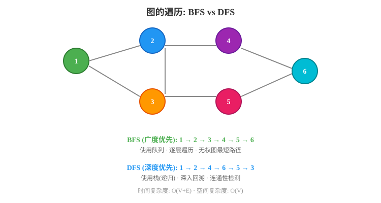
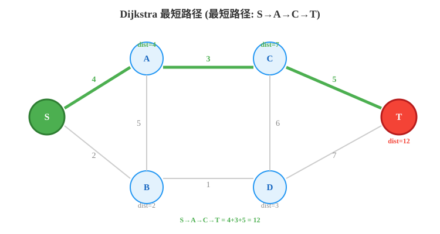

# 第五章：图论算法

> 图论（Graph Theory）是组合数学的一个分支，与群论、矩阵论、拓扑学等数学分支有着密切关系。图论起源于著名的**柯尼斯堡七桥问题**，该问题于1736年被欧拉解决，因此欧拉被公认为图论的创始人。
>
> 参考：[图论 - Wikipedia 文章 2889159]

---

## 5.1 图的基本概念

### 5.1.1 什么是图？

**图（Graph）** 由一组**顶点（Vertex）** 和连接顶点的**边（Edge）** 组成，记作 **G = (V, E)**。

- **V**：顶点集合，`V = {v₁, v₂, ..., vₙ}`
- **E**：边集合，每条边连接两个顶点

#### 图的分类

```
                    ┌─────────────────────────────┐
                    │           图 Graph           │
                    └─────────────────────────────┘
                               │
            ┌──────────────────┼──────────────────┐
            ▼                  ▼                  ▼
       ┌─────────┐      ┌───────────┐      ┌───────────┐
       │ 有向图   │      │ 无向图     │      │ 混合图     │
       │ Directed │      │ Undirected │      │ Mixed     │
       └─────────┘      └───────────┘      └───────────┘
            │                  │
            ▼                  ▼
       ┌─────────┐      ┌───────────┐
       │ 有权图   │      │ 无权图     │
       │ Weighted │      │ Unweighted │
       └─────────┘      └───────────┘
```

下图展示了有向图、无向图以及邻接表存储结构的示例：


**示例：无向图 vs 有向图**

```
无向图：              有向图：
   A ─── B              A ──→ B
   │     │              │     │
   │     │              ↓     ↓
   C ─── D              C ──→ D
```

**示例：无权图 vs 有权图**

```
无权图：              有权图（边上标权重）：
   A ─── B              A ──5── B
   │     │              │       │
   │     │              2       3
   C ─── D              C ──1── D
```

### 5.1.2 图的存储方式

#### ① 邻接矩阵（Adjacency Matrix）

用一个 `n × n` 的二维数组表示图，`matrix[i][j]` 表示顶点 i 到顶点 j 是否有边（或边的权重）。

**优点**：判断两点是否相连为 O(1)  
**缺点**：占用 O(V²) 空间，稀疏图浪费严重

```python
class GraphAdjMatrix:
    """邻接矩阵实现的无向图（无权）"""
    def __init__(self, n: int):
        self.n = n
        self.matrix = [[0] * n for _ in range(n)]
    
    def add_edge(self, u: int, v: int):
        """添加边（无向）"""
        self.matrix[u][v] = 1
        self.matrix[v][u] = 1
    
    def has_edge(self, u: int, v: int) -> bool:
        return self.matrix[u][v] == 1
    
    def print_graph(self):
        for i in range(self.n):
            print(self.matrix[i])

# 使用示例
g = GraphAdjMatrix(4)
g.add_edge(0, 1)
g.add_edge(0, 2)
g.add_edge(1, 3)
g.add_edge(2, 3)
g.print_graph()
```

输出：
```
[0, 1, 1, 0]
[1, 0, 0, 1]
[1, 0, 0, 1]
[0, 1, 1, 0]
```

#### ② 邻接表（Adjacency List）

每个顶点维护一个列表，存储与其相邻的顶点。

**优点**：空间 O(V+E)，适合稀疏图  
**缺点**：判断两点是否相连需要遍历列表

```python
from collections import defaultdict

class GraphAdjList:
    """邻接表实现的无向图（无权）"""
    def __init__(self):
        self.graph = defaultdict(list)  # 也可以使用 [[] for _ in range(n)]
    
    def add_edge(self, u: int, v: int):
        """添加边（无向）"""
        self.graph[u].append(v)
        self.graph[v].append(u)
    
    def print_graph(self):
        for vertex, neighbors in self.graph.items():
            print(f"{vertex}: {neighbors}")

# 使用示例
g = GraphAdjList()
g.add_edge(0, 1)
g.add_edge(0, 2)
g.add_edge(1, 3)
g.add_edge(2, 3)
g.print_graph()
```

输出：
```
0: [1, 2]
1: [0, 3]
2: [0, 3]
3: [1, 2]
```

#### 邻接表（有权图版本）

```python
class WeightedGraph:
    """邻接表实现的有权图"""
    def __init__(self):
        self.graph = defaultdict(list)  # (neighbor, weight)
    
    def add_edge(self, u: int, v: int, w: int):
        self.graph[u].append((v, w))
        self.graph[v].append((u, w))  # 无向图
    
    def print_graph(self):
        for vertex, edges in self.graph.items():
            print(f"{vertex}: {edges}")
```

#### ③ 存储方式对比

| 特性 | 邻接矩阵 | 邻接表 |
|------|---------|-------|
| **空间复杂度** | O(V²) | O(V+E) |
| **判断两点是否相连** | O(1) | O(度(v)) |
| **遍历某顶点的所有邻边** | O(V) | O(度(v)) |
| **添加边** | O(1) | O(1) |
| **删除边** | O(1) | O(度(v)) |
| **适用场景** | 稠密图 | 稀疏图 |
| **实现难度** | 简单 | 中等 |

**选择建议**：当图比较稠密（E 接近 V²）或需要频繁判断两点是否相连时，使用邻接矩阵；否则优先使用邻接表，节省空间。

### 5.1.3 图的遍历

下图展示了 BFS 与 DFS 在图上的不同遍历顺序和路径：



#### 深度优先搜索（DFS）

**核心思想**：从一个顶点出发，沿着一条路径走到黑，走不动了再回头。

**递归实现**：

```python
def dfs_recursive(graph: dict, start: int, visited: set = None):
    """DFS 递归实现"""
    if visited is None:
        visited = set()
    
    visited.add(start)
    print(start, end=" ")  # 访问当前顶点
    
    for neighbor in graph[start]:
        if neighbor not in visited:
            dfs_recursive(graph, neighbor, visited)

# 使用示例
graph = {
    0: [1, 2],
    1: [0, 3, 4],
    2: [0, 4],
    3: [1],
    4: [1, 2]
}
print("DFS 递归:", end=" ")
dfs_recursive(graph, 0)  # 输出: 0 1 3 4 2
```

**迭代实现（使用栈）**：

```python
def dfs_iterative(graph: dict, start: int):
    """DFS 迭代实现（使用栈）"""
    visited = set()
    stack = [start]
    
    while stack:
        vertex = stack.pop()
        if vertex not in visited:
            visited.add(vertex)
            print(vertex, end=" ")
            # 逆序压入，保持与递归顺序一致
            for neighbor in reversed(graph[vertex]):
                if neighbor not in visited:
                    stack.append(neighbor)

print("\nDFS 迭代:", end=" ")
dfs_iterative(graph, 0)  # 输出: 0 1 3 4 2
```

**DFS 遍历过程图示**：

```
初始状态：          访问 0：            访问 1：            访问 3：
  0                   0✓                  0✓                  0✓
  │ \                 │ \                 │ \                 │ \
  1─2                 1─2                 1✓─2                1✓─2
  │  │                │  │                │  │                │  │
  3─4                 3─4                 3─4                 3✓─4

  访问完 3，回到 1：
  0✓     栈：[4, 2]
  │ \
  1✓─2    → 访问 4
  │  │
  3✓─4✓

  回到 1，再回到 0，访问 2：
  0✓
  │ \
  1✓─2✓  → 全部访问完毕
  │  │
  3✓─4✓
```

#### 广度优先搜索（BFS）

**核心思想**：一层一层地往外扩展，像水波一样扩散。

**实现（使用队列）**：

```python
from collections import deque

def bfs(graph: dict, start: int):
    """BFS 实现（使用队列）"""
    visited = set([start])
    queue = deque([start])
    
    while queue:
        vertex = queue.popleft()
        print(vertex, end=" ")
        
        for neighbor in graph[vertex]:
            if neighbor not in visited:
                visited.add(neighbor)
                queue.append(neighbor)

print("BFS:", end=" ")
bfs(graph, 0)  # 输出: 0 1 2 3 4
```

**BFS 遍历过程图示**：

```
初始：queue = [0]       访问 0，加入 1,2：    访问 1，加入 3,4：
                           queue = [1,2]          queue = [2,3,4]
  0                       0✓                     0✓
  │ \                     │ \                     │ \
  1─2                     1─2                     1✓─2
  │  │                    │  │                    │  │
  3─4                     3─4                     3─4

访问 2，2 的邻居都已访问：  访问 3：              访问 4：
  queue = [3,4]              queue = [4]            queue = []
  0✓                        0✓                     0✓
  │ \                       │ \                    │ \
  1✓─2✓                    1✓─2✓                  1✓─2✓
  │  │                     │  │                    │  │
  3─4                      3✓─4                   3✓─4✓
```

**时间复杂度**：DFS 和 BFS 都是 **O(V + E)**，其中 V 是顶点数，E 是边数。

---

## 5.2 最短路径（Shortest Path）

> 最短路径问题是图论中的经典问题，旨在寻找图中两结点之间的最短路径。
>
> 参考：[最短路问题 - Wikipedia 文章 3517252]

### 5.2.1 Dijkstra 算法（单源最短路径，无负权边）

**核心思想**：贪心策略。每次从未确定最短距离的顶点中，选择距离最小的顶点，然后用它去更新其他顶点。

**适用于**：非负权图（有负权边会出错）

**时间复杂度**：O((V+E) log V)（使用优先队列）

**算法步骤**：
1. 初始化 `dist[起点] = 0`，其余为无穷大
2. 使用优先队列（最小堆）存储 `(距离, 顶点)`
3. 每次取出距离最小的顶点，如果已确定则跳过
4. 遍历该顶点的所有邻接边，尝试更新 `dist[邻居]`
5. 重复 3-4 直到队列为空

下图展示了 Dijkstra 算法在带权有向图中寻找最短路径的完整过程：



```
Dijkstra 算法过程图示（求 A 到各点的最短路径）：

初始：                 第一步：选 A，更新 B(3), C(1)
   A(0)                     A(0)
  3/   \1                   3/   \1
  B(∞)  C(∞)               B(3)  C(1)
  2\   /4                   2\   /4
    D(∞)                     D(∞)

第二步：选 C，更新 D(1+4=5)   第三步：选 B，更新 D(3+2=5)
   A(0)                     A(0)
  3/   \1                   3/   \1
  B(3)  C(1)               B(3)  C(1)
  2\   /4                   2\   /4
    D(5)                     D(5)  ← 最短路径为 5

最终：A→B=3, A→C=1, A→D=5
```

**Python 实现**：

```python
import heapq
from collections import defaultdict

def dijkstra(graph: dict, n: int, start: int) -> list:
    """
    Dijkstra 算法求单源最短路径
    
    Args:
        graph: 邻接表，graph[u] = [(v, w), ...]
        n: 顶点个数
        start: 起点
    
    Returns:
        dist: 起点到各点的最短距离（不可达为 inf）
    """
    INF = float('inf')
    dist = [INF] * n
    dist[start] = 0
    
    # 优先队列：(距离, 顶点)
    pq = [(0, start)]
    visited = [False] * n
    
    while pq:
        d, u = heapq.heappop(pq)
        
        if visited[u]:
            continue
        visited[u] = True
        
        for v, w in graph[u]:
            if dist[u] + w < dist[v]:
                dist[v] = dist[u] + w
                heapq.heappush(pq, (dist[v], v))
    
    return dist


# 使用示例
# 构建上图所示的图
g = defaultdict(list)
g[0] = [(1, 3), (2, 1)]   # A(0) → B(1) 权重3, A → C(2) 权重1
g[1] = [(3, 2)]            # B → D(3) 权重2
g[2] = [(3, 4)]            # C → D 权重4
g[3] = []                  # D 无出边

dist = dijkstra(g, 4, 0)
print(f"最短距离: A→B={dist[1]}, A→C={dist[2]}, A→D={dist[3]}")
# 输出: 最短距离: A→B=3, A→C=1, A→D=5
```

### 5.2.2 Bellman-Ford 算法（支持负权边）

**核心思想**：对所有的边进行 V-1 轮松弛操作。每轮遍历所有边，尝试用 `dist[u] + w` 更新 `dist[v]`。

**适用于**：有负权边的图，可以检测负环

**时间复杂度**：O(V·E)

```
Bellman-Ford 松弛过程（每轮遍历所有边进行松弛）：

第1轮：          第2轮：          第3轮：
  A(0)              A(0)             A(0)
  3/   \1           3/   \1          3/   \1
  B(3)  C(1)        B(3)  C(1)       B(3)  C(1)
  2\   /4           2\   /4          2\   /4
    D(5)              D(5)             D(5)

第3轮之后不再变化，V-1=3轮结束
```

**Python 实现**：

```python
def bellman_ford(edges: list, n: int, start: int) -> tuple:
    """
    Bellman-Ford 算法
    
    Args:
        edges: 边列表 [(u, v, w), ...]
        n: 顶点个数
        start: 起点
    
    Returns:
        (dist, has_negative_cycle)
    """
    INF = float('inf')
    dist = [INF] * n
    dist[start] = 0
    
    # 进行 V-1 轮松弛
    for i in range(n - 1):
        updated = False
        for u, v, w in edges:
            if dist[u] != INF and dist[u] + w < dist[v]:
                dist[v] = dist[u] + w
                updated = True
        if not updated:
            break  # 提前结束
        print(f"第 {i+1} 轮松弛完成: {dist}")
    
    # 检测负环：再做一轮，如果还能更新则有负环
    for u, v, w in edges:
        if dist[u] != INF and dist[u] + w < dist[v]:
            return dist, True  # 存在负环
    
    return dist, False


# 使用示例
edges = [
    (0, 1, 3),  # A→B 权重3
    (0, 2, 1),  # A→C 权重1
    (1, 3, 2),  # B→D 权重2
    (2, 3, 4),  # C→D 权重4
]

dist, has_neg_cycle = bellman_ford(edges, 4, 0)
print(f"最短距离: {dist}")          # [0, 3, 1, 5]
print(f"存在负环: {has_neg_cycle}")  # False
```

**检测负环示例**：

```python
# 包含负环的图
edges_with_neg_cycle = [
    (0, 1, 1),   # A→B 1
    (1, 2, -2),  # B→C -2
    (2, 0, -1),  # C→A -1  → 形成负环 1 + (-2) + (-1) = -2
]

dist, has_neg_cycle = bellman_ford(edges_with_neg_cycle, 3, 0)
print(f"存在负环: {has_neg_cycle}")  # True
```

### 5.2.3 Floyd-Warshall 算法（多源最短路径）

**核心思想**：动态规划。设 `dp[k][i][j]` 表示从 i 到 j 且中间顶点只经过 0..k 的最短路径长度。滚动数组优化为 `dist[i][j]`。

**状态转移方程**：
```
dist[i][j] = min(dist[i][j], dist[i][k] + dist[k][j])
```

**时间复杂度**：O(V³)  
**空间复杂度**：O(V²)

```
Floyd-Warshall 过程图示（3个顶点）：

初始矩阵 dist：
      A     B     C
A     0     3     1
B     3     0     2
C     1     2     0

经过 k=A(0) 后：
      A     B     C
A     0     3     1
B     3     0     2    ← B→C 不变 (3+1=4 > 2)
C     1     2     0

经过 k=B(1) 后：
      A     B     C
A     0     3     1    ← A→C 不变 (3+2=5 > 1)
B     3     0     2
C     1     2     0

经过 k=C(2) 后：
      A     B     C
A     0     3     1
B     3     0     2    ← B→A 不变 (2+1=3 == 3)
C     1     2     0
```

**Python 实现**：

```python
def floyd_warshall(graph: list, n: int) -> list:
    """
    Floyd-Warshall 多源最短路径算法
    
    Args:
        graph: n×n 邻接矩阵，graph[i][j] 为 i 到 j 的边权（INF 表示无边）
        n: 顶点个数
    
    Returns:
        dist: 最短路径距离矩阵
    """
    INF = float('inf')
    dist = [row[:] for row in graph]  # 复制
    
    for k in range(n):
        for i in range(n):
            if dist[i][k] == INF:
                continue
            for j in range(n):
                if dist[k][j] == INF:
                    continue
                if dist[i][k] + dist[k][j] < dist[i][j]:
                    dist[i][j] = dist[i][k] + dist[k][j]
        
        # 打印中间过程
        print(f"经过顶点 {k} 后:")
        for row in dist:
            print([x if x != INF else '∞' for x in row])
        print()
    
    return dist


# 使用示例
INF = float('inf')
graph = [
    [0,   3,   1,   INF],
    [3,   0,   INF, 2],
    [1,   INF, 0,   4],
    [INF, 2,   4,   0]
]

dist = floyd_warshall(graph, 4)
print("最终距离矩阵:")
for row in dist:
    print([x if x != INF else '∞' for x in row])
```

### 5.2.4 SPFA 算法（Shortest Path Faster Algorithm）

**核心思想**：Bellman-Ford 的队列优化。只有被更新过的顶点才可能引起其他顶点的更新，所以用队列维护待更新的顶点。

**适用于**：有负权边的图，可以检测负环

**时间复杂度**：平均 O(E)，最坏 O(V·E)

```python
from collections import deque

def spfa(graph: dict, n: int, start: int) -> tuple:
    """
    SPFA 算法（队列优化的 Bellman-Ford）
    
    Returns:
        (dist, has_negative_cycle)
    """
    INF = float('inf')
    dist = [INF] * n
    dist[start] = 0
    
    in_queue = [False] * n
    count = [0] * n  # 记录入队次数，用于检测负环
    queue = deque([start])
    in_queue[start] = True
    
    while queue:
        u = queue.popleft()
        in_queue[u] = False
        
        for v, w in graph[u]:
            if dist[u] + w < dist[v]:
                dist[v] = dist[u] + w
                if not in_queue[v]:
                    queue.append(v)
                    in_queue[v] = True
                    count[v] += 1
                    if count[v] >= n:  # 入队次数 >= n，说明有负环
                        return dist, True
    
    return dist, False


# 使用示例
g = defaultdict(list)
g[0] = [(1, 3), (2, 1)]
g[1] = [(3, 2)]
g[2] = [(3, 4)]
g[3] = []

dist, has_neg = spfa(g, 4, 0)
print(f"SPFA 最短距离: {dist}")              # [0, 3, 1, 5]
print(f"存在负环: {has_neg}")                # False
```

**四种最短路径算法对比**：

| 算法 | 时间复杂度 | 适用场景 | 能否处理负权 | 能否检测负环 |
|------|-----------|---------|:-----------:|:-----------:|
| Dijkstra | O((V+E)log V) | 单源，非负权图 | ❌ | ❌ |
| Bellman-Ford | O(VE) | 单源，任意图 | ✅ | ✅ |
| Floyd-Warshall | O(V³) | 多源（全源） | ✅ | ❌ |
| SPFA | 平均 O(E) | 单源，任意图 | ✅ | ✅ |

---

## 5.3 最小生成树（Minimum Spanning Tree, MST）

**最小生成树**：在一个连通的无向带权图中，选择 |V|-1 条边，使得所有顶点连通且总权重最小。

### 5.3.1 Kruskal 算法

**核心思想**：贪心 + 并查集。将所有边按权重从小到大排序，依次加入，如果加入后不形成环就保留。

**时间复杂度**：O(E log E)

```
Kruskal 算法过程图示：

初始图：              边排序：(A-C,1), (A-B,3), (B-D,2), (C-D,4)
   A
  3/ \1               选 A-C(1)：         选 B-D(2)：
  B   C                 A                    A
  2\ /4               3/ \1                3/ \1
   D                   B   C                B   C
                      2\ /4                2\ /4
                        D                    D   ← 选了 B-D(2)

选 A-B(3)：           C-D(4) 会形成环，跳过
   A
  3/ \1               最终 MST 总权重 = 1+2+3 = 6
  B   C
  2\ /
   D
```

**Python 实现**：

```python
class DSU:
    """并查集（Disjoint Set Union / Union-Find）"""
    def __init__(self, n: int):
        self.parent = list(range(n))
        self.rank = [0] * n
    
    def find(self, x: int) -> int:
        """带路径压缩的查找"""
        if self.parent[x] != x:
            self.parent[x] = self.find(self.parent[x])
        return self.parent[x]
    
    def union(self, x: int, y: int) -> bool:
        """按秩合并，返回是否成功合并"""
        px, py = self.find(x), self.find(y)
        if px == py:
            return False
        if self.rank[px] < self.rank[py]:
            px, py = py, px
        self.parent[py] = px
        if self.rank[px] == self.rank[py]:
            self.rank[px] += 1
        return True


def kruskal(n: int, edges: list) -> list:
    """
    Kruskal 算法求最小生成树
    
    Args:
        n: 顶点个数
        edges: 边列表 [(u, v, w), ...]
    
    Returns:
        mst: 最小生成树的边列表
    """
    edges = sorted(edges, key=lambda x: x[2])  # 按权重排序
    dsu = DSU(n)
    mst = []
    total_weight = 0
    
    for u, v, w in edges:
        if dsu.union(u, v):
            mst.append((u, v, w))
            total_weight += w
            if len(mst) == n - 1:
                break
    
    print(f"MST 总权重: {total_weight}")
    return mst


# 使用示例
edges = [
    (0, 1, 3),  # A-B
    (0, 2, 1),  # A-C
    (1, 3, 2),  # B-D
    (2, 3, 4),  # C-D
]

mst = kruskal(4, edges)
print("MST 边:", [(chr(65+u), chr(65+v), w) for u, v, w in mst])
# 输出: MST 边: [('A', 'C', 1), ('B', 'D', 2), ('A', 'B', 3)]
```

### 5.3.2 Prim 算法

**核心思想**：从一个顶点开始，每次选择连接已选集合和未选集合的最小权重边，将对应的顶点加入集合。

**时间复杂度**：O(E log V)（使用优先队列）

```
Prim 算法过程图示（从 A 开始）：

初始：已选 = {A}        选最小边 A-C(1)：      选最小边 A-B(3) 或 B-D(2)：
   A(已选)                 A(已选)                A(已选)
  3/ \1                   3/ \1                 3/ \1
  B   C                   B   C(已选)            B(已选) C(已选)
  2\ /4                   2\ /4                 2\ /4
   D                       D                     D

选 B-D(2)：
   A(已选)                最终总权重 = 1+3+2 = 6
  3/ \1
  B(已选) C(已选)
  2\ /4
   D(已选)
```

**Python 实现**：

```python
import heapq

def prim(graph: dict, n: int, start: int = 0) -> list:
    """
    Prim 算法求最小生成树
    
    Args:
        graph: 邻接表，graph[u] = [(v, w), ...]
        n: 顶点个数
        start: 起始顶点
    
    Returns:
        mst: 最小生成树的边列表
    """
    visited = [False] * n
    # 优先队列：(权重, 当前顶点, 父顶点)
    pq = [(0, start, -1)]
    mst = []
    total_weight = 0
    
    while pq:
        w, u, parent = heapq.heappop(pq)
        if visited[u]:
            continue
        visited[u] = True
        if parent != -1:
            mst.append((parent, u, w))
            total_weight += w
        
        for v, w2 in graph[u]:
            if not visited[v]:
                heapq.heappush(pq, (w2, v, u))
    
    print(f"MST 总权重: {total_weight}")
    return mst


# 使用示例
g = defaultdict(list)
g[0] = [(1, 3), (2, 1)]
g[1] = [(0, 3), (3, 2)]
g[2] = [(0, 1), (3, 4)]
g[3] = [(1, 2), (2, 4)]

mst = prim(g, 4, 0)
print("MST 边:", [(chr(65+u), chr(65+v), w) for u, v, w in mst])
```

#### ③ 最小生成树算法对比

| 算法 | 核心策略 | 时间复杂度 | 空间复杂度 | 适用场景 |
|------|---------|:----------:|:----------:|---------|
| **Kruskal** | 贪心 + 并查集，按边权重从小到大选择 | O(E log E) | O(V) | 稀疏图（边少） |
| **Prim** | 贪心 + 优先队列，从顶点扩展 | O(E log V) | O(V) | 稠密图（边多） |

**选择建议**：稀疏图用 Kruskal（边排序成本低），稠密图用 Prim（顶点扩展更高效）。两者都要求图是连通的无向图。

---

## 5.4 其他图论算法

### 5.4.1 拓扑排序（Topological Sort）

**拓扑排序**：对有向无环图（DAG）的顶点进行线性排序，使得对于每条有向边 u→v，u 都在 v 的前面。

**Kahn 算法（BFS 实现）**：

```python
from collections import deque

def topological_sort_kahn(n: int, edges: list) -> list:
    """
    Kahn 算法求拓扑排序
    
    Args:
        n: 顶点个数
        edges: 有向边列表 [(u, v), ...]
    
    Returns:
        拓扑排序结果（若存在环，返回空列表）
    """
    # 计算入度
    in_degree = [0] * n
    graph = defaultdict(list)
    for u, v in edges:
        graph[u].append(v)
        in_degree[v] += 1
    
    # 入度为 0 的顶点入队
    queue = deque([i for i in range(n) if in_degree[i] == 0])
    result = []
    
    while queue:
        u = queue.popleft()
        result.append(u)
        for v in graph[u]:
            in_degree[v] -= 1
            if in_degree[v] == 0:
                queue.append(v)
    
    return result if len(result) == n else []


# 使用示例
# 场景：课程学习顺序
edges = [
    (0, 1),  # 0→1：必须先学 0 才能学 1
    (0, 2),
    (1, 3),
    (2, 3),
    (3, 4),
]
order = topological_sort_kahn(5, edges)
print("拓扑排序:", order)  # 例如: [0, 1, 2, 3, 4]
```

**拓扑排序图示**：

```
有向图：               Kahn 算法过程：
   0                   入度: [0, 1, 1, 2, 1]
  / \                  选 0（入度为 0）→ 更新 1,2 入度
 1   2                 入度: [-, 0, 0, 2, 1]
  \ /                  选 1（入度为 0）→ 更新 3 入度
   3                   入度: [-, -, 0, 1, 1]
   |                   选 2（入度为 0）→ 更新 3 入度
   4                   入度: [-, -, -, 0, 1]
                       选 3 → 选 4
                       结果: [0, 1, 2, 3, 4]
```

**DFS 实现拓扑排序**：

```python
def topological_sort_dfs(n: int, edges: list) -> list:
    """DFS 实现拓扑排序（后序遍历逆序）"""
    graph = defaultdict(list)
    for u, v in edges:
        graph[u].append(v)
    
    visited = [0] * n  # 0:未访问, 1:访问中, 2:已访问完
    result = []
    
    def dfs(u: int) -> bool:
        """返回 False 表示有环"""
        if visited[u] == 1:
            return False  # 检测到环
        if visited[u] == 2:
            return True
        
        visited[u] = 1
        for v in graph[u]:
            if not dfs(v):
                return False
        visited[u] = 2
        result.append(u)  # 后序加入
        return True
    
    for i in range(n):
        if visited[i] == 0:
            if not dfs(i):
                return []  # 有环
    
    return result[::-1]  # 逆序输出


order = topological_sort_dfs(5, edges)
print("DFS 拓扑排序:", order)
```

### 5.4.2 并查集（Union-Find / Disjoint Set Union, DSU）

**核心思想**：高效地管理元素的分组，支持两种操作：
- **find(x)**：查找 x 所属的集合（根节点）
- **union(x, y)**：合并 x 和 y 所在的集合

**优化**：
- **路径压缩（Path Compression）**：find 时将路径上的所有节点直接指向根
- **按秩合并（Union by Rank）**：将较小的树合并到较大的树上

> 参考：Wikipedia 文章 3240821（并查集）

```python
class DSU:
    """并查集完整实现"""
    def __init__(self, n: int):
        self.parent = list(range(n))
        self.rank = [0] * n
        self.size = [1] * n  # 集合大小
        self.count = n       # 集合个数
    
    def find(self, x: int) -> int:
        """查找 + 路径压缩（递归写法）"""
        if self.parent[x] != x:
            self.parent[x] = self.find(self.parent[x])
        return self.parent[x]
    
    def find_iterative(self, x: int) -> int:
        """查找 + 路径压缩（迭代写法）"""
        root = x
        while self.parent[root] != root:
            root = self.parent[root]
        # 路径压缩
        while x != root:
            nxt = self.parent[x]
            self.parent[x] = root
            x = nxt
        return root
    
    def union(self, x: int, y: int) -> bool:
        """合并，返回是否进行了合并"""
        px, py = self.find(x), self.find(y)
        if px == py:
            return False
        
        # 按秩合并
        if self.rank[px] < self.rank[py]:
            px, py = py, px
        self.parent[py] = px
        if self.rank[px] == self.rank[py]:
            self.rank[px] += 1
        
        self.size[px] += self.size[py]
        self.count -= 1
        return True
    
    def connected(self, x: int, y: int) -> bool:
        """判断两个元素是否在同一集合"""
        return self.find(x) == self.find(y)
    
    def get_size(self, x: int) -> int:
        """获取 x 所在集合的大小"""
        return self.size[self.find(x)]


# 使用示例
dsu = DSU(5)
dsu.union(0, 1)
dsu.union(1, 2)
dsu.union(3, 4)
print(f"0 和 2 是否连通: {dsu.connected(0, 2)}")   # True
print(f"0 和 3 是否连通: {dsu.connected(0, 3)}")   # False
print(f"集合个数: {dsu.count}")                     # 2
print(f"0 所在集合大小: {dsu.get_size(0)}")         # 3
```

**并查集图示**：

```
初始: [0] [1] [2] [3] [4]

union(0,1): [0,1] [2] [3] [4]
  parent[1]=0

union(1,2): [0,1,2] [3] [4]
  find(1)=0, parent[2]=0

union(3,4): [0,1,2] [3,4]
  parent[4]=3

路径压缩：
  find(2) → parent[2]=0(parent[2]原本指向1，现在直接指向0)
```

### 5.4.3 二分图判定（Bipartite Graph Check）

**二分图**：可以将顶点分成两个不相交的集合，使得所有边都连接两个不同集合中的顶点。

**判定方法**：BFS/DFS 染色法，相邻顶点染不同颜色，如果出现冲突则不是二分图。

```python
from collections import deque

def is_bipartite(graph: dict, n: int) -> bool:
    """
    二分图判定（染色法）
    
    Args:
        graph: 邻接表
        n: 顶点个数
    
    Returns:
        是否为二分图
    """
    color = [-1] * n  # -1:未染色, 0:红色, 1:蓝色
    
    for start in range(n):
        if color[start] != -1:
            continue
        
        # BFS 染色
        color[start] = 0
        queue = deque([start])
        
        while queue:
            u = queue.popleft()
            for v in graph[u]:
                if color[v] == -1:
                    color[v] = 1 - color[u]  # 染相反颜色
                    queue.append(v)
                elif color[v] == color[u]:
                    return False  # 冲突，不是二分图
    
    return True


# 使用示例
# 二分图示例
graph1 = {
    0: [1, 3],
    1: [0, 2],
    2: [1, 3],
    3: [0, 2],
}
print(f"graph1 是二分图: {is_bipartite(graph1, 4)}")  # True

# 非二分图（三角形）
graph2 = {
    0: [1, 2],
    1: [0, 2],
    2: [0, 1],
}
print(f"graph2 是二分图: {is_bipartite(graph2, 3)}")  # False
```

**二分图染色图示**：

```
二分图（可二染色）：         非二分图（三角形，无法二染色）：
  0(红)──1(蓝)               0(红)──1(蓝)
   │      │                    │  ╲  │
   │      │                    │   ╲ │
  3(蓝)──2(红)               2(?)──1(蓝)
                             冲突！2 既要是红也要是蓝
```

### 5.4.4 强连通分量（Strongly Connected Components, SCC）

**强连通分量**：在有向图中，如果两个顶点可以互相到达，则它们属于同一个强连通分量。

#### Kosaraju 算法

**步骤**：
1. 对原图进行 DFS，记录完成顺序（后序）
2. 对反图进行 DFS，按完成顺序的逆序访问

```python
def kosaraju(n: int, edges: list) -> list:
    """
    Kosaraju 算法求强连通分量
    
    Args:
        n: 顶点个数
        edges: 有向边列表 [(u, v), ...]
    
    Returns:
        scc_list: 每个强连通分量包含的顶点列表
    """
    graph = defaultdict(list)
    rev_graph = defaultdict(list)
    for u, v in edges:
        graph[u].append(v)
        rev_graph[v].append(u)
    
    # 第一遍 DFS：确定完成顺序
    visited = [False] * n
    order = []
    
    def dfs1(u: int):
        visited[u] = True
        for v in graph[u]:
            if not visited[v]:
                dfs1(v)
        order.append(u)  # 后序加入
    
    for i in range(n):
        if not visited[i]:
            dfs1(i)
    
    # 第二遍 DFS：在反图上按逆序找 SCC
    visited = [False] * n
    scc_list = []
    
    def dfs2(u: int, component: list):
        visited[u] = True
        component.append(u)
        for v in rev_graph[u]:
            if not visited[v]:
                dfs2(v, component)
    
    for u in reversed(order):
        if not visited[u]:
            component = []
            dfs2(u, component)
            scc_list.append(component)
    
    return scc_list


# 使用示例
edges = [
    (0, 1), (1, 2), (2, 0),  # 0→1→2→0 形成一个环（一个 SCC）
    (2, 3), (3, 4),          # 3→4
    (4, 3),                  # 3←→4 另一个 SCC
    (4, 5),                  # 5 单独
]

sccs = kosaraju(6, edges)
print("强连通分量:", sccs)
# 输出: [[0, 2, 1], [3, 4], [5]]
```

#### Tarjan 算法

**核心思想**：在一次 DFS 中利用时间戳和 low 值找出所有 SCC。

```python
def tarjan(n: int, edges: list) -> list:
    """Tarjan 算法求强连通分量"""
    graph = defaultdict(list)
    for u, v in edges:
        graph[u].append(v)
    
    dfn = [-1] * n       # 时间戳（访问顺序）
    low = [0] * n        # 能追溯到的最早时间戳
    on_stack = [False] * n
    stack = []
    timestamp = [0]
    scc_list = []
    
    def dfs(u: int):
        dfn[u] = low[u] = timestamp[0]
        timestamp[0] += 1
        stack.append(u)
        on_stack[u] = True
        
        for v in graph[u]:
            if dfn[v] == -1:
                dfs(v)
                low[u] = min(low[u], low[v])
            elif on_stack[v]:
                low[u] = min(low[u], dfn[v])
        
        # 如果 u 是 SCC 的根
        if dfn[u] == low[u]:
            component = []
            while True:
                w = stack.pop()
                on_stack[w] = False
                component.append(w)
                if w == u:
                    break
            scc_list.append(component)
    
    for i in range(n):
        if dfn[i] == -1:
            dfs(i)
    
    return scc_list


sccs_tarjan = tarjan(6, edges)
print("Tarjan 强连通分量:", sccs_tarjan)
```

**强连通分量图示**：

```
有向图：               SCC 划分：
   0 ←── 1               ┌─────┐
   ↓     ↑               │ 0→1 │  ← SCC1 (0,1,2)
   2 ────┘               │ ↓↑  │
   ↓                     └──┴──┘
   3 ──→ 4               ┌─────┐
   ↑     ↓               │ 3←→4│  ← SCC2 (3,4)
   └─────┘               └─────┘
   ↓
   5                     [5] ← SCC3
```

---

### 5.4.5 网络流（Network Flow）

**网络流**：在一个带权有向图中，每条边有一个容量上限，求从源点（Source）到汇点（Sink）的最大可行流量。

#### 基本概念

- **容量（Capacity）**：每条边能承载的最大流量
- **流量（Flow）**：实际流经边的流量，不能超过容量
- **源点（Source, s）**：流的起点，净流出量为正
- **汇点（Sink, t）**：流的终点，净流入量为正
- **可行流（Feasible Flow）**：满足容量限制和流量守恒的流
- **最大流（Max Flow）**：从源点到汇点的最大可行流量
- **增广路（Augmenting Path）**：从源点到汇点的一条路径，沿途边仍有剩余容量
- **残量网络（Residual Network）**：原图每条边剩余容量构成的可继续增广的网络
- **最小割（Min Cut）**：将顶点集分为包含源点和汇点的两个部分，割的容量为跨越两个部分的边容量之和

#### 核心定理

**最大流最小割定理**：在任何网络中，最大流的值等于最小割的容量。这是网络流理论中最核心的定理。

#### 常见算法

| 算法 | 时间复杂度 | 核心思想 |
|------|:----------:|---------|
| **Ford-Fulkerson** | O(E·f) | 不断寻找增广路，直到无法增广 |
| **Edmonds-Karp** | O(V·E²) | 用 BFS 寻找最短增广路 |
| **Dinic** | O(V²·E) | 分层图 + 多路增广 |
| **ISAP** | O(V²·E) | 动态维护距离标号 |

> 参考：[网络流 - Wikipedia 文章 4138470]

---

## 5.5 练习题目

### 练习 1：课程表（拓扑排序）

**题目**：一共有 `n` 门课要上，编号为 `0` 到 `n-1`。给定课程之间的先修关系 `prerequisites[i] = [a, b]` 表示要学 a 必须先学 b。判断是否能完成所有课程。

**示例**：
```
输入：n = 4, prerequisites = [[1,0],[2,0],[3,1],[3,2]]
输出：True
解释：可以先学 0，然后学 1 和 2，最后学 3
```

**思路**：转化为拓扑排序问题，判断是否有环。

```python
from collections import deque

def can_finish(n: int, prerequisites: list) -> bool:
    """LeetCode 207. 课程表"""
    graph = defaultdict(list)
    in_degree = [0] * n
    
    for a, b in prerequisites:
        graph[b].append(a)  # b → a
        in_degree[a] += 1
    
    queue = deque([i for i in range(n) if in_degree[i] == 0])
    count = 0
    
    while queue:
        u = queue.popleft()
        count += 1
        for v in graph[u]:
            in_degree[v] -= 1
            if in_degree[v] == 0:
                queue.append(v)
    
    return count == n


# 测试
print(can_finish(4, [[1,0],[2,0],[3,1],[3,2]]))  # True
print(can_finish(2, [[1,0],[0,1]]))              # False（有环）
```

### 练习 2：网络延迟时间（Dijkstra）

**题目**：有 `n` 个网络节点，给定信号传播时间 `times[i] = (u, v, w)` 表示从 u 到 v 需要 w 时间。从节点 k 发出信号，求所有节点都收到信号的最短时间。如果有节点收不到，返回 -1。

**示例**：
```
输入：times = [[2,1,1],[2,3,1],[1,4,2],[3,4,2]], n = 4, k = 2
输出：2
解释：从 2 出发，信号到 1 需要 1，到 3 需要 1，到 4 需要 1+2=3 或 1+2=3，最大时间为 2
```

```python
import heapq

def network_delay_time(times: list, n: int, k: int) -> int:
    """LeetCode 743. 网络延迟时间"""
    graph = defaultdict(list)
    for u, v, w in times:
        graph[u-1].append((v-1, w))  # 转为 0-based
    
    dist = dijkstra(graph, n, k-1)
    max_dist = max(dist)
    return -1 if max_dist == float('inf') else max_dist


# 测试
times = [[2,1,1],[2,3,1],[1,4,2],[3,4,2]]
print(network_delay_time(times, 4, 2))  # 2
```

### 练习 3：省份数量（并查集）

**题目**：有 `n` 个城市，`isConnected[i][j] = 1` 表示城市 i 和 j 直接相连。求省份（连通分量）的数量。

**示例**：
```
输入：isConnected = [[1,1,0],[1,1,0],[0,0,1]]
输出：2
解释：城市 0 和 1 相连，城市 2 单独，共 2 个省份
```

```python
def find_circle_num(isConnected: list) -> int:
    """LeetCode 547. 省份数量"""
    n = len(isConnected)
    dsu = DSU(n)
    
    for i in range(n):
        for j in range(i+1, n):
            if isConnected[i][j] == 1:
                dsu.union(i, j)
    
    return dsu.count


# 测试
print(find_circle_num([[1,1,0],[1,1,0],[0,0,1]]))  # 2
print(find_circle_num([[1,0,0],[0,1,0],[0,0,1]]))  # 3
```

---

## 本章小结

```
图论算法思维导图：

                    ┌─────────── 图论基础 ───────────┐
                    │   存储：邻接矩阵 / 邻接表        │
                    │   遍历：DFS（栈/递归）BFS（队列） │
                    └────────────────────────────────┘
                    ┌─────────── 最短路径 ────────────┐
                    │   Dijkstra    O((V+E)log V)    │
                    │   Bellman-Ford O(VE)            │
                    │   Floyd-Warshall O(V³)          │
                    │   SPFA        平均 O(E)         │
                    └────────────────────────────────┘
                    ┌─────────── 最小生成树 ──────────┐
                    │   Kruskal  O(E log E)           │
                    │   Prim     O(E log V)           │
                    └────────────────────────────────┘
                    ┌─────────── 其他算法 ────────────┐
                    │   拓扑排序 | Kahn / DFS         │
                    │   并查集   | 路径压缩 + 按秩合并 │
                    │   二分图判定 | 染色法            │
                    │   强连通分量 | Kosaraju / Tarjan │
                    └────────────────────────────────┘
```

> **参考资源**：
> - 图论基础：Wikipedia 文章 2889159
> - 最短路径：Wikipedia 文章 3517252
> - 更多练习：LeetCode 图论专题

---

## 参考资源

- [图论 - Wikipedia 文章 2889159]
- [图论术语 - Wikipedia 文章 2889161]
- [戴克斯特拉算法 - Wikipedia 文章 3365576]
- [最小生成树 - Wikipedia 文章 3516806]
- [网络流 - Wikipedia 文章 4138470]
- [拓撲排序 - Wikipedia 文章 3396629]
- [深度优先搜索 - Wikipedia 文章 3797611]
- [广度优先搜索 - Wikipedia 文章 3245576]