# 第五章：图论算法

> 图论（Graph Theory）是组合数学的一个分支，与群论、矩阵论、拓扑学等数学分支有着密切关系。图论起源于著名的**柯尼斯堡七桥问题**，该问题于1736年被欧拉解决，因此欧拉被公认为图论的创始人。
>
> 参考：[图论 - Wikipedia 文章 2889159]

---

## 5.1 图的基本概念

### 5.1.1 什么是图？

> 💡 **类比：图如同"社交网络"**
>
> 想象一个社交网络：
> - **顶点（Vertex）**：每个人
> - **边（Edge）**：人与人之间的关系（好友、关注等）
> - **有向图**：微博关注（A 关注 B，B 不一定关注 A）
> - **无向图**：微信好友（互相都是好友）
> - **有权图**：关系亲密度（权重表示关系强度）
> - **无权图**：只关心是否认识，不关心关系深浅
>
> 图论就是研究这种"关系网络"的数学工具——从社交网络到交通路线，从互联网链接到电路设计，图无处不在。

**图（Graph）** 由一组**顶点（Vertex）** 和连接顶点的**边（Edge）** 组成，记作 **$G = (V, E)$**。

- **V**：顶点集合，`V = {v₁, v₂, ..., vₙ}`
- **E**：边集合，每条边连接两个顶点

#### 图的分类

```
                    ┌─────────────────────────────┐
                    │           图 Graph           │
                    └─────────────────────────────┘
                               │
            ┌──────────────────┼──────────────────┐
            ▼                  ▼                  ▼
       ┌─────────┐      ┌───────────┐      ┌───────────┐
       │ 有向图   │      │ 无向图     │      │ 混合图     │
       │ Directed │      │ Undirected │      │ Mixed     │
       └─────────┘      └───────────┘      └───────────┘
            │                  │
            ▼                  ▼
       ┌─────────┐      ┌───────────┐
       │ 有权图   │      │ 无权图     │
       │ Weighted │      │ Unweighted │
       └─────────┘      └───────────┘
```

下图展示了有向图、无向图以及邻接表存储结构的示例：


**示例：无向图 vs 有向图**

```
无向图：              有向图：
   A ─── B              A ──→ B
   │     │              │     │
   │     │              ↓     ↓
   C ─── D              C ──→ D
```

**示例：无权图 vs 有权图**

```
无权图：              有权图（边上标权重）：
   A ─── B              A ──5── B
   │     │              │       │
   │     │              2       3
   C ─── D              C ──1── D
```

### 5.1.2 图的存储方式

> 💡 **类比：邻接矩阵如同"全班点名册"，邻接表如同"每个人的通讯录"**
>
> - **邻接矩阵**：一张 $n \times n$ 的大表格，记录每两个人之间是否有关系。好处是一眼就能查到任意两人的关系（$O(1)$），但如果全班 100 人只有 50 对好友，表格大部分格子都是空的（浪费空间）
> - **邻接表**：每个人只记自己的好友名单。好处是省空间（只存真实存在的关系），但要查"张三和李四是不是好友"，得翻张三的通讯录慢慢找
>
> 选择哪种？关系多的"社交达人圈"用邻接矩阵（稠密图），关系少的"普通社交"用邻接表（稀疏图）。

#### ① 邻接矩阵（Adjacency Matrix）

用一个 `n × n` 的二维数组表示图，`matrix[i][j]` 表示顶点 i 到顶点 j 是否有边（或边的权重）。

**优点**：判断两点是否相连为 $O(1)$  
**缺点**：占用 $O(V^2)$ 空间，稀疏图浪费严重

```python
class GraphAdjMatrix:
    """邻接矩阵实现的无向图（无权）"""
    def __init__(self, n: int):
        self.n = n
        self.matrix = [[0] * n for _ in range(n)]
    
    def add_edge(self, u: int, v: int):
        """添加边（无向）"""
        self.matrix[u][v] = 1
        self.matrix[v][u] = 1
    
    def has_edge(self, u: int, v: int) -> bool:
        return self.matrix[u][v] == 1
    
    def print_graph(self):
        for i in range(self.n):
            print(self.matrix[i])

# 使用示例
g = GraphAdjMatrix(4)
g.add_edge(0, 1)
g.add_edge(0, 2)
g.add_edge(1, 3)
g.add_edge(2, 3)
g.print_graph()
```

输出：
```
[0, 1, 1, 0]
[1, 0, 0, 1]
[1, 0, 0, 1]
[0, 1, 1, 0]
```

#### ② 邻接表（Adjacency List）

每个顶点维护一个列表，存储与其相邻的顶点。

**优点**：空间 $O(V+E)$，适合稀疏图  
**缺点**：判断两点是否相连需要遍历列表

```python
from collections import defaultdict

class GraphAdjList:
    """邻接表实现的无向图（无权）"""
    def __init__(self):
        self.graph = defaultdict(list)  # 也可以使用 [[] for _ in range(n)]
    
    def add_edge(self, u: int, v: int):
        """添加边（无向）"""
        self.graph[u].append(v)
        self.graph[v].append(u)
    
    def print_graph(self):
        for vertex, neighbors in self.graph.items():
            print(f"{vertex}: {neighbors}")

# 使用示例
g = GraphAdjList()
g.add_edge(0, 1)
g.add_edge(0, 2)
g.add_edge(1, 3)
g.add_edge(2, 3)
g.print_graph()
```

输出：
```
0: [1, 2]
1: [0, 3]
2: [0, 3]
3: [1, 2]
```

#### 邻接表（有权图版本）

```python
class WeightedGraph:
    """邻接表实现的有权图"""
    def __init__(self):
        self.graph = defaultdict(list)  # (neighbor, weight)
    
    def add_edge(self, u: int, v: int, w: int):
        self.graph[u].append((v, w))
        self.graph[v].append((u, w))  # 无向图
    
    def print_graph(self):
        for vertex, edges in self.graph.items():
            print(f"{vertex}: {edges}")
```

#### ③ 存储方式对比

| 特性 | 邻接矩阵 | 邻接表 |
|------|---------|-------|
| **空间复杂度** | $O(V^2)$ | $O(V+E)$ |
| **判断两点是否相连** | $O(1)$ | $O(\text{度}(v))$ |
| **遍历某顶点的所有邻边** | $O(V)$ | $O(\text{度}(v))$ |
| **添加边** | $O(1)$ | $O(1)$ |
| **删除边** | $O(1)$ | $O(\text{度}(v))$ |
| **适用场景** | 稠密图 | 稀疏图 |
| **实现难度** | 简单 | 中等 |

**选择建议**：当图比较稠密（E 接近 $V^2$）或需要频繁判断两点是否相连时，使用邻接矩阵；否则优先使用邻接表，节省空间。

#### ④ 十字链表（Orthogonal List，有向图专用）

> 💡 **类比：十字链表如同"街道的'出街'和'入街'双重索引"**
> 普通邻接表只记录每个点的**出边**，查"谁指向我"（入边）就得遍历全图。十字链表给每个点维护了两条链：一条"出链"（从该点出发的边）和一条"入链"（指向该点的边），像街道示意图同时标清了每个路口的**出发路线**和**到达路线**。这样，求入度、查"有哪些点指向我"都变得和查出边一样快。

**核心概念**：
- 每个边节点同时挂在"弧尾顶点"（起点）的出链和"弧头顶点"（终点）的入链上
- 顶点节点含 `firstin`（第一条入边）和 `firstout`（第一条出边）两个指针
- 支持**正反两个方向**的高效遍历，特别适合频繁求入度/出度的有向图

**复杂度**：空间 $O(V+E)$；由某点查找出边、入边均为 $O(\text{度}(v))$。

**适用场景**：有向图需要频繁查询入度/出度的算法（拓扑排序、关键路径、稀疏有向图）。

#### ⑤ 邻接多重表（Adjacency Multi-list，无向图专用）

> 💡 **类比：邻接多重表如同"共享的'双头绳'记录法"**
> 无向图的邻接表会把每条边存两遍（u 存一次、v 存一次），删一条边要改两处，容易出错。邻接多重表给每条边**只存一个节点**，这个节点同时挂在两端的链上（像一根绳子两端各有一个挂环）。这样删除一条边时，只需处理一个边节点，既省空间又避免了一致性问题。

**核心概念**：
- 每条无向边只用一个边节点表示，节点含 `ivex`、`jvex`（两个端点）和两条链指针
- 边节点同时挂在两端顶点的邻接链上
- 删除边只需处理一个边节点，不会出现"只删了一半"的不一致

**复杂度**：空间 $O(V+E)$；遍历某点邻边 $O(\text{度}(v))$。

**适用场景**：无向图需要频繁增删边的场景（如图匹配、动态图算法）。

#### ⑥ 四种存储方式对比

| 特性 | 邻接矩阵 | 邻接表 | 十字链表 | 邻接多重表 |
|------|---------|-------|---------|-----------|
| 适用图 | 任意 | 任意 | 有向图 | 无向图 |
| 空间 | $O(V^2)$ | $O(V+E)$ | $O(V+E)$ | $O(V+E)$ |
| 查入度/前驱 | 看列 $O(V)$ | 需遍历 $O(V+E)$ | $O(\text{入度})$ | — |
| 删除边 | $O(1)$ | 需改两处 | 需处理两链 | 只改一处 |
| 实现难度 | 简单 | 中等 | 较难 | 较难 |

### 5.1.3 图的遍历

下图展示了 BFS 与 DFS 在图上的不同遍历顺序和路径：


> 💡 **类比：BFS 像"水面涟漪"，DFS 像"迷宫探路"**
> - **BFS（广度优先）**：像往水面投下一颗石子，波纹一圈圈向外扩散。访问顺序按"离起点的层数"由近及远，天然适合求**无权图最短路径**。
> - **DFS（深度优先）**：像在迷宫里"一条道走到黑"，走不通了再回头换一条。它适合**探测连通性、遍历所有可能路径**。
>
> 下图用同一棵树展示了两种访问顺序的巨大差别——BFS 一层层铺开，DFS 先钻到底再回溯：

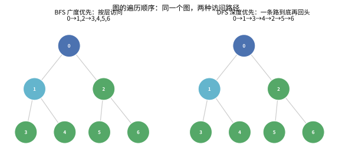

#### 深度优先搜索（DFS）

**核心思想**：从一个顶点出发，沿着一条路径走到黑，走不动了再回头。

**递归实现**：

```python
def dfs_recursive(graph: dict, start: int, visited: set = None):
    """DFS 递归实现"""
    if visited is None:
        visited = set()
    
    visited.add(start)
    print(start, end=" ")  # 访问当前顶点
    
    for neighbor in graph[start]:
        if neighbor not in visited:
            dfs_recursive(graph, neighbor, visited)

# 使用示例
graph = {
    0: [1, 2],
    1: [0, 3, 4],
    2: [0, 4],
    3: [1],
    4: [1, 2]
}
print("DFS 递归:", end=" ")
dfs_recursive(graph, 0)  # 输出: 0 1 3 4 2
```

**迭代实现（使用栈）**：

```python
def dfs_iterative(graph: dict, start: int):
    """DFS 迭代实现（使用栈）"""
    visited = set()
    stack = [start]
    
    while stack:
        vertex = stack.pop()
        if vertex not in visited:
            visited.add(vertex)
            print(vertex, end=" ")
            # 逆序压入，保持与递归顺序一致
            for neighbor in reversed(graph[vertex]):
                if neighbor not in visited:
                    stack.append(neighbor)

print("\nDFS 迭代:", end=" ")
dfs_iterative(graph, 0)  # 输出: 0 1 3 4 2
```

**DFS 遍历过程图示**：

```
初始状态：          访问 0：            访问 1：            访问 3：
  0                   0✓                  0✓                  0✓
  │ \                 │ \                 │ \                 │ \
  1─2                 1─2                 1✓─2                1✓─2
  │  │                │  │                │  │                │  │
  3─4                 3─4                 3─4                 3✓─4

  访问完 3，回到 1：
  0✓     栈：[4, 2]
  │ \
  1✓─2    → 访问 4
  │  │
  3✓─4✓

  回到 1，再回到 0，访问 2：
  0✓
  │ \
  1✓─2✓  → 全部访问完毕
  │  │
  3✓─4✓
```

#### 广度优先搜索（BFS）

**核心思想**：一层一层地往外扩展，像水波一样扩散。

**实现（使用队列）**：

```python
from collections import deque

def bfs(graph: dict, start: int):
    """BFS 实现（使用队列）"""
    visited = set([start])
    queue = deque([start])
    
    while queue:
        vertex = queue.popleft()
        print(vertex, end=" ")
        
        for neighbor in graph[vertex]:
            if neighbor not in visited:
                visited.add(neighbor)
                queue.append(neighbor)

print("BFS:", end=" ")
bfs(graph, 0)  # 输出: 0 1 2 3 4
```

**BFS 遍历过程图示**：

```
初始：queue = [0]       访问 0，加入 1,2：    访问 1，加入 3,4：
                           queue = [1,2]          queue = [2,3,4]
  0                       0✓                     0✓
  │ \                     │ \                     │ \
  1─2                     1─2                     1✓─2
  │  │                    │  │                    │  │
  3─4                     3─4                     3─4

访问 2，2 的邻居都已访问：  访问 3：              访问 4：
  queue = [3,4]              queue = [4]            queue = []
  0✓                        0✓                     0✓
  │ \                       │ \                    │ \
  1✓─2✓                    1✓─2✓                  1✓─2✓
  │  │                     │  │                    │  │
  3─4                      3✓─4                   3✓─4✓
```

**时间复杂度**：DFS 和 BFS 都是 **$O(V + E)$**，其中 V 是顶点数，E 是边数。

### 5.1.4 A* 搜索算法（A-Star Search）

> 💡 **类比：A* 如同"导航软件"**
>
> 想象你要从家开车去机场，导航软件不会像 BFS 那样一圈圈往外扩散（太慢），也不会像 DFS 那样一条道走到黑（可能走错路）。**A*** 的做法是：在每一步都估算"当前位置到终点还有多远"（启发函数），然后优先探索"已走距离 + 预估剩余距离"最小的方向。就像导航软件会优先推荐"已走路程 + 预计剩余时间"最短的路线。
>
> **与 Dijkstra 的关系**：Dijkstra 是 A* 的特例（启发函数 $h(n) = 0$）。A* 在 Dijkstra 的基础上加入了"目标导向"的启发信息，使得搜索更有方向性。

**核心思想**：

维护一个优先队列，每次取出 $f(n) = g(n) + h(n)$ 最小的节点扩展：
- $g(n)$：从起点到节点 $n$ 的实际代价
- $h(n)$：从节点 $n$ 到终点的**启发式估计**（必须满足 $h(n) \le$ 真实代价，称为"可采纳性"）

**算法步骤**：
1. 初始化 `g[起点] = 0`，优先队列加入 `(h(起点), 起点)`
2. 每次取出 $f$ 最小的节点 $u$，如果 $u$ 是终点则返回
3. 遍历 $u$ 的邻居 $v$，如果 $g[u] + w(u,v) < g[v]$，则更新 $g[v]$ 并加入队列
4. 重复 2-3 直到队列为空或找到终点

**Python 实现**：

```python
import heapq

def a_star(graph: dict, n: int, start: int, end: int, heuristic: list) -> tuple:
    """
    A* 搜索算法
    
    Args:
        graph: 邻接表，graph[u] = [(v, w), ...]
        n: 顶点个数
        start: 起点
        end: 终点
        heuristic: 启发函数数组，heuristic[i] 表示节点 i 到终点的估计距离
    
    Returns:
        (dist, path)
        dist: 最短距离
        path: 路径节点列表
    """
    INF = float('inf')
    g = [INF] * n
    g[start] = 0
    
    # 优先队列：(f值, 节点)
    pq = [(heuristic[start], start)]
    parent = [-1] * n
    visited = [False] * n
    
    while pq:
        f, u = heapq.heappop(pq)
        
        if visited[u]:
            continue
        visited[u] = True
        
        if u == end:
            # 重构路径
            path = []
            cur = end
            while cur != -1:
                path.append(cur)
                cur = parent[cur]
            return g[end], path[::-1]
        
        for v, w in graph[u]:
            if not visited[v] and g[u] + w < g[v]:
                g[v] = g[u] + w
                parent[v] = u
                f_new = g[v] + heuristic[v]
                heapq.heappush(pq, (f_new, v))
    
    return INF, []  # 不可达


# 使用示例（网格图，曼哈顿距离作为启发函数）
# 3x3 网格，从 (0,0) 到 (2,2)
g = defaultdict(list)
# 添加边（简化示例）
for i in range(3):
    for j in range(3):
        u = i * 3 + j
        if i + 1 < 3:
            v = (i + 1) * 3 + j
            g[u].append((v, 1))
            g[v].append((u, 1))
        if j + 1 < 3:
            v = i * 3 + (j + 1)
            g[u].append((v, 1))
            g[v].append((u, 1))

# 启发函数：曼哈顿距离到终点 (2,2)
heuristic = [abs(i - 2) + abs(j - 2) for i in range(3) for j in range(3)]

dist, path = a_star(g, 9, 0, 8, heuristic)
print(f"最短距离: {dist}, 路径: {path}")  # 4, [0, 1, 2, 5, 8]
```

**启发函数设计**：
- **可采纳性（Admissible）**：$h(n) \le$ 真实代价，保证找到最优解
- **一致性（Consistent）**：$h(u) \le w(u,v) + h(v)$，保证每个节点只扩展一次
- **常见启发函数**：
  - 网格图：曼哈顿距离（只能上下左右）、欧几里得距离（可斜走）
  - 路径规划：直线距离

**复杂度**：
- 时间复杂度：最坏 $O((V+E) \log V)$（与 Dijkstra 相同），但实际远快于 Dijkstra
- 空间复杂度：$O(V)$
- **关键**：启发函数越接近真实代价，搜索越快；$h(n) = 0$ 退化为 Dijkstra

**应用场景**：
- 游戏 AI 路径规划
- 地图导航
- 机器人运动规划
- 八数码、十五数码等谜题求解

---

## 5.2 最短路径（Shortest Path）

> 最短路径问题是图论中的经典问题，旨在寻找图中两结点之间的最短路径。
>
> 参考：[最短路问题 - Wikipedia 文章 3517252]

### 5.2.1 Dijkstra 算法（单源最短路径，无负权边）

**核心思想**：贪心策略。每次从未确定最短距离的顶点中，选择距离最小的顶点，然后用它去更新其他顶点。

**适用于**：非负权图（有负权边会出错）

**时间复杂度**：O((V+E) log V)（使用优先队列）

**算法步骤**：
1. 初始化 `dist[起点] = 0`，其余为无穷大
2. 使用优先队列（最小堆）存储 `(距离, 顶点)`
3. 每次取出距离最小的顶点，如果已确定则跳过
4. 遍历该顶点的所有邻接边，尝试更新 `dist[邻居]`
5. 重复 3-4 直到队列为空

> 💡 **类比：水往低处流 / 广播扩散**
> 想象你在起点 S 泼下一盆水，水会同时沿着每条路"渗"出去，哪条路先通到某座城市，那条路就是到该城市的最短路径。Dijkstra 每次选择的"当前距离最小节点"，就好比水最先到达的那个点——它离起点最近，所以它的最短距离可以**板上钉钉**（不再改变）。下图用小图直观展示了贪心"逐层确定最近点"的过程：

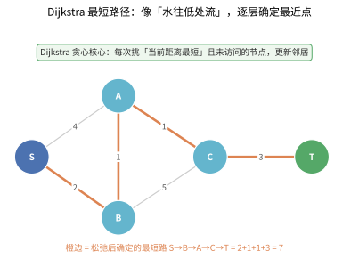

**为什么不能有负权边？** 一旦出现负权，那条"先到即最短"的直觉就会被打破——因为可能有一条"绕远路但带负权折扣"的路径，能反过来超越已经确定的节点。

下图展示了 Dijkstra 算法在带权有向图中寻找最短路径的完整过程：


```
Dijkstra 算法过程图示（求 A 到各点的最短路径）：

初始：                 第一步：选 A，更新 B(3), C(1)
   A(0)                     A(0)
  3/   \1                   3/   \1
  B(∞)  C(∞)               B(3)  C(1)
  2\   /4                   2\   /4
    D(∞)                     D(∞)

第二步：选 C，更新 D(1+4=5)   第三步：选 B，更新 D(3+2=5)
   A(0)                     A(0)
  3/   \1                   3/   \1
  B(3)  C(1)               B(3)  C(1)
  2\   /4                   2\   /4
    D(5)                     D(5)  ← 最短路径为 5

最终：A→B=3, A→C=1, A→D=5
```

**Python 实现**：

```python
import heapq
from collections import defaultdict

def dijkstra(graph: dict, n: int, start: int) -> list:
    """
    Dijkstra 算法求单源最短路径
    
    Args:
        graph: 邻接表，graph[u] = [(v, w), ...]
        n: 顶点个数
        start: 起点
    
    Returns:
        dist: 起点到各点的最短距离（不可达为 inf）
    """
    INF = float('inf')
    dist = [INF] * n
    dist[start] = 0
    
    # 优先队列：(距离, 顶点)
    pq = [(0, start)]
    visited = [False] * n
    
    while pq:
        d, u = heapq.heappop(pq)
        
        if visited[u]:
            continue
        visited[u] = True
        
        for v, w in graph[u]:
            if dist[u] + w < dist[v]:
                dist[v] = dist[u] + w
                heapq.heappush(pq, (dist[v], v))
    
    return dist


# 使用示例
# 构建上图所示的图
g = defaultdict(list)
g[0] = [(1, 3), (2, 1)]   # A(0) → B(1) 权重3, A → C(2) 权重1
g[1] = [(3, 2)]            # B → D(3) 权重2
g[2] = [(3, 4)]            # C → D 权重4
g[3] = []                  # D 无出边

dist = dijkstra(g, 4, 0)
print(f"最短距离: A→B={dist[1]}, A→C={dist[2]}, A→D={dist[3]}")
# 输出: 最短距离: A→B=3, A→C=1, A→D=5
```

### 5.2.2 Bellman-Ford 算法（支持负权边）

> 💡 **类比：Bellman-Ford 如同"多轮降价促销"**
>
> 想象一个商品从产地到消费者手中要经过多个中间商：
> - **第一轮**：每个中间商都根据当前进价重新定价
> - **第二轮**：中间商发现更便宜的进货渠道，再次降价
> - **第V-1轮**：价格稳定，不再变化
>
> 如果某轮之后还能降价，说明存在"负环"——某些中间商联合起来让价格越降越低，这在现实中是不可能的（就像无限循环套利）。
>
> Bellman-Ford 算法就是这样：每轮遍历所有边，尝试"松弛"（更新最短距离），V-1轮后必然收敛。如果还能继续松弛，说明存在负权环。

**核心思想**：对所有的边进行 V-1 轮松弛操作。每轮遍历所有边，尝试用 `dist[u] + w` 更新 `dist[v]`。

**适用于**：有负权边的图，可以检测负环

**时间复杂度**：$O(V \cdot E)$

```
Bellman-Ford 松弛过程（每轮遍历所有边进行松弛）：

第1轮：          第2轮：          第3轮：
  A(0)              A(0)             A(0)
  3/   \1           3/   \1          3/   \1
  B(3)  C(1)        B(3)  C(1)       B(3)  C(1)
  2\   /4           2\   /4          2\   /4
    D(5)              D(5)             D(5)

第3轮之后不再变化，V-1=3轮结束
```

**Python 实现**：

```python
def bellman_ford(edges: list, n: int, start: int) -> tuple:
    """
    Bellman-Ford 算法
    
    Args:
        edges: 边列表 [(u, v, w), ...]
        n: 顶点个数
        start: 起点
    
    Returns:
        (dist, has_negative_cycle)
    """
    INF = float('inf')
    dist = [INF] * n
    dist[start] = 0
    
    # 进行 V-1 轮松弛
    for i in range(n - 1):
        updated = False
        for u, v, w in edges:
            if dist[u] != INF and dist[u] + w < dist[v]:
                dist[v] = dist[u] + w
                updated = True
        if not updated:
            break  # 提前结束
        print(f"第 {i+1} 轮松弛完成: {dist}")
    
    # 检测负环：再做一轮，如果还能更新则有负环
    for u, v, w in edges:
        if dist[u] != INF and dist[u] + w < dist[v]:
            return dist, True  # 存在负环
    
    return dist, False


# 使用示例
edges = [
    (0, 1, 3),  # A→B 权重3
    (0, 2, 1),  # A→C 权重1
    (1, 3, 2),  # B→D 权重2
    (2, 3, 4),  # C→D 权重4
]

dist, has_neg_cycle = bellman_ford(edges, 4, 0)
print(f"最短距离: {dist}")          # [0, 3, 1, 5]
print(f"存在负环: {has_neg_cycle}")  # False
```

**检测负环示例**：

```python
# 包含负环的图
edges_with_neg_cycle = [
    (0, 1, 1),   # A→B 1
    (1, 2, -2),  # B→C -2
    (2, 0, -1),  # C→A -1  → 形成负环 1 + (-2) + (-1) = -2
]

dist, has_neg_cycle = bellman_ford(edges_with_neg_cycle, 3, 0)
print(f"存在负环: {has_neg_cycle}")  # True
```

### 5.2.3 Floyd-Warshall 算法（多源最短路径）

> 💡 **类比：Floyd-Warshall 如同"逐步开放中转站"**
>
> 想象一个全国铁路网，要计算任意两城之间的最短路线：
> - **初始状态**：只知道直达列车的票价
> - **第1轮**：开放北京作为中转站，更新所有经过北京更便宜的路线
> - **第2轮**：再开放上海作为中转站，更新所有经过上海或北京更便宜的路线
> - **第k轮**：开放第k个城市，逐步完善整个网络
>
> 经过n轮后，每个城市都当过中转站，最终得到所有城市对之间的最短路径。这就是"动态规划"的精髓——通过逐步引入中间点，从局部最优构建全局最优。

**核心思想**：动态规划。设 `dp[k][i][j]` 表示从 i 到 j 且中间顶点只经过 0..k 的最短路径长度。滚动数组优化为 `dist[i][j]`。

**状态转移方程**：
```
dist[i][j] = min(dist[i][j], dist[i][k] + dist[k][j])
```

**时间复杂度**：$O(V^3)$  
**空间复杂度**：$O(V^2)$

```
Floyd-Warshall 过程图示（3个顶点）：

初始矩阵 dist：
      A     B     C
A     0     3     1
B     3     0     2
C     1     2     0

经过 k=A(0) 后：
      A     B     C
A     0     3     1
B     3     0     2    ← B→C 不变 (3+1=4 > 2)
C     1     2     0

经过 k=B(1) 后：
      A     B     C
A     0     3     1    ← A→C 不变 (3+2=5 > 1)
B     3     0     2
C     1     2     0

经过 k=C(2) 后：
      A     B     C
A     0     3     1
B     3     0     2    ← B→A 不变 (2+1=3 == 3)
C     1     2     0
```

**Python 实现**：

```python
def floyd_warshall(graph: list, n: int) -> list:
    """
    Floyd-Warshall 多源最短路径算法
    
    Args:
        graph: n×n 邻接矩阵，graph[i][j] 为 i 到 j 的边权（INF 表示无边）
        n: 顶点个数
    
    Returns:
        dist: 最短路径距离矩阵
    """
    INF = float('inf')
    dist = [row[:] for row in graph]  # 复制
    
    for k in range(n):
        for i in range(n):
            if dist[i][k] == INF:
                continue
            for j in range(n):
                if dist[k][j] == INF:
                    continue
                if dist[i][k] + dist[k][j] < dist[i][j]:
                    dist[i][j] = dist[i][k] + dist[k][j]
        
        # 打印中间过程
        print(f"经过顶点 {k} 后:")
        for row in dist:
            print([x if x != INF else '∞' for x in row])
        print()
    
    return dist


# 使用示例
INF = float('inf')
graph = [
    [0,   3,   1,   INF],
    [3,   0,   INF, 2],
    [1,   INF, 0,   4],
    [INF, 2,   4,   0]
]

dist = floyd_warshall(graph, 4)
print("最终距离矩阵:")
for row in dist:
    print([x if x != INF else '∞' for x in row])
```

### 5.2.4 Johnson 全源最短路（含负权边）

> 💡 **类比：Johnson 如同"先给所有人发'公平补贴'再跑最短路"**
> Floyd-Warshall 能求全源最短路但只支持非负权（或要处理负环），Dijkstra 支持有向无环但要求无负权。Johnson 的妙招：因为负权边会破坏 Dijkstra 的"贪心正确性"，它先用 **Bellman-Ford 给每个点打一个"势能"（重新赋权）**，把负权边全部变成非负，然后对每个点跑一次 Dijkstra。
> 这就像想让教室里每个人都比较谁跑得快，但有人在起点占便宜（负权）。先让每个人都站到同一"公平线"上（重新赋权），再统一计时，就能公平比较了。

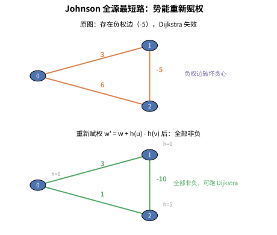

**核心思想**：
1. 加一个虚拟源点 $s'$，从它向所有点连边权为 0 的边，用 Bellman-Ford 求 $s'$ 到每个点的最短路 $h(u)$（同时检测负环）
2. 对每条边 $(u,v,w)$，重新赋权为 $w' = w + h(u) - h(v) \ge 0$（保证非负）
3. 对每个顶点跑一次 Dijkstra，得到所有点对最短路
4. 还原真实距离：$dist(u,v) = dist'(u,v) - h(u) + h(v)$

**复杂度**：$O(VE + V \cdot E \log V)$（Bellman-Ford 一次 $VE$ + $V$ 次 Dijkstra）。稀疏图下优于 Floyd 的 $O(V^3)$。

**Python 实现**：

```python
import heapq

def johnson(n, edges):
    """edges: (u, v, w)，返回全源最短路矩阵 dist，含负环时返回 None"""
    INF = float('inf')
    # 1. 虚拟源点重新赋权（Bellman-Ford）
    h = [0] * n
    for _ in range(n):
        updated = False
        for u, v, w in edges:
            if h[u] + w < h[v]:
                h[v] = h[u] + w
                updated = True
        if not updated:
            break
    else:
        return None  # 存在负环

    # 2. 重新赋权后对所有点跑 Dijkstra
    adj = [[] for _ in range(n)]
    for u, v, w in edges:
        adj[u].append((v, w + h[u] - h[v]))  # 非负权
    dist = [[INF] * n for _ in range(n)]
    for s in range(n):
        d = [INF] * n
        d[s] = 0
        pq = [(0, s)]
        while pq:
            du, u = heapq.heappop(pq)
            if du > d[u]: continue
            for v, w in adj[u]:
                if d[u] + w < d[v]:
                    d[v] = d[u] + w
                    heapq.heappush(pq, (d[v], v))
        # 3. 还原真实距离
        dist[s] = [d[v] - h[s] + h[v] if d[v] < INF else INF for v in range(n)]
    return dist
```

**应用场景**：含负权边的全源最短路（稀疏图）、差分约束系统的全源最短路、竞赛中"负权 + 多源查询"问题。

### 5.2.5 SPFA 算法（Shortest Path Faster Algorithm）

> 💡 **类比：SPFA 如同"消息传递游戏"**
>
> 想象一个班级里传递消息：
> - 老师告诉小明一个消息（起点）
> - 小明告诉他的朋友们，朋友们再告诉他们的朋友
> - 但只有当消息内容"更新"（变得更短/更好）时，才会继续传递
> - 如果某个人收到的消息不比已知的更好，就不再传递
>
> SPFA 就是这样：用队列维护"需要更新"的顶点，只有被更新的顶点才会触发后续更新。这比 Bellman-Ford 盲目遍历所有边要高效得多，平均时间复杂度达到 $O(E)$。

**核心思想**：Bellman-Ford 的队列优化。只有被更新过的顶点才可能引起其他顶点的更新，所以用队列维护待更新的顶点。

**适用于**：有负权边的图，可以检测负环

**时间复杂度**：平均 $O(E)$，最坏 $O(V \cdot E)$

```python
from collections import deque

def spfa(graph: dict, n: int, start: int) -> tuple:
    """
    SPFA 算法（队列优化的 Bellman-Ford）
    
    Returns:
        (dist, has_negative_cycle)
    """
    INF = float('inf')
    dist = [INF] * n
    dist[start] = 0
    
    in_queue = [False] * n
    count = [0] * n  # 记录入队次数，用于检测负环
    queue = deque([start])
    in_queue[start] = True
    
    while queue:
        u = queue.popleft()
        in_queue[u] = False
        
        for v, w in graph[u]:
            if dist[u] + w < dist[v]:
                dist[v] = dist[u] + w
                if not in_queue[v]:
                    queue.append(v)
                    in_queue[v] = True
                    count[v] += 1
                    if count[v] >= n:  # 入队次数 >= n，说明有负环
                        return dist, True
    
    return dist, False


# 使用示例
g = defaultdict(list)
g[0] = [(1, 3), (2, 1)]
g[1] = [(3, 2)]
g[2] = [(3, 4)]
g[3] = []

dist, has_neg = spfa(g, 4, 0)
print(f"SPFA 最短距离: {dist}")              # [0, 3, 1, 5]
print(f"存在负环: {has_neg}")                # False
```

**四种最短路径算法对比**：

| 算法 | 时间复杂度 | 适用场景 | 能否处理负权 | 能否检测负环 |
|------|-----------|---------|:-----------:|:-----------:|
| Dijkstra | $O((V+E)\log V)$ | 单源，非负权图 | ❌ | ❌ |
| Bellman-Ford | $O(VE)$ | 单源，任意图 | ✅ | ✅ |
| Floyd-Warshall | $O(V^3)$ | 多源（全源） | ✅ | ❌ |
| SPFA | 平均 $O(E)$ | 单源，任意图 | ✅ | ✅ |

---

## 5.3 最小生成树（Minimum Spanning Tree, MST）

**最小生成树**：在一个连通的无向带权图中，选择 |V|-1 条边，使得所有顶点连通且总权重最小。

### 5.3.1 Kruskal 算法

**核心思想**：贪心 + 并查集。将所有边按权重从小到大排序，依次加入，如果加入后不形成环就保留。

**时间复杂度**：O(E log E)

> 💡 **类比：用最省钱的方式给所有村庄通电**
> 想象有多个村庄，每两村之间修路的造价不同。你的目标是用**最短的总里程（最省钱）**把所有村庄连起来，且**不能有环**（有环就是浪费）。Kruskal 的做法很朴素：**先把所有"路"按造价从低到高摆好，然后从最便宜的开始，一条条尝试接上——只要不形成环就接**。这就像请电工先铺最省钱的线路，再用并查集（相当于查"这两个村是不是已经连通了"）防止通电后形成回路。下图展示了贪心选边的过程：

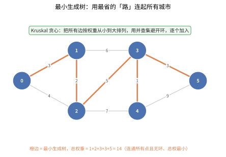

```
Kruskal 算法过程图示：

初始图：              边排序：(A-C,1), (A-B,3), (B-D,2), (C-D,4)
   A
  3/ \1               选 A-C(1)：         选 B-D(2)：
  B   C                 A                    A
  2\ /4               3/ \1                3/ \1
   D                   B   C                B   C
                      2\ /4                2\ /4
                        D                    D   ← 选了 B-D(2)

选 A-B(3)：           C-D(4) 会形成环，跳过
   A
  3/ \1               最终 MST 总权重 = 1+2+3 = 6
  B   C
  2\ /
   D
```

**Python 实现**：

```python
class DSU:
    """并查集（Disjoint Set Union / Union-Find）"""
    def __init__(self, n: int):
        self.parent = list(range(n))
        self.rank = [0] * n
    
    def find(self, x: int) -> int:
        """带路径压缩的查找"""
        if self.parent[x] != x:
            self.parent[x] = self.find(self.parent[x])
        return self.parent[x]
    
    def union(self, x: int, y: int) -> bool:
        """按秩合并，返回是否成功合并"""
        px, py = self.find(x), self.find(y)
        if px == py:
            return False
        if self.rank[px] < self.rank[py]:
            px, py = py, px
        self.parent[py] = px
        if self.rank[px] == self.rank[py]:
            self.rank[px] += 1
        return True


def kruskal(n: int, edges: list) -> list:
    """
    Kruskal 算法求最小生成树
    
    Args:
        n: 顶点个数
        edges: 边列表 [(u, v, w), ...]
    
    Returns:
        mst: 最小生成树的边列表
    """
    edges = sorted(edges, key=lambda x: x[2])  # 按权重排序
    dsu = DSU(n)
    mst = []
    total_weight = 0
    
    for u, v, w in edges:
        if dsu.union(u, v):
            mst.append((u, v, w))
            total_weight += w
            if len(mst) == n - 1:
                break
    
    print(f"MST 总权重: {total_weight}")
    return mst


# 使用示例
edges = [
    (0, 1, 3),  # A-B
    (0, 2, 1),  # A-C
    (1, 3, 2),  # B-D
    (2, 3, 4),  # C-D
]

mst = kruskal(4, edges)
print("MST 边:", [(chr(65+u), chr(65+v), w) for u, v, w in mst])
# 输出: MST 边: [('A', 'C', 1), ('B', 'D', 2), ('A', 'B', 3)]
```

### 5.3.2 Prim 算法

> 💡 **类比：Prim 如同"城市扩张"**
>
> 想象你要建设一个城市：
> - 从一个中心广场开始（起点）
> - 每次选择离已建成区域最近的空地来开发
> - 先建最近的住宅区，再建稍远的商业区，最后建最远的工业区
> - 每一步都选择"性价比最高"的连接
>
> Prim 算法就是这样：从一个顶点开始，维护一个"已访问集合"，每次选择连接已访问和未访问顶点的最小权重边。这像城市从中心向外扩张，每次选择最近的区域开发。
>
> **与 Kruskal 的区别**：Kruskal 是"全局选最便宜的边"，Prim 是"从已选区域选最近的边"。Kruskal 像买彩票（全局最优），Prim 像盖房子（局部最优）。

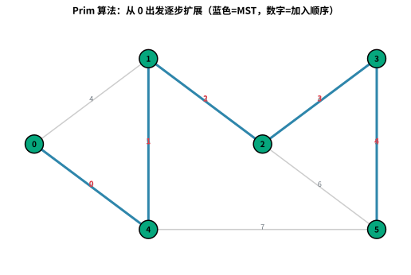

**核心思想**：从一个顶点开始，每次选择连接已选集合和未选集合的最小权重边，将对应的顶点加入集合。

**时间复杂度**：$O(E \log V)$（使用优先队列）

```
Prim 算法过程图示（从 A 开始）：

初始：已选 = {A}        选最小边 A-C(1)：      选最小边 A-B(3) 或 B-D(2)：
   A(已选)                 A(已选)                A(已选)
  3/ \1                   3/ \1                 3/ \1
  B   C                   B   C(已选)            B(已选) C(已选)
  2\ /4                   2\ /4                 2\ /4
   D                       D                     D

选 B-D(2)：
   A(已选)                最终总权重 = 1+3+2 = 6
  3/ \1
  B(已选) C(已选)
  2\ /4
   D(已选)
```

**Python 实现**：

```python
import heapq

def prim(graph: dict, n: int, start: int = 0) -> list:
    """
    Prim 算法求最小生成树
    
    Args:
        graph: 邻接表，graph[u] = [(v, w), ...]
        n: 顶点个数
        start: 起始顶点
    
    Returns:
        mst: 最小生成树的边列表
    """
    visited = [False] * n
    # 优先队列：(权重, 当前顶点, 父顶点)
    pq = [(0, start, -1)]
    mst = []
    total_weight = 0
    
    while pq:
        w, u, parent = heapq.heappop(pq)
        if visited[u]:
            continue
        visited[u] = True
        if parent != -1:
            mst.append((parent, u, w))
            total_weight += w
        
        for v, w2 in graph[u]:
            if not visited[v]:
                heapq.heappush(pq, (w2, v, u))
    
    print(f"MST 总权重: {total_weight}")
    return mst


# 使用示例
g = defaultdict(list)
g[0] = [(1, 3), (2, 1)]
g[1] = [(0, 3), (3, 2)]
g[2] = [(0, 1), (3, 4)]
g[3] = [(1, 2), (2, 4)]

mst = prim(g, 4, 0)
print("MST 边:", [(chr(65+u), chr(65+v), w) for u, v, w in mst])
```

### 5.3.3 Borůvka 算法

> 💡 **类比：Borůvka 如同"多支施工队同时修路"**
>
> 想象有多个施工队，每个队伍负责一片区域。每轮所有队伍**同时**出发，各自找到连接自己区域的最便宜的边，然后合并区域。下一轮，新的区域再各自找最便宜的边……几轮之后，所有区域就连成了一片。这就是 Borůvka 的**并行化**思想——每轮所有连通分量同时行动，而不是像 Kruskal 那样一条一条边慢慢挑。
>
> **与 Kruskal/Prim 的区别**：Kruskal 是"全局排序后逐条选"，Prim 是"从一个点逐步扩张"，Borůvka 是"所有连通分量同时扩张"。Borůvka 天然适合并行计算。

**核心思想**：

1. **初始化**：每个顶点自成一个连通分量
2. **每轮操作**：对每个连通分量，找到连接该分量与其他分量的**最小权重边**
3. **合并**：将所有找到的边加入 MST（用并查集合并分量）
4. **重复**：直到只剩一个连通分量（或无法再合并）

**时间复杂度**：$O(E \log V)$（每轮边数至少减半，最多 $\log V$ 轮）

**Python 实现**：

```python
def boruvka(n: int, edges: list) -> list:
    """
    Borůvka 算法求最小生成树
    
    Args:
        n: 顶点个数
        edges: 边列表 [(u, v, w), ...]
    
    Returns:
        mst: 最小生成树的边列表
    """
    dsu = DSU(n)
    mst = []
    total_weight = 0
    num_components = n
    
    while num_components > 1:
        # 每个连通分量的最小边
        cheapest = [-1] * n  # cheapest[component_root] = edge_index
        
        for i, (u, v, w) in enumerate(edges):
            pu, pv = dsu.find(u), dsu.find(v)
            if pu == pv:
                continue  # 同一分量，跳过
            
            # 更新 pu 分量的最小边
            if cheapest[pu] == -1 or edges[cheapest[pu]][2] > w:
                cheapest[pu] = i
            
            # 更新 pv 分量的最小边
            if cheapest[pv] == -1 or edges[cheapest[pv]][2] > w:
                cheapest[pv] = i
        
        # 合并所有找到的最小边
        added_any = False
        for i in range(n):
            if cheapest[i] != -1:
                u, v, w = edges[cheapest[i]]
                if dsu.union(u, v):
                    mst.append((u, v, w))
                    total_weight += w
                    num_components -= 1
                    added_any = True
        
        if not added_any:
            break  # 图不连通，无法继续
    
    print(f"MST 总权重: {total_weight}")
    return mst


# 使用示例
edges = [
    (0, 1, 3),  # A-B
    (0, 2, 1),  # A-C
    (1, 3, 2),  # B-D
    (2, 3, 4),  # C-D
]

mst = boruvka(4, edges)
print("Borůvka MST 边:", [(chr(65+u), chr(65+v), w) for u, v, w in mst])
```

**Borůvka 算法过程图示**：

```
初始：每个顶点自成一个分量
  [A]  [B]  [C]  [D]

第1轮：每个分量找最小边
  [A] 找 A-C(1)     [B] 找 B-D(2)
  [C] 找 A-C(1)     [D] 找 B-D(2)
  合并后：
  [A, C]  [B, D]

第2轮：每个分量找最小边
  [A,C] 找 A-B(3) 或 B-D(2) → B-D(2) 已内部
                实际找 A-B(3)
  [B,D] 找 A-B(3)
  合并后：
  [A, B, C, D]  ← 只剩一个分量，结束

MST = A-C(1) + B-D(2) + A-B(3) = 6
```

#### ③ 最小生成树算法对比

| 算法 | 核心策略 | 时间复杂度 | 空间复杂度 | 适用场景 |
|------|---------|:----------:|:----------:|---------|
| **Kruskal** | 贪心 + 并查集，按边权重从小到大选择 | $O(E \log E)$ | $O(V)$ | 稀疏图（边少） |
| **Prim** | 贪心 + 优先队列，从顶点扩展 | $O(E \log V)$ | $O(V)$ | 稠密图（边多） |
| **Borůvka** | 并行化，每轮所有分量同时选最小边 | $O(E \log V)$ | $O(V)$ | 并行计算、历史最古老 MST 算法 |

**选择建议**：稀疏图用 Kruskal（边排序成本低），稠密图用 Prim（顶点扩展更高效），需要并行化或理解 MST 理论时用 Borůvka。三者都要求图是连通的无向图。

---

## 5.4 其他图论算法

### 5.4.1 拓扑排序（Topological Sort）

**拓扑排序**：对有向无环图（DAG）的顶点进行线性排序，使得对于每条有向边 $u \to v$，u 都在 v 的前面。

> 💡 **类比：排课程表 / 安排穿衣顺序**
> 想象你必须先学"微积分"才能学"线性代数"，先学"程序设计"才能学"数据结构"。拓扑排序就是给出一个**不违反任何先修依赖**的学习顺序。再比如穿衣服：你要先穿内衣、再穿衬衫、最后穿外套——这个先后顺序就是拓扑序。下图用"课程依赖"展示了如何把 DAG 摊平成一条线性顺序：

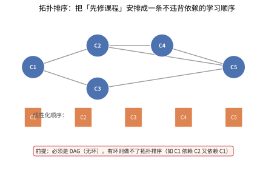

> ⚠️ **前提：必须是 DAG（有向无环图）**。如果依赖关系成环（如 A 依赖 B、B 又依赖 A），就永远排不出合法顺序——这对应题目里"课程表无法完成"的情况。

**Kahn 算法（BFS 实现）**：

```python
from collections import deque

def topological_sort_kahn(n: int, edges: list) -> list:
    """
    Kahn 算法求拓扑排序
    
    Args:
        n: 顶点个数
        edges: 有向边列表 [(u, v), ...]
    
    Returns:
        拓扑排序结果（若存在环，返回空列表）
    """
    # 计算入度
    in_degree = [0] * n
    graph = defaultdict(list)
    for u, v in edges:
        graph[u].append(v)
        in_degree[v] += 1
    
    # 入度为 0 的顶点入队
    queue = deque([i for i in range(n) if in_degree[i] == 0])
    result = []
    
    while queue:
        u = queue.popleft()
        result.append(u)
        for v in graph[u]:
            in_degree[v] -= 1
            if in_degree[v] == 0:
                queue.append(v)
    
    return result if len(result) == n else []


# 使用示例
# 场景：课程学习顺序
edges = [
    (0, 1),  # 0→1：必须先学 0 才能学 1
    (0, 2),
    (1, 3),
    (2, 3),
    (3, 4),
]
order = topological_sort_kahn(5, edges)
print("拓扑排序:", order)  # 例如: [0, 1, 2, 3, 4]
```

**拓扑排序图示**：

```
有向图：               Kahn 算法过程：
   0                   入度: [0, 1, 1, 2, 1]
  / \                  选 0（入度为 0）→ 更新 1,2 入度
 1   2                 入度: [-, 0, 0, 2, 1]
  \ /                  选 1（入度为 0）→ 更新 3 入度
   3                   入度: [-, -, 0, 1, 1]
   |                   选 2（入度为 0）→ 更新 3 入度
   4                   入度: [-, -, -, 0, 1]
                       选 3 → 选 4
                       结果: [0, 1, 2, 3, 4]
```

**DFS 实现拓扑排序**：

```python
def topological_sort_dfs(n: int, edges: list) -> list:
    """DFS 实现拓扑排序（后序遍历逆序）"""
    graph = defaultdict(list)
    for u, v in edges:
        graph[u].append(v)
    
    visited = [0] * n  # 0:未访问, 1:访问中, 2:已访问完
    result = []
    
    def dfs(u: int) -> bool:
        """返回 False 表示有环"""
        if visited[u] == 1:
            return False  # 检测到环
        if visited[u] == 2:
            return True
        
        visited[u] = 1
        for v in graph[u]:
            if not dfs(v):
                return False
        visited[u] = 2
        result.append(u)  # 后序加入
        return True
    
    for i in range(n):
        if visited[i] == 0:
            if not dfs(i):
                return []  # 有环
    
    return result[::-1]  # 逆序输出


order = topological_sort_dfs(5, edges)
print("DFS 拓扑排序:", order)
```

### 5.4.2 并查集（Union-Find / Disjoint Set Union, DSU）

> 💡 **类比：并查集如同"朋友圈合并"**
>
> 想象一个社交网络：
> - 初始时，每个人都是独立的"朋友圈"（各自为一个集合）
> - 当两个人成为朋友时，他们的朋友圈合并（union 操作）
> - 你想知道两个人是否在同一个朋友圈（find 操作）
>
> **路径压缩**：就像"找群主"时，直接把所有人都指向群主，下次找就快了
> **按秩合并**：就像小公司被大公司收购，小树挂到大树下，保持树平衡
>
> 并查集的核心是**高效管理动态分组**，时间复杂度接近 $O(1)$。

**核心思想**：高效地管理元素的分组，支持两种操作：
- **find(x)**：查找 x 所属的集合（根节点）
- **union(x, y)**：合并 x 和 y 所在的集合

**优化**：
- **路径压缩（Path Compression）**：find 时将路径上的所有节点直接指向根
- **按秩合并（Union by Rank）**：将较小的树合并到较大的树上

> 参考：Wikipedia 文章 3240821（并查集）

```python
class DSU:
    """并查集完整实现"""
    def __init__(self, n: int):
        self.parent = list(range(n))
        self.rank = [0] * n
        self.size = [1] * n  # 集合大小
        self.count = n       # 集合个数
    
    def find(self, x: int) -> int:
        """查找 + 路径压缩（递归写法）"""
        if self.parent[x] != x:
            self.parent[x] = self.find(self.parent[x])
        return self.parent[x]
    
    def find_iterative(self, x: int) -> int:
        """查找 + 路径压缩（迭代写法）"""
        root = x
        while self.parent[root] != root:
            root = self.parent[root]
        # 路径压缩
        while x != root:
            nxt = self.parent[x]
            self.parent[x] = root
            x = nxt
        return root
    
    def union(self, x: int, y: int) -> bool:
        """合并，返回是否进行了合并"""
        px, py = self.find(x), self.find(y)
        if px == py:
            return False
        
        # 按秩合并
        if self.rank[px] < self.rank[py]:
            px, py = py, px
        self.parent[py] = px
        if self.rank[px] == self.rank[py]:
            self.rank[px] += 1
        
        self.size[px] += self.size[py]
        self.count -= 1
        return True
    
    def connected(self, x: int, y: int) -> bool:
        """判断两个元素是否在同一集合"""
        return self.find(x) == self.find(y)
    
    def get_size(self, x: int) -> int:
        """获取 x 所在集合的大小"""
        return self.size[self.find(x)]


# 使用示例
dsu = DSU(5)
dsu.union(0, 1)
dsu.union(1, 2)
dsu.union(3, 4)
print(f"0 和 2 是否连通: {dsu.connected(0, 2)}")   # True
print(f"0 和 3 是否连通: {dsu.connected(0, 3)}")   # False
print(f"集合个数: {dsu.count}")                     # 2
print(f"0 所在集合大小: {dsu.get_size(0)}")         # 3
```

**并查集图示**：

```
初始: [0] [1] [2] [3] [4]

union(0,1): [0,1] [2] [3] [4]
  parent[1]=0

union(1,2): [0,1,2] [3] [4]
  find(1)=0, parent[2]=0

union(3,4): [0,1,2] [3,4]
  parent[4]=3

路径压缩：
  find(2) → parent[2]=0(parent[2]原本指向1，现在直接指向0)
```

### 5.4.3 二分图判定（Bipartite Graph Check）

> 💡 **类比：二分图如同"男女搭配干活不累"**
>
> 想象一个舞会，要把所有人分成两组：
> - 一组是男生，一组是女生
> - 每支舞都是男女搭配（边只连接不同组的顶点）
> - 如果出现两个男生或两个女生搭档，就不是二分图
>
> **判定方法**：像给舞伴分配颜色——男生染红色，女生染蓝色。如果某个人发现他的舞伴和他同色，说明分组失败。这就是BFS/DFS染色法的思想。

**二分图**：可以将顶点分成两个不相交的集合，使得所有边都连接两个不同集合中的顶点。

**判定方法**：BFS/DFS 染色法，相邻顶点染不同颜色，如果出现冲突则不是二分图。

```python
from collections import deque

def is_bipartite(graph: dict, n: int) -> bool:
    """
    二分图判定（染色法）
    
    Args:
        graph: 邻接表
        n: 顶点个数
    
    Returns:
        是否为二分图
    """
    color = [-1] * n  # -1:未染色, 0:红色, 1:蓝色
    
    for start in range(n):
        if color[start] != -1:
            continue
        
        # BFS 染色
        color[start] = 0
        queue = deque([start])
        
        while queue:
            u = queue.popleft()
            for v in graph[u]:
                if color[v] == -1:
                    color[v] = 1 - color[u]  # 染相反颜色
                    queue.append(v)
                elif color[v] == color[u]:
                    return False  # 冲突，不是二分图
    
    return True


# 使用示例
# 二分图示例
graph1 = {
    0: [1, 3],
    1: [0, 2],
    2: [1, 3],
    3: [0, 2],
}
print(f"graph1 是二分图: {is_bipartite(graph1, 4)}")  # True

# 非二分图（三角形）
graph2 = {
    0: [1, 2],
    1: [0, 2],
    2: [0, 1],
}
print(f"graph2 是二分图: {is_bipartite(graph2, 3)}")  # False
```

**二分图染色图示**：

```
二分图（可二染色）：         非二分图（三角形，无法二染色）：
  0(红)──1(蓝)               0(红)──1(蓝)
   │      │                    │  ╲  │
   │      │                    │   ╲ │
  3(蓝)──2(红)               2(?)──1(蓝)
                             冲突！2 既要是红也要是蓝
```

### 5.4.4 强连通分量（Strongly Connected Components, SCC）

> 💡 **类比：强连通分量如同"朋友圈"**
>
> 想象一个社交网络：
> - 如果A认识B，B也认识A，他们就在同一个"朋友圈"里
> - 朋友圈内部的人可以互相联系（有路径可达）
> - 但朋友圈之间可能是单向的（A的朋友圈能联系到B的朋友圈，但反过来不行）
>
> 强连通分量就是有向图中的"朋友圈"——分量内任意两点可以互相到达。Kosaraju算法的思想是：先在原图上"顺藤摸瓜"找到访问顺序，再在反图上"逆流而上"找出朋友圈。

**强连通分量**：在有向图中，如果两个顶点可以互相到达，则它们属于同一个强连通分量。

#### Kosaraju 算法

**步骤**：
1. 对原图进行 DFS，记录完成顺序（后序）
2. 对反图进行 DFS，按完成顺序的逆序访问

```python
def kosaraju(n: int, edges: list) -> list:
    """
    Kosaraju 算法求强连通分量
    
    Args:
        n: 顶点个数
        edges: 有向边列表 [(u, v), ...]
    
    Returns:
        scc_list: 每个强连通分量包含的顶点列表
    """
    graph = defaultdict(list)
    rev_graph = defaultdict(list)
    for u, v in edges:
        graph[u].append(v)
        rev_graph[v].append(u)
    
    # 第一遍 DFS：确定完成顺序
    visited = [False] * n
    order = []
    
    def dfs1(u: int):
        visited[u] = True
        for v in graph[u]:
            if not visited[v]:
                dfs1(v)
        order.append(u)  # 后序加入
    
    for i in range(n):
        if not visited[i]:
            dfs1(i)
    
    # 第二遍 DFS：在反图上按逆序找 SCC
    visited = [False] * n
    scc_list = []
    
    def dfs2(u: int, component: list):
        visited[u] = True
        component.append(u)
        for v in rev_graph[u]:
            if not visited[v]:
                dfs2(v, component)
    
    for u in reversed(order):
        if not visited[u]:
            component = []
            dfs2(u, component)
            scc_list.append(component)
    
    return scc_list


# 使用示例
edges = [
    (0, 1), (1, 2), (2, 0),  # 0→1→2→0 形成一个环（一个 SCC）
    (2, 3), (3, 4),          # 3→4
    (4, 3),                  # 3←→4 另一个 SCC
    (4, 5),                  # 5 单独
]

sccs = kosaraju(6, edges)
print("强连通分量:", sccs)
# 输出: [[0, 2, 1], [3, 4], [5]]
```

#### Tarjan 算法

**核心思想**：在一次 DFS 中利用时间戳和 low 值找出所有 SCC。

```python
def tarjan(n: int, edges: list) -> list:
    """Tarjan 算法求强连通分量"""
    graph = defaultdict(list)
    for u, v in edges:
        graph[u].append(v)
    
    dfn = [-1] * n       # 时间戳（访问顺序）
    low = [0] * n        # 能追溯到的最早时间戳
    on_stack = [False] * n
    stack = []
    timestamp = [0]
    scc_list = []
    
    def dfs(u: int):
        dfn[u] = low[u] = timestamp[0]
        timestamp[0] += 1
        stack.append(u)
        on_stack[u] = True
        
        for v in graph[u]:
            if dfn[v] == -1:
                dfs(v)
                low[u] = min(low[u], low[v])
            elif on_stack[v]:
                low[u] = min(low[u], dfn[v])
        
        # 如果 u 是 SCC 的根
        if dfn[u] == low[u]:
            component = []
            while True:
                w = stack.pop()
                on_stack[w] = False
                component.append(w)
                if w == u:
                    break
            scc_list.append(component)
    
    for i in range(n):
        if dfn[i] == -1:
            dfs(i)
    
    return scc_list


sccs_tarjan = tarjan(6, edges)
print("Tarjan 强连通分量:", sccs_tarjan)
```

**强连通分量图示**：

```
有向图：               SCC 划分：
   0 ←── 1               ┌─────┐
   ↓     ↑               │ 0→1 │  ← SCC1 (0,1,2)
   2 ────┘               │ ↓↑  │
   ↓                     └──┴──┘
   3 ──→ 4               ┌─────┐
   ↑     ↓               │ 3←→4│  ← SCC2 (3,4)
   └─────┘               └─────┘
   ↓
   5                     [5] ← SCC3
```

---

### 5.4.5 2-SAT 问题

> 💡 **类比：2-SAT 如同"安排婚礼座位"**
>
> 想象你要安排一场婚礼的座位，有一些约束条件："如果 A 坐左边，B 必须坐右边""C 和 D 不能都坐左边"……每个变量只有两种选择（左/右、真/假），每个约束只涉及两个变量。**2-SAT** 就是判断是否存在一种安排，满足所有约束。
>
> 关键洞察：每个约束"A 真则 B 假"可以转化为**有向边**：A 真 → B 假，以及它的**逆否命题**：B 真 → A 真。这样就把逻辑问题变成了图论问题——用强连通分量（SCC）求解。

**问题定义**：

给定 $n$ 个布尔变量 $x_1, x_2, \dots, x_n$ 和 $m$ 个子句，每个子句形如 $(x_i \lor x_j)$、$(x_i \lor \neg x_j)$、$(\neg x_i \lor \neg x_j)$ 等（两个文字的析取）。问是否存在一组赋值使得所有子句为真。

**建图方法**：

对每个变量 $x_i$，创建两个节点：
- 节点 $2i$：表示 $x_i$ 为真
- 节点 $2i+1$：表示 $x_i$ 为假

对每个子句 $(a \lor b)$，转化为两条有向边（蕴含关系）：
- $\neg a \to b$（如果 a 假则 b 必须真）
- $\neg b \to a$（如果 b 假则 a 必须真）

**求解算法**：

1. **建图**：按上述方法构建蕴含图
2. **求 SCC**：用 Tarjan 或 Kosaraju 算法求强连通分量
3. **判定可行性**：如果某个变量 $x_i$ 的"真"节点和"假"节点在同一个 SCC 中，则**无解**（矛盾）；否则**有解**
4. **构造方案**：按 SCC 拓扑序的逆序，对每个变量，选择 SCC 编号较小的那个赋值（真或假）

**Python 实现**：

```python
def two_sat(n: int, clauses: list) -> tuple:
    """
    2-SAT 问题求解
    
    Args:
        n: 变量个数（变量编号 0 到 n-1）
        clauses: 子句列表，每个子句为 (i, j, sign_i, sign_j)
                 表示 (x_i^sign_i ∨ x_j^sign_j)
                 sign=True 表示正文字（x），sign=False 表示负文字（¬x）
    
    Returns:
        (satisfiable, assignment)
        satisfiable: 是否可满足
        assignment: 赋值列表，assignment[i] = True/False 表示 x_i 的值
    """
    # 建图：2i 表示 x_i 为真，2i+1 表示 x_i 为假
    graph = defaultdict(list)
    
    def add_implication(u, v):
        """添加蕴含关系 u → v"""
        graph[u].append(v)
    
    for i, j, sign_i, sign_j in clauses:
        # 子句 (x_i^sign_i ∨ x_j^sign_j)
        # 等价于 ¬(x_i^sign_i) → (x_j^sign_j) 和 ¬(x_j^sign_j) → (x_i^sign_i)
        
        # ¬(x_i^sign_i) 对应的节点
        not_i = 2 * i + (0 if sign_i else 1)
        # (x_j^sign_j) 对应的节点
        val_j = 2 * j + (1 if sign_j else 0)
        
        # ¬(x_j^sign_j) 对应的节点
        not_j = 2 * j + (0 if sign_j else 1)
        # (x_i^sign_i) 对应的节点
        val_i = 2 * i + (1 if sign_i else 0)
        
        add_implication(not_i, val_j)
        add_implication(not_j, val_i)
    
    # 求 SCC（使用 Tarjan 算法）
    dfn = [-1] * (2 * n)
    low = [0] * (2 * n)
    on_stack = [False] * (2 * n)
    stack = []
    timestamp = [0]
    scc_id = [-1] * (2 * n)
    scc_count = [0]
    
    def tarjan(u: int):
        dfn[u] = low[u] = timestamp[0]
        timestamp[0] += 1
        stack.append(u)
        on_stack[u] = True
        
        for v in graph[u]:
            if dfn[v] == -1:
                tarjan(v)
                low[u] = min(low[u], low[v])
            elif on_stack[v]:
                low[u] = min(low[u], dfn[v])
        
        if dfn[u] == low[u]:
            while True:
                w = stack.pop()
                on_stack[w] = False
                scc_id[w] = scc_count[0]
                if w == u:
                    break
            scc_count[0] += 1
    
    for i in range(2 * n):
        if dfn[i] == -1:
            tarjan(i)
    
    # 判定可行性
    for i in range(n):
        if scc_id[2 * i] == scc_id[2 * i + 1]:
            return False, []  # 无解
    
    # 构造方案：按 SCC 拓扑序逆序赋值
    assignment = [False] * n
    for i in range(n):
        # 选择 SCC 编号较小的（拓扑序更靠后的）
        if scc_id[2 * i] < scc_id[2 * i + 1]:
            assignment[i] = True  # x_i 为真
        else:
            assignment[i] = False  # x_i 为假
    
    return True, assignment


# 使用示例
# 变量 x0, x1, x2
# 子句：(x0 ∨ x1), (¬x1 ∨ x2), (¬x0 ∨ ¬x2)
clauses = [
    (0, 1, True, True),     # x0 ∨ x1
    (1, 2, False, True),    # ¬x1 ∨ x2
    (0, 2, False, False),   # ¬x0 ∨ ¬x2
]

sat, assignment = two_sat(3, clauses)
print(f"是否可满足: {sat}")
print(f"赋值: {assignment}")  # 例如 [False, True, True]
```

**复杂度**：
- 建图：$O(n + m)$
- 求 SCC：$O(n + m)$
- 总时间复杂度：$O(n + m)$
- 空间复杂度：$O(n + m)$

**应用场景**：
- 逻辑可满足性问题
- 任务调度（带依赖和冲突约束）
- 电路设计（布尔电路可满足性）
- 图着色问题的特殊情况

---

### 5.4.6 网络流（Network Flow）

**网络流**：在一个带权有向图中，每条边有一个容量上限，求从源点（Source）到汇点（Sink）的最大可行流量。

#### 基本概念

- **容量（Capacity）**：每条边能承载的最大流量
- **流量（Flow）**：实际流经边的流量，不能超过容量
- **源点（Source, s）**：流的起点，净流出量为正
- **汇点（Sink, t）**：流的终点，净流入量为正
- **可行流（Feasible Flow）**：满足容量限制和流量守恒的流
- **最大流（Max Flow）**：从源点到汇点的最大可行流量
- **增广路（Augmenting Path）**：从源点到汇点的一条路径，沿途边仍有剩余容量
- **残量网络（Residual Network）**：原图每条边剩余容量构成的可继续增广的网络
- **最小割（Min Cut）**：将顶点集分为包含源点和汇点的两个部分，割的容量为跨越两个部分的边容量之和

#### 核心定理

**最大流最小割定理**：在任何网络中，最大流的值等于最小割的容量。这是网络流理论中最核心的定理。

#### 常见算法

| 算法 | 时间复杂度 | 核心思想 |
|------|:----------:|---------|
| **Ford-Fulkerson** | $O(E \cdot f)$ | 不断寻找增广路，直到无法增广 |
| **Edmonds-Karp** | $O(V \cdot E^2)$ | 用 BFS 寻找最短增广路 |
| **Dinic** | $O(V^2 \cdot E)$ | 分层图 + 多路增广 |
| **ISAP** | $O(V^2 \cdot E)$ | 动态维护距离标号 |

> 参考：[网络流 - Wikipedia 文章 4138470]

#### Dinic 算法详解

> 💡 **类比：Dinic 如同"物流分拣的批量化"** 想象一个物流中心要往各站点发货。朴素的 Ford-Fulkerson 每次只找一条路发一趟车，效率低。Dinic 的妙招是：先用 BFS 给所有节点标上"距离层级"（如同一栋楼的楼层号），然后**只允许从低层流向高层**，这样一次 DFS 就能在多条路上同时推进（多路增广），一趟"扫楼"能发完当前全部能发的货。发不动了再重新 BFS 分层，循环往复直到源点到不了汇点。

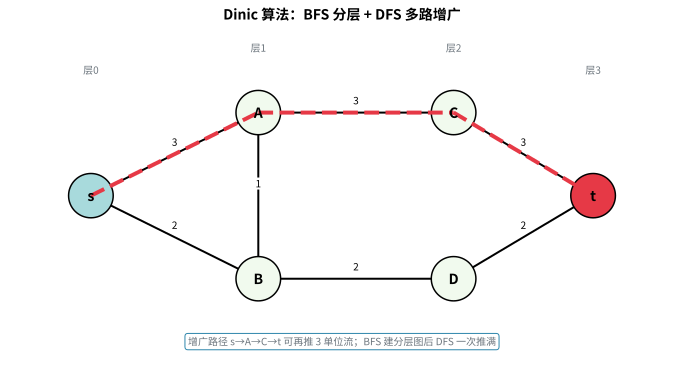

**Dinic 算法**是最大流最常用的实现，核心思想是**分层图 + 多路增广**：

1. **BFS 建立分层图**：从源点出发，给每个节点标号 `level[u]`（到源点的最短边数），只保留 `level[v] == level[u]+1` 的边（即"只走下一层"）。
2. **DFS 多路增广**：在分层图上用 DFS 尽量多地寻找增广路，一次 DFS 可以推进多条路径的流量。
3. **当前弧优化**：记录每个节点已尝试推进到哪条边，避免重复扫描。
4. **重复**：当前分层图无法再增广时，重新 BFS 分层，直到源点无法到达汇点。

**复杂度**：一般图 $O(V^2 E)$，二分图上 Dinic 可退化为 $O(E\sqrt V)$。

**Python 实现**：

```python
from collections import deque

def max_flow(n, s, t, edges):
    """邻接表存边，edges 为 (u, v, cap)；返回最大流"""
    graph = [[] for _ in range(n)]
    for u, v, cap in edges:
        graph[u].append([v, cap, len(graph[v])])
        graph[v].append([u, 0, len(graph[u]) - 1])  # 反向边

    def bfs():
        level = [-1] * n
        level[s] = 0
        q = deque([s])
        while q:
            u = q.popleft()
            for v, cap, _ in graph[u]:
                if cap > 0 and level[v] < 0:
                    level[v] = level[u] + 1
                    q.append(v)
        return level

    def dfs(u, pushed, level, it):
        if u == t:
            return pushed
        while it[u] < len(graph[u]):
            v, cap, rev = graph[u][it[u]]
            if level[v] == level[u] + 1 and cap > 0:
                tr = dfs(v, min(pushed, cap), level, it)
                if tr > 0:
                    graph[u][it[u]][1] -= tr
                    graph[v][rev][1] += tr
                    return tr
            it[u] += 1
        return 0

    flow = 0
    while True:
        level = bfs()
        if level[t] < 0:
            break
        it = [0] * n
        while True:
            pushed = dfs(s, float('inf'), level, it)
            if pushed == 0:
                break
            flow += pushed
    return flow
```

**应用场景**：求最大流、最小割、二分图最大匹配（转化为网络流）、最大流最小割建模的各类资源分配问题。

#### 最小费用最大流（Minimum Cost Maximum Flow, MCMF）

> 💡 **类比：MCMF 如同"物流公司既要运得多又要省钱"**
>
> 想象一个物流公司，要把货物从仓库运到门店。每条路线不仅有**容量限制**（最多能过多少车），还有**运输费用**（每辆车过路费不同）。MCMF 的目标是：在保证**运量最大**的前提下，让**总运输费用最小**。
>
> **与最大流的区别**：最大流只关心"最多能运多少"，MCMF 还要关心"怎么运最省钱"。

**核心思想**：

在残量网络中，用 **SPFA（或 Bellman-Ford）** 找从源点到汇点的**费用最小增广路**，然后沿该路径增广流量。重复此过程直到无法增广。

**算法步骤**：
1. 初始化流量为 0
2. 用 SPFA 找从源点 $s$ 到汇点 $t$ 的**最小费用增广路**（考虑正向边费用和反向边负费用）
3. 沿该路径增广（流量增加，更新残量网络）
4. 重复 2-3 直到无法找到增广路

**Python 实现**：

```python
from collections import deque

def mcmf(n: int, s: int, t: int, edges: list) -> tuple:
    """
    最小费用最大流（SPFA 找增广路）
    
    Args:
        n: 顶点个数
        s: 源点
        t: 汇点
        edges: 边列表 [(u, v, cap, cost), ...]
               u→v 容量 cap，单位费用 cost
    
    Returns:
        (max_flow, min_cost)
    """
    # 建图：邻接表存边
    graph = [[] for _ in range(n)]
    for u, v, cap, cost in edges:
        # 正向边：[目标, 容量, 费用, 反向边索引]
        graph[u].append([v, cap, cost, len(graph[v])])
        # 反向边：[目标, 0, -费用, 正向边索引]
        graph[v].append([u, 0, -cost, len(graph[u]) - 1])
    
    max_flow = 0
    min_cost = 0
    
    while True:
        # SPFA 找最小费用增广路
        INF = float('inf')
        dist = [INF] * n
        dist[s] = 0
        in_queue = [False] * n
        parent_edge = [None] * n  # 记录路径：(父节点, 边索引)
        
        queue = deque([s])
        in_queue[s] = True
        
        while queue:
            u = queue.popleft()
            in_queue[u] = False
            
            for i, (v, cap, cost, _) in enumerate(graph[u]):
                if cap > 0 and dist[u] + cost < dist[v]:
                    dist[v] = dist[u] + cost
                    parent_edge[v] = (u, i)
                    if not in_queue[v]:
                        queue.append(v)
                        in_queue[v] = True
        
        # 无法增广，结束
        if dist[t] == INF:
            break
        
        # 找增广路上的最小容量
        push = INF
        v = t
        while v != s:
            u, edge_idx = parent_edge[v]
            push = min(push, graph[u][edge_idx][1])
            v = u
        
        # 沿路径增广
        v = t
        while v != s:
            u, edge_idx = parent_edge[v]
            graph[u][edge_idx][1] -= push  # 正向边容量减少
            rev_idx = graph[u][edge_idx][3]
            graph[v][rev_idx][1] += push   # 反向边容量增加
            v = u
        
        max_flow += push
        min_cost += push * dist[t]
    
    return max_flow, min_cost


# 使用示例
# 源点 0，汇点 3
# 边：u→v 容量 cap，单位费用 cost
edges = [
    (0, 1, 2, 1),   # 0→1 容量2，费用1
    (0, 2, 1, 3),   # 0→2 容量1，费用3
    (1, 2, 1, 1),   # 1→2 容量1，费用1
    (1, 3, 2, 2),   # 1→3 容量2，费用2
    (2, 3, 2, 1),   # 2→3 容量2，费用1
]

flow, cost = mcmf(4, 0, 3, edges)
print(f"最大流: {flow}, 最小费用: {cost}")  # 3, 8
```

**MCMF 过程图示**：

```
初始图（边标注：容量/费用）：
  0 ──2/1──→ 1 ──2/2──→ 3
  │          │          ↑
  1/3        1/1        2/1
  ↓          ↓          │
  2 ────────────────────┘

第1次增广：0→1→3，费用 1+2=3，流量 2
  残量：0→1 剩0，1→3 剩0
  累计：flow=2, cost=6

第2次增广：0→2→3，费用 3+1=4，流量 1
  残量：0→2 剩0，2→3 剩1
  累计：flow=3, cost=10

无法增广，结束。max_flow=3, min_cost=10
```

**复杂度**：
- 时间复杂度：$O(V \cdot E \cdot f)$，其中 $f$ 为最大流量（每次 SPFA $O(VE)$，最多增广 $f$ 次）
- 空间复杂度：$O(V + E)$

**应用场景**：
- 物流调度（运量最大且费用最小）
- 任务分配（每人做一项任务，总代价最小）
- 二分图最大权匹配（转化为 MCMF）
- 网络设计（在满足流量需求下最小化成本）

---

#### 有上下界的网络流（Network Flow with Lower Bounds）

> 💡 **类比：上下界网络流如同"有最低开工量的运输线"**
> 普通网络流只限制每条边**最多**能运多少（容量上界）。而上下界网络流额外规定每条边**至少**要运多少（容量下界）——就像某些运输线有最低货运量合同，运少了不行。做法是：先强制满足所有下界，再通过"附加源点 $S'$、附加汇点 $T'$"的补流技巧，把问题转化为普通最大流/费用流求解。

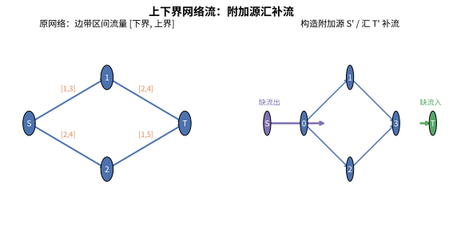

**核心概念**：
- **下界 $l(u,v)$**：边 $(u,v)$ 必须流经的最小流量
- **上界 $c(u,v)$**：边 $(u,v)$ 允许的最大流量（即普通容量）
- **可行流存在性**：是否存在满足所有下界和流量守恒的流
- **无源汇（无源无汇）上下界可行流**、**有源汇上下界最大流 / 最小流**

**无源汇上下界可行流判定**（经典做法）：
1. 初始让每条边流量等于下界 $l$，此时节点可能不满足流量守恒（净流入不等于净流出）
2. 若节点 $u$ 的流入下界总和大于流出下界总和（需要多流出），则从附加源 $S'$ 连边到 $u$，容量为差值
3. 反之（需要多流入），则从 $u$ 连边到附加汇 $T'$，容量为差值
4. 在附加网络上求 $S' \to T'$ 的最大流，若所有附加边都被流满，则原网络存在可行流

**Python 实现框架**：

```python
def feasible_flow_upper(n, lower, upper, s, t):
    """
    判定有源汇上下界网络流可行性（洛谷 P4043 等的核心思路）
    lower: (u, v, low)，upper: (u, v, cap)
    返回是否存在可行流
    """
    # 1. 构图：先按 upper-lower 建普通网络，额外记录节点净需求
    net = [{} for _ in range(n + 2)]        # 附加源汇
    need = [0] * (n + 2)                    # 每个节点的流量差额
    S, T = n, n + 1                         # 附加源点、附加汇点
    for u, v, low, cap in lower:            # 按 (u,v,low,cap) 输入
        need[u] -= low                      # u 少了流出下界
        need[v] += low                      # v 多了流入下界
        # 在原图中建边：容量 = cap - low
        net[u][v] = net.get(u)              # 简化示意，实际用邻接表 + 反向边
    # 2. 处理差额：need>0 的节点连到 S，need<0 的节点连到 T
    total = 0
    for u, d in enumerate(need):
        if d > 0:
            net[S][u] = d                   # 附加源连到"需要多流出"的节点
            total += d
        elif d < 0:
            net[u][T] = -d                  # "需要多流入"的节点连到附加汇
    # 3. 求 S->T 的最大流（复用上面的 max_flow）
    flow = max_flow(n + 2, S, T, net_edges_from(net))
    return flow == total
```

**复杂度**：转化为普通网络流后，与 Dinic/费用流相同（$O(V^2 E)$）。

**应用场景**：疫苗运输（各省份有最低供应量）、带最低派单量的任务分配、带约束的供应链优化。

---

#### 全局最小割（Stoer-Wagner 算法）

> 💡 **类比：Stoer-Wagner 如同"找联系最薄弱的一组人"**
> 全局最小割问题是"把图分成两部分，使割断的边总权最小"。朴素的枚举所有源汇需要 $O(n)$ 次最大流，太慢。**Stoer-Wagner** 用一个巧妙技巧：每次把"联系最紧密"的点合并（收缩），逐步把 $n$ 个点缩成 $1$ 个，过程中记录每次合并产生的割，取最小即为全局最小割。

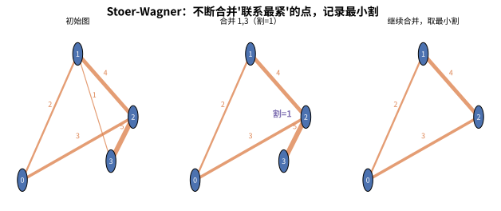

**核心思想**：通过不断"合并最紧连的点对"，把求全局最小割变成了 $n-1$ 次"最大割一张点集"的贪心合并，每次合并记录的割值取最小。

**Python 实现**：

```python
def stoer_wagner(n, w):
    """w[u][v] 为边权（无向图对称矩阵），返回全局最小割"""
    best = float('inf')
    # 合并用数组，points[i] 表示当前"超级点"包含的原始点集
    merged = [[i] for i in range(n)]
    for _ in range(n - 1):
        # 1. 用类似 Prim 的贪心，每次加入"连到当前集合最紧"的点
        add = [0] * n                       # 到当前集合的累计权重
        visited = [False] * n
        prev = -1
        for i in range(n - 1):
            # 找到未访问且到集合权重最大的点
            sel = max((add[j], j) for j in range(n) if not visited[j])[1]
            visited[sel] = True
            if i == n - 2:
                # 最后加入的点 sel 与 prev 之间的割 = add[sel]
                best = min(best, add[sel])
                # 2. 合并 sel 到 prev
                for k in merged[sel]:
                    merged[prev].append(k)
                for j in range(n):
                    w[prev][j] += w[sel][j] if j != sel else 0
                    w[j][prev] = w[prev][j]
                break
            prev = sel
            for j in range(n):
                if not visited[j]:
                    add[j] += w[sel][j]
    return best
```

**复杂度**：$O(V^3)$（朴素）或 $O(VE + V^2 \log V)$（堆优化）。

**应用场景**：网络中最脆弱的一组链路（最小割）、社交网络最薄弱连接、图分割问题。

---

#### 平面图最小割

> 💡 **类比：平面图最小割如同"地图上最短的'一堵墙'"**
> 在平面图上（可以画在平面上边不相交的图），最小割有一个独特性质：**平面图的最小割等于其对偶图的最短路**。想象地图上划分区域的分界线，把每个"可通行的区域"当作节点、"跨越边界"当作边，那么"切开地图的最短墙"恰好对应对偶图上的一条最短路。这一性质把网络流问题转化为最短路问题，复杂度大幅下降。

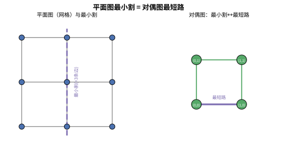

**核心思想**：给定 $s$、$t$ 在平面图的外边界上，构造对偶图 $G^*$，则 $s$-$t$ 最小割等于 $G^*$ 上两个边界点之间的最短路。

**复杂度**：对偶图最短路 $O(E \log V)$（Dijkstra），远快于直接求最大流。

**应用场景**：平面网格图的最小割（如图像分割、网格电路切断）、竞赛中网格图上的最小割最优化问题。

---

### 5.4.6 LCA（最近公共祖先）与树上倍增

> 💡 **类比：LCA 如同"找两个亲戚最近的共同长辈"** 想象两个人在家族谱系里，要找出他们最近的共同祖先。最笨的办法是让两个人各自一级一级往上找，但效率太低。**树上倍增**就像给每个人配了一本"跳级手册"——上面写着"向上跳 1 步、2 步、4 步……分别会到谁"。要找共同祖先时，先把较深的人跳到和另一个人**同一深度**（像让两人站到同一层台阶），然后两人再一起"跳大跨步"（一次跳 4 步、2 步、1 步），第一次相遇的那个屋檐就是 LCA。跳的步数是指数增长（1、2、4、8…），所以总步数是 O(log n)。

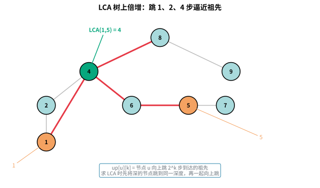

**LCA（Lowest Common Ancestor）**：树上两个节点 $u$ 和 $v$ 的最近公共祖先，是距离它们都最近的共同祖先节点。

**树上倍增的核心思想**：预处理 `up[u][k]` 表示节点 $u$ 向上跳 $2^k$ 步到达的祖先节点（$k = 0, 1, \dots, \lfloor \log_2 n \rfloor$）。递推关系为：

$$up[u][0] = \text{parent}[u], \quad up[u][k] = up[\,up[u][k-1]\,][k-1]$$

即"跳 $2^k$ 步" = "先跳 $2^{k-1}$ 步，再跳 $2^{k-1}$ 步"。

**查询 LCA(u, v) 的步骤**：

1. **把深的节点提到同一深度**：若 $depth[u] < depth[v]$，将 $v$ 向上提升 $depth[v] - depth[u]$ 层，用倍增表高效完成。
2. **一起向上跳找 LCA**：从大到小枚举 $k$，若 $up[u][k] \neq up[v][k]$，则 $u \leftarrow up[u][k]$，$v \leftarrow up[v][k]$。
3. **返回父节点**：最后 $u$ 和 $v$ 的父节点 $up[u][0]$ 即为 LCA。

**复杂度**：预处理 $O(n \log n)$，单次查询 $O(\log n)$。

**Python 实现**：

```python
def build_lca(parent):
    """parent[u] 为 u 的父节点，根节点的父节点设为自己"""
    n = len(parent)
    LOG = (n).bit_length()
    up = [[0] * LOG for _ in range(n)]
    for u in range(n):
        up[u][0] = parent[u]
    for k in range(1, LOG):
        for u in range(n):
            up[u][k] = up[up[u][k-1]][k-1]
    return up, LOG

def lca(u, v, depth, up, LOG):
    if depth[u] < depth[v]:
        u, v = v, u                      # 保证 u 更深
        diff = depth[u] - depth[v]
        for k in range(LOG):             # 把 u 提到与 v 同深度
            if diff >> k & 1:
                u = up[u][k]
    if u == v:
        return u
    for k in range(LOG - 1, -1, -1):     # 一起向上跳
        if up[u][k] != up[v][k]:
            u, v = up[u][k], up[v][k]
    return up[u][0]
```

**应用场景**：树上距离、路径上的边权/点权和、树上差分、树形 DP 的公共祖先计算。

---

### 5.4.7 二分图最大匹配（匈牙利算法）

> 💡 **类比：匈牙利算法如同"相亲配对 + 让位协商"** 想象一个相亲会，左边是男生、右边是女生，连线表示互相有意愿。目标是让尽可能多的人成功牵手。贪心地先给按顺序安排，但遇到"想配的人已经被别人占了"怎么办？匈牙利算法不是直接放弃，而是说：**"让我问问占着的那个，你愿不愿意换一个？"**（找增广路径）。如果能腾出位置，就重新洗牌，让匹配数 +1；腾不出来才放弃。每成功"让位协商"一次，成功配对就多一对，直到再也协商不动，就得到最大匹配。

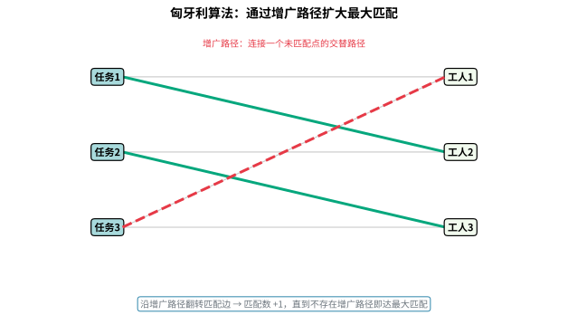

**二分图匹配**：在二分图（顶点可分左、右两部分，边只连接左右）中，选择一组互不相交的边，使匹配边数最大。

**增广路径（Augmenting Path）**：一条从一个**未匹配的左边节点**出发，经过交替的"未匹配边-已匹配边-未匹配边…"，结束于**未匹配的右边节点**的路径。沿该路径翻转匹配状态，可使匹配数 +1。

**匈牙利算法核心**：反复寻找增广路径，直到不存在增广路径，此时匹配即为最大匹配。

**Python 实现**（邻接表 + DFS 增广）：

```python
def hungarian(adj, n_left, n_right):
    """adj[u] 为左边节点 u 可匹配的右边节点列表（0-indexed）
    返回每个左边节点匹配到的右边节点（-1 表示未匹配）"""
    match_right = [-1] * n_right

    def dfs(u, visited):
        for v in adj[u]:
            if not visited[v]:
                visited[v] = True
                # v 未匹配，或能通过 v 当前的匹配者让位
                if match_right[v] == -1 or dfs(match_right[v], visited):
                    match_right[v] = u
                    return True
        return False

    result = [-1] * n_left
    for u in range(n_left):
        visited = [False] * n_right
        if dfs(u, visited):
            result[u] = match_right[u]  # 占位，实际记录匹配
    return result
```

**复杂度**：朴素匈牙利 $O(V \cdot E)$；Hopcroft-Karp 优化可到 $O(E\sqrt{V})$。

**应用场景**：任务分配、课程安排、棋盘放置、最小点覆盖与最大独立集（König 定理）。

---

### 5.4.8 割点与桥（Tarjan）

> 💡 **类比：割点/桥如同"网络中的关键设备"**
>
> 想象一个通信网络，各基站由线路相连。**割点**就像某个故障就足以让整个网络分裂成多块的基站；**桥**就像某条一旦断裂就让网络失联的线路。找到这些"致命弱点"，才能有针对性地加固网络。

**核心思想**：在无向图的 DFS 树中，用 **dfn**（访问时间戳）和 **low**（能追溯到的祖先最早时间戳）两个数组判断关键节点/边。

- **dfn[u]**：顶点 u 被 DFS 访问的顺序（时间戳）
- **low[u]**：顶点 u 及其子树中的顶点，通过非父边能到达的最早 dfn

判定规则（对根节点需特判）：

- **割点**：非根节点 $u$，若存在子节点 $v$ 满足 $\text{low}[v] \ge \text{dfn}[u]$，则 $u$ 是割点；根节点若有 $\ge 2$ 个子树则是割点
- **桥**：边 $(u, v)$（$v$ 为 $u$ 的子节点），若满足 $\text{low}[v] > \text{dfn}[u]$，则该边是桥

**Python 实现**：

```python
def tarjan_cut(n: int, edges: list):
    """
    求无向图的割点和桥
    edges: 无向边列表 [(u, v), ...]
    返回 (cut_points, cut_edges)
    """
    graph = defaultdict(list)
    for u, v in edges:
        graph[u].append(v)
        graph[v].append(u)

    dfn = [-1] * n
    low = [0] * n
    timestamp = [0]
    cut_points = set()
    cut_edges = []

    def dfs(u: int, parent: int = -1):
        dfn[u] = low[u] = timestamp[0]
        timestamp[0] += 1
        child_count = 0

        for v in graph[u]:
            if v == parent:
                continue  # 跳过父边
            if dfn[v] == -1:
                dfs(v, u)
                child_count += 1
                low[u] = min(low[u], low[v])
                # 判定桥：子节点无法绕回祖先
                if low[v] > dfn[u]:
                    cut_edges.append((u, v))
                # 判定割点（非根）：至少一个子节点满足条件
                if parent != -1 and low[v] >= dfn[u]:
                    cut_points.add(u)
            else:
                # 回边（已经是祖先），更新 low
                low[u] = min(low[u], dfn[v])

        # 根节点：有 >= 2 个子树才是割点
        if parent == -1 and child_count >= 2:
            cut_points.add(u)

    for i in range(n):
        if dfn[i] == -1:
            dfs(i)

    return cut_points, cut_edges


# 使用示例
edges = [
    (0, 1), (1, 2), (2, 0),  # 三角形
    (2, 3), (3, 4), (4, 2),  # 与 2 相连的环
    (3, 5),                   # 桥
]
cut_points, cut_edges = tarjan_cut(6, edges)
print("割点:", cut_points)     # {2, 3}
print("桥:", cut_edges)        # [(3, 5)]
```

**复杂度**：时间 $O(V + E)$，空间 $O(V)$——只需一次 DFS。

**适用场景**：网络故障分析、识别关键节点/线路、图中找"必须经过"的顶点或边。

---

### 5.4.9 欧拉路径与欧拉回路

> 💡 **类比：一笔画问题**
>
> 想象"一笔画出图形，不抬笔不重复"。欧拉路径就是图论里的一笔画：存在一条路径经过每条边恰好一次。如果起点和终点相同（能回到起点），就叫欧拉回路。

**核心思想 / 判定条件**：

- **欧拉回路**（能回到起点）：无向图**所有顶点度数为偶**；有向图**所有顶点入度 = 出度**
- **欧拉路径**（不要求回起点）：无向图**恰有两个奇度顶点**（分别为起点、终点）；有向图**恰有一个顶点出度比入度大 1（起点）、一个入度比出度大 1（终点）**，其余入度 = 出度

**Hierholzer 算法**：从起点出发 DFS 沿边走边删除，当无路可走时把顶点压入栈，最后逆序出栈即为欧拉路径。它能保证把每条边恰好用一次。

**Python 实现**（无向图，求欧拉路径/回路）：

```python
def euler_path(n: int, edges: list):
    """
    求无向图的欧拉路径（Hierholzer 算法）
    返回路径顶点序列；若不存在欧拉路径返回 []
    """
    graph = defaultdict(list)
    for u, v in edges:
        graph[u].append(v)
        graph[v].append(u)

    # 统计度数，找到起点：奇度顶点（若有则必须是起点）
    degree = [0] * n
    for u, v in edges:
        degree[u] += 1
        degree[v] += 1
    odd = [i for i in range(n) if degree[i] % 2 == 1]

    if len(odd) not in (0, 2):
        return []            # 奇度顶点数既不是 0 也不是 2，无欧拉路径
    start = odd[0] if odd else 0

    # 复制邻接表并排序（保证字典序，可选）
    g = {u: sorted(list(v)) for u, v in graph.items()}
    stack = [start]
    path = []

    while stack:
        u = stack[-1]
        if g[u]:
            v = g[u].pop()
            g[v].remove(u)   # 无向图删除反向边
            stack.append(v)
        else:
            path.append(stack.pop())  # 无路可走，记录

    # 判断边是否全部用完
    if any(g[u] for u in g):
        return []            # 图不连通或有孤立边
    return path


# 使用示例
edges = [(0, 1), (1, 2), (2, 0), (0, 3), (3, 2)]
path = euler_path(4, edges)
print("欧拉路径:", path)     # 例如 [0, 1, 2, 3, 0, 2]
```

**复杂度**：时间 $O(V + E)$，空间 $O(V + E)$。

**适用场景**：一笔画问题、邮递员路线规划、电路板布线、单词首尾相接（Word Ladder）类问题。

---

### 5.4.10 树的直径与重心

> 💡 **类比：树的直径与重心**
>
> **树的直径**是最远两片叶子之间的距离（最长路径）；**重心**则是树的"平衡点"——以它为根时，最大子树的大小在所有顶点中最小。直径描述了树的"跨度"，重心描述了树的"平衡"。

**核心思想**：

- **直径**：任选一点出发做 DFS/BFS 找到最远点 A，再从 A 出发做 DFS/BFS 找到最远点 B，A 到 B 的距离即为直径。两次遍历即可。
- **重心**：任选根做一次 DFS，用 `size[u]` 记录子树大小。对每个顶点，其"最大子树大小"为 max(各子节点子树大小, n - size[u])，取该值最小的顶点即重心。

**Python 实现**：

```python
def tree_diameter(adj: dict, n: int):
    """求树的直径长度和两端点（两次 DFS/BFS）"""
    def bfs(start: int):
        dist = [-1] * n
        dist[start] = 0
        q = deque([start])
        while q:
            u = q.popleft()
            for v in adj[u]:
                if dist[v] == -1:
                    dist[v] = dist[u] + 1
                    q.append(v)
        far = max(range(n), key=lambda i: dist[i])
        return far, dist

    a, _ = bfs(0)
    b, dist = bfs(a)
    return dist[b], (a, b)   # 直径长度, 两端点


def tree_centroid(adj: dict, n: int):
    """求树的重心（可能 1~2 个）"""
    size = [0] * n
    parent = [-1] * n

    def dfs(u: int):
        size[u] = 1
        for v in adj[u]:
            if v != parent[u]:
                parent[v] = u
                dfs(v)
                size[u] += size[v]

    dfs(0)
    centroids = []
    best = n
    for u in range(n):
        # 最大子树大小 = max(各子树大小, 父方向大小)
        max_part = n - size[u]
        for v in adj[u]:
            if v != parent[u]:
                max_part = max(max_part, size[v])
        if max_part < best:
            best = max_part
            centroids = [u]
        elif max_part == best:
            centroids.append(u)
    return centroids


# 使用示例
adj = defaultdict(list)
for u, v in [(0, 1), (1, 2), (1, 3), (3, 4)]:
    adj[u].append(v)
    adj[v].append(u)

length, ends = tree_diameter(adj, 5)
print("直径长度:", length, "端点:", ends)      # 3 (0, 4)
print("重心:", tree_centroid(adj, 5))          # [1]
```

**复杂度**：直径两次遍历 $O(V)$；重心一次 DFS $O(V)$。

**适用场景**：求树上最远两点的距离、网络延迟分析、以重心为根优化树形 DP、最小化到各点距离之和。

---

### 5.4.11 差分约束系统

> 💡 **类比：一系列"至少/至多"约束求范围**
>
> 想象一个项目估算工期，有各种约束："任务 A 至少比任务 B 早 3 天""任务 C 最晚比任务 D 晚 2 天"……这些都是**不等式约束**。差分约束系统就是把这些不等式转化为图上的最短路问题，从而求出某个变量的取值范围。

**核心思想**：把不等式 $x_u - x_v \le w$ 转化为一条**有向边 $v \to u$，权值为 $w$**。这样：
- 对每个约束建边后，用 **SPFA / Bellman-Ford** 求单源最短路；
- 若存在**负环**，则约束无解（互相矛盾）；
- 否则 $x_u$ 的最短距离 $dist[u]$ 即为一组满足约束的解，某变量范围可通过最短路/最长路求得。

**Python 实现**（SPFA 判断负环求解差分约束）：

```python
def diff_constraints(n: int, constraints: list):
    """
    求解差分约束系统：x_u - x_v <= w，即 constraints = [(u, v, w), ...]
    返回 (可行解列表, 是否可行)；不可行（存在负环）返回 ([], False)
    """
    graph = defaultdict(list)
    for v, u, w in constraints:
        graph[v].append((u, w))        # 边 v -> u，权 w

    # 超级源点，向所有点连权 0 的边，保证图可达
    for i in range(n):
        graph[n].append((i, 0))

    INF = float('inf')
    dist = [INF] * (n + 1)
    dist[n] = 0
    in_queue = [False] * (n + 1)
    cnt = [0] * (n + 1)
    q = deque([n])
    in_queue[n] = True

    while q:
        u = q.popleft()
        in_queue[u] = False
        for v, w in graph[u]:
            if dist[u] + w < dist[v]:
                dist[v] = dist[u] + w
                if not in_queue[v]:
                    q.append(v)
                    in_queue[v] = True
                    cnt[v] += 1
                    if cnt[v] >= n + 1:   # 入队次数过多，存在负环
                        return [], False

    return dist[:n], True   # 去掉超级源点，dist[i] 即 x_i 的一个可行取值


# 使用示例
# 约束：x1 - x0 <= 3, x2 - x1 <= 2, x0 - x2 <= -5
constraints = [(1, 0, 3), (2, 1, 2), (0, 2, -5)]
sol, ok = diff_constraints(3, constraints)
print("是否可行:", ok)      # True
print("可行解:", sol)       # 例如 [0, 3, 5]

# 矛盾约束示例：x1 - x0 <= 1, x0 - x1 <= -3  =>  x1-x0<=1 且 x0-x1<=-3 即 x1>=x0+3
constraints2 = [(1, 0, 1), (0, 1, -3)]
sol2, ok2 = diff_constraints(2, constraints2)
print("是否可行:", ok2)     # False（存在负环）
```

**复杂度**：SPFA 平均 $O(E)$，最坏 $O(V \cdot E)$。

**适用场景**：形如"至少/至多相差多少"的约束求解、工期安排、区间选点、不等式组可行性判定。

---

### 5.4.12 树链剖分（Heavy-Light Decomposition, HLD）

> 💡 **类比：把树按重儿子切分成若干条链**
>
> 想象要把一棵树上的路径查询做快，直接沿树根一步一步走太慢。树链剖分的妙招是：**把每个节点连向"子树最大的那个儿子（重儿子）"，从而把树切分成若干条"重链"**。这样任意一条树上路径都能拆成 $O(\log n)$ 条连续链，再用线段树在每条链上快速查询/修改。

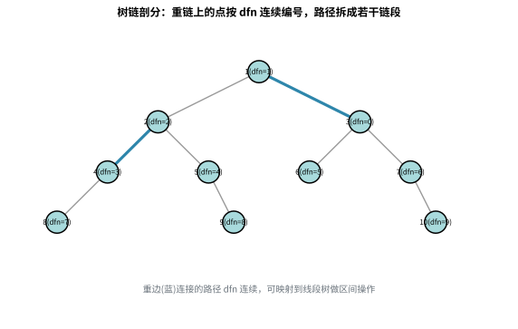

**核心思想**：

- **重儿子**：一个节点子树大小最大的那个子节点；连向重儿子的边叫**重边**，其余叫轻边
- **dfn 序**：DFS 时优先走重儿子，给每个节点分配连续编号，使**一条重链上的节点编号连续**，便于线段树维护
- **top**：每条重链链顶节点
- **路径查询**：$u$ 到 $v$ 的路径，反复把更深节点所在的链整体处理（跳 top），拆成若干条 dfn 连续区间，交给线段树

**Python 实现**（简化版：重儿子划分 + 路径上最大值查询）：

```python
class HLD:
    """树链剖分（简化版）：支持路径上最大值查询"""
    def __init__(self, adj: dict, n: int, root: int = 0):
        self.n = n
        self.adj = adj
        self.size = [0] * n          # 子树大小
        self.depth = [0] * n         # 深度
        self.parent = [-1] * n
        self.heavy = [-1] * n        # 重儿子
        self.dfn = [0] * n           # 剖分后的编号
        self.top = [0] * n           # 链顶
        self.values = [0] * n        # 按 dfn 顺序存的节点值
        self._order = [0]

        self._dfs1(root)             # 计算 size/heavy/depth/parent
        self._dfs2(root, root)       # 分配 dfn 和 top

    def _dfs1(self, u: int):
        self.size[u] = 1
        max_sub = 0
        for v in self.adj[u]:
            if v != self.parent[u]:
                self.parent[v] = u
                self.depth[v] = self.depth[u] + 1
                self._dfs1(v)
                self.size[u] += self.size[v]
                if self.size[v] > max_sub:
                    max_sub = self.size[v]
                    self.heavy[u] = v

    def _dfs2(self, u: int, top_node: int):
        self.dfn[u] = self._order[0]
        self._order[0] += 1
        self.top[u] = top_node
        if self.heavy[u] != -1:
            self._dfs2(self.heavy[u], top_node)   # 重儿子延续当前链
            for v in self.adj[u]:
                if v != self.parent[u] and v != self.heavy[u]:
                    self._dfs2(v, v)              # 轻儿子另起新链

    def query_path_max(self, u: int, v: int, seg) -> int:
        """路径 u->v 上的最大值（seg 为按 dfn 线段树，支持区间 max 查询）"""
        res = -float('inf')
        while self.top[u] != self.top[v]:
            if self.depth[self.top[u]] < self.depth[self.top[v]]:
                u, v = v, u
            res = max(res, seg.query(self.dfn[self.top[u]], self.dfn[u]))
            u = self.parent[self.top[u]]
        if self.depth[u] > self.depth[v]:
            u, v = v, u
        res = max(res, seg.query(self.dfn[u], self.dfn[v]))
        return res


# 使用示例：线段树（区间 max）
class SegTree:
    def __init__(self, arr):
        self.n = len(arr)
        self.tree = [0] * (4 * self.n)
        self._build(1, 0, self.n - 1, arr)
    def _build(self, node, l, r, arr):
        if l == r:
            self.tree[node] = arr[l]; return
        m = (l + r) // 2
        self._build(node*2, l, m, arr)
        self._build(node*2+1, m+1, r, arr)
        self.tree[node] = max(self.tree[node*2], self.tree[node*2+1])
    def query(self, ql, qr, node=1, l=0, r=None):
        if r is None: r = self.n - 1
        if ql > r or qr < l: return -float('inf')
        if ql <= l and r <= qr: return self.tree[node]
        m = (l + r) // 2
        return max(self.query(ql, qr, node*2, l, m),
                   self.query(ql, qr, node*2+1, m+1, r))


# 建树并剖分
adj = defaultdict(list)
for u, v in [(0,1),(0,2),(1,3),(1,4)]:
    adj[u].append(v); adj[v].append(u)
hld = HLD(adj, 5, 0)
node_val = [5, 3, 8, 1, 6]          # 每个节点的值
arr = [node_val[i] for i in range(5)]  # 简化：按原编号对应 dfn 需重排，此处演示接口
# 实际应按 dfn 顺序放入线段树：seg_arr[dfn[u]] = node_val[u]
seg_arr = [0] * 5
for u in range(5):
    seg_arr[hld.dfn[u]] = node_val[u]
seg = SegTree(seg_arr)
print("路径 3->2 最大值:", hld.query_path_max(3, 2, seg))  # max(1,3,5,8)=8
```

**复杂度**：剖分预处理 $O(V)$；单次路径查询 $O(\log^2 V)$（拆成 $O(\log V)$ 段，每段线段树查询 $O(\log V)$）。

**适用场景**：树上路径最大/最小/和查询、路径修改、子树操作（子树 dfn 连续）、配合线段树/树状数组做树上区间问题。

---

### 5.4.13 虚树（Virtual Tree）

> 💡 **类比：虚树如同"只保留关键站点的地铁线路图"**
>
> 想象一棵有上万个节点的大树，但每次查询只涉及其中几十个"关键点"（比如某些特殊节点）。如果每次都遍历整棵树，效率极低。**虚树**的做法是：只保留这些关键点和它们的 LCA（最近公共祖先），把无关紧要的中间节点"压缩"掉，构建一棵只包含关键点的小树。就像地铁线路图只画重要站点，省略中间的小站——信息不丢，但规模大幅缩小。

**核心思想**：

给定一棵大树和一组关键点（称为"终端点"），虚树是一棵仅包含关键点和它们两两之间 LCA 的压缩树。虚树中保留原树的祖先-后代关系，边权为原树上对应路径的压缩信息（如距离、最小值等）。

**构建方法**：

1. **排序**：将所有关键点按 DFS 序（dfn）排序
2. **建栈**：用栈维护虚树的右链（从根到当前节点的路径）
3. **LCA 辅助**：依次插入每个关键点，插入前先求出它与栈顶的 LCA，将不在路径上的节点弹出并连边
4. **收尾**：最后把栈中剩余节点依次弹出连边

**Python 实现**：

```python
def build_virtual_tree(key_nodes: list, up, depth, LOG, adj, n):
    """
    构建虚树
    
    Args:
        key_nodes: 关键点列表
        up: 倍增表（见 LCA 部分）
        depth: 深度数组
        LOG: 倍增层数
        adj: 原树邻接表
        n: 节点数
    
    Returns:
        virtual_adj: 虚树邻接表（存原树节点编号）
    """
    # 按 DFS 序排序（这里简化为按节点编号，实际需要 dfn 序）
    key_nodes = sorted(set(key_nodes))
    
    if len(key_nodes) <= 1:
        return {u: [] for u in key_nodes}
    
    # 辅助函数：求 LCA
    def get_lca(u, v):
        return lca(u, v, depth, up, LOG)
    
    stack = []          # 维护虚树右链
    virtual_adj = defaultdict(list)
    
    def add_edge(u, v):
        """在虚树中添加边（u 是 v 的祖先）"""
        virtual_adj[u].append(v)
        virtual_adj[v].append(u)
    
    for node in key_nodes:
        if not stack:
            stack.append(node)
            continue
        
        l = get_lca(node, stack[-1])
        
        if l != stack[-1]:
            # 弹出栈顶并连边，直到栈顶是 l 的祖先或等于 l
            while len(stack) >= 2 and depth[stack[-2]] >= depth[l]:
                add_edge(stack[-2], stack[-1])
                stack.pop()
            
            if stack[-1] != l:
                # 把 l 加入虚树
                add_edge(l, stack[-1])
                stack[-1] = l
            
        stack.append(node)
    
    # 收尾：弹出剩余节点
    while len(stack) >= 2:
        add_edge(stack[-2], stack[-1])
        stack.pop()
    
    return virtual_adj


# 使用示例
# 假设已有树结构和 LCA 预处理
# key_nodes = [3, 5, 7, 9]  # 关键点
# vtree = build_virtual_tree(key_nodes, up, depth, LOG, adj, n)
```

**复杂度**：
- 构建虚树：$O(k \log k)$，其中 $k$ 为关键点数量（排序 + LCA 查询）
- 虚树节点数：最多 $2k - 1$（$k$ 个关键点 + 最多 $k-1$ 个 LCA）

**应用场景**：
- **树上多关键点查询**：如求关键点两两之间的距离之和、路径上的最小值等
- **优化树形 DP**：只在与关键点相关的节点上做 DP，避免遍历整棵树
- **SDOI2011 消耗战**等经典题目

---

### 5.4.14 树分治（点分治 / 边分治）

> 💡 **类比：点分治如同"选村长分片管理"**
>
> 想象一个大村庄要统计所有居民对之间的某种信息（如距离之和）。如果两两计算，复杂度 $O(n^2)$，太慢。**点分治**的做法是：选一个"中心人物"（树的重心），把问题按经过该中心的路径和不经过该中心的路径分开处理。经过中心的路径可以高效统计；不经过的则递归到各子树中继续分治。每次选重心保证子树大小减半，因此递归深度 $O(\log n)$。

**点分治核心思想**：

1. **选重心**：找到当前子树的重心作为分治中心
2. **统计经过重心的路径**：收集从重心出发到各子节点方向的距离/信息，用排序/双指针/桶等方法统计合法路径
3. **减去同一子树内的"非法"贡献**：从重心出发的两条路径如果来自同一子树，它们的拼接路径并不经过重心，需要减掉
4. **递归**：对重心的每棵子树递归执行

**Python 实现**（经典应用：统计树上距离 $\le k$ 的路径数）：

```python
def point_divide_conquer(adj: dict, n: int, k: int) -> int:
    """
    点分治：统计树上距离 <= k 的路径数
    
    Args:
        adj: 邻接表（无向树）
        n: 节点数
        k: 距离上限
    
    Returns:
        满足条件的路径数
    """
    removed = [False] * n
    size = [0] * n
    max_sub = [0] * n
    ans = 0
    
    def get_centroid(u, fa, total):
        """求子树重心"""
        size[u] = 1
        max_sub[u] = 0
        for v, _ in adj[u]:
            if v != fa and not removed[v]:
                get_centroid(v, u, total)
                size[u] += size[v]
                max_sub[u] = max(max_sub[u], size[v])
        max_sub[u] = max(max_sub[u], total - size[u])
    
    def get_dists(u, fa, dist, dists):
        """收集从当前根出发到各点的距离"""
        dists.append(dist)
        for v, _ in adj[u]:
            if v != fa and not removed[v]:
                get_dists(v, u, dist + 1, dists)
    
    import bisect
    
    def count_pairs(dists, limit):
        """双指针/二分统计 dists 中 dist[i]+dist[j] <= limit 的对数"""
        dists.sort()
        cnt = 0
        lo, hi = 0, len(dists) - 1
        while lo < hi:
            if dists[lo] + dists[hi] <= limit:
                cnt += hi - lo
                lo += 1
            else:
                hi -= 1
        return cnt
    
    def solve(u):
        nonlocal ans
        # 找重心
        get_centroid(u, -1, size[u] if size[u] else 1)
        centroid = u
        best = max_sub[u]
        # 简化：此处省略精确找重心的 BFS，直接用 max_sub 最小的
        
        # 统计经过 centroid 的路径
        all_dists = [0]  # centroid 本身距离为 0
        for v, _ in adj[centroid]:
            if not removed[v]:
                dists = []
                get_dists(v, centroid, 1, dists)
                # 减去同一子树的非法贡献
                ans -= count_pairs(dists, k)
                all_dists.extend(dists)
        # 加上所有方向的合法贡献
        ans += count_pairs(all_dists, k)
        
        # 递归处理子树
        removed[centroid] = True
        for v, _ in adj[centroid]:
            if not removed[v]:
                solve(v)
    
    solve(0)
    return ans


# 使用示例
adj = defaultdict(list)
for u, v in [(0,1),(0,2),(1,3),(1,4),(2,5)]:
    adj[u].append((v, 1))
    adj[v].append((u, 1))

# 统计距离 <= 2 的路径数
# print(point_divide_conquer(adj, 6, 2))
```

**边分治**：与点分治类似，但每次选一条"中心边"将树分成两半。为避免退化（如菊花图），通常先对树做"二叉化"重构（将度数 > 2 的节点拆成二叉树结构），保证递归深度 $O(\log n)$。边分治在统计"经过某条边"的路径信息时更为自然。

**复杂度**：
- 点分治：$O(n \log^2 n)$（每层排序 $O(n \log n)$，共 $O(\log n)$ 层）或 $O(n \log n)$（使用桶排序）
- 边分治：重构后 $O(n \log n)$

**经典应用**：
- 统计树上距离为 $k$ / $\le k$ 的路径数
- 统计树上路径权值和/异或和满足条件的路径数
- 树上路径第 $k$ 小（配合数据结构）

---

### 5.4.15 图论重要定理

> 💡 **类比：定理如同"图论世界的物理定律"**
>
> 就像物理学中 $F=ma$ 能解决一大类力学问题，图论中的定理也能将看似复杂的问题瞬间化简。掌握这些定理，相当于拥有了"秒杀"一类题目的武器。

#### ① 霍尔定理（Hall's Theorem）

**陈述**：在二分图 $G = (X \cup Y, E)$ 中，存在一个**覆盖 $X$ 中所有顶点**的匹配（即 $X$ 中每个点都能匹配到 $Y$ 中不同的点），当且仅当对 $X$ 的任意子集 $S \subseteq X$，其邻居集合 $N(S)$ 满足：

$$|N(S)| \ge |S|$$

> 💡 **直观解释**：不管你怎么选 $X$ 中的一部分人，他们"认识"的 $Y$ 中的人数总不少于他们自己的人数——这样才够每人分配一个不同的对象。

**应用**：
- 判定二分图是否存在完美匹配（覆盖某一侧的匹配）
- 组合数学中证明"相异代表系"的存在性
- 任务分配问题：$n$ 个工人能否各分配一项不同的工作

#### ② 柯尼希定理（König's Theorem）

**陈述**：在**二分图**中，**最大匹配数** = **最小顶点覆盖数**。

- **顶点覆盖**：选最少的顶点，使得每条边至少有一个端点被选中
- **最大匹配**：选出最多的互不相交的边

> 💡 **直观解释**：在二分图中，"最多能配多少对"和"最少要选多少人才能覆盖所有关系"是同一件事的两个面。

**应用**：
- 二分图中将最大匹配问题转化为最小顶点覆盖问题
- 配合**最小割**建模（最大匹配 = 最小割 = 最小顶点覆盖）
- 与**最大独立集**的关系：最大独立集 = $V$ - 最小顶点覆盖

#### ③ Dilworth 定理

**陈述**：在任意**有限偏序集**中，**最小链覆盖数** = **最大反链大小**。

- **链**：偏序集中两两可比较的元素子集（全序子集）
- **反链**：偏序集中两两不可比较的元素子集
- **链覆盖**：将所有元素划分成若干条链

> 💡 **直观解释**：把一堆有偏序关系的元素分成尽量少的"有序队列"，分成的队列数恰好等于最大的"互不可比"元素个数。

**应用**：
- **导弹拦截问题**（经典 OJ 题）：用最少的不下降子序列覆盖整个序列 = 最长下降子序列的长度
- 将序列问题转化为偏序集上的 Dilworth 定理应用
- 配合传递闭包和二分图匹配求解

#### ④ 矩阵树定理（Kirchhoff's Theorem / Matrix Tree Theorem）

**陈述**：设 $G$ 是一个 $n$ 个顶点的无向图，$D$ 为度数对角矩阵，$A$ 为邻接矩阵，定义 **Laplacian 矩阵** $L = D - A$。则：

- $G$ 的**生成树个数** = $L$ 的任意一个**余子式**（删去第 $i$ 行第 $i$ 列后的行列式值）

对于有向图，类似地可以用出度/入度 Laplacian 矩阵的余子式求**以某点为根的外向/内向树个数**。

> 💡 **直观解释**：用一个矩阵的行列式就能算出图有多少棵生成树——把组合计数问题变成了线性代数问题。

**应用**：
- 计算图的生成树个数（精确值，非枚举）
- 计算有向图的根向/叶向树个数
- 结合模运算处理大数（行列式取模）
- **复杂度**：$O(n^3)$（高斯消元求行列式）

#### ⑤ BEST 定理

**陈述**：在有向欧拉图（每个顶点入度 = 出度，且图弱连通）中，**欧拉回路的数目**为：

$$ec(G) = t_w(G) \cdot \prod_{v \in V} (\deg^+(v) - 1)!$$

其中 $t_w(G)$ 是以任意顶点 $w$ 为根的**内向树个数**（由矩阵树定理求得），$\deg^+(v)$ 是顶点 $v$ 的出度。

> 💡 **直观解释**：欧拉回路数 = 内向树数 × 每个顶点出度阶乘之积。把"一笔画"的计数问题分解为树计数 + 局部排列。

**应用**：
- 计算有向图中欧拉回路的精确数目
- 配合矩阵树定理使用
-  De Bruijn 序列计数

#### ⑥ 四色定理与五色定理

**四色定理**：任何**平面图**都可以用**至多 4 种颜色**着色，使得相邻区域颜色不同。

> 💡 **直观解释**：给地图染色，不管多复杂的地图，4 种颜色就够了。这是第一个由计算机辅助证明的著名定理（1976 年，Appel & Haken）。

**五色定理**：任何**平面图**都可以用**至多 5 种颜色**着色。（比四色定理弱，但有简洁的数学证明）

**应用**：
- 地图着色
- 频率分配（相邻基站不用同一频率）
- 寄存器分配（编译器优化）

#### ⑦ 拉姆齐定理（Ramsey's Theorem）

**陈述**：对任意正整数 $r, s$，存在最小整数 $R(r, s)$，使得对 $R(r, s)$ 个顶点的完全图的每条边染红色或蓝色，必然存在：
- 一个 $r$ 个顶点的**全红完全子图**，或
- 一个 $s$ 个顶点的**全蓝完全子图**

经典结论：$R(3, 3) = 6$（6 个人中必有 3 人互相认识或 3 人互相不认识）。

> 💡 **直观解释**：只要群体足够大，"完全的混乱"是不可能的——必然会出现某种有序结构。"足够大"的下界就是拉姆齐数。

**应用**：
- 组合数学中的存在性证明
- 社交网络分析（必然存在某种"小团体"）
- 已知拉姆齐数极少：$R(3,3)=6$, $R(4,4)=18$, $R(5,5)$ 未知（介于 43~48 之间）

#### 图论定理总结

| 定理 | 核心内容 | 典型应用 |
|------|---------|---------|
| **霍尔定理** | 二分图存在覆盖一侧的匹配 ⟺ 任意子集邻居数 ≥ 子集大小 | 匹配存在性判定 |
| **柯尼希定理** | 二分图：最大匹配 = 最小顶点覆盖 | 二分图建模 |
| **Dilworth 定理** | 最小链覆盖 = 最大反链 | 序列划分问题 |
| **矩阵树定理** | 生成树数 = Laplacian 余子式 | 生成树计数 |
| **BEST 定理** | 欧拉回路数 = 内向树数 × ∏(出度-1)! | 欧拉回路计数 |
| **四色/五色定理** | 平面图色数 ≤ 4（5） | 地图着色、频率分配 |
| **拉姆齐定理** | 足够大的完全图必有单色子图 | 存在性证明 |

---

## 5.5 练习题目

### 练习 1：课程表（拓扑排序）

**题目**：一共有 `n` 门课要上，编号为 `0` 到 `n-1`。给定课程之间的先修关系 `prerequisites[i] = [a, b]` 表示要学 a 必须先学 b。判断是否能完成所有课程。

**示例**：
```
输入：n = 4, prerequisites = [[1,0],[2,0],[3,1],[3,2]]
输出：True
解释：可以先学 0，然后学 1 和 2，最后学 3
```

**思路**：转化为拓扑排序问题，判断是否有环。

```python
from collections import deque

def can_finish(n: int, prerequisites: list) -> bool:
    """LeetCode 207. 课程表"""
    graph = defaultdict(list)
    in_degree = [0] * n
    
    for a, b in prerequisites:
        graph[b].append(a)  # b → a
        in_degree[a] += 1
    
    queue = deque([i for i in range(n) if in_degree[i] == 0])
    count = 0
    
    while queue:
        u = queue.popleft()
        count += 1
        for v in graph[u]:
            in_degree[v] -= 1
            if in_degree[v] == 0:
                queue.append(v)
    
    return count == n


# 测试
print(can_finish(4, [[1,0],[2,0],[3,1],[3,2]]))  # True
print(can_finish(2, [[1,0],[0,1]]))              # False（有环）
```

### 练习 2：网络延迟时间（Dijkstra）

**题目**：有 `n` 个网络节点，给定信号传播时间 `times[i] = (u, v, w)` 表示从 u 到 v 需要 w 时间。从节点 k 发出信号，求所有节点都收到信号的最短时间。如果有节点收不到，返回 -1。

**示例**：
```
输入：times = [[2,1,1],[2,3,1],[1,4,2],[3,4,2]], n = 4, k = 2
输出：2
解释：从 2 出发，信号到 1 需要 1，到 3 需要 1，到 4 需要 1+2=3 或 1+2=3，最大时间为 2
```

```python
import heapq

def network_delay_time(times: list, n: int, k: int) -> int:
    """LeetCode 743. 网络延迟时间"""
    graph = defaultdict(list)
    for u, v, w in times:
        graph[u-1].append((v-1, w))  # 转为 0-based
    
    dist = dijkstra(graph, n, k-1)
    max_dist = max(dist)
    return -1 if max_dist == float('inf') else max_dist


# 测试
times = [[2,1,1],[2,3,1],[1,4,2],[3,4,2]]
print(network_delay_time(times, 4, 2))  # 2
```

### 练习 3：省份数量（并查集）

**题目**：有 `n` 个城市，`isConnected[i][j] = 1` 表示城市 i 和 j 直接相连。求省份（连通分量）的数量。

**示例**：
```
输入：isConnected = [[1,1,0],[1,1,0],[0,0,1]]
输出：2
解释：城市 0 和 1 相连，城市 2 单独，共 2 个省份
```

```python
def find_circle_num(isConnected: list) -> int:
    """LeetCode 547. 省份数量"""
    n = len(isConnected)
    dsu = DSU(n)
    
    for i in range(n):
        for j in range(i+1, n):
            if isConnected[i][j] == 1:
                dsu.union(i, j)
    
    return dsu.count


# 测试
print(find_circle_num([[1,1,0],[1,1,0],[0,0,1]]))  # 2
print(find_circle_num([[1,0,0],[0,1,0],[0,0,1]]))  # 3
```

---

## 本章小结

```
图论算法思维导图：

                    ┌─────────── 图论基础 ───────────┐
                    │   存储：邻接矩阵 / 邻接表        │
                    │   遍历：DFS / BFS / A*          │
                    └────────────────────────────────┘
                    ┌─────────── 最短路径 ────────────┐
                    │   Dijkstra    O((V+E)log V)    │
                    │   Bellman-Ford O(VE)            │
                    │   Floyd-Warshall O(V³)          │
                    │   SPFA        平均 O(E)         │
                    └────────────────────────────────┘
                    ┌─────────── 最小生成树 ──────────┐
                    │   Kruskal  O(E log E)           │
                    │   Prim     O(E log V)           │
                    │   Borůvka  O(E log V)           │
                    └────────────────────────────────┘
                    ┌─────────── 其他算法 ────────────┐
                    │   拓扑排序 | Kahn / DFS         │
                    │   并查集   | 路径压缩 + 按秩合并 │
                    │   二分图判定 | 染色法            │
                    │   强连通分量 | Kosaraju / Tarjan │
                    │   2-SAT    | SCC 应用           │
                    │   网络流   | Dinic / MCMF       │
                    │   LCA      | 树上倍增           │
                    │   二分图匹配 | 匈牙利算法        │
                    │   割点与桥 | Tarjan             │
                    │   欧拉路径 | Hierholzer         │
                    │   树的直径与重心                  │
                    │   差分约束系统 | SPFA            │
                    │   树链剖分 | HLD                 │
                    │   虚树     | 关键点压缩          │
                    │   树分治   | 点分治 / 边分治      │
                    └────────────────────────────────┘
                    ┌─────────── 图论定理 ────────────┐
                    │   霍尔定理 | 匹配存在性          │
                    │   柯尼希定理 | 最大匹配=最小覆盖   │
                    │   Dilworth定理 | 偏序集划分       │
                    │   矩阵树定理 | 生成树计数         │
                    │   BEST定理 | 欧拉回路计数         │
                    │   四色/五色定理 | 平面图着色       │
                    │   拉姆齐定理 | 必然有序            │
                    └────────────────────────────────┘
```

> **参考资源**：
> - 图论基础：Wikipedia 文章 2889159
> - 最短路径：Wikipedia 文章 3517252
> - 更多练习：LeetCode 图论专题

---

## 参考资源

- [图论 - Wikipedia 文章 2889159]
- [图论术语 - Wikipedia 文章 2889161]
- [戴克斯特拉算法 - Wikipedia 文章 3365576]
- [最小生成树 - Wikipedia 文章 3516806]
- [网络流 - Wikipedia 文章 4138470]
- [拓撲排序 - Wikipedia 文章 3396629]
- [深度优先搜索 - Wikipedia 文章 3797611]
- [广度优先搜索 - Wikipedia 文章 3245576]