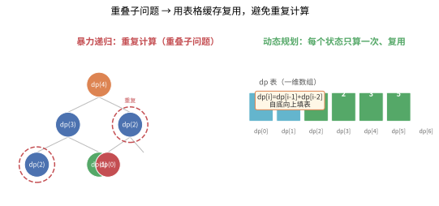
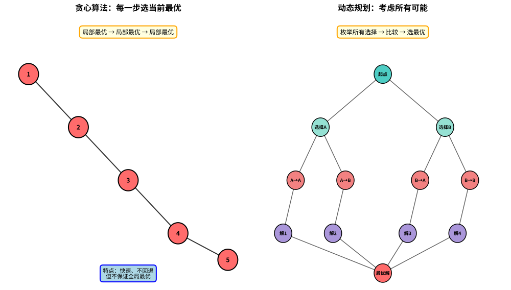
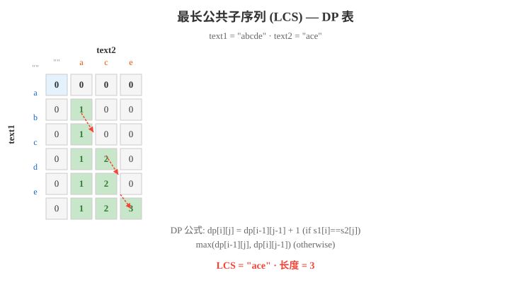

# 第六章：动态规划

> 动态规划（Dynamic Programming，简称 DP）是一种在数学、计算机科学和经济学中使用的，通过把原问题分解为相对简单的子问题的方式求解复杂问题的方法。
>
> 动态规划背后的基本思想非常简单：**若要解一个给定问题，我们需要解其不同部分（即子问题），再根据子问题的解以得出原问题的解。**
>
> 参考：[动态规划 - Wikipedia 文章 2680834]

---

## 6.1 动态规划基础

### 6.1.1 什么是动态规划？

**动态规划**适用于具有以下两个性质的问题：

#### ① 重叠子问题（Overlapping Subproblems）

同一个子问题会被反复求解多次。例如在斐波那契数列中，`F(5)` 需要 `F(4)` 和 `F(3)`，而 `F(4)` 又需要 `F(3)` 和 `F(2)`——`F(3)` 被重复计算了。

> 💡 **类比：重叠子问题如同家族族谱**
> 想象你在计算家族中每个人的"祖先数量"：你的祖先数 = 父亲的祖先数 + 母亲的祖先数。但父亲的祖先和母亲的祖先可能有重叠（比如某个共同祖先）。如果你不记录已经算过的祖先，每次都要重新数一遍，就会做大量重复工作。动态规划的做法是：把每个人的祖先数记在小本本上，下次用到时直接查表——这就是"记忆化"的核心思想。

```
         F(5)
        /    \
     F(4)    F(3)
    /    \    / \
  F(3)  F(2) F(2) F(1)
  / \
F(2) F(1)

F(3) 被计算了 2 次，F(2) 被计算了 3 次
```

> 💡 下图更直观：左边是**暴力递归**——同一个子问题（红色圆圈）反复求解；右边是**动态规划**——把每个子问题的答案存在表格里，用到时直接查表复用。这就是"重叠子问题"的破解之道：



#### ② 最优子结构（Optimal Substructure）

一个问题的最优解可以由其子问题的最优解推导出来。例如，从 A 到 D 的最短路径如果经过 B 和 C，那么 A→B、B→C、C→D 都是各自段的最短路径。

> 💡 **类比：最优子结构如同接力赛跑**
> 想象一支 4×100 米接力队要创造最快成绩。如果总时间是最优的，那么每一棒的成绩必须也是该段的最优——第一棒跑最快、第二棒跑最快……如果任何一棒不是最快，总时间就不可能最优。这就是"最优子结构"：全局最优解由局部最优解组成。反过来说，如果一个问题不具备这个性质（比如"最美观的路线"），就不能用动态规划。

### 6.1.2 两种实现方式

#### 自顶向下（Top-Down）—— 记忆化搜索（Memoization）

从大问题出发，递归求解子问题，并将已求解的子问题结果存储起来，避免重复计算。

```python
def fib_memo(n: int, memo: dict = None) -> int:
    """斐波那契数列 - 记忆化搜索（自顶向下）"""
    if memo is None:
        memo = {}
    if n in memo:
        return memo[n]
    if n <= 1:
        return n
    
    memo[n] = fib_memo(n-1, memo) + fib_memo(n-2, memo)
    return memo[n]

print(fib_memo(10))  # 55
```

#### 自底向上（Bottom-Up）—— 递推/表格法（Tabulation）

从最小的子问题开始，依次求解，逐步构建大问题的解。通常使用循环和数组（DP 表）。

```python
def fib_tab(n: int) -> int:
    """斐波那契数列 - 表格法（自底向上）"""
    if n <= 1:
        return n
    
    dp = [0] * (n + 1)
    dp[1] = 1
    for i in range(2, n + 1):
        dp[i] = dp[i-1] + dp[i-2]
    return dp[n]

print(fib_tab(10))  # 55
```

**两种方式的对比**：

| 特性 | 自顶向下（Memoization） | 自底向上/递推（Tabulation） |
|------|:---------------------:|:--------------------:|
| 实现方式 | 递归 + 缓存 | 迭代 + 表格 |
| 性能 | 有递归开销 | 通常更快 |
| 空间 | 可能只需要部分子问题 | 通常需要填满整个表 |
| 理解难度 | 更直观（从问题出发） | 需要先想清楚顺序 |
| 适用场景 | 子问题空间大但实际求解少 | 所有子问题都需要求解 |

### 6.1.3 什么时候用 DP？

**一个简单判断方法**：当一个问题可以分解为子问题，且子问题之间有重叠时，就应该考虑 DP。

**常见信号**：
- 求**最大值/最小值**（如最短路径、最大和）
- 求**方案数**（如多少种方式走到终点）
- 求**是否存在**（如能否凑出某个金额）
- 题目中有"**那些忘记过去的人，注定要重蹈覆辙**"的味道——如果你用暴力搜索，同样的子问题会被反复计算

**DP 解题四步法**：

```
1. 定义状态：dp[i] 或 dp[i][j] 表示什么？
2. 状态转移方程：dp[i] 如何从之前的 dp 值推导？
3. 初始化：dp[0] 或边界条件是什么？
4. 答案：最终返回 dp[n] 还是 max(dp)？
```

> **DP 的核心三要素**：状态定义（State）、状态转移方程（Transition）、边界条件（Base Case）。这三者构成了 DP 解题的骨架，缺一不可。

### 6.1.4 动态规划的实际应用

动态规划在现实世界中有着广泛的应用，以下是一些典型的实际案例：

#### 🧬 生物信息学：DNA 序列比对

**问题**：比较两条 DNA 序列的相似度，找出它们的公共子序列或计算编辑距离。

**应用**：
- **基因检测**：通过比对患者 DNA 与已知疾病基因的相似度，预测患病风险
- **进化研究**：比对不同物种的基因序列，构建进化树
- **药物研发**：比对蛋白质结构，寻找药物靶点

**DP 解法**：最长公共子序列（LCS）和编辑距离算法是生物信息学的基础工具。例如，人类与黑猩猩的基因相似度约 98%，就是通过类似算法计算得出。

#### 💰 金融工程：投资组合优化

**问题**：给定预算 W 和 n 个投资项目（每个项目有成本 w[i] 和预期收益 v[i]），如何选择项目使总收益最大？

**应用**：
- **基金配置**：在有限资金下选择最优的资产配置方案
- **风险管理**：在预算约束下最大化风险调整后收益
- **资源分配**：企业在多个项目中分配研发预算

**DP 解法**：0-1 背包问题的变种。实际中还需考虑风险相关性、流动性约束等，但核心仍是 DP 思想。

#### 🗺️ 路径规划：导航系统

**问题**：在地图中找到从起点到终点的最短路径，考虑交通状况、红绿灯、限速等因素。

**应用**：
- **高德/百度地图**：实时计算最优路线
- **物流配送**：快递公司规划送货路线（TSP 问题）
- **机器人导航**：自动驾驶汽车的路径规划

**DP 解法**：Floyd-Warshall 算法（全源最短路径）、动态规划优化的 Dijkstra 算法。实际导航系统还会结合实时交通数据动态调整。

#### 🎮 游戏 AI：最优决策

**问题**：在棋类游戏或策略游戏中，AI 如何选择最优的下一步行动？

**应用**：
- **AlphaGo**：结合蒙特卡洛树搜索（MCTS）和深度强化学习
- **国际象棋 AI**：使用 minimax 算法 + alpha-beta 剪枝
- **RPG 游戏**：NPC 的最优战斗策略

**DP 解法**：博弈论中的 minimax 算法本质是 DP。AlphaGo 的价值网络（Value Network）就是用 DP 思想评估棋盘状态的长期价值。

#### 📊 自然语言处理：语音识别

**问题**：将音频信号转换为文字序列，找出最可能的词序列。

**应用**：
- **Siri/小爱同学**：语音助手的核心技术
- **字幕生成**：自动生成视频字幕
- **语音输入法**：将口述转为文字

**DP 解法**：隐马尔可夫模型（HMM）中的维特比算法（Viterbi Algorithm）是典型的 DP 应用，用于找出最可能的隐藏状态序列。

#### 🏭 生产调度：任务分配

**问题**：工厂有 n 台机器和 m 个订单，每个订单在不同机器上的加工时间不同，如何分配使总完成时间最短？

**应用**：
- **制造业**：优化生产线效率
- **云计算**：任务在服务器间的负载均衡
- **医院排班**：医生护士的排班优化

**DP 解法**：区间 DP、状态压缩 DP。实际中还需考虑机器故障、紧急订单等动态因素。

> 💡 **类比：DP 如同人生规划**
> 想象你要规划大学四年的学习路径：大一学基础课，大二学专业核心课，大三选方向，大四做毕设。每个阶段的决策会影响后续选择（比如大二没学好数据结构，大三学算法就会很吃力）。DP 的思想就是：**把长期目标分解为阶段性决策，每阶段基于当前状态做最优选择，最终得到全局最优解**。人生无法重来（无后效性），但可以用 DP 思想规划最优路径。

### 6.1.5 DP 与分治、贪心的区别

| 特性 | 动态规划（DP） | 分治（Divide & Conquer） | 贪心（Greedy） |
|------|:------------:|:----------------------:|:-------------:|
| 子问题关系 | **重叠子问题**，子问题相互依赖 | **独立子问题**，互不重叠 | 无子问题依赖，每步独立决策 |
| 决策方式 | 多阶段决策，依赖历史状态 | 递归分解，合并子问题结果 | 每步局部最优，不回溯 |
| 正确性保证 | 状态转移方程保证全局最优 | 递归正确性保证 | 需证明贪心选择性质与最优子结构 |
| 典型例子 | 背包问题、LCS、编辑距离 | 归并排序、快速排序、二分搜索 | 活动选择、哈夫曼编码、Dijkstra |
| 实现方式 | 表格法 / 记忆化搜索 | 递归 / 迭代 | 简单循环 / 优先队列 |

> 💡 **贪心 vs 动态规划，一句话区分**：
> - **贪心**：只在**当前**做最有利的选择，不回头看，也不考虑未来 → 快，但可能错过全局最优
> - **动态规划**：枚举所有可能的状态，记住每个子问题的最优解 → 慢一些，但保证全局最优
>
> 下图用"爬山"比喻两者的区别——贪心如随大流向"局部最高坡"爬去，可能停在半山腰的小山头；DP 则会纵观全局，直奔最高的主峰：



---

## 6.2 经典 DP 问题

### 6.2.1 斐波那契数列（Fibonacci）

**问题**：求斐波那契数列的第 n 项，F(0)=0, F(1)=1, F(n)=F(n-1)+F(n-2)。

**三种实现对比**：

```python
def fib_naive(n: int) -> int:
    """朴素递归 - 指数级复杂度 O(2^n)"""
    if n <= 1:
        return n
    return fib_naive(n-1) + fib_naive(n-2)


def fib_memoization(n: int, memo: dict = None) -> int:
    """记忆化搜索 - O(n)"""
    if memo is None:
        memo = {}
    if n in memo:
        return memo[n]
    if n <= 1:
        return n
    memo[n] = fib_memoization(n-1, memo) + fib_memoization(n-2, memo)
    return memo[n]


def fib_tabulation(n: int) -> int:
    """表格法 - O(n)"""
    if n <= 1:
        return n
    dp = [0] * (n + 1)
    dp[1] = 1
    for i in range(2, n + 1):
        dp[i] = dp[i-1] + dp[i-2]
    return dp[n]


def fib_optimized(n: int) -> int:
    """空间优化 - O(1)"""
    if n <= 1:
        return n
    a, b = 0, 1
    for _ in range(2, n + 1):
        a, b = b, a + b
    return b


# 测试
n = 10
print(f"朴素递归: fib({n}) = {fib_naive(n)}")
print(f"记忆化搜索: fib({n}) = {fib_memoization(n)}")
print(f"表格法: fib({n}) = {fib_tabulation(n)}")
print(f"空间优化: fib({n}) = {fib_optimized(n)}")
```

**DP 表填充过程**（n=6）：

```
dp[0] = 0
dp[1] = 1
dp[2] = dp[1] + dp[0] = 1 + 0 = 1
dp[3] = dp[2] + dp[1] = 1 + 1 = 2
dp[4] = dp[3] + dp[2] = 2 + 1 = 3
dp[5] = dp[4] + dp[3] = 3 + 2 = 5
dp[6] = dp[5] + dp[4] = 5 + 3 = 8

DP 表:
┌─────┬─────┬─────┬─────┬─────┬─────┬─────┐
│ i   │ 0   │ 1   │ 2   │ 3   │ 4   │ 5   │ 6   │
├─────┼─────┼─────┼─────┼─────┼─────┼─────┼─────┤
│ dp  │ 0   │ 1   │ 1   │ 2   │ 3   │ 5   │ 8   │
└─────┴─────┴─────┴─────┴─────┴─────┴─────┴─────┘
```

下图展示了朴素递归（指数级）与动态规划（线性）的时间复杂度对比：


### 6.2.2 爬楼梯（Climbing Stairs）

**问题**：每次可以爬 1 或 2 个台阶，爬到第 n 阶有多少种不同的方式？

**分析**：到达第 n 阶，可以从第 n-1 阶迈 1 步，或者从第 n-2 阶迈 2 步。所以 `dp[n] = dp[n-1] + dp[n-2]`。

> 💡 **类比：爬楼梯如同组合步法**
> 想象你站在楼梯底部，要爬到第 10 级。你可以选择"迈 1 步"或"迈 2 步"。爬到第 10 级的方法数 = 爬到第 9 级的方法数（最后迈 1 步）+ 爬到第 8 级的方法数（最后迈 2 步）。这就像你在做一系列二选一决策：每一步要么跨 1 级，要么跨 2 级。最终你会发现，爬楼梯的方法数正好是斐波那契数列！

```python
def climb_stairs(n: int) -> int:
    """
    爬楼梯 - LeetCode 70
    
    状态：dp[i] 表示爬到第 i 阶的方法数
    转移：dp[i] = dp[i-1] + dp[i-2]
    初始：dp[0] = 1, dp[1] = 1
    """
    if n <= 1:
        return 1
    
    dp = [0] * (n + 1)
    dp[0], dp[1] = 1, 1
    
    for i in range(2, n + 1):
        dp[i] = dp[i-1] + dp[i-2]
    
    return dp[n]


# 测试
for n in range(1, 11):
    print(f"爬到第 {n} 阶: {climb_stairs(n)} 种方式")
# 输出: 1, 2, 3, 5, 8, 13, 21, 34, 55, 89
```

**爬楼梯图示**（n=4）：

```
方式1: 1→1→1→1  (1+1+1+1)
方式2: 1→1→2    (1+1+2)
方式3: 1→2→1    (1+2+1)
方式4: 2→1→1    (2+1+1)
方式5: 2→2      (2+2)

DP 填充:
dp[0] = 1 (起点)
dp[1] = 1 (只能从 0 迈 1 步)
dp[2] = dp[1] + dp[0] = 1 + 1 = 2
dp[3] = dp[2] + dp[1] = 2 + 1 = 3
dp[4] = dp[3] + dp[2] = 3 + 2 = 5
```

### 6.2.3 最大子数组和（Maximum Subarray）

**问题**：给定整数数组 `nums`，找出和最大的连续子数组，返回其和。

> 💡 **类比：最大子数组和如同"股票投资"**
> 想象你在观察一支股票每天的价格变化（正数代表涨，负数代表跌）。你要选择一段连续的时间持有股票，使得收益最大。Kadane 算法的策略是：如果之前的累计收益是负的，就果断"割肉止损"，从当天重新开始；如果之前的累计收益是正的，就继续持有。这样就能找到收益最大的那段连续区间。

**核心思想**：Kadane 算法。`dp[i]` 表示以 `nums[i]` 结尾的最大子数组和。要么接续前面的子数组，要么重新开始。

```python
def max_subarray(nums: list) -> int:
    """
    最大子数组和 - LeetCode 53（Kadane 算法）
    
    状态：dp[i] 表示以 nums[i] 结尾的最大子数组和
    转移：dp[i] = max(nums[i], dp[i-1] + nums[i])
    """
    n = len(nums)
    dp = [0] * n
    dp[0] = nums[0]
    max_sum = dp[0]
    
    for i in range(1, n):
        dp[i] = max(nums[i], dp[i-1] + nums[i])
        max_sum = max(max_sum, dp[i])
    
    return max_sum


def max_subarray_optimized(nums: list) -> int:
    """空间优化版本 O(1)"""
    cur = max_sum = nums[0]
    for num in nums[1:]:
        cur = max(num, cur + num)
        max_sum = max(max_sum, cur)
    return max_sum


# 测试
nums = [-2, 1, -3, 4, -1, 2, 1, -5, 4]
print(f"最大子数组和: {max_subarray(nums)}")  # 6 (子数组 [4,-1,2,1])
```

**DP 表填充过程**：

```
nums: [-2,  1, -3,  4, -1,  2,  1, -5,  4]
dp:   [-2,  1, -2,  4,  3,  5,  6,  1,  5]
        ↑    ↑    ↑    ↑   ↑   ↑    ↑   ↑   ↑
       -2   max  max  max max  max  max  max max
           (1,  (1-3, (4,  (4-1, (3+2, (5+1, (6-5, (1+4,
           -2+1) -2)   -2+4)  -2)   -2)   -2)   -2)   -2)
            =1   =-2   =4   =3    =5    =6    =1    =5

最大和 = max(dp) = 6
```

### 6.2.4 最长递增子序列（Longest Increasing Subsequence, LIS）

**问题**：给定整数数组，找出最长的严格递增子序列的长度。

> 💡 **类比：LIS 如同选队员排队**
> 想象你是体育老师，要从一排学生中选出尽可能多的人，按从左到右的顺序排成一支"身高递增"的队伍。你不能改变学生的站位顺序，只能从中挑选。比如学生身高是 [10, 9, 2, 5, 3, 7, 101, 18]，你可以选 [2, 5, 7, 101] 或 [2, 3, 7, 18]，最长递增子序列长度是 4。这就像在"不改变原始顺序"的前提下，找出一条"越来越强"的链条。

**O(n²) 解法**：

```python
def length_of_lis(nums: list) -> int:
    """
    最长递增子序列 - O(n²)
    
    状态：dp[i] 表示以 nums[i] 结尾的 LIS 长度
    转移：dp[i] = max(dp[j] + 1) 其中 j < i 且 nums[j] < nums[i]
    """
    if not nums:
        return 0
    
    n = len(nums)
    dp = [1] * n
    
    for i in range(n):
        for j in range(i):
            if nums[j] < nums[i]:
                dp[i] = max(dp[i], dp[j] + 1)
    
    return max(dp)


# 测试
nums = [10, 9, 2, 5, 3, 7, 101, 18]
print(f"LIS 长度: {length_of_lis(nums)}")  # 4 ([2, 5, 7, 101] 或 [2, 3, 7, 101])
```

**DP 表填充过程**：

```
nums: [10, 9, 2, 5, 3, 7, 101, 18]

i=0: dp[0]=1
i=1: dp[1]=1 (9<10? 不成立)
i=2: dp[2]=1 (2<10? 2<9? 都不成立)
i=3: dp[3]=max(dp[2]+1)=2  (5>2)
i=4: dp[4]=max(dp[2]+1)=2  (3>2)
i=5: dp[5]=max(dp[2]+1, dp[3]+1, dp[4]+1)=3  (7>2,5,3)
i=6: dp[6]=max(dp[0..5]+1)=4  (101>所有)
i=7: dp[7]=max(dp[2]+1, dp[3]+1, dp[4]+1, dp[5]+1)=4 (18>2,5,3,7)

最终 dp:
┌──────┬────┬────┬────┬────┬────┬────┬─────┬────┐
│ i    │ 0  │ 1  │ 2  │ 3  │ 4  │ 5  │ 6   │ 7  │
├──────┼────┼────┼────┼────┼────┼────┼─────┼────┤
│ nums │ 10 │ 9  │ 2  │ 5  │ 3  │ 7  │ 101 │ 18 │
├──────┼────┼────┼────┼────┼────┼────┼─────┼────┤
│ dp   │ 1  │ 1  │ 1  │ 2  │ 2  │ 3  │ 4   │ 4  │
└──────┴────┴────┴────┴────┴────┴────┴─────┴────┘

LIS 长度 = 4
```

**O(n log n) 解法（耐心排序）**：

```python
import bisect

def length_of_lis_fast(nums: list) -> int:
    """
    最长递增子序列 - O(n log n)
    
    维护一个 tails 数组，tails[i] 表示长度为 i+1 的递增子序列的最小末尾元素
    """
    tails = []
    for num in nums:
        idx = bisect.bisect_left(tails, num)
        if idx == len(tails):
            tails.append(num)
        else:
            tails[idx] = num
    return len(tails)


# 测试
print(f"LIS 长度（快速）: {length_of_lis_fast(nums)}")  # 4
```

**耐心排序过程**：

```
nums: [10, 9, 2, 5, 3, 7, 101, 18]

num=10:  tails = [10]
num=9:   tails = [9]        (替换 10)
num=2:   tails = [2]        (替换 9)
num=5:   tails = [2, 5]     (追加)
num=3:   tails = [2, 3]     (替换 5)
num=7:   tails = [2, 3, 7]  (追加)
num=101: tails = [2, 3, 7, 101]  (追加)
num=18:  tails = [2, 3, 7, 18]   (替换 101)

最终 tails 长度 = 4
```

### 6.2.5 最长公共子序列（Longest Common Subsequence, LCS）

**问题**：给定两个字符串，找出它们的最长公共子序列的长度。

> 💡 **类比：LCS 如同 DNA 比对**
> 想象你是生物学家，要比较两段 DNA 序列的相似度。人类和黑猩猩的 DNA 有 98% 相同——这意味着它们的最长公共子序列非常长。LCS 就是找出两个字符串中"顺序相同但不一定连续"的最长公共部分。比如 "abcde" 和 "ace" 的 LCS 是 "ace"（长度 3），因为 a、c、e 在两个字符串中都按相同顺序出现。这就像在两本书中找出"共同引用的段落"——顺序一致，但中间可能插入了其他内容。

**状态转移方程**：
- 如果 `text1[i] == text2[j]`，则 `dp[i][j] = dp[i-1][j-1] + 1`
- 否则，`dp[i][j] = max(dp[i-1][j], dp[i][j-1])`

```python
def longest_common_subsequence(text1: str, text2: str) -> int:
    """
    最长公共子序列 - LeetCode 1143
    
    状态：dp[i][j] 表示 text1[:i] 和 text2[:j] 的 LCS 长度
    """
    m, n = len(text1), len(text2)
    dp = [[0] * (n + 1) for _ in range(m + 1)]
    
    for i in range(1, m + 1):
        for j in range(1, n + 1):
            if text1[i-1] == text2[j-1]:
                dp[i][j] = dp[i-1][j-1] + 1
            else:
                dp[i][j] = max(dp[i-1][j], dp[i][j-1])
    
    return dp[m][n]


# 测试
print(longest_common_subsequence("abcde", "ace"))   # 3 ("ace")
print(longest_common_subsequence("abc", "abc"))     # 3 ("abc")
print(longest_common_subsequence("abc", "def"))     # 0
```

**DP 表填充过程**（text1="abcde", text2="ace"）：

```
     ""   a   c   e
""    0   0   0   0
a     0   1   1   1   ← dp[1][1]=1 (a==a)
b     0   1   1   1   ← dp[2][2]=max(dp[1][2],dp[2][1])=1
c     0   1   2   2   ← dp[3][2]=dp[2][1]+1=2 (c==c)
d     0   1   2   2   ← dp[4][3]=max(dp[3][3],dp[4][2])=2
e     0   1   2   3   ← dp[5][3]=dp[4][2]+1=3 (e==e)

最终 dp[5][3] = 3
```

下图展示了 LCS 问题的 DP 表填充过程，清晰反映了状态转移路径：



### 6.2.6 编辑距离（Edit Distance / Levenshtein Distance）

**问题**：将字符串 word1 转换为 word2，允许插入、删除、替换三种操作，求最少操作次数。

> 💡 **类比：编辑距离如同拼写纠错**
> 想象你在手机上输入 "kitten"，但想输入 "sitting"。手机会自动纠正拼写错误——它需要计算两个词之间的"编辑距离"。把 "kitten" 变成 "sitting" 需要 3 步：k→s（替换）、e→i（替换）、末尾加 g（插入）。编辑距离就是衡量两个字符串"有多像"的指标：距离越小，字符串越相似。这就是为什么搜索引擎能在你打错字时仍能给出正确结果——它用编辑距离找到最接近的正确词汇。

**状态转移方程**：
- 如果 `word1[i-1] == word2[j-1]`：`dp[i][j] = dp[i-1][j-1]`
- 否则：`dp[i][j] = min(dp[i-1][j], dp[i][j-1], dp[i-1][j-1]) + 1`
  - `dp[i-1][j]`：删除 word1[i-1]
  - `dp[i][j-1]`：插入 word2[j-1]
  - `dp[i-1][j-1]`：替换 word1[i-1] 为 word2[j-1]

```python
def min_distance(word1: str, word2: str) -> int:
    """
    编辑距离 - LeetCode 72
    
    状态：dp[i][j] 表示 word1[:i] 转换为 word2[:j] 的最小操作数
    """
    m, n = len(word1), len(word2)
    dp = [[0] * (n + 1) for _ in range(m + 1)]
    
    # 初始化边界
    for i in range(m + 1):
        dp[i][0] = i  # 删除所有字符
    for j in range(n + 1):
        dp[0][j] = j  # 插入所有字符
    
    for i in range(1, m + 1):
        for j in range(1, n + 1):
            if word1[i-1] == word2[j-1]:
                dp[i][j] = dp[i-1][j-1]
            else:
                dp[i][j] = min(
                    dp[i-1][j],    # 删除
                    dp[i][j-1],    # 插入
                    dp[i-1][j-1]   # 替换
                ) + 1
    
    return dp[m][n]


# 测试
print(min_distance("horse", "ros"))  # 3
# horse → rorse (替换 h→r) → rose (删除 r) → ros (删除 e)
print(min_distance("intention", "execution"))  # 5
```

**DP 表填充过程**（word1="horse", word2="ros"）：

```
     ""   r    o    s
""    0   1    2    3
h     1   1    2    3    ← dp[1][1]=1 (替换 h→r)
o     2   2    1    2    ← dp[2][2]=1 (o==o)
r     3   2    2    2    ← dp[3][1]=2 (删除 h→r→...)
s     4   3    3    2    ← dp[4][3]=2 (s==s)
e     5   4    4    3    ← dp[5][3]=3

最终 dp[5][3] = 3
```

### 6.2.7 0-1 背包问题（0/1 Knapsack）

**问题**：有 `n` 个物品，每个物品有重量 `w[i]` 和价值 `v[i]`，背包容量为 `W`。每个物品最多选一次，求能装入的最大价值。

> 💡 **类比：0-1 背包如同旅行打包**
> 想象你要去旅行，背包容量有限（比如只能装 8 公斤）。你有 4 件物品可选：笔记本电脑（2kg，价值 3）、相机（3kg，价值 4）、书籍（4kg，价值 5）、外套（5kg，价值 6）。每件物品只能带或不带（0-1 选择），不能切一半。你的目标是：在不超过背包容量的前提下，让携带物品的总价值最大。这就是经典的 0-1 背包问题——"选或不选"的决策贯穿始终。

**状态转移方程**：
- 不选第 i 个物品：`dp[i][j] = dp[i-1][j]`
- 选第 i 个物品（如果装得下）：`dp[i][j] = max(dp[i][j], dp[i-1][j-w[i-1]] + v[i-1])`

```python
def knapsack_01(weights: list, values: list, W: int) -> int:
    """
    0-1 背包问题
    
    状态：dp[i][j] 表示前 i 个物品在容量为 j 时的最大价值
    """
    n = len(weights)
    dp = [[0] * (W + 1) for _ in range(n + 1)]
    
    for i in range(1, n + 1):
        w, v = weights[i-1], values[i-1]
        for j in range(1, W + 1):
            if j >= w:
                dp[i][j] = max(dp[i-1][j], dp[i-1][j-w] + v)
            else:
                dp[i][j] = dp[i-1][j]
    
    return dp[n][W]


def knapsack_01_optimized(weights: list, values: list, W: int) -> int:
    """空间优化版本 - 一维数组"""
    n = len(weights)
    dp = [0] * (W + 1)
    
    for i in range(n):
        w, v = weights[i], values[i]
        for j in range(W, w - 1, -1):  # 逆序遍历！
            dp[j] = max(dp[j], dp[j-w] + v)
    
    return dp[W]


# 测试
weights = [2, 3, 4, 5]
values = [3, 4, 5, 6]
W = 8
print(f"最大价值: {knapsack_01(weights, values, W)}")  # 10
print(f"最大价值（优化）: {knapsack_01_optimized(weights, values, W)}")  # 10
```

**DP 表填充过程**（物品: (w=2,v=3), (w=3,v=4), (w=4,v=5), (w=5,v=6), W=8）：

```
物品\容量  0  1  2  3  4  5  6  7  8
  0       0  0  0  0  0  0  0  0  0
 (2,3)    0  0  3  3  3  3  3  3  3
 (3,4)    0  0  3  4  4  7  7  7  7
 (4,5)    0  0  3  4  5  7  8  9  9
 (5,6)    0  0  3  4  5  7  8  9  10  ← 选(2,3)+(5,6)=10

选中的物品: 重量2(价值3) + 重量5(价值6) = 总价值10
```

### 6.2.8 完全背包问题（Unbounded Knapsack）

**问题**：与 0-1 背包的区别在于，每个物品可以**无限次**选取。

> 💡 **类比：完全背包如同"自助餐厅拿菜"**
> 想象你在自助餐厅，每种菜（物品）都可以拿多份（无限供应），但你的盘子容量有限（背包容量）。0-1 背包是"每样菜只有一份"，拿完就没了；完全背包是"每样菜无限供应"，你可以拿多份同一种菜。这就是为什么完全背包的 DP 循环是正序的——因为可以重复选择同一物品。

**关键区别**：完全背包的容量循环是**正序**的（因为可以重复选），而 0-1 背包是**逆序**的。

```python
def knapsack_unbounded(weights: list, values: list, W: int) -> int:
    """
    完全背包问题
    
    状态：dp[j] 表示容量为 j 时的最大价值
    转移：dp[j] = max(dp[j], dp[j-w] + v)
    """
    n = len(weights)
    dp = [0] * (W + 1)
    
    for i in range(n):
        w, v = weights[i], values[i]
        for j in range(w, W + 1):  # 正序遍历！
            dp[j] = max(dp[j], dp[j-w] + v)
    
    return dp[W]


# 测试（同样的物品，完全背包可以重复选）
weights = [2, 3, 4, 5]
values = [3, 4, 5, 6]
W = 8
print(f"完全背包最大价值: {knapsack_unbounded(weights, values, W)}")  # 12
# 选 4 个重量 2 的物品：4×3=12
```

**0-1 背包 vs 完全背包对比**：

| 特性 | 0-1 背包 | 完全背包 |
|------|:-------:|:--------:|
| 物品选择次数 | 最多 1 次 | 无限次 |
| 容量遍历顺序 | 逆序（从大到小） | 正序（从小到大） |
| 状态转移 | `dp[i-1][j-w] + v` | `dp[i][j-w] + v`（同一行） |
| 典型应用 | 选或不选 | 无限硬币找零 |

**背包问题完整分类**：

| 背包类型 | 特点 | 遍历顺序 | 核心要点 |
|---------|------|:-------:|---------|
| 0-1 背包 | 每种物品最多选一次 | 容量**逆序** | 基础模型，选或不选 |
| 完全背包 | 每种物品无限选取 | 容量**正序** | 同一物品可重复选 |
| 多重背包 | 每种物品有数量限制 | 二进制优化 / 单调队列 | 拆分为 0-1 背包处理 |
| 分组背包 | 每组内最多选一个 | 组外逆序，组内循环 | 每组决策选哪个 |
| 二维费用背包 | 两种约束条件（如重量+体积） | 二维逆序循环 | 多一维状态表示 |
| 依赖背包 | 选子物品必须先选主物品 | 树形 DP 合并 | 转化为分组背包求解 |

### 6.2.9 回文子串（Palindromic Substrings）

**问题**：给定字符串，找出所有回文子串的个数，或找出最长回文子串。

> 💡 **类比：回文子串如同"照镜子游戏"**
> 想象你在玩一个照镜子游戏：以每个字符（或两个字符之间）为"镜子中心"，向两边扩展，看能反射出多少对称的字符。比如 "aba" 以 'b' 为镜子，左右都是 'a'，对称；"abba" 以中间两个 'b' 之间为镜子，左右对称。中心扩展法就是遍历所有可能的"镜子位置"，统计能反射出的回文串。

**中心扩展法**（O(n²)）：

```python
def count_substrings(s: str) -> int:
    """
    回文子串个数 - LeetCode 647
    
    中心扩展法：每个字符和每两个字符之间作为中心，向两边扩展
    """
    n = len(s)
    count = 0
    
    def expand_around_center(left: int, right: int):
        """从中心向两边扩展，统计回文串个数"""
        nonlocal count
        while left >= 0 and right < n and s[left] == s[right]:
            count += 1
            left -= 1
            right += 1
    
    for i in range(n):
        expand_around_center(i, i)      # 奇数长度中心
        expand_around_center(i, i+1)    # 偶数长度中心
    
    return count


# 测试
print(count_substrings("abc"))    # 3 ("a","b","c")
print(count_substrings("aaa"))    # 6 ("a","a","a","aa","aa","aaa")
```

**DP 解法**（最长回文子串）：

```python
def longest_palindrome(s: str) -> str:
    """
    最长回文子串 - LeetCode 5
    
    dp[i][j] 表示 s[i:j+1] 是否为回文串
    dp[i][j] = (s[i] == s[j]) and (j-i <= 2 or dp[i+1][j-1])
    """
    n = len(s)
    if n < 2:
        return s
    
    dp = [[False] * n for _ in range(n)]
    start, max_len = 0, 1
    
    # 所有长度为 1 的子串都是回文
    for i in range(n):
        dp[i][i] = True
    
    # 按长度递增填表
    for length in range(2, n + 1):
        for i in range(n - length + 1):
            j = i + length - 1
            if s[i] == s[j]:
                if length <= 2 or dp[i+1][j-1]:
                    dp[i][j] = True
                    if length > max_len:
                        start = i
                        max_len = length
    
    return s[start:start + max_len]


# 测试
print(longest_palindrome("babad"))  # "bab" 或 "aba"
print(longest_palindrome("cbbd"))   # "bb"
```

**DP 表填充过程**（s="babad"）：

```
     b    a    b    a    d
b    T    F    T    F    F    ← dp[0][2]=T (bab)
a         T    F    T    F    ← dp[1][3]=T (aba)
b              T    F    F
a                   T    F
d                        T

最长回文子串: "bab" 或 "aba"
```

### 6.2.10 矩阵链乘（Matrix Chain Multiplication）

**问题**：给定矩阵维度序列 `p`，其中矩阵 `A_i` 的维度为 `p[i-1] × p[i]`。求完全括号化方案，使得标量乘法次数最少。

> 💡 **类比：矩阵链乘如同"组装流水线"**
> 想象你要组装一个产品，需要依次经过多道工序（矩阵相乘）。每两道工序合并时，需要一定的"组装成本"（乘法次数）。不同的合并顺序（括号化方案）会导致总成本差异巨大。矩阵链乘就是找出最优的"组装顺序"，让总成本最小。区间 DP 的思路是：先算出每道单独工序的成本，再算两道合并的成本，再算三道合并的成本……逐步构建出整个流水线的最优方案。

**状态转移**：`dp[i][j] = min(dp[i][k] + dp[k+1][j] + p[i-1]*p[k]*p[j])`，其中 `i ≤ k < j`

```python
def matrix_chain_order(p: list) -> int:
    """
    矩阵链乘 - 区间 DP
    
    状态：dp[i][j] 表示从第 i 个到第 j 个矩阵的最小乘法次数
    """
    n = len(p) - 1  # 矩阵个数
    dp = [[0] * (n + 1) for _ in range(n + 1)]
    
    # length 为区间长度
    for length in range(2, n + 1):
        for i in range(1, n - length + 2):
            j = i + length - 1
            dp[i][j] = float('inf')
            for k in range(i, j):
                cost = (dp[i][k] + dp[k+1][j] 
                       + p[i-1] * p[k] * p[j])
                dp[i][j] = min(dp[i][j], cost)
    
    return dp[1][n]


# 测试
# 矩阵 A1(10×20), A2(20×30), A3(30×40), A4(40×50)
p = [10, 20, 30, 40, 50]
print(f"最小乘法次数: {matrix_chain_order(p)}")  # 38000
# 最优括号化: ((A1×(A2×A3))×A4) 或类似
```

**DP 表填充过程**（p=[10,20,30,40,50]）：

```
矩阵: A1(10×20), A2(20×30), A3(30×40), A4(40×50)

dp[1][2] = 10×20×30 = 6000
dp[2][3] = 20×30×40 = 24000
dp[3][4] = 30×40×50 = 60000

dp[1][3] = min(
    dp[1][1] + dp[2][3] + 10×20×40 = 0 + 24000 + 8000 = 32000,
    dp[1][2] + dp[3][3] + 10×30×40 = 6000 + 0 + 12000 = 18000
) = 18000

dp[2][4] = min(
    dp[2][2] + dp[3][4] + 20×30×50 = 0 + 60000 + 30000 = 90000,
    dp[2][3] + dp[4][4] + 20×40×50 = 24000 + 0 + 40000 = 64000
) = 64000

dp[1][4] = min(
    dp[1][1] + dp[2][4] + 10×20×50 = 0 + 64000 + 10000 = 74000,
    dp[1][2] + dp[3][4] + 10×30×50 = 6000 + 60000 + 15000 = 81000,
    dp[1][3] + dp[4][4] + 10×40×50 = 18000 + 0 + 20000 = 38000
) = 38000

DP 表（上三角）：
┌────┬────────┬────────┬────────┬────────┐
│ i\j│   1    │   2    │   3    │   4    │
├────┼────────┼────────┼────────┼────────┤
│ 1  │   0    │  6000  │ 18000  │ 38000  │
│ 2  │        │   0    │ 24000  │ 64000  │
│ 3  │        │        │   0    │ 60000  │
│ 4  │        │        │        │   0    │
└────┴────────┴────────┴────────┴────────┘
```

---

## 6.3 DP 模式总结

### 6.3.1 线性 DP（Linear DP）

**特点**：状态是一维的，沿着一条线递推。

**典型问题**：斐波那契、爬楼梯、最大子数组和、最长递增子序列

**模板**：
```python
# 一维线性 DP
dp = [0] * n
for i in range(1, n):
    dp[i] = f(dp[i-1], dp[i-2], ...)
```

**示例 - 打家劫舍**：

```python
def rob(nums: list) -> int:
    """
    打家劫舍 - LeetCode 198
    
    状态：dp[i] 表示偷前 i 家的最大金额
    转移：dp[i] = max(dp[i-1], dp[i-2] + nums[i-1])
    """
    if not nums:
        return 0
    if len(nums) == 1:
        return nums[0]
    
    dp = [0] * (len(nums) + 1)
    dp[1] = nums[0]
    
    for i in range(2, len(nums) + 1):
        dp[i] = max(dp[i-1], dp[i-2] + nums[i-1])
    
    return dp[len(nums)]


# 测试
print(rob([1, 2, 3, 1]))   # 4 (偷第1家+第3家=1+3=4)
print(rob([2, 7, 9, 3, 1]))  # 12 (偷第2家+第3家+第5家=7+9+1=12)
```

### 6.3.2 区间 DP（Interval DP）

> 💡 **类比：区间 DP 如同"拼图游戏"**
> 想象你在拼一幅长条拼图，每次只能合并相邻的两块。区间 DP 的思路是：先算出每个单独拼块的信息（长度为 1 的区间），再算出相邻两块合并后的最优方案（长度为 2 的区间），再算三块合并……直到整条拼图完成。这就是"从小到大，逐步合并"的区间 DP 思想。

**特点**：状态是二维的，`dp[i][j]` 表示区间 `[i, j]` 上的最优解。

**典型问题**：矩阵链乘、最长回文子串

**模板**：
```python
# 区间 DP
dp = [[0] * n for _ in range(n)]
for length in range(2, n + 1):      # 枚举区间长度
    for i in range(n - length + 1):  # 枚举起点
        j = i + length - 1           # 计算终点
        dp[i][j] = best(dp[i][k] + dp[k+1][j] + cost)
```

### 6.3.3 树形 DP（Tree DP）

> 💡 **类比：树形 DP 如同"家族企业继承"**
> 想象一个家族企业，爷爷（根节点）要把企业传给子孙。每个子孙（子节点）先算出自己这一支的"贡献值"，然后层层向上汇报，最后爷爷根据所有子孙的贡献做出决策。树形 DP 就是这种"自底向上，层层汇报"的思想：先用 DFS 走到叶子节点，算出叶子的最优解，然后回溯时把子节点的信息合并到父节点，直到根节点得到全局最优解。

**特点**：在树上进行 DP，通常用 DFS 后序遍历，子节点信息传递给父节点。

**典型问题**：树的最大独立集、树的最小点覆盖

**示例 - 二叉树中的最大路径和**：

```python
def max_path_sum(root) -> int:
    """
    二叉树中的最大路径和 - LeetCode 124
    """
    max_sum = float('-inf')
    
    def dfs(node):
        nonlocal max_sum
        if not node:
            return 0
        
        left = max(0, dfs(node.left))   # 负值不选
        right = max(0, dfs(node.right))
        
        # 经过当前节点的最大路径
        max_sum = max(max_sum, left + right + node.val)
        
        # 返回给父节点的最大贡献值
        return max(left, right) + node.val
    
    dfs(root)
    return max_sum
```

### 6.3.4 状态压缩 DP（State Compression DP）

> 💡 **类比：状态压缩 DP 如同"打卡签到表"**
> 想象你有 n 个景点要游览，用一个 n 位的二进制数记录"哪些景点已经去过"：第 i 位是 1 表示去过景点 i，是 0 表示没去过。比如二进制 `10110` 表示去过第 1、2、4 号景点（从右往左数）。这样就把复杂的"集合状态"压缩成一个整数，可以用数组下标直接访问。TSP 问题就是：在"打卡表"从 `00001`（只去过起点）走到 `11111`（全部去过）的过程中，找出最短路径。

**特点**：用一个整数的二进制位表示集合状态，适用于状态数较少（n ≤ 20）的情况。

**典型问题**：旅行商问题（TSP）、集合划分

**示例 - 旅行商问题（TSP）**：

```python
def tsp(dist: list) -> int:
    """
    旅行商问题 - 状态压缩 DP
    
    状态：dp[mask][i] 表示已访问集合为 mask，当前在 i 的最短路径长度
    """
    n = len(dist)
    # 初始化 dp
    dp = [[float('inf')] * n for _ in range(1 << n)]
    dp[1][0] = 0  # 从 0 出发，只访问了 0
    
    for mask in range(1 << n):
        for u in range(n):
            if not (mask >> u) & 1:
                continue
            for v in range(n):
                if (mask >> v) & 1:
                    continue
                new_mask = mask | (1 << v)
                dp[new_mask][v] = min(
                    dp[new_mask][v],
                    dp[mask][u] + dist[u][v]
                )
    
    # 回到起点
    full_mask = (1 << n) - 1
    ans = min(dp[full_mask][i] + dist[i][0] for i in range(1, n))
    return ans


# 测试
dist = [
    [0, 10, 15, 20],
    [10, 0, 35, 25],
    [15, 35, 0, 30],
    [20, 25, 30, 0],
]
print(f"TSP 最短路径: {tsp(dist)}")  # 80 (0→1→3→2→0 = 10+25+30+15=80)
```

### 6.3.5 数位 DP（Digit DP）

> 💡 **类比：数位 DP 如同"密码锁破解"**
> 想象你要破解一个 n 位数的密码锁，每位可以是 0-9。数位 DP 的思路是：从最高位开始，一位一位地确定密码。每一位都要考虑两个约束：一是不能超过上限（比如密码不能超过 12345），二是必须满足特定条件（比如不能包含数字 4）。通过逐位 DP，可以高效统计出满足条件的密码总数，而不需要暴力枚举每一个可能的密码。

**特点**：在数字的每一位上进行 DP，通常用于统计满足某些条件的数字个数。

**典型问题**：统计 [L, R] 中不含某个数字的个数、数字之和为定值的个数

**示例 - 数字中不含 4 的个数**：

```python
def count_numbers_without_4(n: int) -> int:
    """
    统计 [0, n] 中十进制表示不含数字 4 的个数
    """
    digits = list(map(int, str(n)))
    
    from functools import lru_cache
    
    @lru_cache(None)
    def dfs(pos: int, tight: bool) -> int:
        """
        pos: 当前处理到第几位
        tight: 是否受到上界约束
        """
        if pos == len(digits):
            return 1
        
        limit = digits[pos] if tight else 9
        total = 0
        for d in range(limit + 1):
            if d == 4:
                continue
            total += dfs(pos + 1, tight and d == limit)
        return total
    
    return dfs(0, True)


# 测试
print(count_numbers_without_4(10))     # 10 (0-9 都不含 4, 10 也不含)
print(count_numbers_without_4(44))     # 39 (从 0 到 44，不含 4 的数有 39 个)
```

**DP 模式速查表**：

| 模式 | 状态维度 | 典型递推 | 经典问题 |
|------|:-------:|---------|---------|
| 线性 DP | 1D | `dp[i] = f(dp[i-1], ...)` | 斐波那契、LIS、打家劫舍 |
| 区间 DP | 2D | `dp[i][j] = f(dp[i][k], dp[k+1][j])` | 矩阵链乘、回文子串 |
| 树形 DP | DFS | `dp[node] = f(dp[child])` | 最大路径和、树形背包 |
| 状压 DP | 2^n | `dp[mask][i] = f(dp[mask'][j])` | TSP、集合划分 |
| 数位 DP | pos | `dfs(pos, tight, ...)` | 数字统计问题 |

---

## 6.4 练习题目

### 练习 1：零钱兑换（完全背包）

**题目**：给定不同面额的硬币 `coins` 和一个总金额 `amount`，求凑成总金额所需的最少硬币个数。如果无法凑出，返回 -1。

**示例**：
```
输入：coins = [1, 2, 5], amount = 11
输出：3
解释：11 = 5 + 5 + 1，需要 3 枚硬币
```

**思路**：完全背包问题，`dp[i]` 表示凑出金额 i 所需的最少硬币数。

```python
def coin_change(coins: list, amount: int) -> int:
    """LeetCode 322. 零钱兑换"""
    INF = float('inf')
    dp = [INF] * (amount + 1)
    dp[0] = 0
    
    for coin in coins:
        for j in range(coin, amount + 1):
            if dp[j - coin] != INF:
                dp[j] = min(dp[j], dp[j - coin] + 1)
    
    return dp[amount] if dp[amount] != INF else -1


# 测试
print(coin_change([1, 2, 5], 11))       # 3
print(coin_change([2], 3))              # -1
print(coin_change([1], 0))              # 0
```

**DP 表填充过程**（coins=[1,2,5], amount=11）：

```
dp[0]=0
dp[1]=1, dp[2]=1, dp[3]=2, dp[4]=2, dp[5]=1
dp[6]=2, dp[7]=2, dp[8]=3, dp[9]=3, dp[10]=2
dp[11]=3

最终 dp[11] = 3 (5+5+1)
```

### 练习 2：不同路径（二维 DP）

**题目**：一个机器人位于 `m × n` 网格的左上角，每次只能向下或向右移动一步，到达右下角有多少条不同的路径？

**示例**：
```
输入：m = 3, n = 7
输出：28
```

**思路**：`dp[i][j] = dp[i-1][j] + dp[i][j-1]`

```python
def unique_paths(m: int, n: int) -> int:
    """LeetCode 62. 不同路径"""
    dp = [[1] * n for _ in range(m)]
    
    for i in range(1, m):
        for j in range(1, n):
            dp[i][j] = dp[i-1][j] + dp[i][j-1]
    
    return dp[m-1][n-1]


def unique_paths_optimized(m: int, n: int) -> int:
    """空间优化版本"""
    dp = [1] * n
    for i in range(1, m):
        for j in range(1, n):
            dp[j] += dp[j-1]
    return dp[n-1]


# 测试
print(unique_paths(3, 7))    # 28
print(unique_paths(3, 2))    # 3
```

**DP 表填充过程**（3×7 网格）：

```
  1   1   1   1   1   1   1
  1   2   3   4   5   6   7
  1   3   6  10  15  21  28  ← dp[2][6] = 28
```

### 练习 3：单词拆分（线性 DP）

**题目**：给定一个字符串 `s` 和一个单词字典 `wordDict`，判断是否可以用字典中的单词拼接成 `s`。

**示例**：
```
输入：s = "leetcode", wordDict = ["leet", "code"]
输出：True
解释："leetcode" = "leet" + "code"
```

**思路**：`dp[i]` 表示 `s[:i]` 是否可以被拼接。`dp[j] = True` 且 `s[j:i]` 在字典中时，`dp[i] = True`。

```python
def word_break(s: str, wordDict: list) -> bool:
    """LeetCode 139. 单词拆分"""
    word_set = set(wordDict)
    n = len(s)
    dp = [False] * (n + 1)
    dp[0] = True  # 空字符串
    
    for i in range(1, n + 1):
        for j in range(i):
            if dp[j] and s[j:i] in word_set:
                dp[i] = True
                break
    
    return dp[n]


# 测试
print(word_break("leetcode", ["leet", "code"]))  # True
print(word_break("applepenapple", ["apple", "pen"]))  # True
print(word_break("catsandog", ["cats", "dog", "sand", "and", "cat"]))  # False
```

**DP 表填充过程**（s="leetcode", wordDict=["leet","code"]）：

```
s = l e e t c o d e
    0 1 2 3 4 5 6 7 8

dp[0] = True (空串)
dp[4] = True (s[0:4]="leet" 在字典中)
dp[8] = True (s[4:8]="code" 在字典中，且 dp[4]=True)

最终 dp[8] = True
```

---

## 本章小结

```
动态规划思维导图：

                    ┌─────────── DP 基础 ────────────┐
                    │   重叠子问题 + 最优子结构        │
                    │   自顶向下（记忆化）/ 自底向上    │
                    └────────────────────────────────┘
                    ┌─────────── 经典问题 ────────────┐
                    │   线性：斐波那契 / 爬楼梯 / LIS  │
                    │   二维：LCS / 编辑距离 / 背包    │
                    │   区间：矩阵链乘 / 回文子串      │
                    └────────────────────────────────┘
                    ┌─────────── DP 模式 ─────────────┐
                    │   线性 DP | 区间 DP | 树形 DP   │
                    │   状压 DP | 数位 DP             │
                    └────────────────────────────────┘
                    ┌─────────── 解题技巧 ────────────┐
                    │   1. 定义状态（关键！）           │
                    │   2. 找转移方程                   │
                    │   3. 初始化边界                   │
                    │   4. 考虑空间优化                 │
                    └────────────────────────────────┘
```

**DP 核心口诀**：

```
定义状态想清楚，
转移方程要写出。
初始条件别忘记，
优化空间看需求。
重叠子问题用缓存，
最优子结构是基础。
遇到难题不要怕，
先小后大填表格。
```

> **参考资源**：
> - 动态规划基础：Wikipedia 文章 2680834
> - 更多练习：LeetCode 动态规划专题

---

## 参考资源

- [动态规划 - Wikipedia 文章 2680834]
- [背包问题 - Wikipedia 文章 4196110]
- [最长公共子序列 - Wikipedia 文章 3517658]
- [矩阵乘法 - Wikipedia 文章 3984806]
- [贪心算法 - Wikipedia 文章 4438818]