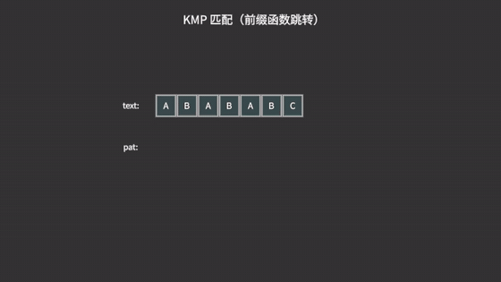
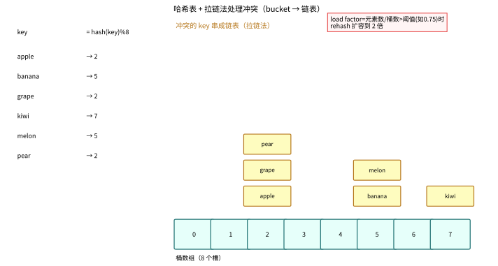
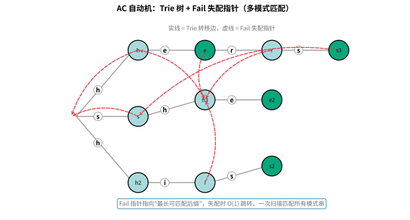
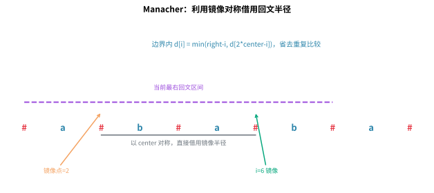
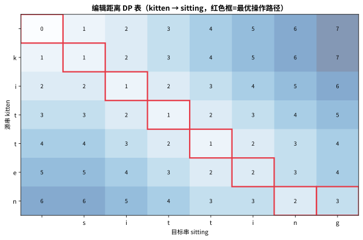
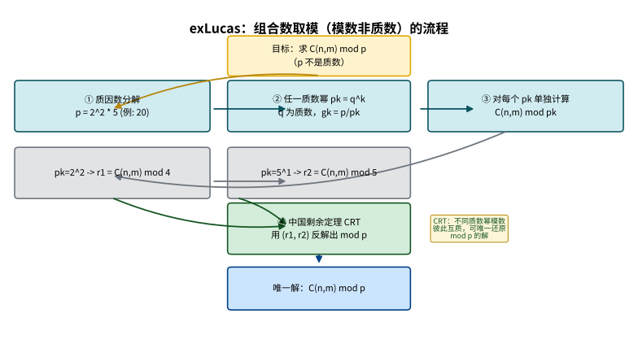

# 第七章：字符串算法

> 字符串是计算机科学中最基本的数据类型之一。从文本编辑器中的搜索替换，到 DNA 序列的比对，再到搜索引擎的关键词匹配，字符串算法无处不在。掌握字符串算法，是成为一名优秀程序员的必经之路。

---

## 7.1 字符串基础

### 为什么学这个？
字符串是程序与人交互的主要方式。无论是网页表单的输入验证、日志文件的分析，还是自然语言处理，都离不开对字符串的基本操作。理解字符串的底层表示和操作复杂度，能帮助你写出更高效的代码。

### Python 中的字符串表示

在 Python 中，字符串是不可变（immutable）的序列类型，使用单引号、双引号或三引号表示：

```python
s1 = 'hello'
s2 = "world"
s3 = '''Python 字符串'''
```

Python 的字符串在内存中以 Unicode 编码存储（Python 3 默认使用 Unicode），每个字符都是 Unicode 码点。底层的具体实现（CPython）会根据字符串内容选择不同的内部表示方式：
- **ASCII / Latin-1**：如果所有字符都在 0-255 范围内，每个字符占 1 字节
- **UCS-2**：如果有字符在 256-65535 范围内，每个字符占 2 字节
- **UCS-4**：如果有字符超过 65535，每个字符占 4 字节

### 字符串切片、连接与比较

**切片（Slicing）**：时间复杂度 O(k)，其中 k 是切片长度（Python 会创建新的字符串）

```python
s = "Hello, World!"
print(s[0:5])    # "Hello"
print(s[7:])     # "World!"
print(s[::-1])   # "!dlroW ,olleH"（反转）
```

**连接（Concatenation）**：
- 使用 `+` 连接两个字符串：O(n + m)，会创建新字符串
- 使用 `join()` 连接多个字符串：O(n)，更高效（预先分配内存）
- 使用 f-string 格式化：O(n)

```python
# 高效连接大量字符串
words = ["Hello", "World", "Python"]
s = " ".join(words)  # "Hello World Python"

# 不高效的方式（循环中使用 +）
result = ""
for w in words:
    result += w  # 每次都会创建新字符串，O(n²)
```

**比较（Comparison）**：按字典序比较，最坏情况 O(min(n, m))

```python
print("apple" < "banana")  # True
print("abc" == "abc")      # True
```

### 字符编码

**ASCII**：使用 7 位或 8 位编码，表示 128 个基本字符（英文字母、数字、标点符号和控制字符）。

**Unicode**：通用字符集，为世界上几乎所有字符分配了唯一的码点（code point）。Python 3 的字符串就是 Unicode 字符串。

**UTF-8**：Unicode 的可变长度编码方式，兼容 ASCII，是网络传输和文件存储中最常用的编码。

```python
# 编码与解码
s = "你好，世界"
encoded = s.encode("utf-8")    # b'\xe4\xbd\xa0...'
decoded = encoded.decode("utf-8")  # "你好，世界"

# 获取字符的 Unicode 码点
print(ord('A'))    # 65
print(ord('中'))   # 20013
print(chr(65))     # 'A'
```

### 字符串常用操作复杂度总结

| 操作 | 时间复杂度 | 说明 |
|------|-----------|------|
| 索引 `s[i]` | O(1) | 直接访问 |
| 切片 `s[i:j]` | O(k) | 复制 k 个字符 |
| 连接 `s + t` | O(n+m) | 创建新字符串 |
| `len(s)` | O(1) | 预存储长度 |
| `in` 子串检查 | O(n) 平均 | 底层使用高效算法 |
| `s.find(t)` | O(nm) 最坏 | 朴素匹配，但通常很快 |

---

## 7.2 字符串匹配

字符串匹配（模式匹配）是字符串算法中最核心的问题：给定一个**文本串** text 和一个**模式串** pattern，找出 pattern 在 text 中的所有出现位置。

> 参考维基百科：[字符串](https://en.wikipedia.org/wiki/String_(computer_science))

### 7.2.1 朴素匹配（Naive Matching）

**为什么学这个？**
朴素匹配是理解所有高级匹配算法的基础。虽然效率不高，但它的思想简单直观，适合在短文本或简单场景下使用。

**算法思想**：
将模式串与文本串的每个位置对齐，逐字符比较。如果发现不匹配，模式串右移一位，重新开始比较。

**时间复杂度**：O(n × m)，其中 n 为文本长度，m 为模式长度

```python
def naive_search(text: str, pattern: str) -> list[int]:
    """
    朴素字符串匹配算法
    
    Args:
        text: 文本串
        pattern: 模式串
    
    Returns:
        所有匹配起始位置的列表
    """
    n, m = len(text), len(pattern)
    positions = []
    
    if m == 0:
        return []
    
    for i in range(n - m + 1):
        match = True
        for j in range(m):
            if text[i + j] != pattern[j]:
                match = False
                break
        if match:
            positions.append(i)
    
    return positions


# 示例
text = "ABCABCABAB"
pattern = "ABAB"
print(naive_search(text, pattern))  # [4]
```

**优化点**：当字符集很大时，可以提前跳出循环。但最坏情况（如 `text = "AAAAAA"`, `pattern = "AAAB"`）仍需 O(nm)。

> 🎬 **可视化演示**：朴素匹配（每次失配，主串指针回退、模式串右移一位从头重来）


### 7.2.2 拉宾-卡普算法（Rabin-Karp）

**为什么学这个？**
拉宾-卡普算法将字符串比较转化为哈希值比较，将 O(m) 的字符比较降为 O(1) 的哈希比较。它特别适合**多模式匹配**（同时搜索多个模式串）和**检测抄袭**等场景。

> 参考维基百科：[拉宾-卡普算法](https://en.wikipedia.org/wiki/Rabin%E2%80%93Karp_algorithm)

**算法思想**：
1. 计算模式串的哈希值
2. 计算文本中每个长度为 m 的子串的哈希值（使用**滚动哈希**，O(1) 更新时间）
3. 仅当哈希值相等时，才进行逐字符验证（以处理哈希冲突）

> 💡 **类比：拉宾-卡普如同身份证核验**
> 想象你要在1000人中找出某个特定的人。朴素方法是逐个比对姓名、年龄、地址（逐字符比较）。拉宾-卡普的做法是：先计算目标人的"身份证号"（哈希值），然后只比对每个人的身份证号——如果身份证号不匹配，直接跳过；只有身份证号匹配时，才仔细核对详细信息。这样大多数情况下只需O(1)的哈希比较，只有少数"哈希冲突"时才需要逐字符验证。滚动哈希的精妙之处在于：窗口滑动时，新哈希值可以从旧哈希值O(1)推导出来，就像你从"张三的身份证"快速算出"张四的身份证"一样。

**滚动哈希（Rolling Hash）**：
选择一个基数 base 和模数 mod，哈希函数为：
```
hash(s) = (s[0] * base^(m-1) + s[1] * base^(m-2) + ... + s[m-1]) % mod
```

当窗口从 i 移动到 i+1 时：
```
new_hash = ((old_hash - text[i] * base^(m-1)) * base + text[i+m]) % mod
```

```python
def rabin_karp(text: str, pattern: str, base: int = 256, mod: int = 10**9 + 7) -> list[int]:
    """
    拉宾-卡普字符串匹配算法
    
    Args:
        text: 文本串
        pattern: 模式串
        base: 哈希基数（通常取 256 或更大的质数）
        mod: 哈希模数（大质数以减少冲突）
    
    Returns:
        所有匹配起始位置的列表
    """
    n, m = len(text), len(pattern)
    if m == 0 or n < m:
        return []
    
    # 预计算 base^(m-1) % mod
    h = pow(base, m - 1, mod)
    
    # 计算模式串的哈希值
    pattern_hash = 0
    for ch in pattern:
        pattern_hash = (pattern_hash * base + ord(ch)) % mod
    
    # 计算文本第一个窗口的哈希值
    text_hash = 0
    for i in range(m):
        text_hash = (text_hash * base + ord(text[i])) % mod
    
    positions = []
    
    for i in range(n - m + 1):
        # 哈希值匹配时，进行逐字符验证
        if text_hash == pattern_hash:
            if text[i:i + m] == pattern:
                positions.append(i)
        
        # 滚动哈希：计算下一个窗口
        if i < n - m:
            text_hash = (text_hash - ord(text[i]) * h) % mod
            text_hash = (text_hash * base + ord(text[i + m])) % mod
            # Python 的 % 可能产生负数，确保为正
            if text_hash < 0:
                text_hash += mod
    
    return positions


# 示例
text = "ABCABCABAB"
pattern = "ABAB"
print(rabin_karp(text, pattern))  # [4]

# 多模式匹配示例
def rabin_karp_multi(text: str, patterns: list[str], base: int = 256, mod: int = 10**9 + 7) -> dict[str, list[int]]:
    """支持多模式匹配的拉宾-卡普算法"""
    if not patterns:
        return {}
    
    # 按模式长度分组（滚动哈希要求所有模式长度相同）
    # 实际应用中，可以分别处理不同长度
    result = {}
    for pattern in patterns:
        result[pattern] = rabin_karp(text, pattern, base, mod)
    return result
```

**时间复杂度**：平均 O(n + m)，最坏 O(nm)（当大量哈希冲突时）

**双哈希**：使用两个不同的模数来降低冲突概率，进一步提高可靠性。

### 7.2.3 KMP 算法（Knuth-Morris-Pratt）

**为什么学这个？**
KMP 是字符串匹配领域的经典算法，它通过巧妙的"前缀函数"避免了朴素匹配中的重复比较。在文本编辑器、词法分析器、生物信息学等领域有广泛应用。理解 KMP 是掌握更复杂字符串算法的基石。

> 参考维基百科：[KMP算法](https://en.wikipedia.org/wiki/Knuth%E2%80%93Morris%E2%80%93Pratt_algorithm)

**算法思想**：
KMP 的核心思想是：当模式串与文本串在某位置不匹配时，利用已经匹配部分的信息，将模式串向右移动尽可能多的距离，避免从头开始比较。

**前缀函数（Prefix Function）** π[i] 定义：模式串的前缀 `pattern[0..i]` 中，最长的相等真前缀和真后缀的长度。

例如，对于 `pattern = "ABAB"`：
- π[0] = 0（"A" 没有真前缀和真后缀）
- π[1] = 0（"AB" 的前缀 "A" ≠ 后缀 "B"）
- π[2] = 1（"ABA" 的前缀 "A" = 后缀 "A"）
- π[3] = 2（"ABAB" 的前缀 "AB" = 后缀 "AB"）

> 💡 **类比：跳绳时"哪里断了就从哪里接"**
> 朴素匹配像"每次断线都从头重新编"，浪费大量工作。KMP 则观察已经编好的部分：**如果这截绳子的开头和结尾有重复的花样（前后缀相同），失配时就不用从头开始，而是直接退到"重复花样"那里继续**。前缀函数就是提前把"每截绳子重复的花样长度"算好的一张表，失配时按表跳转，主串的指针始终不回头。下图展示了前缀函数的计算与失配跳转：


> 🎬 **可视化演示**：KMP 匹配过程（失配时按前缀函数 `pi` 跳转，主串指针不回溯）



```python
def compute_prefix_function(pattern: str) -> list[int]:
    """
    计算 KMP 前缀函数
    
    Args:
        pattern: 模式串
    
    Returns:
        π 数组，π[i] 表示 pattern[0..i] 的最长相等真前后缀长度
    """
    m = len(pattern)
    pi = [0] * m
    k = 0  # 当前匹配的前缀长度
    
    for i in range(1, m):
        # 当不匹配时，回退到之前的最长前缀
        while k > 0 and pattern[i] != pattern[k]:
            k = pi[k - 1]
        
        # 如果匹配，前缀长度加 1
        if pattern[i] == pattern[k]:
            k += 1
        
        pi[i] = k
    
    return pi


**前缀函数递推计算详解**：

前缀函数的计算过程是一个动态规划 + 递推的过程：

1. **初始状态**：`pi[0] = 0`，单个字符没有真前后缀
2. **递推关系**：假设已知 `pi[0..i-1]`，要计算 `pi[i]`。设 `k = pi[i-1]`，即前一个位置的最长相等前后缀长度
   - 如果 `pattern[i] == pattern[k]`，则 `pi[i] = k + 1`（可以直接扩展）
   - 如果不相等，则回退到 `k = pi[k-1]`（利用更短的前后缀），继续比较，直到 `k = 0` 或找到匹配

**为什么可以用 `pi[k-1]` 回退？**

当 `pattern[i] != pattern[k]` 时，我们无法直接扩展当前的前后缀。但更短的相等前后缀可能存在于之前已经计算过的结果中。由于 `pi[k-1]` 已经记录了 `pattern[0..k-1]` 的最长相等前后缀长度，我们可以利用这个信息快速回退，而不需要从头开始匹配。

**前缀函数在匹配阶段的作用**：

在 KMP 匹配过程中，当 `text[i] != pattern[k]` 时，我们利用 `pi[k-1]` 回退模式串指针 `k`：
- `k = pi[k-1]` 意味着将模式串向右滑动，使得已经匹配的部分的前缀与文本串的后缀对齐
- 文本指针 `i` 从不回溯，这是 KMP 线性时间的关键

**前缀函数可视化**：
```
pattern = "ABAB"
i=0: A     pi[0]=0  (无真前后缀)
i=1: AB    pi[1]=0  ("A"≠"B")
i=2: ABA   pi[2]=1  ("A"="A")
i=3: ABAB  pi[3]=2  ("AB"="AB")
```


def kmp_search(text: str, pattern: str) -> list[int]:
    """
    KMP 字符串匹配算法
    
    Args:
        text: 文本串
        pattern: 模式串
    
    Returns:
        所有匹配起始位置的列表
    """
    n, m = len(text), len(pattern)
    if m == 0:
        return []
    
    # 计算前缀函数
    pi = compute_prefix_function(pattern)
    
    positions = []
    k = 0  # 当前匹配的模式串字符数
    
    for i in range(n):
        # 当不匹配时，利用前缀函数回退
        while k > 0 and text[i] != pattern[k]:
            k = pi[k - 1]
        
        if text[i] == pattern[k]:
            k += 1
        
        # 完全匹配
        if k == m:
            positions.append(i - m + 1)
            k = pi[k - 1]  # 继续搜索下一个匹配
    
    return positions


# 示例
text = "ABABABABCABAB"
pattern = "ABAB"
print(kmp_search(text, pattern))  # [0, 2, 4, 9]

# 可视化前缀函数
pattern = "ABAB"
print(f"前缀函数: {compute_prefix_function(pattern)}")  # [0, 0, 1, 2]
```

**时间复杂度**：O(n + m)，线性时间，是最优的字符串匹配算法之一。

**KMP 相比朴素匹配的优势**：
- 朴素匹配在失配时只右移 1 位
- KMP 利用前缀函数，可以右移多位
- 文本指针从不回溯，适合处理流式数据

### 7.2.4 Z 算法（Z Function）

**为什么学这个？**
Z 算法是又一个线性时间的字符串匹配算法，它和 KMP 各有千秋。Z 算法的实现更直观，且除了匹配外，还能解决许多字符串周期性问题。

**算法思想**：
定义 Z 数组 `Z[i]` 表示从位置 i 开始的子串与整个字符串的最长公共前缀（LCP）的长度。

例如，对于 `s = "ABCABCAB"`：
- Z[0] = 0（通常定义为 0）
- Z[1] = 0（"BC..." 与 "ABC..." 无公共前缀）
- Z[2] = 0
- Z[3] = 3（"ABC..." 与 "ABC..." 匹配 3 个字符）
- Z[4] = 0
- Z[5] = 0
- Z[6] = 2（"AB..." 与 "ABC..." 匹配 2 个字符）

> 💡 **类比：Z 算法如同"照镜子"**
> 想象你站在镜子前，Z 函数就是计算每个位置"像镜子一样"能反射出多少和开头相同的字符。比如字符串 "ABCABCAB"，位置 3 的 Z 值是 3，意味着从位置 3 开始的子串 "ABCAB" 和原字符串开头 "ABC" 完全相同，匹配了 3 个字符。Z 算法的精妙之处在于：它维护一个"Z-box"（已经匹配过的最右边界），利用这个边界内的已知信息避免重复计算——就像你已经知道某段区域是"对称的"，就不需要再逐个字符去验证。

```python
def z_function(s: str) -> list[int]:
    """
    计算 Z 函数
    
    Args:
        s: 输入字符串
    
    Returns:
        Z 数组，Z[i] 为 s[i:] 与 s 的最长公共前缀长度
    """
    n = len(s)
    z = [0] * n
    l = r = 0  # 当前 Z-box 的左右边界 [l, r)
    
    for i in range(1, n):
        if i < r:
            # 在 Z-box 内，利用之前计算的结果
            z[i] = min(r - i, z[i - l])
        
        # 朴素扩展
        while i + z[i] < n and s[z[i]] == s[i + z[i]]:
            z[i] += 1
        
        # 更新 Z-box
        if i + z[i] > r:
            l = i
            r = i + z[i]
    
    return z


def z_algorithm_search(text: str, pattern: str) -> list[int]:
    """
    使用 Z 算法进行字符串匹配
    
    思路：构造新串 s = pattern + '$' + text，然后计算 Z 函数
    当 Z[i] == len(pattern) 时，说明找到一个匹配
    
    Args:
        text: 文本串
        pattern: 模式串
    
    Returns:
        所有匹配起始位置的列表
    """
    if not pattern:
        return []
    
    # 使用一个分隔符连接模式串和文本串
    concat = pattern + '$' + text
    z = z_function(concat)
    
    m = len(pattern)
    positions = []
    
    for i in range(m + 1, len(concat)):
        if z[i] == m:
            positions.append(i - m - 1)
    
    return positions


# 示例
text = "ABCABCABAB"
pattern = "ABAB"
print(z_algorithm_search(text, pattern))  # [4]

# Z 函数的其他应用：计算每个位置的 LCP
s = "ABCABCAB"
print(f"Z 函数: {z_function(s)}")  # [0, 0, 0, 3, 0, 0, 2, 0]
```

**时间复杂度**：O(n)，Z-box 的维护保证了每个字符最多被比较一次。

### 7.2.5 匹配算法对比总结

| 算法 | 时间复杂度 | 空间复杂度 | 文本指针回溯 | 多模式匹配 | 实现难度 | 特点 |
|------|-----------|-----------|:----------:|:---------:|:-------:|------|
| **朴素匹配** | O(nm) | O(1) | 是 | 否 | ⭐ 简单 | 实现最简单，适合短模式串或小字符集 |
| **Rabin-Karp** | 平均 O(n+m)，最坏 O(nm) | O(1) | 是 | ✅ 是 | ⭐⭐ 中等 | 使用滚动哈希，适合多模式匹配和 plagiarism 检测 |
| **KMP** | O(n+m) | O(m) | 否 | 否 | ⭐⭐⭐ 较难 | 文本指针不回溯，理论最优，适合流式数据 |
| **Z 算法** | O(n+m) | O(n+m) | 否 | 否 | ⭐⭐ 中等 | 实现简洁，可同时解决 LCP 和字符串周期问题 |

Rabin-Karp 算法中使用的**滚动哈希（Rolling Hash）**，其核心思想来源于哈希表——通过哈希函数将字符串映射为整数值，实现 O(1) 的子串比较：



### 7.2.6 各种字符串算法的适用场景

以下是本章涵盖的所有字符串算法的适用场景总结，帮助你根据实际问题选择合适的算法：

| 算法/数据结构 | 适用场景 | 不适用场景 |
|:-----------|:--------|:----------|
| **朴素匹配** | 模式串极短（≤5）；文本很短；作为其他算法的正确性基准 | 长文本 + 长模式串；大量重复字符的文本 |
| **Rabin-Karp** | 多模式匹配（如同时搜索多个关键词）； plagiarism 检测；需要 O(1) 子串比较的场景 | 需要保证最坏情况线性时间；模式串长度差异很大 |
| **KMP** | 需要稳定线性时间；处理流式数据（文本指针不回溯）；在只读介质上搜索 | 需要多模式匹配；实现和理解成本较高 |
| **Z 算法** | 需要同时计算 LCP；字符串周期性问题；作为 KMP 的替代方案 | 大规模文本中只需单次匹配（KMP 空间更优） |
| **字符串哈希** | 频繁比较子串是否相等；配合二分查找解决 LCP、最长回文等问题；快速去重 | 需要绝对精确（哈希冲突不可接受）；输入数据由攻击者构造（可能被哈希碰撞攻击） |
| **Trie（字典树）** | 前缀匹配（自动补全、拼写检查）；词根替换；IP 路由表最长前缀匹配；词频统计 | 字符串集很大但共享前缀很少；需要模糊匹配 |
| **Manacher** | 求最长回文子串及其变体（回文子串数量、回文串分割等） | 不需要回文相关的问题 |
| **后缀数组 + LCP** | 最长重复子串、不同子串数量、最长公共子串、子串排名查询 | 只需要单次简单匹配（KMP 更直接）；需要动态更新字符串 |

**综合选择流程**：
1. 先确定问题类型——匹配问题？前缀问题？回文问题？子串比较问题？
2. 再考虑数据规模——小规模数据用简单算法即可
3. 最后考虑性能要求——是否需要线性时间？是否支持多模式？是否在流式环境中运行？

### 7.2.7 AC 自动机（Aho-Corasick）

> 💡 **类比：AC 自动机如同"体检中心的导诊地图"** 想象你拿着一张写着多个检查项目的单子，要在一栋大楼里按顺序做一个项目列表的检查。朴素做法是每查一个项目就从头找一遍，太慢。AC 自动机相当于一张**带"抄近路"标记的地图**：把要查的所有项目（模式串）先画进一棵 Trie 树，然后给每个节点标好一条"失配快捷通道"（fail 指针）——当走岔了时不用回起点，直接从最近的可复用前缀继续。这样你拿着文本从头到尾走一遍，就能同时查出所有模式串是否出现。



**AC 自动机（Aho-Corasick Automaton）**是一种**多模式匹配**算法，能在 $O(n + \sum m + \text{出现次数})$ 时间内扫描文本，同时匹配**所有**模式串。它由两部分组成：

- **Trie 树**：把所有模式串插入一棵字典树。
- **Fail 失配指针**：每个节点记录一个"失配时跳转的节点"，指向当前前缀的**最长真后缀**所对应的节点。当文本中的字符在某个分支匹配失败时，沿 fail 指针跳到可继续匹配的位置，保证一次扫描不回溯文本指针。

**构建 fail 指针**：根节点 fail 指向自己；对每个节点，其 fail 指向"父节点的 fail 节点中，具有相同转移字符的子节点"（若不存在则再沿 fail 继续找，归根为根节点）。用 BFS 逐层构建。

**匹配过程**：从根出发，逐个读入文本字符；若当前节点有该字符的转移边则沿转移，否则沿 fail 指针回退后重试；每到一个节点都要沿 fail 链检查是否有模式串终点（标记为匹配）。

**复杂度**：预处理 $O(\sum m)$，匹配 $O(n)$。

**Python 实现**：

```python
from collections import deque

class ACAutomaton:
    def __init__(self):
        self.next = [{}]      # 转移表
        self.fail = [0]       # 失配指针
        self.out = [set()]    # 每个节点命中的模式串

    def insert(self, word):
        node = 0
        for ch in word:
            if ch not in self.next[node]:
                self.next[node][ch] = len(self.next)
                self.next.append({})
                self.fail.append(0)
                self.out.append(set())
            node = self.next[node][ch]
        self.out[node].add(word)

    def build(self):
        q = deque()
        for ch, nxt in self.next[0].items():
            q.append(nxt)
        while q:
            u = q.popleft()
            for ch, v in self.next[u].items():
                q.append(v)
                # 沿父节点的 fail 找最长真后缀
                f = self.fail[u]
                while f and ch not in self.next[f]:
                    f = self.fail[f]
                self.fail[v] = self.next[f].get(ch, 0)
                self.out[v] |= self.out[self.fail[v]]

    def search(self, text):
        """返回所有命中的模式串"""
        node, hits = 0, []
        for ch in text:
            while node and ch not in self.next[node]:
                node = self.fail[node]
            node = self.next[node].get(ch, 0)
            hits.extend(self.out[node])
        return hits
```

**应用场景**：敏感词过滤、多关键词检索、病毒特征码匹配、文本信息抽取。

### 7.2.8 Boyer-Moore 字符串匹配

**为什么学这个？**
Boyer-Moore（BM 算法）是实际应用中最快的单模式匹配算法之一。它打破了朴素匹配"从左往右逐位比较"的惯性，改为从模式串的**末尾**向前比较，并在失配时利用两条启发式规则**大步跳跃**，从而跳过大量无需比较的位置。文本编辑器的"查找"、拼写检查、病毒特征匹配等场景常采用它。

**算法思想**：
BM 的核心是在失配时尽量让模式串向右多移动几步，主要依赖两条规则：
1. **坏字符规则（Bad Character）**：当从右往左比较到某个字符失配（文本中的字符记为 `c`）时，查看 `c` 在模式串中最后一次出现的位置 `p`；若 `p` 存在，则把模式串右移使 `c` 与 `p` 对齐，否则直接把模式串整体跳过 `c`。
2. **好后缀规则（Good Suffix）**：当失配时，已经匹配的后缀部分可以复用此前缀匹配的信息，右移使得"好后缀"与模式串中前一个相同子串对齐。

> 💡 **类比：Boyer-Moore 如同"从右往左核对，遇到对不上就大步跳过"**
> 想象你在长名单里核对一个编号，通常是从右往左快速扫（因为右边的数字差异大、更容易发现不对）。BM 也一样：从模式串末尾开始比对，一旦某个字符对不上，就根据"这个字符在模式串里是否出现过、出现在哪"来决定**一次性跳过多少位**——而不是像朴素匹配那样只挪一格。这样绝大多数位置连比都不用比就被跳过了，因此平均速度非常快。

**坏字符规则示例**：
```
text   = G C A T C G C A G A G A（从第 0 位开始）
pattern= G C A G A G
```
从末尾 `G` 对齐比较，若在位置 `k` 处文本字符 `C` 与模式串失配，而 `C` 在模式串中最后出现的位置是 `1`，则右移 `k - 1` 位直接让 `C` 对齐。

**简化版 Python 实现（聚焦坏字符规则，体现"从右往左 + 大步跳跃"思想）**：

```python
def boyer_moore(text: str, pattern: str) -> list[int]:
    """
    Boyer-Moore 简化实现（坏字符规则）
    
    Args:
        text: 文本串
        pattern: 模式串
    
    Returns:
        所有匹配起始位置的列表
    """
    n, m = len(text), len(pattern)
    if m == 0:
        return []

    # 预处理：记录每个字符在模式串中最后一次出现的位置
    right = {}
    for i, ch in enumerate(pattern):
        right[ch] = i

    positions = []
    skip = 0  # 当前窗口的起始偏移
    while skip <= n - m:
        # 从模式串末尾向前比较
        j = m - 1
        while j >= 0 and pattern[j] == text[skip + j]:
            j -= 1
        if j < 0:
            # 完全匹配
            positions.append(skip)
            skip += 1  # 继续找下一个
        else:
            # 坏字符规则：文本中失配的字符
            bad_char = text[skip + j]
            # 若该字符在模式串中最后出现于位置 p，则右移 j - p；否则右移 j + 1
            shift = j - right.get(bad_char, -1)
            skip += max(1, shift)  # 至少右移 1 位

    return positions


# 示例
text = "GCATCGCAGAGAGTATACAGTACG"
pattern = "GCAGAGAG"
print(boyer_moore(text, pattern))
```

**时间复杂度**：平均 $O(n)$（实际接近 $O(n/m)$ 的超线性速度），最坏 $O(nm)$（可结合好后缀规则保证最坏 $O(n)$）。

**适用场景**：大文本单模式搜索、编辑器"查找/替换"、病毒特征串匹配、网络内容过滤。

### 7.2.9 Sunday 字符串匹配

**为什么学这个？**
Sunday 算法是另一种基于跳跃思想的单模式匹配算法，比 Boyer-Moore 更简单、更易实现，但平均性能同样出色。它规则少、常数小，在很多实际场景（尤其是中英文混合文本）中表现优异，是性价比很高的匹配方案。

**算法思想**：
Sunday 与 BM 一样从"失配后尽量多跳"出发，但规则更直观：每次比较当前窗口**是否匹配**，无论是否匹配，在移动窗口时都看主串中"窗口后一位"的字符 `text[i + m]`：
- 若该字符在模式串中出现于位置 `p`，则把模式串右移，使 `text[i + m]` 与 `pattern[p]` 对齐，即右移 `m - p` 位；
- 若该字符不在模式串中，说明包含它的任何窗口都不可能匹配，直接右移 `m + 1` 位跳过它。

> 💡 **类比：Sunday 如同"看看下家再决定迈几步"**
> 想象一排按固定长度滑动的观察框，每次对齐后你先看框内是否完全吻合；无论符不符，移动时都**先看框后面紧挨着的那一个字符**——如果这个"下一位"字符根本不在要找的词里，那它进入框内的任何位置都不可能匹配，索性一步跨过；如果它在词里，就跳到能让它对上词里对应位置的地方。这样每次都能跳过一大段，效率很高。

**Python 实现**：

```python
def sunday_search(text: str, pattern: str) -> list[int]:
    """
    Sunday 字符串匹配算法
    
    Args:
        text: 文本串
        pattern: 模式串
    
    Returns:
        所有匹配起始位置的列表
    """
    n, m = len(text), len(pattern)
    if m == 0:
        return []

    # 预处理：记录每个字符在模式串中最后一次出现的位置
    # 从右往左遍历，后出现的会覆盖先出现的
    shift = {}
    for i in range(m):
        shift[pattern[i]] = m - i

    positions = []
    i = 0
    while i <= n - m:
        # 检查当前窗口是否匹配
        if text[i:i + m] == pattern:
            positions.append(i)
        # 关键：看"窗口后一位"字符决定跳跃距离
        if i + m >= n:
            break
        ch = text[i + m]
        if ch in shift:
            i += shift[ch]      # 跳到让 ch 与模式串中对应位置对齐
        else:
            i += m + 1          # 该字符不在模式串中，整体跳过
    return positions


# 示例
text = "ABCABCABAB"
pattern = "ABAB"
print(sunday_search(text, pattern))  # [4]
```

**时间复杂度**：平均 $O(n)$，最坏 $O(nm)$。

**适用场景**：与 Boyer-Moore 类似，适合大文本单模式搜索；实现简单、无预处理表维护负担，适合作为面试快速实现方案。

### 7.2.10 exKMP（Z 函数的扩展）

**为什么学这个？**
扩展 KMP（exKMP / Z 函数扩展）解决的问题是：给定两个字符串 $a$ 和 $b$，求 $a$ 的**每个后缀**与 $b$ 的**最长公共前缀（LCP）**。它把 Z 算法从"一个串与自身"推广到"两个串之间"，是单模式匹配、求最长公共前缀类问题的利器，线性时间内即可完成。

**算法思想**：
exKMP 维护一个已匹配区间 $[l, r]$（表示 $a[l..r)$ 与 $b[0..r-l)$ 完全一致），当处理位置 $i$ 时：
- 若 $i < r$，则利用 $b$ 的 Z 值直接初始化 $extend[i] = \min(r - i, z[i - l])$，避免重复比较；
- 然后继续朴素扩展，并据此更新区间 $[l, r]$。

通过复用区间信息，每个字符最多被比较一次，总复杂度 $O(n)$。

> 💡 **类比：exKMP 如同"知道前面某段完全相同，后面就照着抄"**
> 想象你已经确认"从位置 l 开始、a 与 b 的开头完全一致地匹配了 r-l 个字符"，那么当你要算更靠后的位置 i 时，如果 i 落在这个已确认区间内，就可以直接借用 b 的 Z 值（b 与自身匹配的对称信息）**抄一段已知结果**，而不必重新逐字符比对。就像你知道了某段路况，后面的相似路段就不用再探一遍。

**Python 实现**：

```python
def z_function(s: str) -> list[int]:
    """计算字符串 s 的 Z 函数"""
    n = len(s)
    z = [0] * n
    l = r = 0
    for i in range(1, n):
        if i < r:
            z[i] = min(r - i, z[i - l])
        while i + z[i] < n and s[z[i]] == s[i + z[i]]:
            z[i] += 1
        if i + z[i] > r:
            l, r = i, i + z[i]
    return z


def exkmp(a: str, b: str) -> list[int]:
    """
    扩展 KMP：求 a 的每个后缀与 b 的最长公共前缀长度
    
    Args:
        a: 文本串
        b: 模式串
    
    Returns:
        extend[i] = LCP(a[i:], b)
    """
    n, m = len(a), len(b)
    # 先对 b 求 Z 函数（b 与自身的最长公共前缀）
    z = z_function(b)

    extend = [0] * n
    l = r = 0  # 当前匹配区间 [l, r)
    for i in range(n):
        if i < r:
            extend[i] = min(r - i, z[i - l])
        # 朴素扩展
        while (i + extend[i] < n and extend[i] < m
               and a[i + extend[i]] == b[extend[i]]):
            extend[i] += 1
        # 更新匹配区间
        if i + extend[i] > r:
            l, r = i, i + extend[i]
    return extend


# 示例
a = "ababca"
b = "aba"
print(exkmp(a, b))
# extend[0] = LCP("ababca","aba") = 3
# extend[1] = LCP("babca","aba")  = 0
# extend[2] = LCP("abca","aba")   = 2
# extend[3] = LCP("bca","aba")    = 0
# extend[4] = LCP("ca","aba")     = 0
# extend[5] = LCP("a","aba")      = 1
```

**时间复杂度**：$O(n + m)$，线性时间。

**适用场景**：求一个串的所有后缀与模式串的 LCP；求两个串的公共前缀问题；作为 KMP、Z 算法的统一扩展，可解决"前缀匹配 + 计数"等一系列问题。

---

## 7.3 字符串处理

### 7.3.1 字符串哈希（String Hashing）

**为什么学这个？**
字符串哈希可以将字符串的比较转化为 O(1) 的整数比较，是解决许多字符串问题的利器。配合二分查找，还能解决最长公共前缀、最长回文子串等问题。

**多项式哈希（Polynomial Hash）**：

```
hash(s) = (s[0] * base^(n-1) + s[1] * base^(n-2) + ... + s[n-1]) % mod
```

其中 base 通常取 131、137 或 256，mod 取大质数如 10^9 + 7 或 10^9 + 9。

```python
class StringHasher:
    """
    字符串哈希工具类
    
    支持计算任意子串的哈希值，O(1) 时间
    使用多项式哈希（滚动哈希）
    """
    
    def __init__(self, s: str, base: int = 131, mod: int = 10**9 + 7):
        self.n = len(s)
        self.base = base
        self.mod = mod
        
        # 前缀哈希：h[i] 表示 s[0..i-1] 的哈希值
        self.h = [0] * (self.n + 1)
        # 预计算 base 的幂
        self.p = [1] * (self.n + 1)
        
        for i in range(self.n):
            self.h[i + 1] = (self.h[i] * base + ord(s[i])) % mod
            self.p[i + 1] = (self.p[i] * base) % mod
    
    def get_hash(self, l: int, r: int) -> int:
        """
        获取子串 s[l..r-1] 的哈希值
        
        Args:
            l: 左边界（包含）
            r: 右边界（不包含）
        
        Returns:
            子串的哈希值
        """
        if l >= r:
            return 0
        # hash(s[l..r-1]) = h[r] - h[l] * base^(r-l)
        res = (self.h[r] - self.h[l] * self.p[r - l]) % self.mod
        return res if res >= 0 else res + self.mod


class DoubleHasher:
    """
    双哈希：使用两个模数，大幅降低冲突概率
    """
    
    def __init__(self, s: str, base: int = 131):
        self.mod1 = 10**9 + 7
        self.mod2 = 10**9 + 9
        self.hasher1 = StringHasher(s, base, self.mod1)
        self.hasher2 = StringHasher(s, base, self.mod2)
    
    def get_hash(self, l: int, r: int) -> tuple[int, int]:
        """返回双哈希值 (h1, h2)"""
        return (self.hasher1.get_hash(l, r),
                self.hasher2.get_hash(l, r))


# 示例：使用字符串哈希比较子串
s = "hello world"
hasher = StringHasher(s)

# 比较 "hello" 和 "world"
h1 = hasher.get_hash(0, 5)   # "hello" 的哈希值
h2 = hasher.get_hash(6, 11)  # "world" 的哈希值
print(f"h1 == h2: {h1 == h2}")  # False

# 双哈希
double_hasher = DoubleHasher(s)
print(double_hasher.get_hash(0, 5))
```

**哈希冲突处理**：
1. **使用大质数模数**（如 10^9 + 7）
2. **双哈希**：使用两个不同模数，两个哈希值都相等才认为相等
3. **冲突时逐字符验证**：像 Rabin-Karp 那样

### 7.3.2 字典树（Trie / 前缀树）

**为什么学这个？**
Trie 是处理字符串前缀匹配的终极数据结构。从搜索引擎的自动补全、拼写检查，到 IP 路由表的最长前缀匹配，Trie 无处不在。

> 💡 **类比：Trie 如同手机通讯录的自动补全**
> 想象你打开手机通讯录输入 "App"，手机立刻弹出 "Apple"、"App Store"、"Appium" 等候选——这就是 Trie 在工作。Trie 就像一棵"字母树"：从树根出发，第一层是首字母 A/B/C...，第二层是第二个字母，依此类推。不同单词共享相同的前缀路径，就像 "apple" 和 "app" 共享 "a-p-p" 这段树干，只在最后分叉。查找一个词只需沿着字母路径走下去，走得到就是存在，走不到就是不存在——比逐个单词比对快得多。

**算法思想**：
Trie 是一棵多叉树，每个节点代表一个字符，从根到叶子的路径表示一个字符串。不同字符串共享公共前缀。

下图展示了一个包含 "apple"、"app"、"application" 等单词的 Trie 结构：


```python
class TrieNode:
    """字典树节点"""
    
    def __init__(self):
        self.children: dict[str, 'TrieNode'] = {}
        self.is_end: bool = False       # 是否是一个完整单词的结尾
        self.count: int = 0             # 以该节点结尾的单词数量（可选）


class Trie:
    """
    字典树（前缀树）
    
    支持操作：
    - insert(word): 插入单词
    - search(word): 搜索完整单词
    - starts_with(prefix): 搜索前缀
    - count_words_with_prefix(prefix): 统计具有某前缀的单词数
    """
    
    def __init__(self):
        self.root = TrieNode()
    
    def insert(self, word: str) -> None:
        """插入一个单词到字典树中"""
        node = self.root
        for ch in word:
            if ch not in node.children:
                node.children[ch] = TrieNode()
            node = node.children[ch]
        node.is_end = True
        node.count += 1
    
    def search(self, word: str) -> bool:
        """搜索完整单词是否存在于字典树中"""
        node = self._find_node(word)
        return node is not None and node.is_end
    
    def starts_with(self, prefix: str) -> bool:
        """判断是否存在以 prefix 为前缀的单词"""
        return self._find_node(prefix) is not None
    
    def _find_node(self, s: str) -> TrieNode | None:
        """内部方法：查找字符串对应的节点"""
        node = self.root
        for ch in s:
            if ch not in node.children:
                return None
            node = node.children[ch]
        return node
    
    def count_words_with_prefix(self, prefix: str) -> int:
        """
        统计以 prefix 为前缀的单词数量
        注意：需要遍历子树，时间复杂度 O(子树大小)
        """
        node = self._find_node(prefix)
        if node is None:
            return 0
        return self._count_words(node)
    
    def _count_words(self, node: TrieNode) -> int:
        """递归统计以 node 为根的单词数"""
        total = node.count
        for child in node.children.values():
            total += self._count_words(child)
        return total
    
    def get_all_words(self) -> list[str]:
        """获取字典树中所有单词"""
        words = []
        self._dfs(self.root, "", words)
        return words
    
    def _dfs(self, node: TrieNode, current: str, words: list[str]):
        if node.is_end:
            words.append(current)
        for ch, child in sorted(node.children.items()):
            self._dfs(child, current + ch, words)


# 示例
trie = Trie()
words = ["apple", "app", "application", "banana", "apt"]
for w in words:
    trie.insert(w)

print(trie.search("apple"))      # True
print(trie.search("app"))        # True
print(trie.search("apr"))        # False
print(trie.starts_with("app"))   # True
print(trie.starts_with("apr"))   # False
print(trie.count_words_with_prefix("app"))  # 3 (apple, app, application)
print(trie.get_all_words())  # ['app', 'apple', 'application', 'apt', 'banana']
```

**时间复杂度**：
- 插入：O(m)，m 为单词长度
- 搜索：O(m)
- 前缀查询：O(m)

**空间复杂度**：O(所有字符总数 × 字符集大小)，如果字符集较大（如 Unicode），可以用哈希表存储子节点。

### 7.3.3 Manacher 算法（最长回文子串）

**为什么学这个？**
最长回文子串问题是字符串中的经典问题。Manacher 算法以 O(n) 线性时间解决此问题，远优于 O(n²) 的中心扩展法。它在生物信息学（DNA 回文序列分析）和文本处理中都有应用。

> 💡 **类比：Manacher 如同水面涟漪的对称扩展**
> 想象你往湖面投入一颗石子，涟漪从中心向四周扩散——回文串就像涟漪，从中心字符向两边对称展开。Manacher 算法的精妙之处在于：它维护一个"最右涟漪边界"（当前已知的最远回文边界）。当你要计算新位置的回文半径时，如果这个位置落在已有涟漪内部，你可以直接利用对称性"抄作业"——镜像位置的半径你已经算过了！只有当新位置超出边界时，才需要像新石子一样真正向外扩展。这样每个字符最多被"扩展"一次，总时间 O(n)。



**算法思想**：
Manacher 算法的核心是利用回文串的对称性，避免重复计算。

1. 在字符间插入分隔符（如 `#`），将奇偶长度的回文统一处理
2. 维护一个回文半径数组 `d[i]`，表示以 i 为中心的最长回文半径
3. 利用对称性，当 i 在当前最右回文串内时，可以快速初始化 d[i]
4. 然后尝试扩展，同时更新最右回文边界

```python
def manacher(s: str) -> str:
    """
    Manacher 算法：求最长回文子串
    
    Args:
        s: 输入字符串
    
    Returns:
        最长回文子串
    """
    if not s:
        return ""
    
    # 插入分隔符，统一奇偶处理
    # 例如 "abc" -> "^#a#b#c#$"
    t = ['^', '#']
    for ch in s:
        t.append(ch)
        t.append('#')
    t.append('$')
    t = ''.join(t)
    
    n = len(t)
    d = [0] * n  # 回文半径数组
    center = 0   # 当前最右回文串的中心
    right = 0    # 当前最右回文串的右边界
    
    max_center = 0  # 最长回文子串的中心
    max_len = 0     # 最长回文子串的长度
    
    for i in range(1, n - 1):
        if i < right:
            # 利用对称性初始化
            d[i] = min(right - i, d[2 * center - i])
        
        # 中心扩展
        while t[i + d[i] + 1] == t[i - d[i] - 1]:
            d[i] += 1
        
        # 更新最右回文串
        if i + d[i] > right:
            center = i
            right = i + d[i]
        
        # 更新最长回文子串
        if d[i] > max_len:
            max_len = d[i]
            max_center = i
    
    # 还原原始字符串中的最长回文子串
    start = (max_center - max_len) // 2
    return s[start:start + max_len]


def manacher_longest_length(s: str) -> int:
    """返回最长回文子串的长度"""
    if not s:
        return 0
    t = ['^', '#']
    for ch in s:
        t.append(ch)
        t.append('#')
    t.append('$')
    t = ''.join(t)
    
    n = len(t)
    d = [0] * n
    center = right = 0
    max_len = 0
    
    for i in range(1, n - 1):
        if i < right:
            d[i] = min(right - i, d[2 * center - i])
        while t[i + d[i] + 1] == t[i - d[i] - 1]:
            d[i] += 1
        if i + d[i] > right:
            center = i
            right = i + d[i]
        max_len = max(max_len, d[i])
    
    return max_len


# 示例
print(manacher("babad"))      # "bab" 或 "aba"
print(manacher("cbbd"))       # "bb"
print(manacher("a"))          # "a"
print(manacher("ac"))         # "a"

print(manacher_longest_length("babad"))  # 3
```

**时间复杂度**：O(n)，每个字符最多被扩展一次。

### 7.3.4 最长公共前缀（LCP）与后缀数组

**为什么学这个？**
最长公共前缀（LCP）是字符串比较中的基本操作，它在 DNA 序列比对、数据压缩、文本相似度计算中都有重要应用。结合后缀数组，可以高效解决许多字符串问题。

> 💡 **类比：后缀数组如同字典的索引排序**
> 想象你有一本词典，把所有单词按字母序排列。后缀数组做的事情类似：把字符串的每个"后缀"（从某个位置到末尾的子串）当作一个"词条"，然后按字典序排序。比如字符串 "banana" 的后缀有 "banana"、"anana"、"nana"、"ana"、"na"、"a"，排序后变成 "a"、"ana"、"anana"、"banana"、"na"、"nana"。LCP 数组则记录相邻词条"共享了多少个开头字母"——就像 "ana" 和 "anana" 共享了 "ana" 三个字母。有了这两个工具，任何子串查询都像在词典里翻索引一样快。

**后缀数组概念**：
后缀数组 `sa[i]` 表示将所有后缀按字典序排序后，第 i 个后缀在原串中的起始位置。

**LCP 数组**：
`lcp[i]` 表示排名第 i 的后缀和排名第 i-1 的后缀的最长公共前缀长度。

```python
def build_suffix_array(s: str) -> list[int]:
    """
    构建后缀数组（简单实现，O(n² log n)）
    实际应用中应使用 O(n log n) 的倍增算法
    """
    n = len(s)
    suffixes = [(s[i:], i) for i in range(n)]
    suffixes.sort(key=lambda x: x[0])
    return [idx for _, idx in suffixes]


def lcp_bruteforce(s: str, i: int, j: int) -> int:
    """
    计算两个后缀的最长公共前缀（朴素方法）
    
    Args:
        s: 原字符串
        i: 第一个后缀的起始位置
        j: 第二个后缀的起始位置
    
    Returns:
        最长公共前缀的长度
    """
    n = len(s)
    length = 0
    while i + length < n and j + length < n and s[i + length] == s[j + length]:
        length += 1
    return length


def kasai_lcp(s: str, sa: list[int]) -> list[int]:
    """
    Kasai 算法：O(n) 计算 LCP 数组
    
    Args:
        s: 原字符串
        sa: 后缀数组
    
    Returns:
        lcp 数组，lcp[i] 表示 sa[i] 和 sa[i-1] 的 LCP
    """
    n = len(s)
    rank = [0] * n  # 后缀的排名（sa 的反向映射）
    for i in range(n):
        rank[sa[i]] = i
    
    lcp = [0] * n
    k = 0  # 当前 LCP 长度
    
    for i in range(n):
        if rank[i] == 0:
            k = 0
            continue
        
        # 计算后缀 i 和它排名前一位的后缀的 LCP
        j = sa[rank[i] - 1]
        while i + k < n and j + k < n and s[i + k] == s[j + k]:
            k += 1
        
        lcp[rank[i]] = k
        
        if k > 0:
            k -= 1  # 关键性质：LCP(i, j) >= LCP(i-1, j) - 1
    
    return lcp


# 示例
s = "banana"
sa = build_suffix_array(s)
print(f"后缀数组: {sa}")
# 解释：后缀排序为 ["a", "ana", "anana", "banana", "na", "nana"]
# 对应索引: [5, 3, 1, 0, 4, 2]

# 计算 LCP
lcp = kasai_lcp(s, sa)
print(f"LCP 数组: {lcp}")
# lcp[0] = 0 (无前一个)
# lcp[1] = LCP("ana", "a") = 1
# lcp[2] = LCP("anana", "ana") = 3
# ...

# 使用 LCP 解决问题：求最长重复子串
def longest_repeated_substring(s: str) -> str:
    """使用后缀数组和 LCP 求最长重复子串"""
    n = len(s)
    sa = build_suffix_array(s)
    lcp = kasai_lcp(s, sa)
    
    max_lcp = 0
    max_idx = 0
    for i in range(1, n):
        if lcp[i] > max_lcp:
            max_lcp = lcp[i]
            max_idx = sa[i]
    
    if max_lcp == 0:
        return ""
    return s[max_idx:max_idx + max_lcp]


print(f"最长重复子串: {longest_repeated_substring('banana')}")  # "ana"
```

### 7.3.5 编辑距离（Levenshtein）

**为什么学这个？**
编辑距离（Levenshtein Distance）衡量两个字符串的相似程度，定义为将一个字符串转换成另一个字符串所需的**最少单字符编辑操作次数**（插入、删除、替换）。它是拼写检查、DNA 序列比对、自然语言处理（如搜索引擎"您是不是要找…"）等场景的基础工具。

**算法思想**：
用动态规划求解。设 $dp[i][j]$ 表示字符串 $a$ 的前 $i$ 个字符转换成 $b$ 的前 $j$ 个字符所需的最少编辑次数。转移时考虑最后一次操作是插入、删除还是替换（或两字符本就相等）。

> 💡 **类比：编辑距离如同"把一个词改成另一个词，最少需要增/删/替换多少次"**
> 想象你想把"kitten"改成"sitting"。你可以替换 k→s、替换 e→i、插入 g，共 3 步。编辑距离就是数出这种"最少步数"。$dp[i][j]$ 单元格记录的，正是"把 a 的前 i 个字符变成 b 的前 j 个字符"最少要动几刀——我们可以从左上（替换）、上方（删除）、左方（插入）三个方向递推出来，就像填充一张逐格推进的表格。



**Python 实现**：

```python
def edit_distance(a: str, b: str) -> int:
    """
    编辑距离（Levenshtein）
    
    Args:
        a: 字符串 a
        b: 字符串 b
    
    Returns:
        a 转换成 b 的最少编辑次数
    """
    n, m = len(a), len(b)
    # dp[i][j]: a 的前 i 个字符到 b 的前 j 个字符的编辑距离
    dp = [[0] * (m + 1) for _ in range(n + 1)]

    # 初始化边界
    for i in range(n + 1):
        dp[i][0] = i          # 把 a 的前 i 个字符全部删除
    for j in range(m + 1):
        dp[0][j] = j          # 把 b 的前 j 个字符全部插入

    for i in range(1, n + 1):
        for j in range(1, m + 1):
            if a[i - 1] == b[j - 1]:
                dp[i][j] = dp[i - 1][j - 1]      # 字符相同，无需操作
            else:
                dp[i][j] = min(
                    dp[i - 1][j] + 1,            # 删除 a[i-1]
                    dp[i][j - 1] + 1,            # 插入 b[j-1]
                    dp[i - 1][j - 1] + 1,        # 替换 a[i-1] 为 b[j-1]
                )
    return dp[n][m]


# 示例
print(edit_distance("kitten", "sitting"))  # 3
print(edit_distance("horse", "ros"))       # 3
print(edit_distance("", "abc"))            # 3
```

**时间复杂度**：$O(nm)$ 时间，$O(nm)$ 空间（可用滚动数组优化为 $O(m)$）。

**适用场景**：拼写纠错、模糊搜索、DNA/字符串相似度比对、代码抄袭检测。

### 7.3.6 最长公共子串

**为什么学这个？**
最长公共子串（Longest Common Substring）指两个字符串中**最长的一段完全相同的连续子串**。它与"最长公共子序列（LCS）"不同——后者允许不连续，而前者严格要求连续。常用于基因序列比对、文本查重、代码相似度检测。

**算法思想**：
动态规划。设 $dp[i][j]$ 表示**以 $a[i]$、$b[j]$ 结尾**的最长公共子串长度（强调连续）。当 $a[i] == b[j]$ 时 $dp[i][j] = dp[i-1][j-1] + 1$，否则 $dp[i][j] = 0$（不连续则清零）。最终答案是所有 $dp[i][j]$ 的最大值。

> 💡 **类比：最长公共子串如同"两段基因里最长的一段相同片段"**
> 想象两条很长的 DNA 链，你想找到它们之间最长的一段完全相同的连续片段。每当你发现两个位置字符相同，就"接上前一位"表示这段相同片段又延长了一格；一旦字符不同，这段连续片段就断了，重新从 0 计数。最终记录下最长的那段连续片段长度及其位置即可。

**Python 实现**：

```python
def longest_common_substring(a: str, b: str) -> str:
    """
    最长公共子串（连续）
    
    Args:
        a: 字符串 a
        b: 字符串 b
    
    Returns:
        a 和 b 的最长公共连续子串
    """
    n, m = len(a), len(b)
    # dp[i][j]: 以 a[i-1]、b[j-1] 结尾的最长公共子串长度
    dp = [[0] * (m + 1) for _ in range(n + 1)]
    max_len = 0
    end = 0  # 最长公共子串在 a 中的结束位置（下标）

    for i in range(1, n + 1):
        for j in range(1, m + 1):
            if a[i - 1] == b[j - 1]:
                dp[i][j] = dp[i - 1][j - 1] + 1
                if dp[i][j] > max_len:
                    max_len = dp[i][j]
                    end = i
            else:
                dp[i][j] = 0  # 不连续则清零

    return a[end - max_len:end]


# 示例
print(longest_common_substring("abcdef", "zcdemf"))  # "cde"
print(longest_common_substring("ABC", "XYZ"))        # ""
```

**时间复杂度**：$O(nm)$ 时间，$O(nm)$ 空间（可优化为滚动数组 $O(m)$）。

**适用场景**：基因序列比对、文本查重、代码抄袭检测、两个字符串相似片段定位。

### 7.3.7 最小表示法

**为什么学这个？**
最小表示法用于求一个字符串的所有**循环同构串**中字典序最小的那个。把字符串看作一个环，"循环同构"就是从环上不同位置切开得到的各个字符串。最小表示法在线性时间内找到字典序最小的旋转起点，常用于解决环形类问题、字符串比较的规范化。

**算法思想**：
用双指针 $i, j$ 分别指向两个候选起点，$k$ 表示当前比较的偏移量。循环比较 $s[i+k]$ 与 $s[j+k]$：
- 若相等，$k$ 加 1 继续比较；
- 若 $s[i+k] > s[j+k]$，说明以 $i$ 为起点的串不可能更小，令 $i = i + k + 1$（跳过这段），$k$ 归零；
- 反之，$j = j + k + 1$，$k$ 归零。
同时避免 $i == j$。最终 $\min(i, j)$ 即为最小表示起点。

> 💡 **类比：最小表示法如同"环形跑道上从哪个点起跑看到的序列字典序最小"**
> 想象一段环形跑道，跑道边上依次写着字母，从任意一个点起跑沿同一方向念出来都是一种"循环串"。最小表示法就是找出**从哪个点起跑，念出来的一圈字母字典序最小**。双指针像两个Runner同时起跑比较，一旦发现某个起点前缀更大，就果断放弃它、跳到更靠后的位置继续，从而在线性时间内锁定最优起点。

**Python 实现**：

```python
def minimal_representation(s: str) -> int:
    """
    求字符串 s 的循环同构中字典序最小的起始位置
    即返回最小表示法对应的起始下标
    
    Args:
        s: 输入字符串
    
    Returns:
        最小字典序循环同构串的起始下标
    """
    n = len(s)
    i, j, k = 0, 1, 0
    while i < n and j < n and k < n:
        a = s[(i + k) % n]
        b = s[(j + k) % n]
        if a == b:
            k += 1
        elif a > b:
            # 以 i 为起点的串不可能更小，跳过 i..i+k
            i = i + k + 1
            if i == j:
                i += 1
            k = 0
        else:
            j = j + k + 1
            if i == j:
                j += 1
            k = 0
    return min(i, j)


# 示例
s = "bca"
start = minimal_representation(s)
print(s[start:] + s[:start])  # "abc"（字典序最小的循环同构）
s2 = "dbca"
start2 = minimal_representation(s2)
print(s2[start2:] + s2[:start2])  # "abcd"
```

**时间复杂度**：$O(n)$，线性时间。

**适用场景**：求字符串循环同构的最小/最大字典序表示、环形数组最小化、字符串规范化比较。

---

## 7.4 高级字符串算法

本节介绍字符串算法中更高级的数据结构和算法，它们能解决更复杂的字符串问题，如子串计数、多串匹配、回文串分析等。

### 7.4.1 后缀自动机 (SAM)

**为什么学这个？**
后缀自动机（Suffix Automaton）是字符串算法中最强大的数据结构之一。它用 $O(n)$ 的空间存储一个字符串的所有子串信息，能在线性时间内解决子串计数、子串查询、子串匹配等大量问题。在算法竞赛和文本处理中应用广泛。

> 💡 **类比：后缀自动机如同"字符串的压缩档案馆"**
> 想象你有一本厚厚的书，想快速查询"书中是否出现过某个词"、"某个词出现了几次"。朴素方法是逐页翻找，太慢。后缀自动机相当于把这本书的所有"后缀"（从每个位置到结尾的片段）压缩存储在一个精巧的自动机里——每个状态代表一组"等价"的子串，转移边表示字符的延伸。有了这个自动机，任何子串查询都像在迷宫里走路径一样简单：从起点出发，沿着字符边走，走得通就说明子串存在。更妙的是，自动机的大小只有原串长度的线性倍，非常紧凑。

**定义和性质**：
后缀自动机是一个有向无环图（DAG），满足：
1. 有一个初始状态（源点）
2. 每个状态代表一组"结束位置等价"的子串（这些子串在原串中的结束位置集合相同）
3. 从初始状态出发，每条路径对应原串的一个子串
4. 状态数不超过 $2n-1$，转移数不超过 $3n-4$

**构建算法（在线构建）**：
使用增量算法，逐个字符扩展自动机。维护每个状态的 `len`（最长子串长度）、`link`（后缀链接，指向最长真后缀所在状态）、`next`（转移表）。

```python
class SuffixAutomaton:
    """
    后缀自动机（SAM）
    
    支持操作：
    - 在线构建：逐个添加字符
    - 子串查询：判断子串是否存在
    - 子串计数：统计不同子串数量
    - 子串出现次数：统计某个子串在原串中的出现次数
    """
    
    def __init__(self):
        # 每个状态：len, link, next, cnt
        self.len = [0]        # 该状态代表的最长子串长度
        self.link = [-1]      # 后缀链接
        self.next = [{}]      # 转移表
        self.cnt = [1]        # 出现次数（用于计数）
        self.last = 0         # 最后一个字符对应的状态
    
    def extend(self, c: str):
        """
        添加一个字符，扩展后缀自动机
        
        Args:
            c: 要添加的字符
        """
        cur = len(self.len)
        self.len.append(self.len[self.last] + 1)
        self.link.append(0)
        self.next.append({})
        self.cnt.append(1)
        
        p = self.last
        # 找到第一个有 c 转移的状态
        while p != -1 and c not in self.next[p]:
            self.next[p][c] = cur
            p = self.link[p]
        
        if p == -1:
            # 没有 c 转移，直接链接到初始状态
            self.link[cur] = 0
        else:
            q = self.next[p][c]
            if self.len[p] + 1 == self.len[q]:
                # 可以直接链接
                self.link[cur] = q
            else:
                # 需要克隆状态
                clone = len(self.len)
                self.len.append(self.len[p] + 1)
                self.link.append(self.link[q])
                self.next.append(dict(self.next[q]))
                self.cnt.append(0)  # 克隆状态不增加计数
                
                # 重定向转移
                while p != -1 and self.next[p].get(c) == q:
                    self.next[p][c] = clone
                    p = self.link[p]
                
                self.link[q] = clone
                self.link[cur] = clone
        
        self.last = cur
    
    def build(self, s: str):
        """构建字符串 s 的后缀自动机"""
        for c in s:
            self.extend(c)
    
    def count_distinct_substrings(self) -> int:
        """
        计算不同子串的数量
        
        Returns:
            不同子串的数量
        """
        # 每个状态贡献 len[i] - len[link[i]] 个子串
        total = 0
        for i in range(1, len(self.len)):
            total += self.len[i] - self.len[self.link[i]]
        return total
    
    def contains(self, pattern: str) -> bool:
        """
        判断子串是否存在
        
        Args:
            pattern: 待查询的子串
        
        Returns:
            是否存在
        """
        cur = 0
        for c in pattern:
            if c not in self.next[cur]:
                return False
            cur = self.next[cur][c]
        return True
    
    def count_occurrences(self, pattern: str) -> int:
        """
        统计子串的出现次数
        
        Args:
            pattern: 待查询的子串
        
        Returns:
            出现次数
        """
        cur = 0
        for c in pattern:
            if c not in self.next[cur]:
                return 0
            cur = self.next[cur][c]
        
        # 需要沿后缀链接累加 cnt
        # 这里简化处理，实际需要先拓扑排序
        return self.cnt[cur]


# 示例
sam = SuffixAutomaton()
sam.build("abab")

print(f"不同子串数: {sam.count_distinct_substrings()}")  # 7: a, b, ab, ba, aba, bab, abab
print(f"'ab' 存在: {sam.contains('ab')}")                # True
print(f"'abc' 存在: {sam.contains('abc')}")              # False
```

**时间复杂度**：
- 构建：$O(n)$（字符集大小为常数时）
- 子串查询：$O(m)$，m 为模式串长度
- 不同子串计数：$O(n)$

**空间复杂度**：$O(n)$，状态数不超过 $2n-1$

**应用场景**：
- 统计不同子串数量
- 子串出现次数统计
- 最长重复子串
- 多串匹配问题

### 7.4.2 后缀树 (Suffix Tree)

**为什么学这个？**
后缀树是后缀数组的树形版本，它将字符串的所有后缀组织成一棵压缩 Trie。后缀树能高效解决许多字符串问题，如最长重复子串、最长公共子串、回文串等。虽然实现比后缀数组复杂，但概念更直观。

> 💡 **类比：后缀树如同"所有后缀的字典索引"**
> 想象你有一本书，把书中每个位置到结尾的片段（后缀）都提取出来，按字典序排列成一棵 Trie 树。后缀树就是这样一棵"后缀字典"——从根到每个叶子的路径对应一个后缀，内部节点代表重复出现的子串。为了节省空间，后缀树会"压缩"那些没有分叉的链（就像把 "a-b-c" 压缩成 "abc"），因此大小只有 $O(n)$。

**定义和构造**：
后缀树是一棵压缩 Trie，满足：
1. 有 $n$ 个叶子节点，对应 $n$ 个后缀
2. 每个内部节点至少有 2 个子节点
3. 边上的标签是字符串片段
4. 从根到叶子的路径拼接起来就是对应的后缀

**Ukkonen 算法**：在线性时间内构建后缀树的经典算法，使用"活动点"和"规则"进行增量构建。

**与后缀数组的关系**：
后缀树和后缀数组本质上是同一数据结构的两种表示：
- 后缀树的后序遍历就是后缀数组
- 后缀树的 LCA（最近公共祖先）对应 LCP 数组
- 后缀数组更节省空间，后缀树更直观

```python
class SuffixTreeNode:
    """后缀树节点"""
    def __init__(self):
        self.children = {}    # 字符 -> 子节点
        self.start = -1       # 边标签的起始位置
        self.end = -1         # 边标签的结束位置
        self.suffix_link = None  # 后缀链接
        self.suffix_index = -1   # 叶子节点的后缀索引


class SuffixTree:
    """
    后缀树（简化实现）
    
    注意：完整的 Ukkonen 算法实现较复杂，这里展示概念框架
    """
    
    def __init__(self, text: str):
        self.text = text + '$'  # 添加终止符
        self.root = SuffixTreeNode()
        self._build_suffix_tree()
    
    def _build_suffix_tree(self):
        """
        构建后缀树（朴素方法，O(n²)）
        实际应用中应使用 Ukkonen 算法（O(n)）
        """
        n = len(self.text)
        for i in range(n):
            self._insert_suffix(i)
    
    def _insert_suffix(self, suffix_start: int):
        """插入一个后缀"""
        node = self.root
        i = suffix_start
        
        while i < len(self.text):
            c = self.text[i]
            if c not in node.children:
                # 创建新节点
                new_node = SuffixTreeNode()
                new_node.start = i
                new_node.end = len(self.text) - 1
                new_node.suffix_index = suffix_start
                node.children[c] = new_node
                return
            else:
                # 沿已有边继续
                child = node.children[c]
                edge_len = child.end - child.start + 1
                
                # 比较边标签
                j = 0
                while j < edge_len and i + j < len(self.text):
                    if self.text[child.start + j] != self.text[i + j]:
                        break
                    j += 1
                
                if j == edge_len:
                    # 完全匹配边标签，继续向下
                    node = child
                    i += j
                else:
                    # 需要分裂边
                    # 这里简化处理
                    break
    
    def search(self, pattern: str) -> bool:
        """
        搜索子串是否存在
        
        Args:
            pattern: 待查询的子串
        
        Returns:
            是否存在
        """
        node = self.root
        for c in pattern:
            if c not in node.children:
                return False
            node = node.children[c]
        return True
    
    def longest_repeated_substring(self) -> str:
        """
        求最长重复子串（概念框架）
        实际实现需要遍历内部节点，找最深的分叉点
        """
        # 这里仅展示思路
        return ""


# 示例（概念演示）
text = "banana"
# 后缀树包含的后缀：
# banana$, anana$, nana$, ana$, na$, a$
st = SuffixTree(text)
print(f"'ana' 存在: {st.search('ana')}")  # True
```

**时间复杂度**：
- 构建（Ukkonen）：$O(n)$
- 子串查询：$O(m)$
- 最长重复子串：$O(n)$

**空间复杂度**：$O(n)$

**应用场景**：
- 最长重复子串
- 最长公共子串（多串）
- 回文串检测
- 生物信息学中的序列比对

### 7.4.3 回文自动机 (PAM)

**为什么学这个？**
回文自动机（Palindrome Automaton，又称 Eertree）是专门处理回文串的数据结构。它用 $O(n)$ 的空间存储字符串的所有不同回文子串，能高效解决回文串计数、回文子串查询等问题。

> 💡 **类比：回文自动机如同"回文串的家族族谱"**
> 想象你要统计一本书中所有不同的回文片段。朴素方法是逐个位置检查，太慢。回文自动机相当于建了一棵"回文族谱树"——每个节点代表一个不同的回文串，通过"后缀链接"连接到它的最长回文真后缀。树有两棵：一棵处理奇数长度回文（根是单个字符），一棵处理偶数长度回文（根是空串）。添加新字符时，沿着后缀链接找到能扩展的位置，创建新的回文节点。这样，所有不同的回文子串都被紧凑地组织起来。

**定义和性质**：
回文自动机是一棵树，满足：
1. 有两个根：奇数根（长度 -1）和偶数根（长度 0）
2. 每个节点代表一个不同的回文子串
3. 后缀链接指向该回文的最长回文真后缀
4. 节点数不超过 $n+2$

**构建算法**：
逐个字符扩展，维护"最后一个回文节点"。添加新字符时，沿后缀链接找到能扩展的位置，若新回文不存在则创建。

```python
class PalindromeAutomaton:
    """
    回文自动机（Eertree）
    
    支持操作：
    - 在线构建：逐个添加字符
    - 回文串计数：统计不同回文子串数量
    - 回文串查询：判断某个回文是否存在
    """
    
    def __init__(self):
        # 节点信息
        self.len = [0, -1]      # 回文长度，len[0]=0（偶数根），len[1]=-1（奇数根）
        self.link = [1, 1]      # 后缀链接
        self.next = [{}, {}]    # 转移表
        self.cnt = [0, 0]       # 出现次数
        
        self.last = 0           # 最后一个回文节点
        self.s = []             # 已添加的字符
        self.n = 0              # 当前长度
    
    def get_link(self, v: int) -> int:
        """找到能扩展的后缀链接"""
        while self.s[self.n - self.len[v] - 1] != self.s[self.n]:
            v = self.link[v]
        return v
    
    def extend(self, c: str):
        """
        添加一个字符，扩展回文自动机
        
        Args:
            c: 要添加的字符
        """
        self.s.append(c)
        self.n += 1
        
        # 找到能扩展的位置
        cur = self.get_link(self.last)
        
        # 检查新回文是否已存在
        if c not in self.next[cur]:
            # 创建新节点
            now = len(self.len)
            self.len.append(self.len[cur] + 2)
            self.link.append(0)
            self.next.append({})
            self.cnt.append(0)
            
            # 计算后缀链接
            tmp = self.get_link(self.link[cur])
            self.link[now] = self.next[tmp].get(c, 0)
            if self.link[now] == now:
                self.link[now] = 0  # 避免自环
            
            self.next[cur][c] = now
        
        self.last = self.next[cur][c]
        self.cnt[self.last] += 1
    
    def build(self, s: str):
        """构建字符串 s 的回文自动机"""
        self.s = ['#']  # 哨兵字符
        for c in s:
            self.extend(c)
        
        # 沿后缀链接累加计数
        for i in range(len(self.len) - 1, 1, -1):
            self.cnt[self.link[i]] += self.cnt[i]
    
    def count_distinct_palindromes(self) -> int:
        """
        计算不同回文子串的数量
        
        Returns:
            不同回文子串的数量
        """
        return len(self.len) - 2  # 减去两个根节点
    
    def count_palindrome_occurrences(self) -> int:
        """
        计算回文子串的总出现次数
        
        Returns:
            总出现次数
        """
        return sum(self.cnt[2:])  # 不计根节点


# 示例
pam = PalindromeAutomaton()
pam.build("abba")

print(f"不同回文子串数: {pam.count_distinct_palindromes()}")  # 4: a, b, bb, abba
print(f"回文总出现次数: {pam.count_palindrome_occurrences()}")  # 6: a, b, b, bb, a, abba
```

**时间复杂度**：
- 构建：$O(n)$（均摊）
- 回文计数：$O(n)$

**空间复杂度**：$O(n)$

**应用场景**：
- 统计不同回文子串数量
- 回文串分割问题
- 回文子串出现次数统计
- 回文串相关计数问题

### 7.4.4 后缀平衡树

**为什么学这个？**
后缀平衡树是一种动态维护后缀字典序的数据结构。与静态的后缀数组不同，后缀平衡树支持在字符串末尾添加字符，并动态维护后缀的字典序关系。

> 💡 **类比：后缀平衡树如同"动态更新的字典索引"**
> 想象你有一本不断增厚的书，每次在末尾加一句话，就要更新所有后缀的字典序。后缀数组需要全部重排，太慢。后缀平衡树相当于一棵"活的字典索引树"——每次添加新字符时，只需局部调整树的结构，就能维护所有后缀的字典序。它像一棵平衡二叉搜索树，每个节点代表一个后缀，通过旋转和重新平衡保持树的平衡性。

**概念**：
后缀平衡树本质上是一棵平衡二叉搜索树（如 Treap、Splay），其中：
- 每个节点代表一个后缀
- 按字典序维护后缀的顺序
- 支持动态添加字符

**动态维护后缀字典序**：
添加新字符时，新后缀是原后缀加上这个字符。通过比较新旧后缀的字典序，将新后缀插入到正确位置，并调整树的结构保持平衡。

```python
import random

class SuffixBalancedTree:
    """
    后缀平衡树（Treap 实现）
    
    概念框架：动态维护后缀的字典序
    """
    
    class Node:
        def __init__(self, suffix_idx: int, priority: int):
            self.suffix_idx = suffix_idx
            self.priority = priority
            self.left = None
            self.right = None
    
    def __init__(self, text: str = ""):
        self.root = None
        self.text = text
        # 构建初始后缀树
        for i in range(len(text)):
            self.insert(i)
    
    def compare_suffix(self, i: int, j: int) -> int:
        """
        比较两个后缀的字典序
        
        Returns:
            -1: i < j, 0: i == j, 1: i > j
        """
        # 简化实现，实际应使用 LCP 优化
        si = self.text[i:]
        sj = self.text[j:]
        if si < sj:
            return -1
        elif si > sj:
            return 1
        return 0
    
    def rotate_right(self, node):
        """右旋"""
        left_child = node.left
        node.left = left_child.right
        left_child.right = node
        return left_child
    
    def rotate_left(self, node):
        """左旋"""
        right_child = node.right
        node.right = right_child.left
        right_child.left = node
        return right_child
    
    def insert(self, suffix_idx: int):
        """插入一个后缀"""
        priority = random.randint(0, 1000000)
        self.root = self._insert(self.root, suffix_idx, priority)
    
    def _insert(self, node, suffix_idx: int, priority: int):
        if node is None:
            return self.Node(suffix_idx, priority)
        
        cmp = self.compare_suffix(suffix_idx, node.suffix_idx)
        if cmp < 0:
            node.left = self._insert(node.left, suffix_idx, priority)
            if node.left.priority > node.priority:
                node = self.rotate_right(node)
        elif cmp > 0:
            node.right = self._insert(node.right, suffix_idx, priority)
            if node.right.priority > node.priority:
                node = self.rotate_left(node)
        
        return node
    
    def get_sorted_suffixes(self) -> list[int]:
        """获取按字典序排序的后缀索引（中序遍历）"""
        result = []
        self._inorder(self.root, result)
        return result
    
    def _inorder(self, node, result: list):
        if node:
            self._inorder(node.left, result)
            result.append(node.suffix_idx)
            self._inorder(node.right, result)


# 示例
text = "banana"
sbt = SuffixBalancedTree(text)
sorted_suffixes = sbt.get_sorted_suffixes()
print(f"排序后的后缀索引: {sorted_suffixes}")
# 对应后缀: a, ana, anana, banana, na, nana
```

**时间复杂度**：
- 插入：$O(\log n)$（均摊，需要 LCP 优化比较）
- 查询：$O(\log n)$

**空间复杂度**：$O(n)$

**应用场景**：
- 动态字符串的后缀维护
- 在线后缀排序
- 需要动态添加字符的字符串问题

### 7.4.5 广义后缀自动机

**为什么学这个？**
广义后缀自动机是后缀自动机的扩展，能同时处理多个字符串。它将多个字符串的所有子串信息压缩在一个自动机中，适合解决多串匹配、多串公共子串等问题。

> 💡 **类比：广义后缀自动机如同"多本书的联合压缩档案馆"**
> 想象你有几本书，想快速查询"哪些词在多本书中都出现过"。为每本书单独建自动机太浪费空间。广义后缀自动机相当于把多本书的所有后缀"合并"到一个自动机里——不同书的后缀共享相同的子串路径。这样，一个状态可能对应多本书中的出现位置，通过标记就能知道某个子串在哪些书中出现过。

**多串 SAM**：
广义后缀自动机将多个字符串 $S_1, S_2, \ldots, S_k$ 的所有子串信息存储在一个自动机中。

**构建方法**：
1. **拼接法**：将多个字符串用特殊字符连接（如 $S_1\#S_2\#S_3$），构建普通 SAM
2. **增量法**：逐个字符串构建，每次从初始状态重新开始扩展

```python
class GeneralizedSAM:
    """
    广义后缀自动机（拼接法实现）
    
    支持操作：
    - 多串子串查询
    - 多串公共子串统计
    """
    
    def __init__(self):
        self.len = [0]
        self.link = [-1]
        self.next = [{}]
        self.mask = [0]  # 标记出现在哪些字符串中（位掩码）
        self.last = 0
        self.string_count = 0
    
    def extend(self, c: str, string_id: int):
        """
        添加一个字符
        
        Args:
            c: 要添加的字符
            string_id: 字符串编号（用于标记）
        """
        # 检查是否已存在该转移
        if c in self.next[self.last]:
            q = self.next[self.last][c]
            if self.len[self.last] + 1 == self.len[q]:
                self.last = q
                self.mask[q] |= (1 << string_id)
                return
            else:
                # 克隆
                clone = len(self.len)
                self.len.append(self.len[self.last] + 1)
                self.link.append(self.link[q])
                self.next.append(dict(self.next[q]))
                self.mask.append(self.mask[q])
                
                p = self.last
                while p != -1 and self.next[p].get(c) == q:
                    self.next[p][c] = clone
                    p = self.link[p]
                
                self.link[q] = clone
                self.last = clone
                self.mask[clone] |= (1 << string_id)
                return
        
        cur = len(self.len)
        self.len.append(self.len[self.last] + 1)
        self.link.append(0)
        self.next.append({})
        self.mask.append(1 << string_id)
        
        p = self.last
        while p != -1 and c not in self.next[p]:
            self.next[p][c] = cur
            p = self.link[p]
        
        if p == -1:
            self.link[cur] = 0
        else:
            q = self.next[p][c]
            if self.len[p] + 1 == self.len[q]:
                self.link[cur] = q
            else:
                clone = len(self.len)
                self.len.append(self.len[p] + 1)
                self.link.append(self.link[q])
                self.next.append(dict(self.next[q]))
                self.mask.append(self.mask[q])
                
                while p != -1 and self.next[p].get(c) == q:
                    self.next[p][c] = clone
                    p = self.link[p]
                
                self.link[q] = clone
                self.link[cur] = clone
        
        self.last = cur
    
    def add_string(self, s: str):
        """添加一个字符串"""
        self.last = 0  # 从初始状态重新开始
        for c in s:
            self.extend(c, self.string_count)
        self.string_count += 1
    
    def count_common_substrings(self, min_strings: int = 2) -> int:
        """
        计算至少在 min_strings 个字符串中出现的子串数量
        
        Args:
            min_strings: 最少出现的字符串数
        
        Returns:
            满足条件的子串数量
        """
        total = 0
        for i in range(1, len(self.len)):
            # 统计出现在多少个字符串中
            count = bin(self.mask[i]).count('1')
            if count >= min_strings:
                total += self.len[i] - self.len[self.link[i]]
        return total


# 示例
gsam = GeneralizedSAM()
gsam.add_string("abc")
gsam.add_string("bcd")
gsam.add_string("cde")

print(f"至少在2个字符串中出现的子串数: {gsam.count_common_substrings(2)}")
# 公共子串: b, c, d, bc, cd
```

**时间复杂度**：
- 构建：$O(\sum |S_i|)$
- 查询：$O(m)$

**空间复杂度**：$O(\sum |S_i|)$

**应用场景**：
- 多串最长公共子串
- 多串公共子串计数
- 多串匹配问题

### 7.4.6 广义后缀树

**为什么学这个？**
广义后缀树是后缀树的多串版本，将多个字符串的所有后缀组织在一棵树中。它能高效解决多串公共子串、多串匹配等问题。

> 💡 **类比：广义后缀树如同"多本书的联合字典索引"**
> 想象你有几本书，想找出它们共同出现的片段。广义后缀树相当于把多本书的所有后缀合并成一棵"联合字典树"——每个叶子节点标记它来自哪本书，内部节点代表多本书共享的子串。通过遍历树，可以快速找到在特定数量书籍中都出现过的子串。

**多串后缀树**：
广义后缀树将多个字符串 $S_1, S_2, \ldots, S_k$ 的所有后缀组织在一棵压缩 Trie 中。

**构建方法**：
1. **拼接法**：将多个字符串用不同特殊字符连接（如 $S_1\#_1S_2\#_2S_3\#_3$），构建普通后缀树
2. **增量法**：逐个字符串插入后缀树

```python
class GeneralizedSuffixTree:
    """
    广义后缀树（概念框架）
    
    注意：完整实现较复杂，这里展示核心思想
    """
    
    class Node:
        def __init__(self):
            self.children = {}
            self.string_ids = set()  # 标记来自哪些字符串
            self.start = -1
            self.end = -1
    
    def __init__(self):
        self.root = self.Node()
        self.strings = []
    
    def add_string(self, s: str, string_id: int):
        """
        添加一个字符串
        
        Args:
            s: 字符串
            string_id: 字符串编号
        """
        self.strings.append(s)
        # 为每个后缀创建节点
        for i in range(len(s)):
            self._insert_suffix(s[i:], string_id)
    
    def _insert_suffix(self, suffix: str, string_id: int):
        """插入一个后缀（简化实现）"""
        node = self.root
        for c in suffix:
            if c not in node.children:
                node.children[c] = self.Node()
            node = node.children[c]
            node.string_ids.add(string_id)
    
    def find_common_substrings(self, min_strings: int = 2) -> list[str]:
        """
        查找至少在 min_strings 个字符串中出现的子串
        
        Args:
            min_strings: 最少出现的字符串数
        
        Returns:
            满足条件的子串列表
        """
        result = []
        self._dfs(self.root, "", min_strings, result)
        return result
    
    def _dfs(self, node, current: str, min_strings: int, result: list):
        """深度优先搜索"""
        if len(node.string_ids) >= min_strings and current:
            result.append(current)
        for c, child in node.children.items():
            self._dfs(child, current + c, min_strings, result)


# 示例
gst = GeneralizedSuffixTree()
gst.add_string("abc", 0)
gst.add_string("bcd", 1)
gst.add_string("cde", 2)

common = gst.find_common_substrings(2)
print(f"至少在2个字符串中出现的子串: {common}")
# 包含: b, c, d, bc, cd 等
```

**时间复杂度**：
- 构建：$O(\sum |S_i|)$
- 查询：$O(m + \text{结果数})$

**空间复杂度**：$O(\sum |S_i|)$

**应用场景**：
- 多串最长公共子串
- 多串匹配
- 生物信息学中的多序列比对

### 7.4.7 Lyndon 分解

**为什么学这个？**
Lyndon 分解是字符串的一种特殊分解方式，它将字符串分解为若干个"Lyndon 词"的拼接。Lyndon 词是指字典序严格小于其所有真循环同构串的字符串。Lyndon 分解在组合数学、数据压缩、字符串算法中有重要应用。

> 💡 **类比：Lyndon 分解如同"把一段文字拆成字典序递增的片段"**
> 想象你有一段很长的文字，想把它拆成若干段，使得每段都比前一段"字典序更大"，而且每段本身是"最小循环表示"。Lyndon 分解就是做这件事——它把字符串拆成 $w_1 w_2 \ldots w_k$，满足 $w_1 \geq w_2 \geq \ldots \geq w_k$（字典序），且每个 $w_i$ 都是 Lyndon 词（字典序最小的循环同构）。这种分解是唯一的，而且可以用 Duval 算法在线性时间内完成。

**定义和性质**：
- **Lyndon 词**：一个字符串 $w$ 是 Lyndon 词，当且仅当它字典序严格小于其所有真循环同构串
- **Lyndon 分解**：任何字符串都可以唯一分解为 $w_1 w_2 \ldots w_k$，满足 $w_1 \geq w_2 \geq \ldots \geq w_k$，且每个 $w_i$ 是 Lyndon 词

**Duval 算法**：
线性时间内计算 Lyndon 分解的算法。维护三个指针 $i, j, k$，通过比较字符决定如何扩展或输出 Lyndon 词。

```python
def duval_algorithm(s: str) -> list[str]:
    """
    Duval 算法：计算字符串的 Lyndon 分解
    
    Args:
        s: 输入字符串
    
    Returns:
        Lyndon 分解结果（Lyndon 词列表）
    """
    n = len(s)
    result = []
    i = 0
    
    while i < n:
        j = i
        k = i + 1
        
        while k < n and s[j] <= s[k]:
            if s[j] < s[k]:
                j = i  # 重置 j
            else:
                j += 1  # 继续匹配
            k += 1
        
        # 输出 Lyndon 词
        while i <= j:
            result.append(s[i:i + k - j])
            i += k - j
    
    return result


def is_lyndon_word(s: str) -> bool:
    """
    判断一个字符串是否是 Lyndon 词
    
    Args:
        s: 输入字符串
    
    Returns:
        是否是 Lyndon 词
    """
    if not s:
        return False
    
    n = len(s)
    # Lyndon 词字典序严格小于其所有真循环同构
    for i in range(1, n):
        rotated = s[i:] + s[:i]
        if rotated <= s:
            return False
    return True


def minimum_cyclic_representation(s: str) -> str:
    """
    使用 Lyndon 分解求最小循环表示
    
    Args:
        s: 输入字符串
    
    Returns:
        字典序最小的循环同构
    """
    # 将 s 复制一份拼接
    ss = s + s
    # 对 ss 进行 Lyndon 分解
    decomposition = duval_algorithm(ss)
    
    # 第一个 Lyndon 词的长度就是最小循环表示的长度
    if decomposition:
        first_lyndon = decomposition[0]
        if len(first_lyndon) >= len(s):
            return first_lyndon[:len(s)]
    
    return s


# 示例
s = "abcabcab"
decomposition = duval_algorithm(s)
print(f"Lyndon 分解: {decomposition}")  # ['abc', 'abc', 'ab']

print(f"'abc' 是 Lyndon 词: {is_lyndon_word('abc')}")  # True
print(f"'aba' 是 Lyndon 词: {is_lyndon_word('aba')}")  # False

# 最小循环表示
s = "bca"
print(f"最小循环表示: {minimum_cyclic_representation(s)}")  # "abc"
```

**时间复杂度**：
- Duval 算法：$O(n)$
- Lyndon 词判断：$O(n^2)$（可优化）

**空间复杂度**：$O(n)$

**应用场景**：
- 最小循环表示
- 字符串的规范化表示
- 组合数学中的字符串计数
- 数据压缩算法

### 7.4.8 AC 自动机上的 DP

**为什么学这个？**
AC 自动机上的动态规划是一类重要的问题模型。它将 AC 自动机与 DP 结合，解决"不包含某些模式串的字符串计数"、"包含至少一个模式串的最短字符串"等问题。

> 💡 **类比：AC 自动机上的 DP 如同"在迷宫里避开陷阱计数路径"**
> 想象你有一个 AC 自动机构成的"迷宫"（Trie 树 + fail 指针），某些节点是"陷阱"（模式串的结尾）。DP 的目标是计算"从起点走 n 步，不经过任何陷阱的路径数"。状态设计是 $dp[i][j]$ 表示"走 i 步，当前在节点 j"的方案数。转移时，枚举下一个字符，沿自动机转移，跳过陷阱节点。这样就能高效统计满足条件的字符串数量。

**问题模型**：
- 给定若干模式串，求长度为 $n$ 的字符串中，不包含任何模式串的字符串数量
- 求包含至少一个模式串的最短字符串长度

**状态设计**：
$dp[i][j]$ 表示"长度为 $i$，当前在 AC 自动机节点 $j$"的方案数。

**经典例题**：
给定 $m$ 个模式串，求长度为 $n$ 的字符串中，不包含任何模式串的字符串数量（字符集大小为 $k$）。

```python
from collections import deque

def count_strings_without_patterns(patterns: list[str], n: int, charset: list[str]) -> int:
    """
    计算不包含任何模式串的字符串数量
    
    Args:
        patterns: 模式串列表
        n: 目标字符串长度
        charset: 字符集
    
    Returns:
        满足条件的字符串数量（模 10^9+7）
    """
    MOD = 10**9 + 7
    
    # 构建 AC 自动机
    trie = [{}]
    fail = [0]
    is_end = [False]
    
    # 插入模式串
    for pattern in patterns:
        node = 0
        for c in pattern:
            if c not in trie[node]:
                trie[node][c] = len(trie)
                trie.append({})
                fail.append(0)
                is_end.append(False)
            node = trie[node][c]
        is_end[node] = True
    
    # 构建 fail 指针
    q = deque()
    for c in charset:
        if c in trie[0]:
            q.append(trie[0][c])
    
    while q:
        u = q.popleft()
        for c, v in trie[u].items():
            q.append(v)
            f = fail[u]
            while f and c not in trie[f]:
                f = fail[f]
            fail[v] = trie[f].get(c, 0)
            is_end[v] = is_end[v] or is_end[fail[v]]
    
    # DP
    # dp[i][j]: 长度为 i，在节点 j 的方案数
    dp = [[0] * len(trie) for _ in range(n + 1)]
    dp[0][0] = 1  # 初始状态：长度为 0，在根节点
    
    for i in range(n):
        for j in range(len(trie)):
            if dp[i][j] == 0:
                continue
            if is_end[j]:
                continue  # 跳过陷阱节点
            
            for c in charset:
                # 转移到下一个状态
                nxt = j
                while nxt and c not in trie[nxt]:
                    nxt = fail[nxt]
                nxt = trie[nxt].get(c, 0)
                
                dp[i + 1][nxt] = (dp[i + 1][nxt] + dp[i][j]) % MOD
    
    # 统计答案
    ans = 0
    for j in range(len(trie)):
        if not is_end[j]:
            ans = (ans + dp[n][j]) % MOD
    
    return ans


# 示例
patterns = ["he", "she", "his"]
n = 3
charset = ['a', 'b', 'c', 'd', 'e', 'f', 'g', 'h', 'i', 's']
result = count_strings_without_patterns(patterns, n, charset)
print(f"不包含模式串的长度为 {n} 的字符串数: {result}")
```

**时间复杂度**：$O(n \times \sum |S_i| \times |\Sigma|)$，其中 $|\Sigma|$ 是字符集大小

**空间复杂度**：$O(n \times \sum |S_i|)$

**应用场景**：
- 不包含某些子串的字符串计数
- 病毒 DNA 序列分析
- 文本生成约束问题

### 7.4.9 字符串周期性质

**为什么学这个？**
字符串的周期性是字符串算法中的重要概念。一个字符串的"周期"是指它可以由某个较短的字符串重复多次得到。理解周期性有助于解决字符串匹配、压缩、循环同构等问题。

> 💡 **类比：字符串周期如同"音乐的节拍循环"**
> 想象一段音乐由相同的旋律片段重复播放组成，比如"哒哒哒-哒哒哒-哒哒哒"。字符串的周期就是这个"重复的基本单元"。如果字符串 $s$ 可以由字符串 $t$ 重复 $k$ 次得到（$s = t^k$），那么 $|t|$ 就是 $s$ 的一个周期。Border（既是前缀又是后缀的子串）与周期密切相关：如果 $s$ 有一个长度为 $p$ 的 border，那么 $|s| - p$ 就是 $s$ 的一个周期。

**border 与周期的关系**：
- **Border**：字符串 $s$ 的 border 是既是 $s$ 的真前缀又是 $s$ 的真后缀的子串
- **周期**：如果 $s$ 可以表示为 $t^k$（$t$ 重复 $k$ 次），则 $|t|$ 是 $s$ 的周期
- **关系**：如果 $s$ 有长度为 $p$ 的 border，则 $|s| - p$ 是 $s$ 的周期

```python
def compute_border_array(s: str) -> list[int]:
    """
    计算 border 数组（KMP 前缀函数）
    
    Args:
        s: 输入字符串
    
    Returns:
        border 数组，border[i] 表示 s[0..i] 的最长 border 长度
    """
    n = len(s)
    border = [0] * n
    k = 0
    
    for i in range(1, n):
        while k > 0 and s[i] != s[k]:
            k = border[k - 1]
        if s[i] == s[k]:
            k += 1
        border[i] = k
    
    return border


def find_periods(s: str) -> list[int]:
    """
    找出字符串的所有周期
    
    Args:
        s: 输入字符串
    
    Returns:
        所有周期的列表（按升序排列）
    """
    n = len(s)
    border = compute_border_array(s)
    
    periods = []
    # 如果 border[n-1] > 0，则 n - border[n-1] 是一个周期
    # 更一般地，所有 border 对应的都是周期
    p = border[n - 1]
    while p > 0:
        periods.append(n - p)
        p = border[p - 1]
    
    periods.append(n)  # n 本身也是一个周期（平凡周期）
    return sorted(periods)


def is_periodic(s: str) -> bool:
    """
    判断字符串是否是周期串
    
    Args:
        s: 输入字符串
    
    Returns:
        是否是周期串
    """
    n = len(s)
    if n == 0:
        return False
    
    border = compute_border_array(s)
    # 如果 n - border[n-1] 能整除 n，则是周期串
    period = n - border[n - 1]
    return n % period == 0 and period < n


def minimum_period(s: str) -> int:
    """
    求字符串的最小周期
    
    Args:
        s: 输入字符串
    
    Returns:
        最小周期长度
    """
    n = len(s)
    if n == 0:
        return 0
    
    border = compute_border_array(s)
    period = n - border[n - 1]
    
    if n % period == 0:
        return period
    else:
        return n  # 没有非平凡周期


# 示例
s = "ababab"
print(f"'{s}' 的 border 数组: {compute_border_array(s)}")  # [0, 0, 1, 2, 3, 4]
print(f"'{s}' 的所有周期: {find_periods(s)}")              # [2, 4, 6]
print(f"'{s}' 是周期串: {is_periodic(s)}")                # True
print(f"'{s}' 的最小周期: {minimum_period(s)}")           # 2

s2 = "abcabc"
print(f"\n'{s2}' 的 border 数组: {compute_border_array(s2)}")  # [0, 0, 0, 1, 2, 3]
print(f"'{s2}' 的所有周期: {find_periods(s2)}")              # [3, 6]
print(f"'{s2}' 是周期串: {is_periodic(s2)}")                # True
print(f"'{s2}' 的最小周期: {minimum_period(s2)}")           # 3

s3 = "abcdef"
print(f"\n'{s3}' 是周期串: {is_periodic(s3)}")              # False
print(f"'{s3}' 的最小周期: {minimum_period(s3)}")           # 6
```

**时间复杂度**：
- Border 数组计算：$O(n)$
- 周期查找：$O(n)$

**空间复杂度**：$O(n)$

**应用场景**：
- 字符串周期性判断
- 字符串压缩
- 循环同构问题
- 字符串匹配优化

### 7.4.10 exBSGS / exLucas（数论算法的补充索引）

> ⚠️ **这里要先说明一件事**：exBSGS（扩展大步小步算法，求解**离散对数**）和 exLucas（扩展卢卡斯定理，求解**组合数取模**）本质都是**数论算法**，本不属于字符串章节。它们被并列列在这里，是沿用了 README 8.3 表格的分类习惯。因此，本小节只做**指引 + 简要说明**，完整的原理与实现请转到第八章「数论与组合数学」：

- **exBSGS**：已收录于 `08_数论与组合数学.md` 的 **8.1.11 BSGS（Baby-step Giant-step）算法**，其中的 `bsgs_extended()` 即扩展大步小步算法，用于处理 $a^x \equiv b \pmod{p}$ 且 $\gcd(a, p) \ne 1$ 的情形。
- **exLucas**：第八章中缺少，因此本小节补上完整的 Python 实现与图解。

---

#### 1. exBSGS：扩展大步小步算法（离散对数）

**算法思想**：普通 BSGS 求解 $a^x \equiv b \pmod{p}$ 时要求 $\gcd(a, p) = 1$（这样才能求 $a^{-1}$）。当 $\gcd(a, p) > 1$ 时，无法直接求逆元。exBSGS 的做法是**反复提取公因子**：把 $a$ 与 $p$ 的公因子 $g$ 从方程两边不断除掉，直到 $\gcd(a, p) = 1$，此时方程变形为 $A \cdot a^x \equiv b \pmod{p}$，再套用标准 BSGS 求解，最后把提取的因子次数加回去。

> 💡 **类比：exBSGS 如同"在循环赛程表里找某人出现的轮次"**
> 想象一张巨大的循环赛程表，每轮出场顺序都按某个固定规律循环，你想知道"某位选手在哪一轮出场"。普通 BSGS 要求这个循环是"完整的"（每一步都可逆、能倒退回去找答案）。但 exBSGS 面对的是循环可能"断档"的情况——某些轮次因为规则限制被跳过。它的办法是：像天气预报报"降温"一样，**先把产生"断档"的公因子一层层剥掉**，直到剩下的循环是完整可逆的，再在干净的表里找轮次，最后把剥掉的层数加回去。这样即使循环不完整也能定位出来。

**Python 实现**：见 `08_数论与组合数学.md` 8.1.11 小节末尾的 `bsgs_extended()` 函数。

---

#### 2. exLucas：扩展卢卡斯定理（组合数取模）

**算法思想**：卢卡斯定理（Lucas Theorem）能快速计算组合数 $C(n, m) \bmod p$，但**要求 $p$ 是质数**。当 $p$ 是合数（尤其含高次质因子）时不能直接用。exLucas 的思路是"化整为零、再拼回去"：

1. **质因数分解**：把模数 $p$ 分解为若干质数幂 $p = p_1^{k_1} p_2^{k_2} \cdots p_t^{k_t}$；
2. **分别计算**：对每个质数幂 $p_i^{k_i}$，用"去掉因子 $p_i$ 的阶乘取模 + 逆元 + 幂次回补"的方法，求出 $C(n, m) \bmod p_i^{k_i}$；
3. **CRT 合并**：由于各 $p_i^{k_i}$ 两两互质，用**中国剩余定理（CRT）**把各余数合并回 $C(n, m) \bmod p$ 的唯一解。



> 💡 **类比：exLucas 如同"分母不互质时的取模"**
> 普通卢卡斯定理要求模数是质数，就像"只有分母是单个不可再分的质数，才能直接通分"。而 exLucas 面对的是**分母并不互质**（模数是合数）的情况——好比你要把一个分数化成最简形式，但分母带着多个不同质因子。exLucas 的做法是：先把分母（模数）拆成几个互质的质数幂（拆房间），在每个房间里分别处理"去掉公因子后的阶乘"（把每个房间里除不尽的部分单独算，再乘回公因子的幂次），最后用中国剩余定理把每个房间的答案"拼"成一个整体解。就像几块彼此独立的拼图，各自算好后再严丝合缝地拼成一张完整的图。

**Python 实现**（处理模数非质数的组合数取模，用 CRT 合并）：

```python
import math


def _exgcd(a, b):
    """扩展欧几里得，返回 (g, x, y) 满足 a*x + b*y = g"""
    if b == 0:
        return a, 1, 0
    g, x, y = _exgcd(b, a % b)
    return g, y, x - (a // b) * y


def _inv(a, mod):
    """求 a 在模 mod 下的逆元（要求 gcd(a, mod)=1）"""
    g, x, _ = _exgcd(a % mod, mod)
    return x % mod


def _fac_mod(n, p, pk):
    """
    阶乘 n! 去掉所有质因子 p 后的"余部"对 pk 取模，
    以及 n! 中因子 p 的指数。
    返回 (余部 mod pk, p 的指数)
    """
    if n == 0:
        return 1, 0
    # 1..pk 中所有不被 p 整除的数的乘积（一个"完整循环"）
    cycle = 1
    for i in range(1, pk + 1):
        if i % p != 0:
            cycle = cycle * i % pk
    # 完整循环重复 n//pk 次，再加上末尾 n%pk 的非环部分
    res = pow(cycle, n // pk, pk)
    for i in range(1, n % pk + 1):
        if i % p != 0:
            res = res * i % pk
    # 递归处理被 p 除掉的 (n//p)!
    tail_res, tail_cnt = _fac_mod(n // p, p, pk)
    return res * tail_res % pk, n // p + tail_cnt


def _comb_mod_pk(n, m, p, pk):
    """计算 C(n,m) mod pk，其中 pk = p^k 是一个质数幂"""
    if m > n:
        return 0
    a, ca = _fac_mod(n, p, pk)
    b, cb = _fac_mod(m, p, pk)
    c, cc = _fac_mod(n - m, p, pk)
    cnt = ca - cb - cc            # 组合数中因子 p 的总指数
    res = a * _inv(b, pk) % pk * _inv(c, pk) % pk
    return res * pow(p, cnt, pk) % pk   # 幂次回补


def exlucas(n, m, p):
    """
    扩展卢卡斯：计算 C(n,m) mod p，p 不必为质数。
    思路：质因数分解 → 各质数幂分别算 → 中国剩余定理合并。
    """
    # 1) 质因数分解 p = ∏ pk_i
    pk_list = []
    tmp, i = p, 2
    while i * i <= tmp:
        if tmp % i == 0:
            pk = 1
            while tmp % i == 0:
                tmp //= i
                pk *= i
            pk_list.append((i, pk))
        i += 1
    if tmp > 1:
        pk_list.append((tmp, tmp))

    # 2) 各质数幂分别计算 + 3) CRT 合并
    ans = 0
    for p_i, pk in pk_list:
        r = _comb_mod_pk(n, m, p_i, pk)   # C(n,m) mod pk
        Mi = p // pk                      # 其余模数的乘积
        Mi_inv = _inv(Mi, pk)             # Mi 在模 pk 下的逆元
        ans = (ans + r * Mi % p * Mi_inv) % p
    return ans


# 示例：求 C(10, 3) mod 20（20 是合数，无法直接用卢卡斯定理）
n, m, p = 10, 3, 20
print(f"C({n},{m}) mod {p} = {exlucas(n, m, p)}")
print(f"验证 math.comb:      {math.comb(n, m) % p}")  # 应相等
```

**复杂度**：设 $p$ 的质数幂分解为 $p = \prod p_i^{k_i}$，总复杂度约为 $O(\sum k_i \cdot p_i \cdot \log n)$（对每个质数幂做一次类似阶乘取模的扫描）。

**适用场景**：模数 $p$ 为合数（或含高次质因子）时的组合数取模；算法竞赛中"$C(n, m) \bmod M$，$M$ 不保证为质数"一类的题目。

---

## 7.5 练习题目

### 题目 1：实现 strStr() —— 字符串匹配

**难度**：⭐ 简单

**题目描述**：
实现 `strStr(text, pattern)` 函数，返回 pattern 在 text 中第一次出现的位置，如果不存在则返回 -1。

**要求**：分别用朴素匹配、KMP 和 Rabin-Karp 三种方法实现。

```python
def str_str_naive(text: str, pattern: str) -> int:
    """朴素匹配实现"""
    n, m = len(text), len(pattern)
    if m == 0:
        return 0
    for i in range(n - m + 1):
        if text[i:i + m] == pattern:
            return i
    return -1


def str_str_kmp(text: str, pattern: str) -> int:
    """KMP 实现"""
    if not pattern:
        return 0
    
    # 计算前缀函数
    m = len(pattern)
    pi = [0] * m
    k = 0
    for i in range(1, m):
        while k > 0 and pattern[i] != pattern[k]:
            k = pi[k - 1]
        if pattern[i] == pattern[k]:
            k += 1
        pi[i] = k
    
    # 匹配
    n = len(text)
    k = 0
    for i in range(n):
        while k > 0 and text[i] != pattern[k]:
            k = pi[k - 1]
        if text[i] == pattern[k]:
            k += 1
        if k == m:
            return i - m + 1
    
    return -1


def str_str_rabin_karp(text: str, pattern: str) -> int:
    """Rabin-Karp 实现"""
    n, m = len(text), len(pattern)
    if m == 0:
        return 0
    if n < m:
        return -1
    
    base, mod = 256, 10**9 + 7
    h = pow(base, m - 1, mod)
    
    pattern_hash = 0
    for ch in pattern:
        pattern_hash = (pattern_hash * base + ord(ch)) % mod
    
    text_hash = 0
    for i in range(m):
        text_hash = (text_hash * base + ord(text[i])) % mod
    
    for i in range(n - m + 1):
        if text_hash == pattern_hash:
            if text[i:i + m] == pattern:
                return i
        
        if i < n - m:
            text_hash = (text_hash - ord(text[i]) * h) % mod
            text_hash = (text_hash * base + ord(text[i + m])) % mod
            if text_hash < 0:
                text_hash += mod
    
    return -1


# 测试
text = "hello"
pattern = "ll"
print(str_str_naive(text, pattern))       # 2
print(str_str_kmp(text, pattern))         # 2
print(str_str_rabin_karp(text, pattern))  # 2
```

### 题目 2：单词替换 —— 字典树应用

**难度**：⭐⭐ 中等

**题目描述**：
在英语中，我们有一个叫做"词根"的概念，它可以跟着其他单词组成一个更长的新单词（称为"继承词"）。你需要将句子中的"继承词"替换为"词根"。

输入一个词根列表 `dictionary` 和一个句子 `sentence`，将句子中的所有继承词替换为它的词根。如果某个继承词有多个词根，选择最短的词根替换。

**示例**：
```
输入：dictionary = ["cat", "bat", "rat"], sentence = "the cattle was rattled by the battery"
输出："the cat was rat by the bat"
```

```python
def replace_words(dictionary: list[str], sentence: str) -> str:
    """
    使用字典树实现单词替换
    """
    # 构建字典树
    root = {}
    for word in dictionary:
        node = root
        for ch in word:
            if ch not in node:
                node[ch] = {}
            node = node[ch]
        # 标记词根结尾
        node['#'] = True
    
    def find_root(word: str) -> str:
        """查找单词的最短词根"""
        node = root
        for i, ch in enumerate(word):
            if ch not in node:
                return word  # 没有词根
            node = node[ch]
            if '#' in node:  # 找到最短词根
                return word[:i + 1]
        return word
    
    words = sentence.split()
    result = [find_root(w) for w in words]
    return ' '.join(result)


# 测试
dictionary = ["cat", "bat", "rat"]
sentence = "the cattle was rattled by the battery"
print(replace_words(dictionary, sentence))
# "the cat was rat by the bat"
```

### 题目 3：最长回文子串

**难度**：⭐⭐ 中等

**题目描述**：
给定一个字符串 s，找到 s 中最长的回文子串。你可以假设 s 的最大长度为 1000。

**要求**：分别用中心扩展法和 Manacher 算法实现。

```python
def longest_palindrome_center(s: str) -> str:
    """
    中心扩展法求最长回文子串
    时间复杂度 O(n²)，空间复杂度 O(1)
    """
    if not s:
        return ""
    
    n = len(s)
    start = 0
    max_len = 1
    
    def expand_around_center(left: int, right: int) -> int:
        """从中心向两边扩展，返回回文串长度"""
        while left >= 0 and right < n and s[left] == s[right]:
            left -= 1
            right += 1
        return right - left - 1
    
    for i in range(n):
        # 奇数长度回文
        len1 = expand_around_center(i, i)
        # 偶数长度回文
        len2 = expand_around_center(i, i + 1)
        
        cur_len = max(len1, len2)
        if cur_len > max_len:
            max_len = cur_len
            start = i - (cur_len - 1) // 2
    
    return s[start:start + max_len]


def longest_palindrome_manacher(s: str) -> str:
    """
    Manacher 算法求最长回文子串
    时间复杂度 O(n)
    """
    if not s:
        return ""
    
    # 预处理
    t = ['^', '#']
    for ch in s:
        t.append(ch)
        t.append('#')
    t.append('$')
    t = ''.join(t)
    
    n = len(t)
    d = [0] * n
    center = right = 0
    max_center = max_len = 0
    
    for i in range(1, n - 1):
        if i < right:
            d[i] = min(right - i, d[2 * center - i])
        
        while t[i + d[i] + 1] == t[i - d[i] - 1]:
            d[i] += 1
        
        if i + d[i] > right:
            center = i
            right = i + d[i]
        
        if d[i] > max_len:
            max_len = d[i]
            max_center = i
    
    start = (max_center - max_len) // 2
    return s[start:start + max_len]


# 测试
test_cases = ["babad", "cbbd", "a", "ac", "racecar"]
for s in test_cases:
    r1 = longest_palindrome_center(s)
    r2 = longest_palindrome_manacher(s)
    print(f"'{s}' -> center: '{r1}', manacher: '{r2}'")
```

---

## 本章小结

本章我们学习了字符串算法的基础知识和高级算法，包括：

1. **字符串基础**：Python 中的字符串表示、切片、连接、比较和字符编码
2. **字符串匹配**：朴素匹配、Rabin-Karp（滚动哈希）、KMP（前缀函数）、Z 算法、AC 自动机、Boyer-Moore、Sunday、exKMP
3. **字符串处理**：字符串哈希、字典树（Trie）、Manacher 算法、LCP 与后缀数组、编辑距离、最长公共子串、最小表示法
4. **高级字符串算法**：
   - **后缀自动机（SAM）**：用 $O(n)$ 空间存储所有子串信息，解决子串计数、查询问题
   - **后缀树**：压缩 Trie 形式存储所有后缀，解决最长重复子串等问题
   - **回文自动机（PAM）**：专门处理回文串的数据结构，统计回文子串
   - **后缀平衡树**：动态维护后缀字典序
   - **广义后缀自动机/树**：多串版本，解决多串公共子串问题
   - **Lyndon 分解**：字符串的特殊分解，用于最小循环表示等问题
   - **AC 自动机上的 DP**：解决不包含某些模式串的字符串计数问题
   - **字符串周期性质**：border 与周期的关系，判断字符串周期性

字符串算法的核心思想是**利用已有的信息避免重复计算**——KMP 的前缀函数、Z 算法的 Z-box、Manacher 的回文对称性、后缀自动机的状态压缩，都是这一思想的体现。

> 下一章，我们将进入数论与组合数学的世界，学习那些在算法竞赛和密码学中至关重要的数学知识。

---

## 参考资源

- [AC自动机算法 - Wikipedia 文章 141539]
- [后缀数组 - Wikipedia 文章 2817922]
- [最长回文子串 - Wikipedia 文章 3517660]
- [最长公共子序列 - Wikipedia 文章 3517658]
- [Trie - Wikipedia 文章 429163]