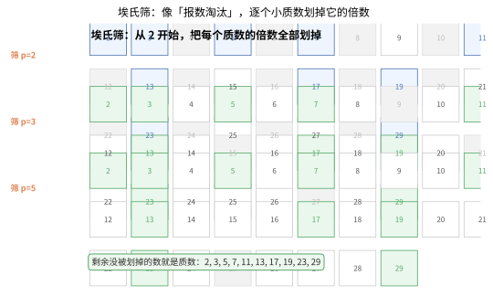
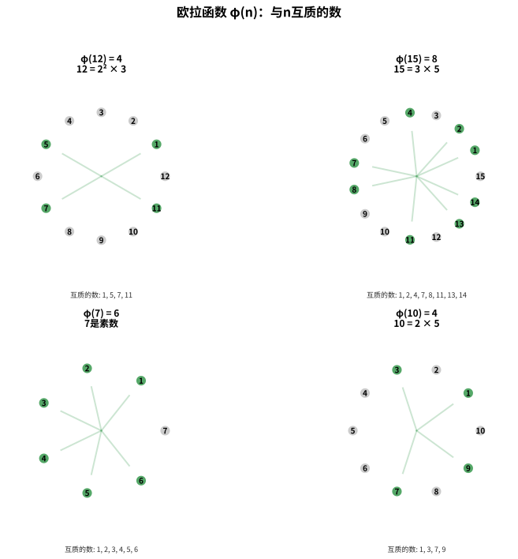
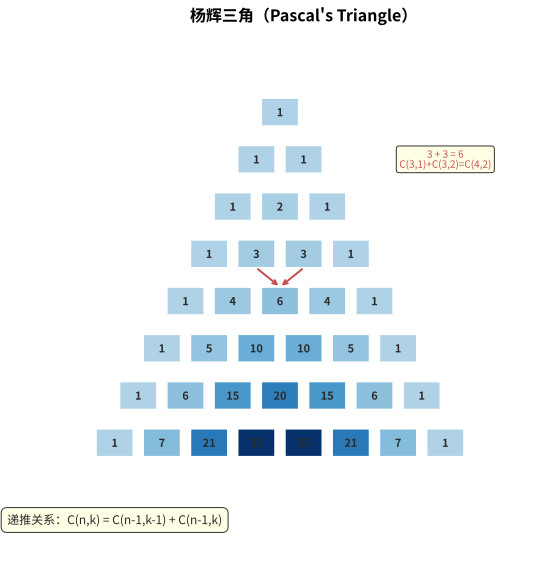
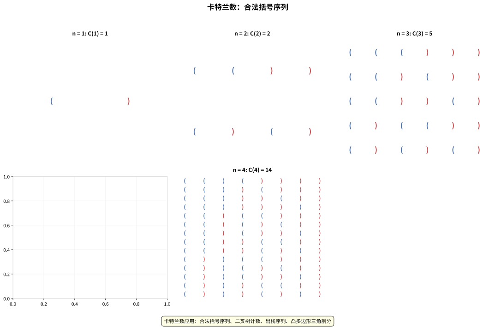
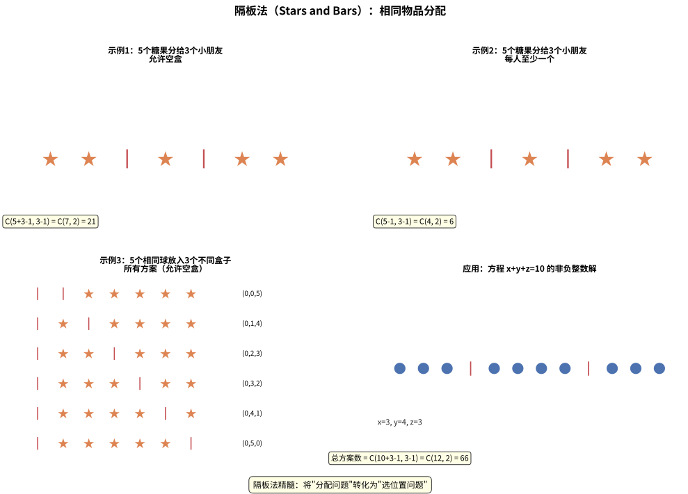
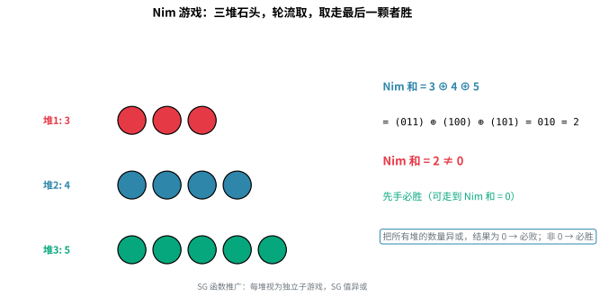
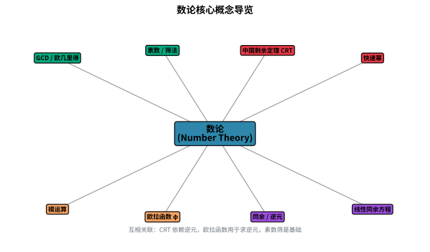
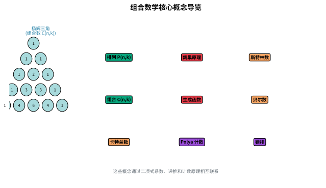

# 第八章：数论与组合数学

> 数论是数学的皇后，而组合数学是离散世界中的瑰宝。从 RSA 加密到彩票中奖概率，从算法竞赛中的模运算到日常生活中的排列组合，数论与组合数学的知识无处不在。本章将带你领略这些数学工具在编程中的强大威力。

---

## 8.1 数论基础

### 8.1.1 GCD & LCM（最大公约数与最小公倍数）

#### 为什么学这个？
最大公约数（GCD）和最小公倍数（LCM）是数论中最基础的概念。它们出现在分数化简、密码学、约分算法等各个领域。在 Python 中，`math.gcd` 已经帮我们实现了高效的欧几里得算法，但理解其原理仍然很重要。

> 💡 **类比：GCD 如同切割瓷砖**
> 想象你有一块 $a \times b$ 的矩形地砖，想把它切成尽可能大的正方形地砖，且不能浪费。欧几里得算法就是切割方案：先切出最大的正方形（边长为 $b$），剩下的矩形是 $(a\,\%\,b) \times b$；然后对剩下的小矩形继续切正方形……直到最后剩下一块正方形正好切完，那块正方形的边长就是 GCD。比如 48×18 的地砖：先切两个 18×18 的正方形，剩下 12×18；再切一个 12×12，剩下 12×6；最后切两个 6×6，正好切完。$\gcd(48,18) = 6$。

**欧几里得算法（辗转相除法）**：
```
gcd(a, b) = gcd(b, a % b)，直到 b = 0 时返回 a
```

**最小公倍数与最大公约数的关系**：
```
lcm(a, b) = a * b / gcd(a, b)
```

```python
import math


def gcd_euclidean(a: int, b: int) -> int:
    """
    欧几里得算法（辗转相除法）求最大公约数
    
    原理：gcd(a, b) = gcd(b, a % b)
    当 b = 0 时，gcd(a, 0) = a
    """
    while b != 0:
        a, b = b, a % b
    return a


def gcd_recursive(a: int, b: int) -> int:
    """递归实现欧几里得算法"""
    return a if b == 0 else gcd_recursive(b, a % b)


def lcm(a: int, b: int) -> int:
    """
    求最小公倍数
    
    lcm(a, b) = a * b / gcd(a, b)
    注意：先除后乘，避免溢出
    """
    return a // math.gcd(a, b) * b


# 示例
print(f"gcd(12, 18) = {gcd_euclidean(12, 18)}")        # 6
print(f"gcd_recursive(12, 18) = {gcd_recursive(12, 18)}")  # 6
print(f"math.gcd(12, 18) = {math.gcd(12, 18)}")           # 6
print(f"lcm(12, 18) = {lcm(12, 18)}")                      # 36
```

**时间复杂度**：$O(\log \min(a, b))$，非常高效。

### 8.1.2 扩展欧几里得算法（Extended Euclidean）

#### 为什么学这个？
扩展欧几里得算法不仅能求 GCD，还能找到方程 `ax + by = gcd(a, b)` 的一组整数解 (x, y)。这在求解模逆元、解线性同余方程、RSA 密码学中至关重要。

> 💡 **类比：扩展欧几里得如同"倒推配方"**
> 想象有两种原料 A 和 B，你需要用 ax + by 的配方凑出恰好 gcd(a,b) 的重量。扩展欧几里得就像"倒推配方表"：它先通过辗转相除找到 GCD，然后沿着辗转相除的步骤一路倒推回去，反推出每种原料各需要多少份（x 和 y）。这在密码学中至关重要——RSA 解密本质上就是在"倒推配方"找到模逆元。

**算法思想**：
在欧几里得算法的递归过程中，同时记录系数 x 和 y。

```
ax + by = gcd(a, b)
当 b = 0 时，gcd(a, 0) = a，此时 x = 1, y = 0
否则，递推关系：
bx' + (a % b)y' = gcd(b, a % b) = gcd(a, b)
代入 a % b = a - (a // b) * b 可得：
x = y', y = x' - (a // b) * y'
```

```python
def extended_gcd(a: int, b: int) -> tuple[int, int, int]:
    """
    扩展欧几里得算法
    
    Returns:
        (gcd, x, y) 满足 ax + by = gcd(a, b)
    """
    if b == 0:
        return (a, 1, 0)
    
    g, x1, y1 = extended_gcd(b, a % b)
    # 回溯：x = y1, y = x1 - (a // b) * y1
    x = y1
    y = x1 - (a // b) * y1
    return (g, x, y)


def extended_gcd_iterative(a: int, b: int) -> tuple[int, int, int]:
    """迭代实现扩展欧几里得算法"""
    x0, x1 = 1, 0
    y0, y1 = 0, 1
    
    while b != 0:
        q = a // b
        a, b = b, a - q * b
        x0, x1 = x1, x0 - q * x1
        y0, y1 = y1, y0 - q * y1
    
    return (a, x0, y0)


# 示例
g, x, y = extended_gcd(30, 20)
print(f"gcd(30, 20) = {g}, x = {x}, y = {y}")
print(f"验证: 30 * {x} + 20 * {y} = {30 * x + 20 * y}")  # 10

# 解线性丢番图方程：47x + 30y = 1
g, x, y = extended_gcd(47, 30)
print(f"47 * {x} + 30 * {y} = {47 * x + 30 * y}")  # 1
```

**时间复杂度**：$O(\log \min(a, b))$

### 8.1.3 素数（Prime Numbers）

#### 为什么学这个？
素数是数论的核心。从密码学（RSA、Diffie-Hellman）到哈希表设计，再到随机数生成，素数无处不在。掌握素数判定和筛法，是算法竞赛的基础技能。

**试除法（Trial Division）**：判断 $n$ 是否为素数，只需检查 2 到 $\sqrt{n}$ 的整数。

**埃拉托斯特尼筛法（Sieve of Eratosthenes）**：找出 $n$ 以内所有素数，时间复杂度 $O(n \log \log n)$。

**欧拉筛（线性筛，Sieve of Euler）**：每个合数只被其最小质因子筛掉一次，时间复杂度 $O(n)$。

```python
import math


def is_prime_trial(n: int) -> bool:
    """
    试除法判断素数
    
    时间复杂度：O(√n)
    """
    if n < 2:
        return False
    if n == 2:
        return True
    if n % 2 == 0:
        return False
    
    # 检查 3, 5, 7, ... 直到 √n
    limit = int(math.isqrt(n))
    for i in range(3, limit + 1, 2):
        if n % i == 0:
            return False
    return True
```


> 💡 **类比：宿舍查寝淘汰法**
> 想象一栋宿舍楼，你从 2 号房开始广播："所有 2 的倍数房号，都不是素数！" 然后 3 号房广播"所有 3 的倍数房号淘汰！"…… 每广播一个素数，就把它的倍数全部划掉。等所有小素数都广播完，**剩下没被划掉的房号就是素数**。这就是埃氏筛——像"报数淘汰"一样，逐个小质数划掉它的倍数。下图展示了这个过程：



> ✨ **为什么从 $i \times i$ 开始划？** 因为 $i$ 的较小倍数（如 $2i$、$3i$…）都已经被更小的质因子划过了，从 $i^2$ 起步能避免重复标记，让筛法更高效。

```python
def sieve_of_eratosthenes(n: int) -> list[int]:
    """
    埃拉托斯特尼筛法
    
    原理：从 2 开始，将每个素数的倍数标记为合数
    
    Args:
        n: 上限
    
    Returns:
        n 以内的所有素数列表
    """
    if n < 2:
        return []
    
    is_prime = [True] * (n + 1)
    is_prime[0] = is_prime[1] = False
    
    for i in range(2, int(math.isqrt(n)) + 1):
        if is_prime[i]:
            # 从 i*i 开始标记（因为 i 的较小倍数已被更小的素数标记）
            for j in range(i * i, n + 1, i):
                is_prime[j] = False
    
    return [i for i in range(2, n + 1) if is_prime[i]]


def sieve_of_euler(n: int) -> list[int]:
    """
    欧拉筛（线性筛）
    
    关键优化：每个合数只被其最小质因子筛掉一次
    时间复杂度：O(n)
    """
    if n < 2:
        return []
    
    is_prime = [True] * (n + 1)
    primes = []
    
    for i in range(2, n + 1):
        if is_prime[i]:
            primes.append(i)
        
        for p in primes:
            if i * p > n:
                break
            is_prime[i * p] = False
            if i % p == 0:  # p 是 i 的最小质因子
                break
    
    return primes


# 示例
print(f"试除法判断 97 是否为素数: {is_prime_trial(97)}")  # True
print(f"试除法判断 100 是否为素数: {is_prime_trial(100)}")  # False

print(f"埃氏筛 30 以内的素数: {sieve_of_eratosthenes(30)}")
# [2, 3, 5, 7, 11, 13, 17, 19, 23, 29]

print(f"线性筛 30 以内的素数: {sieve_of_euler(30)}")
# [2, 3, 5, 7, 11, 13, 17, 19, 23, 29]

# 性能对比
import time

n = 1000000
start = time.time()
primes1 = sieve_of_eratosthenes(n)
t1 = time.time() - start

start = time.time()
primes2 = sieve_of_euler(n)
t2 = time.time() - start

print(f"埃氏筛 1e6: {t1:.4f}s, 共 {len(primes1)} 个素数")
print(f"欧拉筛 1e6: {t2:.4f}s, 共 {len(primes2)} 个素数")
```

**各种筛法对比**：

| 筛法 | 时间复杂度 | 空间复杂度 | 核心思想 | 适用场景 |
|------|-----------|-----------|---------|---------|
| 试除法 | $O(\sqrt{n})$ | $O(1)$ | 检查 2 到 $\sqrt{n}$ 的因子 | 单个数判素 |
| 埃拉托斯特尼筛法 | $O(n \log \log n)$ | $O(n)$ | 从 2 开始标记素数的倍数 | 小范围批量筛素（$n \leq 10^7$） |
| 欧拉筛（线性筛） | $O(n)$ | $O(n)$ | 每个合数只被其最小质因子筛掉一次 | 大规模筛素，配合欧拉函数、莫比乌斯函数等积性函数计算 |

**素数定理**：不超过 $n$ 的素数个数约为 $n / \ln(n)$。

### 8.1.4 模运算（Modular Arithmetic）

#### 为什么学这个？
模运算是算法竞赛和密码学的基础。大数取模、快速幂、模逆元等概念在 RSA 加密、组合数计算、哈希函数中无处不在。

**模运算重要性质**：

模运算在加、减、乘上满足封闭性，但除法需要模逆元。以下是核心性质：

```
(a + b) % mod = ((a % mod) + (b % mod)) % mod
(a - b) % mod = ((a % mod) - (b % mod) + mod) % mod   ← 注意加 mod 保证非负
(a * b) % mod = ((a % mod) * (b % mod)) % mod
(a / b) % mod = (a * b^(-1)) % mod   ← 需要 b 在模 mod 下有逆元
```

**其他重要性质**：
- **模逆元存在条件**：$a$ 在模 $m$ 下有逆元当且仅当 $\gcd(a, m) = 1$
- **负数取模**：在 Python 中，`(-a) % m = m - (a % m)`，结果始终非负
- **幂运算**：`a^b % mod` 可通过快速幂在 $O(\log b)$ 时间内计算
- **模运算传递性**：若 $a \equiv b \pmod{m}$ 且 $c \equiv d \pmod{m}$，则 $a + c \equiv b + d \pmod{m}$，$a \times c \equiv b \times d \pmod{m}$
- **同余可约性**：若 $a \times c \equiv b \times c \pmod{m}$ 且 $\gcd(c, m) = 1$，则 $a \equiv b \pmod{m}$

**快速幂（Fast Exponentiation）**：计算 $a^b \bmod mod$，时间复杂度 $O(\log b)$。

> 💡 **类比：快速幂如同折纸游戏**
> 想象你要计算 $2^{10}$，朴素方法是连续乘10次：$2 \times 2 \times 2 \times \ldots \times 2$。但快速幂的做法像"折纸"：先把纸对折1次得到2层，再对折得到4层，再对折得到8层……每次对折层数翻倍（平方）。10的二进制是1010，意味着你需要在第1次、第3次对折时"收集"结果。这样只需$\log_2(10) \approx 4$步，而不是10步。指数越大，快速幂的优势越明显——计算$2^{1000000}$只需约20步！

```python
def fast_pow(a: int, b: int, mod: int) -> int:
    """
    快速幂（二进制幂）
    
    原理：将指数 b 写成二进制，每次将底数平方
    例如：3^5 = 3^(101₂) = 3^4 * 3^1
    
    Args:
        a: 底数
        b: 指数
        mod: 模数
    
    Returns:
        a^b % mod
    """
    result = 1
    base = a % mod
    
    while b > 0:
        if b & 1:  # 当前二进制位为 1
            result = (result * base) % mod
        base = (base * base) % mod  # 底数平方
        b >>= 1  # 右移一位
    
    return result


# 使用 Python 内置函数
# pow(a, b, mod) 是 Python 内置的快速幂，经过 C 优化，速度最快


# 示例
print(f"3^5 % 7 = {fast_pow(3, 5, 7)}")      # 3^5 = 243, 243 % 7 = 5
print(f"pow(3, 5, 7) = {pow(3, 5, 7)}")      # 5

# 大数快速幂
print(f"2^1000000 % 10^9+7 = {pow(2, 1000000, 10**9 + 7)}")

# 模运算性质验证
mod = 10**9 + 7
a, b = 123456789, 987654321
print(f"(a + b) % mod = {(a + b) % mod}")
print(f"((a % mod) + (b % mod)) % mod = {((a % mod) + (b % mod)) % mod}")  # 相等
```

**模运算应用——大数取模**：
```python
def big_number_mod(s: str, mod: int) -> int:
    """
    大数（用字符串表示）取模
    
    例如：计算 "12345678901234567890" % 7
    """
    result = 0
    for ch in s:
        result = (result * 10 + int(ch)) % mod
    return result


print(big_number_mod("12345678901234567890", 7))  # 6
```

快速幂的核心思想是将指数按二进制展开，每一步将底数平方——这依赖于**位运算**来高效地检查二进制位和右移操作。下图展示了位运算的基本操作：


### 8.1.5 欧拉函数（Euler's Totient Function）

#### 为什么学这个？
欧拉函数 $\varphi(n)$ 表示小于等于 $n$ 且与 $n$ 互质的正整数的个数。它是 RSA 加密算法的核心组件，也是数论中最重要的函数之一。

> 💡 **类比：欧拉函数如同"朋友圈筛选"**
> 想象 $n$ 是班级人数，$\varphi(n)$ 就是"和班长没有共同朋友"的人数。两个数"互质"意味着它们没有共同的质因子——就像两个人没有共同的朋友圈。比如 $\varphi(12) = 4$，因为 1~12 中只有 1、5、7、11 和 12 没有共同质因子（$12 = 2^2 \times 3$，而 5、7、11 是质数，1 和谁都"没交集"）。欧拉函数的核心公式就是用"容斥"的思想，从总数中减去那些有共同质因子的数。

下图展示了不同数值的欧拉函数——绿色圆圈表示与该数互质的数，灰色表示不互质的数：



**定义**：$\varphi(n)$ = 小于等于 $n$ 且与 $n$ 互质的正整数的个数

**性质**：
- 如果 $p$ 是素数，则 $\varphi(p) = p - 1$
- 如果 $p$ 是素数，则 $\varphi(p^k) = p^k - p^{k-1} = p^k \cdot (1 - 1/p)$
- 如果 $\gcd(a, b) = 1$，则 $\varphi(a \times b) = \varphi(a) \times \varphi(b)$（积性函数）
- 一般公式：$n = \prod p_i^{k_i}$，则 $\varphi(n) = n \times \prod (1 - 1/p_i)$

```python
import math


def euler_phi(n: int) -> int:
    """
    计算单个欧拉函数值 φ(n)
    
    原理：利用公式 φ(n) = n × ∏ (1 - 1/p_i)
    其中 p_i 是 n 的质因子
    时间复杂度：O(√n)
    """
    result = n
    temp = n
    
    # 找出所有质因子
    for i in range(2, int(math.isqrt(temp)) + 1):
        if temp % i == 0:
            # i 是质因子
            while temp % i == 0:
                temp //= i
            result -= result // i
    
    # 如果 temp 大于 1，说明它本身是一个质因子
    if temp > 1:
        result -= result // temp
    
    return result


def euler_phi_sieve(n: int) -> list[int]:
    """
    筛法求 1 到 n 的所有欧拉函数值
    
    利用线性筛的思想，O(n) 时间计算所有 φ(i)
    """
    phi = list(range(n + 1))
    is_prime = [True] * (n + 1)
    primes = []
    
    for i in range(2, n + 1):
        if is_prime[i]:
            primes.append(i)
            phi[i] = i - 1  # 素数的 φ 值
        
        for p in primes:
            if i * p > n:
                break
            is_prime[i * p] = False
            if i % p == 0:
                # p 是 i 的最小质因子
                phi[i * p] = phi[i] * p
                break
            else:
                phi[i * p] = phi[i] * (p - 1)
    
    return phi


# 示例
print(f"φ(7) = {euler_phi(7)}")       # 6（素数）
print(f"φ(12) = {euler_phi(12)}")     # 4（1, 5, 7, 11）
print(f"φ(100) = {euler_phi(100)}")   # 40

# 筛法求 1-20 的欧拉函数值
phi_values = euler_phi_sieve(20)
for i in range(1, 21):
    print(f"φ({i}) = {phi_values[i]}")
```

### 8.1.6 中国剩余定理（Chinese Remainder Theorem, CRT）

#### 为什么学这个？
中国剩余定理解决的是"一个数除以多个不同的数，余数各不相同，求这个数"的问题。它在 RSA 加速计算、大整数表示、密码学中都有重要应用。

> 💡 **类比：中国剩余定理如同"多把锁开一把钥匙"**
> 想象你有一把万能钥匙（未知数 $x$），和若干把不同齿数的锁（$m_1, m_2, \ldots, m_k$）。每把锁告诉你：这把钥匙的齿纹除以我的齿数，余数是 $a_i$。中国剩余定理告诉你：只要这些锁的齿数互质，就一定能唯一确定一把钥匙（在它们的乘积范围内）。这就像"韩信点兵"——3 人一排多 2 人、5 人一排多 3 人、7 人一排多 2 人，通过余数信息就能反推出总人数。

**问题描述**：
求 x 满足：
```
x ≡ a₁ (mod m₁)
x ≡ a₂ (mod m₂)
...
x ≡ aₖ (mod mₖ)
```
其中 $m_1, m_2, \ldots, m_k$ 两两互质。

**解法**：
1. 计算 $M = m_1 \times m_2 \times \ldots \times m_k$
2. 对于每个 $i$，计算 $M_i = M / m_i$
3. 求 $M_i$ 在模 $m_i$ 下的逆元 $inv_i$
4. 解为 $x = \sum (a_i \times M_i \times inv_i) \% M$

```python
def extended_gcd(a: int, b: int) -> tuple[int, int, int]:
    """扩展欧几里得算法"""
    if b == 0:
        return (a, 1, 0)
    g, x1, y1 = extended_gcd(b, a % b)
    return (g, y1, x1 - (a // b) * y1)


def mod_inverse(a: int, m: int) -> int:
    """
    求 a 在模 m 下的逆元
    
    前提：gcd(a, m) = 1
    """
    g, x, _ = extended_gcd(a, m)
    if g != 1:
        raise ValueError(f"逆元不存在，gcd({a}, {m}) = {g}")
    return x % m


def chinese_remainder_theorem(remainders: list[int], moduli: list[int]) -> int:
    """
    中国剩余定理
    
    Args:
        remainders: 余数列表 [a₁, a₂, ..., aₖ]
        moduli: 模数列表 [m₁, m₂, ..., mₖ]，需两两互质
    
    Returns:
        满足条件的 x (0 ≤ x < M)
    """
    if len(remainders) != len(moduli):
        raise ValueError("余数列表和模数列表长度必须相同")
    
    M = 1
    for m in moduli:
        M *= m
    
    result = 0
    for a, m in zip(remainders, moduli):
        Mi = M // m
        inv = mod_inverse(Mi % m, m)  # 求 Mi 在模 m 下的逆元
        result = (result + a * Mi * inv) % M
    
    return result


# 示例
# 求 x，满足：
# x ≡ 2 (mod 3)
# x ≡ 3 (mod 5)
# x ≡ 2 (mod 7)
remainders = [2, 3, 2]
moduli = [3, 5, 7]
x = chinese_remainder_theorem(remainders, moduli)
print(f"x = {x}")  # 23
print(f"验证: 23 % 3 = {23 % 3}, 23 % 5 = {23 % 5}, 23 % 7 = {23 % 7}")
# 验证: 23 % 3 = 2, 23 % 5 = 3, 23 % 7 = 2
```

**应用场景**：CRT 可以将大数模运算分解为多个小模数运算，在 RSA 中加速解密过程。

### 8.1.7 费马小定理与欧拉定理

#### 为什么学这个？
费马小定理和欧拉定理是模逆元计算的理论基础。在密码学中，它们用于 RSA 密钥生成和数字签名。理解这些定理，你就能明白为什么模逆元在某些条件下总是存在。

> 💡 **类比：费马小定理如同"旋转复位"**
> 想象一个转盘上有 $p$ 个刻度（0 到 $p-1$），每次旋转 $a$ 格。费马小定理说：转了 $p-1$ 次后，转盘恰好回到起点（$\equiv 1 \pmod{p}$）。这是因为素数 $p$ 保证了"没有捷径"——$a$ 的每次旋转都会遍历所有非零位置后才回到原点。这个"复位"性质正是求模逆元的理论基础：既然 $a^{p-1} \equiv 1$，那么 $a^{p-2}$ 就是 $a$ 的"倒转步数"（逆元）。

**费马小定理**：
如果 $p$ 是素数，且 $\gcd(a, p) = 1$，则：
```
a^(p-1) ≡ 1 (mod p)
```
推论：$a^{p-2} \equiv a^{-1} \pmod{p}$，即 $a$ 的模逆元为 $a^{p-2} \bmod p$。

**欧拉定理**（费马小定理的推广）：
如果 $\gcd(a, n) = 1$，则：
```
a^φ(n) ≡ 1 (mod n)
```

```python
def mod_inverse_fermat(a: int, p: int) -> int:
    """
    使用费马小定理求模逆元
    
    仅当 p 是素数时可用
    a^(-1) ≡ a^(p-2) (mod p)
    """
    if not is_prime_trial(p):
        raise ValueError("费马小定理要求模数为素数")
    return pow(a, p - 2, p)


def is_prime_trial(n: int) -> bool:
    """试除法判断素数"""
    if n < 2:
        return False
    if n == 2:
        return True
    if n % 2 == 0:
        return False
    limit = int(math.isqrt(n))
    for i in range(3, limit + 1, 2):
        if n % i == 0:
            return False
    return True


# 示例：在模素数下求逆元
p = 1000000007  # 大素数
a = 123456789
inv = mod_inverse_fermat(a, p)
print(f"{a} 在模 {p} 下的逆元 = {inv}")
print(f"验证: {a} * {inv} % {p} = {a * inv % p}")  # 1

# 费马小定理验证
print(f"2^(7-1) % 7 = {pow(2, 6, 7)}")  # 1
print(f"3^(7-1) % 7 = {pow(3, 6, 7)}")  # 1
```

### 8.1.8 Miller-Rabin 素性测试

#### 为什么学这个？
对于大数（如 1024 位的 RSA 密钥），试除法不可行。Miller-Rabin 是一种高效的**概率性**素性检测算法，可以在 $O(\log n)$ 时间内判断一个数是否为素数。它在密码学中广泛使用。

> 💡 **类比：Miller-Rabin 如同"多轮体检筛查"**
> 试除法就像一个一个地查"你有没有被某个数整除"，对大数来说太慢了。Miller-Rabin 则像"体检筛查"：它不逐个检查因子，而是通过几轮"数学体检"（随机选底数 a，验证费马小定理的加强版）来判断。每一轮体检能排除大量"合数患者"，做多轮后，如果全部通过，基本可以确定是素数。就像核酸检测做 10 次都阴性，基本可以排除感染。

**算法思想**：
基于费马小定理的推广。对于奇数 $n$，将 $n-1$ 写成 $2^s \times d$ 的形式，其中 $d$ 是奇数。
如果 $n$ 是素数，则对于任意 $a$（$\gcd(a, n) = 1$），要么 $a^d \equiv 1 \pmod{n}$，要么 $a^{2^r \times d} \equiv -1 \pmod{n}$ 对某个 $r$ 成立。

**确定性版本**：对于 32 位整数，只需测试 $[2, 7, 61]$ 三个底数；对于 64 位整数，测试 $[2, 325, 9375, 28178, 450775, 9780504, 1795265022]$。

```python
import random


def miller_rabin(n: int, k: int = 10) -> bool:
    """
    Miller-Rabin 素性测试
    
    Args:
        n: 待测试的整数
        k: 测试轮数（越高越准确）
    
    Returns:
        True 如果 n 很可能是素数，False 如果 n 是合数
    """
    if n < 2:
        return False
    if n == 2 or n == 3:
        return True
    if n % 2 == 0:
        return False
    
    # 将 n-1 写成 2^s * d 的形式
    s = 0
    d = n - 1
    while d % 2 == 0:
        d //= 2
        s += 1
    
    # 测试 k 轮
    for _ in range(k):
        a = random.randrange(2, n - 1)
        x = pow(a, d, n)
        
        if x == 1 or x == n - 1:
            continue
        
        for _ in range(s - 1):
            x = pow(x, 2, n)
            if x == n - 1:
                break
        else:
            # 从未遇到 x == n - 1，说明 n 是合数
            return False
    
    return True


def miller_rabin_deterministic(n: int) -> bool:
    """
    Miller-Rabin 确定性版本（适用于 64 位整数）
    
    使用确定的底数集，保证正确
    """
    if n < 2:
        return False
    if n == 2 or n == 3:
        return True
    if n % 2 == 0:
        return False
    
    # 将 n-1 写成 2^s * d 的形式
    s = 0
    d = n - 1
    while d % 2 == 0:
        d //= 2
        s += 1
    
    # 对于 64 位整数，这些底数足够
    bases = [2, 325, 9375, 28178, 450775, 9780504, 1795265022]
    
    for a in bases:
        if a % n == 0:
            continue
        x = pow(a, d, n)
        if x == 1 or x == n - 1:
            continue
        for _ in range(s - 1):
            x = pow(x, 2, n)
            if x == n - 1:
                break
        else:
            return False
    
    return True


# 示例
test_numbers = [2, 3, 97, 100, 7919, 982451653, 10**12 + 39]
for n in test_numbers:
    result = miller_rabin(n, 20)
    print(f"Miller-Rabin: {n} {'是素数' if result else '不是素数'}")

# 确定性版本测试
print(f"确定性 Miller-Rabin: 982451653 {'是素数' if miller_rabin_deterministic(982451653) else '不是素数'}")

# 大素数测试
big_candidate = 10**18 + 3
print(f"{big_candidate} 是素数吗？{miller_rabin(big_candidate, 20)}")
```

**误差率**：经过 $k$ 轮测试，误判概率不超过 $4^{-k}$。

### 8.1.9 矩阵快速幂（Matrix Exponentiation）

#### 为什么学这个？
矩阵快速幂是解决线性递推问题的利器。斐波那契数列通常需要 $O(n)$ 时间，但借助矩阵快速幂，只需要 $O(\log n)$。它同样适用于求解动态规划中的递推关系、图论中的路径计数等问题。

**核心思想**：
将线性递推关系转化为矩阵乘法，然后使用快速幂计算矩阵的 $n$ 次幂。

**斐波那契数列的矩阵形式**：
```
[F(n+1)]   [1  1]^n   [F(1)]
[F(n)  ] = [1  0]   * [F(0)]
```

```python
def matrix_multiply(A: list[list[int]], B: list[list[int]], mod: int) -> list[list[int]]:
    """
    矩阵乘法
    """
    n = len(A)
    m = len(B[0])
    p = len(B)
    
    result = [[0] * m for _ in range(n)]
    for i in range(n):
        for k in range(p):
            if A[i][k] == 0:
                continue
            for j in range(m):
                result[i][j] = (result[i][j] + A[i][k] * B[k][j]) % mod
    return result


def matrix_pow(mat: list[list[int]], power: int, mod: int) -> list[list[int]]:
    """
    矩阵快速幂
    
    Args:
        mat: 方阵
        power: 指数
        mod: 模数
    
    Returns:
        mat^power % mod
    """
    n = len(mat)
    # 单位矩阵
    result = [[1 if i == j else 0 for j in range(n)] for i in range(n)]
    base = mat
    
    while power > 0:
        if power & 1:
            result = matrix_multiply(result, base, mod)
        base = matrix_multiply(base, base, mod)
        power >>= 1
    
    return result


def fibonacci_matrix(n: int, mod: int = 10**9 + 7) -> int:
    """
    使用矩阵快速幂求斐波那契数列的第 n 项
    
    F(0) = 0, F(1) = 1
    F(n) = F(n-1) + F(n-2)
    
    时间复杂度：O(log n)
    """
    if n == 0:
        return 0
    if n == 1:
        return 1
    
    # 转移矩阵
    T = [[1, 1],
         [1, 0]]
    
    # 计算 T^(n-1)
    T_pow = matrix_pow(T, n - 1, mod)
    
    # F(n) = T^(n-1)[0][0] * F(1) + T^(n-1)[0][1] * F(0)
    # 由于 F(1) = 1, F(0) = 0
    # 所以 F(n) = T_pow[0][0]
    return T_pow[0][0] % mod


# 示例
print("斐波那契数列前 10 项:")
for i in range(10):
    print(f"F({i}) = {fibonacci_matrix(i)}")

print(f"\nF(100) = {fibonacci_matrix(100)}")
print(f"F(1000) = {fibonacci_matrix(1000)}")

# 对比普通递推和矩阵快速幂
import time

n = 10**7
# 普通递推 O(n) 可能太慢，这里只测试小范围
# 矩阵快速幂 O(log n)
start = time.time()
result = fibonacci_matrix(1000000)
print(f"\n矩阵快速幂 F(1000000) = {result}, 耗时: {time.time() - start:.4f}s")
```

**矩阵快速幂的应用**：
- 斐波那契数列 $O(\log n)$
- 线性递推（如线性 DP 优化）
- 图的路径计数（邻接矩阵的 $k$ 次幂表示长度为 $k$ 的路径数）

> 💡 **类比：矩阵快速幂如同时间机器**
> 想象你有一个递推关系，比如斐波那契数列 $F(n) = F(n-1) + F(n-2)$。朴素方法是逐项计算，需要 $O(n)$ 步。但矩阵快速幂就像一台"时间机器"——它把递推关系转换成矩阵乘法，然后用快速幂技巧直接"跳"到第 n 步，只需 $O(\log n)$ 步。这就像你要从北京到上海，朴素方法是坐绿皮火车一站一站走，而矩阵快速幂是坐高铁直达。更神奇的是，这个方法不仅适用于斐波那契，任何线性递推都能用：只要你能把递推写成矩阵形式，就能用矩阵快速幂加速。

---

## 8.2 组合数学

### 8.2.0 基本计数原理

#### 为什么学这个？
计数是组合数学的基石。加法原理、乘法原理和一一对应原理是最基本的计数工具，几乎所有复杂的组合问题最终都能分解为这些基本原理的应用。

**加法原理（分类计数）**：
如果完成一件事有 $k$ 类互斥的方法，第 $i$ 类有 $n_i$ 种方法，则总方法数为 $n_1 + n_2 + \ldots + n_k$。

**乘法原理（分步计数）**：
如果完成一件事需要 $k$ 个步骤，第 $i$ 步有 $n_i$ 种方法，则总方法数为 $n_1 \times n_2 \times \ldots \times n_k$。

**一一对应原理**：
如果两个集合之间存在一一对应关系，则它们的元素个数相等。这是组合数学中"将未知问题转化为已知问题"的核心思想。

> 💡 **类比：基本计数原理如同点菜**
> 加法原理就像"分类点菜"：主食有米饭、面条、馒头 3 种选法，汤有紫菜蛋花汤、酸辣汤 2 种选法，你只能选一种主食**或**一种汤——总共 $3+2=5$ 种选法。乘法原理就像"套餐搭配"：主食 3 种**乘以**汤 2 种，组成一套完整套餐——总共 $3\times2=6$ 种套餐。关键区别在于：加法是"或"（选一类就行），乘法是"且"（每类都要选）。一一对应则像"翻译"：如果你能把一个不会数的问题翻译成另一个会数的问题（比如把"路径数"翻译成"排列数"），那两者数量一定相等。

```python
# 示例：从 A 地到 B 地有 3 条路，从 B 地到 C 地有 4 条路
# 从 A 到 C 经过 B 有多少种走法？
print(f"从 A 到 C 经过 B: {3 * 4} 种走法")  # 12（乘法原理）

# 示例：从 A 到 C 可以坐火车（2 条线路）或飞机（3 条线路）
print(f"从 A 到 C 直达: {2 + 3} 种走法")  # 5（加法原理）
```

### 8.2.1 排列组合

#### 为什么学这个？
排列组合是概率论和统计学的基础。从密码学中的密码强度估算，到算法分析的计数复杂度，再到彩票中奖概率计算，排列组合无处不在。

下图展示了当前学习阶段在整体算法知识体系中的位置——我们已经完成了基础数据结构、排序、字符串和数论的学习，现在进入组合数学领域：


**排列（Permutation）**：从 $n$ 个不同元素中取 $k$ 个，考虑顺序。
```
P(n, k) = n! / (n - k)!
```

**组合（Combination）**：从 $n$ 个不同元素中取 $k$ 个，不考虑顺序。
```
C(n, k) = n! / (k! × (n - k)!)
```

> 💡 **类比：排列组合如同选人组队**
> 排列就像"选班长、副班长、学习委员"——从 5 个人里选 3 个担任不同职务，顺序很重要：张三当班长和李四当班长是两种不同的结果。组合就像"选 3 个人组队打游戏"——只关心谁在队伍里，不关心谁先谁后。所以 $C(5,3) = P(5,3) / 3! = 60 / 6 = 10$ 种组队方式。记住：**排列看顺序，组合不看顺序**。

```python
import math


def permutation(n: int, k: int) -> int:
    """
    排列数 P(n, k) = n! / (n - k)!
    
    从 n 个不同元素中选 k 个排列
    """
    if k < 0 or k > n:
        return 0
    # P(n, k) = n * (n-1) * ... * (n-k+1)
    result = 1
    for i in range(k):
        result *= (n - i)
    return result


def combination(n: int, k: int) -> int:
    """
    组合数 C(n, k) = n! / (k! * (n - k)!)
    
    从 n 个不同元素中选 k 个组合
    """
    if k < 0 or k > n:
        return 0
    if k > n - k:
        k = n - k  # 优化：C(n, k) = C(n, n-k)
    result = 1
    for i in range(k):
        result = result * (n - i) // (i + 1)
    return result


# 使用 Python 内置函数
# math.perm(n, k)  # Python 3.8+
# math.comb(n, k)  # Python 3.8+


# 示例
n, k = 5, 3
print(f"P({n}, {k}) = {permutation(n, k)}")  # 5*4*3 = 60
print(f"math.perm({n}, {k}) = {math.perm(n, k)}")  # 60
print(f"C({n}, {k}) = {combination(n, k)}")  # 5*4*3/(3*2*1) = 10
print(f"math.comb({n}, {k}) = {math.comb(n, k)}")  # 10

# 阶乘
print(f"10! = {math.factorial(10)}")  # 3628800
```

### 8.2.2 二项式系数（Binomial Coefficients）

#### 为什么学这个？
二项式系数 $C(n, k)$ 出现在二项式定理、概率论（二项分布）、组合计数等各个领域。掌握它的计算方法和性质，是解决组合问题的关键。

> 💡 **类比：二项式系数如同"选队员组队"**
> 想象你有 $n$ 个候选人，要选 $k$ 个组成战队。$C(n,k)$ 就是选法总数。杨辉三角的递推关系 $C(n,k) = C(n-1,k-1) + C(n-1,k)$ 可以这样理解：对于第 $n$ 个人，要么选他（剩下从 $n-1$ 个里选 $k-1$ 个），要么不选他（从 $n-1$ 个里选 $k$ 个）。两种情况加起来就是总选法。这就像"分情况讨论"——把他当"特殊人物"，分"要他"和"不要他"两种情况。

**二项式定理**：
```
(a + b)^n = Σ C(n, k) × a^(n-k) × b^k
```

**杨辉三角（Pascal's Triangle）**：
```
C(n, k) = C(n-1, k-1) + C(n-1, k)
```

下图展示了杨辉三角的构造过程——每个数等于它上方两数之和，颜色深浅表示数值大小：



```python
def pascal_triangle(n: int) -> list[list[int]]:
    """
    生成杨辉三角的前 n 行
    
    杨辉三角中，第 n 行第 k 个数就是 C(n, k)
    """
    triangle = [[1] * (i + 1) for i in range(n)]
    
    for i in range(2, n):
        for j in range(1, i):
            triangle[i][j] = triangle[i-1][j-1] + triangle[i-1][j]
    
    return triangle


def combination_mod_pascal(n: int, k: int, mod: int) -> int:
    """
    使用杨辉三角（DP）求组合数（模 mod）
    
    适用于 n 较小（≤ 5000）的情况
    时间复杂度：O(n²)
    """
    if k < 0 or k > n:
        return 0
    if k > n - k:
        k = n - k
    
    # 一维 DP 优化空间
    C = [0] * (k + 1)
    C[0] = 1
    
    for i in range(1, n + 1):
        # 逆序更新
        for j in range(min(i, k), 0, -1):
            C[j] = (C[j] + C[j-1]) % mod
    
    return C[k]


def combination_mod_factorial(n: int, k: int, mod: int) -> int:
    """
    使用阶乘和逆元求组合数（模 mod）
    
    适用于 n 较大但已知阶乘表的情况
    需要预处理阶乘和逆元阶乘
    时间复杂度：O(1) 查询，O(n) 预处理
    """
    if k < 0 or k > n:
        return 0
    
    # 预处理阶乘和逆元阶乘
    # 在实际应用中，通常只会计算一次
    fact = [1] * (n + 1)
    for i in range(1, n + 1):
        fact[i] = fact[i-1] * i % mod
    
    inv_fact = [1] * (n + 1)
    inv_fact[n] = pow(fact[n], mod - 2, mod)  # 费马小定理求逆元
    for i in range(n, 0, -1):
        inv_fact[i-1] = inv_fact[i] * i % mod
    
    return fact[n] * inv_fact[k] % mod * inv_fact[n-k] % mod


# 示例
print("杨辉三角前 7 行:")
for i, row in enumerate(pascal_triangle(7)):
    print(f"n={i}: {row}")

# 二项式系数
mod = 10**9 + 7
print(f"C(10, 5) = {combination(10, 5)}")  # 252
print(f"C(100, 50) % mod = {combination_mod_pascal(100, 50, mod)}")
```

### 8.2.3 卡特兰数（Catalan Numbers）

#### 为什么学这个？
卡特兰数是一个神奇的组合数序列，它出现在出栈序列、二叉树计数、括号匹配、凸多边形三角剖分等看似不相关的问题中。掌握卡特兰数，等于掌握了一类问题的通用解法。

**定义**：
```
C₀ = 1
C_(n+1) = Σ C_i × C_(n-i), i = 0..n
C_n = C(2n, n) / (n + 1) = C(2n, n) - C(2n, n-1)
```

**卡特兰数的常见应用**：
- $n$ 个节点的不同二叉搜索树数量
- $n$ 对括号的合法匹配方案数
- $n$ 个元素的出栈序列数
- $n \times n$ 网格中不越过对角线的路径数

> 💡 **类比：卡特兰数如同排队买票**
> 想象电影院售票处有 10 个人排队买 5 元一张的电影票，其中 5 个人拿 5 元纸币，5 个人拿 10 元纸币。售票处一开始没有零钱。问有多少种排队方式，使得售票处始终能找开零钱？这就是卡特兰数的经典应用——拿 5 元的人相当于"左括号"，拿 10 元的人相当于"右括号"，任何时刻拿 5 元的人数不能少于拿 10 元的人数（否则找不开零钱）。$C_5 = 42$，所以有 42 种合法排队方式。卡特兰数的神奇之处在于：看似完全不同的问题（括号匹配、二叉树计数、出栈序列、排队找零）竟然都是同一个数！

下图展示了不同 $n$ 值对应的合法括号序列——蓝色是左括号，红色是右括号，任何前缀中左括号数量都不能少于右括号：



```python
def catalan_dp(n: int) -> list[int]:
    """
    使用 DP 计算卡特兰数（递推）
    
    递推公式：C₀ = 1, C_(n+1) = C_n * 2*(2n+1)/(n+2)
    """
    catalan = [0] * (n + 1)
    catalan[0] = 1
    
    for i in range(n):
        catalan[i + 1] = catalan[i] * 2 * (2 * i + 1) // (i + 2)
    
    return catalan


def catalan_combination(n: int) -> int:
    """
    使用组合数计算卡特兰数
    
    C_n = C(2n, n) / (n + 1)
    """
    return math.comb(2 * n, n) // (n + 1)


# 示例
print("卡特兰数前 10 项:")
catalan = catalan_dp(10)
for i in range(10):
    print(f"C_{i} = {catalan[i]}")

# 验证：第 5 项
print(f"\nC_5 = {catalan_combination(5)}")  # 42

# 应用示例：n 对括号的合法匹配
def generate_parenthesis(n: int) -> list[str]:
    """
    生成 n 对括号的所有合法匹配
    合法匹配的数量就是卡特兰数 C_n
    """
    result = []
    
    def backtrack(s: str, left: int, right: int):
        """回溯生成括号"""
        if len(s) == 2 * n:
            result.append(s)
            return
        if left < n:
            backtrack(s + '(', left + 1, right)
        if right < left:
            backtrack(s + ')', left, right + 1)
    
    backtrack("", 0, 0)
    return result


n = 3
print(f"\n{n} 对括号的合法匹配（共 {catalan_combination(n)} 种）:")
for p in generate_parenthesis(n):
    print(f"  {p}")
```

### 8.2.4 容斥原理（Inclusion-Exclusion Principle）

#### 为什么学这个？
容斥原理是计算多个集合并集大小的通用方法。当直接计算复杂时，我们可以先计算所有单个集合的大小，再减去两两交集，加上三个交集……以此类推。它在计数问题、概率计算中非常有用。

**原理**：
```
|A ∪ B ∪ C| = |A| + |B| + |C| - |A∩B| - |A∩C| - |B∩C| + |A∩B∩C|
```

**一般形式**：
```
|∪ A_i| = Σ |A_i| - Σ |A_i ∩ A_j| + Σ |A_i ∩ A_j ∩ A_k| - ... + (-1)^(n+1) |∩ A_i|
```

> 💡 **类比：容斥原理如同班级调查**
> 想象你要统计班里"喜欢数学**或**喜欢语文**或**喜欢英语"的学生总数。如果直接相加：喜欢数学的 20 人 + 喜欢语文的 25 人 + 喜欢英语的 18 人 = 63 人——但这会重复计算那些同时喜欢两科或三科的学生。容斥原理的做法是：先加上所有单科人数，再减去同时喜欢两科的人数（因为被算了两次），再加上同时喜欢三科的人数（因为被减多了）。就像"先多算，再减掉重复的，再加回被多减的"——最终得到准确的并集大小。

```python
def inclusion_exclusion_example(n: int) -> int:
    """
    容斥原理示例：求 1 到 n 中能被 2、3 或 5 整除的数的个数
    
    直接求并集比较复杂，用容斥原理：
    |A ∪ B ∪ C| = |A| + |B| + |C| - |A∩B| - |A∩C| - |B∩C| + |A∩B∩C|
    """
    def count_divisible_by(x: int) -> int:
        return n // x
    
    # 单个集合
    A = count_divisible_by(2)
    B = count_divisible_by(3)
    C = count_divisible_by(5)
    
    # 两两交集
    AB = count_divisible_by(2 * 3)     # 能被 6 整除
    AC = count_divisible_by(2 * 5)     # 能被 10 整除
    BC = count_divisible_by(3 * 5)     # 能被 15 整除
    
    # 三个交集
    ABC = count_divisible_by(2 * 3 * 5)  # 能被 30 整除
    
    return A + B + C - AB - AC - BC + ABC


def count_coprime_pairs(n: int) -> int:
    """
    容斥原理应用：求 1 到 n 中与 n 互质的数的个数
    
    即欧拉函数 φ(n) 的另一种计算方法
    """
    # 先分解 n 的质因子
    temp = n
    prime_factors = []
    p = 2
    while p * p <= temp:
        if temp % p == 0:
            prime_factors.append(p)
            while temp % p == 0:
                temp //= p
        p += 1
    if temp > 1:
        prime_factors.append(temp)
    
    k = len(prime_factors)
    result = 0
    
    # 容斥原理：枚举所有子集
    for mask in range(1, 1 << k):
        product = 1
        bits = 0
        for i in range(k):
            if mask & (1 << i):
                product *= prime_factors[i]
                bits += 1
        
        # 奇数个因子：加，偶数个因子：减
        if bits % 2 == 1:
            result += n // product
        else:
            result -= n // product
    
    return n - result


# 示例
n = 30
print(f"1 到 {n} 中能被 2、3 或 5 整除的数有 {inclusion_exclusion_example(n)} 个")
# 直接验证
count = sum(1 for i in range(1, n + 1) if i % 2 == 0 or i % 3 == 0 or i % 5 == 0)
print(f"直接验证: {count} 个")

# 容斥原理求欧拉函数
print(f"φ(30) = {count_coprime_pairs(30)}")  # 8
print(f"验证: {euler_phi(30)}")  # 8
```

### 8.2.5 隔板法（Stars and Bars）

#### 为什么学这个？
隔板法是组合数学中解决"分配问题"的利器。它解决的是：将 $n$ 个相同的物品分配到 $k$ 个不同的盒子中，有多少种方法？这个问题在概率论、整数划分、方程整数解等问题中反复出现。

**问题 1：允许空盒**
将 $n$ 个相同物品放入 $k$ 个不同盒子（允许空盒）：
```
方案数 = C(n + k - 1, k - 1)
```

**问题 2：不允许空盒**
将 $n$ 个相同物品放入 $k$ 个不同盒子（每个盒子至少一个）：
```
方案数 = C(n - 1, k - 1)
```

> 💡 **类比：隔板法如同分糖果**
> 想象你有 10 颗相同的糖果要分给 3 个孩子。隔板法的思路是：把 10 颗糖排成一排，中间有 9 个空隙，插入 2 个隔板把它们分成 3 份。如果允许有的孩子分不到糖（允许空盒），隔板可以插在两端，相当于从 12 个位置选 2 个放隔板：$C(12,2)$。如果每个孩子至少一颗（不允许空盒），隔板只能插在中间的 9 个空隙：$C(9,2)$。隔板法的精髓是：**把"分配问题"转化为"选位置问题"**。

下图展示了隔板法的核心思想——星星代表物品，竖线代表隔板，通过选择隔板的位置来解决分配问题：



```python
def stars_and_bars(n: int, k: int, allow_empty: bool = True) -> int:
    """
    隔板法：将 n 个相同物品分配到 k 个不同盒子
    
    Args:
        n: 物品数量
        k: 盒子数量
        allow_empty: 是否允许空盒
    
    Returns:
        分配方案数
    """
    if allow_empty:
        # C(n + k - 1, k - 1)
        return math.comb(n + k - 1, k - 1)
    else:
        # C(n - 1, k - 1)
        if n < k:
            return 0
        return math.comb(n - 1, k - 1)


# 示例：方程 x + y + z = 10 的非负整数解
n, k = 10, 3
print(f"方程 x + y + z = {n} 的非负整数解个数: {stars_and_bars(n, k, True)}")
# C(10+3-1, 3-1) = C(12, 2) = 66

# 示例：方程 x + y + z = 10 的正整数解
print(f"方程 x + y + z = {n} 的正整数解个数: {stars_and_bars(n, k, False)}")
# C(10-1, 3-1) = C(9, 2) = 36

# 实际应用：将 5 个相同糖果分给 3 个小朋友（允许有人没分到）
print(f"5 个糖果分给 3 个小朋友（允许空）：{stars_and_bars(5, 3, True)} 种")
# C(5+3-1, 3-1) = C(7, 2) = 21

# 实际应用：将 5 个相同糖果分给 3 个小朋友（每人至少一个）
print(f"5 个糖果分给 3 个小朋友（每人至少一个）：{stars_and_bars(5, 3, False)} 种")
# C(5-1, 3-1) = C(4, 2) = 6
```

### 8.2.6 鸽巢原理（Pigeonhole Principle）

#### 为什么学这个？
鸽巢原理是最简单但最强大的组合数学原理之一。它说：如果 $n$ 个物品放入 $m$ 个抽屉，且 $n > m$，那么至少有一个抽屉放了至少两个物品。这个原理看似简单，但可以推导出许多有趣的结论。

> 💡 **类比：鸽巢原理如同"抢椅子游戏"**
> 想象 13 个人玩抢椅子游戏，但只有 12 把椅子。音乐一停，每个人都要坐下——必然有一把椅子坐了至少两个人。这就是鸽巢原理：物品（人）比抽屉（椅子）多，就必然有"拥挤"。这个简单的观察能证明惊人的结论：比如 367 人中必有两人同一天生日（因为只有 366 个可能的生日"椅子"）。

**基本形式**：
如果 $n > m$，将 $n$ 个物品放入 $m$ 个盒子，则至少有一个盒子包含至少 $\lceil n/m \rceil$ 个物品。

**应用示例**：
- 在 367 人中，至少有 2 人生日相同
- 在 13 人中，至少有 2 人生日在同一个月
- 长度为 $n+1$ 的数组中，如果元素范围是 1 到 $n$，则至少有一个重复元素

```python
def pigeonhole_duplicate(arr: list[int]) -> int | None:
    """
    鸽巢原理应用：长度为 n+1 的数组，元素范围 1..n
    找出任意一个重复元素
    
    时间复杂度：O(n)，空间复杂度：O(1)
    使用快慢指针（Floyd 判圈算法）
    """
    if not arr:
        return None
    
    # 阶段 1：找到相遇点
    slow = arr[0]
    fast = arr[0]
    while True:
        slow = arr[slow]
        fast = arr[arr[fast]]
        if slow == fast:
            break
    
    # 阶段 2：找到重复元素
    slow = arr[0]
    while slow != fast:
        slow = arr[slow]
        fast = arr[fast]
    
    return slow


def birthday_paradox(n: int, trials: int = 100000) -> float:
    """
    模拟生日悖论
    
    在 n 个人中，至少有两人生日相同的概率
    """
    import random
    count = 0
    for _ in range(trials):
        birthdays = [random.randint(1, 365) for _ in range(n)]
        if len(birthdays) != len(set(birthdays)):
            count += 1
    return count / trials


# 示例
arr = [1, 3, 4, 2, 2]
print(f"数组 {arr} 中的重复元素: {pigeonhole_duplicate(arr)}")  # 2

# 生日悖论
print(f"\n23 人中至少两人生日相同的概率: {birthday_paradox(23):.4f}")
print(f"50 人中至少两人生日相同的概率: {birthday_paradox(50):.4f}")
print(f"70 人中至少两人生日相同的概率: {birthday_paradox(70):.4f}")

# 理论值
def birthday_probability(n: int) -> float:
    """计算 n 人中至少两人生日相同的概率（精确值）"""
    p = 1.0
    for i in range(n):
        p *= (365 - i) / 365
    return 1 - p

print(f"\n理论值：")
print(f"23 人: {birthday_probability(23):.4f}")
print(f"50 人: {birthday_probability(50):.4f}")
print(f"70 人: {birthday_probability(70):.4f}")
```

### 8.2.7 错排（Derangement）

#### 为什么学这个？
错排（Derangement）是排列组合中一个经典而有趣的问题：把 $n$ 个元素重新排列，使得**没有任何一个元素停留在原来的位置**。这样的排列数记为 $D_n$。它出现在"每个人都不拿自己的帽子""信封与信纸错配""聚会交换礼物互不给原主人"等场景中。

> 💡 **类比：错排如同"交换礼物不拿自己的"**
> 想象 $n$ 个人参加家庭聚会，每人带一件礼物放在桌上，然后随机抽取一件回家。问有多少种抽法，使得**每个人拿到的都不是自己带来的那件礼物**？这就是错排 $D_n$。比如 3 个人送礼换礼，只有 2 种错排方式（A拿B的、B拿C的、C拿A的；或者 A拿C的、B拿A的、C拿B的），所以 $D_3 = 2$。

**公式**：
$$
D_n = (n-1)(D_{n-1} + D_{n-2}), \quad D_1 = 0, \ D_2 = 1
$$

**推导直觉**：考虑第 $n$ 个元素（把它"送走的礼物"给谁）。它不能留在位置 $n$，假设它去了位置 $k$（$k=1,\ldots,n-1$）：
- 若元素 $k$ 恰好去了位置 $n$，则剩下 $n-2$ 个元素整体互斥，方案数为 $D_{n-2}$；
- 若元素 $k$ 不去位置 $n$，则把位置 $n$ 视为元素 $k$ 的"新家"，剩下 $n-1$ 个元素整体错排，方案数为 $D_{n-1}$。
因为 $k$ 有 $n-1$ 种选择，故 $D_n = (n-1)(D_{n-1} + D_{n-2})$。

**容斥求法**：总排列数为 $n!$，减去"至少一个元素留在原位"的情况（用容斥）：
$$D_n = \sum_{i=0}^{n} (-1)^i \binom{n}{i} (n-i)!$$

```python
import math

def derangement_dp(n: int) -> int:
    """
    递推求错排数 D_n
    D_n = (n-1)(D_{n-1} + D_{n-2}), D_1 = 0, D_2 = 1
    时间复杂度：O(n)，空间可优化为 O(1)
    """
    if n <= 0:
        return 1 if n == 0 else 0  # D_0 = 1（空集）
    if n == 1:
        return 0
    d_prev2, d_prev = 1, 0  # D_0, D_1
    for i in range(2, n + 1):
        d_prev, d_prev2 = (i - 1) * (d_prev + d_prev2), d_prev
    return d_prev


def derangement_inclusion_exclusion(n: int) -> int:
    """容斥原理求错排数 D_n = Σ (-1)^i * C(n,i) * (n-i)!"""
    result = 0
    for i in range(n + 1):
        term = math.comb(n, i) * math.factorial(n - i)
        result += term if i % 2 == 0 else -term
    return result


# 示例：n=1..6 的错排数应为 1, 0, 1, 2, 9, 44, 265
for n in range(7):
    print(f"D_{n} = {derangement_dp(n)}（容斥: {derangement_inclusion_exclusion(n)}）")
```

**适用场景**：洗牌避免原位、信件与信封错配、密码学中置换的"无不动点"性质、以及"每个人都不坐自己座位"的经典问题。

### 8.2.8 斯特林数（Stirling Numbers）

#### 为什么学这个？
斯特林数分两类，是"把元素分组"问题的核心工具：
- **第一类斯特林数** $s(n, k)$：把 $n$ 个不同元素排成 $k$ 个**非空圆排列**的方案数（有符号版可用来表示幂到阶乘的转换）。
- **第二类斯特林数** $S(n, k)$：把 $n$ 个不同元素划分成 $k$ 个**非空子集**（集合划分）的方案数。

> 💡 **类比：第二类斯特林数如同"把不同球分成 k 组"**
> 想象有 $n$ 个**各不相同**的球（红球、蓝球、绿球……），要把它们分成 $k$ 个**非空、不区分顺序**的组。$S(n,k)$ 就是分组方案数。比如 3 个不同的球分成 2 组：{红}{蓝绿}、{蓝}{红绿}、{绿}{红蓝}，共 3 种，即 $S(3,2)=3$。注意组与组之间没有先后之分——这正是它与"隔板法"（物品相同）和"排列"（有顺序）的区别。

**第二类斯特林数递推**：
$$S(n, k) = k \cdot S(n-1, k) + S(n-1, k-1), \quad S(0,0)=1$$

**推导直觉**：考虑第 $n$ 个元素。要么它单独成一组（剩下 $n-1$ 个元素分成 $k-1$ 组，即 $S(n-1,k-1)$）；要么它加入已有的某个组（剩下 $n-1$ 个元素分成 $k$ 组，再挑一个组加入，共 $k$ 种选择，即 $k \cdot S(n-1,k)$）。

```python
def stirling_second(n: int, k: int) -> int:
    """
    第二类斯特林数 S(n, k)
    S(n, k) = k*S(n-1, k) + S(n-1, k-1)
    返回 S(n, k)
    """
    dp = [[0] * (k + 1) for _ in range(n + 1)]
    dp[0][0] = 1
    for i in range(1, n + 1):
        for j in range(1, min(i, k) + 1):
            dp[i][j] = j * dp[i - 1][j] + dp[i - 1][j - 1]
    return dp[n][k]


def stirling_second_row(n: int) -> list[int]:
    """返回 S(n, 0..n) 的整行"""
    dp = [0] * (n + 1)
    dp[0] = 1
    for i in range(1, n + 1):
        for j in range(i, 0, -1):
            dp[j] = j * dp[j] + dp[j - 1]
    return dp


# 示例：S(5, k) 应为 [0, 1, 15, 25, 10, 1]
print(f"S(5, k) = {stirling_second_row(5)}")
print(f"S(5, 2) = {stirling_second(5, 2)}")  # 15
```

**适用场景**：集合划分计数、把 $n$ 个不同元素放入 $k$ 个无标号盒子（每盒非空）、幂和到组合数的转换、以及概率论中的"投球入盒"问题。

### 8.2.9 贝尔数（Bell Numbers）

#### 为什么学这个？
贝尔数 $B_n$ 表示把 $n$ 个**不同**元素划分成**任意数量**非空子集（集合划分）的总方案数。它是第二类斯特林数的"总和"，即 $B_n = \sum_{k=0}^{n} S(n,k)$。

> 💡 **类比：贝尔数如同"n 个人分成若干组有多少种分法"**
> 想象 $n$ 个不同的朋友要分成若干组（组数不限、任意多组、每组非空），问一共有多少种分法。$B_n$ 就是答案。比如 3 个人：可以 3 人一组；或 2+1（有 3 种选谁单独一组）；或 1+1+1（每人一组，1 种）；共 $1+3+1=5$ 种，即 $B_3=5$。贝尔数就是上一节第二类斯特林数按组数 $k$ 全部加起来。

**公式**：
$$B_n = \sum_{k=0}^{n} S(n,k)$$

**递推**（贝尔三角）：
$$B_{n+1} = \sum_{k=0}^{n} \binom{n}{k} B_k$$

**推导直觉**：考虑第 $n+1$ 个元素。它所在的组里除了它之外还有 $k$ 个元素（$k=0,\ldots,n$），先从 $n$ 个元素里选出这 $k$ 个（$\binom{n}{k}$），剩下 $n-k$ 个元素任意划分（$B_{n-k}$）。由于 $k$ 与 $n-k$ 对称，可写成上式。

```python
def bell_dp(n: int) -> int:
    """
    递推求贝尔数 B_n = Σ_{k=0}^{n} C(n-1, k) * B_k
    用滚动数组实现贝尔三角
    """
    if n == 0:
        return 1
    # 贝尔三角：上一行是 C(row, k) * B_k 的累加构造
    prev = [1]              # 第 0 行
    for row in range(1, n + 1):
        cur = [prev[-1]] * (row + 1)
        for j in range(1, row + 1):
            cur[j] = cur[j - 1] + prev[j - 1]
        prev = cur
    return prev[0]


def bell_via_stirling(n: int) -> int:
    """利用第二类斯特林数求和：B_n = Σ S(n, k)"""
    return sum(stirling_second(n, k) for k in range(n + 1))


# 示例：n=0..6 的贝尔数应为 1, 1, 2, 5, 15, 52, 203
for n in range(7):
    print(f"B_{n} = {bell_dp(n)}（斯特林求和: {bell_via_stirling(n)}）")
```

**适用场景**：集合划分问题、等价关系计数、把 $n$ 个不同对象任意分组的方案数、以及数据库/聚类中"划分模式"的计数。

### 8.2.10 Burnside 引理

#### 为什么学这个？
当我们要统计"本质不同"的对象时（例如在旋转、翻转等对称操作下视为同一种），直接计数会重复。Burnside 引理提供了一种优雅的方法：**本质不同的着色数 = 各置换不动点的平均数**。

> 💡 **类比：Burnside 如同"项链旋转后相同的算同一种"**
> 想象给一条环形项链的 $n$ 个位置染色。如果旋转项链得到的图案"算同一种"，那么直接数染色方案就会把同一图案重复 $n$ 次。Burnside 引理的做法是：把项链的所有旋转都看成"置换"，对每个置换统计"在该旋转下保持不变的图案数（不动点）"，然后取平均。这样，被重复计数的图案就恰好被平均到"本质不同"的个数。

**公式**：
设 $G$ 是作用在对象集合上的置换群，则本质不同的对象个数为：
$$\frac{1}{|G|} \sum_{g \in G} \text{Fix}(g)$$
其中 $\text{Fix}(g)$ 是置换 $g$ 的**不动点**个数（即在 $g$ 作用下保持不变的染色方案数）。

**示例：$n$ 个位置、$m$ 种颜色的项链（只考虑旋转）**
- 旋转偏移量为 $i$（$i=0,1,\ldots,n-1$）时，等价类内的位置必须颜色相同，等价类个数为 $\gcd(n,i)$。
- 该旋转的不动点数为 $m^{\gcd(n,i)}$。
- 因此本质不同着色数 $= \frac{1}{n}\sum_{i=0}^{n-1} m^{\gcd(n,i)}$。

```python
import math

def burnside_necklace_rotations(n: int, m: int) -> int:
    """
    Burnside 引理：n 个位置、m 种颜色、只考虑旋转（偏移 0..n-1）的本质不同着色数
    不动点数 = Σ m^{gcd(n, i)}
    """
    total = 0
    for i in range(n):
        total += m ** math.gcd(n, i)
    return total // n


# 示例：4 个位置、2 种颜色（黑/白）、只考虑旋转
# 手工枚举可知本质不同图案为 6 种
print(f"4 个串珠、2 色、旋转视为相同：{burnside_necklace_rotations(4, 2)} 种")
```

**适用场景**：对称图形着色（旋转、翻转、平移）、数独/棋盘对称性去重、化学中分子同分异构体计数、以及"本质不同"的环状/对称排列问题。

### 8.2.11 Polya 计数定理

#### 为什么学这个？
Polya 计数定理是 Burnside 引理在"按颜色计数"上的直接推广。当每个等价类内的位置都涂相同颜色时，不动点数可以统一表达为"每个置换的循环数决定颜色指数"，从而避免逐个枚举置换，计算更高效。

> 💡 **类比：Polya 如同"给项链珠子染色，旋转/翻转相同算一种"**
> 给项链的珠子染色，旋转或翻转后能重合的图案算同一种。Polya 定理说：对每一个置换，把它写成一串**循环**（比如一个置换可能把珠子分成 3 个循环），那么每个循环内的所有珠子必须同色。若共有 $m$ 种颜色、该置换有 $c(g)$ 个循环，则这个置换贡献 $m^{c(g)}$ 种保持不变的染色。把所有置换的贡献加起来除以置换个数 $|G|$，就是本质不同的染色数——这就是"按循环计色"。

**公式**：
$$N = \frac{1}{|G|} \sum_{g \in G} m^{c(g)}$$
其中 $m$ 是颜色数，$c(g)$ 是置换 $g$ 的**循环数**。

**示例：$n$ 个珠子的项链，$m$ 种颜色，旋转 + 翻转视为相同（二面体群 $D_n$）**
- **旋转**偏移 $i$（$i=0,\ldots,n-1$）：循环数为 $\gcd(n,i)$，贡献 $\sum_i m^{\gcd(n,i)}$。
- **翻转**：$n$ 为奇数时有 $n$ 个翻转，每个循环数 $\frac{n+1}{2}$；$n$ 为偶数时有 $n$ 个翻转，其中 $\frac{n}{2}$ 个循环数 $\frac{n+2}{2}$、$\frac{n}{2}$ 个循环数 $\frac{n}{2}$。
- $\lvert G\rvert = 2n$（不动旋转 + $n$ 个旋转 + $n$ 个翻转）。

```python
def polya_necklace(n: int, m: int) -> int:
    """
    Polya 计数定理：n 个珠子的项链、m 种颜色、旋转+翻转视为相同（二面体群）
    返回本质不同的染色数
    """
    total = 0
    # 旋转：偏移 i 的循环数 = gcd(n, i)
    for i in range(n):
        total += m ** math.gcd(n, i)
    # 翻转
    if n % 2 == 1:
        total += n * (m ** ((n + 1) // 2))
    else:
        total += (n // 2) * (m ** ((n + 2) // 2))
        total += (n // 2) * (m ** (n // 2))
    return total // (2 * n)


# 示例：4 个珠子、2 种颜色（黑/白），旋转和翻转都视为相同
# 手工枚举：本质不同图案为 6 种（全黑、全白、1黑、1白、2黑相邻、2黑相对）
print(f"4 珠项链、2 色、旋转+翻转视为相同：{polya_necklace(4, 2)} 种")
```

**适用场景**：项链/手镯着色计数（旋转 + 翻转）、环状排列去重、棋盘与多面体对称着色、以及一切"在置换群作用下按颜色计数"的组合问题。

---

## 8.3 博弈论（Game Theory）

### 8.3.1 Nim 游戏

> 💡 **类比：Nim 游戏如同"比谁踩到最后一格"** 想象桌上有几堆石子，两个玩家轮流从任意一堆中取走任意数量（至少 1 颗），取走最后一颗的人获胜。看起来复杂，其实有一招"秘方"：把所有堆的石子数**转成二进制后做异或（$\oplus$）**，如果异或结果为 0，则当前局面是"必败局"（谁轮到谁输）；不为 0 则是"必胜局"。为什么？因为异或为 0 时，无论你怎么取，都必然把局面变成异或非 0；而异或非 0 时，你总能找到一堆取走合适数量，把局面变回异或为 0。就像踩格子游戏的"留 0 给对手"策略。



**Nim 游戏定义**：有若干堆石子，每堆 $a_i$ 颗，两名玩家轮流操作，每次从任意一堆取走至少 1 颗（可全取），取走最后一颗的人获胜。双方都采取最优策略。

**Nim 和（Nim-sum）**：所有堆石子数的按位异或：
$$S = a_1 \oplus a_2 \oplus \cdots \oplus a_n$$

**必胜/必败判定**：
- 若 $S \neq 0$：**先手必胜**（存在一步操作使新 Nim 和变为 0）。
- 若 $S = 0$：**先手必败**（无论怎么走，都会把局面变成对手可胜的 Nim 和非 0 状态）。

**找必胜走法**：令 $S \neq 0$，找到某堆 $a_i$ 使 $a_i \oplus S < a_i$，将其改为 $a_i \oplus S$ 即可令新的 Nim 和为 0。

**Python 实现（判断先手是否必胜）**：

```python
def nim_wins(piles):
    """piles: 每堆石子数列表，返回先手是否必胜"""
    s = 0
    for a in piles:
        s ^= a
    return s != 0

print(nim_wins([3, 4, 5]))  # 3⊕4⊕5=2≠0 → True（先手必胜）
```

### 8.3.2 SG 函数（Sprague-Grundy）

当游戏不是标准的 Nim，而是更一般的组合游戏时，用 **SG 函数**把每个独立局面"数值化"后，再对它们做 Nim 和。

**SG 值定义**：对于某个局面 $x$，$sg(x) = \text{mex}\big(\{ sg(y) \mid x \to y \}\big)$，其中 $\text{mex}$ 是"未出现的最小非负整数"。

**结论（Sprague-Grundy 定理）**：若干独立子游戏的组合，其 SG 值等于各子游戏 SG 值的异或。若组合 SG 值 $= 0$ 则必败，非 0 则必胜。

**核心套路**：把复杂游戏拆成若干"尼姆堆"（每个可独立操作的部分），分别算 SG 值再异或。

**应用场景**：取石子类博弈、棋盘放子博弈、Nim 变体、反 Nim 等。

**Python 实现（SG 函数模板）**：

```python
def sg_for(max_val, moves):
    """moves: 从状态 x 能转移到哪些状态的函数，返回 sg 值表"""
    sg = [0] * (max_val + 1)
    for x in range(max_val + 1):
        reachable = set()
        for y in moves(x):
            if y >= 0:
                reachable.add(sg[y])
        g = 0
        while g in reachable:
            g += 1
        sg[x] = g
    return sg

# 例：一次只能取 1 颗或 2 颗的石子游戏
# moves(x) = [x-1, x-2]（x>0 时）
```

---

## 8.4 练习题目

### 题目 1：模运算——快速幂求逆元

**难度**：⭐ 简单

**题目描述**：
给定 $n$ 和素数 $p$，求 1 到 $n$ 中所有数在模 $p$ 下的逆元。如果逆元不存在，输出 -1。

**要求**：使用 $O(n)$ 的递推方法求所有逆元。

**公式**：
```
inv[i] = -(p // i) * inv[p % i] % p
```

```python
def compute_all_inverses(n: int, p: int) -> list[int]:
    """
    线性递推求 1 到 n 的所有模逆元
    
    公式：inv[i] = -(p // i) * inv[p % i] % p
    前提：p 是素数，且 i < p
    时间复杂度：O(n)
    """
    inv = [0] * (n + 1)
    if n >= 1:
        inv[1] = 1
    
    for i in range(2, n + 1):
        inv[i] = (p - p // i) * inv[p % i] % p
    
    return inv


# 测试
p = 7
n = 6
inverses = compute_all_inverses(n, p)
print(f"模 {p} 下的逆元：")
for i in range(1, n + 1):
    print(f"  {i}^(-1) ≡ {inverses[i]} (mod {p})")
    print(f"    验证: {i} * {inverses[i]} % {p} = {i * inverses[i] % p}")
```

### 题目 2：大组合数取模——卢卡斯定理

**难度**：⭐⭐⭐ 中等

**题目描述**：
给定 $n, m, p$（$p$ 是素数），求 $C(n, m) \% p$。其中 $n$ 和 $m$ 可能很大（$10^{18}$），但 $p$ 较小（$\leq 10^5$）。

**思路**：使用卢卡斯定理（Lucas Theorem），将 $n$ 和 $m$ 展开为 $p$ 进制数，然后逐位计算组合数。

```python
def lucas_theorem(n: int, m: int, p: int) -> int:
    """
    卢卡斯定理求大组合数取模
    
    C(n, m) % p = ∏ C(n_i, m_i) % p
    其中 n_i, m_i 是 n, m 的 p 进制表示的各数位
    要求：p 是素数
    
    时间复杂度：O(p + log_p n)
    """
    if m > n:
        return 0
    if m == 0 or m == n:
        return 1
    
    # 预处理阶乘和逆元阶乘（模 p）
    fact = [1] * p
    for i in range(1, p):
        fact[i] = fact[i-1] * i % p
    
    inv_fact = [1] * p
    inv_fact[p-1] = pow(fact[p-1], p-2, p)
    for i in range(p-1, 0, -1):
        inv_fact[i-1] = inv_fact[i] * i % p
    
    def comb_mod_p(n: int, m: int) -> int:
        """计算小组合数 C(n, m) % p，n, m < p"""
        if m > n:
            return 0
        return fact[n] * inv_fact[m] % p * inv_fact[n-m] % p
    
    # 卢卡斯定理
    result = 1
    while n > 0 or m > 0:
        ni = n % p
        mi = m % p
        result = result * comb_mod_p(ni, mi) % p
        n //= p
        m //= p
    
    return result


# 测试
p = 1000000007
print(f"C(10^12, 5) % {p} = {lucas_theorem(10**12, 5, p)}")

# 验证小范围
print(f"C(10, 5) % 7 = {lucas_theorem(10, 5, 7)}")
print(f"直接计算: {math.comb(10, 5) % 7}")
```

### 题目 3：欧拉函数与 GCD 求和

**难度**：⭐⭐⭐ 中等

**题目描述**：
给定 $n$，求：
```
S(n) = Σ_{i=1}^{n} gcd(i, n)
```

**示例**：
```
n = 6
gcd(1,6) + gcd(2,6) + gcd(3,6) + gcd(4,6) + gcd(5,6) + gcd(6,6)
= 1 + 2 + 3 + 2 + 1 + 6 = 15
```

**思路**：
利用欧拉函数优化。对于每个 $d | n$，$\gcd(i, n) = d$ 当且仅当 $\gcd(i/d, n/d) = 1$，这样的 $i$ 有 $\varphi(n/d)$ 个。
所以 $S(n) = \sum_{d|n} d \times \varphi(n/d)$

```python
def sum_gcd(n: int) -> int:
    """
    计算 Σ_{i=1}^{n} gcd(i, n)
    
    利用公式：S(n) = Σ_{d|n} d × φ(n/d)
    时间复杂度：O(√n)
    """
    def get_divisors(n: int) -> list[int]:
        """获取 n 的所有因子"""
        divisors = []
        i = 1
        while i * i <= n:
            if n % i == 0:
                divisors.append(i)
                if i * i != n:
                    divisors.append(n // i)
            i += 1
        return divisors
    
    total = 0
    for d in get_divisors(n):
        total += d * euler_phi(n // d)
    
    return total


# 或者使用更高效的方法（枚举因子时直接计算 φ）
def sum_gcd_fast(n: int) -> int:
    """
    更高效的实现：枚举因子时直接计算 φ
    """
    # 先分解质因子
    temp = n
    factors = {}
    p = 2
    while p * p <= temp:
        while temp % p == 0:
            factors[p] = factors.get(p, 0) + 1
            temp //= p
        p += 1
    if temp > 1:
        factors[temp] = factors.get(temp, 0) + 1
    
    def get_phi(x: int) -> int:
        result = x
        for p in factors:
            if x % p == 0:
                result = result // p * (p - 1)
        return result
    
    # 枚举所有因子
    total = 0
    divisors = [1]
    for p, k in factors.items():
        current = []
        pk = 1
        for _ in range(k + 1):
            for d in divisors:
                current.append(d * pk)
            pk *= p
        divisors = current
    
    for d in divisors:
        total += d * get_phi(n // d)
    
    return total


# 测试
for n in [1, 6, 12, 100]:
    print(f"S({n}) = {sum_gcd(n)}")

# 验证
def brute_force(n: int) -> int:
    return sum(math.gcd(i, n) for i in range(1, n + 1))

for n in [1, 6, 12]:
    print(f"验证 S({n}) = {brute_force(n)}")
```

---

## 本章小结

本章我们学习了数论与组合数学的核心知识：

**数论基础**：
1. **GCD & LCM**：欧几里得算法
2. **扩展欧几里得**：解 $ax + by = \gcd(a, b)$
3. **素数**：试除法、埃氏筛、线性筛
4. **模运算**：快速幂、模运算性质
5. **欧拉函数**：$\varphi(n)$ 的定义和筛法
6. **中国剩余定理**：解同余方程组
7. **费马小定理/欧拉定理**：模逆元
8. **Miller-Rabin**：概率性素性测试
9. **矩阵快速幂**：线性递推 $O(\log n)$

**组合数学**：
1. **排列组合**：$P(n,k)$, $C(n,k)$
2. **二项式系数**：杨辉三角、模组合数
3. **卡特兰数**：递推、组合公式、应用
4. **容斥原理**：并集大小计算
5. **隔板法**：相同物品分配
6. **鸽巢原理**：简单但强大的存在性证明

数论与组合数学是算法竞赛和密码学的基础。掌握这些工具，你将能够解决许多看似复杂的问题。

**数论算法分类总结**：

从方法论角度，本章的数论算法可分为以下几类：

| 分类 | 包含算法 | 核心思想 |
|------|---------|---------|
| **欧几里得体系** | GCD、扩展欧几里得 | 辗转相除与线性组合求解 |
| **素数判定** | 试除法、Miller-Rabin | 从确定性到概率性，时间复杂度递减 |
| **筛法** | 埃氏筛、欧拉筛 | 以空间换时间，批量处理 |
| **模运算体系** | 快速幂、模逆元、中国剩余定理 | 模运算性质与同余方程求解 |
| **欧拉函数体系** | 欧拉函数、费马小定理、欧拉定理 | 积性函数与模逆元理论支撑 |
| **矩阵体系** | 矩阵快速幂 | 线性递推的矩阵化与二分加速 |

> 下一章，我们将进入图论的世界，学习如何用图和树来建模和解决实际问题。

---

### 概念插图





---

## 参考资源

- [扩展欧几里得算法 - Wikipedia 文章 3378723]
- [中国剩余定理 - Wikipedia 文章 2410003]
- [快速傅里叶变换 - Wikipedia 文章 3333249]
- [默比乌斯反演公式 - Wikipedia 文章 4843119]
- [埃拉托斯特尼筛法 - Wikipedia 文章 2928828]
- [高斯-若爾當消元法 - Wikipedia 文章 4780814]
- [矩阵 - Wikipedia 文章 3984806]
- [概率数论 - Wikipedia 文章 3656776]