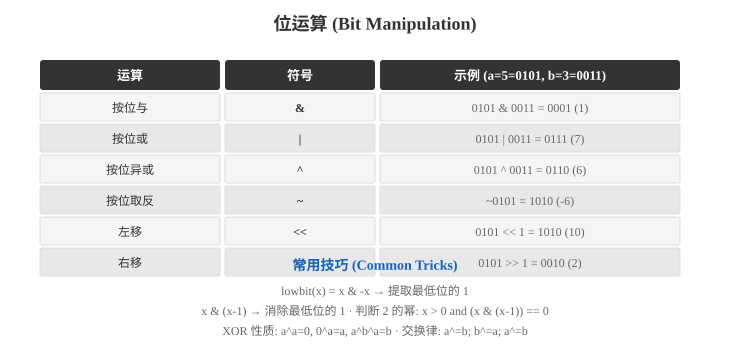
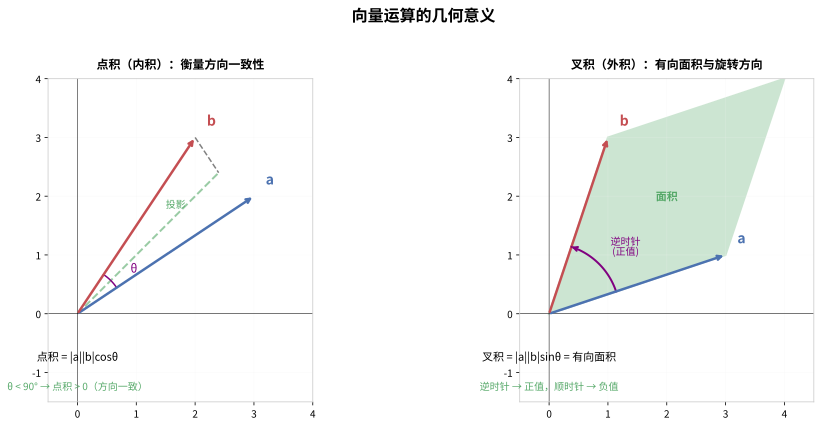
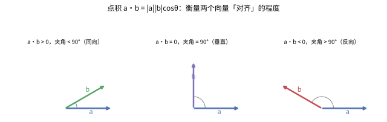
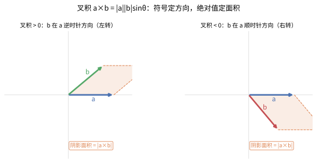
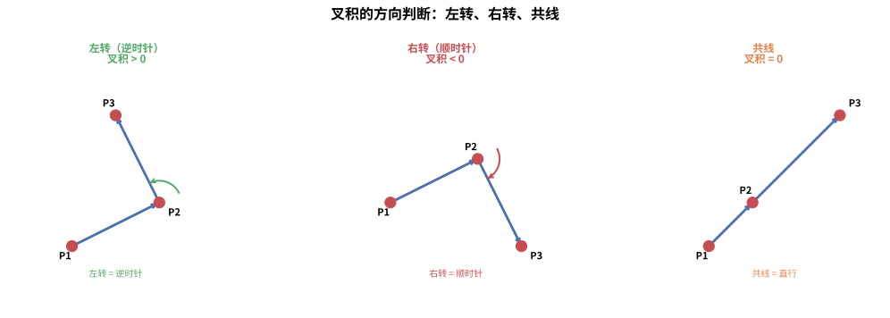
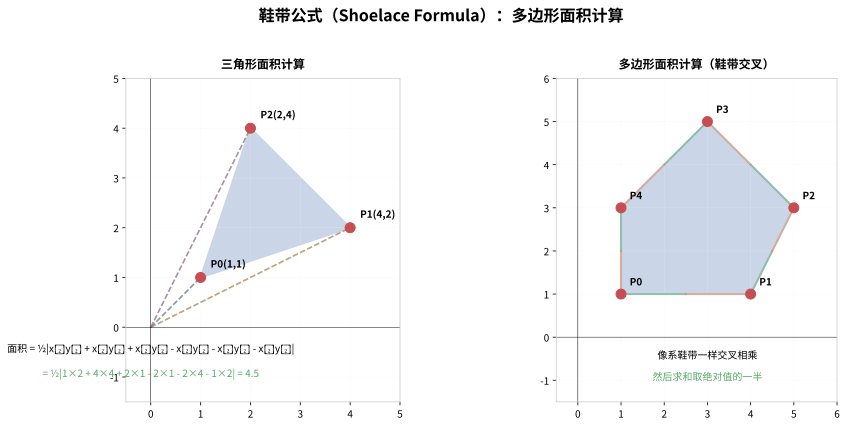
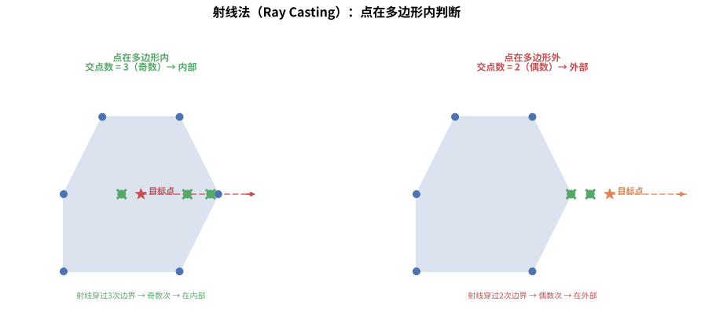
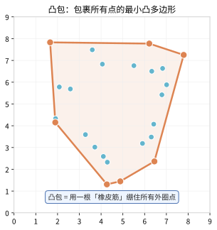
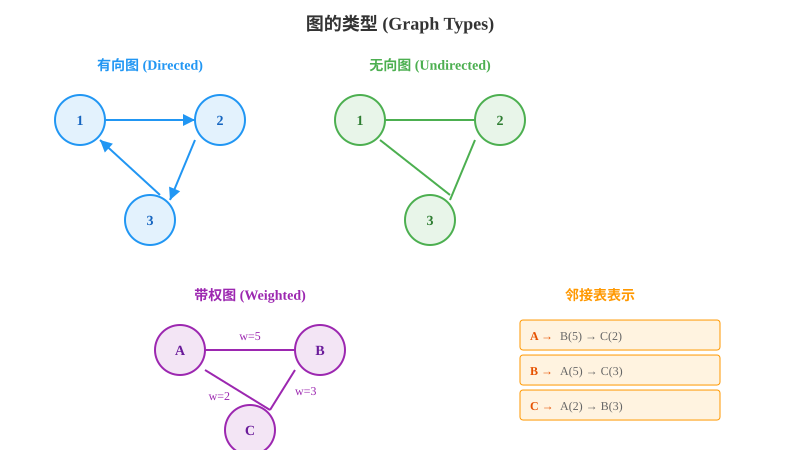
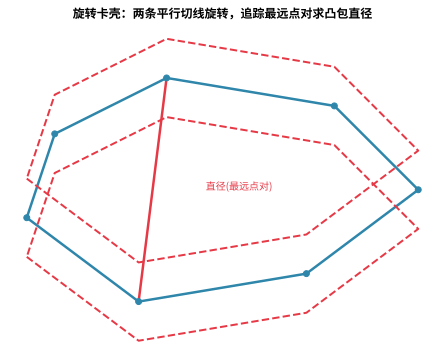

# 第九章 计算几何

> 计算几何是算法面试中的难点，但掌握核心技巧后其实并不可怕。本章将用最直观的方式，带你攻克计算几何。

---

## 9.1 向量基础

> **计算几何的基石**：就像位运算是计算机的底层基础一样，向量的基本运算（点积、叉积）是计算几何的核心原语。所有复杂的几何算法都建立在这些简单运算之上。



### 9.1.1 点的表示

> 💡 **类比：点如同"GPS坐标"**
>
> 想象你在地图上定位一个位置——经纬度就是那个点的坐标。在计算几何中，我们用 `(x, y)` 来表示二维空间中的位置，就像GPS用经纬度定位地球上的位置一样。
>
> 不同的表示方式（namedtuple、元组、类）就像不同的地图APP——高德、百度、腾讯地图，底层都是经纬度，只是接口不同。

在计算几何中，最基本的元素就是**点**。我们用坐标 `(x, y)` 来表示二维空间中的一个点。

```python
from collections import namedtuple

# 方式一：使用 namedtuple（推荐，可读性好）
Point = namedtuple('Point', ['x', 'y'])

# 方式二：使用元组（简单）
p = (1, 2)

# 方式三：自定义类（灵活，可添加方法）
class Point:
    def __init__(self, x: int | float, y: int | float):
        self.x = x
        self.y = y
    
    def __repr__(self):
        return f"({self.x}, {self.y})"
    
    def __eq__(self, other):
        return self.x == other.x and self.y == other.y
    
    def __hash__(self):
        return hash((self.x, self.y))
```

> **面试建议**：在面试手写代码时，使用 `namedtuple` 或简单的元组即可。定义完整的 `Point` 类可能会浪费时间，除非题目明确要求。

### 9.1.2 向量的基本运算

> 💡 **类比：向量如同"风向和风速"**
>
> 想象气象图上的风矢量——箭头方向是风向，箭头长度是风速。向量运算就像风的合成：
> - **向量加法**：两股风叠加，形成新的风向和风速
> - **向量减法**：从一股风中"减去"另一股，得到相对风
> - **点积**：衡量两股风的"一致性"——方向越一致，点积越大
> - **叉积**：衡量两股风的"旋转趋势"——是顺时针还是逆时针旋转

下图直观展示了点积和叉积的几何意义：



向量可以看作是从原点 `(0,0)` 指向点 `(x,y)` 的有向线段。两个向量之间可以进行加减、点积和叉积运算。

```
    y
    ^
    |   (x2, y2)
    |   /  ↑
    |  /   | 向量B
    | /    |
    |/_____|____> x
    (x1, y1)
```

```python
import math
from collections import namedtuple

Point = namedtuple('Point', ['x', 'y'])

def add(a: Point, b: Point) -> Point:
    """向量加法"""
    return Point(a.x + b.x, a.y + b.y)

def subtract(a: Point, b: Point) -> Point:
    """向量减法：a - b"""
    return Point(a.x - b.x, a.y - b.y)

def dot(a: Point, b: Point) -> int | float:
    """点积（内积）：a·b = |a||b|cos(θ)
    
    应用：
    - 点积 > 0  → 夹角 < 90°（方向大致相同）
    - 点积 = 0  → 夹角 = 90°（垂直）
    - 点积 < 0  → 夹角 > 90°（方向大致相反）
    """
    return a.x * b.x + a.y * b.y

def cross(a: Point, b: Point) -> int | float:
    """叉积（外积）：a × b = |a||b|sin(θ)
    
    叉积的几何意义是"有向面积"：
    - 正值：b 在 a 的逆时针方向（左侧）
    - 负值：b 在 a 的顺时针方向（右侧）
    - 零值：a 和 b 共线（平行）
    """
    return a.x * b.y - a.y * b.x

def norm(v: Point) -> float:
    """向量的模（长度）"""
    return math.sqrt(v.x * v.x + v.y * v.y)

def distance(a: Point, b: Point) -> float:
    """两点间距离"""
    return norm(subtract(a, b))
```

### 向量运算的几何意义

**点积（内积）** 的几何意义：
- 点积 $a \cdot b = |a||b|\cos\theta$ 衡量了两个向量的"对齐程度"
- 正值表示夹角小于 $90^\circ$（方向大致相同），零值表示垂直，负值表示夹角大于 $90^\circ$
- 在图形学中，点积常用于计算光照、判断前后方向

> 💡 **类比：投影与"影子"** 点积 $a \cdot b$ 可以理解为"把 b 投影到 a 方向上，再乘以 a 的长度"。夹角越小，b 在 a 方向上的"影子"越长，点积越大。下图直观展示了三种夹角下的点积符号：



**叉积（外积）** 的几何意义：
- 叉积 $a \times b = |a||b|\sin\theta$ 的绝对值等于以 $a$、$b$ 为邻边的平行四边形的**有向面积**
- 叉积的符号指示了 $b$ 相对于 $a$ 的旋转方向（逆时针为正、顺时针为负）
- 叉积为零当且仅当两向量共线（平行或反平行）
- 叉积是计算多边形面积、判断点线方位、检测线段相交等所有几何算法的核心基础

> 💡 **类比：方向盘与"左转右转"** 叉积的符号就像你看 b 相对于 a 是**向左转还是向右转**——逆时针（左转）为正，顺时针（右转）为负。而它的绝对值告诉你这两个向量围成的"平行四边形面积"有多大。这正是指纹识别、碰撞检测、多边形面积算法的基石。下图示意两种旋转方向与面积：



### 9.1.3 叉积的应用：方向判断

> 💡 **类比：叉积如同"方向盘"**
>
> 想象你在开车，叉积告诉你方向盘该往哪打：
> - **叉积 > 0**：左转（逆时针）
> - **叉积 < 0**：右转（顺时针）
> - **叉积 = 0**：直行（三点共线）
>
> 这就是为什么导航软件能判断你是否"走错路"——它用叉积检测你的行驶方向是否正确。

下图直观展示了三种方向判断的情况：



叉积是计算几何中**最重要的基础运算**，几乎所有算法都建立在它之上。

```python
def orientation(p: Point, q: Point, r: Point) -> int:
    """判断三点 p→q→r 的方向（转弯方向）
    
    计算向量 (q-p) × (r-q) 的叉积：
    
        r
       ↗
      q
     ↗
    p
    
    返回值：
     1  → 逆时针（左转，CounterClockWise）
    -1  → 顺时针（右转，ClockWise）
     0  → 共线（Collinear）
    """
    # 向量 PQ = q - p
    # 向量 QR = r - q  
    # 叉积 = PQ × QR 的 z 分量
    val = cross(subtract(q, p), subtract(r, q))
    
    if val > 0:
        return 1      # 逆时针（左转）
    elif val < 0:
        return -1     # 顺时针（右转）
    else:
        return 0      # 共线
```

```
逆时针（左转）:             顺时针（右转）:
    r                        p
   ↗                          ↘
  q                            q
 ↗                              ↘
p                                r

叉积 > 0                     叉积 < 0
```

### 9.1.4 多边形面积——鞋带公式

> 💡 **类比：鞋带公式如同"系鞋带"**
>
> 想象你在系鞋带——交叉穿过鞋孔。鞋带公式的名字就来源于此：
> - 把多边形的顶点按顺序排列，像鞋孔一样
> - 交叉相乘（x₁y₂ - x₂y₁），像鞋带交叉穿过
> - 最后求和取绝对值的一半，得到面积
>
> 这个公式的巧妙之处在于：它把复杂的多边形分解成无数个三角形，然后累加它们的有向面积。

下图展示了鞋带公式的计算过程——像系鞋带一样交叉相乘：



**鞋带公式（Shoelace Formula）** 也叫高斯面积公式，用于计算任意简单多边形的面积。

```
原理：将多边形顶点按顺序排列，交叉相乘后求和，再求差的一半。

        (x1,y1)────(x2,y2)
        /              \
      /                \
    (x0,y0)          (x3,y3)
      \                /
       \              /
        (x5,y5)────(x4,y4)

面积 = ½ × |Σ(xi·y(i+1) - x(i+1)·yi)|
```

```python
def polygon_area(points: list[Point]) -> float:
    """计算多边形面积（鞋带公式）
    
    Args:
        points: 按顺序排列的多边形顶点（首尾不相连，会自动闭合）
    
    Returns:
        多边形面积（正值）
    """
    n = len(points)
    area = 0.0
    
    for i in range(n):
        j = (i + 1) % n  # 下一个顶点，最后一个顶点连接到第一个
        area += points[i].x * points[j].y
        area -= points[j].x * points[i].y
    
    return abs(area) / 2.0

# 示例：计算三角形面积
triangle = [Point(0, 0), Point(3, 0), Point(0, 4)]
print(f"三角形面积: {polygon_area(triangle)}")  # 输出: 6.0
```

### 9.1.5 计算几何的基本概念总结

> 💡 **类比：计算几何如同"用计算器画图"**
>
> 传统几何用尺规作图，计算几何用代码算图。就像从手绘地图到GPS导航的升级：
> - **点与向量**：从"看一眼"到"精确坐标"
> - **叉积**：从"目测方向"到"数学判定"
> - **面积**：从"数格子"到"公式计算"
>
> 计算几何的核心思想：**把几何问题转化为代数问题，用代码精确求解**。

计算几何的核心是**用代数方法解决几何问题**，其基本思想可概括为：

| 基本概念 | 代数工具 | 几何意义 | 典型应用 |
|---------|---------|---------|---------|
| 点与向量 | 坐标表示 $(x, y)$ | 空间中的位置 / 有向线段 | 所有几何对象的基石 |
| 方向判断 | 叉积的符号 | 判断三点是左转、右转还是共线 | 凸包、线段相交 |
| 有向面积 | 叉积的绝对值 | 平行四边形面积的一半 | 多边形面积、三角形面积 |
| 距离度量 | 欧几里得距离 | 两点间的直线距离 | 最近点对、直径计算 |
| 相对位置 | 射线法 / 角度和 | 点与多边形的位置关系 | 点在多边形内判定 |
| 极值问题 | 排序 + 扫描 | 在点集中寻找边界或最值 | 凸包、最远点对 |

> **核心思想**：将几何问题转化为代数计算，通过向量的加减乘除（主要是叉积）来精确描述几何关系，避免直接使用角度和三角函数带来的复杂性和精度问题。

### 9.1.6 精度控制的重要性

> 💡 **类比：浮点精度如同"四舍五入的陷阱"**
>
> 想象你用计算器算账：
> - 1/3 = 0.333333...（无限循环）
> - 计算器只能存有限位数，比如 0.333333
> - 0.333333 × 3 = 0.999999 ≠ 1
>
> 这就是浮点精度的陷阱。在计算几何中，0.0000001和0可能代表完全不同的几何意义（相交vs不相交），所以必须用epsilon阈值来判断"足够接近"。

计算几何中的浮点精度问题是**最容易出错但最容易被忽视**的环节。

| 常见问题 | 原因 | 解决方案 |
|---------|------|---------|
| 叉积判零 | 浮点运算 $10^{-15}$ 级误差 | 使用阈值 $\epsilon = 10^{-9}$，如 `abs(val) < EPS` 视为零 |
| 斜率计算 | 垂直线斜率无穷大 | 使用分数表示斜率（化简后的 `(dx, dy)` 对） |
| 平方根累积 | 多次开方放大误差 | 尽量使用平方距离比较，避免开方 |
| 角度比较 | $\arctan$ 精度损失 | 用叉积代替角度判断方向 |
| 排序稳定性 | 浮点比较不一致 | 使用整数/分数比较，或带 epsilon 的稳定排序 |

```python
EPS = 1e-9

def cross_with_eps(a: Point, b: Point) -> float:
    """带精度控制的叉积"""
    val = a.x * b.y - a.y * b.x
    if abs(val) < EPS:
        return 0.0
    return val

def orientation_with_eps(p: Point, q: Point, r: Point) -> int:
    """带精度控制的方向判断"""
    val = cross_with_eps(subtract(q, p), subtract(r, q))
    if val > EPS:
        return 1
    elif val < -EPS:
        return -1
    return 0
```

> **黄金法则**：永远不要直接用 `==` 比较浮点数，始终使用 epsilon 阈值。在面试中主动提及精度控制，能体现你对计算几何中工程细节的深刻理解。

---

## 9.2 几何算法

### 9.2.1 线段相交判断

判断两条线段是否相交，是计算几何中最经典的问题之一。

> 💡 **类比：线段相交如同"十字路口"**
>
> 想象两条线段是两条马路：
> - **方向测试**：每条马路的两端必须在另一条马路的两侧（就像十字路口的四个方向）
> - **边界框测试**：两条马路的投影范围必须有重叠（否则就像平行线，永远不会相交）
>
> 这就像判断两根筷子是否交叉——先看每根筷子的两头是否在另一根的两侧，再看它们的投影范围是否重叠。

**思路：两个条件缺一不可**
1. **方向测试**：每条线段的两个端点分别在另一条线段的两侧
2. **边界框测试**：两条线段的投影矩形有重叠（处理共线相交的情况）

```
线段 AB 和 CD 相交的条件：
    
    A───B          A───B
      ╲              ╱
       ╲            ╱
        ╲          ╱
         C───D    C───D
    
    (a) 正常相交      (b) 交叉相交
```

```python
def on_segment(p: Point, q: Point, r: Point) -> bool:
    """判断点 q 是否在线段 pr 上（假设三点共线）"""
    return (min(p.x, r.x) <= q.x <= max(p.x, r.x) and
            min(p.y, r.y) <= q.y <= max(p.y, r.y))

def segments_intersect(p1: Point, q1: Point, p2: Point, q2: Point) -> bool:
    """判断线段 p1q1 和线段 p2q2 是否相交
    
    算法步骤：
    1. 计算四个方向值
    2. 如果方向值异号，说明端点在异侧 → 相交
    3. 如果方向值为0，检查是否在边界框内（共线情况）
    """
    o1 = orientation(p1, q1, p2)
    o2 = orientation(p1, q1, q2)
    o3 = orientation(p2, q2, p1)
    o4 = orientation(p2, q2, q1)
    
    # 情况1：一般相交（异侧）
    if o1 != o2 and o3 != o4:
        return True
    
    # 情况2-5：共线特殊情况，检查点是否在线段上
    if o1 == 0 and on_segment(p1, p2, q1):
        return True
    if o2 == 0 and on_segment(p1, q2, q1):
        return True
    if o3 == 0 and on_segment(p2, p1, q2):
        return True
    if o4 == 0 and on_segment(p2, q1, q2):
        return True
    
    return False

# 示例
A, B = Point(1, 1), Point(4, 4)
C, D = Point(1, 4), Point(4, 1)
print(f"线段AB和CD相交: {segments_intersect(A, B, C, D)}")  # True（交叉）

E, F = Point(1, 1), Point(2, 2)
G, H = Point(3, 3), Point(5, 5)
print(f"线段EF和GH相交: {segments_intersect(E, F, G, H)}")  # False（分离）
```

### 9.2.2 点在多边形内——射线法

> 💡 **类比：射线法如同"数围墙"**
>
> 想象你站在一片草地上，想知道自己是否在围栏内：
> - 向右看，数一数视线穿过了几道围栏
> - **奇数道**：你在围栏内（穿过去了一次、三次...）
> - **偶数道**：你在围栏外（穿过去了零次、两次...又出来了）
>
> 这就像在迷宫里——如果你穿墙次数是奇数，说明你在里面；偶数次说明你在外面。

下图直观展示了射线法的判断过程：



**射线法（Ray Casting）**：从目标点向右发射一条水平射线，统计与多边形边的交点数。奇数次 → 内部，偶数次 → 外部。

```
点在多边形内部（交点数为奇数）：
    
         ╱────╲
        ╱   ●  ╲────→  (射线，与边相交3次→奇数→内部)
        ╲      ╱
         ╲────╱

点在多边形外部（交点数为偶数）：
    
         ╱────╲
    ●──→╱     ╲────→  (射线，与边相交2次→偶数→外部)
        ╲      ╱
         ╲────╱
```

```python
def point_in_polygon(point: Point, polygon: list[Point]) -> bool:
    """判断点是否在多边形内（射线法）
    
    Args:
        point: 待判断的点
        polygon: 多边形顶点列表（按顺序，首尾不相连）
    
    Returns:
        True 表示点在多边形内部或边上
    """
    n = len(polygon)
    inside = False
    
    for i in range(n):
        j = (i + 1) % n
        xi, yi = polygon[i].x, polygon[i].y
        xj, yj = polygon[j].x, polygon[j].y
        
        # 检查从点向右的水平射线是否与边 (polygon[i], polygon[j]) 相交
        # 条件：点的y在边两端点的y之间，且交点在点的右侧
        if ((yi > point.y) != (yj > point.y)):
            # 计算交点的x坐标
            x_intersect = xi + (point.y - yi) * (xj - xi) / (yj - yi)
            if point.x < x_intersect:
                inside = not inside
    
    return inside

# 示例
polygon = [Point(0, 0), Point(4, 0), Point(4, 4), Point(0, 4)]
print(f"点(2,2)在正方形内: {point_in_polygon(Point(2, 2), polygon)}")  # True
print(f"点(5,5)在正方形内: {point_in_polygon(Point(5, 5), polygon)}")  # False
```

### 9.2.3 凸包——Andrew 单调链算法

**凸包**：在平面上，包含所有点的最小凸多边形。想象用一根橡皮筋绷在所有点之外。

```
原始点集：                    凸包结果：
    *        *                    *────*
          *                      /      \
  *           *       →         *        *
      *   *                      \      /
    *                            *────*
```

> 💡 **类比：一圈橡皮筋 / 给海盗钉木板**
> 想象把所有点想成钉在木板上的钉子，然后拉一根橡皮筋把它们全部套住——橡皮筋自然收缩后绷紧所围成的形状，就是凸包。下图用随机点集直观展示了"包裹所有点的最小凸多边形"：



> **凸包与图论的关系**：凸包可以看作是从点集中构建的一个"凸多边形图"，其顶点是原始点集的子集，边连接相邻的凸包顶点。在计算几何中，凸包为许多图论问题（如最远点对、直径计算）提供了高效的求解基础。



**Andrew 算法**（单调链算法）：
1. 将所有点按 x 坐标排序（x 相同按 y 排序）
2. 从左到右构建下凸壳
3. 从右到左构建上凸壳
4. 合并上下凸壳

```python
def convex_hull(points: list[Point]) -> list[Point]:
    """Andrew 单调链算法求凸包
    
    Args:
        points: 点集
    
    Returns:
        凸包顶点列表（逆时针顺序，首尾不相连）
    
    时间复杂度: O(n log n)
    """
    if len(points) <= 1:
        return points
    
    # 1. 按 x 坐标排序（x相同按y排序）
    points = sorted(points, key=lambda p: (p.x, p.y))
    
    # 2. 构建下凸壳
    lower = []
    for p in points:
        while len(lower) >= 2 and cross(
            subtract(lower[-1], lower[-2]),
            subtract(p, lower[-1])
        ) <= 0:
            lower.pop()
        lower.append(p)
    
    # 3. 构建上凸壳
    upper = []
    for p in reversed(points):
        while len(upper) >= 2 and cross(
            subtract(upper[-1], upper[-2]),
            subtract(p, upper[-1])
        ) <= 0:
            upper.pop()
        upper.append(p)
    
    # 4. 合并（去掉首尾重复点）
    return lower[:-1] + upper[:-1]


# 示例
import random

# 随机生成点
random.seed(42)
points = [Point(random.randint(0, 100), random.randint(0, 100)) 
          for _ in range(20)]

hull = convex_hull(points)
print(f"凸包顶点数: {len(hull)}")
print(f"凸包顶点: {hull}")
```

#### 凸包算法对比

| 算法 | 时间复杂度 | 空间复杂度 | 核心思路 | 适用场景 |
|-----|-----------|-----------|---------|---------|
| **Andrew 单调链** | $O(n \log n)$ | $O(n)$ | 排序后分上下凸壳分别构建 | 最常用，实现简洁，面试首选 |
| **Graham 扫描** | $O(n \log n)$ | $O(n)$ | 按极角排序后一次扫描 | 经典算法，需处理共线情况 |
| **Jarvis 步进** | $O(nh)$ | $O(n)$ | 从最低点开始每次找最外侧点 | 当凸包顶点数 $h$ 很小时高效 |
| **QuickHull** | 平均 $O(n \log n)$，最坏 $O(n^2)$ | $O(n)$ | 分治思想，找最远点分割 | 平均性能好，但最坏情况退化 |
| **Melkman** | $O(n)$ | $O(n)$ | 双端队列维护凸包 | 仅适用于简单多边形（已排序） |

> **面试建议**：掌握 **Andrew 算法** 即可应对绝大多数面试题。Andrew 算法无需计算极角（避免 $\arctan$ 的浮点精度问题），且实现直观，是计算几何领域的推荐首选。

### 9.2.4 最近点对——分治法

**问题**：在平面上找到距离最近的两个点。

> 💡 **类比：最近点对如同"找邻居"**
>
> 想象一个班级里找座位最近的两个同学：
> - **暴力法**：让每个人都和其他所有人比距离（$O(n^2)$）
> - **分治法**：先把教室分成左右两半，分别找每半的最近点对，再检查跨越中线的点对
> - **关键优化**：跨越中线的点对只需要检查距离中线 d 以内的点（d 是左右两半的最近距离），其他点不可能更近
>
> 这就像找最近的邻居——你不需要问整条街的人，只需要问附近的几户人家。

**思路**：分治三步走
1. **分**：按 x 坐标排序后从中点分为左右两部分
2. **治**：递归求左右两部分的最近距离
3. **合**：考虑跨越中线的点对，只检查距离中线 d 以内的点

```
   左半部分 | 右半部分
           |
    *      |    *
         * |      *
    *    d |d    *
       *   |   *       ← 只检查中线两侧 d 范围内的点
    *    d |d      *
         * |  *
    *      |    *
           |
```

```python
def closest_pair(points: list[Point]) -> tuple[float, tuple[Point, Point]]:
    """求最近点对（分治法）
    
    Args:
        points: 点集
    
    Returns:
        (最短距离, (点A, 点B))
    
    时间复杂度: O(n log n)
    """
    def dist(p1: Point, p2: Point) -> float:
        return math.sqrt((p1.x - p2.x)**2 + (p1.y - p2.y)**2)
    
    # 按 x 排序
    px = sorted(points, key=lambda p: (p.x, p.y))
    
    def closest(px: list[Point]) -> tuple[float, tuple[Point, Point]]:
        n = len(px)
        if n <= 1:
            return float('inf'), (None, None)
        if n == 2:
            return dist(px[0], px[1]), (px[0], px[1])
        if n == 3:
            d1, p1 = dist(px[0], px[1]), (px[0], px[1])
            d2, p2 = dist(px[1], px[2]), (px[1], px[2])
            d3, p3 = dist(px[0], px[2]), (px[0], px[2])
            best = min((d1, p1), (d2, p2), (d3, p3), key=lambda x: x[0])
            return best
        
        # 分
        mid = n // 2
        mid_x = px[mid].x
        d_left, pair_left = closest(px[:mid])
        d_right, pair_right = closest(px[mid:])
        d, best_pair = min((d_left, pair_left), (d_right, pair_right), 
                           key=lambda x: x[0])
        
        # 合：检查跨越中线的点
        strip = [p for p in px if abs(p.x - mid_x) < d]
        # 按 y 排序
        strip.sort(key=lambda p: p.y)
        
        for i in range(len(strip)):
            for j in range(i + 1, len(strip)):
                if strip[j].y - strip[i].y >= d:
                    break
                dd = dist(strip[i], strip[j])
                if dd < d:
                    d = dd
                    best_pair = (strip[i], strip[j])
        
        return d, best_pair
    
    return closest(px)

# 示例
points = [Point(2, 3), Point(12, 30), Point(40, 50), Point(5, 1), 
          Point(12, 10), Point(3, 4)]
d, (p1, p2) = closest_pair(points)
print(f"最近距离: {d:.4f}")  # 点(2,3)和(3,4)之间的距离 ≈ 1.4142
print(f"最近点对: ({p1.x},{p1.y}) - ({p2.x},{p2.y})")
```

### 9.2.5 旋转卡壳——求凸包直径

> 💡 **类比：旋转卡壳如同"测量西瓜"**
>
> 想象你要测量一个西瓜的最长直径：
> - 用两根平行木板夹住西瓜
> - 旋转木板，始终保持与西瓜相切
> - 记录木板间距最大的时刻，那就是最长直径
>
> 旋转卡壳算法就是这个思路——用两条平行线"卡"住凸包，旋转一周，找到最远点对。



**旋转卡壳（Rotating Calipers）**：在凸包上，用两条平行线"卡"住凸包，旋转一周找最大距离。

```
想象用一把卡尺测量凸包的最宽处：
    
     ╱────────────╲    ← 上卡尺
    ╱              ╲
   ╱                ╲
   ╲                ╱
    ╲              ╱
     ╲────────────╱    ← 下卡尺
    
    旋转卡尺，记录最大距离
```

```python
def convex_hull_diameter(points: list[Point]) -> float:
    """旋转卡壳求凸包直径（最远点对距离）
    
    Args:
        points: 点集
    
    Returns:
        凸包直径（最远点对距离）
    
    时间复杂度: O(n)
    """
    def dist_sq(p1: Point, p2: Point) -> int:
        return (p1.x - p2.x)**2 + (p1.y - p2.y)**2
    
    # 先求凸包
    hull = convex_hull(points)
    n = len(hull)
    
    if n <= 1:
        return 0.0
    if n == 2:
        return math.sqrt(dist_sq(hull[0], hull[1]))
    
    # 旋转卡壳
    k = 1
    max_dist = 0
    
    for i in range(n):
        # 当 hull[i+1] 到 hull[k] 的距离比到 hull[k+1] 小，则移动 k
        while True:
            next_k = (k + 1) % n
            # 比较叉积大小来判断距离变化
            cross_val = cross(
                subtract(hull[(i + 1) % n], hull[i]),
                subtract(hull[next_k], hull[k])
            )
            if cross_val > 0:
                k = next_k
            else:
                break
        
        # 更新最大距离
        max_dist = max(max_dist, dist_sq(hull[i], hull[k]))
        max_dist = max(max_dist, dist_sq(hull[(i + 1) % n], hull[k]))
    
    return math.sqrt(max_dist)

# 示例
points = [Point(0, 0), Point(3, 0), Point(3, 4), Point(0, 4), 
          Point(1, 1), Point(2, 2)]
diameter = convex_hull_diameter(points)
print(f"凸包直径: {diameter:.4f}")  # 5.0（矩形对角线）
```

### 9.2.6 极角排序

> 💡 **类比：极角排序如同"以原点为中心的指针"**
>
> 想象你站在原点，手里拿着一根指针，把指针转一圈，按扫过的顺序给点排队：
> - **极角**：每个点相对原点的"方向角度"，就像指针指向的角度
> - **排序**：把指针从 $0^\circ$ 转到 $360^\circ$，按扫过的先后给点排成一圈
>
> 这就像给派对上的客人按"顺时针座位"安排座位——从门口的 $0^\circ$ 开始，一个人一个人排下去。

**极角排序**：把平面上的点集按它们相对某个参考点（通常是原点）的极角从小到大排序。它是 Graham 扫描凸包、扫描线算法等的基础操作。

**核心**：比较两个点的极角，最直接的方法是计算 $\arctan2(y, x)$ 后比较角度。但 $\arctan$ 涉及浮点开方与除法，精度易失。**更推荐用叉积比较器**：判断点 $b$ 是否在点 $a$ 的逆时针方向，只需计算 $a \times b$ 的符号，全程只用整数/乘法，无浮点误差。

```
极角排序后，点按角度排成一圈：

         ●90°
        ╱     
   180°●       ●0°  ← 排序起点
        ╲    
         ●270°

按逆时针：0° → 90° → 180° → 270°
```

```python
from functools import cmp_to_key

def polar_sort(points: list[Point], origin: Point = Point(0, 0)) -> list[Point]:
    """按相对 origin 的极角排序（用叉积比较器，避免浮点误差）
    
    思路：
    1. 先按象限分组（借助叉积），保证同一象限内按角度升序
    2. 用叉积判断两点的相对方向，替代 arctan 比较
    
    时间复杂度: O(n log n)
    """
    v = lambda p: subtract(p, origin)  # 向量 = 点 - 原点

    def cmp(a: Point, b: Point) -> int:
        va, vb = v(a), v(b)
        # 用叉积符号判断象限，优先级是：右上 > 左上 > 左下 > 右下
        upper_a = (va.y > 0) or (va.y == 0 and va.x >= 0)
        upper_b = (vb.y > 0) or (vb.y == 0 and vb.x >= 0)
        if upper_a != upper_b:
            return -1 if upper_a else 1
        # 同象限内，叉积确定相对方向
        c = cross(va, vb)
        if c > 0:
            return -1   # a 在 b 的逆时针方向，a 角更小
        elif c < 0:
            return 1
        return 0        # 共线，角相等

    return sorted(points, key=cmp_to_key(cmp))

# 示例
pts = [Point(1, 1), Point(-1, 0), Point(0, -2), Point(2, 0), Point(0, 1)]
sorted_pts = polar_sort(pts)
print("极角排序结果:", sorted_pts)  # (2,0),(1,1),(0,1),(-1,0),(0,-2)
```

> **适用场景**：Graham 扫描求凸包（按极角排序后一次扫描）、判断点是否在多边形内、统计共线点、扫描线类问题。**面试提示**：能用叉积比较器的地方就尽量别用 $\arctan$，这是加分项。

### 9.2.7 半平面交

> 💡 **类比：半平面交如同"多条'只准在某一侧'的规则"**
>
> 想象一座城市有很多条"单侧通行"的规则：
> - 每条大街规定"只准在它的北侧活动"
> - 另一条规定"只准在它的东侧活动"
>
> 你要同时满足**所有**规则，能活动的区域就是这些半平面的交集。规则越多，允许的区域越小——最后通常收敛成一个凸多边形，就像规规矩矩圈出的禁行区。

**半平面交（Half-plane Intersection）**：给定若干条直线，每条直线把平面分成左右两半（半平面），求所有半平面公共覆盖的区域。由于每个半平面都是凸集，交集也是凸集，因此结果是一个**凸多边形**（或为空、或为无界区域）。

**核心**：常用的方法有**增量法**和**排序扫描法（S&I 算法）**。这里给出一个讲解思想的简化版——用一个足够大的初始凸多边形（如大矩形），逐条用半平面"裁剪"它：
1. 对每条半平面，用它的边界直线去裁剪当前多边形
2. 保留位于半平面内侧的顶点，并在边界处插入新的交点
3. 重复直到所有半平面处理完毕

```
用半平面 ax+by+c ≤ 0 裁剪多边形：

    裁剪前                 裁剪后
    ●────●                  ●────●
    │    │       →           ●    │    (右侧被切掉，新增交点)
    ●────●                  ●────●
```

```python
def clip_halfplane(poly: list[Point], a: float, b: float, c: float) -> list[Point]:
    """用半平面 ax + by + c ≤ 0 裁剪凸多边形 poly（简化版，讲清思想）
    
    保留满足 a*x + b*y + c <= 0 的点
    """
    def inside(p: Point) -> float:
        return a * p.x + b * p.y + c

    n = len(poly)
    if n == 0:
        return []
    out = []
    for i in range(n):
        cur, nxt = poly[i], poly[(i + 1) % n]
        cur_in, nxt_in = inside(cur) <= 0, inside(nxt) <= 0
        if cur_in:                # 当前点在半平面内侧，保留
            out.append(cur)
        if cur_in != nxt_in:      # 两点一内一外，必有交点，插入交点
            # 参数 t 使交点恰好落在边界上：inside(cur) + t*(inside(nxt)-inside(cur)) = 0
            t = inside(cur) / (inside(cur) - inside(nxt))
            out.append(Point(cur.x + t * (nxt.x - cur.x),
                             cur.y + t * (nxt.y - cur.y)))
    return out

# 示例：用四条半平面围出正方形区域
big = [Point(-10, -10), Point(10, -10), Point(10, 10), Point(-10, 10)]
region = big
# 依次约束：x>=-1, x<=1, y>=-1, y<=1  → 等价于 ax+by+c<=0
region = clip_halfplane(region, -1, 0, 1)   # -x + 1 <= 0 → x >= 1
region = clip_halfplane(region,  1, 0, 1)   #  x + 1 <= 0 → x <= 1
region = clip_halfplane(region,  0, -1, 1)  # -y + 1 <= 0 → y >= 1
region = clip_halfplane(region,  0, 1, 1)   #  y + 1 <= 0 → y <= 1
print("交集多边形:", region)  # 四条边围成的正方形 [-1,1]×[-1,1]
```

> 完整版（排序扫描法）先按极角排序直线，再用双端队列维护边与交点的凸包，时间复杂度可做到 $O(n \log n)$。
>
> **适用场景**：求可行域（线性规划可视化）、判断多条规则能否同时满足、计算多边形核（多边形内能看到所有顶点/边的区域，即"安全区域"）。

### 9.2.8 最小圆覆盖

> 💡 **类比：最小圆覆盖如同"找一个最小的圆把一群点都罩住"**
>
> 想象一群羊在草地上，你想用一把尽可能小的伞把所有羊都罩住避雨：
> - 伞太大浪费，太小罩不全
> - 最优的伞一定"贴"着至少 2~3 只羊（要么直径两端各一只，要么圆周上有 3 只）
>
> 最小圆覆盖就是在平面上找一个**能覆盖所有点的最小圆**。

**最小圆覆盖（Smallest Enclosing Circle）**：给定点集，求覆盖全部点的最小圆。**核心：随机增量法**——每次加入一个新点，若它在当前圆外，则新圆必须经过该点，再据此调整。随机化保证了期望复杂度 $O(n)$。

**算法步骤**：
1. **随机打乱**所有点（保证期望复杂度）
2. 依次加入点 $p_i$：若 $p_i$ 在当前圆内，继续；否则新圆以 $p_i$ 为圆周点，重新构造
3. 构造时：先找第二个点 $p_j$ 使圆以 $p_i, p_j$ 为直径；若 $p_j$ 又在圆外，则新圆以 $p_i, p_j, p_k$ 三点确定

```
关键性质：圆必然由 2 或 3 个点确定
     ●      ●         ●
   ╱   ╲    ╱╲        ╱  ╲
  ●     ●  ●  ●      ●    ●
   ╲   ╱    ╲╱        ╲  ╱
     ●                  ●
  直径两点确定圆     三点确定圆
```

```python
import random

def circle_2pts(p1: Point, p2: Point) -> tuple[Point, float]:
    """以 p1,p2 为直径的圆，返回 (圆心, 半径)"""
    c = Point((p1.x + p2.x) / 2, (p1.y + p2.y) / 2)
    return c, distance(p1, p2) / 2

def circle_3pts(p1: Point, p2: Point, p3: Point) -> tuple[Point, float]:
    """三点确定的外接圆，返回 (圆心, 半径)"""
    ax, ay = p1.x, p1.y
    bx, by = p2.x, p2.y
    cx, cy = p3.x, p3.y
    d = 2 * (ax * (by - cy) + bx * (cy - ay) + cx * (ay - by))
    ux = ((ax*ax + ay*ay) * (by - cy) + (bx*bx + by*by) * (cy - ay) + (cx*cx + cy*cy) * (ay - by)) / d
    uy = ((ax*ax + ay*ay) * (cx - bx) + (bx*bx + by*by) * (ax - cx) + (cx*cx + cy*cy) * (bx - ax)) / d
    center = Point(ux, uy)
    return center, distance(center, p1)

def min_circle(points: list[Point]) -> tuple[Point, float]:
    """最小圆覆盖（随机增量法）
    
    时间复杂度: 期望 O(n)，最坏 O(n³)
    """
    pts = points[:]
    random.shuffle(pts)          # 关键：随机化打乱
    n = len(pts)
    if n == 0:
        return Point(0, 0), 0.0
    if n == 1:
        return pts[0], 0.0

    c, r = circle_2pts(pts[0], pts[1])
    for i in range(2, n):
        if distance(pts[i], c) <= r:      # 点在圆内，忽略
            continue
        # 点在圆外 → 新圆必经 pts[i]
        c, r = circle_2pts(pts[0], pts[i])
        for j in range(1, i):
            if distance(pts[j], c) <= r:
                continue
            c, r = circle_2pts(pts[i], pts[j])
            for k in range(j):
                if distance(pts[k], c) > r:
                    c, r = circle_3pts(pts[i], pts[j], pts[k])
    return c, r

# 示例
random.seed(42)
pts = [Point(random.randint(0, 100), random.randint(0, 100)) for _ in range(10)]
c, r = min_circle(pts)
print(f"最小圆圆心: ({c.x:.2f}, {c.y:.2f}), 半径: {r:.2f}")
```

> **适用场景**：信号塔信号覆盖、配送半径规划、碰撞检测、聚类中的最小包围圆。**面试提示**：随机增量法思路清晰，务必记住"点在外才调整"这一核心，以及打乱顺序对期望复杂度的必要性。

### 9.2.9 圆与直线 / 圆与圆位置关系

> 💡 **类比：判断两个圆盘是"相离、相切、相交还是包含"**
>
> 想象两枚硬币放在桌上：
> - 离得很远，碰不到 → **相离**
> - 刚好碰到一个点 → **相切**
> - 有一部分重叠 → **相交**
> - 一个完全套住另一个 → **包含**
>
> 判断的依据只有一句话：**看两圆心之间的距离和半径的关系**。就像丈量两枚硬币中心点之间的距离，再和它们的半径比一比。

**核心思想**：位置关系本质上都是**距离比较**。

**圆与直线**：判断圆心到直线的**距离 $d$** 与半径 $r$ 的关系：
- $d > r$：相离（无交点）
- $d = r$：相切（1 个交点）
- $d < r$：相交（2 个交点）

点到直线 $Ax + By + C = 0$ 的距离公式：$d = \dfrac{|Ax_0 + By_0 + C|}{\sqrt{A^2 + B^2}}$

**圆与圆**：设两圆心距为 $d$，半径 $r_1, r_2$（设 $r_1 \ge r_2$）：
- $d > r_1 + r_2$：相离
- $d = r_1 + r_2$：外切
- $|r_1 - r_2| < d < r_1 + r_2$：相交
- $d = |r_1 - r_2|$：内切
- $d < |r_1 - r_2|$：包含（小圆在大圆内）

```
圆与圆位置关系（r1 ≥ r2）：
 相离      外切       相交      内切      包含
 ●   ●    ●●        ● ╭╮       ● ●      ●━●
 ●   ●    ●●          ╰╯       ● ●      ●━●
d>r1+r2  d=r1+r2  |r1-r2|<d    d=|r1-r2|  d<|r1-r2|
                   <r1+r2
```

```python
EPS = 1e-9

def line_circle_relation(c: Point, r: float, A: float, B: float, C: float) -> str:
    """直线 Ax+By+C=0 与圆 (c, r) 的位置关系"""
    d = abs(A * c.x + B * c.y + C) / math.sqrt(A*A + B*B)
    if d > r + EPS:
        return "相离"
    if d < r - EPS:
        return "相交"
    return "相切"

def circle_circle_relation(c1: Point, r1: float, c2: Point, r2: float) -> str:
    """两圆位置关系"""
    d = distance(c1, c2)
    if r1 < r2:                # 保证 r1 >= r2
        r1, r2 = r2, r1
    if d > r1 + r2 + EPS:
        return "相离"
    if abs(d - (r1 + r2)) <= EPS:
        return "外切"
    if abs(d - (r1 - r2)) <= EPS:
        return "内切"
    if d < r1 - r2 - EPS:
        return "包含"
    return "相交"

# 示例
print(line_circle_relation(Point(0, 0), 1, 1, 0, 0))    # 直线 x=0 过圆心 → 相交
print(circle_circle_relation(Point(0, 0), 1, Point(3, 0), 1))  # 圆心距3 > 2 → 相离
print(circle_circle_relation(Point(0, 0), 5, Point(0, 0), 2))  # 同心 → 包含
```

> **适用场景**：碰撞检测、几何图形裁剪、信号覆盖判定、圆与多边形相交的预处理。**面试提示**：位置关系几乎所有情况都归结为"距离 vs 半径"的比较，注意使用 epsilon 处理相切的边界情况。

### 9.2.10 Delaunay 三角剖分

> 💡 **类比：Delaunay 三角剖分如同"最圆润的三角形拼图"**
>
> 想象你有一堆钉子钉在木板上，要用三角形把它们连起来：
> - 你可以用很多种方式连接这些钉子形成三角形
> - 但 Delaunay 三角剖分有个特殊性质：**每个三角形的外接圆内不包含其他点**
> - 这使得三角形尽可能"圆润"，避免出现过于狭长的三角形
>
> 这就像拼图——Delaunay 方式拼出的三角形最"饱满"，最接近等边三角形。

**Delaunay 三角剖分**：给定点集，将其连接成三角形网格，满足"空圆性质"——每个三角形的外接圆内不包含其他点。

**核心性质**：
1. **空圆性质**：任意三角形的外接圆内不包含其他点
2. **最大化最小角**：在所有可能的三角剖分中，Delaunay 剖分使得最小角最大化
3. **唯一性**：一般点集的 Delaunay 剖分是唯一的（除非四点共圆）
4. **对偶性**：与 Voronoi 图互为对偶

**构建算法**：
- **增量法**：逐个加入点，维护 Delaunay 性质
- **分治法**：将点集分成两半，分别剖分后合并
- **翻转法**：从任意三角剖分开始，不断翻转不满足空圆性质的边

```python
from typing import List, Tuple

def delaunay_triangulation(points: List[Point]) -> List[Tuple[int, int, int]]:
    """Delaunay 三角剖分（增量法框架）
    
    Args:
        points: 点集
    
    Returns:
        三角形列表，每个三角形是三个点的索引 (i, j, k)
    
    时间复杂度: O(n log n) 或 O(n²) 取决于实现
    空间复杂度: O(n)
    """
    # 这里给出算法框架，完整实现较复杂
    # 实际应用中推荐使用 scipy.spatial.Delaunay
    
    n = len(points)
    if n < 3:
        return []
    
    # 1. 创建一个包含所有点的大三角形（超级三角形）
    # 2. 逐个加入点
    # 3. 对于每个新点，找到所有外接圆包含该点的三角形
    # 4. 删除这些三角形，将新点与它们的顶点连接形成新三角形
    # 5. 对新生成的边进行 Legalization（确保空圆性质）
    # 6. 最后移除超级三角形的顶点
    
    triangles = []
    
    # 伪代码示意
    super_triangle = create_super_triangle(points)
    triangles.append(super_triangle)
    
    for p in points:
        bad_triangles = []
        for tri in triangles:
            if point_in_circumcircle(p, tri, points):
                bad_triangles.append(tri)
        
        # 找出坏三角形的边界
        polygon = []
        for tri in bad_triangles:
            for edge in get_edges(tri):
                if edge not in shared_edges(bad_triangles):
                    polygon.append(edge)
        
        # 删除坏三角形
        for tri in bad_triangles:
            triangles.remove(tri)
        
        # 将新点与边界边连接
        for edge in polygon:
            new_tri = (edge[0], edge[1], points.index(p))
            triangles.append(new_tri)
    
    # 移除包含超级三角形顶点的三角形
    return remove_super_triangle(triangles)

def point_in_circumcircle(p: Point, tri: Tuple[int, int, int], points: List[Point]) -> bool:
    """判断点 p 是否在三角形 tri 的外接圆内"""
    # 使用行列式判断
    # 详细实现略
    pass

# 使用 scipy 的示例
from scipy.spatial import Delaunay
import numpy as np

points_np = np.array([[0, 0], [1, 0], [0, 1], [1, 1], [0.5, 0.5]])
tri = Delaunay(points_np)
print("三角形索引:", tri.simplices)
```

**应用场景**：
- 地形建模、三维重建
- 有限元网格生成
- 路径规划、机器人导航
- 地理信息系统（GIS）

> **面试提示**：Delaunay 三角剖分的核心是"空圆性质"，面试时能说出这个性质就足够。完整实现较复杂，建议掌握思想即可。

### 9.2.11 Voronoi 图

> 💡 **类比：Voronoi 图如同"披萨店的配送区域"**
>
> 想象城市里有多个披萨店，每个顾客都会被离自己最近的披萨店服务：
> - 把城市划分成多个区域，每个区域内的点都离对应的披萨店最近
> - 区域的边界就是 Voronoi 图的边
> - 每个披萨店是一个 Voronoi cell 的"种子"
>
> 这就像细胞分裂——每个细胞有自己的领地，边界就是相邻细胞的交界。

**Voronoi 图**：给定点集（称为站点），将平面划分成多个区域，每个区域内的点到对应站点的距离最近。

**与 Delaunay 的对偶关系**：
- Delaunay 三角剖分中两个点相连 ⟺ Voronoi 图中对应的两个 cell 相邻
- Delaunay 的三角形 ⟺ Voronoi 的顶点
- Delaunay 的边 ⟺ Voronoi 的边（互相垂直）

**构建算法**：
- **Fortune 算法**：扫描线算法，O(n log n)
- **增量法**：逐个加入站点，维护 Voronoi 图
- **通过 Delaunay**：先求 Delaunay 三角剖分，再构造对偶

```python
from scipy.spatial import Voronoi
import numpy as np

def voronoi_diagram(points: List[Point]) -> dict:
    """Voronoi 图（使用 scipy）
    
    Args:
        points: 站点集合
    
    Returns:
        包含顶点和边的字典
    
    时间复杂度: O(n log n)
    空间复杂度: O(n)
    """
    points_np = np.array([[p.x, p.y] for p in points])
    vor = Voronoi(points_np)
    
    return {
        'vertices': vor.vertices.tolist(),  # Voronoi 顶点
        'ridge_vertices': vor.ridge_vertices,  # Voronoi 边
        'regions': vor.regions,  # Voronoi 区域
        'point_region': vor.point_region  # 每个点对应的区域
    }

# 示例
points = [Point(0, 0), Point(1, 0), Point(0, 1), Point(1, 1), Point(0.5, 0.5)]
result = voronoi_diagram(points)
print(f"Voronoi 顶点数: {len(result['vertices'])}")
print(f"Voronoi 区域数: {len(result['regions'])}")

# 手动实现框架（Fortune 算法思想）
def fortune_algorithm(points: List[Point]) -> dict:
    """Fortune 扫描线算法（框架）
    
    思路：
    1. 从上到下扫描一条水平线
    2. 维护一条"海滩线"（由抛物线段组成）
    3. 扫描线遇到站点时，在海滩线上插入新的抛物线
    4. 当抛物线缩成一点时，产生 Voronoi 顶点
    """
    # 按 y 坐标排序
    sorted_points = sorted(points, key=lambda p: (p.y, p.x))
    
    # 初始化海滩线
    beach_line = []
    voronoi_vertices = []
    voronoi_edges = []
    
    for p in sorted_points:
        # 在海滩线中找到合适位置插入新抛物线
        # 检查是否有抛物线缩成点，产生 Voronoi 顶点
        # 更新海滩线和 Voronoi 图
        pass
    
    return {
        'vertices': voronoi_vertices,
        'edges': voronoi_edges
    }
```

**应用场景**：
- 最近邻搜索、设施选址
- 计算机图形学（纹理生成）
- 生物学（细胞生长模拟）
- 地理学（服务区划分）

> **面试提示**：Voronoi 图与 Delaunay 三角剖分的对偶关系是重点，能画出示意图说明即可。

### 9.2.12 闵可夫斯基和 (Minkowski Sum)

> 💡 **类比：闵可夫斯基和如同"用印章盖章"**
>
> 想象你有一个印章（形状 A）和一张纸（形状 B）：
> - 把印章放在纸上的每个位置，盖出的所有印记的并集就是闵可夫斯基和
> - 数学上：A ⊕ B = {a + b | a ∈ A, b ∈ B}
> - 就像把印章的每个点都"平移"到 B 的每个位置上
>
> 这就像用滚筒刷墙——滚筒的形状是 A，墙的形状是 B，刷过的区域就是 A ⊕ B。

**闵可夫斯基和**：给定两个点集 A 和 B，它们的闵可夫斯基和定义为：
$$A \oplus B = \{a + b \mid a \in A, b \in B\}$$

**两个凸包的闵可夫斯基和**：
- 结果仍是凸包
- 边数最多为 |A| + |B|
- 可以通过"合并边"的方法构造

**算法思想**（两个凸多边形）：
1. 将两个凸多边形的边按极角排序
2. 从最低点开始，按极角顺序依次"走"两条边
3. 每次选择极角更小的边前进

```python
def minkowski_sum_convex(poly1: List[Point], poly2: List[Point]) -> List[Point]:
    """两个凸多边形的闵可夫斯基和
    
    Args:
        poly1: 第一个凸多边形（逆时针顺序）
        poly2: 第二个凸多边形（逆时针顺序）
    
    Returns:
        闵可夫斯基和的凸多边形顶点
    
    时间复杂度: O(n + m)，n 和 m 分别是两个多边形的边数
    空间复杂度: O(n + m)
    """
    n, m = len(poly1), len(poly2)
    if n == 0 or m == 0:
        return []
    
    # 找到最低点（y 最小，x 最小）
    def lowest_point(poly):
        return min(range(len(poly)), key=lambda i: (poly[i].y, poly[i].x))
    
    i, j = lowest_point(poly1), lowest_point(poly2)
    
    result = []
    # 合并边，直到回到起点
    for _ in range(n + m):
        result.append(Point(poly1[i].x + poly2[j].x, poly1[i].y + poly2[j].y))
        
        # 计算下一条边的向量
        next_i = (i + 1) % n
        next_j = (j + 1) % m
        
        edge1 = subtract(poly1[next_i], poly1[i])
        edge2 = subtract(poly2[next_j], poly2[j])
        
        # 比较极角，选择更小的
        c = cross(edge1, edge2)
        if c > 0:
            i = next_i
        elif c < 0:
            j = next_j
        else:
            # 极角相同，同时前进
            i = next_i
            j = next_j
    
    return result

# 示例
poly1 = [Point(0, 0), Point(1, 0), Point(1, 1), Point(0, 1)]  # 正方形
poly2 = [Point(0, 0), Point(2, 0), Point(1, 2)]  # 三角形

result = minkowski_sum_convex(poly1, poly2)
print(f"闵可夫斯基和顶点数: {len(result)}")
```

**应用场景**：
- 机器人运动规划（障碍物膨胀）
- 碰撞检测
- CAD/CAM 系统中的偏移操作
- 计算机图形学

> **面试提示**：闵可夫斯基和在机器人路径规划中很常见——把机器人"膨胀"成一个点，把障碍物"膨胀"（做闵可夫斯基和），问题就转化为点的路径规划。

### 9.2.13 凸多边形交

> 💡 **类比：凸多边形交如同"两盏手电筒的光重叠"**
>
> 想象两盏手电筒照在墙上，形成两个光斑：
> - 两个光斑重叠的区域就是它们的交
> - 如果两个光斑都是凸的（圆形或椭圆形），重叠区域也是凸的
> - 求交就是找出这个重叠区域
>
> 这就像用两个模具冲压——只有同时被两个模具压到的部分才会被切出来。

**凸多边形交**：给定两个凸多边形，求它们的交集（也是凸多边形）。

**算法思想**：
1. **Sutherland-Hodgman 算法**：用一个多边形逐边裁剪另一个
2. **O'Rourke 算法**：同时遍历两个多边形的边，按顺序收集交点

```python
def convex_polygon_intersection(poly1: List[Point], poly2: List[Point]) -> List[Point]:
    """两个凸多边形的交（Sutherland-Hodgman 算法）
    
    Args:
        poly1: 第一个凸多边形
        poly2: 第二个凸多边形
    
    Returns:
        交集多边形（可能为空）
    
    时间复杂度: O(n * m)，n 和 m 分别是两个多边形的边数
    空间复杂度: O(n + m)
    """
    def clip_polygon(polygon: List[Point], edge_start: Point, edge_end: Point) -> List[Point]:
        """用一条边裁剪多边形"""
        result = []
        n = len(polygon)
        
        for i in range(n):
            cur = polygon[i]
            nxt = polygon[(i + 1) % n]
            
            # 判断点是否在边的左侧
            def left_of(p: Point) -> bool:
                return cross(subtract(edge_end, edge_start), subtract(p, edge_start)) >= 0
            
            cur_inside = left_of(cur)
            nxt_inside = left_of(nxt)
            
            if cur_inside:
                result.append(cur)
            
            # 如果当前点和下一个点在不同侧，计算交点
            if cur_inside != nxt_inside:
                # 求直线交点
                intersection = line_intersection(
                    edge_start, edge_end, cur, nxt
                )
                if intersection:
                    result.append(intersection)
        
        return result
    
    # 用 poly2 的每条边裁剪 poly1
    result = poly1[:]
    m = len(poly2)
    
    for i in range(m):
        if not result:
            return []
        edge_start = poly2[i]
        edge_end = poly2[(i + 1) % m]
        result = clip_polygon(result, edge_start, edge_end)
    
    return result

def line_intersection(p1: Point, p2: Point, p3: Point, p4: Point) -> Point | None:
    """求两条直线的交点"""
    x1, y1 = p1.x, p1.y
    x2, y2 = p2.x, p2.y
    x3, y3 = p3.x, p3.y
    x4, y4 = p4.x, p4.y
    
    denom = (x1 - x2) * (y3 - y4) - (y1 - y2) * (x3 - x4)
    if abs(denom) < EPS:
        return None  # 平行
    
    t = ((x1 - x3) * (y3 - y4) - (y1 - y3) * (x3 - x4)) / denom
    
    return Point(x1 + t * (x2 - x1), y1 + t * (y2 - y1))

# 示例
poly1 = [Point(0, 0), Point(2, 0), Point(2, 2), Point(0, 2)]  # 正方形
poly2 = [Point(1, 1), Point(3, 1), Point(3, 3), Point(1, 3)]  # 偏移的正方形

intersection = convex_polygon_intersection(poly1, poly2)
print(f"交集多边形顶点数: {len(intersection)}")  # 应该是 4 个顶点
```

**应用场景**：
- 计算机图形学（可见性计算）
- GIS（地理信息系统）中的区域重叠
- 碰撞检测
- 布尔运算

> **面试提示**：Sutherland-Hodgman 算法思路清晰，用一条边裁剪多边形时，保留内侧点，跨越边界时插入交点。

### 9.2.14 自适应辛普森积分

> 💡 **类比：自适应辛普森积分如同"用曲线拟合地形"**
>
> 想象你要测量一块不规则土地的面积：
> - 简单方法：用很多小矩形去逼近（矩形法）
> - 更好的方法：用抛物线去拟合曲线（辛普森法）
> - 自适应方法：在曲线变化剧烈的地方用更细的划分，平缓的地方用粗的划分
>
> 这就像画画——细节多的地方多画几笔，平坦的地方少画几笔。

**辛普森积分**：用二次抛物线逼近被积函数，比矩形法和梯形法精度更高。

**自适应策略**：比较区间 [a,b] 的辛普森值和将区间二分后的辛普森值，如果差异大于阈值，则递归细分。

```python
def simpson(f, a: float, b: float) -> float:
    """辛普森公式：用抛物线逼近积分
    
    ∫[a,b] f(x)dx ≈ (b-a)/6 * [f(a) + 4f((a+b)/2) + f(b)]
    """
    mid = (a + b) / 2
    return (b - a) / 6 * (f(a) + 4 * f(mid) + f(b))

def adaptive_simpson(f, a: float, b: float, eps: float = 1e-9, max_depth: int = 50) -> float:
    """自适应辛普森积分
    
    Args:
        f: 被积函数
        a, b: 积分区间
        eps: 精度要求
        max_depth: 最大递归深度
    
    Returns:
        积分近似值
    
    时间复杂度: O(n)，n 是细分次数
    空间复杂度: O(log n)，递归深度
    """
    mid = (a + b) / 2
    
    # 整个区间的辛普森值
    whole = simpson(f, a, b)
    
    # 二分后的辛普森值
    left = simpson(f, a, mid)
    right = simpson(f, mid, b)
    
    # 如果差异小于阈值，返回结果
    if abs(left + right - whole) <= 15 * eps or max_depth == 0:
        return left + right + (left + right - whole) / 15
    
    # 否则递归细分
    return (adaptive_simpson(f, a, mid, eps / 2, max_depth - 1) +
            adaptive_simpson(f, mid, b, eps / 2, max_depth - 1))

# 示例 1：计算 ∫[0,1] x² dx = 1/3
def f1(x):
    return x * x

result1 = adaptive_simpson(f1, 0, 1)
print(f"∫[0,1] x² dx ≈ {result1:.10f}")  # 应该接近 0.3333333333

# 示例 2：计算 ∫[0,π] sin(x) dx = 2
import math
def f2(x):
    return math.sin(x)

result2 = adaptive_simpson(f2, 0, math.pi)
print(f"∫[0,π] sin(x) dx ≈ {result2:.10f}")  # 应该接近 2.0

# 示例 3：计算圆的面积 ∫[-1,1] 2√(1-x²) dx = π
def f3(x):
    return 2 * math.sqrt(1 - x * x)

result3 = adaptive_simpson(f3, -1, 1)
print(f"圆的面积 ≈ {result3:.10f}")  # 应该接近 3.1415926535
```

**应用场景**：
- 计算不规则图形的面积
- 物理中的积分计算
- 概率论中的累积分布函数
- 工程中的数值计算

> **面试提示**：自适应辛普森积分的核心是"在需要的地方细分"，比固定步长更高效。注意精度控制和递归深度限制。

### 9.2.15 三维凸包

> 💡 **类比：三维凸包如同"用保鲜膜包裹一堆葡萄"**
>
> 想象你有一堆葡萄，要用保鲜膜把它们紧紧包裹起来：
> - 保鲜膜会贴在最外层的葡萄上
> - 形成的形状就是三维凸包
> - 所有的面都是三角形（或凸多边形）
>
> 这就像二维凸包的三维版本——从"最小的凸多边形"变成"最小的凸多面体"。

**三维凸包**：给定三维空间中的点集，求包含所有点的最小凸多面体。

**算法思想**：
- **增量法**：逐个加入点，维护凸包
- **Gift Wrapping**：从一个面开始，不断找到相邻的面
- **QuickHull**：分治思想，类似二维的 QuickHull

```python
from typing import List, Tuple
import numpy as np

class Point3D:
    def __init__(self, x: float, y: float, z: float):
        self.x, self.y, self.z = x, y, z
    
    def __repr__(self):
        return f"({self.x}, {self.y}, {self.z})"

def cross_3d(a: Tuple[float, float, float], b: Tuple[float, float, float]) -> Tuple[float, float, float]:
    """三维叉积"""
    return (
        a[1] * b[2] - a[2] * b[1],
        a[2] * b[0] - a[0] * b[2],
        a[0] * b[1] - a[1] * b[0]
    )

def convex_hull_3d(points: List[Point3D]) -> List[Tuple[int, int, int]]:
    """三维凸包（使用 scipy）
    
    Args:
        points: 三维点集
    
    Returns:
        三角形面列表，每个面是三个点的索引 (i, j, k)
    
    时间复杂度: O(n log n) 平均情况
    空间复杂度: O(n)
    """
    if len(points) < 4:
        return []
    
    # 转换为 numpy 数组
    pts = np.array([[p.x, p.y, p.z] for p in points])
    
    # 使用 scipy 的 ConvexHull
    from scipy.spatial import ConvexHull
    hull = ConvexHull(pts)
    
    # 返回三角形面
    return [tuple(face) for face in hull.simplices]

# 示例
points_3d = [
    Point3D(0, 0, 0),
    Point3D(1, 0, 0),
    Point3D(0, 1, 0),
    Point3D(0, 0, 1),
    Point3D(0.5, 0.5, 0.5),  # 内部点
    Point3D(1, 1, 0),
    Point3D(1, 0, 1),
    Point3D(0, 1, 1),
]

faces = convex_hull_3d(points_3d)
print(f"三维凸包面数: {len(faces)}")

# 增量法框架
def convex_hull_3d_incremental(points: List[Point3D]) -> List[Tuple[int, int, int]]:
    """三维凸包（增量法框架）
    
    思路：
    1. 找到初始四面体（4 个不共面的点）
    2. 逐个加入剩余点
    3. 如果点在凸包内部，忽略
    4. 如果点在凸包外部，找到所有"可见"面，删除它们，
       将新点与可见面的边界连接形成新面
    """
    n = len(points)
    if n < 4:
        return []
    
    # 找到初始四面体
    # ... 略
    
    faces = []  # 存储面
    
    for i in range(4, n):
        p = points[i]
        
        # 找到所有可见面（从 p 能看到的面）
        visible = []
        for face in faces:
            if is_visible(p, face, points):
                visible.append(face)
        
        if not visible:
            continue  # 点在内部
        
        # 找到可见面的边界
        boundary = find_boundary(visible)
        
        # 删除可见面
        for face in visible:
            faces.remove(face)
        
        # 添加新面
        for edge in boundary:
            new_face = (edge[0], edge[1], i)
            faces.append(new_face)
    
    return faces

def is_visible(p: Point3D, face: Tuple[int, int, int], points: List[Point3D]) -> bool:
    """判断点 p 是否能看到面 face"""
    # 计算面的法向量
    # 判断 p 是否在面的外侧
    pass

def find_boundary(faces: List[Tuple[int, int, int]]) -> List[Tuple[int, int]]:
    """找到可见面的边界边"""
    # 边界边是只属于一个可见面的边
    pass
```

**应用场景**：
- 三维建模、计算机图形学
- 碰撞检测
- 计算几何中的基础算法
- 机器人路径规划

> **面试提示**：三维凸包比二维复杂很多，面试时能说出增量法的思想即可。实际应用中推荐使用 scipy 的实现。

### 9.2.16 圆的面积并/交

> 💡 **类比：圆的面积并如同"多个手电筒照在墙上的总光斑"**
>
> 想象多个手电筒照在墙上，形成多个圆形光斑：
> - **面积并**：所有光斑覆盖的总面积（重叠部分只算一次）
> - **面积交**：所有光斑共同覆盖的区域（所有光都照到的地方）
>
> 这就像用多个印章盖章——并集是所有印记的总和，交集是所有印记重叠的部分。

**圆的面积并**：给定多个圆，求它们覆盖的总面积（重叠部分只计算一次）。

**圆的面积交**：给定多个圆，求它们共同覆盖的区域面积。

**算法思想**（面积并）：
1. 使用扫描线算法
2. 将圆分解成弧段
3. 用格林公式或数值积分计算面积

```python
import math
from typing import List

class Circle:
    def __init__(self, center: Point, radius: float):
        self.center = center
        self.radius = radius

def circle_union_area(circles: List[Circle]) -> float:
    """多个圆的面积并（扫描线算法框架）
    
    Args:
        circles: 圆的列表
    
    Returns:
        面积并
    
    时间复杂度: O(n² log n)，n 是圆的数量
    空间复杂度: O(n)
    """
    if not circles:
        return 0.0
    
    # 收集所有关键 x 坐标（圆的左右边界）
    events = []
    for c in circles:
        events.append(c.center.x - c.radius)
        events.append(c.center.x + c.radius)
    
    events = sorted(set(events))
    
    total_area = 0.0
    
    # 在每两个相邻事件点之间，用数值积分计算面积
    for i in range(len(events) - 1):
        x1, x2 = events[i], events[i + 1]
        x_mid = (x1 + x2) / 2
        
        # 计算在 x = x_mid 处，所有圆的 y 范围
        y_intervals = []
        for c in circles:
            dx = x_mid - c.center.x
            if abs(dx) < c.radius:
                dy = math.sqrt(c.radius ** 2 - dx ** 2)
                y_intervals.append((c.center.y - dy, c.center.y + dy))
        
        # 合并区间
        merged = merge_intervals(y_intervals)
        
        # 计算这个切片覆盖的 y 长度
        y_length = sum(b - a for a, b in merged)
        
        # 用梯形法近似积分
        total_area += y_length * (x2 - x1)
    
    return total_area

def merge_intervals(intervals: List[tuple]) -> List[tuple]:
    """合并重叠区间"""
    if not intervals:
        return []
    
    intervals.sort()
    merged = [intervals[0]]
    
    for start, end in intervals[1:]:
        if start <= merged[-1][1]:
            merged[-1] = (merged[-1][0], max(merged[-1][1], end))
        else:
            merged.append((start, end))
    
    return merged

# 示例
circles = [
    Circle(Point(0, 0), 1),
    Circle(Point(1, 0), 1),
    Circle(Point(0.5, 0.5), 0.5),
]

area = circle_union_area(circles)
print(f"圆的面积并: {area:.4f}")

def circle_intersection_area(c1: Circle, c2: Circle) -> float:
    """两个圆的面积交
    
    Args:
        c1, c2: 两个圆
    
    Returns:
        交集面积
    
    时间复杂度: O(1)
    """
    d = distance(c1.center, c2.center)
    r1, r2 = c1.radius, c2.radius
    
    # 相离
    if d >= r1 + r2:
        return 0.0
    
    # 包含
    if d <= abs(r1 - r2):
        return math.pi * min(r1, r2) ** 2
    
    # 相交：用余弦定理计算两个弓形的面积
    cos_alpha = (r1 ** 2 + d ** 2 - r2 ** 2) / (2 * r1 * d)
    cos_beta = (r2 ** 2 + d ** 2 - r1 ** 2) / (2 * r2 * d)
    
    alpha = math.acos(cos_alpha)
    beta = math.acos(cos_beta)
    
    # 两个弓形面积之和
    area1 = r1 ** 2 * alpha - r1 ** 2 * math.sin(2 * alpha) / 2
    area2 = r2 ** 2 * beta - r2 ** 2 * math.sin(2 * beta) / 2
    
    return area1 + area2

# 示例
c1 = Circle(Point(0, 0), 1)
c2 = Circle(Point(1, 0), 1)
intersection = circle_intersection_area(c1, c2)
print(f"两圆交集面积: {intersection:.4f}")
```

**应用场景**：
- 信号覆盖分析
- 生物学中的细胞重叠
- 计算机图形学中的渲染
- 地理信息系统中的区域分析

> **面试提示**：两圆交集有解析解（用余弦定理），多圆并集需要扫描线或数值方法。面试时能说出两圆交集的推导即可。

### 9.2.17 直线与线段位置关系

> 💡 **类比：直线与线段的关系如同"两条路的位置"**
>
> 想象两条路：
> - **平行**：两条路永远不相交（像铁轨）
> - **垂直**：两条路交叉成直角（像十字路口）
> - **相交**：两条路交叉（像 X 形路口）
> - **共线**：两条路在同一条直线上（像同一条路的两个路段）
>
> 判断的依据是方向向量的关系——点积为零则垂直，叉积为零则平行或共线。

**直线与线段的位置关系**：
- **平行**：方向向量叉积为零
- **垂直**：方向向量点积为零
- **相交**：既不平行也不重合
- **共线**：叉积为零且共线

```python
def line_relation(p1: Point, p2: Point, p3: Point, p4: Point) -> str:
    """判断两条直线的位置关系
    
    Args:
        p1, p2: 第一条直线上的两点
        p3, p4: 第二条直线上的两点
    
    Returns:
        "平行"、"垂直"、"相交"、"共线"
    
    时间复杂度: O(1)
    """
    # 方向向量
    v1 = subtract(p2, p1)
    v2 = subtract(p4, p3)
    
    # 叉积和点积
    cross_val = cross(v1, v2)
    dot_val = dot(v1, v2)
    
    # 判断平行或共线
    if abs(cross_val) < EPS:
        # 检查是否共线：p3 是否在直线 p1p2 上
        v3 = subtract(p3, p1)
        if abs(cross(v1, v3)) < EPS:
            return "共线"
        else:
            return "平行"
    
    # 判断垂直
    if abs(dot_val) < EPS:
        return "垂直"
    
    return "相交"

def segment_relation(p1: Point, p2: Point, p3: Point, p4: Point) -> str:
    """判断两条线段的位置关系
    
    Args:
        p1, p2: 第一条线段的端点
        p3, p4: 第二条线段的端点
    
    Returns:
        "平行"、"垂直"、"相交"、"共线"、"不相交"
    
    时间复杂度: O(1)
    """
    # 先判断所在直线的关系
    line_rel = line_relation(p1, p2, p3, p4)
    
    if line_rel in ["平行", "共线"]:
        # 检查是否有重叠
        if segments_intersect(p1, p2, p3, p4):
            return "共线且相交"
        else:
            return "平行"
    
    # 判断线段是否相交
    if segments_intersect(p1, p2, p3, p4):
        return line_rel + "且相交"
    else:
        return line_rel + "但不相交"

def line_intersection_point(p1: Point, p2: Point, p3: Point, p4: Point) -> Point | None:
    """求两条直线的交点
    
    Args:
        p1, p2: 第一条直线上的两点
        p3, p4: 第二条直线上的两点
    
    Returns:
        交点，如果平行或共线则返回 None
    
    时间复杂度: O(1)
    """
    v1 = subtract(p2, p1)
    v2 = subtract(p4, p3)
    
    # 叉积为零说明平行或共线
    if abs(cross(v1, v2)) < EPS:
        return None
    
    # 用参数方程求交点
    # p1 + t * v1 = p3 + s * v2
    # 解方程组
    t = cross(subtract(p3, p1), v2) / cross(v1, v2)
    
    return Point(p1.x + t * v1.x, p1.y + t * v1.y)

# 示例
print(line_relation(Point(0, 0), Point(1, 0), Point(0, 1), Point(1, 1)))  # 平行
print(line_relation(Point(0, 0), Point(1, 0), Point(0, 0), Point(0, 1)))  # 垂直
print(line_relation(Point(0, 0), Point(1, 1), Point(0, 1), Point(1, 0)))  # 相交
print(line_relation(Point(0, 0), Point(1, 1), Point(2, 2), Point(3, 3)))  # 共线

print(segment_relation(Point(0, 0), Point(2, 0), Point(1, 0), Point(3, 0)))  # 共线且相交
print(segment_relation(Point(0, 0), Point(1, 0), Point(2, 0), Point(3, 0)))  # 平行

p = line_intersection_point(Point(0, 0), Point(2, 2), Point(0, 2), Point(2, 0))
print(f"交点: {p}")  # (1, 1)
```

**应用场景**：
- 计算机图形学中的线段裁剪
- GIS 中的道路网络分析
- 碰撞检测
- 几何建模

> **面试提示**：直线关系用叉积和点积判断，线段相交需要额外的边界检查。注意区分"直线平行"和"线段不相交"的区别。

---

## 9.3 实践练习

### 练习 1：最大三角形面积

> 💡 **类比：最大三角形如同"选地皮"**
>
> 想象你是一块土地的开发商，要在一片区域中选三个点建造最大的三角形广场：
> - **暴力法**：尝试所有可能的三个点组合，测量面积
> - **优化思路**：最大三角形的顶点一定在凸包上（内部的点不可能构成最大三角形）
> - **实际应用**：城市规划、计算机图形学中的最大覆盖区域

**题目**：给定一组点，找出能构成的最大三角形面积。

**LeetCode 812. Largest Triangle Area**

```python
def largest_triangle_area(points: list[list[int]]) -> float:
    """最大三角形面积
    
    思路：枚举所有三个点的组合，用鞋带公式计算面积
    时间复杂度：O(n³)，n ≤ 50 时可接受
    """
    n = len(points)
    max_area = 0.0
    
    for i in range(n):
        for j in range(i + 1, n):
            for k in range(j + 1, n):
                x1, y1 = points[i]
                x2, y2 = points[j]
                x3, y3 = points[k]
                
                # 鞋带公式
                area = abs(x1 * (y2 - y3) + x2 * (y3 - y1) + x3 * (y1 - y2)) / 2.0
                max_area = max(max_area, area)
    
    return max_area

# 测试
pts = [[0, 0], [0, 1], [1, 0], [0, 2], [2, 0]]
print(f"最大三角形面积: {largest_triangle_area(pts)}")  # 2.0
```

### 练习 2：直线上最多的点数

> 💡 **类比：共线点如同"排队拍照"**
>
> 想象一群人要排队拍照，摄影师想找到最多能有多少人站在同一条直线上：
> - **核心思路**：固定一个人，看其他人与他的"方向"（斜率）
> - **斜率相同**：说明在同一条直线上
> - **精度陷阱**：用分数表示斜率，避免浮点误差
>
> 这就像用激光笔瞄准——所有被激光照到的人都在同一条直线上。

**题目**：给定一组点，找出在同一条直线上的最多点数。

**LeetCode 149. Max Points on a Line**

```python
from collections import defaultdict
import math

def max_points_on_line(points: list[list[int]]) -> int:
    """直线上最多的点数
    
    思路：固定一个点，计算其他点与该点的斜率
    相同斜率的点在同一条直线上
    
    时间复杂度：O(n²)
    """
    n = len(points)
    if n <= 2:
        return n
    
    max_count = 0
    
    for i in range(n):
        slope_map = defaultdict(int)
        duplicate = 1  # 重复点计数
        vertical = 0   # 垂直线上的点
        
        for j in range(i + 1, n):
            x1, y1 = points[i]
            x2, y2 = points[j]
            
            if x1 == x2 and y1 == y2:
                duplicate += 1
            elif x1 == x2:
                vertical += 1
            else:
                # 使用化简后的分数表示斜率，避免浮点精度问题
                dx = x2 - x1
                dy = y2 - y1
                g = math.gcd(dx, dy)  # type: ignore
                dx //= g
                dy //= g
                slope_map[(dx, dy)] += 1
        
        # 更新最大值
        current_max = max(slope_map.values(), default=0)
        current_max = max(current_max, vertical) + duplicate
        max_count = max(max_count, current_max)
    
    return max_count

# 测试
pts = [[1, 1], [2, 2], [3, 3], [4, 5], [5, 6]]
print(f"直线上最多点数: {max_points_on_line(pts)}")  # 3（点(1,1)(2,2)(3,3)共线）
```

---

## 本章总结

| 算法 | 用途 | 时间复杂度 | 核心技巧 |
|------|------|-----------|---------|
| 叉积方向判断 | 基础工具 | O(1) | 计算有向面积 |
| 线段相交 | 几何判断 | O(1) | 方向测试 + 边界框 |
| 点在多边形内 | 位置判定 | O(n) | 射线法 |
| 凸包 (Andrew) | 最小凸多边形 | O(n log n) | 单调链 |
| 最近点对 | 距离计算 | O(n log n) | 分治 + 中线剪枝 |
| 旋转卡壳 | 凸包直径 | O(n) | 平行线旋转 |
| Delaunay 三角剖分 | 网格生成 | O(n log n) | 空圆性质 |
| Voronoi 图 | 区域划分 | O(n log n) | 与 Delaunay 对偶 |
| 闵可夫斯基和 | 形状膨胀 | O(n + m) | 边合并 |
| 凸多边形交 | 区域交集 | O(n × m) | Sutherland-Hodgman |
| 自适应辛普森积分 | 数值积分 | O(n) | 自适应细分 |
| 三维凸包 | 3D 包围 | O(n log n) | 增量法 |
| 圆的面积并/交 | 区域覆盖 | O(n² log n) | 扫描线 + 区间合并 |
| 直线与线段关系 | 位置判断 | O(1) | 叉积 + 点积 |

**计算几何面试核心三板斧**：
1. **叉积**——方向判断、面积计算
2. **排序**——凸包、最近点对的基础
3. **分治**——处理复杂几何问题的利器

> **下一章**：10_高级专题.md → 位运算、贪心、分治、缓存设计、面试模式总结

---

## 参考资源

- [计算几何 - Wikipedia 文章 4403864]
- [凸包 - Wikipedia 文章 2632191]
- [离散几何学 - Wikipedia 文章 4015902]

---

> **说明**：本文档是计算几何学习笔记，涵盖了向量基础、几何算法和经典练习题，适合算法面试复习使用。