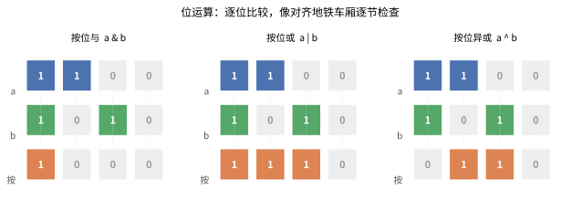
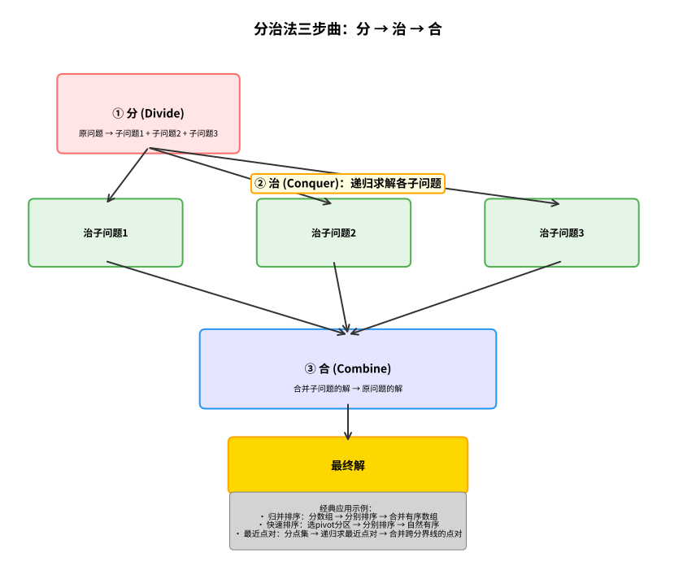
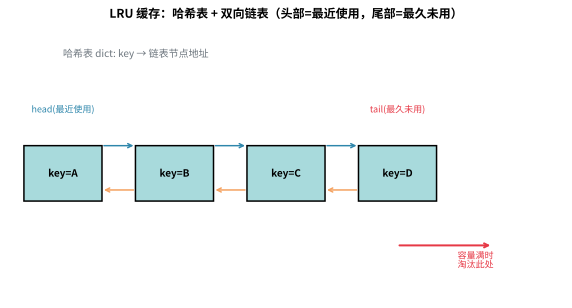
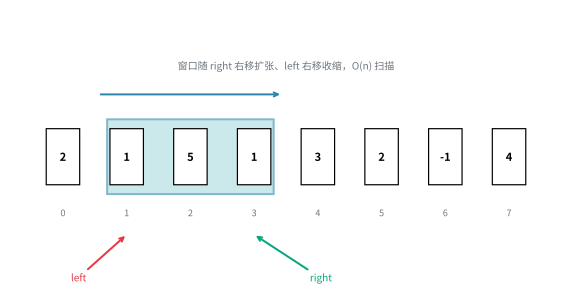
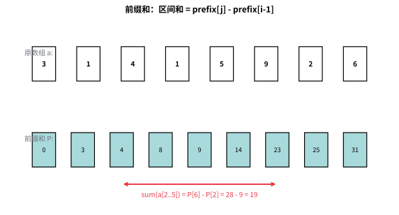
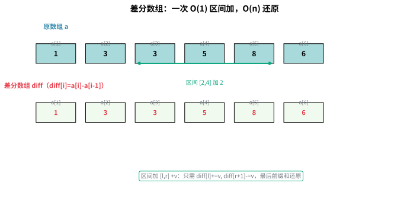

# 第十章 高级专题

> 本章涵盖算法面试中的高频高级专题：位运算、贪心、分治、缓存设计，以及面试模式总结。这些内容是你从"基础"迈向"精通"的必经之路。

---

## 10.1 位运算

### 10.1.1 基本运算

位运算直接操作二进制位，速度极快，是面试中的"隐藏加分项"。

> 💡 **类比：地铁车厢逐节对号** 把二进制想成一列"车厢"，位运算就是让两列车对齐后，逐节车厢做判断：**按位与**是"两节都有人才留下"，**按位或**是"至少一节有人就留下"，**按位异或**是"两节恰好一有人就留下"。下图直观展示了这三种运算的逐位规则：



```python
# 基本位运算符
a = 0b1100  # 12
b = 0b1010  # 10

print(f"a & b  = {a & b:04b}")   # 1000 (8)  按位与
print(f"a | b  = {a | b:04b}")   # 1110 (14) 按位或
print(f"a ^ b  = {a ^ b:04b}")   # 0110 (6)  按位异或
print(f"~a     = {~a & 0xF:04b}") # 0011 (3)  按位取反
print(f"a << 1 = {a << 1:04b}")  # 11000 (24) 左移1位
print(f"a >> 1 = {a >> 1:04b}")  # 0110 (6)  右移1位
```

### 10.1.2 常用技巧

> 💡 **类比：位运算技巧如同"开关灯游戏"**
>
> 想象一排开关，每个开关只有开(1)和关(0)两种状态：
> - **lowbit(x)**：找到最右边那个开着的灯（最低位的1）
> - **x &= x-1**：关掉最右边那个开着的灯（消除最低位的1）
> - **判断2的幂**：如果只有一个灯亮着，关掉它后所有灯都灭了
> - **set_bit/clear_bit**：打开或关闭指定位置的灯
>
> 这些技巧在树状数组、状态压缩、快速计算中非常实用。

这些技巧在面试中非常实用，建议牢记：

```python
def lowbit(x: int) -> int:
    """获取 x 的最低位的 1
    
    原理：x & (-x)
    x  = 1010 1000
    -x = 0101 1000 (补码表示)
    &  = 0000 1000
    
    应用：树状数组（Fenwick Tree）
    """
    return x & -x

def count_bits(x: int) -> int:
    """统计二进制中 1 的个数（汉明重量）
    
    LeetCode 191. Number of 1 Bits
    """
    count = 0
    while x:
        x &= x - 1  # 消除最低位的 1
        count += 1
    return count

def is_power_of_two(x: int) -> bool:
    """判断是否为 2 的幂
    
    2 的幂的特征：二进制只有一位是 1
    x = 16 = 10000
    x - 1 = 01111
    x & (x-1) = 0
    """
    return x > 0 and (x & (x - 1)) == 0

def get_bit(x: int, i: int) -> int:
    """获取第 i 位的值（从0开始）"""
    return (x >> i) & 1

def set_bit(x: int, i: int) -> int:
    """将第 i 位设为 1"""
    return x | (1 << i)

def clear_bit(x: int, i: int) -> int:
    """将第 i 位设为 0"""
    return x & ~(1 << i)

def toggle_bit(x: int, i: int) -> int:
    """翻转第 i 位"""
    return x ^ (1 << i)

# 示例
print(f"lowbit(40) = {lowbit(40)}")      # 40 = 101000, lowbit = 8
print(f"count_bits(11) = {count_bits(11)}") # 11 = 1011, 共3个1
print(f"is_power_of_two(16) = {is_power_of_two(16)}")  # True
print(f"is_power_of_two(12) = {is_power_of_two(12)}")  # False
```

### 10.1.3 XOR 的性质

异或（XOR）是位运算中最"神奇"的操作，掌握它的性质可以解决很多看似复杂的问题。

> 💡 **类比：XOR 如同"找不同游戏"**
>
> 想象你玩"找不同"游戏：两幅图完全一样时，差异为 0（`a ^ a = 0`）。如果一幅图是空白（0），另一幅图的所有内容就是差异（`0 ^ a = a`）。XOR 的核心特性是"成对抵消"——就像一双双鞋子配对后消失，只剩下那只落单的鞋。这就是为什么 XOR 能高效解决"找出现一次的数"问题：所有成对的数都抵消为 0，最后剩下的就是唯一出现的那个数。

```
XOR 的性质：
1. a ^ a = 0     (任何数与自己异或得0)
2. 0 ^ a = a     (任何数与0异或得自身)
3. a ^ b ^ a = b (异或满足交换律和结合律)
4. a ^ b = b ^ a (交换律)
```

```python
def find_unique(nums: list[int]) -> int:
    """找出现一次的数（其他数均出现两次）
    
    LeetCode 136. Single Number
    
    原理：所有数异或，成对的数抵消为0，剩下的就是唯一出现的数
    """
    result = 0
    for num in nums:
        result ^= num
    return result

def find_missing_number(nums: list[int]) -> int:
    """找缺失的数
    
    LeetCode 268. Missing Number
    
    给定 [0, n] 中的 n 个数，找出缺失的那个
    """
    n = len(nums)
    missing = n
    for i, num in enumerate(nums):
        missing ^= i ^ num
    return missing

def find_two_unique(nums: list[int]) -> tuple[int, int]:
    """找出现一次的两个数（其他数均出现两次）
    
    LeetCode 260. Single Number III
    """
    # 第一步：所有数异或，得到 a ^ b
    xor_all = 0
    for num in nums:
        xor_all ^= num
    
    # 第二步：找到 a ^ b 的最低非零位
    diff = xor_all & -xor_all
    
    # 第三步：根据该位分组异或
    a = b = 0
    for num in nums:
        if num & diff:
            a ^= num
        else:
            b ^= num
    
    return (a, b)

# 示例
print(f"唯一出现一次的数: {find_unique([4, 1, 2, 1, 2])}")  # 4
print(f"缺失的数: {find_missing_number([3, 0, 1])}")       # 2
print(f"两个唯一出现的数: {find_two_unique([1, 2, 1, 3, 2, 5])}")  # (3, 5)
```

### 10.1.4 状态压缩——用位表示集合

用一个整数的二进制位来表示一个集合，每一位表示某个元素是否存在。这在处理子集问题时极为高效。

```python
def subset_sum_bitmask(nums: list[int], target: int) -> bool:
    """子集和问题——用位运算优化
    
    思路：bits 的第 i 位表示"能否凑出和为 i"
    遍历每个数，用左移更新 bits
    """
    bits = 1  # bits[0] = 1，表示和为0总是可达
    for num in nums:
        bits |= bits << num
    return (bits >> target) & 1 == 1

# 示例
print(f"能否凑出和为9: {subset_sum_bitmask([3, 34, 4, 12, 5, 2], 9)}")  # True
```

**状态压缩的常见应用**：
- **TSP（旅行商问题）**：dp[mask][i] 表示访问过的城市集合为 mask，当前在 i
- **N 皇后**：用三个整数表示列、主对角线、副对角线的占用状态
- **子集枚举**：for mask in range(1 << n) 枚举所有子集

**位运算常用技巧总结**：
- **判断奇偶**：`x & 1` — 比 `x % 2` 更快
- **交换两数**：`a ^= b; b ^= a; a ^= b` — 无需临时变量
- **消除最低位的 1**：`x & (x - 1)` — 用于统计 1 的个数、判断 2 的幂
- **获取最低位的 1**：`x & -x` — 树状数组的核心操作
- **判断符号是否相同**：`(a ^ b) >= 0` — 异或后最高位为 0 表示同号
- **取模 2 的幂**：`x & (n - 1)` — 等价于 `x % n`（n 为 2 的幂）
- **位掩码枚举**：`for mask in range(1 << n)` — 枚举所有子集

掌握这些技巧，可以在面试中写出更简洁高效的代码。

> **位运算完整图**：下图汇总了位运算的核心操作与常用技巧，帮助你建立完整的知识框架。


---

## 10.2 贪心算法

### 10.2.1 核心思想

**贪心算法**：每一步都选择当前最优的方案，期望最终得到全局最优解。

> 💡 **类比：贪心如自助餐厅拿菜**
> 想象你在自助餐厅，盘子只能装有限几样菜。贪心策略是：每次都拿当前看起来最好吃的那道菜，不管后面还有什么。这种策略在菜的味道"越拿越差"时效果很好（比如先拿海鲜、再拿肉类、最后拿甜点），但如果最好的菜在后面，贪心就会错过。这就是贪心的本质：**只看眼前，不回头**——简单高效，但不保证全局最优。

```
贪心 vs 动态规划：
    
    贪心：每一步都选最好的 → 一条路走到黑
    DP：考虑所有可能的选择 → 选择最优路径
    
    贪心不保证全局最优，但某些问题具有"贪心选择性质"时可用。
```


**贪心算法适用的条件**：
1. **贪心选择性质**：局部最优能推导出全局最优
2. **最优子结构**：子问题的最优解能推导出原问题的最优解

### 10.2.2 经典问题

#### 活动选择（区间调度）

```python
def activity_selection(activities: list[tuple[int, int]]) -> list[tuple[int, int]]:
    """活动选择问题——选择最多的互不重叠的活动
    
    思路：按结束时间排序，优先选择结束早的
    """
    # 按结束时间排序
    activities.sort(key=lambda x: x[1])
    
    selected = [activities[0]]
    last_end = activities[0][1]
    
    for start, end in activities[1:]:
        if start >= last_end:  # 不重叠
            selected.append((start, end))
            last_end = end
    
    return selected

# 示例
activities = [(1, 3), (2, 5), (3, 9), (6, 8), (5, 7)]
result = activity_selection(activities)
print(f"选择的活动: {result}")  # [(1, 3), (5, 7)] 或类似结果
```

#### 零钱兑换（贪心版本）

```python
def coin_change_greedy(coins: list[int], amount: int) -> int:
    """零钱兑换——贪心版本
    
    注意：贪心不一定得到最优解！
    例如 coins = [1, 3, 4], amount = 6
    贪心：4+1+1=3枚，最优：3+3=2枚
    
    只有硬币面额是"规范"的（如人民币 1,5,10,20,50）时贪心才正确
    """
    coins.sort(reverse=True)
    count = 0
    
    for coin in coins:
        count += amount // coin
        amount %= coin
    
    return count if amount == 0 else -1

# 示例（人民币面额）
print(f"凑66元最少需要: {coin_change_greedy([1, 5, 10, 20, 50], 66)}枚")  # 3枚
```

#### 哈夫曼编码

```python
import heapq

def huffman_encode(freq: dict[str, int]) -> dict[str, str]:
    """哈夫曼编码——构建最优前缀码
    
    思路：用最小堆合并频率最小的两个节点
    """
    # 构建最小堆
    heap = [[weight, [char, ""]] for char, weight in freq.items()]
    heapq.heapify(heap)
    
    while len(heap) > 1:
        # 取出频率最小的两个节点
        lo = heapq.heappop(heap)
        hi = heapq.heappop(heap)
        
        # 左分支加0，右分支加1
        for pair in lo[1:]:
            pair[1] = '0' + pair[1]
        for pair in hi[1:]:
            pair[1] = '1' + pair[1]
        
        # 合并后放回堆
        heapq.heappush(heap, [lo[0] + hi[0]] + lo[1:] + hi[1:])
    
    # 返回编码表
    return {char: code for char, code in heap[0][1:]}

# 示例
freq = {'A': 5, 'B': 9, 'C': 12, 'D': 13, 'E': 16, 'F': 45}
codes = huffman_encode(freq)
for char, code in sorted(codes.items()):
    print(f"'{char}': {code}")
```

### 10.2.3 贪心何时有效？

| 适用场景 | 不适用场景 |
|---------|-----------|
| 区间调度（按结束时间排序） | 0-1背包问题 |
| 最小生成树（Prim/Kruskal） | 最短路径（有负权边） |
| 哈夫曼编码 | 硬币组合（非标准面额） |
| 任务调度（最小化等待时间） | 旅行商问题 |

> **经验法则**：如果一个问题能"排序后逐个处理"，且不需要回退，通常可以用贪心。

### 10.2.4 贪心算法的证明方法

要证明贪心算法的正确性，通常使用以下方法：

**1. 交换论证法（Exchange Argument）**
假设存在一个最优解，通过逐步交换其中的元素，可以将其转化为贪心解而不降低解的质量。常用于区间调度、任务排序等问题。

**2. 贪心领先法（Greedy Stays Ahead）**
证明贪心算法在每一步的选择都不比最优解差。通过归纳法，证明对任意步数 k，贪心解的前 k 步不劣于最优解的前 k 步。

**3. 数学归纳法**
直接证明贪心选择后，剩余子问题的最优解加上当前选择即为原问题的最优解。

**常见证明示例**：
- **活动选择**：按结束时间排序后，第一个结束的活动一定出现在某个最优解中（交换论证）
- **哈夫曼编码**：频率最小的两个字符一定在最深层，且可以配对（交换论证）
- **最小生成树**：Prim 算法每次选择连接已选集合的最小边（贪心领先）

---

## 10.3 分治法

### 10.3.1 核心思想

分治法的三步曲：
1. **分（Divide）**：将原问题分成若干子问题
2. **治（Conquer）**：递归求解各子问题
3. **合（Combine）**：合并子问题的解得到原问题的解

> 💡 **类比：分治法如同组织大型活动**
> 想象你要组织一场万人演唱会。一个人根本忙不过来，所以你把任务分解：A组负责舞台搭建，B组负责音响灯光，C组负责票务，D组负责安保。每个组再把自己的任务继续分解（比如A组分成舞台设计、材料采购、现场施工）。这就是"分"。各组独立完成自己的任务就是"治"。最后把所有组的工作整合起来，演唱会顺利举办就是"合"。分治法的精髓是：**大事化小，各个击破，最后汇总**。归并排序就是这个思路：把数组分成两半分别排序（分+治），然后把两个有序数组合并（合）。

```
    原问题
     / | \
    /  |  \
  子1 子2 子3     ← 分
   |   |   |
   解1 解2 解3    ← 治
     \ | /
      \|/
    原问题解       ← 合
```



### 10.3.2 经典应用

#### 归并排序

```python
def merge_sort(nums: list[int]) -> list[int]:
    """归并排序——分治法的经典应用"""
    if len(nums) <= 1:
        return nums
    
    # 分
    mid = len(nums) // 2
    left = merge_sort(nums[:mid])
    right = merge_sort(nums[mid:])
    
    # 合
    return merge(left, right)

def merge(left: list[int], right: list[int]) -> list[int]:
    """合并两个有序数组"""
    result = []
    i = j = 0
    
    while i < len(left) and j < len(right):
        if left[i] <= right[j]:
            result.append(left[i])
            i += 1
        else:
            result.append(right[j])
            j += 1
    
    result.extend(left[i:])
    result.extend(right[j:])
    return result

# 示例
print(merge_sort([38, 27, 43, 3, 9, 82, 10]))
# [3, 9, 10, 27, 38, 43, 82]
```

#### 快速排序

```python
def quick_sort(nums: list[int]) -> list[int]:
    """快速排序
    
    选一个 pivot，将小于 pivot 的放左边，大于的放右边
    递归排序左右两部分
    """
    if len(nums) <= 1:
        return nums
    
    pivot = nums[len(nums) // 2]
    left = [x for x in nums if x < pivot]
    middle = [x for x in nums if x == pivot]
    right = [x for x in nums if x > pivot]
    
    return quick_sort(left) + middle + quick_sort(right)

# 原地版本（面试常考）
def quick_sort_inplace(nums: list[int], left: int = 0, right: int = None) -> None:
    if right is None:
        right = len(nums) - 1
    if left >= right:
        return
    
    # 分区
    p = partition(nums, left, right)
    quick_sort_inplace(nums, left, p - 1)
    quick_sort_inplace(nums, p + 1, right)

def partition(nums: list[int], left: int, right: int) -> int:
    """Lomuto 分区方案"""
    pivot = nums[right]
    i = left
    for j in range(left, right):
        if nums[j] <= pivot:
            nums[i], nums[j] = nums[j], nums[i]
            i += 1
    nums[i], nums[right] = nums[right], nums[i]
    return i

# 示例
arr = [38, 27, 43, 3, 9, 82, 10]
quick_sort_inplace(arr)
print(arr)  # [3, 9, 10, 27, 38, 43, 82]
```

### 10.3.3 主定理分析递归复杂度

主定理（Master Theorem）用于快速分析分治算法的复杂度。

对于递归式 `T(n) = a·T(n/b) + f(n)`：

| 条件 | 时间复杂度 | 示例 |
|------|-----------|------|
| $f(n) < O(n^{\log_b a})$ | $T(n) = O(n^{\log_b a})$ | 二分查找 $T(n) = T(n/2) + O(1) \rightarrow O(\log n)$ |
| $f(n) = O(n^{\log_b a})$ | $T(n) = O(n^{\log_b a} \cdot \log n)$ | 归并排序 $T(n) = 2T(n/2) + O(n) \rightarrow O(n \log n)$ |
| $f(n) > O(n^{\log_b a})$ | $T(n) = O(f(n))$ | 快排最优 $T(n) = 2T(n/2) + O(n) \rightarrow O(n \log n)$ |

```
常见算法的主定理分析：

二分查找：    T(n) = T(n/2) + O(1)          → O(log n)
归并排序：    T(n) = 2T(n/2) + O(n)         → O(n log n)
最近点对：    T(n) = 2T(n/2) + O(n)         → O(n log n)
最大子数组：   T(n) = 2T(n/2) + O(n)         → O(n log n)
Strassen:     T(n) = 7T(n/2) + O(n²)        → O(n^2.81)
```

**递推关系式的建立方法**：
1. 确定问题规模 n 的分解方式，得到子问题规模 n/b
2. 确定子问题个数 a
3. 确定分解和合并步骤的时间复杂度 f(n)

例如，归并排序的递推过程：
- 将数组分为两半（分解时间 O(1)）
- 递归排序左右两半（2 个子问题，规模 n/2）
- 合并两个有序数组（合并时间 O(n)）
- 得到递推式：$T(n) = 2T(n/2) + O(n) \rightarrow O(n \log n)$

> **算法设计范式学习路径**：从基础的贪心、分治，到更复杂的动态规划和回溯，算法设计范式构成了完整的算法学习天梯。掌握这些范式，你将能够系统性地分析和解决各类算法问题。


---

## 10.4 缓存与设计

### 10.4.1 LRU Cache

> 💡 **类比：LRU 如同"书桌整理"**
> 想象你的书桌只能放 5 本书。每次学习时，你会把正在用的书放到书桌最显眼的位置（链表头部）。当新书放不下了，你会把最久没翻过的书（链表尾部）收进书柜。LRU 就是这种"最近使用的留在手边，最久没用的先收起来"的策略。



**LRU（Least Recently Used）**：淘汰最久未使用的数据。

**数据结构**：哈希表 + 双向链表
- 哈希表：O(1) 查找
- 双向链表：O(1) 插入和删除

```
get(key):
  1. 如果 key 存在，将节点移到链表头部 → 返回 value
  2. 如果 key 不存在 → 返回 -1

put(key, value):
  1. 如果 key 存在，更新 value 并移到链表头部
  2. 如果 key 不存在：
     a. 缓存未满 → 插入到链表头部
     b. 缓存已满 → 删除链表尾部节点，再插入新节点到头部
```

```python
class ListNode:
    """双向链表节点"""
    def __init__(self, key=0, value=0):
        self.key = key
        self.value = value
        self.prev = None
        self.next = None


class LRUCache:
    """LRU 缓存
    
    LeetCode 146. LRU Cache
    
    使用哈希表 + 双向链表实现
    get 和 put 都是 O(1) 时间复杂度
    """
    
    def __init__(self, capacity: int):
        self.capacity = capacity
        self.cache = {}  # key -> ListNode
        
        # 虚拟头尾节点，简化边界处理
        self.head = ListNode()  # 最近使用的在 head.next
        self.tail = ListNode()  # 最久未使用的在 tail.prev
        self.head.next = self.tail
        self.tail.prev = self.head
    
    def _remove(self, node: ListNode) -> None:
        """从链表中移除节点"""
        node.prev.next = node.next
        node.next.prev = node.prev
    
    def _add_to_head(self, node: ListNode) -> None:
        """将节点添加到头部（最近使用）"""
        node.next = self.head.next
        node.prev = self.head
        self.head.next.prev = node
        self.head.next = node
    
    def get(self, key: int) -> int:
        if key not in self.cache:
            return -1
        
        node = self.cache[key]
        # 移到头部（表示最近使用过）
        self._remove(node)
        self._add_to_head(node)
        return node.value
    
    def put(self, key: int, value: int) -> None:
        if key in self.cache:
            # 更新值并移到头部
            node = self.cache[key]
            node.value = value
            self._remove(node)
            self._add_to_head(node)
        else:
            # 创建新节点
            node = ListNode(key, value)
            self.cache[key] = node
            self._add_to_head(node)
            
            # 如果超出容量，淘汰最久未使用的
            if len(self.cache) > self.capacity:
                lru = self.tail.prev
                self._remove(lru)
                del self.cache[lru.key]


# 使用 OrderedDict 的简洁版本
from collections import OrderedDict

class LRUCacheSimple:
    """LRU 缓存——使用 OrderedDict 实现"""
    
    def __init__(self, capacity: int):
        self.capacity = capacity
        self.cache = OrderedDict()
    
    def get(self, key: int) -> int:
        if key not in self.cache:
            return -1
        # 移动到末尾（表示最近使用）
        self.cache.move_to_end(key)
        return self.cache[key]
    
    def put(self, key: int, value: int) -> None:
        if key in self.cache:
            self.cache.move_to_end(key)
        self.cache[key] = value
        if len(self.cache) > self.capacity:
            self.cache.popitem(last=False)  # 弹出最早插入的

# 测试
cache = LRUCache(2)
cache.put(1, 1)
cache.put(2, 2)
print(cache.get(1))       # 返回 1
cache.put(3, 3)           # 淘汰 key 2
print(cache.get(2))       # 返回 -1（未找到）
```

### 10.4.2 LFU Cache

> 💡 **类比：LFU 如同"衣柜整理"**
> 想象你的衣柜只能放 10 件衣服。LFU 的策略是：统计每件衣服的穿着次数，把穿过最少的衣服捐出去。如果两件衣服穿着次数一样，就把更久没穿的那件捐出去。这和 LRU 不同——LRU 只看"最后一次使用时间"，LFU 看"总使用频率"。

**LFU（Least Frequently Used）**：淘汰使用频率最低的数据。如果频率相同，淘汰最久未使用的。

```python
class LFUCache:
    """LFU 缓存
    
    LeetCode 460. LFU Cache
    
    使用三个哈希表：
    - key_to_val: key → value
    - key_to_freq: key → 使用频率
    - freq_to_keys: 频率 → 对应 key 的有序集合
    """
    
    def __init__(self, capacity: int):
        self.capacity = capacity
        self.key_to_val = {}
        self.key_to_freq = {}
        self.freq_to_keys = {}  # freq -> OrderedDict
        self.min_freq = 0
    
    def _update_freq(self, key: int) -> None:
        """更新 key 的使用频率"""
        freq = self.key_to_freq[key]
        # 从当前频率中移除
        del self.freq_to_keys[freq][key]
        if not self.freq_to_keys[freq]:
            del self.freq_to_keys[freq]
            if self.min_freq == freq:
                self.min_freq += 1
        
        # 频率加1
        new_freq = freq + 1
        self.key_to_freq[key] = new_freq
        if new_freq not in self.freq_to_keys:
            self.freq_to_keys[new_freq] = OrderedDict()
        self.freq_to_keys[new_freq][key] = None
    
    def get(self, key: int) -> int:
        if key not in self.key_to_val:
            return -1
        self._update_freq(key)
        return self.key_to_val[key]
    
    def put(self, key: int, value: int) -> None:
        if self.capacity <= 0:
            return
        
        if key in self.key_to_val:
            self.key_to_val[key] = value
            self._update_freq(key)
            return
        
        # 淘汰
        if len(self.key_to_val) >= self.capacity:
            # 从最小频率的 key 中淘汰最久未使用的
            evict_key, _ = self.freq_to_keys[self.min_freq].popitem(last=False)
            del self.key_to_val[evict_key]
            del self.key_to_freq[evict_key]
        
        # 插入新节点
        self.key_to_val[key] = value
        self.key_to_freq[key] = 1
        if 1 not in self.freq_to_keys:
            self.freq_to_keys[1] = OrderedDict()
        self.freq_to_keys[1][key] = None
        self.min_freq = 1
```

---

## 10.5 面试算法模式总结

### 10.5.1 双指针（Two Pointers）

> 💡 **类比：双指针如同"两人相向而行"**
> 想象两个人从一条路的两端相向而行，相遇时停止。双指针法就是这种"从两端向中间逼近"的思想：左指针从前往后走，右指针从后往前走，根据条件判断谁该移动。适用于有序数组的两数之和、链表找中点、判断回文等问题。

**适用场景**：有序数组、链表、回文判断

```python
def two_sum_sorted(numbers: list[int], target: int) -> list[int]:
    """两数之和 II - 输入有序数组
    
    LeetCode 167. Two Sum II
    
    思路：左右指针向中间移动
    """
    left, right = 0, len(numbers) - 1
    
    while left < right:
        curr_sum = numbers[left] + numbers[right]
        if curr_sum == target:
            return [left + 1, right + 1]  # 题目要求1-indexed
        elif curr_sum < target:
            left += 1
        else:
            right -= 1
    
    return []


def is_palindrome(s: str) -> bool:
    """验证回文串
    
    LeetCode 125. Valid Palindrome
    """
    left, right = 0, len(s) - 1
    
    while left < right:
        # 跳过非字母数字字符
        while left < right and not s[left].isalnum():
            left += 1
        while left < right and not s[right].isalnum():
            right -= 1
        
        if s[left].lower() != s[right].lower():
            return False
        left += 1
        right -= 1
    
    return True
```

### 10.5.2 滑动窗口（Sliding Window）

> 💡 **类比：滑动窗口如同"移动取景框"**
> 想象你拿着一个固定大小的取景框在风景前移动，每次只能左右滑动。滑动窗口法就是这种"固定窗口大小，逐步平移"的思想：窗口的左右边界同时向右移动，维护窗口内的信息。适用于最长无重复子串、最小覆盖子串等问题。



**适用场景**：子串、子数组问题

```python
def length_of_longest_substring(s: str) -> int:
    """无重复字符的最长子串
    
    LeetCode 3. Longest Substring Without Repeating Characters
    """
    char_set = set()
    left = 0
    max_len = 0
    
    for right in range(len(s)):
        # 如果重复，移动左指针直到不重复
        while s[right] in char_set:
            char_set.remove(s[left])
            left += 1
        char_set.add(s[right])
        max_len = max(max_len, right - left + 1)
    
    return max_len


def min_window(s: str, t: str) -> str:
    """最小覆盖子串
    
    LeetCode 76. Minimum Window Substring
    """
    from collections import Counter
    
    need = Counter(t)
    missing = len(t)
    left = 0
    start, end = 0, float('inf')
    
    for right, char in enumerate(s):
        if char in need:
            if need[char] > 0:
                missing -= 1
            need[char] -= 1
        
        # 收缩窗口
        while missing == 0:
            if right - left < end - start:
                start, end = left, right
            
            left_char = s[left]
            if left_char in need:
                need[left_char] += 1
                if need[left_char] > 0:
                    missing += 1
            left += 1
    
    return s[start:end + 1] if end != float('inf') else ""
```

### 10.5.3 前缀和（Prefix Sum）

> 💡 **类比：前缀和如同"里程表"**
> 想象高速公路上的里程表：里程表[i] 表示从起点到第 i 个出口的总里程。要算两个出口之间的距离，只需 里程表[j] - 里程表[i-1]。前缀和就是这种"预处理累计值，O(1) 查询区间和"的思想。



**适用场景**：范围求和、子数组和

```python
class NumArray:
    """区域和检索 - 数组不可变
    
    LeetCode 303. Range Sum Query - Immutable
    """
    def __init__(self, nums: list[int]):
        # prefix[i] 表示 nums[0..i-1] 的和
        self.prefix = [0]
        for num in nums:
            self.prefix.append(self.prefix[-1] + num)
    
    def sum_range(self, left: int, right: int) -> int:
        return self.prefix[right + 1] - self.prefix[left]


def subarray_sum(nums: list[int], k: int) -> int:
    """和为 K 的子数组个数
    
    LeetCode 560. Subarray Sum Equals K
    
    思路：用哈希表记录前缀和出现的次数
    """
    prefix_sum = {0: 1}  # 前缀和 → 出现次数
    curr_sum = 0
    count = 0
    
    for num in nums:
        curr_sum += num
        # 如果存在 curr_sum - k，说明有子数组和为 k
        count += prefix_sum.get(curr_sum - k, 0)
        prefix_sum[curr_sum] = prefix_sum.get(curr_sum, 0) + 1
    
    return count
```

### 10.5.4 差分数组与二维前缀和

> 💡 **类比：差分数组如同"给一整排座位发红包"** 想象你要给一排 10 个座位中第 3~7 号座位每人发 2 元红包。如果逐个发，要操作 5 次；但差分数组的妙招是：在第 3 号"开红包"（+2），在第 8 号"截止"（-2），中间的人自动继承。最后做一遍"顺次累加"（前缀和），就能一次性还原出每个人收到多少。这样"一个区间加同一个数"的操作从 $O(n)$ 降到 $O(1)$，非常适合做多次区间修改。



**差分数组**：设原数组为 $a[1..n]$，定义差分数组 $diff[i] = a[i] - a[i-1]$（约定 $a[0]=0$）。那么 $a[i] = \sum_{k=1}^{i} diff[k]$，即原数组是差分数组的**前缀和**。

**核心操作：区间加**，对区间 $[l, r]$ 每个元素加上 $v$，只需：
$$diff[l] += v, \quad diff[r+1] -= v$$
然后对 $diff$ 做一次前缀和即可还原原数组。多次区间加的总复杂度 $O(n + m)$（$m$ 次操作）。

**Python 实现**：

```python
def range_add(n, ops):
    """n: 数组长度; ops: [(l, r, v)] 区间加操作列表（1-indexed）"""
    diff = [0] * (n + 2)
    for l, r, v in ops:
        diff[l] += v
        diff[r + 1] -= v
    # 前缀和还原
    a = [0] * (n + 1)
    for i in range(1, n + 1):
        a[i] = a[i - 1] + diff[i]
    return a[1:]
```

**二维差分**：在一维基础上推广到矩阵。对子矩阵（左上 $(x_1,y_1)$，右下 $(x_2,y_2)$）整体加 $v$：
$$d[x_1][y_1] += v,\ \ d[x_1][y_2+1] -= v,\ \ d[x_2+1][y_1] -= v,\ \ d[x_2+1][y_2+1] += v$$
然后对二维差分数组做**二维前缀和**还原。

> **二维前缀和**：$S[i][j] = S[i-1][j] + S[i][j-1] - S[i-1][j-1] + a[i][j]$，可在 $O(1)$ 时间求任意子矩阵元素和。

**应用场景**：多次区间加后求值、天际线问题、差分数组配合扫描线、二维矩阵的批量区域修改与查询。

### 10.5.5 答案二分（Binary Search on Answer）

> 💡 **类比：答案二分如同"猜价格"**
> 想象你在玩"猜价格"游戏：商品价格是 1-1000 元，每次你猜一个价格，主持人告诉你"高了"或"低了"。答案二分就是这种"在答案范围内二分搜索"的思想：不是搜索数组，而是搜索"答案本身"。适用于"使最大值最小"或"使最小值最大"的优化问题。

**适用场景**：在"答案范围"上进行二分搜索，找到满足条件的最小/最大值

```python
def split_array(nums: list[int], k: int) -> int:
    """分割数组的最大值
    
    LeetCode 410. Split Array Largest Sum
    
    思路：二分"最大子数组和"的取值
    """
    def can_split(max_sum: int) -> bool:
        """判断是否能将数组分成不超过 k 段，每段和 ≤ max_sum"""
        count = 1
        curr_sum = 0
        for num in nums:
            if curr_sum + num > max_sum:
                count += 1
                curr_sum = num
                if count > k:
                    return False
            else:
                curr_sum += num
        return True
    
    left, right = max(nums), sum(nums)
    
    while left < right:
        mid = (left + right) // 2
        if can_split(mid):
            right = mid
        else:
            left = mid + 1
    
    return left


def find_kth_smallest(matrix: list[list[int]], k: int) -> int:
    """有序矩阵中第 K 小的元素
    
    LeetCode 378. Kth Smallest Element in a Sorted Matrix
    
    思路：二分值域，统计小于等于 mid 的元素个数
    """
    n = len(matrix)
    
    def count_less_equal(mid: int) -> int:
        """统计矩阵中 ≤ mid 的元素个数"""
        count = 0
        row, col = n - 1, 0
        while row >= 0 and col < n:
            if matrix[row][col] <= mid:
                count += row + 1
                col += 1
            else:
                row -= 1
        return count
    
    left, right = matrix[0][0], matrix[n - 1][n - 1]
    
    while left < right:
        mid = (left + right) // 2
        if count_less_equal(mid) >= k:
            right = mid
        else:
            left = mid + 1
    
    return left
```

### 10.5.6 前 K 大元素（Top K Elements）

> 💡 **类比：Top K 如同"选拔赛"**
> 想象要从 1000 名选手中选出前 10 名。你可以用"小顶堆"维护一个容量为 10 的"精英圈"：遍历所有选手，如果新选手比精英圈里最弱的还强，就把最弱的踢出去，让新选手加入。最后精英圈里的就是前 10 名。这就是 Top K 问题的堆解法思想。

**适用场景**：求最大/最小的 K 个元素

```python
import heapq
import random

def find_kth_largest(nums: list[int], k: int) -> int:
    """数组中的第 K 个最大元素
    
    LeetCode 215. Kth Largest Element in an Array
    
    方法一：最小堆，O(n log k)
    """
    heap = nums[:k]
    heapq.heapify(heap)  # 最小堆
    
    for num in nums[k:]:
        if num > heap[0]:
            heapq.heapreplace(heap, num)
    
    return heap[0]


def find_kth_largest_quickselect(nums: list[int], k: int) -> int:
    """方法二：快速选择（QuickSelect），平均 O(n)"""
    
    def quick_select(left: int, right: int, k_smallest: int) -> int:
        """找第 k_smallest 小的元素（0-indexed）"""
        if left == right:
            return nums[left]
        
        # 随机选择 pivot
        pivot_idx = random.randint(left, right)
        nums[pivot_idx], nums[right] = nums[right], nums[pivot_idx]
        
        # 分区
        pivot = nums[right]
        i = left
        for j in range(left, right):
            if nums[j] <= pivot:
                nums[i], nums[j] = nums[j], nums[i]
                i += 1
        nums[i], nums[right] = nums[right], nums[i]
        
        if k_smallest == i:
            return nums[i]
        elif k_smallest < i:
            return quick_select(left, i - 1, k_smallest)
        else:
            return quick_select(i + 1, right, k_smallest)
    
    # 第 k 大 = 第 n-k 小
    n = len(nums)
    return quick_select(0, n - 1, n - k)


def top_k_frequent(nums: list[int], k: int) -> list[int]:
    """前 K 个高频元素
    
    LeetCode 347. Top K Frequent Elements
    """
    from collections import Counter
    
    # 统计频率
    freq = Counter(nums)
    
    # 最小堆，按频率排序
    heap = []
    for num, count in freq.items():
        heapq.heappush(heap, (count, num))
        if len(heap) > k:
            heapq.heappop(heap)
    
    return [num for _, num in heap]
```

---

## 10.6 实践练习

### 练习 1：最大子数组和（分治 + 贪心）

**LeetCode 53. Maximum Subarray**

```python
def max_subarray(nums: list[int]) -> int:
    """最大子数组和
    
    思路一：贪心（Kadane 算法）
    """
    max_ending_here = max_so_far = nums[0]
    for num in nums[1:]:
        max_ending_here = max(num, max_ending_here + num)
        max_so_far = max(max_so_far, max_ending_here)
    return max_so_far


def max_subarray_dc(nums: list[int]) -> int:
    """思路二：分治法"""
    def helper(left: int, right: int) -> int:
        if left == right:
            return nums[left]
        
        mid = (left + right) // 2
        
        # 左半部分最大子数组和
        left_sum = helper(left, mid)
        # 右半部分最大子数组和
        right_sum = helper(mid + 1, right)
        
        # 跨越中点的最大子数组和
        left_cross_sum = float('-inf')
        curr_sum = 0
        for i in range(mid, left - 1, -1):
            curr_sum += nums[i]
            left_cross_sum = max(left_cross_sum, curr_sum)
        
        right_cross_sum = float('-inf')
        curr_sum = 0
        for i in range(mid + 1, right + 1):
            curr_sum += nums[i]
            right_cross_sum = max(right_cross_sum, curr_sum)
        
        cross_sum = left_cross_sum + right_cross_sum
        
        return max(left_sum, right_sum, cross_sum)
    
    return helper(0, len(nums) - 1)

# 测试
nums = [-2, 1, -3, 4, -1, 2, 1, -5, 4]
print(f"最大子数组和: {max_subarray(nums)}")     # 6 (4 + -1 + 2 + 1)
print(f"最大子数组和(分治): {max_subarray_dc(nums)}")  # 6
```

### 练习 2：任务调度器（贪心）

**LeetCode 621. Task Scheduler**

```python
from collections import Counter

def least_interval(tasks: list[str], n: int) -> int:
    """任务调度器
    
    给定 CPU 任务列表和冷却时间 n，求最短执行时间
    
    思路：贪心——出现次数最多的任务决定了最短时间
    """
    freq = Counter(tasks)
    max_freq = max(freq.values())
    
    # 出现次数最多的任务有几个
    max_count = sum(1 for v in freq.values() if v == max_freq)
    
    # 公式推导：
    # 以出现最多的任务作为"骨架"
    # 例如 A 出现 3 次，n=2：A _ _ A _ _ A
    # 总长度 = (max_freq - 1) * (n + 1) + max_count
    # 但不能少于任务总数
    return max(len(tasks), (max_freq - 1) * (n + 1) + max_count)

# 测试
tasks = ['A', 'A', 'A', 'B', 'B', 'B']
print(f"最短执行时间: {least_interval(tasks, 2)}")  # 8
```

### 练习 3：数据流的中位数（双堆）

**LeetCode 295. Find Median from Data Stream**

```python
class MedianFinder:
    """数据流的中位数
    
    思路：用两个堆维护数据流
    - 最大堆（存较小的一半）
    - 最小堆（存较大的一半）
    
    保证：len(max_heap) >= len(min_heap)
    """
    
    def __init__(self):
        self.max_heap = []  # 存较小的一半（Python 用负数模拟最大堆）
        self.min_heap = []  # 存较大的一半
    
    def add_num(self, num: int) -> None:
        # 先加入最大堆
        heapq.heappush(self.max_heap, -num)
        
        # 确保最大堆的堆顶 ≤ 最小堆的堆顶
        if (self.max_heap and self.min_heap and
            -self.max_heap[0] > self.min_heap[0]):
            val = -heapq.heappop(self.max_heap)
            heapq.heappush(self.min_heap, val)
        
        # 平衡两个堆的大小
        if len(self.max_heap) > len(self.min_heap) + 1:
            val = -heapq.heappop(self.max_heap)
            heapq.heappush(self.min_heap, val)
        elif len(self.min_heap) > len(self.max_heap):
            val = heapq.heappop(self.min_heap)
            heapq.heappush(self.max_heap, -val)
    
    def find_median(self) -> float:
        if len(self.max_heap) > len(self.min_heap):
            return -self.max_heap[0]
        else:
            return (-self.max_heap[0] + self.min_heap[0]) / 2.0

# 测试
mf = MedianFinder()
for num in [1, 2, 3]:
    mf.add_num(num)
    print(f"加入 {num} 后中位数: {mf.find_median()}")
# 加入1: 1.0, 加入2: 1.5, 加入3: 2.0
```

---

## 面试模式速查表

| 模式 | 适用场景 | 时间复杂度 | 代表题目 |
|------|---------|-----------|---------|
| **双指针** | 有序数组、回文、链表环 | $O(n)$ | 167, 125, 141, 15 |
| **滑动窗口** | 子串、子数组最值 | $O(n)$ | 3, 76, 424, 209 |
| **前缀和** | 范围求和、子数组和 | $O(n)$ 构建，$O(1)$ 查询 | 303, 560, 523 |
| **答案二分** | 最大值最小化 / 最小值最大化 | $O(n \log \text{range})$ | 410, 378, 875 |
| **Top K** | 最大/最小 K 个元素 | $O(n \log k)$ | 215, 347, 378 |
| **位运算** | 去重、状态压缩 | $O(n)$ | 136, 268, 191 |
| **贪心** | 区间、调度、最优子结构 | $O(n \log n)$ | 621, 435, 452 |
| **分治** | 排序、几何、大问题分解 | $O(n \log n)$ | 53, 215, 912 |
| **LRU/LFU** | 缓存设计 | $O(1)$ | 146, 460 |
| **单调栈** | 下一个更大元素 | $O(n)$ | 739, 84, 42 |

### 面试常见题型总结

在算法面试中，以下题型出现频率最高，建议重点掌握：

| 题型类别 | 核心思路 | 经典题目 |
|---------|---------|---------|
| **数组/字符串** | 双指针、滑动窗口、前缀和 | 3, 76, 167, 560 |
| **链表** | 双指针、递归、快慢指针 | 141, 206, 21, 23 |
| **树** | 递归遍历、层序、BST 性质 | 94, 102, 230, 236 |
| **动态规划** | 状态定义、状态转移方程 | 53, 70, 198, 300 |
| **图** | BFS/DFS、拓扑排序、最短路径 | 200, 207, 743, 994 |
| **二分查找** | 标准二分、答案二分 | 33, 153, 410, 378 |
| **堆/优先队列** | Top K、合并有序链表 | 215, 347, 378, 23 |
| **设计题** | LRU/LFU、O(1) 数据结构 | 146, 460, 380 |

> **面试建议**：刷题时不要只追求数量，更要总结题型规律，做到"做一道会一类"。

---

## 本章总结

- **位运算**：速度快、节省空间，XOR 性质是解决"去重"问题的利器
- **贪心算法**：局部最优推导全局最优，关键在证明贪心选择性质
- **分治法**：分→治→合，主定理分析递归复杂度
- **缓存设计**：LRU（哈希表+双向链表）、LFU（多级频率哈希表）
- **面试模式**：掌握五种核心模式（双指针、滑动窗口、前缀和、答案二分、Top K），能解决 80% 的算法面试题

> **掌握了这些内容，你已经有能力应对大多数算法面试了。加油！** 🚀

---

## 11. OI/ACM 竞赛高级专题

> 本章对应 README 知识体系中的**第 11、12 层**：从复杂度理论开始，理解算法难度的理论框架，再介绍 OI/ACM 竞赛中处理"离线区间查询""多维偏序""批量二分答案""历史版本查询"的四大高级武器——**莫队算法、CDQ 分治、整体二分、可持久化线段树（主席树）**。这些算法在普通面试中较少出现，却是竞赛题里大幅度拉开差距的核心考点。

### 11.1 复杂度理论（P/NP）

**用途**：理解算法难度的理论框架，判断一个问题的"天花板"究竟有多高，从而决定该追求精确解还是近似解。

> 💡 **类比：过安检 vs 猜密码**
> 有些问题像"过安检"：无论队伍多长，只要按顺序排队，总能在多项式时间内完成——这类问题属于 **P**。而有些问题像"猜中别人的密码"：想直接算出来几乎不可能（NP-Hard），但只要你**拿到一个答案，就能快速验证它对不对**（比如密码对不对，一试便知）——能快速验证的问题属于 **NP**。P vs NP 的核心之问就是："能不能验证"和"能不能求解"在本质上是否等价。

**核心思想**：按"求解/验证所需时间"给问题分类，形成一套描述问题固有难度的复杂度类谱系。

```
复杂度类谱系（由易到难，包含关系示意）：

P  ⊆  NP     ←  NP-Complete 是 NP 中最难的一档
        ⊆  EXP（指数时间可解）
        ⊆  PSPACE（多项式空间可解）

NP-Hard：至少和 NP 一样难（可能比 NP 更难，甚至不可判定）
```

- **P**：能在多项式时间内**求解**的问题（如最短路径、最小生成树、拓扑排序）。
- **NP**：能在多项式时间内**验证**解的问题（如哈密顿回路、TSP 判定版）。
- **NP-Complete**：既是 NP 又是 NP-Hard，是 NP 中最难的一档。只要其中一个被证明属于 P，则 P=NP（如 SAT、3-SAT、顶点覆盖）。
- **NP-Hard**：至少和 NP 一样难，但不一定属于 NP（如停机问题，甚至不可判定）。
- **EXP**：需要指数时间才能求解的问题（某些博弈、穷举类问题）。
- **PSPACE**：在多项式空间内可解（时间不限）的问题（如量化布尔公式 QBF）。

**经典问题举例**：
- **最短路径 = P**：Dijkstra / Bellman-Ford 多项式时间解决。
- **TSP（旅行商） = NP**：暴力求解是指数级的，但验证一条路线是否满足距离上限只需 $O(n)$。
- **SAT = NP-Complete**：布尔可满足性问题是第一个被证明的 NP-Complete 问题。

```python
import heapq

# NP 的精髓：答案"好验证"（多项式时间内即可验证一个解是否正确）
def verify_tsp_route(dist, route, limit):
    """验证一条 TSP 路线总长度是否 ≤ limit（O(n) 验证 → NP 性质）"""
    n = len(route)
    total = sum(dist[route[i]][route[(i + 1) % n]] for i in range(n))
    return total <= limit

# P 的精髓：直接"高效求解"（多项式时间求出最优解）
def shortest_path(graph, s, t):
    """Dijkstra 求最短路：O((V+E)·log V) → 属于 P"""
    dist = {s: 0}
    heap = [(0, s)]
    while heap:
        d, u = heapq.heappop(heap)
        if d > dist.get(u, float('inf')):
            continue
        if u == t:
            return d
        for v, w in graph[u]:
            nd = d + w
            if nd < dist.get(v, float('inf')):
                dist[v] = nd
                heapq.heappush(heap, (nd, v))
    return float('inf')

# 示例
dist = [[0, 1, 2, 3],
        [1, 0, 4, 5],
        [2, 4, 0, 6],
        [3, 5, 6, 0]]
print(f"验证 TSP 路线总长是否 ≤ 15: {verify_tsp_route(dist, [0, 1, 2, 3], 15)}")  # 1+4+6+3=14 → True
print(f"Dijkstra 最短路: {shortest_path({0: [(1, 1), (2, 2)], 1: [(2, 4)]}, 0, 2)}")  # 2
```

**复杂度**：框架本身是"问题分类"，用于指导算法设计的取舍——遇到 NP-Hard 问题时，通常改用近似算法、启发式或分支限界。

**适用场景**：算法设计前先判断问题难度，避免在一个 NP-Hard 问题上徒劳地寻找多项式算法。

---

### 11.2 莫队算法（Mo's Algorithm）

**用途**：离线批量处理区间查询（如区间众数、区间不同元素个数、区间和等），尤其在询问次数多、无法在线高效维护时表现优异。

> 💡 **类比：把要问的区间按块排序，优雅地移动左右指针**
> 想象一个窗口在数轴上滑动。如果查询毫无顺序，指针来回狂奔，浪费大量移动。莫队的妙招是：给下标**分块**，把查询按"左端点所在块 + 右端点"排序，让窗口尽量"顺路"地挨个滑过所有区间。这样每次移动指针只做小幅调整，总移动次数被控制在 $O((n+q)\sqrt{n})$。就像整理快递派送路线，先分区、再就近配送，避免来回折返。

**核心思想**：分块 + 排序 + 双指针移动。
1. 将数组按下标分块，块大小取 $\sqrt{n}$。
2. 对查询排序：第一关键字是左端点所在块，第二关键字是右端点（配合奇偶优化交替升降序）。
3. 维护当前区间 $[L, R]$ 的计数信息，按排序后的顺序逐条"伸长/收缩"指针并回答查询。

**复杂度**：$O((n+q)\sqrt{n})$。莫队只能处理**离线**查询（需提前拿到全部询问）。

```python
import math

def mo_mode(arr, queries):
    """莫队算法：批量求静态区间众数（出现次数最多的数的出现次数）
    queries = [(l, r), ...]，l/r 为 0-indexed 闭区间
    复杂度 O((n+q)√n)
    """
    n = len(arr)
    # 坐标压缩
    vals = sorted(set(arr))
    comp = {v: i for i, v in enumerate(vals)}
    a = [comp[x] for x in arr]
    m = len(vals)

    block = int(math.sqrt(n)) + 1
    es = list(enumerate(queries))
    # 块内右端点奇偶交替排序，减少指针往返
    es.sort(key=lambda x: (x[1][0] // block,
                           x[1][1] if (x[1][0] // block) % 2 == 0 else -x[1][1]))

    cnt = [0] * m
    freq_cnt = [0] * (n + 1)   # freq_cnt[c] = 出现次数恰好为 c 的值的个数
    max_freq = 0
    cur_l, cur_r = 0, -1

    def add(i):
        nonlocal max_freq
        v = a[i]
        freq_cnt[cnt[v]] -= 1
        cnt[v] += 1
        freq_cnt[cnt[v]] += 1
        if cnt[v] > max_freq:
            max_freq = cnt[v]

    def remove(i):
        nonlocal max_freq
        v = a[i]
        freq_cnt[cnt[v]] -= 1
        if cnt[v] == max_freq and freq_cnt[cnt[v]] == 0:
            max_freq -= 1
        cnt[v] -= 1
        freq_cnt[cnt[v]] += 1

    ans = [0] * len(queries)
    for idx, (l, r) in es:
        while cur_l > l: cur_l -= 1; add(cur_l)
        while cur_r < r: cur_r += 1; add(cur_r)
        while cur_l < l: remove(cur_l); cur_l += 1
        while cur_r > r: remove(cur_r); cur_r -= 1
        ans[idx] = max_freq
    return ans

# 示例
arr = [1, 2, 2, 3, 3, 3, 1]
queries = [(0, 6), (1, 3), (0, 2)]
print(mo_mode(arr, queries))
# 说明：整段众数 3 出现3次；[1,3]=[2,2,3] 众数2出现2次；[0,2]=[1,2,2] 众数2出现2次
```

**复杂度**：$O((n+q)\sqrt{n})$，其中 $n$ 为数组长度、$q$ 为询问个数。

**适用场景**：静态数组的批量区间查询（区间众数、区间不同元素个数、区间逆序对等），且全部询问可离线获得。

---

### 11.3 CDQ 分治

**用途**：离线解决多维偏序问题（如统计满足多个不等式约束的点对数量、三维偏序计数、归并排序求逆序对等）。

> 💡 **类比：把三维排序问题拆成两两处理**
> 想象要给一堆学生按"身高、体重、成绩"三维排序并统计"谁完全压过谁"。直接三维比较太复杂。CDQ 分治的思路是：先按第一维（身高）排好队，再用"归并排序"的方式一边合并一边清点——合并时，第二维（体重）用双指针归并保证有序，第三维（成绩）用树状数组统计。就这样把"三维偏序"逐层拆解成"一维排序 + 二维统计"。

**核心思想**：
1. 第一维先排序，消除第一维的影响。
2. 对剩下的问题做分治：递归处理左右两半，再统计"左半对右半"的贡献（左半的点天然满足第一维约束）。
3. 合并阶段用**归并排序式**双指针保证第二维有序，用**树状数组**维护第三维的计数。

**复杂度**：$O(n \log^2 n)$（分治 $\log n$ × 每层树状数组 $\log n$）。

```python
def cdq_3d(points):
    """CDQ 分治：统计三维偏序 (a_i<=a_j, b_i<=b_j, c_i<=c_j) 的点对数量
    points = [(a, b, c), ...]
    复杂度 O(n log^2 n)
    """
    class BIT:
        def __init__(self, n):
            self.n, self.c = n, [0] * (n + 1)
        def add(self, i, v):
            while i <= self.n:
                self.c[i] += v
                i += i & -i
        def sum(self, i):
            s = 0
            while i > 0:
                s += self.c[i]
                i -= i & -i
            return s

    # 第一维排序，消除 a 的影响
    points.sort()
    # 第三维坐标压缩
    cs = sorted(set(p[2] for p in points))
    idx = {v: i + 1 for i, v in enumerate(cs)}
    pts = [(p[0], p[1], idx[p[2]]) for p in points]
    bit = BIT(len(cs))
    ans = 0

    def solve(l, r):
        nonlocal ans
        if l >= r:
            return
        mid = (l + r) // 2
        solve(l, mid)
        solve(mid + 1, r)
        # 归并：左半的点作为"贡献源"，为右半的点计数
        i, j, tmp = l, mid + 1, []
        added = []                       # 只回滚真正插入过 BIT 的 c 值
        while i <= mid or j <= r:
            if j > r or (i <= mid and (pts[i][1], pts[i][2]) <= (pts[j][1], pts[j][2])):
                bit.add(pts[i][2], 1)
                added.append(pts[i][2])
                tmp.append(pts[i]); i += 1
            else:
                ans += bit.sum(pts[j][2])
                tmp.append(pts[j]); j += 1
        for c in added:
            bit.add(c, -1)
        pts[l:r + 1] = tmp

    solve(0, len(pts) - 1)
    return ans

# 示例
points = [(1, 1, 1), (2, 2, 2), (3, 3, 3), (1, 1, 1)]
print(cdq_3d(points))
# 6：统计两两点对中"三维全被支配"的数量（含相等元素）
```

**复杂度**：$O(n \log^2 n)$。

**适用场景**：三维偏序计数、逆序对推广、带修改的静态区间统计、动态逆序对等需要"多维约束 + 计数"的离线问题。

---

### 11.4 整体二分

**用途**：将多个"求第 k 小/第 k 大"类查询**批量**处理，而不是对每个查询单独二分，从而把总复杂度从 $O(q \cdot f(n) \log V)$ 优化到 $O((n+q) \log V)$。

> 💡 **类比：把所有查询一起二分，而不是每个单独二分**
> 想象很多人同时要"猜一个数"，如果每人各自从头猜，非常低效。整体二分的做法是：所有人**共享一次二分**——先让大家都在 $(1,100)$ 这个区间里猜，猜完把"答案在中位数左边"的人分到左组、"在右边"的人分到右组，然后左右两组继续各自二分。这样所有查询一并推进，避免了重复的扫描开销。

**核心思想**：值域分治。
1. 设当前值域 $[vl, vr]$，把值落在左半 $[vl, mid]$ 的元素加入树状数组（按位置）。
2. 对每个查询，统计其区间内 $\le mid$ 的元素个数 $\text{cnt}$：
   - 若 $\text{cnt} \ge k$，答案在左半，把该查询归入左组；
   - 否则答案在右半，把 $k$ 减去 $\text{cnt}$ 后归入右组。
3. 递归左右两组，直到值域缩成一个点。

**复杂度**：$O((n+q) \log V)$，$V$ 为值域。

```python
def overall_binary_answer(arr, queries):
    """整体二分：批量求静态区间第 k 小
    arr: 原数组；queries = [(l, r, k)]，l/r 为 0-indexed 闭区间
    复杂度 O((n+q) log V)
    """
    n = len(arr)
    qs = [list(q) for q in queries]   # 拷贝，避免修改调用方
    ans = [0] * len(queries)

    class BIT:
        def __init__(self, n):
            self.c = [0] * (n + 1)
        def add(self, i, v):
            i += 1
            while i <= n:
                self.c[i] += v
                i += i & -i
        def sum(self, i):
            if i < 0:
                return 0
            i += 1
            s = 0
            while i > 0:
                s += self.c[i]
                i -= i & -i
            return s

    elems = sorted((v, i) for i, v in enumerate(arr))
    lo, hi = elems[0][0], elems[-1][0]

    def solve(vl, vr, el, qidx):
        # el: 值在 [vl, vr] 的元素（按值升序）；qidx: 待回答的查询下标
        if vl == vr:
            for qi in qidx:
                ans[qi] = vl
            return
        vmid = (vl + vr) // 2
        bit = BIT(n)
        el_l, el_r = [], []
        for v, pos in el:
            if v <= vmid:
                bit.add(pos, 1)
                el_l.append((v, pos))
            else:
                el_r.append((v, pos))
        ql, qr = [], []
        for qi in qidx:
            l, r, k = qs[qi]
            cnt = bit.sum(r) - bit.sum(l - 1)
            if cnt >= k:
                ql.append(qi)
            else:
                qs[qi][2] = k - cnt   # 减去左半的贡献
                qr.append(qi)
        solve(vl, vmid, el_l, ql)
        solve(vmid + 1, vr, el_r, qr)

    solve(lo, hi, elems, list(range(len(queries))))
    return ans

# 示例
arr = [1, 5, 2, 6, 3, 7, 4]
queries = [(2, 5, 3), (0, 6, 4), (1, 3, 1)]
print(overall_binary_answer(arr, queries))
# arr[2..5]=[2,6,3,7] 第3小=6；arr[0..6] 第4小=4；arr[1..3]=[5,2,6] 第1小=2
# >> [6, 4, 2]
```

**复杂度**：$O((n+q) \log V)$，其中 $n$ 为数组长度、$q$ 为查询个数、$V$ 为值域大小。

**适用场景**：静态区间第 k 小、带修改的第 k 小、二分答案类批量查询（如"求满足某条件的最值"的多组询问）。

---

### 11.5 可持久化线段树（主席树）

**用途**：支持"历史版本"查询——最典型的是**静态区间第 k 小**，还可用于求区间内某值的出现次数、树上前缀统计等问题。

> 💡 **类比：每次修改都复制一份历史，但只复制路径上的节点**
> 想象给一本书的每次修改都留一份快照。如果整本复印，代价巨大。主席树的妙招是：每次修改只**复制从根到被改叶子这一条路径**上的 $O(\log n)$ 个节点，其余节点与旧版本**共享**。这样每个版本都像一本"加了批注的书"，不同版本之间共用大部分页面，既保留了历史，又只花很少的空间。查询区间 $[l, r]$ 时，用"第 r 个版本 − 第 l−1 个版本"的计数差，就能快速定位第 k 小。

**核心思想**：动态开点 + 版本复用。
1. 按数组顺序逐元素建树，每个元素产生一个新版本（根节点），新版本与原版本共享未修改的子树。
2. 每个版本维护"值域上每个值出现次数"的线段树（值域先离散化）。
3. 查询区间 $[l, r]$ 的第 k 小：用 $root[r]$ 与 $root[l-1]$ 两个版本同步下钻，两者计数之差即区间内该值域的个数，据此向左或向右走。

**复杂度**：建树 $O(n \log n)$，单次查询 $O(\log n)$，空间 $O(n \log n)$。

```python
class PersistentSegTree:
    """可持久化线段树（主席树）——静态区间第 k 小
    核心：动态开点 + 版本复用，每次修改只复制 O(log n) 个节点
    """
    def __init__(self, arr):
        vals = sorted(set(arr))
        self.comp = {v: i for i, v in enumerate(vals)}
        self.rev = vals
        m = len(vals)
        self.left, self.right, self.cnt = [0], [0], [0]  # 0 号节点表示空
        self.roots = [0]                                # 版本 0 为空树
        for x in arr:
            self.roots.append(self._update(self.roots[-1], 0, m - 1, self.comp[x]))

    def _new(self, l, r, c):
        self.left.append(l); self.right.append(r); self.cnt.append(c)
        return len(self.cnt) - 1

    def _update(self, prev, l, r, pos):
        node = self._new(self.left[prev], self.right[prev], self.cnt[prev] + 1)
        if l != r:
            mid = (l + r) // 2
            if pos <= mid:
                self.left[node] = self._update(self.left[prev], l, mid, pos)
            else:
                self.right[node] = self._update(self.right[prev], mid + 1, r, pos)
        return node

    def query(self, l, r, k):
        """查询 arr[l..r] 中第 k 小（1-indexed）"""
        return self.rev[self._query(self.roots[l], self.roots[r + 1], 0, len(self.rev) - 1, k)]

    def _query(self, u, v, l, r, k):
        if l == r:
            return l
        mid = (l + r) // 2
        left_cnt = self.cnt[self.left[v]] - self.cnt[self.left[u]]
        if k <= left_cnt:
            return self._query(self.left[u], self.left[v], l, mid, k)
        return self._query(self.right[u], self.right[v], mid + 1, r, k - left_cnt)

# 示例
arr = [1, 5, 2, 6, 3, 7, 4]
pst = PersistentSegTree(arr)
print(pst.query(2, 5, 3))   # arr[2..5]=[2,6,3,7] 第3小 = 6
print(pst.query(0, 6, 4))   # arr[0..6] 第4小 = 4
print(pst.query(1, 3, 1))   # arr[1..3]=[5,2,6] 第1小 = 2
```

**复杂度**：建树 $O(n \log n)$，单次查询 $O(\log n)$，总空间 $O(n \log n)$。

**适用场景**：静态区间第 k 小、区间内数值分布统计、可持久化 Trie 求区间异或最大值等需要"历史版本 + 前缀做差"的查询问题。

---

## 参考资源

- [位操作 - Wikipedia 文章 2530642]
- [贪心算法 - Wikipedia 文章 4438818]
- [分治法 - Wikipedia 文章 2634591]
- [大O符号 - Wikipedia 文章 2974574]