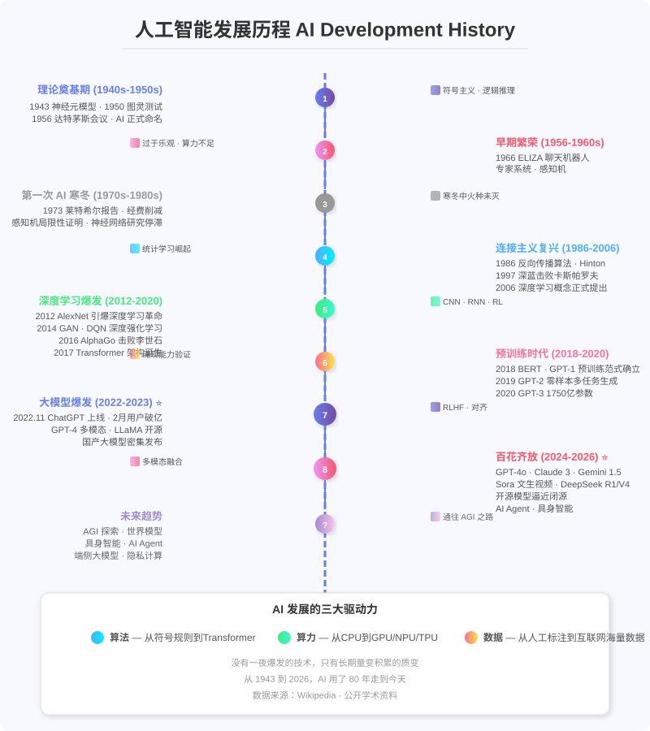

# 人工智能 (Artificial Intelligence)

> 人工智能（Artificial Intelligence, AI）是一门研究如何使机器具备智能行为的前沿学科。从 1956 年达特茅斯会议正式诞生至今，AI 经历了近 80 年的曲折发展，现已进入大模型时代，深刻改变着各行各业。

---

## 目录

- [14.1 AI 发展历史总览](#141-ai-发展历史总览)
- [14.2 AI 核心算法体系](#142-ai-核心算法体系)
  - [14.2.1 传统机器学习](./11a_传统机器学习.md)
  - [14.2.2 深度学习](./11b_深度学习.md)
  - [14.2.3 强化学习](./11c_强化学习.md)
  - [14.2.4 生成式 AI 与大模型](./11d_生成式AI与大模型.md)
  - [14.2.5 多模态 AI](#) — 包含在 [11d_生成式AI与大模型.md](./11d_生成式AI与大模型.md) 中
  - [14.2.6 AI 算法分类总览](#1426-ai-算法分类总览)
- [14.3 AI 学习路径建议](./11e_学习路径与资源.md)
- [14.4 AI 领域常用资源](./11e_学习路径与资源.md)

---

## 14.1 AI 发展历史总览

人工智能的发展并非一蹴而就，而是经历了多次起伏。从 1940 年代的理论奠基，到 2020 年代的大模型爆发，AI 的发展史也是一部人类对智能本质的探索史。

### 14.1.1 发展阶段总览

| 阶段 | 时间 | 核心范式 | 标志性成果 | 关键人物 |
|------|------|----------|-----------|----------|
| **理论奠基期** | 1940s–1955 | 神经科学启发 + 数理逻辑 | 1943 McCulloch-Pitts 神经元模型；1950 图灵测试 | 图灵、McCulloch、Pitts |
| **学科诞生与早期繁荣** | 1956–1960s | 符号主义（逻辑推理） | 1956 达特茅斯会议命名 AI；1966 ELIZA 聊天机器人 | McCarthy、Minsky、Newell、Simon |
| **第一次 AI 寒冬** | 1970s–1980s 初 | 符号主义遇冷 | 1973 莱特希尔报告批判 AI 进展，英美国大幅削减经费 | — |
| **连接主义复兴** | 1980s 中–2010 | 神经网络 + 统计学习 | 1986 反向传播算法；1997 深蓝击败国际象棋冠军；2006 深度学习概念提出 | Hinton、LeCun、Vapnik |
| **深度学习爆发** | 2012–2020 | 深度学习（CNN/RNN/RL） | 2012 AlexNet 横扫 ImageNet；2016 AlphaGo 击败李世石；2017 Transformer 诞生 | Krizhevsky、Hinton、DeepMind、Vaswani |
| **大模型时代** | 2021–至今 | 大语言模型 + 多模态 | 2020 GPT-3(1750亿参数)；2022 ChatGPT 引爆全球；2023 GPT-4 多模态；2024–2026 开源模型百花齐放 | OpenAI、Meta、Google、DeepSeek、Anthropic |

> 💡 **类比：AI 的发展像"过山车般的淘金热"** 把 AI 历史想成一座矿山的淘金史：每当人们发现"新矿脉"（好消息、新算法），资本和热情就涌进来，矿镇（研究经费）迅速繁荣；但当矿脉被挖空、兑现不了承诺时，人们失望散去，矿镇陷入"寒冬"（研究经费被砍）。有意思的是，**每次寒冬里坚持挖矿的人**，往往在下一轮淘金热中成了最大赢家——比如 1980 年代寒冬中坚持研究神经网络的那批人，正是 2012 年引爆深度学习的主角。下图展示了这条"繁荣—寒冬—再繁荣"的蜿蜒历史曲线。

### 14.1.2 核心里程碑时间线

#### 理论奠基期 (1943–1955)

- **1943** — McCulloch & Pitts 发表首篇人工神经网络论文《A Logical Calculus of the Ideas Immanent in Nervous Activity》，提出 M-P 神经元模型，将神经元抽象为逻辑运算单元（AND/OR/NOT），证明神经网络可以计算任何可计算函数。这是神经网络理论的起点。
- **1945** — 冯·诺依曼提出存储程序计算机概念（冯·诺依曼体系结构），为 AI 的硬件实现奠定基础。
- **1948** — Norbert Wiener 出版《控制论：或关于在动物和机器中控制和通信的科学》，建立反馈机制理论，影响机器人学和自动化。
- **1950** — 图灵发表《计算机器与智能》（Computing Machinery and Intelligence），提出"图灵测试"——判断机器是否具有智能的标准。论文中图灵预言：到 2000 年，机器能在 5 分钟对话中欺骗 30% 的人类评委。这一预言直到 2014 年才首次被 Eugene Goostman 聊天机器人实现（有争议）。
- **1951** — Marvin Minsky 和 Dean Edmonds 构建 SNARC（Stochastic Neural Analog Reinforcement Calculator），使用 3000 个真空管模拟 40 个神经元，是第一个神经网络硬件实现。
- **1955** — Allen Newell 和 Herbert Simon 创建 Logic Theorist（逻辑理论家），通常被认为是第一个 AI 程序——证明了罗素和怀特海《数学原理》中 52 个定理中的 38 个。

#### 学科诞生与早期繁荣 (1956–1974)

- **1956** — **达特茅斯会议**（Dartmouth Conference）：John McCarthy 首次提出"人工智能"术语，标志着 AI 作为独立学科正式诞生。会议持续 8 周，参与者包括 Minsky、Rochester（IBM）、Shannon（信息论创始人）等。会议提案标题为"A Proposal for the Dartmouth Summer Research Project on Artificial Intelligence"。
- **1957** — Frank Rosenblatt 发明感知机（Perceptron），在 IBM 704 计算机上实现 Mark I Perceptron。这是首个可学习的单层神经网络，能够识别简单几何图形。Rosenblatt 乐观地认为感知机是"人类大脑的胚胎"。
- **1958** — John McCarthy 发明 LISP 编程语言（LISt Processing），专为 AI 设计的符号处理语言，统治 AI 领域数十年，至今仍有使用。
- **1959** — Arthur Samuel 首次提出"Machine Learning"术语，开发跳棋程序，能通过自我对弈学习。
- **1961** — 第一个工业机器人 Unimate 安装在通用汽车生产线，AI 首次大规模物理世界应用。
- **1964** — Joseph Weizenbaum 创建 ELIZA 聊天机器人，模拟罗杰斯心理治疗师对话。采用模式匹配和替换技术，许多用户对 ELIZA 产生了情感依赖，这是"AI 拟人化效应"的早期演示。
- **1965** — Herbert Simon 做出著名预言："二十年内，机器将能做人类能做的任何工作。"——这是 AI 历史上多次过度乐观预测的典型代表。
- **1966** — ALPAC 报告发布，宣布机器翻译短期内无法实现实用化，美国政府大幅削减 AI 翻译研究经费。
- **1969** — Minsky 和 Papert 出版《感知机》（Perceptrons），严格证明单层感知机无法解决 XOR（异或）问题，神经网络研究陷入长达十多年的寒冬。这本书的出版被认为是导致第一次 AI 寒冬的关键因素之一。

#### 第一次 AI 寒冬 (1974–1980)

- **1973** — **莱特希尔报告**（Lighthill Report）：英国爵士 James Lighthill 发布对 AI 研究的严厉批评，结论是"AI 研究未能兑现其承诺，主要在玩具问题上进行演示"。英国政府几乎完全削减 AI 研究经费，标志着第一次 AI 寒冬的全面到来。
- **1974–1980** — 美国和英国政府大幅削减 AI 研究资助。研究者被迫将自己的工作重新命名为"模式识别"、"信息科学"等以规避"AI"标签。但部分研究在寒冬中继续：Xerox PARC 的 Smalltalk 环境、Stanford 的 MYCIN 专家系统等。

#### 连接主义复兴与专家系统时代 (1980–2006)

- **1980** — **专家系统商业化**：XCON（R1）在 DEC 公司部署，通过数千条手工编码规则配置计算机订单，为 DEC 每年节省约 4000 万美元。这是首个商业成功的专家系统，引发 AI 商业化热潮。
- **1981** — 日本启动**第五代计算机项目**（8.5 亿美元，10 年计划），目标是开发并行推理智能计算机。这一项目刺激了美国和欧洲加大 AI 投入。
- **1984** — Doug Lenat 启动 Cyc 项目，试图手工编码数百万条常识知识——这个项目至今仍在进行。
- **1986** — **反向传播算法普及**：Rumelhart、Hinton 和 Williams 发表《Learning representations by back-propagating errors》，重新发现并推广 BP 算法，解决了多层神经网络训练难题。这是深度学习的关键算法基础，但当时并未引起主流 AI 界的足够重视。
- **1987** — 专用 LISP 机器市场崩溃，Symbolics 等公司困境，标志着**第二次 AI 寒冬**开始。
- **1988** — Judea Pearl 出版《Probabilistic Reasoning in Intelligent Systems》，引入贝叶斯网络，推动 AI 从纯逻辑推理转向概率推理。
- **1993** — 第二次 AI 寒冬结束，统计学习（Statistical Learning）开始崛起。
- **1997** — **IBM 深蓝击败世界冠军卡斯帕罗夫**：这是 AI 首次在复杂棋类游戏中击败人类世界冠军。但许多人将其归因为"暴力搜索"，而非"真正的智能"——这被称为"AI 效应"（AI Effect）。
- **1998** — Yann LeCun 展示卷积神经网络 LeNet-5 用于手写数字识别，CNN 首次实用化。
- **2002** — iRobot 发布 Roomba 扫地机器人，AI 进入千万家庭。
- **2006** — **深度学习概念正式提出**：Geoffrey Hinton 发表深度信念网络（DBN）论文，提出逐层预训练方法解决深层网络训练难题。同年，李飞飞启动 ImageNet 项目——一个包含 1500 万张标注图像的数据集，为深度学习革命提供了数据基础。

#### 深度学习爆发 (2012–2020)

- **2009** — 吴恩达（Andrew Ng）团队提出 GPU 加速神经网络训练，深度学习硬件支持时代开启。
- **2012** — **AlexNet 在 ImageNet 竞赛中夺冠**：Alex Krizhevsky、Ilya Sutskever 和 Hinton 的 AlexNet 以 15.3% 的错误率（第二名 26%）碾压传统计算机视觉算法，引爆深度学习革命。核心创新包括 ReLU 激活函数、Dropout 正则化和 GPU 并行训练。
- **2014** — **GAN 诞生**：Ian Goodfellow 提出生成对抗网络（Generative Adversarial Networks），生成器与判别器对抗训练，被 Yann LeCun 称为"机器学习近十年来最有意思的想法"。
- **2014** — **DQN 突破**：DeepMind 提出深度 Q 网络（Deep Q-Network），在 Atari 游戏中超越人类水平，深度强化学习诞生。
- **2015** — **ResNet**：Kaiming He 提出残差网络（Residual Network），引入残差连接（Skip Connection），突破百层网络瓶颈，152 层 ResNet 在 ImageNet 达到 3.57% 错误率，超越人类水平。
- **2016** — **AlphaGo 击败李世石**：DeepMind 的 AlphaGo 以 4:1 击败围棋世界冠军李世石，震惊世界。AlphaGo 结合深度卷积神经网络 + 蒙特卡洛树搜索（MCTS）+ 强化学习，是多种 AI 技术的融合典范。
- **2017** — **Transformer 架构诞生**：Google 发表《Attention Is All You Need》，提出基于自注意力机制的 Transformer 架构，完全替代 RNN/CNN，成为所有大模型的基础架构。这篇论文被认为是 AI 发展史上最重要的论文之一。

#### 大模型时代 (2018–至今)

- **2018** — **BERT 和 GPT-1 发布**：Google 发布 BERT（双向编码器，340M 参数），刷新 11 项 NLP 任务；OpenAI 发布 GPT-1（117M 参数），首次验证"预训练 + 微调"范式。
- **2019** — **GPT-2**：OpenAI 发布 GPT-2（1.5B 参数），展现零样本多任务生成能力。OpenAI 一度因安全顾虑推迟发布，引发 AI 安全讨论。
- **2020** — **GPT-3 发布**：OpenAI 发布 GPT-3（1750 亿参数），展现涌现能力（In-Context Learning、Few-shot Learning），无需微调即可执行多种任务。大模型时代正式开启。
- **2020** — **AlphaFold 2**：DeepMind 的 AlphaFold 2 解决蛋白质折叠问题，被《科学》杂志评为年度突破。
- **2021** — **DALL·E 和 CLIP**：OpenAI 发布 DALL·E（文生图）和 CLIP（图文对齐），开启 AI 艺术创作时代。
- **2022.11** — **ChatGPT 上线**：基于 GPT-3.5 + RLHF 的 ChatGPT 在 5 天内获得 100 万用户，2 个月用户破亿，成为史上增长最快的消费级应用，引爆全球 AI 热潮。
- **2023** — **GPT-4 多模态**：GPT-4 支持多模态输入（文本+图像），在律师资格考试中位列前 10%。**LLaMA 开源**：Meta 发布高效开源 LLaMA 系列，引发开源大模型生态爆发。**Claude 系列**：Anthropic 的 Claude 2 采用宪法 AI（Constitutional AI）对齐技术。
- **2024** — **GPT-4o**：原生多模态，实时语音对话。**Claude 3 Opus**：综合性能超越 GPT-4。**Gemini 1.5 Pro**：百万级 Token 上下文。**Sora**：文生视频，60 秒连贯视频。**LLaMA 3 / Qwen 2**：开源模型性能逼近闭源。
- **2025** — **DeepSeek R1**：以更少算力达到全球顶尖推理水平，打破"算力决定一切"魔咒。**GPT-5 / Claude 4**：推理时计算扩展，深度推理能力大幅提升。
- **2026** — **DeepSeek V4**：开源登顶，百万级上下文，国产芯片适配。**GPT-5.5**：编程 Agent Terminal-Bench 82.7%。**Claude 4.6 Opus**：1M 上下文窗口，Scaling Law 持续生效。AI Agent 与具身智能加速落地。

### 14.1.3 AI 发展的三大驱动力

AI 发展的核心驱动力可归纳为**算法、算力、数据**三大要素：

| 驱动力 | 演进路径 | 关键突破 |
|--------|----------|----------|
| **算法** | 符号规则 → 统计学习 → 神经网络 → Transformer | 反向传播、注意力机制、RLHF |
| **算力** | CPU → GPU → TPU → NPU → 超算集群 | CUDA 并行计算、分布式训练、量化推理 |
| **数据** | 人工标注 → 互联网爬取 → 多模态海量数据 | ImageNet、Common Crawl、LAION-5B |

> 没有一夜爆发的技术，只有长期量变积累的质变。从 1943 到 2026，AI 用了 80 多年走到今天。

---

## 14.2 AI 核心算法体系

### 14.2.1 传统机器学习

[📖 查看详细文档 →](./11a_传统机器学习.md)

涵盖：监督学习（线性回归、SVM、决策树、随机森林、XGBoost 等）、无监督学习（K-Means、DBSCAN、PCA 等）、集成学习、半监督学习

---

### 14.2.2 深度学习

[📖 查看详细文档 →](./11b_深度学习.md)

涵盖：MLP、CNN、RNN/LSTM、Transformer、GNN、GAN、扩散模型等

---

### 14.2.3 强化学习

[📖 查看详细文档 →](./11c_强化学习.md)

涵盖：MDP、Q-Learning、DQN、Policy Gradient、PPO、SAC、MCTS、MuZero 等

---

### 14.2.4 生成式 AI 与大模型

[📖 查看详细文档 →](./11d_生成式AI与大模型.md)

涵盖：GAN、扩散模型、大语言模型（LLM）、预训练、RLHF、RAG、MoE、模型量化等

---

### 14.2.5 多模态 AI

多模态 AI 内容已包含在 [11d_生成式AI与大模型.md](./11d_生成式AI与大模型.md) 中。

[📖 查看详细文档 →](./11d_生成式AI与大模型.md)

涵盖：CLIP、Stable Diffusion、GPT-4V、Gemini、Sora 等

---

### 14.2.6 AI 算法分类总览

| 类别 | 子类 | 代表算法 | 核心能力 |
|------|------|----------|----------|
| **机器学习** | 监督学习 | 线性回归、SVM、决策树、随机森林、XGBoost | 分类、回归、预测 |
| **机器学习** | 无监督学习 | K-Means、DBSCAN、PCA、t-SNE | 聚类、降维、异常检测 |
| **机器学习** | 集成学习 | Bagging、Boosting、Stacking | 提升精度、降低方差 |
| **深度学习** | CNN | LeNet、ResNet、EfficientNet、YOLO | 图像处理、视觉感知 |
| **深度学习** | RNN | LSTM、GRU、Seq2Seq | 时序建模、序列处理 |
| **深度学习** | Transformer | BERT、GPT、ViT、T5 | 通用序列建模、NLP |
| **深度学习** | GNN | GCN、GAT、GraphSAGE | 图结构数据、分子建模 |
| **强化学习** | 值函数 | DQN、Double DQN、Dueling DQN | 离散动作决策 |
| **强化学习** | 策略梯度 | PPO、SAC、REINFORCE | 连续动作控制 |
| **强化学习** | 规划 | MCTS、MuZero、AlphaZero | 搜索 + 规划 |
| **生成式 AI** | GAN | DCGAN、StyleGAN、CycleGAN | 图像生成、风格迁移 |
| **生成式 AI** | 扩散模型 | DDPM、Stable Diffusion、DiT | 高质量生成、文生图/视频 |
| **生成式 AI** | 大语言模型 | GPT-4、LLaMA、Claude、DeepSeek | 理解、生成、推理、代码 |
| **多模态** | 图文对齐 | CLIP、Flamingo | 跨模态理解 |
| **多模态** | 多模态生成 | GPT-4V、Gemini、Sora | 多模态输入输出 |

---

## 14.3 AI 学习路径建议

[📖 查看详细文档 →](./11e_学习路径与资源.md)

涵盖：入门到进阶学习路径、推荐课程与书籍、竞赛与认证

---

## 14.4 AI 领域常用资源

[📖 查看详细文档 →](./11e_学习路径与资源.md)

涵盖：书籍推荐、在线课程、平台与工具、框架、研究机构、学术会议、数据集资源

---

> **说明**：本文档结合了网络公开学术资料与前沿技术报告整理而成，涵盖 AI 发展历史、核心算法体系、学习路径和资源推荐。内容持续更新，以反映 AI 领域的最新进展。

---

**← 返回 [README.md](./README.md)**