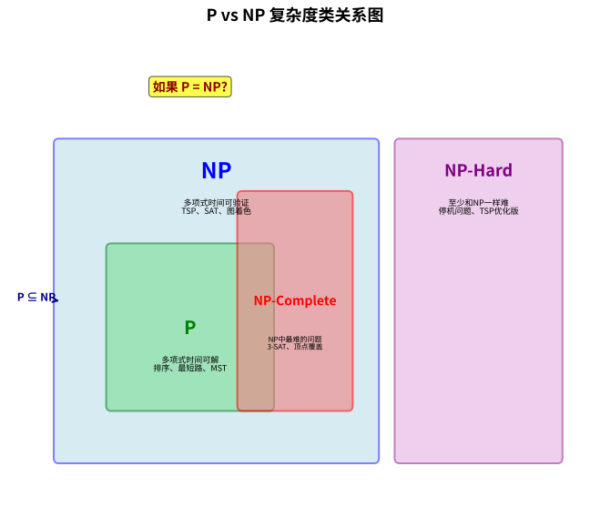
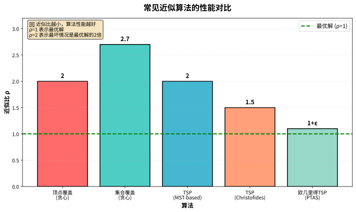
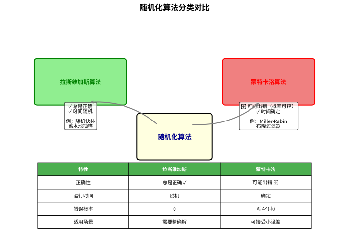
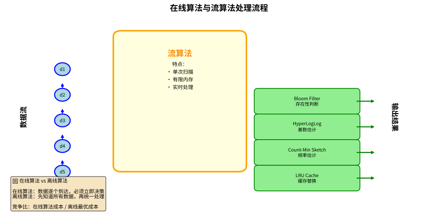
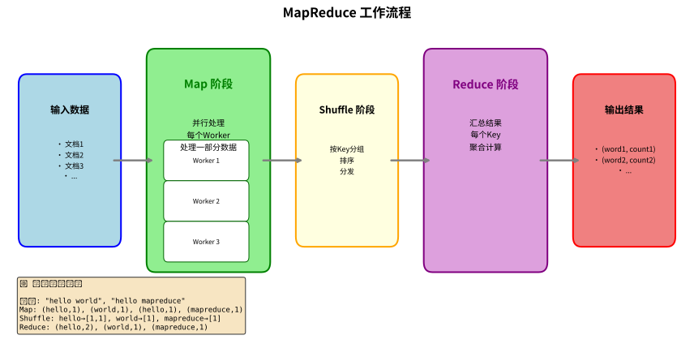
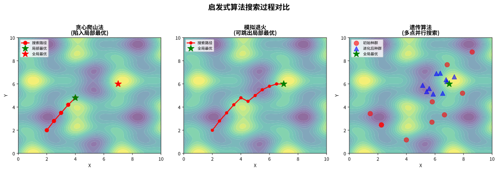

# 第九层：高级算法与复杂度理论

> 💡 **类比：算法的"哲学课"**
>
> 想象你是一名武林高手，已经掌握了各种招式（基础算法）。现在你要学习的是"武学哲学"：
> - **复杂度理论**：哪些问题"可解"，哪些"无解"，哪些"难解"
> - **近似算法**：当完美解不可得时，如何找到"足够好"的解
> - **随机化算法**：用"运气"来加速算法
> - **启发式算法**：当精确解太慢时，用"经验法则"快速找解
>
> 这一层的内容是算法的"元理论"，帮助你理解算法的本质边界。

---

## 1. 复杂度理论

### 1.1 P vs NP 问题

> 💡 **类比：解题 vs 验题**
>
> 想象你在参加数学竞赛：
> - **P 类问题**：能在多项式时间内**解出**的问题（如排序、最短路）
> - **NP 类问题**：能在多项式时间内**验证**答案的问题（如数独——填完很容易检查，但找解很难）
>
> **P vs NP 问题**：P = NP 吗？
> - 如果 P = NP：所有能验证的问题都能快速解决（密码学崩溃！）
> - 如果 P ≠ NP：有些问题天生就难（大多数科学家相信这个）
>
> 这是计算机科学最大的未解之谜，克雷数学研究所悬赏 100 万美元。



#### 复杂度类详解

| 复杂度类 | 说明 | 经典问题 | 类比 |
|----------|------|----------|------|
| **P** | 多项式时间可解 | 最短路径、最小生成树、排序 | "简单题" |
| **NP** | 多项式时间可验证 | 哈密顿回路、TSP、数独 | "难题但易验" |
| **NP-Complete** | NP 中最难的问题 | SAT、3-SAT、顶点覆盖 | "NP 的'天花板'" |
| **NP-Hard** | 至少和 NP 一样难 | 停机问题、TSP 优化版 | "比 NP 还难" |
| **EXP** | 指数时间可解 | 某些博弈问题 | "指数级慢" |
| **PSPACE** | 多项式空间可解 | 量化布尔公式 | "空间够就行" |

#### 证明 NP-Complete 的步骤

要证明一个问题 Q 是 NP-Complete，需要：

1. **证明 Q ∈ NP**：给定解能在多项式时间验证
2. **选择已知 NPC 问题 Q'**：如 3-SAT、顶点覆盖
3. **构造多项式时间归约**：Q' ≤ₚ Q
4. **证明归约的正确性**：Q' 有解 ⟺ Q 有解

```python
# 示例：顶点覆盖问题（NPC）
def vertex_cover_approximation(G, k):
    """
    顶点覆盖的 2-近似算法
    
    💡 类比：选最少的保安覆盖所有走廊
    虽然精确解是 NPC，但我们可以找到近似解
    
    算法：贪心选择边，加入两端点
    近似比：2（最坏情况下解的大小是最优解的 2 倍）
    """
    cover = set()
    edges = set(G.edges())
    
    while edges:
        # 任选一条边
        u, v = edges.pop()
        # 加入两端点
        cover.add(u)
        cover.add(v)
        # 移除所有与 u 或 v 关联的边
        edges = {(x, y) for x, y in edges if x not in (u, v) and y not in (u, v)}
    
    return cover

# 示例：3-SAT 归约到顶点覆盖
# 这是证明 NPC 的标准技巧
def sat_to_vertex_cover(clauses):
    """
    将 3-SAT 实例归约为顶点覆盖实例
    用于证明顶点覆盖是 NP-Complete
    
    💡 核心思想：
    - 每个变量构造一条边 (x, ¬x)
    - 每个子句构造一个三角形
    - 变量和否定之间连边
    """
    # 构造图的具体实现（略）
    pass
```

### 1.2 常见的 NP-Complete 问题

| 问题 | 描述 | 应用 |
|------|------|------|
| **SAT** | 布尔公式可满足性 | 电路设计、自动推理 |
| **3-SAT** | 每个子句恰好 3 个文字 | 归约的"标准起点" |
| **顶点覆盖** | 选最少的点覆盖所有边 | 网络监控 |
| **团问题** | 找最大的完全子图 | 社交网络分析 |
| **哈密顿回路** | 经过每个点恰好一次的回路 | 物流配送 |
| **TSP** | 最短哈密顿回路 | 路径规划 |
| **子集和** | 是否存在子集和为 target | 背包问题特例 |
| **图着色** | 用最少的颜色给图着色 | 课程调度、寄存器分配 |

### 1.3 练习题

1. **证明 3-SAT 是 NP-Complete**：提示：从 SAT 归约
2. **顶点覆盖归约到团问题**：构造补图
3. **思考题**：如果 P = NP，世界会变成什么样？

---

## 2. 近似算法

> 💡 **类比：找零钱**
>
> 想象你要精确支付 100 元，但只有大面额钞票：
> - **精确算法**：找到恰好 100 元的组合（如果可能的话）
> - **近似算法**：用 105 元支付，多给 5 元（误差 5%）
> - **近似比**：衡量"最坏情况下会多付多少"。近似比 2 意味着最多付 200 元（最优解是 100 元）
>
> 对于 NP-Hard 问题，我们放弃"完美解"，转而追求"足够好的解"。



### 2.1 近似比与性能保证

**定义**：算法 A 是 ρ-近似的，如果对于所有输入：
- 最小化问题：A(I) / OPT(I) ≤ ρ
- 最大化问题：OPT(I) / A(I) ≤ ρ

### 2.2 贪心顶点覆盖（2-近似）

```python
def greedy_vertex_cover(G):
    """
    贪心顶点覆盖算法
    
    💡 类比：选最少的保安覆盖所有走廊
    每次选一条 uncovered 的边，把两端点都加入覆盖
    
    近似比：2
    时间复杂度：O(V + E)
    """
    cover = set()
    edges = set(G.edges())
    
    while edges:
        u, v = edges.pop()
        cover.add(u)
        cover.add(v)
        edges = {(x, y) for x, y in edges if x not in (u, v) and y not in (u, v)}
    
    return cover

# 示例
import networkx as nx
G = nx.cycle_graph(6)
cover = greedy_vertex_cover(G)
print(f"顶点覆盖: {cover}, 大小: {len(cover)}")
```

### 2.3 Christofides 算法（1.5-近似 TSP）

```python
def christofides_tsp(distance_matrix):
    """
    Christofides 算法：度量 TSP 的 1.5-近似算法
    
    💡 类比：送快递的最优路线
    步骤：
    1. 构造最小生成树 T
    2. 找出 T 中奇数度数的顶点，构造最小权完美匹配 M
    3. 将 T 和 M 合并，得到欧拉图
    4. 找出欧拉回路，跳过重复顶点得到哈密顿回路
    
    近似比：1.5（目前最好的多项式时间近似比）
    """
    n = len(distance_matrix)
    
    # 步骤 1: 构造 MST (Prim 或 Kruskal)
    mst_edges = prim_mst(distance_matrix)
    
    # 步骤 2: 找出奇数度数的顶点
    degree = [0] * n
    for u, v in mst_edges:
        degree[u] += 1
        degree[v] += 1
    
    odd_vertices = [i for i in range(n) if degree[i] % 2 == 1]
    
    # 步骤 3: 在奇数度数顶点上构造最小权完美匹配
    matching = min_weight_perfect_matching(odd_vertices, distance_matrix)
    
    # 步骤 4: 合并 MST 和匹配，构造欧拉回路
    combined_edges = mst_edges + matching
    euler_circuit = find_euler_circuit(combined_edges)
    
    # 步骤 5: 跳过重复顶点，得到 TSP 回路
    tsp_tour = shortcut_euler_circuit(euler_circuit)
    
    return tsp_tour

def prim_mst(distances):
    """Prim 算法求 MST"""
    n = len(distances)
    in_mst = [False] * n
    key = [float('inf')] * n
    parent = [-1] * n
    
    key[0] = 0
    mst_edges = []
    
    for _ in range(n):
        # 选最小 key 的顶点
        u = min((i for i in range(n) if not in_mst[i]), key=lambda i: key[i])
        in_mst[u] = True
        
        if parent[u] != -1:
            mst_edges.append((parent[u], u))
        
        # 更新邻居
        for v in range(n):
            if not in_mst[v] and distances[u][v] < key[v]:
                key[v] = distances[u][v]
                parent[v] = u
    
    return mst_edges
```

### 2.4 贪心集合覆盖（ln n-近似）

```python
def greedy_set_cover(universe, sets):
    """
    贪心集合覆盖算法
    
    💡 类比：用最少的手电筒照亮整个房间
    每次选能照亮最多黑暗区域的手电筒
    
    近似比：ln(n)，其中 n 是全集大小
    时间复杂度：O(|U| * |S|)
    """
    uncovered = set(universe)
    cover = []
    
    while uncovered:
        # 选择覆盖最多未覆盖元素的集合
        best_set = max(sets, key=lambda s: len(s & uncovered))
        cover.append(best_set)
        uncovered -= best_set
    
    return cover

# 示例
universe = {1, 2, 3, 4, 5, 6, 7, 8, 9, 10}
sets = [
    {1, 2, 3, 4},
    {2, 3, 5, 6},
    {4, 5, 7, 8},
    {6, 7, 9, 10},
    {1, 8, 9, 10}
]
cover = greedy_set_cover(universe, sets)
print(f"选择的集合: {cover}")  # 输出: [{1, 2, 3, 4}, {4, 5, 7, 8}, {6, 7, 9, 10}]
```

### 2.5 PTAS（多项式时间近似方案）

**定义**：对于任意 ε > 0，存在算法 A_ε，使得：
- A_ε 是 (1 + ε)-近似的
- A_ε 的运行时间是输入规模的多项式

**例子**：
- 欧几里得 TSP 有 PTAS
- 背包问题有 FPTAS（ Fully PTAS，运行时间也是 1/ε 的多项式）

### 2.6 练习题

1. **实现 2-近似的 TSP 算法**（基于 MST）
2. **证明集合覆盖的贪心算法是 ln n-近似的**
3. **思考题**：为什么 Christofides 算法的近似比是 1.5？

---

## 3. 随机化算法

> 💡 **类比：掷骰子决策**
>
> 想象你要在迷宫中找出口：
> - **确定性算法**：按照固定规则（如"一直靠右走"）搜索，可能遇到最坏情况
> - **拉斯维加斯算法**：随机选择方向，但**保证找到正确答案**，只是时间不确定（如随机快排）
> - **蒙特卡洛算法**：随机选择方向，**时间确定但可能出错**，出错概率可以控制（如 Miller-Rabin）
>
> 随机化的威力在于：通过引入随机性，可以避免对手构造的最坏情况。



### 3.1 拉斯维加斯 vs 蒙特卡洛

| 类型 | 正确性 | 运行时间 | 例子 |
|------|--------|----------|------|
| **拉斯维加斯** | 总是正确 | 随机（期望多项式） | 随机快排 |
| **蒙特卡洛** | 可能出错（概率可控） | 确定性 | Miller-Rabin |

### 3.2 随机快速排序

```python
import random

def randomized_quicksort(arr):
    """
    随机快速排序
    
    💡 类比：随机选一个"标杆"，把比它小的放左边，比它大的放右边
    通过随机选择 pivot，避免最坏情况（已排序数组）
    
    期望时间复杂度：O(n log n)
    最坏情况：O(n²)（概率极低）
    """
    if len(arr) <= 1:
        return arr
    
    # 随机选择 pivot
    pivot = random.choice(arr)
    
    left = [x for x in arr if x < pivot]
    middle = [x for x in arr if x == pivot]
    right = [x for x in arr if x > pivot]
    
    return randomized_quicksort(left) + middle + randomized_quicksort(right)

# 示例
arr = [3, 6, 8, 10, 1, 2, 1]
print(randomized_quicksort(arr))  # [1, 1, 2, 3, 6, 8, 10]
```

### 3.3 Miller-Rabin 素性测试

```python
import random

def miller_rabin(n, k=10):
    """
    Miller-Rabin 素性测试（蒙特卡洛算法）
    
    💡 类比：用多个"证人"判断一个人是否诚实
    每个证人随机提问，如果所有人都说"诚实"，则很可能是诚实的
    但有小概率出错（伪素数）
    
    参数：
        n: 待测试的数
        k: 测试轮数（越大越准确，错误概率 ≤ 4^(-k)）
    
    返回：
        True: 很可能是素数
        False: 一定是合数
    
    时间复杂度：O(k log³n)
    """
    if n < 2: return False
    if n == 2 or n == 3: return True
    if n % 2 == 0: return False
    
    # 将 n-1 分解为 2^r * d
    r, d = 0, n - 1
    while d % 2 == 0:
        r += 1
        d //= 2
    
    # k 轮测试
    for _ in range(k):
        a = random.randint(2, n - 2)
        x = pow(a, d, n)
        
        if x == 1 or x == n - 1:
            continue
        
        for _ in range(r - 1):
            x = pow(x, 2, n)
            if x == n - 1:
                break
        else:
            return False  # 一定是合数
    
    return True  # 很可能是素数

# 示例
print(miller_rabin(10**9 + 7))  # True (素数)
print(miller_rabin(10**9 + 9))  # True (素数)
print(miller_rabin(100))        # False (合数)

# 测试大素数
large_prime = 2**61 - 1  # 梅森素数
print(miller_rabin(large_prime, k=20))  # True
```

### 3.4 蓄水池抽样

```python
import random

def reservoir_sampling(stream, k):
    """
    蓄水池抽样：从数据流中随机选取 k 个元素
    
    💡 类比：从无限长的队伍中随机选 k 个人
    你不知道队伍有多长，但要保证每个人被选中的概率相等
    
    算法思想：
    - 前 k 个元素直接放入"蓄水池"
    - 第 i 个元素（i > k）以 k/i 的概率替换池中的某个元素
    
    时间复杂度：O(n)
    空间复杂度：O(k)
    """
    reservoir = []
    
    for i, item in enumerate(stream):
        if i < k:
            reservoir.append(item)
        else:
            # 以 k/(i+1) 的概率替换
            j = random.randint(0, i)
            if j < k:
                reservoir[j] = item
    
    return reservoir

# 示例：从 100 万个数中随机选 10 个
stream = range(1000000)
samples = reservoir_sampling(stream, 10)
print(f"随机样本: {samples}")
```

### 3.5 跳跃表（Skip List）

```python
import random

class SkipListNode:
    def __init__(self, val, level):
        self.val = val
        self.forward = [None] * (level + 1)

class SkipList:
    """
    跳跃表：概率数据结构，替代平衡树
    
    💡 类比：地铁快慢车
    - 普通链表：每站都停（O(n) 查找）
    - 跳跃表：有快车（高层）和慢车（底层）
      快车跳过很多站，慢车每站都停
      通过随机决定每个站有几条线路
    
    时间复杂度：
    - 查找/插入/删除：O(log n) 期望
    - 空间复杂度：O(n)
    """
    def __init__(self, max_level=16, p=0.5):
        self.max_level = max_level
        self.p = p
        self.header = SkipListNode(None, max_level)
        self.level = 0
    
    def _random_level(self):
        """随机生成层数"""
        lvl = 0
        while random.random() < self.p and lvl < self.max_level:
            lvl += 1
        return lvl
    
    def search(self, target):
        """查找目标值"""
        current = self.header
        for i in range(self.level, -1, -1):
            while current.forward[i] and current.forward[i].val < target:
                current = current.forward[i]
        
        current = current.forward[0]
        return current and current.val == target
    
    def insert(self, val):
        """插入新值"""
        update = [None] * (self.max_level + 1)
        current = self.header
        
        for i in range(self.level, -1, -1):
            while current.forward[i] and current.forward[i].val < val:
                current = current.forward[i]
            update[i] = current
        
        new_level = self._random_level()
        if new_level > self.level:
            for i in range(self.level + 1, new_level + 1):
                update[i] = self.header
            self.level = new_level
        
        new_node = SkipListNode(val, new_level)
        for i in range(new_level + 1):
            new_node.forward[i] = update[i].forward[i]
            update[i].forward[i] = new_node

# 示例
sl = SkipList()
for x in [3, 6, 7, 9, 12, 19, 17, 26, 21, 25]:
    sl.insert(x)

print(sl.search(19))  # True
print(sl.search(100)) # False
```

### 3.6 练习题

1. **实现随机化快速选择（Randomized Select）**：找第 k 小元素
2. **实现 Las Vegas 版本的图着色**：随机尝试直到成功
3. **思考题**：为什么跳跃表在实际中比平衡树更容易实现？

---

## 4. 在线算法与流算法

> 💡 **类比：边做菜边上菜**
>
> 想象你是厨师，但不知道今天会有多少客人、点什么菜：
> - **离线算法**：先知道所有订单，再统一规划做菜顺序（最优解）
> - **在线算法**：来一个订单做一个，必须立即决定（无法预知未来）
>
> 在线算法的核心挑战是：**在信息不完整的情况下做出最优决策**。我们用**竞争比**衡量在线算法的质量——最坏情况下，在线算法的成本与离线最优解的比值。



### 4.1 LRU 缓存（最近最少使用）

```python
from collections import OrderedDict

class LRUCache:
    """
    LRU 缓存：最近最少使用的页面置换算法
    
    💡 类比：书架整理
    - 书架只能放 k 本书
    - 新书来了，放最显眼的位置（最近使用）
    - 书架满了，把最久没看的书移走（最近最少使用）
    
    时间复杂度：O(1) 查找/插入/删除
    空间复杂度：O(k)
    
    应用：CPU 缓存、数据库缓冲池、浏览器缓存
    """
    def __init__(self, capacity: int):
        self.cache = OrderedDict()
        self.capacity = capacity
    
    def get(self, key: int) -> int:
        """获取缓存值，标记为最近使用"""
        if key not in self.cache:
            return -1
        # 移到末尾（最近使用）
        self.cache.move_to_end(key)
        return self.cache[key]
    
    def put(self, key: int, value: int) -> None:
        """插入或更新缓存"""
        if key in self.cache:
            # 已存在，更新并移到末尾
            self.cache.move_to_end(key)
            self.cache[key] = value
        else:
            if len(self.cache) >= self.capacity:
                # 满了，淘汰最久没用的（第一个）
                self.cache.popitem(last=False)
            self.cache[key] = value

# 示例
cache = LRUCache(2)
cache.put(1, 1)
cache.put(2, 2)
print(cache.get(1))  # 1 (访问 1，1 变为最近使用)
cache.put(3, 3)      # 淘汰 2（最久没用）
print(cache.get(2))  # -1 (已被淘汰)
cache.put(4, 4)      # 淘汰 1
print(cache.get(1))  # -1
print(cache.get(3))  # 3
print(cache.get(4))  # 4
```

### 4.2 LFU 缓存（最不经常使用）

```python
from collections import defaultdict, OrderedDict

class LFUCache:
    """
    LFU 缓存：最不经常使用的页面置换算法
    
    💡 类比：图书馆藏书
    - 书架只能放 k 本书
    - 每本书记录被借阅的次数
    - 书架满了，淘汰借阅次数最少的书
    - 如果次数相同，淘汰最久没借的
    
    时间复杂度：O(1) 查找/插入/删除
    空间复杂度：O(k)
    """
    def __init__(self, capacity: int):
        self.capacity = capacity
        self.key_to_val = {}
        self.key_to_freq = {}
        self.freq_to_keys = defaultdict(OrderedDict)
        self.min_freq = 0
    
    def get(self, key: int) -> int:
        if key not in self.key_to_val:
            return -1
        
        freq = self.key_to_freq[key]
        # 从当前频率移除
        del self.freq_to_keys[freq][key]
        
        # 如果当前频率为空，更新 min_freq
        if not self.freq_to_keys[freq] and self.min_freq == freq:
            self.min_freq += 1
        
        # 增加频率
        self.key_to_freq[key] = freq + 1
        self.freq_to_keys[freq + 1][key] = True
        
        return self.key_to_val[key]
    
    def put(self, key: int, value: int) -> None:
        if self.capacity == 0:
            return
        
        if key in self.key_to_val:
            self.key_to_val[key] = value
            self.get(key)  # 更新频率
            return
        
        if len(self.key_to_val) >= self.capacity:
            # 淘汰最不常用的
            lfu_key, _ = self.freq_to_keys[self.min_freq].popitem(last=False)
            del self.key_to_val[lfu_key]
            del self.key_to_freq[lfu_key]
        
        self.key_to_val[key] = value
        self.key_to_freq[key] = 1
        self.freq_to_keys[1][key] = True
        self.min_freq = 1

# 示例
cache = LFUCache(2)
cache.put(1, 1)
cache.put(2, 2)
print(cache.get(1))  # 1
cache.put(3, 3)      # 淘汰 2（频率最低）
print(cache.get(2))  # -1
print(cache.get(3))  # 3
cache.put(4, 4)      # 淘汰 1（频率 1 < 3 的频率 2）
print(cache.get(1))  # -1
print(cache.get(3))  # 3
print(cache.get(4))  # 4
```

### 4.3 Bloom Filter（布隆过滤器）

```python
import hashlib

class BloomFilter:
    """
    布隆过滤器：空间效率极高的存在性判断
    
    💡 类比：图书馆的索引卡
    - 每本书在索引卡上标记多个位置（多个哈希函数）
    - 查书时，如果所有标记位置都有书，则可能存在
    - 如果任一位置没书，则一定不存在
    
    特点：
    - 可能有假阳性（误判存在），但不会有假阴性（误判不存在）
    - 空间效率极高，适合海量数据
    - 不支持删除（标准版本）
    
    应用：URL 去重、垃圾邮件过滤、数据库查询优化
    """
    def __init__(self, size: int, hash_count: int):
        self.size = size
        self.hash_count = hash_count
        self.bit_array = [0] * size
    
    def _get_hashes(self, item: str):
        """生成多个哈希值"""
        hashes = []
        for i in range(self.hash_count):
            h = hashlib.md5(f"{item}{i}".encode()).hexdigest()
            hashes.append(int(h, 16) % self.size)
        return hashes
    
    def add(self, item: str):
        """添加元素"""
        for pos in self._get_hashes(item):
            self.bit_array[pos] = 1
    
    def contains(self, item: str) -> bool:
        """检查元素是否可能存在"""
        return all(self.bit_array[pos] for pos in self._get_hashes(item))

# 示例
bloom = BloomFilter(1000, 3)
bloom.add("apple")
bloom.add("banana")
print(bloom.contains("apple"))   # True
print(bloom.contains("banana"))  # True
print(bloom.contains("cherry"))  # False (大概率)
```

### 4.4 HyperLogLog（基数估计）

```python
import hashlib
import math

class HyperLogLog:
    """
    HyperLogLog：大数据集的基数估计（去重计数）
    
    💡 类比：抛硬币实验
    - 抛 1000 次硬币，记录连续正面的最大次数
    - 如果最大连续正面是 10 次，说明大约抛了 2^10 = 1024 次
    - HyperLogLog 用类似思想估计不同元素的数量
    
    特点：
    - 用极小内存（几 KB）估计数十亿元素的基数
    - 误差约 0.81%，可接受
    - 可合并多个 HyperLogLog（分布式友好）
    
    应用：Redis 的 PFKEY、大数据去重、社交网络统计
    """
    def __init__(self, p: int = 14):
        self.p = p  # 精度参数
        self.m = 1 << p  # 桶数量
        self.registers = [0] * self.m
    
    def _hash(self, item: str) -> int:
        """生成哈希值"""
        h = hashlib.md5(str(item).encode()).hexdigest()
        return int(h, 16)
    
    def _count_leading_zeros(self, x: int) -> int:
        """计算前导零的个数"""
        if x == 0:
            return 64
        count = 0
        while (x & (1 << 63)) == 0:
            count += 1
            x <<= 1
        return count
    
    def add(self, item: str):
        """添加元素"""
        h = self._hash(item)
        bucket = h & (self.m - 1)  # 取低位作为桶索引
        remaining = h >> self.p     # 取高位计算前导零
        zeros = self._count_leading_zeros(remaining) + 1
        self.registers[bucket] = max(self.registers[bucket], zeros)
    
    def estimate(self) -> int:
        """估计基数"""
        alpha = 0.7213 / (1 + 1.079 / self.m)
        harmonic_mean = sum(2 ** -r for r in self.registers) / self.m
        return int(alpha * self.m * self.m / harmonic_mean)

# 示例
hll = HyperLogLog()
for i in range(10000):
    hll.add(f"user_{i % 9500}")  # 9500 个不同用户

print(f"估计基数: {hll.estimate()}")  # 约 9500
```

### 4.5 Count-Min Sketch（频率估计）

```python
import hashlib

class CountMinSketch:
    """
    Count-Min Sketch：数据流中的频率估计
    
    💡 类比：多把尺子量东西
    - 想象你要测量一堆不同颜色球的数量，但记不住每个颜色的具体数目
    - 你用 d 把不同的"尺子"（哈希函数），每把尺子有 w 个刻度
    - 每个球 coming 时，在每把尺子的对应刻度上 +1
    - 查询时，取所有尺子对应刻度的最小值（避免其他球的干扰）
    
    核心思想：
    - 使用 d 个哈希函数，维护 d×w 的二维数组
    - add(item): 对每个哈希函数，对应位置 +1
    - estimate(item): 返回所有哈希函数对应位置的最小值
    - 保证：估计值 ≥ 真实值，误差以高概率 ≤ εN
    
    特点：
    - 估计值永远不会低于真实值（只可能高估）
    - 空间效率极高，适合海量数据流
    - 支持删除（使用 Count-Min Sketch 的变体）
    
    应用：频率估计、大数据流分析、网络流量监控、频繁项挖掘
    """
    def __init__(self, width: int, depth: int):
        """
        初始化 Count-Min Sketch
        
        参数：
            width: 每行的宽度 w（越大越精确）
            depth: 行数 d（哈希函数个数，越大越可靠）
        
        典型设置：
            - w = ⌈e/ε⌉，其中 ε 是误差参数
            - d = ⌈ln(1/δ)⌉，其中 δ 是失败概率
        """
        self.width = width
        self.depth = depth
        self.table = [[0] * width for _ in range(depth)]
    
    def _get_hashes(self, item: str):
        """生成 depth 个哈希值"""
        hashes = []
        for i in range(self.depth):
            # 使用不同的种子生成不同的哈希函数
            h = hashlib.md5(f"{item}{i}".encode()).hexdigest()
            hashes.append(int(h, 16) % self.width)
        return hashes
    
    def add(self, item: str, count: int = 1):
        """
        添加元素（或增加计数）
        
        参数：
            item: 要添加的元素
            count: 增加的计数（默认为 1）
        """
        for i, pos in enumerate(self._get_hashes(item)):
            self.table[i][pos] += count
    
    def estimate(self, item: str) -> int:
        """
        估计元素的频率
        
        返回所有哈希函数对应位置的最小值
        保证：estimate(item) ≥ true_count(item)
        """
        return min(self.table[i][pos] for i, pos in enumerate(self._get_hashes(item)))

# 示例：统计单词频率
cms = CountMinSketch(width=1000, depth=5)

# 添加一些单词
words = ["apple", "banana", "apple", "cherry", "banana", "apple", "date", "banana"]
for word in words:
    cms.add(word)

# 查询频率
print(f"apple 的频率: {cms.estimate('apple')}")    # 3
print(f"banana 的频率: {cms.estimate('banana')}")  # 3
print(f"cherry 的频率: {cms.estimate('cherry')}")  # 1
print(f"date 的频率: {cms.estimate('date')}")      # 1
print(f"elderberry 的频率: {cms.estimate('elderberry')}")  # 0 (或很小的值)

# 大数据流示例
import random
large_cms = CountMinSketch(width=10000, depth=7)

# 模拟 100 万个元素的数据流
for _ in range(1000000):
    item = f"item_{random.randint(0, 9999)}"  # 10000 种不同元素
    large_cms.add(item)

# 估计某个元素的频率
test_item = "item_42"
estimated = large_cms.estimate(test_item)
print(f"{test_item} 的估计频率: {estimated}")
```

**复杂度分析**：
- **时间复杂度**：
  - add(item): O(d)，其中 d 是哈希函数个数
  - estimate(item): O(d)
- **空间复杂度**：O(d × w)，其中 d 是深度，w 是宽度
  - 与数据流大小 N 无关！这是流算法的关键优势

**参数选择**：
- 宽度 w = ⌈e/ε⌉：控制误差，ε 越小越精确
- 深度 d = ⌈ln(1/δ)⌉：控制置信度，δ 是失败概率
- 例如：ε = 0.01, δ = 0.01 → w ≈ 272, d ≈ 5

**与布隆过滤器的对比**：
| 特性 | 布隆过滤器 | Count-Min Sketch |
|------|-----------|------------------|
| 功能 | 存在性判断 | 频率估计 |
| 操作 | add, contains | add, estimate |
| 假阳性 | 有 | 无（但可能高估） |
| 假阴性 | 无 | 无 |
| 空间 | O(m) 位 | O(d×w) 计数器 |

### 4.6 练习题

1. **实现 LRU 缓存**：使用双向链表 + 哈希表
2. **实现 Count-Min Sketch 的删除操作**：提示：使用 Count-Min Sketch 的变体，维护正负两个表
3. **思考题**：为什么布隆过滤器不能删除元素？
4. **应用题**：设计一个系统，用 Count-Min Sketch 找出数据流中的"频繁项"（出现次数超过阈值的元素）

---

## 5. 并行与分布式算法

> 💡 **类比：多人协作搬砖**
>
> 想象你要搬 1000 块砖：
> - **串行算法**：一个人搬，搬完 1000 块（O(n)）
> - **并行算法**：10 个人同时搬，每人搬 100 块（O(n/10)）
>
> 但并行不是简单的"人多力量大"：
> - **通信开销**：10 个人要协调谁搬哪块（同步成本）
> - **负载均衡**：不能一个人搬 500 块，其他 9 人闲着
> - **Amdahl 定律**：如果 10% 的工作必须串行（如搬砖前要先数清楚），最多只能加速 10 倍



### 5.1 Amdahl 定律

**公式**：Speedup ≤ 1 / (s + (1-s)/p)
- s：串行部分的比例
- p：处理器数量

**例子**：如果 20% 的工作必须串行，用 100 个处理器：
- Speedup ≤ 1 / (0.2 + 0.8/100) = 1 / 0.208 ≈ 4.8

### 5.2 MapReduce 编程模型

```python
# MapReduce 示例：词频统计
def mapper(line):
    """
    Map 阶段：将输入分解为键值对
    💡 类比：每个工人负责统计一段文字的词频
    """
    words = line.split()
    for word in words:
        yield (word, 1)

def reducer(word, counts):
    """
    Reduce 阶段：汇总相同键的值
    💡 类比：会计汇总所有工人提交的词频
    """
    yield (word, sum(counts))

# 示例
lines = [
    "hello world",
    "hello mapreduce",
    "world is beautiful"
]

# Map 阶段
intermediate = {}
for line in lines:
    for word, count in mapper(line):
        if word not in intermediate:
            intermediate[word] = []
        intermediate[word].append(count)

# Reduce 阶段
result = {}
for word, counts in intermediate.items():
    result[word] = sum(counts)

print(result)  # {'hello': 2, 'world': 2, 'mapreduce': 1, 'is': 1, 'beautiful': 1}
```

### 5.3 Raft 一致性算法（简化版）

```python
import random
import time

class RaftNode:
    """
    Raft 一致性算法：分布式系统中的领导者选举
    
    💡 类比：班级选班长
    - 所有同学（节点）初始都是"候选人"
    - 随机等待一段时间后，有人喊"我当班长！"（发起选举）
    - 其他人投票，如果获得多数票，成为"领导者"
    - 领导者负责处理所有请求（写日志）
    - 如果领导者挂了，重新选举
    
    核心保证：
    - 同一任期只有一个领导者
    - 日志一旦提交，不会丢失
    """
    def __init__(self, node_id, peers):
        self.node_id = node_id
        self.peers = peers
        self.state = "follower"
        self.current_term = 0
        self.voted_for = None
        self.votes_received = 0
    
    def start_election(self):
        """发起选举"""
        self.current_term += 1
        self.state = "candidate"
        self.voted_for = self.node_id
        self.votes_received = 1  # 自己投自己
        
        # 向其他节点请求投票
        for peer in self.peers:
            if peer.request_vote(self.current_term, self.node_id):
                self.votes_received += 1
        
        # 检查是否获得多数票
        if self.votes_received > len(self.peers) // 2:
            self.state = "leader"
            print(f"Node {self.node_id} became leader in term {self.current_term}")
    
    def request_vote(self, term, candidate_id):
        """处理投票请求"""
        if term > self.current_term:
            self.current_term = term
            self.voted_for = candidate_id
            return True
        return False
```

### 5.4 练习题

1. **实现并行归并排序**：使用多线程
2. **思考题**：为什么分布式系统需要一致性算法？
3. **研究题**：比较 Raft 和 Paxos 的异同

---

## 6. 启发式算法与元启发式

> 💡 **类比：爬山找最高点**
>
> 想象你在雾蒙蒙的山上，想找到最高点：
> - **精确算法**：走遍整座山，测量每个点（太慢）
> - **启发式算法**：只往高处走，走到不能更高就停下（可能只是小山峰，不是最高峰）
> - **元启发式**：在多个地方同时爬山，或者偶尔往低处走以跳出局部最优
>
> 启发式算法**不保证最优解**，但在合理时间内能找到**足够好的解**。



### 6.1 模拟退火算法

```python
import random
import math

def simulated_annealing(objective_func, initial_solution, initial_temp=1000, 
                        cooling_rate=0.995, min_temp=1e-8):
    """
    模拟退火算法
    
    💡 类比：金属锻造
    - 高温时，金属原子可以大幅移动（接受坏解）
    - 逐渐降温，原子只能小幅调整（只接受好解）
    - 最终达到稳定状态（局部最优）
    
    关键参数：
    - 初始温度：越高，探索空间越大
    - 降温速率：越慢，越可能找到全局最优
    - 终止温度：越低，结果越精确
    
    应用：TSP、电路布局、调度问题
    """
    current = initial_solution
    current_cost = objective_func(current)
    best = current
    best_cost = current_cost
    temp = initial_temp
    
    while temp > min_temp:
        # 生成邻域解
        neighbor = get_neighbor(current)
        neighbor_cost = objective_func(neighbor)
        
        # 计算能量差
        delta = neighbor_cost - current_cost
        
        # Metropolis 准则：以一定概率接受坏解
        if delta < 0 or random.random() < math.exp(-delta / temp):
            current = neighbor
            current_cost = neighbor_cost
            
            # 更新最优解
            if current_cost < best_cost:
                best = current
                best_cost = current_cost
        
        # 降温
        temp *= cooling_rate
    
    return best, best_cost

def get_neighbor(solution):
    """生成邻域解（以 TSP 为例：交换两个城市）"""
    neighbor = solution.copy()
    i, j = random.sample(range(len(solution)), 2)
    neighbor[i], neighbor[j] = neighbor[j], neighbor[i]
    return neighbor

# 示例：TSP 问题
def tsp_cost(tour, distances):
    """计算 TSP 回路的总距离"""
    cost = 0
    for i in range(len(tour)):
        cost += distances[tour[i]][tour[(i + 1) % len(tour)]]
    return cost

# 假设 5 个城市的距离矩阵
distances = [
    [0, 10, 15, 20, 25],
    [10, 0, 35, 25, 30],
    [15, 35, 0, 30, 20],
    [20, 25, 30, 0, 15],
    [25, 30, 20, 15, 0]
]

initial_tour = [0, 1, 2, 3, 4]
best_tour, best_cost = simulated_annealing(
    lambda tour: tsp_cost(tour, distances),
    initial_tour
)
print(f"最优回路: {best_tour}, 总距离: {best_cost}")
```

### 6.2 遗传算法

```python
import random

def genetic_algorithm(population_size, generations, mutation_rate, fitness_func):
    """
    遗传算法
    
    💡 类比：自然选择
    - 初始化种群（随机解）
    - 评估适应度（解的质量）
    - 选择（适者生存）
    - 交叉（父母基因重组）
    - 变异（随机扰动）
    - 重复多代
    
    应用：函数优化、神经网络结构搜索、游戏 AI
    """
    # 初始化种群
    population = [create_individual() for _ in range(population_size)]
    
    for gen in range(generations):
        # 评估适应度
        fitness_scores = [fitness_func(ind) for ind in population]
        
        # 选择（轮盘赌选择）
        new_population = []
        for _ in range(population_size):
            parent1 = roulette_selection(population, fitness_scores)
            parent2 = roulette_selection(population, fitness_scores)
            
            # 交叉
            if random.random() < 0.7:  # 交叉概率
                child = crossover(parent1, parent2)
            else:
                child = parent1.copy()
            
            # 变异
            if random.random() < mutation_rate:
                child = mutate(child)
            
            new_population.append(child)
        
        population = new_population
        
        # 输出当前最优
        best_idx = max(range(len(fitness_scores)), key=lambda i: fitness_scores[i])
        print(f"Generation {gen}: Best fitness = {fitness_scores[best_idx]}")
    
    # 返回最优个体
    best_idx = max(range(len(population)), key=lambda i: fitness_func(population[i]))
    return population[best_idx]

def create_individual():
    """创建个体（随机解）"""
    return [random.randint(0, 1) for _ in range(10)]

def roulette_selection(population, fitness_scores):
    """轮盘赌选择"""
    total_fitness = sum(fitness_scores)
    r = random.uniform(0, total_fitness)
    cumulative = 0
    for i, fitness in enumerate(fitness_scores):
        cumulative += fitness
        if cumulative >= r:
            return population[i]
    return population[-1]

def crossover(parent1, parent2):
    """单点交叉"""
    point = random.randint(1, len(parent1) - 1)
    return parent1[:point] + parent2[point:]

def mutate(individual):
    """位翻转变异"""
    idx = random.randint(0, len(individual) - 1)
    individual[idx] = 1 - individual[idx]
    return individual

# 示例：最大化 ones 的数量
def fitness_func(individual):
    return sum(individual)

best = genetic_algorithm(
    population_size=50,
    generations=100,
    mutation_rate=0.01,
    fitness_func=fitness_func
)
print(f"最优个体: {best}, 适应度: {fitness_func(best)}")
```

### 6.3 蚁群算法

```python
import random

def ant_colony_optimization(distances, n_ants=10, n_iterations=100, 
                            alpha=1.0, beta=2.0, evaporation=0.5, Q=100):
    """
    蚁群算法
    
    💡 类比：蚂蚁找食物
    - 蚂蚁随机探索，留下信息素
    - 其他蚂蚁倾向于跟随信息素浓度高的路径
    - 短路径上的信息素积累更快（蚂蚁来回更快）
    - 最终所有蚂蚁都走最短路径
    
    参数：
    - alpha: 信息素重要性
    - beta: 距离重要性（启发式）
    - evaporation: 信息素蒸发率
    - Q: 信息素常数
    
    应用：TSP、车辆路径问题、网络路由
    """
    n_cities = len(distances)
    
    # 初始化信息素
    pheromone = [[1.0 / (n_cities * n_cities)] * n_cities for _ in range(n_cities)]
    
    best_path = None
    best_cost = float('inf')
    
    for iteration in range(n_iterations):
        all_paths = []
        
        # 每只蚂蚁构建路径
        for ant in range(n_ants):
            path = construct_path(distances, pheromone, alpha, beta)
            cost = calculate_cost(path, distances)
            all_paths.append((path, cost))
            
            # 更新最优
            if cost < best_cost:
                best_cost = cost
                best_path = path
        
        # 更新信息素
        # 蒸发
        for i in range(n_cities):
            for j in range(n_cities):
                pheromone[i][j] *= (1 - evaporation)
        
        # 沉积
        for path, cost in all_paths:
            for i in range(len(path) - 1):
                pheromone[path[i]][path[i+1]] += Q / cost
        
        if iteration % 20 == 0:
            print(f"Iteration {iteration}: Best cost = {best_cost}")
    
    return best_path, best_cost

def construct_path(distances, pheromone, alpha, beta):
    """构建路径（概率选择）"""
    n_cities = len(distances)
    visited = [False] * n_cities
    path = [random.randint(0, n_cities - 1)]
    visited[path[0]] = True
    
    for _ in range(n_cities - 1):
        current = path[-1]
        probabilities = []
        
        for next_city in range(n_cities):
            if not visited[next_city]:
                # 概率 = 信息素^alpha * 启发式^beta
                pher = pheromone[current][next_city] ** alpha
                heur = (1.0 / distances[current][next_city]) ** beta
                probabilities.append(pher * heur)
            else:
                probabilities.append(0)
        
        # 归一化并选择
        total = sum(probabilities)
        probabilities = [p / total for p in probabilities]
        next_city = random.choices(range(n_cities), probabilities)[0]
        
        path.append(next_city)
        visited[next_city] = True
    
    path.append(path[0])  # 回到起点
    return path

def calculate_cost(path, distances):
    """计算路径总成本"""
    return sum(distances[path[i]][path[i+1]] for i in range(len(path) - 1))

# 示例
distances = [
    [0, 10, 15, 20],
    [10, 0, 35, 25],
    [15, 35, 0, 30],
    [20, 25, 30, 0]
]

best_path, best_cost = ant_colony_optimization(distances)
print(f"最优路径: {best_path}, 总距离: {best_cost}")
```

### 6.4 练习题

1. **实现粒子群优化（PSO）**：连续优化问题
2. **用模拟退火解决 N 皇后问题**
3. **思考题**：为什么遗传算法容易陷入局部最优？如何改进？

---

## 7. 算法设计范式总结

> 💡 **类比：武术套路**
>
> 想象你是武术家，面对不同的对手（问题）：
> - **分治**：把对手拆成多个部分，逐个击破
> - **贪心**：每招都选当前最有效的
> - **动态规划**：记住之前用过的招式，避免重复
> - **回溯**：试错法，走不通就退回来
> - **随机化**：出其不意，随机应变
>
> 掌握这些范式，面对新问题时能快速选择合适的"套路"。

| 范式 | 思想 | 代表算法 | 适用场景 |
|------|------|----------|----------|
| **分治** | 分解→解决→合并 | 归并排序、快速排序、FFT | 问题可分解为独立子问题 |
| **贪心** | 局部最优 → 全局最优 | Dijkstra、Kruskal、Huffman | 具有贪心选择性质 |
| **动态规划** | 子问题 + 状态转移 | 背包、LCS、最短路 | 重叠子问题、最优子结构 |
| **回溯** | 深度搜索 + 剪枝 | N 皇后、数独、排列组合 | 搜索空间大，需要剪枝 |
| **分支定界** | 回溯 + 上下界剪枝 | TSP、整数规划 | 优化问题，需要精确解 |
| **减治** | 减小问题规模 | 二分查找、拓扑排序 | 每次能显著减小规模 |
| **变换** | 问题变形 | 堆化、平衡树 | 转换为更易处理的形式 |
| **时空权衡** | 用空间换时间 | 哈希表、DP 表 | 内存充足，需要加速 |
| **随机化** | 引入随机性 | 随机快排、Miller-Rabin | 避免最坏情况 |
| **近似** | 放弃精确解 | PTAS、贪心近似 | NP-Hard 问题 |
| **在线** | 无预知输入 | LRU、在线算法 | 数据流式到达 |
| **迭代加深** | 逐步加深搜索 | IDDFS、IDA* | 搜索深度未知 |

---

## 8. 总结与展望

第九层的内容是算法的"元理论"，帮助你理解：
- **哪些问题可解，哪些不可解**（复杂度理论）
- **当完美解不可得时怎么办**（近似算法、启发式算法）
- **如何用随机性加速算法**（随机化算法）
- **如何处理在线/流式数据**（在线算法、流算法）
- **如何并行处理大规模问题**（并行与分布式算法）

这些知识不仅对理论研究重要，在实际工程中也有广泛应用：
- **近似算法**：物流路径规划、芯片设计
- **随机化算法**：密码学、大数据处理
- **流算法**：实时数据分析、网络监控
- **启发式算法**：人工智能、优化问题

---

## 9. 参考资料

1. **Computers and Intractability** - Garey & Johnson（NP 完全性理论经典）
2. **Approximation Algorithms** - Vazirani（近似算法权威教材）
3. **Randomized Algorithms** - Motwani & Raghavan（随机化算法经典）
4. **Metaheuristics** - Gendreau & Laporte（元启发式算法综述）

---

> 💡 **学习建议**：这一层的内容偏理论，建议结合实际应用理解。可以尝试：
> 1. 用 Miller-Rabin 实现大素数生成（密码学）
> 2. 用模拟退火解决实际的调度问题
> 3. 用布隆过滤器实现 URL 去重
> 4. 研究 Raft 论文，理解分布式一致性
