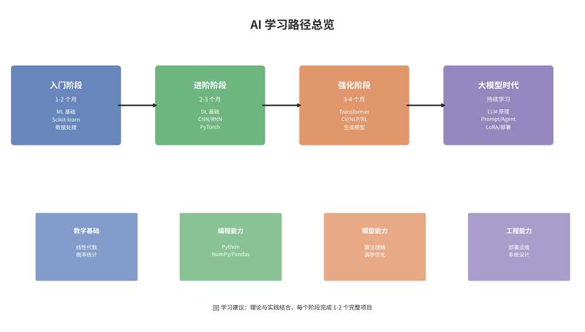
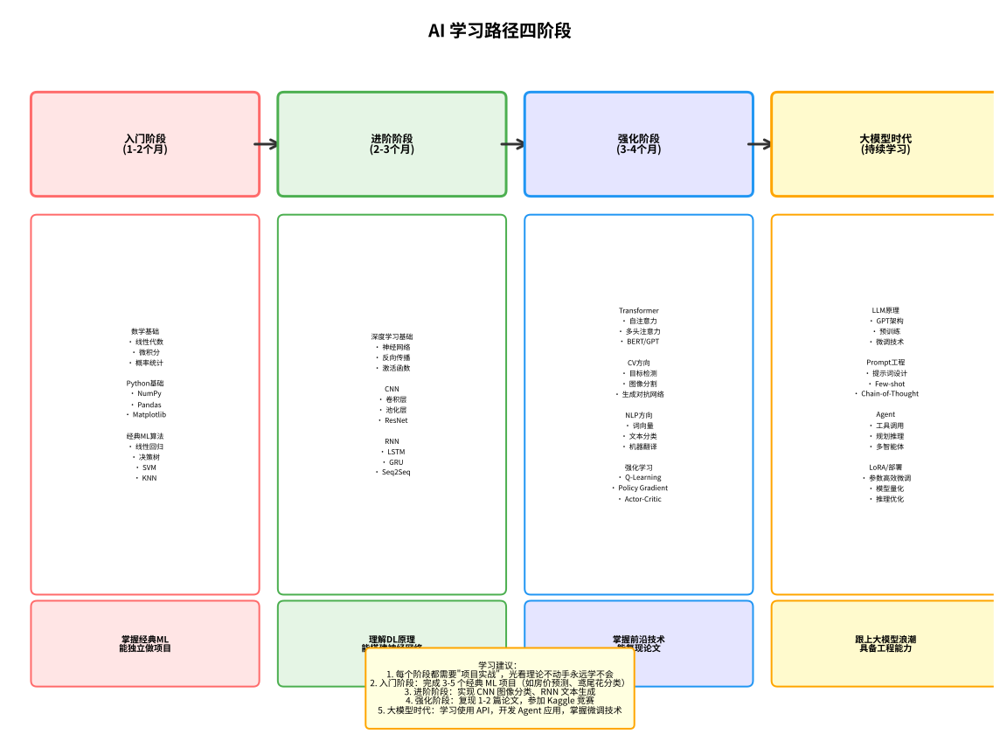

# AI 学习路径与资源推荐

> 本文档提供系统化的 AI 学习路径和丰富的资源推荐，帮助学习者从零基础逐步成长为 AI 领域的专业人才。

---

## 目录

- [一、学习路径总览](#一学习路径总览)
- [二、入门阶段（1-2 个月）](#二入门阶段1-2-个月)
- [三、进阶阶段（2-3 个月）](#三进阶阶段2-3-个月)
- [四、强化阶段（3-4 个月）](#四强化阶段3-4-个月)
- [五、大模型时代（持续学习）](#五大规模时代持续学习)
- [六、书籍推荐](#六书籍推荐)
- [七、在线课程推荐](#七在线课程推荐)
- [八、平台与工具](#八平台与工具)
- [九、深度学习框架对比](#九深度学习框架对比)
- [十、研究机构与实验室](#十研究机构与实验室)
- [十一、学术会议](#十一学术会议)
- [十二、数据集资源](#十二数据集资源)
- [返回上级文档](#返回上级文档)

---

## 一、学习路径总览

> 下图展示了 AI 学习的四个阶段及关键能力要求：





| 阶段 | 时间 | 核心内容 | 目标 |
|:---:|:---:|:---|:---|
| 入门阶段 | 1-2 个月 | ML 基础、Python 数据处理、Scikit-learn | 掌握经典机器学习算法，能独立完成基础项目 |
| 进阶阶段 | 2-3 个月 | DL 基础、CNN/RNN、PyTorch | 理解深度学习原理，能搭建常见神经网络 |
| 强化阶段 | 3-4 个月 | Transformer、CV、NLP、强化学习、生成模型 | 掌握前沿领域知识，能复现论文并改进 |
| 大模型时代 | 持续学习 | LLM 原理、Prompt Engineering、Agent、LoRA、部署 | 跟上大模型浪潮，具备工程落地能力 |

> 💡 **类比：AI 学习如同学医**
> 学习 AI 就像学医：入门阶段是"解剖学+生理学"（数学基础+经典算法），进阶阶段是"内科+外科"（CNN/RNN 等核心模型），强化阶段是"专科深造"（CV/NLP/RL 等方向），大模型时代则是"前沿医学研究"（LLM/Agent 等最新技术）。每个阶段都需要"临床实践"（项目实战），光看教科书不动手永远学不会。

---

## 二、入门阶段（1-2 个月）

> 💡 **类比：入门阶段如同"学驾照"**
> 入门阶段就像考驾照：先学科规（数学基础），再学操作（Python 编程），然后上路练习（经典 ML 算法）。目标是拿到"驾照"——能独立完成一个完整的机器学习项目，从数据处理到模型训练到评估。

### 学习目标

- 掌握 Python 数据处理与可视化基础
- 理解经典机器学习算法的原理与适用场景
- 能够使用 Scikit-learn 完成完整的 ML 项目流程
- 建立数学基础（线性代数、概率统计、微积分）

### 知识点列表

| 类别 | 知识点 | 说明 |
|:---|:---|:---|
| 数学基础 | 线性代数 | 矩阵运算、特征值分解、SVD 分解 |
| 数学基础 | 概率统计 | 贝叶斯定理、常见分布、最大似然估计 |
| 数学基础 | 微积分与优化 | 梯度、偏导数、凸优化基础 |
| Python | NumPy | 数组操作、向量化计算、广播机制 |
| Python | Pandas | DataFrame 操作、数据清洗、分组聚合 |
| Python | Matplotlib/Seaborn | 折线图、散点图、热力图、子图绘制 |
| 监督学习 | 线性回归 | 最小二乘法、正则化（Ridge/Lasso） |
| 监督学习 | 逻辑回归 | 分类基础、Softmax、交叉熵损失 |
| 监督学习 | 决策树与随机森林 | 信息增益、Gini 系数、Bagging |
| 监督学习 | SVM | 核技巧、软间隔、对偶问题 |
| 监督学习 | KNN | 距离度量、K 值选择 |
| 监督学习 | 朴素贝叶斯 | 条件概率、文本分类应用 |
| 集成学习 | Boosting | AdaBoost、GBDT、XGBoost、LightGBM |
| 无监督学习 | K-Means | 聚类原理、肘部法则、 silhouette 分数 |
| 无监督学习 | PCA | 降维、主成分解释方差 |
| 模型评估 | 交叉验证 | K-Fold、StratifiedKFold |
| 模型评估 | 评估指标 | 准确率/精确率/召回率/F1、ROC-AUC、混淆矩阵 |
| 模型评估 | 过拟合与欠拟合 | 偏差-方差权衡、正则化、早停 |

### 推荐资源

- **书籍**：《机器学习》（周志华）
- **书籍**：《Hands-On Machine Learning with Scikit-Learn, Keras, and TensorFlow》
- **课程**：吴恩达《Machine Learning Specialization》(Coursera)
- **项目**：Titanic 生存预测、房价预测、手写数字识别

### 入门阶段代码示例

以下是一个完整的机器学习项目示例，展示从数据加载到模型训练的全流程：

```python
# 入门阶段示例：使用 Scikit-learn 完成泰坦尼克号生存预测
import numpy as np
import pandas as pd
from sklearn.model_selection import train_test_split
from sklearn.preprocessing import StandardScaler
from sklearn.ensemble import RandomForestClassifier
from sklearn.metrics import accuracy_score, classification_report

# 1. 加载数据（示例数据）
data = {
    'Pclass': [1, 2, 3, 1, 3, 2, 3, 1, 2, 3],  # 船舱等级
    'Sex': ['female', 'male', 'female', 'male', 'female', 'male', 'male', 'female', 'male', 'female'],
    'Age': [22, 38, 26, 35, 28, 45, 19, 54, 31, 27],
    'SibSp': [0, 1, 0, 1, 0, 0, 0, 1, 0, 0],  # 兄弟姐妹/配偶数
    'Parch': [0, 0, 0, 0, 0, 0, 1, 0, 0, 0],  # 父母/子女数
    'Fare': [7.25, 71.28, 7.92, 53.10, 8.05, 8.45, 18.00, 51.86, 21.00, 7.22],
    'Survived': [0, 1, 1, 1, 0, 0, 0, 1, 1, 0]  # 是否生存（目标变量）
}
df = pd.DataFrame(data)

# 2. 数据预处理
# 将性别转换为数值（female=1, male=0）
df['Sex'] = df['Sex'].map({'female': 1, 'male': 0})

# 分离特征和标签
X = df[['Pclass', 'Sex', 'Age', 'SibSp', 'Parch', 'Fare']]
y = df['Survived']

# 3. 划分训练集和测试集
X_train, X_test, y_train, y_test = train_test_split(X, y, test_size=0.2, random_state=42)

# 4. 特征标准化
scaler = StandardScaler()
X_train_scaled = scaler.fit_transform(X_train)
X_test_scaled = scaler.transform(X_test)

# 5. 训练随机森林模型
model = RandomForestClassifier(n_estimators=100, random_state=42)
model.fit(X_train_scaled, y_train)

# 6. 预测和评估
y_pred = model.predict(X_test_scaled)
accuracy = accuracy_score(y_test, y_pred)

print(f"模型准确率: {accuracy:.2%}")
print("\n分类报告:")
print(classification_report(y_test, y_pred, target_names=['未生存', '生存']))

# 7. 特征重要性分析
feature_importance = pd.DataFrame({
    '特征': X.columns,
    '重要性': model.feature_importances_
}).sort_values('重要性', ascending=False)

print("\n特征重要性排序:")
print(feature_importance)
```

**💡 学习要点：**
- 数据预处理是机器学习的关键步骤（缺失值处理、特征编码、标准化）
- 训练集/测试集划分避免过拟合
- 特征标准化让不同量纲的特征可以公平比较
- 随机森林是入门阶段的"瑞士军刀"，适合多种表格数据任务

---

## 三、进阶阶段（2-3 个月）

> 💡 **类比：进阶阶段如同"从骑自行车到开汽车"**
> 入门阶段学的是"经典工具"（自行车），进阶阶段要学"现代工具"（汽车）。深度学习就是 AI 领域的"自动挡汽车"——你不需要手动换挡（手动特征工程），但需要理解发动机原理（反向传播）和变速箱（CNN/RNN）。掌握 PyTorch 就像学会开车，能上路（搭建模型）了。

### 学习目标

- 理解深度学习核心概念（反向传播、自动微分、梯度消失/爆炸）
- 掌握 CNN 和 RNN 的原理与实现
- 熟练使用 PyTorch 搭建、训练和评估模型
- 了解常见优化器与正则化技术

### 知识点列表

| 类别 | 知识点 | 说明 |
|:---|:---|:---|
| 神经网络基础 | 感知机与多层感知机 | 激活函数（ReLU/Sigmoid/Tanh）、全连接层 |
| 神经网络基础 | 反向传播 | 链式法则、计算图、自动求导 |
| 神经网络基础 | 损失函数 | MSE、Cross-Entropy、Hinge Loss |
| 神经网络基础 | 优化器 | SGD+Momentum、Adam、RMSProp、AdamW |
| 神经网络基础 | 正则化 | Dropout、Batch Normalization、Layer Normalization |
| CNN | 卷积层 | 卷积核、Padding、Stride、通道数 |
| CNN | 池化层 | 最大池化、平均池化、全局平均池化 |
| CNN | 经典架构 | LeNet、AlexNet、VGGNet、GoogLeNet、ResNet |
| RNN | 循环神经网络 | 序列建模、隐藏状态、BPTT |
| RNN | LSTM | 门控机制、遗忘门/输入门/输出门 |
| RNN | GRU | 更新门、重置门、参数量更少 |
| 序列模型 | 序列到序列 | Encoder-Decoder 架构、注意力机制雏形 |
| 序列模型 | 词嵌入 | Word2Vec、GloVe、FastText |
| PyTorch | Tensor 操作 | 张量创建、索引、切片、广播 |
| PyTorch | 自动求导 | `torch.autograd`、`backward()` |
| PyTorch | 模块构建 | `nn.Module`、`nn.Sequential`、自定义层 |
| PyTorch | 数据加载 | `Dataset`、`DataLoader`、数据增强 |
| PyTorch | 训练循环 | 前向传播、损失计算、反向传播、参数更新 |
| PyTorch | 模型保存与加载 | `state_dict`、Checkpoint、TorchScript |

### 推荐资源

- **书籍**：《动手学深度学习》（李沐）
- **书籍**：《Deep Learning》（Goodfellow 等，花书）
- **课程**：李飞飞《CS231n: Convolutional Neural Networks for Visual Recognition》
- **课程**：Stanford CS224n: NLP with Deep Learning
- **项目**：CIFAR-10 图像分类、猫狗识别、情感分析

---

## 四、强化阶段（3-4 个月）

> 💡 **类比：强化阶段如同"专科医生进修"**
> 如果说前两个阶段是"全科医生"培训，强化阶段就是选专科：CV（眼科）、NLP（神经内科）、RL（康复科）、生成模型（整形外科）。每个专科都有自己的"看家本领"（Transformer、YOLO、BERT 等），你需要深入理解并能独立"做手术"（读论文、复现模型）。

### 学习目标

- 深入理解 Transformer 架构及其变体
- 掌握计算机视觉和自然语言处理的主流方法
- 了解强化学习基础与经典算法
- 熟悉生成模型（GAN、VAE、扩散模型）
- 具备阅读和复现顶会论文的能力

### 知识点列表

#### Transformer 系列

| 知识点 | 说明 |
|:---|:---|
| Attention 机制 | Scaled Dot-Product Attention、Multi-Head Attention |
| Transformer 架构 | Encoder-Decoder、Positional Encoding、Layer Norm |
| BERT | 掩码语言模型、Next Sentence Prediction、预训练+微调范式 |
| GPT 系列 | 自回归语言模型、Zero/Few-shot Learning |
| ViT (Vision Transformer) | 图像分块、Patch Embedding、分类头 |
| Swin Transformer | 层级式特征、移动窗口注意力 |
| T5 / BART | Encoder-Decoder 统一框架、文本到文本 |

#### 计算机视觉 (CV)

| 知识点 | 说明 |
|:---|:---|
| 目标检测 | R-CNN 系列、YOLO 系列、SSD |
| 语义分割 | FCN、U-Net、DeepLab 系列 |
| 实例分割 | Mask R-CNN |
| 目标跟踪 | SORT、DeepSORT、Siamese 网络 |
| 图像生成 | GAN（DCGAN/Pix2Pix/StyleGAN）、Diffusion 模型 |
| 人脸识别 | FaceNet、ArcFace、MTCNN |
| 3D 视觉 | 点云处理、NeRF、3D 重建 |

#### 自然语言处理 (NLP)

| 知识点 | 说明 |
|:---|:---|
| 序列标注 | NER、POS Tagging、CRF 层 |
| 文本分类 | TextCNN、FastText、层次分类 |
| 文本匹配 | Siamese Network、ESIM、Sentence-BERT |
| 信息抽取 | 关系抽取、事件抽取、远程监督 |
| 文本生成 | 自回归生成、Beam Search、Top-k/Top-p Sampling |
| 机器翻译 | 神经机器翻译、BLEU 评分 |
| 对话系统 | 检索式/生成式对话、状态追踪、策略学习 |

#### 强化学习 (RL)

| 知识点 | 说明 |
|:---|:---|
| 基础概念 | 状态/动作/奖励、策略/价值函数、MDP |
| 经典算法 | Q-Learning、DQN、Policy Gradient、A2C/A3C |
| 进阶算法 | PPO、SAC、TD3 |
| 多智能体 | MADDPG、QMIX、MAPPO |
| 应用 | 游戏 AI（AlphaGo/AlphaZero）、机器人控制、自动驾驶 |

#### 生成模型

| 知识点 | 说明 |
|:---|:---|
| GAN | 对抗训练、模式坍塌、WGAN、StyleGAN |
| VAE | 变分推断、重参数化技巧、β-VAE |
| 扩散模型 | 前向扩散、反向去噪、DDPM、DDIM |
| Flow-based 模型 | Normalizing Flow、可逆变换 |

### 推荐资源

- **书籍**：《动手学深度学习》（第二版，PyTorch 版）
- **课程**：Stanford CS231n、CS224n、CS285 (Deep Reinforcement Learning)
- **课程**：Hugging Face NLP Course
- **项目**：复现 ViT/BERT 论文、训练一个简单的对话机器人、用 StyleGAN 生成图像

---

## 五、大模型时代（持续学习）

> 💡 **类比：大模型时代如同"从造零件到造火箭"**
> 前面的阶段学的是"造零件"（单个模型、单个算法），大模型时代是"造火箭"——把海量知识压缩到一个巨型模型中。你需要学会的不是从零造模型，而是"驾驭"模型：Prompt Engineering 是"给火箭下指令"，LoRA 微调是"改装火箭"，Agent 开发是"让火箭自主飞行"。

### 学习目标

- 理解大语言模型的核心原理与训练范式
- 掌握 Prompt Engineering 和 In-Context Learning
- 能够开发基于 LLM 的 Agent 应用
- 熟悉 LoRA 等参数高效微调方法
- 具备模型部署与服务化能力

### 知识点列表

#### LLM 原理

| 知识点 | 说明 |
|:---|:---|
| 语言模型基础 | 自回归语言模型、因果掩码、困惑度（Perplexity） |
| Scaling Law | 模型规模/数据量/计算量的幂律关系、涌现能力 |
| 训练流程 | 预训练 → 指令微调 (SFT) → 偏好对齐 (RLHF/DPO) |
| 数据构建 | 数据清洗、去重、质量过滤、配比策略 |
| RLHF | 奖励模型训练、PPO 微调、KL 散度约束 |
| DPO | 直接偏好优化、无需独立奖励模型 |
| 上下文长度 | 长上下文技术、RoPE 扩展、位置编码插值 |
| 推理加速 | KV Cache、Flash Attention、Speculative Decoding、量化 |

#### Prompt Engineering

| 知识点 | 说明 |
|:---|:---|
| 提示词设计 | Few-shot、Chain-of-Thought (CoT)、Tree-of-Thought |
| 角色提示 | System Prompt 设计、角色设定、约束条件 |
| 结构化输出 | JSON Mode、Schema 约束、正则引导 |
| 高级技巧 | 思维链、自我一致性、ReAct、主动提示 |

#### Agent 开发

| 知识点 | 说明 |
|:---|:---|
| Agent 框架 | LangChain、AutoGen、CrewAI、Semantic Kernel |
| 工具调用 | Function Calling、Tool 注册、API 集成 |
| 记忆系统 | 短期记忆、长期记忆（向量数据库）、持久化 |
| 规划能力 | 任务分解、子目标、反思与重试机制 |
| 多 Agent 协作 | 角色分配、通信协议、任务仲裁 |
| RAG (检索增强生成) | 文档切分、向量嵌入、检索重排序、生成融合 |

#### LoRA 微调

| 知识点 | 说明 |
|:---|:---|
| 参数高效微调 | LoRA、Adapter、Prefix Tuning、Prompt Tuning |
| LoRA 原理 | 低秩分解、秩的选择、合并权重 |
| QLoRA | 4-bit 量化 + LoRA，单卡微调大模型 |
| 微调实践 | 数据集准备、超参数调优、评估与部署 |
| 多任务微调 | 多任务学习、灾难性遗忘缓解 |

#### 模型部署

| 知识点 | 说明 |
|:---|:---|
| 模型量化 | INT8/INT4 量化、GPTQ、AWQ、GGUF |
| 推理引擎 | vLLM、TensorRT-LLM、llama.cpp、Ollama |
| 服务化 | FastAPI + Pydantic、gRPC、Docker 容器化 |
| 部署架构 | 负载均衡、GPU 显存管理、请求批处理 |
| 缓存策略 | KV Cache 优化、Prefix Caching |
| 监控与运维 | 延迟监控、吞吐量统计、模型版本管理 |

### 推荐资源

- **课程**：吴恩达《Generative AI with LLMs》(Coursera/DeepLearning.AI)
- **课程**：Hugging Face NLP Course (Advanced)
- **项目**：用 LangChain 搭建 RAG 问答系统、用 LoRA 微调一个领域模型、开发多 Agent 协作工具
- **框架**：LangChain、LlamaIndex、vLLM、Hugging Face Transformers

---

## 六、书籍推荐

> 💡 **类比：选书如同"配药方"**
>
> 学习 AI 就像看病抓药——不同症状需要不同的药方：
> - **理论派（西瓜书、花书）**：如同"内科教科书"，适合想深入理解病理机制的人，公式推导严谨，但需要数学基础
> - **实战派（Hands-On ML、D2L）**：如同"临床手册"，代码丰富、项目驱动，适合想快速上手的人
> - **入门派（斋藤康毅）**：如同"科普读物"，从零开始、不依赖框架，适合初学者建立直觉
> - **专科派（NLP 综论）**：如同"专科教材"，针对特定方向（如 NLP）的深度学习
>
> 选书的关键是**匹配你的学习阶段和目标**——初学者别啃花书，实战派别死磕公式。

| 序号 | 书名 | 作者 | 简介 | 适合人群 | 难度 |
|:---:|:---|:---|:---|:---|:---:|
| 1 | 《机器学习》（西瓜书） | 周志华 | 经典 ML 教材，理论严谨、公式推导清晰，涵盖大部分经典算法 | 入门阶段、本科生/研究生 | ⭐⭐ |
| 2 | 《统计学习方法》 | 李航 | 侧重于统计角度的 ML 算法讲解，公式推导完整，适合夯实理论基础 | 入门进阶、算法岗面试 | ⭐⭐⭐ |
| 3 | 《Hands-On Machine Learning with Scikit-Learn, Keras, and TensorFlow》 | Aurélien Géron | 实战导向，代码丰富，从 ML 到 DL 均有覆盖，项目驱动学习 | 入门阶段、实战学习者 | ⭐⭐ |
| 4 | 《动手学深度学习》（D2L） | 李沐等 | 代码 + 理论结合，支持 PyTorch/TF/JAX 多框架，在线免费阅读 | 进阶阶段、DL 初学者 | ⭐⭐⭐ |
| 5 | 《Deep Learning》（花书） | Goodfellow, Bengio, Courville | 深度学习圣经，理论深度极深，数学推导严谨 | 进阶阶段、研究者 | ⭐⭐⭐⭐ |
| 6 | 《深度学习入门：基于 Python 的理论与实现》 | 斋藤康毅 | 从零实现神经网络，不依赖框架，帮助理解底层原理 | 入门进阶、想深入理解原理者 | ⭐⭐ |
| 7 | 《自然语言处理综论》 | Jurafsky & Martin | NLP 领域经典教材，覆盖面广，从传统方法到深度学习 | 进阶阶段、NLP 方向学习者 | ⭐⭐⭐ |
| 8 | 《Speech and Language Processing》 | Jurafsky & Martin | 在线免费更新，紧跟前沿，包含 Transformer 和 LLM 内容 | 进阶阶段、NLP 研究者 | ⭐⭐⭐ |

---

## 七、在线课程推荐

> 💡 **类比：选课如同"选教练"**
>
> 学习 AI 就像学开车——不同的教练有不同的教学风格：
> - **吴恩达（Andrew Ng）**：如同"耐心细致的驾校教练"，讲解清晰、循序渐进，适合零基础入门
> - **李飞飞（CS231n）**：如同"赛车手教练"，CV 方向标杆，作业质量极高，适合想深入计算机视觉的人
> - **Chris Manning（CS224n）**：如同"语言学教授教开车"，NLP 方向经典，理论实践结合，适合自然语言处理方向
> - **李沐（D2L）**：如同"双语教练"，中英结合、代码驱动，适合国内学习者
> - **Fast.ai**：如同"实战派教练"，自顶向下、先上路再学交规，适合有编程基础想快速上手的人
>
> 选课的关键是**匹配你的学习风格和目标方向**——喜欢理论选吴恩达，喜欢实战选 Fast.ai，想专攻 CV 选李飞飞，想专攻 NLP 选 Manning。

| 序号 | 课程名称 | 授课机构/讲师 | 平台 | 内容简介 | 难度 | 推荐指数 |
|:---:|:---|:---|:---:|:---|:---:|:---:|
| 1 | Machine Learning Specialization | Andrew Ng | Coursera | ML 入门首选，讲解清晰，适合零基础 | ⭐⭐ | ⭐⭐⭐⭐⭐ |
| 2 | Deep Learning Specialization | Andrew Ng | Coursera | 深度学习系统课程，涵盖 CNN/RNN/Transformer | ⭐⭐⭐ | ⭐⭐⭐⭐⭐ |
| 3 | CS231n: CNNs for Visual Recognition | Stanford / 李飞飞 | YouTube / 官网 | CV 方向经典课程，作业质量极高 | ⭐⭐⭐⭐ | ⭐⭐⭐⭐⭐ |
| 4 | CS224n: NLP with Deep Learning | Stanford / Chris Manning | YouTube / 官网 | NLP 方向标杆课程，涵盖 Transformer/BERT | ⭐⭐⭐⭐ | ⭐⭐⭐⭐⭐ |
| 5 | CS285: Deep Reinforcement Learning | UC Berkeley / Sergey Levine | YouTube / 官网 | RL 方向最系统的课程之一 | ⭐⭐⭐⭐⭐ | ⭐⭐⭐⭐ |
| 6 | 动手学深度学习 | 李沐 | B站 / D2L 官网 | 中英双语，代码驱动，理论实践结合 | ⭐⭐⭐ | ⭐⭐⭐⭐⭐ |
| 7 | Full Stack Deep Learning | UC Berkeley | fullstackdeeplearning.com | 覆盖 ML 工程全流程：部署、MLOps、数据管理 | ⭐⭐⭐ | ⭐⭐⭐⭐ |
| 8 | Hugging Face NLP Course | Hugging Face | huggingface.co/learn | 实战 NLP，从基础到 Transformer 微调 | ⭐⭐ | ⭐⭐⭐⭐⭐ |
| 9 | Generative AI with LLMs | DeepLearning.AI / AWS | Coursera | LLM 全流程：预训练、微调、RLHF、部署 | ⭐⭐⭐ | ⭐⭐⭐⭐⭐ |
| 10 | Fast.ai Practical Deep Learning | fast.ai | fast.ai | 自顶向下教学法，从实战入手，适合有编程基础者 | ⭐⭐ | ⭐⭐⭐⭐ |

---

## 八、平台与工具

> 💡 **类比：平台与工具如同"厨房设备"**
>
> 学习 AI 就像学烹饪，你需要合适的厨房设备：
> - **开发与实验平台（Colab、Kaggle）**：如同"共享厨房"——你不用自己买昂贵的设备（GPU），租一个就能开火
> - **深度学习框架（PyTorch、TensorFlow）**：如同"烹饪工具套装"——PyTorch 像中式炒锅，灵活顺手，学术界最爱；TensorFlow 像西式烤箱，功能全面，工业界常用；JAX 像分子料理设备，高级但学习曲线陡
> - **预训练模型库（Hugging Face Transformers）**：如同"预制菜半成品"——不用从零开始做，拿来微调就能用
> - **实验跟踪工具（WandB、MLflow）**：如同"烹饪笔记本"——记录每次实验的配方和结果，方便复现和改进
>
> 新手常犯的错误是"收集工具却不下厨"——装了一堆框架但从不动手。**选一套顺手的工具，立刻开始做第一个项目**，在实践中学习最快。

### 开发与实验平台

| 名称 | 类型 | 说明 | 链接 |
|:---|:---:|:---|:---|
| Google Colab | 云 Notebook | 免费 GPU 环境，适合快速实验 | [colab.research.google.com](https://colab.research.google.com) |
| Kaggle | 竞赛与社区 | 数据集、GPU Notebook、Kaggle 竞赛 | [kaggle.com](https://www.kaggle.com) |
| Hugging Face Spaces | 模型托管与演示 | 部署 Demo、Gradio/Streamlit 应用 | [huggingface.co/spaces](https://huggingface.co/spaces) |
| Papers with Code | 论文与代码 | 论文结果、代码实现、排行榜 | [paperswithcode.com](https://paperswithcode.com) |
| GitHub Codespaces | 云端开发环境 | 基于 VS Code 的云端开发 | [github.com/features/codespaces](https://github.com/features/codespaces) |
| Amazon SageMaker | 全托管 ML 平台 | 数据标注、训练、部署一站式 | [aws.amazon.com/sagemaker](https://aws.amazon.com/sagemaker) |
| Google Vertex AI | 全托管 ML 平台 | AutoML、自定义训练、模型部署 | [cloud.google.com/vertex-ai](https://cloud.google.com/vertex-ai) |
| Microsoft Azure AI | 云 AI 服务 | 认知服务、ML 工作流 | [azure.microsoft.com](https://azure.microsoft.com) |

### 框架与库

| 名称 | 类型 | 说明 |
|:---|:---:|:---|
| PyTorch | 深度学习框架 | 学术界主流，灵活易用，动态计算图 |
| TensorFlow / Keras | 深度学习框架 | 工业界广泛使用，部署生态成熟 |
| JAX | 深度学习框架 | Google 出品，函数式编程，XLA 编译加速 |
| Scikit-learn | ML 库 | 经典 ML 算法覆盖全面，API 统一 |
| XGBoost / LightGBM / CatBoost | 梯度提升框架 | 表格数据竞赛利器，性能优异 |
| Transformers (Hugging Face) | 预训练模型库 | 一站式加载数千个预训练模型 |
| Diffusers | 扩散模型库 | 图像生成、视频生成工具 |
| LangChain / LlamaIndex | LLM 应用框架 | RAG、Agent、Chain 编排 |
| vLLM | LLM 推理引擎 | 高性能推理，支持 PagedAttention |
| TensorRT-LLM | 推理优化引擎 | NVIDIA 出品，极致推理性能 |
| ONNX Runtime | 跨平台推理引擎 | 模型格式标准化，多硬件支持 |
| DVC (Data Version Control) | 数据版本管理 | 类似 Git 的数据和模型版本管理 |
| MLflow | ML 生命周期管理 | 实验跟踪、模型注册、部署管理 |
| Weights & Biases (WandB) | 实验跟踪 | 可视化训练过程，团队协作 |
| Gradio / Streamlit | 演示应用 | 快速搭建 ML 应用 Demo 界面 |

### 学习与社区平台

| 名称 | 类型 | 说明 |
|:---|:---:|:---|
| GitHub | 代码托管 | 阅读源码、参与开源项目 |
| arXiv | 论文预印本 | 最新学术论文、每日更新 |
| Distill.pub | 可视化解释 | 交互式图解 ML 概念 |
| Reddit (r/MachineLearning) | 社区 | 讨论前沿进展、分享资源 |
| 知乎 | 中文社区 | 技术文章、经验分享、面试经验 |
| 机器之心 | 中文媒体 | AI 行业新闻、技术解读 |
| 量子位 | 中文媒体 | AI 前沿资讯、产业动态 |

---

## 九、深度学习框架对比

> 💡 **类比：深度学习框架如同"汽车品牌"**
>
> 选择深度学习框架就像选择汽车品牌的不同车型：
> - **PyTorch**：如同**特斯拉**——科技感强、操控灵活、加速快（动态计算图），深受年轻人喜爱（学术界主流），但早期续航一般（部署生态较弱）
> - **TensorFlow**：如同**丰田**——皮实耐用、保值率高（部署生态成熟）、适合家用（工业界广泛），但驾驶体验一般（API 复杂），早期车型有缺陷（TF1 静态图难用）
> - **JAX**：如同**保时捷**——性能极致、操控精准（函数式编程、JIT 编译），但学习门槛高（需要函数式思维），售后网点少（部署生态弱）
>
> 选车要看用途：日常代步选丰田（TensorFlow 部署），追求驾驶乐趣选特斯拉（PyTorch 研究），赛道竞技选保时捷（JAX 高性能计算）。

### PyTorch vs TensorFlow vs JAX

| 对比维度 | PyTorch | TensorFlow | JAX |
|:---|:---:|:---:|:---:|
| **开发方** | Meta (Facebook) | Google | Google Research |
| **首次发布** | 2016 | 2015 | 2018 |
| **计算图** | 动态（Eager 模式） | 静态图（TF2 支持 Eager） | JIT 编译（`@jit`） |
| **API 风格** | Pythonic、直观 | 较复杂，版本间变化大 | 函数式、无状态 |
| **调试体验** | 优秀（原生 Python 调试器） | 一般（需 `tf.debugging`） | 一般（编译后较难调试） |
| **分布式训练** | `torch.distributed` / FSDP / DDP | `tf.distribute.Strategy` | `pmap` / `pjit` / FSDP |
| **自动微分** | `torch.autograd` | `tf.GradientTape` | `grad()` / `value_and_grad()` |
| **部署生态** | TorchServe / TorchScript / ONNX | TF Serving / TF Lite / TF.js | 较弱（主要通过 XLA） |
| **移动端支持** | PyTorch Mobile | TensorFlow Lite | 无原生支持 |
| **量化支持** | 较好（FX Graph Mode Quantization） | 优秀（TFLite 量化工具链） | 有限 |
| **学术界采用率** | **极高**（~80% 论文使用） | 较低 | 增长中（尤其 DeepMind 研究） |
| **工业界采用率** | 快速增长 | 广泛（传统企业） | 有限 |
| **社区生态** | 丰富（Hugging Face 首选） | 成熟 | 快速增长 |
| **学习曲线** | 低 | 中 | 中高 |
| **MAC 支持** | MPS 后端（M1/M2/M3） | Metal 后端 | 有限 |

### 选型建议

- **学术研究 / 快速原型** → **PyTorch**（首选，社区资源最丰富）
- **生产部署 / 移动端 / 嵌入式** → **TensorFlow**（部署工具链最成熟）
- **高性能计算 / 大规模分布式** → **JAX**（函数式编程，XLA 编译优化）
- **初学者入门** → **PyTorch**（API 直观，调试方便）

---

## 十、研究机构与实验室

> 💡 **类比：研究机构如同"武林门派"**
>
> AI 研究机构就像武侠小说中的各大门派，各有绝学：
> - **OpenAI**：如同"少林派"——名门正派，底蕴深厚，GPT 系列威震江湖，但近年逐渐商业化
> - **Google DeepMind**：如同"武当派"——内功深厚，AlphaGo、AlphaFold 等绝学频出，追求"道"的突破
> - **Meta FAIR**：如同"峨眉派"——开源精神强，LLaMA 系列惠及江湖，Yann LeCun 是掌门人
> - **Anthropic**：如同"逍遥派"——专注 AI 安全，Claude 系列讲究" Constitutional AI"心法
> - **高校实验室（Stanford、MIT、Berkeley）**：如同"名门正宗"——培养人才，基础研究扎实，李飞飞、Chris Manning 等宗师坐镇
>
> 选择研究机构如同选择师门：要看掌门人的研究方向、门派的武学理念（开源 vs 闭源）、以及是否适合自己的发展路径。

### 国际研究机构

| 名称 | 所属机构 | 代表人物 | 主要方向 |
|:---|:---|:---|:---|
| FAIR (Facebook AI Research) | Meta | Yann LeCun, Yann LeCun | CV、NLP、强化学习、自监督学习 |
| Google DeepMind | Google (Alphabet) | Demis Hassabis, 汪滔 | 强化学习、AlphaFold、多模态、LLM |
| Google Research (Brain Team) | Google | Jeff Dean, 吴军 | Transformer、JAX、大规模分布式训练 |
| OpenAI | OpenAI | Sam Altman, Ilya Sutskever | GPT 系列、DALL·E、Whisper、RLHF |
| Microsoft Research | Microsoft | 沈向洋, 刘铁岩 | NLP、多模态、AI for Science |
| Anthropic | Anthropic | Dario Amodei | 安全 AI、Claude 系列模型 |
| Tesla AI | Tesla | Andrej Karpathy | 自动驾驶、Optimus 机器人 |
| Apple AI/ML | Apple | 团队 | 端侧 AI、Siri、计算机视觉 |
| Allen Institute for AI (AI2) | 非营利 | Oren Etzioni | 常识推理、视觉问答、OpenScholar |
| MIT CSAIL | MIT | 多位教授 | 多方向基础研究，AI 与各学科交叉 |
| Stanford AI Lab (SAIL) | Stanford | 李飞飞, Chris Manning | CV、NLP、机器人、医疗 AI |
| UC Berkeley BAIR | UC Berkeley | Jitendra Malik, Sergey Levine | 计算机视觉、强化学习、机器人 |
| MILA (Montreal) | 蒙特利尔大学 | Yoshua Bengio | 深度学习基础、生成模型、因果学习 |
| Vector Institute | 多伦多大学 | Geoffrey Hinton, Richard Zemel | 深度学习、表示学习、医疗 AI |
| Max Planck Institute for Intelligent Systems | 德国马普所 | Bernhard Schölkopf | 因果推理、机器人学习 |

### 国内研究机构

| 名称 | 所属机构 | 主要方向 |
|:---|:---|:---|
| 北京智源人工智能研究院 (BAAI) | 北京 | 悟道系列大模型、FlagAI 框架 |
| 上海人工智能实验室 (SAIL) | 上海 | OpenMMLab、书生系列大模型 |
| 华为诺亚方舟实验室 (Noah's Ark Lab) | 华为 | 盘古大模型、CANN 计算框架、AutoML |
| 百度研究院 | 百度 | 文心大模型、ERNIE 系列、自动驾驶 |
| 阿里巴巴达摩院 | 阿里巴巴 | 通义大模型系列、CV、NLP、语音 |
| 腾讯 AI Lab | 腾讯 | 混元大模型、游戏 AI、医疗 AI |
| 字节跳动 AI Lab | 字节跳动 | 推荐系统、豆包大模型、多模态 |
| 清华大学智能技术与系统实验室 | 清华大学 | NLP、信息检索、知识图谱 |
| 北京大学计算语言学研究所 | 北京大学 | 自然语言处理、中文信息处理 |
| 中科院自动化研究所 | 中国科学院 | 模式识别、计算机视觉、智能控制 |

---

## 十一、学术会议

> 💡 **类比：学术会议如同"武林大会"**
>
> AI 学术会议就像武侠小说中的"华山论剑"或"武林大会"：
> - **顶会（NeurIPS、ICML、ICLR）**：如同"华山论剑"——五年一届，各路高手云集，论文接受率仅 25%，能入选的都是"武林高手"
> - **专业顶会（CVPR、ACL）**：如同"门派比武"——CVPR 是计算机视觉界的"华山论剑"，ACL 是自然语言处理界的"武林大会"，各门派展示绝学
> - **A 类会议（AAAI、IJCAI）**：如同"江湖英雄会"——规模更大，接受率稍高，是新人崭露头角的好机会
> - **Workshop**：如同"门派内部切磋"——规模小，氛围轻松，适合新人练手、交流想法
>
> 投稿如同"闯江湖"：先从小会议（Workshop）练手，积累经验后再冲击顶会。被拒稿如同"比武落败"——不要气馁，分析评委意见（"武功破绽"），改进后再战。

### 主要 AI 学术会议

| 会议名称 | 全称 | 领域 | 等级 | 举办时间 | 论文接受率（近年） |
|:---|:---|:---|:---:|:---:|:---:|
| **NeurIPS** | Conference on Neural Information Processing Systems | 全领域 | A+ / 顶会 | 12 月 | ~25% |
| **ICML** | International Conference on Machine Learning | 机器学习 | A+ / 顶会 | 7 月 | ~27% |
| **ICLR** | International Conference on Learning Representations | 深度学习 | A+ / 顶会 | 5 月 | ~28% |
| **AAAI** | AAAI Conference on Artificial Intelligence | 人工智能 | A / 顶会 | 2 月 | ~22% |
| **IJCAI** | International Joint Conference on Artificial Intelligence | 人工智能 | A / 顶会 | 8 月 | ~25% |
| **CVPR** | Conference on Computer Vision and Pattern Recognition | 计算机视觉 | A+ / 顶会 | 6 月 | ~25% |
| **ICCV** | International Conference on Computer Vision | 计算机视觉 | A+ / 顶会 | 10 月（奇数年） | ~25% |
| **ECCV** | European Conference on Computer Vision | 计算机视觉 | A / 顶会 | 9 月（偶数年） | ~27% |
| **ACL** | Annual Meeting of the Association for Computational Linguistics | 自然语言处理 | A+ / 顶会 | 7 月 | ~25% |
| **EMNLP** | Conference on Empirical Methods in Natural Language Processing | 自然语言处理 | A+ / 顶会 | 11 月 | ~25% |
| **NAACL** | North American Chapter of the ACL | 自然语言处理 | A / 顶会 | 6 月 | ~25% |
| **CoRL** | Conference on Robot Learning | 机器人学习 | A / 顶会 | 11 月 | ~30% |
| **RSS** | Robotics: Science and Systems | 机器人 | A / 顶会 | 7 月 | ~30% |
| **ICRA** | International Conference on Robotics and Automation | 机器人 | A / 顶会 | 5 月 | ~40% |
| **KDD** | Conference on Knowledge Discovery and Data Mining | 数据挖掘 | A+ / 顶会 | 8 月 | ~22% |
| **WWW** | The Web Conference | 网络与信息检索 | A+ / 顶会 | 4 月 | ~20% |
| **SIGIR** | International Conference on Research and Development in Information Retrieval | 信息检索 | A+ / 顶会 | 7 月 | ~25% |
| **WACV** | Winter Conference on Applications of Computer Vision | 计算机视觉应用 | A / 会 | 1 月 | ~30% |

### 会议投稿建议

- **入门**：先从 Workshop 或 Co-located events 开始投稿
- **进阶**：尝试投 WACV、AAAI、IJCAI 等
- **目标**：冲 NeurIPS、ICML、ICLR、CVPR、ACL 等顶会

### 其他重要学术资源

| 资源名称 | 说明 | 链接 |
|:---|:---|:---|
| arXiv | 论文预印本平台，每日更新 | [arxiv.org](https://arxiv.org) |
| Google Scholar | 学术搜索引擎，查作者/论文引用 | [scholar.google.com](https://scholar.google.com) |
| Semantic Scholar | AI 驱动的学术搜索引擎 | [semanticscholar.org](https://www.semanticscholar.org) |
| DBLP | 计算机科学文献数据库 | [dblp.org](https://dblp.org) |
| OpenReview | ICLR 等会议审稿平台，公开审稿过程 | [openreview.net](https://openreview.net) |
| Connectionists | ML 邮件列表，学术讨论 | [mailman.srv.cs.cmu.edu](https://mailman.srv.cs.cmu.edu) |

---

## 十二、数据集资源

> 💡 **类比：数据集如同"食材市场"**
>
> 训练 AI 模型就像做菜，数据集就是食材：
> - **MNIST（手写数字）**：如同**土豆**——最基础的食材，新手练刀工用，简单但重要
> - **ImageNet（1400万张图像）**：如同**海鲜市场**——品类丰富（1000类），规模庞大，是计算机视觉的"满汉全席"
> - **COCO（33万张图像）**：如同**预制菜套餐**——不仅给你食材，还告诉你怎么切（标注了目标、分割、关键点）
> - **Common Crawl（网页语料）**：如同**农贸市场**——什么都有一点，需要自己挑挑拣拣（清洗数据）
> - **LAION-5B（50亿图文对）**：如同**全球食材供应链**——规模惊人，但质量参差不齐，需要精细筛选
>
> 选数据集要看"菜品"需求：入门练手选 MNIST（简单），研究突破选 ImageNet（经典），工业应用选领域专属数据集（精准）。记住：**Garbage in, garbage out**——用烂食材做不出好菜，用脏数据训不出好模型。

### 通用 ML 数据集

| 数据集名称 | 领域 | 规模 | 说明 | 链接 |
|:---|:---|:---:|:---|:---|
| MNIST | 图像 | 70K 张 | 手写数字识别，入门级 | [yann.lecun.com/exdb/mnist](http://yann.lecun.com/exdb/mnist) |
| CIFAR-10/100 | 图像 | 60K 张 | 32x32 彩色图像分类 | [cs.toronto.edu/~kriz/cifar.html](https://www.cs.toronto.edu/~kriz/cifar.html) |
| ImageNet | 图像 | 14M+ 张 | 1000 类图像分类，CV 基准 | [image-net.org](https://www.image-net.org) |
| Fashion-MNIST | 图像 | 70K 张 | 服装分类，MNIST 替代品 | [github.com/zalandoresearch/fashion-mnist](https://github.com/zalandoresearch/fashion-mnist) |
| COCO | 图像 | 330K 张 | 目标检测、分割、关键点 | [cocodataset.org](https://cocodataset.org) |
| Iris | 表格 | 150 条 | 经典入门分类数据集 | [archive.ics.uci.edu](https://archive.ics.uci.edu) |

### NLP 数据集

| 数据集名称 | 任务 | 规模 | 说明 | 链接 |
|:---|:---|:---:|:---|:---|
| GLUE / SuperGLUE | 多任务 | 多个子集 | NLP 模型综合基准 | [gluebenchmark.com](https://gluebenchmark.com) |
| SQuAD 2.0 | 阅读理解 | 150K+ 问答对 | 机器阅读理解基准 | [rajpurkar.github.io/SQuAD-explorer](https://rajpurkar.github.io/SQuAD-explorer) |
| IMDb Reviews | 情感分析 | 50K 条 | 电影评论情感分类 | [ai.stanford.edu/~amaas/data/sentiment](https://ai.stanford.edu/~amaas/data/sentiment) |
| AG News | 文本分类 | 120K 条 | 新闻主题分类 | [huggingface.co/datasets/ag_news](https://huggingface.co/datasets/ag_news) |
| WMT 翻译 | 机器翻译 | 百万级 | 多语言翻译对 | [statmt.org/wmt](https://statmt.org/wmt) |
| WikiText | 语言建模 | 百万 tokens | 词级语言模型基准 | [blog.salesforceairesearch.com](https://blog.salesforceairesearch.com) |
| BookCorpus | 语言建模 | 7K 本书 | 预训练常用语料 | [huggingface.co/datasets/bookcorpus](https://huggingface.co/datasets/bookcorpus) |
| C4 (Colossal Clean Crawled Corpus) | 预训练 | 800GB | Google 清洗的网页语料 | [huggingface.co/datasets/c4](https://huggingface.co/datasets/c4) |
| The Pile | 预训练混合语料 | 800GB | EleutherAI 开源语料 | [pile.eleuther.ai](https://pile.eleuther.ai) |

### 语音与多模态数据集

| 数据集名称 | 领域 | 规模 | 说明 | 链接 |
|:---|:---|:---:|:---|:---|
| Common Voice | 语音 | 20K+ 小时 | Mozilla 众包语音数据 | [commonvoice.mozilla.org](https://commonvoice.mozilla.org) |
| LibriSpeech | 语音 | 1000 小时 | 英文有声书语音 | [openslr.org/12](https://openslr.org/12) |
| LRS3 (Lip Reading) | 多模态 | 超 400 小时 | 唇语识别数据集 | [www.robots.ox.ac.uk~vgg](https://www.robots.ox.ac.uk/~vgg) |
| LAION-5B | 多模态 | 5B 图文对 | 大规模图文数据 | [laion.ai](https://laion.ai) |
| MS COCO Captions | 多模态 | 330K 图片 | 图像描述生成 | [cocodataset.org](https://cocodataset.org) |

### 数据集检索平台

| 平台名称 | 说明 | 链接 |
|:---|:---|:---|
| Kaggle Datasets | 竞赛数据集、社区数据集 | [kaggle.com/datasets](https://www.kaggle.com/datasets) |
| Hugging Face Datasets | 一站式数据集加载，数千个开源数据集 | [huggingface.co/datasets](https://huggingface.co/datasets) |
| UC Irvine ML Repository | 经典 UCI 数据集仓库 | [archive.ics.uci.edu](https://archive.ics.uci.edu) |
| Papers with Code Datasets | 论文附带数据集 | [paperswithcode.com/datasets](https://paperswithcode.com/datasets) |
| Google Dataset Search | 数据集搜索引擎 | [datasetsearch.research.google.com](https://datasetsearch.research.google.com) |
| VisualData | CV 数据集搜索 | [visualdata.io](https://www.visualdata.io) |

---

## 返回上级文档

[← 返回 AI 算法体系索引](./11_人工智能.md)

---

*本文档持续更新中，欢迎贡献和纠错。*