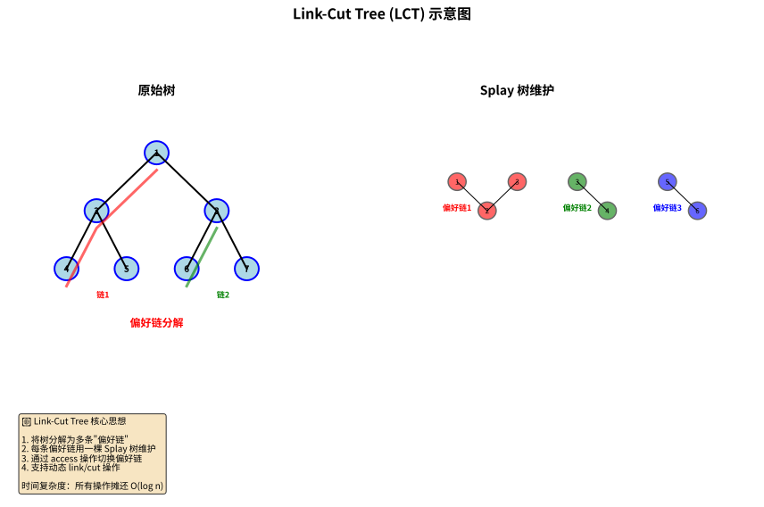
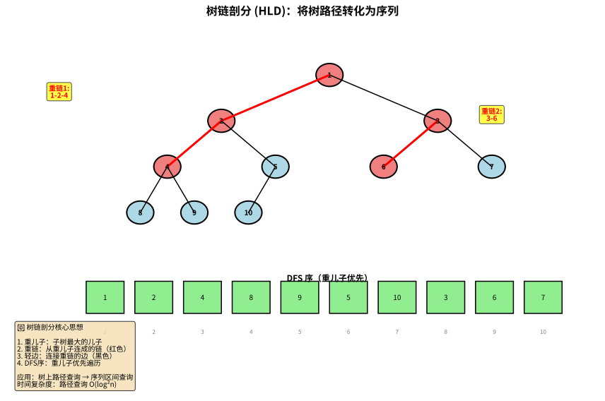
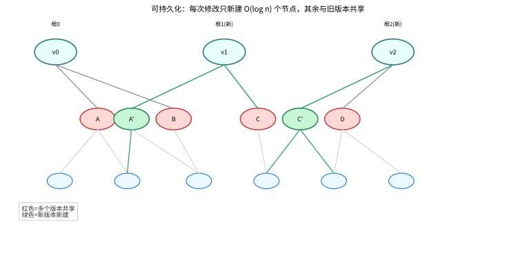
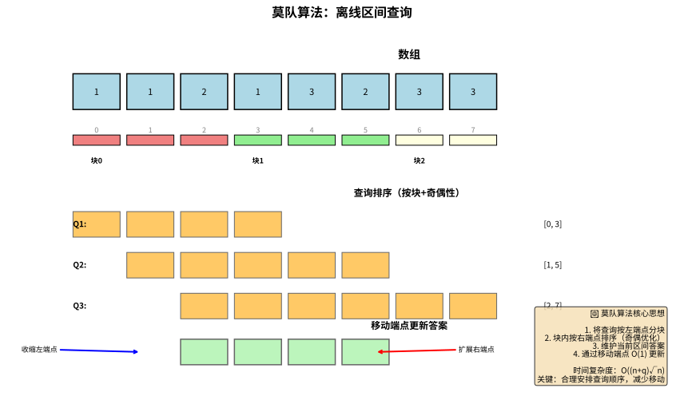
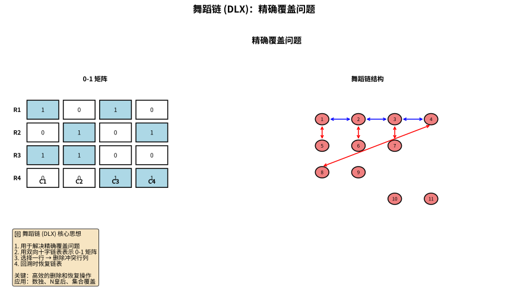

# 第十层：OI/ACM 竞赛高级专题

> 💡 **类比：算法的"奥林匹克竞赛"**
>
> 想象你是一名数学竞赛选手，已经掌握了基础数学知识。现在你要参加的是"国际数学奥林匹克"：
> - **高级数据结构**：各种"神器"级别的工具（LCT、主席树、莫队等）
> - **经典竞赛题型**：特定问题的"标准解法"（最大团、差分约束、稳定婚姻等）
> - **竞赛数学专题**：高深的数学工具（杜教筛、Min_25 筛、多项式全家桶等）
>
> 这一层的内容是**竞赛选手的专属武器库**，虽然在实际工作中很少用到，但能极大提升你的算法思维和编码能力。

---

## 1. OI 竞赛级别高级数据结构

> 💡 **类比：瑞士军刀 vs 多功能工具包**
>
> 前几层的数据结构像是"瑞士军刀"——功能强大但相对通用。这一层的数据结构像是"专业工具包"：
> - **Link-Cut Tree**：专门处理动态树问题
> - **主席树**：专门处理历史版本查询
> - **莫队算法**：专门处理离线区间查询
> - **舞蹈链**：专门处理精确覆盖问题
>
> 每种工具都有特定的应用场景，掌握它们能让你在竞赛中"秒杀"特定类型的问题。

### 1.1 Link-Cut Tree (LCT)

> 💡 **类比：动态的家族族谱**
>
> 想象你要维护一个家族族谱，但经常有人：
> - 断绝关系（cut）
> - 认祖归宗（link）
> - 查询某条血脉链上的信息（path query）
>
> Link-Cut Tree 就是专门处理这种"动态树"问题的数据结构。



```python
class LCTNode:
    """LCT 节点"""
    def __init__(self, val=0):
        self.val = val
        self.ch = [0, 0]  # 左右儿子
        self.fa = 0       # 父亲
        self.rev = 0      # 翻转标记
        self.sum = val    # 维护的信息（如子树和）

class LinkCutTree:
    """
    Link-Cut Tree：动态树
    
    💡 类比：动态的家族族谱
    支持操作：
    - link(x, y): 连接两棵树
    - cut(x, y): 断开边
    - query(x, y): 查询路径信息
    - update(x, y): 修改路径信息
    
    核心思想：
    - 用 Splay 树维护每条"偏好链"
    - 通过 access 操作切换偏好链
    
    时间复杂度：
    - 所有操作：摊还 O(log n)
    
    应用：
    - 动态连通性
    - 动态树路径查询
    - 维护森林
    """
    def __init__(self, n):
        self.t = [LCTNode() for _ in range(n + 1)]
    
    def is_root(self, x):
        """判断是否为 Splay 的根"""
        f = self.t[x].fa
        return f == 0 or (self.t[f].ch[0] != x and self.t[f].ch[1] != x)
    
    def push_up(self, x):
        """上传信息"""
        self.t[x].sum = self.t[self.t[x].ch[0]].sum ^ self.t[self.t[x].ch[1]].sum ^ self.t[x].val
    
    def push_down(self, x):
        """下传标记"""
        if self.t[x].rev:
            self.t[x].ch[0], self.t[x].ch[1] = self.t[x].ch[1], self.t[x].ch[0]
            if self.t[x].ch[0]:
                self.t[self.t[x].ch[0]].rev ^= 1
            if self.t[x].ch[1]:
                self.t[self.t[x].ch[1]].rev ^= 1
            self.t[x].rev = 0
    
    def rotate(self, x):
        """Splay 旋转"""
        y = self.t[x].fa
        z = self.t[y].fa
        k = 1 if self.t[y].ch[1] == x else 0
        
        if not self.is_root(y):
            self.t[z].ch[1 if self.t[z].ch[1] == y else 0] = x
        self.t[x].fa = z
        
        self.t[y].ch[k] = self.t[x].ch[k ^ 1]
        if self.t[x].ch[k ^ 1]:
            self.t[self.t[x].ch[k ^ 1]].fa = y
        
        self.t[x].ch[k ^ 1] = y
        self.t[y].fa = x
        
        self.push_up(y)
        self.push_up(x)
    
    def splay(self, x):
        """Splay 操作"""
        # 先下传标记
        stk = []
        u = x
        stk.append(u)
        while not self.is_root(u):
            u = self.t[u].fa
            stk.append(u)
        while stk:
            self.push_down(stk.pop())
        
        while not self.is_root(x):
            y = self.t[x].fa
            z = self.t[y].fa
            if not self.is_root(y):
                if (self.t[y].ch[1] == x) ^ (self.t[z].ch[1] == y):
                    self.rotate(x)
                else:
                    self.rotate(y)
            self.rotate(x)
    
    def access(self, x):
        """Access 操作：将 x 到根的路径变为一条偏好链"""
        u = x
        y = 0
        while u:
            self.splay(u)
            self.t[u].ch[1] = y
            self.push_up(u)
            y = u
            u = self.t[u].fa
        self.splay(x)
    
    def make_root(self, x):
        """将 x 变为树根"""
        self.access(x)
        self.t[x].rev ^= 1
    
    def find_root(self, x):
        """找到 x 所在树的根"""
        self.access(x)
        while self.t[x].ch[0]:
            self.push_down(x)
            x = self.t[x].ch[0]
        self.splay(x)
        return x
    
    def link(self, x, y):
        """连接 x 和 y"""
        self.make_root(x)
        if self.find_root(y) != x:
            self.t[x].fa = y
    
    def cut(self, x, y):
        """断开 x 和 y"""
        self.make_root(x)
        if self.find_root(y) == x and self.t[y].fa == x and not self.t[y].ch[0]:
            self.t[y].fa = 0
            self.t[x].ch[1] = 0
            self.push_up(x)
    
    def query(self, x, y):
        """查询 x 到 y 路径上的信息"""
        self.make_root(x)
        self.access(y)
        return self.t[y].sum

# 示例
lct = LinkCutTree(5)
for i in range(1, 6):
    lct.t[i].val = i
    lct.push_up(i)

lct.link(1, 2)
lct.link(2, 3)
lct.link(3, 4)
lct.link(4, 5)

print(lct.query(1, 5))  # 1^2^3^4^5 = 1
lct.cut(3, 4)
print(lct.query(1, 3))  # 1^2^3 = 0
```

### 1.2 树链剖分 (HLD)

> 💡 **类比：把树"压平"**
>
> 想象你有一棵树，要在树上做路径查询。但线段树只能处理数组，怎么办？
> 树链剖分就是把树"压平"成数组，然后用线段树维护。



```python
class HLD:
    """
    树链剖分：将树路径转化为序列问题
    
    💡 类比：快递分拣
    - 想象一棵树是快递网络，每个节点是分拣中心
    - 树链剖分把"树上的路径"转化为"数组上的区间"
    - 然后可以用线段树/树状数组高效处理
    
    核心思想：
    - 重儿子：子树最大的儿子
    - 重链：从重儿子连成的链
    - 轻边：连接重链的边
    
    应用：
    - 树上路径求和/最值
    - 树上路径修改
    - LCA（最近公共祖先）
    
    时间复杂度：
    - 预处理：O(n)
    - 路径查询/修改：O(log²n)
    """
    def __init__(self, n, edges, values=None):
        self.n = n
        self.adj = [[] for _ in range(n + 1)]
        for u, v in edges:
            self.adj[u].append(v)
            self.adj[v].append(u)
        
        self.val = values or [0] * (n + 1)
        
        # 预处理
        self.parent = [0] * (n + 1)
        self.depth = [0] * (n + 1)
        self.sz = [1] * (n + 1)
        self.heavy_son = [0] * (n + 1)
        self.top = [0] * (n + 1)
        self.dfn = [0] * (n + 1)
        self.rnk = [0] * (n + 1)
        self.timer = 0
        
        # 第一次 DFS：计算父节点、深度、子树大小、重儿子
        self._dfs1(1, 0, 0)
        
        # 第二次 DFS：计算链顶、DFS 序
        self._dfs2(1, 1)
    
    def _dfs1(self, u, fa, d):
        """第一次 DFS"""
        self.parent[u] = fa
        self.depth[u] = d
        max_sz = 0
        
        for v in self.adj[u]:
            if v != fa:
                self._dfs1(v, u, d + 1)
                self.sz[u] += self.sz[v]
                if self.sz[v] > max_sz:
                    max_sz = self.sz[v]
                    self.heavy_son[u] = v
    
    def _dfs2(self, u, t):
        """第二次 DFS"""
        self.top[u] = t
        self.timer += 1
        self.dfn[u] = self.timer
        self.rnk[self.timer] = u
        
        if self.heavy_son[u]:
            self._dfs2(self.heavy_son[u], t)
        
        for v in self.adj[u]:
            if v != self.parent[u] and v != self.heavy_son[u]:
                self._dfs2(v, v)
    
    def lca(self, u, v):
        """求 LCA"""
        while self.top[u] != self.top[v]:
            if self.depth[self.top[u]] < self.depth[self.top[v]]:
                v = self.parent[self.top[v]]
            else:
                u = self.parent[self.top[u]]
        return u if self.depth[u] < self.depth[v] else v
    
    def query_path(self, u, v, seg_tree):
        """查询树上路径（配合线段树）"""
        res = 0
        while self.top[u] != self.top[v]:
            if self.depth[self.top[u]] >= self.depth[self.top[v]]:
                res += seg_tree.query(self.dfn[self.top[u]], self.dfn[u])
                u = self.parent[self.top[u]]
            else:
                res += seg_tree.query(self.dfn[self.top[v]], self.dfn[v])
                v = self.parent[self.top[v]]
        
        if self.depth[u] <= self.depth[v]:
            res += seg_tree.query(self.dfn[u], self.dfn[v])
        else:
            res += seg_tree.query(self.dfn[v], self.dfn[u])
        
        return res

# 示例
n = 7
edges = [(1, 2), (1, 3), (2, 4), (2, 5), (3, 6), (3, 7)]
values = [0, 1, 2, 3, 4, 5, 6, 7]

hld = HLD(n, edges, values)
print(f"LCA(4, 5) = {hld.lca(4, 5)}")  # 2
print(f"LCA(4, 6) = {hld.lca(4, 6)}")  # 1
```

### 1.3 可持久化线段树（主席树）

> 💡 **类比：时光机**
>
> 普通线段树只能看到当前状态，主席树可以回到任意历史版本。



```python
class PersistentSegmentTree:
    """
    可持久化线段树：保存线段树的每个历史版本
    
    💡 类比：时光机
    - 普通线段树：只能看到当前状态
    - 可持久化线段树：可以回到任意历史版本
    - 每次修改创建新版本，不破坏旧版本
    
    核心思想：
    - 路径复制：只复制被修改的路径上的节点
    - 共享节点：未修改的部分共享旧版本的节点
    
    应用：
    - 区间第 K 大（静态/动态）
    - 历史版本查询
    - 树上路径问题
    
    时间复杂度：
    - 查询：O(log n)
    - 修改：O(log n)
    - 空间复杂度：O(n log n)
    """
    def __init__(self, n):
        self.n = n
        self.roots = [0]  # 版本 0
        self.cnt = 0
        self.ls = [0] * (n * 20)  # 左儿子
        self.rs = [0] * (n * 20)  # 右儿子
        self.sum = [0] * (n * 20)  # 区间和
    
    def build(self, l, r):
        """建树"""
        self.cnt += 1
        rt = self.cnt
        if l == r:
            self.sum[rt] = 0
            return rt
        mid = (l + r) >> 1
        self.ls[rt] = self.build(l, mid)
        self.rs[rt] = self.build(mid + 1, r)
        self.sum[rt] = self.sum[self.ls[rt]] + self.sum[self.rs[rt]]
        return rt
    
    def update(self, pre_rt, l, r, pos, val):
        """单点修改（创建新版本）"""
        self.cnt += 1
        rt = self.cnt
        self.ls[rt] = self.ls[pre_rt]
        self.rs[rt] = self.rs[pre_rt]
        self.sum[rt] = self.sum[pre_rt] + val
        
        if l == r:
            return rt
        
        mid = (l + r) >> 1
        if pos <= mid:
            self.ls[rt] = self.update(self.ls[pre_rt], l, mid, pos, val)
        else:
            self.rs[rt] = self.update(self.rs[pre_rt], mid + 1, r, pos, val)
        
        return rt
    
    def query(self, rt, l, r, ql, qr):
        """区间查询"""
        if ql <= l and r <= qr:
            return self.sum[rt]
        
        mid = (l + r) >> 1
        res = 0
        if ql <= mid:
            res += self.query(self.ls[rt], l, mid, ql, qr)
        if qr > mid:
            res += self.query(self.rs[rt], mid + 1, r, ql, qr)
        return res

# 示例：区间第 K 大
def kth_smallest(arr, k):
    """
    静态区间第 K 小
    使用主席树维护值域
    """
    # 离散化
    sorted_arr = sorted(set(arr))
    rank = {v: i + 1 for i, v in enumerate(sorted_arr)}
    
    n = len(arr)
    pst = PersistentSegmentTree(len(sorted_arr))
    roots = [0] * (n + 1)
    roots[0] = pst.build(1, len(sorted_arr))
    
    # 逐个插入
    for i in range(n):
        roots[i + 1] = pst.update(roots[i], 1, len(sorted_arr), rank[arr[i]], 1)
    
    # 查询区间 [l, r] 的第 k 小
    def query_kth(l, r, k):
        return _query_kth(roots[l - 1], roots[r], 1, len(sorted_arr), k)
    
    def _query_kth(pre_rt, rt, l, r, k):
        if l == r:
            return sorted_arr[l - 1]
        mid = (l + r) >> 1
        left_sum = pst.sum[pst.ls[rt]] - pst.sum[pst.ls[pre_rt]]
        if k <= left_sum:
            return _query_kth(pst.ls[pre_rt], pst.ls[rt], l, mid, k)
        else:
            return _query_kth(pst.rs[pre_rt], pst.rs[rt], mid + 1, r, k - left_sum)
    
    return query_kth

# 示例
arr = [1, 5, 2, 6, 3, 7, 4]
query = kth_smallest(arr, 3)
print(query(2, 5, 3))  # 区间 [2, 5] 的第 3 小
```

### 1.4 莫队算法

> 💡 **类比：滑动窗口的升级版**
>
> 普通滑动窗口只能处理固定长度的区间，莫队算法可以处理任意长度的区间查询。



```python
from collections import defaultdict
import math

class MoAlgorithm:
    """
    莫队算法：离线处理区间查询
    
    💡 类比：滑动窗口的升级版
    - 普通滑动窗口：只能处理固定长度的区间
    - 莫队算法：可以处理任意长度的区间查询
    - 核心思想：合理安排查询顺序，减少区间端点移动
    
    核心思想：
    - 将查询按左端点分块
    - 块内按右端点排序
    - 维护当前区间的答案，通过移动端点更新
    
    应用：
    - 区间不同元素个数
    - 区间众数
    - 区间逆序对
    
    时间复杂度：O((n + q)√n)
    """
    def __init__(self, arr):
        self.arr = arr
        self.n = len(arr)
        self.block_size = int(math.sqrt(self.n))
    
    def query_distinct_elements(self, queries):
        """
        查询区间不同元素个数
        queries: [(l, r, idx), ...]
        """
        # 分块排序
        queries.sort(key=lambda q: (q[0] // self.block_size, 
                                     q[1] if (q[0] // self.block_size) % 2 == 0 else -q[1]))
        
        ans = [0] * len(queries)
        cur_l, cur_r = 0, -1
        cnt = defaultdict(int)
        distinct = 0
        
        for l, r, idx in queries:
            # 扩展右端点
            while cur_r < r:
                cur_r += 1
                if cnt[self.arr[cur_r]] == 0:
                    distinct += 1
                cnt[self.arr[cur_r]] += 1
            
            # 收缩左端点
            while cur_l > l:
                cur_l -= 1
                if cnt[self.arr[cur_l]] == 0:
                    distinct += 1
                cnt[self.arr[cur_l]] += 1
            
            # 收缩右端点
            while cur_r > r:
                if cnt[self.arr[cur_r]] == 1:
                    distinct -= 1
                cnt[self.arr[cur_r]] -= 1
                cur_r -= 1
            
            # 扩展左端点
            while cur_l < l:
                if cnt[self.arr[cur_l]] == 1:
                    distinct -= 1
                cnt[self.arr[cur_l]] -= 1
                cur_l += 1
            
            ans[idx] = distinct
        
        return ans

# 示例
arr = [1, 1, 2, 1, 3, 2, 3, 3]
queries = [
    (0, 3, 0),  # [1, 1, 2, 1] -> 2 种
    (1, 5, 1),  # [1, 2, 1, 3, 2] -> 3 种
    (2, 7, 2),  # [2, 1, 3, 2, 3, 3] -> 3 种
]

mo = MoAlgorithm(arr)
ans = mo.query_distinct_elements(queries)
print(ans)  # [2, 3, 3]
```

### 1.5 珂朵莉树 (ODT)

> 💡 **类比：区间涂色**
>
> 想象你有一排格子，经常要做"把区间 [l, r] 涂成颜色 c"的操作。


```python
class ODT:
    """
    珂朵莉树 (Old Driver Tree)
    
    💡 类比：区间涂色
    - 维护一系列"颜色相同"的连续区间
    - 支持区间赋值、区间求和等操作
    - 核心思想：用 set 维护区间，区间赋值时合并相同颜色的区间
    
    适用场景：
    - 有区间赋值操作
    - 数据随机（保证复杂度）
    
    时间复杂度：
    - 区间赋值：摊还 O(log n)
    - 其他操作：O(log n)
    """
    def __init__(self):
        self.intervals = set()  # (l, r, v)
    
    def add(self, l, r, v):
        """添加区间 [l, r]，值为 v"""
        self.intervals.add((l, r, v))
    
    def split(self, pos):
        """将包含 pos 的区间分裂"""
        # 找到包含 pos 的区间
        for l, r, v in list(self.intervals):
            if l <= pos <= r:
                if l == pos:
                    return (l, r, v)
                self.intervals.remove((l, r, v))
                self.intervals.add((l, pos - 1, v))
                self.intervals.add((pos, r, v))
                return (pos, r, v)
        return None
    
    def assign(self, l, r, v):
        """区间赋值"""
        itr = self.split(r + 1)
        itl = self.split(l)
        
        # 删除 [l, r] 内的所有区间
        to_remove = []
        for interval in self.intervals:
            if l <= interval[0] and interval[1] <= r:
                to_remove.append(interval)
        
        for interval in to_remove:
            self.intervals.remove(interval)
        
        self.intervals.add((l, r, v))
    
    def query_sum(self, l, r):
        """区间求和"""
        total = 0
        for interval_l, interval_r, v in self.intervals:
            if interval_r < l or interval_l > r:
                continue
            # 计算交集
            intersect_l = max(interval_l, l)
            intersect_r = min(interval_r, r)
            total += v * (intersect_r - intersect_l + 1)
        return total

# 示例
odt = ODT()
odt.add(1, 10, 1)
odt.assign(3, 7, 2)
print(odt.query_sum(1, 10))  # 1*2 + 2*5 + 1*3 = 17
```

### 1.6 舞蹈链 (Dancing Links X)

> 💡 **类比：解数独的魔法**
>
> 舞蹈链是解决"精确覆盖问题"的神器。



```python
class DancingLinksX:
    """
    舞蹈链 (Dancing Links X)
    
    💡 类比：解数独的魔法
    - 精确覆盖问题：从集合中选择若干子集，使得每个元素恰好被覆盖一次
    - 舞蹈链用双向十字链表高效实现回溯
    
    应用：
    - 数独
    - N 皇后
    - 精确覆盖问题
    
    时间复杂度：指数级（但实际很快）
    """
    def __init__(self, n, m):
        self.n = n  # 行数
        self.m = m  # 列数
        self.head = [0] * (n + 1)  # 每行的头节点
        self.L = [0] * (n * m + 10)
        self.R = [0] * (n * m + 10)
        self.U = [0] * (n * m + 10)
        self.D = [0] * (n * m + 10)
        self.col = [0] * (n * m + 10)
        self.row = [0] * (n * m + 10)
        self.cnt = m  # 节点计数器（0~m 是列头）
        
        # 初始化列头
        for i in range(m + 1):
            self.R[i] = i + 1
            self.L[i + 1] = i
        self.R[m] = 0
        self.L[0] = m
    
    def link(self, r, c):
        """在 (r, c) 位置添加节点"""
        self.cnt += 1
        self.row[self.cnt] = r
        self.col[self.cnt] = c
        
        # 插入到列中
        self.U[self.cnt] = self.U[c]
        self.D[self.cnt] = c
        self.D[self.U[c]] = self.cnt
        self.U[c] = self.cnt
        
        # 插入到行中
        if self.head[r] == 0:
            self.head[r] = self.cnt
            self.L[self.cnt] = self.R[self.cnt] = self.cnt
        else:
            self.R[self.cnt] = self.R[self.head[r]]
            self.L[self.cnt] = self.head[r]
            self.L[self.R[self.head[r]]] = self.cnt
            self.R[self.head[r]] = self.cnt
    
    def remove(self, c):
        """删除列 c"""
        self.R[self.L[c]] = self.R[c]
        self.L[self.R[c]] = self.L[c]
    
    def resume(self, c):
        """恢复列 c"""
        self.R[self.L[c]] = c
        self.L[self.R[c]] = c
    
    def dance(self, dep):
        """DLX 求解"""
        if self.R[0] == 0:
            return True
        
        # 选择元素最少的列
        c = self.R[0]
        min_cnt = float('inf')
        for i in self.R[0:]:
            if i == 0:
                break
            cnt = 0
            j = self.D[i]
            while j != i:
                cnt += 1
                j = self.D[j]
            if cnt < min_cnt:
                min_cnt = cnt
                c = i
        
        # 枚举该列的所有行
        j = self.D[c]
        while j != c:
            # 选择第 j 行
            ans[dep] = self.row[j]
            
            # 删除冲突的列
            to_remove = []
            k = self.R[j]
            while k != j:
                self.remove(self.col[k])
                to_remove.append(self.col[k])
                k = self.R[k]
            
            if self.dance(dep + 1):
                return True
            
            # 恢复
            for c in to_remove:
                self.resume(c)
            
            j = self.D[j]
        
        return False

# 示例：解数独（简化版）
# 数独可以转化为精确覆盖问题
# 约束：每个格子有数字、每行每列每个宫都有 1-9
```

### 1.7 练习题

1. **实现 LCT**：维护动态树的连通性
2. **树链剖分 + 线段树**：树上路径求和
3. **主席树**：静态区间第 K 大
4. **莫队算法**：区间不同元素个数
5. **思考题**：为什么珂朵莉树需要"数据随机"才能保证复杂度？

---

## 2. 经典竞赛题型

> 💡 **类比：武术招式**
>
> 每种题型都有特定的"解法套路"，掌握这些套路，面对新问题时能快速识别并应用。

### 2.1 最大团问题 (Bron-Kerbosch)

> 💡 **类比：朋友圈**
>
> 想象一群人，如果某群人两两都认识，就是一个"团"。最大团就是最大的这样的群体。

```python
class MaxClique:
    """
    最大团问题：找图中最大的完全子图
    
    💡 类比：朋友圈
    - 想象一群人，如果某群人两两都认识，就是一个"团"
    - 最大团：最大的这样的群体
    
    Bron-Kerbosch 算法：
    - 回溯搜索 + 剪枝
    - 维护三个集合：R（当前团）、P（候选点）、X（已排除点）
    
    时间复杂度：O(3^(n/3))（最坏情况）
    """
    def __init__(self, n, edges):
        self.n = n
        self.adj = [set() for _ in range(n)]
        for u, v in edges:
            self.adj[u].add(v)
            self.adj[v].add(u)
        
        self.max_clique = []
    
    def bron_kerbosch(self, R, P, X):
        """Bron-Kerbosch 算法"""
        if not P and not X:
            if len(R) > len(self.max_clique):
                self.max_clique = list(R)
            return
        
        # 选择 pivot 点（优化：选择与 P 中最多点相邻的点）
        pivot = max(P | X, key=lambda v: len(self.adj[v] & P))
        
        for v in list(P):
            if pivot in self.adj[v]:
                self.bron_kerbosch(
                    R | {v},
                    P & self.adj[v],
                    X & self.adj[v]
                )
                P.remove(v)
                X.add(v)
    
    def find_max_clique(self):
        """找最大团"""
        P = set(range(self.n))
        self.bron_kerbosch(set(), P, set())
        return self.max_clique

# 示例
n = 6
edges = [(0, 1), (0, 2), (1, 2), (1, 3), (2, 3), (3, 4), (3, 5), (4, 5)]
mc = MaxClique(n, edges)
print(mc.find_max_clique())  # [0, 1, 2] 或 [1, 2, 3] 或 [3, 4, 5]
```

### 2.2 稳定婚姻问题 (Gale-Shapley)

> 💡 **类比：相亲配对**
>
> n 个男生，n 个女生，每人对异性有一个偏好排序。目标：找到一种配对，使得不存在"男生 A 更喜欢女生 B，而女生 B 也更喜欢男生 A"。

```python
class StableMarriage:
    """
    稳定婚姻问题：男女配对，使得没有"不稳定"的配对
    
    💡 类比：相亲配对
    - n 个男生，n 个女生，每人对异性有一个偏好排序
    - 目标：找到一种配对，使得不存在"男生 A 更喜欢女生 B，而女生 B 也更喜欢男生 A"
    
    Gale-Shapley 算法：
    - 男生主动求婚，女生被动接受
    - 男生按偏好顺序向女生求婚
    - 女生如果单身，接受求婚；如果已有男友，比较偏好，选择更好的
    - 被拒绝的男生继续向下一个偏好女生求婚
    
    性质：
    - 总是存在稳定匹配
    - 算法保证男生最优（男生得到最好的可能结果）
    - 时间复杂度：O(n²)
    """
    def __init__(self, n, men_pref, women_pref):
        self.n = n
        self.men_pref = men_pref  # men_pref[i] 是男生 i 的偏好列表
        self.women_pref = women_pref  # women_pref[i] 是女生 i 的偏好列表
        
        # 建立女生偏好的逆映射（方便比较）
        self.women_rank = [[0] * n for _ in range(n)]
        for i in range(n):
            for j, man in enumerate(women_pref[i]):
                self.women_rank[i][man] = j
    
    def gale_shapley(self):
        """Gale-Shapley 算法"""
        # 初始化
        free_men = list(range(self.n))
        man_engaged = [-1] * self.n  # 男生当前女友
        woman_engaged = [-1] * self.n  # 女生当前男友
        man_next_proposal = [0] * self.n  # 男生下一个要求婚的女生索引
        
        while free_men:
            man = free_men.pop(0)
            woman = self.men_pref[man][man_next_proposal[man]]
            man_next_proposal[man] += 1
            
            if woman_engaged[woman] == -1:
                # 女生单身，接受求婚
                man_engaged[man] = woman
                woman_engaged[woman] = man
            else:
                # 女生已有男友，比较偏好
                current_man = woman_engaged[woman]
                if self.women_rank[woman][man] < self.women_rank[woman][current_man]:
                    # 女生更喜欢新男生
                    man_engaged[man] = woman
                    woman_engaged[woman] = man
                    man_engaged[current_man] = -1
                    free_men.append(current_man)
                else:
                    # 女生拒绝新男生
                    free_men.append(man)
        
        return [(i, man_engaged[i]) for i in range(self.n)]

# 示例
n = 4
men_pref = [
    [0, 1, 2, 3],  # 男生 0 的偏好
    [1, 0, 2, 3],  # 男生 1 的偏好
    [0, 1, 2, 3],  # 男生 2 的偏好
    [1, 0, 2, 3],  # 男生 3 的偏好
]
women_pref = [
    [0, 1, 2, 3],  # 女生 0 的偏好
    [1, 0, 2, 3],  # 女生 1 的偏好
    [0, 1, 2, 3],  # 女生 2 的偏好
    [1, 0, 2, 3],  # 女生 3 的偏好
]

sm = StableMarriage(n, men_pref, women_pref)
matching = sm.gale_shapley()
print(matching)  # [(0, 0), (1, 1), (2, 2), (3, 3)]
```

### 2.3 差分约束系统

> 💡 **类比：不等式网络**
>
> 给你一组形如 x_i - x_j ≤ c 的不等式，求一组解。

```python
from collections import deque

def difference_constraints(n, constraints):
    """
    差分约束系统
    
    💡 类比：不等式网络
    - 给你一组形如 x_i - x_j ≤ c 的不等式
    - 转化为图论问题：从 j 到 i 连一条权值为 c 的边
    - 求最短路，如果存在负环则无解
    
    应用：
    - 区间约束
    - 调度问题
    - 不等式系统
    
    时间复杂度：O(VE)（Bellman-Ford）
    """
    # 建图
    adj = [[] for _ in range(n + 1)]
    for u, v, w in constraints:
        adj[v].append((u, w))  # x_u - x_v ≤ w
    
    # 添加超级源点
    for i in range(1, n + 1):
        adj[0].append((i, 0))
    
    # Bellman-Ford
    dist = [float('inf')] * (n + 1)
    dist[0] = 0
    
    for _ in range(n):
        for u in range(n + 1):
            if dist[u] == float('inf'):
                continue
            for v, w in adj[u]:
                if dist[u] + w < dist[v]:
                    dist[v] = dist[u] + w
    
    # 检查负环
    for u in range(n + 1):
        if dist[u] == float('inf'):
            continue
        for v, w in adj[u]:
            if dist[u] + w < dist[v]:
                return None  # 无解（存在负环）
    
    return dist[1:]  # 返回 x_1, x_2, ..., x_n

# 示例
n = 3
constraints = [
    (1, 2, 5),   # x_1 - x_2 ≤ 5
    (2, 3, 3),   # x_2 - x_3 ≤ 3
    (1, 3, 7),   # x_1 - x_3 ≤ 7
]
result = difference_constraints(n, constraints)
print(result)  # [0, -5, -8] 或其他合法解
```

### 2.4 线性基

> 💡 **类比：向量空间的基**
>
> 线性基是一组"基底"，可以表示原集合中所有元素的异或组合。

```python
class LinearBasis:
    """
    线性基
    
    💡 类比：向量空间的基
    - 线性基是一组"基底"，可以表示原集合中所有元素的异或组合
    - 类似于向量空间的基，但运算是异或
    
    应用：
    - 最大异或和
    - 第 K 大异或和
    - 判断能否异或出某个值
    
    时间复杂度：
    - 插入：O(log M)（M 是值域）
    - 查询：O(log M)
    """
    def __init__(self, max_bits=60):
        self.max_bits = max_bits
        self.basis = [0] * max_bits
    
    def insert(self, x):
        """插入元素"""
        for i in range(self.max_bits - 1, -1, -1):
            if not (x >> i):
                continue
            if not self.basis[i]:
                self.basis[i] = x
                return True
            x ^= self.basis[i]
        return False  # x 可以被表示
    
    def query_max(self):
        """查询最大异或和"""
        res = 0
        for i in range(self.max_bits - 1, -1, -1):
            res = max(res, res ^ self.basis[i])
        return res
    
    def query_min(self):
        """查询最小非零异或和"""
        for i in range(self.max_bits):
            if self.basis[i]:
                return self.basis[i]
        return 0
    
    def can_represent(self, x):
        """判断能否表示 x"""
        for i in range(self.max_bits - 1, -1, -1):
            if not (x >> i):
                continue
            if not self.basis[i]:
                return False
            x ^= self.basis[i]
        return True
    
    def rebuild(self):
        """重构线性基（化为最简形式）"""
        for i in range(self.max_bits - 1, -1, -1):
            for j in range(i - 1, -1, -1):
                if self.basis[i] >> j & 1:
                    self.basis[i] ^= self.basis[j]

# 示例
lb = LinearBasis()
for x in [1, 2, 3, 4, 5]:
    lb.insert(x)

print(f"最大异或和: {lb.query_max()}")  # 7
print(f"能否表示 6: {lb.can_represent(6)}")  # True
print(f"能否表示 8: {lb.can_represent(8)}")  # False
```

### 2.5 练习题

1. **最大团问题**：用 Bron-Kerbosch 算法求解
2. **稳定婚姻**：实现 Gale-Shapley 算法
3. **差分约束**：用 Bellman-Ford 求解不等式系统
4. **线性基**：求最大异或和
5. **思考题**：为什么 Gale-Shapley 算法保证男生最优？

---

## 3. 竞赛数学专题

> 💡 **类比：内功心法**
>
> 竞赛数学是算法的"内功"，掌握这些数学工具，能解决看似复杂的问题。

### 3.1 杜教筛

> 💡 **类比：记忆化搜索的升级版**
>
> 普通记忆化记住每个子问题的答案，杜教筛利用积性函数的性质，只计算关键子问题。

```python
class DuSieve:
    """
    杜教筛：快速计算积性函数前缀和
    
    💡 类比：记忆化搜索的升级版
    - 普通记忆化：记住每个子问题的答案
    - 杜教筛：利用积性函数的性质，只计算关键子问题
    
    核心思想：
    - 利用狄利克雷卷积：S(n) = ∑f(i) * g(n/i)
    - 通过预处理和记忆化，将复杂度降到 O(n^(2/3))
    
    应用：
    - 计算莫比乌斯函数前缀和
    - 计算欧拉函数前缀和
    - 计算其他积性函数前缀和
    
    时间复杂度：O(n^(2/3))
    """
    def __init__(self, max_n=10**6):
        self.max_n = max_n
        self.mu = [0] * (max_n + 1)  # 莫比乌斯函数
        self.phi = [0] * (max_n + 1)  # 欧拉函数
        self.primes = []
        self.is_prime = [True] * (max_n + 1)
        
        # 线性筛预处理
        self._linear_sieve()
        
        # 记忆化
        self.mu_sum = {i: sum(self.mu[1:i+1]) for i in range(1, min(1000, max_n + 1))}
        self.phi_sum = {i: sum(self.phi[1:i+1]) for i in range(1, min(1000, max_n + 1))}
    
    def _linear_sieve(self):
        """线性筛"""
        self.mu[1] = 1
        self.phi[1] = 1
        
        for i in range(2, self.max_n + 1):
            if self.is_prime[i]:
                self.primes.append(i)
                self.mu[i] = -1
                self.phi[i] = i - 1
            
            for p in self.primes:
                if i * p > self.max_n:
                    break
                self.is_prime[i * p] = False
                
                if i % p == 0:
                    self.mu[i * p] = 0
                    self.phi[i * p] = self.phi[i] * p
                    break
                else:
                    self.mu[i * p] = -self.mu[i]
                    self.phi[i * p] = self.phi[i] * (p - 1)
    
    def get_mu_sum(self, n):
        """计算莫比乌斯函数前缀和"""
        if n <= self.max_n:
            return self.mu_sum.get(n, sum(self.mu[1:n+1]))
        
        if n in self.mu_sum:
            return self.mu_sum[n]
        
        # 杜教筛核心公式
        # S(n) = 1 - ∑S(n/i) (i >= 2)
        ans = 1
        l = 2
        while l <= n:
            r = n // (n // l)
            ans -= (r - l + 1) * self.get_mu_sum(n // l)
            l = r + 1
        
        self.mu_sum[n] = ans
        return ans
    
    def get_phi_sum(self, n):
        """计算欧拉函数前缀和"""
        if n <= self.max_n:
            return self.phi_sum.get(n, sum(self.phi[1:n+1]))
        
        if n in self.phi_sum:
            return self.phi_sum[n]
        
        # 杜教筛核心公式
        # S(n) = n*(n+1)/2 - ∑S(n/i) (i >= 2)
        ans = n * (n + 1) // 2
        l = 2
        while l <= n:
            r = n // (n // l)
            ans -= (r - l + 1) * self.get_phi_sum(n // l)
            l = r + 1
        
        self.phi_sum[n] = ans
        return ans

# 示例
du = DuSieve(10**6)
print(du.get_mu_sum(10**9))  # 计算莫比乌斯函数前缀和
print(du.get_phi_sum(10**9))  # 计算欧拉函数前缀和
```

### 3.2 Min_25 筛

> 💡 **类比：分治筛法**
>
> Min_25 筛是杜教筛的升级版，可以处理更复杂的积性函数。

```python
class Min25Sieve:
    """
    Min_25 筛：计算积性函数前缀和
    
    💡 类比：分治筛法
    - 比杜教筛更强大，可以处理非完全积性函数
    - 核心思想：分治 + 记忆化
    
    应用：
    - 素数计数函数 π(n)
    - 积性函数前缀和
    
    时间复杂度：O(n^(3/4) / log n)
    """
    def __init__(self, max_n=10**10):
        self.max_n = max_n
        self.sqrt_n = int(max_n ** 0.5)
        
        # 预处理小素数
        self.primes = []
        self.is_prime = [True] * (self.sqrt_n + 1)
        self._sieve()
        
        # 记忆化
        self.memo = {}
    
    def _sieve(self):
        """线性筛"""
        for i in range(2, self.sqrt_n + 1):
            if self.is_prime[i]:
                self.primes.append(i)
            for p in self.primes:
                if i * p > self.sqrt_n:
                    break
                self.is_prime[i * p] = False
                if i % p == 0:
                    break
    
    def count_primes(self, n):
        """计算 π(n)：不超过 n 的素数个数"""
        if n <= self.sqrt_n:
            return sum(1 for p in self.primes if p <= n)
        
        if n in self.memo:
            return self.memo[n]
        
        # Min_25 筛核心
        # 具体实现较复杂，这里给出简化版
        ans = self._count_primes_recursive(n, 0)
        self.memo[n] = ans
        return ans
    
    def _count_primes_recursive(self, n, k):
        """递归计算"""
        if n <= 1:
            return 0
        if k >= len(self.primes):
            return 0
        
        p = self.primes[k]
        if p * p > n:
            return len([x for x in self.primes if x <= n]) - k
        
        # 不包含 p 的倍数的素数 + 包含 p 的倍数的素数
        return self._count_primes_recursive(n, k + 1) + self._count_primes_recursive(n // p, k + 1)

# 示例
m25 = Min25Sieve(10**10)
print(m25.count_primes(10**9))  # 约 50847534
```

### 3.3 拉格朗日插值

> 💡 **类比：曲线拟合**
>
> 给你 n 个点，找一条经过所有点的光滑曲线。

```python
class LagrangeInterpolation:
    """
    拉格朗日插值：通过 n 个点确定一个 n-1 次多项式
    
    💡 类比：曲线拟合
    - 给你 n 个点，找一条经过所有点的光滑曲线
    - 拉格朗日插值：构造一个多项式，精确经过所有点
    
    核心公式：
    L(x) = ∑y_i * ∏(x - x_j) / (x_i - x_j) (j ≠ i)
    
    应用：
    - 多项式求值
    - 数列求和（将求和公式看作多项式）
    - 组合数学
    
    时间复杂度：O(n²) 或 O(n log²n)（优化版）
    """
    def __init__(self, points):
        """
        points: [(x_0, y_0), (x_1, y_1), ..., (x_{n-1}, y_{n-1})]
        """
        self.points = points
        self.n = len(points)
    
    def evaluate(self, x):
        """计算多项式在 x 处的值"""
        result = 0
        for i in range(self.n):
            xi, yi = self.points[i]
            term = yi
            for j in range(self.n):
                if i != j:
                    xj = self.points[j][0]
                    term *= (x - xj) / (xi - xj)
            result += term
        return result
    
    def get_coefficients(self):
        """获取多项式系数"""
        # 构造拉格朗日基多项式
        coeffs = [0] * self.n
        
        for i in range(self.n):
            xi, yi = self.points[i]
            
            # 计算基多项式的系数
            base_coeffs = [1]
            for j in range(self.n):
                if i != j:
                    xj = self.points[j][0]
                    # 乘以 (x - xj) / (xi - xj)
                    new_base = [0] * (len(base_coeffs) + 1)
                    for k in range(len(base_coeffs)):
                        new_base[k] += base_coeffs[k] * (-xj) / (xi - xj)
                        new_base[k + 1] += base_coeffs[k] / (xi - xj)
                    base_coeffs = new_base
            
            # 累加到总系数
            for k in range(len(base_coeffs)):
                coeffs[k] += yi * base_coeffs[k]
        
        return coeffs

# 示例：通过 3 个点确定二次多项式
points = [(0, 1), (1, 3), (2, 7)]
li = LagrangeInterpolation(points)
print(li.evaluate(3))  # 预测 x=3 时的值
print(li.get_coefficients())  # 输出多项式系数
```

### 3.4 快速沃尔什变换 (FWT)

> 💡 **类比：FFT 的异或版**
>
> FFT 处理普通卷积，FWT 处理位运算卷积（AND、OR、XOR）。

```python
def fwt_or(a, invert=False):
    """
    FWT (OR 卷积)
    
    💡 类比：FFT 的 OR 版
    - FFT 处理普通卷积：c[k] = ∑a[i]*b[j] (i+j=k)
    - FWT OR 处理 OR 卷积：c[k] = ∑a[i]*b[j] (i|j=k)
    
    应用：
    - 位运算卷积
    - 集合 DP
    
    时间复杂度：O(n log n)
    """
    n = len(a)
    j = 1
    while j < n:
        for i in range(0, n, j << 1):
            for k in range(i, i + j):
                if not invert:
                    a[k + j] += a[k]
                else:
                    a[k + j] -= a[k]
        j <<= 1

def fwt_and(a, invert=False):
    """FWT (AND 卷积)"""
    n = len(a)
    j = 1
    while j < n:
        for i in range(0, n, j << 1):
            for k in range(i, i + j):
                if not invert:
                    a[k] += a[k + j]
                else:
                    a[k] -= a[k + j]
        j <<= 1

def fwt_xor(a, invert=False):
    """FWT (XOR 卷积)"""
    n = len(a)
    j = 1
    while j < n:
        for i in range(0, n, j << 1):
            for k in range(i, i + j):
                x = a[k]
                y = a[k + j]
                a[k] = x + y
                a[k + j] = x - y
                if invert:
                    a[k] >>= 1
                    a[k + j] >>= 1
        j <<= 1

def convolve_or(a, b):
    """OR 卷积"""
    n = len(a)
    a = a.copy()
    b = b.copy()
    fwt_or(a)
    fwt_or(b)
    c = [a[i] * b[i] for i in range(n)]
    fwt_or(c, invert=True)
    return c

# 示例
a = [1, 2, 3, 4]
b = [5, 6, 7, 8]
c = convolve_or(a, b)
print(c)  # OR 卷积结果
```

### 3.5 生成函数

> 💡 **类比：序列的"密码本"**
>
> 生成函数是把序列编码成多项式，通过多项式运算来研究序列的性质。

```python
class GeneratingFunction:
    """
    生成函数
    
    💡 类比：序列的"密码本"
    - 生成函数是把序列编码成多项式
    - 通过多项式运算来研究序列的性质
    
    普通生成函数 (OGF)：
    G(x) = a_0 + a_1*x + a_2*x^2 + ...
    
    指数生成函数 (EGF)：
    E(x) = a_0 + a_1*x/1! + a_2*x^2/2! + ...
    
    应用：
    - 组合计数
    - 递推关系
    - 数列求和
    """
    def __init__(self, coeffs, max_degree=100):
        self.coeffs = coeffs[:max_degree + 1]
        self.max_degree = max_degree
    
    def __add__(self, other):
        """加法"""
        n = max(len(self.coeffs), len(other.coeffs))
        result = [0] * n
        for i in range(len(self.coeffs)):
            result[i] += self.coeffs[i]
        for i in range(len(other.coeffs)):
            result[i] += other.coeffs[i]
        return GeneratingFunction(result, self.max_degree)
    
    def __mul__(self, other):
        """乘法（卷积）"""
        n = len(self.coeffs) + len(other.coeffs) - 1
        result = [0] * n
        for i in range(len(self.coeffs)):
            for j in range(len(other.coeffs)):
                result[i + j] += self.coeffs[i] * other.coeffs[j]
        return GeneratingFunction(result, self.max_degree)
    
    def inverse(self):
        """求逆（前 n 项）"""
        n = self.max_degree + 1
        result = [0] * n
        result[0] = 1 / self.coeffs[0] if self.coeffs[0] != 0 else 0
        
        for i in range(1, n):
            s = 0
            for j in range(1, i + 1):
                if j < len(self.coeffs):
                    s += self.coeffs[j] * result[i - j]
            result[i] = -s / self.coeffs[0] if self.coeffs[0] != 0 else 0
        
        return GeneratingFunction(result, self.max_degree)

# 示例：斐波那契数列的生成函数
# F(x) = x / (1 - x - x^2)
# 展开后系数就是斐波那契数列
```

### 3.6 练习题

1. **杜教筛**：计算莫比乌斯函数前缀和
2. **拉格朗日插值**：通过 n 个点求多项式
3. **FWT**：实现 XOR 卷积
4. **思考题**：为什么杜教筛的复杂度是 O(n^(2/3))？

---

## 4. 推荐学习路径

### 4.1 OI 竞赛版

```
入门阶段（NOIP 普及组）
├── 基础语法、数组、字符串、排序
├── 枚举、模拟、贪心
├── DFS、BFS、回溯
├── 简单 DP（线性 DP、背包）
└── 基础数据结构（栈、队列、链表、哈希）

提高阶段（NOIP 提高组 / CSP-S）
├── 进阶 DP（区间 DP、树形 DP、状压 DP）
├── 图论（最短路、最小生成树、拓扑排序）
├── 数据结构（线段树、树状数组、并查集、Trie）
├── 数论基础（GCD、ExGCD、欧拉函数、CRT）
├── 字符串（KMP、哈希、Manacher）
└── 分治、二分

省选阶段（省选 / NOI）
├── 网络流（Dinic、费用流、二分图）
├── 高级 DP（斜率优化、四边形不等式、数位 DP）
├── 高级数据结构（LCT、树剖、可持久化、莫队）
├── 字符串（SAM、后缀数组、AC 自动机）
├── 计算几何（凸包、半平面交、旋转卡壳）
├── 数论（莫比乌斯反演、杜教筛、FFT/NTT）
└── CDQ 分治、整体二分、线性基

国家队阶段（NOI / IOI）
├── 多项式全家桶
├── 高级数论（Min_25 筛、类欧）
├── 动态树、树分治
├── 插头 DP、概率生成函数
├── 字符串前沿（回文自动机、后缀平衡树）
└── 复杂度理论、近似算法
```

### 4.2 LeetCode 面试版

```
阶段一：基础（1-2 个月）
├── 数组、链表、栈、队列
├── 哈希表、集合
├── 排序算法（快排、归并）
├── 二分查找、双指针、滑动窗口
├── 递归、迭代
└── 简单 DP（爬楼梯、最大子数组和）

阶段二：进阶（2-3 个月）
├── 树（二叉树、BST、树遍历）
├── 图（BFS、DFS、拓扑排序）
├── 堆、优先队列
├── 并查集、Trie
├── 中等 DP（背包、LIS、LCS）
├── 字符串（KMP、Manacher）
└── 回溯法（全排列、组合、子集）

阶段三：强化（3-4 个月）
├── 线段树、树状数组
├── 图论（Dijkstra、Floyd、并查集）
├── 复杂 DP（区间 DP、树形 DP、状压 DP、数位 DP）
├── 设计题（LRU、LFU、线程池）
├── 系统设计基础
└── 模拟面试（限时、白板）

阶段四：冲刺（持续）
├── 每日一题（LeetCode 每日一题）
├── 周赛/双周赛
├── 错题重做
├── 面经高频题集
└── 复杂度分析演练
```

---

## 5. 总结与展望

第十层的内容是算法竞赛的"终极武器库"，包含：
- **高级数据结构**：LCT、主席树、莫队、珂朵莉树、舞蹈链等
- **经典竞赛题型**：最大团、稳定婚姻、差分约束、线性基等
- **竞赛数学专题**：杜教筛、Min_25 筛、拉格朗日插值、FWT、生成函数等

这些知识虽然在实际工作中很少用到，但能：
- **极大提升算法思维**：让你能从更高维度思考问题
- **锻炼编码能力**：实现这些复杂数据结构需要极强的编码功底
- **培养数学素养**：竞赛数学专题涉及深厚的数学知识

---

## 6. 参考资料

1. **算法竞赛入门经典** - 刘汝佳（OI 经典教材）
2. **算法竞赛进阶指南** - 李煜东（进阶教材）
3. **OI Wiki** (https://oi-wiki.org/)（在线百科全书）
4. **Codeforces** (https://codeforces.com/)（在线评测平台）
5. **Luogu** (https://www.luogu.com.cn/)（洛谷，中文 OJ）

---

> 💡 **学习建议**：这一层的内容难度极高，建议：
> 1. 如果不是竞赛选手，可以跳过或只了解概念
> 2. 如果是竞赛选手，建议配合 OI Wiki 和真题练习
> 3. 重点掌握：树链剖分、主席树、莫队、杜教筛（面试偶尔会考）
> 4. 其他内容了解即可，不必深究
