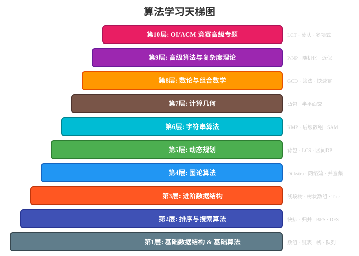

i

# 算法学习教程 (Algorithm Learning Tutorial)

> 从零开始，轻松掌握算法与数据结构！综合整理计算机数据结构与算法体系，覆盖信息学竞赛（OI/NOIP/ACM-ICPC）与 LeetCode 面试算法所需知识体系。

欢迎来到算法学习教程！本教程专为编程初学者和希望巩固算法基础的开发者设计。我们采用**通俗易懂**的语言、**丰富的 Python 代码示例**和**生动的图解**，帮助你真正理解算法的核心思想，而不是死记硬背。

---

## 教程特色

- ✅ **中文讲解** — 消除语言障碍，用最直白的方式讲解
- ✅ **Python 代码** — 所有示例均用 Python 实现，可直接运行
- ✅ **图文并茂** — 关键概念配有 SVG 图解，帮助理解
- ✅ **由浅入深** — 从零开始，循序渐进
- ✅ **实战练习** — 每章配有练习题，巩固所学知识
- ✅ **LeetCode 风格** — 题目贴近面试，学以致用

> **算法学习天梯图**：从基础到高级，每一步都踩在坚实的阶梯上。下图展示了完整的算法学习路径，帮助你明确当前所处阶段和下一步目标。



---

## 如何使用本教程

### 1️⃣ 按顺序阅读

建议从第 01 章开始，按顺序学习。每章都建立在前面章节的基础上。

### 2️⃣ 运行代码示例

每个章节都包含完整的 Python 代码。你可以直接运行：

```bash
# 在 Python 环境中运行代码示例
python3 -c "print('Hello, Algorithm!')"
```

建议打开 Python 交互式环境，边学边试：

```bash
python3
>>> # 在这里输入代码示例，观察输出
```

### 3️⃣ 完成练习题

每章末尾有 3 道练习题。**强烈建议**先独立思考，尝试自己写出代码，再参考答案。

### 4️⃣ 动手画图

遇到复杂的数据结构（如链表、树、图），**在纸上画出来**是最高效的理解方式。

---

## 前置知识

本教程假设你已经具备以下基础：

- **Python 基础语法**：变量、数据类型、条件判断、循环、函数定义
- **基本编程概念**：递归、面向对象编程基础
- **数学基础**：对数的概念、基本代数运算

> 💡 如果你还不熟悉 Python，推荐先学习 Python 基础教程，再回来学习本教程。

---

## 学习建议

| 建议                   | 说明                                   |
| ---------------------- | -------------------------------------- |
| 🎯**动手实践**   | 不要只看不写，亲自敲一遍代码           |
| 📝**做笔记**     | 用自己的话总结算法思路                 |
| 🔄**反复复习**   | 算法学习需要反复理解和练习             |
| 🤔**思考为什么** | 理解"为什么这样设计"比"记住结论"更重要 |
| 💬**与人讨论**   | 尝试向别人解释，是检验理解的最好方式   |

---

## 章节总览

本教程共包含 **14 个章节**，覆盖前置数学基础到 OI/ACM 竞赛高级专题：

| #  | 章节                                                | 级别    | 简介                                                       |
| -- | --------------------------------------------------- | ------- | ---------------------------------------------------------- |
| — | [数学基础](./00_数学基础.md)                         | 前置    | 初等数学、离散数学、线性代数、概率论、数论、博弈论、自动机 |
| — | [编程基础](./00_编程基础.md)                         | 第零层  | 编程语言选择、IO、调试、复杂度分析                         |
| 01 | [算法基础与复杂度分析](./01_算法基础与复杂度分析.md) | 第零层  | 什么是算法？时间/空间复杂度、大 O 表示法、常见复杂度分析   |
| 02 | [基础数据结构](./02_基础数据结构.md)                 | 第一层  | 数组、链表、栈、队列、哈希表、堆、单调栈/队列              |
| 03 | [排序与搜索](./03_排序与搜索.md)                     | 第二层  | 11 种排序算法、二分搜索、DFS/BFS、回溯法                   |
| 04 | [进阶数据结构](./04_进阶数据结构.md)                 | 第三层  | 二叉树、BST、Trie、并查集、线段树、树状数组、布隆过滤器    |
| 05 | [图论算法](./05_图论算法.md)                         | 第四层  | 图的表示、最短路、MST、拓扑排序、二分图、SCC               |
| 06 | [动态规划](./06_动态规划.md)                         | 第五层  | 10 个经典 DP 问题、背包问题、5 种 DP 模式                  |
| 07 | [字符串算法](./07_字符串算法.md)                     | 第六层  | KMP、Rabin-Karp、Z 算法、Manacher、Trie                    |
| 08 | [数论与组合数学](./08_数论与组合数学.md)             | 第七层  | 欧几里得、筛法、CRT、矩阵快速幂、卡特兰数、容斥            |
| 09 | [计算几何](./09_计算几何.md)                         | 第八层  | 向量、凸包、线段相交、最近点对、旋转卡壳                   |
| 10 | [高级专题](./10_高级专题.md)                         | 第九层  | 位运算、贪心、分治、LRU、面试模式总结                      |
| 11 | [高级算法与复杂度理论](./11_高级算法与复杂度理论.md) | 第九层  | 复杂度理论、近似算法、随机化算法、启发式算法               |
| 12 | [OI/ACM 竞赛高级专题](./12_OI竞赛高级专题.md)        | 第十层  | 高级数据结构、竞赛题型、竞赛数学                           |
| 13 | [人工智能](./11_人工智能.md)                         | AI 专题 | AI 发展历史、ML/DL 算法、强化学习、大模型                  |

---

## 复杂度速查表（快速参考）

> **复杂度曲线图**：不同算法复杂度随数据规模增长的趋势一目了然，帮助你直观理解大 O 表示法的实际意义。


### 数据结构操作复杂度

| 数据结构   |     访问     |     查找     |     插入     |     删除     |
| ---------- | :-----------: | :-----------: | :-----------: | :-----------: |
| 数组       |   $O(1)$   |   $O(n)$   |   $O(n)$   |   $O(n)$   |
| 链表       |   $O(n)$   |   $O(n)$   |   $O(1)$   |   $O(1)$   |
| 栈         |   $O(n)$   |   $O(n)$   |   $O(1)$   |   $O(1)$   |
| 队列       |   $O(n)$   |   $O(n)$   |   $O(1)$   |   $O(1)$   |
| 哈希表     |  $O(1)^*$  |  $O(1)^*$  |  $O(1)^*$  |  $O(1)^*$  |
| 二叉搜索树 | $O(\log n)$ | $O(\log n)$ | $O(\log n)$ | $O(\log n)$ |

> *注：哈希表平均情况为 $O(1)$，最坏情况为 $O(n)$

### 常见复杂度对应数据规模

| 复杂度          | 可处理规模        | 典型算法           |
| --------------- | ----------------- | ------------------ |
| $O(n!)$       | $n \le 12$      | 暴力枚举全排列     |
| $O(2^n)$      | $n \le 20$      | 状态压缩 DP        |
| $O(n^3)$      | $n \le 100$     | Floyd-Warshall     |
| $O(n^2)$      | $n \le 1000$    | 冒泡排序、朴素 DP  |
| $O(n \log n)$ | $n \le 10^5$    | 归并排序、Dijkstra |
| $O(n)$        | $n \le 10^7$    | 线性扫描、前缀和   |
| $O(\log n)$   | $n \le 10^{18}$ | 二分查找、GCD      |

---

# 算法学习天梯图 — 知识体系总览

> 以下为完整的算法知识体系，从前置数学基础到 OI/ACM 竞赛高级专题，覆盖 10 个层级。

## 1. 前置数学基础

> 信息学竞赛和 LeetCode 所依赖的数学基础，按重要程度排序

### 1.1 初等数学（必备）

| 知识点                  | 说明                               | 关联内容             |
| ----------------------- | ---------------------------------- | -------------------- |
| 四则运算与模运算        | 基本算术运算、取模运算             | 快速幂、大数运算     |
| 最大公约数 / 最小公倍数 | 欧几里得算法（辗转相除法）         | 扩展欧几里得、数论   |
| 质数判断与分解          | 试除法、埃氏筛、线性筛             | 数论基础             |
| 排列组合                | 加法原理、乘法原理、排列数、组合数 | 动态规划、概率       |
| 容斥原理                | 排容原理（Inclusion-Exclusion）    | 组合数学、计数问题   |
| 数列                    | 等差数列、等比数列、斐波那契数列   | 动态规划、数学归纳   |
| 不等式                  | 均值不等式、柯西不等式             | 算法分析、复杂度证明 |

### 1.2 离散数学（核心基础）

| 知识点         | 说明                       | 关联内容         |
| -------------- | -------------------------- | ---------------- |
| 逻辑与布尔代数 | 与、或、非、异或、蕴含     | 位运算、条件判断 |
| 集合论         | 集合运算、子集、笛卡尔积   | 状态空间、图论   |
| 关系与函数     | 等价关系、偏序关系、映射   | 哈希表、图论     |
| 图论基础       | 图、树、度、路径、连通性   | 所有图算法       |
| 计数原理       | 鸽巢原理、多项式系数       | 组合数学         |
| 生成函数       | 普通生成函数、指数生成函数 | 组合计数、递推   |
| 递推关系       | 齐次/非齐次线性递推        | 动态规划、数列   |

### 1.3 线性代数（重要）

| 知识点           | 说明                     | 关联内容             |
| ---------------- | ------------------------ | -------------------- |
| 矩阵与向量       | 矩阵运算、矩阵乘法、转置 | 矩阵快速幂、状态转移 |
| 行列式           | 行列式计算、性质         | 线性方程组           |
| 线性方程组       | 高斯消元法               | 数值计算、图论       |
| 向量空间         | 线性相关、基、维数       | 线性基               |
| 特征值与特征向量 | 谱分解                   | 图论谱分析、PageRank |

### 1.4 概率论与数理统计（LeetCode 高频）

| 知识点           | 说明                         | 关联内容            |
| ---------------- | ---------------------------- | ------------------- |
| 古典概型         | 等可能事件、排列组合计数     | 概率 DP             |
| 条件概率与贝叶斯 | 全概率公式、贝叶斯公式       | 机器学习基础        |
| 期望与方差       | 线性性、全期望公式           | 期望 DP、随机化算法 |
| 常见分布         | 二项分布、泊松分布、均匀分布 | 随机化算法分析      |
| 马尔可夫链       | 状态转移、稳态分布           | 概率 DP、强化学习   |

### 1.5 数论基础（OI 竞赛核心）

| 知识点                | 说明                   | 关联内容       |
| --------------------- | ---------------------- | -------------- |
| 同余理论              | 模运算、同余类、剩余系 | 加密算法、哈希 |
| 欧拉定理 / 费马小定理 | 欧拉函数、降幂         | RSA、数论算法  |
| 中国剩余定理          | 一次同余方程组         | 大整数运算     |
| 卢卡斯定理            | 大组合数取模           | 组合计数       |
| 莫比乌斯反演          | 数论函数、卷积         | 竞赛高级数论   |
| 二次剩余              | 模平方根               | Cipolla 算法   |
| 原根与指标            | 循环群、离散对数       | 大步小步算法   |

### 1.6 数学分析（了解即可）

| 知识点           | 说明           | 关联内容           |
| ---------------- | -------------- | ------------------ |
| 极限、导数、积分 | 基本概念       | 数值计算、优化     |
| 泰勒展开         | 函数近似       | 多项式逼近         |
| 傅里叶变换       | 时频域变换     | FFT 快速傅里叶变换 |
| 凸函数与凸优化   | 凸性、梯度下降 | 机器学习、算法优化 |

### 1.7 博弈论（竞赛重要）

| 知识点                             | 说明                | 关联内容        |
| ---------------------------------- | ------------------- | --------------- |
| **Nim 博弈**                 | 异或和为 0 则后手赢 | 博弈 DP 基础    |
| **SG 函数 (Sprague-Grundy)** | 任意博弈 → Nim 堆  | 组合博弈论      |
| **巴什博弈 (Bash)**          | 一次取 1~m 个       | 简单博弈        |
| **威佐夫博弈 (Wythoff)**     | 两堆轮流取          | 黄金分割        |
| **斐波那契博弈**             | 取石子规则          | 斐波那契数列    |
| **公平组合游戏 (ICG)**       | 双方相同操作        | SG 理论基础     |
| **非公平组合游戏**           | 双方不同操作        | 策略 stolen     |
| **反常 Nim**                 | 取最后一个的输      | Anti-Nim        |
| **极大极小算法 (Minimax)**   | 两人零和博弈        | 五子棋、象棋 AI |
| **Alpha-Beta 剪枝**          | Minimax 优化        | 棋类 AI         |

### 1.8 形式语言与自动机（了解）

| 知识点                         | 说明            | 关联内容           |
| ------------------------------ | --------------- | ------------------ |
| **正则语言**             | 正则表达式      | 字符串匹配         |
| **DFA/NFA**              | 有限状态机      | 字符串自动机       |
| **上下文无关文法 (CFG)** | 语法分析        | 编译器、表达式解析 |
| **下推自动机 (PDA)**     | 栈式自动机      | 语法分析           |
| **图灵机**               | 通用计算模型    | 可计算性           |
| **乔姆斯基层级**         | 语言分类        | 0/1/2/3 型文法     |
| **停机问题**             | 不可判定        | 计算理论           |
| **Kleene 定理**          | 正则表达式 = FA | 自动机等价性       |

---

## 2. 第零层：编程基础与语言工具

### 2.1 编程语言选择

| 语言             | OI/竞赛       | LeetCode | 特点                           |
| ---------------- | ------------- | -------- | ------------------------------ |
| **C++**    | ⭐⭐⭐ (首选) | ⭐⭐⭐   | STL 丰富，性能最优，竞赛标配   |
| **Python** | ⭐⭐          | ⭐⭐⭐   | 简洁，适合快速实现，但性能有限 |
| **Java**   | ⭐⭐          | ⭐⭐⭐   | 面向对象，工程性强             |
| **Rust**   | ⭐            | ⭐⭐     | 内存安全，现代语言             |

### 2.2 必备语言特性

- **C++**: STL (vector, set, map, unordered_map, queue, stack, priority_queue, algorithm, bitset, string)
- **Python**: collections, itertools, math, functools, bisect, heapq, sortedcontainers
- **Java**: java.util.*, java.lang.*, java.io.*, java.math.*

### 2.3 输入输出与调试

- 快速 IO（C++ 关同步、Python sys.stdin.buffer）
- 文件 IO（freopen / redirect）
- 调试技巧（断点、日志、对拍、随机数据生成）
- 测试框架（unittest, pytest, Google Test）

### 2.4 时间复杂度分析

- 大 O 表示法：$O(1)$, $O(\log n)$, $O(n)$, $O(n \log n)$, $O(n^2)$, $O(2^n)$, $O(n!)$
- 空间复杂度分析
- 常见复杂度对应数据规模：
  - $n \le 12$: $O(n!)$
  - $n \le 20$: $O(2^n)$
  - $n \le 100$: $O(n^3)$
  - $n \le 1000$: $O(n^2)$
  - $n \le 10^5$: $O(n \log n)$
  - $n \le 10^7$: $O(n)$

---

## 3. 第一层：基础数据结构 & 基础算法

### 3.1 基础数据结构

| 数据结构                                   | 核心操作        | 复杂度                             | 典型应用                       |
| ------------------------------------------ | --------------- | ---------------------------------- | ------------------------------ |
| **数组 (Array)**                     | 随机读写        | $O(1)$                           | 所有基础场景                   |
| **链表 (Linked List)**               | 插入/删除       | $O(1)$（已知位置）               | LRU 缓存、多项式运算           |
| 单向链表、双向链表、循环链表               | 查找            | $O(n)$                           |                                |
| **栈 (Stack)**                       | push/pop/top    | $O(1)$                           | 括号匹配、表达式求值、DFS      |
| **队列 (Queue)**                     | enqueue/dequeue | $O(1)$                           | BFS、缓存、任务调度            |
| **双端队列 (Deque)**                 | 两端操作        | $O(1)$                           | 滑动窗口、单调队列             |
| **哈希表 (Hash Table)**              | 插入/删除/查找  | $O(1)$ 平均                      | 缓存、去重、计数               |
| 哈希冲突处理：拉链法/开放地址法            | 最坏$O(n)$    |                                    |                                |
| **集合 (Set)**                       | 增删查          | $O(\log n)$ / $O(1)$           | 去重、存在性判断               |
| **优先队列 (Priority Queue / Heap)** | push/pop_top    | $O(\log n)$                      | 堆排序、Dijkstra、Huffman      |
| 二叉堆、斐波那契堆、左偏树                 | top             | $O(1)$                           |                                |
| **单调栈 (Monotone Stack)**          | 维护单调性      | $O(n)$ 均摊                      | 下一个更大元素、柱状图最大矩形 |
| **单调队列 (Monotone Queue)**        | 维护窗口最值    | $O(n)$ 均摊                      | 滑动窗口最大值、DP 优化        |
| **ST 表 (Sparse Table)**             | 静态 RMQ        | 构建$O(n \log n)$, 查询 $O(1)$ | 区间最值查询（不可修改）       |

### 3.2 基础算法

| 算法                                          | 思想               | 复杂度                      | 典型问题                    |
| --------------------------------------------- | ------------------ | --------------------------- | --------------------------- |
| **穷举法**                              | 枚举所有可能       | 视问题而定                  | 密码破解、暴力搜索          |
| **递归**                                | 函数调用自身       | 视问题而定                  | 阶乘、斐波那契、汉诺塔      |
| **迭代**                                | 循环重复           | 视问题而定                  | 数列求和、数值计算          |
| **位运算**                              | 二进制位操作       | $O(1)$                    | 状态压缩、权限管理          |
| 与(&)、或(\|)、异或(^)、取反(~)、移位(<<, >>) |                    |                             |                             |
| **双指针**                              | 两个指针协同       | $O(n)$                    | 两数之和、链表环检测        |
| **滑动窗口**                            | 维护窗口区间       | $O(n)$                    | 子串/子数组问题             |
| **前缀和 & 差分**                       | 预处理区间和       | 构建$O(n)$, 查询 $O(1)$ | 区间求和、区间修改          |
| **二分查找**                            | 有序集合减半查找   | $O(\log n)$               | 查找、求极值、答案二分      |
| **三分查找**                            | 凸函数极值搜索     | $O(\log n)$               | 单峰函数极值                |
| **快速幂**                              | 二进制幂运算       | $O(\log n)$               | 大数幂、矩阵幂              |
| **贪心算法**                            | 局部最优解         | 视问题而定                  | 活动选择、Huffman 编码      |
| **分治法**                              | 分而治之           | 视问题而定                  | 归并排序、快速排序、FFT     |
| **倍增法**                              | 成倍增长，逐步逼近 | $O(\log n)$               | LCA 倍增、RMQ、后缀数组倍增 |
| **尺取法**                              | 双指针维护区间     | $O(n)$                    | 连续子序列满足条件          |
| **折半枚举 (Meet in the Middle)**       | 双向搜索，中间合并 | $2^{n/2}$                 | 双向 BFS、双向 DFS          |
| **构造法**                              | 直接构造解         | 视问题而定                  | 构造满足条件的序列/图       |
| **模拟**                                | 按题意逐步执行     | 视问题而定                  | 模拟题、大模拟              |

### 3.3 基础算法示例

```python
# 二分查找
def binary_search(arr, target):
    l, r = 0, len(arr) - 1
    while l <= r:
        mid = (l + r) // 2
        if arr[mid] == target: return mid
        if arr[mid] < target: l = mid + 1
        else: r = mid - 1
    return -1

# 快速幂
def fast_pow(a, b, mod):
    res = 1
    while b:
        if b & 1: res = res * a % mod
        a = a * a % mod
        b >>= 1
    return res

# 前缀和
def prefix_sum(arr):
    n = len(arr)
    pre = [0] * (n + 1)
    for i in range(n):
        pre[i + 1] = pre[i] + arr[i]
    return pre  # sum(l, r) = pre[r+1] - pre[l]
```

---

## 4. 第二层：排序与搜索算法

### 4.1 排序算法总览

| 排序算法                            | 平均时间复杂度              | 最坏时间复杂度    | 空间复杂度    | 稳定性 | 特点                         |
| ----------------------------------- | --------------------------- | ----------------- | ------------- | ------ | ---------------------------- |
| **冒泡排序**                  | $O(n^2)$                  | $O(n^2)$        | $O(1)$      | ✅     | 教学用，简单                 |
| **选择排序**                  | $O(n^2)$                  | $O(n^2)$        | $O(1)$      | ❌     | 不稳定，交换少               |
| **插入排序**                  | $O(n^2)$                  | $O(n^2)$        | $O(1)$      | ✅     | 小规模高效                   |
| **希尔排序**                  | $O(n \log n) \sim O(n^2)$ | $O(n^2)$        | $O(1)$      | ❌     | 插入排序改进                 |
| **归并排序**                  | $O(n \log n)$             | $O(n \log n)$   | $O(n)$      | ✅     | 分治思想，稳定               |
| **快速排序**                  | $O(n \log n)$             | $O(n^2)$        | $O(\log n)$ | ❌     | 实际最快之一                 |
| **堆排序**                    | $O(n \log n)$             | $O(n \log n)$   | $O(1)$      | ❌     | 原地排序                     |
| **计数排序**                  | $O(n + k)$                | $O(n + k)$      | $O(k)$      | ✅     | 整数排序，范围小             |
| **桶排序**                    | $O(n + k)$                | $O(n^2)$        | $O(n + k)$  | ✅     | 均匀分布高效                 |
| **基数排序**                  | $O(n \times k)$           | $O(n \times k)$ | $O(n + k)$  | ✅     | 按位排序                     |
| **Timsort**                   | $O(n \log n)$             | $O(n \log n)$   | $O(n)$      | ✅     | Python/Java 内置             |
| **内省排序**                  | $O(n \log n)$             | $O(n \log n)$   | $O(\log n)$ | ❌     | C++ std::sort 实现           |
| **外排序**                    | $O(n \log n)$             | $O(n \log n)$   | $O(n)$      | ✅     | 大数据无法全部载入内存时使用 |
| **多路归并排序**              | $O(n \log k)$             | $O(n \log k)$   | $O(k)$      | ✅     | 外排序、K 路归并             |
| **Patial Sort / nth_element** | $O(n)$                    | $O(n)$          | $O(1)$      | ❌     | STL 中部分排序、求第 K 大    |
| **归并树/堆排序求第 K 大**    | $O(n + k \log n)$         | -                 | $O(n)$      | -      | Top-K 问题                   |

### 4.2 搜索算法

| 搜索算法                       | 复杂度        | 空间       | 应用场景             |
| ------------------------------ | ------------- | ---------- | -------------------- |
| **线性搜索**             | $O(n)$      | $O(1)$   | 无序数据             |
| **二分搜索**             | $O(\log n)$ | $O(1)$   | 有序数据             |
| **三分搜索**             | $O(\log n)$ | $O(1)$   | 单峰函数             |
| **广度优先搜索 (BFS)**   | $V+E$       | $V$      | 最短路径、拓扑       |
| **深度优先搜索 (DFS)**   | $V+E$       | $V$      | 连通性、拓扑排序     |
| **回溯法**               | 指数级        | $解空间$ | 组合问题、约束满足   |
| **分支定界**             | 指数级        | $解空间$ | 优化问题、整数规划   |
| **A\* 搜索**             | $E$         | $V$      | 启发式搜索、路径规划 |
| **迭代加深 DFS (IDDFS)** | $b^d$       | $d$      | 大状态空间搜索       |

### 4.3 LeetCode 高频排序 & 搜索题型

- 排序：合并区间、第 K 大元素、颜色分类、最小差
- 二分：旋转排序数组、搜索二维矩阵、寻找峰值
- 搜索：岛屿数量、单词搜索、组合总和、全排列、N 皇后

---

## 5. 第三层：进阶数据结构

### 5.1 树形数据结构

| 数据结构                                    | 核心特性                    | 操作复杂度                       | 应用场景                   |
| ------------------------------------------- | --------------------------- | -------------------------------- | -------------------------- |
| **二叉树 (Binary Tree)**              | 每个节点最多两个孩子        | 遍历$O(n)$                     | 基础树结构                 |
| **二叉搜索树 (BST)**                  | 左 < 根 < 右                | 平均$O(\log n)$, 最坏 $O(n)$ | 动态集合                   |
| **平衡树 (Balanced Tree)**            | 自动平衡                    | $O(\log n)$                    | 保证最坏情况性能           |
| - AVL 树                                    | 严格平衡（高度差$\le 1$） | $O(\log n)$                    | 查询密集型                 |
| - 红黑树 (Red-Black Tree)                   | 近似平衡                    | $O(\log n)$                    | C++ std::map/set 实现      |
| - 替罪羊树 (Scapegoat Tree)                 | 重构平衡                    | $O(\log n)$                    | 实现简单                   |
| - 伸展树 (Splay Tree)                       | 最近访问优先                | 摊还$O(\log n)$                | 缓存、LCT 基础             |
| - Treap                                     | 树+堆                       | $O(\log n)$                    | 随机化平衡树               |
| **B-树/B+树**                         | 多路平衡搜索                | $O(\log n)$                    | 数据库索引、文件系统       |
| **线段树 (Segment Tree)**             | 区间查询/修改               | $O(\log n)$                    | 区间最值、区间和、区间更新 |
| **树状数组 (Fenwick Tree / BIT)**     | 前缀和                      | $O(\log n)$                    | 单点更新、区间查询         |
| **字典树 (Trie)**                     | 前缀匹配                    | $\|s\|$                        | 字符串查找、前缀匹配       |
| **并查集 (Disjoint Set Union / DSU)** | 连通性                      | $O(\alpha(n))$ 近似 $O(1)$   | 连通分量、最小生成树       |
| **笛卡尔树 (Cartesian Tree)**         | 堆+BST 性质                 | $O(n)$ 构建                    | RMQ 问题                   |
| **左偏树 (Leftist Tree)**             | 可并堆                      | $O(\log n)$                    | 可合并优先队列             |
| **KD 树 (K-D Tree)**                  | 多维空间划分                | 平均$O(\log n)$                | 多维搜索、最近邻           |

### 5.2 线段树 & 树状数组详解

**树状数组 (Fenwick Tree)**：

- 只支持单点更新 + 前缀和查询
- 代码简洁，常数极小
- 可用于求逆序对

**线段树 (Segment Tree)**：

- 支持区间查询 + 区间更新（懒标记）
- 可扩展性强：区间最值、区间和、区间 gcd、区间异或等
- 动态开点线段树（值域很大时）
- 可持久化线段树（主席树，支持历史版本查询）

### 5.3 并查集详解

**并查集（Disjoint Set Union, DSU）** 是一种用于处理不相交集合的合并与查询问题的数据结构。它支持两种核心操作：

- **查找（Find）**：确定元素属于哪个集合，通常通过路径压缩优化到近似 $O(1)$
- **合并（Union）**：将两个集合合并为一个，通常通过按秩/按大小合并优化到近似 $O(1)$

并查集广泛应用于连通性判断、最小生成树（Kruskal）、社交网络中的朋友圈检测、以及离线查询问题中。配合路径压缩和按秩合并后，单次操作的均摊时间复杂度为 $O(\alpha(n))$，其中 $\alpha$ 为阿克曼函数的反函数，在合理数据范围内可视为常数。

### 5.4 哈希相关

| 结构                                      | 特点              | 应用             |
| ----------------------------------------- | ----------------- | ---------------- |
| **哈希表**                          | $O(1)$ 平均操作 | 缓存、计数、去重 |
| **布隆过滤器 (Bloom Filter)**       | 可能存在误判      | 缓存穿透防护     |
| **一致性哈希 (Consistent Hashing)** | 最小化重哈希      | 分布式缓存       |
| **完美哈希**                        | $O(1)$ 无冲突   | 静态字典         |

### 5.5 LeetCode 高频进阶数据结构题型

- 并查集：连通网络的操作次数、账户合并、冗余连接
- 线段树：区间和的个数、我的日程安排表
- 字典树：实现 Trie、单词搜索 II、回文对
- 堆：合并 K 个升序链表、数据流的中位数
- 哈希：LRU 缓存、LFU 缓存

---

## 6. 第四层：图论算法

### 6.1 图的基本概念

- 有向图 vs 无向图
- 有权图 vs 无权图
- 稀疏图 vs 稠密图
- 连通图、强连通、弱连通
- 环、路径、树、森林
- 度、入度、出度
- 子图、补图、完全图、二分图

### 6.2 图的存储结构

| 存储方式   | 空间       | 适合场景                          |
| ---------- | ---------- | --------------------------------- |
| 邻接矩阵   | $O(V^2)$ | 稠密图、快速判断边存在性          |
| 邻接表     | $V+E$    | 稀疏图，最常用                    |
| 边集数组   | $E$      | Kruskal 算法                      |
| 链式前向星 | $V+E$    | C++ 竞赛常用，高效                |
| 十字链表   | $V+E$    | 有向图，正反双向遍历、求入度/出度 |
| 邻接多重表 | $V+E$    | 无向图，频繁增删边、一致性更好    |

### 6.3 图遍历

| 算法                 | 复杂度  | 用途                     |
| -------------------- | ------- | ------------------------ |
| 深度优先搜索 (DFS)   | $V+E$ | 连通性、拓扑排序、环检测 |
| 广度优先搜索 (BFS)   | $V+E$ | 无权图最短路、层序遍历   |
| 迭代加深搜索 (IDDFS) | $b^d$ | 大空间搜索               |

### 6.4 最短路径

| 算法                     | 限制             | 复杂度                 | 特点                                            |
| ------------------------ | ---------------- | ---------------------- | ----------------------------------------------- |
| **Dijkstra**       | 无负权边         | $O((V+E) \log V)$    | 单源最短路，最常用                              |
| **Bellman-Ford**   | 可检测负环       | $VE$                 | 可处理负权边                                    |
| **SPFA**           | 有负权边         | 平均$E$，最坏 $VE$ | 队列优化的 Bellman-Ford                         |
| **Floyd-Warshall** | 无负环           | $V^3$                | 全源最短路，动态规划                            |
| **Johnson**        | 含负权（无负环） | $VE + V E \log V$    | 重新赋权后对每个点跑 Dijkstra，稀疏图优于 Floyd |
| **A\***            | 启发式搜索       | $E$                  | 带启发函数的最短路                              |

### 6.5 最小生成树

| 算法               | 复杂度       | 策略          | 特点         |
| ------------------ | ------------ | ------------- | ------------ |
| **Kruskal**  | $E \log E$ | 贪心+并查集   | 边稀疏时高效 |
| **Prim**     | $E \log V$ | 贪心+优先队列 | 边稠密时高效 |
| **Borůvka** | $E \log V$ | 并行化        | 分布式计算   |

### 6.6 网络流

| 算法                                  | 复杂度                      | 说明                      |
| ------------------------------------- | --------------------------- | ------------------------- |
| **Ford-Fulkerson**              | $E \times \text{maxflow}$ | 增广路思想                |
| **Edmonds-Karp**                | $VE^2$                    | BFS 找增广路              |
| **Dinic**                       | $V^2E$ 或 $E\sqrt{V}$   | 分层图+当前弧优化，最常用 |
| **ISAP**                        | $V^2E$                    | 改进版 Dinic              |
| **最小费用最大流**              | $V^2E^2$                  | 费用流问题                |
| **二分图最大匹配 (匈牙利算法)** | $VE$                      | 二分图匹配                |
| **KM 算法**                     | $V^3$                     | 带权二分图最大匹配        |

### 6.7 其他图论算法

| 算法                                                                    | 复杂度                                     | 说明                       |
| ----------------------------------------------------------------------- | ------------------------------------------ | -------------------------- |
| **拓扑排序**                                                      | $V+E$                                    | DAG 线性排序，BFS/DFS 均可 |
| **强连通分量 (SCC, Tarjan/Kosaraju)**                             | $V+E$                                    | 缩点、2-SAT                |
| **割点与桥 (Tarjan)**                                             | $V+E$                                    | 无向图连通性               |
| **双连通分量 (BCC)**                                              | $V+E$                                    | 点/边双连通                |
| **欧拉路径/回路**                                                 | $V+E$                                    | 一笔画问题                 |
| **哈密顿路径/回路**                                               | NP-hard                                    | 旅行商问题                 |
| **2-SAT**                                                         | $V+E$                                    | 合取范式可满足性           |
| **弦图判定**                                                      | $V+E$                                    | 完美消除序列               |
| **树的重心/直径/最近公共祖先 (LCA)**                              | $O(n \log n)$ 预处理，$O(\log n)$ 查询 | 倍增/树剖                  |
| **树链剖分 (HLD)**                                                | $O(n \log n)$                            | 树上路径查询               |
| **树的先序/后序性质**                                             | $O(n)$                                   | DFS 序、BFS 序、欧拉序     |
| **虚树 (Virtual Tree)**                                           | $k \log k$                               | 关键点构成的压缩树         |
| **树分治 (点分治/边分治)**                                        | $O(n \log n)$                            | 树上路径统计               |
| **树分块**                                                        | $n \sqrt{n}$                             | 树上分块查询               |
| **DSU on Tree (启发式合并)**                                      | $O(n \log n)$                            | 子树信息合并               |
| **长链剖分**                                                      | $O(n)$                                   | 与深度相关的子树查询       |
| **差分约束系统**                                                  | $VE$                                     | 不等式组 → 最短路         |
| **K 短路**                                                        | $K V \log V$                             | A\* + 反向 Dijkstra        |
| **最大流应用：二分图匹配/最小路径覆盖/最大独立集/最大权闭合子图** | 视建模而定                                 | 网络流建模                 |
| **上下界网络流**                                                  | $V^2E$                                   | 无源汇/有源汇上下界最大流  |
| **朱刘算法 (最小树形图)**                                         | $VE$                                     | 有向图最小生成树           |
| **树形 DP 求直径/重心**                                           | $O(n)$                                   | 树上两次 DFS / DP          |

### 6.7.1 图论经典模型与定理

| 定理/模型                               | 说明                            | 应用               |
| --------------------------------------- | ------------------------------- | ------------------ |
| **最大流最小割定理**              | 最大流 = 最小割                 | 网络流理论基础     |
| **霍尔定理 (Hall's Theorem)**     | 二分图完备匹配条件              | 二分图匹配判定     |
| **柯尼希定理 (König's Theorem)** | 二分图最大匹配 = 最小点覆盖     | 二分图点边覆盖     |
| **Dilworth 定理**                 | 最小链覆盖 = 最长反链           | 偏序集分解         |
| **矩阵树定理**                    | 生成树计数 = 拉普拉斯矩阵余子式 | 生成树计数         |
| **BEST 定理**                     | 欧拉回路计数                    | 有向图欧拉回路计数 |
| **五色定理 / 四色定理**           | 平面图着色                      | 平面图染色         |
| **拉姆齐定理 (Ramsey)**           | 大图中必现结构                  | 极图理论           |

### 6.8 LeetCode 高频图论题型

- 图遍历：克隆图、课程表、判断二分图
- 最短路：网络延迟时间、单词接龙
- 最小生成树：连接所有点的最小费用
- 拓扑排序：课程表 II、外星词典
- 并查集：冗余连接、等式方程的可满足性
- 二分图：可能的二分法

---

## 7. 第五层：动态规划

### 7.1 动态规划基础

**核心概念**：

- 状态定义
- 状态转移方程
- 初始状态 / 边界条件
- 最优子结构
- 重叠子问题
- 无后效性

**实现方式**：

- 自顶向下（记忆化搜索，Memoization）
- 自底向上（表格法，Tabulation）

### 7.2 动态规划分类

| 类型                         | 说明                    | 经典问题                       |
| ---------------------------- | ----------------------- | ------------------------------ |
| **线性 DP**            | 一维状态递推            | 斐波那契、爬楼梯、最大子数组和 |
| **区间 DP**            | 区间作为状态            | 矩阵链乘、回文分割、石子合并   |
| **背包 DP**            | 组合优化                | 0-1 背包、完全背包、多重背包   |
| **树形 DP**            | 树上递推                | 树的最大独立集、树形背包       |
| **状态压缩 DP**        | 位掩码表示状态          | 旅行商问题(TSP)、集合覆盖      |
| **数位 DP**            | 按位统计                | 数字计数、不含 49 的数字       |
| **概率/期望 DP**       | 随机过程                | 期望步数、赌徒破产             |
| **计数 DP**            | 方案数统计              | 不同路径、组合数               |
| **博弈 DP**            | 两人博弈                | 取石子游戏、Nim 游戏           |
| **插头 DP**            | 轮廓线状态              | 网格图连通性问题、铺砖问题     |
| **斜率优化 DP**        | 凸包优化                | 任务安排、玩具装箱             |
| **四边形不等式优化**   | 决策单调性              | 石子合并、最优二叉搜索树       |
| **状压 DP 进阶**       | 状压 + BFS / 状压 + DP  | 最短哈密顿路、关灯问题         |
| **DAG 上 DP**          | 拓扑序 DP               | 最长路、矩形嵌套               |
| **图上 DP**            | 图上状态转移            | 最短路计数、Bellman-Ford DP    |
| **环形 DP**            | 环形结构处理            | 环形石子合并、环形数组         |
| **状压博弈 DP**        | 状压 + 博弈             | 记忆化博弈                     |
| **高维前缀和 DP**      | 子集 DP、超集 DP        | 子集枚举优化                   |
| **分治 DP (分治优化)** | 决策单调性 + 分治       | 线性 DP 优化                   |
| **数据结构优化 DP**    | 线段树/树状数组优化转移 | LIS、最长上升子序列变体        |
| **倍增 DP**            | 倍增思想 + DP           | LCA、稀疏表                    |

### 7.3 背包问题详解

| 类型                   | 状态转移                                    | 复杂度            |
| ---------------------- | ------------------------------------------- | ----------------- |
| **0-1 背包**     | dp[j] = max(dp[j], dp[j-w] + v)             | $nW$            |
| **完全背包**     | dp[j] = max(dp[j], dp[j-w] + v)（正序枚举） | $nW$            |
| **多重背包**     | 二进制拆分优化                              | $nW \log count$ |
| **分组背包**     | 每组最多选一个                              | $nW$            |
| **依赖背包**     | 树形依赖关系                                | $nW$            |
| **二维费用背包** | 两个维度的限制                              | $nW₁W₂$       |

### 7.4 经典 DP 问题

```python
# 最长递增子序列 (LIS) - $O(n \log n)$
def length_of_lis(nums):
    import bisect
    tails = []
    for x in nums:
        i = bisect.bisect_left(tails, x)
        if i == len(tails): tails.append(x)
        else: tails[i] = x
    return len(tails)

# 最长公共子序列 (LCS) - $nm$
def longest_common_subsequence(text1, text2):
    n, m = len(text1), len(text2)
    dp = [[0] * (m + 1) for _ in range(n + 1)]
    for i in range(n):
        for j in range(m):
            if text1[i] == text2[j]:
                dp[i+1][j+1] = dp[i][j] + 1
            else:
                dp[i+1][j+1] = max(dp[i][j+1], dp[i+1][j])
    return dp[n][m]

# 编辑距离
def edit_distance(word1, word2):
    n, m = len(word1), len(word2)
    dp = [[0] * (m + 1) for _ in range(n + 1)]
    for i in range(n + 1): dp[i][0] = i
    for j in range(m + 1): dp[0][j] = j
    for i in range(1, n + 1):
        for j in range(1, m + 1):
            if word1[i-1] == word2[j-1]:
                dp[i][j] = dp[i-1][j-1]
            else:
                dp[i][j] = 1 + min(dp[i-1][j], dp[i][j-1], dp[i-1][j-1])
    return dp[n][m]
```

### 7.5 LeetCode 高频 DP 题型

- 线性 DP：打家劫舍、最大子数组和、最长递增子序列
- 区间 DP：最长回文子串、戳气球
- 背包 DP：分割等和子集、零钱兑换、目标和
- 树形 DP：二叉树中的最大路径和、打家劫舍 III
- 状态压缩 DP：最短 Hamilton 路径
- 数位 DP：数字 1 的个数

---

## 8. 第六层：字符串算法

### 8.1 字符串匹配

| 算法                               | 预处理                         | 匹配            | 特点                   |
| ---------------------------------- | ------------------------------ | --------------- | ---------------------- |
| **朴素匹配**                 | $O(1)$                       | $O(nm)$       | 简单，最坏慢           |
| **KMP**                      | $O(m)$                       | $O(n)$        | 利用前缀函数，避免回溯 |
| **Boyer-Moore**              | $O(m+σ)$                    | $O(n)$ 平均   | 跳跃式匹配，实际高效   |
| **Rabin-Karp**               | $O(m)$                       | $O(n)$ 平均   | 哈希滚动匹配           |
| **Sunday**                   | $O(m)$                       | $O(n)$ 平均   | 比 BM 更简单           |
| **AC 自动机 (Aho-Corasick)** | $O(\sum \|\text{pattern}\|)$ | $O(n)$        | 多模式串匹配           |
| **后缀数组 (Suffix Array)**  | $O(n \log n)$                | $O(m \log n)$ | 字符串排序，多种应用   |
| **后缀自动机 (SAM)**         | $O(n)$                       | $O(m)$        | 在线构建，功能强大     |
| **Z 函数 (Z-algorithm)**     | $O(n)$                       | $O(n)$        | 字符串匹配、前缀       |
| **Manacher**                 | $O(n)$                       | $O(n)$        | 最长回文子串           |

### 8.2 字符串哈希

- 滚动哈希 (Rabin-Karp)
- 双哈希 (Double Hash)
- 哈希冲突处理

### 8.3 字符串其他算法

| 算法                           | 说明                      | 复杂度                       |
| ------------------------------ | ------------------------- | ---------------------------- |
| **最小表示法**           | 求循环字符串的最小字典序  | $O(n)$                     |
| **Lyndon 分解**          | 唯一分解为 Lyndon 词      | $O(n)$                     |
| **编辑距离**             | 字符串相似度              | $nm$                       |
| **最长公共子串**         | 后缀自动机/后缀数组       | $n+m$                      |
| **最长回文子串**         | Manacher 算法             | $O(n)$                     |
| **KMP 前缀函数**         | 求字符串的 border         | $O(n)$                     |
| **后缀树 (Suffix Tree)** | 后缀的树形结构，UKK 算法  | $O(n)$ 构建，$O(m)$ 查询 |
| **回文自动机 (PAM)**     | 回文串的自动机            | $O(n)$ 构建                |
| **后缀平衡树**           | 动态维护后缀字典序        | $\log n$ 操作              |
| **广义后缀自动机**       | 多串 SAM                  | $\sum \|s\|$               |
| **广义后缀树**           | 多串后缀树                | $\sum \|s\|$               |
| **AC 自动机上的 DP**     | AC 自动机 + 状态压缩 DP   | 文本生成问题                 |
| **exKMP (Z 算法变体)**   | 扩展 KMP                  | $n + m$                    |
| **字符串周期性质**       | border、周期、循环节      | $O(n)$                     |
| **exBSGS / exLucas**     | 扩展大步小步 / 扩展卢卡斯 | $\sqrt{p}$ / $p$         |

### 8.4 LeetCode 高频字符串题型

- 字符串匹配：实现 strStr()、重复叠加字符串匹配
- 回文：最长回文子串、回文子串计数
- 编辑距离：编辑距离、两个字符串的删除操作
- 字典树：单词搜索 II、词典中最长的单词
- 后缀：最短回文串

---

## 9. 第七层：计算几何

### 9.1 基础概念

| 概念                 | 说明              |
| -------------------- | ----------------- |
| 向量与点             | 二维/三维向量运算 |
| 叉积 (Cross Product) | 判断方向、面积    |
| 点积 (Dot Product)   | 投影、夹角        |
| 极角排序             | 按极角排序点      |
| 精度控制             | 浮点数比较、eps   |

### 9.2 常用算法

| 算法                                   | 复杂度            | 说明                     |
| -------------------------------------- | ----------------- | ------------------------ |
| **凸包 (Convex Hull)**           | $O(n \log n)$   | Graham Scan、Andrew 算法 |
| **旋转卡壳 (Rotating Calipers)** | $O(n)$          | 求凸包直径、最远点对     |
| **最近点对 (Closest Pair)**      | $O(n \log n)$   | 分治算法                 |
| **线段相交判断**                 | $O(1)$          | 快速排斥+跨立实验        |
| **多边形面积**                   | $O(n)$          | 鞋带公式                 |
| **点在多边形内**                 | $O(n)$          | 射线法/转角法            |
| **半平面交**                     | $O(n \log n)$   | 凸多边形交集             |
| **最小圆覆盖**                   | $O(n)$          | 随机增量法               |
| **三角剖分**                     | $O(n \log n)$   | Delaunay 三角剖分        |
| **Voronoi 图**                   | $O(n \log n)$   | 最近邻区域划分           |
| **闵可夫斯基和 (Minkowski Sum)** | $n + m$         | 两凸包的合并             |
| **凸多边形交**                   | $n + m$         | 两个凸多边形交集         |
| **自适应辛普森积分**             | $O(n)$          | 数值积分                 |
| **三维凸包**                     | $O(n \log n)$   | 三维凸壳                 |
| **圆的面积并/交**                | $O(n^2 \log n)$ | 圆系求交                 |
| **极角排序**                     | $O(n \log n)$   | 扫描线基础               |
| **直线与线段位置关系**           | $O(1)$          | 相交、共线、平行         |
| **圆与直线/圆与圆位置关系**      | $O(1)$          | 相切、相交、相离         |

### 9.3 OI 竞赛计算几何题型

- 凸包问题
- 半平面交
- 多边形切割
- 圆与多边形面积并
- 最小包围盒/圆
- 三维凸包

---

## 10. 第八层：数论与组合数学（竞赛核心）

### 10.1 数论算法

| 算法                                     | 用途                    | 复杂度                        |
| ---------------------------------------- | ----------------------- | ----------------------------- |
| **欧几里得算法 (GCD)**             | 最大公约数              | $O(\log \min(a,b))$         |
| **扩展欧几里得 (ExGCD)**           | 求解 ax+by=gcd(a,b)     | $O(\log \min(a,b))$         |
| **埃氏筛 (Sieve of Eratosthenes)** | 素数筛选                | $O(n \log \log n)$          |
| **线性筛 (欧拉筛)**                | 素数+积性函数           | $O(n)$                      |
| **欧拉函数**                       | 1~n 中与 n 互质的数     | $O(\sqrt{n})$ / $O(n)$ 筛 |
| **莫比乌斯函数**                   | 容斥                    | $O(n)$ 筛                   |
| **快速幂**                         | 幂运算                  | $O(\log n)$                 |
| **矩阵快速幂**                     | 线性递推加速            | $O(k^3 \log n)$             |
| **中国剩余定理 (CRT)**             | 同余方程组              | $O(n \log m)$               |
| **卢卡斯定理 (Lucas)**             | 大组合数取模            | $O(p)$ 预处理               |
| **大步小步算法 (BSGS)**            | 离散对数                | $\sqrt{p}$                  |
| **Pollard-Rho**                    | 大数分解                | $n^{1/4}$                   |
| **Miller-Rabin**                   | 素数判定                | $k \log^3 n$                |
| **二次剩余**                       | 模平方根                | $\log^2 p$                  |
| **原根**                           | 循环群生成元            | $\sqrt{p}$                  |
| **FFT / NTT**                      | 多项式乘法              | $O(n \log n)$               |
| **多项式全家桶**                   | 多项式求逆、ln、exp、幂 | $O(n \log n)$               |
| **类欧几里得算法**                 | 直线下方整点计数        | $O(\log n)$                 |
| **杜教筛**                         | 积性函数前缀和          | $n^{2/3}$                   |
| **Min_25 筛**                      | 亚线性积性函数前缀和    | $n^{3/4}/\log n$            |
| **洲阁筛**                         | 另一种亚线性筛法        | $n^{3/4}/\log n$            |
| **二次筛法**                       | 大数分解                | 次指数级                      |
| **Stern-Brocot 树**                | 分数二叉搜索树          | $O(\log n)$                 |
| **连分数**                         | 实数逼近                | $O(\log n)$                 |
| **Pell 方程**                      | 不定方程                | $O(\sqrt{n})$               |
| **exLucas**                        | 模数非质数的组合数      | $p$                         |
| **exBSGS**                         | 扩展离散对数            | $\sqrt{p \log p}$           |
| **高斯消元**                       | 线性方程组              | $O(n^3)$                    |
| **线性基**                         | 异或空间基底            | $n \log M$                  |
| **拉格朗日插值**                   | 多项式插值              | $O(n^2)$ / $O(n)$         |
| **常系数齐次线性递推 (BM)**        | 求递推式                | $k^2 \log n$                |

### 10.2 组合数学

| 知识点                          | 说明                             | 公式                               |
| ------------------------------- | -------------------------------- | ---------------------------------- |
| **排列**                  | 有序选取                         | $P(n,k) = n!/(n-k)!$             |
| **组合**                  | 无序选取                         | $C(n,k) = n!/(k!(n-k)!)$         |
| **卡特兰数**              | 出栈序列、括号匹配               | $C_n = C(2n,n)/(n+1)$            |
| **斯特林数**              | 第一类：圆排列；第二类：集合划分 | $S(n,k)$                         |
| **贝尔数**                | 划分方案数                       | $B_n = \sum S(n,k)$              |
| **伯努利数**              | 幂和公式                         | $B_n$                            |
| **错排 (Derangement)**    | 没有元素在原本位置               | $D_n = n! \sum (-1)^k/k!$        |
| **二项式定理**            | (a+b)^n 展开                     | $\sum C(n,k)a^{n-k}b^k$          |
| **生成函数**              | 序列的母函数                     | 计数、递推                         |
| **Polya 计数定理**        | 着色计数                         | Burnside 引理扩展                  |
| **Burnside 引理**         | 群作用下的不动点平均             | 着色计数                           |
| **范德蒙恒等式**          | 组合数卷积                       | $C(m+n,k) = \sum C(m,i)C(n,k-i)$ |
| **卢卡斯定理**            | 组合数取模                       | $C(n,k) \bmod p$                 |
| **莫比乌斯反演**          | 数论函数反演                     | 数论计数                           |
| **杜教筛**                | 积性函数前缀和                   | 亚线性                             |
| **抽屉原理 (鸽巢)**       | n+1 物品放 n 抽屉                | 必有碰撞                           |
| **算两次原理**            | 同一对象两种计数方式             | 恒等式证明                         |
| **斐波那契数列**          | $F(n) = F(n-1) + F(n-2)$       | 通项、矩阵加速                     |
| **欧拉数 (Eulerian)**     | 排列中上升次数                   | $A(n,k)$                         |
| **默慈金数 / 那不勒斯数** | 格路计数                         | $M_n$                            |
| **施罗德数**              | 格路计数                         | $S_n$                            |
| **整数划分**              | n 的划分数                       | $p(n)$                           |
| **拆分数 / 分拆数**       | n 的无序拆分                     | 生成函数                           |
| **范德蒙德矩阵**          | 多项式插值                       | 点值表示                           |
| **群论基础**              | 群、子群、陪集、正规子群         | Polya 计数                         |
| **置换群**                | 对称群、循环群                   | Polya/Burnside                     |

### 10.3 经典数论模板

```python
# 扩展欧几里得算法
def exgcd(a, b):
    if b == 0: return a, 1, 0
    g, x1, y1 = exgcd(b, a % b)
    return g, y1, x1 - (a // b) * y1

# 线性筛素数 + 欧拉函数
def linear_sieve(n):
    primes = []
    phi = [0] * (n + 1)
    is_composite = [False] * (n + 1)
    phi[1] = 1
    for i in range(2, n + 1):
        if not is_composite[i]:
            primes.append(i)
            phi[i] = i - 1
        for p in primes:
            if i * p > n: break
            is_composite[i * p] = True
            if i % p == 0:
                phi[i * p] = phi[i] * p
                break
            phi[i * p] = phi[i] * (p - 1)
    return primes, phi

# 矩阵快速幂
def mat_mul(A, B, mod):
    n, m, k = len(A), len(B[0]), len(B)
    C = [[0] * m for _ in range(n)]
    for i in range(n):
        for kk in range(k):
            if A[i][kk]:
                for j in range(m):
                    C[i][j] = (C[i][j] + A[i][kk] * B[kk][j]) % mod
    return C

def mat_pow(mat, exp, mod):
    n = len(mat)
    res = [[1 if i == j else 0 for j in range(n)] for i in range(n)]
    while exp:
        if exp & 1: res = mat_mul(res, mat, mod)
        mat = mat_mul(mat, mat, mod)
        exp >>= 1
    return res
```

### 10.4 OI 竞赛数论专题

- 莫比乌斯反演（Mobius Inversion）
- 杜教筛（快速求积性函数前缀和）
- Min_25 筛（亚线性素数计数）
- 类欧几里得算法
- 数论分块
- 常系数齐次线性递推（BM 算法）
- 多项式操作（FFT/NTT/MTT/FWT）

---

## 11. 第九层：高级算法与复杂度理论

### 11.1 复杂度理论：P vs NP

**复杂度类**：

| 复杂度类               | 说明                  | 经典问题                   |
| ---------------------- | --------------------- | -------------------------- |
| **P**            | 多项式时间可解        | 最短路径、最小生成树、排序 |
| **NP**           | 多项式时间可验证      | 哈密顿回路、TSP、数独      |
| **NP-Complete**  | NP 中最难的问题       | SAT、3-SAT、顶点覆盖       |
| **NP-Hard**      | 至少和 NP 一样难      | 停机问题、TSP 优化版       |
| **EXP / PSPACE** | 指数时间 / 多项式空间 | 量化布尔公式               |

**常见 NP-Complete 问题**：

| 问题                       | 描述                 | 应用                 |
| -------------------------- | -------------------- | -------------------- |
| **SAT / 3-SAT**      | 布尔公式可满足性     | 电路设计、自动推理   |
| **顶点覆盖**         | 选最少点覆盖所有边   | 网络监控             |
| **团问题**           | 最大完全子图         | 社交网络分析         |
| **哈密顿回路 / TSP** | 经过每点恰一次的回路 | 物流配送             |
| **子集和 / 图着色**  | 背包特例 / 最少颜色  | 课程调度、寄存器分配 |

### 11.2 近似算法

| 算法                         | 近似比            | 说明                                      |
| ---------------------------- | ----------------- | ----------------------------------------- |
| **贪心顶点覆盖**       | 2                 | 每次选一条未覆盖边，两端点都选入          |
| **Christofides (TSP)** | 3/2               | 满足三角不等式时的 1.5-近似最小哈密顿回路 |
| **贪心集合覆盖**       | $\ln n$         | 每次选覆盖最多未覆盖元素的集合            |
| **PTAS**               | $1+\varepsilon$ | 多项式时间近似方案，任意精度              |

### 11.3 随机化算法

| 算法                         | 类型       | 说明                             |
| ---------------------------- | ---------- | -------------------------------- |
| **随机快速排序**       | 拉斯维加斯 | 随机选 pivot，期望$O(n\log n)$ |
| **Miller-Rabin**       | 蒙特卡洛   | 素性测试，错误概率$\le 4^{-k}$ |
| **蓄水池抽样**         | 在线       | 流式等概率抽样，$O(1)$ 空间    |
| **跳跃表 (Skip List)** | 概率       | 多层链表，期望$O(\log n)$      |

### 11.4 在线算法与流算法

| 算法                       | 功能     | 复杂度                 |
| -------------------------- | -------- | ---------------------- |
| **LRU / LFU 缓存**   | 页面置换 | $O(1)$               |
| **Bloom Filter**     | 集合判重 | $O(1)$，有误报率     |
| **HyperLogLog**      | 基数估计 | $O(\log\log n)$ 空间 |
| **Count-Min Sketch** | 频率估计 | 近似计数，空间小       |

### 11.5 并行与分布式算法

- **Amdahl 定律**：算法中串行部分的比例决定了并行加速比的理论上限
- **MapReduce**：Map 阶段并行处理 + Shuffle 分组 + Reduce 阶段汇总（如词频统计）
- **Raft 一致性算法**：Leader 选举 + 日志复制与提交，保证分布式系统一致性

### 11.6 启发式算法与元启发式

| 算法                     | 思想                                       | 应用               |
| ------------------------ | ------------------------------------------ | ------------------ |
| **模拟退火 (SA)**  | 模拟金属降温，以概率接受较差解跳出局部最优 | TSP、调度优化      |
| **遗传算法 (GA)**  | 模拟生物进化：选择 / 交叉 / 变异           | 多目标优化、搜索   |
| **蚁群算法 (ACO)** | 信息素引导群体寻路                         | 路径规划、组合优化 |

### 11.7 算法设计范式总结

**12 种设计范式**：分治、贪心、动态规划、回溯、分支定界、减治、变换、时空权衡、随机化、近似、在线、迭代加深。

---

## 12. 第十层：OI/ACM 竞赛高级专题

### 12.1 高级数据结构

| 数据结构                           | 复杂度           | 应用                        |
| ---------------------------------- | ---------------- | --------------------------- |
| **Link-Cut Tree (LCT)**      | $O(\log n)$    | 动态树、换根、链上修改/查询 |
| **树链剖分 (HLD)**           | $O(\log^2 n)$  | 树上路径修改/查询、子树操作 |
| **可持久化线段树（主席树）** | $O(\log n)$    | 区间第 K 大、历史版本查询   |
| **莫队算法**                 | $O(n\sqrt{n})$ | 离线区间统计查询            |
| **珂朵莉树 (ODT)**           | 均摊             | 区间赋值、区间操作          |
| **舞蹈链 (DLX)**             | 指数             | 精确覆盖、数独求解          |

### 12.2 经典竞赛题型

| 题型               | 算法                | 说明                    |
| ------------------ | ------------------- | ----------------------- |
| **最大团**   | Bron-Kerbosch       | 找最大完全子图          |
| **稳定婚姻** | Gale-Shapley        | 稳定匹配问题            |
| **差分约束** | SPFA / Bellman-Ford | 不等式组转化为最短路    |
| **线性基**   | 高斯消元            | 异或空间的最值、第 K 小 |

### 12.3 竞赛数学专题

| 专题                           | 复杂度         | 说明                     |
| ------------------------------ | -------------- | ------------------------ |
| **杜教筛**               | $O(n^{2/3})$ | 积性函数前缀和           |
| **Min_25 筛**            | $O(n^{3/4})$ | 更大范围的积性函数前缀和 |
| **拉格朗日插值**         | $O(n^2)$     | 由点值求多项式           |
| **快速沃尔什变换 (FWT)** | $O(n\log n)$ | 位运算卷积（AND/OR/XOR） |
| **生成函数**             | —             | 组合计数、数列递推       |

### 12.4 学习路径（OI 竞赛版）

入门 → 提高 → 省选 → 国家队，4 阶段进阶路线。

### 12.5 学习路径（LeetCode 面试版）

基础 → 进阶 → 强化 → 冲刺，4 阶段面试备战路线。

---

## 14. 人工智能（补充章节）

> 人工智能（Artificial Intelligence, AI）是一门研究如何使机器具备智能行为的前沿学科。从 1956 年达特茅斯会议正式诞生至今，AI 经历了近 80 年的曲折发展，现已进入大模型时代，深刻改变着各行各业。

**详细内容请参阅**：[《11_人工智能.md》](./11_人工智能.md) ⬅ 点击前往（含子章节导航）

| 子章节                    | 内容概要                                                         | 详细文档                                                        |
| ------------------------- | ---------------------------------------------------------------- | --------------------------------------------------------------- |
| 14.1 AI 发展历史总览      | 6 阶段发展表 + 1943–2026 年 30 个里程碑事件时间线               | [11_人工智能.md](./11_人工智能.md#141-ai-发展历史总览)           |
| 14.2.1 传统机器学习       | 监督学习 8 种、无监督学习 6 种、集成学习、半监督/自监督          | [11a_传统机器学习.md](./11a_传统机器学习.md)                     |
| 14.2.2 深度学习           | CNN 6 代演进、RNN 4 种变体、Transformer、GNN                     | [11b_深度学习.md](./11b_深度学习.md)                             |
| 14.2.3 强化学习           | 8 种 RL 算法（Q-Learning、DQN、PPO、SAC、MuZero 等）             | [11c_强化学习.md](./11c_强化学习.md)                             |
| 14.2.4 生成式 AI 与大模型 | 6 种 GAN、6 种扩散模型、LLM 时间线（18 个里程碑）、10 项核心技术 | [11d_生成式AI与大模型.md](./11d_生成式AI与大模型.md)             |
| 14.2.5 多模态 AI          | CLIP、DALL·E、GPT-4V、Sora、Gemini 等                           | [11d_生成式AI与大模型.md](./11d_生成式AI与大模型.md#五多模态-ai) |
| 14.2.6 AI 算法分类总览    | 15 类 50+ 种算法汇总表                                           | [11_人工智能.md](./11_人工智能.md#1426-ai-算法分类总览)          |
| 14.3 AI 学习路径建议      | 入门→进阶→强化→大模型时代 4 阶段路线                          | [11e_学习路径与资源.md](./11e_学习路径与资源.md)                 |
| 14.4 AI 领域常用资源      | 10 项推荐书籍、课程、平台、研究机构                              | [11e_学习路径与资源.md](./11e_学习路径与资源.md)                 |


如果你发现任何错误或有改进建议，欢迎提交 Issue 或 Pull Request！

---

> **说明**：本文档结合了中文维基百科（[Wikipedia 中文 ZIM 文件](file:///home/louis/Downloads/wikipedia_zh_all_maxi_2026-05.zim)）中相关词条的内容整理而成。借助 `zimsearch` 工具检索了包括数据结构、算法、图论、数论、动态规划、计算几何、组合数学、概率论、线性代数等核心领域的词条，确保知识体系的完整性和权威性。人工智能章节参考了网络公开学术资料与前沿技术报告整理而成。
