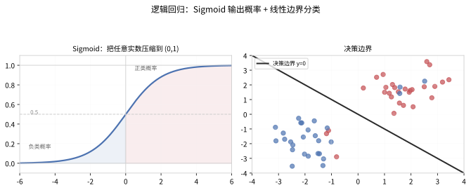
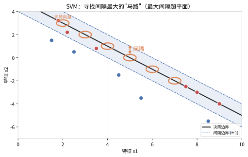
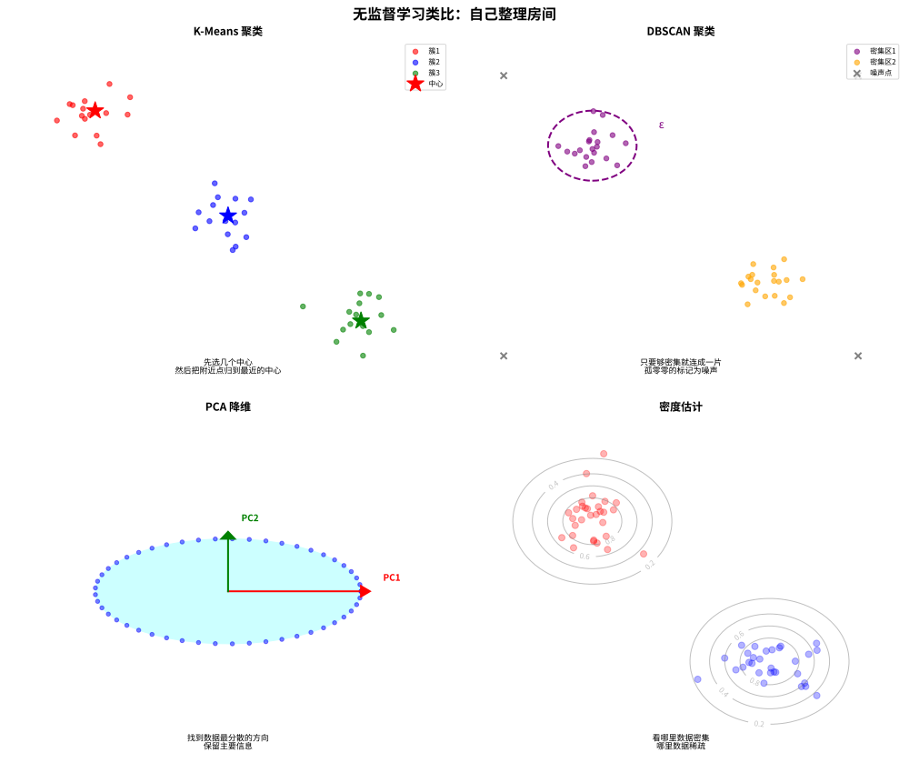
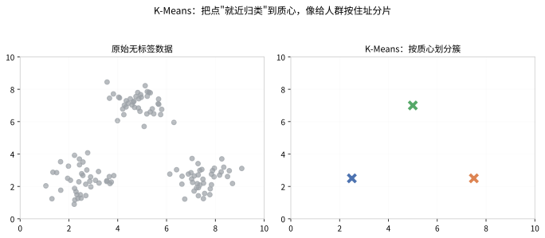
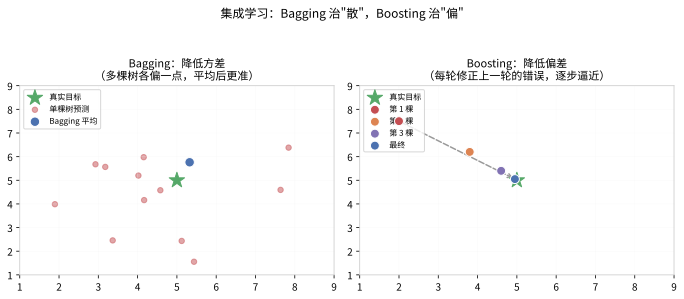
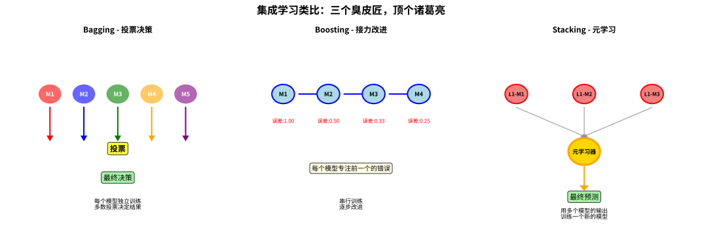
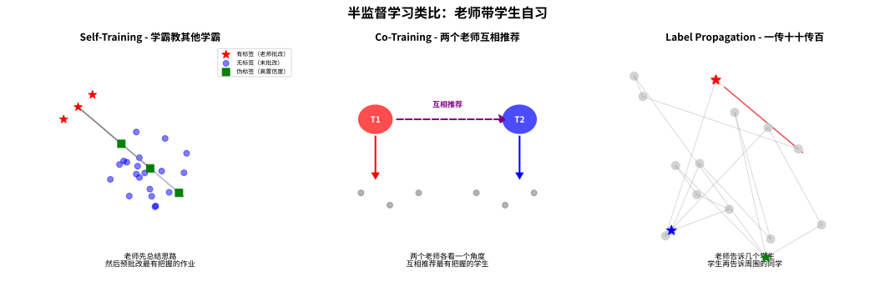

# 传统机器学习（Machine Learning）

> [← 返回 AI 算法体系索引](./11_人工智能.md)

---

## 📑 目录

- [一、监督学习（Supervised Learning）](#一监督学习supervised-learning)
  - [1.1 线性回归（Linear Regression）](#11-线性回归linear-regression)
  - [1.2 逻辑回归（Logistic Regression）](#12-逻辑回归logistic-regression)
  - [1.3 决策树（Decision Tree）](#13-决策树decision-tree)
  - [1.4 随机森林（Random Forest）](#14-随机森林random-forest)
  - [1.5 支持向量机（SVM）](#15-支持向量机svm)
  - [1.6 K 近邻（KNN）](#16-k-近邻knn)
  - [1.7 朴素贝叶斯（Naive Bayes）](#17-朴素贝叶斯naive-bayes)
  - [1.8 梯度提升树（GBDT / XGBoost / LightGBM）](#18-梯度提升树gbdt--xgboost--lightgbm)
- [二、无监督学习（Unsupervised Learning）](#二无监督学习unsupervised-learning)
  - [2.1 K-Means 聚类](#21-k-means-聚类)
  - [2.2 DBSCAN 聚类](#22-dbscan-聚类)
  - [2.3 层次聚类（Hierarchical Clustering）](#23-层次聚类hierarchical-clustering)
  - [2.4 主成分分析（PCA）](#24-主成分分析pca)
  - [2.5 t-SNE 与 UMAP](#25-t-sne-与-umap)
  - [2.6 自编码器（Autoencoder）](#26-自编码器autoencoder)
- [三、集成学习（Ensemble Learning）](#三集成学习ensemble-learning)
  - [3.1 Bagging](#31-bagging)
  - [3.2 Boosting](#32-boosting)
  - [3.3 Stacking](#33-stacking)
  - [3.4 三者对比总结](#34-三者对比总结)
- [四、半监督学习与自监督学习](#四半监督学习与自监督学习)
  - [4.1 半监督学习（Semi-Supervised Learning）](#41-半监督学习semi-supervised-learning)
  - [4.2 自监督学习（Self-Supervised Learning）](#42-自监督学习self-supervised-learning)
- [五、模型评估与模型选择](#五模型评估与模型选择)
  - [5.1 分类任务的评估指标](#51-分类任务的评估指标)
    - [5.1.1 混淆矩阵（Confusion Matrix）](#511-混淆矩阵confusion-matrix)
    - [5.1.2 准确率、精确率、召回率与 F1](#512-准确率精确率召回率与-f1)
    - [5.1.3 精确率-召回率权衡与 PR 曲线](#513-精确率-召回率权衡与-pr-曲线)
    - [5.1.4 ROC 曲线与 AUC](#514-roc-曲线与-auc)
    - [5.1.5 多分类评估：宏平均、微平均与加权平均](#515-多分类评估宏平均微平均与加权平均)
    - [5.1.6 分类指标优缺点对比](#516-分类指标优缺点对比)
    - [5.1.7 Python 代码示例（分类评估）](#517-python-代码示例分类评估)
  - [5.2 回归任务的评估指标](#52-回归任务的评估指标)
    - [5.2.1 平均绝对误差（MAE）](#521-平均绝对误差mae)
    - [5.2.2 均方误差（MSE）与均方根误差（RMSE）](#522-均方误差mse与均方根误差rmse)
    - [5.2.3 决定系数（R²）](#523-决定系数r²)
    - [5.2.4 回归指标对比与适用场景](#524-回归指标对比与适用场景)
    - [5.2.5 Python 代码示例（回归评估）](#525-python-代码示例回归评估)
  - [5.3 模型选择与超参调优](#53-模型选择与超参调优)
    - [5.3.1 过拟合、欠拟合与偏差-方差权衡](#531-过拟合欠拟合与偏差-方差权衡)
    - [5.3.2 训练集、验证集与测试集划分](#532-训练集验证集与测试集划分)
    - [5.3.3 交叉验证：K-Fold、分层与留一法](#533-交叉验证k-fold分层与留一法)
    - [5.3.4 超参调优方法：网格、随机与贝叶斯](#534-超参调优方法网格随机与贝叶斯)
    - [5.3.5 sklearn 调参与评估工具实战](#535-sklearn-调参与评估工具实战)
    - [5.3.6 模型选择流程总结](#536-模型选择流程总结)
- [六、异常检测（Anomaly Detection）](#六异常检测anomaly-detection)
  - [6.1 核心思想与问题定义](#61-核心思想与问题定义)
  - [6.2 统计方法（Z-Score、箱线图与 Grubbs 检验）](#62-统计方法z-score箱线图与-grubbs-检验)
  - [6.3 基于距离与密度的方法（LOF 局部离群因子）](#63-基于距离与密度的方法lof-局部离群因子)
  - [6.4 Isolation Forest（隔离森林）](#64-isolation-forest隔离森林)
  - [6.5 One-Class SVM（单类支持向量机）](#65-one-class-svm单类支持向量机)
  - [6.6 基于重构的方法（自编码器重构误差）](#66-基于重构的方法自编码器重构误差)
  - [6.7 方法对比与应用实践](#67-方法对比与应用实践)
- [七、可解释机器学习（XAI, Explainable AI）](#七可解释机器学习xai-explainable-ai)
  - [7.1 核心思想：为什么需要可解释](#71-核心思想为什么需要可解释)
  - [7.2 特征重要性（树模型重要性与置换重要性）](#72-特征重要性树模型重要性与置换重要性)
  - [7.3 LIME（Local Interpretable Model-agnostic Explanations）](#73-limelocal-interpretable-model-agnostic-explanations)
  - [7.4 SHAP（SHapley Additive exPlanations）](#74-shapshapley-additive-explanations)
  - [7.5 部分依赖图（PDP）与累积局部效应（ALE）](#75-部分依赖图pdp与累积局部效应ale)
  - [7.6 方法对比与应用实践](#76-方法对比与应用实践)
- [八、推荐系统（Recommender Systems）](#八推荐系统recommender-systems)
  - [8.1 核心思想与问题定义](#81-核心思想与问题定义)
  - [8.2 协同过滤（UserCF 与 ItemCF）](#82-协同过滤usercf-与-itemcf)
  - [8.3 矩阵分解（MF）](#83-矩阵分解mf)
  - [8.4 基于内容的推荐与混合推荐](#84-基于内容的推荐与混合推荐)
  - [8.5 深度推荐模型](#85-深度推荐模型)
  - [8.6 评估指标](#86-评估指标)
  - [8.7 优缺点、典型应用与代码实践](#87-优缺点典型应用与代码实践)

---

## 一、监督学习（Supervised Learning）

监督学习是机器学习中最基本的一类方法，其核心思想是从**带标签的训练数据**中学习一个从输入 $x$ 到输出 $y$ 的映射函数 $f: \mathcal{X} \to \mathcal{Y}$，使得该函数能对未见过的样本做出准确预测。根据输出 $y$ 的类型，监督学习可分为**回归问题**（$y$ 为连续值）和**分类问题**（$y$ 为离散值）。

---

### 1.1 线性回归（Linear Regression）

> 💡 **类比：线性回归如同"用直尺量数据"**
>
> 想象你有一堆散点图，想用一条直线来描述它们的趋势：
> - **核心思想**：找一条直线，让所有点到这条直线的距离之和最小
> - **可解释性**：每个特征的系数直接表示"这个特征增加1单位，目标变量变化多少"
> - **局限性**：只能捕捉线性关系，如果数据是曲线，直线就拟合不好
>
> 线性回归就像用直尺去量弯曲的海岸线——简单直观，但精度有限。它是所有回归模型的起点，复杂模型（如多项式回归、神经网络）都是在它基础上扩展。

#### 核心思想

线性回归假设目标变量 $y$ 与特征 $x = (x_1, x_2, \dots, x_n)$ 之间存在线性关系。模型通过拟合一条直线（或超平面）来最小化预测值与真实值之间的误差。它是回归问题中最基础、最可解释的模型。

#### 数学原理

**模型假设**：给定 $m$ 个训练样本 $\{(x^{(i)}, y^{(i)})\}_{i=1}^m$，线性回归的假设函数为：

$$
h_\theta(x) = \theta_0 + \theta_1 x_1 + \theta_2 x_2 + \cdots + \theta_n x_n = \theta^T x
$$

其中 $\theta \in \mathbb{R}^{n+1}$ 为模型参数，$x$ 为特征向量（增广形式，包含 $x_0 = 1$）。

**损失函数**（均方误差 MSE）：

$$
J(\theta) = \frac{1}{2m} \sum_{i=1}^m \left( h_\theta(x^{(i)}) - y^{(i)} \right)^2
$$

**求解方法**：

1. **正规方程**（闭式解）：

$$
\theta = (X^T X)^{-1} X^T y
$$

2. **梯度下降**（迭代更新）：

$$
\theta_j := \theta_j - \alpha \frac{\partial J(\theta)}{\partial \theta_j} = \theta_j - \frac{\alpha}{m} \sum_{i=1}^m \left( h_\theta(x^{(i)}) - y^{(i)} \right) x_j^{(i)}
$$

其中 $\alpha$ 为学习率。

#### 复杂度分析

- **训练时间复杂度**：$O(mn^2 + n^3)$（正规方程），$O(k m n)$（梯度下降，$k$ 为迭代次数）
- **空间复杂度**：$O(n^2)$（正规方程需存储 $X^T X$），$O(n)$（梯度下降）
- **预测时间复杂度**：$O(n)$

#### 优缺点

| 优点 | 缺点 |
|------|------|
| 简单、可解释性强 | 只能拟合线性关系 |
| 训练速度快 | 对异常值敏感 |
| 有闭式解，无需调参 | 需满足独立性、同方差性等假设 |

#### 典型应用场景

房价预测、销售额预测、股票价格趋势分析、气温预测等连续值回归任务。

#### Python 代码示例

```python
import numpy as np
import matplotlib.pyplot as plt
from sklearn.linear_model import LinearRegression
from sklearn.metrics import mean_squared_error

# 生成数据
np.random.seed(42)
X = np.linspace(0, 10, 100).reshape(-1, 1)
y = 2.5 * X.squeeze() + 1.2 + np.random.randn(100) * 1.0

# 训练模型
model = LinearRegression()
model.fit(X, y)

# 预测
y_pred = model.predict(X)

# 输出参数
print(f"斜率: {model.coef_[0]:.4f}")
print(f"截距: {model.intercept_:.4f}")
print(f"MSE: {mean_squared_error(y, y_pred):.4f}")

# 可视化
plt.scatter(X, y, alpha=0.6, label="真实数据")
plt.plot(X, y_pred, 'r-', linewidth=2, label="拟合直线")
plt.xlabel("特征 X")
plt.ylabel("目标 y")
plt.legend()
plt.title("线性回归拟合结果")
plt.show()
```

---

### 1.2 逻辑回归（Logistic Regression）

#### 核心思想

逻辑回归虽然名称中包含"回归"，但本质上是一种**二分类**算法。它通过 Sigmoid 函数将线性回归的输出映射到 $(0, 1)$ 区间，表示样本属于正类的概率。逻辑回归简单高效，是分类任务的首选基线模型之一。

> 💡 **类比：给"要不要"打分的概率旋钮** 如果说线性回归是"用尺子量出连续刻度"，逻辑回归就是"用一根旋钮回答是和否"。它先算一个线性得分（可正可负、能大到几千），再让这个得分**挤过 Sigmoid 的"S 形通道"**，被压扁到 0 到 1 之间，变成"属于正类的概率"：得分越高越接近 1，越低越接近 0，得分恰为 0 时概率为 0.5。下图左侧展示 Sigmoid 如何把任意实数映射成概率，右侧展示对应的一条线性决策边界。



#### 数学原理

**模型假设**：

$$
P(y=1|x) = \sigma(\theta^T x) = \frac{1}{1 + e^{-\theta^T x}}
$$

其中 $\sigma(z) = \frac{1}{1 + e^{-z}}$ 为 Sigmoid 函数，其输出值可解释为正类概率。

**决策边界**：当 $P(y=1|x) \geq 0.5$ 时预测为正类，即 $\theta^T x \geq 0$。

**损失函数**（交叉熵损失 / 对数损失）：

$$
J(\theta) = -\frac{1}{m} \sum_{i=1}^m \left[ y^{(i)} \log(h_\theta(x^{(i)})) + (1 - y^{(i)}) \log(1 - h_\theta(x^{(i)})) \right]
$$

**梯度下降更新**：

$$
\theta_j := \theta_j - \frac{\alpha}{m} \sum_{i=1}^m \left( h_\theta(x^{(i)}) - y^{(i)} \right) x_j^{(i)}
$$

形式上与线性回归的梯度相同，但 $h_\theta(x)$ 的定义不同。

**多分类扩展（Softmax 回归）**：

$$
P(y=k|x) = \frac{e^{\theta_k^T x}}{\sum_{j=1}^K e^{\theta_j^T x}}
$$

#### 复杂度分析

- **训练时间复杂度**：$O(k m n)$，$k$ 为迭代次数
- **预测时间复杂度**：$O(n)$
- **空间复杂度**：$O(n)$

#### 优缺点

| 优点 | 缺点 |
|------|------|
| 输出具有概率意义，可解释性强 | 决策边界线性，无法处理非线性问题 |
| 计算高效，适合大规模数据 | 对特征共线性敏感 |
| 可正则化（L1/L2）防止过拟合 | 需要手动特征工程处理非线性 |

#### 典型应用场景

垃圾邮件分类、信用卡欺诈检测、疾病诊断（患病/未患病）、点击率（CTR）预估。

#### Python 代码示例

```python
import numpy as np
from sklearn.linear_model import LogisticRegression
from sklearn.datasets import make_classification
from sklearn.model_selection import train_test_split
from sklearn.metrics import accuracy_score, precision_score, recall_score, f1_score

# 生成二分类数据
X, y = make_classification(n_samples=500, n_features=5, n_informative=4,
                           n_redundant=0, random_state=42)
X_train, X_test, y_train, y_test = train_test_split(X, y, test_size=0.2, random_state=42)

# 训练逻辑回归模型（L2正则化）
model = LogisticRegression(penalty='l2', C=1.0, solver='lbfgs')
model.fit(X_train, y_train)

# 预测
y_pred = model.predict(X_test)
y_prob = model.predict_proba(X_test)[:, 1]

# 评估
print(f"准确率: {accuracy_score(y_test, y_pred):.4f}")
print(f"精确率: {precision_score(y_test, y_pred):.4f}")
print(f"召回率: {recall_score(y_test, y_pred):.4f}")
print(f"F1-score: {f1_score(y_test, y_pred):.4f}")

# 查看特征权重
print(f"模型系数: {model.coef_[0]}")
print(f"模型截距: {model.intercept_[0]:.4f}")
```

---

### 1.3 决策树（Decision Tree）

#### 核心思想

> 💡 **类比：决策树如同"二十问游戏"**
>
> 想象你在玩"猜猜我是谁"游戏：你只能通过问"是/否"问题来猜出对方是谁。
> - **决策树**就像你的提问策略：先问"是男性吗？"（根节点），如果"是"，再问"戴眼镜吗？"（子节点），继续问下去直到猜出答案（叶节点）
> - **信息增益**就是选择"哪个问题最能区分人"——问"是地球人吗？"几乎没用（信息增益低），问"是中国人吗？"更有区分力（信息增益高）
> - **剪枝**就像"别问太多细节"——问"左撇子吗？""血型是O型吗？"虽然能区分，但容易记住错误答案（过拟合）
>
> 决策树的精髓是：**用最少的问题，做出最准确的判断**。就像好医生不会问完所有问题才诊断，而是通过关键症状快速缩小范围。

#### 数学原理

**树的分裂标准**：

1. **信息增益（ID3 算法）**：

$$
\text{InfoGain}(D, A) = \text{Entropy}(D) - \sum_{v \in \text{Values}(A)} \frac{|D_v|}{|D|} \text{Entropy}(D_v)
$$

其中熵定义为：

$$
\text{Entropy}(D) = -\sum_{k=1}^K p_k \log_2 p_k
$$

2. **增益率（C4.5 算法）**：

$$
\text{GainRatio}(D, A) = \frac{\text{InfoGain}(D, A)}{\text{SplitInfo}(D, A)}
$$

$$
\text{SplitInfo}(D, A) = -\sum_{v \in \text{Values}(A)} \frac{|D_v|}{|D|} \log_2 \frac{|D_v|}{|D|}
$$

3. **基尼指数（CART 算法）**：

$$
\text{Gini}(D) = 1 - \sum_{k=1}^K p_k^2
$$

CART 选择使分裂后基尼指数最小的特征：

$$
\text{GiniSplit}(D, A) = \sum_{v \in \text{Values}(A)} \frac{|D_v|}{|D|} \text{Gini}(D_v)
$$

**回归树（CART 回归）**：使用均方误差作为分裂标准。

**剪枝策略**：
- **预剪枝**：在树生长过程中设置最大深度、最小叶节点样本数等限制
- **后剪枝**：先让树充分生长，然后自底向上合并叶节点以降低泛化误差

#### 复杂度分析

- **训练时间复杂度**：$O(m n \log m)$（排序后分裂）
- **预测时间复杂度**：$O(\log m)$（平衡树）或 $O(m)$（最坏情况）
- **空间复杂度**：$O(m)$

#### 优缺点

| 优点 | 缺点 |
|------|------|
| 可解释性强，可可视化 | 容易过拟合，需剪枝 |
| 无需特征缩放 | 对数据微小变化敏感（不稳定） |
| 可处理数值型和类别型特征 | 容易偏向多值特征 |
| 可处理非线性关系 | 单棵决策树精度有限 |

#### 典型应用场景

信用风险评估、医疗诊断辅助、客户分群规则提取、可解释性要求高的场景。

#### Python 代码示例

```python
import numpy as np
from sklearn.tree import DecisionTreeClassifier, plot_tree
from sklearn.datasets import load_iris
from sklearn.model_selection import train_test_split
from sklearn.metrics import classification_report
import matplotlib.pyplot as plt

# 加载数据
iris = load_iris()
X, y = iris.data, iris.target
X_train, X_test, y_train, y_test = train_test_split(X, y, test_size=0.2, random_state=42)

# 训练决策树（预剪枝）
model = DecisionTreeClassifier(
    criterion='gini',        # 基尼指数
    max_depth=3,             # 限制最大深度，防止过拟合
    min_samples_split=10,    # 内部节点最小样本数
    min_samples_leaf=5,      # 叶节点最小样本数
    random_state=42
)
model.fit(X_train, y_train)

# 预测
y_pred = model.predict(X_test)

# 评估
print(classification_report(y_test, y_pred, target_names=iris.target_names))

# 特征重要性
for name, importance in zip(iris.feature_names, model.feature_importances_):
    print(f"{name}: {importance:.4f}")

# 可视化树结构（需先安装 graphviz）
# plot_tree(model, filled=True, feature_names=iris.feature_names, class_names=iris.target_names)
# plt.show()
```

---

### 1.4 随机森林（Random Forest）

#### 核心思想

随机森林是 Bagging 集成策略的代表，它构建**多棵决策树**并通过投票（分类）或平均（回归）得到最终结果。其核心思想是"三个臭皮匠，顶个诸葛亮"——通过集成多个弱学习器来降低方差，提升泛化性能。随机森林在每棵树的训练中引入了**双重随机性**：样本随机（Bootstrap 采样）和特征随机（随机选择特征子集）。

#### 数学原理

**Bootstrap 采样**：从原始训练集 $D$ 中有放回地抽取 $m$ 个样本，形成新的训练集 $D_i$。每个样本未被抽到的概率约为 $1/e \approx 0.368$，这些未被抽到的样本称为**袋外数据（OOB）**，可用于无偏的泛化误差估计。

**特征随机性**：在每棵树分裂时，不是从所有 $n$ 个特征中选择最优分裂特征，而是从随机选择的 $k$ 个特征中选取最优。通常 $k = \sqrt{n}$（分类）或 $k = n/3$（回归）。

**集成预测**：

- 分类：$\hat{y} = \text{majority\_vote}\left( h_1(x), h_2(x), \dots, h_T(x) \right)$
- 回归：$\hat{y} = \frac{1}{T} \sum_{t=1}^T h_t(x)$

**泛化误差上界**：

$$
\text{Generalization Error} \leq \frac{\bar{\rho}(1 - s^2)}{s^2}
$$

其中 $\bar{\rho}$ 为树之间的平均相关系数，$s$ 为单棵树的强度。

#### 复杂度分析

- **训练时间复杂度**：$O(T \cdot m \log m \cdot n)$，$T$ 为树的数量
- **预测时间复杂度**：$O(T \cdot \log m)$
- **空间复杂度**：$O(T \cdot m)$

#### 优缺点

| 优点 | 缺点 |
|------|------|
| 泛化能力强，不易过拟合 | 模型体积大，占用内存多 |
| 可处理高维数据 | 对极端不平衡数据敏感 |
| 可评估特征重要性 | 可解释性不如单棵决策树 |
| 无需特征缩放，抗噪声能力强 | 在回归任务上精度有限 |

#### 典型应用场景

特征选择（特征重要性排序）、异常检测、银行风控建模、生物信息学（基因表达数据分类）。

#### Python 代码示例

```python
import numpy as np
from sklearn.ensemble import RandomForestClassifier
from sklearn.datasets import load_breast_cancer
from sklearn.model_selection import train_test_split, cross_val_score
from sklearn.metrics import accuracy_score

# 加载数据
data = load_breast_cancer()
X, y = data.data, data.target
X_train, X_test, y_train, y_test = train_test_split(X, y, test_size=0.2, random_state=42)

# 训练随机森林
model = RandomForestClassifier(
    n_estimators=200,        # 树的数量
    max_depth=8,             # 最大深度
    min_samples_leaf=2,      # 叶节点最小样本数
    max_features='sqrt',     # 每棵树使用的特征数
    oob_score=True,          # 使用袋外数据评估
    random_state=42,
    n_jobs=-1                # 并行训练
)
model.fit(X_train, y_train)

# 预测
y_pred = model.predict(X_test)
print(f"测试集准确率: {accuracy_score(y_test, y_pred):.4f}")
print(f"OOB 准确率: {model.oob_score_:.4f}")

# 交叉验证
cv_scores = cross_val_score(model, X_train, y_train, cv=5)
print(f"交叉验证平均准确率: {cv_scores.mean():.4f} (+/- {cv_scores.std() * 2:.4f})")

# 特征重要性排序（Top 10）
importances = model.feature_importances_
indices = np.argsort(importances)[::-1][:10]
print("\nTop 10 重要特征:")
for i, idx in enumerate(indices):
    print(f"  {i+1}. {data.feature_names[idx]}: {importances[idx]:.4f}")
```

---

### 1.5 支持向量机（SVM）

#### 核心思想

支持向量机的核心思想是在特征空间中寻找一个**最大间隔超平面**，将不同类别的样本分开。SVM 通过最大化分类间隔（Margin）来提升泛化能力，并利用**核技巧（Kernel Trick）**将数据隐式映射到高维空间，从而处理线性不可分问题。

> 💡 **类比：在两类人之间修一条最宽的马路** 想象大街上站在两群人（正类/红、负类/蓝），你想画一条"楚河汉界"把他们分开。与其贴着人群画，不如在中间留一条**尽可能宽的空马路**——离两边最近的人（**支持向量**）都远一点。为什么越宽越好？因为马路越宽，将来路过的陌生人（新样本）越不容易被误判到对侧，泛化能力越强。这条"马路"的中线就是 SVM 的决策超平面，而两边撑起马路宽度的"最近的人"就是支持向量。下图橙色圆圈标出的正是这些决定边界位置的支持向量。



#### 数学原理

**硬间隔 SVM（线性可分情况）**：

寻找超平面 $w^T x + b = 0$，使得：

$$
\min_{w,b} \frac{1}{2} \|w\|^2
$$

约束条件：$y^{(i)}(w^T x^{(i)} + b) \geq 1, \quad i = 1, \dots, m$

**软间隔 SVM（线性不可分情况）**：引入松弛变量 $\xi_i$：

$$
\min_{w,b,\xi} \frac{1}{2} \|w\|^2 + C \sum_{i=1}^m \xi_i
$$

约束条件：$y^{(i)}(w^T x^{(i)} + b) \geq 1 - \xi_i, \quad \xi_i \geq 0$

其中 $C$ 为惩罚参数，控制对误分类的容忍度。

**对偶形式**（利用拉格朗日乘子法）：

$$
\max_{\alpha} \sum_{i=1}^m \alpha_i - \frac{1}{2} \sum_{i=1}^m \sum_{j=1}^m \alpha_i \alpha_j y^{(i)} y^{(j)} K(x^{(i)}, x^{(j)})
$$

约束条件：$0 \leq \alpha_i \leq C, \quad \sum_{i=1}^m \alpha_i y^{(i)} = 0$

**核函数**：

- **线性核**：$K(x_i, x_j) = x_i^T x_j$
- **多项式核**：$K(x_i, x_j) = (x_i^T x_j + r)^d$
- **高斯核（RBF）**：$K(x_i, x_j) = \exp\left(-\frac{\|x_i - x_j\|^2}{2\sigma^2}\right) = \exp\left(-\gamma \|x_i - x_j\|^2\right)$
- **Sigmoid 核**：$K(x_i, x_j) = \tanh(\beta x_i^T x_j + \theta)$

**支持向量**：只有 $\alpha_i > 0$ 对应的样本点（即支持向量）影响决策边界，其余样本不贡献。

#### 复杂度分析

- **训练时间复杂度**：$O(m^2 n)$ 到 $O(m^3 n)$（取决于实现，如 SMO 算法为 $O(m^2)$ 到 $O(m^3)$）
- **预测时间复杂度**：$O(m_{SV} \cdot n)$，$m_{SV}$ 为支持向量数量
- **空间复杂度**：$O(m^2)$（需存储核矩阵）

#### 优缺点

| 优点 | 缺点 |
|------|------|
| 在高维空间中表现优异 | 对大规模数据训练时间长 |
| 通过核技巧可处理非线性问题 | 对核函数和参数 ($C, \gamma$) 敏感 |
| 泛化能力强（最大间隔原则） | 不直接输出概率估计 |
| 对异常值鲁棒（软间隔） | 多分类需一对多或一对一策略 |

#### 典型应用场景

文本分类（如情感分析）、图像分类（小样本）、手写数字识别、生物信息学（蛋白质分类）。

#### Python 代码示例

```python
import numpy as np
from sklearn.svm import SVC
from sklearn.datasets import make_classification
from sklearn.model_selection import train_test_split, GridSearchCV
from sklearn.preprocessing import StandardScaler
from sklearn.metrics import classification_report

# 生成数据
X, y = make_classification(n_samples=300, n_features=10, n_informative=8,
                           n_redundant=0, random_state=42)
X_train, X_test, y_train, y_test = train_test_split(X, y, test_size=0.2, random_state=42)

# SVM 对特征缩放敏感，务必标准化
scaler = StandardScaler()
X_train_scaled = scaler.fit_transform(X_train)
X_test_scaled = scaler.transform(X_test)

# 使用 RBF 核的 SVM
model = SVC(kernel='rbf', C=1.0, gamma='scale', probability=True, random_state=42)
model.fit(X_train_scaled, y_train)

# 预测
y_pred = model.predict(X_test_scaled)
y_prob = model.predict_proba(X_test_scaled)[:, 1]

# 评估
print(classification_report(y_test, y_pred))

# 网格搜索调参
param_grid = {
    'C': [0.1, 1, 10, 100],
    'gamma': ['scale', 'auto', 0.01, 0.1],
    'kernel': ['rbf', 'poly']
}
grid_search = GridSearchCV(SVC(), param_grid, cv=5, scoring='accuracy', n_jobs=-1)
grid_search.fit(X_train_scaled, y_train)
print(f"最佳参数: {grid_search.best_params_}")
print(f"最佳交叉验证分数: {grid_search.best_score_:.4f}")
```

---

### 1.6 K 近邻（KNN）

#### 核心思想

> 💡 **类比：KNN 如同"新住户看邻居"**
>
> 想象你搬到一个新小区，想知道这里是什么档次的小区。
> - **KNN 的做法**：看看你周围最近的 K 户人家。如果 K=3，最近的三家都开豪车、住别墅，那你判断这是高档小区；如果三家都是普通工薪阶层，那就是普通小区
> - **K 值的选择**：K=1 只看最近一家，容易被特例误导（比如一家暴发户）；K 太大则看太远，可能超出小区范围
> - **距离度量**：欧氏距离是直线距离，曼哈顿距离是走街道的距离，余弦相似度看的是"方向是否一致"而非"距离远近"
>
> KNN 的精髓是：**近朱者赤，近墨者黑**。你是什么样的人，看你周围的朋友就知道了。这是一种"懒惰学习"——不提前总结规律，等遇到新问题再翻旧账。

K 近邻（K-Nearest Neighbors）是一种**基于实例的学习**（Instance-Based Learning）方法，它不显式地学习一个判别函数，而是直接存储所有训练样本。对于新样本，KNN 在训练集中找到与其最近的 $K$ 个邻居，通过邻居的投票（分类）或平均（回归）来预测。KNN 是一种**非参数化**、**懒惰学习**（Lazy Learning）算法。

#### 数学原理

**距离度量**：

- **欧氏距离**：$d(x_i, x_j) = \sqrt{\sum_{k=1}^n (x_{ik} - x_{jk})^2}$
- **曼哈顿距离**：$d(x_i, x_j) = \sum_{k=1}^n |x_{ik} - x_{jk}|$
- **闵可夫斯基距离**：$d(x_i, x_j) = \left(\sum_{k=1}^n |x_{ik} - x_{jk}|^p\right)^{1/p}$
- **余弦相似度**：$\cos(x_i, x_j) = \frac{x_i \cdot x_j}{\|x_i\| \|x_j\|}$

**分类决策规则**：

$$
\hat{y} = \arg\max_{c} \sum_{i \in \mathcal{N}_K(x)} \mathbb{I}(y^{(i)} = c)
$$

**回归决策规则**：

$$
\hat{y} = \frac{1}{K} \sum_{i \in \mathcal{N}_K(x)} y^{(i)}
$$

**权重形式**（距离越近权重越大）：

$$
\hat{y} = \arg\max_{c} \sum_{i \in \mathcal{N}_K(x)} w_i \cdot \mathbb{I}(y^{(i)} = c), \quad w_i = \frac{1}{d(x, x_i)}
$$

#### 复杂度分析

- **训练时间复杂度**：$O(1)$（仅存储数据）
- **预测时间复杂度**：$O(mn)$（暴力搜索），$O(K \log m)$（KD-Tree/Ball-Tree 在低维时）
- **空间复杂度**：$O(mn)$

#### 优缺点

| 优点 | 缺点 |
|------|------|
| 简单直观，无需训练 | 预测阶段计算量大 |
| 对非线性数据自然适应 | 对特征缩放敏感（需标准化） |
| 自然支持多分类 | 维度灾难（高维时距离度量失效） |
| 无需假设数据分布 | 对不平衡数据敏感 |

#### 典型应用场景

推荐系统（协同过滤）、手写数字识别、图像分类（小规模）、异常检测。

#### Python 代码示例

```python
import numpy as np
from sklearn.neighbors import KNeighborsClassifier
from sklearn.datasets import load_digits
from sklearn.model_selection import train_test_split, cross_val_score
from sklearn.preprocessing import StandardScaler
from sklearn.metrics import classification_report
import matplotlib.pyplot as plt

# 加载手写数字数据集
digits = load_digits()
X, y = digits.data, digits.target
X_train, X_test, y_train, y_test = train_test_split(X, y, test_size=0.2, random_state=42)

# 标准化
scaler = StandardScaler()
X_train_scaled = scaler.fit_transform(X_train)
X_test_scaled = scaler.transform(X_test)

# 使用交叉验证选择最佳 K 值
k_range = range(1, 31)
cv_scores = []
for k in k_range:
    knn = KNeighborsClassifier(n_neighbors=k, weights='distance')
    scores = cross_val_score(knn, X_train_scaled, y_train, cv=5, scoring='accuracy')
    cv_scores.append(scores.mean())

best_k = k_range[np.argmax(cv_scores)]
print(f"最佳 K 值: {best_k}")

# 使用最佳 K 训练
model = KNeighborsClassifier(n_neighbors=best_k, weights='distance', p=2)
model.fit(X_train_scaled, y_train)

# 预测
y_pred = model.predict(X_test_scaled)
print(classification_report(y_test, y_pred, target_names=[str(i) for i in range(10)]))

# 可视化 K 值与准确率关系
plt.plot(k_range, cv_scores, 'b-')
plt.xlabel('K 值')
plt.ylabel('交叉验证准确率')
plt.title('K 值选择')
plt.grid(True)
plt.show()
```

---

### 1.7 朴素贝叶斯（Naive Bayes）

#### 核心思想

> 💡 **类比：朴素贝叶斯如同"根据多种独立线索破案"**
>
> 想象你是一个侦探，要判断嫌疑人是否有罪。
> - **朴素贝叶斯的做法**：收集多条独立线索——指纹匹配、不在场证明可疑、有作案动机、目击者证词。每条线索独立地增加或减少嫌疑人的"有罪概率"
> - **"朴素"假设**：假设这些线索彼此独立（指纹和动机没有关联），虽然现实中线索往往相关，但这个简化假设让计算变得简单，效果却出奇地好
> - **贝叶斯定理**：根据新证据不断更新信念。先验概率（初始怀疑）× 证据强度 = 后验概率（更新后的怀疑程度）
>
> 朴素贝叶斯的精髓是：**多条弱证据胜过一条强证据**。即使每条线索都不完美，但多条独立线索综合起来，判断就很可靠。这就是垃圾邮件过滤器的原理——"免费""中奖""点击链接"这些词各自独立地增加垃圾邮件的概率。

朴素贝叶斯是基于**贝叶斯定理**与**特征条件独立假设**的分类方法。它假设每个特征对分类结果的影响是相互独立的（即"朴素"假设），尽管这一假设在现实中通常不成立，但朴素贝叶斯在许多场景下仍能取得良好效果。它所需估计的参数很少，对缺失数据不敏感，且计算效率极高。

#### 数学原理

**贝叶斯定理**：

$$
P(y|x_1, \dots, x_n) = \frac{P(y) \prod_{i=1}^n P(x_i|y)}{P(x_1, \dots, x_n)}
$$

**朴素条件独立假设**：

$$
P(x_1, \dots, x_n|y) = \prod_{i=1}^n P(x_i|y)
$$

**分类决策规则**（最大后验概率）：

$$
\hat{y} = \arg\max_{y} P(y) \prod_{i=1}^n P(x_i|y)
$$

**三种常见变体**：

1. **高斯朴素贝叶斯（Gaussian NB）**：假设 $P(x_i|y) \sim \mathcal{N}(\mu_{i,y}, \sigma_{i,y}^2)$

$$
P(x_i|y) = \frac{1}{\sqrt{2\pi\sigma_{i,y}^2}} \exp\left(-\frac{(x_i - \mu_{i,y})^2}{2\sigma_{i,y}^2}\right)
$$

2. **多项式朴素贝叶斯（Multinomial NB）**：适用于离散计数特征（如词频）

$$
P(x_i|y) = \frac{N_{i,y} + \alpha}{N_y + \alpha n}
$$

其中 $N_{i,y}$ 为类别 $y$ 中特征 $i$ 出现的次数，$\alpha$ 为拉普拉斯平滑参数。

3. **伯努利朴素贝叶斯（Bernoulli NB）**：适用于二元特征（如词是否出现）

#### 复杂度分析

- **训练时间复杂度**：$O(mn)$
- **预测时间复杂度**：$O(Kn)$，$K$ 为类别数
- **空间复杂度**：$O(Kn)$（存储先验概率和条件概率参数）

#### 优缺点

| 优点 | 缺点 |
|------|------|
| 计算效率极高，适合大规模数据 | 条件独立假设过强，影响精度 |
| 对缺失数据不敏感 | 对特征间的相关性敏感 |
| 增量学习（可在线更新） | 零概率问题需平滑处理 |
| 小样本下表现良好 | 不适合特征间高度相关的场景 |

#### 典型应用场景

文本分类（垃圾邮件过滤、情感分析）、文档分类、实时分类任务、推荐系统（朴素贝叶斯协同过滤）。

#### Python 代码示例

```python
import numpy as np
from sklearn.naive_bayes import GaussianNB, MultinomialNB
from sklearn.datasets import fetch_20newsgroups
from sklearn.feature_extraction.text import TfidfVectorizer
from sklearn.model_selection import train_test_split
from sklearn.metrics import classification_report, confusion_matrix
import seaborn as sns
import matplotlib.pyplot as plt

# ========== 示例1：高斯朴素贝叶斯（数值特征） ==========
from sklearn.datasets import load_iris
iris = load_iris()
X, y = iris.data, iris.target
X_train, X_test, y_train, y_test = train_test_split(X, y, test_size=0.2, random_state=42)

gnb = GaussianNB()
gnb.fit(X_train, y_train)
y_pred = gnb.predict(X_test)
print("高斯朴素贝叶斯 - Iris 分类准确率:", np.mean(y_pred == y_test))

# ========== 示例2：多项式朴素贝叶斯（文本分类） ==========
categories = ['rec.sport.baseball', 'sci.space', 'talk.politics.guns']
newsgroups = fetch_20newsgroups(subset='train', categories=categories, shuffle=True, random_state=42)
X_train_text, X_test_text, y_train, y_test = train_test_split(
    newsgroups.data, newsgroups.target, test_size=0.2, random_state=42)

# 文本向量化
vectorizer = TfidfVectorizer(max_features=5000, stop_words='english')
X_train_vec = vectorizer.fit_transform(X_train_text)
X_test_vec = vectorizer.transform(X_test_text)

# 训练多项式朴素贝叶斯
mnb = MultinomialNB(alpha=1.0)  # 拉普拉斯平滑
mnb.fit(X_train_vec, y_train)
y_pred = mnb.predict(X_test_vec)

# 评估
print("\n多项式朴素贝叶斯 - 文本分类结果:")
print(classification_report(y_test, y_pred, target_names=categories))
```

---

### 1.8 梯度提升树（GBDT / XGBoost / LightGBM）

#### 核心思想

> 💡 **类比：梯度提升树如同"错题本迭代法"**
>
> 想象一个学生在准备考试：
> - **第一棵树**：做一套模拟题，错了 30 道题。他把这 30 道题整理到错题本上
> - **第二棵树**：专门针对错题本上的题再练一遍，又错了 10 道。把这 10 道题加到错题本
> - **第三棵树**：继续针对剩下的错题练习，又错了 3 道...
> - **最终模型**：所有树的预测结果累加，就像把每次练习的经验都积累起来
>
> 关键区别在于：
> - **Bagging（随机森林）**：让多个学生各自独立做题，然后投票决定答案
> - **Boosting（梯度提升）**：让一个学生专注错题，一轮一轮改进，每轮都针对上一轮的不足
>
> "梯度"就是错题本上的题目——它告诉你当前模型哪里做得不好，下一棵树就专门修正这些错误。XGBoost 和 LightGBM 是这个思路的工程优化版本，就像给错题本加了索引、分类、快速查找功能。

梯度提升树（Gradient Boosting Decision Tree）是一种基于 **Boosting 策略**的集成学习方法，它通过**逐步添加决策树**来修正前一轮的残差。每一棵新树都在拟合前一轮损失函数的**负梯度方向**，从而逐步逼近最优解。XGBoost 和 LightGBM 是 GBDT 的高效工程实现，引入了正则化、二阶梯度、列采样、直方图近似等优化。

#### 数学原理

**GBDT 算法流程**：

1. 初始化：$F_0(x) = \arg\min_\gamma \sum_{i=1}^m L(y^{(i)}, \gamma)$

2. 对每一轮 $t = 1, 2, \dots, T$：

   a. 计算负梯度（伪残差）：

   $$
   r_{t}^{(i)} = -\left[ \frac{\partial L(y^{(i)}, F(x^{(i)}))}{\partial F(x^{(i)})} \right]_{F(x) = F_{t-1}(x)}
   $$

   b. 拟合一棵回归树 $h_t(x)$ 到伪残差 $\{ (x^{(i)}, r_{t}^{(i)}) \}_{i=1}^m$

   c. 计算最优步长：

   $$
   \rho_t = \arg\min_\rho \sum_{i=1}^m L(y^{(i)}, F_{t-1}(x^{(i)}) + \rho h_t(x^{(i)}))
   $$

   d. 更新模型：$F_t(x) = F_{t-1}(x) + \eta \rho_t h_t(x)$，其中 $\eta$ 为学习率

**XGBoost 的改进**：

- **二阶泰勒展开**：使用损失函数的一阶和二阶导数，加速收敛

$$
\mathcal{L}^{(t)} \approx \sum_{i=1}^m \left[ g_i f_t(x^{(i)}) + \frac{1}{2} h_i f_t^2(x^{(i)}) \right] + \Omega(f_t)
$$

其中 $g_i = \partial_{F_{t-1}} L(y^{(i)}, F_{t-1}(x^{(i)}))$，$h_i = \partial^2_{F_{t-1}} L(y^{(i)}, F_{t-1}(x^{(i)}))$

- **正则化项**：$\Omega(f_t) = \gamma T + \frac{1}{2}\lambda \sum_{j=1}^T w_j^2$，$T$ 为叶节点数，$w_j$ 为叶节点权重

- **列采样**（Column Subsampling）：类似随机森林的特征采样

**LightGBM 的改进**：

- **GOSS（Gradient-based One-Side Sampling）**：保留梯度大的样本，对梯度小的样本进行随机采样
- **EFB（Exclusive Feature Bundling）**：将互斥特征捆绑，降低特征维度
- **直方图算法**：将连续特征离散化为 $k$ 个桶，加速分裂点查找（$O(kn)$ vs $O(n \log n)$）
- **叶子节点生长策略（Leaf-wise）**：每次选择分裂增益最大的叶子进行分裂，相比 Level-wise 能更快收敛

#### 复杂度分析

| 算法 | 训练时间复杂度 | 预测时间复杂度 |
|------|---------------|---------------|
| GBDT | $O(T \cdot m n \log m)$ | $O(T \cdot \log m)$ |
| XGBoost | $O(T \cdot m n \log m)$（近似算法 $O(T \cdot k n)$） | $O(T \cdot \log m)$ |
| LightGBM | $O(T \cdot k n \cdot m)$（直方图+Leaf-wise） | $O(T \cdot \log m)$ |

#### 优缺点

| 优点 | 缺点 |
|------|------|
| 精度高，许多竞赛的冠军方案 | 对异常值敏感（GBDT） |
| 可处理混合类型特征 | 串行训练，难以并行化 |
| 支持自定义损失函数 | 超参数较多，调参复杂 |
| 特征重要性可解释 | 数据量大时训练较慢（GBDT） |

#### 典型应用场景

搜索排序（Learning to Rank）、点击率（CTR）预估、金融风控评分卡、Kaggle/Tianchi 竞赛、广告推荐系统。

#### Python 代码示例

```python
import numpy as np
from sklearn.ensemble import GradientBoostingClassifier
from sklearn.datasets import make_classification
from sklearn.model_selection import train_test_split, GridSearchCV
from sklearn.metrics import accuracy_score, roc_auc_score
import warnings
warnings.filterwarnings('ignore')

# 生成数据
X, y = make_classification(n_samples=1000, n_features=20, n_informative=15,
                           n_redundant=3, random_state=42)
X_train, X_test, y_train, y_test = train_test_split(X, y, test_size=0.2, random_state=42)

# ========== GBDT (sklearn) ==========
gbdt = GradientBoostingClassifier(
    n_estimators=200, max_depth=3, learning_rate=0.1,
    subsample=0.8, min_samples_leaf=10, random_state=42
)
gbdt.fit(X_train, y_train)
y_pred_gbdt = gbdt.predict(X_test)
print(f"GBDT 准确率: {accuracy_score(y_test, y_pred_gbdt):.4f}")

# ========== XGBoost（需安装 xgboost 包） ==========
try:
    import xgboost as xgb
    dtrain = xgb.DMatrix(X_train, label=y_train)
    dtest = xgb.DMatrix(X_test, label=y_test)
    params = {
        'objective': 'binary:logistic',
        'max_depth': 4,
        'eta': 0.1,
        'subsample': 0.8,
        'colsample_bytree': 0.8,
        'lambda': 1.0,
        'alpha': 0.0,
        'eval_metric': 'auc',
        'seed': 42
    }
    xgb_model = xgb.train(params, dtrain, num_boost_round=200,
                          evals=[(dtest, 'test')], verbose_eval=False)
    y_pred_xgb = (xgb_model.predict(dtest) > 0.5).astype(int)
    y_prob_xgb = xgb_model.predict(dtest)
    print(f"XGBoost 准确率: {accuracy_score(y_test, y_pred_xgb):.4f}")
    print(f"XGBoost AUC: {roc_auc_score(y_test, y_prob_xgb):.4f}")
except ImportError:
    print("XGBoost 未安装，跳过。")

# ========== LightGBM（需安装 lightgbm 包） ==========
try:
    import lightgbm as lgb
    lgb_train = lgb.Dataset(X_train, y_train)
    lgb_eval = lgb.Dataset(X_test, y_test, reference=lgb_train)
    params = {
        'objective': 'binary',
        'metric': 'auc',
        'boosting_type': 'gbdt',
        'num_leaves': 31,
        'learning_rate': 0.1,
        'feature_fraction': 0.8,
        'bagging_fraction': 0.8,
        'bagging_freq': 5,
        'verbose': -1,
        'seed': 42
    }
    lgb_model = lgb.train(params, lgb_train, num_boost_round=200,
                          valid_sets=[lgb_eval], callbacks=[lgb.early_stopping(20)])
    y_pred_lgb = (lgb_model.predict(X_test) > 0.5).astype(int)
    print(f"LightGBM 准确率: {accuracy_score(y_test, y_pred_lgb):.4f}")
except ImportError:
    print("LightGBM 未安装，跳过。")
```

---

## 二、无监督学习（Unsupervised Learning）

无监督学习的目标是从**无标签数据**中发现隐藏的结构、模式或分布。它不依赖人工标注，适用于数据标注成本高昂的场景。主要包括**聚类**（发现样本分组）、**降维**（提取数据核心结构）和**密度估计**等任务。

> 💡 **类比：无监督学习如同"自己整理房间"**
>
> 想象你搬进一间堆满杂物的房间，没有说明书告诉你东西该放哪（没有标签）：
> - **聚类**：你把相似的东西堆在一起——衣服堆一堆、书堆一堆、电子产品堆一堆。K-Means 就像"先随便选几个地方当'垃圾堆'，然后把附近的东西都扔过去，再重新找每堆的中心"；DBSCAN 则像"只要东西够密集就连成一片，孤零零的单独放"
> - **降维（PCA）**：你有一堆文件，有的内容重复。降维就像"把相似的文件合并成一份摘要"——保留核心信息，去掉冗余
> - **密度估计**：你在房间里撒面粉，看哪里面粉厚（数据密集）、哪里面粉薄（数据稀疏），从而判断哪些区域是"热点"
>
> 无监督学习的精髓是：**没人告诉你答案，你要自己从数据中发现规律**。就像没人告诉你房间该怎么整理，你得自己想出分类方法。



---

### 2.1 K-Means 聚类

#### 核心思想

K-Means 是最经典的**划分式聚类**算法。它将数据划分为 $K$ 个簇，每个簇由其**质心**（Centroid）表示。算法的目标是最小化所有样本到其所属簇质心的距离平方和（即簇内方差）。K-Means 简单高效，是聚类任务的首选基线模型。

> 💡 **类比：给散落的人群按"就近地址"分片建站** 想象城市里散落着很多住户，你想在城中设 $K$ 个服务点，让每个住户都去"最近"的那个点。做法是：先随便选 $K$ 个点当"服务点"，然后让每个住户投奔最近的服务点聚成一片；再把这个片里所有人的"平均位置"设成新的服务点；再来一轮，住户重新投奔、服务点再移动……如此反复，直到服务点不再移动。这个"就近 + 取平均"的拉锯过程就是 K-Means 的"分配—更新"两步循环。下图左侧是原始散点，右侧是迭代结束后按质心划分出的簇。



#### 数学原理

**目标函数**（簇内误差平方和，Inertia）：

$$
J = \sum_{k=1}^K \sum_{x \in C_k} \|x - \mu_k\|^2
$$

其中 $\mu_k$ 为第 $k$ 个簇的质心。

**算法步骤**：

1. 随机初始化 $K$ 个质心 $\mu_1, \mu_2, \dots, \mu_K$
2. 重复以下步骤直到收敛：
   - **分配步骤**：将每个样本分配到最近的质心

   $$
   c^{(i)} = \arg\min_k \|x^{(i)} - \mu_k\|^2
   $$

   - **更新步骤**：重新计算每个簇的质心

   $$
   \mu_k = \frac{1}{|C_k|} \sum_{x \in C_k} x
   $$

**初始化方法**：

- **随机初始化**：从数据中随机选择 $K$ 个点作为初始质心，但可能收敛到局部最优
- **K-Means++**：选择初始质心时，使质心之间尽可能远，显著改善结果质量

**K 值选择**：

- **肘部法则（Elbow Method）**：绘制 $K$ 与 Inertia 的关系曲线，选择拐点处的 $K$
- **轮廓系数（Silhouette Score）**：$s = \frac{b - a}{\max(a, b)}$，其中 $a$ 为簇内平均距离，$b$ 为最近簇的平均距离

#### 复杂度分析

- **训练时间复杂度**：$O(m K n t)$，$t$ 为迭代次数
- **空间复杂度**：$O(m + K)$

#### 优缺点

| 优点 | 缺点 |
|------|------|
| 简单高效，收敛快 | 需预先指定 $K$ 值 |
| 可解释性强 | 对异常值敏感 |
| 可扩展至大规模数据（Mini-Batch K-Means） | 假设簇为球形，对复杂形状效果差 |
| 时间复杂度接近线性 | 对初始质心敏感，可能收敛到局部最优 |

#### 典型应用场景

客户分群、图像压缩（颜色量化）、文档聚类、异常检测（离群点远离质心）。

#### Python 代码示例

```python
import numpy as np
import matplotlib.pyplot as plt
from sklearn.cluster import KMeans
from sklearn.datasets import make_blobs
from sklearn.metrics import silhouette_score

# 生成数据
X, y_true = make_blobs(n_samples=500, centers=4, cluster_std=1.0,
                       n_features=2, random_state=42)

# 肘部法则选择 K
inertias = []
silhouettes = []
k_range = range(2, 9)

for k in k_range:
    kmeans = KMeans(n_clusters=k, init='k-means++', n_init=10, random_state=42)
    labels = kmeans.fit_predict(X)
    inertias.append(kmeans.inertia_)
    silhouettes.append(silhouette_score(X, labels))

# 绘图
fig, (ax1, ax2) = plt.subplots(1, 2, figsize=(12, 4))
ax1.plot(k_range, inertias, 'bo-')
ax1.set_xlabel('K')
ax1.set_ylabel('Inertia')
ax1.set_title('肘部法则')
ax2.plot(k_range, silhouettes, 'ro-')
ax2.set_xlabel('K')
ax2.set_ylabel('轮廓系数')
ax2.set_title('轮廓系数法')
plt.tight_layout()
plt.show()

# 使用最佳 K 聚类
best_k = 4
kmeans = KMeans(n_clusters=best_k, init='k-means++', n_init=10, random_state=42)
y_pred = kmeans.fit_predict(X)

# 可视化
plt.scatter(X[:, 0], X[:, 1], c=y_pred, cmap='viridis', alpha=0.6)
plt.scatter(kmeans.cluster_centers_[:, 0], kmeans.cluster_centers_[:, 1],
            marker='X', s=200, c='red', label='质心')
plt.title(f'K-Means 聚类结果 (K={best_k})')
plt.legend()
plt.show()
```

---

### 2.2 DBSCAN 聚类

#### 核心思想

> 💡 **类比：DBSCAN 如同"找人群聚集的广场"**
>
> 想象你站在一个巨大的广场上，周围散落着很多人。DBSCAN 的工作方式是：
> - **核心点**：如果你周围半径 $\epsilon$ 内至少有 MinPts 个人，你就是"核心人物"——你所在的区域是个小聚集点
> - **密度直达**：如果你是个核心人物，你 $\epsilon$ 范围内的所有人都直接属于你这个"圈子"
> - **密度相连**：如果你的朋友也是核心人物，他的圈子可以和你的圈子连起来，形成一个更大的"人群聚集区"
> - **噪声点**：如果你周围人太少，既不是核心人物，也不在任何核心人物的 $\epsilon$ 范围内，那你就是"孤独的旅人"——被标记为噪声
>
> 和 K-Means 不同，DBSCAN 不需要你提前说"我要找 K 个聚集区"，它会自动发现任意形状的聚集区（可以是圆形、长条形、甚至环形），而且能自动识别出那些"不合群"的孤立点。这就像在广场上，你不需要提前知道有几个聚集区，算法会自动找到人群密集的地方，并把落单的人标记出来。

DBSCAN（Density-Based Spatial Clustering of Applications with Noise）是一种**基于密度的聚类算法**。它将簇定义为密度相连的点的最大集合，能自动发现任意形状的簇，并识别出噪声点（离群点）。DBSCAN 不需要预先指定簇的数量，对数据分布没有球形假设。

#### 数学原理

**核心概念**：

- **$\epsilon$-邻域**：$N_\epsilon(x) = \{y \in D \mid d(x, y) \leq \epsilon\}$
- **核心点**：$|N_\epsilon(x)| \geq \text{MinPts}$
- **边界点**：$|N_\epsilon(x)| < \text{MinPts}$ 但属于某个核心点的 $\epsilon$-邻域
- **噪声点**：既不是核心点也不是边界点的点
- **密度直达**：$y \in N_\epsilon(x)$ 且 $x$ 为核心点
- **密度可达**：存在一条链 $x_1, x_2, \dots, x_k$，使得 $x_{i+1}$ 从 $x_i$ 密度直达
- **密度相连**：存在一个点 $o$，使得 $x$ 和 $y$ 都从 $o$ 密度可达

**算法流程**：

1. 从任意未访问的点 $p$ 开始
2. 如果 $p$ 是核心点（$|N_\epsilon(p)| \geq \text{MinPts}$），则创建一个新簇，并将所有密度可达的点加入该簇
3. 如果 $p$ 是边界点，则将其标记为噪声（暂时）
4. 重复直到所有点都被处理

**参数选择**：

- $\epsilon$（邻域半径）：通常通过 **K-距离图**（K-distance Graph）选择，取曲线拐点处的值
- **MinPts**（最小样本数）：通常取 $2 \times n$（$n$ 为特征数），或至少为 3

#### 复杂度分析

- **训练时间复杂度**：$O(m \log m)$（使用空间索引如 KD-Tree），最坏 $O(m^2)$
- **空间复杂度**：$O(m)$

#### 优缺点

| 优点 | 缺点 |
|------|------|
| 不需预先指定簇数 $K$ | 对 $\epsilon$ 和 MinPts 参数敏感 |
| 能发现任意形状的簇 | 对密度差异大的数据效果差 |
| 能自动识别噪声点 | 高维数据效果差（维度灾难） |
| 对异常点鲁棒 | 计算复杂度较高 |

#### 典型应用场景

地理空间聚类（如 GPS 轨迹）、异常检测、图像分割、天文数据分析。

#### Python 代码示例

```python
import numpy as np
import matplotlib.pyplot as plt
from sklearn.cluster import DBSCAN
from sklearn.datasets import make_moons, make_blobs
from sklearn.preprocessing import StandardScaler
from sklearn.neighbors import NearestNeighbors

# 生成非球形数据
X, _ = make_moons(n_samples=300, noise=0.05, random_state=42)
# 添加一些离群点
outliers = np.random.uniform(low=-2, high=3, size=(50, 2))
X = np.vstack([X, outliers])

# 标准化
X_scaled = StandardScaler().fit_transform(X)

# K-距离图辅助选择 epsilon
neighbors = NearestNeighbors(n_neighbors=5)
neighbors_fit = neighbors.fit(X_scaled)
distances, indices = neighbors_fit.kneighbors(X_scaled)
k_distances = np.sort(distances[:, -1])

plt.plot(k_distances)
plt.xlabel('样本排序')
plt.ylabel('第 5 近邻距离')
plt.title('K-距离图（用于选择 epsilon）')
plt.axhline(y=0.3, color='r', linestyle='--', label='建议 epsilon=0.3')
plt.legend()
plt.show()

# DBSCAN 聚类
dbscan = DBSCAN(eps=0.3, min_samples=5)
y_pred = dbscan.fit_predict(X_scaled)

# 统计聚类结果
n_clusters = len(set(y_pred[y_pred != -1]))
n_noise = list(y_pred).count(-1)
print(f"簇数量: {n_clusters}")
print(f"噪声点数量: {n_noise}")

# 可视化
plt.scatter(X_scaled[:, 0], X_scaled[:, 1], c=y_pred, cmap='viridis', alpha=0.6)
plt.title(f'DBSCAN 聚类结果（噪声点 = 黑色）')
plt.colorbar(label='簇标签')
plt.show()
```

---

### 2.3 层次聚类（Hierarchical Clustering）

#### 核心思想

> 💡 **类比：层次聚类如同"绘制家族族谱"**
>
> 想象你要整理一个大家族的关系：
> - **凝聚式（自底向上）**：从每个人开始，先找最亲近的两个人（比如夫妻）合并成一个家庭；再找最相似的两个家庭合并成大家族；继续合并，直到整个家族合为一体
> - **分裂式（自顶向下）**：从整个家族开始，先分成两个分支（比如父系和母系）；每个分支再细分，直到每个人独立
> - **树状图（Dendrogram）**：就像家族族谱，从底部（个人）到顶部（整个家族），每一层合并都记录了"谁和谁最亲近"
>
> 层次聚类的优势是**不需要提前指定类别数**——你可以从族谱的任意高度"切一刀"，得到任意数量的家族分支。就像你可以选择只看核心家庭（父母+孩子），也可以看整个大家族（祖孙三代）。

层次聚类通过构建一个**层次化的簇树**（树状图，Dendrogram）来组织数据，不要求预先指定簇的数量。它有两种主要形式：**凝聚（自底向上）**和**分裂（自顶向下）**。凝聚层次聚类（Agglomerative Clustering）最为常用，它从每个样本作为一个簇开始，逐步合并最相似的簇，直到所有样本合并为一个簇。

#### 数学原理

**凝聚层次聚类过程**：

1. 初始化：每个样本为一个簇
2. 计算所有簇之间的距离矩阵
3. 重复合并最近的两个簇，直到达到终止条件

**簇间距离度量（链接准则）**：

- **单链（Single Linkage）**：两个簇中最近样本的距离

$$
d(C_i, C_j) = \min_{x \in C_i, y \in C_j} d(x, y)
$$

- **全链（Complete Linkage）**：两个簇中最远样本的距离

$$
d(C_i, C_j) = \max_{x \in C_i, y \in C_j} d(x, y)
$$

- **平均链（Average Linkage）**：两个簇中所有样本对的平均距离

$$
d(C_i, C_j) = \frac{1}{|C_i||C_j|} \sum_{x \in C_i} \sum_{y \in C_j} d(x, y)
$$

- **Ward 方法**：合并后簇内方差增加最小的两个簇

$$
\Delta(C_i, C_j) = \frac{|C_i||C_j|}{|C_i| + |C_j|} \|\mu_i - \mu_j\|^2
$$

**树状图（Dendrogram）**：展示层次聚类过程的二叉树图，纵轴表示合并距离，通过在不同高度"切割"树状图可得到不同数量的簇。

#### 复杂度分析

- **训练时间复杂度**：$O(m^3)$（朴素实现），$O(m^2 \log m)$（优化实现）
- **空间复杂度**：$O(m^2)$（需存储距离矩阵）

#### 优缺点

| 优点 | 缺点 |
|------|------|
| 不需预先指定簇数 | 时间复杂度高，不适合大规模数据 |
| 树状图提供丰富的层次信息 | 合并/分裂不可逆 |
| 适用于任意距离度量 | 对噪声和离群点敏感 |
| 结果可解释性强 | 不同链接准则结果差异大 |

#### 典型应用场景

基因表达数据聚类（生物信息学）、文档层次分类、社交网络分析、市场细分（层次化客户标签）。

#### Python 代码示例

```python
import numpy as np
import matplotlib.pyplot as plt
from sklearn.cluster import AgglomerativeClustering
from sklearn.datasets import make_blobs
from scipy.cluster.hierarchy import dendrogram, linkage
from scipy.spatial.distance import pdist

# 生成数据
X, y = make_blobs(n_samples=50, centers=3, cluster_std=1.0, random_state=42)

# ----- 使用 scipy 绘制树状图 -----
Z = linkage(X, method='ward')
plt.figure(figsize=(12, 5))
plt.subplot(1, 2, 1)
dendrogram(Z, truncate_mode='level', p=5)
plt.title('层次聚类树状图（Ward 链接）')
plt.xlabel('样本索引')
plt.ylabel('距离')

# ----- 使用 sklearn 进行聚类 -----
agg = AgglomerativeClustering(n_clusters=3, linkage='ward')
y_pred = agg.fit_predict(X)

plt.subplot(1, 2, 2)
plt.scatter(X[:, 0], X[:, 1], c=y_pred, cmap='viridis', alpha=0.7, s=60)
plt.title('凝聚层次聚类结果')
plt.tight_layout()
plt.show()

# 不同链接准则对比
linkages = ['ward', 'complete', 'average', 'single']
fig, axes = plt.subplots(2, 2, figsize=(12, 10))
for ax, linkage_method in zip(axes.ravel(), linkages):
    Z = linkage(X, method=linkage_method)
    dendrogram(Z, ax=ax, truncate_mode='level', p=5)
    ax.set_title(f'{linkage_method} 链接')
plt.tight_layout()
plt.show()
```

---

### 2.4 主成分分析（PCA）

#### 核心思想

> 💡 **类比：PCA 如同"给数据拍照"**
>
> 想象你要给一个三维物体拍照，但只能拍二维照片。怎么选角度？
> - **第一主成分**：找到物体"最长"的方向——从这个角度拍，能保留最多信息（方差最大）
> - **第二主成分**：找到和第一方向垂直、且"次长"的方向——补充剩余信息
> - **降维**：如果你只需要拍一张照片，就选第一主成分方向；如果需要两张，就选前两个主成分
>
> PCA 的本质是：**找到一个最佳视角，让数据在这个视角下的"投影"尽可能分散**。分散意味着信息量大，挤在一起意味着信息丢失。就像拍照时，如果所有人都挤在画面一角，这张照片就失败了——PCA 要找到那个让所有人都"散开"的角度。
>
> 另一个类比：PCA 像"提取精华"。你有一篇 1000 字的论文，PCA 帮你提取出 3 个核心观点（主成分），这 3 个观点能解释论文 95% 的内容。降维后的数据就像论文的"摘要"——保留了最重要的信息，去掉了冗余。

主成分分析（Principal Component Analysis）是最经典的**线性降维**方法。它通过正交变换将原始特征转换为一组线性不相关的变量，称为**主成分**。主成分按方差大小排序，第一主成分捕获数据中最大的方差方向。PCA 的核心思想是：在保留数据最大方差的同时，用更少的维度表示数据，从而实现降维、去噪和可视化。

#### 数学原理

**算法步骤**：

1. **数据中心化**：$\tilde{x}^{(i)} = x^{(i)} - \mu$，其中 $\mu = \frac{1}{m} \sum_{i=1}^m x^{(i)}$

2. **计算协方差矩阵**：

$$
\Sigma = \frac{1}{m} \sum_{i=1}^m \tilde{x}^{(i)} (\tilde{x}^{(i)})^T = \frac{1}{m} X^T X
$$

3. **特征值分解**：$\Sigma v_k = \lambda_k v_k$，其中 $\lambda_k$ 为特征值，$v_k$ 为对应的特征向量

4. **选择主成分**：按特征值从大到小排序，选择前 $d$ 个特征向量构成投影矩阵 $W \in \mathbb{R}^{n \times d}$

5. **投影降维**：$z^{(i)} = W^T \tilde{x}^{(i)} \in \mathbb{R}^d$

**方差解释率**：第 $k$ 个主成分的方差解释率为 $\frac{\lambda_k}{\sum_{j=1}^n \lambda_j}$

**累计方差解释率**：$\frac{\sum_{k=1}^d \lambda_k}{\sum_{j=1}^n \lambda_j}$，通常选择 $d$ 使累计方差解释率 $\geq 0.95$

**SVD 视角**：PCA 等价于对去中心化的数据矩阵 $X$ 进行奇异值分解 $X = U\Sigma V^T$，其中 $V$ 的列即为主成分方向。

#### 复杂度分析

- **训练时间复杂度**：$O(\min(mn^2, nm^2))$（完整 SVD），$O(mnd)$（随机化 SVD）
- **预测时间复杂度**：$O(nd)$
- **空间复杂度**：$O(n^2)$

#### 优缺点

| 优点 | 缺点 |
|------|------|
| 线性降维，计算简单 | 线性变换，无法处理非线性结构 |
| 去相关性、去噪声 | 主成分难以解释（失去原始特征含义） |
| 无参数（除 $d$ 外） | 对异常值敏感 |
| 可逆变换（可重构） | 需要数据标准化 |

#### 典型应用场景

数据可视化（降维至 2D/3D）、特征压缩、图像压缩（Eigenface）、异常检测（重构误差大者为异常）。

#### Python 代码示例

```python
import numpy as np
import matplotlib.pyplot as plt
from sklearn.decomposition import PCA
from sklearn.datasets import load_digits
from sklearn.preprocessing import StandardScaler
from sklearn.model_selection import train_test_split
from sklearn.linear_model import LogisticRegression
from sklearn.metrics import accuracy_score

# 加载手写数字数据
digits = load_digits()
X, y = digits.data, digits.target
print(f"原始数据维度: {X.shape[1]}")

# 标准化
X_scaled = StandardScaler().fit_transform(X)

# ----- PCA 降维 -----
pca = PCA()
X_pca = pca.fit_transform(X_scaled)

# 累计方差解释率
cumulative_variance = np.cumsum(pca.explained_variance_ratio_)
print(f"前 10 个主成分累计方差解释率: {cumulative_variance[9]:.4f}")
print(f"前 20 个主成分累计方差解释率: {cumulative_variance[19]:.4f}")

# 选择保留 95% 方差的维度
n_components = np.argmax(cumulative_variance >= 0.95) + 1
print(f"保留 95% 方差需要的维度: {n_components}")

# 可视化方差解释率
plt.figure(figsize=(12, 4))
plt.subplot(1, 2, 1)
plt.plot(range(1, len(cumulative_variance)+1), cumulative_variance, 'b-')
plt.axhline(y=0.95, color='r', linestyle='--', label='95% 阈值')
plt.xlabel('主成分数')
plt.ylabel('累计方差解释率')
plt.title('累计方差解释率')
plt.legend()

# 可视化前两个主成分
plt.subplot(1, 2, 2)
scatter = plt.scatter(X_pca[:, 0], X_pca[:, 1], c=y, cmap='tab10', alpha=0.6, s=10)
plt.colorbar(scatter, label='数字')
plt.xlabel('第一主成分')
plt.ylabel('第二主成分')
plt.title('PCA 降维至 2D')
plt.tight_layout()
plt.show()

# ----- 使用 PCA 降维后训练分类器 -----
pca = PCA(n_components=30)
X_pca_30 = pca.fit_transform(X_scaled)
X_train, X_test, y_train, y_test = train_test_split(X_pca_30, y, test_size=0.2, random_state=42)
clf = LogisticRegression(max_iter=1000)
clf.fit(X_train, y_train)
y_pred = clf.predict(X_test)
print(f"\nPCA(30维) + 逻辑回归 准确率: {accuracy_score(y_test, y_pred):.4f}")
```

---

### 2.5 t-SNE 与 UMAP

#### 核心思想

> 💡 **类比：t-SNE 如同"把地球仪展平为地图"**
>
> 想象你有一个地球仪，上面标注了世界各国的位置：
> - **高维空间**：地球仪是三维的，国家之间的真实距离是球面距离
> - **降维可视化**：你想把地球仪展平成一张二维地图，同时尽量保持国家之间的相对位置
> - **t-SNE 的做法**：在地球仪上，相邻的国家（比如中国和韩国）在地图上也应该相邻；远离的国家（比如中国和巴西）在地图上可以更远一些
> - **拥挤问题**：就像把球面展平时，南极洲会被拉得很大——t-SNE 用 t 分布的"厚尾巴"来缓解这个问题，让远离的点不会挤在一起
>
> t-SNE 的精髓是**保持局部结构**——它特别擅长把高维数据中的"邻居关系"保留到二维图上。UMAP 则在此基础上更好地保持全局结构，就像一张既显示 neighborhood 又显示 continent 的地图。

t-SNE（t-distributed Stochastic Neighbor Embedding）和 UMAP（Uniform Manifold Approximation and Projection）是两种最流行的**非线性降维可视化**方法。它们特别擅长将高维数据映射到 2D 或 3D 空间，同时保留数据的局部结构和全局拓扑。

**t-SNE** 的核心思想是：在高维空间中用高斯分布建模样本间的相似度，在低维空间中用 t 分布建模，通过最小化两个分布之间的 KL 散度来获得低维嵌入。

**UMAP** 基于黎曼几何和代数拓扑理论，通过构建高维数据的模糊拓扑表示，并在低维空间中寻找最接近的表示。

#### 数学原理

**t-SNE 目标函数**：

高维空间中的条件概率（相似度）：

$$
p_{j|i} = \frac{\exp(-\|x_i - x_j\|^2 / 2\sigma_i^2)}{\sum_{k \neq i} \exp(-\|x_i - x_k\|^2 / 2\sigma_i^2)}
$$

对称化：$p_{ij} = \frac{p_{j|i} + p_{i|j}}{2m}$

低维空间中的相似度（使用 t 分布，尾部更厚，避免拥挤问题）：

$$
q_{ij} = \frac{(1 + \|y_i - y_j\|^2)^{-1}}{\sum_{k \neq l} (1 + \|y_k - y_l\|^2)^{-1}}
$$

KL 散度损失函数（最小化）：

$$
C = \sum_{i \neq j} p_{ij} \log \frac{p_{ij}}{q_{ij}} = \text{KL}(P \| Q)
$$

**困惑度（Perplexity）**：控制高斯带宽 $\sigma_i$ 的参数，通常取 5-50。困惑度可理解为每个点考虑的有效邻居数量。

**UMAP 核心思想**：

1. 在高维空间构建加权 $k$-近邻图
2. 对每个点进行局部模糊化，使图具有拓扑一致性
3. 在低维空间中使用交叉熵最小化来匹配图的拓扑结构

UMAP 的损失函数：

$$
C = \sum_{i,j} \left[ p_{ij} \log \frac{p_{ij}}{q_{ij}} + (1 - p_{ij}) \log \frac{1 - p_{ij}}{1 - q_{ij}} \right]
$$

#### 复杂度分析

| 算法 | 训练时间复杂度 | 适用规模 |
|------|---------------|---------|
| t-SNE | $O(m^2)$（标准实现），$O(m \log m)$（Barnes-Hut 近似） | $m \leq 10^4$（标准），$m \leq 10^5$（Barnes-Hut） |
| UMAP | $O(m \log m)$ | $m \leq 10^6$ |

#### 优缺点

| 算法 | 优点 | 缺点 |
|------|------|------|
| t-SNE | 局部结构保持极好，可视化效果出色 | 计算慢，全局结构保持差，每次运行结果不同 |
| t-SNE | 对困惑度参数敏感 | 不适用于降维后做下游任务 |
| UMAP | 速度快，可扩展至百万级 | 相对较新，理论基础仍在发展中 |
| UMAP | 全局结构保持更好 | 超参数（n_neighbors, min_dist）需调优 |
| UMAP | 可支持监督/半监督降维 | 不如 t-SNE 流行 |

#### 典型应用场景

高维数据可视化（基因表达、图像特征、文本嵌入）、探索性数据分析、聚类结果验证。

#### Python 代码示例

```python
import numpy as np
import matplotlib.pyplot as plt
from sklearn.manifold import TSNE
from sklearn.datasets import load_digits
from sklearn.preprocessing import StandardScaler
import warnings
warnings.filterwarnings('ignore')

# 加载数据
digits = load_digits()
X, y = digits.data, digits.target
X_scaled = StandardScaler().fit_transform(X)

# ----- t-SNE 降维可视化 -----
print("正在运行 t-SNE（可能需要一些时间）...")
tsne = TSNE(n_components=2, perplexity=30, learning_rate=200,
            random_state=42, init='pca', n_iter=1000)
X_tsne = tsne.fit_transform(X_scaled)

plt.figure(figsize=(8, 6))
scatter = plt.scatter(X_tsne[:, 0], X_tsne[:, 1], c=y, cmap='tab10', alpha=0.7, s=30)
plt.colorbar(scatter, label='数字')
plt.title('t-SNE 可视化（手写数字）')
plt.xlabel('t-SNE 维度 1')
plt.ylabel('t-SNE 维度 2')
plt.show()

# ----- UMAP 降维可视化（需安装 umap-learn 包） -----
try:
    import umap
    print("正在运行 UMAP...")
    reducer = umap.UMAP(n_neighbors=15, min_dist=0.1, random_state=42)
    X_umap = reducer.fit_transform(X_scaled)

    plt.figure(figsize=(8, 6))
    scatter = plt.scatter(X_umap[:, 0], X_umap[:, 1], c=y, cmap='tab10', alpha=0.7, s=30)
    plt.colorbar(scatter, label='数字')
    plt.title('UMAP 可视化（手写数字）')
    plt.xlabel('UMAP 维度 1')
    plt.ylabel('UMAP 维度 2')
    plt.show()
except ImportError:
    print("umap-learn 未安装，跳过 UMAP 示例。")
```

---

### 2.6 自编码器（Autoencoder）

#### 核心思想

> 💡 **类比：自编码器如同"压缩解压的 ZIP 文件"**
>
> 想象你要传输一张高清照片：
> - **编码器**：就像 ZIP 压缩软件，把 10MB 的照片压缩成 1MB 的压缩包（潜变量）。这个压缩包包含了重建照片所需的核心信息
> - **解码器**：就像解压软件，从 1MB 的压缩包重建出原始照片
> - **训练目标**：让解压后的照片尽可能接近原始照片（最小化重构误差）
> - **欠完备自编码器**：故意让压缩包比原图小很多（比如 10MB → 100KB），强制模型只保留最重要的特征，丢弃噪声和冗余
> - **去噪自编码器**：给原图加噪声（比如划痕、模糊），然后训练模型从"损坏的压缩包"重建出干净的原图——就像修复老照片
>
> 自编码器的精髓是**学习数据的本质表示**。它不是简单的压缩，而是学会"什么是重要的"——比如人脸照片中，眼睛、鼻子的位置比皮肤纹理更重要。

自编码器是一种**基于神经网络的无监督学习**方法，它通过学习一个恒等映射 $f(x) \approx x$ 来捕获数据的有效表示。自编码器由**编码器**（Encoder）和**解码器**（Decoder）两部分组成：编码器将高维输入压缩为低维的潜变量（Latent Representation），解码器从潜变量重构原始输入。通过约束潜变量的维度或引入噪声，自编码器能学习到数据的最本质特征。

#### 数学原理

**基本结构**：

编码器：$z = f_\theta(x) = \sigma(W_e x + b_e)$

解码器：$\hat{x} = g_\phi(z) = \sigma'(W_d z + b_d)$

**损失函数**（重构误差）：

$$
\mathcal{L} = \|x - \hat{x}\|^2 = \|x - g_\phi(f_\theta(x))\|^2
$$

**常见变体**：

1. **欠完备自编码器（Undercomplete AE）**：潜变量维度 $d < n$，强制学习压缩表示

2. **去噪自编码器（Denoising AE）**：输入加入噪声 $\tilde{x} = x + \epsilon$，重构原始干净 $x$

$$
\mathcal{L} = \|x - g_\phi(f_\theta(\tilde{x}))\|^2
$$

3. **稀疏自编码器（Sparse AE）**：在损失函数中加入潜变量的稀疏正则项

$$
\mathcal{L} = \|x - \hat{x}\|^2 + \lambda \sum_j \text{KL}(\rho \| \hat{\rho}_j)
$$

4. **变分自编码器（VAE）**：将潜变量建模为概率分布，使用 KL 散度正则化

$$
\mathcal{L} = \mathbb{E}_{z \sim q_\phi(z|x)}[\log p_\theta(x|z)] - \text{KL}(q_\phi(z|x) \| p(z))
$$

#### 复杂度分析

- **训练时间复杂度**：$O(m \cdot E \cdot \text{net\_size})$，$E$ 为训练轮数
- **预测时间复杂度**：$O(\text{net\_size})$（前向传播）
- **空间复杂度**：$O(\text{net\_size})$（模型参数）

#### 优缺点

| 优点 | 缺点 |
|------|------|
| 可学习非线性表示 | 训练需要调参（网络结构、学习率等） |
| 结构灵活，可适应多种任务 | 可能学到恒等映射（过完备时） |
| 可生成新样本（VAE） | 可解释性不如 PCA |
| 可处理高维复杂数据（图像、文本） | 相比 PCA 计算开销大 |

#### 典型应用场景

无监督特征学习、异常检测（重构误差大者为异常）、图像去噪、数据压缩、生成模型（VAE）。

#### Python 代码示例

```python
import numpy as np
import matplotlib.pyplot as plt
from sklearn.datasets import load_digits
from sklearn.preprocessing import StandardScaler
from sklearn.model_selection import train_test_split

# 使用 TensorFlow/Keras 构建自编码器
try:
    import tensorflow as tf
    from tensorflow import keras
    from tensorflow.keras import layers

    # 加载数据
    digits = load_digits()
    X = digits.data
    X_scaled = StandardScaler().fit_transform(X)
    X_train, X_test = train_test_split(X_scaled, test_size=0.2, random_state=42)

    # 构建自编码器
    input_dim = X.shape[1]
    encoding_dim = 32  # 潜变量维度

    # 编码器
    input_layer = layers.Input(shape=(input_dim,))
    encoded = layers.Dense(64, activation='relu')(input_layer)
    encoded = layers.Dense(encoding_dim, activation='relu')(encoded)

    # 解码器
    decoded = layers.Dense(64, activation='relu')(encoded)
    decoded = layers.Dense(input_dim, activation='linear')(decoded)

    # 自编码器模型
    autoencoder = keras.Model(input_layer, decoded)
    autoencoder.compile(optimizer='adam', loss='mse')

    # 模型结构
    autoencoder.summary()

    # 训练
    history = autoencoder.fit(
        X_train, X_train,  # 输入 = 输出
        epochs=50,
        batch_size=32,
        shuffle=True,
        validation_data=(X_test, X_test),
        verbose=0
    )

    # 绘制训练曲线
    plt.plot(history.history['loss'], label='训练损失')
    plt.plot(history.history['val_loss'], label='验证损失')
    plt.xlabel('Epoch')
    plt.ylabel('MSE Loss')
    plt.legend()
    plt.title('自编码器训练曲线')
    plt.show()

    # 重构测试样本
    X_test_reconstructed = autoencoder.predict(X_test, verbose=0)

    # 计算重构误差（用于异常检测）
    reconstruction_errors = np.mean((X_test - X_test_reconstructed) ** 2, axis=1)
    print(f"平均重构误差: {np.mean(reconstruction_errors):.6f}")
    print(f"最大重构误差: {np.max(reconstruction_errors):.6f}")
    print(f"最小重构误差: {np.min(reconstruction_errors):.6f}")

    # 可视化原始与重构对比
    n = 10
    plt.figure(figsize=(20, 4))
    for i in range(n):
        # 原始
        ax = plt.subplot(2, n, i + 1)
        plt.imshow(X_test[i].reshape(8, 8), cmap='gray')
        plt.axis('off')
        if i == 0:
            ax.set_title('原始')
        # 重构
        ax = plt.subplot(2, n, i + 1 + n)
        plt.imshow(X_test_reconstructed[i].reshape(8, 8), cmap='gray')
        plt.axis('off')
        if i == 0:
            ax.set_title('重构')
    plt.show()

except ImportError:
    print("TensorFlow/Keras 未安装，使用 sklearn 的 PCA 作为替代演示。")
    from sklearn.decomposition import PCA
    print("提示：自编码器是神经网络方法，需要 TensorFlow/PyTorch。")
    print("PCA 可视为线性自编码器的特例（单层、无激活函数）。")
```

---

## 三、集成学习（Ensemble Learning）

集成学习通过**组合多个基学习器**来获得比单一学习器更优的泛化性能。其核心思想是"三个臭皮匠，顶个诸葛亮"。根据基学习器的生成方式，集成学习主要分为三大类：Bagging、Boosting 和 Stacking。

> 💡 **类比：一个高手 vs 一群参谋** 单个模型就像一位"天才投手"，可能偶尔失手；集成学习则是组建一个"智囊团"共同决策。关键在于"怎么团"决定了治什么病：**Bagging** 像"让一群台球手各自瞄同一目标，再取大家落点的平均"——每个人都会偏一点（方差大），但一平均就互相抵消、更靠近圆心，所以它**降方差**；**Boosting** 则像"错一题就找老师补课，下一轮专攻还出错的题"——每一轮都冲着一个更准的目标去，所以它**降偏差**。下图左侧展示 Bagging 平均后落点更集中，右侧展示 Boosting 逐轮逼近目标。





---

### 3.1 Bagging

#### 核心思想

Bagging（Bootstrap Aggregating）通过对训练数据进行**有放回采样**生成多个子集，在每个子集上独立训练基学习器，然后通过**投票**（分类）或**平均**（回归）得到最终结果。Bagging 的核心在于降低模型的**方差**，特别适合高方差、低偏差的基学习器（如不剪枝的决策树）。

#### 数学原理

**采样过程**：从原始训练集 $D$ 中有放回地抽取 $m$ 个样本，生成 $T$ 个独立子集 $\{D_1, D_2, \dots, D_T\}$。

每个样本未被抽到的概率为 $(1 - 1/m)^m \approx 1/e \approx 0.368$，这些样本称为**袋外数据（OOB）**。

**集成预测**：

- 分类（硬投票）：

$$
\hat{y} = \arg\max_c \sum_{t=1}^T \mathbb{I}(h_t(x) = c)
$$

- 回归：

$$
\hat{y} = \frac{1}{T} \sum_{t=1}^T h_t(x)
$$

**随机森林**是 Bagging 的改进版本，在 Bagging 的基础上进一步引入了**特征随机性**。

#### 复杂度分析

- **训练时间复杂度**：$O(T \cdot f(m))$，$f(m)$ 为基学习器训练时间，可完全并行化
- **预测时间复杂度**：$O(T \cdot g(m))$
- **空间复杂度**：$O(T \cdot \text{model\_size})$

#### 优缺点

| 优点 | 缺点 |
|------|------|
| 可并行化训练，效率高 | 模型体积大，占用存储多 |
| 有效降低方差，防止过拟合 | 对偏差降低有限 |
| 天然支持 OOB 评估 | 预测延迟较高（$T$ 个模型） |
| 对基学习器类型无限制 | 对强相关基学习器效果有限 |

---

### 3.2 Boosting

#### 核心思想

Boosting 通过**串行**训练多个基学习器，每个新学习器重点关注前一轮中**被错误分类的样本**。Boosting 的核心是降低模型的**偏差**，特别适合低方差、高偏差的基学习器（如浅层决策树）。经过多轮迭代后，Boosting 可以将弱学习器提升为强学习器。

#### 数学原理

**AdaBoost**：

1. 初始化样本权重 $w_i^{(1)} = 1/m$
2. 对 $t = 1, 2, \dots, T$：
   a. 基于当前权重训练基学习器 $h_t(x)$
   b. 计算加权错误率：$\epsilon_t = \frac{\sum_{i=1}^m w_i^{(t)} \mathbb{I}(h_t(x^{(i)}) \neq y^{(i)})}{\sum_{i=1}^m w_i^{(t)}}$
   c. 计算学习器权重：$\alpha_t = \frac{1}{2} \ln\left(\frac{1 - \epsilon_t}{\epsilon_t}\right)$
   d. 更新样本权重：$w_i^{(t+1)} = w_i^{(t)} \exp\left(-\alpha_t y^{(i)} h_t(x^{(i)})\right)$
   e. 归一化权重
3. 集成预测：$H(x) = \text{sign}\left(\sum_{t=1}^T \alpha_t h_t(x)\right)$

**梯度提升（Gradient Boosting）**：将 Boosting 视为损失函数在函数空间中的梯度下降，每一轮拟合负梯度方向。

**代表性算法**：

| 算法 | 核心特点 |
|------|---------|
| AdaBoost | 调整样本权重，关注难分类样本 |
| GBDT | 使用决策树作为基学习器，拟合负梯度 |
| XGBoost | 二阶梯度、正则化、列采样、系统优化 |
| LightGBM | 直方图算法、GOSS、EFB、Leaf-wise 生长 |
| CatBoost | 自动处理类别特征、对称树结构 |

#### 复杂度分析

- **训练时间复杂度**：$O(T \cdot f(m))$，串行不可并行
- **预测时间复杂度**：$O(T \cdot g(m))$

#### 优缺点

| 优点 | 缺点 |
|------|------|
| 精度通常高于 Bagging | 串行训练，训练时间长 |
| 可处理多种损失函数 | 对异常值敏感 |
| 不易过拟合（适当正则化） | 超参数多，调参复杂 |
| 特征重要性可解释 | 对噪声数据敏感 |

---

### 3.3 Stacking

#### 核心思想

Stacking（Stacked Generalization）通过**多层学习器**来提升预测性能。第一层包含多个**异构基学习器**（如 SVM、决策树、KNN 等），第二层使用一个**元学习器**（Meta-Learner）将第一层的输出作为输入进行训练。Stacking 的关键在于防止信息泄露——通常使用**交叉验证**的方式生成第一层的输出。

#### 数学原理

**K 折交叉验证 Stacking 流程**：

1. 将训练集分为 $K$ 折
2. 对每个基学习器 $h_t$：
   - 对第 $k$ 折：使用其余 $K-1$ 折训练 $h_t$，预测第 $k$ 折
   - 收集所有 $K$ 折的预测结果作为新特征
3. 使用新特征训练元学习器
4. 预测时：基学习器在全量数据上训练，输出作为元学习器的输入

**元学习器选择**：

- 通常使用**简单模型**（如逻辑回归、线性回归）以防止过拟合
- 也可使用更复杂的模型，但需注意对第一层输出的过拟合风险

#### 复杂度分析

- **训练时间复杂度**：$O(L \cdot K \cdot f(m)) + O(g(m))$，$L$ 为基学习器数量
- **预测时间复杂度**：$O(L \cdot g(m)) + O(g_{\text{meta}}(m))$

#### 优缺点

| 优点 | 缺点 |
|------|------|
| 可充分利用不同模型的优势 | 训练复杂度高 |
| 通常比单一模型和同质集成精度更高 | 容易过拟合（元学习器层） |
| 模型灵活性高 | 解释性差 |
| 可融合异构模型 | 需仔细设计交叉验证策略 |

---

### 3.4 三者对比总结

| 对比维度 | Bagging | Boosting | Stacking |
|---------|---------|----------|----------|
| **基学习器** | 同质（通常是树） | 同质（通常是浅树） | 异构（不同类型） |
| **训练方式** | 并行独立 | 串行依赖 | 并行 + 串行元学习 |
| **核心目标** | 降低方差 | 降低偏差 | 融合异质模型优势 |
| **对异常值** | 鲁棒 | 敏感 | 中等 |
| **过拟合风险** | 低 | 中（需正则化） | 高（需交叉验证） |
| **训练速度** | 快（可并行） | 慢（串行） | 中 |
| **预测速度** | 中 | 中 | 较慢 |
| **代表算法** | 随机森林 | GBDT, XGBoost, LightGBM | 任意模型组合 |
| **适用场景** | 高方差数据 | 高偏差数据 | 追求极致精度 |

#### Python 代码示例（集成学习对比）

```python
import numpy as np
from sklearn.ensemble import RandomForestClassifier, GradientBoostingClassifier, StackingClassifier
from sklearn.svm import SVC
from sklearn.neighbors import KNeighborsClassifier
from sklearn.linear_model import LogisticRegression
from sklearn.datasets import load_breast_cancer
from sklearn.model_selection import train_test_split, cross_val_score
from sklearn.metrics import accuracy_score, roc_auc_score
from sklearn.preprocessing import StandardScaler
import warnings
warnings.filterwarnings('ignore')

# 加载数据
data = load_breast_cancer()
X, y = data.data, data.target
X_train, X_test, y_train, y_test = train_test_split(X, y, test_size=0.2, random_state=42)

# 标准化
scaler = StandardScaler()
X_train_scaled = scaler.fit_transform(X_train)
X_test_scaled = scaler.transform(X_test)

# ---- Bagging: 随机森林 ----
rf = RandomForestClassifier(n_estimators=100, max_depth=6, random_state=42)
rf_score = cross_val_score(rf, X_train_scaled, y_train, cv=5).mean()
rf.fit(X_train_scaled, y_train)
rf_pred = rf.predict(X_test_scaled)
print(f"Bagging (RF)     - 交叉验证: {rf_score:.4f}, 测试准确率: {accuracy_score(y_test, rf_pred):.4f}")

# ---- Boosting: GBDT ----
gbdt = GradientBoostingClassifier(n_estimators=100, max_depth=3, learning_rate=0.1, random_state=42)
gbdt_score = cross_val_score(gbdt, X_train_scaled, y_train, cv=5).mean()
gbdt.fit(X_train_scaled, y_train)
gbdt_pred = gbdt.predict(X_test_scaled)
print(f"Boosting (GBDT)  - 交叉验证: {gbdt_score:.4f}, 测试准确率: {accuracy_score(y_test, gbdt_pred):.4f}")

# ---- Stacking ----
base_learners = [
    ('rf', RandomForestClassifier(n_estimators=100, max_depth=6, random_state=42)),
    ('svm', SVC(kernel='rbf', C=1.0, gamma='scale', probability=True, random_state=42)),
    ('knn', KNeighborsClassifier(n_neighbors=7))
]
meta_learner = LogisticRegression(max_iter=1000, random_state=42)

stacking = StackingClassifier(
    estimators=base_learners,
    final_estimator=meta_learner,
    cv=5,
    stack_method='predict_proba'
)
stacking_score = cross_val_score(stacking, X_train_scaled, y_train, cv=5).mean()
stacking.fit(X_train_scaled, y_train)
stacking_pred = stacking.predict(X_test_scaled)
print(f"Stacking         - 交叉验证: {stacking_score:.4f}, 测试准确率: {accuracy_score(y_test, stacking_pred):.4f}")

# 结果汇总
print("\n集成学习方法对比（测试集准确率）:")
print(f"  Bagging  (RF):       {accuracy_score(y_test, rf_pred):.4f}")
print(f"  Boosting (GBDT):     {accuracy_score(y_test, gbdt_pred):.4f}")
print(f"  Stacking (RF+SVM+KNN): {accuracy_score(y_test, stacking_pred):.4f}")
```

---

## 四、半监督学习与自监督学习

### 4.1 半监督学习（Semi-Supervised Learning）

> 💡 **类比：半监督学习如同"老师带学生自习"**
>
> 想象一个学习场景：老师只批改了 10 份作业（有标签数据），但班上有 1000 份作业没批改（无标签数据）。半监督学习的做法是：
> - **自训练（Self-Training）**：老师先根据那 10 份作业总结出解题思路，然后用这个思路去"预批改"剩下的作业，把最有把握的 50 份当成正确答案，再加入训练集，重新总结思路，如此反复——就像"学霸教其他学霸"
> - **协同训练（Co-Training）**：请两个老师，一个看"解题步骤"，一个看"最终答案"，各自教完后互相推荐自己最有把握的作业给对方——"两个裁判比一个裁判更可靠"
> - **标签传播（Label Propagation）**：想象教室里学生按座位围成圈，老师只告诉几个学生答案，这些学生再悄悄告诉旁边的人，一传十、十传百——"相似的人应该有相似的答案"
>
> 半监督学习的核心假设是：**数据之间存在某种连续性或聚类结构**。如果两张图片看起来很像，它们大概率属于同一类——这正是利用无标签数据的关键。



#### 核心思想

半监督学习介于监督学习和无监督学习之间，它利用**少量有标签数据 + 大量无标签数据**来训练模型。在许多实际场景中，获取大量有标签数据成本高昂，但无标签数据却非常丰富（如网络上的海量图片）。半监督学习通过利用无标签数据中蕴含的数据分布信息，可以显著提升模型性能，尤其是在标签数据极少的情况下。

#### 主要方法

**1. 自训练（Self-Training）**

- 使用有标签数据训练初始模型
- 用模型对无标签数据预测，将置信度高的样本及其伪标签加入训练集
- 迭代直到收敛

**2. 协同训练（Co-Training）**

- 假设特征可分割为两个充分冗余的视图
- 在每个视图上分别训练模型
- 互相为对方标注置信度高的无标签样本
- 适用于多视图数据（如网页分类：文本内容 + 超链接）

**3. 生成式方法（Generative Methods）**

- 假设数据由某个混合模型生成（如高斯混合模型 GMM）
- 使用 EM 算法同时估计模型参数和未标签数据的类别
- 通过最大化观测数据的似然来学习

**4. 基于图的方法（Graph-Based Methods）**

- 将数据点视为图的节点，相似度作为边的权重
- 标签通过图传播（Label Propagation）从有标签节点扩散到无标签节点
- 核心假设：相似的样本应有相同的标签

**5. 一致性正则化（Consistency Regularization）**

- 对无标签数据施加扰动，要求模型对扰动前后的预测保持一致
- 代表方法：$\Pi$-Model、Temporal Ensembling、Mean Teacher
- 损失函数形式：

$$
\mathcal{L} = \mathcal{L}_{\text{supervised}} + \lambda \cdot \mathbb{E}_{x \in \mathcal{U}} \left[ \|f(x) - f(x + \epsilon)\|^2 \right]
$$

#### 数学原理

**标签传播算法（Label Propagation）**：

- 构建相似度矩阵 $W_{ij} = \exp\left(-\frac{\|x_i - x_j\|^2}{2\sigma^2}\right)$
- 归一化：$S = D^{-1/2} W D^{-1/2}$，其中 $D$ 为度矩阵
- 迭代传播：$F^{(t+1)} = \alpha S F^{(t)} + (1 - \alpha) Y$
- 其中 $Y$ 为初始标签矩阵，$\alpha \in (0, 1)$ 控制传播与保留初始标签的平衡

#### 优缺点

| 优点 | 缺点 |
|------|------|
| 减少对大量标注数据的依赖 | 模型质量高度依赖有标签数据质量 |
| 利用无标签数据提升泛化能力 | 错误伪标签会累积放大 |
| 适用于标签稀缺的实际场景 | 对数据分布假设敏感 |
| 方法多样，灵活性强 | 在标签极少时可能无效 |

#### 典型应用场景

网页分类（少量标注 + 海量未标注网页）、医学图像分析（标注成本高）、语音识别、蛋白质序列分类。

---

### 4.2 自监督学习（Self-Supervised Learning）

#### 核心思想

> 💡 **类比：自监督学习如同"自己出题自己答的自学"**
>
> 想象一个学生没有老师，但要自学知识：
> - **预文本任务**：学生自己设计练习题。比如：
>   - **对比学习**：把同一张照片裁剪成两张不同的部分（正样本对），训练模型认出"这两张是同一张照片的不同部分"；同时把不同照片的部分当作负样本对，训练模型区分"这两张不是同一张照片"
>   - **掩码重建**：把一篇文章的部分词语遮住（比如"今天天气很[MASK]"），训练模型预测被遮住的词——就像做填空题
>   - **旋转预测**：把一张照片旋转 90°、180°、270°，训练模型预测"这张照片被旋转了多少度"
> - **学到的表示**：通过完成这些"假任务"，模型学会了理解图像/文本的本质特征（比如猫的耳朵、狗的鼻子、语言的语法）
> - **迁移到下游任务**：用学到的"知识"去解决真正的任务（比如分类、检测），只需要少量标注数据
>
> 自监督学习的精髓是**从数据本身构造监督信号**。它不需要人工标注，而是利用数据的内在结构（比如"同一张图片的不同视角应该相似"）来创造学习任务。这就是为什么 GPT、BERT 等大模型能在海量无标注文本上预训练——它们通过"预测下一个词"这个自监督任务，学会了语言的规律。

自监督学习是近年来机器学习领域最具影响力的范式之一。它通过设计**预文本任务（Pretext Task）**从无标签数据中自动生成监督信号，从而学习到通用的数据表示。自监督学习的关键在于：从数据本身的结构中构造监督信号，而不是依赖人工标注。学到的表示可以迁移到下游任务，在少量标注数据上取得优异性能。

#### 预文本任务（Pretext Tasks）

**1. 对比学习（Contrastive Learning）**

- **核心思想**：拉近正样本对（同一图像的不同增强视图），推远负样本对（不同图像的视图）
- **SimCLR**：使用 NT-Xent 损失（Normalized Temperature-Scaled Cross Entropy Loss）

$$
\mathcal{L}_{i,j} = -\log \frac{\exp(\text{sim}(z_i, z_j) / \tau)}{\sum_{k=1}^{2N} \mathbb{I}_{k \neq i} \exp(\text{sim}(z_i, z_k) / \tau)}
$$

- **MoCo**：使用动量编码器和队列维护负样本
- **BYOL**：消除负样本，仅使用正样本对（通过预测网络避免坍塌）

**2. 掩码重建（Masked Reconstruction）**

- **BERT（NLP）**：随机掩码部分文本 token，训练模型预测被掩码的 token
- **MAE（Masked Autoencoder，CV）**：随机掩码图像块，编码可见块，解码器重建完整图像
- **Masked Image Modeling**：预测被掩码图像块的像素值或特征

**3. 旋转预测（Rotation Prediction）**

- 对图像施加旋转变换（0°、90°、180°、270°）
- 训练模型预测旋转角度（4 分类任务）

**4. 相对位置预测（Relative Position Prediction）**

- 从图像中随机选取两个 patch
- 训练模型预测它们的相对位置关系

**5. 时序预测（Temporal Prediction）**

- 在视频数据中，预测视频帧的时序顺序
- 或预测未来帧（Video Prediction）

#### 数学原理

**SimCLR 对比学习框架**：

1. 对每个批次 $N$ 个样本，生成两个增强视图，共 $2N$ 个样本
2. 编码器 $f(\cdot)$ 提取特征，投影头 $g(\cdot)$ 映射到表示空间
3. 对每个正样本对 $(i, j)$，对比损失为：

$$
\mathcal{L}_i = -\log \frac{\exp(\text{sim}(z_i, z_j) / \tau)}{\sum_{k=1}^{2N} \mathbb{I}_{k \neq i} \exp(\text{sim}(z_i, z_k) / \tau)}
$$

其中 $\text{sim}(u, v) = \frac{u^T v}{\|u\| \|v\|}$ 为余弦相似度，$\tau$ 为温度参数。

**InfoNCE 损失**（信息噪声对比估计）：

$$
\mathcal{L}_{\text{InfoNCE}} = -\mathbb{E} \left[ \log \frac{f(x, x^+)}{\sum_{x^- \in \mathcal{N}} f(x, x^-)} \right]
$$

#### 优缺点

| 优点 | 缺点 |
|------|------|
| 无需人工标注，可利用海量数据 | 预训练计算成本极高 |
| 学到的表示可迁移到多种下游任务 | 预文本任务设计需要专业知识 |
| 在少样本场景下表现优异 | 对比学习依赖大量负样本 |
| 在 NLP 和 CV 领域效果显著 | 不同预文本任务效果差异大 |

#### 典型应用场景

NLP 预训练（BERT、GPT）、计算机视觉预训练（SimCLR、MAE、DINO）、多模态学习（CLIP）、语音表示学习（wav2vec 2.0）。

#### Python 代码示例（半监督学习——标签传播）

```python
import numpy as np
from sklearn.semi_supervised import LabelPropagation, LabelSpreading
from sklearn.datasets import load_digits
from sklearn.model_selection import train_test_split
from sklearn.metrics import accuracy_score, classification_report

# 加载数据
digits = load_digits()
X, y = digits.data, digits.target
n_total = len(y)
n_labeled = 50  # 仅使用 50 个标注样本

# 随机选择少量标注样本
rng = np.random.RandomState(42)
indices = np.arange(n_total)
rng.shuffle(indices)
labeled_indices = indices[:n_labeled]
unlabeled_indices = indices[n_labeled:]

# 创建半监督标签数组（-1 表示无标签）
y_semi = np.full(n_total, -1)
y_semi[labeled_indices] = y[labeled_indices]

print(f"总样本数: {n_total}")
print(f"有标签样本数: {n_labeled}")
print(f"无标签样本数: {len(unlabeled_indices)}")

# 使用标签传播算法
lp_model = LabelPropagation(kernel='knn', n_neighbors=7, max_iter=1000)
lp_model.fit(X, y_semi)

# 预测所有样本
y_pred_all = lp_model.transduction_

# 只评估无标签部分的准确率
unlabeled_accuracy = accuracy_score(y[unlabeled_indices], y_pred_all[unlabeled_indices])
print(f"\n无标签样本准确率: {unlabeled_accuracy:.4f}")

# 评估全量样本
full_accuracy = accuracy_score(y, y_pred_all)
print(f"全量样本准确率: {full_accuracy:.4f}")

# 对比：仅使用有标签样本训练 KNN
from sklearn.neighbors import KNeighborsClassifier
knn = KNeighborsClassifier(n_neighbors=3)
knn.fit(X[labeled_indices], y[labeled_indices])
y_pred_knn = knn.predict(X[unlabeled_indices])
knn_accuracy = accuracy_score(y[unlabeled_indices], y_pred_knn)
print(f"仅用标注样本的 KNN 准确率: {knn_accuracy:.4f}")
print(f"\n半监督学习提升: +{(unlabeled_accuracy - knn_accuracy) * 100:.1f}%")
```

---

## 五、模型评估与模型选择

训练出一个模型只是起点，如何**衡量它"好不好"**、**该选哪个模型**、**如何调整超参**同样是机器学习实践中至关重要的一环。本节从**模型评估指标体系**出发，先讲透分类与回归两大类任务的评估指标，再系统讲解模型选择与超参调优的方法论，最后给出 sklearn 的完整实践。

> 💡 **类比：模型评估如同"全面体检 + 合理用卷评分"**
>
> 想象你是一名运动队教练，要评估每位队员、选定首发阵容：
> - **评估指标就是"体检项目"**：只看"平均得分"（准确率）会掩盖真相——比如某守门员扑救成功率很高，却恰恰在关键点球上失手。分类要看混淆矩阵的四种命中情况，就像体检既量血压、又查血脂、还测心率变异性
> - **PR 曲线 / ROC 曲线就是"不同强度下的评分曲线"**：同一套本领，把门槛（阈值）调高调低，表现会变化，曲线就刻画了你对"宁可多报"还是"宁可不报"的取舍
> - **交叉验证就是"轮流当陪练"**：把数据分成若干份，轮流拿一份当考官、其余当陪练，避免"只练自己人、一上考场就露馅"（过拟合）
> - **超参调优就是"找最佳训练方案"**：网格搜索像把各种训练量组合都试一遍，随机搜索像随机抽查，贝叶斯优化像"根据上次结果聪明地猜下一步"
>
> 模型评估的精髓是：**不要被单一指标蒙蔽，用一套互补的指标加上稳健的验证方式来下结论**。就像你绝不会因为"跑得快"就断言某人是全能选手一样。

---

### 5.1 分类任务的评估指标

分类任务的核心问题是"**分得对不对、分得多全**"。从**混淆矩阵**（Confusion Matrix）出发，可以推导出准确率、精确率、召回率、F1 等一系列相互补充的指标。

#### 5.1.1 混淆矩阵（Confusion Matrix）

对于二分类问题，把**真实类别**与**预测类别**的两两组合统计成一张 $2 \times 2$ 表格，就是混淆矩阵：

|  | 预测为正类 | 预测为负类 |
|------|------|------|
| **实际为正类** | **TP**（真正例，True Positive） | **FN**（假负例，漏报，False Negative） |
| **实际为负类** | **FP**（假正例，误报，False Positive） | **TN**（真负例，True Negative） |

各元素含义：

- **TP（True Positive）**：实际为正、预测也为正，预测正确
- **FP（False Positive）**：实际为负、却预测为正，属于"误报"
- **FN（False Negative）**：实际为正、却预测为负，属于"漏报"
- **TN（True Negative）**：实际为负、预测也为负，预测正确

几乎所有分类指标都可以由这四个数组合得到，因此**拿到任何分类问题，第一步永远是看混淆矩阵**，它比单一的准确率信息丰富得多（例如在样本极度不平衡时，准确率可能高达 99% 但模型其实"永远预测样本多的那一类"）。

#### 5.1.2 准确率、精确率、召回率与 F1

**准确率（Accuracy）**：所有样本中预测正确的占比：

$$
\text{Accuracy} = \frac{TP + TN}{TP + FP + FN + TN}
$$

**精确率（Precision）**：预测为正类的样本中，真正为正的比例。它回答"模型报出来的正样本有多可靠"：

$$
P = \frac{TP}{TP + FP}
$$

**召回率（Recall / 敏感度 / 真正例率 TPR）**：实际为正的样本中，被正确找出来的比例。它回答"真正例有没有被漏掉"：

$$
R = \frac{TP}{TP + FN}
$$

**F1-score**：精确率与召回率的**调和平均**（Harmonic Mean），用于在两者之间取一个平衡分：

$$
F1 = \frac{2}{\frac{1}{P} + \frac{1}{R}} = \frac{2PR}{P + R}
$$

调和平均对"两数中偏小的一方"惩罚更重，因此只有当 $P$ 与 $R$ 都较高时，F1 才会显著上升。

**Fβ（加权调和平均）**：当我们需要更看重某一方时，引入权重 $\beta$（$\beta > 1$ 更看重召回率，$\beta < 1$ 更看重精确率）：

$$
F_\beta = \frac{(1 + \beta^2) P R}{\beta^2 P + R}
$$

当 $\beta = 1$ 时即为 F1。

> 💡 **类比：精确率 vs 召回率，如同"宁缺毋滥" vs"宁滥勿缺"**
>
> 设你是一个在走私现场查货的海关稽查员，模型提醒你"这个包裹有问题"要去开箱检查。精确率回答：**开过的箱子里有几个真有问题？**（查得对不对）；召回率回答：**所有有问题的箱子中，你拦下了几个？**（漏没漏）。想多抓走私（召回率高）就要多开箱子（误报也多，精确率下降）；想少打扰旅客（精确率高）就可能放过一些走私（漏报增加，召回率下降）。两者的权衡就是下面要讲的 PR 曲线。

#### 5.1.3 精确率-召回率权衡与 PR 曲线

二分类模型通常输出一个概率/得分，我们用一个**阈值（Threshold）**把这些分数切成正/负两类。**阈值升高**：只有很有把握的才判为正 → 精确率上升、召回率下降；**阈值降低**：更多样本判为正 → 召回率上升、精确率下降。因此 $P$ 与 $R$ 往往**此消彼长**，这种相互制约就叫**精确率-召回率权衡**。

**PR 曲线**横轴为召回率 $R$，纵轴为精确率 $P$，曲线上的每个点对应一个不同的阈值。曲线越往**右上方**（越靠近 $(1, 1)$ 点），说明模型在"高精确率"与"高召回率"之间能同时兼顾，性能越好。

**平均精确率（AP，Average Precision）**：PR 曲线下的面积，作为该曲线的标量总结：

$$
AP = \sum_{k} \big( R_k - R_{k-1} \big) \cdot P_k
$$

其中 $k$ 遍历按得分降序排列的样本。AP 越高，模型在排序上的质量越好。**当类别严重不平衡时，PR 曲线比 ROC 曲线更能反映"少数类（正例）"上的表现**，因此在欺诈检测、罕见病筛查等场景中常被优先使用。

#### 5.1.4 ROC 曲线与 AUC

**ROC（Receiver Operating Characteristic）曲线**横轴为**假正例率**（FPR），纵轴为**真正例率**（TPR，即召回率 $R$）：

$$
TPR = \frac{TP}{TP + FN}
$$

$$
FPR = \frac{FP}{FP + TN}
$$

ROC 曲线上每个点同样对应一个阈值。**随机猜测**对应从原点到 $(1, 1)$ 的对角线（AUC $= 0.5$），曲线越贴近左上角，区分能力越强。

**AUC（Area Under the Curve）**即 ROC 曲线下的面积，取值在 $[0.5, 1]$：

- $AUC = 0.5$：等同于随机猜测，几乎无区分能力
- $AUC = 1.0$：完美区分，存在某个阈值可完全分开两类
- $AUC$ 越接近 $1$，模型把正样本排在负样本前面的能力越强。其另一个等价解释是：**随机抽取一个正样本与一个负样本，模型给正样本打分更高的概率**

**为什么 AUC 对类别不平衡鲁棒？**

因为 $TPR$ 与 $FPR$ 的计算**只依赖各自类别内部的比值**，与正负样本的绝对数量无关。当负样本数量翻 10 倍时，$TPR$ 不受影响，$FPR = \frac{FP}{FP + TN}$ 这个比值基本保持稳定，因此 AUC 不会像 Accuracy 那样被"多数类"带偏。这也是"准确率 99%、其实一无是处"这种陷阱能通过 AUC 现出原形的根本原因。

> 💡 **类比：ROC 曲线如同"安检仪的灵敏度旋钮"**
>
> 把模型的阈值想象成机场安检仪的灵敏度旋钮。旋钮拧得越灵敏（阈值越低），抓到的违规品越多（$TPR$ 高），但也更容易误报警（$FPR$ 升高）；拧得不灵，误报少了，漏检却变多。ROC 曲线就是把旋钮从最灵拧到最不灵时，"抓到率"随"误报率"变化的轨迹。AUC 就是对整段轨迹"平均表现"的打分——与现场有多少完全清洁的乘客（负样本）无关，你只管"违规乘客是否比普通人更容易被拦下"。

#### 5.1.5 多分类评估：宏平均、微平均与加权平均

将二分类指标推广到多分类有三种平均策略。设 $C$ 为类别数，$P_c, R_c, F1_c$ 为第 $c$ 类的指标，$TP_c + FN_c$ 记为该类的样本数：

- **宏平均（Macro）**：对每个类别分别计算指标后取算术平均

$$
\text{Macro-}F1 = \frac{1}{C} \sum_{c=1}^{C} F1_c
$$

  所有类别**权重相同**，能反映"小类别"的表现，但可能被少数表现差的类别拉低。

- **微平均（Micro）**：先把所有类别的 $TP, FP, FN$ 分别求和，再统一计算

$$
\text{Micro-}P = \frac{\sum_c TP_c}{\sum_c TP_c + \sum_c FP_c}
$$

  所有样本**权重相同**，其结果约等于"所有样本上的整体 Accuracy"，在多分类中常与 Accuracy 接近。

- **加权平均（Weighted）**：按每个类别样本占比加权平均

$$
\text{Weighted-}F1 = \sum_{c=1}^{C} \frac{TP_c + FN_c}{m} \cdot F1_c
$$

  既考虑了类别规模，又避免了 Macro 对样本极少的类一视同仁带来的偏颇。**当类别不平衡时，通常同时报告 Macro 与 Weighted，分别关注"小类平均表现"与"按数据量加权表现"**。`sklearn` 的 `classification_report` 会一次性给出这三者的精确率、召回率与 F1。

#### 5.1.6 分类指标优缺点对比

| 指标 | 优点 | 缺点 | 适用场景 |
|------|------|------|---------|
| Accuracy | 直观、易于理解 | 类别不平衡时严重失真 | 类别大致平衡的简单分类 |
| Precision | 关注误报，结果可靠性直观 | 忽略漏报 | 垃圾邮件过滤、风控拦截 |
| Recall / TPR | 关注漏报，能发现少数类 | 忽略误报 | 疾病筛查、欺诈检测 |
| F1 / Fβ | 兼顾 $P$ 与 $R$ 的平衡 | 过于聚合，缺乏可解释细节 | 同时看重误报与漏报 |
| PR 曲线 / AP | 对类别不平衡敏感，聚焦少数类 | 无统一的"随机基线"得分 | 不平衡样本、检索/推荐 |
| ROC / AUC | 对类别不平衡鲁棒，可排序 | 正负样本极度悬殊时过于乐观 | 一般性模型对比、排序质量 |

**选择建议**：多数情况下优先看**混淆矩阵 + F1 + AUC**；在不平衡场景下**配合 PR/AP 一起看**；业务上若误报代价高用 **Precision**，漏报代价高用 **Recall**，两者都重要就用 **Fβ** 加权。

#### 5.1.7 Python 代码示例（分类评估）

使用 sklearn 内置的手写数字（`load_digits`）演示：打印混淆矩阵、`classification_report`，并计算 ROC-AUC 与 PR 曲线（二分类演示用 `make_classification`）。

```python
import numpy as np
import matplotlib.pyplot as plt
from sklearn.datasets import load_digits, make_classification
from sklearn.model_selection import train_test_split
from sklearn.linear_model import LogisticRegression
from sklearn.metrics import (
    confusion_matrix, classification_report,
    precision_score, recall_score, f1_score,
    roc_curve, auc, precision_recall_curve
)

# ========== 多分类：手写数字识别 ==========
digits = load_digits()
X, y = digits.data, digits.target
X_train, X_test, y_train, y_test = train_test_split(
    X, y, test_size=0.2, random_state=42)

# 训练多分类逻辑回归（Softmax）
clf = LogisticRegression(max_iter=1000)
clf.fit(X_train, y_train)
y_pred = clf.predict(X_test)

# 打印混淆矩阵（10x10）
cm = confusion_matrix(y_test, y_pred)
print("混淆矩阵（10x10）：")
print(cm)

# 打印完整分类报告（含 macro / weighted F1）
print("\n分类报告：")
print(classification_report(y_test, y_pred, target_names=[str(i) for i in range(10)]))

# ========== 二分类：不平衡演示 AUC / PR ==========
X2, y2 = make_classification(n_samples=2000, n_features=20, n_informative=10,
                             n_redundant=0,
                             weights=[0.9, 0.1],   # 90% 负类，10% 正类，严重不平衡
                             random_state=42)
X2_tr, X2_te, y2_tr, y2_te = train_test_split(
    X2, y2, test_size=0.3, random_state=42)

clf2 = LogisticRegression(max_iter=1000)
clf2.fit(X2_tr, y2_tr)
y2_pred = clf2.predict(X2_te)
y2_prob = clf2.predict_proba(X2_te)[:, 1]  # 取正类概率

# Accuracy 在不平衡数据上的"错觉"
print(f"\n不平衡数据 Accuracy: {np.mean(y2_pred == y2_te):.4f}")
print(f"Precision: {precision_score(y2_te, y2_pred):.4f}")
print(f"Recall:    {recall_score(y2_te, y2_pred):.4f}")
print(f"F1:        {f1_score(y2_te, y2_pred):.4f}")

# ROC 曲线与 AUC
fpr, tpr, _ = roc_curve(y2_te, y2_prob)
roc_auc = auc(fpr, tpr)
print(f"ROC-AUC:   {roc_auc:.4f}")

# PR 曲线与 AP
prec, rec, _ = precision_recall_curve(y2_te, y2_prob)
ap = auc(rec, prec)  # 简单近似 AP
print(f"PR-AP:     {ap:.4f}")

# 可视化 ROC 与 PR
fig, (ax1, ax2) = plt.subplots(1, 2, figsize=(11, 4))
ax1.plot(fpr, tpr, 'b-', label=f'ROC (AUC={roc_auc:.3f})')
ax1.plot([0, 1], [0, 1], 'k--')
ax1.set_xlabel('FPR'); ax1.set_ylabel('TPR'); ax1.set_title('ROC 曲线')
ax1.legend()
ax2.plot(rec, prec, 'r-', label=f'PR (AP={ap:.3f})')
ax2.set_xlabel('Recall'); ax2.set_ylabel('Precision'); ax2.set_title('PR 曲线')
ax2.legend()
plt.tight_layout()
plt.show()
```

---

### 5.2 回归任务的评估指标

回归任务用**真实的连续值 $y$** 与**模型预测值 $\hat{y}$** 之间的偏差来衡量好坏，核心指标都围绕误差大小与拟合优度展开。记训练样本总数为 $m$。

#### 5.2.1 平均绝对误差（MAE）

$$
MAE = \frac{1}{m} \sum_{i=1}^{m} \left| y^{(i)} - \hat{y}^{(i)} \right|
$$

MAE 度量**平均绝对偏差**，单位与目标变量相同、可解释性强。由于只取绝对值，**对异常值的敏感度低于 MSE**（不会被"巨大平方"进一步放大）。缺点是它在最优解处不可导，部分优化算法使用不便。

#### 5.2.2 均方误差（MSE）与均方根误差（RMSE）

$$
MSE = \frac{1}{m} \sum_{i=1}^{m} \left( y^{(i)} - \hat{y}^{(i)} \right)^2
$$

$$
RMSE = \sqrt{MSE} = \sqrt{\frac{1}{m} \sum_{i=1}^{m} \left( y^{(i)} - \hat{y}^{(i)} \right)^2}
$$

MSE 对误差取**平方**，因此：

- 优点：处处可导、可微，是梯度下降等优化器的常用损失；对"稍大一点的误差"施以更重的惩罚
- 缺点：单位变成了原量的**平方**，难以直接解释（RMSE 弥补了这一点，单位与原量一致）；**对异常值极其敏感**——一个离群点误差是 10，其平方贡献是 100，会瞬间主导整体 MSE

RMSE 与 MAE 的量纲都等于 $y$ 本身，两者的**差距**可用来诊断异常值：当 $RMSE \gg MAE$ 时，说明存在少数误差很大的样本（异常值）；两者接近则说明误差分布比较均匀。

#### 5.2.3 决定系数（R²）

$$
R^2 = 1 - \frac{SS_{res}}{SS_{tot}} = 1 - \frac{\sum_{i=1}^{m} \left( y^{(i)} - \hat{y}^{(i)} \right)^2}{\sum_{i=1}^{m} \left( y^{(i)} - \bar{y} \right)^2}
$$

其中 $SS_{res}$ 为残差平方和，$SS_{tot}$ 为总平方和，$\bar{y} = \frac{1}{m}\sum_{i=1}^m y^{(i)}$ 为目标均值。

R² 解释为"模型解释了多少比例的目标方差"，取值范围通常为 $[0, 1]$，越接近 $1$ 拟合越好；**$R^2 \le 0$** 表示模型比"直接预测均值 $\bar{y}$"还差。R² 是无量纲的，便于跨不同量纲的任务比较，但它依赖"以均值作为基线"这一设定，且可能随特征数量增加而虚高（需用调整 R² 修正）。

#### 5.2.4 回归指标对比与适用场景

| 指标 | 单位 | 异常值敏感度 | 优点 | 典型适用场景 |
|------|------|------|------|---------|
| MAE | 与 $y$ 同量纲 | 低 | 可解释、稳健 | 异常值较多的稳健回归 |
| MSE | $y$ 的平方 | 高 | 处处可导，优化友好 | 作为损失函数用于训练 |
| RMSE | 与 $y$ 同量纲 | 高 | 量纲直观、凸函数 | 对异常敏感的场景报告 |
| R² | 无量纲 | 中 | 可跨任务比较拟合优度 | 回归模型整体拟合度评估 |

**选择建议**：报告/对比模型常用 **RMSE 与 R² 配合**；若数据含离群点且关注稳健性，改用 **MAE**；训练阶段的损失通常用 **MSE（或 Huber 损失）**；当 $RMSE$ 与 $MAE$ 差距很大时，先排查是不是异常值在作祟。

#### 5.2.5 Python 代码示例（回归评估）

```python
import numpy as np
from sklearn.datasets import make_regression
from sklearn.model_selection import train_test_split
from sklearn.linear_model import LinearRegression
from sklearn.metrics import (
    mean_absolute_error, mean_squared_error, r2_score
)

# 生成回归数据（并注入一个异常值）
X, y = make_regression(n_samples=300, n_features=10, noise=5,
                       random_state=42)
y[-5:] += 1000   # 人为制造几个极端异常值，观察指标差异

X_train, X_test, y_train, y_test = train_test_split(
    X, y, test_size=0.2, random_state=42)

model = LinearRegression()
model.fit(X_train, y_train)
y_pred = model.predict(X_test)

mse = mean_squared_error(y_test, y_pred)
rmse = np.sqrt(mse)
mae = mean_absolute_error(y_test, y_pred)
r2 = r2_score(y_test, y_pred)

print(f"MAE:  {mae:.4f}")
print(f"MSE:  {mse:.4f}")
print(f"RMSE: {rmse:.4f}")
print(f"R²:   {r2:.4f}")

# RMSE 明显大于 MAE，说明异常值对平方项的影响被放大了
print(f"\n提示：RMSE({rmse:.2f}) 与 MAE({mae:.2f}) 的差距较大，"
      f"说明存在少量大误差样本（异常值）。")
```

---

### 5.3 模型选择与超参调优

前面的章节给了大量可用的模型（线性回归、SVM、随机森林、XGBoost……），每一个都有各自的超参数。**在多个模型与多组超参数之间，该如何公平地挑选出"真正好的那一个"？** 本节回答这个问题。

#### 5.3.1 过拟合、欠拟合与偏差-方差权衡

**欠拟合（Underfitting）**：模型在训练集和测试集上表现都差。原因是模型太简单、学习不足，属于**高偏差（High Bias）**。

**过拟合（Overfitting）**：模型在训练集上极好、但在测试集上明显变差。原因是模型把训练集上特有的噪声都记下来了，泛化能力差，属于**高方差（High Variance）**。

**偏差-方差权衡（Bias-Variance Tradeoff）**：泛化误差可分解为三部分：

$$
\mathbb{E}\left[\left(y - \hat{f}(x)\right)^2\right] = \text{噪声}^2 + \text{Bias}^2\big(\hat{f}\big) + \text{Var}\big(\hat{f}\big)
$$

- **偏差（Bias）**：模型"平均水平"离真实规律有多远 → 低复杂模型偏差大
- **方差（Variance）**：模型在不同数据子集上结果波动有多大 → 高复杂度模型方差大

模型越复杂，偏差下降、方差上升，存在一个**使总误差最小的复杂度拐点**。

**与正则化的联系**：正则化（L1、L2 等）通过在损失函数后加惩罚项来压制参数的模长，从而**抑制模型复杂度、降低方差**，把拐点向右移动，能有效缓解过拟合：

$$
J(\theta) = \underbrace{\frac{1}{m}\sum_{i=1}^m L\big(y^{(i)}, h_\theta(x^{(i)})\big)}_{\text{原损失}} + \underbrace{\lambda \cdot \frac{1}{2}\|\theta\|^2}_{\text{L2 正则项}}
$$

其中 $\lambda$ 越大，正则化越强，模型越简单。**调节 $\lambda$（以及学习率、树深度、森林规模等）本质上就是在调节偏差-方差的天平**。

**诊断方法**：对比训练误差与验证误差——两者都高且接近 → 欠拟合；训练误差很低但验证误差明显偏高 → 过拟合。交叉验证正是系统化做这件事的手段。

#### 5.3.2 训练集、验证集与测试集划分

把数据一次性划为三段，各司其职：

| 子集 | 作用 | 典型比例 |
|------|------|---------|
| 训练集（Train） | 训练模型参数 | 约 60%~70% |
| 验证集（Validation） | 选择超参数、比较模型、早停 | 约 15%~20% |
| 测试集（Test） | 最终评估泛化能力（只用一次） | 约 15%~20% |

要点：

- **测试集从头到尾只能"看一次"**：若反复用测试集挑选模型，信息会渗入决策，导致"测试集过拟合"
- **验证集用于日常调参**，常与训练集合并后通过交叉验证来回使用
- 类别不平衡时，划分要保持各类比例一致，可使用 `StratifiedShuffleSplit` 做**分层划分**

#### 5.3.3 交叉验证：K-Fold、分层与留一法

交叉验证把有限的数据"交替当训练和验证"来用，得到更稳健的性能估计。设样本总数为 $m$。

**K-Fold 交叉验证**：把数据均匀分成 $K$ 折（常用 $K=5$ 或 $10$），轮流用 $K-1$ 折训练、剩 1 折验证，共训练 $K$ 次，最终取 $K$ 次验证分数的均值与标准差：

$$
\text{CV Score} = \frac{1}{K} \sum_{k=1}^{K} s_k
$$

**Stratified K-Fold（分层 K 折）**：切分时保证每一折里各类别比例与整体一致，在分类任务、尤其类别不平衡时必不可少，能显著降低验证得分的方差。

**留一法（LOO, Leave-One-Out）**：$K = m$ 的特殊情况，每一折只留 1 个样本做验证。无随机性、结果确定，估计几乎无偏，但它需要训练 $m$ 次，**时间复杂度为 $O(m \cdot T)$（$T$ 为单次训练成本）**，仅适合小数据集。

| 方法 | 训练次数 | 复杂度 | 用途 |
|------|---------|--------|------|
| K-Fold | $K$ | $O(KT)$ | 通用、性价比最高 |
| Stratified K-Fold | $K$ | $O(KT)$ | 分类+类别不平衡 |
| LOO | $m$ | $O(mT)$ | 小样本、对偏差极敏感 |

> 💡 **类比：交叉验证如同"轮流当考官和考生"**
>
> 一次测验让每个人又当考生又当考官会作弊，那就把全班分成 $K$ 组，每组轮流当"命题组"（验证）、其余组当"应考者"（训练），考完换下一组。每个人都既当过考生又出过题，最后的"平均分"就很难作弊，也更接近真实水平。留一法则是极端版——每次只让一个人当考官，全班陪他考，最严格但最慢（要考满 $m$ 轮）。

#### 5.3.4 超参调优方法：网格、随机与贝叶斯

**网格搜索（GridSearchCV）**：把每个超参的候选值列成一个格子网，**穷举所有组合**逐一评估。优点是彻底、可复现；缺点是**组合数随参数数量**爆发式增长，若每组评估耗时 $T$、候选组合数为 $N$，总代价为 $O(NT)$，高维时不可行。

**随机搜索（RandomizedSearchCV）**：从各超参的**分布中随机采样**若干组组合。Bergstra & Bengio（2012）证明，当只有少数超参真正重要时，随机采样在相同预算下**往往比网格更有效**——因为它不会把预算浪费在"不重要的维度上"。

**贝叶斯优化（Bayesian Optimization）**：建模"超参 → 验证得分"的代理函数（常为高斯过程），用**采集函数**（如 EI / UCB）智能地选"最可能带来提升"的下一组，在**极少次评估内找到近似最优**。适合单次评估代价极高（如训练大模型）的场景，代表库有 `Optuna`、`hyperopt` 等。其核心思想是迭代式地"探索 + 利用"，用公式近似表示采集：

$$
x_{next} = \arg\max_x \; \mu(x) + \kappa \cdot \sigma(x)
$$

其中 $\mu(x)$ 为预测得分、$\sigma(x)$ 为不确定性，$\kappa$ 控制探索与利用的平衡。

| 方法 | 代价 | 覆盖率 | 特点 |
|------|------|--------|------|
| 网格搜索 | $O(NT)$（穷举） | 高 | 简单可复现，组合爆炸 |
| 随机搜索 | $O(NT)$（$N$ 为采样数） | 中 | 预算友好，维度高时更优 |
| 贝叶斯优化 | 远低于前两者 | 高 | 智能、省迭代，可处理连续参数 |

#### 5.3.5 sklearn 调参与评估工具实战

`sklearn` 把"交叉验证 + 评估 + 调参"封装成了开箱即用的工具：`cross_val_score`、`GridSearchCV`、`RandomizedSearchCV`。下面以支持向量机 / 随机森林为例演示完整流程。

```python
import numpy as np
from sklearn.datasets import load_breast_cancer
from sklearn.model_selection import (
    train_test_split, cross_val_score,
    GridSearchCV, RandomizedSearchCV,
    StratifiedKFold
)
from sklearn.svm import SVC
from sklearn.preprocessing import StandardScaler
from sklearn.metrics import accuracy_score, roc_auc_score

data = load_breast_cancer()
X, y = data.data, data.target
X_train, X_test, y_train, y_test = train_test_split(
    X, y, test_size=0.2, random_state=42,
    stratify=y)   # 分层划分，保持类别比例

# SVM 对特征尺度敏感，先标准化
scaler = StandardScaler()
X_train = scaler.fit_transform(X_train)
X_test = scaler.transform(X_test)

# ========== 1. cross_val_score：快速评估一个模型 ==========
cv = StratifiedKFold(n_splits=5, shuffle=True, random_state=42)
base = SVC(kernel='rbf')
scores = cross_val_score(base, X_train, y_train, cv=cv, scoring='accuracy')
print(f"基线 SVC 交叉验证准确率: {scores.mean():.4f} (+/- {scores.std()*2:.4f})")

# ========== 2. GridSearchCV：网格穷举 ==========
param_grid = {
    'C':        [0.1, 1.0, 10.0],
    'gamma':    ['scale', 0.01, 0.1],
    'kernel':   ['rbf'],
}
grid = GridSearchCV(SVC(), param_grid, cv=cv,
                    scoring='f1', n_jobs=-1, verbose=1)
grid.fit(X_train, y_train)
print(f"\n[网格搜索] 最佳参数: {grid.best_params_}")
print(f"[网格搜索] 最佳 F1:  {grid.best_score_:.4f}")

# ========== 3. RandomizedSearchCV：随机采样 ==========
from scipy.stats import uniform, loguniform
param_dist = {
    'C':      loguniform(0.01, 100.0),   # 对数均匀分布
    'gamma':  loguniform(0.0001, 1.0),
    'kernel': ['rbf', 'poly'],
}
rand = RandomizedSearchCV(SVC(), param_dist, n_iter=20, cv=cv,
                          scoring='f1', random_state=42, n_jobs=-1)
rand.fit(X_train, y_train)
print(f"\n[随机搜索] 最佳参数: {rand.best_params_}")
print(f"[随机搜索] 最佳 F1:  {rand.best_score_:.4f}")

# ========== 4. 用最佳模型在从未见过的测试集上做最终评估 ==========
best = grid.best_estimator_
y_prob = best.predict_proba(X_test)[:, 1]
y_pred = best.predict(X_test)
print(f"\n[测试集最终评估] Accuracy: {accuracy_score(y_test, y_pred):.4f}")
print(f"[测试集最终评估] ROC-AUC:  {roc_auc_score(y_test, y_prob):.4f}")
```

> **实践警示**：用 `GridSearchCV` / `RandomizedSearchCV` 得到的最佳分数是**交叉验证分数**，拿来对比模型没问题，但**不要把它当成最终的泛化性能**。真正的泛化评估必须使用从头到尾"只看一次"的独立测试集——上例第 4 步才是最终交付的分数。

#### 5.3.6 模型选择流程总结

一个规范且可复制的流程如下：

1. **划分数据**：先切出独立测试集，其余数据用于后续交叉验证
2. **选择代理指标**：分类看 F1 + AUC（不平衡加 PR/AP），回归看 RMSE + R²（含异常值改 MAE）
3. **快速筛模型**：用 `cross_val_score` 对若干基线模型做 5 折评估，剔除明显差的
4. **系统调参**：候选空间小时用 `GridSearchCV`，空间大或预算紧用 `RandomizedSearchCV`，单次评估昂贵时上贝叶斯优化
5. **诊断偏差-方差**：对比交叉验证分数与训练分数，判断是欠拟合（偏差大）还是过拟合（方差大），再决定加复杂（或正则化/加数据）的方向
6. **最终评估**：用最佳模型在**独立测试集**上算一次最终指标，交付并记录（超参、随机种子、数据划分方式），保证可复现

记住本节开头那句话：**好的模型评估 = 一套互补的指标 + 稳健的交叉验证 + 干净的独立测试集 + 若干经验性的偏差-方差判断**。掌握了这套方法论，前面一~四章学习的各种模型，才能真正被你"用好、选对、调精"。

---

## 六、异常检测（Anomaly Detection）

异常检测（Anomaly Detection）的目标是从大量数据中找出**明显偏离绝大多数样本**的"异常样本"（也称离群点，Outlier）。这些异常往往数量极少、没有（或只有很少的）标签，但却意味着高风险事件——盗刷、故障、入侵。因此异常检测的思路大多不是"学习什么是异常"，而是**先刻画"什么是正常"，再把偏离正常者挑出来**。

> 💡 **类比：异常检测如同"机场安检"**
>
> 机场里绝大多数旅客都是正常的（正常样本），极少数人有危险（异常样本），而安检员手里并没有一份完整的"危险名单"（缺少标签）：
> - **统计方法**：像"量体温"——体温偏离正常区间太多就复查
> - **距离/密度方法**：像"观察谁孤零零地站在人群外"——周围人都很密集，唯独他身边空荡荡
> - **隔离森林**：像"随机抽查分流"——正常旅客混在人群里很难被单独分出来，形迹可疑的人几步就能被单独隔开
> - **One-Class SVM**：像"给正常人群画一圈围栏"——站在围栏外的都算可疑
> - **自编码器重构**：像"见惯了正常行李的安检机"——一件行李若无法被"正常模式"复原，就值得开箱检查
>
> 异常检测的核心难点是：**异常极少、常常无标签**，所以绝大多数方法学的是"正常的模样"，而非"异常的模样"。

---

### 6.1 核心思想与问题定义

#### 核心思想

**异常（Anomaly）/离群点（Outlier）**是指与数据集中大部分样本显著不一致的观测。它可能源于错误（传感器故障、录入错误），也可能源于有价值的事件（欺诈、攻击、设备劣化）。异常检测要回答的问题是：**给定数据集，找出那些"不属于通常模式"的样本，并给出可疑程度（异常分数）**。

按标签情况，异常检测分为三类范式：

1. **监督异常检测**：训练数据同时带有"正常/异常"标签，可直接训练二分类器。但现实中异常样本极少，正负比例常达 $1:100$ 甚至更悬殊
2. **半监督异常检测（最常用）**：只有（或几乎只有）正常样本的标签。模型专心学习"正常数据的分布/边界"，偏离者即判为异常，代表方法有 One-Class SVM、自编码器重构
3. **无监督异常检测**：完全没有标签，假设"异常是少数且与多数不同"的样本，直接依据密度、距离或可隔离性打分，代表方法有 LOF、Isolation Forest

**类别极度不平衡**是异常检测的固有难题：异常占比往往不足 $1\%$，此时 Accuracy 完全失效（全部预测为正常也能得 99% 准确率），必须使用第五章讲过的**精确率、召回率、F1、PR 曲线与 AUC-PR** 来评估，且阈值选择要偏向"宁可误报、不可漏报"。

### 6.2 统计方法（Z-Score、箱线图与 Grubbs 检验）

统计方法假设正常数据服从某种概率分布，**概率极小的观测即为异常**。

#### 数学原理

**1. Z-Score（标准分数）**：假设数据近似服从正态分布 $N(\mu, \sigma^2)$，计算每个样本偏离均值的标准差倍数：

$$
z_i = \frac{x_i - \mu}{\sigma}
$$

常用经验规则：$|z_i| > 3$ 判为异常（正态分布下 $|z| > 3$ 的概率仅约 $0.27\%$）。

**2. 箱线图 / IQR 规则**：不依赖正态假设，用四分位数刻画分布。设下四分位数为 $Q_1$、上四分位数为 $Q_3$，四分位距 $IQR = Q_3 - Q_1$，则落在区间

$$
\left[ Q_1 - 1.5 \cdot IQR, \; Q_3 + 1.5 \cdot IQR \right]
$$

之外的观测被判为离群点。该规则对偏态分布与极端值都相当稳健，是数据清洗中最常用的手段。

**3. Grubbs 检验（简述）**：针对**单变量、近似正态**数据中"是否存在一个离群点"的假设检验。其检验统计量为偏离均值最远的样本的标准化距离：

$$
G = \frac{\max_i |x_i - \bar{x}|}{s}
$$

其中 $\bar{x}$ 为样本均值、$s$ 为样本标准差。将 $G$ 与基于 $t$ 分布的临界值比较：超过临界值则拒绝"无离群点"的原假设。Grubbs 检验每次只能检验一个离群点，且要求数据近似正态。

#### 优缺点

| 优点 | 缺点 |
|------|------|
| 简单快速、可解释 | 需要对数据分布作假设（Z-Score、Grubbs） |
| 单变量场景效果好 | 高维数据下分布难以估计，基本失效 |
| IQR 规则对极端值稳健 | 只能发现全局异常，难以发现局部异常 |

### 6.3 基于距离与密度的方法（LOF 局部离群因子）

#### 核心思想

直观的异常定义是"离群索居"：离大多数样本远的点可疑（基于距离），或周围邻居稀少的点可疑（基于密度）。但全局阈值有一个致命缺陷——**数据密度不均匀时，稀疏区域的正常点会被误判**。LOF（Local Outlier Factor，局部离群因子）的解决办法是**与邻居比密度**：一个点的密度相对其邻居的密度越低，它越是"局部离群点"。

#### 数学原理

设 $d(x, y)$ 为样本间距离，$d_k(x)$ 为 $x$ 到第 $k$ 近邻的距离（**k-距离**），$N_k(x)$ 为 $x$ 的 k-距离邻域。

**1. 可达距离（Reachability Distance）**：$x$ 到 $y$ 的可达距离取"$y$ 的 k-距离"与"真实距离"的较大者，用于平滑局部密度估计：

$$
\text{reach-dist}_k(x, y) = \max \left\{ d_k(y), \; d(x, y) \right\}
$$

**2. 局部可达密度（Local Reachability Density）**：可达距离均值的倒数，刻画 $x$ 所在区域的拥挤程度：

$$
\text{lrd}_k(x) = \frac{1}{\frac{1}{|N_k(x)|} \sum_{y \in N_k(x)} \text{reach-dist}_k(x, y)}
$$

**3. 局部离群因子（LOF）**：邻居们的平均密度与自身密度之比：

$$
\text{LOF}_k(x) = \frac{1}{|N_k(x)|} \sum_{y \in N_k(x)} \frac{\text{lrd}_k(y)}{\text{lrd}_k(x)}
$$

- $\text{LOF} \approx 1$：与邻居密度相当，属正常点
- $\text{LOF} > 1$（显著大于 1）：比邻居稀疏得多，是局部离群点
- $\text{LOF} < 1$：比邻居更密集，是簇内部点

#### 复杂度分析

- **时间复杂度**：朴素实现需计算所有两两距离，为 $O(m^2 n)$；低维时用 KD 树 / 球树加速近邻查询可降至约 $O(m \log m)$
- **空间复杂度**：$O(m^2)$（距离矩阵）或 $O(m)$（近邻索引结构）

#### 优缺点

| 优点 | 缺点 |
|------|------|
| 能发现**局部异常**（密度不均场景） | 需调参 $k$，结果对 $k$ 敏感 |
| 无分布假设，模型无关 | 高维下近邻搜索退化（维度灾难） |
| 输出连续异常分数，便于排序 | 计算量较大，不适合超大规模流式数据 |

### 6.4 Isolation Forest（隔离森林）

#### 核心思想

> 💡 **类比：异常点是"最容易被单独隔开的沙子"**
>
> 把数据想象成一堆沙子混着几颗石子。你闭着眼随机画线切割：石子孤零零地立在边缘，一两刀就被单独圈出来了；而沙子彼此挤在一起，要切很多刀才能把一粒沙子单独分开。**"被隔离所需的平均刀数"就是异常分数——刀数越少，越可疑**。

Isolation Forest（iForest，Liu 等，2008）利用一个简洁的假设：**异常点"少而不同"**，因此随机切分时它们会更早被隔离。算法构建 $t$ 棵随机二叉树（iTree）：每棵树随机选一个特征、随机选一个切分值递归划分，直到样本被孤立或达到高度上限。异常样本在树中的**路径长度**（从根到叶的边数）显著短于正常样本。

#### 数学原理

设 $h(x)$ 为样本 $x$ 在一棵 iTree 中的路径长度，$E[h(x)]$ 为 $x$ 在 $t$ 棵树中路径长度的平均值。用二叉搜索树未命中查找的平均路径长度 $c(n)$ 做归一化：

$$
c(n) = 2H(n-1) - \frac{2(n-1)}{n}
$$

其中 $H(\cdot)$ 为调和数，可用 $H(n-1) \approx \ln(n-1) + 0.5772$（欧拉常数）近似。**异常分数**定义为：

$$
s(x) = 2^{-\frac{E[h(x)]}{c(n)}}
$$

- $E[h(x)] \to 0$ 时 $s(x) \to 1$：极易被隔离，是异常
- $E[h(x)] \approx c(n)$ 时 $s(x) \approx 0.5$：正常样本
- $E[h(x)] \to n-1$ 时 $s(x) \to 0$：极难被隔离，是密集正常点

**关键技巧**：每棵树只对子采样（默认 $\psi = 256$ 个样本）建树，既控制树高、降低开销，又让分数与样本总量解耦。

#### 复杂度分析

- **训练时间复杂度**：$O(t \cdot m \log m)$（$t$ 棵树，每棵对 $m$ 个样本建树，高度上限 $\log m$）
- **预测时间复杂度**：单样本 $O(t \log m)$
- **空间复杂度**：$O(t \cdot m)$

线性复杂度、无需距离计算，使 iForest 成为大规模高维异常检测的首选基线。

#### 优缺点

| 优点 | 缺点 |
|------|------|
| 线性复杂度，适合大规模高维数据 | 对"局部异常"不敏感（全局切分视角） |
| 无需距离度量，无维度灾难 | 对数值型特征友好，类别特征需编码 |
| 无分布假设，几乎免调参 | 异常比例 contamination 需人为设定 |

### 6.5 One-Class SVM（单类支持向量机）

#### 核心思想

One-Class SVM（OC-SVM）是**半监督异常检测**的经典方法：训练集里几乎只有正常样本，那就学一个把正常样本"圈起来"的紧致区域，落在区域外的就是异常。它先用核函数 $\phi(\cdot)$ 把数据映射到高维特征空间，再在该空间中找一个**离原点最远的超平面**，使绝大多数正常样本位于超平面"内侧"——映射回原空间即得到正常数据的非线性边界。

#### 数学原理

设训练样本为 $\{x^{(i)}\}_{i=1}^m$，核映射为 $\phi(x)$，OC-SVM 求解：

$$
\min_{w, \xi, \rho} \; \frac{1}{2}\|w\|^2 - \rho + \frac{1}{\nu m} \sum_{i=1}^{m} \xi_i
$$

$$
\text{s.t.} \quad w^T \phi(x^{(i)}) \geq \rho - \xi_i, \quad \xi_i \geq 0, \; i = 1, \dots, m
$$

其中超参 $\nu \in (0, 1]$ 具有明确的统计含义：它是**支持向量占比的上界、训练样本中被判为异常占比的下界**。预测时，$w^T \phi(x) - \rho < 0$ 的样本被判为异常。常用 RBF 核刻画非线性边界。

#### 优缺点

| 优点 | 缺点 |
|------|------|
| 理论基础扎实，边界思想直观 | 训练复杂度约 $O(m^2) \sim O(m^3)$，不适合大数据 |
| 核技巧可刻画复杂正常区域 | 对核函数与 $\nu$ 敏感，需调参 |
| 只需正常样本即可训练 | 对特征尺度敏感，需先标准化 |

### 6.6 基于重构的方法（自编码器重构误差）

基于重构的方法假设：**正常数据位于低维流形上，可以被一个只在正常数据上训练的模型很好地"复原"；异常数据偏离该流形，重构误差会显著偏大**。最常用的实现是自编码器（详见 [2.6 自编码器（Autoencoder）](#26-自编码器autoencoder)）：

1. **只用正常样本**训练自编码器，使其学会 $f(x) \approx x$ 的压缩-重构映射
2. 对任意新样本计算重构误差：

$$
\mathcal{L}(x) = \| x - g_\phi(f_\theta(x)) \|^2
$$

3. 设定阈值 $\tau$（如正常样本重构误差的 $99\%$ 分位数），$\mathcal{L}(x) > \tau$ 判为异常

这一思路天然支持高维复杂数据（图像、日志、时序信号），并且可以随深度模型一起扩展；代价是需要训练神经网络、可解释性较弱，属于深度异常检测的入门方法。

### 6.7 方法对比与应用实践

#### 方法对比总结

| 方法 | 类型 | 核心机制 | 训练复杂度 | 适合场景 |
|------|------|----------|------------|----------|
| Z-Score / IQR / Grubbs | 统计 | 偏离假设分布 | $O(m)$ | 单变量、分布已知 |
| LOF | 密度 | 与邻居比局部密度 | $O(m^2 n)$（朴素） | 密度不均、局部异常 |
| Isolation Forest | 隔离 | 随机切分路径长度 | $O(t \cdot m \log m)$ | 大规模高维表格数据 |
| One-Class SVM | 边界 | 核空间正常区域 | $O(m^2) \sim O(m^3)$ | 中小规模、正常样本纯净 |
| 自编码器重构 | 重构 | 重构误差超阈值 | 取决于网络 | 高维复杂数据（图像/时序） |

#### 典型应用场景

- **金融风控**：信用卡盗刷、洗钱交易识别（流式数据 + 极度不平衡，常用 iForest / 自编码器 + 在线更新）
- **工业质检**：生产线传感器异常、产品表面缺陷检测（半监督为主，只有良品样本）
- **网络入侵检测**：异常流量、异常登录行为识别（无监督 LOF / iForest 做初筛，规则与监督模型复核）

#### Python 代码示例

```python
import numpy as np
from sklearn.datasets import make_blobs
from sklearn.preprocessing import StandardScaler
from sklearn.ensemble import IsolationForest
from sklearn.neighbors import LocalOutlierFactor
from sklearn.svm import OneClassSVM
from sklearn.metrics import precision_score

# ========== 1. 构造数据：300 个正常簇样本 + 15 个均匀散布的异常点 ==========
X_normal, _ = make_blobs(n_samples=300, centers=3, cluster_std=0.6,
                         n_features=2, random_state=42)
rng = np.random.RandomState(42)
X_outliers = rng.uniform(low=-6, high=6, size=(15, 2))
X = np.vstack([X_normal, X_outliers])
y = np.array([0] * 300 + [1] * 15)      # 0 = 正常，1 = 异常
X = StandardScaler().fit_transform(X)   # SVM 对尺度敏感，统一标准化

results = {}

# ========== 2. Isolation Forest：随机切分，路径短者异常 ==========
iso = IsolationForest(n_estimators=100, contamination=0.05,
                      random_state=42)
pred_iso = iso.fit_predict(X)           # 1 = 正常，-1 = 异常
results['IsolationForest'] = (pred_iso == -1).astype(int)

# ========== 3. LOF：与邻居比局部密度 ==========
lof = LocalOutlierFactor(n_neighbors=20, contamination=0.05)
pred_lof = lof.fit_predict(X)           # 默认为直推式，只对当前数据打分
results['LOF'] = (pred_lof == -1).astype(int)

# ========== 4. One-Class SVM：学习正常数据的边界 ==========
ocsvm = OneClassSVM(kernel='rbf', gamma='scale', nu=0.05)
pred_oc = ocsvm.fit_predict(X)
results['OneClassSVM'] = (pred_oc == -1).astype(int)

# ========== 5. 对比三种方法的检出精度 ==========
for name, pred in results.items():
    print(f"{name:>15s} 精确率: {precision_score(y, pred):.3f} "
          f"(共标记 {int(pred.sum())} 个异常)")
```

---

## 七、可解释机器学习（XAI, Explainable AI）

模型"预测得准"并不总是够——医生要知道**为什么**模型判断这是恶性肿瘤，信贷审批要能向申请人解释**为什么**拒贷，工程师要靠解释来**调试**模型。可解释机器学习（XAI, Explainable AI）研究的就是如何把黑盒模型的决策依据翻译成人类能理解的理由。

> 💡 **类比：XAI 如同"让老中医开方时写清药理"**
>
> 一位神医（黑盒模型）看病极准，但从不解释。病人不敢全信（信任问题），医馆规章要求每张药方写明药理（合规要求），神医的徒弟也想借药理找出他偶尔误诊的原因（调试需求）：
> - **内在可解释模型**：像本就按药理开方的大夫——线性回归、决策树，药方本身就是解释
> - **事后解释方法**：像给神医配一位"翻译"——LIME 是"就近找几个相似病例看他怎么判"，SHAP 是"逐个成分拆解这副药的贡献"
> - **全局解释 vs 局部解释**：全局解释回答"这位大夫总体上倚重哪些体征"，局部解释回答"他为什么对这位病人下此诊断"
>
> XAI 的精髓是：**解释要忠实于模型行为、对人类可读、并且可被追责**。

---

### 7.1 核心思想：为什么需要可解释

#### 为什么需要可解释

1. **信任**：医疗诊断、自动驾驶等高风险场景，使用者必须理解模型依据才敢采纳其结论
2. **合规**：GDPR 的"解释权"、信贷领域的公平借贷法规，要求自动化决策必须可说明、可申诉
3. **调试**：解释能暴露模型依赖的"捷径特征"（如靠背景而非病灶识别疾病），指导特征工程与数据纠错

#### 内在可解释 vs 事后解释

| 类别 | 含义 | 代表方法 |
|------|------|----------|
| **内在可解释模型** | 模型结构本身透明可读 | 线性回归（系数）、决策树（规则路径）、GAM |
| **事后解释方法** | 对任意已训练模型（黑盒）施加解释 | LIME、SHAP、PDP/ALE、置换重要性 |

事后解释又可按作用范围分为**全局解释**（描述模型整体行为，如特征重要性排序）与**局部解释**（解释单个预测，如"这笔交易为何被判为欺诈"）。

### 7.2 特征重要性（树模型重要性与置换重要性）

#### 数学原理

**1. 树模型内置重要性（`feature_importances_`）**：以随机森林 / GBDT 为例，常用**不纯度减少**（MDI，Mean Decrease in Impurity）：特征 $j$ 的重要性为它在所有树的所有分裂中带来的不纯度（基尼/熵/平方误差）下降之和，归一化后得到：

$$
\text{ImpurityImp}(j) = \sum_{t=1}^{T} \sum_{v \in \text{split}(j, t)} \Delta \text{Impurity}(v)
$$

**2. 置换重要性（Permutation Importance）**：模型无关。把验证集上特征 $j$ 的取值**随机打乱**（破坏 $j$ 与标签的关系），观察模型性能下降多少：

$$
\text{PermImp}(j) = s(X, y) - s(X_{\text{perm-}j}, y)
$$

其中 $s$ 为任一评估指标（如准确率）。下降越多，模型对该特征依赖越强。它直接在**验证/测试集**上评估，避免了 MDI 偏向高基数特征的缺陷。

#### 优缺点

| 优点 | 缺点 |
|------|------|
| 计算简单，给出全局排序 | 相关特征会互相分摊重要性 |
| 置换重要性模型无关、不易过拟合 | 只回答"重要不重要"，不回答"如何影响" |

### 7.3 LIME（Local Interpretable Model-agnostic Explanations）

#### 核心思想

LIME（Ribeiro 等，2016）的思想是"**局部线性化**"：黑盒模型在全局上可能高度非线性，但在**单个样本的小邻域内**往往可以用一个简单可解释模型（线性模型）很好地近似。于是对每个待解释样本 $x$，在其附近采样一批扰动样本，观察黑盒模型 $f$ 的预测，再用加权的线性模型 $g$ 去拟合这些局部行为。

#### 数学原理

LIME 求解如下目标，在可解释模型族 $G$ 中选出对 $f$ 局部拟合最好、自身又足够简单的 $g$：

$$
\xi(x) = \arg\min_{g \in G} \; L\big(f, g, \pi_x\big) + \Omega(g)
$$

其中：

- $L$ 为局部保真度损失（如以 $\pi_x$ 加权的 MSE），$\pi_x(z)$ 是扰动样本 $z$ 相对 $x$ 的邻近度权重（越近权重越大）
- $\Omega(g)$ 为复杂度惩罚（如线性模型非零权重个数），强制解释保持稀疏可读

得到的 $g$ 的系数即"在 $x$ 附近，每个特征对预测的边际贡献"。

#### 优缺点

| 优点 | 缺点 |
|------|------|
| 完全模型无关，可用于文本/图像/表格 | 局部采样有随机性，解释不够稳定 |
| 局部解释直观、可读 | 邻域大小难选，跨局部不一致 |

### 7.4 SHAP（SHapley Additive exPlanations）

#### 核心思想

SHAP（Lundberg & Lee，2017）把合作博弈论中的 **Shapley 值**引入模型解释：把一次预测看作一场"合作"，每个特征是一位"玩家"，预测值相对基线的差额是总收益，Shapley 值给出每个特征**唯一满足公平性公理**（局部准确性、缺失性、一致性）的贡献分配。

#### 数学原理

设全部特征集合为 $N$，$v(S)$ 为只用特征子集 $S$ 时模型的期望输出（联盟价值），则特征 $i$ 的 Shapley 值为：

$$
\phi_i = \sum_{S \subseteq N \setminus \{i\}} \frac{|S|! \, (|N| - |S| - 1)!}{|N|!} \left[ v(S \cup \{i\}) - v(S) \right]
$$

即在所有可能的特征加入顺序中，特征 $i$ 加入时带来的**边际贡献的平均**。SHAP 值具有两个关键性质：

- **局部准确性（Local Accuracy）**：$\sum_{i \in N} \phi_i = f(x) - \mathbb{E}[f(X)]$，即各特征贡献之和恰好等于该样本预测相对基线的偏差
- **一致性（Consistency）**：当某特征的真实贡献增大时，其 $\phi_i$ 不会减小

朴素计算需要遍历 $2^{|N|}$ 个子集，代价指数级。**TreeSHAP** 针对树模型利用树结构动态规划，把复杂度降到多项式级 $O(T L D^2)$（$T$ 棵树、$L$ 叶子数、$D$ 深度），使 GBDT/随机森林的 SHAP 解释在工程上可行。

#### 优缺点

| 优点 | 缺点 |
|------|------|
| 理论最扎实：唯一满足公平性公理 | 模型无关的 KernelSHAP 采样开销大 |
| 加和性支持"预测 = 基线 + 各特征贡献"分解 | 相关特征间贡献分配仍有争议 |
| 兼具局部与全局解释（|SHAP| 均值即全局重要性） | 解释结果需一定背景知识阅读 |

### 7.5 部分依赖图（PDP）与累积局部效应（ALE）

**部分依赖图（PDP, Partial Dependence Plot）**刻画特征 $j$ 与模型输出的**全局平均边际关系**：对特征 $j$ 取某个值 $x_j$ 时，把数据集中其余特征保持原样，对模型输出取平均：

$$
\hat{f}_j^{\text{PDP}}(x_j) = \frac{1}{m} \sum_{i=1}^{m} f\left( x_j, x_{-j}^{(i)} \right)
$$

扫一遍 $x_j$ 的取值网格即得到一条曲线，可读出"房价随面积如何平均变化"这类结论。**累积局部效应（ALE, Accumulated Local Effects）**是 PDP 的改进：它只在数据的局部邻域内做微小扰动并累加效应，避免了 PDP 在相关特征上合成"不存在的样本"导致的偏差，且计算更高效。实践中**特征相关时优先用 ALE，特征独立时用 PDP**。

### 7.6 方法对比与应用实践

#### 方法对比总结

| 方法 | 模型无关 | 局部/全局 | 复杂度 |
|------|----------|-----------|--------|
| 树模型内置重要性 | 否（仅限树） | 全局 | $O(1)$（训练时已算好） |
| 置换重要性 | 是 | 全局 | $O(K \cdot m)$（$K$ 次置换预测） |
| LIME | 是 | 局部 | 每样本需采样 + 拟合线性模型 |
| SHAP（KernelSHAP） | 是 | 局部 + 全局 | 指数级，靠采样近似 |
| SHAP（TreeSHAP） | 否（仅限树） | 局部 + 全局 | $O(T L D^2)$ 多项式 |
| PDP / ALE | 是 | 全局 | $O(G \cdot m)$（$G$ 个网格点） |

#### 优缺点与应用场景

总体上，XAI 方法**提升了信任、合规与可调试性**，但解释本身也可能被误导（解释不稳定、被对抗样本欺骗），因此解释结论应与领域知识交叉验证。典型应用场景：

- **医疗**：辅助诊断模型给出病灶依据，供医生复核
- **金融信贷合规**：拒贷原因说明（监管要求的"拒付理由码"）、反欺诈调查
- **模型审计**：检查模型是否依赖性别、种族等敏感特征的代理变量，排查偏见

#### Python 代码示例

```python
import numpy as np
from sklearn.datasets import load_breast_cancer
from sklearn.ensemble import RandomForestClassifier
from sklearn.model_selection import train_test_split
from sklearn.inspection import permutation_importance

# ========== 1. 训练随机森林分类器 ==========
data = load_breast_cancer()
X, y = data.data, data.target
feature_names = data.feature_names
X_train, X_test, y_train, y_test = train_test_split(
    X, y, test_size=0.2, random_state=42, stratify=y)

rf = RandomForestClassifier(n_estimators=100, random_state=42)
rf.fit(X_train, y_train)
print(f"测试集准确率: {rf.score(X_test, y_test):.4f}")

# ========== 2. 树模型内置特征重要性（不纯度减少） ==========
importances = rf.feature_importances_
print("\n[内置重要性 Top5]")
for i in np.argsort(importances)[::-1][:5]:
    print(f"  {feature_names[i]:>25s}: {importances[i]:.4f}")

# ========== 3. 置换重要性（在测试集上评估，更可靠） ==========
perm = permutation_importance(rf, X_test, y_test,
                              n_repeats=10, random_state=42, n_jobs=-1)
print("\n[置换重要性 Top5（测试集）]")
for i in np.argsort(perm.importances_mean)[::-1][:5]:
    print(f"  {feature_names[i]:>25s}: "
          f"{perm.importances_mean[i]:.4f} ± {perm.importances_std[i]:.4f}")

# ========== 4. SHAP 局部解释（若已安装 shap 库） ==========
try:
    import shap

    explainer = shap.TreeExplainer(rf)      # TreeSHAP，多项式复杂度
    shap_values = explainer.shap_values(X_test)

    # 取一个正类样本，验证"基线 + SHAP 值之和 = 模型输出"
    sample_idx = np.where(y_test == 1)[0][0]
    sv = np.array(shap_values)[:, sample_idx, :]   # 正类的 SHAP 值
    base = explainer.expected_value[1]
    pred = rf.predict_proba(X_test[sample_idx:sample_idx + 1])[0, 1]
    print(f"\n基线 E[f(x)] = {base:.4f}, 模型输出 P(正类) = {pred:.4f}")
    print(f"基线 + Σ SHAP = {base + sv.sum():.4f}（局部准确性）")

    # 对该样本贡献最大的 5 个特征
    print("[对该样本预测贡献 Top5]")
    for i in np.argsort(np.abs(sv))[::-1][:5]:
        print(f"  {feature_names[i]:>25s}: {sv[i]:+.4f}")

    # 全局 |SHAP| 均值图：shap.summary_plot(...)
except ImportError:
    print("\nshap 未安装，跳过 SHAP 示例（可 pip install shap）。")
```

---

## 八、推荐系统（Recommender Systems）

推荐系统解决的核心问题是：**在信息过载的场景下，为每个用户自动挑选出他最可能感兴趣的物品**。从电商首页的"猜你喜欢"到短视频的无尽信息流，背后都是推荐系统在工作。它本质上是一个**个性化排序问题**：给定用户与候选物品，预测"用户对物品的偏好分数"并按分数排序。

> 💡 **类比：推荐系统如同"懂你的老朋友带你逛街"**
>
> - **协同过滤**：朋友说"和你口味差不多的小王买了这三样都说好，你也试试"——只看"谁和谁像"，不关心商品本身
> - **矩阵分解**：朋友把每个人的口味和每件商品都总结成几个隐性维度（甜度、辣度、性价比），用维度向量点积猜你的喜好
> - **基于内容**：朋友拿着商品说明书比对你的历史偏好——"你上次买的鞋是缓震型，这双也是"
> - **冷启动**：新来的朋友没有任何购物记录，老朋友只能先问几个问题（注册信息）或推大众爆款，慢慢积累对他的了解
>
> 推荐系统的精髓是：**从稀疏的历史交互中，泛化出对未见过交互的预测能力**。

---

### 8.1 核心思想与问题定义

#### 核心思想

推荐系统的数据基础是**用户-物品交互矩阵** $R \in \mathbb{R}^{m \times n}$：$m$ 个用户、$n$ 个物品，$r_{ui}$ 表示用户 $u$ 对物品 $i$ 的反馈（评分、点击、购买）。现实中的 $R$ 极度**稀疏**（观测占比常不足 $1\%$），推荐任务就是预测 $R$ 中缺失的条目并取 Top-K 推荐。

按反馈形式分为：

- **显式反馈**：用户主动给出的评分、评价（信息明确但稀疏，如 1~5 星评分）
- **隐式反馈**：系统被动收集的行为（点击、浏览、购买、播放时长；数量大但只有正信号、带噪声）

**冷启动问题（Cold Start）**指三类对象缺乏历史交互导致无法建模：

1. **用户冷启动**：新用户无行为记录——常用注册信息、兴趣问卷、热门推荐过渡
2. **物品冷启动**：新物品无人交互——依赖内容属性（类别、标签、文本）推荐
3. **系统冷启动**：整个系统刚上线——引入外部数据或迁移到其他站点的知识

### 8.2 协同过滤（UserCF 与 ItemCF）

#### 核心思想

协同过滤（Collaborative Filtering, CF）只利用交互矩阵本身，不依赖用户/物品的内容属性，其假设是：**相似的用户喜欢相似的物品**。

- **UserCF（基于用户）**：找到与目标用户 $u$ 兴趣相似的邻居用户，把邻居喜欢而 $u$ 未接触的物品推荐给 $u$
- **ItemCF（基于物品）**：找到与 $u$ 历史喜欢物品相似的其他物品进行推荐。由于物品相似度比用户相似度更稳定，ItemCF 是工业界更常用的经典方案

#### 数学原理

相似度常用**余弦相似度**。以 UserCF 为例，把用户 $u$、$v$ 的评分向量记为 $r_u$、$r_v$：

$$
\text{sim}(u, v) = \frac{r_u \cdot r_v}{\|r_u\| \, \|r_v\|}
$$

ItemCF 则对物品的用户评分向量同理计算 $\text{sim}(i, j)$。预测评分时，用相似邻居的评分做加权平均：

$$
\hat{r}_{ui} = \frac{\sum_{v} \text{sim}(u, v) \, r_{vi}}{\sum_{v} \text{sim}(u, v) \, \mathbb{1}[r_{vi} \neq 0]}
$$

最后对 $\hat{r}_{ui}$ 排序取 Top-K 即为推荐列表。

#### 复杂度分析

- **相似度计算**：UserCF 为 $O(m^2 n)$，ItemCF 为 $O(n^2 m)$（稀疏矩阵实现可大幅加速）
- **预测**：每个用户-物品对 $O(K)$（只取 Top-$K$ 个邻居）

#### 优缺点

| 优点 | 缺点 |
|------|------|
| 思想直观，无需内容特征 | 数据稀疏时找不到可靠邻居 |
| 能发现"惊喜"推荐（兴趣迁移） | 难以解释推荐理由 |
| ItemCF 相似度稳定、可离线预计算 | 用户/物品规模增长后相似度矩阵开销大 |

### 8.3 矩阵分解（MF）

#### 核心思想

矩阵分解（Matrix Factorization, MF）把"谁和谁像"的邻域思想升级为**隐向量表示**：把交互矩阵近似分解为两个低秩矩阵之积

$$
R \approx U V^T, \quad U \in \mathbb{R}^{m \times k}, \; V \in \mathbb{R}^{n \times k}
$$

其中 $k \ll \min(m, n)$。$U$ 的第 $u$ 行 $p_u$ 是用户 $u$ 的隐向量，$V$ 的第 $i$ 行 $q_i$ 是物品 $i$ 的隐向量，预测评分即两向量内积：

$$
\hat{r}_{ui} = p_u^T q_i
$$

隐向量的每个维度可粗略理解为某种潜在口味（如"动作片倾向""价格敏感度"），但由数据自动学出，无需人工定义。

#### 数学原理

**损失函数**：只在**观测项** $\Omega$ 上计算带 L2 正则的 MSE，防止对缺失项乱拟合：

$$
\mathcal{L} = \sum_{(u, i) \in \Omega} \left( r_{ui} - p_u^T q_i \right)^2 + \lambda \left( \sum_{u} \|p_u\|^2 + \sum_{i} \|q_i\|^2 \right)
$$

**优化方法**：

1. **SGD（随机梯度下降）**：对每个观测项计算误差 $e_{ui} = r_{ui} - p_u^T q_i$，然后更新

$$
p_u \leftarrow p_u + \alpha \left( e_{ui} q_i - \lambda p_u \right), \quad q_i \leftarrow q_i + \alpha \left( e_{ui} p_u - \lambda q_i \right)
$$

实现简单、易扩展，是工业界主流。

2. **ALS（交替最小二乘）**：固定 $V$ 时每个 $p_u$ 的最优解是一个带正则的线性方程组（闭式解），反之亦然；交替求解直至收敛。各用户、各物品的更新**相互独立、天然可并行**，适合 Spark 等分布式环境。

**扩展变体**：**SVD++** 在 MF 基础上把用户的**隐式反馈**（看过哪些物品）也融入用户表示；**隐语义模型（LFM）**是 MF 的泛化称呼，还可加入偏置项 $b_u + b_i$、时间因子等。

#### 复杂度分析

- **SGD 训练**：每轮 $O(|\Omega| \cdot k)$（$|\Omega|$ 为观测数、$k$ 为隐向量维度），与稀疏观测数线性相关
- **ALS 训练**：每轮约 $O((m + n) k^3 + |\Omega| k)$
- **预测**：单次 $O(k)$

#### 优缺点

| 优点 | 缺点 |
|------|------|
| 稀疏观测下泛化能力强 | 纯 MF 难以加入用户/物品侧信息 |
| 隐向量可复用于下游模型 | 对新用户/新物品无能为力（冷启动） |
| SGD/ALS 均可扩展到工业规模 | 只建模线性内积交互，表达力有限 |

### 8.4 基于内容的推荐与混合推荐

**基于内容的推荐（Content-Based Filtering）**利用物品自身的属性（类别、标签、文本、图像特征）建立物品画像，再与用户历史偏好画像匹配——"你过去喜欢的东西具有什么属性，就推同样属性的物品"。它天然缓解物品冷启动、推荐结果可解释，但**难以发现用户历史之外的惊喜**，且依赖高质量的内容特征。

**混合推荐（Hybrid）**把协同过滤与基于内容（或其他方法）结合，常见方式有：加权融合多路分数、级联（一路给另一路提供特征）、特征组合（把内容特征直接拼进协同模型）。工业界的实际系统几乎都是混合架构——召回层多路并行、排序层统一融合。

### 8.5 深度推荐模型

深度学习把推荐从"浅层内积"推进到"端到端特征交叉与序列建模"：

- **DeepFM**：把 FM（二阶特征交叉）与深度网络并联，无需人工特征工程即可同时学习低阶与高阶特征交互，广泛用于 CTR 预估
- **双塔模型（Two-Tower）**：用户塔与物品塔各自把异构特征编码为向量，内积打分；适合从亿级物品中做**向量召回**（配合 ANN 近邻检索），也便于物品向量离线缓存
- **序列推荐（SASRec 等）**：用自注意力机制对用户的行为序列建模，捕捉兴趣的时序演化——"最近买跑鞋的人下一步多半要买运动袜"
- **图神经网络推荐**：把"用户-物品"交互建模为二部图，用 GNN 聚合邻居信息增强表示。例如 [11b 深度学习 · 5.3 GraphSAGE](./11b_深度学习.md#53-graphsage) 的"采样 + 聚合"机制天然适合大规模交互图上的归纳式推荐（新物品出现时无需重训全图）

### 8.6 评估指标

推荐是排序问题，评估关注"推荐列表顶部是否命中用户真实喜好"：

#### 数学原理

设用户 $u$ 的 Top-$K$ 推荐列表为 $\text{Rec}_u(K)$，测试集中真实相关物品集合为 $T_u$：

**精确率@K 与 召回率@K**：

$$
\text{Precision@K} = \frac{|\text{Rec}_u(K) \cap T_u|}{K}, \quad \text{Recall@K} = \frac{|\text{Rec}_u(K) \cap T_u|}{|T_u|}
$$

**NDCG@K（归一化折损累积增益）**：不仅看命中，还看**命中位置越靠前越好**：

$$
\text{DCG@K} = \sum_{k=1}^{K} \frac{2^{rel_k} - 1}{\log_2(k + 1)}, \quad \text{NDCG@K} = \frac{\text{DCG@K}}{\text{IDCG@K}}
$$

其中 $rel_k$ 为第 $k$ 位物品的相关度，$\text{IDCG@K}$ 为理想排序下的 DCG，归一化后取值 $[0, 1]$。

**MRR（平均倒数排名）**：第一个命中的物品排名越靠前，得分越高：

$$
\text{MRR} = \frac{1}{|U|} \sum_{u \in U} \frac{1}{\text{rank}_u}
$$

其中 $\text{rank}_u$ 为用户 $u$ 的推荐列表中第一个命中物品的排名（未命中记 $1/\infty = 0$）。

**超越准确性的指标**：

- **覆盖率（Coverage）**：推荐系统能推荐出的物品占全部物品的比例，反映长尾挖掘能力
- **多样性（Diversity）**：同一份推荐列表内物品之间的平均不相似度，避免"千篇一律"
- 此外还有新颖性、惊喜度与公平性等业务指标，线上最终还要以 A/B 测试的点击率、转化率、停留时长为准。

### 8.7 优缺点、典型应用与代码实践

#### 优缺点

| 方法 | 优点 | 缺点 |
|------|------|------|
| UserCF / ItemCF | 直观、易实现、无需内容特征 | 稀疏性敏感、可扩展性有限 |
| MF / SVD++ | 泛化强、可扩展、隐向量可复用 | 冷启动弱、难以融合丰富特征 |
| 基于内容 | 可解释、缓解物品冷启动 | 惊喜度差、依赖特征质量 |
| 深度推荐 | 表达力强、端到端、可融合多模态特征 | 训练成本高、需大规模数据与工程支撑 |

#### 典型应用场景

- **电商**：商品推荐、猜你喜欢、购物车搭配（淘宝、京东）
- **视频**：信息流推荐、相关视频（抖音、YouTube，重排序与时长优化）
- **音乐**：歌单与每日推荐（网易云、Spotify，强依赖序列与内容特征）
- **广告**：CTR 预估与出价（DeepFM/双塔为主力，兼顾平台与广告主收益）

#### Python 代码示例

```python
import numpy as np

# ========== 1. 构造用户-物品评分矩阵（0 表示未评分） ==========
R = np.array([
    [5, 3, 0, 1, 0],
    [4, 0, 0, 1, 0],
    [1, 1, 0, 5, 0],
    [1, 0, 0, 4, 0],
    [0, 1, 5, 4, 0],
    [0, 0, 5, 0, 3],
], dtype=float)
n_users, n_items = R.shape
mask = (R > 0).astype(float)          # 观测掩码

def cosine_sim_matrix(M):
    """逐行计算余弦相似度矩阵（行向量 L2 归一化后内积）"""
    norm = np.linalg.norm(M, axis=1, keepdims=True)
    norm[norm == 0] = 1.0             # 防止除零
    Mn = M / norm
    return Mn @ Mn.T

# ========== 2. UserCF：相似用户喜欢的，该用户大概率也喜欢 ==========
sim_u = cosine_sim_matrix(R)          # 用户-用户相似度
np.fill_diagonal(sim_u, 0.0)          # 排除自身
num_u = sim_u @ R                     # 邻居评分的相似度加权和
den_u = sim_u @ mask + 1e-9           # 归一化项
pred_user_cf = num_u / den_u          # 预测评分矩阵

# ========== 3. ItemCF：与该用户历史喜欢物品相似的物品 ==========
sim_i = cosine_sim_matrix(R.T)        # 物品-物品相似度
np.fill_diagonal(sim_i, 0.0)
num_i = R @ sim_i                     # 按物品相似度加权历史评分
den_i = mask @ sim_i + 1e-9
pred_item_cf = num_i / den_i

# ========== 4. 为用户 0 推荐 Top-2 个未评分物品 ==========
def topk(user, pred, k=2):
    scores = pred[user].copy()
    scores[R[user] > 0] = -np.inf     # 已评分物品不再推荐
    idx = np.argsort(scores)[::-1][:k]
    return [(int(i), round(float(scores[i]), 3)) for i in idx]

print("UserCF 为用户0推荐:", topk(0, pred_user_cf))
print("ItemCF 为用户0推荐:", topk(0, pred_item_cf))

# ========== 5. 使用 surprise 库做矩阵分解（若已安装） ==========
try:
    from surprise import Dataset, Reader, SVD
    from surprise.model_selection import train_test_split
    from surprise import accuracy

    # 把矩阵展开成 (用户, 物品, 评分) 三元组
    rows = [(u, i, R[u, i]) for u in range(n_users)
            for i in range(n_items) if R[u, i] > 0]
    df = np.array(rows)
    reader = Reader(rating_scale=(1, 5))
    data = Dataset.load_from_df(df[:, :3], reader)
    trainset, testset = train_test_split(data, test_size=0.25,
                                         random_state=42)

    # SVD（即带偏置项与正则化的矩阵分解，SGD 优化）
    model = SVD(n_factors=8, n_epochs=50, random_state=42)
    model.fit(trainset)
    preds = model.test(testset)
    print(f"MF(SVD) 测试 RMSE: {accuracy.rmse(preds):.4f}")
except ImportError:
    print("surprise 未安装，跳过 MF 示例（可 pip install scikit-surprise）。")
```

---

> [← 返回 AI 算法体系索引](./11_人工智能.md)