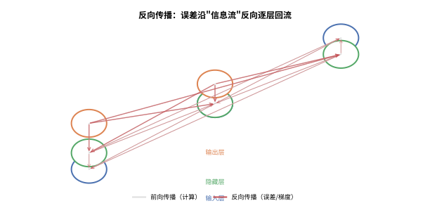
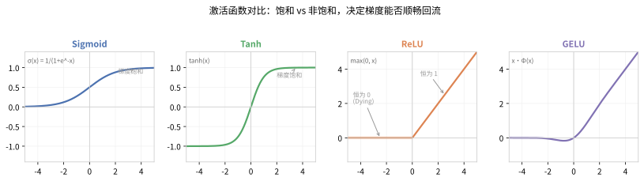
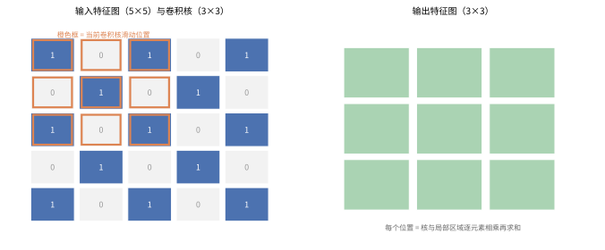
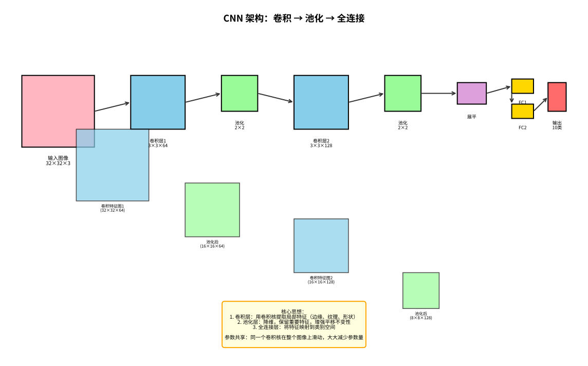
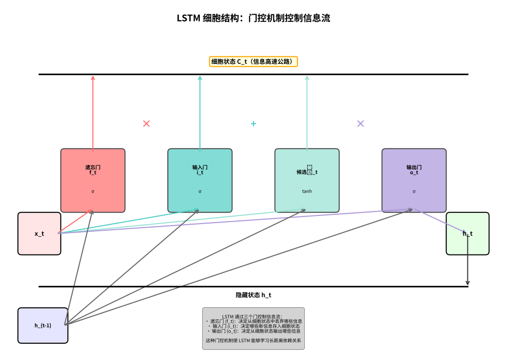
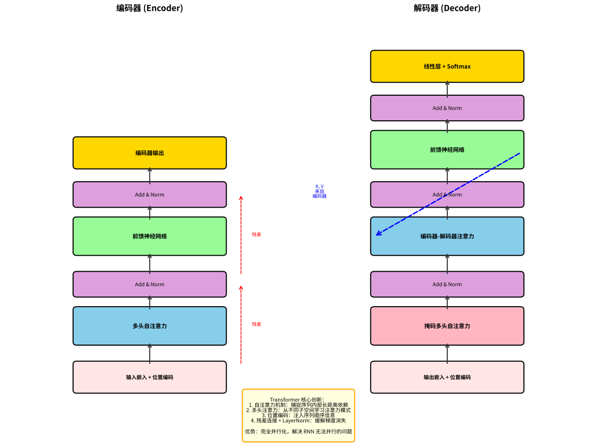
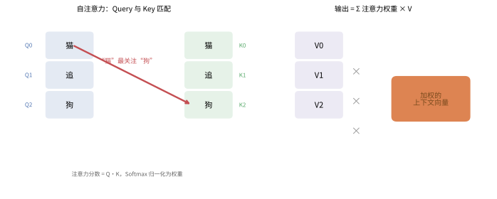
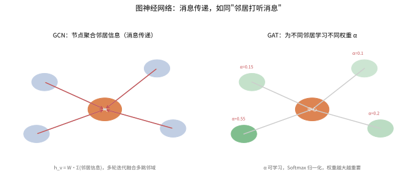

# 深度学习（Deep Learning）

> 深度学习是机器学习的一个子领域，通过构建多层神经网络来学习数据的层次化表示。从 2012 年 AlexNet 在 ImageNet 竞赛中夺冠开始，深度学习彻底改变了计算机视觉、自然语言处理、语音识别等领域，并成为当前 AI 大模型的核心技术基础。

---

## 目录

- [1. 多层感知机（MLP）与反向传播](#1-多层感知机mlp与反向传播)
  - [1.1 前向传播](#11-前向传播)
  - [1.2 反向传播](#12-反向传播)
  - [1.3 激活函数详解](#13-激活函数详解)
  - [1.4 MLP 完整代码实现](#14-mlp-完整代码实现)
- [2. 卷积神经网络（CNN）](#2-卷积神经网络cnn)
  - [2.1 卷积层](#21-卷积层)
  - [2.2 池化层](#22-池化层)
  - [2.3 CNN 经典模型演进](#23-cnn-经典模型演进)
  - [2.4 目标检测](#24-目标检测)
  - [2.5 图像分割](#25-图像分割)
  - [2.6 CNN 代码实现](#26-cnn-代码实现)
- [3. 循环神经网络（RNN）](#3-循环神经网络rnn)
  - [3.1 LSTM（长短期记忆网络）](#31-lstm长短期记忆网络)
  - [3.2 GRU（门控循环单元）](#32-gru门控循环单元)
  - [3.3 Seq2Seq 架构](#33-seq2seq-架构)
  - [3.4 BiLSTM（双向 LSTM）](#34-bilstm双向-lstm)
  - [3.5 RNN 代码实现](#35-rnn-代码实现)
- [4. Transformer 架构](#4-transformer-架构)
  - [4.1 自注意力机制](#41-自注意力机制)
  - [4.2 多头注意力](#42-多头注意力)
  - [4.3 位置编码](#43-位置编码)
  - [4.4 三种架构对比](#44-三种架构对比)
  - [4.5 Transformer 代码实现](#45-transformer-代码实现)
  - [4.6 高效注意力与长上下文](#46-高效注意力与长上下文)
- [5. 图神经网络（GNN）](#5-图神经网络gnn)
  - [5.1 GCN（图卷积网络）](#51-gcn图卷积网络)
  - [5.2 GAT（图注意力网络）](#52-gat图注意力网络)
  - [5.3 GraphSAGE](#53-graphsage)
  - [5.4 GIN（图同构网络）](#54-gin图同构网络)
  - [5.5 GNN 代码实现](#55-gnn-代码实现)
- [6. 优化器（Optimizer）](#6-优化器optimizer)
  - [6.1 核心思想](#61-核心思想)
  - [6.2 数学原理](#62-数学原理)
  - [6.3 学习率衰减与调度](#63-学习率衰减与调度)
  - [6.4 复杂度分析](#64-复杂度分析)
  - [6.5 优缺点对比](#65-优缺点对比)
  - [6.6 典型应用场景](#66-典型应用场景)
  - [6.7 Python 代码示例](#67-python-代码示例)
- [7. 归一化层（Normalization）](#7-归一化层normalization)
  - [7.1 核心思想](#71-核心思想)
  - [7.2 数学原理（BN / LN / IN / GN）](#72-数学原理bn-ln-in-gn)
  - [7.3 为什么 CNN 用 BatchNorm 而 Transformer 用 LayerNorm](#73-为什么-cnn-用-batchnorm-而-transformer-用-layernorm)
  - [7.4 四种归一化对比](#74-四种归一化对比)
  - [7.5 复杂度分析](#75-复杂度分析)
  - [7.6 优缺点](#76-优缺点)
  - [7.7 典型应用场景](#77-典型应用场景)
  - [7.8 Python 代码示例](#78-python-代码示例)
- [8. 正则化（Regularization）](#8-正则化regularization)
  - [8.1 核心思想（为什么需要正则化）](#81-核心思想为什么需要正则化)
  - [8.2 数学原理（L1/L2 与 Weight Decay）](#82-l1l2-正则化与-weight-decay)
  - [8.3 Dropout 与 Inverted Dropout](#83-dropout-与-inverted-dropout)
  - [8.4 其他正则化方法](#84-其他正则化方法)
  - [8.5 复杂度分析](#85-复杂度分析)
  - [8.6 优缺点对比](#86-优缺点对比)
  - [8.7 典型应用场景](#87-典型应用场景)
  - [8.8 Python 代码示例](#88-python-代码示例)
- [9. 词嵌入（Word Embedding）](#9-词嵌入word-embedding)
  - [9.1 核心思想：One-Hot 编码的缺陷](#91-核心思想one-hot-编码的缺陷)
  - [9.2 数学原理（Skip-gram 与负采样）](#92-数学原理skip-gram-与负采样)
  - [9.3 GloVe](#93-glove)
  - [9.4 词嵌入的性质与 OOV 问题](#94-词嵌入的性质与-oov-问题)
  - [9.5 与 Transformer Embedding 的衔接](#95-与-transformer-embedding-的衔接)
  - [9.6 复杂度分析](#96-复杂度分析)
  - [9.7 优缺点对比](#97-优缺点对比)
  - [9.8 典型应用场景](#98-典型应用场景)
  - [9.9 Python 代码示例](#99-python-代码示例)
- [10. 语音识别与时间序列建模](#10-语音识别与时间序列建模)
  - [10.1 语音识别基础](#101-语音识别基础)
  - [10.2 时序预测模型](#102-时序预测模型)
  - [10.3 与 NLP 的序列建模区别](#103-与-nlp-的序列建模区别)
  - [10.4 复杂度分析](#104-复杂度分析)
  - [10.5 优缺点对比](#105-优缺点对比)
  - [10.6 典型应用场景](#106-典型应用场景)
  - [10.7 Python 代码示例](#107-python-代码示例)
- [11. 元学习与持续学习](#11-元学习与持续学习)
  - [11.1 元学习（Meta-Learning）](#111-元学习meta-learning)
  - [11.2 持续学习（Continual Learning）](#112-持续学习continual-learning)
  - [11.3 复杂度分析](#113-复杂度分析)
  - [11.4 优缺点对比](#114-优缺点对比)
  - [11.5 典型应用场景](#115-典型应用场景)
  - [11.6 Python 代码示例](#116-python-代码示例)
- [12. 分布式训练与联邦学习](#12-分布式训练与联邦学习)
  - [12.1 分布式训练](#121-分布式训练)
  - [12.2 联邦学习（Federated Learning）](#122-联邦学习federated-learning)
  - [12.3 复杂度与通信开销分析](#123-复杂度与通信开销分析)
  - [12.4 优缺点对比](#124-优缺点对比)
  - [12.5 典型应用场景](#125-典型应用场景)
  - [12.6 Python 代码示例](#126-python-代码示例)

---

## 1. 多层感知机（MLP）与反向传播

多层感知机（Multilayer Perceptron, MLP）是最基础的神经网络结构，由**输入层**、若干**隐藏层**和**输出层**组成，层与层之间全连接（Fully Connected）。MLP 的核心贡献是证明了**带隐藏层的神经网络可以逼近任意连续函数**（通用近似定理），同时**反向传播算法**解决了多层网络的训练问题。

### 1.1 前向传播

> 💡 **类比：前向传播如同"流水线加工"**
>
> 想象一个工厂的生产流水线，原材料（输入 x）经过多道工序（隐藏层）最终变成成品（输出 ŷ）：
> - **每一层**：一道工序，有自己的"工具"（权重 W）和"微调参数"（偏置 b）
> - **加权求和**：把上一道工序送来的半成品按工具的权重组合起来
> - **激活函数**：决定这道工序"开不开工"——信号够强就继续传递，太弱就停下来
> - **逐层传递**：一层做完交给下一层，直到最后一道工序产出成品
>
> 前向传播就是"数据从输入流向输出的单向旅程"，每一步都是线性变换（W·x+b）加上非线性激活（f），组合起来就能逼近任意复杂的函数。

前向传播（Forward Propagation）是数据从输入层逐层向输出层流动的过程。对于第 $l$ 层，其计算过程为：

$$ \mathbf{z}^{(l)} = \mathbf{W}^{(l)} \mathbf{a}^{(l-1)} + \mathbf{b}^{(l)} $$

$$ \mathbf{a}^{(l)} = f^{(l)}(\mathbf{z}^{(l)}) $$

其中：
- $\mathbf{a}^{(l-1)}$ 是第 $l-1$ 层的输出（激活值）
- $\mathbf{W}^{(l)} \in \mathbb{R}^{n_l \times n_{l-1}}$ 是第 $l$ 层的权重矩阵
- $\mathbf{b}^{(l)} \in \mathbb{R}^{n_l}$ 是第 $l$ 层的偏置向量
- $f^{(l)}(\cdot)$ 是第 $l$ 层的激活函数
- $\mathbf{a}^{(l)}$ 是第 $l$ 层的输出

对于一个 $L$ 层的网络，整个前向传播过程为：

$$ \mathbf{x} \rightarrow \mathbf{a}^{(1)} \rightarrow \mathbf{a}^{(2)} \rightarrow \cdots \rightarrow \mathbf{a}^{(L)} = \hat{\mathbf{y}} $$

**损失函数**衡量预测值 $\hat{\mathbf{y}}$ 与真实值 $\mathbf{y}$ 之间的差距。对于回归任务，常用均方误差（MSE）：

$$ \mathcal{L}(\mathbf{y}, \hat{\mathbf{y}}) = \frac{1}{2} \|\mathbf{y} - \hat{\mathbf{y}}\|^2 = \frac{1}{2} \sum_{i=1}^{n_L} (y_i - \hat{y}_i)^2 $$

对于分类任务，常用交叉熵损失（Cross-Entropy Loss）：

$$ \mathcal{L}(\mathbf{y}, \hat{\mathbf{y}}) = -\sum_{i=1}^{C} y_i \log \hat{y}_i $$

其中 $C$ 是类别数，$\hat{y}_i$ 是模型预测第 $i$ 类的概率（经过 Softmax 归一化）。

### 1.2 反向传播

> 💡 **类比：反向传播如同"责任追溯"**
>
> 想象一个公司出了质量问题，要从最终产品一路追溯回去找原因：
> - **输出层**：客户投诉产品不好（损失函数）
> - **反向传递**：质检部门问"是最后一道工序问题吗？"→ 是装配问题还是零件问题？
> - **链式法则**：每个环节都要算"我的问题占多大比例"（梯度）
> - **逐层回溯**：从最后一道工序一直追溯到原材料供应商，每个环节都算出自己的"责任大小"
> - **参数更新**：根据责任大小，每个环节改进自己的工作（梯度下降）
>
> 反向传播就是"从结果倒推，算出每个参数该负多大责任，然后按责任大小调整"。没有它，深度网络根本无法训练——因为你不知道哪一层的参数该改、改多少。

反向传播（Backpropagation, BP）是训练多层网络的核心算法，其本质是**链式法则（Chain Rule）**的反复应用。目标是计算损失函数 $\mathcal{L}$ 对每个参数的梯度 $\frac{\partial \mathcal{L}}{\partial \mathbf{W}^{(l)}}$ 和 $\frac{\partial \mathcal{L}}{\partial \mathbf{b}^{(l)}}$，然后使用梯度下降更新参数。

#### 1.2.1 链式法则回顾

若 $y = f(u)$ 且 $u = g(x)$，则：

$$ \frac{dy}{dx} = \frac{dy}{du} \cdot \frac{du}{dx} $$

对于多变量情况，若 $z = f(x, y)$，$x = g(t)$，$y = h(t)$，则：

$$ \frac{dz}{dt} = \frac{\partial z}{\partial x} \frac{dx}{dt} + \frac{\partial z}{\partial y} \frac{dy}{dt} $$

#### 1.2.2 反向传播推导

定义第 $l$ 层的**误差信号**（Error Signal）$\delta^{(l)}$ 为损失函数对第 $l$ 层净输入 $\mathbf{z}^{(l)}$ 的偏导数：

$$ \delta^{(l)} = \frac{\partial \mathcal{L}}{\partial \mathbf{z}^{(l)}} $$

**输出层（第 $L$ 层）的误差信号**：

对于 MSE 损失 + Sigmoid 输出的二分类问题：

$$ \delta^{(L)} = \frac{\partial \mathcal{L}}{\partial \mathbf{z}^{(L)}} = (\hat{\mathbf{y}} - \mathbf{y}) \odot f'(\mathbf{z}^{(L)}) $$

对于交叉熵损失 + Softmax 输出的多分类问题，推导结果是：

$$ \delta^{(L)} = \hat{\mathbf{y}} - \mathbf{y} $$

这是极为简洁的形式，也是交叉熵 + Softmax 组合被广泛使用的原因。

**隐藏层的误差信号（误差反向传播）**：

通过链式法则，将第 $l+1$ 层的误差传播回第 $l$ 层：

$$ \delta^{(l)} = \left( (\mathbf{W}^{(l+1)})^\top \delta^{(l+1)} \right) \odot f'(\mathbf{z}^{(l)}) $$

其中 $\odot$ 表示逐元素相乘（Hadamard 积）。

**参数梯度计算**：

$$ \frac{\partial \mathcal{L}}{\partial \mathbf{W}^{(l)}} = \delta^{(l)} (\mathbf{a}^{(l-1)})^\top $$

$$ \frac{\partial \mathcal{L}}{\partial \mathbf{b}^{(l)}} = \delta^{(l)} $$

**参数更新（梯度下降）**：

$$ \mathbf{W}^{(l)} \leftarrow \mathbf{W}^{(l)} - \eta \frac{\partial \mathcal{L}}{\partial \mathbf{W}^{(l)}} $$

$$ \mathbf{b}^{(l)} \leftarrow \mathbf{b}^{(l)} - \eta \frac{\partial \mathcal{L}}{\partial \mathbf{b}^{(l)}} $$

其中 $\eta$ 是学习率（Learning Rate）。

#### 1.2.3 反向传播的完整流程

```
算法：反向传播（Stochastic Gradient Descent）

输入：训练样本 (x, y)，网络结构 {n_1, n_2, ..., n_L}

1. 前向传播：
   a^{(0)} = x
   for l = 1 to L:
       z^{(l)} = W^{(l)} a^{(l-1)} + b^{(l)}
       a^{(l)} = f(z^{(l)})
   输出预测值 ŷ = a^{(L)}

2. 计算输出层误差：
   δ^{(L)} = ∇_ŷ L ⊙ f'(z^{(L)})

3. 反向传播误差：
   for l = L-1 down to 1:
       δ^{(l)} = ((W^{(l+1)})^T δ^{(l+1)}) ⊙ f'(z^{(l)})

4. 计算梯度并更新参数：
   for l = 1 to L:
       W^{(l)} ← W^{(l)} - η · δ^{(l)} (a^{(l-1)})^T
       b^{(l)} ← b^{(l)} - η · δ^{(l)}
```

> 💡 **类比：接力传话，误差要原路退回** 可以把前向传播想成"食堂打饭"——数据从输入层一路加工到输出层；而反向传播则像"老板发现菜做错了，要沿着盛菜的流水线把责任（误差）逐级退回去"。关键在于**每一级的责任只由它直接取用的材料承担**，这正是链式法则的含义：多个环节耦合成一个链条时，某一个环节的"债"要乘以链条上所有环节的"放大倍数"才传得到源头。误差越大、路径越陡，源头得到的修正信号就越强。下图展示误差（红色）如何从输出层反向回流到输入层。



#### 1.2.4 梯度消失与梯度爆炸

反向传播在深层网络中面临两个关键问题：

- **梯度消失（Vanishing Gradient）**：当使用 Sigmoid/Tanh 等饱和激活函数时，梯度在反向传播中逐层缩小，导致浅层网络参数几乎不更新。这是因为 $f'(z)$ 在饱和区域趋近于 0，多层相乘后指数级衰减。
- **梯度爆炸（Exploding Gradient）**：当权重初始化过大时，梯度在反向传播中逐层放大，导致参数更新失控。

**解决方案**：
- 使用 ReLU 等非饱和激活函数（梯度恒为 0 或 1）
- 批归一化（Batch Normalization）
- 残差连接（Residual Connection）
- 合理的权重初始化（Xavier/Glorot 初始化、He 初始化）
- 梯度裁剪（Gradient Clipping）

### 1.3 激活函数详解

> 💡 **类比：激活函数如同"开关与阀门"**
>
> 想象水管系统中的各种阀门：
> - **Sigmoid**：像单向阀门，水压小时慢慢打开（输出0到1之间），水压大到一定程度就完全打开（饱和），信号再也传不过去
> - **ReLU**：像单向截止阀，水压不够就完全关闭（输出0），水压够了就完全打开（线性通过），简单高效
> - **Tanh**：像双向阀门，可以正向流通也可以反向截止（输出-1到1），比Sigmoid更对称
>
> 没有激活函数，神经网络就像一堆直通水管——无论多少层，水流都是线性叠加，永远学不会复杂的非线性关系。激活函数就是让网络"活"起来的关键。

激活函数是神经网络中引入**非线性**的关键组件，没有激活函数的多层网络等价于单层线性变换。

#### 1.3.1 Sigmoid

$$ \sigma(x) = \frac{1}{1 + e^{-x}} $$

**导数**：$\sigma'(x) = \sigma(x)(1 - \sigma(x))$

**特点**：
- 输出范围 $(0, 1)$，适合表示概率
- 梯度饱和：当 $|x|$ 较大时，梯度趋近于 0，导致梯度消失
- 输出非零均值（恒为正值），可能导致下一层输入偏置
- 计算涉及指数运算，相对较慢

**复杂度**：$O(1)$ 前向，$O(1)$ 反向

**应用场景**：二分类输出层、LSTM 门控单元

#### 1.3.2 Tanh

$$ \tanh(x) = \frac{e^x - e^{-x}}{e^x + e^{-x}} = 2\sigma(2x) - 1 $$

**导数**：$\tanh'(x) = 1 - \tanh^2(x)$

**特点**：
- 输出范围 $(-1, 1)$，零均值对称
- 梯度饱和问题仍然存在（比 Sigmoid 略好）
- 零均值输出有助于缓解"偏置偏移"问题

**复杂度**：$O(1)$ 前向，$O(1)$ 反向

**应用场景**：RNN 门控单元、传统 MLP 隐藏层

#### 1.3.3 ReLU（Rectified Linear Unit）

$$ \text{ReLU}(x) = \max(0, x) $$

**导数**：
$$ \text{ReLU}'(x) = \begin{cases} 1, & x > 0 \\ 0, & x \leq 0 \end{cases} $$

**特点**：
- 计算极简，仅需一次比较操作
- 正半轴梯度恒为 1，有效缓解梯度消失
- 稀疏激活（约 50% 的神经元输出为 0）
- **Dying ReLU 问题**：当参数更新导致输入始终为负时，神经元永久失活（梯度为 0，再也无法更新）

**复杂度**：$O(1)$ 前向，$O(1)$ 反向

**应用场景**：CNN 隐藏层（最常用激活函数）、MLP 隐藏层

#### 1.3.4 GELU（Gaussian Error Linear Unit）

$$ \text{GELU}(x) = x \cdot \Phi(x) $$

其中 $\Phi(x)$ 是标准正态分布的累积分布函数（CDF），常用近似表示为：

$$ \text{GELU}(x) \approx 0.5x \left(1 + \tanh\left(\sqrt{\frac{2}{\pi}}(x + 0.044715x^3)\right)\right) $$

**导数**：$\text{GELU}'(x) = \Phi(x) + x \cdot \phi(x)$，其中 $\phi(x)$ 是标准正态分布的 PDF。

**特点**：
- 平滑的 ReLU 变体，处处可微
- 非线性比 ReLU 更丰富，保留了负半轴的微小梯度
- 在 Transformer 系列模型（BERT、GPT）中广泛使用
- 计算复杂度高于 ReLU，但效果更好

**复杂度**：$O(1)$ 前向（含近似计算），$O(1)$ 反向

**应用场景**：Transformer 隐藏层、BERT/GPT/LLaMA 等大模型

#### 1.3.5 激活函数对比

> 💡 **类比：饱和激活函数像"沙漏做得太窄的漏斗"** 想象一个漏斗，沙子（误差信号）顺畅地往下流，就相当于 ReLU——只要输入为正，梯度恒为 1，信号畅通无阻。而 Sigmoid/Tanh 就像窄口的漏斗，沙子多时会在出口"堵住"：当输入 $|x|$ 很大时，函数已经顶到天花板（0 或 $-1$），再好的"推力"也几乎带不动它，梯度趋近 0。这就是**梯度饱和**。深层网络里，每一层稍微"堵一点"，几十层连乘起来信号就消失殆尽。下图直观对比四种常用激活函数的形态与饱和区域。



| 激活函数 | 公式 | 输出范围 | 梯度饱和 | 计算复杂度 | 使用频率 |
|---------|------|---------|---------|-----------|---------|
| Sigmoid | $\frac{1}{1+e^{-x}}$ | $(0, 1)$ | 严重 | 低 | 较少（门控用） |
| Tanh | $\frac{e^x-e^{-x}}{e^x+e^{-x}}$ | $(-1, 1)$ | 较严重 | 低 | 较少（门控用） |
| ReLU | $\max(0, x)$ | $[0, \infty)$ | 无 | 极低 | 非常广泛 |
| Leaky ReLU | $\max(\alpha x, x)$ | $(-\infty, \infty)$ | 无 | 极低 | 广泛 |
| GELU | $x\Phi(x)$ | $(-\infty, \infty)$ | 无 | 中等 | 大模型标准 |
| Swish/SiLU | $x\sigma(x)$ | $(-\infty, \infty)$ | 无 | 中等 | 较新模型 |

### 1.4 MLP 完整代码实现

以下代码实现了一个完整的 MLP，包含前向传播、反向传播和训练过程，使用 NumPy 从零实现。

```python
import numpy as np
from typing import List, Tuple, Callable, Optional

class MLP:
    """
    多层感知机（从零实现，纯 NumPy）
    
    支持前向传播、反向传播、SGD 训练，支持多种激活函数。
    """
    
    def __init__(
        self,
        layer_sizes: List[int],
        activation: str = 'relu',
        output_activation: str = 'softmax',
        seed: int = 42
    ):
        """
        参数:
            layer_sizes: 每层神经元数量，如 [784, 256, 128, 10]
            activation: 隐藏层激活函数 ('relu', 'sigmoid', 'tanh', 'gelu')
            output_activation: 输出层激活函数 ('softmax', 'sigmoid', 'linear')
            seed: 随机种子
        """
        np.random.seed(seed)
        self.layer_sizes = layer_sizes
        self.num_layers = len(layer_sizes) - 1  # 权重层数
        self.activation = activation
        self.output_activation = output_activation
        
        # 初始化权重和偏置 (Xavier/Glorot 初始化)
        self.W = []  # 权重列表
        self.b = []  # 偏置列表
        
        for i in range(self.num_layers):
            # Xavier 初始化: 均匀分布 U(-√(6/(n_in+n_out)), √(6/(n_in+n_out)))
            limit = np.sqrt(6 / (layer_sizes[i] + layer_sizes[i+1]))
            W_i = np.random.uniform(-limit, limit, (layer_sizes[i], layer_sizes[i+1]))
            b_i = np.zeros((1, layer_sizes[i+1]))
            self.W.append(W_i)
            self.b.append(b_i)
        
        # 缓存中间变量（用于反向传播）
        self.cache = {}
    
    def _activate(self, z: np.ndarray, name: str) -> np.ndarray:
        """激活函数前向"""
        if name == 'relu':
            return np.maximum(0, z)
        elif name == 'sigmoid':
            return 1 / (1 + np.exp(-np.clip(z, -500, 500)))
        elif name == 'tanh':
            return np.tanh(z)
        elif name == 'gelu':
            # GELU 近似: 0.5x * (1 + tanh(√(2/π) * (x + 0.044715x^3)))
            return 0.5 * z * (1 + np.tanh(
                np.sqrt(2 / np.pi) * (z + 0.044715 * z**3)
            ))
        elif name == 'softmax':
            # 数值稳定的 Softmax
            z_shifted = z - np.max(z, axis=1, keepdims=True)
            exp_z = np.exp(z_shifted)
            return exp_z / np.sum(exp_z, axis=1, keepdims=True)
        elif name == 'linear':
            return z
        else:
            raise ValueError(f"Unknown activation: {name}")
    
    def _activate_derivative(self, z: np.ndarray, name: str) -> np.ndarray:
        """激活函数导数（用于反向传播）"""
        if name == 'relu':
            return (z > 0).astype(float)
        elif name == 'sigmoid':
            s = self._activate(z, 'sigmoid')
            return s * (1 - s)
        elif name == 'tanh':
            return 1 - np.tanh(z) ** 2
        elif name == 'gelu':
            # GELU 导数的近似: Φ(x) + x * φ(x)
            # 使用数值导数
            eps = 1e-6
            return (self._activate(z + eps, 'gelu') - self._activate(z - eps, 'gelu')) / (2 * eps)
        elif name == 'linear':
            return np.ones_like(z)
        else:
            raise ValueError(f"Unknown activation: {name}")
    
    def forward(self, X: np.ndarray) -> np.ndarray:
        """
        前向传播
        
        参数:
            X: 输入数据, shape (batch_size, input_dim)
        
        返回:
            输出层激活值, shape (batch_size, output_dim)
        """
        self.cache = {}
        a = X
        self.cache['a0'] = a
        
        for i in range(self.num_layers):
            z = np.dot(a, self.W[i]) + self.b[i]
            self.cache[f'z{i+1}'] = z
            
            if i == self.num_layers - 1:
                # 输出层
                a = self._activate(z, self.output_activation)
            else:
                # 隐藏层
                a = self._activate(z, self.activation)
            
            self.cache[f'a{i+1}'] = a
        
        return a
    
    def backward(self, y_true: np.ndarray, y_pred: np.ndarray) -> Tuple[List[np.ndarray], List[np.ndarray]]:
        """
        反向传播
        
        参数:
            y_true: 真实标签, shape (batch_size, output_dim)
            y_pred: 预测值, shape (batch_size, output_dim)
        
        返回:
            dW_list: 权重梯度列表
            db_list: 偏置梯度列表
        """
        batch_size = y_true.shape[0]
        dW_list = [None] * self.num_layers
        db_list = [None] * self.num_layers
        
        # 输出层误差信号
        # 对于交叉熵 + Softmax，δ = y_pred - y_true
        if self.output_activation == 'softmax':
            delta = y_pred - y_true
        else:
            # MSE + 其他激活函数
            dz = self._activate_derivative(self.cache[f'z{self.num_layers}'], self.output_activation)
            delta = (y_pred - y_true) * dz / batch_size
        
        # 输出层梯度
        dW_list[self.num_layers - 1] = np.dot(self.cache[f'a{self.num_layers - 1}'].T, delta)
        db_list[self.num_layers - 1] = np.sum(delta, axis=0, keepdims=True)
        
        # 反向传播到隐藏层
        for i in range(self.num_layers - 2, -1, -1):
            # 误差反向传播
            delta = np.dot(delta, self.W[i + 1].T) * self._activate_derivative(
                self.cache[f'z{i + 1}'], self.activation
            )
            
            # 计算梯度
            dW_list[i] = np.dot(self.cache[f'a{i}'].T, delta)
            db_list[i] = np.sum(delta, axis=0, keepdims=True)
        
        return dW_list, db_list
    
    def update(self, dW_list: List[np.ndarray], db_list: List[np.ndarray], lr: float):
        """SGD 参数更新"""
        for i in range(self.num_layers):
            self.W[i] -= lr * dW_list[i]
            self.b[i] -= lr * db_list[i]
    
    def train(
        self,
        X: np.ndarray,
        y: np.ndarray,
        X_val: Optional[np.ndarray] = None,
        y_val: Optional[np.ndarray] = None,
        epochs: int = 100,
        batch_size: int = 32,
        lr: float = 0.01,
        verbose: bool = True
    ):
        """
        训练 MLP
        
        参数:
            X: 训练数据
            y: 训练标签 (one-hot 编码)
            X_val: 验证数据
            y_val: 验证标签
            epochs: 训练轮数
            batch_size: 批大小
            lr: 学习率
            verbose: 是否打印训练信息
        """
        n_samples = X.shape[0]
        
        for epoch in range(epochs):
            # 打乱数据
            indices = np.random.permutation(n_samples)
            X_shuffled = X[indices]
            y_shuffled = y[indices]
            
            # 小批量 SGD
            for start in range(0, n_samples, batch_size):
                end = min(start + batch_size, n_samples)
                X_batch = X_shuffled[start:end]
                y_batch = y_shuffled[start:end]
                
                # 前向传播
                y_pred = self.forward(X_batch)
                
                # 反向传播
                dW, db = self.backward(y_batch, y_pred)
                
                # 参数更新
                self.update(dW, db, lr)
            
            # 计算训练损失和准确率
            train_pred = self.forward(X)
            train_loss = self._cross_entropy(y, train_pred)
            train_acc = self._accuracy(y, train_pred)
            
            if verbose and (epoch + 1) % 10 == 0:
                log = f"Epoch {epoch + 1:3d}/{epochs} | Loss: {train_loss:.4f} | Acc: {train_acc:.4f}"
                if X_val is not None and y_val is not None:
                    val_pred = self.forward(X_val)
                    val_loss = self._cross_entropy(y_val, val_pred)
                    val_acc = self._accuracy(y_val, val_pred)
                    log += f" | Val Loss: {val_loss:.4f} | Val Acc: {val_acc:.4f}"
                print(log)
    
    def predict(self, X: np.ndarray) -> np.ndarray:
        """预测类别"""
        y_pred = self.forward(X)
        return np.argmax(y_pred, axis=1)
    
    def _cross_entropy(self, y_true: np.ndarray, y_pred: np.ndarray) -> float:
        """交叉熵损失"""
        # 数值稳定性：添加小 epsilon 防止 log(0)
        eps = 1e-12
        y_pred = np.clip(y_pred, eps, 1 - eps)
        return -np.mean(np.sum(y_true * np.log(y_pred), axis=1))
    
    def _accuracy(self, y_true: np.ndarray, y_pred: np.ndarray) -> float:
        """准确率"""
        true_labels = np.argmax(y_true, axis=1)
        pred_labels = np.argmax(y_pred, axis=1)
        return np.mean(true_labels == pred_labels)


# ============ 使用示例 ============

if __name__ == "__main__":
    # 生成模拟数据：XOR 问题（经典的非线性可分问题）
    np.random.seed(42)
    n_samples = 1000
    
    X = np.random.randn(n_samples, 2)
    y = ((X[:, 0] * X[:, 1]) > 0).astype(int)  # XOR 标签
    
    # one-hot 编码
    y_onehot = np.zeros((n_samples, 2))
    y_onehot[np.arange(n_samples), y] = 1
    
    # 划分训练集和验证集
    split = int(0.8 * n_samples)
    X_train, X_val = X[:split], X[split:]
    y_train, y_val = y_onehot[:split], y_onehot[split:]
    
    # 创建 MLP: 输入 2 维 -> 隐藏层 16 维 -> 隐藏层 8 维 -> 输出 2 维
    model = MLP([2, 16, 8, 2], activation='relu', output_activation='softmax')
    
    # 训练
    model.train(
        X_train, y_train,
        X_val=X_val, y_val=y_val,
        epochs=200, batch_size=32, lr=0.01
    )
    
    # 测试
    test_pred = model.predict(X_val)
    true_labels = np.argmax(y_val, axis=1)
    print(f"\nTest Accuracy: {np.mean(test_pred == true_labels):.4f}")
```

---

## 2. 卷积神经网络（CNN）

卷积神经网络（Convolutional Neural Network, CNN）是专为处理**网格状结构数据**（如图像）设计的深度学习架构。其核心思想是**局部感知**（Local Connectivity）、**权重共享**（Weight Sharing）和**池化降采样**（Pooling）。

### 2.1 卷积层

卷积层通过可学习的卷积核（Kernel/Filter）在输入上滑动窗口计算，提取局部特征。

> 💡 **类比：用放大镜在照片上逐格扫描** 卷积就像拿一个固定大小的"放大镜"（卷积核）在整张照片上"扫"。每挪一个位置，放大镜就把那一小块区域"浓缩"成一个数字（逐元素相乘再求和）。因为同一个放大镜走遍全图，所以同一套参数（权重）被反复使用——这就是**权重共享**，既大大减少了参数量，又能让"认出这块花纹"的能力平移地应用到图像任何位置（平移等变性）。下图左侧是被高亮为橙色框的卷积核当前位置，右侧是它扫描后得到的特征图。





#### 2.1.1 卷积运算定义

对于输入 $\mathbf{X} \in \mathbb{R}^{H \times W \times C_{in}}$ 和卷积核 $\mathbf{K} \in \mathbb{R}^{K_h \times K_w \times C_{in} \times C_{out}}$，输出特征图 $\mathbf{Y} \in \mathbb{R}^{H' \times W' \times C_{out}}$ 中每个元素的计算方式为：

$$ \mathbf{Y}[i, j, k] = \sum_{c=0}^{C_{in}-1} \sum_{u=0}^{K_h-1} \sum_{v=0}^{K_w-1} \mathbf{X}[i \cdot s + u, j \cdot s + v, c] \cdot \mathbf{K}[u, v, c, k] + b_k $$

其中 $s$ 是步长（Stride），$b_k$ 是偏置。

**输出尺寸计算**：

$$ H' = \left\lfloor \frac{H + 2p - K_h}{s} \right\rfloor + 1 $$

$$ W' = \left\lfloor \frac{W + 2p - K_w}{s} \right\rfloor + 1 $$

其中 $p$ 是填充（Padding）大小。

#### 2.1.2 卷积核的特性

- **局部感知**：每个神经元只连接输入的局部区域（感受野，Receptive Field）
- **权重共享**：同一个卷积核在整个输入上滑动，参数量与输入尺寸无关
- **平移等变性**（Translation Equivariance）：输入平移后，输出也相应平移

#### 2.1.3 卷积层参数量与计算量

**参数量**：$K_h \times K_w \times C_{in} \times C_{out} + C_{out}$（权重 + 偏置）

**计算量（FLOPs）**：$2 \times K_h \times K_w \times C_{in} \times C_{out} \times H' \times W'$

**复杂度分析**：$O(K_h \cdot K_w \cdot C_{in} \cdot C_{out} \cdot H' \cdot W')$

对比全连接层，卷积层的参数量通常小 1-3 个数量级。例如，对于 $224 \times 224 \times 3$ 的输入，一个 $3 \times 3$ 卷积（64 个输出通道）仅有 $3 \times 3 \times 3 \times 64 + 64 = 1,792$ 个参数，而全连接层需要 $224 \times 224 \times 3 \times 64 \approx 9.6 \times 10^6$ 个参数。

#### 2.1.4 1×1 卷积

$1 \times 1$ 卷积（Network in Network）的核心作用是**跨通道信息融合**和**维度升降**：

- 升维/降维：改变通道数
- 引入非线性：在 $1 \times 1$ 卷积后接激活函数
- 计算量远小于 $3 \times 3$ 卷积，常用于瓶颈结构（Bottleneck）

### 2.2 池化层

> 💡 **类比：池化层如同"新闻摘要"**
>
> 想象你有一张 1000×1000 像素的高清照片，但只需要知道"图里有什么"：
> - **池化操作**：把图片分成 2×2 的小块，每块只保留最重要的信息（最大池化）或平均信息（平均池化）
> - **降维效果**：1000×1000 → 500×500 → 250×250，信息量减少但关键特征保留
> - **平移不变性**：无论猫在图片左边还是右边，池化后都能检测到"有猫"
>
> 池化层就是 CNN 的"信息压缩器"——用更少的数据保留更重要的特征，让网络更高效。

池化层（Pooling Layer）对特征图进行下采样，降低空间维度，减少参数量和计算量，并增强**平移不变性**。

#### 2.2.1 最大池化（Max Pooling）

$$ \mathbf{Y}[i, j, k] = \max_{u=0}^{K-1} \max_{v=0}^{K-1} \mathbf{X}[i \cdot s + u, j \cdot s + v, k] $$

**特点**：
- 保留每个区域内的最强响应
- 对纹理、边缘等特征更敏感
- 是 CNN 中最常用的池化方式

#### 2.2.2 平均池化（Average Pooling）

$$ \mathbf{Y}[i, j, k] = \frac{1}{K^2} \sum_{u=0}^{K-1} \sum_{v=0}^{K-1} \mathbf{X}[i \cdot s + u, j \cdot s + v, k] $$

**特点**：
- 保留每个区域内的整体特征
- 对背景信息更敏感
- 常用于全局平均池化（Global Average Pooling）替代全连接层

#### 2.2.3 全局平均池化（Global Average Pooling, GAP）

对整个特征图取平均，将 $H \times W \times C$ 的特征图直接压缩为 $1 \times 1 \times C$。GAP 在 ResNet、GoogLeNet 等现代 CNN 中广泛使用，替代全连接层，大幅减少参数量。

### 2.3 CNN 经典模型演进

#### 2.3.1 LeNet-5（1998）

**核心创新**：首个实用的 CNN 架构，奠定了"卷积+池化+全连接"的标准 CNN 范式。

**网络结构**：
```
输入 (32×32) → Conv(6@5×5) → AvgPool(2×2) → Conv(16@5×5) → AvgPool(2×2) → FC(120) → FC(84) → FC(10)
```

- 使用 Tanh 激活函数
- 参数量约 60K
- 在 MNIST 手写数字识别上达到 99.2% 准确率

**应用场景**：手写数字识别（银行支票、邮政编码识别）

#### 2.3.2 AlexNet（2012）

**核心创新**：
1. **ReLU 激活函数**：加速训练，缓解梯度消失
2. **Dropout 正则化**：随机丢弃神经元，防止过拟合
3. **GPU 并行训练**：使用两块 GTX 580 GPU 并行计算
4. **数据增强**：随机裁剪、水平翻转、颜色抖动

**网络结构**：
```
输入 (227×227×3) → Conv(96@11×11, s=4) → MaxPool(3×3, s=2)
→ Conv(256@5×5) → MaxPool(3×3, s=2)
→ Conv(384@3×3) → Conv(384@3×3) → Conv(256@3×3) → MaxPool(3×3, s=2)
→ FC(4096) → Dropout → FC(4096) → Dropout → FC(1000) → Softmax
```

**参数量**：约 60M（其中全连接层占 90%+）

**复杂度**：前向传播约 7.2 亿 FLOPs

**影响**：在 2012 年 ImageNet 竞赛中以 15.3% 的错误率（第二名 26%）碾压式夺冠，引爆深度学习革命。

#### 2.3.3 VGG（2014）

**核心创新**：
1. **小卷积核堆叠**：使用 $3 \times 3$ 卷积核堆叠替代大卷积核（两个 $3 \times 3$ 堆叠等价于一个 $5 \times 5$ 感受野，三个堆叠等价于 $7 \times 7$）
2. **更深的网络**：VGG16 有 16 层，VGG19 有 19 层
3. **统一的卷积配置**：所有卷积层使用 $3 \times 3$，步长 1，填充 1

**参数量**：VGG16 约 138M，VGG19 约 144M

**复杂度**：VGG16 前向约 153 亿 FLOPs（计算量是 AlexNet 的 20 倍以上）

**缺点**：参数量和计算量巨大，全连接层占用大量内存

**VGG 的参数量分析**：
- 前两个全连接层各 4096 个神经元，参数量为 $512 \times 7 \times 7 \times 4096 + 4096 \times 4096 \approx 102M$，占总参数的 74%

#### 2.3.4 ResNet（2015）

**核心创新**：**残差连接（Residual Connection / Skip Connection）**

解决深层网络的**退化问题**（Degradation Problem）：随着网络加深，训练准确率反而饱和甚至下降。这不是过拟合，而是优化困难。

**残差模块**：

$$ \mathbf{y} = \mathcal{F}(\mathbf{x}, \{W_i\}) + \mathbf{x} $$

其中 $\mathcal{F}(\mathbf{x}, \{W_i\})$ 是残差映射（通常是两层卷积），$\mathbf{x}$ 是恒等映射（Identity Mapping）。

**原理**：残差连接使得梯度可以直接通过恒等分支传播到浅层，有效缓解梯度消失。即使残差分支的梯度为 0，恒等分支也能保证梯度正常传播。

**ResNet 系列**：

| 变体 | 层数 | 结构特点 | ImageNet Top-5 错误率 |
|------|------|---------|---------------------|
| ResNet-18 | 18 | 基础残差模块 | 10.92% |
| ResNet-34 | 34 | 基础残差模块 | 9.05% |
| ResNet-50 | 50 | 瓶颈模块（Bottleneck） | 7.85% |
| ResNet-101 | 101 | 瓶颈模块 | 7.33% |
| ResNet-152 | 152 | 瓶颈模块 | 6.71% |

**瓶颈模块（Bottleneck Block）**：$1 \times 1$ 卷积降维 → $3 \times 3$ 卷积 → $1 \times 1$ 卷积升维，大幅降低计算量。

**参数量**：ResNet-50 约 25.6M

**复杂度**：ResNet-50 前向约 38 亿 FLOPs

**影响**：152 层 ResNet 在 ImageNet 上达到 3.57% 的错误率，超越人类水平（约 5%）。残差连接成为所有现代深度网络的标准组件。

#### 2.3.5 EfficientNet（2019）

**核心创新**：**复合缩放（Compound Scaling）**——同时平衡网络的三个维度：

1. **深度（Depth）**：网络层数
2. **宽度（Width）**：每层通道数
3. **分辨率（Resolution）**：输入图像尺寸

**复合缩放公式**：

$$ d = \alpha^\phi, \quad w = \beta^\phi, \quad r = \gamma^\phi $$

其中 $\alpha \cdot \beta^2 \cdot \gamma^2 \approx 2$（FLOPs 预算约束），$\phi$ 是缩放系数。

**MBConv（Mobile Inverted Bottleneck Conv）**：使用深度可分离卷积（Depthwise Separable Convolution），在 MobileNetV2 基础上引入 SE（Squeeze-and-Excitation）注意力机制。

**EfficientNet 系列**：

| 模型 | 参数量 | FLOPs | ImageNet Top-1 准确率 |
|------|--------|-------|---------------------|
| EfficientNet-B0 | 5.3M | 0.39B | 77.3% |
| EfficientNet-B1 | 7.8M | 0.70B | 79.2% |
| EfficientNet-B2 | 9.2M | 1.0B | 80.1% |
| EfficientNet-B3 | 12M | 1.8B | 81.7% |
| EfficientNet-B4 | 19M | 4.2B | 82.9% |
| EfficientNet-B5 | 30M | 9.9B | 83.6% |
| EfficientNet-B6 | 43M | 19B | 84.0% |
| EfficientNet-B7 | 66M | 37B | 84.4% |

**复杂度分析**：EfficientNet-B0 在参数量和 FLOPs 上都远小于 ResNet-50（25.6M / 3.8B），但准确率更高（77.3% vs 76.0%），实现了精度-效率 Pareto 最优。

#### 2.3.6 GoogLeNet（2014）——Inception 模块与"多尺度并列"

> 💡 **类比：GoogLeNet 如同"多条车道并行"，而非一味加宽** 早期加深网络会带来两个麻烦：参数量剧增（难训练、易过拟合）和计算量爆炸。GoogLeNet（又名 Inception-v1）的想法是"**不只看一个尺度**"：在同一层用 $1\times1$、$3\times3$、$5\times5$ 三种卷积核**并列**捕捉不同大小的特征，再用一个池化分支兜底，最后把四个分支的特征图在通道维**拼接**起来。就像几个不同焦段的镜头同时拍照再合成一张更丰富的大图。

**核心创新 1：Inception 模块**。每个 Inception 块并行执行多个尺度的卷积，再沿通道拼接：
$$
\begin{aligned}
\text{输出} &= \text{Concat}\big( \text{Conv}_{1\times1}(x),\ \text{Conv}_{3\times3}(x),\ \text{Conv}_{5\times5}(x),\ \text{MaxPool}(x) \big)
\end{aligned}
$$
**核心创新 2：$1\times1$ 卷积降维**。在较大的 $3\times3$、$5\times5$ 卷积之前先用 $1\times1$ 卷积把通道数压下来（如 512→128），再做大规模卷积，从而**大幅削减计算量**。

**关键改进——深度与宽度并重**：彼时主流是"堆更多层"，而 GoogLeNet 用 Inception 在**单层内**做出丰富的多尺度表达，最终 22 层的 GoogLeNet 参数量仅约 4M（远小于 VGG 的 138M），却在 ImageNet 上以 69.8% Top-1 准确率超过 VGG-16，且计算量只有后者约十分之一。

**后续演进**：Inception-v2/v3 引入批量归一化与分解卷积（把 $5\times5$ 拆成两个 $3\times3$），Inception-v4 结合残差连接，其"多路径并行"思想影响了后续 DenseNet 与 EfficientNet 的设计。

**复杂度**：GoogLeNet 单张图像前向约 15 亿 FLOPs（0.15B），参数量 4M；在相同精度目标下计算效率远高于 VGG，是"轻量但高精度"范式的代表。它用更少的参数达到更高精度，为移动端高效 CNN 打下了基础。

```python
import torch.nn as nn

class InceptionBlock(nn.Module):
    """简化 Inception 模块：1x1 / 3x3 / 5x5 卷积 + 池化，四路并列后通道拼接"""
    def __init__(self, in_ch, ch1, ch3r, ch3, ch5r, ch5, pool):
        super().__init__()
        self.b1 = nn.Conv2d(in_ch, ch1, 1)                  # 1x1 直连
        self.b2 = nn.Sequential(
            nn.Conv2d(in_ch, ch3r, 1),                      # 1x1 降维
            nn.Conv2d(ch3r, ch3, 3, padding=1))             # 3x3
        self.b3 = nn.Sequential(
            nn.Conv2d(in_ch, ch5r, 1),                      # 1x1 降维
            nn.Conv2d(ch5r, ch5, 5, padding=2))             # 5x5
        self.b4 = nn.Sequential(
            nn.MaxPool2d(3, stride=1, padding=1),
            nn.Conv2d(in_ch, pool, 1))                      # 池化后再 1x1
    def forward(self, x):
        return torch.cat([self.b1(x), self.b2(x),
                          self.b3(x), self.b4(x)], dim=1)   # 沿通道拼接
```

#### 2.3.7 CNN 模型演进对比

| 模型 | 年份 | 参数量 | FLOPs | 核心创新 | ImageNet Top-1 |
|------|------|--------|-------|---------|---------------|
| LeNet-5 | 1998 | 60K | — | 卷积+池化标准范式 | — |
| AlexNet | 2012 | 60M | 0.7B | ReLU, Dropout, GPU | 63.3% |
| VGG-16 | 2014 | 138M | 15.3B | 小卷积核堆叠 | 74.4% |
| GoogLeNet | 2014 | 4M | 1.5B | Inception 模块 | 69.8% |
| ResNet-50 | 2015 | 25.6M | 3.8B | 残差连接 | 76.0% |
| DenseNet-121 | 2017 | 8M | 2.8B | 密集连接 | 75.0% |
| EfficientNet-B0 | 2019 | 5.3M | 0.4B | 复合缩放 | 77.3% |
| ConvNeXt | 2022 | 28M | 4.5B | 现代 CNN 设计 | 82.0% |

### 2.4 目标检测

> 💡 **类比：目标检测如同"找茬游戏"**
>
> 想象你在玩"找茬"游戏，要在一张复杂的图片中找出所有物体：
> - **分类任务**：判断"这是什么"（猫？狗？车？）
> - **定位任务**：确定"在哪里"（用边界框框出来）
> - **YOLO 的思路**：把图片分成网格，每个格子同时预测"有什么"和"在哪里"，一次看完整张图
> - **两阶段方法**：先找"可能是物体的区域"（候选框），再对这些区域仔细分类
>
> 目标检测就是"既要认出物体，又要标出位置"——比单纯的图像分类更难，但更实用（自动驾驶、安防监控都需要）。

目标检测（Object Detection）需要同时完成两个任务：**定位物体的位置**（边界框回归）和**识别物体的类别**（分类）。

#### 2.4.1 YOLO（You Only Look Once）

**核心创新**：将目标检测视为**端到端的回归问题**，一次前向传播同时预测所有边界框和类别概率。

**YOLO 的基本原理**：

1. 将输入图像划分为 $S \times S$ 的网格
2. 每个网格预测 $B$ 个边界框（每个框包含 5 个值：$x, y, w, h, \text{confidence}$）
3. 每个网格预测 $C$ 个类别概率
4. 输出张量尺寸：$S \times S \times (B \times 5 + C)$

**损失函数**（多任务联合）：

$$
\begin{aligned}
    \mathcal{L} &= \lambda_{\text{coord}} \sum_{i=0}^{S^2} \sum_{j=0}^{B} \mathbb{1}_{ij}^{\text{obj}} \left[ (x_i - \hat{x}_i)^2 + (y_i - \hat{y}_i)^2 + (\sqrt{w_i} - \sqrt{\hat{w}_i})^2 + (\sqrt{h_i} - \sqrt{\hat{h}_i})^2 \right] \\
    &\quad + \sum_{i=0}^{S^2} \sum_{j=0}^{B} \mathbb{1}_{ij}^{\text{obj}} (C_i - \hat{C}_i)^2 + \lambda_{\text{noobj}} \sum_{i=0}^{S^2} \sum_{j=0}^{B} \mathbb{1}_{ij}^{\text{noobj}} (C_i - \hat{C}_i)^2 \\
    &\quad + \sum_{i=0}^{S^2} \mathbb{1}_i^{\text{obj}} \sum_{c \in \text{classes}} (p_i(c) - \hat{p}_i(c))^2
\end{aligned}
$$

**YOLO 系列演进**：

| 版本 | 年份 | 核心改进 | 速度（FPS） | mAP |
|------|------|---------|-----------|-----|
| YOLOv1 | 2016 | 端到端检测，一次前向 | 45 | 63.4 |
| YOLOv2 (YOLO9000) | 2017 | BatchNorm, 锚框, 多尺度训练 | 67 | 78.6 |
| YOLOv3 | 2018 | 多尺度预测, Darknet-53 骨干 | 51 | 57.9 (AP50) |
| YOLOv4 | 2020 | CSPDarknet, Mosaic 数据增强, CIoU | 62 | 65.7 (AP50) |
| YOLOv5 | 2020 | PyTorch 实现, 自动锚框 | 140 | 68.9 (AP50) |
| YOLOv8 | 2023 | Anchor-Free, 解耦头 | 220 | 75.7 (AP50) |
| YOLOv10 | 2024 | NMS-free, 双标签分配 | 260+ | 77.6 (AP50) |

**复杂度分析**：YOLOv8n（Nano）参数量约 3.2M，FLOPs 约 8.7B，在 RTX 4090 上可达 2000+ FPS；YOLOv8x（超大）参数量约 68.2M，FLOPs 约 257B。

**应用场景**：实时视频监控、自动驾驶、工业质检、安防人脸检测

#### 2.4.2 Faster R-CNN

**核心创新**：**区域提议网络（Region Proposal Network, RPN）**——将候选区域生成也融入神经网络，实现端到端训练。

**Faster R-CNN 架构**：

```
输入图像 → 骨干CNN（特征提取） → 特征图
    ├──→ RPN（区域提议网络）
    │       ├──→ 锚框分类（前景/背景）
    │       └──→ 边界框回归
    └──→ ROI Pooling（感兴趣区域池化）
            └──→ 全连接层
                    ├──→ 类别分类（Softmax）
                    └──→ 边界框回归（精细调整）
```

**RPN 的锚框（Anchor Boxes）**：在特征图的每个位置预定义 $k$ 个不同尺寸和比例的锚框（通常 $k=9$：3 种尺度 × 3 种长宽比）。RPN 判断每个锚框是否包含物体，并回归锚框到真实框的偏移量。

**ROI Pooling**：将不同尺寸的候选区域池化为固定尺寸的特征图（如 $7 \times 7$），供后续全连接层使用。

**复杂度分析**：Faster R-CNN 使用 ResNet-101 骨干时，单张图像推理约 200ms（5 FPS），速度远慢于 YOLO 系列，但精度更高。

**Faster R-CNN vs YOLO**：

| 特性 | Faster R-CNN（两阶段） | YOLO（单阶段） |
|------|---------------------|---------------|
| 检测流程 | 先提议区域，再分类回归 | 一次前向端到端 |
| 速度 | 慢（5-20 FPS） | 快（45-2000+ FPS） |
| 小物体检测 | 好（RPN 精细提议） | 一般 |
| 精度 | 高 | 中高（新版接近） |
| 训练复杂度 | 复杂（交替训练） | 简单 |

**应用场景**：Faster R-CNN 适用于精度要求高、实时性要求不高的场景，如医学影像分析、遥感图像分析。

### 2.5 图像分割

> 💡 **类比：图像分割如同"抠图"**
>
> 想象你在用 Photoshop 抠图：
> - **语义分割**：把所有"人"的像素涂成红色，所有"背景"涂成蓝色——但不区分张三和李四
> - **实例分割**：不仅分出"人"和"背景"，还要把张三、李四、王五分别标出来——每个人一个颜色
> - **全景分割**：最精细的抠图，连"这是第几个人"都标得清清楚楚
>
> 图像分割就是"像素级的分类"——不是整张图分一类，而是每个像素都要判断"我属于哪个物体"。

图像分割是将图像划分为不同语义区域的任务，根据粒度分为三个层次：

#### 2.5.1 语义分割（Semantic Segmentation）

对图像中每个像素进行分类，但**不区分同类不同个体**。

**代表模型**：

| 模型 | 核心创新 | 参数量 | 特点 |
|------|---------|--------|------|
| **FCN（Fully Convolutional Network）** | 全卷积网络，用转置卷积上采样 | 134M | 语义分割奠基工作 |
| **U-Net** | 编码器-解码器 + 跳跃连接 | 31M | 医学图像分割 SOTA |
| **DeepLabv3+** | 空洞卷积（Atrous Conv）+ ASPP | 59M | 多尺度上下文信息 |
| **SegFormer** | Transformer 编码器 + MLP 解码器 | 3.8M-84.7M | 无需位置编码 |

**U-Net 核心结构**：
- **编码器（下采样路径）**：卷积 + 池化，逐步提取语义特征
- **解码器（上采样路径）**：转置卷积 + 跳跃连接，恢复空间分辨率
- **跳跃连接（Skip Connection）**：将编码器特征直接拼接到解码器对应层，保留空间细节

**损失函数**：逐像素交叉熵损失或 Dice Loss

$$ \mathcal{L}_{\text{Dice}} = 1 - \frac{2 \sum_{i} p_i g_i}{\sum_{i} p_i^2 + \sum_{i} g_i^2} $$

其中 $p_i$ 是预测概率，$g_i$ 是真实标签（0/1）。

#### 2.5.2 实例分割（Instance Segmentation）

同时检测物体并分割每个实例（区分同类不同个体）。

**代表模型**：

| 模型 | 核心创新 | 方法 |
|------|---------|------|
| **Mask R-CNN** | Faster R-CNN + 掩码分支 | 两阶段：先检测，再分割 |
| **YOLACT** | 实时实例分割 | 单阶段，生成原型掩码 + 线性组合 |
| **SOLO** | 按位置分割 | 将实例分割转化为分类问题 |

**Mask R-CNN 核心**：在 Faster R-CNN 的基础上，为每个 ROI 添加一个并行的掩码预测分支（FCN），使用 ROI Align 替代 ROI Pooling（解决像素级对齐问题）。

#### 2.5.3 全景分割（Panoptic Segmentation）

统一语义分割（Stuff：背景类）和实例分割（Things：物体类），为每个像素分配语义标签和实例 ID。

**代表模型**：Panoptic FPN、Mask2Former

### 2.6 CNN 代码实现

以下代码使用 PyTorch 实现一个简化的 CNN，包含卷积层、池化层和全连接层，用于图像分类。

```python
import torch
import torch.nn as nn
import torch.nn.functional as F
import torch.optim as optim
from torch.utils.data import DataLoader, TensorDataset
import numpy as np


class SimpleCNN(nn.Module):
    """
    简化 CNN 实现，用于图像分类
    
    结构: Conv → ReLU → MaxPool → Conv → ReLU → MaxPool → FC → FC
    """
    
    def __init__(self, num_classes: int = 10, in_channels: int = 3):
        """
        参数:
            num_classes: 分类类别数
            in_channels: 输入图像通道数（RGB=3, 灰度=1）
        """
        super(SimpleCNN, self).__init__()
        
        # 第一个卷积块
        self.conv1 = nn.Conv2d(
            in_channels=in_channels,
            out_channels=32,
            kernel_size=3,
            stride=1,
            padding=1
        )
        self.bn1 = nn.BatchNorm2d(32)
        self.pool1 = nn.MaxPool2d(kernel_size=2, stride=2)
        
        # 第二个卷积块
        self.conv2 = nn.Conv2d(
            in_channels=32,
            out_channels=64,
            kernel_size=3,
            stride=1,
            padding=1
        )
        self.bn2 = nn.BatchNorm2d(64)
        self.pool2 = nn.MaxPool2d(kernel_size=2, stride=2)
        
        # 第三个卷积块
        self.conv3 = nn.Conv2d(
            in_channels=64,
            out_channels=128,
            kernel_size=3,
            stride=1,
            padding=1
        )
        self.bn3 = nn.BatchNorm2d(128)
        self.pool3 = nn.MaxPool2d(kernel_size=2, stride=2)
        
        # 全连接层（假设输入为 32×32 图像，经过 3 次池化后为 4×4）
        self.fc1 = nn.Linear(128 * 4 * 4, 256)
        self.dropout = nn.Dropout(0.5)
        self.fc2 = nn.Linear(256, num_classes)
    
    def forward(self, x: torch.Tensor) -> torch.Tensor:
        """
        前向传播
        
        参数:
            x: 输入张量, shape (batch_size, C, H, W)
        
        返回:
            类别 logits, shape (batch_size, num_classes)
        """
        # 卷积块 1
        x = self.conv1(x)
        x = self.bn1(x)
        x = F.relu(x)
        x = self.pool1(x)
        
        # 卷积块 2
        x = self.conv2(x)
        x = self.bn2(x)
        x = F.relu(x)
        x = self.pool2(x)
        
        # 卷积块 3
        x = self.conv3(x)
        x = self.bn3(x)
        x = F.relu(x)
        x = self.pool3(x)
        
        # 展平
        x = x.view(x.size(0), -1)
        
        # 全连接层
        x = F.relu(self.fc1(x))
        x = self.dropout(x)
        x = self.fc2(x)
        
        return x


class ResidualBlock(nn.Module):
    """ResNet 残差模块（基础版）"""
    
    def __init__(self, in_channels: int, out_channels: int, stride: int = 1):
        super(ResidualBlock, self).__init__()
        
        self.conv1 = nn.Conv2d(in_channels, out_channels, kernel_size=3, 
                               stride=stride, padding=1, bias=False)
        self.bn1 = nn.BatchNorm2d(out_channels)
        self.conv2 = nn.Conv2d(out_channels, out_channels, kernel_size=3,
                               stride=1, padding=1, bias=False)
        self.bn2 = nn.BatchNorm2d(out_channels)
        
        # 跳跃连接：如果维度不匹配，使用 1×1 卷积调整
        self.shortcut = nn.Sequential()
        if stride != 1 or in_channels != out_channels:
            self.shortcut = nn.Sequential(
                nn.Conv2d(in_channels, out_channels, kernel_size=1,
                         stride=stride, bias=False),
                nn.BatchNorm2d(out_channels)
            )
    
    def forward(self, x: torch.Tensor) -> torch.Tensor:
        """残差连接: 输出 = F(x) + x"""
        residual = self.shortcut(x)
        
        out = F.relu(self.bn1(self.conv1(x)))
        out = self.bn2(self.conv2(out))
        out += residual  # 残差连接
        out = F.relu(out)
        
        return out


class ResNet(nn.Module):
    """简化 ResNet 实现"""
    
    def __init__(self, num_classes: int = 10):
        super(ResNet, self).__init__()
        
        self.conv1 = nn.Conv2d(3, 64, kernel_size=3, stride=1, padding=1, bias=False)
        self.bn1 = nn.BatchNorm2d(64)
        
        self.layer1 = self._make_layer(64, 64, stride=1)
        self.layer2 = self._make_layer(64, 128, stride=2)
        self.layer3 = self._make_layer(128, 256, stride=2)
        self.layer4 = self._make_layer(256, 512, stride=2)
        
        self.avg_pool = nn.AdaptiveAvgPool2d((1, 1))
        self.fc = nn.Linear(512, num_classes)
    
    def _make_layer(self, in_channels: int, out_channels: int, stride: int) -> nn.Sequential:
        return nn.Sequential(
            ResidualBlock(in_channels, out_channels, stride),
            ResidualBlock(out_channels, out_channels, stride=1)
        )
    
    def forward(self, x: torch.Tensor) -> torch.Tensor:
        x = F.relu(self.bn1(self.conv1(x)))
        
        x = self.layer1(x)
        x = self.layer2(x)
        x = self.layer3(x)
        x = self.layer4(x)
        
        x = self.avg_pool(x)
        x = x.view(x.size(0), -1)
        x = self.fc(x)
        
        return x


# ============ 训练示例 ============

if __name__ == "__main__":
    # 生成模拟数据：32×32 彩色图像
    np.random.seed(42)
    n_samples = 1000
    X = np.random.randn(n_samples, 3, 32, 32).astype(np.float32)
    y = np.random.randint(0, 10, size=(n_samples,))
    y_onehot = np.eye(10)[y]
    
    # 转换为 PyTorch 张量
    X_tensor = torch.from_numpy(X)
    y_tensor = torch.from_numpy(y_onehot)
    
    # 创建数据加载器
    dataset = TensorDataset(X_tensor, y_tensor)
    dataloader = DataLoader(dataset, batch_size=32, shuffle=True)
    
    # 创建模型
    model = SimpleCNN(num_classes=10, in_channels=3)
    criterion = nn.CrossEntropyLoss()
    optimizer = optim.Adam(model.parameters(), lr=0.001)
    
    # 训练
    epochs = 5
    for epoch in range(epochs):
        running_loss = 0.0
        for inputs, labels in dataloader:
            optimizer.zero_grad()
            outputs = model(inputs)
            loss = criterion(outputs, torch.argmax(labels, dim=1))
            loss.backward()
            optimizer.step()
            running_loss += loss.item()
        
        avg_loss = running_loss / len(dataloader)
        print(f"Epoch {epoch + 1}/{epochs}, Loss: {avg_loss:.4f}")
    
    print("Training complete!")
```

---

## 3. 循环神经网络（RNN）

循环神经网络（Recurrent Neural Network, RNN）是专为处理**序列数据**设计的神经网络架构。与 MLP 和 CNN 不同，RNN 具有**记忆能力**，能通过隐藏状态传递序列中的历史信息。

**传统 RNN 的核心公式**：

$$ \mathbf{h}_t = \tanh(\mathbf{W}_{xh} \mathbf{x}_t + \mathbf{W}_{hh} \mathbf{h}_{t-1} + \mathbf{b}_h) $$

$$ \mathbf{y}_t = \mathbf{W}_{hy} \mathbf{h}_t + \mathbf{b}_y $$

其中 $\mathbf{h}_t$ 是 $t$ 时刻的隐藏状态，$\mathbf{x}_t$ 是当前输入，$\mathbf{h}_{t-1}$ 是上一时刻的隐藏状态。

**传统 RNN 的局限**：
- **长程依赖问题**：随着序列长度增加，梯度在时间维度上反复相乘，导致梯度消失或爆炸
- **记忆容量有限**：隐藏状态 $\mathbf{h}_t$ 需要同时存储短期和长期信息

### 3.1 LSTM（长短期记忆网络）

LSTM（Long Short-Term Memory）由 Hochreiter 和 Schmidhuber 于 1997 年提出，通过**门控机制**和**细胞状态**（Cell State）解决长程依赖问题。

#### 3.1.1 LSTM 核心创新

1. **细胞状态 $\mathbf{C}_t$**：一条贯穿整个序列的"信息高速公路"，信息可以以很小的衰减流动
2. **三门控制机制**：遗忘门、输入门、输出门，精确控制信息的读写和遗忘

#### 3.1.2 LSTM 三门公式



**遗忘门（Forget Gate）**：决定哪些信息从细胞状态中丢弃

$$ \mathbf{f}_t = \sigma(\mathbf{W}_f \cdot [\mathbf{h}_{t-1}, \mathbf{x}_t] + \mathbf{b}_f) $$

$f_t$ 的取值范围为 $(0, 1)$，$0$ 表示"完全丢弃"，$1$ 表示"完全保留"。

**输入门（Input Gate）**：决定哪些新信息存入细胞状态

$$ \mathbf{i}_t = \sigma(\mathbf{W}_i \cdot [\mathbf{h}_{t-1}, \mathbf{x}_t] + \mathbf{b}_i) $$

**候选细胞状态（Candidate Cell State）**：生成新的候选信息

$$ \tilde{\mathbf{C}}_t = \tanh(\mathbf{W}_C \cdot [\mathbf{h}_{t-1}, \mathbf{x}_t] + \mathbf{b}_C) $$

**细胞状态更新**：遗忘旧信息 + 存入新信息

$$ \mathbf{C}_t = \mathbf{f}_t \odot \mathbf{C}_{t-1} + \mathbf{i}_t \odot \tilde{\mathbf{C}}_t $$

**输出门（Output Gate）**：决定哪些信息输出到隐藏状态

$$ \mathbf{o}_t = \sigma(\mathbf{W}_o \cdot [\mathbf{h}_{t-1}, \mathbf{x}_t] + \mathbf{b}_o) $$

**隐藏状态（Hidden State）**：

$$ \mathbf{h}_t = \mathbf{o}_t \odot \tanh(\mathbf{C}_t) $$

#### 3.1.3 LSTM 的梯度流动分析

LSTM 的关键优势在于细胞状态的梯度流动路径：

$$ \frac{\partial \mathbf{C}_t}{\partial \mathbf{C}_{t-1}} = \mathbf{f}_t + \frac{\partial \mathbf{f}_t}{\partial \mathbf{C}_{t-1}} \mathbf{C}_{t-1} + \frac{\partial \mathbf{i}_t}{\partial \mathbf{C}_{t-1}} \tilde{\mathbf{C}}_t + \mathbf{i}_t \frac{\partial \tilde{\mathbf{C}}_t}{\partial \mathbf{C}_{t-1}} $$

当遗忘门 $\mathbf{f}_t$ 接近 1 时，梯度可以以接近 1 的系数向后传播，有效缓解梯度消失。这是 LSTM 能处理长序列的根本原因。

#### 3.1.4 LSTM 复杂度分析

- **参数量**：每个 LSTM 单元有 4 组权重矩阵 + 4 组偏置
  - 输入到隐藏：$4 \times (d_{\text{input}} \times d_{\text{hidden}})$
  - 隐藏到隐藏：$4 \times (d_{\text{hidden}} \times d_{\text{hidden}})$
  - 偏置：$4 \times d_{\text{hidden}}$
  - 总计：$4 \times d_{\text{hidden}} \times (d_{\text{input}} + d_{\text{hidden}} + 1)$
- **时间复杂度**：$O(T \times d_{\text{hidden}}^2)$，其中 $T$ 是序列长度
- **空间复杂度**：$O(T \times d_{\text{hidden}})$（需要存储所有时间步的中间状态用于反向传播）

**应用场景**：机器翻译、语音识别、时间序列预测、文本生成

### 3.2 GRU（门控循环单元）

GRU（Gated Recurrent Unit）由 Cho 等人于 2014 年提出，是 LSTM 的简化变体，将 LSTM 的三个门简化为两个门，并合并了细胞状态和隐藏状态。

#### 3.2.1 GRU 核心创新

1. **更新门（Update Gate）**：合并遗忘门和输入门，控制前一时刻状态保留多少、新信息加入多少
2. **重置门（Reset Gate）**：控制忽略多少过去的信息
3. 参数更少，计算更快，在多数任务上性能与 LSTM 相当

#### 3.2.2 GRU 公式

**重置门（Reset Gate）**：

$$ \mathbf{r}_t = \sigma(\mathbf{W}_r \cdot [\mathbf{h}_{t-1}, \mathbf{x}_t] + \mathbf{b}_r) $$

**更新门（Update Gate）**：

$$ \mathbf{z}_t = \sigma(\mathbf{W}_z \cdot [\mathbf{h}_{t-1}, \mathbf{x}_t] + \mathbf{b}_z) $$

**候选隐藏状态**：

$$ \tilde{\mathbf{h}}_t = \tanh(\mathbf{W}_h \cdot [\mathbf{r}_t \odot \mathbf{h}_{t-1}, \mathbf{x}_t] + \mathbf{b}_h) $$

**最终隐藏状态**（更新门的线性插值）：

$$ \mathbf{h}_t = (1 - \mathbf{z}_t) \odot \mathbf{h}_{t-1} + \mathbf{z}_t \odot \tilde{\mathbf{h}}_t $$

#### 3.2.3 LSTM vs GRU 对比

| 特性 | LSTM | GRU |
|------|------|-----|
| 门数量 | 3（遗忘、输入、输出） | 2（更新、重置） |
| 参数数量 | 多（约 4 倍隐藏维度的权重） | 少（约 3 倍隐藏维度的权重） |
| 细胞状态 | 独立 $\mathbf{C}_t$ | 无，与 $\mathbf{h}_t$ 合并 |
| 计算效率 | 较慢 | 较快 |
| 长序列能力 | 更强（独立细胞状态） | 略弱 |
| 小数据集 | 易过拟合 | 更鲁棒 |

**经验法则**：
- LSTM 适合需要强长期记忆的任务（如语言模型、机器翻译）
- GRU 适合数据量较小或计算资源受限的任务
- 在多数任务上，两者的性能差异不大

### 3.3 Seq2Seq 架构

> 💡 **类比：Seq2Seq 如同"同声传译"**
>
> 想象一个同声传译员在翻译句子：
> - **编码器（Encoder）**：听完整句中文，在脑海中形成理解（上下文向量 c）
> - **解码器（Decoder）**：根据理解，逐词输出英文翻译
> - **问题**：如果中文句子很长，译员可能记不住前面的内容（信息瓶颈）
> - **注意力机制（Attention）**：译员在翻译每个英文词时，可以回头重点看中文句子的相关部分，而不是只依赖最后的记忆
>
> Seq2Seq 就是"理解输入 → 生成输出"的框架，机器翻译、文本摘要、对话系统都基于此。

Seq2Seq（Sequence-to-Sequence）由 Sutskever 等人于 2014 年提出，用于处理**变长序列到变长序列**的映射问题。

#### 3.3.1 核心架构

```
Encoder:  [x_1, x_2, ..., x_T] → 上下文向量 c
Decoder:  上下文向量 c → [y_1, y_2, ..., y_T']
```

**编码器（Encoder）**：读取输入序列，将信息压缩为上下文向量

$$ \mathbf{h}_t^{\text{enc}} = \text{LSTM}(\mathbf{x}_t, \mathbf{h}_{t-1}^{\text{enc}}) $$

$$ \mathbf{c} = \mathbf{h}_T^{\text{enc}} $$

**解码器（Decoder）**：从上下文向量生成输出序列

$$ \mathbf{h}_t^{\text{dec}} = \text{LSTM}(\mathbf{y}_{t-1}, \mathbf{h}_{t-1}^{\text{dec}}, \mathbf{c}) $$

$$ \mathbf{y}_t = \text{Softmax}(\mathbf{W}_y \mathbf{h}_t^{\text{dec}} + \mathbf{b}_y) $$

#### 3.3.2 注意力机制（Attention）

Seq2Seq 的瓶颈是上下文向量 $\mathbf{c}$ 必须将整个输入序列压缩为一个固定长度的向量，长序列信息丢失严重。**注意力机制**解决了这个问题：在解码时，动态关注输入序列的不同部分。

**Bahdanau Attention（加性注意力，2015）**：

$$ e_{tj} = \mathbf{v}_a^\top \tanh(\mathbf{W}_a [\mathbf{h}_{t-1}^{\text{dec}}; \mathbf{h}_j^{\text{enc}}]) $$

$$ \alpha_{tj} = \frac{\exp(e_{tj})}{\sum_{k=1}^{T} \exp(e_{tk})} $$

$$ \mathbf{c}_t = \sum_{j=1}^{T} \alpha_{tj} \mathbf{h}_j^{\text{enc}} $$

其中 $e_{tj}$ 是注意力分数，$\alpha_{tj}$ 是注意力权重，$\mathbf{c}_t$ 是 $t$ 时刻的上下文向量。

**Luong Attention（乘法注意力，2015）**：

$$ e_{tj} = (\mathbf{h}_t^{\text{dec}})^\top \mathbf{W}_a \mathbf{h}_j^{\text{enc}} $$

计算更高效，支持三种注意力分数计算方式：点积、一般（General）、拼接（Concat）。

#### 3.3.3 复杂度分析

- **Seq2Seq（无注意力）**：$O(T \times d^2 + T' \times d^2)$
- **Seq2Seq + 注意力**：$O(T \times d^2 + T' \times d^2 + T \times T' \times d)$
- 注意力机制引入了 $O(T \times T')$ 的额外计算，但显著提升了长序列性能

**应用场景**：机器翻译、文本摘要、语音识别、对话生成

### 3.4 BiLSTM（双向 LSTM）

BiLSTM（Bidirectional LSTM）同时使用前向和后向两个 LSTM 处理序列，捕捉每个位置的**前后文信息**。

#### 3.4.1 核心思想

标准 LSTM 只能从左到右处理序列，每个时间步只能看到过去的信息。BiLSTM 使用两个独立的 LSTM：

- **前向 LSTM**：从左到右读取序列，得到 $\overrightarrow{\mathbf{h}}_t$
- **后向 LSTM**：从右到左读取序列，得到 $\overleftarrow{\mathbf{h}}_t$

最终输出是两个方向的拼接：

$$ \mathbf{h}_t = [\overrightarrow{\mathbf{h}}_t; \overleftarrow{\mathbf{h}}_t] $$

#### 3.4.2 BiLSTM 复杂度

- **参数量**：约 2 倍标准 LSTM
- **时间复杂度**：$O(2 \times T \times d_{\text{hidden}}^2)$
- **限制**：不能用于在线/实时处理（需要完整序列），因为后向 LSTM 依赖于未来的信息

**应用场景**：命名实体识别（NER）、词性标注、文本分类、情感分析、阅读理解

### 3.5 RNN 代码实现

以下代码实现了一个完整的 LSTM 单元（从零使用 NumPy），以及使用 PyTorch 的 BiLSTM 文本分类模型。

```python
import numpy as np


class LSTMCell:
    """
    LSTM 单元（从零实现，纯 NumPy）
    
    实现了 LSTM 的前向传播和反向传播。
    """
    
    def __init__(self, input_dim: int, hidden_dim: int):
        """
        参数:
            input_dim: 输入维度
            hidden_dim: 隐藏状态维度
        """
        self.input_dim = input_dim
        self.hidden_dim = hidden_dim
        
        # Xavier 初始化权重
        limit = np.sqrt(6 / (input_dim + hidden_dim))
        
        # 遗忘门参数
        self.W_f = np.random.uniform(-limit, limit, (hidden_dim, input_dim + hidden_dim))
        self.b_f = np.zeros((hidden_dim, 1))
        
        # 输入门参数
        self.W_i = np.random.uniform(-limit, limit, (hidden_dim, input_dim + hidden_dim))
        self.b_i = np.zeros((hidden_dim, 1))
        
        # 候选状态参数
        self.W_c = np.random.uniform(-limit, limit, (hidden_dim, input_dim + hidden_dim))
        self.b_c = np.zeros((hidden_dim, 1))
        
        # 输出门参数
        self.W_o = np.random.uniform(-limit, limit, (hidden_dim, input_dim + hidden_dim))
        self.b_o = np.zeros((hidden_dim, 1))
        
        # 缓存（用于反向传播）
        self.cache = {}
    
    def forward(self, x: np.ndarray, h_prev: np.ndarray, c_prev: np.ndarray):
        """
        LSTM 前向传播一步
        
        参数:
            x: 当前输入, shape (input_dim, 1)
            h_prev: 上一时刻隐藏状态, shape (hidden_dim, 1)
            c_prev: 上一时刻细胞状态, shape (hidden_dim, 1)
        
        返回:
            h_next: 当前隐藏状态
            c_next: 当前细胞状态
        """
        # 拼接输入和上一隐藏状态
        concat = np.vstack([h_prev, x])  # shape: (hidden_dim + input_dim, 1)
        
        # 遗忘门
        f = self._sigmoid(np.dot(self.W_f, concat) + self.b_f)
        
        # 输入门
        i = self._sigmoid(np.dot(self.W_i, concat) + self.b_i)
        
        # 候选细胞状态
        c_tilde = self._tanh(np.dot(self.W_c, concat) + self.b_c)
        
        # 细胞状态更新
        c_next = f * c_prev + i * c_tilde
        
        # 输出门
        o = self._sigmoid(np.dot(self.W_o, concat) + self.b_o)
        
        # 隐藏状态
        h_next = o * self._tanh(c_next)
        
        # 缓存中间结果（用于反向传播）
        self.cache = {
            'x': x, 'h_prev': h_prev, 'c_prev': c_prev,
            'concat': concat, 'f': f, 'i': i,
            'c_tilde': c_tilde, 'c_next': c_next, 'o': o, 'h_next': h_next
        }
        
        return h_next, c_next
    
    def _sigmoid(self, x: np.ndarray) -> np.ndarray:
        return 1 / (1 + np.exp(-np.clip(x, -500, 500)))
    
    def _tanh(self, x: np.ndarray) -> np.ndarray:
        return np.tanh(x)


class LSTM:
    """
    完整 LSTM 层（多个时间步）
    """
    
    def __init__(self, input_dim: int, hidden_dim: int):
        self.cell = LSTMCell(input_dim, hidden_dim)
        self.hidden_dim = hidden_dim
    
    def forward(self, x_seq: np.ndarray):
        """
        处理整个序列
        
        参数:
            x_seq: 输入序列, shape (seq_len, input_dim, 1)
        
        返回:
            h_seq: 所有时间步的隐藏状态, shape (seq_len, hidden_dim, 1)
            c_seq: 所有时间步的细胞状态, shape (seq_len, hidden_dim, 1)
        """
        seq_len = x_seq.shape[0]
        h_seq = []
        c_seq = []
        
        h_prev = np.zeros((self.hidden_dim, 1))
        c_prev = np.zeros((self.hidden_dim, 1))
        
        for t in range(seq_len):
            h_next, c_next = self.cell.forward(x_seq[t], h_prev, c_prev)
            h_seq.append(h_next)
            c_seq.append(c_next)
            h_prev = h_next
            c_prev = c_next
        
        return np.array(h_seq), np.array(c_seq)


# ============ PyTorch BiLSTM 文本分类示例 ============

import torch
import torch.nn as nn
import torch.nn.functional as F


class BiLSTMClassifier(nn.Module):
    """
    基于 BiLSTM 的文本分类模型
    
    结构: Embedding → BiLSTM → 全局平均池化 → FC → 分类
    """
    
    def __init__(
        self,
        vocab_size: int,
        embedding_dim: int = 300,
        hidden_dim: int = 256,
        num_layers: int = 2,
        num_classes: int = 2,
        dropout: float = 0.5,
        pad_idx: int = 0
    ):
        """
        参数:
            vocab_size: 词汇表大小
            embedding_dim: 词嵌入维度
            hidden_dim: LSTM 隐藏状态维度
            num_layers: LSTM 层数
            num_classes: 分类类别数
            dropout: Dropout 概率
            pad_idx: 填充词的索引
        """
        super(BiLSTMClassifier, self).__init__()
        
        self.embedding = nn.Embedding(vocab_size, embedding_dim, padding_idx=pad_idx)
        self.dropout_emb = nn.Dropout(dropout)
        
        # 双向 LSTM
        self.lstm = nn.LSTM(
            input_size=embedding_dim,
            hidden_size=hidden_dim,
            num_layers=num_layers,
            batch_first=True,  # 输入形状: (batch, seq_len, embedding_dim)
            bidirectional=True,
            dropout=dropout if num_layers > 1 else 0
        )
        
        # LSTM 输出维度 = hidden_dim * 2（双向）
        self.fc = nn.Linear(hidden_dim * 2, num_classes)
        self.dropout = nn.Dropout(dropout)
    
    def forward(self, text: torch.Tensor) -> torch.Tensor:
        """
        前向传播
        
        参数:
            text: 输入文本 token IDs, shape (batch_size, seq_len)
        
        返回:
            类别 logits, shape (batch_size, num_classes)
        """
        # Embedding
        embedded = self.embedding(text)  # (batch, seq_len, embedding_dim)
        embedded = self.dropout_emb(embedded)
        
        # BiLSTM
        lstm_output, (hidden, cell) = self.lstm(embedded)
        # lstm_output: (batch, seq_len, hidden_dim * 2)
        
        # 使用最后一个时间步的 LSTM 输出（双向的拼接）
        # 前向最后一个隐藏状态: hidden[-2, :, :]
        # 后向最后一个隐藏状态: hidden[-1, :, :]
        hidden_forward = hidden[-2, :, :]  # (batch, hidden_dim)
        hidden_backward = hidden[-1, :, :]  # (batch, hidden_dim)
        hidden_concat = torch.cat((hidden_forward, hidden_backward), dim=1)  # (batch, hidden_dim * 2)
        
        # 分类
        output = self.dropout(hidden_concat)
        logits = self.fc(output)
        
        return logits
    
    def predict(self, text: torch.Tensor) -> torch.Tensor:
        """预测类别"""
        logits = self.forward(text)
        return torch.argmax(logits, dim=1)


# ============ 使用示例 ============

if __name__ == "__main__":
    # 创建模型
    vocab_size = 10000
    model = BiLSTMClassifier(
        vocab_size=vocab_size,
        embedding_dim=128,
        hidden_dim=128,
        num_layers=2,
        num_classes=2
    )
    
    print(f"Model parameters: {sum(p.numel() for p in model.parameters()):,}")
    
    # 模拟输入
    batch_size, seq_len = 4, 20
    sample_input = torch.randint(0, vocab_size, (batch_size, seq_len))
    
    # 前向传播
    output = model(sample_input)
    print(f"Input shape: {sample_input.shape}")
    print(f"Output shape: {output.shape}")  # (4, 2)
    
    # 计算损失和训练
    criterion = nn.CrossEntropyLoss()
    optimizer = torch.optim.Adam(model.parameters(), lr=0.001)
    
    labels = torch.randint(0, 2, (batch_size,))
    loss = criterion(output, labels)
    print(f"Loss: {loss.item():.4f}")
    
    loss.backward()
    optimizer.step()
    print("Training step complete!")
```

---

## 4. Transformer 架构

Transformer 由 Vaswani 等人在 2017 年的论文《Attention Is All You Need》中提出，彻底摒弃了 RNN 的循环结构，完全基于**自注意力机制（Self-Attention）**实现序列建模。Transformer 的核心优势是**支持并行计算**，解决了 RNN 无法并行的问题。

### 4.1 自注意力机制



自注意力（Self-Attention）是 Transformer 的核心，它计算序列中每个元素与其他所有元素的相关性权重，从而捕捉长距离依赖关系。

> 💡 **类比：读书时目光在句子里"来回扫视"** 读"猫追狗"这句话，你理解"猫"时，目光会下意识地飘向"追"和"狗"，去确认谁在追谁。自注意力就是把这个"目光聚焦"数字化：每个词都生成两个角色——**Query（我要找什么）**和**Key（我有什么相关信息）**，把 Query 和所有 Key 点积，得出"该看谁、看多强烈"，再按这个权重把各词的 Value（内容）加权求和。下图左侧展示"猫"的 Query 如何与"狗"的 Key 匹配得分最高，右侧展示如何按权重融合得到该词的语境向量。



#### 4.1.1 缩放点积注意力（Scaled Dot-Product Attention）

**输入**：查询矩阵 $\mathbf{Q} \in \mathbb{R}^{n \times d_k}$，键矩阵 $\mathbf{K} \in \mathbb{R}^{n \times d_k}$，值矩阵 $\mathbf{V} \in \mathbb{R}^{n \times d_v}$

**计算过程**：

1. **计算注意力分数**：每个查询与所有键的点积
   $$ \mathbf{S} = \mathbf{Q} \mathbf{K}^\top \in \mathbb{R}^{n \times n} $$

2. **缩放**：除以 $\sqrt{d_k}$ 防止点积过大导致 Softmax 梯度消失
   $$ \mathbf{S}_{\text{scaled}} = \frac{\mathbf{Q} \mathbf{K}^\top}{\sqrt{d_k}} $$

3. **Softmax 归一化**：对每个查询的注意力分数进行归一化
   $$ \mathbf{A} = \text{softmax}\left(\frac{\mathbf{Q} \mathbf{K}^\top}{\sqrt{d_k}}\right) \in \mathbb{R}^{n \times n} $$

4. **加权求和**：用注意力权重对值进行加权求和
   $$ \text{Attention}(\mathbf{Q}, \mathbf{K}, \mathbf{V}) = \mathbf{A} \mathbf{V} = \text{softmax}\left(\frac{\mathbf{Q} \mathbf{K}^\top}{\sqrt{d_k}}\right) \mathbf{V} $$

**完整公式**：

$$ \text{Attention}(\mathbf{Q}, \mathbf{K}, \mathbf{V}) = \text{softmax}\left(\frac{\mathbf{Q} \mathbf{K}^\top}{\sqrt{d_k}}\right) \mathbf{V} $$

#### 4.1.2 为什么需要缩放因子 $\sqrt{d_k}$？

当 $d_k$ 较大时，点积的方差变大（$\text{Var}(\mathbf{q} \cdot \mathbf{k}) = d_k$），导致 Softmax 的输入分布极端化——趋于 one-hot 或均匀分布。极端化的 Softmax 输出梯度会非常小，不利于训练。除以 $\sqrt{d_k}$ 后，点积的方差变为 1，梯度更稳定。

#### 4.1.3 自注意力的计算过程（单头）

假设输入序列 $\mathbf{X} \in \mathbb{R}^{n \times d_{\text{model}}}$：

1. 通过线性变换生成 $\mathbf{Q}, \mathbf{K}, \mathbf{V}$：
   $$ \mathbf{Q} = \mathbf{X} \mathbf{W}^Q, \quad \mathbf{K} = \mathbf{X} \mathbf{W}^K, \quad \mathbf{V} = \mathbf{X} \mathbf{W}^V $$
   其中 $\mathbf{W}^Q, \mathbf{W}^K \in \mathbb{R}^{d_{\text{model}} \times d_k}$，$\mathbf{W}^V \in \mathbb{R}^{d_{\text{model}} \times d_v}$

2. 计算注意力输出：
   $$ \text{Output} = \text{softmax}\left(\frac{\mathbf{X} \mathbf{W}^Q (\mathbf{X} \mathbf{W}^K)^\top}{\sqrt{d_k}}\right) \mathbf{X} \mathbf{W}^V $$

#### 4.1.4 自注意力复杂度分析

- **时间复杂度**：$O(n^2 \cdot d_k)$，其中 $n$ 是序列长度
  - 计算 $\mathbf{Q} \mathbf{K}^\top$：$O(n^2 \cdot d_k)$
  - 计算 $\mathbf{A} \mathbf{V}$：$O(n^2 \cdot d_v)$
  - 总复杂度：$O(n^2 \cdot d)$（当 $d_k = d_v = d$ 时）
- **空间复杂度**：$O(n^2 + n \cdot d)$（注意力矩阵 $\mathbf{A} \in \mathbb{R}^{n \times n}$ 是主要的空间开销）

**与 RNN 的复杂度对比**：
- RNN：$O(n \cdot d^2)$，序列长度 $n$ 线性增长
- Transformer：$O(n^2 \cdot d)$，序列长度 $n$ 平方增长

当 $n$ 较小时（$n < d$），Transformer 更高效；当 $n$ 很大时（如长文档），$n^2$ 复杂度成为瓶颈。这催生了各种高效注意力机制（如 Linformer、Longformer、FlashAttention）。

### 4.2 多头注意力

> 💡 **类比：多头注意力如同"多个侦探同时观察"**
>
> 想象一个犯罪现场有多个侦探在调查：
> - **单头注意力**：只有一个侦探，他只能从自己的角度观察（比如只看动机）
> - **多头注意力**：多个侦探同时工作，每个人关注不同方面
>   - 侦探 A 关注"谁有动机"
>   - 侦探 B 关注"谁有机会"
>   - 侦探 C 关注"谁有前科"
>   - 侦探 D 关注"现场证据"
> - **拼接融合**：最后把所有侦探的结论综合起来，形成完整的判断
>
> 多头注意力让模型能从不同的"视角"理解输入，捕捉更丰富的语义关系。

多头注意力（Multi-Head Attention）将自注意力拆分为多个"头"（Head），每个头在**不同的子空间**中独立学习注意力模式，最后拼接融合。

#### 4.2.1 核心思想

$$ \text{MultiHead}(\mathbf{Q}, \mathbf{K}, \mathbf{V}) = \text{Concat}(\text{head}_1, \text{head}_2, \ldots, \text{head}_h) \mathbf{W}^O $$

其中每个头为：

$$ \text{head}_i = \text{Attention}(\mathbf{Q} \mathbf{W}_i^Q, \mathbf{K} \mathbf{W}_i^K, \mathbf{V} \mathbf{W}_i^V) $$

参数：
- $\mathbf{W}_i^Q \in \mathbb{R}^{d_{\text{model}} \times d_k}$，$\mathbf{W}_i^K \in \mathbb{R}^{d_{\text{model}} \times d_k}$，$\mathbf{W}_i^V \in \mathbb{R}^{d_{\text{model}} \times d_v}$
- $\mathbf{W}^O \in \mathbb{R}^{h \cdot d_v \times d_{\text{model}}}$
- 通常 $d_k = d_v = d_{\text{model}} / h$

#### 4.2.2 多头注意力的优势

1. **多语义子空间**：不同头关注不同的语义关系（如语法关系、语义相似性、位置关系等）
2. **增强表示能力**：每个头在不同的子空间学习，组合后表达能力更强
3. **并行计算**：所有头可以独立并行计算，计算效率高

#### 4.2.3 参数量分析

- 每个头的 $\mathbf{W}^Q, \mathbf{W}^K, \mathbf{W}^V$：$3 \times (d_{\text{model}} \times d_k)$
- 所有头的 $\mathbf{W}^Q, \mathbf{W}^K, \mathbf{W}^V$：$3 \times h \times (d_{\text{model}} \times d_k) = 3 \times d_{\text{model}}^2$
- 输出投影 $\mathbf{W}^O$：$d_{\text{model}}^2$
- 多头注意力总参数量：$4 \times d_{\text{model}}^2$（与单头相同）

**多头不增加参数量**，因为 $h \times d_k = d_{\text{model}}$，总参数量与单头注意力相同。

### 4.3 位置编码

> 💡 **类比：位置编码如同"给单词编号"**
>
> 想象你在读一本书，但书里的字被打乱了：
> - **没有位置编码**：模型看到"我 吃 饭 了"和"饭 吃 了 我"是一样的，因为它不知道顺序
> - **位置编码**：给每个位置一个独特的"编号"，就像给座位贴标签
> - **正弦/余弦编码**：用不同频率的波浪函数生成编号，让相邻位置的编号相似，远距离位置的编号差异大
> - **可学习位置编码**：让模型自己学习每个位置应该有什么样的编号
>
> 位置编码让 Transformer 能理解"谁在前谁在后"——没有它，模型就无法处理语言这种顺序敏感的任务。

自注意力本身是**置换不变的**（Permutation Invariant）——交换输入序列的顺序，输出不变。这使 Transformer 无法感知序列的顺序信息。位置编码（Positional Encoding）向模型注入位置信息。

#### 4.3.1 正弦/余弦位置编码（Sinusoidal Positional Encoding）

使用不同频率的正弦和余弦函数为每个位置生成编码向量：

$$ \text{PE}_{(pos, 2i)} = \sin\left(\frac{pos}{10000^{2i/d_{\text{model}}}}\right) $$

$$ \text{PE}_{(pos, 2i+1)} = \cos\left(\frac{pos}{10000^{2i/d_{\text{model}}}}\right) $$

其中 $pos$ 是位置索引，$i$ 是维度索引。

**特点**：
- **绝对位置信息**：每个位置有唯一的编码向量
- **相对位置信息**：$\text{PE}_{pos+k}$ 可以表示为 $\text{PE}_{pos}$ 的线性变换，模型可以学习到相对位置关系
- **无需训练**：固定编码，不增加参数量
- **外推性**：可以处理比训练时更长的序列

#### 4.3.2 可学习位置编码（Learned Positional Encoding）

将位置编码作为可训练的参数矩阵 $\mathbf{P} \in \mathbb{R}^{\text{max\_len} \times d_{\text{model}}}$，与输入嵌入相加：

$$ \mathbf{X}' = \mathbf{X} + \mathbf{P} $$

**特点**：
- 模型自适应学习位置表示
- 需要预定义最大序列长度
- 参数量为 $\text{max\_len} \times d_{\text{model}}$
- 在 BERT、GPT 等模型中广泛使用

#### 4.3.3 旋转位置编码（RoPE, Rotary Position Embedding）

RoPE 是当前大模型（LLaMA、DeepSeek、Qwen 等）中最常用的位置编码方案。

**核心思想**：通过旋转矩阵对 Query 和 Key 进行变换，使注意力分数自然地包含相对位置信息：

$$ \mathbf{q}_m^\top \mathbf{k}_n = (\mathbf{R}_m \mathbf{q})^\top (\mathbf{R}_n \mathbf{k}) = \mathbf{q}^\top \mathbf{R}_{n-m} \mathbf{k} $$

其中 $\mathbf{R}_m$ 是旋转矩阵，$\mathbf{R}_{n-m}$ 表示相对位置 $n-m$ 的旋转。

**特点**：
- **相对位置编码**：注意力分数只依赖于相对位置
- **远程衰减**：随着相对距离增大，注意力分数自然衰减
- **外推能力强**：可以处理比训练时更长的序列
- 已经成为大模型位置编码的标准方案

#### 4.3.4 位置编码对比

| 方案 | 是否需要训练 | 相对位置 | 外推性 | 使用代表 |
|------|------------|---------|--------|---------|
| 正弦/余弦 | 否 | 隐式 | 好 | 原始 Transformer |
| 可学习 | 是 | 否 | 差 | BERT、GPT-2 |
| RoPE | 否 | 显式 | 很好 | LLaMA、DeepSeek、Qwen |
| ALiBi | 否 | 显式 | 很好 | BLOOM、MPT |
| T5 Bias | 是 | 显式 | 中 | T5 |

### 4.4 三种架构对比

Transformer 的原始架构包含编码器（Encoder）和解码器（Decoder）两部分，但在实际应用中演化出了三种主要变体。

#### 4.4.1 Encoder-Only（双向编码）

**代表模型**：BERT、RoBERTa、ALBERT、DeBERTa

**架构特点**：
- 仅使用 Transformer 的编码器部分
- 使用**双向注意力（Bidirectional Attention）**：每个 token 可以关注所有其他 token
- 预训练任务：掩码语言模型（Masked Language Model, MLM）+ 下一句预测（NSP）

**MLM 预训练目标**：
随机遮盖输入中 15% 的 token，让模型预测被遮盖的 token：

$$ \mathcal{L}_{\text{MLM}} = -\sum_{i \in \mathcal{M}} \log P(x_i | \mathbf{X}_{\backslash \mathcal{M}}) $$

其中 $\mathcal{M}$ 是被遮盖的位置集合。

**优势**：
- 理解能力强，能捕捉双向上下文
- 适合需要深度理解的任务

**劣势**：
- 不能用于生成任务（需要自回归生成）
- 预训练和微调之间存在不一致（预训练有 [MASK] token，微调没有）

**应用场景**：文本分类、命名实体识别、关系抽取、阅读理解、语义相似度

**复杂度**：$O(n^2 \cdot d)$（自注意力），$O(n \cdot d^2)$（FFN）

#### 4.4.2 Decoder-Only（自回归解码）

**代表模型**：GPT 系列、LLaMA 系列、Claude、DeepSeek

**架构特点**：
- 仅使用 Transformer 的解码器部分
- 使用**因果注意力（Causal Attention）/ 自回归掩码**：每个 token 只能关注它自己和之前的 token
- 预训练任务：**下一个词预测（Next Token Prediction）**

**因果掩码（Causal Mask）**：
$$ \mathbf{M}_{ij} = \begin{cases} 0, & i \geq j \\ -\infty, & i < j \end{cases} $$

$$ \text{Attention}(\mathbf{Q}, \mathbf{K}, \mathbf{V}) = \text{softmax}\left(\frac{\mathbf{Q} \mathbf{K}^\top}{\sqrt{d_k}} + \mathbf{M}\right) \mathbf{V} $$

**自回归生成**：
$$ P(x_1, x_2, \ldots, x_T) = \prod_{t=1}^{T} P(x_t | x_1, x_2, \ldots, x_{t-1}) $$

**优势**：
- 非常适合文本生成任务
- 训练和推理的格式一致（都是自回归）
- 涌现能力（In-Context Learning, Chain-of-Thought）

**劣势**：
- 生成速度慢（逐 token 生成）
- 只能利用单向上下文

**应用场景**：对话系统、文本生成、代码生成、推理

**复杂度**：训练 $O(n^2 \cdot d)$，推理 $O(n \cdot d)$（使用 KV-Cache 优化后）

#### 4.4.3 Encoder-Decoder（编码—解码）

**代表模型**：T5、BART、原始 Transformer、M2M-100

**架构特点**：
- 编码器：双向注意力，理解输入序列
- 解码器：因果注意力，基于编码器输出生成目标序列
- 编码器和解码器之间通过**交叉注意力（Cross-Attention）**连接

**交叉注意力**：
解码器的 Query 与编码器的 Key-Value 进行注意力计算：

$$ \text{CrossAttention}(\mathbf{Q}_{\text{dec}}, \mathbf{K}_{\text{enc}}, \mathbf{V}_{\text{enc}}) = \text{softmax}\left(\frac{\mathbf{Q}_{\text{dec}} \mathbf{K}_{\text{enc}}^\top}{\sqrt{d_k}}\right) \mathbf{V}_{\text{enc}} $$

**预训练任务**：Span Corruption（T5）——随机遮盖连续片段，让模型恢复完整序列。

**优势**：
- 理解 + 生成能力兼备
- 适合输入和输出差异较大的任务

**劣势**：
- 参数量大（编码器 + 解码器）
- 训练和推理速度较慢

**应用场景**：机器翻译、文本摘要、文本转换、问答

#### 4.4.4 三种架构详细对比

| 特性 | Encoder-Only (BERT) | Decoder-Only (GPT) | Encoder-Decoder (T5) |
|------|-------------------|-------------------|---------------------|
| 注意力类型 | 双向 | 单向（因果） | 双向编码 + 单向解码 |
| 参数量 | 小 | 中 | 大（约 2 倍） |
| 训练速度 | 快 | 中 | 慢 |
| 推理速度 | 快 | 慢（自回归） | 最慢 |
| 理解能力 | ★★★★★ | ★★★ | ★★★★ |
| 生成能力 | ★★ | ★★★★★ | ★★★★ |
| 零样本/少样本 | 差 | 好 | 中 |
| 代表模型 | BERT, RoBERTa | GPT-4, LLaMA, Claude | T5, BART |
| 适用场景 | 分类、NER、QA | 对话、写作、代码 | 翻译、摘要 |

### 4.5 Transformer 代码实现

以下代码使用 PyTorch 实现一个简化版的 Transformer，包含多头自注意力、位置编码和完整的 Encoder-Decoder 架构。

```python
import torch
import torch.nn as nn
import torch.nn.functional as F
import math


class MultiHeadAttention(nn.Module):
    """
    多头自注意力机制
    
    将输入映射到多个子空间，并行计算注意力，最后拼接融合。
    """
    
    def __init__(self, d_model: int, num_heads: int, dropout: float = 0.1):
        """
        参数:
            d_model: 模型维度
            num_heads: 注意力头数
            dropout: Dropout 概率
        """
        super(MultiHeadAttention, self).__init__()
        assert d_model % num_heads == 0, "d_model must be divisible by num_heads"
        
        self.d_model = d_model
        self.num_heads = num_heads
        self.d_k = d_model // num_heads  # 每个头的维度
        
        # Q, K, V 线性投影
        self.W_q = nn.Linear(d_model, d_model)
        self.W_k = nn.Linear(d_model, d_model)
        self.W_v = nn.Linear(d_model, d_model)
        self.W_o = nn.Linear(d_model, d_model)
        
        self.dropout = nn.Dropout(dropout)
    
    def forward(
        self,
        query: torch.Tensor,
        key: torch.Tensor,
        value: torch.Tensor,
        mask: torch.Tensor = None
    ) -> torch.Tensor:
        """
        前向传播
        
        参数:
            query: 查询, shape (batch_size, seq_len_q, d_model)
            key: 键, shape (batch_size, seq_len_k, d_model)
            value: 值, shape (batch_size, seq_len_v, d_model)
            mask: 掩码, shape (batch_size, 1, 1, seq_len_k) 或 (batch_size, 1, seq_len_q, seq_len_k)
                  对于因果掩码, 使用上三角矩阵
        
        返回:
            注意力输出, shape (batch_size, seq_len_q, d_model)
        """
        batch_size = query.size(0)
        
        # 1. 线性投影并分头
        # (batch, seq_len, d_model) → (batch, seq_len, num_heads, d_k) → (batch, num_heads, seq_len, d_k)
        Q = self.W_q(query).view(batch_size, -1, self.num_heads, self.d_k).transpose(1, 2)
        K = self.W_k(key).view(batch_size, -1, self.num_heads, self.d_k).transpose(1, 2)
        V = self.W_v(value).view(batch_size, -1, self.num_heads, self.d_k).transpose(1, 2)
        
        # 2. 计算缩放点积注意力
        # (batch, num_heads, seq_len_q, d_k) × (batch, num_heads, d_k, seq_len_k)
        # → (batch, num_heads, seq_len_q, seq_len_k)
        scores = torch.matmul(Q, K.transpose(-2, -1)) / math.sqrt(self.d_k)
        
        # 3. 应用掩码（可选）
        if mask is not None:
            scores = scores.masked_fill(mask == 0, float('-inf'))
        
        # 4. Softmax 归一化
        attn_weights = F.softmax(scores, dim=-1)
        attn_weights = self.dropout(attn_weights)
        
        # 5. 加权求和
        # (batch, num_heads, seq_len_q, seq_len_k) × (batch, num_heads, seq_len_k, d_k)
        # → (batch, num_heads, seq_len_q, d_k)
        attn_output = torch.matmul(attn_weights, V)
        
        # 6. 合并多头
        # (batch, num_heads, seq_len_q, d_k) → (batch, seq_len_q, num_heads, d_k) → (batch, seq_len_q, d_model)
        attn_output = attn_output.transpose(1, 2).contiguous().view(
            batch_size, -1, self.d_model
        )
        
        # 7. 输出投影
        output = self.W_o(attn_output)
        
        return output


class PositionalEncoding(nn.Module):
    """
    正弦/余弦位置编码
    
    PE(pos, 2i) = sin(pos / 10000^(2i/d_model))
    PE(pos, 2i+1) = cos(pos / 10000^(2i/d_model))
    """
    
    def __init__(self, d_model: int, max_len: int = 5000, dropout: float = 0.1):
        super(PositionalEncoding, self).__init__()
        self.dropout = nn.Dropout(dropout)
        
        # 创建位置编码矩阵
        pe = torch.zeros(max_len, d_model)
        position = torch.arange(0, max_len, dtype=torch.float).unsqueeze(1)  # (max_len, 1)
        
        # 计算频率项
        div_term = torch.exp(
            torch.arange(0, d_model, 2).float() * (-math.log(10000.0) / d_model)
        )
        
        # 正弦和余弦
        pe[:, 0::2] = torch.sin(position * div_term)  # 偶数维度
        pe[:, 1::2] = torch.cos(position * div_term)  # 奇数维度
        
        # 注册为 buffer（不参与训练，但随模型移动设备）
        pe = pe.unsqueeze(0)  # (1, max_len, d_model)
        self.register_buffer('pe', pe)
    
    def forward(self, x: torch.Tensor) -> torch.Tensor:
        """
        参数:
            x: 输入嵌入, shape (batch_size, seq_len, d_model)
        
        返回:
            嵌入 + 位置编码, shape (batch_size, seq_len, d_model)
        """
        x = x + self.pe[:, :x.size(1), :]
        return self.dropout(x)


class PositionwiseFeedForward(nn.Module):
    """
    逐位置前馈网络（FFN）
    
    FFN(x) = max(0, xW_1 + b_1)W_2 + b_2
    """
    
    def __init__(self, d_model: int, d_ff: int = 2048, dropout: float = 0.1):
        super(PositionwiseFeedForward, self).__init__()
        self.fc1 = nn.Linear(d_model, d_ff)
        self.fc2 = nn.Linear(d_ff, d_model)
        self.dropout = nn.Dropout(dropout)
    
    def forward(self, x: torch.Tensor) -> torch.Tensor:
        return self.fc2(self.dropout(F.relu(self.fc1(x))))


class TransformerEncoderLayer(nn.Module):
    """
    Transformer 编码器层
    
    结构: 多头自注意力 → 残差连接 → 层归一化 → FFN → 残差连接 → 层归一化
    """
    
    def __init__(self, d_model: int, num_heads: int, d_ff: int, dropout: float = 0.1):
        super(TransformerEncoderLayer, self).__init__()
        
        self.self_attention = MultiHeadAttention(d_model, num_heads, dropout)
        self.norm1 = nn.LayerNorm(d_model)
        self.dropout1 = nn.Dropout(dropout)
        
        self.ffn = PositionwiseFeedForward(d_model, d_ff, dropout)
        self.norm2 = nn.LayerNorm(d_model)
        self.dropout2 = nn.Dropout(dropout)
    
    def forward(self, x: torch.Tensor, mask: torch.Tensor = None) -> torch.Tensor:
        # 多头自注意力 + 残差连接
        attn_output = self.self_attention(x, x, x, mask)
        x = self.norm1(x + self.dropout1(attn_output))
        
        # FFN + 残差连接
        ffn_output = self.ffn(x)
        x = self.norm2(x + self.dropout2(ffn_output))
        
        return x


class TransformerDecoderLayer(nn.Module):
    """
    Transformer 解码器层
    
    结构: 掩码自注意力 → 交叉注意力 → FFN
    """
    
    def __init__(self, d_model: int, num_heads: int, d_ff: int, dropout: float = 0.1):
        super(TransformerDecoderLayer, self).__init__()
        
        # 掩码自注意力（因果注意力）
        self.self_attention = MultiHeadAttention(d_model, num_heads, dropout)
        self.norm1 = nn.LayerNorm(d_model)
        self.dropout1 = nn.Dropout(dropout)
        
        # 交叉注意力（与编码器输出交互）
        self.cross_attention = MultiHeadAttention(d_model, num_heads, dropout)
        self.norm2 = nn.LayerNorm(d_model)
        self.dropout2 = nn.Dropout(dropout)
        
        # FFN
        self.ffn = PositionwiseFeedForward(d_model, d_ff, dropout)
        self.norm3 = nn.LayerNorm(d_model)
        self.dropout3 = nn.Dropout(dropout)
    
    def forward(
        self,
        x: torch.Tensor,
        encoder_output: torch.Tensor,
        src_mask: torch.Tensor = None,
        tgt_mask: torch.Tensor = None
    ) -> torch.Tensor:
        # 掩码自注意力（因果掩码）
        attn_output = self.self_attention(x, x, x, tgt_mask)
        x = self.norm1(x + self.dropout1(attn_output))
        
        # 交叉注意力
        attn_output = self.cross_attention(x, encoder_output, encoder_output, src_mask)
        x = self.norm2(x + self.dropout2(attn_output))
        
        # FFN
        ffn_output = self.ffn(x)
        x = self.norm3(x + self.dropout3(ffn_output))
        
        return x


class Transformer(nn.Module):
    """
    完整 Transformer 模型（Encoder-Decoder 架构）
    
    用于机器翻译、文本摘要等序列到序列任务。
    """
    
    def __init__(
        self,
        src_vocab_size: int,
        tgt_vocab_size: int,
        d_model: int = 512,
        num_heads: int = 8,
        num_encoder_layers: int = 6,
        num_decoder_layers: int = 6,
        d_ff: int = 2048,
        max_len: int = 5000,
        dropout: float = 0.1,
        pad_idx: int = 0
    ):
        super(Transformer, self).__init__()
        
        self.d_model = d_model
        self.pad_idx = pad_idx
        
        # 嵌入层
        self.encoder_embedding = nn.Embedding(src_vocab_size, d_model, padding_idx=pad_idx)
        self.decoder_embedding = nn.Embedding(tgt_vocab_size, d_model, padding_idx=pad_idx)
        self.positional_encoding = PositionalEncoding(d_model, max_len, dropout)
        
        # 编码器层
        self.encoder_layers = nn.ModuleList([
            TransformerEncoderLayer(d_model, num_heads, d_ff, dropout)
            for _ in range(num_encoder_layers)
        ])
        
        # 解码器层
        self.decoder_layers = nn.ModuleList([
            TransformerDecoderLayer(d_model, num_heads, d_ff, dropout)
            for _ in range(num_decoder_layers)
        ])
        
        # 输出投影
        self.fc_out = nn.Linear(d_model, tgt_vocab_size)
        
        # 参数初始化
        self._init_parameters()
    
    def _init_parameters(self):
        for p in self.parameters():
            if p.dim() > 1:
                nn.init.xavier_uniform_(p)
    
    def _create_padding_mask(self, x: torch.Tensor) -> torch.Tensor:
        """创建填充掩码：填充位置为 0，否则为 1"""
        # (batch, 1, 1, seq_len)
        return (x != self.pad_idx).unsqueeze(1).unsqueeze(2)
    
    def _create_causal_mask(self, size: int) -> torch.Tensor:
        """创建因果掩码：上三角矩阵，确保每个位置只能看到之前的位置"""
        mask = torch.triu(torch.ones(1, size, size), diagonal=1) == 0
        return mask  # (1, size, size)
    
    def encode(self, src: torch.Tensor) -> torch.Tensor:
        """
        编码器前向传播
        
        参数:
            src: 源序列 token IDs, shape (batch_size, src_seq_len)
        
        返回:
            编码器输出, shape (batch_size, src_seq_len, d_model)
        """
        # 嵌入 + 位置编码
        x = self.encoder_embedding(src) * math.sqrt(self.d_model)
        x = self.positional_encoding(x)
        
        # 通过编码器层
        src_mask = self._create_padding_mask(src)
        for layer in self.encoder_layers:
            x = layer(x, src_mask)
        
        return x, src_mask
    
    def decode(
        self,
        tgt: torch.Tensor,
        encoder_output: torch.Tensor,
        src_mask: torch.Tensor
    ) -> torch.Tensor:
        """
        解码器前向传播
        
        参数:
            tgt: 目标序列 token IDs, shape (batch_size, tgt_seq_len)
            encoder_output: 编码器输出, shape (batch_size, src_seq_len, d_model)
            src_mask: 源序列填充掩码
        
        返回:
            解码器输出, shape (batch_size, tgt_seq_len, d_model)
        """
        # 嵌入 + 位置编码
        x = self.decoder_embedding(tgt) * math.sqrt(self.d_model)
        x = self.positional_encoding(x)
        
        # 因果掩码 + 填充掩码
        tgt_seq_len = tgt.size(1)
        causal_mask = self._create_causal_mask(tgt_seq_len).to(tgt.device)  # (1, tgt_seq_len, tgt_seq_len)
        tgt_padding_mask = self._create_padding_mask(tgt)  # (batch, 1, 1, tgt_seq_len)
        tgt_mask = causal_mask & tgt_padding_mask  # (batch, 1, tgt_seq_len, tgt_seq_len)
        
        # 通过解码器层
        for layer in self.decoder_layers:
            x = layer(x, encoder_output, src_mask, tgt_mask)
        
        return x
    
    def forward(
        self,
        src: torch.Tensor,
        tgt: torch.Tensor
    ) -> torch.Tensor:
        """
        完整前向传播
        
        参数:
            src: 源序列, shape (batch_size, src_seq_len)
            tgt: 目标序列, shape (batch_size, tgt_seq_len)
        
        返回:
            输出 logits, shape (batch_size, tgt_seq_len, tgt_vocab_size)
        """
        encoder_output, src_mask = self.encode(src)
        decoder_output = self.decode(tgt, encoder_output, src_mask)
        logits = self.fc_out(decoder_output)
        
        return logits


# ============ 简化的 Decoder-Only 模型（GPT 风格） ============

class CasualTransformerLayer(nn.Module):
    """Decoder-Only Transformer 层"""
    
    def __init__(self, d_model: int, num_heads: int, d_ff: int, dropout: float = 0.1):
        super(CasualTransformerLayer, self).__init__()
        
        self.self_attention = MultiHeadAttention(d_model, num_heads, dropout)
        self.norm1 = nn.LayerNorm(d_model)
        self.dropout1 = nn.Dropout(dropout)
        
        self.ffn = PositionwiseFeedForward(d_model, d_ff, dropout)
        self.norm2 = nn.LayerNorm(d_model)
        self.dropout2 = nn.Dropout(dropout)
    
    def forward(self, x: torch.Tensor, mask: torch.Tensor = None) -> torch.Tensor:
        # 使用 Pre-LayerNorm 架构（GPT-2 风格，训练更稳定）
        attn_output = self.self_attention(self.norm1(x), self.norm1(x), self.norm1(x), mask)
        x = x + self.dropout1(attn_output)
        
        ffn_output = self.ffn(self.norm2(x))
        x = x + self.dropout2(ffn_output)
        
        return x


class GPT(nn.Module):
    """
    简化的 Decoder-Only Transformer（GPT 风格）
    
    用于文本生成、语言建模等任务。
    """
    
    def __init__(
        self,
        vocab_size: int,
        d_model: int = 512,
        num_heads: int = 8,
        num_layers: int = 6,
        d_ff: int = 2048,
        max_len: int = 1024,
        dropout: float = 0.1,
        pad_idx: int = 0
    ):
        super(GPT, self).__init__()
        
        self.d_model = d_model
        self.pad_idx = pad_idx
        
        self.token_embedding = nn.Embedding(vocab_size, d_model, padding_idx=pad_idx)
        self.position_embedding = nn.Embedding(max_len, d_model)
        
        self.layers = nn.ModuleList([
            CasualTransformerLayer(d_model, num_heads, d_ff, dropout)
            for _ in range(num_layers)
        ])
        
        self.norm = nn.LayerNorm(d_model)
        self.fc_out = nn.Linear(d_model, vocab_size)
        
        self._init_parameters()
    
    def _init_parameters(self):
        for p in self.parameters():
            if p.dim() > 1:
                nn.init.xavier_uniform_(p)
    
    def forward(
        self,
        x: torch.Tensor,
        mask: torch.Tensor = None
    ) -> torch.Tensor:
        """
        前向传播
        
        参数:
            x: 输入 token IDs, shape (batch_size, seq_len)
            mask: 注意力掩码
        
        返回:
            logits, shape (batch_size, seq_len, vocab_size)
        """
        batch_size, seq_len = x.shape
        
        # Token 嵌入 + 位置嵌入
        positions = torch.arange(0, seq_len, device=x.device).unsqueeze(0)
        x = self.token_embedding(x) * math.sqrt(self.d_model) + self.position_embedding(positions)
        
        # 通过 Transformer 层
        for layer in self.layers:
            x = layer(x, mask)
        
        x = self.norm(x)
        logits = self.fc_out(x)
        
        return logits
    
    def generate(
        self,
        input_ids: torch.Tensor,
        max_new_tokens: int = 100,
        temperature: float = 1.0,
        top_k: int = 50,
        top_p: float = 0.95
    ) -> torch.Tensor:
        """
        自回归文本生成
        
        参数:
            input_ids: 初始输入 token IDs, shape (batch_size, seq_len)
            max_new_tokens: 最大生成 token 数
            temperature: 温度参数（控制生成随机性）
            top_k: Top-K 采样
            top_p: Top-P (Nucleus) 采样
        
        返回:
            生成的完整序列, shape (batch_size, seq_len + max_new_tokens)
        """
        self.eval()
        
        for _ in range(max_new_tokens):
            # 创建因果掩码
            current_len = input_ids.size(1)
            causal_mask = torch.triu(
                torch.ones(1, current_len, current_len, device=input_ids.device),
                diagonal=1
            ) == 0
            
            # 前向传播
            with torch.no_grad():
                logits = self.forward(input_ids, causal_mask)
            
            # 获取最后一个 token 的 logits
            next_token_logits = logits[:, -1, :] / temperature
            
            # Top-K 过滤
            if top_k > 0:
                top_k_values, _ = torch.topk(next_token_logits, top_k, dim=-1)
                min_top_k = top_k_values[:, -1].unsqueeze(-1)
                next_token_logits[next_token_logits < min_top_k] = float('-inf')
            
            # Top-P (Nucleus) 过滤
            if top_p < 1.0:
                sorted_logits, sorted_indices = torch.sort(next_token_logits, descending=True, dim=-1)
                cumulative_probs = torch.cumsum(F.softmax(sorted_logits, dim=-1), dim=-1)
                
                # 移除累积概率超过 top_p 的 token
                sorted_indices_to_remove = cumulative_probs > top_p
                sorted_indices_to_remove[:, 1:] = sorted_indices_to_remove[:, :-1].clone()
                sorted_indices_to_remove[:, 0] = False
                
                indices_to_remove = sorted_indices_to_remove.scatter(
                    1, sorted_indices, sorted_indices_to_remove
                )
                next_token_logits[indices_to_remove] = float('-inf')
            
            # 采样
            probs = F.softmax(next_token_logits, dim=-1)
            next_token = torch.multinomial(probs, num_samples=1)
            
            # 拼接
            input_ids = torch.cat([input_ids, next_token], dim=-1)
        
        return input_ids


# ============ 使用示例 ============

if __name__ == "__main__":
    # 测试 Encoder-Decoder Transformer
    src_vocab_size = 10000
    tgt_vocab_size = 10000
    
    transformer = Transformer(
        src_vocab_size=src_vocab_size,
        tgt_vocab_size=tgt_vocab_size,
        d_model=512,
        num_heads=8,
        num_encoder_layers=6,
        num_decoder_layers=6,
        d_ff=2048
    )
    
    print(f"Transformer parameters: {sum(p.numel() for p in transformer.parameters()):,}")
    
    # 模拟数据
    batch_size, src_len, tgt_len = 2, 10, 8
    src = torch.randint(1, src_vocab_size, (batch_size, src_len))
    tgt = torch.randint(1, tgt_vocab_size, (batch_size, tgt_len))
    
    # 前向传播
    output = transformer(src, tgt)
    print(f"Input (src): {src.shape}")
    print(f"Input (tgt): {tgt.shape}")
    print(f"Output: {output.shape}")  # (2, 8, 10000)
    
    # 测试 Decoder-Only GPT
    gpt = GPT(
        vocab_size=10000,
        d_model=256,
        num_heads=4,
        num_layers=4,
        d_ff=1024,
        max_len=512
    )
    
    print(f"\nGPT parameters: {sum(p.numel() for p in gpt.parameters()):,}")
    
    # 模拟生成
    input_ids = torch.randint(1, 10000, (1, 10))
    generated = gpt.generate(input_ids, max_new_tokens=20, temperature=0.8)
    print(f"Input: {input_ids.shape}")
    print(f"Generated: {generated.shape}")  # (1, 30)
```

### 4.6 高效注意力与长上下文

4.1.4 节分析了标准自注意力的时间复杂度为 $O(n^2 \cdot d)$、空间复杂度为 $O(n^2)$：当序列长度 $n$ 很大时（长文档、长对话、长代码上下文），计算与显存都会成为瓶颈。本节梳理解决这一瓶颈的四条主要路线——**稀疏注意力**、**低秩近似**、**IO-aware 精确计算（FlashAttention）**、**KV-Cache 压缩（MQA/GQA）**，并简述长上下文的位置外推。

> 💡 **类比：读一本百万字的长书**
>
> 标准注意力好比每读一个字都要回头把整本书的每个字看一遍——书越长越不可行。各门派的读法：
> - **稀疏注意力**：只看附近的段落 + 少数"章节书签"（全局 token），其余不看
> - **低秩近似**：先把整本书写成"摘要"，查资料时查摘要而不是原文
> - **FlashAttention**：读法不变，但优化"翻书动作"——减少在慢而大的书桌（HBM）与快而小的手边（SRAM）之间的来回搬运
> - **MQA/GQA**：多个侦探（Query 头）共用同一份调查笔记（KV-Cache），而不是每人抄一份
>
> 前两者牺牲部分信息换速度，FlashAttention 数学上完全精确，MQA/GQA 主要节省推理显存。

#### 4.6.1 稀疏注意力（Longformer、BigBird）

核心思想：不计算全部 $n^2$ 个 token 对，只保留"重要"的注意力连接，把复杂度从平方降到线性。

- **Longformer**：叠加三种注意力模式——
  - **滑动窗口局部注意力**：每个 token 只关注左右各 $w$ 个邻居（类似卷积），复杂度 $O(n \cdot w)$；
  - **膨胀窗口**：在不增加计算量的前提下扩大感受野；
  - **全局注意力**：少量特殊 token（如 [CLS]）做全局注意力，保持全局信息通路。
- **BigBird**：窗口注意力 + 全局注意力 + **随机注意力**，理论上证明可以保持与完整注意力相当的表达能力，复杂度 $O(n)$。

局限：注意力的稀疏模式是手工设计的，对需要稠密长程依赖的任务（长程检索、跨章节推理）可能丢失信息。

#### 4.6.2 低秩近似（Linformer、Performer）

核心思想：基于"注意力矩阵近似低秩"的实证观察，压缩序列维度，避免显式构造 $n \times n$ 矩阵。

- **Linformer**：用两个小矩阵 $\mathbf{E}, \mathbf{F} \in \mathbb{R}^{m \times n}$（$m \ll n$）把 $\mathbf{K}, \mathbf{V}$ 沿序列长度投影压缩：
  $$ \text{Attention} = \text{softmax}\left(\frac{\mathbf{Q} (\mathbf{E}\mathbf{K})^\top}{\sqrt{d}}\right) \mathbf{F}\mathbf{V} $$
  注意力矩阵从 $n \times n$ 变为 $n \times m$，复杂度 $O(n \cdot m)$。
- **Performer**：用随机特征映射 $\phi(\cdot)$ 近似 softmax 核，并利用矩阵乘法结合律先算 $\phi(\mathbf{Q})\big(\phi(\mathbf{K})^\top \mathbf{V}\big)$，复杂度 $O(n \cdot r)$，完全避开 $n \times n$ 矩阵。

局限：近似误差在需要尖锐注意力分布的任务上会降低质量，目前在大模型实践中已较少作为主力方案。

#### 4.6.3 FlashAttention：IO-aware 的精确注意力

FlashAttention **不改变注意力的数学公式，结果与标准实现完全一致**，它优化的是 GPU 的内存访问。

**问题背景：显存层次**：
- GPU 有两级存储：**HBM**（显卡内存，容量大但带宽低，约 1~3 TB/s）与 **SRAM**（片上缓存，带宽极高约 19 TB/s 但只有几十 MB）；
- 标准实现要把中间矩阵 $\mathbf{S}, \mathbf{A} \in \mathbb{R}^{n \times n}$ 写入 HBM 再读回做 softmax 与加权求和——$n$ 很大时**内存 IO 而非计算成为瓶颈**。

**关键技术**：
- **Tiling（分块计算）**：把 $\mathbf{Q}, \mathbf{K}, \mathbf{V}$ 切成小块逐块载入 SRAM，在块内完成注意力计算；
- **Online softmax**：用 running max 与 running sum 增量地计算 softmax，分块累加后的结果与整体计算完全一致，从而无需存下完整的 $\mathbf{S}$ 矩阵；
- **重计算（Recomputation）**：反向传播时不从 HBM 读回巨大的注意力矩阵，只保存 softmax 的统计量（max 与 sum），反向时重新算一遍——以计算换显存。

**效果**：注意力显存从 $O(n^2)$ 降到 $O(n)$，训练提速 2~4 倍，已成为大模型训练的标配（PyTorch 的 `F.scaled_dot_product_attention` 内置了该实现）。

#### 4.6.4 MQA 与 GQA：KV-Cache 压缩

自回归解码时需要缓存已生成 token 的 K 和 V（KV-Cache 机制详见 11d 章节），其大小随序列长度与头数线性增长，成为推理显存与带宽瓶颈：

$$ \text{KV-Cache 大小} = 2 \times L \times h \times d_{\text{head}} \times n \times b $$

（$L$ 为层数，$h$ 为头数，$n$ 为序列长度，$b$ 为每元素字节数）

- **MHA（标准多头）**：$h$ 个头各自拥有独立的 K、V 头；
- **MQA（Multi-Query Attention）**：所有 Query 头**共享同一组 K、V 头**，KV-Cache 压缩到 $1/h$，解码最快，但质量略有损失；
- **GQA（Grouped-Query Attention）**：折中方案——把 $h$ 个 Query 头分为 $g$ 组（$1 \le g \le h$），每组共享一组 KV 头；$g = 1$ 退化为 MQA，$g = h$ 退化为 MHA。质量接近 MHA、速度接近 MQA，被 LLaMA-2/3、DeepSeek 等广泛采用；
- **MLA（Multi-head Latent Attention，DeepSeek）**：进一步对 KV 做低秩压缩，把 KV-Cache 压缩一个数量级。

```python
import torch
import torch.nn as nn

# Grouped-Query Attention（GQA）最小实现：
# h 个 Query 头共享 g 组 KV 头；g=1 退化为 MQA，g=h 退化为 MHA
class GroupedQueryAttention(nn.Module):
    def __init__(self, d_model, num_heads, num_kv_heads):
        super().__init__()
        assert num_heads % num_kv_heads == 0
        self.num_heads = num_heads
        self.num_kv_heads = num_kv_heads
        self.group_size = num_heads // num_kv_heads
        self.head_dim = d_model // num_heads
        # Q 有 num_heads 个头；K/V 只有 num_kv_heads 个头（省参数与缓存）
        self.wq = nn.Linear(d_model, num_heads * self.head_dim, bias=False)
        self.wk = nn.Linear(d_model, num_kv_heads * self.head_dim, bias=False)
        self.wv = nn.Linear(d_model, num_kv_heads * self.head_dim, bias=False)
        self.wo = nn.Linear(num_heads * self.head_dim, d_model, bias=False)

    def forward(self, x, mask=None):
        b, n, _ = x.shape
        q = self.wq(x).view(b, n, self.num_heads, self.head_dim).transpose(1, 2)
        k = self.wk(x).view(b, n, self.num_kv_heads, self.head_dim).transpose(1, 2)
        v = self.wv(x).view(b, n, self.num_kv_heads, self.head_dim).transpose(1, 2)
        # 每组 KV 头复制 group_size 份，与 Query 头一一对应
        k = k.repeat_interleave(self.group_size, dim=1)
        v = v.repeat_interleave(self.group_size, dim=1)
        # 标准缩放点积注意力，数学上与 MHA 完全等价
        scores = torch.matmul(q, k.transpose(-2, -1)) / (self.head_dim ** 0.5)
        if mask is not None:
            scores = scores.masked_fill(mask == 0, float("-inf"))
        attn = torch.softmax(scores, dim=-1)
        out = torch.matmul(attn, v)                      # (b, h, n, head_dim)
        out = out.transpose(1, 2).reshape(b, n, -1)      # 合并多头
        return self.wo(out)
```

#### 4.6.5 长上下文与位置外推

上下文能否拉长还取决于位置编码（见 4.3 节）：RoPE 本身有较强的外推能力，但直接超出训练长度仍会性能下降；**YaRN** 通过对旋转角度插值并缩放注意力 logits，把上下文窗口扩展到 64K~128K；**ALiBi** 则不加位置编码，直接在注意力分数上按相对距离加线性衰减偏置，天然偏好近处 token 并支持长度外推。配合长上下文微调（如 LongLoRA），可把开源模型的窗口推到数百 K。

#### 4.6.6 方法对比

| 方法 | 时间复杂度 | 是否精确 | 核心思想 | 代表 |
|------|-----------|---------|---------|------|
| 标准 Attention | $O(n^2 \cdot d)$ | ✅ 精确 | 基线 | 原始 Transformer |
| 滑动窗口注意力 | $O(n \cdot w \cdot d)$ | ✅ 精确（窗口内） | 截断局部窗口 | Mistral |
| 稀疏注意力 | $O(n \cdot w)$ ~ $O(n)$ | ❌ 近似 | 窗口 + 全局 + 随机连接 | Longformer、BigBird |
| 低秩近似 | $O(n \cdot m)$，$m \ll n$ | ❌ 近似 | 压缩序列维度 / 核近似 | Linformer、Performer |
| FlashAttention | $O(n^2 \cdot d)$ | ✅ 精确 | tiling + online softmax + 重计算 | FlashAttention 1/2 |
| MQA / GQA / MLA | 计算量同 MHA | 近似（KV 共享/压缩） | KV 头共享与低秩压缩 | LLaMA、DeepSeek |

**优缺点小结**：
- 稀疏 / 低秩方法改变了模型结构、需要重新训练，且近似方法在"大海捞针"式检索任务上可能丢信息；
- FlashAttention 是工程级优化，数学上精确、无精度代价，应优先使用；
- MQA/GQA 几乎是推理侧加速的标配，代价是轻微容量下降，可通过训练弥补；
- 四类方向**正交可叠加**：现代长上下文大模型 = FlashAttention + GQA/MLA + RoPE（YaRN）+ 长文微调。

---

## 5. 图神经网络（GNN）

图神经网络（Graph Neural Network, GNN）是专门处理**图结构数据**的深度学习架构。图数据广泛存在于现实世界中：社交网络、分子结构、知识图谱、推荐系统、交通网络等。

**GNN 的核心思想——消息传递（Message Passing）**：
每个节点通过聚合邻居节点的信息来更新自身的表示，经过多轮迭代，每个节点最终融合了其多跳邻域的信息。

> 💡 **类比：向邻居打听消息"越传越广"** 想象小镇上的八卦：你只认识直接邻居，想知道"远处谁家发生了啥"，就先问邻居，邻居再问他的邻居……这就是消息传递。GCN 里每个节点把邻居的特征"加总"（均值聚合）来更新自己，传一轮只能看到直接邻居，传两轮就能看到"朋友的朋友"（2 跳邻域）。而 GAT 更聪明：它像"谁说话更值得听就多听谁的"，为不同邻居学习不同的注意力权重 $\alpha$。下图左侧展示 GCN 的等权聚合，右侧展示 GAT 的加权聚合。



$$ \mathbf{h}_v^{(k)} = \text{UPDATE}^{(k)}\left(\mathbf{h}_v^{(k-1)}, \text{AGGREGATE}^{(k)}\left(\{\mathbf{h}_u^{(k-1)} : u \in \mathcal{N}(v)\}\right)\right) $$

其中 $\mathcal{N}(v)$ 是节点 $v$ 的邻居集合，$\text{AGGREGATE}$ 是聚合函数（如求和、平均、最大值等），$\text{UPDATE}$ 是更新函数（如 MLP）。

### 5.1 GCN（图卷积网络）

GCN（Graph Convolutional Network）由 Kipf 和 Welling 于 2017 年提出，是图神经网络中最基础、最广泛使用的模型。

#### 5.1.1 核心创新

1. **谱域图卷积的简化**：在谱域图卷积理论的基础上，简化为一阶邻居聚合，避免了拉普拉斯矩阵的特征分解
2. **对称归一化聚合**：使用度矩阵对邻居聚合进行归一化，防止度数高的节点特征过大
3. **层式传播**：类似于 CNN 的层次化特征提取，通过叠加多层 GCN 捕捉多跳邻居信息

#### 5.1.2 GCN 传播公式

**单层 GCN 的传播规则**：

$$ \mathbf{H}^{(k+1)} = \sigma\left(\tilde{\mathbf{D}}^{-\frac{1}{2}} \tilde{\mathbf{A}} \tilde{\mathbf{D}}^{-\frac{1}{2}} \mathbf{H}^{(k)} \mathbf{W}^{(k)}\right) $$

其中：
- $\tilde{\mathbf{A}} = \mathbf{A} + \mathbf{I}_N$：添加自环的邻接矩阵
- $\tilde{\mathbf{D}}_{ii} = \sum_j \tilde{\mathbf{A}}_{ij}$：度矩阵
- $\mathbf{H}^{(k)}$：第 $k$ 层的节点特征矩阵
- $\mathbf{W}^{(k)}$：第 $k$ 层的可学习权重矩阵
- $\sigma(\cdot)$：激活函数（如 ReLU）

**归一化聚合的直观理解**：

$$ \tilde{\mathbf{D}}^{-\frac{1}{2}} \tilde{\mathbf{A}} \tilde{\mathbf{D}}^{-\frac{1}{2}} $$

每个元素为：

$$ \hat{\mathbf{A}}_{ij} = \frac{1}{\sqrt{\tilde{d}_i \tilde{d}_j}} $$

这种归一化方式考虑了**两端节点的度数**，度数的节点权重较小，度数低的节点权重较大。

#### 5.1.3 节点级更新公式

对于节点 $v$，其第 $k+1$ 层的表示计算为：

$$ \mathbf{h}_v^{(k+1)} = \sigma\left(\mathbf{W}^{(k)} \sum_{u \in \mathcal{N}(v) \cup \{v\}} \frac{1}{\sqrt{\tilde{d}_v \tilde{d}_u}} \mathbf{h}_u^{(k)}\right) $$

#### 5.1.4 复杂度分析

- **时间复杂度**：$O(|E| \cdot d)$，其中 $|E|$ 是边数，$d$ 是特征维度
  - 线性于边数，适合大规模稀疏图
- **空间复杂度**：$O(|V| \cdot d + |E|)$，存储节点特征和邻接矩阵
- **与 CNN 的对比**：GCN 的复杂度与图的大小线性相关，而 CNN 与图像尺寸线性相关

#### 5.1.5 GCN 的局限

1. **直推式学习（Transductive）**：GCN 在训练时需要看到整个图结构，无法泛化到训练时未见过的节点
2. **同构图假设**：假设所有边是同质的，无法处理不同类型的关系
3. **过度平滑（Over-smoothing）**：随着层数增加，所有节点的表示趋于相似，限制了 GCN 的深度

**应用场景**：节点分类、链接预测、图分类、社群检测

### 5.2 GAT（图注意力网络）

GAT（Graph Attention Network）由 Veličković 等人于 2018 年提出，引入**注意力机制**为不同邻居分配不同的权重。

#### 5.2.1 核心创新

1. **注意力权重**：学习每个邻居节点的重要性，而不是像 GCN 那样使用固定的归一化权重
2. **多头注意力**：使用多个注意力头捕捉不同的邻居关系
3. **归纳学习**（Inductive）：可以处理训练时未见过的节点

#### 5.2.2 GAT 传播公式

**注意力系数计算**：

$$ e_{ij} = \text{LeakyReLU}\left(\mathbf{a}^\top [\mathbf{W} \mathbf{h}_i \| \mathbf{W} \mathbf{h}_j]\right) $$

其中 $\mathbf{a} \in \mathbb{R}^{2d'}$ 是注意力向量（可学习参数），$\|$ 表示拼接操作，$\mathbf{W} \in \mathbb{R}^{d' \times d}$ 是特征变换矩阵。

**注意力系数归一化**（Softmax over neighbors）：

$$ \alpha_{ij} = \frac{\exp(e_{ij})}{\sum_{k \in \mathcal{N}(i)} \exp(e_{ik})} $$

**节点特征更新**（加权求和）：

$$ \mathbf{h}_i' = \sigma\left(\sum_{j \in \mathcal{N}(i)} \alpha_{ij} \mathbf{W} \mathbf{h}_j\right) $$

**多头注意力**（拼接或平均）：

$$ \mathbf{h}_i' = \Big\Vert_{k=1}^{K} \sigma\left(\sum_{j \in \mathcal{N}(i)} \alpha_{ij}^{(k)} \mathbf{W}^{(k)} \mathbf{h}_j\right) $$

或（在最后一层）：

$$ \mathbf{h}_i' = \sigma\left(\frac{1}{K} \sum_{k=1}^{K} \sum_{j \in \mathcal{N}(i)} \alpha_{ij}^{(k)} \mathbf{W}^{(k)} \mathbf{h}_j\right) $$

#### 5.2.3 GCN vs GAT 对比

| 特性 | GCN | GAT |
|------|-----|-----|
| 邻居权重 | 固定（基于度归一化） | 可学习（基于注意力） |
| 参数量 | 少 | 较多（注意力参数） |
| 表达能力 | 一般 | 更强 |
| 归纳学习 | 不支持 | 支持 |
| 稳定训练 | 容易 | 较难（注意力头可能退化） |
| 计算复杂度 | $O(|E| \cdot d)$ | $O(|E| \cdot d')$ |

**GAT 的额外参数量**：每个注意力头需要 $\mathbf{a} \in \mathbb{R}^{2d'}$，$K$ 个头共计 $K \times 2d'$ 个参数，相比 GCN 的参数量增加很小。

**应用场景**：节点分类、关系推理、推荐系统、异构图学习

### 5.3 GraphSAGE

> 💡 **类比：GraphSAGE 如同"问卷调查"**
>
> 想象你要了解一个人的性格，但不想问他的所有朋友：
> - **GCN 的问题**：要把一个人的所有朋友都调查一遍（全邻居聚合），人多的时候累死
> - **GraphSAGE 的方案**：只随机抽样几个朋友来调查（邻居采样），既省时又能代表整体
> - **归纳学习**：学到的不是"张三是什么样的人"，而是"如何根据朋友推断性格"的方法，所以来了新人也能用
>
> GraphSAGE 的核心是"采样 + 聚合"——用抽样代替全量，用学习到的聚合函数代替固定公式，让图神经网络能处理大规模、动态变化的图。

GraphSAGE（Graph SAmple and aggreGatE）由 Hamilton 等人于 2017 年提出，解决了 GCN 的两个问题：**大规模图的可扩展性**和**归纳学习能力**。

#### 5.3.1 核心创新

1. **邻居采样**：每个节点只采样固定数量的邻居，而不是使用全部邻居，使计算复杂度可控
2. **多种聚合函数**：支持均值、LSTM、池化等多种聚合方式
3. **归纳学习**：学习的是聚合函数而非节点嵌入，可以泛化到未见过的节点

#### 5.3.2 GraphSAGE 传播公式

**采样**：对每个节点 $v$，采样其 $K$ 跳邻居的子集 $\mathcal{N}_K(v)$

**聚合**：

$$ \mathbf{h}_{\mathcal{N}(v)}^{(k)} = \text{AGGREGATE}_k\left(\{\mathbf{h}_u^{(k-1)}, \forall u \in \mathcal{N}(v)\}\right) $$

**更新**：

$$ \mathbf{h}_v^{(k)} = \sigma\left(\mathbf{W}^{(k)} \cdot \text{CONCAT}\left(\mathbf{h}_v^{(k-1)}, \mathbf{h}_{\mathcal{N}(v)}^{(k)}\right)\right) $$

**归一化**（可选）：

$$ \mathbf{h}_v^{(k)} = \frac{\mathbf{h}_v^{(k)}}{\|\mathbf{h}_v^{(k)}\|_2} $$

#### 5.3.3 聚合函数

| 聚合函数 | 公式 | 特点 |
|---------|------|------|
| 均值聚合（Mean） | $\frac{1}{|\mathcal{N}(v)|} \sum_{u \in \mathcal{N}(v)} \mathbf{h}_u$ | 简单高效，类似 GCN |
| 池化聚合（Pool） | $\max(\{\sigma(\mathbf{W}_{\text{pool}} \mathbf{h}_u + \mathbf{b}), \forall u \in \mathcal{N}(v)\})$ | 捕捉最显著的特征 |
| LSTM 聚合 | $\text{LSTM}([\mathbf{h}_u, \forall u \in \pi(\mathcal{N}(v))])$ | 表达能力最强，但无序输入需随机排序 |

#### 5.3.4 复杂度分析

- **时间复杂度**：$O(K \times S \times d)$，其中 $K$ 是层数，$S$ 是采样邻居数
  - 与图的总大小无关，只与采样数量相关，适合大规模图
- **空间复杂度**：$O(K \times S^K)$（每层采样 $S$ 个邻居，$K$ 层后扩展到 $S^K$）

**应用场景**：大规模图表示学习、推荐系统、社交网络分析

### 5.4 GIN（图同构网络）

GIN（Graph Isomorphism Network）由 Xu 等人于 2019 年提出，从理论上分析了 GNN 的表达能力，并证明了**GIN 是表达能力最强的消息传递 GNN**。

#### 5.4.1 核心创新

1. **理论分析**：证明消息传递 GNN 的表达能力上限是 Weisfeiler-Lehman（WL）图同构测试
2. **可学习的中心节点权重**：在聚合时，区分中心节点和邻居节点的信息
3. **多层感知机（MLP）**：使用 MLP 替代简单的线性变换，增强表达能力

#### 5.4.2 GIN 传播公式

**GIN 的节点更新公式**：

$$ \mathbf{h}_v^{(k)} = \text{MLP}^{(k)}\left((1 + \epsilon^{(k)}) \cdot \mathbf{h}_v^{(k-1)} + \sum_{u \in \mathcal{N}(v)} \mathbf{h}_u^{(k-1)}\right) $$

其中 $\epsilon^{(k)}$ 是可学习的参数（或固定为 0），用于区分中心节点和邻居节点。

**GIN 的读出函数（Readout，用于图分类）**：

$$ \mathbf{h}_G = \text{CONCAT}\left(\sum_{v \in G} \mathbf{h}_v^{(k)} \mid k = 0, 1, \ldots, K\right) $$

#### 5.4.3 为什么 GIN 表达能力最强？

WL 测试通过迭代式地聚合邻居标签来区分非同构图。GIN 的聚合函数（求和 + MLP）可以模拟 WL 测试的每一步：

1. **求和聚合**：是单射（Injective）的，可以区分不同的邻居多重集（Multiset）
2. **MLP 更新**：可以近似任意函数，将聚合后的特征映射到新的表示

**GIN vs 其他聚合函数**：

| 聚合函数 | 是否单射 | 表达能力 |
|---------|---------|---------|
| 求和（Sum） | 是 | 最强（能区分不同多重集） |
| 均值（Mean） | 否 | 中等（不能区分相同比例不同数量的多重集） |
| 最大值（Max） | 否 | 弱（只能区分不同的元素集合） |

**举例说明**：
- 均值聚合无法区分 $\{1, 1, 1, 1, 1\}$ 和 $\{1, 1\}$（均值都是 1）
- 最大值聚合无法区分 $\{1, 1, 2\}$ 和 $\{1, 2, 2\}$（最大值都是 2）
- 求和聚合可以区分所有情况

#### 5.4.4 复杂度分析

- **时间复杂度**：$O(|E| \cdot d \cdot L)$，其中 $L$ 是 MLP 的层数
- **比 GCN 更重**：MLP 比单层线性变换计算量大
- **比 GCN 更深**：通常需要更多层来达到最佳效果

**应用场景**：图分类、分子性质预测

### 5.5 GNN 代码实现

以下代码使用 PyTorch 实现 GCN、GAT、GraphSAGE 和 GIN 的核心模块。

```python
import torch
import torch.nn as nn
import torch.nn.functional as F
import math


class GCNLayer(nn.Module):
    """
    GCN 层
    
    公式: H^{(k+1)} = σ(Â H^{(k)} W^{(k)})
    其中 Â = D^{-1/2} A D^{-1/2} （对称归一化邻接矩阵）
    """
    
    def __init__(self, in_dim: int, out_dim: int, dropout: float = 0.1, use_bias: bool = True):
        """
        参数:
            in_dim: 输入特征维度
            out_dim: 输出特征维度
            dropout: Dropout 概率
            use_bias: 是否使用偏置
        """
        super(GCNLayer, self).__init__()
        self.dropout = nn.Dropout(dropout)
        self.weight = nn.Parameter(torch.empty(in_dim, out_dim))
        
        if use_bias:
            self.bias = nn.Parameter(torch.empty(out_dim))
        else:
            self.register_parameter('bias', None)
        
        self._init_parameters()
    
    def _init_parameters(self):
        nn.init.xavier_uniform_(self.weight)
        if self.bias is not None:
            nn.init.zeros_(self.bias)
    
    def forward(self, x: torch.Tensor, adj_norm: torch.Tensor) -> torch.Tensor:
        """
        前向传播
        
        参数:
            x: 节点特征, shape (num_nodes, in_dim)
            adj_norm: 对称归一化邻接矩阵, shape (num_nodes, num_nodes)
        
        返回:
            更新后的节点特征, shape (num_nodes, out_dim)
        """
        # 聚合邻居信息: ÂX
        x = self.dropout(x)
        x = torch.mm(adj_norm, x)  # 消息聚合
        
        # 线性变换
        x = torch.mm(x, self.weight)
        if self.bias is not None:
            x = x + self.bias
        
        return x


class GCN(nn.Module):
    """
    多层 GCN 模型
    
    用于节点分类任务。
    """
    
    def __init__(
        self,
        in_dim: int,
        hidden_dim: int,
        out_dim: int,
        num_layers: int = 2,
        dropout: float = 0.5
    ):
        super(GCN, self).__init__()
        
        self.layers = nn.ModuleList()
        
        # 输入层
        self.layers.append(GCNLayer(in_dim, hidden_dim, dropout))
        
        # 隐藏层
        for _ in range(num_layers - 2):
            self.layers.append(GCNLayer(hidden_dim, hidden_dim, dropout))
        
        # 输出层（无激活函数）
        self.layers.append(GCNLayer(hidden_dim, out_dim, dropout, use_bias=True))
    
    def forward(self, x: torch.Tensor, adj_norm: torch.Tensor) -> torch.Tensor:
        """前向传播"""
        for i, layer in enumerate(self.layers):
            x = layer(x, adj_norm)
            if i < len(self.layers) - 1:  # 隐藏层使用 ReLU
                x = F.relu(x)
        return x
    
    @staticmethod
    def normalize_adjacency(adj: torch.Tensor) -> torch.Tensor:
        """
        对称归一化邻接矩阵: Â = D^{-1/2} A D^{-1/2}
        
        参数:
            adj: 邻接矩阵 (带自环), shape (num_nodes, num_nodes)
        
        返回:
            归一化后的邻接矩阵
        """
        degree = adj.sum(dim=1)
        degree_inv_sqrt = torch.pow(degree, -0.5)
        degree_inv_sqrt[torch.isinf(degree_inv_sqrt)] = 0.0
        degree_inv_sqrt = torch.diag(degree_inv_sqrt)
        return torch.mm(degree_inv_sqrt, torch.mm(adj, degree_inv_sqrt))


class GATLayer(nn.Module):
    """
    GAT 层（图注意力层）
    
    使用注意力机制为邻居分配不同的权重。
    """
    
    def __init__(
        self,
        in_dim: int,
        out_dim: int,
        num_heads: int = 8,
        concat: bool = True,
        dropout: float = 0.6,
        negative_slope: float = 0.2
    ):
        """
        参数:
            in_dim: 输入特征维度
            out_dim: 每个注意力头的输出维度
            num_heads: 注意力头数
            concat: 是否拼接多头输出（中间层 True，输出层 False）
            dropout: Dropout 概率
            negative_slope: LeakyReLU 的负斜率
        """
        super(GATLayer, self).__init__()
        
        self.num_heads = num_heads
        self.concat = concat
        self.dropout = nn.Dropout(dropout)
        
        self.W = nn.Parameter(torch.empty(in_dim, out_dim * num_heads))
        self.a = nn.Parameter(torch.empty(1, num_heads, out_dim * 2))  # 注意力向量
        
        self.leaky_relu = nn.LeakyReLU(negative_slope)
        
        nn.init.xavier_uniform_(self.W)
        nn.init.xavier_uniform_(self.a)
    
    def forward(self, x: torch.Tensor, adj: torch.Tensor) -> torch.Tensor:
        """
        前向传播
        
        参数:
            x: 节点特征, shape (num_nodes, in_dim)
            adj: 邻接矩阵, shape (num_nodes, num_nodes)
        
        返回:
            更新后的节点特征, shape (num_nodes, out_dim * num_heads) 或 (num_nodes, out_dim)
        """
        num_nodes = x.size(0)
        
        # 1. 线性变换
        # (num_nodes, in_dim) → (num_nodes, out_dim * num_heads)
        h = torch.mm(x, self.W)
        h = h.view(num_nodes, self.num_heads, -1)  # (num_nodes, num_heads, out_dim)
        
        # 2. 计算注意力系数
        # 拼接中心节点和邻居节点的特征
        h_i = h.unsqueeze(2).expand(-1, -1, num_nodes, -1)  # (num_nodes, num_heads, num_nodes, out_dim)
        h_j = h.unsqueeze(1).expand(-1, num_nodes, -1, -1)  # (num_nodes, num_nodes, num_heads, out_dim)
        
        # 拼接: (num_nodes, num_heads, num_nodes, out_dim * 2)
        h_concat = torch.cat([h_i, h_j], dim=-1)
        
        # 注意力得分: (num_nodes, num_heads, num_nodes)
        e = self.leaky_relu(torch.einsum('nhij,nhj->nhi', h_concat, self.a))
        
        # 3. 应用掩码（只考虑邻居节点）
        # 将非邻居节点的注意力分数设为 -inf
        mask = adj.unsqueeze(1).expand(-1, self.num_heads, -1)  # (num_nodes, num_heads, num_nodes)
        e = e.masked_fill(mask == 0, float('-inf'))
        
        # 4. Softmax 归一化
        attn_weights = F.softmax(e, dim=-1)
        attn_weights = self.dropout(attn_weights)
        
        # 5. 加权求和
        # (num_nodes, num_heads, num_nodes) × (num_nodes, num_heads, num_nodes, out_dim)
        # → (num_nodes, num_heads, out_dim)
        h_prime = torch.einsum('nhi,nhio->nho', attn_weights, h_j)
        
        # 6. 合并多头
        if self.concat:
            # 拼接: (num_nodes, num_heads * out_dim)
            h_prime = h_prime.reshape(num_nodes, -1)
        else:
            # 平均: (num_nodes, out_dim)
            h_prime = h_prime.mean(dim=1)
        
        return h_prime


class GAT(nn.Module):
    """
    多层 GAT 模型
    
    用于节点分类任务。
    """
    
    def __init__(
        self,
        in_dim: int,
        hidden_dim: int,
        out_dim: int,
        num_heads: int = 8,
        num_layers: int = 2,
        dropout: float = 0.6
    ):
        super(GAT, self).__init__()
        
        self.layers = nn.ModuleList()
        
        # 输入层（多头，拼接）
        self.layers.append(GATLayer(in_dim, hidden_dim // num_heads, num_heads, concat=True, dropout=dropout))
        
        # 隐藏层
        for _ in range(num_layers - 2):
            self.layers.append(GATLayer(hidden_dim, hidden_dim // num_heads, num_heads, concat=True, dropout=dropout))
        
        # 输出层（单头，平均）
        self.layers.append(GATLayer(hidden_dim, out_dim, num_heads=1, concat=False, dropout=dropout))
    
    def forward(self, x: torch.Tensor, adj: torch.Tensor) -> torch.Tensor:
        for i, layer in enumerate(self.layers):
            x = layer(x, adj)
            if i < len(self.layers) - 1:
                x = F.elu(x)
        return x


class GraphSAGELayer(nn.Module):
    """
    GraphSAGE 层
    
    支持均值聚合、池化聚合等多种聚合方式。
    """
    
    def __init__(
        self,
        in_dim: int,
        out_dim: int,
        agg_type: str = 'mean',
        dropout: float = 0.1
    ):
        """
        参数:
            in_dim: 输入特征维度
            out_dim: 输出特征维度
            agg_type: 聚合类型 ('mean', 'pool', 'lstm')
            dropout: Dropout 概率
        """
        super(GraphSAGELayer, self).__init__()
        
        self.agg_type = agg_type
        self.dropout = nn.Dropout(dropout)
        
        # 更新权重: 拼接自身和邻居特征
        self.W = nn.Linear(in_dim * 2, out_dim)
        
        if agg_type == 'pool':
            self.W_pool = nn.Linear(in_dim, in_dim)
        elif agg_type == 'lstm':
            self.lstm = nn.LSTM(in_dim, in_dim, batch_first=True)
        
        self._init_parameters()
    
    def _init_parameters(self):
        for p in self.parameters():
            if p.dim() > 1:
                nn.init.xavier_uniform_(p)
    
    def _aggregate(self, x: torch.Tensor, adj: torch.Tensor) -> torch.Tensor:
        """
        聚合邻居信息
        
        参数:
            x: 节点特征, shape (num_nodes, in_dim)
            adj: 邻接矩阵, shape (num_nodes, num_nodes)
        
        返回:
            聚合后的邻居特征, shape (num_nodes, in_dim)
        """
        num_nodes = x.size(0)
        
        if self.agg_type == 'mean':
            # 均值聚合
            degree = adj.sum(dim=1, keepdim=True)
            degree[degree == 0] = 1  # 避免除零
            neighbor_sum = torch.mm(adj, x)
            return neighbor_sum / degree
        
        elif self.agg_type == 'pool':
            # 池化聚合: 对邻居特征应用 MLP，然后取最大值
            neighbor_features = adj.unsqueeze(-1) * x.unsqueeze(0)  # (num_nodes, num_nodes, in_dim)
            neighbor_features = self.W_pool(neighbor_features)
            neighbor_features = F.relu(neighbor_features)
            # 只对邻居取最大值
            neighbor_features = neighbor_features * adj.unsqueeze(-1)
            return neighbor_features.max(dim=1)[0]
        
        else:
            raise ValueError(f"Unknown aggregation type: {self.agg_type}")
    
    def forward(self, x: torch.Tensor, adj: torch.Tensor) -> torch.Tensor:
        """
        前向传播
        
        参数:
            x: 节点特征, shape (num_nodes, in_dim)
            adj: 邻接矩阵, shape (num_nodes, num_nodes)
        
        返回:
            更新后的节点特征, shape (num_nodes, out_dim)
        """
        x = self.dropout(x)
        
        # 聚合邻居
        neighbor_agg = self._aggregate(x, adj)
        
        # 拼接自身特征和聚合后的邻居特征
        combined = torch.cat([x, neighbor_agg], dim=1)
        
        # 更新
        h = self.W(combined)
        h = F.normalize(h, p=2, dim=1)  # L2 归一化
        
        return h


class GraphSAGE(nn.Module):
    """
    多层 GraphSAGE 模型
    """
    
    def __init__(
        self,
        in_dim: int,
        hidden_dim: int,
        out_dim: int,
        num_layers: int = 2,
        agg_type: str = 'mean',
        dropout: float = 0.5
    ):
        super(GraphSAGE, self).__init__()
        
        self.layers = nn.ModuleList()
        
        self.layers.append(GraphSAGELayer(in_dim, hidden_dim, agg_type, dropout))
        for _ in range(num_layers - 2):
            self.layers.append(GraphSAGELayer(hidden_dim, hidden_dim, agg_type, dropout))
        self.layers.append(GraphSAGELayer(hidden_dim, out_dim, agg_type, dropout))
    
    def forward(self, x: torch.Tensor, adj: torch.Tensor) -> torch.Tensor:
        for i, layer in enumerate(self.layers):
            x = layer(x, adj)
            if i < len(self.layers) - 1:
                x = F.relu(x)
        return x


class GINLayer(nn.Module):
    """
    GIN 层（图同构层）
    
    公式: h_v^{(k)} = MLP^{(k)}((1 + ε) · h_v^{(k-1)} + Σ_{u∈N(v)} h_u^{(k-1)})
    """
    
    def __init__(
        self,
        in_dim: int,
        out_dim: int,
        epsilon: float = 0.0,
        learn_eps: bool = True,
        dropout: float = 0.1
    ):
        """
        参数:
            in_dim: 输入特征维度
            out_dim: 输出特征维度
            epsilon: 初始 ε 值
            learn_eps: ε 是否可学习
            dropout: Dropout 概率
        """
        super(GINLayer, self).__init__()
        
        self.dropout = nn.Dropout(dropout)
        
        # MLP 替代简单的线性变换
        self.mlp = nn.Sequential(
            nn.Linear(in_dim, out_dim),
            nn.BatchNorm1d(out_dim),
            nn.ReLU(),
            nn.Linear(out_dim, out_dim),
            nn.BatchNorm1d(out_dim)
        )
        
        # 可学习的 ε 参数
        if learn_eps:
            self.eps = nn.Parameter(torch.tensor(epsilon))
        else:
            self.register_buffer('eps', torch.tensor(epsilon))
    
    def forward(self, x: torch.Tensor, adj: torch.Tensor) -> torch.Tensor:
        """
        前向传播
        
        参数:
            x: 节点特征, shape (num_nodes, in_dim)
            adj: 邻接矩阵, shape (num_nodes, num_nodes)
        
        返回:
            更新后的节点特征, shape (num_nodes, out_dim)
        """
        x = self.dropout(x)
        
        # 求和聚合邻居
        neighbor_sum = torch.mm(adj, x)
        
        # (1 + ε) · 自身特征 + 邻居求和
        combined = (1 + self.eps) * x + neighbor_sum
        
        # MLP 更新
        h = self.mlp(combined)
        
        return h


class GIN(nn.Module):
    """
    多层 GIN 模型
    
    用于图分类任务。
    """
    
    def __init__(
        self,
        in_dim: int,
        hidden_dim: int,
        out_dim: int,
        num_layers: int = 3,
        dropout: float = 0.5
    ):
        super(GIN, self).__init__()
        
        self.layers = nn.ModuleList()
        self.num_layers = num_layers
        
        self.layers.append(GINLayer(in_dim, hidden_dim, dropout=dropout))
        for _ in range(num_layers - 1):
            self.layers.append(GINLayer(hidden_dim, hidden_dim, dropout=dropout))
        
        # 图级别读出（Readout）: 拼接每层所有节点的和
        self.classifier = nn.Sequential(
            nn.Linear(hidden_dim * num_layers, hidden_dim),
            nn.ReLU(),
            nn.Dropout(dropout),
            nn.Linear(hidden_dim, out_dim)
        )
    
    def forward(self, x: torch.Tensor, adj: torch.Tensor) -> torch.Tensor:
        """
        前向传播
        
        参数:
            x: 节点特征, shape (num_nodes, in_dim)
            adj: 邻接矩阵, shape (num_nodes, num_nodes)
        
        返回:
            图级别 logits, shape (1, out_dim)
        """
        layer_outputs = []
        
        for i, layer in enumerate(self.layers):
            x = layer(x, adj)
            x = F.relu(x)
            layer_outputs.append(x)
        
        # 图读出: 拼接每层所有节点的和
        # 对于图分类，这里对全图求和
        graph_repr = torch.cat([out.sum(dim=0, keepdim=True) for out in layer_outputs], dim=1)
        
        # 分类
        logits = self.classifier(graph_repr)
        
        return logits


# ============ 使用示例 ============

if __name__ == "__main__":
    # 创建一个小型图
    num_nodes = 10
    in_dim = 16
    hidden_dim = 32
    out_dim = 4
    
    # 随机节点特征
    x = torch.randn(num_nodes, in_dim)
    
    # 随机邻接矩阵（无向图，带自环）
    adj = torch.randint(0, 2, (num_nodes, num_nodes)).float()
    adj = (adj + adj.T) > 0  # 对称化
    adj = adj.float()
    adj = adj + torch.eye(num_nodes)  # 添加自环
    
    # 测试 GCN
    print("=" * 40)
    print("Testing GCN")
    gcn = GCN(in_dim, hidden_dim, out_dim, num_layers=2)
    adj_norm = GCN.normalize_adjacency(adj)
    gcn_out = gcn(x, adj_norm)
    print(f"GCN output shape: {gcn_out.shape}")  # (10, 4)
    
    # 测试 GAT
    print("=" * 40)
    print("Testing GAT")
    gat = GAT(in_dim, hidden_dim, out_dim, num_heads=4, num_layers=2)
    gat_out = gat(x, adj)
    print(f"GAT output shape: {gat_out.shape}")  # (10, 4)
    
    # 测试 GraphSAGE
    print("=" * 40)
    print("Testing GraphSAGE")
    graphsage = GraphSAGE(in_dim, hidden_dim, out_dim, num_layers=2, agg_type='mean')
    sage_out = graphsage(x, adj)
    print(f"GraphSAGE output shape: {sage_out.shape}")  # (10, 4)
    
    # 测试 GIN
    print("=" * 40)
    print("Testing GIN")
    gin = GIN(in_dim, hidden_dim, out_dim, num_layers=3)
    gin_out = gin(x, adj)
    print(f"GIN output shape: {gin_out.shape}")  # (1, 4)
    
    print("=" * 40)
    print("All GNN models tested successfully!")
```

---

## 6. 优化器（Optimizer）

优化器（Optimizer）决定网络**利用梯度更新参数的规则**。梯度只告诉我们"该往哪个方向调整"，而优化器结合学习率、历史梯度等信息，决定"每步走多远、怎么走"。选择不同的优化器与学习率策略，会显著影响训练的收敛速度、稳定性和最终精度。

> 💡 **类比：优化器如同"蒙眼下山"**
>
> 想象一个蒙眼的人要从山顶走到山谷（损失最小处）：
> - **SGD**：每走一步只凭脚下最陡的方向，简单但容易在"沟壑"里左右震荡、走得很慢
> - **Momentum（动量）**：像滚动的雪球，有了惯性，能冲过小坑洼，走得更快更顺
> - **NAG**：先朝惯性方向"探一脚"看前方坡度，再决定落脚，能提前减速不冲过头
> - **AdaGrad / RMSProp / Adam**：学会了"陡坡小步、缓坡大步"——对更新幅度大的维度自动调小步长，平滑的维度放大步长；Adam 更融合了一阶动量和二阶动量，是当今最常用的"智能盲人"
>
> 学习率则决定"这一脚迈多大"——迈大了会在谷底来回蹦跳（震荡），迈小了要很久才到山脚（收敛慢）。优化器与学习率配合得当，才能又快又稳地"下山"。

### 6.1 核心思想

神经网络训练的目标是最小化损失函数 $\mathcal{L}(\theta)$（$\theta$ 为全部参数）。最朴素的做法是梯度下降：

$$ \theta_{t+1} = \theta_t - \eta \nabla_\theta \mathcal{L}(\theta_t) $$

其中 $\eta$ 是学习率。**SGD（含 Mini-batch）**：在完整数据集上算一次梯度过慢，于是每次随机取一个小批量（mini-batch）$B$ 估计梯度，对目标函数来说这是一个无偏估计：

$$ \theta_{t+1} = \theta_t - \eta \cdot \frac{1}{|B|} \sum_{i \in B} \nabla_\theta \ell(x_i, y_i) $$

单纯 SGD 的缺点是：在损失面"狭窄峡谷"处会来回震荡、收敛慢。于是衍生出一系列改进，本质上都围绕两点：
1. **累积历史梯度信息（动量）**，让更新方向更平滑——对应 Momentum、NAG；
2. **自适应地调整每个参数的学习率**——对应 AdaGrad、RMSProp、Adam；
3. **AdamW** 在 Adam 基础上修正了权重衰减与梯度耦合的问题。

### 6.2 数学原理

**Momentum（动量）**：引入速度项 $v$ 累积历史梯度，用 $\mu$（通常 0.9）控制惯性大小：

$$ v_t = \mu v_{t-1} + \eta g_t, \quad \theta_{t+1} = \theta_t - v_t $$

**NAG（Nesterov Accelerated Gradient）**：先沿动量方向"预跳"再计算梯度，能提前感知并减缓"冲过头"：

$$ v_t = \mu v_{t-1} + \eta \nabla_\theta \mathcal{L}(\theta_t - \mu v_{t-1}), \quad \theta_{t+1} = \theta_t - v_t $$

**AdaGrad**：累积所有历史梯度的平方 $G_t$，按维度自适应缩放步长（对频繁出现的大梯度自动变小步长）：

$$ G_t = G_{t-1} + g_t^2, \quad \theta_{t+1} = \theta_t - \frac{\eta}{\sqrt{G_t + \epsilon}} \odot g_t $$

**RMSProp**：用指数滑动平均（EMA）替代全部累积，解决 AdaGrad 学习率衰退到零的问题（$\rho$ 通常 0.9）：

$$ s_t = \rho s_{t-1} + (1 - \rho) g_t^2, \quad \theta_{t+1} = \theta_t - \frac{\eta}{\sqrt{s_t + \epsilon}} \odot g_t $$

**Adam（Adaptive Moment Estimation）**：同时维护一阶矩 $m$（动量）与二阶矩 $v$（梯度平方 EMA），并对偏差进行校正（$\beta_1 = 0.9,\ \beta_2 = 0.999,\ t$ 为步数）：

$$ m_t = \beta_1 m_{t-1} + (1 - \beta_1) g_t $$
$$ v_t = \beta_2 v_{t-1} + (1 - \beta_2) g_t^2 $$
$$ \hat{m}_t = \frac{m_t}{1 - \beta_1^t}, \quad \hat{v}_t = \frac{v_t}{1 - \beta_2^t} $$
$$ \theta_{t+1} = \theta_t - \frac{\eta}{\sqrt{\hat{v}_t} + \epsilon} \hat{m}_t $$

**AdamW（带解耦权重衰减）**：原版 Adam 把 L2 罚项混入梯度，与动量耦合导致正则化效果次优。AdamW 将权重衰减从梯度中剔除，直接在参数更新时按系数 $\lambda$ 独立衰减：

$$ \theta_{t+1} = (1 - \eta \lambda) \theta_t - \frac{\eta}{\sqrt{\hat{v}_t} + \epsilon} \hat{m}_t $$

**优化器更新公式对比表**：

| 优化器 | 核心更新规则 | 额外存储 | 关键超参 |
|--------|------------|---------|---------|
| SGD | $\theta \leftarrow \theta - \eta g$ | 无 | $\eta$ |
| Momentum | 累积速度 $v$ 再更新 | 1×参数量 | $\eta, \mu$ |
| NAG | 沿动量方向提前取梯度 | 1×参数量 | $\eta, \mu$ |
| AdaGrad | $\theta - \frac{\eta}{\sqrt{G+\epsilon}}\odot g$ | 1×参数量 | $\eta$ |
| RMSProp | 用 EMA 缩放后更新 | 1×参数量 | $\eta, \rho$ |
| Adam | 一阶＋二阶矩 + 偏差校正 | 2×参数量 | $\eta, \beta_1, \beta_2$ |
| AdamW | Adam + 解耦权重衰减 | 2×参数量 | $\eta, \beta_1, \beta_2, \lambda$ |

### 6.3 学习率衰减与调度

**学习率（Learning Rate）的重要性**：学习率过大，参数在最小值附近振荡甚至发散；过小则收敛极慢或陷入局部最优。它通常是训练中**最敏感的超参数**。除了手动调优外，常用**学习率调度（Learning Rate Scheduling）**让 $\eta$ 随训练动态变化：

- **Warmup（预热）**：训练初期从较小学习率线性爬升到目标值，避免起步阶段 SGD/Adam 二阶矩估计过小导致震荡：
  $$ \eta_t = \eta_{\max} \cdot \frac{t}{T_{\text{warm}}}, \quad t < T_{\text{warm}} $$
- **StepLR（分段衰减）**：每若干轮把学习率乘一个固定因子 $\gamma$（如每 30 轮 ×0.1）；
- **余弦退火（Cosine Annealing）**：按余弦曲线从 $\eta_{\max}$ 平滑降到 $\eta_{\min}$：
  $$ \eta_t = \eta_{\min} + \frac{1}{2}(\eta_{\max} - \eta_{\min})\left(1 + \cos\frac{t\pi}{T}\right) $$
- 此外还有 ExponentialLR、PolynomialLR、OneCycleLR 等。预训练与微调阶段常采用 **Warmup + 余弦退火** 的组合作为标准配方。

### 6.4 复杂度分析

在给定模型参数量 $P$ 的前提下，优化器每步的额外开销如下（梯度计算本身 $O(P)$ 为公共成本）：

| 优化器 | 每步额外时间 | 额外显存（空间） |
|--------|-------------|----------------|
| SGD | $O(P)$ | $O(1)$（无状态） |
| Momentum / NAG | $O(P)$ | $O(P)$ |
| AdaGrad | $O(P)$ | $O(P)$ |
| RMSProp | $O(P)$ | $O(P)$ |
| Adam / AdamW | $O(P)$ | $O(2P)$（$m$、$v$ 两份状态） |

由于每个迭代都要对全部参数做一次向量运算，Adam 类优化器的**额外显存约为模型参数的 2 倍**，在大模型训练中是一笔不小的内存开销。

### 6.5 优缺点对比

| 优化器 | 优点 | 缺点 | 适用场景 |
|--------|------|------|---------|
| SGD | 简单、泛化较好、显存省 | 收敛慢、易震荡、对步长敏感 | 调参精细的传统任务、CV |
| Momentum / NAG | 收敛快、减少震荡 | 需调动量系数 | 通用基准 |
| AdaGrad | 自适应学习率、无需调 $\eta$ | 学习率单调衰减到 0 | 稀疏数据 |
| RMSProp | 自适应、适合非平稳目标 | 对 $\eta$ 仍较敏感 | RNN、在线学习 |
| Adam | 收敛快、鲁棒、几乎不调参 | 偶发泛化略差、显存翻倍 | 通用首选（CV/NLP） |
| AdamW | 正则化更干净、泛化更好 | 需调 $\lambda$ | Transformer、大模型标准 |

### 6.6 典型应用场景

- **Adam / AdamW**：几乎所有深度学习任务的"默认启动器"，尤其是 Transformer、GPT、BERT 等大模型（必选 AdamW）；
- **SGD + Momentum（Nesterov）**：图像分类（如 ResNet 训练）、需要更强泛化/更大 batch 的场景；
- **AdaGrad**：稀疏特征、推荐系统；
- **RMSProp**：RNN/LSTM 训练、风格迁移；
- 实际工程中常用 **AdamW + Warmup + 余弦退火** 作为标准配方。

### 6.7 Python 代码示例

```python
import torch
import torch.nn as nn
import torch.optim as optim

# 1) 定义一个小型模型
model = nn.Linear(20, 1)

# 2) 不同优化器的使用（选择其一即可）
sgd      = optim.SGD(model.parameters(), lr=0.1)                    # 纯 SGD
momentum = optim.SGD(model.parameters(), lr=0.1, momentum=0.9)      # 动量
nag      = optim.SGD(model.parameters(), lr=0.1, momentum=0.9,
                     nesterov=True)                                 # NAG
adagrad  = optim.Adagrad(model.parameters(), lr=0.01)               # AdaGrad
rmsprop  = optim.RMSprop(model.parameters(), lr=0.001)              # RMSProp
adam     = optim.Adam(model.parameters(), lr=1e-3, betas=(0.9, 0.999))
adamw    = optim.AdamW(model.parameters(), lr=1e-3, weight_decay=0.01)  # 解耦权重衰减

# 3) 学习率调度器 scheduler（与优化器配合使用）
optimizer = optim.AdamW(model.parameters(), lr=1e-3)
scheduler = optim.lr_scheduler.StepLR(optimizer, step_size=30, gamma=0.1)
# 也可替换为余弦退火：
# scheduler = optim.lr_scheduler.CosineAnnealingLR(optimizer, T_max=100)
# 大模型常用 LambdaLR 实现 warmup + 余弦退火的组合

# 4) 训练循环：每轮推进 scheduler
loss_fn = nn.MSELoss()
x, y = torch.randn(64, 20), torch.randn(64, 1)

for epoch in range(100):
    optimizer.zero_grad()
    pred = model(x)
    loss = loss_fn(pred, y)
    loss.backward()
    optimizer.step()   # 用优化器更新参数
    scheduler.step()   # 更新学习率（StepLR/Cosine 在每轮调用）
    print(f"Epoch {epoch+1}: loss={loss.item():.4f}, "
          f"lr={scheduler.get_last_lr()[0]:.2e}")
```

---

## 7. 归一化层（Normalization）

归一化层（Normalization Layer）作用于网络中间的特征张量，把每个样本/通道的特征缩放到稳定范围（均值接近 0、方差接近 1），再用可学习的仿射参数 $\gamma, \beta$ 恢复表达能力，从而加速收敛、稳定训练。

> 💡 **类比：归一化如同"统一到同一把尺子"**
>
> 想象学校要比较学生的成绩，有人用百分制、有人用 150 分制、还有人用 5 分制——直接比较就会失真。归一化就是把不同"尺度"的数据先统一成"标准尺子"（零均值、单位方差），再允许每个通道用自己的一对 $\gamma, \beta$ 把"压缩过"的信息按需还原。
> - **BatchNorm**：像"以班级平均分、标准差为基准"换算——依赖当前这批同学（batch）；
> - **LayerNorm**：像"以自己各科成绩的均值、标准差为基准"换算——只依赖自己（单个样本）；
> - **InstanceNorm / GroupNorm**：分别像"只按某一科自己（单通道）"或"按某一组相关科目"来换算。
>
> 归一化层把输入"拉回正轨"，让梯度传播更顺畅，是深度学习训练中几乎必用的组件。

### 7.1 核心思想

归一化层对所有中间特征做标准化：

$$ y = \gamma \cdot \frac{x - \mu}{\sqrt{\sigma^2 + \epsilon}} + \beta $$

其中 $\mu, \sigma^2$ 是在某个统计维度上计算的均值/方差，$\epsilon$ 是防止除零的小常数。核心动机：

- **加速收敛**：输入分布稳定，缓解训练的"内部协变量偏移（Internal Covariate Shift）"；
- **缓解梯度消失/爆炸**：把激活函数输入拉回到非饱和区（让 sigmoid/tanh 收敛区更有利）；
- **允许更大学习率**：稳定性增强后，训练对学习率更鲁棒；
- **附带正则化**：BatchNorm 使用批内噪声统计，起到轻微正则作用。

而不同归一化方法的**根本区别，在于"在哪一个维度上统计 $\mu$ 与 $\sigma^2$"**。

### 7.2 数学原理（BN / LN / IN / GN）

**Batch Normalization（BN）**：对每个通道，在样本（batch）与空间维上统计。对第 $c$ 个通道：

$$ \hat{x}_{i,c} = \frac{x_{i,c} - \mu_{B,c}}{\sqrt{\sigma^2_{B,c} + \epsilon}}, \quad y_{i,c} = \gamma_c \hat{x}_{i,c} + \beta_c $$

其中 $\mu_{B,c}, \sigma^2_{B,c}$ 由当前 batch 计算：

$$ \mu_{B,c} = \frac{1}{|B|HW}\sum_{n=1}^{|B|}\sum_{h,w} x_{n,c,h,w}, \quad \sigma^2_{B,c} = \frac{1}{|B|HW}\sum_{n,h,w}(x_{n,c,h,w} - \mu_{B,c})^2 $$

**训练 vs 推理的区别**：训练时使用**批内统计量** $\mu_B, \sigma^2_B$；推理时不再依赖 batch（可能 batch_size=1，统计不稳定），改用训练期间累积的全局**滑动平均（running mean/var）**：

$$ \hat{x}_{i,c} = \frac{x_{i,c} - \mu_{\text{running},c}}{\sqrt{\sigma^2_{\text{running},c} + \epsilon}} $$

这正是 PyTorch 中 `model.train()` 与 `model.eval()` 行为不同的原因——推理必须调 `eval()` 才能用 running 统计量。

**Layer Normalization（LN）**：对**每个样本**独立统计，在同一层内对特征维度（如 $(N, L, D)$ 中的 $D$ 维）求均值/方差，与 batch 大小无关：

$$ \hat{x}_l = \frac{x_l - \mu_L}{\sqrt{\sigma^2_L + \epsilon}}, \quad y_l = \gamma \odot \hat{x}_l + \beta $$

**Instance Normalization（IN）**：对每个样本、每个通道分别归一化（只统计 $H \times W$ 空间），常用于风格迁移、图像生成。

**Group Normalization（GN）**：把通道分成 $G$ 组，每组内（$C/G$ 个通道 × 空间）一起归一化。$G=1$ 时退化为类似 LN 的全通道归一化，$G=C$ 时退化为 IN。

一句话总结统计维度：

- **BN**：样本×空间，跨样本；
- **LN**：特征维度，只依赖单个样本；
- **IN**：单样本、单通道；
- **GN**：单样本、通道分组。

### 7.3 为什么 CNN 用 BatchNorm 而 Transformer 用 LayerNorm

**CNN 用 BN 的原因**：
- 特征图 $(N, C, H, W)$ 中每个通道的空间特征往往服从相似分布，BN 沿 $N, H, W$ 统计得到稳定的 batch 统计量，效果好；
- CNN 训练通常 batch 较大（32/64/128），批内统计量足够稳定；
- BN 附带的轻正则化对 CNN 的叠加卷积结构友好。

**Transformer 用 LN 的原因**：
- Transformer 要用 batch 并行处理**长度可变**的序列，序列长度和样本量随任务变化；BN 依赖整批统计，遇到小 batch 或长度不齐时不稳定；
- LN 对 batch 内的每个样本独立归一化，**与 batch 大小、序列长度无关**，天然适配变长输入与较小 batch；
- LN 沿特征维度归一化，训练/推理行为一致（无 running stats），实现简洁、稳定。

**等变不变性**：
- BN 与 batch 内其它样本耦合，不具备"样本级等变"（batch 不同则归一化结果不同）；
- LN / IN / GN 对单个样本独立处理，具有**样本级等变**——batch 内样本顺序打乱不影响各自输出，且不引入跨样本信息泄露。

### 7.4 四种归一化对比

| 类型 | 归一化维度 | 依赖 batch | 等变/不变性 | 典型应用 |
|------|-----------|-----------|------------|---------|
| BatchNorm | batch×空间（N, H, W per channel） | 是 | 不具样本级等变，带轻正则 | CNN / 图像分类 |
| LayerNorm | 特征维度（单样本内所有特征） | 否 | 样本级等变 | Transformer / BERT / GPT |
| InstanceNorm | 单样本单通道（H, W） | 否 | 样本内等变 | 风格迁移、图像生成 |
| GroupNorm | 单样本、通道分组 | 否 | 样本级等变 | 小 batch 检测/分割 |

### 7.5 复杂度分析

- **计算量**：四种归一化都需要对统计区域做一次均值/方差，时间复杂度约为 $O(M)$（$M$ 为特征元素总数，如 $N \times C \times H \times W$）；
- **参数量**：每个归一化通道引入一对可学习的 $\gamma, \beta$，即 $2C$ 个参数（LN 为 $2D$）；
- **额外存储**：BN 需多存一组 running mean/var（$2C$）；LN / IN / GN 无需全局统计量，训练/推理同用一套 $\gamma, \beta$；
- 相比卷积/全连接层的 $O(P)$ 开销，归一化层计算占比通常 <5%，可忽略不计。

### 7.6 优缺点

| 类型 | 优点 | 缺点 | 适用场景 |
|------|------|------|---------|
| BatchNorm | 加速收敛、允许大 lr、附带正则 | 依赖 batch、小 batch 不稳定、训练/推理不一致 | CNN、大批量视觉任务 |
| LayerNorm | 与 batch 无关、变长友好、训练/推理一致 | 需数据足够丰富 | Transformer、NLP |
| InstanceNorm | 消除对比度差异，利于风格迁移 | 丢失部分全局统计信息 | 图像生成、风格迁移 |
| GroupNorm | 小 batch 稳定、无需 running stats | 需手动选择分组数 $G$ | 目标检测、语义分割 |

### 7.7 典型应用场景

- **BatchNorm**：ResNet、VGG、YOLO 等主流 CNN 标配；
- **LayerNorm**：Transformer 及其变体（BERT、GPT、LLaMA 等）的事实标准；
- **InstanceNorm**：CycleGAN、风格迁移；
- **GroupNorm**：Mask R-CNN 等小 batch 场景。

### 7.8 Python 代码示例

```python
import torch
import torch.nn as nn

# BatchNorm：CNN 标配，输入 shape (N, C, H, W)
bn = nn.BatchNorm2d(num_features=32, eps=1e-5, momentum=0.1)
x_cnn = torch.randn(8, 32, 16, 16)
y = bn(x_cnn)          # 训练模式下用 batch 统计量，且会更新 running_mean/var

# LayerNorm：Transformer 标配，沿最后一维（特征维）归一化
ln = nn.LayerNorm(normalized_shape=512)
x_seq = torch.randn(4, 20, 512)   # (batch, seq_len, d_model)
y = ln(x_seq)

# InstanceNorm：风格迁移常用
inn = nn.InstanceNorm2d(num_features=64)

# GroupNorm：小 batch 场景，把通道分成 8 组归一化
gn = nn.GroupNorm(num_groups=8, num_channels=64)

# BN 训练/推理的区别：推理必须用 running 统计量
model = nn.Sequential(nn.Conv2d(3, 16, 3, padding=1), nn.BatchNorm2d(16), nn.ReLU())
model.train()          # 训练：使用批内统计量，同时更新 running 均值/方差
# ... 训练若干轮 ...
model.eval()           # 推理：固定使用 running_mean/running_var，输出确定
with torch.no_grad():
    out = model(torch.randn(1, 3, 32, 32))   # 首次用 batch 统计量的 BN 也能稳定推理
```

---

## 8. 正则化（Regularization）

正则化（Regularization）是抑制**过拟合**、提升**泛化能力**的一类技术，它通过给学习过程施加额外约束，让模型在训练集上学到"规律"而非"记忆训练样本"。

> 💡 **类比：正则化如同"考试怕你照抄原题"**
>
> 想象一个学生背下了教材上每一道例题（训练集），但遇到稍微变换的考题就答不上——因为他是在**记忆**而不是在**理解规律**（过拟合）。
> - **L1/L2 权重衰减**：像"要求答案简洁"，鼓励用更小、更平稳的系数，不许写出复杂到不稳定的"公式"；
> - **Dropout**：像"每场小考随机抽掉一部分笔记，必须靠真本事答"，逼模型不能过度依赖个别知识点；
> - **数据增强**：像"把原题换个角度多练几遍"（翻转、裁剪），让模型见多识广；
> - **早停**：像"练到不再进步就收手"，避免背得太多反而学坏。
>
> 正则化的核心是**在追求低训练损失的同时，给模型装上"简化器"**，让它学习真正可推广的规律。

### 8.1 核心思想（为什么需要正则化）

**过拟合（Overfitting）**：模型在训练集上表现极好（训练损失很小）、但在未见过的验证/测试集上表现差——即模型把噪声当成了规律。常见诱因有：模型参数过多、训练数据过少、训练轮数过长。

**泛化（Generalization）**：衡量模型在训练集之外的样本上的表现，是机器学习的终极目标。正则化的思想是在损失函数中增加"对模型复杂度的惩罚"或通过其它手段限制模型容量，从而在"拟合数据"与"保持简单"之间取得平衡（偏差-方差权衡的体现）。

**为什么神经网络需要正则化**：深度网络参数量常以百万计（远多于训练样本），天生的高表达力极易过拟合；正则化几乎是训练现代深度模型的必备步骤。

### 8.2 数学原理（L1/L2 与 Weight Decay）

**L2 正则化**（从神经网络视角，L2 与 weight decay 常被当作同义，权重更新时等价）：

$$ \mathcal{L}_{\text{reg}} = \mathcal{L} + \frac{\lambda}{2}\|\theta\|_2^2 = \mathcal{L} + \frac{\lambda}{2}\sum_i \theta_i^2 $$

代入梯度下降，每个参数的更新变为：

$$ \theta_{t+1} = \theta_t - \eta\left(\nabla_\theta \mathcal{L} + \lambda \theta_t\right) = (1 - \eta\lambda)\theta_t - \eta\nabla_\theta \mathcal{L} $$

可以看到：**每步更新前权重先被乘以 $(1-\eta\lambda)$（衰减因子小于 1）**，这就是 **Weight Decay（权重衰减）** 的由来——它把权重向 0 方向持续收缩，从而限制权重大小、让拟合函数更平滑、提升泛化。

**L1 正则化**：

$$ \mathcal{L}_{\text{reg}} = \mathcal{L} + \lambda \sum_i |\theta_i| $$

L1 的梯度贡献为 $\lambda \cdot \text{sign}(\theta_i)$，在 0 处有强驱动，因此会迫使**一部分参数变为精确的 0**（稀疏解），可用于特征选择。

| 对比项 | L2（weight decay） | L1 |
|--------|-------------------|-----|
| 惩罚项 | $\frac{\lambda}{2}\sum_i\theta_i^2$ | $\lambda\sum_i|\theta_i|$ |
| 效果 | 让权重整体变小、更平滑 | 让部分权重精确为 0（稀疏） |
| 梯度 | $\lambda\theta_i$（连续可导） | $\lambda\cdot\text{sign}(\theta_i)$（次梯度） |
| 场景 | 深度学习最常用 | 特征选择、压缩 |

> 说明：在 AdamW 中，weight decay 从梯度中解耦、直接在参数上独立衰减，避免了 L2 与动量项的耦合，是大模型默认做法。

### 8.3 Dropout 与 Inverted Dropout

**Dropout**：训练时以概率 $p$ 随机把神经元的输出置 0，迫使模型不能过度依赖"少数强神经元配合"（防止特征共适应），从而提升鲁棒性。为保持训练与推理时期望一致，常采用 **Inverted Dropout**：保留的神经元输出放大为 $1/(1-p)$：

$$ \tilde{\mathbf{h}} = \frac{1}{1-p} \mathbf{m} \odot \mathbf{h}, \quad m_i \sim \text{Bernoulli}(1-p) $$

由于有缩放，训练单层输出的期望等于原始输出 $\mathbb{E}[\tilde{h}_i] = h_i$，因此**推理时只需直接使用原始神经元，无需再做任何补偿缩放**。

**训练 vs 推理差异**：
- **训练**：每个前向动态采样 mask，网络在多组"随机屏蔽子网络"上取平均效果，等价于多模型的隐式集成；
- **推理**：关闭 Dropout（`model.eval()`），使用全部神经元、不缩放，输出为确定性结果。

### 8.4 其他正则化方法

- **Early Stopping（早停）**：用验证集监控损失，验证损失不再下降就停止训练，避免过多迭代而过拟合；
- **数据增强（Data Augmentation）**：对输入做旋转、裁剪、翻转、颜色抖动等变换生成更多训练样本，等价于隐式增加数据量、扩大泛化；
- **Max-Norm（最大范数约束）**：每步更新后把每个神经元的权重投影回 $\|\theta\|_2 \le c$ 的球内，限制权重上限；
- **噪声注入（Noise Injection）**：向输入/隐藏层叠加随机噪声（如高斯噪声），增强对扰动的鲁棒性；
- **标签平滑（Label Smoothing，可选）**：把 hard one-hot 标签软化，避免模型过度自信：
  $$ y^{LS}_i = (1-\epsilon)y_i^{\text{onehot}} + \frac{\epsilon}{C}, \quad i = 1, \ldots, C $$
  其中 $C$ 是类别数、$\epsilon$ 是平滑系数（常见 0.1）。

### 8.5 复杂度分析

- **L1/L2 / weight decay**：每步仅多一次逐参数运算，$O(P)$，可忽略；
- **Dropout**：每层多一次随机采样与掩码乘法，$O(M)$（$M$ 为层内神经元数），极轻量；
- **数据增强**：增加前向前的变换计算，通常在 GPU 之前完成，成本取决于变换复杂度；
- **Early Stopping**：无每步额外开销，只需在验证集上额外评估；
- **Max-Norm**：每步一次范数投影，$O(P)$；
- **标签平滑 / 噪声注入**：代价均为 $O(1)$ 或 $O(M)$，几乎可忽略。

总体来说，正则化方法的计算开销相比反向传播的梯度计算可以忽略不计。

### 8.6 优缺点对比

| 方法 | 优点 | 缺点 | 适用场景 |
|------|------|------|---------|
| L2 / weight decay | 实现简单、效果好、通用 | 需调 $\lambda$ | 几乎所有深度模型 |
| L1 | 稀疏、可解释 | 非光滑（次梯度）、易产生过多零权重 | 特征选择 |
| Dropout | 防共适应、等效集成 | 训练/推理不一致、增训时随机性 | 全连接层、CNN 头部 |
| Early Stopping | 无需改模型、天然有效 | 需要验证集、可能过早停止 | 所有训练流程标配 |
| 数据增强 | 有效扩充数据、提升鲁棒 | 需领域知识设计变换 | 图像/语音/文本任务 |
| Max-Norm | 权重有界、稳定 | 需手动设定范数上限 $c$ | RNN 稳定性 |
| 标签平滑 | 缓解过自信、提升校准 | 轻微改变概率分布 | 分类模型、大模型微调 |

### 8.7 典型应用场景

- **L2 / weight decay**：所有深度学习任务的通用正则手段，在大模型中通过 AdamW 的 `weight_decay` 实现；
- **Dropout**：文本分类、MLP/Transformer 的 FFN 层常规配置；
- **数据增强**：图像分类（裁剪、翻转）、物体检测、语音识别；
- **早停**：任何"验证集指标一旦停止提升就终止训练"的工程实践；
- **标签平滑**：BERT、GPT 等分类头防止过度自信的常用技巧。

### 8.8 Python 代码示例

```python
import torch
import torch.nn as nn
import torch.optim as optim

# 1) L2 / weight decay：在优化器里直接设置 weight_decay
model = nn.Sequential(nn.Linear(20, 64), nn.ReLU(), nn.Linear(64, 1))
optimizer = optim.Adam(model.parameters(), lr=1e-3, weight_decay=1e-4)
# 等价于在原损失上加入 (λ/2)·||θ||²，更新时每个参数被 (1-ηλ) 衰减

# 2) Dropout：训练时随机置零，推理时关闭
dropout = nn.Dropout(p=0.5)
x = torch.randn(8, 128)
dropout.train()
out_train = dropout(x)   # 训练：~50% 神经元置 0，保留的放大 1/(1-0.5)=2 倍（inverted dropout）
dropout.eval()
out_test = dropout(x)    # 推理：恒等映射，不缩放
print("是否相等（训练 vs 推理）：", torch.equal(out_train * 0, out_test * 0))

# 3) 早停（Early Stopping）伪代码
best_val_loss = float('inf')
patience, counter = 20, 0
for epoch in range(200):
    # train_one_epoch(model, train_loader, optimizer)   # 训练一个 epoch
    # val_loss = evaluate(model, val_loader)            # 验证损失
    val_loss = 1.0 / (epoch + 1)   # 示例：模拟逐步下降的验证损失
    if val_loss < best_val_loss:
        best_val_loss = val_loss
        torch.save(model.state_dict(), 'best.pth')  # 保存最佳模型（回滚到最优）
        counter = 0
    else:
        counter += 1
        if counter >= patience:
            print("早停触发，停止训练")
            break
```

---

## 9. 词嵌入（Word Embedding）

词嵌入（Word Embedding）把离散的单词映射为**稠密、低维的实数向量**，使语义相近的词在向量空间中也彼此靠近。它是自然语言处理的第一步，也是 Transformer / 大模型**输入侧的基础**。

> 💡 **类比：词嵌入如同"给词语绘制语义地图"**
>
> 想象在一个"语义地图"上，每个词是一个坐标点：
> - 相邻的词语义相近（"猫"和"狗"离得近，"国王"和"女王"离得近）；
> - 词与词之间能"做减法"：在"国王 - 男人 + 女人"处会落在"女王"附近；
> - 相比 One-Hot 那种"每个词独占一根超级长的稀疏向量"（维度灾难、无法比较亲疏），词嵌入用几百维的稠密向量就装下了整个词汇表的语义关系。
>
> 词嵌入把"文字"翻译成模型能计算的"坐标"，是自然语言理解的地基。

### 9.1 核心思想：One-Hot 编码的缺陷

**One-Hot 编码**：词表大小为 $V$，第 $i$ 个词表示为在位置 $i$ 为 1、其余全 0 的 $V$ 维向量。它有两大缺陷：

- **维度灾难**：词表往往有十万到百万级别，One-Hot 向量极其稀疏且超高维，直接喂给模型参数爆炸；
- **无语义**：任意两个词的 One-Hot 向量互相正交（内积为 0），完全无法反映词的相似性或联系（比如"国王"与"女王"与"汽车"的距离完全无差别）。

词嵌入的动机：学一个映射 $\text{Embed}(w_i) \in \mathbb{R}^d$（$d \ll V$，通常 100~1024），使语义相近的词嵌入向量在余弦相似度下接近。

### 9.2 数学原理（Skip-gram 与负采样）

**Word2Vec** 通过"用上下文预测中心词 / 用中心词预测上下文"的辅助任务来学习词向量，分为两种结构：

**Skip-gram**：用中心词 $w_t$ 预测窗口 $c$ 内的上下文词，优化对数似然：

$$ \mathcal{L} = \frac{1}{T}\sum_{t=1}^{T}\sum_{-c \le j \le c,\ j \ne 0} \log P(w_{t+j} \mid w_t) $$

其中条件概率用 softmax 定义：

$$ P(w_O \mid w_I) = \frac{\exp(\mathbf{u}_{w_O}^\top \mathbf{v}_{w_I})}{\sum_{w=1}^{V}\exp(\mathbf{u}_w^\top \mathbf{v}_{w_I})} $$

$\mathbf{v}_w$ 是词 $w$ 作为中心词的向量，$\mathbf{u}_w$ 是作为上下文的向量。softmax 分母要对全词表求和，代价为 $O(V)$——这就是要引入**负采样**的原因。

**负采样（Negative Sampling）**：把多分类的 softmax 换成一个二分类：对真实上下文词对 $(w, c)$ 学习 $P(D=1 \mid w, c)$，对随机抽取的 $K$ 个"噪声词"学习 $P(D=0 \mid w_k, c)$，目标函数：

$$ J = \log\sigma(\mathbf{u}_c^\top \mathbf{v}_w) + \sum_{k=1}^{K}\mathbb{E}_{w_k \sim P_n(w)}\left[\log\sigma(-\mathbf{u}_{w_k}^\top \mathbf{v}_w)\right] $$

其中 $\sigma$ 是 sigmoid，$P_n(w)$ 是噪声分布（常用 $U(w)^{3/4}$ 幂采样）。代价从 $O(V)$ 降到 $O(K)$（$K$ 通常 5~20），训练可行性大幅提升。

**CBOW**：把上下文词向量求和/平均得到 $\bar{\mathbf{v}}$，用来预测中心词：

$$ \bar{\mathbf{v}} = \frac{1}{2c}\sum_{j \ne 0}\mathbf{v}_{w_{t+j}}, \quad P(w_t) = \frac{\exp(\mathbf{u}_{w_t}^\top \bar{\mathbf{v}})}{\sum_w \exp(\mathbf{u}_w^\top \bar{\mathbf{v}})} $$

一般 CBOW 训练更快，Skip-gram 对低频词更友好。

### 9.3 GloVe

GloVe（Global Vectors for Word Representation）是**基于全局共现统计**的方法。它先在整个语料上统计词-词共现矩阵 $X$，再让词向量拟合 $\log X_{ij}$：

$$ J = \sum_{i,j} f(X_{ij})\left(\mathbf{w}_i^\top \tilde{\mathbf{w}}_j + b_i + \tilde{b}_j - \log X_{ij}\right)^2 $$

其中 $f(X_{ij})$ 是给高频共现对加权的截断函数，$b_i, \tilde{b}_j$ 是偏置。

**Word2Vec vs GloVe**：

| 方法 | 视角 | 统计信息 | 特点 |
|------|------|---------|------|
| Word2Vec | 预测式（Predictive） | 局部窗口上下文 | 训练快，捕捉局部语义 |
| GloVe | 计数式（Count-based） | 全局共现矩阵 | 更好利用全局统计，词类比效果好 |

### 9.4 词嵌入的性质与 OOV 问题

**向量算术（词类比）**：词嵌入最重要的性质是语义可以"加减"：

$$ \mathbf{v}(\text{king}) - \mathbf{v}(\text{man}) + \mathbf{v}(\text{woman}) \approx \mathbf{v}(\text{queen}) $$

类似地 `paris - france + italy ≈ rome`。语义相近度用**余弦相似度** $\cos(\mathbf{a}, \mathbf{b}) = \frac{\mathbf{a}^\top\mathbf{b}}{\|\mathbf{a}\|\|\mathbf{b}\|}$ 度量。

**OOV 问题（Out-of-Vocabulary）**：训练时没见过的词没有向量。常见解决方式：
- **子词嵌入（FastText）**：把词拆成字符 n-gram，词的向量由所有 n-gram 向量求和，从而能表示未见词；
- **子词切分（BPE / WordPiece）**：把词拆成子词单元（如 `un-`, `##ed`），OOV 极少，是大模型的标准做法；
- 未知统一映射到 `<unk>` token。

**静态 vs 上下文**：Word2Vec / GloVe 是**静态词向量**（一个词一个向量）；现代大模型训练的是**上下文相关**的动态表示（同一词在不同句子中向量不同）。

### 9.5 与 Transformer Embedding 的衔接

在 Transformer / 大模型（详见 11d 章节）中，**第一步就是把离散 token 映射为向量才能进入计算图**：
- 每个 token id 通过可学习的 **Embedding 层**（如 `nn.Embedding(vocab_size, d_model)`）查表得到稠密向量；
- 再叠加位置编码（RoPE 等）后进入多头自注意力；
- 词嵌入 **维度 $d_{\text{model}}$** 是整个模型的宽度，Embedding 矩阵往往是模型中最大的参数之一。

这与 Word2Vec 的思路一脉相承：**词嵌入是把离散符号变成模型可计算的实数向量的第一层输入基础**。区别在于：早期可用 Word2Vec 预训练向量初始化 Embedding 层；而现代大模型直接端到端学习**上下文相关**的 token 表示，不再依赖静态词向量——但"符号 → 稠密向量"这一设计一直未变，词的稠密表示正是 11b 词嵌入与 11d 大模型之间衔接的桥梁。

### 9.6 复杂度分析

| 方法 | 每步/训练复杂度 | 说明 |
|------|----------------|------|
| One-Hot | 存储 $O(V)$、无语义 | 维度灾难 |
| Skip-gram（softmax） | $O(V)$ / 上下文对 | 全词表 softmax 太慢 |
| Skip-gram（负采样） | $O(K \cdot d)$，$K$≈5~20 | 用噪声词二分类加速 |
| CBOW | 略低于 Skip-gram | 上下文只聚合一次 |
| GloVe | $O(\text{nnz} \cdot d)$，须存 $O(V^2)$ 稀疏共现矩阵 | 全局共现 |
| FastText | $O(\|g\|)$ 额外（子词 n-gram 数） | 可表示 OOV |

### 9.7 优缺点对比

| 方法 | 优点 | 缺点 | 适用场景 |
|------|------|------|---------|
| One-Hot | 实现极简单 | 稀疏、高维、无语义 | 几乎不用于现代实践 |
| Word2Vec（Skip-gram） | 训练快、词类比好 | 静态、无法处理 OOV | 通用词向量预训练 |
| Word2Vec（CBOW） | 训练更快 | 对低频词略弱 | 大数据量快速训练 |
| GloVe | 利用全局共现、词类比好 | 需大共现矩阵、内存高 | 中小规模语料 |
| FastText | 支持 OOV、鲁棒 | 向量维度因 n-gram 增长 | 标注少、多语言 |
| 大模型 Embedding | 上下文相关、可端到端 | 需要海量数据与算力 | BERT / GPT 等 |

### 9.8 典型应用场景

- **预训练词向量（Word2Vec / GloVe / FastText）**：作为下游任务的 Embedding 初始化或特征；
- **词语相似度 / 词类比推理、语义检索**；
- **文本分类、命名实体识别、机器翻译的前置输入编码**；
- 现代大模型（GPT、BERT、LLaMA）的 **token embedding 层** 是词嵌入思想的延伸。

### 9.9 Python 代码示例

```python
# 使用 gensim 训练 Word2Vec（演示）：
# pip install gensim
from gensim.models import Word2Vec

# 输入：已经分词后的语料，每个句子是一个词列表
sentences = [
    ["深度学习", "是", "机器学习", "的子领域"],
    ["词嵌入", "把", "单词", "映射", "到", "稠密", "向量"],
    ["语言", "模型", "用", "上下文", "预测", "下一个", "词"],
]

# 训练 Skip-gram 模型
model = Word2Vec(
    sentences,
    vector_size=100,   # 词向量维度 d
    window=5,          # 上下文窗口大小
    min_count=1,       # 忽略出现次数少于 1 的词
    sg=1,              # sg=1 使用 Skip-gram；sg=0 使用 CBOW
    negative=5,        # 负采样样本数 K
    epochs=50,
)

# 获取词向量与相似度
vec = model.wv["深度学习"]                 # 得到词向量 shape (100,)
sim = model.wv.similarity("深度学习", "机器学习")   # 余弦相似度
most_sim = model.wv.most_similar("深度学习", topn=5)

# 词类比：king - man + woman ≈ queen（英文示例更直观）
# model.wv.most_similar(positive=["woman", "king"], negative=["man"])

print(f"'深度学习' 与 '机器学习' 相似度: {sim:.4f}")
print("最相似的词:", most_sim)

# 手写 Skip-gram 简化思路：给定中心词向量 v_c，
# 正向样本：log sigmoid(u_o^T v_c)；负样本：log sigmoid(-u_k^T v_c)，
# 反向传播更新 v_c 与全部 u，本质与 nn.Embedding + 二分类损失一致。
```

---

## 10. 语音识别与时间序列建模

前面章节的序列建模方法（RNN、Transformer）虽然诞生于 NLP，但"沿时间轴建模序列"的思想同样适用于另外两大领域：**语音识别（ASR）**把声学信号转写为文字，**时间序列预测**根据历史数值序列预测未来取值。二者本质上都是序列建模问题，只是信号形态、对齐方式与评估指标与文本不同。

> 💡 **类比：速记员与老天气预报员**
>
> - **语音识别像一位速记员**：耳朵接收的是连续的声波（波形），他先把它"画成一张声音的地图"（梅尔频谱图），再凭经验判断"这一小段声音对应哪个字"；难点在于说话有快有慢、字与字之间没有明确分界（对齐问题）。
> - **时间序列预测像一位老天气预报员**：他翻看过去多年的气温曲线，看出" trend（长期趋势）+ 季节（每年循环）+ 随机波动"的叠加规律，据此推断明天的气温；他不会把曲线当成文字来读，而是直接对连续数值做外推。
>
> 两者都依赖序列模型，但速记员处理的是"连续信号 → 离散文字"，预报员处理的是"连续数值 → 连续数值"。

### 10.1 语音识别基础

#### 10.1.1 语音信号处理：梅尔频谱图

原始语音是按 16kHz 采样的一维波形（每秒 16000 个采样点），直接喂给模型维度过高且缺乏判别特征。标准处理流程：

1. **预加重、分帧、加窗**：语音信号整体上不断变化，但在 20~30ms 的短时间内近似平稳，因此切成 25ms 的帧、每 10ms 移动一次（帧移），并对每帧加汉明窗减少频谱泄漏；
2. **傅里叶变换**：对每帧做 FFT，得到频率域的能量分布；
3. **梅尔滤波器组**：人耳对低频敏感、对高频不敏感，因此用梅尔刻度重新划分频率轴：
   $$ m = 2595 \cdot \log_{10}\left(1 + \frac{f}{700}\right) $$
   在梅尔轴上放置一组三角滤波器并对频谱加权求和（通常 80 个滤波器）；
4. **对数压缩**：对能量取对数，压缩动态范围，得到**梅尔频谱图（Mel-Spectrogram）**。

梅尔频谱图的形状为 $(\text{梅尔频带数}, \text{帧数})$，可以视为一张"时频图像"，直接送入 CNN / Transformer 处理。经典的 MFCC 特征是在梅尔频谱基础上再做 DCT 去相关得到的系数。

#### 10.1.2 ASR 架构演进

| 时代 | 代表 | 核心特点 |
|------|------|---------|
| 统计方法 | HMM-GMM | HMM 建模时间对齐、GMM 建模声学单元发射概率，依赖强制对齐与人工特征 |
| 混合模型 | DNN-HMM | 用神经网络替代 GMM 估计发射概率，精度大幅提升 |
| 端到端（CTC） | DeepSpeech 系列 | RNN + CTC 损失，无需强制对齐，但输出条件独立假设限制精度 |
| 端到端（Attention） | LAS（Listen, Attend and Spell） | 编码器-解码器 + 注意力，自回归生成文字 |
| Transformer 时代 | Speech-Transformer | 纯注意力建模，训练可并行 |
| 卷积+注意力融合 | **Conformer** | 卷积捕捉局部声学特征、注意力捕捉全局依赖，当前工业界主流 |
| 大规模弱监督 | **Whisper** | 用 68 万小时互联网音频弱监督训练，对噪声、口音鲁棒，支持多语言与翻译 |

**CTC（Connectionist Temporal Classification）损失**：语音识别的难点是输入帧数 $T$ 与输出字数不相等、且对齐未知。CTC 引入空白符 $\varepsilon$，把所有能折叠为目标序列 $y$ 的路径 $\pi$ 的概率相加：

$$ \mathcal{L}_{\text{CTC}} = -\log \sum_{\pi \in \mathcal{B}^{-1}(y)} \prod_{t=1}^{T} P(\pi_t \mid x) $$

其中 $\mathcal{B}$ 表示"去重复、去空白"的折叠操作。该求和可以用前向-后向动态规划高效计算，复杂度 $O(T \cdot |y|)$。CTC 解码快（无需自回归），至今仍在流式识别中广泛使用。

### 10.2 时序预测模型

传统统计方法（ARIMA、指数平滑等）用线性假设建模趋势与季节性，需要平稳性检验与人工调阶，在数据量小、单变量场景仍是强基线，但难以处理多变量与非线性关系。深度学习方法的重点如下：

**TCN（Temporal Convolutional Network，时序卷积网络）**：
- **因果卷积**：卷积核只看过去、不看未来，保证预测合法性；
- **膨胀卷积**：膨胀率按 $1, 2, 4, \ldots, 2^{L-1}$ 指数增长，$L$ 层即可覆盖 $O(2^L)$ 个时间步的感受野；
- 复杂度 $O(n)$，训练可并行，长序列上常优于 LSTM。

**DeepAR（自回归概率预测）**：
- 用 RNN 自回归地建模多步预测的联合分布：
  $$ p(y_{t+1:t+H} \mid y_{1:t}) = \prod_{\tau=t+1}^{t+H} p(y_\tau \mid y_{1:\tau-1}) $$
- 每步输出一个概率分布的参数（如高斯分布的 $\mu_\tau, \sigma_\tau$），采样得到多条轨迹，天然给出**预测区间**；
- 跨多条相关序列**全局训练**（如同时学所有商品的销量），共享规律。

**TFT（Temporal Fusion Transformer，简述）**：变量选择网络 + LSTM + 多头注意力的多视野概率预测框架，能区分已知未来输入（节假日）与未知未来输入，注意力权重提供可解释性。

**Patch 思想（PatchTST）**：
- 借鉴 ViT 把图像切 patch 的思想，把时间序列切成长度为 $P$ 的片段，每个 patch 作为一个 token，序列长度从 $n$ 缩短到约 $n / P$，注意力复杂度从 $O(n^2)$ 降到 $O(n^2 / P^2)$；
- 每个 patch 包含更多局部语义，感受野更大；
- **通道独立**：多变量场景下每个变量单独建模再共享参数，避免变量间相互干扰，简单且效果强。

### 10.3 与 NLP 的序列建模区别

| 维度 | NLP 文本 | 语音 | 时间序列 |
|------|---------|------|---------|
| 信号形态 | 离散 token | 连续波形（需转频谱图） | 连续实数值 |
| 输出形式 | 离散词表 | 离散文字（存在对齐问题） | 连续数值（回归） |
| 变量数 | 单序列为主 | 单通道/多麦克风 | 常为多变量相关序列 |
| 结构先验 | 语法与语义 | 音素、协同发音 | 趋势、季节性、周期 |
| 评估指标 | 困惑度、BLEU | WER（词错误率） | MAE / MSE / 概率指标（CRPS） |

三个关键区别：
- **连续性**：文本天然是离散符号，语音与时序是连续信号——语音需要先转成频谱图再"类离散化"，时序则直接对实数做回归，输出层与损失函数（MSE/高斯负对数似然）都不同；
- **多变量**：时序常同时观测多个相关变量（气温、负荷、价格），需要决定是联合建模还是通道独立（PatchTST 证明通道独立 + 共享参数往往更稳）；
- **季节性与趋势**：时序普遍存在长期趋势与周期性成分，常见做法是先做趋势-季节分解（如移动平均分解），再对残差建模；NLP 中不存在这种结构先验。

### 10.4 复杂度分析

| 模型 | 训练复杂度（序列长 $n$、特征维 $d$） | 说明 |
|------|-----------------------------------|------|
| 梅尔频谱提取 | $O(n \cdot F \log F)$（$F$ 为 FFT 窗长） | 预处理，一次性开销 |
| CTC 损失 | $O(T \cdot |y|)$ | 前向-后向 DP |
| TCN | $O(n \cdot k \cdot d^2)$，$k$ 为卷积核宽 | 与 $n$ 线性，可并行 |
| DeepAR | $O(n \cdot d^2)$ | RNN 逐步，无法并行 |
| Transformer 时序 | $O(n^2 \cdot d)$ | 未切 patch 时 |
| PatchTST | $O(n^2 / P^2 \cdot d)$ | patch 数 $n/P$，平方项大幅缩短 |

### 10.5 优缺点对比

| 方法 | 优点 | 缺点 | 适用场景 |
|------|------|------|---------|
| HMM-GMM / DNN-HMM | 可解释、训练数据要求低 | 流程繁琐、依赖人工设计 | 早期 ASR（已淘汰） |
| CTC 端到端 | 无需对齐、解码快、适合流式 | 条件独立假设、精度略低 | 流式/实时语音识别 |
| Conformer | 局部+全局特征兼备、精度高 | 模型较大 | 工业 ASR 主流 |
| Whisper | 鲁棒、多语言、零标注可用 | 需大算力、非流式 | 离线转写、翻译 |
| TCN | 并行、长感受野、结构稳定 | 纯卷积、跨通道建模弱 | 单变量长序列预测 |
| DeepAR | 概率预测、跨序列全局学习 | RNN 慢、对突变敏感 | 需求/销量预测 |
| PatchTST | 长序列高效、通道独立、简单强基线 | 需调 patch 长度 | 多变量长时序预测 |

### 10.6 典型应用场景

- **语音助手与会议转写**：Siri/小爱等唤醒与识别、实时字幕、电话客服质检（Conformer 流式模型）；
- **通用音频理解**：Whisper 用于播客转写、多语言翻译配音；
- **股票/电力负荷/交通流预测**：DeepAR、TFT、PatchTST 等给出点预测与置信区间，辅助调度与风控；
- **物联网与运维**：服务器指标、传感器数据的异常检测与容量预测；
- **医疗信号**：心电图（ECG）、脑电分析等一维信号建模。

### 10.7 Python 代码示例

```python
# ============ 示例 1：梅尔频谱图提取（torchaudio） ============

try:
    import torch
    import torchaudio

    waveform, sample_rate = torchaudio.load("speech.wav")  # shape (通道数, 采样点数)
    if sample_rate != 16000:
        # ASR 通常统一重采样到 16kHz
        waveform = torchaudio.functional.resample(waveform, sample_rate, 16000)
        sample_rate = 16000

    # 波形 -> 梅尔频谱图，得到一张“时频图像”喂给 CNN/Transformer
    mel_transform = torchaudio.transforms.MelSpectrogram(
        sample_rate=sample_rate,
        n_fft=400,        # FFT 窗长（16kHz 下约 25ms）
        hop_length=160,   # 帧移（约 10ms）
        n_mels=80,        # 梅尔滤波器数量
    )
    mel_spec = mel_transform(waveform)                # (通道, n_mels, 帧数)
    log_mel = torch.log(mel_spec.clamp(min=1e-10))    # 对数压缩
    print("梅尔频谱图形状:", log_mel.shape)           # 例如 (1, 80, 321)
except ImportError:
    print("未安装 torchaudio，可改用 librosa.feature.melspectrogram")


# ============ 示例 2：时间序列预测（窗口回归，PyTorch） ============

import torch
import torch.nn as nn

# 构造带趋势与季节性的合成序列：y = 趋势 + 周期 + 噪声
n = 500
t = torch.arange(n, dtype=torch.float32)
y = 0.02 * t + torch.sin(2 * torch.pi * t / 24) + 0.1 * torch.randn(n)

# 滑动窗口构造样本：用过去 window 步预测下一步
window = 24
X = torch.stack([y[i:i + window] for i in range(n - window)])   # (N, 24)
Y = y[window:]                                                   # (N,)

# 简单 TCN 风格模型：两层因果膨胀卷积 + 线性回归头
class TinyTCN(nn.Module):
    def __init__(self, window, hidden=32):
        super().__init__()
        self.conv1 = nn.utils.parametrizations.weight_norm(
            nn.Conv1d(1, hidden, kernel_size=3, dilation=1, padding=0))
        self.conv2 = nn.utils.parametrizations.weight_norm(
            nn.Conv1d(hidden, hidden, kernel_size=3, dilation=2, padding=0))
        self.head = nn.Linear(hidden, 1)

    def forward(self, x):                  # x: (batch, window)
        x = x.unsqueeze(1)                 # (batch, 1, window)
        x = torch.relu(self.conv1(x))      # 因果：只做右侧截断
        x = x[:, :, :-2]                   # 去掉 conv1 右侧看到的未来（此处简化为左对齐裁剪）
        x = torch.relu(self.conv2(x))
        x = x[:, :, -1]                    # 取最后一个时间步
        return self.head(x).squeeze(-1)

model = TinyTCN(window)
optimizer = torch.optim.Adam(model.parameters(), lr=1e-3)
loss_fn = nn.MSELoss()

# 训练：用前 80% 样本拟合，后 20% 验证
split = int(0.8 * len(X))
for epoch in range(50):
    pred = model(X[:split])
    loss = loss_fn(pred, Y[:split])
    optimizer.zero_grad()
    loss.backward()
    optimizer.step()

val_mse = loss_fn(model(X[split:]), Y[split:]).item()
print(f"验证集 MSE: {val_mse:.4f}")
```

---

## 11. 元学习与持续学习

传统深度学习默认"训练与测试同分布、模型训练一次即定型"。元学习与持续学习分别放松了两个假设：**元学习（Meta-Learning）**希望模型"学会学习"——面对只有几个样本的新任务也能快速适应；**持续学习（Continual Learning）**希望模型像人一样终身学习——不断吸收新任务而不遗忘旧知识。

> 💡 **类比：备考老手与终身学习者**
>
> - **元学习像一位"备考老手"**：他做过无数次模拟卷（元训练的任务分布），总结出了"拿到新科目如何快速抓重点"的方法。考试前只给他几道例题（support set，K-shot），他扫一眼就能抓住题型规律（内循环快速适应），在真正的考题（query set）上发挥出色。
> - **持续学习像一位"终身学习者"**：他学完钢琴再学编程，但不会像普通神经网络那样"学了新的、忘了旧的"（灾难性遗忘）。他的策略是：给重要的旧知识"上锁"（正则化）、隔三差五"复习旧课"（回放）、或者"新技能用新笔记本"（架构法）。
>
> 元学习解决"样本少"，持续学习解决"任务多且按序到来"，二者都追求模型的**适应性**。

### 11.1 元学习（Meta-Learning）

#### 11.1.1 学会学习与 Few-shot 设定

元学习的训练单元不是"样本"而是"**任务**"。任务 $T_i$ 从任务分布 $p(T)$ 中采样，每个任务包含：
- **支持集（support set）**：$S_i = \{(x_j, y_j)\}_{j=1}^{N \times K}$，即 **N-way K-shot**——$N$ 个类别、每类仅 $K$ 个标注样本（常见 5-way 1-shot / 5-way 5-shot）；
- **查询集（query set）**：$Q_i$，用于评估模型在该任务上的泛化。

元学习的目标是学到一个"元知识"（好的初始化、好的度量空间或一个好的优化器），使模型对任意新任务 $T_i$ 都能用极少量样本快速适应。

#### 11.1.2 基于优化的方法：MAML

**MAML（Model-Agnostic Meta-Learning）**的思路：学习一组参数初始化 $\theta$，使得**从 $\theta$ 出发朝任意新任务走几步梯度下降，都能到达该任务的好解**。

**内循环（任务内适应）**——在任务 $T_i$ 的支持集上用少量梯度步得到适应后的参数：

$$ \theta_i' = \theta - \alpha \nabla_\theta \mathcal{L}_{T_i}(f_\theta) $$

**外循环（元更新）**——在所有任务的查询集上评估"适应后的效果"，并反过来更新初始化 $\theta$：

$$ \min_\theta \sum_{T_i \sim p(T)} \mathcal{L}_{T_i}(f_{\theta_i'}) $$

注意外循环的损失是以 $\theta_i'$ 计算的，而 $\theta_i'$ 本身是 $\theta$ 经过内循环梯度得到的函数——因此梯度必须"穿过"内循环的梯度运算，即需要**二阶导数**，计算与显存开销约为普通训练的两倍。工程上常用一阶近似（FOMAML）或 Reptile（多次内循环后直接用参数差当元梯度）来降低成本。

#### 11.1.3 基于度量的方法：Prototypical Networks

**原型网络（Prototypical Networks）**不学初始化，而是学一个嵌入空间 $f_\theta$，把分类变成"算距离"：每个类的**原型**取该类支持集样本嵌入的均值：

$$ \mathbf{c}_k = \frac{1}{|S_k|} \sum_{(x_j, y_j) \in S_k} f_\theta(x_j) $$

查询样本按到各原型的距离做 softmax 分类（$d$ 通常为欧氏距离）：

$$ p_\theta(y = k \mid x) = \frac{\exp\left(-d\left(f_\theta(x), \mathbf{c}_k\right)\right)}{\sum_{k'} \exp\left(-d\left(f_\theta(x), \mathbf{c}_{k'}\right)\right)} $$

原型网络只需一次前向传播，无需内循环，简单高效，是 few-shot 学习的常用基线。此外还有 **Matching Networks**（对支持集做注意力加权最近邻 + 余弦相似度）等变体。

### 11.2 持续学习（Continual Learning）

#### 11.2.1 灾难性遗忘

把在任务 A 上训练好的网络直接在任务 B 上继续训练，任务 A 的精度往往断崖式下跌——新任务的梯度会覆盖编码旧知识的权重，这就是**灾难性遗忘（Catastrophic Forgetting）**。持续学习的目标就是在"学习新任务（可塑性）"与"保持旧任务（稳定性）"之间取得平衡。

#### 11.2.2 三类场景

| 场景 | 设定 | 难度 | 例子 |
|------|------|------|------|
| 任务增量（Task-IL） | 测试时已知任务 id | ★★ | 先学 MNIST 再学 SVHN，测试时告知是哪套 |
| 领域增量（Domain-IL） | 任务结构相同、数据域变化 | ★★★ | 先识别白天街景再识别夜晚街景 |
| 类增量（Class-IL） | 不断新增类别，测试时不知任务 id | ★★★★ | 先学猫狗、再学虎豹，统一分类器 |

#### 11.2.3 代表性方法

**正则化方法——EWC（Elastic Weight Consolidation，弹性权重巩固）**：用二阶近似衡量每个参数对旧任务的重要性（Fisher 信息），对重要参数施加"弹簧"约束，阻止其偏离旧任务的最优值：

$$ \mathcal{L}(\theta) = \mathcal{L}_{\text{new}}(\theta) + \frac{\lambda}{2} \sum_i F_i \left(\theta_i - \theta_{A,i}^{*}\right)^2 $$

其中 $F_i$ 是 Fisher 信息矩阵的对角元素（$F_i = \mathbb{E}\left[(\partial \log p(y \mid x; \theta) / \partial \theta_i)^2\right]$，在旧任务上估计），$\theta_A^*$ 是旧任务的最优参数。重要性高的参数被"拴得更紧"。

**回放方法——Experience Replay**：在训练新任务时，从记忆缓冲区中抽取少量旧样本与新样本混合训练，相当于"复习旧课"。实现简单、效果强，是实践中最常用的路线；变体包括用生成模型合成旧样本的**生成式回放**，以及按梯度方向挑选代表性样本的**梯度回放**。

**架构方法（简述）**：为不同任务分配专属容量，如 Progressive Neural Networks 为每个新任务加新列并横向连接旧网络，或学习每任务的参数掩码（PackNet）。质量高但参数量随任务数增长。

### 11.3 复杂度分析

设任务批大小 $B$、内循环步数 $K$、参数量 $P$、回放缓冲大小 $M$：

| 方法 | 训练复杂度 | 额外开销 |
|------|-----------|---------|
| MAML | 每个外循环步 $O(B \cdot K)$ 次前反向，二阶梯度使时间/显存约 $2 \sim 3$ 倍 | 需保留内循环计算图 |
| FOMAML / Reptile | $O(B \cdot K)$，一阶梯度 | 与普通训练相当 |
| Prototypical Networks | 单轮前向 $O(N \cdot K \cdot d)$ | 无 |
| EWC | 每任务结束估计 Fisher $O(P)$，训练时多一个二次项 $O(P)$ | 保存 $\theta^*, F$ 各 $O(P)$ |
| Experience Replay | 与新任务训练同阶，batch 混入旧样本 | 存储 $O(M)$ |

### 11.4 优缺点对比

| 方法 | 优点 | 缺点 | 适用场景 |
|------|------|------|---------|
| MAML | 适应快、与模型无关 | 二阶梯度昂贵、训练不稳定 | few-shot 分类、机器人快速适应 |
| Reptile / FOMAML | 便宜、近似效果接近 | 理论保证略弱 | 大规模元训练 |
| Prototypical Networks | 简单高效、易扩展 | 依赖嵌入质量、对噪声样本敏感 | few-shot 图像分类基线 |
| EWC | 无需存旧数据、理论清晰 | Fisher 估计不准时效果衰减、任务多时累积 | 隐私敏感、无法存数据的场景 |
| Experience Replay | 简单、效果强 | 需存储旧数据（隐私/容量限制） | 工业界持续学习主流 |
| 架构法 | 遗忘最少 | 参数随任务增长、任务 id 依赖 | 任务数有限的专用系统 |

### 11.5 典型应用场景

- **Few-shot 图像分类与检测**：罕见病影像诊断、工业缺陷检测（缺陷样本极少）；
- **机器人快速适应**：MAML 类方法让机器人在新地形/新物体上几步适应；
- **个性化推荐与输入法**：用户分布持续漂移，需要持续学习且不遗忘；
- **自动驾驶增量学习**：不断吸收新城市、新天气数据；
- **终身对话系统**：持续吸收新领域知识（与 RAG/知识更新互补）。

### 11.6 Python 代码示例

```python
import torch
import torch.nn as nn
import torch.nn.functional as F
from torch.func import functional_call

# ============ 简化 MAML 实现：演示内循环/外循环双层优化 ============

class TinyNet(nn.Module):
    def __init__(self, in_dim=20, hidden=40, n_way=5):
        super().__init__()
        self.net = nn.Sequential(
            nn.Linear(in_dim, hidden), nn.ReLU(),
            nn.Linear(hidden, hidden), nn.ReLU(),
            nn.Linear(hidden, n_way),
        )

    def forward(self, x):
        return self.net(x)


def inner_loop(model, params, support_x, support_y, inner_lr, inner_steps):
    """内循环：在任务支持集上走几步梯度下降，得到适应参数 θ'。
    create_graph=True 保留二阶图，使外循环能对 θ' 再求导。"""
    for _ in range(inner_steps):
        logits = functional_call(model, params, (support_x,))
        loss = F.cross_entropy(logits, support_y)
        grads = torch.autograd.grad(loss, list(params.values()), create_graph=True)
        # 手动参数更新：θ' = θ - α·∇L_任务(θ)
        params = {name: p - inner_lr * g
                  for (name, p), g in zip(params.items(), grads)}
    return params


def maml_outer_step(model, task_batch, inner_lr=0.01, inner_steps=5, meta_lr=1e-3):
    """外循环：对一批任务求 Σ L_查询(f_θ')，更新元参数 θ。
    task_batch: [(support_x, support_y, query_x, query_y), ...]"""
    meta_opt = torch.optim.Adam(model.parameters(), lr=meta_lr)
    meta_opt.zero_grad()

    meta_loss = 0.0
    for support_x, support_y, query_x, query_y in task_batch:
        params = dict(model.named_parameters())
        # 1) 内循环适应当前任务
        adapted = inner_loop(model, params, support_x, support_y,
                             inner_lr, inner_steps)
        # 2) 用适应后的参数在查询集上计算元损失
        meta_loss = meta_loss + F.cross_entropy(
            functional_call(model, adapted, (query_x,)), query_y)

    meta_loss.backward()   # 二阶梯度：外循环梯度穿过内循环
    meta_opt.step()
    return meta_loss.item()


# 使用方式：从任务分布 p(T) 采样若干 5-way 5-shot 任务组成 task_batch，
# 反复调用 maml_outer_step 即可。测试新任务时，只需从 θ 出发
# 在 support set 上执行 inner_loop 若干步，即完成 few-shot 适应。
```

---

## 12. 分布式训练与联邦学习

大模型的参数与数据规模远超单机单卡的容量与带宽，必须把训练任务**切分到多设备**上；另一方面，隐私法规（GDPR 等）与数据敏感性（医疗、键盘输入）限制把数据集中到一处。**分布式训练**解决"一份任务如何用多设备算得快"，**联邦学习**解决"数据不动的前提下如何协作训练"。

> 💡 **类比：分工协作与数据不出门**
>
> - **数据并行像多位厨师做同一道菜**：每人分一份食材（数据分片），各自按自己的食材尝出改进意见（本地梯度），然后大家把意见**平均**一下（AllReduce），所有人同步调整菜谱（更新参数）。
> - **模型并行像一条流水线**：菜太大一口锅装不下，于是切墩、掌勺、摆盘各管一段（张量并行切矩阵、流水线并行切层）。
> - **ZeRO 像"公共资料室"**：不再每个工位都复印一本厚词典（优化器状态、梯度、参数分片存放），谁要用谁去取（AllGather），用完归还，省下大量桌面空间（显存）。
> - **联邦学习像"家庭医生巡诊"**：病历（数据）不出家门，医生（模型）挨家巡诊收集"诊疗心得"（本地梯度/参数），只把心得带回诊所汇总（聚合），从而保护每家隐私。

### 12.1 分布式训练

#### 12.1.1 数据并行（Data Parallelism，DDP）

每张 GPU 持有**完整模型副本**，数据被切分到各卡：

1. 每张卡用本地 mini-batch 前向 + 反向，得到本地梯度；
2. 通过 **AllReduce**（实践中用 Ring-AllReduce）对所有卡的梯度求和取平均；
3. 各卡用相同的优化器**同步更新**参数，保持副本一致。

通信与计算可以重叠（PyTorch DDP 按桶 bucket 异步通信）。每步通信量为 $O(P)$（$P$ 为参数量）；Ring-AllReduce 的带宽利用率与卡数无关，每卡总通信量约 $2P \cdot \frac{N-1}{N}$，可扩展到大规模集群。

#### 12.1.2 模型并行（Model Parallelism）

当单卡装不下模型本身时，把**模型切开**：

- **张量并行（Tensor Parallelism，层内切分）**：把单个权重矩阵按行或列切到多卡并行做矩阵乘，再用 AllReduce/AllGather 合并结果。通信粒度细、频率高，一般只在机内高速互联（NVLink）上使用；
- **流水线并行（Pipeline Parallelism，层间切分）**：不同层放在不同卡上，把 mini-batch 切成 micro-batch 依次流过各阶段。存在"气泡"（部分卡空闲等待），通过增加 micro-batch 数与 1F1B 等调度减小空闲。

实践中大模型训练常用 **3D 并行**：数据并行 × 张量并行 × 流水线并行的组合。

#### 12.1.3 ZeRO 与 FSDP：显存优化

混合精度训练下显存占用包括：参数 $2P$（FP16）+ 梯度 $2P$ + FP32 主权重 $4P$ + Adam 状态 $8P$，共约 $16P$。**ZeRO（Zero Redundancy Optimizer）**沿数据并行组把这些状态分片存储，消除冗余：

| 阶段 | 分片内容 | 效果 |
|------|---------|------|
| ZeRO-1 | 优化器状态 | 显存约省 4 倍 |
| ZeRO-2 | + 梯度 | 进一步节省 |
| ZeRO-3 / FSDP | + 参数本身 | 前向/反向时 AllGather 临时聚合参数，用完即弃 |

本质是**用通信换显存**：ZeRO-3/FSDP 每步额外引入 AllGather + ReduceScatter 通信，但让单卡装不下的大模型可以在集群上训练，是 PyTorch FSDP 与 DeepSpeed 的核心思想。

#### 12.1.4 混合精度训练（简述）

用 FP16/BF16 做前向与反向、保留 FP32 主权重做参数更新，并配合损失缩放防止梯度下溢，可省一半激活显存、接近翻倍算力利用率。BF16 的指数位与 FP32 相同、动态范围大、不易溢出，已成为现代加速器（A100/H100/TPU）上大模型训练的默认精度。

### 12.2 联邦学习（Federated Learning）

#### 12.2.1 核心思想：数据不出本地

在医疗、金融、手机输入法等场景，原始数据因隐私或合规无法集中。联邦学习让**数据留在各客户端（医院、手机），只交换模型参数或梯度**，由中心服务器聚合，实现"数据不动、模型流动"的协作训练。

#### 12.2.2 FedAvg 算法流程

**FedAvg（Federated Averaging）**是最经典的联邦学习算法，每轮流程：

1. 服务器把全局模型 $w_t$ 下发给被选中的客户端；
2. 客户端 $k$ 在本地数据 $D_k$（$n_k$ 条样本）上执行 $E$ 个 epoch 的本地训练（如 SGD），得到 $w_{t+1}^k$；
3. 服务器按样本数加权平均聚合：
   $$ w_{t+1} = \sum_{k=1}^{K} \frac{n_k}{n} w_{t+1}^k, \quad n = \sum_{k=1}^{K} n_k $$

等价的梯度视角（每客户端只做一步本地更新时）：

$$ w_{t+1} = w_t - \eta \sum_{k=1}^{K} \frac{n_k}{n} \nabla \mathcal{L}_k(w_t) $$

当 $E=1$ 且本地全批量时，FedAvg 退化为标准同步 SGD；增大 $E$ 能显著减少通信轮数（联邦学习中**通信通常比计算贵得多**），但本地训练过久会加剧客户端漂移。

#### 12.2.3 数据异质性（Non-IID）挑战

各客户端数据分布往往差异巨大（不同手机用户的输入习惯、不同医院的病种构成）：本地模型各自朝不同方向优化，聚合后互相抵消，导致收敛变慢、震荡甚至精度显著下降。常见缓解：控制本地 epoch 数、服务器端加动量/自适应优化（FedAdam）、为每个客户端保留个性化层（FedPer）、以及 Regularization 约束本地模型不偏离全局模型太远（FedProx）。

#### 12.2.4 隐私保护（简述）

- **差分隐私（DP-FedAvg）**：对客户端更新先裁剪（clip）再加高斯噪声，提供可证明的隐私预算 $(\varepsilon, \delta)$ 保证；
- **安全聚合（Secure Aggregation）**：通过密码学协议让服务器只能看到所有客户端更新的**总和**，无法反推单个客户端的更新。

### 12.3 复杂度与通信开销分析

设参数量 $P$、设备数 $N$、客户端数 $K$、联邦轮数 $R$、每轮选中客户端 $C$：

| 方法 | 每步/每轮通信量 | 说明 |
|------|----------------|------|
| 数据并行 DDP | AllReduce $\approx 2P$ / 步 | 与计算重叠，带宽利用率高 |
| 张量并行 | 每层多次 AllReduce/AllGather，$O(P_{\text{层}})$ | 高频小消息，依赖机内互联 |
| 流水线并行 | 仅传激活值，$O(b \cdot d)$ | 通信量小但有气泡 |
| ZeRO-3 / FSDP | AllGather $2P$ + ReduceScatter $P$ / 步 | 以通信换显存 |
| FedAvg | $C \cdot P$ 上行 + $C \cdot P$ 下行 / 轮，共 $R$ 轮 | $E$ 越大轮数 $R$ 越少，通信越省 |

### 12.4 优缺点对比

| 方法 | 优点 | 缺点 | 适用场景 |
|------|------|------|---------|
| 数据并行（DDP） | 实现简单、近线性加速 | 每卡须装下完整模型与优化器状态 | 模型能放进单卡时的首选 |
| 张量并行 | 单层算得快、突破单卡矩阵限制 | 通信密集、仅限机内 | 超大隐藏层模型 |
| 流水线并行 | 层数任意深 | 气泡与调度复杂 | 超大层数模型 |
| ZeRO/FSDP | 显存效率高、可训练超大模型 | 通信量上升、依赖高速网络 | 大模型训练标配 |
| FedAvg | 隐私友好、通信高效 | Non-IID 掉点、客户端掉线/异步 | 手机、医疗、金融 |
| FedAvg + DP/安全聚合 | 可证明隐私 | 噪声导致精度下降 | 合规要求严格的场景 |

### 12.5 典型应用场景

- **大模型预训练**：千卡级集群上 3D 并行 + ZeRO/FSDP + 混合精度（LLaMA、DeepSeek 等的训练方式）；
- **手机输入法个性化**：Gboard 等用联邦学习改进下一词预测，用户输入数据不出设备；
- **医疗影像协作**：多家医院联邦训练肿瘤检测模型，病历不出院；
- **金融风控联合建模**：跨机构数据合规协作；
- **边缘计算**：IoT 设备群协同学习本地模型。

### 12.6 Python 代码示例

```python
import numpy as np

# ============ 简化 FedAvg 模拟：K 个客户端协作学习线性回归 ============
# 任务：y = w*·x，各客户端数据分布不同（模拟 Non-IID）

np.random.seed(0)
K = 5                     # 客户端数量
d = 10                    # 特征维度
w_true = np.random.randn(d)

# 生成各客户端本地数据：均值随 k 偏移，模拟数据异质性（Non-IID）
client_data = []
for k in range(K):
    n_k = np.random.randint(50, 200)               # 各客户端样本量不同
    X = np.random.randn(n_k, d) + 0.5 * k          # 分布互不相同
    y = X @ w_true + 0.1 * np.random.randn(n_k)    # 加少量噪声
    client_data.append((X, y, n_k))


def local_train(w, X, y, lr=0.01, epochs=5):
    """客户端本地训练（数据不出本地）：对 y_hat = Xw 做梯度下降"""
    n = len(y)
    for _ in range(epochs):
        grad = X.T @ (X @ w - y) / n               # MSE 对 w 的梯度
        w = w - lr * grad
    return w


# FedAvg 主循环
w_global = np.zeros(d)
n_total = sum(n_k for _, _, n_k in client_data)

for round_t in range(20):
    # 1) 服务器下发全局模型 w_t（模拟广播）
    local_models = []
    for X, y, n_k in client_data:
        # 2) 各客户端本地训练，只回传参数，不回传数据
        w_k = local_train(w_global.copy(), X, y)
        local_models.append((w_k, n_k))
    # 3) 服务器按样本数加权聚合：w_{t+1} = Σ (n_k / n) · w^k_{t+1}
    w_global = sum((n_k / n_total) * w_k for w_k, n_k in local_models)

    if round_t % 5 == 0:
        err = np.linalg.norm(w_global - w_true)
        print(f"第 {round_t} 轮: ||w_global - w*|| = {err:.4f}")

print("联邦学习完成：全局模型已收敛，且各客户端原始数据始终未离开本地。")
```

---

**← 返回 [11_人工智能.md](./11_人工智能.md)**