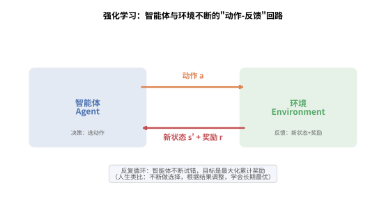
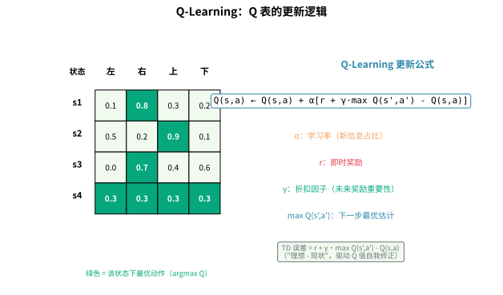
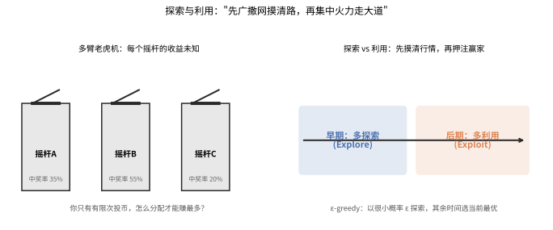
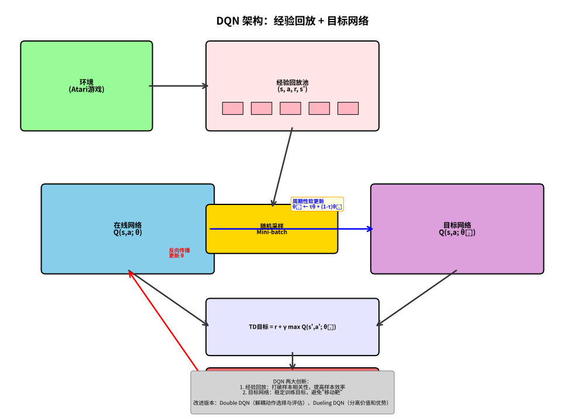
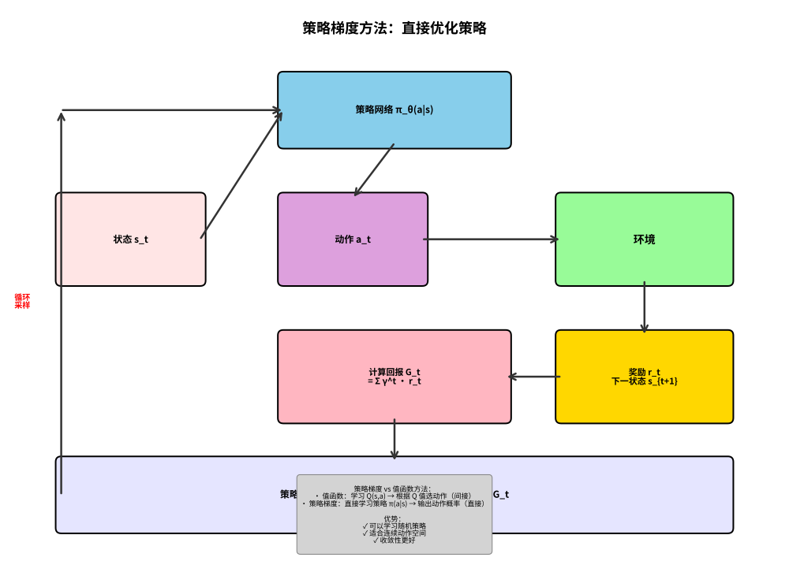
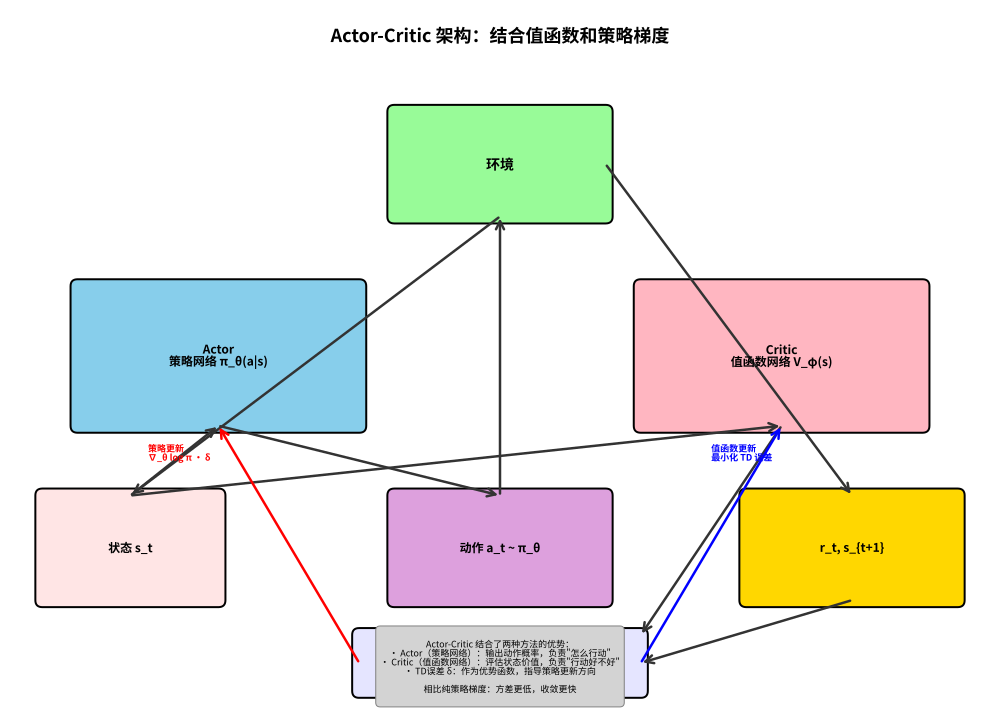
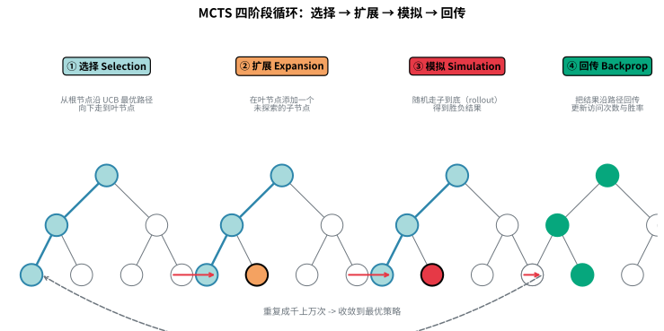

# 强化学习（Reinforcement Learning）

## 目录

- [1. 马尔可夫决策过程（MDP）](#1-马尔可夫决策过程mdp)
  - [1.1 定义](#11-定义)
  - [1.2 Bellman 方程](#12-bellman-方程)
  - [1.3 最优值函数与最优策略](#13-最优值函数与最优策略)
- [2. Q-Learning](#2-q-learning)
  - [2.1 Q 表更新公式](#21-q-表更新公式)
  - [2.2 ε-greedy 策略](#22-ε-greedy-策略)
  - [2.3 算法伪代码](#23-算法伪代码)
  - [2.4 SARSA](#24-sarsa)
- [3. Deep Q-Network (DQN)](#3-deep-q-network-dqn)
  - [3.1 经验回放](#31-经验回放)
  - [3.2 目标网络](#32-目标网络)
  - [3.3 Double DQN](#33-double-dqn)
  - [3.4 Dueling DQN](#34-dueling-dqn)
- [4. Policy Gradient (REINFORCE)](#4-policy-gradient-reinforce)
  - [4.1 策略梯度定理](#41-策略梯度定理)
  - [4.2 REINFORCE 算法](#42-reinforce-算法)
- [5. Actor-Critic (A2C/A3C)](#5-actor-critic-a2ca3c)
  - [5.1 优势函数](#51-优势函数)
  - [5.2 A2C 算法](#52-a2c-算法)
  - [5.3 A3C 并行训练](#53-a3c-并行训练)
- [6. Proximal Policy Optimization (PPO)](#6-proximal-policy-optimization-ppo)
  - [6.1 信任区域与裁剪目标](#61-信任区域与裁剪目标)
  - [6.2 PPO-Clip 算法](#62-ppo-clip-算法)
- [7. Soft Actor-Critic (SAC)](#7-soft-actor-critic-sac)
  - [7.1 最大熵强化学习](#71-最大熵强化学习)
  - [7.2 软值函数与软策略迭代](#72-软值函数与软策略迭代)
  - [7.3 自动温度调节](#73-自动温度调节)
- [8. Monte Carlo Tree Search (MCTS)](#8-monte-carlo-tree-search-mcts)
  - [8.1 四阶段循环](#81-四阶段循环)
  - [8.2 UCB 与 UCT](#82-ucb-与-uct)
- [9. MuZero](#9-muzero)
  - [9.1 无模型规划](#91-无模型规划)
  - [9.2 隐式环境模型](#92-隐式环境模型)
  - [9.3 算法流程](#93-算法流程)
- [10. 进阶与前沿强化学习专题](#10-进阶与前沿强化学习专题)
  - [10.1 Rainbow DQN](#101-rainbow-dqn)
  - [10.2 TD3（Twin Delayed DDPG）](#102-td3-twin-delayed-ddpg)
  - [10.3 模拟学习与逆强化学习（Imitation Learning / Inverse RL）](#103-模拟学习与逆强化学习-imitation-learning-inverse-rl)
  - [10.4 离线强化学习（Offline RL）](#104-离线强化学习-offline-rl)
  - [10.5 多智能体强化学习（Multi-Agent RL）](#105-多智能体强化学习-multi-agent-rl)
- [11. 各算法对比总结](#11-各算法对比总结)

---

## 1. 马尔可夫决策过程（MDP）

### 1.1 定义

马尔可夫决策过程（Markov Decision Process, MDP）是强化学习问题的数学框架，用元组 $(S, A, P, R, \gamma)$ 描述：

> 💡 **类比：玩游戏时"看一帧、按一键、看反馈"** 想象你在一个闯关游戏里：你看到当前画面（状态 $s$），按下某个键（动作 $a$），游戏画面切换并报出得分（新状态 $s'$ 和奖励 $r$），然后你继续。智能体和环境就是这样不断"出招—接招"地循环：智能体出动作，环境回以新状态和奖励，智能体再据此调整。**马尔可夫性质**说"你只需要看当前这一帧，不需要回看整段历史"——因为当前画面已经包含了决定下一步所需的全部信息。下图展示这个"动作—反馈"闭环。



- **$S$**：有限状态集合，$s_t \in S$ 表示 $t$ 时刻的状态
- **$A$**：有限动作集合，$a_t \in A$ 表示 $t$ 时刻的动作
- **$P$**：状态转移概率函数，$P(s_{t+1} | s_t, a_t)$ 表示在状态 $s_t$ 执行动作 $a_t$ 后转移到 $s_{t+1}$ 的概率
- **$R$**：奖励函数，$R(s_t, a_t)$ 表示在状态 $s_t$ 执行动作 $a_t$ 获得的即时奖励
- **$\gamma$**：折扣因子，$\gamma \in [0, 1]$，用于权衡即时奖励与未来奖励的重要性

**马尔可夫性质**：下一状态仅依赖于当前状态和动作，与历史无关：

$$
P(s_{t+1} | s_t, a_t, s_{t-1}, a_{t-1}, \dots) = P(s_{t+1} | s_t, a_t)
$$

**策略** $\pi(a|s)$ 定义了智能体在各个状态下选择动作的分布。智能体的目标是最大化累积折扣奖励（回报）：

$$
G_t = \sum_{k=0}^{\infty} \gamma^k R(s_{t+k}, a_{t+k})
$$

### 1.2 Bellman 方程

**状态值函数** $V^\pi(s)$ 表示在策略 $\pi$ 下，从状态 $s$ 出发的期望回报：

$$
V^\pi(s) = \mathbb{E}_\pi \left[ \sum_{k=0}^{\infty} \gamma^k R(s_{t+k}, a_{t+k}) \;\Big|\; s_t = s \right]
$$

**动作值函数** $Q^\pi(s, a)$ 表示在策略 $\pi$ 下，从状态 $s$ 执行动作 $a$ 后的期望回报：

$$
Q^\pi(s, a) = \mathbb{E}_\pi \left[ \sum_{k=0}^{\infty} \gamma^k R(s_{t+k}, a_{t+k}) \;\Big|\; s_t = s, a_t = a \right]
$$

**Bellman 期望方程**：

$$
V^\pi(s) = \sum_{a \in A} \pi(a|s) \left[ R(s, a) + \gamma \sum_{s' \in S} P(s'|s, a) V^\pi(s') \right]
$$

$$
Q^\pi(s, a) = R(s, a) + \gamma \sum_{s' \in S} P(s'|s, a) \sum_{a' \in A} \pi(a'|s') Q^\pi(s', a')
$$

### 1.3 最优值函数与最优策略

**Bellman 最优方程**：

$$
V^*(s) = \max_{a \in A} \left[ R(s, a) + \gamma \sum_{s' \in S} P(s'|s, a) V^*(s') \right]
$$

$$
Q^*(s, a) = R(s, a) + \gamma \sum_{s' \in S} P(s'|s, a) \max_{a' \in A} Q^*(s', a')
$$

最优策略为 $\pi^*(s) = \arg\max_a Q^*(s, a)$。

**核心思想**：MDP 提供了强化学习的数学基础，将序列决策问题形式化为一个可以通过动态规划或试错学习求解的框架。

**优点**：数学框架严谨，理论完备；适合建模各类序列决策问题。

**缺点**：要求状态和动作空间离散且有限（表格型）；真实环境的状态转移概率 $P$ 通常未知。

**应用场景**：机器人控制、游戏 AI、自动驾驶决策、资源调度优化。

---

## 2. Q-Learning

### 2.1 Q 表更新公式

> 💡 **类比：Q-Learning 如同"记路的小白"**
> 想象你是一个刚搬到新城市的小白，需要记住每个路口（状态）走哪个方向（动作）能最快到家（奖励）。Q-Learning 就是维护一张"经验表"：每个路口记录每个方向的"预期收益"。每次走错路（奖励低），就调低那个方向的评分；走对了（奖励高），就调高评分。走得多了，这张表越来越准，最后你闭着眼都能找到最优路线。

Q-Learning 是一种**无模型**（Model-Free）、**离线策略**（Off-Policy）的值函数强化学习算法。其核心是维护一个 $|S| \times |A|$ 的 Q 表 $Q(s, a)$，并通过与环境交互不断更新。

**Q-Learning 更新公式**：

$$
Q(s_t, a_t) \leftarrow Q(s_t, a_t) + \alpha \left[ r_t + \gamma \max_{a'} Q(s_{t+1}, a') - Q(s_t, a_t) \right]
$$

其中：
- $\alpha \in (0, 1]$ 为学习率
- $r_t$ 为即时奖励
- $\gamma$ 为折扣因子
- $r_t + \gamma \max_{a'} Q(s_{t+1}, a')$ 称为 **TD 目标**（Temporal Difference Target）
- $\delta_t = r_t + \gamma \max_{a'} Q(s_{t+1}, a') - Q(s_t, a_t)$ 称为 **TD 误差**

Q-Learning 使用下一状态的最大 Q 值来更新当前 Q 值，这使得它能够学习最优策略而**独立于当前行为策略**，因此属于 Off-Policy 算法。



### 2.2 ε-greedy 策略

为了在**探索**（Exploration）与**利用**（Exploitation）之间取得平衡，Q-Learning 通常采用 **ε-greedy** 策略选择动作：

> 💡 **类比：新来一座城市的吃饭选择** 你刚搬到一座城市，有几家餐馆（动作）没去过。如果一直去"目前吃过最好吃的那家"（利用），可能错过更棒的店；但如果每次都乱撞新店（探索），又可能一直踩雷。聪明做法是：早期多"探索"（把各家都吃一遍摸清行情），后期多"利用"（常去公认最好那家）。ε-greedy 就是给这个平衡设了一个旋钮：以很小概率 $\varepsilon$ 去随机探索，以 $1-\varepsilon$ 的概率选择当前估值最高的动作，训练中把 $\varepsilon$ 从大逐渐调小。下图左侧是多臂老虎机（探索的经典场景），右侧是"先探索后利用"的时间线。



$$
\pi(a|s) = \begin{cases}
1 - \varepsilon + \frac{\varepsilon}{|A|}, & \text{if } a = \arg\max_{a'} Q(s, a') \\[6pt]
\frac{\varepsilon}{|A|}, & \text{otherwise}
\end{cases}
$$

即：以概率 $1-\varepsilon$ 选择当前最优动作，以概率 $\varepsilon$ 随机选择任意动作。训练过程中 $\varepsilon$ 通常从较大值（如 1.0）逐渐退火（Annealing）到较小值（如 0.01），以实现从探索到利用的平滑过渡。

### 2.3 算法伪代码

```
Algorithm: Q-Learning

初始化 Q(s, a) = 0, ∀s ∈ S, a ∈ A
设置参数: α, γ, ε

for episode = 1 to N:
    初始化状态 s
    while s 不是终止状态:
        以 ε-greedy 从 Q(s, ·) 选择动作 a
        执行 a，观察奖励 r 和下一状态 s'
        Q(s, a) ← Q(s, a) + α [r + γ max_{a'} Q(s', a') - Q(s, a)]
        s ← s'
    end while
end for
```

**Python 伪代码**：

```python
import numpy as np

class QLearning:
    def __init__(self, n_states, n_actions, lr=0.1, gamma=0.99, epsilon=1.0, epsilon_min=0.01, epsilon_decay=0.995):
        self.Q = np.zeros((n_states, n_actions))
        self.lr = lr
        self.gamma = gamma
        self.epsilon = epsilon
        self.epsilon_min = epsilon_min
        self.epsilon_decay = epsilon_decay

    def act(self, state):
        if np.random.random() < self.epsilon:
            return np.random.randint(self.Q.shape[1])  # 探索
        return np.argmax(self.Q[state])               # 利用

    def update(self, state, action, reward, next_state):
        td_target = reward + self.gamma * np.max(self.Q[next_state])
        td_error = td_target - self.Q[state, action]
        self.Q[state, action] += self.lr * td_error

    def decay_epsilon(self):
        self.epsilon = max(self.epsilon_min, self.epsilon * self.epsilon_decay)
```

**优点**：
- 算法简单、易于实现
- Off-Policy，可以复用历史数据或专家数据
- 在离散状态空间中有收敛性保证

**缺点**：
- 需要维护 Q 表，难以处理高维或连续状态空间
- 动作空间必须离散

**应用场景**：迷宫导航、棋类游戏、简单的离散控制任务（如 Cliff Walking, Taxi-v3）。

### 2.4 SARSA

> 💡 **类比：SARSA 如同"边吃边学"的谨慎美食家**
> 如果说 Q-Learning 是用"理想中最好吃的那家店"来更新评分（Off-Policy），那么 SARSA 就是用"我这次实际会去的店"来更新（On-Policy）。想象一个谨慎的美食家：他不仅看哪家评分最高，还考虑"按我现在随机的选店习惯，下一顿多半会去哪家"——他把这个"实际要发生的下一步"纳入当前评分。因此 SARSA 学到的策略更贴合它当前的行为方式，注定比 Q-Learning 更保守、更稳健。

SARSA（State-Action-Reward-State-Action）与 Q-Learning 一样是无模型的表格型值函数算法，两者都维护一张 $|S| \times |A|$ 的 Q 表。**核心区别在于更新 TD 目标时取什么值**：

- **Q-Learning（Off-Policy）**：更新时使用下一状态下**所有动作中最大的 Q 值** $\max_{a'} Q(s_{t+1}, a')$，即"假设下一步总是走最优动作"，因此它学习的是**最优策略**，与其实际行为策略无关。
- **SARSA（On-Policy）**：更新时使用**实际采取的动作** $a_{t+1}$ 对应的 Q 值 $Q(s_{t+1}, a_{t+1})$，即"下一步实际会走什么动作就用它来更新"，因此它评估的是**当前行为策略本身**的价值。

**SARSA 更新公式**：

$$
Q(s_t, a_t) \leftarrow Q(s_t, a_t) + \alpha \left[ r_t + \gamma Q(s_{t+1}, a_{t+1}) - Q(s_t, a_t) \right]
$$

其中 $a_{t+1}$ 是智能体在状态 $s_{t+1}$ **实际采取的动作**（一般也是通过 ε-greedy 选出的）。对比 Q-Learning 的更新公式，区别仅在 TD 目标中是用 $\max_{a'} Q(s', a')$ 还是 $Q(s', a')_{\text{实际采取}}$，这一字之差决定了两种算法的 On/Off-Policy 属性。

**ε-greedy 下的行为差异**：由于 SARSA 用"实际采取的动作"更新，当 ε-greedy 做出探索（选了随机动作）时，这个次优动作的不良后果会被写进 $Q(s_{t+1}, a_{t+1})$，从而学到的策略会**主动绕开危险区域**；而 Q-Learning 总是乐观地假设下一步走最优，因此即使当前在危险区也会被"吸引力"牵引。在经典的**悬崖行走（Cliff Walking）**环境中：悬崖边一步会落入悬崖得 $-100$ 的大惩罚。

- **SARSA** 更保守：学到一条沿着悬崖边缘**远离悬崖**的路径，因为它在 ε-greedy 探索时实际经历过坠崖，学会规避危险。
- **Q-Learning** 更激进：学到一条**贴着悬崖边缘**的最短路径，因为它假设不会犯错，一旦 ε 未完全衰减就可能坠崖，但收敛后的平均回报理论上更高。

**算法伪代码**：

```
Algorithm: SARSA

初始化 Q(s, a) = 0, ∀s ∈ S, a ∈ A
设置参数: α, γ, ε

for episode = 1 to N:
    初始化状态 s
    以 ε-greedy 从 Q(s, ·) 选择动作 a
    while s 不是终止状态:
        执行 a，观察奖励 r 和下一状态 s'
        以 ε-greedy 从 Q(s', ·) 选择动作 a'
        Q(s, a) ← Q(s, a) + α [r + γ Q(s', a') - Q(s, a)]
        s ← s', a ← a'
    end while
end for
```

**SARSA vs Q-Learning 优缺点对比**：

| 维度 | SARSA | Q-Learning |
|------|-------|-----------|
| 策略属性 | On-Policy（评估当前行为策略） | Off-Policy（评估最优策略） |
| 更新目标 | $Q(s', a')$（实际采取的动作） | $\max_{a'} Q(s', a')$（最优动作） |
| 样本来源 | 只能用当前行为策略产生的数据 | 可复用历史数据 / 任意策略数据 |
| 安全性 | 保守，善于规避危险（Cliff Walking 更稳） | 激进，追求最优，可能冒坠崖风险 |
| 收敛性 | 在策略 π 下收敛到 Q^π | 收敛到 Q^*（最优值函数） |
| 样本效率 | 较低（数据必须来自同一策略） | 较高（可复用经验回放） |
| 适用场景 | 在线学习、安全性要求高的任务 | 离线回放、需要最优策略的任务 |

**优缺点**：

- 优点：更新简单、实现与 Q-Learning 几乎相同；On-Policy 使其在交互式、安全性敏感任务中更稳健；与 ε-greedy 天然契合，能感知并规避探索带来的风险。
- 缺点：Sample 只来自当前行为策略，样本效率低于 Off-Policy 方法；学习过程完全跟随当前策略，若策略不稳定则学习可能震荡；仍是表格型算法，无法直接处理高维 / 连续状态空间。

**应用场景**：悬崖行走（Cliff Walking）、网格世界导航、需要实时在线学习且环境危险性高的控制任务。

---

## 3. Deep Q-Network (DQN)



### 3.1 经验回放

> 💡 **类比：DQN 如同"错题本学习法"**
> 想象你在准备考试，DQN 的经验回放就像"错题本"：把每次做错的题（经验）记下来，复习时随机抽取几道题反复练习，而不是按顺序从头到尾看。这样避免连续看相似题目导致的"死记硬背"，让知识掌握更牢固。目标网络则像"标准答案"——每隔一段时间才更新一次，避免"答案"天天变导致你无所适从。

DQN 使用深度神经网络 $Q(s, a; \theta)$ 来近似 Q 函数，从而克服 Q-Learning 在高维状态空间（如图像输入）中的局限性。然而，直接使用神经网络进行 Q-Learning 存在两个问题：样本间的**强相关性**和**非平稳目标**。

**经验回放**（Experience Replay）通过构建一个经验池 $\mathcal{D} = \{(s_i, a_i, r_i, s'_i)\}$ 来解决样本相关性问题：

1. 智能体将每一步的转移样本 $(s_t, a_t, r_t, s_{t+1})$ 存入经验池
2. 训练时从经验池中**随机均匀采样**一个小批量（Mini-batch）
3. 使用采样数据计算损失并更新网络参数

**损失函数**：

$$
\mathcal{L}(\theta) = \mathbb{E}_{(s, a, r, s') \sim \mathcal{D}} \left[ \left( r + \gamma \max_{a'} Q(s', a'; \theta^-) - Q(s, a; \theta) \right)^2 \right]
$$

### 3.2 目标网络

为了缓解非平稳目标问题，DQN 引入了**目标网络**（Target Network）$Q(s, a; \theta^-)$，其结构与在线网络相同但参数滞后更新：

- 在线网络 $Q(s, a; \theta)$：每一步都通过梯度下降更新
- 目标网络 $Q(s, a; \theta^-)$：每 $C$ 步将在线网络参数复制过来，或在每次更新时进行软更新

**软更新**（Soft Update）：

$$
\theta^- \leftarrow \tau \theta + (1 - \tau) \theta^-, \quad \tau \ll 1
$$

### 3.3 Double DQN

标准 DQN 使用 $\max_{a'} Q(s', a'; \theta^-)$ 计算 TD 目标，这会导致**最大化偏差**（Maximization Bias），即过估计 Q 值。Double DQN 通过解耦动作选择与动作评估来缓解这一问题：

**Double DQN 的 TD 目标**：

$$
y_t = r_t + \gamma Q(s_{t+1}, \arg\max_{a'} Q(s_{t+1}, a'; \theta); \theta^-)
$$

即：用**在线网络**选择最优动作，用**目标网络**评估该动作的值。这有效降低了过估计，在实践中通常能带来更稳定和更好的性能。

### 3.4 Dueling DQN

Dueling DQN 改变了网络架构，将 Q 值分解为**状态值** $V(s)$ 和**优势** $A(s, a)$ 两部分：

$$
Q(s, a; \theta, \alpha, \beta) = V(s; \theta, \beta) + A(s, a; \theta, \alpha) - \frac{1}{|A|} \sum_{a'} A(s, a'; \theta, \alpha)
$$

其中 $\theta$ 是共享卷积层的参数，$\beta$ 和 $\alpha$ 分别是值函数流和优势函数流的参数。减去优势均值是为了保证可辨识性（Identifiability）。这种分解使得网络在学习某些状态下哪些动作好时，不必同时学习该状态本身的价值。

**Python 伪代码（DQN）**：

```python
import numpy as np
import torch
import torch.nn as nn
import torch.optim as optim
from collections import deque
import random

class DQN(nn.Module):
    def __init__(self, state_dim, action_dim):
        super().__init__()
        self.fc = nn.Sequential(
            nn.Linear(state_dim, 128), nn.ReLU(),
            nn.Linear(128, 128), nn.ReLU(),
            nn.Linear(128, action_dim)
        )

    def forward(self, x):
        return self.fc(x)

class DuelingDQN(nn.Module):
    def __init__(self, state_dim, action_dim):
        super().__init__()
        self.feature = nn.Sequential(
            nn.Linear(state_dim, 128), nn.ReLU()
        )
        self.value = nn.Linear(128, 1)
        self.advantage = nn.Linear(128, action_dim)

    def forward(self, x):
        f = self.feature(x)
        V = self.value(f)
        A = self.advantage(f)
        return V + A - A.mean(dim=-1, keepdim=True)

class ReplayBuffer:
    def __init__(self, capacity=10000):
        self.buffer = deque(maxlen=capacity)

    def push(self, state, action, reward, next_state, done):
        self.buffer.append((state, action, reward, next_state, done))

    def sample(self, batch_size):
        batch = random.sample(self.buffer, batch_size)
        states, actions, rewards, next_states, dones = zip(*batch)
        return (np.array(states), np.array(actions), np.array(rewards),
                np.array(next_states), np.array(dones, dtype=np.float32))

class DQNAgent:
    def __init__(self, state_dim, action_dim, lr=3e-4, gamma=0.99,
                 tau=0.005, buffer_size=10000, batch_size=64):
        self.online_net = DQN(state_dim, action_dim)
        self.target_net = DQN(state_dim, action_dim)
        self.target_net.load_state_dict(self.online_net.state_dict())
        self.optimizer = optim.Adam(self.online_net.parameters(), lr=lr)
        self.replay_buffer = ReplayBuffer(buffer_size)
        self.gamma = gamma
        self.tau = tau
        self.batch_size = batch_size
        self.action_dim = action_dim

    def act(self, state, epsilon=0.1):
        if np.random.random() < epsilon:
            return np.random.randint(self.action_dim)
        state = torch.FloatTensor(state).unsqueeze(0)
        with torch.no_grad():
            q_values = self.online_net(state)
        return q_values.argmax().item()

    def update(self):
        if len(self.replay_buffer.buffer) < self.batch_size:
            return
        states, actions, rewards, next_states, dones = self.replay_buffer.sample(self.batch_size)
        states = torch.FloatTensor(states)
        actions = torch.LongTensor(actions)
        rewards = torch.FloatTensor(rewards)
        next_states = torch.FloatTensor(next_states)
        dones = torch.FloatTensor(dones)

        # Double DQN: 在线网络选择动作，目标网络评估
        with torch.no_grad():
            next_actions = self.online_net(next_states).argmax(dim=1, keepdim=True)
            next_q = self.target_net(next_states).gather(1, next_actions).squeeze()
            td_target = rewards + self.gamma * next_q * (1 - dones)

        current_q = self.online_net(states).gather(1, actions.unsqueeze(1)).squeeze()
        loss = nn.MSELoss()(current_q, td_target)

        self.optimizer.zero_grad()
        loss.backward()
        self.optimizer.step()

        # 目标网络软更新
        for online_param, target_param in zip(self.online_net.parameters(), self.target_net.parameters()):
            target_param.data.copy_(self.tau * online_param.data + (1 - self.tau) * target_param.data)
```

**优点**：
- 能处理高维连续状态空间（如图像、传感器数据）
- 经验回放提高了样本效率
- 目标网络提升了训练稳定性

**缺点**：
- 动作空间仍需离散
- 训练不稳定，超参数敏感
- 样本效率仍低于现代算法

**应用场景**：Atari 游戏、机器人视觉控制、资源调度。

---

## 4. Policy Gradient (REINFORCE)

### 4.1 策略梯度定理

> 💡 **类比：策略梯度如同"演员排练"**
> 想象一个演员在排练新戏。策略梯度方法不评价"哪个动作好"（值函数方法），而是直接调整"怎么演"（策略）。每演完一幕（一个回合），导演根据整体效果（回报）给反馈：演得好的地方（高回报动作），下次就加强这个演法；演得差的地方，下次就减少这种演法。REINFORCE 算法就是这种"整体反馈、直接调整表演风格"的方法。

与值函数方法不同，策略梯度方法直接对策略 $\pi_\theta(a|s)$ 进行参数化，并通过对策略参数 $\theta$ 进行梯度上升来最大化期望回报。



**策略梯度定理**（Policy Gradient Theorem）是这一方法的理论基础。它给出了期望回报关于策略参数的梯度表达式：

$$
\nabla_\theta J(\theta) = \mathbb{E}_{\pi_\theta} \left[ \nabla_\theta \log \pi_\theta(a|s) \cdot Q^{\pi_\theta}(s, a) \right]
$$

**推导思路**：

1. 定义目标函数 $J(\theta) = \mathbb{E}_{\pi_\theta} \left[ \sum_{t=0}^\infty \gamma^t R(s_t, a_t) \right]$
2. 利用似然比技巧（Likelihood Ratio Trick）：
   $$
   \nabla_\theta \pi_\theta(a|s) = \pi_\theta(a|s) \nabla_\theta \log \pi_\theta(a|s)
   $$
3. 将梯度展开为在状态访问分布下的期望：
   $$
   \nabla_\theta J(\theta) = \sum_{s} d^\pi(s) \sum_{a} \nabla_\theta \pi_\theta(a|s) Q^\pi(s, a)
   $$
4. 代入似然比技巧即得策略梯度定理，其中 $d^\pi(s)$ 是在策略 $\pi$ 下的平稳分布。

### 4.2 REINFORCE 算法

REINFORCE 是最基本的策略梯度算法，也称为 **Monte Carlo Policy Gradient**。它使用完整的回合回报 $G_t = \sum_{k=0}^{T-t} \gamma^k r_{t+k}$ 来近似 $Q^{\pi_\theta}(s, a)$：

**梯度更新**：

$$
\theta \leftarrow \theta + \alpha \gamma^t G_t \nabla_\theta \log \pi_\theta(a_t | s_t)
$$

**算法伪代码**：

```
Algorithm: REINFORCE

初始化策略网络参数 θ

for episode = 1 to N:
    根据策略 π_θ 生成完整轨迹: (s_0, a_0, r_0, s_1, a_1, r_1, ..., s_T)
    for t = 0 to T:
        G ← 0
        for k = t to T:
            G ← G + γ^{k-t} r_k                    # 计算折扣回报
        θ ← θ + α γ^t G ∇_θ log π_θ(a_t | s_t)    # 策略梯度上升
    end for
end for
```

**Python 伪代码**：

```python
import torch
import torch.nn as nn
import torch.optim as optim

class PolicyNetwork(nn.Module):
    def __init__(self, state_dim, action_dim):
        super().__init__()
        self.net = nn.Sequential(
            nn.Linear(state_dim, 128), nn.ReLU(),
            nn.Linear(128, 128), nn.ReLU(),
            nn.Linear(128, action_dim), nn.Softmax(dim=-1)
        )

    def forward(self, x):
        return self.net(x)

class REINFORCE:
    def __init__(self, state_dim, action_dim, lr=3e-4, gamma=0.99):
        self.policy = PolicyNetwork(state_dim, action_dim)
        self.optimizer = optim.Adam(self.policy.parameters(), lr=lr)
        self.gamma = gamma

    def act(self, state):
        state = torch.FloatTensor(state).unsqueeze(0)
        probs = self.policy(state)
        dist = torch.distributions.Categorical(probs)
        action = dist.sample()
        return action.item(), dist.log_prob(action)

    def update(self, log_probs, rewards):
        discounted_rewards = []
        G = 0
        for r in reversed(rewards):
            G = r + self.gamma * G
            discounted_rewards.insert(0, G)
        discounted_rewards = torch.FloatTensor(discounted_rewards)
        discounted_rewards = (discounted_rewards - discounted_rewards.mean()) / (discounted_rewards.std() + 1e-8)

        loss = 0
        for log_prob, G in zip(log_probs, discounted_rewards):
            loss += -log_prob * G   # 梯度上升 = 负梯度下降

        self.optimizer.zero_grad()
        loss.backward()
        self.optimizer.step()
```

**优点**：
- 可以处理连续动作空间
- 策略是随机策略，天然支持探索
- 适合解决部分可观测问题（POMDP）

**缺点**：
- 使用完整回合回报，方差很大
- 收敛速度慢，样本效率低
- 只能用于回合制（Episodic）任务

**应用场景**：连续控制、机器人运动控制、游戏策略学习。

---

## 5. Actor-Critic (A2C/A3C)



### 5.1 优势函数

> 💡 **类比：Actor-Critic 如同"导演+剧评家"**
> 想象一个剧团：Actor（演员）负责表演（选择动作），Critic（剧评家）负责评价（评估动作好坏）。演员根据剧评家的反馈调整表演，剧评家则不断学习更准确的评价标准。优势函数 A(s,a) 就是"这个动作比平均水平好多少"——如果某次表演超出预期（正优势），就加强这种演法；低于预期（负优势），就减少这种演法。

Actor-Critic 方法结合了值函数方法和策略梯度方法的优点，同时维护两个组件：

- **Actor**（策略网络 $\pi_\theta(a|s)$）：负责选择动作
- **Critic**（值函数网络 $V_\phi(s)$ 或 $Q_\phi(s, a)$）：负责评估动作的好坏

**优势函数**（Advantage Function）衡量在状态 $s$ 下采取动作 $a$ 相对于平均水平的优势：

$$
A^\pi(s, a) = Q^\pi(s, a) - V^\pi(s)
$$

在实践中，使用 **TD 误差**来估计优势函数，避免需要两个值函数网络：

$$
A(s_t, a_t) \approx r_t + \gamma V_\phi(s_{t+1}) - V_\phi(s_t)
$$

使用优势函数的策略梯度更新为：

$$
\nabla_\theta J(\theta) = \mathbb{E}_{\pi_\theta} \left[ \nabla_\theta \log \pi_\theta(a|s) \cdot A(s, a) \right]
$$

使用优势函数而非原始回报 $G_t$ 可以显著降低梯度估计的方差。

### 5.2 A2C 算法

A2C（Advantage Actor-Critic）是同步版本的 Actor-Critic 算法，其训练流程为：

1. 使用当前策略 $\pi_\theta$ 与环境交互 $n$ 步，收集轨迹
2. 计算 $n$ 步优势估计：
   $$
   \hat{A}_t = \sum_{i=0}^{n-1} \gamma^i r_{t+i} + \gamma^n V_\phi(s_{t+n}) - V_\phi(s_t)
   $$
3. 更新 Actor（策略梯度上升）：
   $$
   \nabla_\theta J(\theta) = \frac{1}{n} \sum_{t=1}^{n} \nabla_\theta \log \pi_\theta(a_t|s_t) \hat{A}_t
   $$
4. 更新 Critic（MSE 损失）：
   $$
   \mathcal{L}(\phi) = \frac{1}{n} \sum_{t=1}^{n} \left( \hat{A}_t + V_\phi(s_t) - V_\phi(s_t) \right)^2 = \frac{1}{n} \sum_{t=1}^{n} \left( V_\phi^{\text{target}} - V_\phi(s_t) \right)^2
   $$
5. 引入熵正则化（Entropy Bonus）鼓励探索：
   $$
   \nabla_\theta J(\theta) = \mathbb{E} \left[ \nabla_\theta \log \pi_\theta(a|s) \hat{A}(s, a) + \beta \nabla_\theta H(\pi_\theta(\cdot|s)) \right]
   $$

### 5.3 A3C 并行训练

A3C（Asynchronous Advantage Actor-Critic）是 A2C 的异步版本，通过多个并行 Worker 提升训练效率：

- 每个 Worker 拥有独立的策略副本
- 多个 Worker 在不同环境实例中并行交互
- Worker 异步地将梯度推送到全局网络
- 全局网络参数定期同步到各 Worker

现代实现中，A2C 通常比 A3C 更高效，因为同步训练可以利用 GPU 批处理能力。

**Python 伪代码**：

```python
import torch
import torch.nn as nn
import torch.optim as optim

class ActorCritic(nn.Module):
    def __init__(self, state_dim, action_dim):
        super().__init__()
        self.fc = nn.Sequential(
            nn.Linear(state_dim, 128), nn.ReLU()
        )
        self.actor = nn.Linear(128, action_dim)   # 策略头
        self.critic = nn.Linear(128, 1)            # 值函数头

    def forward(self, x):
        x = self.fc(x)
        logits = self.actor(x)
        value = self.critic(x)
        return logits, value

class A2CAgent:
    def __init__(self, state_dim, action_dim, lr=3e-4, gamma=0.99, beta=0.01):
        self.net = ActorCritic(state_dim, action_dim)
        self.optimizer = optim.Adam(self.net.parameters(), lr=lr)
        self.gamma = gamma
        self.beta = beta

    def act(self, state):
        state = torch.FloatTensor(state).unsqueeze(0)
        logits, value = self.net(state)
        dist = torch.distributions.Categorical(logits=logits)
        action = dist.sample()
        return action.item(), dist.log_prob(action), value

    def update(self, trajectory):
        # trajectory: [(log_prob, value, reward, done), ...]
        returns = []
        R = 0
        for _, _, reward, done in reversed(trajectory):
            if done:
                R = 0
            R = reward + self.gamma * R
            returns.insert(0, R)
        returns = torch.FloatTensor(returns)

        log_probs, values, _, _ = zip(*trajectory)
        log_probs = torch.stack(log_probs)
        values = torch.stack(values).squeeze()

        advantages = returns - values
        actor_loss = -(log_probs * advantages.detach()).mean()
        critic_loss = advantages.pow(2).mean()
        entropy = -torch.mean(log_probs)

        loss = actor_loss + 0.5 * critic_loss - self.beta * entropy

        self.optimizer.zero_grad()
        loss.backward()
        self.optimizer.step()
```

**优点**：
- 方差显著低于 REINFORCE
- 支持连续动作空间
- 可在线学习（不必等回合结束）
- A3C 的多 Worker 并行加速训练

**缺点**：
- Actor 和 Critic 的更新需要协调
- A3C 的异步更新可能导致梯度陈旧
- 对超参数敏感

**应用场景**：连续控制、3D 导航、实时策略游戏。

---

## 6. Proximal Policy Optimization (PPO)

### 6.1 信任区域与裁剪目标

> 💡 **类比：PPO 如同"稳健的股票投资"**
> 想象你在调整股票仓位。传统策略梯度可能一次把仓位调得太大（步长过大），结果市场波动导致巨亏；或者调得太小（步长过小），错过赚钱机会。PPO 的裁剪机制就像设置"涨跌停板"——每次调仓幅度限制在 ±20% 以内（ε=0.2），既不会因为激进操作崩盘，也不会因为过于保守而停滞。这让学习过程既稳定又高效。

PPO 是 OpenAI 提出的策略梯度算法，旨在解决传统策略梯度方法中**步长难以确定**的问题。步长过大会导致策略崩溃，步长过小则收敛缓慢。

PPO 的核心思想是：每次更新时限制策略的变化幅度，使其保持在**信任区域**（Trust Region）内。

**重要性采样比率**（Importance Sampling Ratio）：

$$
r_t(\theta) = \frac{\pi_\theta(a_t|s_t)}{\pi_{\theta_{\text{old}}}(a_t|s_t)}
$$

TRPO 使用 KL 散度约束信任区域，而 PPO 提出了两种更简单的实现方式：

1. **PPO-Clip**（最常用）：通过裁剪目标函数限制策略更新幅度
2. **PPO-Penalty**：通过 KL 散度惩罚项

### 6.2 PPO-Clip 算法

**PPO-Clip 目标函数**：

$$
\mathcal{L}^{\text{CLIP}}(\theta) = \mathbb{E}_t \left[ \min\left( r_t(\theta) \hat{A}_t, \; \text{clip}(r_t(\theta), 1-\varepsilon, 1+\varepsilon) \hat{A}_t \right) \right]
$$

其中 $\varepsilon$ 是裁剪超参数（通常取 0.1 或 0.2）。裁剪机制的作用：

- 当优势 $\hat{A}_t > 0$ 时：鼓励增大该动作的概率，但限制 $r_t(\theta)$ 不超过 $1+\varepsilon$
- 当优势 $\hat{A}_t < 0$ 时：鼓励减小该动作的概率，但限制 $r_t(\theta)$ 不低于 $1-\varepsilon$

**完整损失函数**（包含值函数和熵正则项）：

$$
\mathcal{L}^{\text{PPO}}(\theta) = \mathbb{E}_t \left[ \mathcal{L}^{\text{CLIP}}(\theta) - c_1 \left( V_\theta(s_t) - V_t^{\text{target}} \right)^2 + c_2 H(\pi_\theta(\cdot|s_t)) \right]
$$

**算法伪代码**：

```
Algorithm: PPO-Clip

初始化策略网络 π_θ 和值函数网络 V_φ

for iteration = 1 to N:
    // 收集数据
    for actor = 1 to N_actors:
        使用 π_{θ_old} 与环境交互 T 步
        存储 (s_t, a_t, r_t, s_{t+1}, done_t)
        计算优势估计 Â_t (使用 GAE)

    // 优化更新（多轮次）
    for epoch = 1 to K:
        从收集的数据中随机采样 Mini-batch
        计算 r_t(θ) = π_θ(a_t|s_t) / π_{θ_old}(a_t|s_t)
        计算 L^{CLIP}(θ) 和 L^{VF}(φ)
        使用 Adam 优化器更新 θ 和 φ

    θ_old ← θ
end for
```

**广义优势估计**（GAE, Generalized Advantage Estimation）：

$$
\hat{A}_t^{\text{GAE}} = \sum_{l=0}^{T-t-1} (\gamma \lambda)^l \delta_{t+l}, \quad \delta_t = r_t + \gamma V(s_{t+1}) - V(s_t)
$$

其中 $\lambda$ 控制偏差-方差权衡。

**Python 伪代码**：

```python
import torch
import torch.nn as nn
import torch.optim as optim

class PPOAgent:
    def __init__(self, state_dim, action_dim, lr=3e-4, gamma=0.99,
                 gae_lambda=0.95, clip_eps=0.2, epochs=10, batch_size=64):
        self.policy = ActorCritic(state_dim, action_dim)
        self.optimizer = optim.Adam(self.policy.parameters(), lr=lr)
        self.gamma = gamma
        self.gae_lambda = gae_lambda
        self.clip_eps = clip_eps
        self.epochs = epochs
        self.batch_size = batch_size

    def compute_gae(self, rewards, values, dones):
        advantages = []
        gae = 0
        for t in reversed(range(len(rewards))):
            if t == len(rewards) - 1:
                next_value = 0 if dones[t] else values[t + 1].item()
            else:
                next_value = 0 if dones[t] else values[t + 1].item()
            delta = rewards[t] + self.gamma * next_value - values[t].item()
            gae = delta + self.gamma * self.gae_lambda * (1 - dones[t]) * gae
            advantages.insert(0, gae)
        returns = [adv + v.item() for adv, v in zip(advantages, values)]
        return torch.FloatTensor(advantages), torch.FloatTensor(returns)

    def update(self, trajectories):
        # trajectories 包含多个进程收集的数据
        old_log_probs = torch.stack([t['log_prob'] for t in trajectories])
        states = torch.FloatTensor([t['state'] for t in trajectories])
        actions = torch.LongTensor([t['action'] for t in trajectories])
        advantages = torch.FloatTensor([t['advantage'] for t in trajectories])
        returns = torch.FloatTensor([t['return'] for t in trajectories])

        # 多轮次更新
        for _ in range(self.epochs):
            logits, values = self.policy(states)
            dist = torch.distributions.Categorical(logits=logits)
            log_probs = dist.log_prob(actions)
            entropy = dist.entropy().mean()

            ratio = (log_probs - old_log_probs).exp()
            surr1 = ratio * advantages
            surr2 = torch.clamp(ratio, 1 - self.clip_eps, 1 + self.clip_eps) * advantages
            actor_loss = -torch.min(surr1, surr2).mean()
            critic_loss = nn.MSELoss()(values.squeeze(), returns)
            loss = actor_loss + 0.5 * critic_loss - 0.01 * entropy

            self.optimizer.zero_grad()
            loss.backward()
            nn.utils.clip_grad_norm_(self.policy.parameters(), 0.5)
            self.optimizer.step()
```

**优点**：
- 训练稳定，收敛性好
- 实现简单，超参数鲁棒性高
- 支持连续和离散动作空间
- 样本效率相对较高

**缺点**：
- 裁剪机制引入额外超参数 $\varepsilon$
- 多轮次更新需要存储旧策略的 log-prob
- 在部分任务中可能过于保守

**应用场景**：机器人控制、游戏 AI（如 Dota 2、星际争霸 II）、大语言模型微调（RLHF）。

---

## 7. Soft Actor-Critic (SAC)

### 7.1 最大熵强化学习

> 💡 **类比：SAC 如同"保持好奇心的探险家"**
> 想象一个探险家寻找宝藏。普通方法（如 DQN）只走"已知最好的路"，容易陷入局部最优。SAC 的最大熵思想是：在追求奖励的同时，保持"好奇心"（熵）——即使某条路目前看起来不是最优，也愿意尝试。这样既能找到宝藏（高奖励），又不会错过隐藏的捷径（多模态最优）。温度系数 α 控制"好奇心"的强度：α 大则探索多，α 小则更功利。

SAC（Soft Actor-Critic）是一种基于**最大熵**（Maximum Entropy）框架的离线策略 Actor-Critic 算法。其核心思想是：在最大化累积奖励的同时，最大化策略的熵，以鼓励探索和增强鲁棒性。

**最大熵目标函数**：

$$
J(\pi) = \sum_{t=0}^{\infty} \mathbb{E}_{(s_t, a_t) \sim \rho_\pi} \left[ \gamma^t \left( R(s_t, a_t) + \alpha \mathcal{H}(\pi(\cdot|s_t)) \right) \right]
$$

其中 $\mathcal{H}(\pi(\cdot|s)) = -\mathbb{E}_{a \sim \pi} \log \pi(a|s)$ 是策略熵，$\alpha$ 是温度系数，控制熵项的权重。

最大熵框架的优势：
- **探索更强**：熵项鼓励策略保持随机性，避免过早收敛到次优解
- **多模态**：能够学习多个等价的最优行为模式
- **鲁棒性**：对环境和模型扰动更不敏感

### 7.2 软值函数与软策略迭代

SAC 维护五个网络：一个策略网络 $\pi_\phi$、两个 Q 网络 $Q_{\theta_1}, Q_{\theta_2}$（用于缓解正估计偏差）、两个目标 Q 网络 $Q_{\bar{\theta}_1}, Q_{\bar{\theta}_2}$。

**软 Q 值更新**（Soft Bellman 方程）：

$$
Q(s_t, a_t) = r_t + \gamma \mathbb{E}_{s_{t+1} \sim p} \left[ V(s_{t+1}) \right]
$$

**软状态值函数**：

$$
V(s_t) = \mathbb{E}_{a_t \sim \pi} \left[ Q(s_t, a_t) - \alpha \log \pi(a_t|s_t) \right]
$$

**Critic 损失函数**（最小化软 Bellman 残差）：

$$
\mathcal{L}_Q(\theta_i) = \mathbb{E}_{(s, a, r, s') \sim \mathcal{D}} \left[ \left( Q_{\theta_i}(s, a) - \left( r + \gamma \left( \min_{j=1,2} Q_{\bar{\theta}_j}(s', a') - \alpha \log \pi_\phi(a'|s') \right) \right) \right)^2 \right], \quad a' \sim \pi_\phi(\cdot|s')
$$

**Actor 损失函数**（通过 KL 散度最小化优化策略）：

$$
\mathcal{L}_\pi(\phi) = \mathbb{E}_{s \sim \mathcal{D}} \left[ \mathbb{E}_{a \sim \pi_\phi} \left[ \alpha \log \pi_\phi(a|s) - \min_{j=1,2} Q_{\theta_j}(s, a) \right] \right]
$$

使用**重参数化技巧**（Reparameterization Trick）采样动作 $a = f_\phi(\epsilon; s)$，其中 $\epsilon$ 是噪声变量，使得梯度可以反向传播：

$$
\mathcal{L}_\pi(\phi) = \mathbb{E}_{s \sim \mathcal{D}, \epsilon \sim \mathcal{N}} \left[ \alpha \log \pi_\phi(f_\phi(\epsilon; s)|s) - \min_{j=1,2} Q_{\theta_j}(s, f_\phi(\epsilon; s)) \right]
$$

### 7.3 自动温度调节

SAC 引入自动温度调节机制，避免手动调参 $\alpha$。其核心思想是：找到一个 $\alpha$ 使得策略的熵不低于目标熵 $\mathcal{H}_{\text{target}}$：

$$
\mathcal{L}(\alpha) = \mathbb{E}_{a_t \sim \pi_t} \left[ -\alpha \log \pi_t(a_t|s_t) - \alpha \mathcal{H}_{\text{target}} \right]
$$

其中 $\mathcal{H}_{\text{target}} = -\dim(A)$ 是目标熵（通常设置为动作维度的负值）。当策略熵低于目标时，$\alpha$ 增大以鼓励探索；反之，$\alpha$ 减小。

**Python 伪代码**：

```python
import torch
import torch.nn as nn
import torch.optim as optim
import torch.nn.functional as F

class SACAgent:
    def __init__(self, state_dim, action_dim, hidden_dim=256, lr=3e-4,
                 gamma=0.99, tau=0.005, alpha=0.2, auto_alpha=True):
        self.gamma = gamma
        self.tau = tau
        self.auto_alpha = auto_alpha
        self.action_dim = action_dim

        # 网络初始化（Q1, Q2, 目标Q1, 目标Q2, 策略）
        self.q1 = ...  # Q网络1
        self.q2 = ...  # Q网络2
        self.q1_target = ...  # 目标Q网络1
        self.q2_target = ...  # 目标Q网络2
        self.policy = ...     # 策略网络（输出高斯分布的均值和标准差）

        # 复制初始参数
        self.q1_target.load_state_dict(self.q1.state_dict())
        self.q2_target.load_state_dict(self.q2.state_dict())

        self.q1_optimizer = optim.Adam(self.q1.parameters(), lr=lr)
        self.q2_optimizer = optim.Adam(self.q2.parameters(), lr=lr)
        self.policy_optimizer = optim.Adam(self.policy.parameters(), lr=lr)

        # 自动温度调节
        if self.auto_alpha:
            self.log_alpha = torch.zeros(1, requires_grad=True)
            self.alpha_optimizer = optim.Adam([self.log_alpha], lr=lr)
            self.target_entropy = -action_dim
        else:
            self.alpha = alpha

    def update(self, batch):
        states, actions, rewards, next_states, dones = batch

        with torch.no_grad():
            # 从目标策略采样下一动作
            next_actions, next_log_probs = self.policy.sample(next_states)
            next_q1 = self.q1_target(next_states, next_actions)
            next_q2 = self.q2_target(next_states, next_actions)
            next_q = torch.min(next_q1, next_q2) - self.alpha * next_log_probs
            q_target = rewards + self.gamma * (1 - dones) * next_q

        # 更新Q网络
        q1_loss = F.mse_loss(self.q1(states, actions), q_target)
        q2_loss = F.mse_loss(self.q2(states, actions), q_target)

        self.q1_optimizer.zero_grad(); q1_loss.backward(); self.q1_optimizer.step()
        self.q2_optimizer.zero_grad(); q2_loss.backward(); self.q2_optimizer.step()

        # 更新策略网络
        new_actions, log_probs = self.policy.sample(states)
        q1_new = self.q1(states, new_actions)
        q2_new = self.q2(states, new_actions)
        q_new = torch.min(q1_new, q2_new)
        policy_loss = (self.alpha * log_probs - q_new).mean()

        self.policy_optimizer.zero_grad(); policy_loss.backward(); self.policy_optimizer.step()

        # 自动温度调节
        if self.auto_alpha:
            alpha_loss = -(self.log_alpha * (log_probs + self.target_entropy).detach()).mean()
            self.alpha_optimizer.zero_grad(); alpha_loss.backward(); self.alpha_optimizer.step()
            self.alpha = self.log_alpha.exp()

        # 软更新目标网络
        for target, source in zip(self.q1_target.parameters(), self.q1.parameters()):
            target.data.copy_(self.tau * source.data + (1 - self.tau) * target.data)
        for target, source in zip(self.q2_target.parameters(), self.q2.parameters()):
            target.data.copy_(self.tau * source.data + (1 - self.tau) * target.data)
```

**优点**：
- 样本效率极高（Off-Policy 复用历史数据）
- 训练稳定，收敛性好
- 自动熵调节减少超参数调优
- 在连续控制任务中通常达到 SOTA 性能

**缺点**：
- 实现复杂度较高
- 需要维护多个网络（5 个）
- 不直接支持离散动作空间（需要修改）

**应用场景**：连续机器人控制、自动驾驶策略学习、运动控制。

---

## 8. Monte Carlo Tree Search (MCTS)

### 8.1 四阶段循环

> 💡 **类比：MCTS 如同"下棋时的推演"**
> 想象你在下围棋，面对一个复杂局面。MCTS 的做法是：先选一个看起来最有希望的走法（选择），然后从这个走法开始往下推演几步（扩展），再随机走完这盘棋看胜负（模拟），最后把结果反馈回来更新这个走法的评分（回溯）。重复这个过程成千上万次，最后选择被访问次数最多的走法。AlphaGo 就是用 MCTS 击败了李世石。

MCTS 是一种基于树搜索的规划算法，广泛用于决策和游戏领域。它通过**模拟**（Simulation）而非完整枚举来评估状态，适合搜索空间极大的问题。

MCTS 的每个迭代包含四个阶段：

**1. 选择（Selection）**：
从根节点开始，根据树内节点的统计信息，使用 UCB（Upper Confidence Bound）公式选择一个子节点，直到到达一个未完全扩展的节点或叶节点。

**2. 扩展（Expansion）**：
如果叶节点不是终止节点，则创建一个或多个新的子节点（对应可执行的动作），并选择其中一个进行扩展。

**3. 模拟（Simulation）**：
从扩展的节点开始，使用**默认策略**（通常是随机策略或快速 rollout 策略）进行模拟，直到到达终止状态，获得模拟结果（如胜负或累积奖励）。

**4. 回溯（Backpropagation）**：
将模拟结果从叶节点反向传播到根节点，更新路径上所有节点的统计信息（访问次数 $N$ 和累计奖励 $W$）。



### 8.2 UCB 与 UCT

**UCT**（Upper Confidence Bound for Trees）是 MCTS 中最常用的选择策略：

$$
\text{UCT}(s, a) = Q(s, a) + c \sqrt{\frac{\ln N(s)}{N(s, a)}}
$$

其中：
- $Q(s, a) = \frac{W(s, a)}{N(s, a)}$ 是节点 $(s, a)$ 的平均奖励
- $N(s)$ 是父节点的总访问次数
- $N(s, a)$ 是动作 $a$ 被选择的次数
- $c$ 是探索常数（控制探索与利用的平衡，通常取 $\sqrt{2}$）

**算法伪代码**：

```
Algorithm: MCTS

function MCTS(root_state, n_simulations):
    创建根节点 root(state = root_state)
    for i = 1 to n_simulations:
        node ← root
        // 1. 选择
        while node 已完全扩展且不是终止节点:
            node ← argmax_{child} UCT(child)

        // 2. 扩展
        if node 不是终止节点:
            选择一个未扩展的动作 a
            node ← 添加新子节点(state = node.state + a)

        // 3. 模拟
        result ← Rollout(node.state)   // 使用默认策略模拟到结束

        // 4. 回溯
        while node ≠ None:
            node.N += 1
            node.W += result
            node ← node.parent

    // 返回根节点下最优动作
    return argmax_{child} root.child.N   // 或 argmax_{child} root.child.Q
```

**Python 伪代码**：

```python
import math
import random

class MCTSNode:
    def __init__(self, state, parent=None, action=None):
        self.state = state
        self.parent = parent
        self.action = action
        self.children = []
        self.N = 0         # 访问次数
        self.W = 0.0       # 累计奖励
        self.untried_actions = state.get_legal_actions()

    def is_fully_expanded(self):
        return len(self.untried_actions) == 0

    def best_child(self, c=1.41):
        return max(self.children, key=lambda n:
                   n.W / n.N + c * math.sqrt(2 * math.log(self.N) / n.N))

    def expand(self):
        action = self.untried_actions.pop()
        next_state = self.state.step(action)
        child = MCTSNode(next_state, parent=self, action=action)
        self.children.append(child)
        return child

    def rollout(self):
        state = self.state
        while not state.is_terminal():
            action = random.choice(state.get_legal_actions())
            state = state.step(action)
        return state.get_reward()

    def backpropagate(self, result):
        self.N += 1
        self.W += result
        if self.parent:
            self.parent.backpropagate(result)

def mcts(root_state, n_simulations=1000):
    root = MCTSNode(root_state)
    for _ in range(n_simulations):
        node = root
        # Selection
        while node.is_fully_expanded() and not node.state.is_terminal():
            node = node.best_child()
        # Expansion
        if not node.state.is_terminal():
            node = node.expand()
        # Simulation
        result = node.rollout()
        # Backpropagation
        node.backpropagate(result)
    return max(root.children, key=lambda n: n.N).action
```

**优点**：
- 无需环境模型（可通过模拟交互）
- 每次迭代都有理论保证（收敛到最优）
- 非对称树搜索，聚焦于有希望的分支
- 可随时停止，返回当前最优结果（Any-time 算法）

**缺点**：
- 模拟次数决定搜索质量，计算成本高
- 默认策略的质量影响搜索效率
- 对连续动作空间需要额外处理

**应用场景**：围棋（AlphaGo）、象棋等博弈游戏、计划与调度优化、机器人路径规划。

---

## 9. MuZero

### 9.1 无模型规划

> 💡 **类比：MuZero 如同"脑内模拟的棋手"**
> 想象一个经验丰富的棋手，他不需要真的走完每一步，而是在脑海中"想象"后续变化。MuZero 就是这样：它学习一个"世界模型"（隐空间），然后在脑内（隐空间）进行 MCTS 推演，而不需要真的和环境交互。这比 AlphaZero 更强大——AlphaZero 需要知道完整的围棋规则（环境模型），而 MuZero 可以从零开始自己学会规则，然后在脑内推演。

MuZero 由 DeepMind 提出，是 AlphaZero 的扩展，将 MCTS 规划与深度强化学习结合，实现**无需已知环境模型**的规划。MuZero 不要求环境的状态转移概率 $P$ 或奖励函数 $R$ 已知，而是**学习一个隐式的环境模型**用于规划。

MuZero 的核心创新在于：它学习一个可以在**隐空间**（Latent Space）中进行规划的世界模型，而非在原始观测空间中进行。

### 9.2 隐式环境模型

MuZero 学习三个核心网络组件：

1. **表示网络**（Representation Network）$h_\theta(s_t) = x_t$：将原始观测映射到隐状态
2. **动态网络**（Dynamics Network）$g_\theta(x_t, a_t) = (x_{t+1}, r_t)$：预测隐状态下的下一状态和奖励
3. **预测网络**（Prediction Network）$f_\theta(x_t) = (\pi_t, v_t)$：预测策略（动作概率）和值函数

**MCTS 在隐空间中的规划**：

MuZero 使用**学习到的隐模型** $h_\theta$ 和 $g_\theta$ 代替真实环境进行 MCTS：

- 根节点由表示网络 $h_\theta$ 从观测创建
- 扩展时使用动态网络 $g_\theta$ 生成子节点和奖励
- 叶节点使用预测网络 $f_\theta$ 估计价值和策略

### 9.3 算法流程

MuZero 的训练包含三个主要阶段：

**1. 自我对弈（Self-Play）**：
- 使用当前网络参数进行 MCTS 规划
- 按照 MCTS 输出的策略 $\pi_t$ 采样动作
- 存储轨迹 $(s_t, a_t, \pi_t, z_t)$，其中 $z_t$ 是 $n$ 步后的实际回报

**2. 隐模型训练**：
在每一步，对 $k = 0, \dots, K$ 展开隐轨迹：

$$
x^0 = h_\theta(s_t), \quad x^{k+1} = g_\theta(x^k, a_{t+k}), \quad v^k = f_\theta(x^k)
$$

**损失函数**（三项损失之和）：

$$
\mathcal{L}(\theta) = \sum_{k=0}^{K} \left[ \mathcal{L}^{\text{reward}}(r_{t+k}, \hat{r}^k) + \mathcal{L}^{\text{value}}(z_{t+k}, \hat{v}^k) + \mathcal{L}^{\text{policy}}(\pi_{t+k}, \hat{p}^k) \right]
$$

其中：
- $\mathcal{L}^{\text{reward}}$：奖励预测的交叉熵损失（或 MSE）
- $\mathcal{L}^{\text{value}}$：价值预测的交叉熵损失（或 MSE）
- $\mathcal{L}^{\text{policy}}$：策略预测与 MCTS 目标策略的交叉熵
- 实际使用 $n$ 步回报 $z_t = \sum_{i=0}^{n-1} \gamma^i r_{t+i} + \gamma^n v_{t+n}$ 作为价值目标

**3. 重分析（Reanalyse）**（MuZero Reanalyse 变体）：
- 存储历史轨迹
- 使用更新后的网络重新运行 MCTS 生成新的策略目标
- 增加样本效率，减少遗忘

**Python 伪代码**：

```python
import torch
import torch.nn as nn
import math

class MuZeroNetwork(nn.Module):
    def __init__(self, obs_dim, action_dim, hidden_dim=256):
        super().__init__()
        self.representation = nn.Sequential(
            nn.Linear(obs_dim, hidden_dim), nn.ReLU(),
            nn.Linear(hidden_dim, hidden_dim), nn.ReLU()
        )
        self.dynamics = nn.Sequential(
            nn.Linear(hidden_dim + action_dim, hidden_dim), nn.ReLU(),
            nn.Linear(hidden_dim, hidden_dim), nn.ReLU()
        )
        self.prediction = nn.Sequential(
            nn.Linear(hidden_dim, hidden_dim), nn.ReLU(),
            nn.Linear(hidden_dim, hidden_dim), nn.ReLU()
        )
        self.policy_head = nn.Linear(hidden_dim, action_dim)
        self.value_head = nn.Linear(hidden_dim, 1)
        self.reward_head = nn.Linear(hidden_dim, 1)

    def represent(self, obs):
        return self.representation(obs)

    def predict(self, state):
        features = self.prediction(state)
        policy = torch.softmax(self.policy_head(features), dim=-1)
        value = self.value_head(features)
        return policy, value

    def next_state(self, state, action):
        action_one_hot = F.one_hot(action, num_classes=action_dim).float()
        x = torch.cat([state, action_one_hot], dim=-1)
        next_state = self.dynamics(x)
        reward = self.reward_head(next_state)
        return next_state, reward

class MuZeroMCTS:
    def __init__(self, network, action_dim, n_simulations=50, c=1.25):
        self.network = network
        self.action_dim = action_dim
        self.n_simulations = n_simulations
        self.c = c

    def search(self, obs):
        root = MuZeroNode(0)
        hidden_state = self.network.represent(obs)
        root.hidden_state = hidden_state
        policy, value = self.network.predict(hidden_state)
        root.policy = policy

        for _ in range(self.n_simulations):
            node = root
            path = [node]

            # Selection
            while node.is_expanded():
                action = node.select_action(self.c)
                node = node.children[action]
                path.append(node)

            # Expansion
            if not node.state.is_terminal:
                hidden_state = node.hidden_state
                action = node.select_action_to_expand()
                next_hidden, reward = self.network.next_state(hidden_state, action)
                policy, value = self.network.predict(next_hidden)
                node.expand(action, next_hidden, reward, policy)

            # Backpropagation
            for node in reversed(path):
                node.N += 1
                node.W += value.item()

        return root.get_action_probs()

class MuZeroNode:
    def __init__(self, prior):
        self.prior = prior
        self.N = 0
        self.W = 0.0
        self.children = {}
        self.hidden_state = None
        self.reward = 0

    def Q(self):
        return self.W / self.N if self.N > 0 else 0

    def is_expanded(self):
        return len(self.children) > 0

    def select_action(self, c):
        best_score = -float('inf')
        best_action = None
        for action, child in self.children.items():
            score = child.Q() + c * self.prior[action] * math.sqrt(self.N) / (1 + child.N)
            if score > best_score:
                best_score = score
                best_action = action
        return best_action

    def expand(self, action, hidden_state, reward, policy):
        child = MuZeroNode(policy[action].item())
        child.hidden_state = hidden_state
        child.reward = reward
        self.children[action] = child

    def get_action_probs(self, temperature=1.0):
        visits = [child.N for child in self.children.values()]
        if temperature == 0:
            best = max(visits)
            probs = [1.0 if v == best else 0.0 for v in visits]
        else:
            probs = [v ** (1.0 / temperature) for v in visits]
        total = sum(probs)
        probs = [p / total for p in probs]
        return probs
```

**优点**：
- 无需环境模型，适用性广
- 在棋类游戏中达到超人类水平（围棋、象棋、将棋）
- 将规划与学习深度结合
- 隐空间规划降低了计算成本

**缺点**：
- 实现复杂度极高
- 训练计算资源需求巨大
- 在连续动作空间任务中应用困难
- 对表示学习质量高度敏感

**应用场景**：围棋/象棋/将棋（AlphaGo/AlphaZero）、Atari 游戏、需要规划能力的复杂决策任务。

---

## 10. 进阶与前沿强化学习专题

> 💡 **类比：从"矿泉水"到"鸡尾酒"的进阶之路**
> 前 9 节学的 DQN、PPO、SAC 就像"基础调酒原料"：配出一种不错的饮料（解决单智能体、单一类型任务）。但真实世界要复杂得多——奖励稀疏到几乎没法学（需要 Rainbow DQN/逆强化学习 / 模仿学习）、需要把离线数据反复利用（Offline RL）、需要多个主体协作博弈（多智能体）。本节就像把这些原料调成风味各异的"进阶鸡尾酒"：每种方法针对现实中的某个痛点。理解了基础，才知道这些进阶方向到底"进"在了哪里。

### 10.1 Rainbow DQN

> 💡 **类比：Rainbow 如同"集百家之长的全明星团队"**
> 单看 DQN 的某个改进（Double DQN、Dueling、PER 等），就像看单个球星的个人能力。Rainbow 把这些改进像"组队"一样全部集成到同一个网络中，让它们协同发力：有的负责解决过估计，有的负责提高样本效率，有的负责处理稀疏奖励。正如一致的团队往往强过单打独斗的球星，Rainbow 集成的六大改进在 Atari 基准上显著超过了单独的 DQN。

Rainbow DQN（DeepMind，2018）把 DQN 的六项独立改进集成到同一个智能体中。**核心思想**：每一项改进处理 DQN 的一个具体缺陷，集成后在各任务上同时受益。

**六大改进**：

1. **Double DQN**：目标网络用在线网络选动作、目标网络估值，缓解过估计（见 3.3 节）。
2. **Dueling 网络**：将 Q 值分解为 $V(s)$ 和优势 $A(s,a)$，见 3.4 节。
3. **Prioritized Experience Replay（优先级经验回放）**：不再均匀采样经验，而是以更大的概率采样"TD 误差大"的样本，让网络重点优化学得差的转移。

**4. 多步回报（Multi-step）**：用 $n$ 步 TD 目标替代单步，平衡偏差与方差。

5. **分布强化学习（Distributional RL, C51）**：不学习期望 $Q$，而是学习回报的**完整分布** $Z(s,a)$（用 51 个原子支撑），通过对分布取期望得到 $Q(s,a)=\mathbb{E}[Z(s,a)]$。
6. **Noisy Nets（噪声网络）**：在网络的线性层增加学习得到的参数化噪声 $\sigma \odot \epsilon$ 用于探索，替代 ε-greedy，让探索强度随训练自适应衰减。

**集成收益**：在 Atari 基准上，单靠某一项改进提升有限，而各项改进叠加后样本效率和最终得分均优于任意单一改进，故命名为"彩虹"（Rainbow）。

**数学原理**：Rainbow 把分布强化学习与多步回报相结合，其目标分布更新为：

$$
Z_\theta(s_t, a_t) \leftarrow \sum_{k=0}^{n-1} \gamma^k r_{t+k} + \gamma^n Z_{\theta^-}(s_{t+n}, \arg\max_a Q_{\theta^-}(s_{t+n}, a))
$$

训练时用**交叉熵**（由 C51 引入）作为类别分布间的距离度量：

$$
\mathcal{L}(\theta) = \mathbb{E}\left[ D_{\text{KL}}\left( \Phi\left( \text{target} \right) \;\|\; Z_\theta(s,a) \right) \right]
$$

其中 $\Phi$ 是把目标分布投影到当前支持集（atoms）上的投影运算。优先级 $p_i \propto \bigl(\left|\delta_i\right| + \epsilon\bigr)^{\omega}$ 控制每个样本被采样的概率。Noisy Nets 中线性层的输出为 $y = (W + \sigma_W \odot \epsilon_W)x + (b + \sigma_b \odot \epsilon_b)$，噪声参数 $\sigma$ 通过反向传播学习。

**复杂度分析**：单步更新的时间复杂度 $O(mn + |A|)$（$m$ 网络宽度、$n$ 层、$|A|$ 动作数），与 DQN 同阶；但引入了 $|A|$ 个分布的 51 个原子，空间占用为 $O(|A| \times 51)$ 的多头分布输出，训练开销略增。

**优缺点**：

| 优点 | 缺点 |
|------|------|
| 集成六项改进，Atari 上性能远超 DQN | 实现复杂，六项改进调试困难 |
| 分布 RL 更好刻画不确定性 | 仅适用离散动作空间 |
| 优先回放提升样本效率 | 各项改进的超参数需精细调优 |

**典型应用场景**：Atari 游戏基准、需要从高维像素输入的离散控制任务、奖励稀疏的决策问题。

### 10.2 TD3（Twin Delayed DDPG）

> 💡 **类比：TD3 如同"双保险+慢半拍"的老司机**
> 确定性策略（DDPG）的车技虽快，但容易在估值过高的路上翻车。TD3 请了"两位评估员"（双 Q 网络）取二者较小的估值——像谨慎的司机凡事做最坏打算；同时"延迟更新"策略网络，让估值先稳定再改方向；还加入"目标策略平滑"，给目标动作加一点噪声，避免在尖峰处急打方向盘。这套"双保险+慢半拍+平滑"让连续控制既稳又好。

TD3（Twin Delayed Deep Deterministic Policy Gradient，2018）是 DDPG 的改进版，属于**确定性策略梯度（DPG）**一类，直接学习确定性策略 $a=\mu_\theta(s)$（连续动作）并用 Critic 评估。

**数学原理**：

- **双 Q 网络 + Clipped Double Q**：与 SAC 类似，维护两个 Q 网络，更新目标取二者较小值：
  $$
  \mathcal{L}(\theta_i) = \mathbb{E}_{(s,a,r,s')\sim\mathcal{D}}\left[ \left( Q_{\theta_i}(s,a) - \left(r + \gamma \min_{j=1,2} Q_{\theta_j^-}(s', a') \right) \right)^2 \right]
  $$

- **目标策略平滑（Target Policy Smoothing）**：给目标动作加带截断的噪声，使 Critic 对相似动作输出相近值：
  $$
  a' = \text{clip}\left( \mu_{\theta^-}(s') + \text{clip}(\varepsilon, -c, c), a_{\min}, a_{\max} \right), \quad \varepsilon \sim \mathcal{N}(0, \sigma)
  $$

- **延迟更新（Delayed Update）**：策略网络（Actor）每 $d$ 步（如 2 步）更新一次，Critic 更新更多次，从而让估值更准确、更稳地引导策略。

- **Actor 梯度**（确定性策略梯度定理）：
  $$
  \nabla_\theta J(\theta) = \mathbb{E}_{s \sim \mathcal{D}}\left[ \nabla_\theta \mu_\theta(s) \; \nabla_a Q_{\theta_1}(s, a)\big|_{a=\mu_\theta(s)} \right]
  $$

**与 SAC 的对比**：两者都面向连续动作。区别在于：TD3 是**确定性策略**（输出一个动作）、直接最大化期望回报；SAC 是**随机策略**（输出分布）、在最大熵框架下学习、探索更充分、训练更稳定，在实际中往往样本效率和鲁棒性更好，成为连续控制更受欢迎的选择；TD3 实现相对简单，超参数更少。

**复杂度分析**：每步时间复杂度 $O(mn)$（双 Q 前向+反向，$m$ 网络宽度、$n$ 层），空间 $O(|\theta|)$ 与 DDPG 相近但多维护一个 Q 网络，约为两倍 Q 参数量；策略延迟更新使其每 $d$ 步才做一次 Actor 反向传播，计算略低于同等频率更新。

**优缺点**：

| 优点 | 缺点 |
|------|------|
| 对抗函数过估计，训练稳定 | 确定性策略难处理随机/多模态任务 |
| 支持连续动作空间 | 仍需良好的超参数（噪声、延迟系数） |
| 探索与利用平衡较好 | 无法直接在 Partially Observable 环境适用 |

**典型应用场景**：机器人连续关节控制、自动驾驶的连续转向/油门控制、能源与调度类连续决策。

### 10.3 模拟学习与逆强化学习（Imitation Learning / Inverse RL）

> 💡 **类比：像"跟师傅学艺"而非"自己摸索"**
> 前面所有算法都是智能体**自己试错**（给奖励自己找最优）。但现实中可能根本没有明确奖励（教机器人煎蛋，说"好吃"太模糊），或试错代价太大（让自动驾驶自己撞几次才知道危险）。模仿学习就像"跟师傅学艺"：直接看师傅怎么做（行为克隆）或看师傅的盘算（逆强化学习），从而免去漫无目的的试错。

**核心思想**：

- **行为克隆（Behavior Cloning, BC）**：把专家的 $(s, a)$ 轨迹当监督数据，学习策略映射 $\pi(s)\to a$，本质上是一个**有监督分类/回归问题**。简单但会累积误差（expert 看到的分布与自身行动导致的分布不匹配）。
- **逆强化学习（Inverse RL, IRL）**：专家没有给出奖励，但假设专家在最大化某个**未知奖励函数** $R(s,a)$，通过从专家轨迹中**反推奖励函数** $R$，再用它可以训练任意 RL 策略（如最大熵 IRL）。
- **GAIL（Generative Adversarial Imitation Learning）**：用生成对抗网络的思路，训练一个判别器 $D$ 区分"专家轨迹"与"策略轨迹"，并让策略 $\pi_\theta$（生成器）尽量骗过 $D$，从而实现"无需显式奖励、端到端模仿"。

**数学原理**（GAIL 目标函数）：

$$
\min_{\theta} \max_{\omega} \; \mathbb{E}_{\pi_E}\left[ \log D_\omega(s,a) \right] + \mathbb{E}_{\pi_\theta}\left[ \log\left(1 - D_\omega(s,a)\right)\right] - \lambda \mathcal{H}(\pi_\theta)
$$

策略 $\pi_\theta$ 通过策略梯度最小化 $\mathbb{E}_{\pi_\theta}\left[ \log D_\omega(s,a)\right]$，判别器 $D$ 通过最大化上述二分类目标优化；熵项 $\mathcal{H}(\pi_\theta)$ 保持探索。

**行为克隆的监督损失**（在专家状态分布 $d_{\pi_E}$ 下）：

$$
\min_{\theta} \; \mathbb{E}_{(s,a)\sim d_{\pi_E}}\left[ \ell\left( \pi_\theta(s), a \right) \right]
$$

**逆强化学习的目标**是寻找奖励 $R$ 使得专家期望回报不低于其他策略：

$$
\max_{R \in \mathcal{R}} \; \min_\pi \; \mathbb{E}_{\pi}\left[ R(s,a) \right] - \mathbb{E}_{\pi_E}\left[ R(s,a)\right] - \psi(R)
$$

其中 $\psi(R)$ 是奖励函数的正则化项（如最大熵项，保证解的非退化性）。

**复杂度分析**：

- 行为克隆：单次训练为有监督学习 $O(mn \times B)$（$B$ 批大小），十分便宜，但需专家数据量大、易漂移。
- GAIL：含判别器 + 策略两个网络对抗训练，每步 $O(mn)$ 且需保证纳什均衡，收敛不稳定、调参成本高。
- IRL：需内层反复求解 RL，外层优化奖励，复杂度最高，通常 $O(T_{\text{IRL}} \times T_{\text{RL}} \times mn)$。

**优缺点**：

| 方法 | 优点 | 缺点 |
|------|------|------|
| 行为克隆 | 简单快、无需奖励 | 累积误差、需大量专家数据 |
| IRL | 可提取奖励、可解释 | 计算昂贵、Reward ambiguity |
| GAIL | 端到端、无需奖励、泛化较好 | 对抗训练不稳定、对超参敏感 |

**典型应用场景**：自动驾驶轨迹模仿（学习老司机操作）、机器人操作技能示教、游戏 AI 从人类回放中学习、人形机器人运动控制。

### 10.4 离线强化学习（Offline RL）

> 💡 **类比：像"从病历中学医术"而非"不断给病人试药"**
> 在线 RL 必须不断与环境交互，代价高、风险大（真实机器人乱撞会坏）。离线强化学习则像医生研究海量病历：手里只有**已采集好的固定数据集**，无法再额外交互。难处在于——病历里只记录了当时医生的做法，若学到一个"与数据分布不同的策略"，就越出数据覆盖范围去猜测未见过的情形（分布偏移），容易得出危险结论。

**核心思想**：离线强化学习（Batch RL / Offline RL）只利用**预先收集的固定数据集** $\mathcal{D}=\{(s,a,r,s')\}$ 学习策略，训练与部署之间**不与环境交互**。它与在线 RL 的最大区别是**无法探索**，因此一切样本都受限在数据分布内。

**关键难点——分布偏移（Distribution Shift）**：若通过对 Q 函数做最大化（如 $\max_a Q(s',a)$）来更新，会高估那些"在数据里很罕见甚至从未出现"的动作 $(s',a)$，导致 **overestimation**。这对策略评估与改进都造成严重偏差。

**代表性算法 CQL（Conservative Q-Learning）的思想**：CQL 的核心是**主动压低"越出数据分布"的动作的 Q 值**——在学习目标中加入对分布外 Q 值高估的惩罚项，使 Q 值对未见动作保持**保守（低估）**，从而避免策略被误导向未知区域。

**数学原理**（CQL 目标函数）：

$$
\min_Q \; \alpha \underbrace{\mathbb{E}_{s\sim\mathcal{D},\, a\sim\mu(a|s)}\left[ Q(s,a) \right]}_{（压低分布外动作的 Q 值）} + \frac{1}{2}\mathbb{E}_{(s,a,r,s')\sim\mathcal{D}}\left[ \left( r + \gamma \mathbb{E}_{a'\sim\mu} Q_{\bar{\theta}}(s',a') - Q_\theta(s,a) \right)^2 \right]
$$

其中 $\mu(a|s)$ 是一个"广分布"（常取当前策略或均匀分布）以覆盖分布外动作。该对分布外 Q 值的惩罚项与 Bellman 损失项结合，使学到的 Q 对已知数据准确、对未知数据保守。

**复杂度分析**：总复杂度与在线 Q-learning 同阶，每次更新 $O(mn)$；因为不与环境交互，样本量固定、训练可充分重用，但需额外的保守约束项（每步多一次 $\mu$ 的采样），空间复杂度主导在存储固定数据集与网络参数。

**优缺点**：

| 优点 | 缺点 |
|------|------|
| 无需在线交互，安全、低风险 | 对数据覆盖度要求高、分布外泛化受限 |
| 可利用海量历史/日志数据 | 存在严重的分布偏移与过估计问题 |
| 训练可离线充分重复利用 | 策略约束/保守机制引入额外超参 |

**典型应用场景**：自动驾驶的驾驶日志训练、推荐系统中利用历史点击日志优化策略、医疗策略从不完整病历中学习、机器人离线示教数据。

### 10.5 多智能体强化学习（Multi-Agent RL）

> 💡 **类比：像"教练赛前布置+球员场上自由发挥"**
> 单智能体是"一个人在演独角戏"；多智能体则是"一个团队打比赛"。如果每个球员都能看到所有队友和全场（集中式观测），决策自然准，但训练完出场时却只能看到自己视野（分布式执行）。CTDE 的思路就是**训练时集中、使用时分散**——教练在训练时掌握全场信息布置战术，比赛时每个球员按既定战术各自行动。此外，多智能体还带来"对手也在学习"的非稳定性与博弈问题。

**核心思想**：多智能体强化学习研究多个智能体同时与环境交互、互相影响的问题。环境非平稳（其他人的策略也在变）、信用分配（哪个智能体对奖励贡献更大）、以及**博弈**（合作/竞争/混合）是其核心难点。

**集中训练、分布执行（CTDE, Centralized Training with Decentralized Execution）**：训练阶段 Critic 可以看到**全局信息**（所有智能体的状态与动作），而 Actor（策略）在执行时只依赖**自己局部的观测**。这样既利用了全局信息指导学习，又保证执行时满足分布式决策的需求。

**代表性算法 MADDPG（Multi-Agent DDPG）简介**：MADDPG 为每个智能体 $i$ 维护一个 Actor $\mu_i$ 与一个集中的 Critic $Q_i$。Critic 在训练时输入**所有智能体**的状态与动作：

$$
\hat{Q}_i = r_i + \gamma \; Q_i^{\mu} \!\left( 
\mathbf{x}', a_1', \dots, a_N' \right)\Big|_{a_j'=\mu_j(o_j')}
$$

Actor 的梯度为：

$$
\nabla_{\theta_i} J(\mu_i) = \mathbb{E}_{(\mathbf{x}, a_1,\dots,a_N)\sim\mathcal{D}}\left[ \nabla_{\theta_i}\mu_i(o_i)\;\nabla_{a_i} Q_i^{\mu}\left( \mathbf{x}, a_1,\dots,a_N \right)\Big|_{a_i=\mu_i(o_i)} \right]
$$

通过为每个智能体学习独立的集中 Critic $Q_i$，实现了"其他人也在学"下的稳定学习。此外它还支持**博弈与合作**：合作场景（如多机器人联合搬运）各 Agent 共享目标奖励；竞争/混合场景（如对战中同时存在友方与敌方）则各 Agent 目标不同，MADDPG 均可建模。

**复杂度分析**：

- MADDPG：集中 Critic 的输入维度随智能体数量 $N$ 与动作维度线性增长，每步更新 $O(N \cdot mn)$；Actor 各自独立、可并行，但 Critic 通信开销大，$N$ 增大时计算与显存显著增加。
- 一般多智能体：样本复杂度与智能体数、联合状态空间指数相关；CTDE 缓解了执行时的观测维度，但训练阶段的信用分配与收敛性分析仍较困难。

**优缺点**：

| 优点 | 缺点 |
|------|------|
| CTDE 兼顾全局信息与局部执行 | 联合状态/动作维度随 $N$ 增大，内存开销大 |
| 支持合作、竞争、混合博弈 | 环境非平稳，收敛性与稳定性难保证 |
| MADDPG 可扩展到连续动作 | 集中 Critic 需全局通信，扩展性受限 |

**典型应用场景**：多机器人协同搬运/编队、自动驾驶车辆间的交互决策、即时策略 / 对抗游戏 AI（Dota 2、多智能体捕食）、多机调度与城市交通信号协同控制。

---

## 11. 各算法对比总结

| 算法 | 类型 | 策略/值函数 | 动作空间 | 样本效率 | 训练稳定性 | 实现复杂度 |
|------|------|------------|----------|----------|------------|-----------|
| Q-Learning | Off-Policy | 值函数 | 离散 | 低 | 中等 | 低 |
| DQN | Off-Policy | 值函数 | 离散 | 中等 | 中等 | 中等 |
| REINFORCE | On-Policy | 策略 | 连续/离散 | 低 | 低 | 低 |
| A2C/A3C | On-Policy | Actor-Critic | 连续/离散 | 中等 | 中等 | 中等 |
| PPO | On-Policy | Actor-Critic | 连续/离散 | 较高 | 高 | 中等 |
| SAC | Off-Policy | Actor-Critic | 连续 | 高 | 高 | 较高 |
| MCTS | 规划 | 树搜索 | 离散 | — | 高 | 中等 |
| MuZero | 学习+规划 | 隐模型+MCTS | 离散 | 极高 | 高 | 极高 |

**选择指南**：
- **简单离散控制**：Q-Learning 或 DQN
- **连续动作空间**：SAC 或 PPO
- **高样本效率需求**：SAC 或 MuZero（资源充足时）
- **训练稳定性优先**：PPO
- **需要规划能力**：MCTS 或 MuZero
- **大规模分布式训练**：A3C 或 PPO

---

[↑ 返回 AI 算法体系索引](./11_人工智能.md)