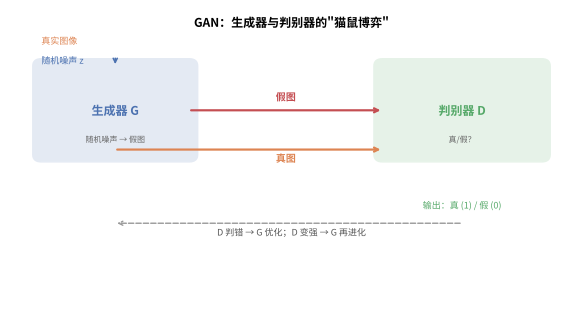
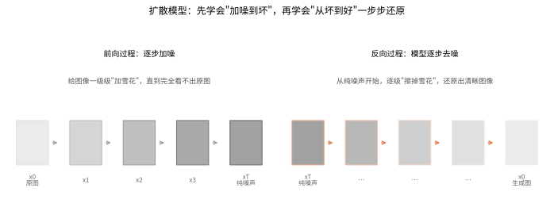
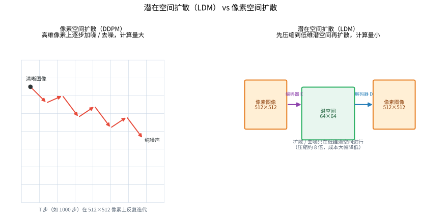
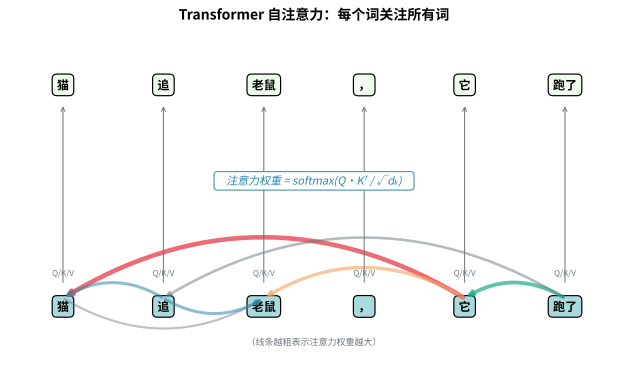
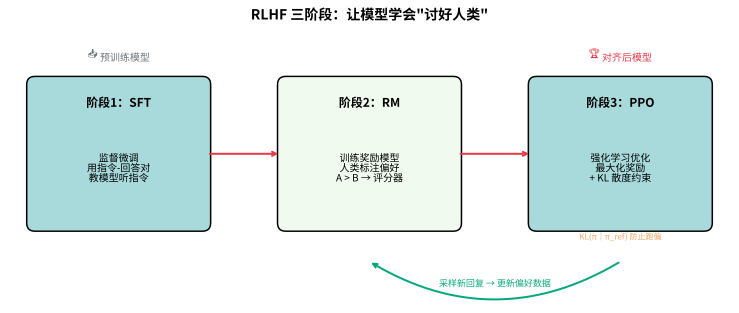
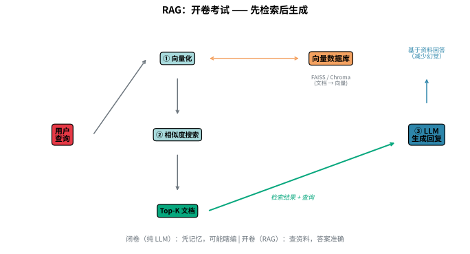
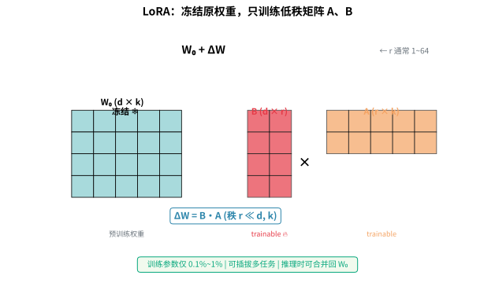
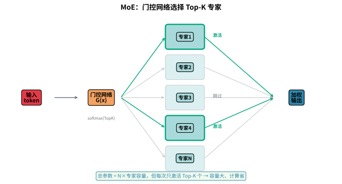

# 生成式 AI 与大模型

> 本文档属于 AI 算法体系的一部分。返回上级文档：[AI 算法体系索引](./11_人工智能.md)

---

## 目录

- [一、生成对抗网络（GAN）](#一生成对抗网络gan)
  - [1.1 GAN 基本原理](#11-gan-基本原理)
  - [1.2 DCGAN](#12-dcgan)
  - [1.3 WGAN](#13-wgan)
  - [1.4 Pix2Pix](#14-pix2pix)
  - [1.5 CycleGAN](#15-cyclegan)
  - [1.6 StyleGAN](#16-stylegan)
  - [1.7 BigGAN](#17-biggan)
- [二、扩散模型（Diffusion Models）](#二扩散模型diffusion-models)
  - [2.1 DDPM](#21-ddpm)
  - [2.2 DDIM](#22-ddim)
  - [2.3 Stable Diffusion](#23-stable-diffusion)
  - [2.4 DiT](#24-dit)
  - [2.5 Sora](#25-sora)
  - [2.6 LDM（潜在扩散模型）](#26-ldm潜在扩散模型)
- [三、大语言模型（LLM）](#三大语言模型llm)
  - [3.1 Transformer 架构](#31-transformer-架构)
  - [3.2 GPT 系列](#32-gpt-系列)
  - [3.3 BERT](#33-bert)
  - [3.4 LLaMA](#34-llama)
  - [3.5 Claude](#35-claude)
  - [3.6 DeepSeek](#36-deepseek)
  - [3.7 LLM 发展里程碑时间线](#37-llm-发展里程碑时间线)
- [四、LLM 核心技术](#四llm-核心技术)
  - [4.1 预训练（Pre-training）](#41-预训练pre-training)
  - [4.2 监督微调（SFT）](#42-监督微调sft)
  - [4.3 基于人类反馈的强化学习（RLHF）](#43-基于人类反馈的强化学习rlhf)
  - [4.4 直接偏好优化（DPO）](#44-直接偏好优化dpo)
  - [4.5 提示工程（Prompt Engineering）](#45-提示工程prompt-engineering)
  - [4.6 检索增强生成（RAG）](#46-检索增强生成rag)
  - [4.7 LoRA 与 QLoRA](#47-lora-与-qlora)
  - [4.8 混合专家模型（MoE）](#48-混合专家模型moe)
  - [4.9 KV-Cache](#49-kv-cache)
  - [4.10 量化（Quantization）](#410-量化quantization)
  - [4.11 文本生成解码策略](#411-文本生成解码策略)
  - [4.12 知识蒸馏](#412-知识蒸馏)
- [五、多模态 AI](#五多模态-ai)
  - [5.1 CLIP](#51-clip)
  - [5.2 DALL·E](#52-dalle)
  - [5.3 GPT-4V](#53-gpt-4v)
  - [5.4 Gemini](#54-gemini)
  - [5.5 Flamingo](#55-flamingo)
  - [5.6 ImageBind](#56-imagebind)
- [六、AI Agent](#六ai-agent)
  - [6.1 什么是 AI Agent](#61-什么是ai-agent)
  - [6.2 Agent 核心组件](#62-agent-核心组件)
  - [6.3 代表性范式](#63-代表性范式)
  - [6.4 典型应用](#64-典型应用)

---

## 一、生成对抗网络（GAN）

### 1.1 GAN 基本原理

**核心创新：** 生成对抗网络（Generative Adversarial Network, GAN）由 Ian Goodfellow 于 2014 年提出，通过**对抗训练**框架让生成器（Generator）和判别器（Discriminator）相互博弈，从而学习真实数据的分布。

> 💡 **类比：造假画师与鉴宝专家互相"卷"** 想象一位造假画师（生成器 G）想画出以假乱真的画，一位鉴宝专家（判别器 D）负责分辨真假。起初画师画得很烂，专家一眼识破；随着不断对弈，画师越画越逼真，专家也不得不练就更毒辣的眼光——两人就在这种"猫鼠博弈"中一起变强。最终画师练到连专家都难辨真假时，它就能从一段随机噪声生成出接近真实的图像。下图展示生成器用噪声造"假画"，判别器分辨真假，双方据此交替优化。



**原理说明：** GAN 由两个神经网络组成：
- **生成器 $G$**：接收随机噪声 $z \sim p_z(z)$，生成假样本 $G(z)$，试图欺骗判别器
- **判别器 $D$**：接收真实样本 $x \sim p_{\text{data}}(x)$ 和假样本 $G(z)$，区分输入是真实还是生成

**技术细节：** 训练过程是极小化极大博弈（minimax game），目标函数为：

$$\min_G \max_D V(D, G) = \mathbb{E}_{x \sim p_{\text{data}}(x)}[\log D(x)] + \mathbb{E}_{z \sim p_z(z)}[\log(1 - D(G(z)))]$$

训练时交替更新：
1. **更新判别器**：最大化 $\log D(x) + \log(1 - D(G(z)))$
2. **更新生成器**：最小化 $\log(1 - D(G(z)))$（或使用非饱和损失 $\max \log D(G(z))$）

**应用场景：** 图像生成、数据增强、超分辨率、风格迁移、异常检测。

#### 代码示例：简单 GAN（NumPy 简化版）

```python
import numpy as np

# 简化的 GAN 训练过程（概念演示）
class SimpleGAN:
    """
    简单 GAN 概念演示
    💡 造假画师（生成器）与鉴宝专家（判别器）的博弈
    """
    def __init__(self, latent_dim=100, data_dim=784):
        self.latent_dim = latent_dim
        self.data_dim = data_dim
        # 生成器：噪声 → 假数据
        self.G_W1 = np.random.randn(latent_dim, 256) * 0.01
        self.G_W2 = np.random.randn(256, data_dim) * 0.01
        # 判别器：数据 → 真假概率
        self.D_W1 = np.random.randn(data_dim, 256) * 0.01
        self.D_W2 = np.random.randn(256, 1) * 0.01
    
    def generator(self, z):
        """生成器：噪声 → 假数据"""
        h = np.maximum(0, z @ self.G_W1)  # ReLU
        return np.tanh(h @ self.G_W2)  # Tanh 输出 [-1, 1]
    
    def discriminator(self, x):
        """判别器：数据 → 真假概率"""
        h = np.maximum(0, x @ self.D_W1)  # LeakyReLU 简化
        return 1 / (1 + np.exp(-(h @ self.D_W2)))  # Sigmoid
    
    def generate_samples(self, n_samples=1):
        """生成假样本"""
        z = np.random.randn(n_samples, self.latent_dim)
        return self.generator(z)

# 示例：生成"假"手写数字图像
gan = SimpleGAN(latent_dim=100, data_dim=784)
fake_images = gan.generate_samples(n_samples=5)
print(f"生成 5 张假图像，每张维度: {fake_images.shape[1]}")
print(f"像素值范围: [{fake_images.min():.3f}, {fake_images.max():.3f}]")
```

---

### 1.2 DCGAN

> 💡 **类比：DCGAN 如同"建筑师设计图纸"**
> 想象一位建筑师（生成器）在画设计图：他先画一个粗略的草图（4×4），然后逐步细化——添加细节（8×8）、完善结构（16×16）、丰富装饰（32×32），最后完成完整的设计图（64×64）。每一步都使用"转置卷积"这个工具，就像建筑师用放大镜逐步细化图纸。而评审专家（判别器）则用"步长卷积"从整体到局部检查设计图的质量。DCGAN 的关键创新是：完全用卷积操作替代全连接层，让生成过程更加稳定和高效。

**核心创新：** 深度卷积生成对抗网络（Deep Convolutional GAN, DCGAN）由 Radford 等人于 2015 年提出，将卷积神经网络引入 GAN 框架，显著提升了生成质量和训练稳定性。

**原理说明：** DCGAN 使用**转置卷积**（Transposed Convolution）作为生成器的上采样方式，判别器使用**步长卷积**（Strided Convolution）代替池化层。

**技术细节：** DCGAN 的关键设计原则：
- 生成器：全连接层 → 转置卷积层 → BatchNorm → ReLU（最后一层使用 Tanh）
- 判别器：卷积层 → LeakyReLU → BatchNorm（输入层不使用 BN）
- 不使用全连接层和池化层
- 在生成器和判别器中均使用 Batch Normalization

生成器结构示例：
```
噪声向量 z (100维) → Reshape (4×4×1024) → Conv2DTranspose (8×8×512) → Conv2DTranspose (16×16×256) → Conv2DTranspose (32×32×128) → Conv2DTranspose (64×64×3)
```

**应用场景：** 为后续 GAN 架构奠定了基础，广泛用于图像生成任务。

---

### 1.3 WGAN

> 💡 **类比：WGAN 如同"更温和的裁判"**
> 想象两个画家在参加比赛：原始 GAN 的裁判很严厉，只给"通过/不通过"的二元评价（JS 散度），导致画家们要么放弃，要么只学一种风格（模式崩塌）。WGAN 的裁判则更温和，他给每个作品打一个连续的分数（Wasserstein 距离），告诉画家"你的画离真实作品还有多远"。这样画家们能持续获得反馈，不断改进，最终学会多种风格。WGAN 的关键创新是：用"推土机距离"替代 JS 散度，让训练更稳定，生成更多样化。

**核心创新：** Wasserstein GAN（WGAN）由 Arjovsky 等人于 2017 年提出，使用**Wasserstein 距离**（Earth Mover 距离）替代 Jensen-Shannon 散度，解决了原始 GAN 训练不稳定、模式崩塌（mode collapse）的问题。

**原理说明：** 原始 GAN 使用 JS 散度衡量分布差异，当分布不重叠时梯度为零，导致训练困难。WGAN 使用 Wasserstein 距离：

$$W(p_r, p_g) = \inf_{\gamma \in \Pi(p_r, p_g)} \mathbb{E}_{(x, y) \sim \gamma}[\|x - y\|]$$

通过 Kantorovich-Rubinstein 对偶性，转化为：

$$\min_G \max_{D \in \mathcal{L}} \mathbb{E}_{x \sim p_r}[D(x)] - \mathbb{E}_{z \sim p_z}[D(G(z))]$$

其中 $D$ 必须是 1-Lipschitz 函数。

**技术细节：**
- **WGAN**：将判别器改为**评论家**（Critic），移除最后一层的 Sigmoid，输出实数分数；通过权重裁剪（weight clipping）强制满足 Lipschitz 约束
- **WGAN-GP**（改进版）：使用**梯度惩罚**（Gradient Penalty）替代权重裁剪，在真实和生成分布之间采样插值点，约束梯度范数接近 1：

$$\mathcal{L}_{\text{GP}} = \lambda \, \mathbb{E}_{\hat{x} \sim p_{\hat{x}}}\left[(\|\nabla_{\hat{x}} D(\hat{x})\|_2 - 1)^2\right]$$

- 不用 BatchNorm（改用 LayerNorm）
- 不将梯度惩罚应用于评论家的输入

**应用场景：** 需要稳定训练的图像生成任务，文本生成，视频生成。

---

### 1.4 Pix2Pix

> 💡 **类比：Pix2Pix 如同"翻译官"**
> 想象一位翻译官在做图像翻译：他看到一张黑白照片（输入），要把它变成彩色照片（输出）。翻译官需要先理解原图的内容（编码器提取特征），然后根据理解重新绘制（解码器生成结果）。关键创新是"跳跃连接"——就像翻译官在翻译时不断回头查看原文，确保不遗漏细节。判别器则像审稿专家，检查翻译后的图像是否自然。Pix2Pix 需要成对的训练数据（黑白-彩色配对），就像翻译官需要对照原文学习。

**核心创新：** Pix2Pix 由 Isola 等人于 2017 年提出，是一种**条件生成对抗网络**（Conditional GAN, cGAN），用于图像到图像的翻译任务，需要成对训练数据。

**原理说明：** 生成器接收输入图像 $x$，生成输出图像 $G(x)$；判别器同时接收输入 $x$ 和输出（真实或生成），判断配对是否真实。

**技术细节：**
- **生成器**：使用 **U-Net 架构**（编码器-解码器 + 跳跃连接），保留低层细节信息
- **判别器**：使用 **PatchGAN**（Markovian 判别器），将图像划分为 $N \times N$ 的 patch，对每个 patch 独立判断真伪，最后取平均。PatchGAN 只惩罚局部结构，有助于生成高分辨率图像的纹理细节
- **损失函数**：结合 cGAN 损失和 L1 损失

$$\mathcal{L}_{\text{cGAN}}(G, D) = \mathbb{E}_{x, y}[\log D(x, y)] + \mathbb{E}_{x, z}[\log(1 - D(x, G(x, z)))]$$

$$\mathcal{L}_{L1}(G) = \mathbb{E}_{x, y, z}[\|y - G(x, z)\|_1]$$

总目标：

$$G^* = \arg\min_G \max_D \mathcal{L}_{\text{cGAN}}(G, D) + \lambda \mathcal{L}_{L1}(G)$$

**应用场景：** 语义分割图 → 真实场景、边缘图 → 照片、灰度图 → 彩色图、地图 → 卫星图。

---

### 1.5 CycleGAN

> 💡 **类比：CycleGAN 如同"双语翻译的往返验证"**
> 想象一位中译英翻译员和一位英译中翻译员。CycleGAN 的巧妙之处在于"往返验证"：把一句中文翻译成英文，再翻译回中文，如果结果和原文一致，说明翻译质量过关。这就像把一张马的照片变成斑马，再变回马，如果还能认出是原来那匹马，说明转换保留了内容结构。CycleGAN 不需要成对训练数据——就像翻译员不需要对照翻译教材，只要会"往返翻译不失真"就行。

**核心创新：** CycleGAN 由 Zhu 等人于 2017 年提出，实现了**无需成对数据**的无监督图像到图像翻译，通过循环一致性损失（Cycle Consistency Loss）保持内容结构。

**原理说明：** 在两个域 $X$ 和 $Y$ 之间进行转换，包含两个生成器和两个判别器：
- 生成器 $G: X \rightarrow Y$，$F: Y \rightarrow X$
- 判别器 $D_X$ 和 $D_Y$ 分别判断对应域的真实性
- **循环一致性**：$F(G(x)) \approx x$，$G(F(y)) \approx y$

**技术细节：** 损失函数由三部分组成：

1. **对抗损失**（Adversarial Loss）：

$$\mathcal{L}_{\text{GAN}}(G, D_Y, X, Y) = \mathbb{E}_{y \sim p_{\text{data}}(y)}[\log D_Y(y)] + \mathbb{E}_{x \sim p_{\text{data}}(x)}[\log(1 - D_Y(G(x)))]$$

2. **循环一致性损失**（Cycle Consistency Loss）：

$$\mathcal{L}_{\text{cyc}}(G, F) = \mathbb{E}_{x \sim p_{\text{data}}(x)}[\|F(G(x)) - x\|_1] + \mathbb{E}_{y \sim p_{\text{data}}(y)}[\|G(F(y)) - y\|_1]$$

3. **身份损失**（Identity Loss，可选）：

$$\mathcal{L}_{\text{identity}}(G, F) = \mathbb{E}_{y \sim p_{\text{data}}(y)}[\|G(y) - y\|_1] + \mathbb{E}_{x \sim p_{\text{data}}(x)}[\|F(x) - x\|_1]$$

总目标：

$$\mathcal{L} = \mathcal{L}_{\text{GAN}}(G, D_Y) + \mathcal{L}_{\text{GAN}}(F, D_X) + \lambda \mathcal{L}_{\text{cyc}}(G, F) + \lambda_{\text{id}} \mathcal{L}_{\text{identity}}(G, F)$$

**应用场景：** 风格迁移（照片 → 油画）、季节转换（夏 → 冬）、动物纹理转换（斑马 ↔ 马）、物体变形。

---

### 1.6 StyleGAN

> 💡 **类比：StyleGAN 如同"化妆师分层化妆"**
> 想象一位化妆师在给人化妆：她先在底层打好粉底（低层细节），再画眉毛和眼影（中层特征），最后涂口红和腮红（高层风格）。StyleGAN 的巧妙之处在于"风格解耦"——你可以单独调整口红的颜色（高层风格），而不影响眉毛的形状（中层特征）。这就像化妆师可以在不同层次独立调整，让妆容更加精细可控。StyleGAN 通过映射网络和 AdaIN 机制，实现了对生成图像风格的精细控制。

**核心创新：** StyleGAN 由 Karras 等人于 2018 年提出，通过**风格调制**（Style Modulation）和**自适应实例归一化**（AdaIN）实现了对生成图像风格属性的精细控制，能够解耦（disentangle）高层属性和随机细节。

**原理说明：** StyleGAN 的生成器架构与传统 GAN 不同：
- 输入噪声先经过**映射网络**（Mapping Network, 8层 MLP）得到中间隐码 $w \in \mathcal{W}$ 空间
- 使用**自适应实例归一化**（AdaIN）将 $w$ 的风格信息注入合成网络每一层
- 引入了**随机噪声**（Stochastic Noise）为图像添加细节变化

**技术细节：**

**AdaIN 公式：**

$$\text{AdaIN}(x_i, y) = \sigma(y_i) \left( \frac{x_i - \mu(x_i)}{\sigma(x_i)} \right) + \mu(y_i)$$

其中 $x_i$ 是特征图，$y_i$ 是映射网络输出的风格向量，$\mu$ 和 $\sigma$ 分别是均值和标准差。

**StyleGAN2 改进**（2020）：
- 用**权重调制与解调**（Weight Modulation & Demodulation）替代 AdaIN，消除"水滴"伪影
- 使用 **Path Length Regularization** 确保 $\mathcal{W}$ 空间的插值平滑
- 改进生成器架构，使用 **Skip Generator** 结构

**StyleGAN3 改进**（2021）：
- 解决**纹理粘连**（texture sticking）问题，使生成图像具有平移等变性
- 使用**傅里叶特征**（Fourier Features）和**边界填充**（Boundary Padding）

**应用场景：** 高分辨率人脸生成（1024×1024）、属性编辑（年龄、表情、姿态）、风格混合、潜在空间插值。

---

### 1.7 BigGAN

> 💡 **类比：BigGAN 如同"大规模工厂生产"**
> 想象一个小作坊和一个大工厂都能生产衣服，但大工厂因为规模大、设备先进、管理精细，生产出来的衣服质量更好、款式更多。BigGAN 的核心思想就是"规模效应"——通过超大的 batch size（2048）、海量的参数（15 亿）和多种训练技巧，在 ImageNet 数据集上实现了当时最先进的图像生成质量。这证明了在 GAN 领域，"大力出奇迹"是有效的。

**核心创新：** BigGAN 由 Brock 等人于 2018 年提出，通过**大规模训练**（batch size 2048、参数 1.5B）和多种训练技巧，在 ImageNet 上实现了当时最先进的类条件图像生成。

**原理说明：** 在条件 GAN 框架下，使用类嵌入（class embeddings）作为条件输入，通过**共享嵌入**和**层次化潜在空间**提升生成质量。

**技术细节：**

- **架构**：使用 ResNet 块作为生成器和判别器的基础模块，使用 **Self-Attention** 层捕获长距离依赖
- **谱归一化**（Spectral Normalization）：应用于生成器和判别器，稳定训练
- **Skip-Z 连接**：将噪声向量 $z$ 连接到生成器的多个层，而非仅输入层
- **截断技巧**（Truncation Trick）：在推理时对潜在向量进行截断采样，在多样性和保真度之间做权衡

$$z_{\text{truncated}} = \text{clamp}(z, -T, T)$$

- **正交正则化**（Orthogonal Regularization）：防止参数退化

$$\mathcal{L}_{\text{orth}} = \beta \sum_{i \neq j} |W_i \cdot W_j|^2$$

- **大 Batch 训练**：使用 Batch Size 2048，在 TPU 上训练

**应用场景：** 大规模类条件图像生成、ImageNet 图像生成（256×256 和 512×512）。

---

## 二、扩散模型（Diffusion Models）

### 2.1 DDPM

**核心创新：** 去噪扩散概率模型（Denoising Diffusion Probabilistic Model, DDPM）由 Ho 等人于 2020 年提出，通过**正向加噪过程**和**反向去噪过程**学习数据分布，在图像生成质量上超越了 GAN。

> 💡 **类比："把照片洗花，再学会一步步洗回来"** 想象把一张清晰的照片，一小步一小步地撒上"电子雪花"（高斯噪声），直到完全变成一片纯雪花——这就是**前向加噪**。模型要学的恰恰相反：掌握从"纯雪花"一步步"擦掉雪花"还原出清晰照片的本领，也就是**反向去噪**。训练时模型见过"每个噪声程度下原图长什么样"，生成时就能从随机雪花出发，逐级还原出崭新图像。下图展示前向"逐级加噪"和反向"逐级去噪"的两个过程。



**原理说明：**

**前向加噪过程（Forward Diffusion Process）：** 从原始数据 $x_0$ 开始，逐步添加高斯噪声，经过 $T$ 步后变为纯噪声 $x_T \sim \mathcal{N}(0, I)$。

$$q(x_t | x_{t-1}) = \mathcal{N}(x_t; \sqrt{1 - \beta_t} \, x_{t-1}, \beta_t I)$$

其中 $\beta_t \in (0, 1)$ 是噪声调度（noise schedule），$t = 1, \dots, T$。

利用重参数化技巧，可以直接从 $x_0$ 计算 $x_t$：

$$x_t = \sqrt{\bar{\alpha}_t} \, x_0 + \sqrt{1 - \bar{\alpha}_t} \, \epsilon, \quad \epsilon \sim \mathcal{N}(0, I)$$

$$q(x_t | x_0) = \mathcal{N}(x_t; \sqrt{\bar{\alpha}_t} \, x_0, (1 - \bar{\alpha}_t) I)$$

其中 $\alpha_t = 1 - \beta_t$，$\bar{\alpha}_t = \prod_{s=1}^t \alpha_s$。

**反向去噪过程（Reverse Denoising Process）：** 学习从噪声 $x_T$ 逐步还原为 $x_0$ 的过程，使用神经网络 $\epsilon_\theta(x_t, t)$ 预测添加的噪声：

$$p_\theta(x_{t-1} | x_t) = \mathcal{N}(x_{t-1}; \mu_\theta(x_t, t), \Sigma_\theta(x_t, t))$$

$$\mu_\theta(x_t, t) = \frac{1}{\sqrt{\alpha_t}} \left( x_t - \frac{\beta_t}{\sqrt{1 - \bar{\alpha}_t}} \epsilon_\theta(x_t, t) \right)$$

**训练目标**（简化后的变分下界）：

$$\mathcal{L}_{\text{simple}}(\theta) = \mathbb{E}_{t, x_0, \epsilon}\left[ \| \epsilon - \epsilon_\theta(x_t, t) \|^2 \right]$$

其中 $t \sim \text{Uniform}(1, T)$，$\epsilon \sim \mathcal{N}(0, I)$，$x_t = \sqrt{\bar{\alpha}_t} x_0 + \sqrt{1 - \bar{\alpha}_t} \epsilon$。

**采样过程：**

$$x_{t-1} = \frac{1}{\sqrt{\alpha_t}} \left( x_t - \frac{\beta_t}{\sqrt{1 - \bar{\alpha}_t}} \epsilon_\theta(x_t, t) \right) + \sigma_t z, \quad z \sim \mathcal{N}(0, I)$$

**技术细节：**
- 使用 **U-Net** 架构作为去噪网络
- **时间编码**：使用正弦位置编码（sinusoidal positional encoding）嵌入时间步 $t$
- 噪声调度：线性调度（Linear Schedule）或余弦调度（Cosine Schedule）
- $T$ 通常取 1000 步

**应用场景：** 图像生成、图像修复、超分辨率、音频生成。

#### 代码示例：扩散模型去噪过程（简化版）

```python
import numpy as np

# 扩散模型核心概念演示
class SimpleDiffusion:
    """
    简单扩散模型概念演示
    💡 把照片"洗花"，再学会一步步"洗回来"
    """
    def __init__(self, n_steps=1000, beta_start=0.0001, beta_end=0.02):
        self.T = n_steps
        # 线性噪声调度
        self.betas = np.linspace(beta_start, beta_end, n_steps)
        self.alphas = 1 - self.betas
        self.alpha_bars = np.cumprod(self.alphas)  # ᾱ_t = ∏α_s
    
    def forward_diffusion(self, x_0, t):
        """前向加噪：直接从 x_0 计算 x_t"""
        sqrt_alpha_bar = np.sqrt(self.alpha_bars[t])
        sqrt_one_minus_alpha_bar = np.sqrt(1 - self.alpha_bars[t])
        noise = np.random.randn(*x_0.shape)
        x_t = sqrt_alpha_bar * x_0 + sqrt_one_minus_alpha_bar * noise
        return x_t, noise
    
    def denoise_step(self, x_t, t, predicted_noise):
        """单步去噪：从 x_t 预测 x_{t-1}"""
        alpha_t = self.alphas[t]
        alpha_bar_t = self.alpha_bars[t]
        
        # 预测 x_0
        predicted_x0 = (x_t - np.sqrt(1 - alpha_bar_t) * predicted_noise) / np.sqrt(alpha_bar_t)
        # 计算 x_{t-1} 的均值
        mean = (1 / np.sqrt(alpha_t)) * (x_t - (self.betas[t] / np.sqrt(1 - alpha_bar_t)) * predicted_noise)
        
        if t > 0:
            # 加噪声（t=0 时不加）
            noise = np.random.randn(*x_t.shape)
            x_prev = mean + np.sqrt(self.betas[t]) * noise
        else:
            x_prev = mean
        return x_prev

# 示例：对一张"图像"进行加噪和去噪
diffusion = SimpleDiffusion(n_steps=1000)

# 模拟一张 8x8 的"图像"
x_0 = np.random.randn(8, 8)

# 前向加噪到 t=500
x_500, noise = diffusion.forward_diffusion(x_0, t=500)
print(f"原始图像范围: [{x_0.min():.2f}, {x_0.max():.2f}]")
print(f"加噪后范围: [{x_500.min():.2f}, {x_500.max():.2f}]")
print(f"噪声水平（t=500）: α̅_500 = {diffusion.alpha_bars[500]:.4f}")
```

---

### 2.2 DDIM

> 💡 **类比：DDIM 如同"快进播放"**
> 想象 DDPM 是逐帧播放的慢动作视频（1000 步），而 DDIM 是快进播放（10-50 步）。DDIM 通过改变采样方式，让扩散模型可以跳过中间步骤，直接跳到关键帧。这就像你看电影时按快进键，虽然跳过了很多帧，但剧情依然连贯。DDIM 还支持"潜在空间插值"——就像在两个视频片段之间平滑过渡，生成中间状态。

**核心创新：** 去噪扩散隐式模型（Denoising Diffusion Implicit Model, DDIM）由 Song 等人于 2020 年提出，将扩散过程重新定义为**非马尔可夫**过程，实现了**少步采样**（10-50 步），同时支持**潜在空间插值**。

**原理说明：** DDIM 保持了 DDPM 的训练过程，但改变了采样方式。通过将反向过程推广为非马尔可夫过程，使得采样路径变为**确定性**而非随机。

**技术细节：**

DDIM 的采样公式：

$$x_{t-1} = \sqrt{\alpha_{t-1}} \left( \frac{x_t - \sqrt{1 - \alpha_t} \, \epsilon_\theta(x_t, t)}{\sqrt{\alpha_t}} \right) + \sqrt{1 - \alpha_{t-1} - \sigma_t^2} \, \epsilon_\theta(x_t, t) + \sigma_t \epsilon_t$$

其中 $\epsilon_t \sim \mathcal{N}(0, I)$，$\sigma_t$ 控制随机性程度。

当 $\sigma_t = 0$ 时，采样过程变为**确定性**的：

$$x_{t-1} = \sqrt{\alpha_{t-1}} \left( \frac{x_t - \sqrt{1 - \alpha_t} \, \epsilon_\theta(x_t, t)}{\sqrt{\alpha_t}} \right) + \sqrt{1 - \alpha_{t-1}} \, \epsilon_\theta(x_t, t)$$

**关键特性：**
- **加速采样**：可以跳过中间步骤，仅在子序列 $\{\tau_1, \dots, \tau_S\}$ 上采样
- **一致性**：使用 DDIM 采样，不同 $t$ 步的 $x_0$ 预测保持一致
- **插值能力**：由于确定性映射，可以在潜在空间做语义插值

**应用场景：** 加速图像生成、潜在空间编辑、图像语义插值。

---

### 2.3 Stable Diffusion

> 💡 **类比：Stable Diffusion 如同"在草稿纸上画画"**
> 想象你要画一幅高清油画，直接在巨大的画布上画（像素空间）太费颜料和精力。Stable Diffusion 的做法是：先用 VAE 把画布缩小成"草稿纸"（潜空间），在草稿纸上完成扩散和去噪过程，最后再用解码器放大回高清画布。这就像建筑师先在草稿纸上画设计图，确认满意后再画正式图纸。因为草稿纸小得多（压缩 8 倍），计算成本大幅降低，普通显卡也能生成高分辨率图像。

**核心创新：** Stable Diffusion（SD）由 Rombach 等人于 2022 年提出，是一种**潜在扩散模型**（Latent Diffusion Model, LDM），将扩散过程从像素空间转移到**潜空间**（Latent Space），大幅降低了计算成本，使高分辨率图像生成在消费级 GPU 上成为可能。

**原理说明：** Stable Diffusion 由三个核心组件构成：

**1. VAE（变分自编码器）：**
- 编码器 $\mathcal{E}$ 将图像 $x$ 压缩到低维潜空间 $z = \mathcal{E}(x)$
- 解码器 $\mathcal{D}$ 将潜在表示 $z$ 重建为图像 $\hat{x} = \mathcal{D}(z)$
- 压缩因子 $f = H/h = W/w$（通常 $f = 8$）

**2. U-Net（去噪网络）：**
- 在潜空间中进行扩散/去噪过程
- 通过交叉注意力（Cross-Attention）机制注入条件信息（文本、图像等）

**3. CLIP 文本编码器：**
- 将文本提示 $y$ 编码为条件向量 $\tau_\theta(y)$
- 通过交叉注意力层注入 U-Net

**技术细节：**

**损失函数：**

$$\mathcal{L}_{\text{LDM}} = \mathbb{E}_{\mathcal{E}(x), y, \epsilon, t}\left[ \|\epsilon - \epsilon_\theta(z_t, t, \tau_\theta(y))\|_2^2 \right]$$

其中 $z_t$ 是潜空间中的加噪隐变量，$\tau_\theta(y)$ 是文本编码器的条件嵌入。

**交叉注意力机制：**

$$\text{Attention}(Q, K, V) = \text{softmax}\left(\frac{QK^T}{\sqrt{d_k}}\right)V$$

其中 $Q = W_Q \cdot \phi(z_t)$（来自 U-Net 特征），$K = W_K \cdot \tau_\theta(y)$，$V = W_V \cdot \tau_\theta(y)$（来自文本嵌入）。

**模型版本演进：**
- **SD 1.x**：基于 256×256 图像训练的 VAE，CLIP ViT-L/14
- **SD 2.x**：基于 512×512 图像，使用 OpenCLIP ViT-H/14，引入深度估计
- **SDXL**：更大的 U-Net（3 倍参数），双文本编码器（OpenCLIP ViT-bigG + CLIP ViT-L），256×256 和 1024×1022 两阶段生成
- **SD 3**：基于 **MMDiT**（Multimodal Diffusion Transformer），使用 **Rectified Flow** 和 **QK-Normalization**，支持多模态输入
- **SD 3.5**：改进的 MMDiT 架构

**应用场景：** 文生图（Text-to-Image）、图生图（Image-to-Image）、图像修复（Inpainting）、超分辨率、ControlNet 条件控制。

---

### 2.4 DiT

> 💡 **类比：DiT 如同"用乐高积木拼图案"**
> 想象你要用乐高积木拼一幅画。传统 U-Net 是"从整体到局部"的雕刻方式，而 DiT 是"把画切成小块，逐块拼搭"。DiT 把图像切成一个个 patch（像乐高积木块），然后用 Transformer 的注意力机制让每块积木"看到"其他积木，协调拼搭。这就像拼图时，你不仅要看当前这块的形状，还要看周围几块的图案是否匹配。DiT 的优势是：Transformer 架构更灵活，可以处理不同分辨率和任务，Sora 视频模型就是基于 DiT 的变体。

**核心创新：** 扩散 Transformer（Diffusion Transformer, DiT）由 Peebles 和 Xie 于 2023 年提出，用 **Transformer 架构**替代了传统的 U-Net 作为扩散模型的主干网络，在图像生成质量上显著提升。

**原理说明：** DiT 将潜在空间中的噪声图像切分为 patches，输入 Transformer 进行去噪预测。它遵循了 **ViT**（Vision Transformer）的设计范式。

**技术细节：**

**架构设计：**
1. **Patchify**：将潜空间特征图 $z \in \mathbb{R}^{I \times I \times C}$ 切分为 $p \times p$ 的 patches，展平为 token 序列
2. **条件编码**：将时间步 $t$ 和类别标签 $c$ 通过 **AdaLN-Zero**（Adaptive Layer Norm with Zero-init）注入 Transformer 块
3. **Transformer 块**：使用标准的注意力机制和前馈网络

**AdaLN-Zero 机制：**

$$\text{AdaLN}(h, y) = y_{\text{scale}} \cdot \text{LayerNorm}(h) \cdot (1 + \gamma) + \beta$$

其中 $\gamma, \beta$ 由时间步和类别条件通过 MLP 预测得到。Zero-init 是指所有回归参数初始化为零，使得训练开始时每个 DiT 块等价于恒等映射。

**缩放定律（Scaling Laws）：** DiT 展现出清晰的缩放行为——随着模型大小和计算量的增加，生成质量（FID 分数）持续提升。

**DiT 系列：**
- DiT-S / DiT-B / DiT-L / DiT-XL（从小到大的参数规模）
- 在 ImageNet 256×256 上，DiT-XL/2 取得了当时最优的 FID 分数

**应用场景：** 高质量图像生成、视频生成（扩散 Transformer 的变体用于视频模型如 Sora）、3D 生成。

---

### 2.5 Sora

> 💡 **类比：Sora 如同"文字导演拍电影"**
> 想象你是一位导演，手里只有一个剧本（文字描述），但你要拍出一部 60 秒的电影。Sora 就像一位神奇的导演：它先理解剧本（文本编码），然后把电影分成一帧帧的画面（时空 patch），用 DiT 架构让每一帧都知道前后帧在发生什么（时空注意力），最后生成连贯的视频。这就像导演在脑海中"预演"整部电影，确保每个镜头都衔接自然。Sora 的核心能力是理解物理世界——物体会下落、遮挡会消失、动作会延续，就像它真的"懂"现实世界的规律。

**核心创新：** Sora 由 OpenAI 于 2024 年发布，是一个**文生视频**（Text-to-Video）的扩散模型，能够生成最长达 60 秒的高质量、高一致性视频。其核心创新在于使用 **DiT** 架构在**时空 patch**（Spacetime Patches）上进行训练。

**原理说明：** Sora 将视频和图像统一表示为**时空 patch 序列**，在 Transformer 架构中进行扩散训练：

1. **视频压缩网络**：将原始视频压缩到低维潜在空间
2. **时空 Patch 化**：将视频潜在表示切分为 3D patches（空间×时间）
3. **DiT 架构**：在 patch 序列上进行扩散去噪
4. **文本条件**：使用 DALL·E 3 的重标注技术（re-captioning）增强文本理解

**技术细节：**

**关键能力：**
- **长视频生成**：60 秒高质量视频，保持时间一致性
- **3D 一致性**：模拟三维世界运动，物体在场景中保持物理合理性
- **长距离依赖**：能够处理遮挡、物体持久性
- **多视角生成**：同一场景可从不同视角生成
- **视频编辑与扩展**：支持视频向前/向后扩展、拼接、风格转换

**核心算法：**
- 使用 **DiT** 作为主干网络
- **Patch 维度**：$1 \times 1 \times 1$（时空不可分）
- **训练数据**：大规模视频和图像联合训练，使用原始分辨率/时长
- **重标注技术**：使用视频描述模型为训练视频生成详细文本描述

**应用场景：** 文生视频、视频编辑、视频扩展、3D 世界模拟、创意内容制作。

---

### 2.6 LDM（潜在扩散模型）

> 💡 **类比：LDM 如同"先在草图作画，再放大成正式作品"**
> 想象你要画一幅巨幅壁画（高分辨率图像）。直接在大墙上一笔一笔地画（像素空间扩散）既费颜料又费体力。LDM（潜在扩散模型）的做法是：先用 VAE 把壁画"缩印"成一张小草图（潜空间），在草图上完成全部扩散与去噪，最后再用解码器把草图放大回完整的壁画。Stable Diffusion（见 2.3）正是这一思想最著名的开源实现。因为草图远小于正式画布（通常压缩 8 倍），计算成本大幅下降，普通消费级 GPU 也能生成高清图像。下图对比了直接在像素空间扩散与在潜在空间扩散两种范式。



**核心创新：** 潜在扩散模型（Latent Diffusion Model, LDM）由 Rombach 等人于 2022 年在论文《High-Resolution Image Synthesis with Latent Diffusion Models》中提出，将扩散过程从**像素空间**（Pixel Space）转移到低维的**潜空间**（Latent Space）进行，在保持高生成质量的同时大幅降低了计算与显存开销。LDM 是"潜在扩散"这一通用框架的统称，而 **Stable Diffusion（见 2.3）** 是该框架最著名的开源实例。

**原理说明：** LDM 的核心洞察是：扩散模型的大部分去噪计算都花在了人眼不易察觉的"高频细节"上。因此可以先通过自编码器（VAE）把图像压缩到低维潜空间，让扩散模型只学习潜空间中的"语义结构"，精确的细节交给解码器重建。

**技术细节：**

**1. 两阶段结构：**
- **感知压缩**（Perceptual Compression）：使用 VAE 编码器 $\mathcal{E}$ 将图像 $x$ 压缩到潜变量 $z = \mathcal{E}(x)$，压缩因子 $f = H/h = W/w$（典型 $f = 8$）
- **扩散 / 去噪**：在潜空间 $z$ 上执行与 DDPM 相同的加噪-去噪过程
- **解码重建**：VAE 解码器 $\mathcal{D}$ 将去噪后的潜变量还原为像素图像 $\hat{x} = \mathcal{D}(z)$

**2. 训练目标：** 在潜空间上预测噪声，公式与 DDPM 一致：

$$\mathcal{L}_{\text{LDM}} = \mathbb{E}_{z, \epsilon, t}\left[ \| \epsilon - \epsilon_\theta(z_t, t) \|_2^2 \right]$$

其中 $z_t = \sqrt{\bar{\alpha}_t} z + \sqrt{1 - \bar{\alpha}_t} \epsilon$ 为潜空间中的加噪隐变量。

**3. 条件注入：** 通过**交叉注意力**（Cross-Attention）把文本、语义图等条件信息注入去噪网络，实现可控生成。

**LDM 家族与变体：**
- **Stable Diffusion**（见 2.3）：LDM 框架最著名的开源实现，将文本条件与潜空间扩散结合
- **VQ-Diffusion / VQ-Diffusion++**：使用 VQ-VAE 离散化潜空间，基于离散 token 的类别扩散
- **Latent DiT**：将潜空间扩散与 DiT（见 2.4）主干结合，兼顾效率与 Transformer 的可扩展性

**应用场景：** 高清文生图、图生图、图像修复、超分辨率、视频与 3D 生成（潜空间扩散思想被广泛复用）。

---

## 三、大语言模型（LLM）

### 3.1 Transformer 架构

> 💡 **类比：Transformer 如同"阅读时的注意力分配"**
> 想象你在读一本书。遇到"它很可爱，因为会撒娇"这句话时，你的大脑会自动把"它"和前面的"猫"联系起来，忽略掉无关的虚词"因为"。Transformer 的自注意力机制就是模拟这种能力：对每个词，它会计算与其他所有词的相关性，给重要的词分配更多"注意力权重"。多头注意力则像同时用多个角度理解句子——一个头关注语法关系，一个头关注语义关系，一个头关注位置关系。位置编码则告诉模型词的顺序，因为 Transformer 是并行处理所有词的，不像 RNN 逐个读取。



**核心创新：** Transformer 由 Vaswani 等人于 2017 年在论文《Attention Is All You Need》中提出，完全基于**自注意力机制**（Self-Attention），摒弃了循环和卷积结构，为现代大语言模型奠定了基础。

**原理说明：** Transformer 采用**编码器-解码器**架构，由多个相同层堆叠而成：

**编码器层：** 多头自注意力（Multi-Head Self-Attention）→ 前馈网络（FFN）→ 残差连接 + LayerNorm
**解码器层：** 掩码多头自注意力 → 交叉注意力（Cross-Attention）→ 前馈网络 → 残差连接 + LayerNorm

**技术细节：**

**缩放点积注意力（Scaled Dot-Product Attention）：**

$$\text{Attention}(Q, K, V) = \text{softmax}\left(\frac{QK^T}{\sqrt{d_k}}\right)V$$

其中 $Q = XW_Q$，$K = XW_K$，$V = XW_V$。除以 $\sqrt{d_k}$ 防止梯度消失。

**多头注意力（Multi-Head Attention）：**

$$\text{MultiHead}(Q, K, V) = \text{Concat}(\text{head}_1, \dots, \text{head}_h) W_O$$

$$\text{head}_i = \text{Attention}(QW_Q^i, KW_K^i, VW_V^i)$$

**位置编码（Positional Encoding）：**

使用正弦和余弦函数编码位置信息：

$$PE_{(pos, 2i)} = \sin\left(\frac{pos}{10000^{2i/d_{\text{model}}}}\right)$$

$$PE_{(pos, 2i+1)} = \cos\left(\frac{pos}{10000^{2i/d_{\text{model}}}}\right)$$

**前馈网络（FFN）：**

$$\text{FFN}(x) = \max(0, xW_1 + b_1)W_2 + b_2$$

使用 ReLU 激活函数（后续变体使用 GELU、SwiGLU 等）。

**关键公式总结：**

$$\text{Transformer}(X) = \text{LayerNorm}(X + \text{MultiHead}(X)) + \text{LayerNorm}(X + \text{FFN}(X))$$

**应用场景：** 所有现代大语言模型的基础架构，机器翻译、文本生成、代码生成、多模态模型。

#### 代码示例：Transformer 核心组件（NumPy 简化版）

```python
import numpy as np

# Transformer 核心：自注意力机制
def scaled_dot_product_attention(Q, K, V, mask=None):
    """
    缩放点积注意力
    💡 就像阅读时给每个词分配"注意力权重"，决定当前词应该关注哪些词
    """
    d_k = Q.shape[-1]
    # 计算注意力分数：Q·K^T / √d_k
    scores = np.matmul(Q, K.T) / np.sqrt(d_k)
    
    # 如果有掩码（如解码器中，防止看到未来信息）
    if mask is not None:
        scores = np.where(mask == 0, -1e9, scores)
    
    # Softmax 归一化得到注意力权重
    attention_weights = np.exp(scores) / np.sum(np.exp(scores), axis=-1, keepdims=True)
    
    # 加权求和得到输出
    output = np.matmul(attention_weights, V)
    return output, attention_weights

# 多头注意力
class MultiHeadAttention:
    """
    多头注意力：同时从多个角度理解文本
    💡 就像读句子时，一个头关注语法关系，一个头关注语义关系，一个头关注位置关系
    """
    def __init__(self, d_model=512, n_heads=8):
        self.d_model = d_model
        self.n_heads = n_heads
        self.d_k = d_model // n_heads
        
        # 权重矩阵
        self.W_q = np.random.randn(d_model, d_model) * 0.01
        self.W_k = np.random.randn(d_model, d_model) * 0.01
        self.W_v = np.random.randn(d_model, d_model) * 0.01
        self.W_o = np.random.randn(d_model, d_model) * 0.01
    
    def forward(self, X, mask=None):
        # 线性投影
        Q = X @ self.W_q
        K = X @ self.W_k
        V = X @ self.W_v
        
        # 分割成多个头
        batch_size = X.shape[0]
        Q = Q.reshape(batch_size, -1, self.n_heads, self.d_k).transpose(0, 2, 1, 3)
        K = K.reshape(batch_size, -1, self.n_heads, self.d_k).transpose(0, 2, 1, 3)
        V = V.reshape(batch_size, -1, self.n_heads, self.d_k).transpose(0, 2, 1, 3)
        
        # 对每个头计算注意力
        attn_out, _ = scaled_dot_product_attention(Q, K, V, mask)
        
        # 拼接所有头
        attn_out = attn_out.transpose(0, 2, 1, 3).reshape(batch_size, -1, self.d_model)
        
        # 最终线性投影
        output = attn_out @ self.W_o
        return output

# 示例：处理一个序列
batch_size, seq_len, d_model = 1, 10, 512
X = np.random.randn(batch_size, seq_len, d_model)

mha = MultiHeadAttention(d_model=512, n_heads=8)
output = mha.forward(X)
print(f"输入形状: {X.shape}")
print(f"输出形状: {output.shape}")
```

**💡 学习要点：**
- 自注意力的核心是 $Q$（Query）、$K$（Key）、$V$（Value）三个矩阵
- 除以 $\sqrt{d_k}$ 防止点积过大导致 softmax 梯度消失
- 多头注意力让模型同时从多个角度理解序列关系
- 这是所有现代大模型（GPT、BERT、LLaMA 等）的基础组件

---

### 3.2 GPT 系列

> 💡 **类比：GPT 系列如同"从通才到专才的成长"**
> 想象一个人先广泛阅读（预训练），学会语言规律和常识，成为"通才"。然后根据工作需要，快速学习特定技能（微调），成为"专才"。GPT-1 证明了这种"先通后专"的可行性；GPT-2 发现通才足够强，不用专门培训也能干活（零样本迁移）；GPT-3 则发现只要读得足够多（1750 亿参数），通才几乎什么都会，连提示词都能理解（In-Context Learning）。GPT-4 更是加上"眼睛"（多模态），能看图说话。

#### GPT-1（2018 年 6 月）

**核心创新：** 首次将 **Transformer 解码器**架构用于语言模型，提出**生成式预训练**（Generative Pre-Training）范式——先在大规模无标注数据上预训练，然后在特定任务上微调。

**原理说明：** 使用 12 层 Transformer 解码器，单向自注意力（只关注左侧上下文），在大规模无标注文本上进行语言建模预训练。

**模型规模：** 117M 参数。

#### GPT-2（2019 年 2 月）

**核心创新：** 证明语言模型在**零样本迁移**（Zero-shot Transfer）下的能力，在未经过微调的情况下就能完成多种 NLP 任务。

**原理说明：** 使用更大的 Transformer 解码器，在 WebText 数据集（800 万网页）上训练。

**模型规模：** 1.5B 参数（最大版本）。

#### GPT-3（2020 年 6 月）

**核心创新：** 提出**上下文学习**（In-Context Learning, ICL）能力——通过提示（prompt）中的少量示例即可完成任务，无需参数更新。展现了**涌现能力**（Emergent Abilities）。

**原理说明：** 使用 96 层 Transformer 解码器，在 45TB 文本数据上训练。

**模型规模：** 175B 参数（d_model = 12288，n_heads = 96，n_layers = 96）。

**技术细节：**
- 使用**交替稀疏注意力**（Sparse Attention）模式
- 学习率调度：余弦衰减
- 梯度裁剪、梯度累积

#### GPT-4（2023 年 3 月）

**核心创新：** **多模态**能力（支持图像和文本输入），在多种专业考试中达到人类水平，推理能力显著提升。

**原理说明：** 架构细节未公开，但已知包含：
- 多模态能力（图像 + 文本输入，文本输出）
- 使用 **RLHF** 进行对齐
- 更长的上下文窗口（32K tokens，后续扩展至 128K）
- 更强的推理、规划、创造能力

**模型规模：** 据估算约 1.8T 参数（MoE 架构）。

**GPT-4o**（2024 年 5 月）：
- 全模态（文本、图像、音频输入输出）
- 更快的推理速度（原生多模态）
- 情感识别、实时语音对话

---

### 3.3 BERT

> 💡 **类比：BERT 如同"完形填空高手"**
> 想象你在做语文考试的完形填空：句子"今天天气很___，适合出去玩"，你需要根据上下文填入"好"。BERT 的训练方式就是这样——随机遮住 15% 的词（挖空），然后让模型预测被遮住的词。与 GPT 从左到右生成不同，BERT 能同时看到左右两边的上下文（双向），就像做完形填空时你会看整句话。这让 BERT 在理解任务上表现卓越，成为 NLP 领域的"预训练-微调"范式开创者。

**核心创新：** 双向编码器表示（Bidirectional Encoder Representations from Transformers, BERT）由 Google 于 2018 年提出，使用**双向 Transformer 编码器**和**掩码语言模型**（Masked Language Model, MLM）预训练目标，在 11 项 NLP 任务上取得 SOTA。

**原理说明：** BERT 使用 Transformer 编码器，双向注意力机制可以同时关注上下文两侧的信息。

**训练目标：**
1. **MLM（掩码语言模型）**：随机掩盖 15% 的 token，预测被掩盖的 token
2. **NSP（下一句预测）**：判断两个句子是否是连续的段落

**模型规模：**
- BERT-Base：110M 参数（12 层，768 维，12 注意力头）
- BERT-Large：340M 参数（24 层，1024 维，16 注意力头）

**MLM 损失函数：**

$$\mathcal{L}_{\text{MLM}} = -\sum_{i \in \mathcal{M}} \log P(x_i | x_{\setminus \mathcal{M}})$$

其中 $\mathcal{M}$ 是被掩盖 token 的索引集合。

**应用场景：** 文本分类、命名实体识别、问答系统、语义相似度、文本蕴含。

---

### 3.4 LLaMA

> 💡 **类比：LLaMA 如同"精益创业"**
> 想象两家餐厅：一家花巨资装修（大参数量），另一家用更优质的食材和更精细的烹饪（更多训练数据）。LLaMA 证明了后者——不需要把餐厅装修得无比豪华（万亿参数），只要用更好的食材（2 万亿 tokens）和更精细的烹饪工艺（架构优化），小餐厅也能做出米其林级别的美食。这打破了"模型越大越强"的迷信，让开源社区也能用消费级 GPU 训练出强大的模型。

**核心创新：** LLaMA（Large Language Model Meta AI）由 Meta 于 2023 年发布，证明了**小模型在更多数据上训练也能达到大模型性能**，推动了开源大模型生态发展。

**原理说明：** LLaMA 使用仅解码器（Decoder-only）的 Transformer 架构，在公开可用的数据上进行训练。

**技术细节：**

**LLaMA 1（2023 年 2 月）：**
- 架构改进：
  - **Pre-Normalization**：使用 RMSNorm 在子层之前进行归一化
  - **SwiGLU 激活函数**：替代 ReLU

  $$\text{SwiGLU}(x, W, V) = \text{Swish}(xW) \odot (xV)$$

  $$\text{Swish}(x) = x \cdot \sigma(x) = \frac{x}{1 + e^{-x}}$$

  - **旋转位置编码**（RoPE, Rotary Position Embedding）：在注意力计算中编码相对位置
  - **AdamW 优化器**：余弦学习率衰减

- 模型规模：7B、13B、33B、65B

**LLaMA 2（2023 年 7 月）：**
- 训练数据：2 万亿 tokens
- 上下文窗口：4096 tokens（LLaMA 1 为 2048）
- 发布了**微调版** LLaMA-2-Chat，使用 RLHF 对齐
- 分组查询注意力（Grouped Query Attention, GQA）

**LLaMA 3（2024 年 4 月）：**
- 训练数据：15 万亿+ tokens
- 词汇表：128K tokens（使用 tiktoken 分词器）
- 模型规模：8B、70B
- 使用了 **GQA** 提升推理效率
- LLaMA 3.1（2024 年 7 月）：新增 405B 版本，128K 上下文窗口，支持多语言

**应用场景：** 开源大模型基座，对话系统、代码生成、研究应用。

---

### 3.5 Claude

> 💡 **类比：Claude 如同"有职业道德的医生"**
> 想象一位医生，不仅医术精湛，还严格遵守希波克拉底誓言——"首先，不伤害病人"。Claude 的 Constitutional AI 就像给模型一本"职业道德准则"：当模型遇到可能有害的请求时，它会像医生拒绝开不该开的药一样，礼貌地拒绝。关键创新是：这些准则不是人工一条条标注的，而是让模型根据"宪法"自我审查、自我改进——就像医生通过伦理委员会的案例讨论不断提升自己的职业操守。

**核心创新：** Claude 由 Anthropic 开发，以**安全性**和**对齐**为核心设计理念，使用了 **Constitutional AI**（宪法 AI）训练方法，在保持有用性的同时最小化有害输出。

**原理说明：** Claude 使用解码器-only Transformer 架构，通过独特的对齐训练流程实现安全目标。

**技术细节：**

**Constitutional AI（CAI）：**
1. **监督学习阶段**：使用宪法原则（如"选择最无害的回复"）生成偏好数据，进行 SFT
2. **RLHF 阶段**：基于宪法原则训练偏好模型，使用强化学习优化

**训练流程：**

$$\text{CAI 监督阶段}:\quad \text{使用宪法原则自我修订生成偏好数据} \rightarrow \text{SFT}$$

$$\text{CAI RLHF 阶段}:\quad \text{根据宪法原则训练偏好模型} \rightarrow \text{RL 优化}$$

**模型演进：**
- **Claude 1**（2023 年 3 月）：首批以安全对齐为核心的商用大模型
- **Claude 2**（2023 年 7 月）：100K 上下文窗口，改进推理和编码能力
- **Claude 3**（2024 年 3 月）：多模态能力（图像输入），Haiku/Sonnet/Opus 三个版本，Opus 在多项基准测试上超越 GPT-4
- **Claude 3.5**（2024 年 6 月）：Sonnet 和 Haiku 版本，显著提升编码和推理能力

**核心特性：**
- **长期记忆**：支持长上下文（200K tokens）
- **安全设计**：减少有害输出，避免越狱
- **诚实性**：当不确定时主动表明

---

### 3.6 DeepSeek

> 💡 **类比：DeepSeek 如同"精打细算的工程师"**
> 想象两家公司都要建一座大楼：一家不计成本用最粗的钢梁（大参数量），另一家用巧妙的结构设计（MoE）让每根钢梁都发挥最大作用。DeepSeek 就是后者——通过混合专家架构（MoE），671B 参数的模型每次只激活 37B，就像一栋大楼只有需要照明的楼层才开灯。更厉害的是，它用 FP8 混合精度训练，把计算成本压到同行的几分之一——就像用更高效的施工工艺，花更少的钱建同样坚固的大楼。

**核心创新：** DeepSeek 由深度求索（DeepSeek）开发，通过在**架构创新**（MoE、MLA）和**训练效率优化**上的突破，以远低于同行的成本实现了接近顶尖水平的性能。

**原理说明：** DeepSeek 系列模型在 Transformer 架构上进行了多项创新，专注于推理效率和长上下文处理。

**技术细节：**

**DeepSeek 主要模型：**

**DeepSeek-V2（2024 年 5 月）：**
- **多头潜在注意力**（Multi-head Latent Attention, MLA）：通过低秩压缩减少 KV-Cache 大小
- **DeepSeekMoE**：细粒度混合专家架构，在 236B 总参数中仅激活 21B
- **训练成本**：约 560 万美元（远低于同级别模型）

**DeepSeek-R1（2025 年 1 月）：**
- **推理增强**：通过强化学习提升推理能力
- 在数学、编程和推理任务上展现出与 OpenAI o1 相当的推理性能
- 采用**思维链**（Chain-of-Thought）推理 + 强化学习训练

**DeepSeek-V3（2025 年底）：**
- 671B 总参数，37B 激活参数
- **MoE 架构**，使用 **Multi-Token Prediction**（多 token 预测）训练目标
- 训练数据：14.8T tokens
- 在多项基准测试中与 GPT-4 和 Claude 3.5 表现相当

**DeepSeek 核心技术：**
- **MLA（Multi-head Latent Attention）**：通过低秩键值压缩减少推理时的 KV-Cache 内存占用
- **FP8 混合精度训练**：降低训练成本
- **多 token 预测**：同时预测多个未来 token，提升训练效率

---

### 3.7 LLM 发展里程碑时间线

> 下表汇总了从 Transformer 架构到当今大模型时代的关键里程碑事件，共 18 个节点。它们穿插于上文 3.1~3.6 各模型家族之中，这里是按时间顺序的显式总览，方便快速回顾大语言模型的发展脉络。

| 年份 | 模型 / 事件 | 发布机构 | 意义 |
|------|------------|----------|------|
| 2017 | **Transformer** | Google | 提出自注意力架构，奠定所有现代大模型的基础 |
| 2018 | **GPT-1** | OpenAI | 首个生成式预训练语言模型，开创"预训练-微调"范式 |
| 2018 | **BERT** | Google | 双向编码器 + 掩码语言模型，树立迁移学习标杆 |
| 2019 | **GPT-2** | OpenAI | 证明语言模型的零样本（Zero-shot）泛化能力 |
| 2020 | **GPT-3** | OpenAI | 175B 参数，展现上下文学习与涌现能力 |
| 2022 | **InstructGPT** | OpenAI | 系统化使用 RLHF 对齐，让模型"听人话" |
| 2022 | **ChatGPT** | OpenAI | 对话式产品引爆大模型时代，进入大众视野 |
| 2023 | **GPT-4** | OpenAI | 多模态 + 强推理，多项专业考试达到人类水平 |
| 2023 | **LLaMA** | Meta | 开源高效基座，证明"小模型+大数据"也能追平大模型 |
| 2023 | **Claude** | Anthropic | 以安全对齐为核心，提出宪法 AI（Constitutional AI） |
| 2023 | **Gemini** | Google DeepMind | 原生多模态大模型，从零开始联合训练 |
| 2023 | **Mixtral** | Mistral AI | 开源 MoE 架构，展示了稀疏专家混合的实用性 |
| 2023 | **LLaMA 2** | Meta | 开源 Chat 微调版 + RLHF，推动开源生态繁荣 |
| 2024 | **DeepSeek-V2** | 深度求索 | 提出 MLA 与 DeepSeekMoE，大幅降低推理成本 |
| 2024 | **Claude 3** | Anthropic | Opus 在多项基准上超越 GPT-4，多模态能力增强 |
| 2024 | **Gemini 1.5** | Google DeepMind | 百万级超长上下文，MoE 架构加持 |
| 2025 | **DeepSeek-R1** | 深度求索 | 通过强化学习实现推理增强，媲美 OpenAI o1 |
| 2025 | **DeepSeek-V3** | 深度求索 | 671B MoE 模型，以极低成本达到顶尖性能 |

---

## 四、LLM 核心技术

### 4.1 预训练（Pre-training）

> 💡 **类比：预训练如同"读万卷书"**
> 想象一个孩子在图书馆里阅读——他读小说学语法，读百科全书学知识，读新闻学时事，读代码学逻辑。预训练就是这样：让模型"阅读"海量文本（网页、书籍、论文、代码），学会语言的统计规律、语法结构、世界知识。就像孩子读书时没人告诉他"这句话的正确答案是什么"（无监督），但他通过大量阅读自然学会了语言规律。缩放定律则告诉他：读得越多（数据量）、脑子越好（参数量），学得就越好——就像"读书破万卷，下笔如有神"。

**核心原理：** 在大规模无标注文本数据上训练语言模型，使其学习语言的统计规律、语法、语义和知识。

**训练目标：**

**因果语言模型（Causal LM）——自回归目标：**

$$\mathcal{L}_{\text{CLM}} = -\sum_{i=1}^{N} \log P(x_i | x_{<i})$$

**掩码语言模型（Masked LM）——双向目标：**

$$\mathcal{L}_{\text{MLM}} = -\sum_{i \in \mathcal{M}} \log P(x_i | x_{\setminus \mathcal{M}})$$

**训练数据组成：**
- 网页文本（CommonCrawl、网页抓取）
- 书籍（BooksCorpus、Gutenberg）
- 学术论文（arXiv、PubMed）
- 代码（GitHub）
- 社交媒体

**缩放定律（Scaling Laws, Kaplan et al., 2020）：** 模型性能与模型参数量 $N$、数据量 $D$、计算量 $C$ 之间存在幂律关系：

$$L(N, D) \approx \left( \frac{N_c}{N} \right)^{\alpha_N} + \left( \frac{D_c}{D} \right)^{\alpha_D}$$

其中 $L$ 是损失值，$\alpha_N \approx 0.076$，$\alpha_D \approx 0.103$。

**Chinchilla 定律（Hoffmann et al., 2022）：** 对于给定的计算预算，模型参数和数据量应按比例增加，最佳比例约为 20 tokens/参数。

---

### 4.2 监督微调（SFT）

> 💡 **类比：SFT 如同"师徒制培训"**
> 想象一个刚毕业的博士生（预训练模型），虽然知识渊博，但不知道如何写工作报告。这时需要一位师傅（高质量标注数据）手把手教他：遇到"总结这份报告"的指令，应该这样写；遇到"翻译这段文字"的任务，应该那样做。SFT 就是这个过程——用精心标注的"指令-回复"对训练模型，让它学会遵循指令、完成任务。关键是数据质量胜过数量：1000 条高质量标注数据的效果，可能超过 10 万条低质量数据——就像一位好师傅胜过十位平庸的师傅。

**核心原理：** 在预训练模型的基础上，使用高质量的**输入-输出对**数据对模型进行有监督训练，使模型学会遵循指令和完成任务。

**训练目标：**

$$\mathcal{L}_{\text{SFT}} = -\sum_{i=1}^{N} \log P_{\theta}(y_i | x_i)$$

其中 $x_i$ 是指令/输入，$y_i$ 是期望输出。

**关键要素：**
- **数据质量**优于数据数量
- 多样化的指令类型（写作、翻译、推理、编程等）
- 多轮对话数据
- 温度参数 $T$ 控制数据多样性

**SFT 数据格式：**
```
<|im_start|>system
You are a helpful assistant.
<|im_start|>user
[用户指令]
<|im_start|>assistant
[期望回复]
```

---

### 4.3 基于人类反馈的强化学习（RLHF）

> 💡 **类比：RLHF 如同"美食评委打分"**
> 想象一位厨师（语言模型）在学做菜。SFT 阶段他跟着菜谱学（标注数据），做出来的菜中规中矩。RLHF 阶段则不同：他做两道菜，让美食评委（人类标注员）品尝并打分——"这道更好吃"。评委的偏好被训练成一个"评分模型"（奖励模型），然后厨师根据这个评分不断改进自己的厨艺（强化学习优化）。关键是：厨师不能偏离太远（KL 散度惩罚），否则做出来的菜虽然得分高但失去了自己的风格——就像不能为了迎合评委而做奇怪的菜。



**核心创新：** RLHF 由 OpenAI 在 InstructGPT/GPT-4 中系统化使用，通过**人类偏好**信号来校准语言模型，使其输出更符合人类期望。

**原理说明：** RLHF 分为三个阶段：

**阶段 1：SFT（监督微调）**
在有监督的指令数据上微调预训练模型，得到 SFT 模型。

**阶段 2：训练奖励模型（Reward Model, RM）**

从 SFT 模型中采样多个回复，由人类标注员对回复进行偏好排序（如 $y_w \succ y_l$，即 $y_w$ 优于 $y_l$）。训练一个奖励模型 $r_\phi(x, y)$ 来预测人类偏好。

偏好模型使用 Bradley-Terry 模型：

$$P(y_w \succ y_l | x) = \frac{\exp(r_\phi(x, y_w))}{\exp(r_\phi(x, y_w)) + \exp(r_\phi(x, y_l))} = \sigma(r_\phi(x, y_w) - r_\phi(x, y_l))$$

奖励模型的损失函数：

$$\mathcal{L}_{\text{RM}}(\phi) = -\mathbb{E}_{(x, y_w, y_l) \sim \mathcal{D}}\left[ \log \sigma(r_\phi(x, y_w) - r_\phi(x, y_l)) \right]$$

**阶段 3：强化学习优化**

使用 PPO（Proximal Policy Optimization）算法优化策略模型 $\pi_\theta$，最大化奖励的同时保持与 SFT 模型的距离。

PPO 目标函数：

$$\mathcal{L}_{\text{PPO}}(\theta) = \mathbb{E}_{x \sim \mathcal{D}, y \sim \pi_\theta(y|x)}\left[ r_\phi(x, y) - \beta \cdot \text{KL}(\pi_\theta(y|x) \| \pi_{\text{ref}}(y|x)) \right]$$

其中 $\beta$ 是 KL 散度惩罚系数，$\pi_{\text{ref}}$ 是 SFT 模型（参考模型）。

**详细推导：**

PPO 使用 clipped surrogate objective 的完整形式：

$$\mathcal{L}^{\text{CLIP}}(\theta) = \mathbb{E}\left[ \min\left( \frac{\pi_\theta(y|x)}{\pi_{\theta_{\text{old}}}(y|x)} A(x, y), \text{clip}\left( \frac{\pi_\theta(y|x)}{\pi_{\theta_{\text{old}}}(y|x)}, 1-\epsilon, 1+\epsilon \right) A(x, y) \right) \right]$$

其中优势函数 $A(x, y)$ 定义为：

$$A(x, y) = r_\phi(x, y) - \beta \cdot \log\frac{\pi_\theta(y|x)}{\pi_{\text{ref}}(y|x)}$$

**应用场景：** 对齐训练、减少有害输出、提高有用性、创作型任务。

---

### 4.4 直接偏好优化（DPO）

> 💡 **类比：DPO 如同"直接看录像学动作"**
> 想象学跳舞：RLHF 的方式是先请裁判（奖励模型）给每个动作打分，然后舞者根据分数调整；DPO 则更直接——直接给舞者看两段录像，告诉他"这段比那段好"，舞者直接从偏好对比中学习改进。DPO 省去了训练裁判（奖励模型）和强化学习优化的步骤，直接从人类偏好数据优化模型——就像跳过考试评分环节，直接看优秀学生的作业学习。

**核心创新：** DPO（Direct Preference Optimization）由 Rafailov 等人于 2023 年提出，绕过显式的奖励模型，**直接使用偏好数据优化策略**，简化了 RLHF 流程。

**原理说明：** DPO 的核心洞察是：奖励函数可以被隐式地表示为策略和政策比率的形式。将 RLHF 中奖励模型和 RL 优化两个阶段合并为一个阶段。

**技术细节：**

DPO 的损失函数推导：

从 RLHF 的最优策略形式出发：

$$\pi^*(y|x) = \frac{1}{Z(x)} \pi_{\text{ref}}(y|x) \exp\left(\frac{1}{\beta} r(x, y)\right)$$

解得奖励函数：

$$r(x, y) = \beta \log\frac{\pi^*(y|x)}{\pi_{\text{ref}}(y|x)} + \beta \log Z(x)$$

将奖励函数代入 Bradley-Terry 偏好模型：

$$P(y_w \succ y_l | x) = \sigma\left(\beta \log\frac{\pi_\theta(y_w|x)}{\pi_{\text{ref}}(y_w|x)} - \beta \log\frac{\pi_\theta(y_l|x)}{\pi_{\text{ref}}(y_l|x)}\right)$$

DPO 损失函数：

$$\mathcal{L}_{\text{DPO}}(\theta) = -\mathbb{E}_{(x, y_w, y_l) \sim \mathcal{D}}\left[ \log \sigma\left( \beta \left( \log\frac{\pi_\theta(y_w|x)}{\pi_{\text{ref}}(y_w|x)} - \log\frac{\pi_\theta(y_l|x)}{\pi_{\text{ref}}(y_l|x)} \right) \right) \right]$$

**DPO 的梯度分析：**

$$\nabla_\theta \mathcal{L}_{\text{DPO}} = -\beta \cdot \mathbb{E}\left[ \sigma(\beta \cdot (\hat{r}_l - \hat{r}_w)) \cdot (\nabla_\theta \log \pi_\theta(y_w|x) - \nabla_\theta \log \pi_\theta(y_l|x)) \right]$$

其中 $\hat{r}_w = \beta \log(\pi_\theta(y_w|x)/\pi_{\text{ref}}(y_w|x))$，$\hat{r}_l$ 类似。

**关键特性：**
- 不需要训练奖励模型
- 训练更稳定
- 计算开销更小
- 在多个任务上表现优于 RLHF

**DPO 变体：**
- **IPO**（Identity Preference Optimization）：改进 DPO 的理论框架
- **KTO**（Kahneman-Tversky Optimization）：只需二元反馈（好的/坏的），无需配对数据
- **ORPO**（Odds Ratio Preference Optimization）：将 SFT 和偏好优化合并为一个阶段

---

### 4.5 提示工程（Prompt Engineering）

> 💡 **类比：提示工程如同"给新人的工作说明"**
> 想象你是一位经理，要给新来的实习生分配任务。如果你只说"帮我处理这个"，实习生会一头雾水；但如果你说"请把这封英文邮件翻译成中文，保持商务语气，重点突出截止日期"，实习生就能准确完成。提示工程就是这样：通过精心设计"工作说明"（prompt），引导大模型生成期望的输出。Zero-shot 是直接描述任务；Few-shot 是给几个例子；CoT 是让模型"把思考过程写下来"——就像让实习生先列出解题步骤再给答案。

**核心原理：** 通过设计输入提示（prompt）的结构和内容，引导大语言模型生成期望的输出，无需更新模型参数。

#### Zero-shot Prompting（零样本提示）

直接给出任务描述，模型基于预训练知识完成。

**格式：**
```
将以下句子翻译成英文：
"今天天气真好。"
```

**适用场景：** 简单任务，模型已有足够知识。

#### Few-shot Prompting（少样本提示）

在提示中提供少量输入-输出示例，模型通过上下文学习（In-Context Learning）完成新任务。

**格式：**
```
句子情感分类：
"这部电影太棒了！" -> 正面
"这个服务太差了。" -> 负面
"今天天气不错。" -> 
```

**关键因素：** 示例数量、示例质量、示例顺序、与测试样本的相似度。

#### Chain-of-Thought（CoT，思维链）

**核心创新：** 由 Wei 等人于 2022 年提出，通过展示**中间推理步骤**，引导模型进行多步推理，显著提升复杂推理任务的性能。

**Zero-shot CoT：**

```
问题：小明有 12 个苹果，给了小红 3 个，又从商店买了 5 个，现在有多少个？
让我们一步一步思考：
```

**Few-shot CoT：**

```
问题：球队有 23 名球员，2 名受伤离场，新加入了 5 名，现在有多少名球员？
回答：一开始有 23 名球员，减去 2 名受伤的，23 - 2 = 21，再加上 5 名新球员，21 + 5 = 26。所以现在有 26 名球员。

问题：[新问题]
回答：
```

**CoT 的数学原理：** CoT 将推理过程分解为多个步骤，每一步的推理难度降低，通过**逐步骤的解码**提高了正确答案的概率：

$$P(\text{答案} | \text{问题}) = \sum_{\text{推理路径}} P(\text{答案} | \text{推理路径}) \cdot P(\text{推理路径} | \text{问题})$$

**CoT 变体：**
- **Self-Consistency**：采样多条 CoT 路径，取多数投票结果
- **Tree-of-Thoughts (ToT)**：探索多个推理分支，用 BFS/DFS 搜索
- **Graph-of-Thoughts (GoT)**：更复杂的推理图结构

---

### 4.6 检索增强生成（RAG）

> 💡 **类比：RAG 如同"开卷考试"**
> 想象两种考试方式：闭卷考试（纯大模型）靠记忆回答，遇到知识盲区就只能瞎编；开卷考试（RAG）可以翻书查资料，答案更准确。RAG 就是给大模型配了一个"智能搜索引擎"：先检索相关文档，再基于检索结果生成答案。这解决了大模型的两大问题——知识截止（训练后不知道新事）和幻觉（一本正经地胡说八道）。就像律师写诉状时不是凭记忆，而是先查法条和案例，确保引用准确。



**核心创新：** RAG（Retrieval-Augmented Generation）由 Lewis 等人于 2020 年提出，将**检索**（Retrieval）与**生成**（Generation）结合，使模型能够访问外部知识库，解决知识截止、幻觉等问题。

**原理说明：** RAG 的基本流程：

```
用户查询 → 检索（知识库/搜索引擎）→ 检索结果 + 原始查询 → 大语言模型生成回复
```

**技术细节：**

**RAG 三阶段架构：**

**1. 索引阶段：**
- 文档切分（Chunking）：将文档划分为固定大小的块
- 嵌入（Embedding）：使用嵌入模型将文档块转换为向量
- 向量存储：存入向量数据库（FAISS、Pinecone、Weaviate、ChromaDB）

**2. 检索阶段：**
- 查询向量化：使用相同嵌入模型转换用户查询
- 相似度搜索：计算查询向量与文档向量的余弦相似度

$$\text{sim}(q, d_i) = \frac{q \cdot d_i}{\|q\| \|d_i\|} = \cos(\theta)$$

- 返回 Top-K 最相关文档块

**3. 生成阶段：**
- 将检索结果与原始查询拼接，输入 LLM 生成回复

$$\text{回复} = \text{LLM}(\text{concat}(\text{查询}, \text{检索结果}_1, \dots, \text{检索结果}_K))$$

**RAG 的演进：**

- **Naive RAG**：基本的检索-生成流程
- **Advanced RAG**：
  - **Pre-retrieval**：查询改写、查询扩展、查询分解
  - **Post-retrieval**：重排序（Re-ranking）、结果压缩、过滤
- **Modular RAG**：引入搜索模块、记忆模块、路由模块等
- **Graph RAG**：使用知识图谱增强检索，捕捉实体关系

**RAG vs 微调：**

| 维度 | RAG | 微调 |
|------|-----|------|
| 知识更新 | 实时更新 | 需重新训练 |
| 外部知识 | 原生支持 | 需在训练数据中 |
| 计算成本 | 低 | 高 |
| 推理效率 | 增加检索延迟 | 无额外延迟 |
| 适合场景 | 知识密集型问答 | 风格/格式调整 |

**应用场景：** 知识库问答、企业文档查询、搜索引擎增强、法律/医疗等专业领域问答。

---

### 4.7 LoRA 与 QLoRA

#### LoRA（Low-Rank Adaptation）

> 💡 **类比：LoRA 如同"给手机装App"**
> 想象你有一台智能手机（预训练大模型），它本身功能已经很强大。现在你需要它多一个特定功能——比如识别植物。你不需要重新造一台手机（全量微调），只需要装一个小App（LoRA适配器）就行。这个小App只有几MB（0.1%-1%参数量），但能让手机获得新能力。更妙的是：App可以卸载（可插拔），多个App可以共存（多任务），甚至可以把App的功能"焊"进手机系统里（权重合并）——这就是LoRA的核心思想。



**核心创新：** LoRA 由 Hu 等人于 2021 年提出，通过在预训练权重旁添加**低秩分解矩阵**进行微调，只需训练极少量参数（通常 0.1%-1%），大幅降低了微调的计算和存储成本。

**原理说明：** 对于预训练权重矩阵 $W_0 \in \mathbb{R}^{d \times k}$，LoRA 将其更新约束为低秩形式：

$$W_0 + \Delta W = W_0 + BA$$

其中 $B \in \mathbb{R}^{d \times r}$，$A \in \mathbb{R}^{r \times k}$，$r \ll \min(d, k)$，$r$ 通常取 1-64。

**前向传播：**

$$h = W_0 x + \Delta W x = W_0 x + BAx$$

**初始化：** $A$ 使用高斯初始化，$B$ 初始化为零，使得训练开始时 $\Delta W = 0$。

**缩放因子：**

$$h = W_0 x + \frac{\alpha}{r} BAx$$

其中 $\alpha$ 是缩放常数，通常设置为 $r$ 的倍数。

**LoRA 的优势：**
- 可插拔：多个 LoRA 模块可以动态切换，实现多任务
- 可合并：训练完成后可将 $BA$ 合并到原始权重，推理无额外开销
- 低内存：大幅降低优化器状态和梯度存储

**应用场景：** 大模型微调、个性化适配、多任务扩展。

#### QLoRA（Quantized LoRA）

> 💡 **类比：QLoRA 如同"经济舱装App"**
> 想象你要在一架飞机（大模型）上安装新设备（LoRA适配器）。全量微调相当于买整架飞机（56GB显存），LoRA是买商务舱（28GB显存），而QLoRA是买经济舱（6GB显存）。QLoRA的秘诀是把飞机"压缩"了——用4-bit量化把16位精度压到4位，就像把经济舱的座位间距缩小，但核心功能不受影响。更巧妙的是"分页优化器"：当显存不够时，把优化器状态暂时"搬"到CPU内存，就像飞机座位不够时让乘客暂时去休息室。这让消费级显卡（RTX 3090/4090）也能微调65B模型。

**核心创新：** QLoRA 由 Dettmers 等人于 2023 年提出，将预训练模型量化为 **4-bit NormalFloat**（NF4），同时保留 LoRA 微调能力，使得在消费级 GPU（如 RTX 3090/4090）上微调 65B 模型成为可能。

**技术细节：**

**QLoRA 的核心技术：**

1. **NF4 量化（4-bit NormalFloat）：**
   - 专为正态分布数据设计的分位数量化方法
   - 理论最优的 4-bit 量化（信息论意义上）

2. **双重量化（Double Quantization）：**
   - 对量化常数进行二次量化，进一步减少内存占用
   - 将每个块的量化常数从 FP32 量化为 FP8

3. **分页优化器（Paged Optimizers）：**
   - 使用 NVIDIA 统一内存管理，在 GPU 内存不足时将优化器状态分页到 CPU 内存

**内存节省对比：**

| 方法 | 7B 模型 | 65B 模型 |
|------|---------|---------|
| 全精度微调 | ~56 GB | ~520 GB |
| LoRA（16-bit） | ~28 GB | ~260 GB |
| QLoRA（4-bit） | ~6 GB | ~48 GB |

**QLoRA 训练流程：**
1. 将预训练模型量化为 NF4 格式
2. 添加 LoRA 适配器（保持 FP16 精度）
3. 在量化模型中执行前向传播（通过反量化计算）
4. 反向传播更新 LoRA 参数
5. 训练完成后，合并 LoRA 权重到量化模型

---

### 4.8 混合专家模型（MoE）

> 💡 **类比：MoE 如同"医院的专科医生"**
> 想象一家医院：全科医生（稠密模型）什么病都看，但遇到疑难杂症可能不够专业；MoE 则像专科医院——有心脏科、神经科、骨科等多个专家（专家网络）。病人来了，先由分诊台（门控网络）判断应该看哪个科，然后只激活相关科室的医生（Top-K 专家）。这样既保证了专业能力（模型容量大），又提高了效率（每次只激活部分参数）。关键是"负载均衡"——不能让心脏科挤爆而骨科没人，否则效率会大打折扣。



**核心创新：** 混合专家模型（Mixture of Experts, MoE）通过将模型划分为多个"专家"子网络，每次只激活部分专家，在保持模型容量的同时大幅降低计算成本。

**原理说明：** MoE 层包含 $N$ 个专家网络 $E_1, E_2, \dots, E_N$ 和一个门控网络 $G$。对于每个输入 $x$，门控网络选择 Top-K 个专家：

$$y = \sum_{i=1}^{N} G(x)_i \cdot E_i(x)$$

**门控网络（Gating Network）：**

$$G(x) = \text{softmax}(\text{TopK}(x \cdot W_g, k))$$

$$\text{TopK}(v, k)_i = \begin{cases} v_i & \text{if } v_i \text{ is in top } k \\ -\infty & \text{otherwise} \end{cases}$$

**负载均衡损失（Load Balancing Loss）：** 为了确保专家被均匀使用，添加辅助损失：

$$\mathcal{L}_{\text{balance}} = \alpha \cdot N \sum_{i=1}^{N} f_i \cdot P_i$$

其中 $f_i$ 是分配给专家 $i$ 的 token 比例，$P_i$ 是门控网络分配给专家 $i$ 的平均概率，$\alpha$ 是平衡系数。

**关键设计：**

- **Token 选择**：每个 token 独立选择专家
- **专家容量**（Expert Capacity）：限制每个专家处理的 token 数量，超过的 token 被丢弃或溢出到下一个层
- **辅助损失**：鼓励专家之间的负载均衡

**代表性 MoE 模型：**

| 模型 | 总参数 | 激活参数 | 专家数 | Top-K |
|------|--------|---------|--------|-------|
| Mixtral 8×7B | 46.7B | 12.9B | 8 | 2 |
| DeepSeek-V2 | 236B | 21B | 160+ | 6-8 |
| GPT-4 (推测) | ~1.8T | ~280B | 16 | 2 |
| Qwen2.5-MoE | 42B | 14B | 8 | 2 |

**MoE 的优势：**
- 相同计算量下获得更大的模型容量
- 训练效率更高
- 推理时只激活部分参数

**MoE 的挑战：**
- 通信开销（专家分布在多个设备上）
- 负载均衡问题
- 微调不稳定
- 显存占用（需要加载所有专家参数）

---

### 4.9 KV-Cache

> 💡 **类比：KV-Cache 如同"写作文时记住前文"**
> 想象你在写一篇长作文。每写一个新句子，你都需要回忆前面写过的内容。如果没有 KV-Cache，每写一个字都要把整篇文章重新读一遍（重新计算所有 token 的 Key 和 Value），效率极低。KV-Cache 就像你在草稿纸上记下前面每个段落的关键信息（Key 和 Value 矩阵），写新句子时只需快速翻阅草稿，不用重读全文。这就像考试时把重要公式记在草稿纸上，而不是每道题都重新推导。代价是草稿纸要占地方（显存占用），所以有了 GQA、MQA 等优化技术来压缩草稿纸。

**核心原理：** KV-Cache 是自回归解码中的关键优化技术，通过缓存之前时间步的 Key 和 Value 矩阵，避免在每一步都重新计算完整序列的注意力，从而大幅提升推理效率。

**原理说明：** 在自回归生成过程中，生成第 $t$ 个 token 时，注意力计算需要序列中所有 token 的 Key 和 Value 矩阵。如果不缓存，每一步都需要重新计算所有历史 token 的 KV 值，复杂度为 $O(t^3)$。使用 KV-Cache 后，复杂度降为 $O(t^2)$。

**技术细节：**

**标准注意力计算（无缓存）：**

在第 $t$ 步，对于隐藏状态 $X_t \in \mathbb{R}^{t \times d}$：

$$Q_t = X_t W_Q, \quad K_t = X_t W_K, \quad V_t = X_t W_V$$

$$\text{Attention}_t = \text{softmax}\left(\frac{Q_t K_t^T}{\sqrt{d_k}}\right) V_t$$

**带 KV-Cache 的注意力计算：**

在第 $t$ 步，仅需要新 token 的 Query：

$$Q_t = x_t W_Q \quad (\text{仅当前 token})$$

$$K_{\text{cache}} = [K_{1:t-1}; k_t], \quad V_{\text{cache}} = [V_{1:t-1}; v_t]$$

$$k_t = x_t W_K, \quad v_t = x_t W_V$$

$$\text{Attention}_t = \text{softmax}\left(\frac{Q_t K_{\text{cache}}^T}{\sqrt{d_k}}\right) V_{\text{cache}}$$

**内存占用分析：**

对于 $n$ 层、$h$ 个注意力头、$d_k$ 维度的模型，生成 $T$ 个 token 的 KV-Cache 大小为：

$$\text{Memory}_{\text{KV-Cache}} = 2 \times n \times h \times T \times d_k \times \text{bytes\_per\_element}$$

例如，LLaMA 65B（80 层，64 头，128 维，FP16）生成 2048 tokens：
$2 \times 80 \times 64 \times 2048 \times 128 \times 2 = 8.58 \text{ GB}$

**优化技术：**
- **GQA（Grouped Query Attention）**：多个 Query 头共享一组 Key-Value 头，减少 KV-Cache 大小
- **MQA（Multi-Query Attention）**：所有 Query 头共享一个 Key-Value 头
- **MLA（Multi-head Latent Attention）**：通过低秩压缩减少 KV-Cache
- **KV-Cache 量化**：将缓存的 KV 值量化到更低精度

---

### 4.10 量化（Quantization）

> 💡 **类比：量化如同"照片压缩"**
> 想象你有一张高清照片（FP32 精度），文件很大（占用显存多）。量化就像压缩照片：INT8 是把高清照压成普通质量（2倍压缩），INT4 是压成缩略图（4倍压缩）。虽然画质略有损失，但文件小了很多，加载更快。关键是找到平衡点：压缩太狠（低比特）图片模糊（精度损失大），压缩太轻（高比特）文件还是大。GPTQ、AWQ 等方法就像智能压缩算法——保留重要区域的画质（关键权重通道），压缩次要区域。

**核心原理：** 量化通过将模型权重和激活从高精度（FP32/FP16）映射到低精度（INT8/INT4/NF4），减少模型内存占用和计算延迟。

**数学定义：**

$$Q(x) = \text{round}\left(\frac{x - z}{s}\right)$$

其中 $s$ 是缩放因子（scale），$z$ 是零点偏移（zero point）。

反量化：

$$\hat{x} = s \cdot Q(x) + z$$

**量化误差：** 量化引入的误差为：

$$\epsilon = \|x - \hat{x}\|_2$$

**量化方法分类：**

**1. 按量化粒度：**
- **逐层量化**（Per-Tensor）：整个张量使用一个缩放因子
- **逐通道量化**（Per-Channel）：每个输出通道使用独立的缩放因子
- **逐组量化**（Per-Group）：将权重分组，每组独立量化

**2. 按量化时机：**
- **训练后量化**（PTQ, Post-Training Quantization）：训练完成后直接量化，无需重新训练
- **量化感知训练**（QAT, Quantization-Aware Training）：在训练中模拟量化效果，减少精度损失

**3. 按量化精度：**

| 精度 | 位数 | 相对 FP16 内存节省 | 典型损失 |
|------|------|-------------------|---------|
| FP16 | 16 | 1× | 0% |
| INT8 | 8 | 2× | ~0.5% |
| INT4 | 4 | 4× | ~1-3% |
| NF4 | 4 | 4× | ~1-2% |

**代表性量化方法：**

**GPTQ（2023）：**
- 基于近似二阶优化（Optimal Brain Quantization, OBQ）的 PTQ 方法
- 逐层进行量化，补偿量化误差
- 支持 4-bit 和 3-bit 量化

**AWQ（Activation-aware Weight Quantization, 2024）：**
- 基于激活值分布感知的量化方法
- 保留对激活值影响大的权重通道的精度
- 比 GPTQ 更高效

**BitsAndBytes（QLoRA 使用的量化库）：**
- NF4（NormalFloat4）：针对正态分布优化的 4-bit 数据类型
- FP4：浮点 4-bit 量化
- 支持双重量化

**量化对推理的影响：**

$$\text{推理速度提升} \approx \frac{\text{FP16 位宽}}{\text{量化位宽}} \times \text{硬件加速因子}$$

实际推理速度提升通常为 1.5-3 倍（INT8），4-6 倍（INT4），具体取决于硬件支持。

---

### 4.11 文本生成解码策略

> 💡 **类比：解码策略如同"写作时如何选下一句话"**
> 想象一位作家在续写小说，脑子里同时闪现出很多可能的下一句话（模型输出的多个候选词）。作家需要决定"写哪个"：如果每次都选最有把握的那句（贪心解码），文章最连贯但容易单调；如果偶尔跳出舒适区选个不那么常用的说法（随机采样），文章更有灵气但可能跑题；如果同时保留几个开头对比着写，最后选最顺的一条故事线（束搜索），质量更高但更费笔墨。解码策略就是决定"延续时如何从候选词中挑一个"，它不改变模型的能力，只改变输出的风格与质量。

**核心思想：** LLM 是自回归的"下一个词预测器"。生成第 $t$ 个 token 时，网络最后一层会为整个词表 $V$ 输出一个 logits 向量 $z \in \mathbb{R}^{V}$，经 softmax 后得到概率分布 $P(x_t | x_{<t})$。**解码策略**（Decoding Strategy）就是决定如何从这些候选 token 中挑出或采样出实际输出的那个。它不修改模型参数，只在推理阶段生效，因而可以随时切换，换一个解码器就能改变生成风格。

**生成过程通式：**

$$x_t \sim \text{Decode}\big(P(\cdot | x_{<t})\big), \quad P(x_i | x_{<t}) = \frac{\exp(z_i)}{\sum_{j} \exp(z_j)}$$

#### 贪心解码（Greedy Decoding）

> 💡 **类比：每次都选今天最火的选项** 贪心解码就像每次做选择时都选当前得分最高的一项，从不犹豫。短期看最"稳"，但一旦这一步选错，后面就被锁死了——就像下棋只看眼前一步，容易错过全局最优。

每一步直接取概率最大的 token：

$$x_t = \arg\max_{i} P(x_i | x_{<t})$$

- **优点**：简单、确定、计算量小，同一个 prompt 总是得到相同输出，适合对可复现性有要求的场景。
- **缺点**：容易**重复**（陷入同一词的循环），且贪心地局部最优可能导致整句连贯性差。

#### 束搜索（Beam Search）

> 💡 **类比：同时开几条"故事线"择优** 束搜索不像贪心只保留一条路，而是并行维护 $k$ 条最优候选序列（宽度 $k$ 束），每步从 $k \times V$ 个候选中剪枝回 $k$ 条，最后挑选整体评分（对数概率和）最高的一条。就像写小说时先草拟几条分支剧情，写完看哪条最顺再定稿。

设束宽为 $k$，第 $t$ 步保留分数最高的 $k$ 个序列：

$$\text{beam}_t = \text{argmax}_{k}\ \left\{ \sum_{s=1}^{t} \log P(x_s | x_{<s}) \ \bigg| \ x_{1:s} \in \text{beam}_{t-1} \times V \right\}$$

- **优点**：相比贪心，能从全局衡量多条候选路径，输出质量更高；常用于**机器翻译**等对忠实度要求高的任务。
- **缺点**：计算开销随束宽 $k$ 线性增加；序列越长，越倾向选择"安全但平庸"的短句（长度惩罚 `length_penalty` 可缓解）。

#### 随机采样（Temperature、Top-k、Top-p）

> 💡 **类比：掷骰子决定口气** 采样给生成过程引入随机性。用 `temperature` 调节骰子的"偏心度"：温度低则骰子几乎总落在热门词上（更确定），温度高则骰子更均匀（更天马行空）。这与 [`11_人工智能.md`](./11_人工智能.md) 中 `SimpleTextGenerator` 的 `temperature` 参数是同一概念——那里就是按 `np.exp(similarities / temperature)` 再归一化后采样。

**Temperature 缩放：** 用温度 $T$ 对 logits 缩放后再做 softmax，$T$ 越大分布越平坦（随机），$T \to 0$ 趋向于贪心：

$$P(x_i | x_{<t}) = \frac{\exp(z_i / T)}{\sum_{j} \exp(z_j / T)}$$

- $T = 1$：原始分布
- $T < 1$：分布更尖锐，输出更确定、更连贯
- $T > 1$：分布更平坦，输出更多样、更具创意

**Top-k 采样：** 先选出 logits 最大的前 $k$ 个 token，只在这 $k$ 个中按缩放后的概率采样，截断长尾：

$$\mathcal{V}_{\text{top-k}} = \arg\max_{i: |\mathcal{V}| = k}\ z_i, \qquad x_t \sim \frac{\exp(z_i / T)}{\sum_{j \in \mathcal{V}_{\text{top-k}}} \exp(z_j / T)}$$

**Top-p（Nucleus，核采样）：** 从 token 按概率从高到低累积，截在累积概率到达阈值 $p$（如 0.9）的一簇上，簇大小随上下文动态变化：

$$\mathcal{V}_{\text{top-p}} = \left\{ z_i \ \middle| \ \sum_{j: z_j \geq z_i} P_j \leq p \right\}$$

相比固定 $k$ 的 Top-k，Top-p 能自适应地保留"恰好涵盖 $p$ 概率质量"的那部分词，效果通常更好，是当前主流默认设置。

#### 重复惩罚（Repetition Penalty）

> 💡 **类比：用过的好词要"打折"** 模型有时会机械地复读同一个词。重复惩罚就是对已经出现过的 token 的 logits 打个折扣（除以一个大于 1 的系数），让它们更难被再次选中，从而鼓励语言多样性。

对已出现在已生成序列 $\mathcal{S}$ 中的 token，用系数 $\theta > 1$ 压低其 logits：

$$z_i' = \begin{cases} z_i / \theta & i \in \mathcal{S} \\ z_i & i \notin \mathcal{S} \end{cases},\qquad \theta \text{ 取 1.0–1.3}$$

- 系数越大惩罚越重，能有效抑制重复与复读机现象
- 但过大的 $\theta$ 会破坏句子连贯性，需与 `temperature` 配合调参

#### 贪心 / 束搜索 vs 采样的权衡

| 维度 | 贪心 / 束搜索（确定性） | 随机采样（随机性） |
|------|-------------------|-----------------|
| 多样性 | 低，易重复、模板化 | 高，每次生成不同 |
| 连贯性 | 高，逻辑严密 | 较低，可能发散 |
| 可复现性 | 高（同样输入同一输出） | 低（需固定随机种子） |
| 适用任务 | 翻译、摘要、分类等"标准答案"任务 | 对话、写作、创意生成 |
| 计算量 | 束搜索较高 | 一次采样，开销低 |

实践中常组合使用：先用 Top-k/Top-p + 温度采样引入多样性，再用重复惩罚抑制复读，给 `temperature` 一个介于 0.6–0.9 的温和值，在**多样性**与**连贯性**之间取得平衡。

#### 代码示例：HuggingFace `transformers` 的 `generate()` 参数

```python
from transformers import AutoModelForCausalLM, AutoTokenizer

# 加载模型与分词器
model = AutoModelForCausalLM.from_pretrained("Qwen/Qwen2-7B")
tokenizer = AutoTokenizer.from_pretrained("Qwen/Qwen2-7B")

prompt = "请用一句话介绍大语言模型"
inputs = tokenizer(prompt, return_tensors="pt")

# 关键解码参数：do_sample、num_beams、temperature、top_k、top_p
output = model.generate(
    inputs["input_ids"],
    max_new_tokens=128,      # 最多新生成的 token 数
    do_sample=True,          # True=采样; False=贪心
    temperature=0.8,         # 温度: 越小越确定
    top_k=50,                # 只在前 50 个候选里采样
    top_p=0.9,               # 核采样: 累积概率阈值 0.9
    repetition_penalty=1.1,  # 重复惩罚系数 (>1 抑制复读)
    num_beams=1,             # >1 时启用束搜索（会自动关闭采样）
    num_return_sequences=1,  # 返回几条备选
)

# 解码并打印生成结果
result = tokenizer.decode(output[0], skip_special_tokens=True)
print(result)
```

**要点说明：**
- `do_sample=False` 且 `num_beams=1` → 贪心解码
- `do_sample=False` 且 `num_beams=n` → 束搜索
- `do_sample=True` → 结合 `temperature / top_k / top_p` 的随机采样
- 束搜索与采样二选一，不能同时启用

**应用场景：** 对话与创意写作（采样+温度）、机器翻译与摘要（束搜索）、代码生成（较低温度保证语法正确）、开放性任务（Top-p 保证多样性不失连贯）。

---

### 4.12 知识蒸馏

> 💡 **类比：好的老师教出胜过自己的学生** 想象一位**老教师**（教师模型）给新学生（学生模型）讲题。老教师讲正确答案（hard label）之外，还会悄悄透露自己为什么选这个答案、别的选项差在哪、换种问法他会怎么想（soft label / 分布）。学生领会的不仅是"正确答案"，更是老师的"思维方式"，因此能带着更丰富的知识快速成长——这是单纯背答案（只给硬标签）做不到的。知识蒸馏就是把这套"教师传授、学生领悟"的过程形式化，让**小模型**从**大模型**那里继承能力。

**核心思想：** 知识蒸馏（Knowledge Distillation, KD）由 Hinton 等人于 2015 年提出（论文 *Distilling the Knowledge in a Neural Network*）。训练一个**小模型（学生 student）**，让它模仿**大模型（教师 teacher）**在训练数据上的**输出分布**，从而把教师"暗知识"迁移给学生，使小模型在参数量和计算量小得多的情况下逼近大模型的精度。

**hard label 与 soft label：**

- **Hard label（硬标签）：** 标准的 one-hot 真实类别（如"这是一只猫，1/0"）。信息量有限，训练时易过拟合，也难以传递类别之间的相似关系（"猫"与"豹"其实更接近）。
- **Soft label（软标签 / 软目标）：** 教师模型输出的**概率分布**（如"猫 0.8、豹 0.15、狗 0.05"）。它包含了丰富的信息——不仅说"是什么"，还隐含"哪些类别容易混淆"，这正是学生能"悟"到的暗知识。

> 用较高的温度 $T$ 计算教师的 soft label 能突出类别间细微的相似关系（把差距拉开，让"豹"的微弱概率变得可见），从而让学生更好地学习这些隐式结构。

**蒸馏损失公式：**

蒸馏总损失由两部分加权组合——**硬标签交叉熵**（对学生自己输出与真实标签）与 **soft 分布的 KL 散度**（学生对教师的软化输出）：

$$\mathcal{L} = \alpha \cdot \mathcal{L}_{\text{hard}} + (1-\alpha) \cdot T^2 \cdot \mathcal{KL}(\, \text{soft}_{student} \,\|\, \text{soft}_{teacher} \,)$$

其中：

$$\mathcal{L}_{\text{hard}} = \text{CE}(y, \hat{y}), \qquad \text{soft}_{s/t} = \text{softmax}\left(\frac{z_{s/t}}{T}\right), \qquad \alpha \in (0, 1)$$

- $T$：蒸馏温度（软标签与 logits 共用同一个 $T$）
- $\alpha$：硬标签损失与软标签损失的权重
- $z_s, z_t$：学生与教师的 logits

**为什么要乘 $T^2$（温度平方）：**

> 当学生与教师都用温度 $T$ 软化后，soft 目标与真实 logits 的 KL 梯度量级约为 $\frac{1}{T^2}$——温度升高会让分布更平、梯度变小。为了保持与常规交叉熵损失同等的梯度量级、避免 $T$ 升高时蒸馏项被"稀释"，需要对 KL 项乘以 $T^2$ 进行补偿。对纯软目标（$\alpha \to 0$）的训练，这一系数约等于把两个分布都当作在温度 $T$ 下的均匀混合，正好恢复其应有的梯度幅值。

#### 蒸馏的分类与变体

- **按蒸馏对象**：
  - **离线蒸馏**：先用教师产生 soft label（可提前缓存），再单独训练学生，两阶段解耦
  - **在线蒸馏**：教师与学生同步训练，教师可用学生集合的集成（如 Deep Mutual Learning）
  - **自蒸馏（Self-Distillation）**：教师与学生同源，甚至把学生前一步当教师，迭代提纯
- **按蒸馏内容**：输出层蒸馏（logits/软目标）、中间层蒸馏（特征图、隐藏状态，如 DistilBERT 保留注意力）、关系蒸馏（样本间距离/相似度矩阵）

**代表性应用：**

- **模型压缩落地**：DistilBERT、TinyBERT、MobileNet 等，把大规模模型压缩到可部署的规模
- **大模型压缩到小模型**：将 LLM（数百 B 参数）蒸馏到 7B/1.5B 甚至更小的端侧模型，兼顾性能与推理成本
- **DeepSeek-R1 蒸馏**：DeepSeek-R1 在强化学习增强推理后，把其推理能力**蒸馏到开源小模型**（如从 R1 蒸馏出 Qwen/Llama 系列小模型），让开源社区的小模型继承强大推理能力
- **多任务与安全对齐**：教师模型的偏好/安全知识也可通过蒸馏传递给小模型

#### 代码示例：蒸馏训练伪代码

```python
import torch
import torch.nn.functional as F

def distill_step(student, teacher, sup_opt, x, y, T=4.0, alpha=0.7):
    """
    单步蒸馏训练（PyTorch 简化版）
    teacher 与 student 共用温度 T 软化; 损失 = 软目标 KL + 硬标签 CE
    """
    with torch.no_grad():
        # 教师模型输出 logits 并冻结（不参与反向传播）
        t_logits = teacher(x)

    # 学生前向
    s_logits = student(x)

    # 1) 软目标损失: 用温度 T 软化后计算 KL 散度（乘 T^2 补偿梯度量级）
    soft_s = F.log_softmax(s_logits / T, dim=-1)   # 学生软分布(取 log)
    soft_t = F.softmax(t_logits / T, dim=-1)        # 教师软目标
    loss_soft = F.kl_div(soft_s, soft_t, reduction="batchmean") * (T ** 2)

    # 2) 硬目标损失: 学生与真实标签的交叉熵
    loss_hard = F.cross_entropy(s_logits, y)        # y 为 one-hot 硬标签

    # 3) 加权组合
    loss = alpha * loss_hard + (1 - alpha) * loss_soft

    # 反向传播并逐步更新学生参数（教师始终冻结）
    sup_opt.zero_grad()
    loss.backward()
    sup_opt.step()
    return loss.item()
```

**优劣小结：**

| 方面 | 说明 |
|------|------|
| 优点 | 小模型显著变强；训练时可离线缓存 soft label 灵活解耦；教师/学生可异步更新 |
| 局限 | 需要先有一个优质教师；soft label 数据量需求大，存储 soft 目标有开销 |
| 适用场景 | 模型压缩落地、端侧/低算力部署、大模型能力迁移到开源小模型 |

**应用场景：** 端侧/移动端模型部署、模型压缩加速、把闭源大模型的能力蒸馏进开源模型（如 DeepSeek-R1 → 开源小模型）、低延迟实时推理场景。

---

## 五、多模态 AI

> 💡 **类比：多模态 AI 如同"人类的多感官协同"**
> 人类认识世界时，会同时使用视觉（看）、听觉（听）、语言（读）等多种感官。多模态 AI 就是让机器也能"多感官协同"：不仅能理解文字，还能看懂图片、听懂语音。CLIP 就像给机器装上了"图文翻译器"，让它明白"猫"这个词和猫的图片是同一个概念；GPT-4V 则像给语言大师配上了"眼睛"，让他能看图说话。

### 5.1 CLIP

> 💡 **类比：CLIP 如同"图文翻译器"**
> 想象你有一本英汉词典，可以把英文单词翻译成中文。CLIP 就像一个"图文翻译器"——它能把图片"翻译"成向量，也能把文字"翻译"成向量，而且这两种向量在同一个空间里。这意味着"猫的图片"和"猫"这个词会被映射到相近的位置。CLIP 的训练方式就像配对学习：给模型看 4 亿张图片和对应的文字描述，让它学会"这张图和这句话是一个意思"。有了这个能力，就能做零样本分类——把类别标签变成文字（如"这是一只狗的照片"），然后看图片和哪个标签最接近。

**核心创新：** CLIP（Contrastive Language-Image Pre-training）由 OpenAI 于 2021 年提出，通过**对比学习**（Contrastive Learning）在 4 亿图文对上进行训练，建立图像和文本的联合表示空间，实现了**零样本图像分类**。

**原理说明：** CLIP 由两个编码器组成：
- **图像编码器**：ResNet 或 ViT，将图像 $I$ 编码为向量 $v_I = E_I(I)$
- **文本编码器**：Transformer，将文本 $T$ 编码为向量 $v_T = E_T(T)$

两个编码器将图像和文本映射到同一个多模态嵌入空间。

**对比学习目标：**

CLIP 使用对比学习（InfoNCE 损失）最大化匹配图文对的相似度，最小化不匹配对的相似度。

给定一个 batch 的 $N$ 个图文对 $(I_i, T_i)$，计算 $N \times N$ 的相似度矩阵：

$$S_{ij} = \frac{v_{I_i} \cdot v_{T_j}}{\|v_{I_i}\| \|v_{T_j}\|} \cdot e^{\tau}$$

其中 $\tau$ 是可学习的温度参数。

**对比损失函数（对称形式）：**

$$\mathcal{L}_{\text{CLIP}} = \frac{1}{2N} \left( \sum_{i=1}^{N} \mathcal{L}_{\text{image} \to \text{text}}(i) + \sum_{i=1}^{N} \mathcal{L}_{\text{text} \to \text{image}}(i) \right)$$

图像到文本的交叉熵损失：

$$\mathcal{L}_{\text{image} \to \text{text}}(i) = -\log \frac{\exp(S_{ii})}{\sum_{j=1}^{N} \exp(S_{ij})}$$

文本到图像的交叉熵损失：

$$\mathcal{L}_{\text{text} \to \text{image}}(i) = -\log \frac{\exp(S_{ii})}{\sum_{j=1}^{N} \exp(S_{ji})}$$

**技术细节：**
- **Batch Size**：32768（大规模对比学习需要大 batch 才能获得足够的负样本）
- **温度参数 $\tau$**：可学习标量，初始化为 0.07
- **数据增强**：随机裁剪（Random Resized Crop）
- **图像编码器**：ViT-L/14（最高性能版本）
- **文本编码器**：12 层 Transformer（63M 参数），最大序列长度 76

**零样本分类：** 将类别标签转换为文本模板（如"a photo of a [class]"），计算图像与所有类别文本的相似度，取相似度最高的类别。

**应用场景：** 零样本图像分类、图文检索、图像生成的条件控制（Stable Diffusion 的文本编码器）、多模态理解。

---

### 5.2 DALL·E

> 💡 **类比：DALL·E 如同"文字画家"**
> 想象一位画家，你告诉他"画一只戴帽子的猫在月球上"，他就能画出来。DALL·E 就是这样的"文字画家"：
> - **DALL·E 1** 像用乐高积木拼画——先把图像拆成小块（VQ-VAE 离散化），然后根据文字一块块拼出来
> - **DALL·E 2** 像先理解再画——先用 CLIP 理解文字的意思（语义嵌入），再根据理解画出来
> - **DALL·E 3** 像认真审题——为训练图片写详细描述，让模型更准确理解文字和图像的对应关系，不再"画错"

#### DALL·E 1（2021 年 1 月）

**核心创新：** 将文本生成图像任务建模为**自回归序列生成**问题，使用 **VQ-VAE** 将图像离散化为 token 序列，再用 Transformer 根据文本生成图像 token。

**原理说明：**
1. **VQ-VAE**：将 256×256 图像压缩为 32×32 的离散编码（codebook 8192）
2. **Transformer**：以文本 token 为条件，自回归生成图像 token 序列
3. **图像重建**：VQ-VAE 解码器将图像 token 序列重建为图像

#### DALL·E 2（2022 年 4 月）

**核心创新：** 使用 **CLIP 嵌入**作为文本和图像之间的桥梁，采用**先验-解码器**架构，提升了图像质量和文本对齐度。

**原理说明（两阶段模型）：**

**阶段 1：先验模型（Prior）**
- 输入：文本描述 → CLIP 文本嵌入
- 输出：CLIP 图像嵌入
- 使用扩散模型或自回归模型作为先验（以文本嵌入为条件，生成图像嵌入）

**阶段 2：解码器（Decoder）**
- 输入：CLIP 图像嵌入 + 文本嵌入
- 输出：生成图像
- 使用扩散模型（GLIDE 架构）生成图像，条件为 CLIP 嵌入

**关键创新：**
- 使用 CLIP 嵌入作为中间表示，解耦了语义理解和图像生成
- 支持**图像编辑**（通过 CLIP 图像嵌入的插值）
- 支持**变异**（variations）

#### DALL·E 3（2023 年 10 月）

**核心创新：** 使用**重标注**（Re-captioning）技术，为训练图像生成详细、准确的文本描述，大幅提升了文本-图像对齐度。

**原理说明：**
- 训练一个图像描述模型（类似 GPT-4V），为训练集中的图像生成详细描述
- 使用这些详细描述替换原始简短的 alt-text 进行训练
- 改进的文本理解能力，能准确生成文字、复杂场景

**技术细节：**
- 基于扩散模型
- 使用 **T5-XXL** 文本编码器（4.7B 参数）
- 对文本描述和图像的对齐度有质的提升

---

### 5.3 GPT-4V

> 💡 **类比：GPT-4V 如同"给语言大师配上眼睛"**
> 想象一位博学的语言大师（GPT-4），他精通文字但看不见世界。GPT-4V 就像给他配上了"眼睛"——通过视觉编码器将图像转换为视觉 token，再与文本 token 一起处理。这样他就能"看图说话"：看到一张图表能分析趋势，看到一份文档能提取信息，看到一张照片能描述场景。关键是视觉和语言的"无缝融合"——不是先看图再说话，而是边看边理解，就像人类观察世界时视觉和语言是协同工作的。

**核心创新：** GPT-4V（GPT-4 Vision）是 GPT-4 的多模态版本，能够**同时处理图像和文本输入**，在视觉理解、推理、对话等任务上表现卓越。

**原理说明：** 架构细节未公开，但推测采用了以下设计：

- **视觉编码器**：将图像编码为视觉 token 序列
- **投影层**：将视觉 token 映射到 LLM 的嵌入空间
- **LLM 主干**：标准的 Transformer 解码器，在视觉 token 和文本 token 的联合序列上进行自回归生成

**技术细节：**

**图像处理流程：**
1. 图像分割（如 224×224 的 patches）
2. ViT 编码为视觉特征
3. 通过 Q-Former 或类似机制压缩为更少的视觉 token
4. 视觉 token 与文本 token 拼接，输入 LLM

**关键能力：**
- 图像描述与理解
- 视觉问答（VQA）
- 图表理解与推理
- 文档分析（OCR + 理解）
- 多图像比较
- 视觉推理（空间关系、因果推理）

**输入格式：** 支持多种图像输入（JPEG、PNG、GIF），以及多图输入。

---

### 5.4 Gemini

> 💡 **类比：Gemini 如同"天生会多种语言的人"**
> 想象两个人学外语：一个人先学母语，再学外语，说话时还要在脑子里翻译（后期添加视觉能力）；另一个人从小在多语言环境长大，天生就会多种语言，不需要翻译（原生多模态）。Gemini 就是后者——从训练开始就同时处理文本、图像、音频、视频，不是"先懂文字再学看图"，而是"边看边听边理解"。这让它在处理多模态任务时更自然、更高效，就像双语者比翻译更流畅。

**核心创新：** Gemini 由 Google DeepMind 于 2023 年 12 月发布，是 Google 的**原生多模态**大模型系列，从设计之初就构建为多模态模型，而非像 GPT-4V 那样后期添加视觉能力。

**原理说明：** Gemini 使用解耦的编码器架构，但训练过程是**多模态联合训练**（从零开始在多模态数据上训练）。

**模型系列：**
- **Gemini Ultra**：最大版本，在 32 项基准测试中 30 项超越 GPT-4
- **Gemini Pro**：平衡性能和效率的版本
- **Gemini Nano**：移动端部署版本（1.8B/3.25B）

**技术细节：**

**Gemini 1.0 架构特点：**
- **多模态编码器**：文本、图像、音频、视频、代码的统一编码
- **Transformer 解码器**：长上下文（32K tokens）
- **多模态训练**：在所有模态数据上联合训练
- **TPUv5 训练**：使用 Google 的 TPUv5 集群

**Gemini 1.5（2024 年 2 月）：**
- **超长上下文**：100 万 tokens（实验性达 1000 万）
- **MoE 架构**：提升效率
- **能力提升**：更强的推理、编码、多模态理解

**Gemini 2.0（推测）：**
- 更长的上下文窗口
- 更强的多模态推理能力
- Agent 能力增强

**关键能力对比：**
- 原生支持音频理解（直接处理音频波形，而非语音转文字）
- 视频理解能力（逐帧分析 + 时序理解）
- 代码执行和推理

---

### 5.5 Flamingo

> 💡 **类比：Flamingo 如同"给盲人讲图片"**
> 想象一位博学的盲人学者（冻结的语言模型），他知识渊博但看不见。现在有人要给他描述图片内容：不能直接给他看，而是通过一位翻译（适配器）把图片"翻译"成他能理解的语言描述。Flamingo 就是这样：视觉编码器（冻结）看图，Perceiver Resampler 把图片压缩成关键信息，然后通过"门控交叉注意力"（新增的可训练层）把视觉信息"告诉"语言模型。关键是"冻结"——不改动预训练的语言模型，只训练中间的"翻译层"，这样既省资源又稳定。

**核心创新：** Flamingo 由 DeepMind 于 2022 年提出，是一种**少样本多模态模型**，通过**冻结的预训练视觉和语言模型** + 轻量级**适配器**（Adapter）实现高效的多模态学习。

**原理说明：** Flamingo 的关键设计是**条件生成**策略——将视觉信息"插入"到冻结的 LLM 中，通过**门控交叉注意力**（Gated Cross-Attention）层实现。

**架构组成：**

1. **视觉编码器**（冻结）：NFNet-F6（Normalizer-Free ResNet），将图像编码为视觉特征
2. **Perceiver Resampler**：将可变数量的视觉特征压缩为固定数量的视觉 token（如 64 个）
3. **冻结的语言模型**：Chinchilla（70B 参数）
4. **门控交叉注意力层**（新增的可训练层）：在预训练 LLM 的每一层之间插入

**门控交叉注意力（Gated Cross-Attention）：**

$$y = x + \tanh(\alpha) \cdot \text{CrossAttn}(x, \text{视觉特征})$$

其中 $\alpha$ 是可学习的门控参数，初始化为零，使得训练开始时模型退化为纯语言模型，保证训练的稳定性。

**训练数据：** 从网页中提取的图文对数据，使用 ALT 文本作为文本描述。

**技术细节：**
- **Few-shot 能力**：支持在 prompt 中提供多张图像-文本示例
- **视觉推理**：能够进行多图像推理、视觉问答
- **链式图像理解**：在多轮对话中保持视觉上下文

**Flamingo 的损失函数：**

$$\mathcal{L}_{\text{Flamingo}} = -\sum_{t=1}^{T} \log P(x_t | x_{<t}, \text{视觉输入})$$

**应用场景：** 少样本视觉问答、图像描述、视频理解、多轮视觉对话。

---

### 5.6 ImageBind

> 💡 **类比：ImageBind 如同"以图为中心的翻译网络"**
> 想象一个国际会议，有六种语言的人（图像、文本、音频、深度、热成像、IMU）。如果让每两种语言互相翻译，需要 15 个翻译官（配对数据）。ImageBind 的巧妙做法是：找一个"通用语言"——图像作为中心，每种其他语言只需要和图像配对翻译（5 个翻译官）。这样，即使音频和文本没有直接配对，也能通过"音频→图像→文本"的路径实现跨模态检索。就像会英语和日语的人，虽然不会直接说中文，但可以通过英语作为中介理解彼此。

**核心创新：** ImageBind 由 Meta AI 于 2023 年提出，是一种**六模态**（图像、文本、音频、深度、热成像、IMU）的联合嵌入模型，通过**绑定**不同模态到图像上，实现了无需所有模态配对数据就能学习跨模态对齐。

**原理说明：** ImageBind 的核心思想是利用**图像作为锚点**（binding modality），将所有其他模态与图像对齐。由于图像可以与多种模态配对（如图像-文本、图像-音频、图像-深度），通过这些配对关系，可以实现**零样本跨模态检索**（如音频-文本检索）。

**架构设计：**

1. **图像编码器**：ViT-H（14×14 patches）
2. **文本编码器**：CLIP 的文本编码器
3. **音频编码器**：AudioMAE（基于 ViT-B）
4. **深度编码器**：基于 ViT-S
5. **热成像编码器**：基于 ViT-S
6. **IMU 编码器**：基于 Transformer

**训练目标：**

ImageBind 使用对比学习（InfoNCE 损失），将图像与每种其他模态配对进行训练。

对于图像 $I$ 和模态 $M$（如音频），训练损失为：

$$\mathcal{L}_{I-M} = -\frac{1}{N} \sum_{i=1}^{N} \log \frac{\exp(q_i \cdot k_i / \tau)}{\sum_{j=1}^{N} \exp(q_i \cdot k_j / \tau)}$$

其中 $q_i = E_I(I_i)$，$k_i = E_M(M_i)$。

**跨模态涌现能力：**

由于图像与所有模态配对，通过"图像-音频"和"图像-文本"的配对关系，可以实现"音频-文本"的零样本检索：

$$\text{sim}(\text{audio}, \text{text}) = \text{sim}(E_{\text{audio}}(\text{audio}), E_{\text{image}}(\text{image})) \cdot \text{sim}(E_{\text{image}}(\text{image}), E_{\text{text}}(\text{text}))$$

**技术细节：**
- **数据规模**：图像-文本（4 亿对），图像-音频（100 万对），图像-深度（76 万对），图像-热成像（53 万对），图像-IMU（67 万对）
- **嵌入维度**：1024 维
- **温度参数**：可学习

**应用场景：** 跨模态检索（音频搜索、文本搜索图像）、多模态生成、零样本分类、多模态内容理解。

---

## 六、AI Agent

> 💡 **类比：从"答题机器"到"自主办事的员工"**
> 普通的单次问答（LLM）如同一位很有才华但只"问一句答一句"的顾问——你必须把每件事拆解好、一步步指挥它。而 **AI Agent（智能体）** 则像一位能独立承担项目的员工：你交代目标"帮我整理这份周报并联系相关部门"，它能自己拆解成小任务、调用工具查资料、按步骤执行、遇到问题还能回头反思重试。Agent 的本质，是把大模型的"理解与生成"能力，升级为"规划—记忆—行动"的闭环。

### 6.1 什么是 AI Agent

**核心思想：** 一个 **AI Agent（智能体）** 是一个能感知环境、自主规划、调用工具、多步执行以实现目标的智能系统。与"单次问答"的根本区别在于，它不止回一段话，而是**为了达成目标持续行动**——像人一样"想一步、做一步、看结果、再想下一步"。

**与单次问答（LLM）的差异：**

| 维度 | 单次问答（LLM） | AI Agent |
|------|---------------|----------|
| 交互模式 | 一问一答，无状态 | 多轮自主，围绕目标持续推进 |
| 规划能力 | 无，直接生成回答 | 任务分解、制定步骤、反思重试 |
| 工具使用 | 无 | 可调用代码、API、搜索、浏览器等 |
| 记忆 | 仅单次上下文 | 短期工作记忆 + 长期记忆/RAG |
| 结果 | 一段文本 | 完成一个"任务"（改文件、订票、查数据） |
| 自主性 | 低，完全由用户驱动 | 中到高，可自行决策与纠错 |

**核心特质：**
- **自主规划（Planning）**：把大目标拆成可执行的小步骤
- **工具调用（Tool Use）**：让模型输出结构化调用，接入外部能力
- **多步执行（Multi-step）**：循环"推理 → 行动 → 观察 → 再推理"
- **记忆（Memory）**：记住上下文与长期知识，跨轮保持一致

**类比：** 单次 LLM 是需要你写满注释的"傻瓜相机"，Agent 则是能读懂"我要一张氛围感照片"这类需求并自动调参数、连拍、选图的"摄影师"。

**优势：** 能处理需要多步骤、需要外部信息、需要与真实世界交互的真实任务；**局限：** 自主性带来错误累积风险、成本与延迟更高、需要良好的失败重试与安全边界设计。

### 6.2 Agent 核心组件

一个完整的 Agent（如 ReAct 范式所概括的）通常由四大组件构成，对应记忆术 **"规划—记忆—行动"**：

> 💡 **类比：Agent 如同一位能干的项目经理** 项目拿到手里，先**规划**（拆分 WBS、排日程表）；做事时开着**记忆**（最近的沟通记在小本子上=短期记忆，公司历史资料库=长期记忆）；动手要**借助各种工具**（表格、数据库、邮件系统）；最后**行动**（落地执行、验收交付）。四者缺一不可。

#### 规划（Plan）

- **任务分解**：把目标拆成子任务，可用 **Chain-of-Thought**（见 4.5 提示工程）或 **规划器（Planner）** 生成步骤清单
- **子目标排序**：决定先做什么、后做什么，依赖关系如何
- **反思与重试**：执行一步后评估结果，若偏离目标则回滚并调整计划（Self-Refine / ReAct 的循环）
- **类比 / 局限**：规划越细越稳，但既可能"想太多拖慢执行"，也可能"想太浅漏掉边界情况"。

#### 记忆（Memory）

- **短期工作记忆（Short-term / Working Memory）**：当前对话上下文、正在处理的中间结果，通常就是 LLM 的上下文窗口 + KV-Cache（见 4.9）
- **长期记忆（Long-term Memory）**：跨会话持久化的知识，通常借助 **RAG**（见 4.6）检索存储在外部的向量库/文档库，让 Agent 拥有"随着经验增长"的记忆
- **记忆管理**：包括记忆的写入、检索、更新与遗忘（如压缩旧对话、按相关性召回）
- **类比 / 局限**：短期记忆决定了"一次能干多大的活"，长期记忆决定了"它是否了解你之前的偏好"；记忆污染或检索不准是常见坑。

#### 工具调用（Function Calling / Tool Use）

- **如何让模型输出结构化调用**：在提示或系统消息中给出工具的函数签名（`name`、`parameters` JSON Schema），模型输出一个结构化"调用意图"，由宿主代码（runtime）解析后实际执行工具，再把结果返回给模型继续推理：

```
模型输出: tool_call(name="search_web", arguments={"query": "2025 年双十一数据"})
宿主执行: search_web("2025 年双十一数据") -> 结果文本
回传给模型: 把工具结果拼进上下文，让模型基于真实结果继续生成
```

- **典型案例**：搜索、网页浏览、代码执行（Python 环境）、数据库查询、调用第三方 API、操作 GUI
- **类比 / 局限**：工具调用是 Agent"长出双手"的关键；但它依赖**稳定的结构化输出**与**可信的工具结果**，工具失败或返回脏数据会连带污染后续推理。

#### 行动（Act）

- **执行并观察**：把规划转化为实际动作（调用工具、输出最终结果），然后把动作的**结果观察**带回"推理"循环
- **与环境的闭环**：Agent 在"思考 → 行动 → 观察"之间反复，直到满足终止条件（完成任务、达到最大步数、用户中止）
- **类比 / 局限**：行动是 Agent 的"落地"，但无限循环、资源消耗和越权操作都需要通过步数上限、预算与权限控制来约束。

**一句话串联：** 一个 Agent 的迭代 = **规划（Plan）** → 用**短期记忆**记住当前进度、用**长期记忆**查询背景知识 → **工具调用**获取外部能力 → **行动**产生结果 → 观察结果回到**记忆** → 重新**规划**，如此循环直至目标达成。

### 6.3 代表性范式

#### ReAct（推理 + 行动交错）

> 💡 **类比：边想边查的侦探** 侦探不会一次想完所有再动手，而是"推理→查证→再推理"。ReAct 就让模型在每一步**交替输出"思考（Reason）"和"行动（Act）"**：先写下当前推理，再决定调用什么工具，看到工具结果后继续推理。借助 4.5 的 Chain-of-Thought 思路把推理过程显式化，从而更可靠地完成任务。

- **流程循环**：`Thought → Action → Observation → Thought → ...`
- **优点**：推理与工具使用相互印证，减少幻觉、纠错能力强、可解释性好
- **局限**：需要大量 token 往返，延迟较高；思考过长可能形成"无效空转"。

#### Plan-and-Execute（先规划后执行）

> 💡 **类比：开工前先画施工图** 先让模型一次性生成完整计划（Plan），再按计划逐步执行（Execute），而不是每步都临时思考。适用于目标清晰、步骤可预先确定的场景，减少推理开销。

- **优点**：一次规划多次执行，token 开销低、执行路径清晰可控
- **局限**：计划一旦静态化，遇到计划外情况需要"重新规划"环节来动态修正，灵活性不如 ReAct。

#### 多智能体（Multi-Agent）协作

> 💡 **类比：一支分工明确的团队** 把任务交给多个人分工协作：角色分配（如"研究员""代码手""审校员"）、通信协议（消息/共享黑板）、任务仲裁（谁负责最终拍板）。多 Agent 让不同的专职模型各司其职，能力互补。

- **代表框架**：AutoGen（微软）、CrewAI、MetaGPT、语言模型间通过"生成+点评"互相校验
- **优点**：专业化分工、可做批评与校验、单个 Agent 复杂度可降低
- **局限**：通信与协调开销大，Agent 之间不一致会放大错误，调试与安全更难。

#### Swarm 思想

> 💡 **类比：轻量的"群"协作** Swarm（如 OpenAI 发布的实验性轻量框架）强调用**极小的握手协调**（Agent 之间用 `transfer` 函数交接"话语权"，即把任务从一个 Agent 转交给另一个）来实现 Agent 编排，相比重型多 Agent 框架更轻量、更强调"交接"而非"对话"。

- **核心**：`Agent + 工具 + 守护切换函数（handoff）` 的组合，强调**可维护、可测试、低开销**的编排
- **优点**：结构简单、上手快，适合把不同职责的 Agent 串成流水线
- **局限**：协调能力相对简单，复杂的多方深度协作仍需重框架。

**范式对比速览：**

| 范式 | 核心思想 | 优点 | 局限 |
|------|---------|------|------|
| ReAct | 推理与行动交错循环 | 可靠、可解释、纠错强 | token 开销大、延迟高 |
| Plan-and-Execute | 先规划再逐步执行 | 开销低、路径清晰 | 对计划外情况应变差 |
| Multi-Agent | 多角色分工协作 | 专职高效、可互相校验 | 通信/协调开销与安全成本高 |
| Swarm | 轻量交接式编排 | 轻量、易维护、上手快 | 复杂深度协作能力有限 |

### 6.4 典型应用

- **代码 Agent**：如 **Claude Code、Devin、Cursor** 等，能够理解代码库、编写/修改代码、运行测试、修复 bug，是"能自主写代码并自验"的编程助理。核心是工具调用（编辑文件、执行命令、读终端输出）+ 长期记忆（记住项目上下文）。
- **浏览器 Agent**：掌握浏览、点击、填表、读取页面等浏览器工具，可代为完成资料搜集、比价、在线表单填写等网络任务。
- **数据分析 Agent**：自动读取数据 → 编写并执行数据分析/可视化代码 → 解释结论，把"取数、建模、出图、解读"一体化（多结合 RAG 与代码执行工具）。
- **业务自动化 Agent**：客服、邮件/文档整理、监控告警、工作流编排（常与 LangChain、AutoGen、CrewAI、Swarm 等框架结合）。

> 这些能力与 [`11e_学习路径与资源.md`](./11e_学习路径与资源.md) 中"Agent 开发"学习路径是相衔接的：该路径归纳了 **Agent 框架（LangChain、AutoGen、CrewAI、Semantic Kernel）**、**工具调用（Function Calling、Tool 注册、API 集成）**、**记忆系统（短期/长期记忆、向量数据库）**、**规划能力（任务分解、子目标、反思与重试）**、**多 Agent 协作（角色分配、通信协议、任务仲裁）** 等核心知识点，正是本节 6.1~6.4 在实践层面的落地清单。你也可以在 [`11_人工智能.md`](./11_人工智能.md) 与 [`11e_学习路径与资源.md`](./11e_学习路径与资源.md) 中看到这些方向的系统化展开。

**应用场景小结：** 代码生成与自动编程（Claude Code、Devin、Cursor）、网络自动化（浏览器 Agent）、数据分析（Data Agent）、企业工作流自动化、个人智能助手（记忆+工具+规划）。

---

## 回到顶部

- [返回 AI 算法体系索引](./11_人工智能.md)
- [回到顶部](#生成式-ai-与大模型)