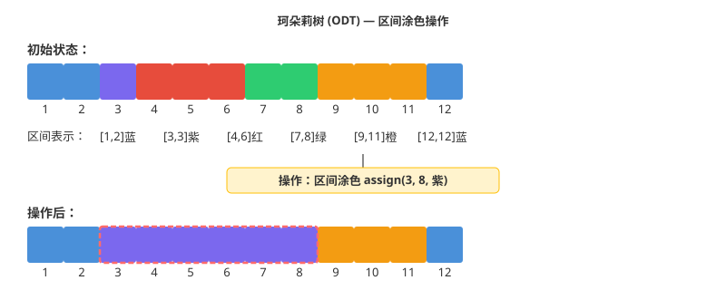

# 第十层 OI/ACM 竞赛：OI 竞赛高级数据结构

## 1. OI 竞赛级别高级数据结构

> 💡 **类比：瑞士军刀 vs 多功能工具包**
>
> 前几层的数据结构像是"瑞士军刀"——功能强大但相对通用。这一层的数据结构像是"专业工具包"：
> - **Link-Cut Tree**：专门处理动态树问题
> - **主席树**：专门处理历史版本查询
> - **莫队算法**：专门处理离线区间查询
> - **舞蹈链**：专门处理精确覆盖问题
>
> 每种工具都有特定的应用场景，掌握它们能让你在竞赛中"秒杀"特定类型的问题。

### 1.1 Link-Cut Tree (LCT)

> 💡 **类比：动态的家族族谱**
>
> 想象你要维护一个家族族谱，但经常有人：
> - 断绝关系（cut）
> - 认祖归宗（link）
> - 查询某条血脉链上的信息（path query）
>
> Link-Cut Tree 就是专门处理这种"动态树"问题的数据结构。


```python
class LCTNode:
    """LCT 节点"""
    def __init__(self, val=0):
        self.val = val
        self.ch = [0, 0]  # 左右儿子
        self.fa = 0       # 父亲
        self.rev = 0      # 翻转标记
        self.sum = val    # 维护的信息（如子树和）

class LinkCutTree:
    """
    Link-Cut Tree：动态树
    
    💡 类比：动态的家族族谱
    支持操作：
    - link(x, y): 连接两棵树
    - cut(x, y): 断开边
    - query(x, y): 查询路径信息
    - update(x, y): 修改路径信息
    
    核心思想：
    - 用 Splay 树维护每条"偏好链"
    - 通过 access 操作切换偏好链
    
    时间复杂度：
    - 所有操作：摊还 O(log n)
    
    应用：
    - 动态连通性
    - 动态树路径查询
    - 维护森林
    """
    def __init__(self, n):
        self.t = [LCTNode() for _ in range(n + 1)]
    
    def is_root(self, x):
        """判断是否为 Splay 的根"""
        f = self.t[x].fa
        return f == 0 or (self.t[f].ch[0] != x and self.t[f].ch[1] != x)
    
    def push_up(self, x):
        """上传信息"""
        self.t[x].sum = self.t[self.t[x].ch[0]].sum ^ self.t[self.t[x].ch[1]].sum ^ self.t[x].val
    
    def push_down(self, x):
        """下传标记"""
        if self.t[x].rev:
            self.t[x].ch[0], self.t[x].ch[1] = self.t[x].ch[1], self.t[x].ch[0]
            if self.t[x].ch[0]:
                self.t[self.t[x].ch[0]].rev ^= 1
            if self.t[x].ch[1]:
                self.t[self.t[x].ch[1]].rev ^= 1
            self.t[x].rev = 0
    
    def rotate(self, x):
        """Splay 旋转"""
        y = self.t[x].fa
        z = self.t[y].fa
        k = 1 if self.t[y].ch[1] == x else 0
        
        if not self.is_root(y):
            self.t[z].ch[1 if self.t[z].ch[1] == y else 0] = x
        self.t[x].fa = z
        
        self.t[y].ch[k] = self.t[x].ch[k ^ 1]
        if self.t[x].ch[k ^ 1]:
            self.t[self.t[x].ch[k ^ 1]].fa = y
        
        self.t[x].ch[k ^ 1] = y
        self.t[y].fa = x
        
        self.push_up(y)
        self.push_up(x)
    
    def splay(self, x):
        """Splay 操作"""
        # 先下传标记
        stk = []
        u = x
        stk.append(u)
        while not self.is_root(u):
            u = self.t[u].fa
            stk.append(u)
        while stk:
            self.push_down(stk.pop())
        
        while not self.is_root(x):
            y = self.t[x].fa
            z = self.t[y].fa
            if not self.is_root(y):
                if (self.t[y].ch[1] == x) ^ (self.t[z].ch[1] == y):
                    self.rotate(x)
                else:
                    self.rotate(y)
            self.rotate(x)
    
    def access(self, x):
        """Access 操作：将 x 到根的路径变为一条偏好链"""
        u = x
        y = 0
        while u:
            self.splay(u)
            self.t[u].ch[1] = y
            self.push_up(u)
            y = u
            u = self.t[u].fa
        self.splay(x)
    
    def make_root(self, x):
        """将 x 变为树根"""
        self.access(x)
        self.t[x].rev ^= 1
    
    def find_root(self, x):
        """找到 x 所在树的根"""
        self.access(x)
        while self.t[x].ch[0]:
            self.push_down(x)
            x = self.t[x].ch[0]
        self.splay(x)
        return x
    
    def link(self, x, y):
        """连接 x 和 y"""
        self.make_root(x)
        if self.find_root(y) != x:
            self.t[x].fa = y
    
    def cut(self, x, y):
        """断开 x 和 y"""
        self.make_root(x)
        if self.find_root(y) == x and self.t[y].fa == x and not self.t[y].ch[0]:
            self.t[y].fa = 0
            self.t[x].ch[1] = 0
            self.push_up(x)
    
    def query(self, x, y):
        """查询 x 到 y 路径上的信息"""
        self.make_root(x)
        self.access(y)
        return self.t[y].sum

# 示例
lct = LinkCutTree(5)
for i in range(1, 6):
    lct.t[i].val = i
    lct.push_up(i)

lct.link(1, 2)
lct.link(2, 3)
lct.link(3, 4)
lct.link(4, 5)

print(lct.query(1, 5))  # 1^2^3^4^5 = 1
lct.cut(3, 4)
print(lct.query(1, 3))  # 1^2^3 = 0
```

### 1.2 树链剖分 (HLD)

> 💡 **类比：把树"压平"**
>
> 想象你有一棵树，要在树上做路径查询。但线段树只能处理数组，怎么办？
> 树链剖分就是把树"压平"成数组，然后用线段树维护。


```python
class HLD:
    """
    树链剖分：将树路径转化为序列问题
    
    💡 类比：快递分拣
    - 想象一棵树是快递网络，每个节点是分拣中心
    - 树链剖分把"树上的路径"转化为"数组上的区间"
    - 然后可以用线段树/树状数组高效处理
    
    核心思想：
    - 重儿子：子树最大的儿子
    - 重链：从重儿子连成的链
    - 轻边：连接重链的边
    
    应用：
    - 树上路径求和/最值
    - 树上路径修改
    - LCA（最近公共祖先）
    
    时间复杂度：
    - 预处理：O(n)
    - 路径查询/修改：O(log²n)
    """
    def __init__(self, n, edges, values=None):
        self.n = n
        self.adj = [[] for _ in range(n + 1)]
        for u, v in edges:
            self.adj[u].append(v)
            self.adj[v].append(u)
        
        self.val = values or [0] * (n + 1)
        
        # 预处理
        self.parent = [0] * (n + 1)
        self.depth = [0] * (n + 1)
        self.sz = [1] * (n + 1)
        self.heavy_son = [0] * (n + 1)
        self.top = [0] * (n + 1)
        self.dfn = [0] * (n + 1)
        self.rnk = [0] * (n + 1)
        self.timer = 0
        
        # 第一次 DFS：计算父节点、深度、子树大小、重儿子
        self._dfs1(1, 0, 0)
        
        # 第二次 DFS：计算链顶、DFS 序
        self._dfs2(1, 1)
    
    def _dfs1(self, u, fa, d):
        """第一次 DFS"""
        self.parent[u] = fa
        self.depth[u] = d
        max_sz = 0
        
        for v in self.adj[u]:
            if v != fa:
                self._dfs1(v, u, d + 1)
                self.sz[u] += self.sz[v]
                if self.sz[v] > max_sz:
                    max_sz = self.sz[v]
                    self.heavy_son[u] = v
    
    def _dfs2(self, u, t):
        """第二次 DFS"""
        self.top[u] = t
        self.timer += 1
        self.dfn[u] = self.timer
        self.rnk[self.timer] = u
        
        if self.heavy_son[u]:
            self._dfs2(self.heavy_son[u], t)
        
        for v in self.adj[u]:
            if v != self.parent[u] and v != self.heavy_son[u]:
                self._dfs2(v, v)
    
    def lca(self, u, v):
        """求 LCA"""
        while self.top[u] != self.top[v]:
            if self.depth[self.top[u]] < self.depth[self.top[v]]:
                v = self.parent[self.top[v]]
            else:
                u = self.parent[self.top[u]]
        return u if self.depth[u] < self.depth[v] else v
    
    def query_path(self, u, v, seg_tree):
        """查询树上路径（配合线段树）"""
        res = 0
        while self.top[u] != self.top[v]:
            if self.depth[self.top[u]] >= self.depth[self.top[v]]:
                res += seg_tree.query(self.dfn[self.top[u]], self.dfn[u])
                u = self.parent[self.top[u]]
            else:
                res += seg_tree.query(self.dfn[self.top[v]], self.dfn[v])
                v = self.parent[self.top[v]]
        
        if self.depth[u] <= self.depth[v]:
            res += seg_tree.query(self.dfn[u], self.dfn[v])
        else:
            res += seg_tree.query(self.dfn[v], self.dfn[u])
        
        return res

# 示例
n = 7
edges = [(1, 2), (1, 3), (2, 4), (2, 5), (3, 6), (3, 7)]
values = [0, 1, 2, 3, 4, 5, 6, 7]

hld = HLD(n, edges, values)
print(f"LCA(4, 5) = {hld.lca(4, 5)}")  # 2
print(f"LCA(4, 6) = {hld.lca(4, 6)}")  # 1
```

### 1.3 可持久化线段树（主席树）

> 💡 **类比：时光机**
>
> 普通线段树只能看到当前状态，主席树可以回到任意历史版本。


```python
class PersistentSegmentTree:
    """
    可持久化线段树：保存线段树的每个历史版本
    
    💡 类比：时光机
    - 普通线段树：只能看到当前状态
    - 可持久化线段树：可以回到任意历史版本
    - 每次修改创建新版本，不破坏旧版本
    
    核心思想：
    - 路径复制：只复制被修改的路径上的节点
    - 共享节点：未修改的部分共享旧版本的节点
    
    应用：
    - 区间第 K 大（静态/动态）
    - 历史版本查询
    - 树上路径问题
    
    时间复杂度：
    - 查询：O(log n)
    - 修改：O(log n)
    - 空间复杂度：O(n log n)
    """
    def __init__(self, n):
        self.n = n
        self.roots = [0]  # 版本 0
        self.cnt = 0
        self.ls = [0] * (n * 20)  # 左儿子
        self.rs = [0] * (n * 20)  # 右儿子
        self.sum = [0] * (n * 20)  # 区间和
    
    def build(self, l, r):
        """建树"""
        self.cnt += 1
        rt = self.cnt
        if l == r:
            self.sum[rt] = 0
            return rt
        mid = (l + r) >> 1
        self.ls[rt] = self.build(l, mid)
        self.rs[rt] = self.build(mid + 1, r)
        self.sum[rt] = self.sum[self.ls[rt]] + self.sum[self.rs[rt]]
        return rt
    
    def update(self, pre_rt, l, r, pos, val):
        """单点修改（创建新版本）"""
        self.cnt += 1
        rt = self.cnt
        self.ls[rt] = self.ls[pre_rt]
        self.rs[rt] = self.rs[pre_rt]
        self.sum[rt] = self.sum[pre_rt] + val
        
        if l == r:
            return rt
        
        mid = (l + r) >> 1
        if pos <= mid:
            self.ls[rt] = self.update(self.ls[pre_rt], l, mid, pos, val)
        else:
            self.rs[rt] = self.update(self.rs[pre_rt], mid + 1, r, pos, val)
        
        return rt
    
    def query(self, rt, l, r, ql, qr):
        """区间查询"""
        if ql <= l and r <= qr:
            return self.sum[rt]
        
        mid = (l + r) >> 1
        res = 0
        if ql <= mid:
            res += self.query(self.ls[rt], l, mid, ql, qr)
        if qr > mid:
            res += self.query(self.rs[rt], mid + 1, r, ql, qr)
        return res

# 示例：区间第 K 大
def kth_smallest(arr, k):
    """
    静态区间第 K 小
    使用主席树维护值域
    """
    # 离散化
    sorted_arr = sorted(set(arr))
    rank = {v: i + 1 for i, v in enumerate(sorted_arr)}
    
    n = len(arr)
    pst = PersistentSegmentTree(len(sorted_arr))
    roots = [0] * (n + 1)
    roots[0] = pst.build(1, len(sorted_arr))
    
    # 逐个插入
    for i in range(n):
        roots[i + 1] = pst.update(roots[i], 1, len(sorted_arr), rank[arr[i]], 1)
    
    # 查询区间 [l, r] 的第 k 小
    def query_kth(l, r, k):
        return _query_kth(roots[l - 1], roots[r], 1, len(sorted_arr), k)
    
    def _query_kth(pre_rt, rt, l, r, k):
        if l == r:
            return sorted_arr[l - 1]
        mid = (l + r) >> 1
        left_sum = pst.sum[pst.ls[rt]] - pst.sum[pst.ls[pre_rt]]
        if k <= left_sum:
            return _query_kth(pst.ls[pre_rt], pst.ls[rt], l, mid, k)
        else:
            return _query_kth(pst.rs[pre_rt], pst.rs[rt], mid + 1, r, k - left_sum)
    
    return query_kth

# 示例
arr = [1, 5, 2, 6, 3, 7, 4]
query = kth_smallest(arr, 3)
print(query(2, 5, 3))  # 区间 [2, 5] 的第 3 小
```

### 1.4 莫队算法

> 💡 **类比：滑动窗口的升级版**
>
> 普通滑动窗口只能处理固定长度的区间，莫队算法可以处理任意长度的区间查询。


```python
from collections import defaultdict
import math

class MoAlgorithm:
    """
    莫队算法：离线处理区间查询
    
    💡 类比：滑动窗口的升级版
    - 普通滑动窗口：只能处理固定长度的区间
    - 莫队算法：可以处理任意长度的区间查询
    - 核心思想：合理安排查询顺序，减少区间端点移动
    
    核心思想：
    - 将查询按左端点分块
    - 块内按右端点排序
    - 维护当前区间的答案，通过移动端点更新
    
    应用：
    - 区间不同元素个数
    - 区间众数
    - 区间逆序对
    
    时间复杂度：O((n + q)√n)
    """
    def __init__(self, arr):
        self.arr = arr
        self.n = len(arr)
        self.block_size = int(math.sqrt(self.n))
    
    def query_distinct_elements(self, queries):
        """
        查询区间不同元素个数
        queries: [(l, r, idx), ...]
        """
        # 分块排序
        queries.sort(key=lambda q: (q[0] // self.block_size, 
                                     q[1] if (q[0] // self.block_size) % 2 == 0 else -q[1]))
        
        ans = [0] * len(queries)
        cur_l, cur_r = 0, -1
        cnt = defaultdict(int)
        distinct = 0
        
        for l, r, idx in queries:
            # 扩展右端点
            while cur_r < r:
                cur_r += 1
                if cnt[self.arr[cur_r]] == 0:
                    distinct += 1
                cnt[self.arr[cur_r]] += 1
            
            # 收缩左端点
            while cur_l > l:
                cur_l -= 1
                if cnt[self.arr[cur_l]] == 0:
                    distinct += 1
                cnt[self.arr[cur_l]] += 1
            
            # 收缩右端点
            while cur_r > r:
                if cnt[self.arr[cur_r]] == 1:
                    distinct -= 1
                cnt[self.arr[cur_r]] -= 1
                cur_r -= 1
            
            # 扩展左端点
            while cur_l < l:
                if cnt[self.arr[cur_l]] == 1:
                    distinct -= 1
                cnt[self.arr[cur_l]] -= 1
                cur_l += 1
            
            ans[idx] = distinct
        
        return ans

# 示例
arr = [1, 1, 2, 1, 3, 2, 3, 3]
queries = [
    (0, 3, 0),  # [1, 1, 2, 1] -> 2 种
    (1, 5, 1),  # [1, 2, 1, 3, 2] -> 3 种
    (2, 7, 2),  # [2, 1, 3, 2, 3, 3] -> 3 种
]

mo = MoAlgorithm(arr)
ans = mo.query_distinct_elements(queries)
print(ans)  # [2, 3, 3]
```

### 1.5 珂朵莉树 (ODT)

> 💡 **类比：区间涂色**
>
> 想象你有一排格子，经常要做"把区间 [l, r] 涂成颜色 c"的操作。



```python
class ODT:
    """
    珂朵莉树 (Old Driver Tree)
    
    💡 类比：区间涂色
    - 维护一系列"颜色相同"的连续区间
    - 支持区间赋值、区间求和等操作
    - 核心思想：用 set 维护区间，区间赋值时合并相同颜色的区间
    
    适用场景：
    - 有区间赋值操作
    - 数据随机（保证复杂度）
    
    时间复杂度：
    - 区间赋值：摊还 O(log n)
    - 其他操作：O(log n)
    """
    def __init__(self):
        self.intervals = set()  # (l, r, v)
    
    def add(self, l, r, v):
        """添加区间 [l, r]，值为 v"""
        self.intervals.add((l, r, v))
    
    def split(self, pos):
        """将包含 pos 的区间分裂"""
        # 找到包含 pos 的区间
        for l, r, v in list(self.intervals):
            if l <= pos <= r:
                if l == pos:
                    return (l, r, v)
                self.intervals.remove((l, r, v))
                self.intervals.add((l, pos - 1, v))
                self.intervals.add((pos, r, v))
                return (pos, r, v)
        return None
    
    def assign(self, l, r, v):
        """区间赋值"""
        itr = self.split(r + 1)
        itl = self.split(l)
        
        # 删除 [l, r] 内的所有区间
        to_remove = []
        for interval in self.intervals:
            if l <= interval[0] and interval[1] <= r:
                to_remove.append(interval)
        
        for interval in to_remove:
            self.intervals.remove(interval)
        
        self.intervals.add((l, r, v))
    
    def query_sum(self, l, r):
        """区间求和"""
        total = 0
        for interval_l, interval_r, v in self.intervals:
            if interval_r < l or interval_l > r:
                continue
            # 计算交集
            intersect_l = max(interval_l, l)
            intersect_r = min(interval_r, r)
            total += v * (intersect_r - intersect_l + 1)
        return total

# 示例
odt = ODT()
odt.add(1, 10, 1)
odt.assign(3, 7, 2)
print(odt.query_sum(1, 10))  # 1*2 + 2*5 + 1*3 = 17
```

### 1.6 舞蹈链 (Dancing Links X)

> 💡 **类比：解数独的魔法**
>
> 舞蹈链是解决"精确覆盖问题"的神器。


```python
class DancingLinksX:
    """
    舞蹈链 (Dancing Links X)
    
    💡 类比：解数独的魔法
    - 精确覆盖问题：从集合中选择若干子集，使得每个元素恰好被覆盖一次
    - 舞蹈链用双向十字链表高效实现回溯
    
    应用：
    - 数独
    - N 皇后
    - 精确覆盖问题
    
    时间复杂度：指数级（但实际很快）
    """
    def __init__(self, n, m):
        self.n = n  # 行数
        self.m = m  # 列数
        self.head = [0] * (n + 1)  # 每行的头节点
        self.L = [0] * (n * m + 10)
        self.R = [0] * (n * m + 10)
        self.U = [0] * (n * m + 10)
        self.D = [0] * (n * m + 10)
        self.col = [0] * (n * m + 10)
        self.row = [0] * (n * m + 10)
        self.cnt = m  # 节点计数器（0~m 是列头）
        
        # 初始化列头
        for i in range(m + 1):
            self.R[i] = i + 1
            self.L[i + 1] = i
        self.R[m] = 0
        self.L[0] = m
    
    def link(self, r, c):
        """在 (r, c) 位置添加节点"""
        self.cnt += 1
        self.row[self.cnt] = r
        self.col[self.cnt] = c
        
        # 插入到列中
        self.U[self.cnt] = self.U[c]
        self.D[self.cnt] = c
        self.D[self.U[c]] = self.cnt
        self.U[c] = self.cnt
        
        # 插入到行中
        if self.head[r] == 0:
            self.head[r] = self.cnt
            self.L[self.cnt] = self.R[self.cnt] = self.cnt
        else:
            self.R[self.cnt] = self.R[self.head[r]]
            self.L[self.cnt] = self.head[r]
            self.L[self.R[self.head[r]]] = self.cnt
            self.R[self.head[r]] = self.cnt
    
    def remove(self, c):
        """删除列 c"""
        self.R[self.L[c]] = self.R[c]
        self.L[self.R[c]] = self.L[c]
    
    def resume(self, c):
        """恢复列 c"""
        self.R[self.L[c]] = c
        self.L[self.R[c]] = c
    
    def dance(self, dep):
        """DLX 求解"""
        if self.R[0] == 0:
            return True
        
        # 选择元素最少的列
        c = self.R[0]
        min_cnt = float('inf')
        for i in self.R[0:]:
            if i == 0:
                break
            cnt = 0
            j = self.D[i]
            while j != i:
                cnt += 1
                j = self.D[j]
            if cnt < min_cnt:
                min_cnt = cnt
                c = i
        
        # 枚举该列的所有行
        j = self.D[c]
        while j != c:
            # 选择第 j 行
            ans[dep] = self.row[j]
            
            # 删除冲突的列
            to_remove = []
            k = self.R[j]
            while k != j:
                self.remove(self.col[k])
                to_remove.append(self.col[k])
                k = self.R[k]
            
            if self.dance(dep + 1):
                return True
            
            # 恢复
            for c in to_remove:
                self.resume(c)
            
            j = self.D[j]
        
        return False

# 示例：解数独（简化版）
# 数独可以转化为精确覆盖问题
# 约束：每个格子有数字、每行每列每个宫都有 1-9
```

### 1.7 练习题

1. **实现 LCT**：维护动态树的连通性
2. **树链剖分 + 线段树**：树上路径求和
3. **主席树**：静态区间第 K 大
4. **莫队算法**：区间不同元素个数
5. **思考题**：为什么珂朵莉树需要"数据随机"才能保证复杂度？

---

## 参考资源

- [Link-Cut Tree - Wikipedia](https://en.wikipedia.org/wiki/Link-cut_tree)
- [可持久化线段树（主席树） - OI Wiki](https://oi-wiki.org/ds/persistent-seg/)
- [莫队算法 - OI Wiki](https://oi-wiki.org/misc/mo-algo/)
- [珂朵莉树（ODT） - OI Wiki](https://oi-wiki.org/misc/odt/)
- [舞蹈链（DLX） - OI Wiki](https://oi-wiki.org/search/dlx/)
- [树链剖分 - OI Wiki](https://oi-wiki.org/graph/hld/)
